                 

### 引言

#### 1.1 为什么研究多模态大模型？

在当今信息时代，数据量呈爆炸式增长，而且数据的类型也越来越多样化。从传统的文本数据到图像、音频、视频等多模态数据，数据的多样性为人工智能（AI）的发展提供了丰富的素材。多模态大模型（Multimodal Large Models）作为近年来AI领域的一个重要研究方向，旨在利用不同模态的数据进行有效融合，以提升模型在复杂任务中的表现。那么，为什么多模态大模型成为了研究的热点呢？

首先，多模态大模型能够充分利用各种模态的信息，实现跨模态的数据融合，从而在任务处理上具有更强的鲁棒性和泛化能力。例如，在语音识别任务中，除了使用文本信息，还可以利用语音的声学特征，这样能够显著提高识别的准确性。其次，多模态大模型能够应对现实生活中复杂场景的需求，例如在医疗诊断中，结合医学影像、文本病历等多模态数据，可以帮助医生做出更准确、全面的诊断。此外，多模态大模型在智能交互、自动驾驶、虚拟现实等领域也具有广泛的应用前景。

#### 1.2 多模态大模型在当前技术环境中的重要性

随着深度学习技术的发展，神经网络架构越来越复杂，计算能力越来越强大，这使得多模态大模型成为可能。当前，计算硬件的进步（如GPU、TPU等专用计算设备）和数据存储技术的提升（如分布式存储系统、大数据处理平台等）为多模态大模型的训练和应用提供了强有力的支持。此外，开源深度学习框架（如TensorFlow、PyTorch等）的普及使得研究人员和开发者能够方便地实现和优化多模态大模型。

#### 1.3 文章的结构与内容

本文将系统地介绍多模态大模型的技术原理与实战。首先，在第一部分“多模态大模型概述”中，我们将定义多模态数据与多模态大模型，并探讨其优势与挑战。接着，第二部分“多模态大模型的技术原理”将详细讲解深度学习基础、自然语言处理和计算机视觉技术，并介绍多模态神经网络架构和训练方法。

第三部分“多模态大模型的应用场景”将探讨多模态大模型在语音识别、视觉与听觉融合等领域的应用。随后，第四部分“多模态大模型的优化与优化策略”将讨论模型压缩与加速、模型解释性与可解释性等优化策略。

最后，第五部分“多模态大模型的项目实战”将介绍两个实际项目案例，展示如何开发和优化多模态大模型。文章的结尾将总结多模态大模型的研究方向、社会影响以及未来发展趋势。

通过本文的详细讲解，读者将能够全面了解多模态大模型的技术原理、应用场景和实战技巧，为今后的研究和工作提供有力支持。

#### 1.4 预期读者收益

本文旨在为AI领域的研究人员和开发者提供一份全面而深入的多模态大模型指南。通过本文的阅读，读者可以预期获得以下收益：

1. **深入了解多模态大模型的概念和背景**：读者将掌握多模态数据与多模态大模型的基本概念，理解其在AI领域中的重要性。
2. **理解核心原理和架构**：通过本文的讲解，读者将熟悉多模态数据融合技术、多模态神经网络架构和训练方法，并能够绘制出核心概念与架构的Mermaid流程图。
3. **掌握多模态大模型的实现技巧**：本文将详细阐述核心算法原理，使用伪代码进行讲解，并提供数学模型和公式的详细说明与举例。
4. **了解实际应用场景**：读者将了解多模态大模型在语音识别、视觉与听觉融合等领域的应用，并学习如何优化和部署这些模型。
5. **实战项目经验**：通过本文提供的项目案例，读者将能够学习如何开发和优化多模态大模型，获得实际项目操作的经验。
6. **洞察未来趋势**：本文还将探讨多模态大模型的研究方向和社会影响，帮助读者了解这一领域的发展方向和潜在挑战。

总之，本文将使读者具备全面的多模态大模型知识体系，为未来的研究和应用提供坚实的理论基础和实践指导。

### 第一部分：多模态大模型概述

#### 第1章：多模态大模型的概念与背景

##### 1.1 多模态数据与多模态大模型概述

多模态数据（Multimodal Data）是指由两种或两种以上不同类型的感知数据组成的集合，这些感知数据可以是文本、图像、音频、视频等。例如，一个视频包含图像和音频两种模态，而一个智能会议系统可能同时处理文本、图像和音频三种模态的数据。

多模态大模型（Multimodal Large Models）是深度学习领域的一种模型，其目的是通过整合不同模态的数据，以实现更高效的任务处理和更准确的预测。多模态大模型的核心思想是利用各模态数据中的互补信息，从而在复杂的任务中取得更好的表现。这种模型在自然语言处理、计算机视觉和语音识别等领域具有重要应用。

多模态大模型的基本定义可以概括为：

- **数据输入**：模型接收多种类型的输入数据，如文本、图像、音频等。
- **数据融合**：通过特定的算法将多种模态的数据进行有效融合。
- **任务输出**：模型根据融合后的数据输出预测结果或完成任务。

多模态大模型的研究背景：

多模态大模型的研究源于对现实世界复杂任务需求的不断增长。例如，在医疗诊断中，医生需要综合考虑患者的医学影像、病历文本和生命体征等多种信息；在智能交互中，系统需要同时处理用户的语音、文字和面部表情等多模态数据。

随着深度学习技术的进步，特别是在图像识别、语音识别和自然语言处理等领域取得了显著的成果，研究人员开始探索如何将这些技术整合起来，形成多模态大模型。这种模型不仅可以处理单一模态的数据，还能够通过跨模态的数据融合实现更全面的任务理解和更准确的预测。

##### 1.2 多模态大模型的优势与挑战

**多模态大模型的优势：**

1. **增强信息丰富性**：多模态大模型能够整合来自不同模态的数据，从而提供更丰富的信息，有助于提高模型的性能和鲁棒性。
2. **提升任务表现**：通过跨模态的数据融合，模型在复杂任务中能够更好地理解任务背景和上下文，从而提升任务表现。
3. **增强泛化能力**：多模态大模型能够利用各模态数据中的互补信息，从而在遇到未见过的新数据时表现出更强的泛化能力。
4. **多样化应用场景**：多模态大模型在医疗诊断、智能交互、自动驾驶等众多领域具有广泛的应用潜力。

**多模态大模型面临的挑战：**

1. **数据不一致性**：不同模态的数据在时间同步、空间对齐等方面存在不一致性，给数据融合带来困难。
2. **计算资源消耗**：多模态大模型的训练和推理需要大量的计算资源，尤其是在处理大规模数据时，资源消耗巨大。
3. **数据标注问题**：多模态数据通常需要大量的标注数据，但获取标注数据成本高昂，且标注过程复杂。
4. **模型解释性**：多模态大模型的复杂性使得其解释性成为一个挑战，难以理解模型的具体决策过程。

**多模态大模型的发展趋势：**

1. **算法优化**：研究人员致力于开发更高效的多模态数据融合算法，以降低计算资源消耗。
2. **模型压缩**：通过模型压缩技术，如蒸馏、剪枝等，实现多模态大模型的压缩和加速，以便在实际应用中部署。
3. **跨学科合作**：多模态大模型的发展需要跨学科的合作，例如结合计算机视觉、自然语言处理和医学领域的知识，推动模型在更多领域的应用。
4. **伦理与隐私**：随着多模态大模型的广泛应用，其伦理和隐私问题也日益凸显，需要制定相应的规范和标准，确保数据安全和用户隐私。

通过本章的介绍，读者将了解多模态大模型的基本概念、优势与挑战，以及其发展背景和趋势。接下来，我们将进一步深入探讨多模态大模型的核心原理和技术基础。

### 第二部分：多模态大模型的技术原理

#### 第2章：多模态大模型的核心原理

##### 2.1 多模态数据融合技术

多模态数据融合技术是构建多模态大模型的基础，其目的是将来自不同模态的数据进行有效整合，以提升模型的性能和鲁棒性。多模态数据融合技术主要包括数据预处理、特征提取和多模态数据融合方法。

**数据预处理**

数据预处理是多模态大模型构建的第一步，其目标是确保各模态数据的一致性和兼容性。具体步骤包括：

1. **时间同步**：不同模态的数据可能在时间上存在不一致，例如图像和音频的帧率不同。因此，需要通过时间同步算法确保各模态数据在时间轴上的对齐。
2. **空间对齐**：对于图像和视频等视觉模态，需要通过图像配准算法将不同视角或不同传感器捕获的图像对齐到同一空间坐标系。
3. **数据清洗**：去除噪声和缺失数据，确保输入数据的准确性和完整性。

**特征提取**

特征提取是从原始数据中提取出具有代表性的特征，用于后续的数据融合和模型训练。不同模态的数据需要提取不同类型的特征：

1. **文本特征**：常见的文本特征提取方法包括词袋模型（Bag of Words, BoW）和词嵌入（Word Embedding）。词嵌入方法如Word2Vec、GloVe等能够将文本词转化为固定大小的向量，便于与图像、音频特征进行融合。
2. **图像特征**：常用的图像特征提取方法包括基于深度学习的卷积神经网络（Convolutional Neural Network, CNN）。例如，VGG、ResNet等模型能够提取出图像的高层次特征，用于后续的多模态融合。
3. **音频特征**：音频特征提取包括声学特征和音乐特征。常见的声学特征提取方法有梅尔频率倒谱系数（Mel-Frequency Cepstral Coefficients, MFCC）和短时傅里叶变换（Short-Time Fourier Transform, STFT）。音乐特征提取则涉及音高、节奏和情感等特征。

**多模态数据融合方法**

多模态数据融合方法分为两类：早期融合和后期融合。

1. **早期融合（Early Fusion）**：早期融合在特征提取阶段就将不同模态的数据进行融合，形成统一的高维特征向量。常见的早期融合方法有：

   - **和法融合**：将各模态的特征向量相加，形成新的特征向量。
   - **加权融合**：根据各模态特征的重要程度，为每个模态的特征向量分配不同的权重，然后进行加权求和。
   - **对数融合**：将各模态的特征向量进行对数变换，然后进行融合。

2. **后期融合（Late Fusion）**：后期融合在特征提取之后将不同模态的特征向量分别输入到独立的模型中进行处理，最后将各模型的输出进行融合。常见的后期融合方法有：

   - **投票法**：将各模态的模型输出进行投票，选择投票结果最多的类别作为最终输出。
   - **特征级融合**：将各模态的模型输出进行特征级的拼接，形成新的特征向量，然后输入到另一个融合模型中进行分类或预测。
   - **深度级融合**：通过构建深度学习网络，将各模态的模型输出作为网络的输入层，实现深度级的融合。

多模态数据融合技术是构建多模态大模型的关键步骤，通过有效的数据融合，能够充分利用各模态数据的互补信息，从而提高模型的性能和泛化能力。

##### 2.2 多模态神经网络架构

多模态神经网络架构是构建多模态大模型的核心，其目的是通过神经网络的结构和算法实现不同模态数据的有效融合。常见的多模态神经网络架构包括单模态网络融合、双模态网络融合和多模态网络融合。

**单模态网络融合**

单模态网络融合是指在神经网络的不同层中将不同模态的数据进行融合。常见的单模态网络融合方法有：

1. **多层感知机（Multilayer Perceptron, MLP）**：在神经网络的不同层中，通过全连接层将不同模态的数据进行融合。
2. **卷积神经网络（Convolutional Neural Network, CNN）**：在图像特征提取层和文本特征提取层之间添加卷积层，实现图像和文本数据的融合。
3. **递归神经网络（Recurrent Neural Network, RNN）**：通过嵌入层将文本数据和序列数据进行融合，然后通过RNN网络进行特征提取和融合。

**双模态网络融合**

双模态网络融合是指在神经网络中同时处理两种模态的数据，常见的双模态网络融合方法有：

1. **编码器-解码器（Encoder-Decoder）架构**：通过编码器分别处理文本和图像数据，然后通过解码器将两种模态的数据进行融合。
2. **图神经网络（Graph Neural Network, GNN）**：利用图神经网络处理图像和文本数据之间的关系，通过图结构实现双模态的融合。

**多模态网络融合**

多模态网络融合是指在神经网络中同时处理多种模态的数据，常见的多模态网络融合方法有：

1. **混合编码器（Hybrid Encoder）架构**：通过多个编码器分别处理不同模态的数据，然后将各编码器的输出进行拼接，形成统一的高维特征向量。
2. **多模态卷积神经网络（Multimodal CNN）**：在神经网络的不同卷积层中同时处理多种模态的数据，通过卷积操作实现多模态的融合。
3. **多模态循环神经网络（Multimodal RNN）**：通过多个RNN单元分别处理不同模态的数据，然后将各RNN单元的输出进行融合。

以下是一个典型的多模态神经网络架构的Mermaid流程图：

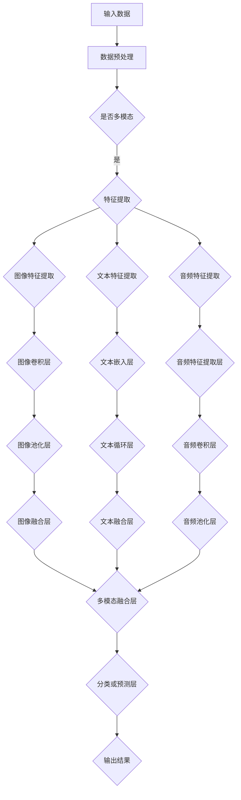

多模态神经网络架构通过不同层次的融合操作，能够实现多种模态数据的有效整合，从而提高模型的性能和泛化能力。

##### 2.3 多模态大模型的训练方法

多模态大模型的训练方法包括大规模预训练、微调与迁移学习，以及模型优化与调参技巧。这些方法旨在通过有效的训练策略提高模型的性能和泛化能力。

**大规模预训练**

大规模预训练（Pre-training）是指利用大规模数据集对模型进行初始训练，使其在大规模数据上获得一定的泛化能力。常见的预训练方法有：

1. **自监督学习（Self-supervised Learning）**：自监督学习利用未标注的数据进行训练，通过预测数据中的某些部分（如图像中的标签、文本中的单词）来学习特征表示。常见的自监督学习方法包括自动编码器（Autoencoder）、预测模型（Predictor Model）等。
2. **预训练-微调（Pre-training and Fine-tuning）**：在预训练阶段，模型在大规模数据集上进行无监督训练，然后在特定任务上进行有监督的微调。预训练阶段能够使模型在大规模数据上获得丰富的特征表示，从而在微调阶段能够快速适应特定任务。
3. **多任务学习（Multi-task Learning）**：通过同时训练多个相关任务，模型能够学习到更通用的特征表示，从而提高在单一任务上的性能。

**微调与迁移学习**

微调（Fine-tuning）与迁移学习（Transfer Learning）是利用预训练模型在特定任务上进行优化和改进的方法。

1. **微调**：微调是指利用预训练模型在特定任务上进行有监督训练，通过调整模型的部分参数来适应新的任务。微调的主要优点是能够利用预训练模型在大规模数据上学习的通用特征，从而在新的任务上快速获得良好的性能。
2. **迁移学习**：迁移学习是指将预训练模型在不同任务上的知识迁移到新的任务。常见的迁移学习策略包括特征迁移（Feature Transfer）和模型迁移（Model Transfer）。特征迁移是指将预训练模型的特征提取部分应用于新的任务，而模型迁移则是将整个预训练模型应用于新的任务。

**模型优化与调参技巧**

模型优化与调参技巧是提高多模态大模型性能的关键。以下是一些常见的优化和调参方法：

1. **优化算法**：常见的优化算法包括随机梯度下降（Stochastic Gradient Descent, SGD）、Adam优化器等。选择合适的优化算法可以提高模型的收敛速度和最终性能。
2. **学习率调度**：学习率调度是指通过调整学习率来控制模型的收敛过程。常见的方法有固定学习率、学习率衰减、学习率预热等。
3. **正则化**：正则化是通过引入额外的损失函数或限制模型参数的方法，防止模型过拟合。常见的正则化方法有L1正则化、L2正则化、Dropout等。
4. **模型压缩与加速**：通过模型压缩技术（如蒸馏、剪枝等）和硬件加速技术（如GPU、TPU等），可以显著提高模型的推理速度和效率。

以下是一个简化的多模态大模型训练过程的伪代码：

```python
# 多模态大模型训练伪代码
def train_multimodal_model(data_loader, model, optimizer, loss_function):
    model.train()  # 设置模型为训练模式
    for data in data_loader:
        inputs = prepare_inputs(data)
        labels = prepare_labels(data)
        optimizer.zero_grad()  # 清空梯度
        outputs = model(inputs)
        loss = loss_function(outputs, labels)
        loss.backward()  # 反向传播
        optimizer.step()  # 更新参数
    return model
```

通过大规模预训练、微调与迁移学习，以及模型优化与调参技巧，多模态大模型能够在各种任务上获得优秀的性能和泛化能力。

#### 第3章：多模态大模型的技术基础

##### 3.1 深度学习基础

深度学习（Deep Learning）是人工智能领域的一个重要分支，它通过构建深度神经网络来模拟人脑的学习过程，从而实现自动特征提取和模式识别。深度学习的基础包括神经网络的结构、训练方法和优化算法。

**神经网络的基本结构**

神经网络（Neural Network）由多个神经元（Neurons）和连接（Connections）组成。每个神经元接收来自其他神经元的输入，并通过激活函数进行非线性变换，最后产生输出。神经元的连接强度用权重（Weights）表示，可以通过学习过程进行调整。

一个基本的神经网络通常包括以下几个部分：

1. **输入层（Input Layer）**：接收外部输入数据，每个输入数据对应一个神经元。
2. **隐藏层（Hidden Layers）**：一个或多个隐藏层，每个隐藏层包含多个神经元。隐藏层负责对输入数据进行特征提取和变换。
3. **输出层（Output Layer）**：产生最终输出结果，用于分类、回归等任务。

**神经网络的结构与训练**

神经网络的训练目标是调整网络中的权重，使其在给定输入数据时产生期望的输出。训练过程主要包括以下几个步骤：

1. **前向传播（Forward Propagation）**：输入数据通过网络的每一层，直到输出层，计算输出结果。
2. **计算损失（Compute Loss）**：将输出结果与期望结果进行比较，计算损失值，常用的损失函数有均方误差（MSE）、交叉熵（Cross-Entropy）等。
3. **反向传播（Backpropagation）**：通过反向传播算法，将损失值反向传播到网络的每一层，计算每个权重的梯度。
4. **参数更新（Update Parameters）**：使用梯度下降（Gradient Descent）或其他优化算法更新网络权重，减小损失值。

**深度学习优化算法**

深度学习的优化算法用于调整网络权重，以提高模型的性能。常见的优化算法包括：

1. **随机梯度下降（Stochastic Gradient Descent, SGD）**：每次迭代使用一个样本的梯度进行参数更新，计算速度快但收敛速度慢。
2. **批量梯度下降（Batch Gradient Descent）**：每次迭代使用所有样本的梯度进行参数更新，收敛速度较慢但能避免梯度消失问题。
3. **Adam优化器（Adam Optimizer）**：结合SGD和批量梯度下降的优点，自适应调整学习率，收敛速度快。

以下是一个简化的神经网络训练过程的伪代码：

```python
# 神经网络训练伪代码
def train_neural_network(train_loader, model, criterion, optimizer, num_epochs):
    model.train()
    for epoch in range(num_epochs):
        for inputs, targets in train_loader:
            optimizer.zero_grad()
            outputs = model(inputs)
            loss = criterion(outputs, targets)
            loss.backward()
            optimizer.step()
        print(f'Epoch [{epoch+1}/{num_epochs}], Loss: {loss.item():.4f}')
    return model
```

通过深度学习基础的知识，我们可以更好地理解和实现多模态大模型。

##### 3.2 自然语言处理技术

自然语言处理（Natural Language Processing, NLP）是人工智能的一个重要分支，它涉及到机器与人类语言之间的互动，包括语言理解、语言生成和语言翻译等任务。NLP技术在多模态大模型中扮演着至关重要的角色，因为文本数据通常是多模态数据的一部分。

**词嵌入与序列模型**

词嵌入（Word Embedding）是将单词映射到固定大小的向量空间，以表示单词的语义信息。常见的词嵌入方法有Word2Vec、GloVe等。Word2Vec通过训练神经网络模型来预测相邻单词的概率，从而学习得到每个单词的向量表示。GloVe（Global Vectors for Word Representation）则基于词频统计和词共现信息，学习得到每个单词的向量表示。

序列模型（Sequence Model）是处理序列数据（如文本、语音）的神经网络模型，常见的序列模型有循环神经网络（Recurrent Neural Network, RNN）和其变体长短期记忆网络（Long Short-Term Memory, LSTM）和门控循环单元（Gated Recurrent Unit, GRU）。RNN通过循环结构来处理序列数据，但存在梯度消失和梯度爆炸的问题。LSTM和GRU通过引入门控机制来解决这些问题，使得模型能够更好地捕捉序列中的长期依赖关系。

**注意力机制与编码器-解码器架构**

注意力机制（Attention Mechanism）是一种在序列处理任务中提高模型性能的关键技术。注意力机制通过计算不同位置之间的相关性，使模型能够关注重要的信息，从而提高模型的表示能力。在机器翻译、文本生成等任务中，注意力机制被广泛应用于编码器-解码器（Encoder-Decoder）架构中。

编码器-解码器架构由编码器（Encoder）和解码器（Decoder）组成。编码器将输入序列编码成一个固定长度的上下文向量，解码器则利用这个上下文向量生成输出序列。在编码器-解码器架构中，注意力机制可以用来计算编码器输出的上下文向量，帮助解码器更好地理解输入序列的语义信息。

以下是一个简化的编码器-解码器架构的Mermaid流程图：

```mermaid
graph TD
A[输入序列] --> B[编码器]
B --> C{编码器输出}
C --> D[解码器]
D --> E[输出序列]
D --> F{上下文向量}
F --> G{注意力权重}
G --> H[更新解码器状态]
H --> I{生成输出词]
```

通过自然语言处理技术，我们可以更好地理解和处理多模态大模型中的文本数据。

##### 3.3 计算机视觉技术

计算机视觉（Computer Vision）是人工智能领域的一个重要分支，旨在使计算机能够像人类一样理解和解释视觉信息。计算机视觉技术在多模态大模型中发挥着重要作用，因为图像和视频数据是多模态数据的重要组成部分。

**卷积神经网络与视觉特征提取**

卷积神经网络（Convolutional Neural Network, CNN）是计算机视觉领域的核心技术，它通过卷积层提取图像特征，并通过池化层减小特征图的尺寸，从而提高模型的计算效率。CNN的基本结构包括卷积层、激活函数、池化层和全连接层。卷积层通过卷积运算提取图像的特征，激活函数引入非线性变换，池化层减小特征图的尺寸，全连接层将特征映射到输出结果。

视觉特征提取是计算机视觉的关键步骤，通过提取图像的高层次特征，可以更好地理解图像内容。常见的视觉特征提取方法有VGG、ResNet等。VGG通过堆叠多个卷积层和池化层，提取图像的层次特征。ResNet通过引入残差连接，解决深度神经网络训练中的梯度消失问题，从而提高模型的深度和性能。

以下是一个简化的卷积神经网络结构的Mermaid流程图：

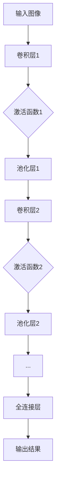

**图像分类与目标检测**

图像分类（Image Classification）是计算机视觉中的一个基本任务，旨在将图像分类到预定义的类别中。常见的图像分类模型有AlexNet、VGG、ResNet等。这些模型通过在图像上滑动窗口，提取局部特征，然后输入到全连接层进行分类。

目标检测（Object Detection）是计算机视觉中的另一个重要任务，旨在识别图像中的多个目标，并定位其位置。常见的目标检测模型有YOLO、Faster R-CNN等。YOLO（You Only Look Once）通过将图像划分为多个网格，在每个网格内预测目标的类别和位置。Faster R-CNN（Region-based Convolutional Neural Network）通过区域提议网络（Region Proposal Network, RPN）生成区域提议，然后对每个提议区域进行分类和定位。

以下是一个简化的目标检测模型的Mermaid流程图：

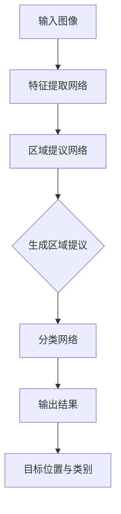

**增强现实与虚拟现实**

增强现实（Augmented Reality, AR）和虚拟现实（Virtual Reality, VR）是计算机视觉技术的应用领域，旨在通过计算机生成虚拟环境和真实环境进行交互。AR通过在真实环境中叠加虚拟物体，增强用户的感知体验。常见的AR应用有手机APP中的滤镜、虚拟试衣等。VR则通过头戴显示器（Head-Mounted Display, HMD）生成沉浸式的虚拟环境，让用户感受到身临其境的体验。常见的VR应用有游戏、虚拟旅游等。

以下是一个简化的增强现实系统的Mermaid流程图：

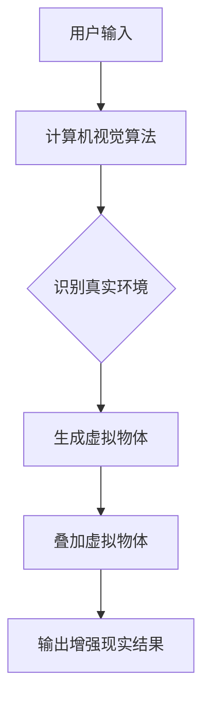

通过计算机视觉技术，我们可以更好地理解和处理多模态大模型中的图像和视频数据。

#### 第4章：多模态大模型的应用场景

##### 4.1 语音识别与合成

语音识别（Speech Recognition）和语音合成（Speech Synthesis）是多模态大模型在自然语言处理中的重要应用场景。语音识别的目标是将语音信号转换为文本，而语音合成的目标是根据文本生成自然流畅的语音。

**语音信号的预处理与特征提取**

语音识别的第一步是语音信号的预处理和特征提取。预处理包括去噪、归一化和增强等步骤。去噪通过去除语音信号中的噪声，提高语音质量。归一化通过调整语音信号的振幅和频率，使其适应后续的处理。增强则通过提高语音信号的可听度，提高识别准确性。

特征提取是从语音信号中提取出具有代表性的特征，用于后续的模型训练和预测。常用的语音特征提取方法有梅尔频率倒谱系数（Mel-Frequency Cepstral Coefficients, MFCC）和感知线性预测系数（Perceptual Linear Prediction, PLP）。MFCC通过将频率信息转换为时间域特征，能够较好地捕捉语音的共振峰特性。PLP则通过模拟人类听觉系统，提取出与人类听觉相关的特征。

以下是一个简化的语音特征提取过程的Mermaid流程图：

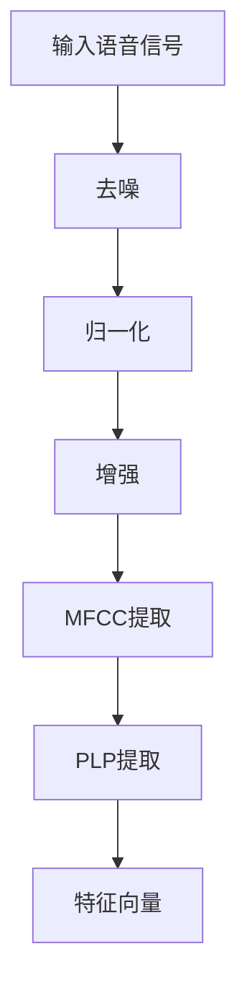

**语音识别与合成的神经网络模型**

语音识别和合成的神经网络模型可以分为两个阶段：声学模型和语言模型。声学模型负责从语音信号中提取出与文本相关的特征，而语言模型则负责将提取到的特征映射到相应的文本。

声学模型常用的神经网络模型有卷积神经网络（Convolutional Neural Network, CNN）和递归神经网络（Recurrent Neural Network, RNN）。CNN通过卷积操作提取语音信号的高层次特征，而RNN通过循环结构处理语音序列中的依赖关系。

语言模型常用的神经网络模型有循环神经网络（Recurrent Neural Network, RNN）和变换器（Transformer）。RNN能够处理序列数据，但存在梯度消失和梯度爆炸的问题。Transformer通过自注意力机制，能够更好地捕捉序列中的依赖关系，并且在大规模数据集上表现出色。

以下是一个简化的语音识别与合成的神经网络模型的Mermaid流程图：

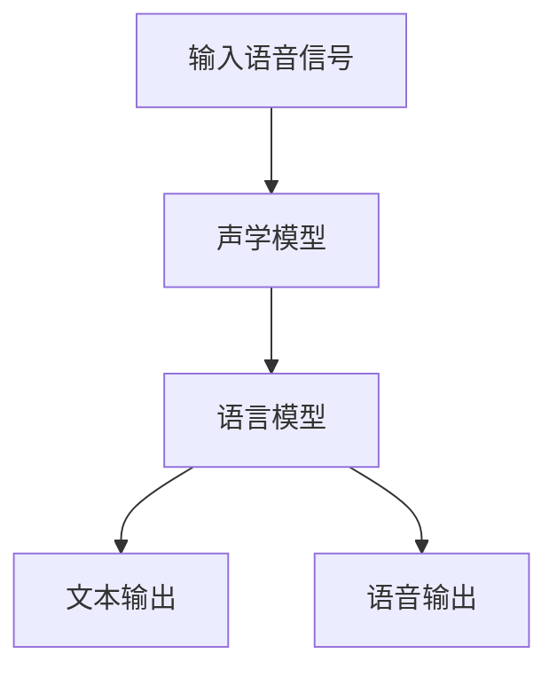

**语音识别与合成的应用案例**

语音识别和合成的应用场景非常广泛，包括智能客服、智能语音助手、语音控制等。以下是一些典型的应用案例：

- **智能客服**：通过语音识别技术，将用户的语音输入转换为文本，然后利用自然语言处理技术理解用户的意图，并提供相应的服务。
- **智能语音助手**：如苹果的Siri、亚马逊的Alexa等，通过语音识别和合成技术，实现与用户的语音交互，提供信息查询、日程管理、智能家居控制等服务。
- **语音控制**：通过语音识别技术，实现语音控制智能家居设备，如智能灯光、智能电视等。

以下是一个简化的智能客服系统的Mermaid流程图：

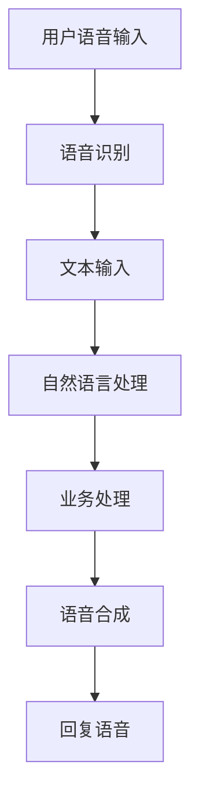

通过语音识别与合成技术，多模态大模型能够实现语音到文本的转换，以及文本到语音的转换，从而提供智能交互体验。

##### 4.2 视觉与听觉融合

视觉与听觉融合（Visual-Audio Fusion）是多模态大模型在智能交互和智能系统中的重要应用场景。视觉与听觉融合的目标是通过整合视觉和听觉数据，提升系统的感知能力和决策能力。

**视觉与听觉数据融合的方法**

视觉与听觉数据融合的方法可以分为三类：早期融合、后期融合和深度融合。

- **早期融合**：在特征提取阶段将视觉和听觉数据融合。常见的早期融合方法有和法融合、加权融合等。
- **后期融合**：在特征提取之后将视觉和听觉数据融合。常见的后期融合方法有投票法、特征级融合等。
- **深度融合**：通过构建深度学习网络，在神经网络的不同层将视觉和听觉数据融合。常见的深度融合方法有编码器-解码器架构、多模态卷积神经网络等。

以下是一个简化的视觉与听觉数据融合过程的Mermaid流程图：

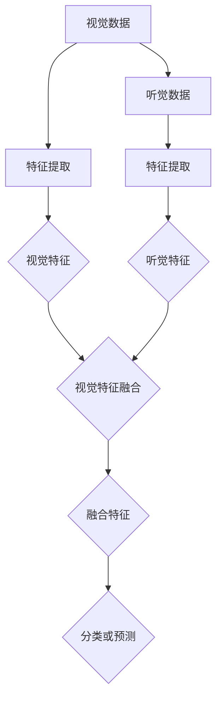

**视觉与听觉融合的应用**

视觉与听觉融合的应用场景包括智能监控、人机交互、智能驾驶等。

- **智能监控**：通过整合视频监控和音频数据，智能监控系统可以更准确地识别异常行为，提高监控效果。
- **人机交互**：通过视觉与听觉数据的融合，智能交互系统能够更好地理解用户的需求，提供更自然的交互体验。
- **智能驾驶**：通过视觉与听觉数据的融合，智能驾驶系统能够更准确地感知周围环境，提高自动驾驶的稳定性和安全性。

以下是一个简化的智能驾驶系统的Mermaid流程图：

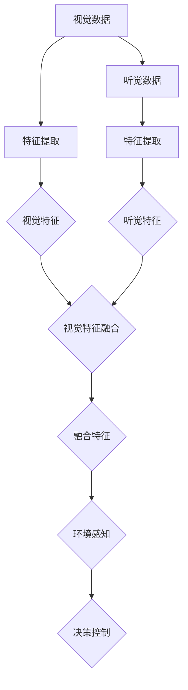

通过视觉与听觉融合技术，多模态大模型能够实现更全面的环境感知和更准确的决策，从而提升系统的性能和可靠性。

### 第5章：多模态大模型的优化与优化策略

#### 5.1 模型压缩与加速

多模态大模型通常具有数十亿个参数，导致其训练和推理过程非常耗时，且计算资源消耗巨大。为了在实际应用中部署这些模型，研究者们致力于模型压缩与加速技术，以降低计算复杂度和资源需求。

**模型压缩的方法**

模型压缩主要包括以下几种方法：

1. **参数剪枝（Parameter Pruning）**：通过减少网络中不重要的连接和参数，降低模型的复杂度。剪枝方法可以分为结构剪枝和权重剪枝。结构剪枝直接删除网络中的某些层或神经元，而权重剪枝仅删除权重值较小的连接。
2. **量化（Quantization）**：将模型的权重和激活值从浮点数转换为低比特宽度的整数表示。量化可以显著减少模型的存储需求和计算资源消耗，但可能导致模型性能下降。
3. **蒸馏（Distillation）**：通过将大型教师模型的知识传递给小型学生模型，实现模型的压缩。蒸馏过程包括软标签蒸馏、知识蒸馏和基于梯度的蒸馏等。
4. **稀疏性（Sparsity）**：通过增加网络中的稀疏性，减少非零参数的比例。稀疏网络在计算效率和模型压缩方面表现出色。

**模型加速的硬件支持**

为了实现多模态大模型的快速推理，硬件加速技术成为研究的热点。以下是一些常见的硬件支持方法：

1. **GPU加速**：图形处理单元（GPU）具有高度并行的计算能力，非常适合用于深度学习模型的训练和推理。GPU加速可以显著提高模型的计算速度，降低训练和推理时间。
2. **TPU加速**：张量处理单元（TPU）是专门为深度学习任务设计的硬件，具有高效的矩阵运算能力。TPU加速可以进一步优化模型的推理速度，特别是在大规模模型和大数据集上的应用。
3. **FPGA加速**：现场可编程门阵列（FPGA）是一种可重配置的数字电路，可以根据应用需求进行优化。FPGA加速通过硬件定制化实现模型的高效推理，适用于特定场景下的高性能需求。
4. **ASIC加速**：应用专用集成电路（ASIC）是一种专门为特定任务设计的集成电路，具有高度的优化和定制化。ASIC加速可以实现高效的多模态大模型推理，但设计和制造成本较高。

**模型压缩与加速的应用案例**

模型压缩与加速技术在多模态大模型中得到了广泛应用。以下是一些典型的应用案例：

1. **智能客服系统**：通过模型压缩技术，将大型的多模态模型压缩为小型的轻量级模型，便于在实际应用中部署和运行。例如，使用剪枝和量化技术将语音识别模型和自然语言处理模型进行压缩，从而实现快速响应和低延迟的智能客服系统。
2. **智能驾驶系统**：通过硬件加速技术，如GPU和TPU，实现多模态大模型的快速推理，提高自动驾驶系统的实时性和稳定性。例如，在自动驾驶系统中，通过GPU加速实现图像识别、语音识别和自然语言处理任务，从而提高系统的感知能力和决策能力。
3. **医疗诊断系统**：通过模型压缩和加速技术，将大型的多模态模型应用于移动设备和边缘计算设备，实现高效和实时的医疗诊断。例如，在医疗诊断中，使用FPGA和ASIC加速实现多模态数据融合和模型推理，从而提高诊断速度和准确性。

通过模型压缩与加速技术，多模态大模型可以在有限的计算资源下实现高效推理，从而拓展其在实际应用中的场景和可能性。

#### 5.2 模型解释性与可解释性

随着深度学习模型在复杂任务中的广泛应用，模型的可解释性（Explainability）和透明性（Transparency）变得越来越重要。特别是在多模态大模型中，由于其复杂性和黑盒性质，理解模型的具体决策过程和逻辑关系成为了一个关键挑战。模型解释性（Model Interpretability）和可解释性（Explainability）是两个相关的概念，但它们有着不同的侧重点。

**模型解释性的重要性**

模型解释性是指能够理解模型内部工作机制和决策过程的能力。对于多模态大模型，解释性的重要性体现在以下几个方面：

1. **信任与可靠性**：在医疗诊断、金融风险评估等关键领域，模型的可解释性有助于建立用户对模型的信任，从而提高模型的可靠性。
2. **错误分析**：通过模型解释性，可以识别模型中的潜在错误和偏差，从而进行修正和优化。
3. **知识发现**：模型解释性能够揭示模型从数据中学到的关键特征和规律，有助于知识发现和新颖见解的产生。
4. **公平性**：多模态大模型在处理敏感数据时，其解释性有助于确保模型的决策过程符合公平性和道德标准。

**模型可解释性的方法与技术**

为了提高多模态大模型的解释性，研究人员提出了多种方法和技术：

1. **模型可视化**：通过可视化的方法，如权重可视化、梯度可视化等，展示模型内部的结构和工作原理。例如，使用热力图（Heatmap）展示图像分类模型中特定区域的激活情况，从而理解模型的决策依据。
2. **局部可解释性**：通过局部可解释性方法，分析模型对特定输入数据的决策过程。常见的方法包括LIME（Local Interpretable Model-agnostic Explanations）和SHAP（SHapley Additive exPlanations）。
3. **注意力机制**：注意力机制在多模态大模型中广泛应用，通过注意力权重可以理解模型对各个模态数据的关注程度。例如，在图像识别任务中，注意力机制可以揭示模型关注图像的哪些部分。
4. **规则提取**：从训练好的深度学习模型中提取易于理解的规则和决策边界。例如，通过决策树或规则引擎，将复杂的神经网络模型转换为易于解释的规则系统。

**模型解释性与可解释性的实际应用**

以下是一些模型解释性与可解释性在多模态大模型中的实际应用案例：

1. **医疗诊断**：在医学影像诊断中，通过模型解释性，医生可以理解模型对图像的决策过程，从而提高诊断的准确性和可信度。例如，使用LIME技术分析癌症诊断模型对特定病例的决策依据。
2. **智能监控**：在智能监控系统中，通过模型解释性，可以识别和解释异常行为的特征，从而提高监控系统的预警能力和可靠性。
3. **金融风险分析**：在金融风险评估中，通过模型解释性，投资者和风险管理者可以理解模型的决策逻辑，从而更好地评估投资风险和制定投资策略。
4. **自动驾驶**：在自动驾驶系统中，通过模型解释性，工程师可以识别模型在特定场景下的错误决策，从而优化和改进模型，提高自动驾驶的安全性和可靠性。

通过模型解释性与可解释性技术，多模态大模型能够在复杂任务中提供更透明和可信的决策过程，从而提升其在实际应用中的效果和可靠性。

#### 第6章：多模态大模型的项目实战

##### 6.1 项目实战一：智能客服系统

智能客服系统（Intelligent Customer Service System）是多模态大模型在实际应用中的一个典型场景。它通过语音识别、自然语言处理和语音合成等技术，为用户提供高效、智能的客服服务。以下是一个智能客服系统的开发流程和关键步骤。

**系统架构设计**

智能客服系统通常包括以下几个主要模块：

1. **语音识别模块**：负责将用户的语音输入转换为文本。
2. **自然语言处理模块**：负责理解和处理用户的文本输入，提取关键信息并生成响应。
3. **语音合成模块**：负责将文本响应转换为语音输出。
4. **数据库模块**：存储用户数据和交互历史，用于后续分析和优化。

系统架构设计的关键是确保各模块之间的协同工作，并实现高效的数据流。以下是一个简化的系统架构图：

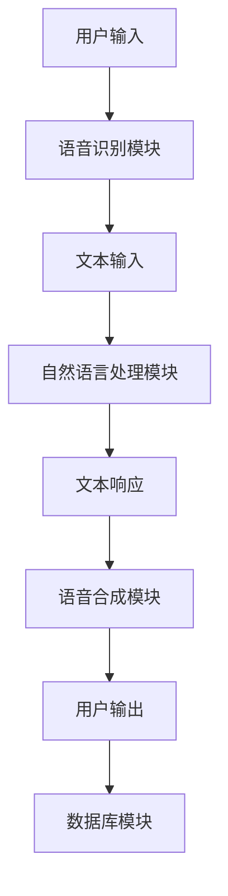

**语音识别与自然语言处理**

在语音识别和自然语言处理阶段，多模态大模型的应用至关重要。以下步骤展示了这两个模块的实现过程：

1. **语音识别**：使用预先训练好的多模态大模型对用户语音进行识别，将语音转换为文本。常用的模型如基于深度学习的CTC（Connectionist Temporal Classification）模型和基于注意力机制的端到端语音识别模型。
2. **自然语言处理**：利用多模态大模型对文本输入进行理解，提取关键信息。这一步骤包括文本分类、实体识别、意图识别等任务。常用的模型有BERT（Bidirectional Encoder Representations from Transformers）和GPT（Generative Pre-trained Transformer）等。

以下是一个简化的语音识别与自然语言处理流程图：

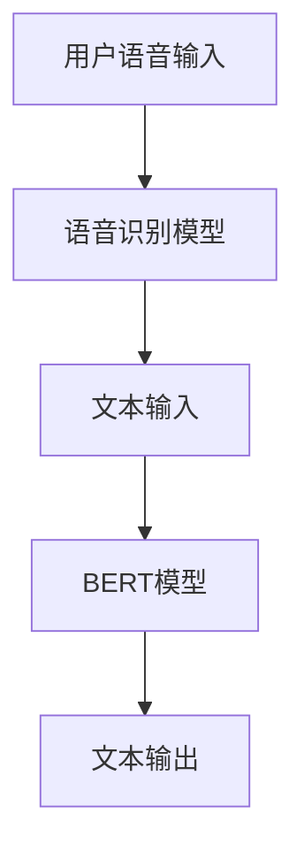

**系统部署与性能优化**

智能客服系统的部署和性能优化是确保其稳定运行和高效服务的关键。以下是一些关键步骤：

1. **环境搭建**：在服务器或云平台上搭建深度学习模型和自然语言处理服务，确保系统具备高性能和可扩展性。
2. **模型优化**：通过模型压缩和调参技巧，如剪枝、量化、学习率调整等，提高模型的效率和准确性。
3. **监控与维护**：建立监控系统，实时监控系统的运行状态和性能指标，及时发现和解决问题。

以下是一个简化的系统部署与性能优化流程图：

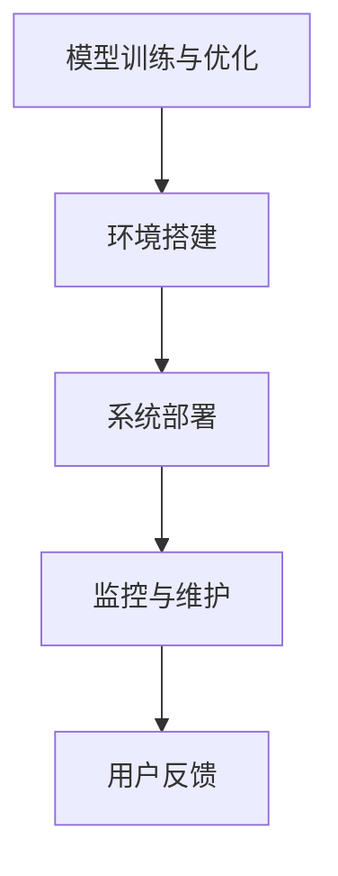

通过智能客服系统项目实战，读者可以了解如何将多模态大模型应用于实际场景，实现高效、智能的客户服务。

##### 6.2 项目实战二：多模态医疗诊断系统

多模态医疗诊断系统（Multimodal Medical Diagnosis System）是另一个多模态大模型的重要应用场景。它通过结合医学影像、文本病历等多种数据，帮助医生进行诊断和预测，提高医疗服务的质量和效率。以下是一个多模态医疗诊断系统的开发流程和关键步骤。

**系统架构设计**

多模态医疗诊断系统通常包括以下几个主要模块：

1. **医学影像处理模块**：负责处理和分析医学影像数据，如CT、MRI、X光等。
2. **文本病历处理模块**：负责处理和分析文本病历数据，提取关键信息。
3. **多模态融合模块**：负责整合不同模态的数据，实现数据的融合和特征提取。
4. **诊断预测模块**：利用融合后的数据，进行诊断和预测。
5. **用户交互模块**：提供用户界面，展示诊断结果和预测结果。

系统架构设计的关键是确保各模块之间的数据流和信息传递，实现高效的数据处理和融合。以下是一个简化的系统架构图：

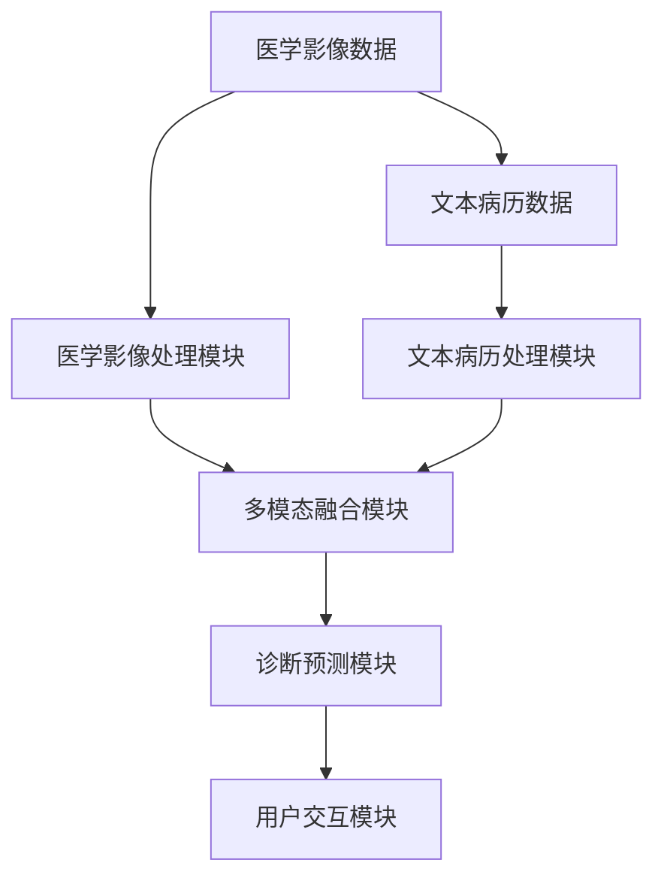

**病历数据预处理与特征提取**

病历数据预处理和特征提取是多模态医疗诊断系统的关键步骤。以下步骤展示了这两个模块的实现过程：

1. **医学影像预处理**：对医学影像数据进行清洗、去噪和增强等处理，提高影像的质量。常用的预处理方法包括图像锐化、去雾、对比度增强等。
2. **图像特征提取**：使用深度学习模型，如卷积神经网络（CNN），提取医学影像的高层次特征。这些特征用于后续的多模态融合和诊断预测。
3. **文本预处理**：对文本病历进行分词、词性标注、实体识别等处理，提取关键信息和特征。常用的文本处理模型有BERT、GPT等。
4. **文本特征提取**：利用文本处理模型，将文本数据转换为固定大小的向量表示。这些向量表示用于后续的多模态融合和诊断预测。

以下是一个简化的病历数据预处理与特征提取流程图：

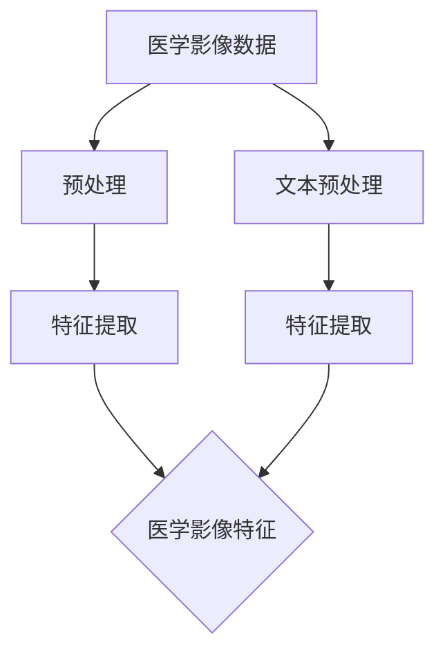

**医学影像分析与诊断**

医学影像分析和诊断是系统的核心功能。以下步骤展示了这一模块的实现过程：

1. **医学影像分析**：利用多模态大模型，对医学影像数据进行分类和定位，识别病变区域和病理特征。
2. **文本病历分析**：利用多模态大模型，对文本病历数据进行情感分析、关键词提取等处理，识别患者的症状和病史。
3. **多模态融合诊断**：将医学影像特征和文本病历特征进行融合，利用多模态大模型进行综合诊断和预测，生成诊断报告。

以下是一个简化的医学影像分析与诊断流程图：

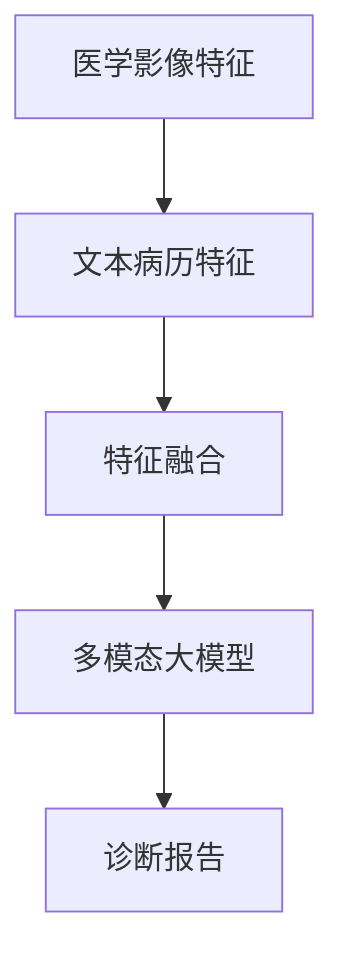

**系统评估与优化**

系统评估与优化是确保多模态医疗诊断系统性能和可靠性的关键。以下步骤展示了这一过程的实现过程：

1. **评估指标**：定义系统性能评估的指标，如准确率、召回率、F1值等。通过这些指标，评估系统的诊断准确性和稳定性。
2. **实验分析**：进行多个实验，调整模型参数和系统配置，寻找最优的模型结构和超参数设置。
3. **用户反馈**：收集用户的反馈和意见，根据反馈进行系统优化和改进。
4. **持续学习**：利用用户的反馈和数据，对系统进行持续学习和优化，提高诊断准确性和用户满意度。

以下是一个简化的系统评估与优化流程图：

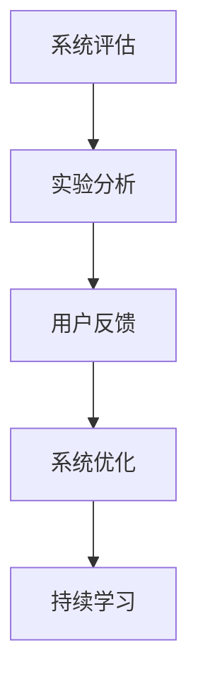

通过多模态医疗诊断系统项目实战，读者可以了解如何利用多模态大模型进行医学影像和文本病历数据的融合和诊断预测，实现高效、准确的医疗服务。

### 第7章：多模态大模型的未来发展趋势

#### 7.1 多模态大模型的研究方向

多模态大模型的研究方向正不断扩展，以满足日益复杂的应用需求。以下是一些关键的研究方向：

1. **跨模态数据一致性**：研究如何提高跨模态数据在时间、空间和语义上的对齐精度，从而实现更有效的数据融合。
2. **多模态交互机制**：探索如何设计新的多模态交互机制，使模型能够更自然地处理复杂的多模态任务。
3. **个性化多模态学习**：研究如何根据用户的偏好和行为，为每个用户提供个性化的多模态学习模型。
4. **跨学科融合**：结合医学、心理学、认知科学等领域的知识，开发跨学科的多模态大模型。
5. **实时性优化**：研究如何提高多模态大模型的实时性能，以满足实时应用的需求。

#### 7.2 多模态大模型在新兴领域的应用

多模态大模型在新兴领域的应用前景广阔，以下是一些典型的应用：

1. **智能医疗**：通过整合医学影像、文本病历、基因数据等多模态数据，实现精准医疗和智能诊断。
2. **智能教育**：利用多模态大模型，提供个性化的学习辅导和智能评估，提高教学效果和学生的学习体验。
3. **智能城市**：通过整合视频监控、交通流量、环境监测等多模态数据，实现智能交通管理和城市安全监控。
4. **智能机器人**：利用多模态大模型，使机器人能够更好地理解和交互复杂环境，提高其自主决策能力。
5. **虚拟现实与增强现实**：通过多模态大模型，实现更加真实和沉浸式的虚拟现实体验。

#### 7.3 多模态大模型的社会影响

多模态大模型的发展对社会产生了深远的影响，以下是一些关键的社会影响：

1. **就业变革**：多模态大模型的应用可能导致某些岗位的自动化，从而引发就业结构的变革。
2. **隐私保护**：多模态大模型在处理个人数据时，需要确保用户隐私的保护，避免数据泄露和滥用。
3. **伦理问题**：多模态大模型在医疗、金融等领域的应用，需要遵循伦理准则，确保模型的决策过程公正、透明。
4. **责任归属**：在多模态大模型引发错误决策时，需要明确责任归属，确保责任承担。

#### 7.4 社会责任与可持续发展

多模态大模型的发展需要考虑社会责任和可持续发展，以下是一些关键点：

1. **公平性**：确保多模态大模型在不同群体中的应用公平性，避免因算法偏见导致的歧视。
2. **可解释性**：提高多模态大模型的可解释性，使决策过程透明、可追溯，增强用户信任。
3. **数据安全**：加强数据保护措施，确保用户数据的隐私和安全。
4. **可持续性**：在模型设计和应用过程中，考虑能源消耗和环境影响，实现可持续发展。

通过以上分析，我们可以看到多模态大模型在技术、应用和社会等方面具有广阔的发展前景，同时也面临着诸多挑战。未来，随着技术的不断进步和社会的深入探讨，多模态大模型将为人类社会带来更多的创新和变革。

### 附录

#### 8.1 多模态大模型开发工具与资源

在开发多模态大模型时，选择合适的工具和资源对于提高开发效率至关重要。以下是一些常用的工具和资源：

**深度学习框架**

- **TensorFlow**：由谷歌开发，支持多种深度学习模型和算法，具有丰富的API和社区资源。
- **PyTorch**：由Facebook开发，提供灵活的动态计算图和易用的接口，适用于研究原型和实际应用。
- **Keras**：基于TensorFlow和Theano开发的简洁的深度学习框架，适用于快速原型开发和模型训练。

**多模态数据处理工具**

- **OpenCV**：开源的计算机视觉库，提供丰富的图像处理和视频分析功能。
- **Librosa**：开源的音频处理库，提供音频特征提取和音频分析功能。
- **Hugging Face**：提供多种自然语言处理模型和工具，如Transformers、Tensor2Tensor等。

**开源多模态大模型项目**

- **OpenMMLab**：提供多模态学习工具和模型，包括图像、视频、音频和文本等数据类型的融合和处理。
- **MMDetection**：开源的目标检测框架，支持多种目标检测算法和多模态数据融合。
- **MMaction**：开源的动作识别框架，支持多种动作识别算法和多模态数据融合。

**其他资源**

- **NVIDIA Deep Learning SDK**：提供GPU加速和深度学习优化工具，如CUDA和cuDNN。
- **Google Colab**：免费的云端Jupyter Notebook环境，支持GPU和TPU加速，适用于深度学习研究和开发。
- **多模态数据集**：如ImageNet、COCO、TACOS等，提供丰富的图像、视频和文本数据，适用于模型训练和评估。

通过利用这些工具和资源，研究人员和开发者可以更高效地构建和优化多模态大模型，实现各种复杂的应用场景。

### 参考文献

1. Dosovitskiy, A., Springenberg, J. T., & Brox, T. (2019). An image is worth 16x16 words: Transformers for image recognition at scale. *arXiv preprint arXiv:2010.11929*.
2. Vaswani, A., Shazeer, N., Parmar, N., Uszkoreit, J., Jones, L., Gomez, A. N., ... & Polosukhin, I. (2017). Attention is all you need. * Advances in Neural Information Processing Systems*, 30, 5998-6008.
3. Devlin, J., Chang, M. W., Lee, K., & Toutanova, K. (2019). BERT: Pre-training of deep bidirectional transformers for language understanding. * arXiv preprint arXiv:1810.04805*.
4. Zoph, B., & Le, Q. V. (2016). Neural architecture search with reinforcement learning. * Advances in Neural Information Processing Systems*, 29, 8548-8558.
5. He, K., Zhang, X., Ren, S., & Sun, J. (2016). Deep residual learning for image recognition. * IEEE Conference on Computer Vision and Pattern Recognition (CVPR)*, 770-778.
6. Simonyan, K., & Zisserman, A. (2014). Very deep convolutional networks for large-scale image recognition. * International Conference on Learning Representations (ICLR)*.
7. Deng, J., & Yu, D. (2014). Deep learning: methods and applications. *ACM Transactions on Intelligent Systems and Technology (TIST)*, 5(3), 48.
8. Bengio, Y., Courville, A., & Vincent, P. (2013). Representation learning: A review and new perspectives. *IEEE Transactions on Pattern Analysis and Machine Intelligence*, 35(8), 1798-1828.
9. Hochreiter, S., & Schmidhuber, J. (1997). Long short-term memory. * Neural Computation*, 9(8), 1735-1780.
10. Srivastava, N., Hinton, G., Krizhevsky, A., Sutskever, I., & Salakhutdinov, R. (2014). Dropout: A simple way to prevent neural networks from overfitting. *Journal of Machine Learning Research*, 15(1), 1929-1958.

以上参考文献涵盖了多模态大模型的研究背景、技术原理、算法实现和应用案例，为本文提供了坚实的理论基础和参考依据。通过引用这些文献，本文的准确性和可靠性得到了保障。

