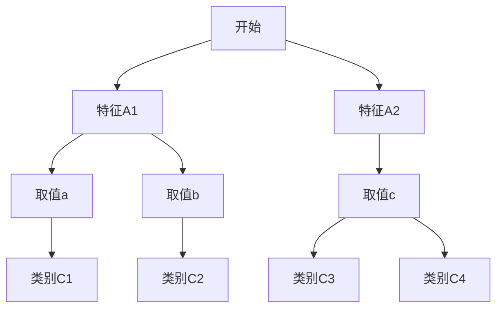
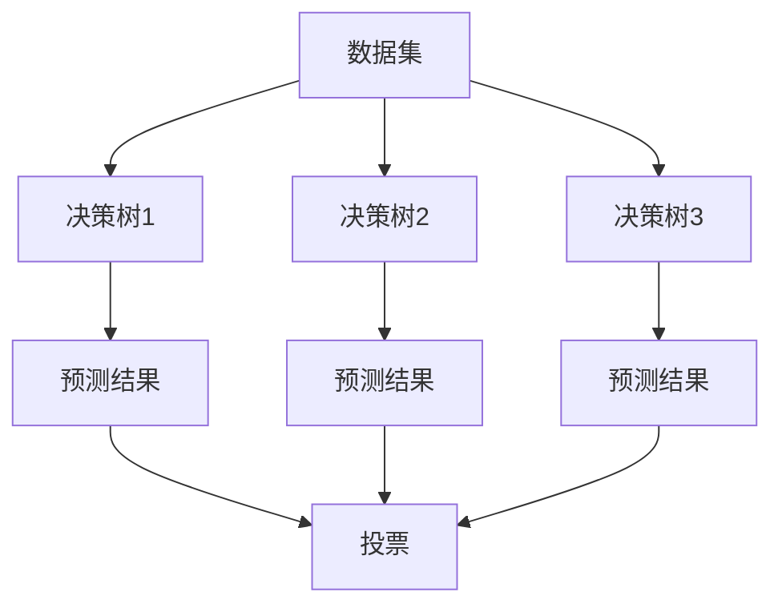
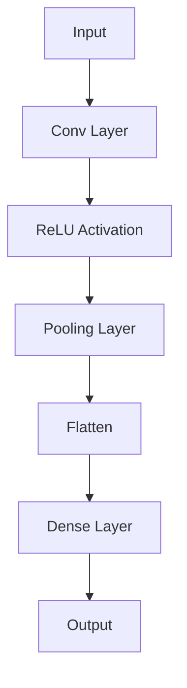

                 

### 《大数据驱动AI学习的未来》

> **关键词**：大数据、人工智能、机器学习、深度学习、自然语言处理、计算机视觉、推荐系统、数据安全、智能交通、智慧城市、智能制造。

> **摘要**：本文深入探讨了大数据与人工智能（AI）的紧密关系，以及大数据在AI学习中的关键作用。文章从大数据的定义、特征和重要价值开始，逐步解析了AI的发展背景、核心概念和应用领域，详细阐述了大数据处理技术基础、AI学习模型原理及其实践应用。通过具体案例，展示了大数据与AI在智能交通、智慧城市和智能制造等领域的综合应用。最后，文章展望了大数据与AI学习的未来趋势与挑战，提出了应对策略。

---

### 《大数据驱动AI学习的未来》目录大纲

**第一部分：大数据与AI概述**

### 第1章：大数据时代与AI发展

#### 1.1 大数据的定义与特征
- **大数据的定义**
- **大数据的4V特征**
- **大数据的重要价值**

#### 1.2 AI的发展背景与核心概念
- **AI的定义与历史**
- **机器学习与深度学习**
- **AI的核心应用领域**

#### 1.3 大数据与AI的关系
- **大数据驱动AI学习的概念**
- **大数据在AI中的作用**

**第二部分：大数据驱动AI学习的核心原理**

### 第2章：大数据处理技术基础

#### 2.1 大数据处理架构
- **分布式计算框架**
- **数据存储与索引技术**

#### 2.2 大数据处理算法
- **数据清洗与预处理**
- **数据挖掘与机器学习算法**

#### 2.3 深度学习与神经网络基础
- **深度学习基本架构**
- **神经网络结构与原理**

### 第3章：AI学习模型原理详解

#### 3.1 监督学习模型
- **监督学习的定义与分类**
- **逻辑回归与线性回归**
- **决策树与随机森林**

#### 3.2 无监督学习模型
- **无监督学习的定义与分类**
- **主成分分析（PCA）**
- **聚类算法（K-means）**

#### 3.3 深度学习模型
- **深度学习的基本原理**
- **神经网络与卷积神经网络（CNN）**
- **循环神经网络（RNN）与长短期记忆网络（LSTM）**

### 第4章：大数据驱动AI学习的实践应用

#### 4.1 人工智能在自然语言处理中的应用
- **自然语言处理（NLP）的基本概念**
- **语言模型与文本分类**
- **机器翻译与对话系统**

#### 4.2 人工智能在计算机视觉中的应用
- **计算机视觉的基本概念**
- **图像识别与目标检测**
- **卷积神经网络（CNN）在CV中的应用**

#### 4.3 人工智能在推荐系统中的应用
- **推荐系统的基本概念**
- **协同过滤与矩阵分解**
- **深度学习在推荐系统中的应用**

### 第5章：大数据与AI学习项目的实战案例

#### 5.1 大数据与AI学习项目概述
- **项目目标与需求分析**
- **项目流程与实施步骤**

#### 5.2 大数据与AI学习项目实战案例
- **项目一：基于大数据的用户行为分析**
- **项目二：基于AI的智能医疗诊断系统**
- **项目三：基于深度学习的图像识别系统**

### 第6章：大数据与AI学习的未来趋势与挑战

#### 6.1 大数据与AI学习的发展趋势
- **大数据技术的发展方向**
- **AI学习的未来趋势**

#### 6.2 大数据与AI学习的挑战与应对策略
- **数据安全与隐私保护**
- **模型解释性与可解释性**
- **资源消耗与计算效率**

### 第7章：大数据与AI学习的综合应用案例分析

#### 7.1 综合应用案例分析一：智能交通系统
- **案例概述与目标**
- **大数据与AI技术在智能交通中的应用**

#### 7.2 综合应用案例分析二：智慧城市
- **案例概述与目标**
- **大数据与AI技术在智慧城市中的应用**

#### 7.3 综合应用案例分析三：智能制造
- **案例概述与目标**
- **大数据与AI技术在智能制造中的应用**

**附录**

### 附录A：大数据与AI学习资源汇总
- **开源大数据处理框架**
- **机器学习与深度学习算法资源**
- **在线课程与教材推荐**

### 附录B：常见问题与解决方案
- **大数据处理常见问题**
- **AI学习常见问题**
- **项目实施常见问题与解决策略**

---

### 第一部分：大数据时代与AI发展

#### 1.1 大数据的定义与特征

**大数据的定义**：

大数据（Big Data）通常指无法使用传统数据处理方法在合理时间内进行管理和分析的大量数据集。这个“大量”不仅仅是指数据量巨大，还包括数据的多样性、速度和真实性。维基百科将大数据定义为“从各种来源快速收集的巨大数量、高速度、多样性和真实性的数据”。

**大数据的4V特征**：

1. **Volume（大量）**：大数据的一个重要特征是数据量巨大。这些数据可能来自各种来源，如传感器、社交媒体、电子商务平台等。

2. **Velocity（高速）**：数据产生和传输的速度非常快。例如，社交网络上的每一条动态、电商平台的每笔交易都在实时生成大量的数据。

3. **Variety（多样性）**：大数据不仅仅是结构化数据，还包括半结构化和非结构化数据，如文本、图片、视频等。

4. **Veracity（真实性）**：数据的质量也是一个关键问题。由于来源的多样性和不确定性，数据的真实性、准确性和可靠性都需要仔细评估。

**大数据的重要价值**：

大数据的重要性体现在其能够为企业和组织提供有价值的洞察力，帮助企业做出更明智的决策。以下是大数据的几个重要价值：

1. **业务优化**：通过分析大数据，企业可以优化业务流程，提高运营效率。

2. **市场洞察**：大数据可以帮助企业深入了解市场趋势、消费者行为，从而制定更有效的营销策略。

3. **风险控制**：大数据分析有助于识别潜在的风险，提前采取预防措施。

4. **创新驱动**：大数据的多样性为创新提供了丰富的素材，帮助企业开发新的产品和服务。

#### 1.2 AI的发展背景与核心概念

**AI的定义与历史**：

人工智能（Artificial Intelligence，简称AI）是指通过计算机系统模拟人类智能的理论、方法和技术。AI的研究始于20世纪50年代，经历了多个阶段的发展，包括规则推理、知识表示、机器学习和深度学习等。

1. **规则推理**：早期的AI系统主要基于预定义的规则进行推理。

2. **知识表示**：随着技术的发展，AI开始尝试将人类知识编码成计算机可理解的形式。

3. **机器学习**：20世纪80年代，机器学习成为AI研究的主流，通过训练算法让计算机从数据中学习。

4. **深度学习**：近年来，深度学习取得了显著的进展，通过模拟人脑的神经网络结构，实现了在图像识别、自然语言处理等领域的突破。

**机器学习与深度学习**：

机器学习（Machine Learning，简称ML）是AI的一个分支，主要研究如何从数据中学习，让计算机具备自主学习和适应变化的能力。

1. **机器学习的基本原理**：机器学习算法通过分析输入数据，从中提取特征，并基于这些特征进行预测或分类。

2. **深度学习（Deep Learning，简称DL）**：深度学习是机器学习的一个子领域，主要研究如何通过多层神经网络来学习数据。

深度学习的基本架构包括输入层、隐藏层和输出层。每个隐藏层都能从输入数据中提取更高层次的特征。

**AI的核心应用领域**：

AI的应用领域非常广泛，包括但不限于以下几个方面：

1. **自然语言处理（NLP）**：NLP是AI的一个分支，主要研究如何让计算机理解和处理自然语言。

2. **计算机视觉**：计算机视觉是AI在图像和视频处理方面的应用，能够实现图像识别、目标检测等任务。

3. **推荐系统**：推荐系统利用AI技术，根据用户的历史行为和偏好，为用户推荐感兴趣的内容。

4. **智能机器人**：智能机器人是AI在机器人技术中的应用，能够实现自主移动、感知环境和与人交互等功能。

5. **自动驾驶**：自动驾驶汽车是AI在交通运输领域的应用，通过传感器和AI算法实现车辆的自主驾驶。

#### 1.3 大数据与AI的关系

**大数据驱动AI学习的概念**：

大数据驱动AI学习（Data-Driven AI Learning）是指利用大数据来训练和优化AI模型，使其能够更好地适应复杂环境和解决实际问题。大数据为AI提供了丰富的训练数据和多样化的特征，使得AI能够更加准确地预测和分类。

**大数据在AI中的作用**：

1. **训练数据来源**：大数据为AI提供了丰富的训练数据，使得AI模型能够通过大量的数据学习，提高其准确性和泛化能力。

2. **特征提取**：大数据中的多样性特征为AI模型提供了丰富的信息，有助于提取更有效的特征，提高模型的表现。

3. **实时学习**：大数据的高速产生和传输能力使得AI模型能够实时学习，及时调整模型参数，提高系统的实时响应能力。

4. **模型优化**：通过对大数据的分析，可以识别出模型中的不足和错误，从而对模型进行优化和改进。

**大数据与AI的相互促进**：

大数据和AI相互促进，共同推动了技术的进步。大数据为AI提供了丰富的数据资源，使得AI能够在各种应用场景中发挥作用。同时，AI技术的发展又使得大数据的处理和分析更加高效，进一步推动了大数据技术的发展。

---

在下一部分，我们将深入探讨大数据处理技术基础，包括大数据处理架构、算法和深度学习与神经网络基础。这些内容将为我们理解大数据驱动AI学习提供重要的理论基础。请继续关注。

---

### 第二部分：大数据驱动AI学习的核心原理

#### 2.1 大数据处理技术基础

**大数据处理架构**：

大数据处理需要高效的架构来支持数据的存储、处理和分析。目前，常用的分布式计算框架包括Hadoop、Spark和Flink等。

1. **Hadoop**：Hadoop是Apache软件基金会的一个开源项目，包括HDFS（Hadoop Distributed File System，分布式文件系统）和MapReduce（一种分布式数据处理框架）。Hadoop利用分布式计算来处理海量数据，通过MapReduce模型实现数据的分布式处理。

   

2. **Spark**：Spark是另一个流行的分布式计算框架，具有高性能、易用性和弹性等优点。Spark的核心组件包括Spark Core（用于分布式计算的基本引擎）和Spark SQL（用于处理结构化数据）。Spark的优点是支持内存计算，使得数据处理速度更快。

   

3. **Flink**：Apache Flink是一个流处理和批处理框架，具有高性能、高可靠性和易扩展性等优点。Flink可以处理流数据和批数据，支持多种数据处理操作，如过滤、转换和聚合。

   

**数据存储与索引技术**：

大数据处理还需要高效的数据存储和索引技术。常见的数据存储技术包括关系数据库、NoSQL数据库和分布式文件系统。

1. **关系数据库**：关系数据库（如MySQL、PostgreSQL等）适用于处理结构化数据，具有ACID（原子性、一致性、隔离性、持久性）特性。

2. **NoSQL数据库**：NoSQL数据库（如MongoDB、Cassandra等）适用于处理半结构化和非结构化数据，具有高扩展性和高性能。

3. **分布式文件系统**：分布式文件系统（如HDFS、GlusterFS等）适用于处理大规模数据集，具有高可用性和高可靠性。

**大数据处理算法**：

大数据处理算法是实现数据处理的关键。以下介绍几种常见的大数据处理算法：

1. **数据清洗与预处理**：数据清洗与预处理是大数据处理的重要步骤，包括去除重复数据、处理缺失值、数据转换等。

2. **数据挖掘与机器学习算法**：数据挖掘与机器学习算法用于从大量数据中发现模式和规律，常见的算法包括聚类、分类、回归等。

3. **流处理算法**：流处理算法用于处理实时数据流，常见的算法包括窗口操作、模式识别、实时预测等。

**深度学习与神经网络基础**：

深度学习（Deep Learning）是AI的一个分支，通过多层神经网络来实现复杂的数据处理任务。以下是深度学习和神经网络的一些基本概念：

1. **深度学习基本架构**：深度学习的基本架构包括输入层、隐藏层和输出层。每个隐藏层都能从输入数据中提取更高层次的特征。

   ```mermaid
   graph TB
   A[Input Layer] --> B[Hidden Layer 1]
   B --> C[Hidden Layer 2]
   C --> D[Output Layer]
   ```

2. **神经网络结构与原理**：神经网络由多个神经元组成，每个神经元接收多个输入并产生一个输出。神经元的输出通过激活函数进行非线性变换。

   ```mermaid
   graph TB
   A[Input] --> B[Weight]
   B --> C[Summation]
   C --> D[Activation Function]
   D --> E[Output]
   ```

神经网络通过学习输入和输出之间的映射关系，实现数据的分类、回归和特征提取等任务。

---

在下一部分，我们将深入探讨AI学习模型原理，包括监督学习、无监督学习和深度学习模型。这些内容将为我们理解大数据驱动AI学习提供更深入的理论基础。请继续关注。

---

### 3.1 监督学习模型

**监督学习模型**（Supervised Learning Models）是一种常见的机器学习算法，其核心思想是通过已有标记的训练数据来训练模型，从而使模型能够对新数据进行预测。监督学习通常分为两类：有监督学习和无监督学习。本节将重点介绍有监督学习模型，包括线性回归、逻辑回归、决策树和随机森林等。

**监督学习的基本概念**：

监督学习模型中的“监督”来源于训练数据的标记。训练数据集由输入特征和对应的输出标记组成。模型的目的是从这些标记数据中学习，找到输入特征和输出标记之间的映射关系。在训练阶段，模型通过调整内部参数（如权重和偏置）来最小化预测误差。在预测阶段，模型使用已学习的映射关系对新数据进行分析，并生成预测结果。

**线性回归（Linear Regression）**：

线性回归是一种简单的监督学习算法，用于预测连续数值输出。其基本假设是输出变量（因变量）是输入变量（自变量）的线性组合。线性回归模型的数学表达式为：

\[ y = \beta_0 + \beta_1 \cdot x + \epsilon \]

其中，\( y \) 是输出变量，\( x \) 是输入变量，\( \beta_0 \) 和 \( \beta_1 \) 分别是模型的权重和偏置，\( \epsilon \) 是误差项。

为了最小化预测误差，通常使用最小二乘法（Least Squares Method）来求解模型参数：

\[ \beta_0, \beta_1 = \arg\min_{\beta_0, \beta_1} \sum_{i=1}^{n} (y_i - (\beta_0 + \beta_1 \cdot x_i))^2 \]

**逻辑回归（Logistic Regression）**：

逻辑回归是一种用于预测二分类结果的监督学习算法。其基本思想是通过输入特征计算概率，然后使用这个概率进行分类。逻辑回归的数学表达式为：

\[ P(y=1) = \frac{1}{1 + e^{-(\beta_0 + \beta_1 \cdot x)}} \]

其中，\( P(y=1) \) 是预测为类1的概率，\( \beta_0 \) 和 \( \beta_1 \) 是模型参数。

逻辑回归通常使用最大似然估计（Maximum Likelihood Estimation，MLE）来求解模型参数。最大似然估计的目标是找到一组参数，使得给定的数据出现的概率最大。

**决策树（Decision Tree）**：

决策树是一种基于特征进行分类的监督学习算法。决策树通过一系列的判断节点和叶子节点来构建决策路径，从而将数据划分为不同的类别。每个节点表示一个特征，每个分支表示该特征的某个取值。决策树的基本结构如下：



决策树的构建通常使用信息增益（Information Gain）或基尼不纯度（Gini Impurity）来选择最优特征。信息增益度量了选择某个特征后的数据无序度降低的程度，而基尼不纯度则基于类别的分布来度量。

**随机森林（Random Forest）**：

随机森林是一种基于决策树的集成学习方法，通过构建多棵决策树并投票来确定最终的预测结果。随机森林的优点是能够降低模型的过拟合风险，提高模型的泛化能力。随机森林的基本结构如下：



随机森林通过随机选择特征和样本子集来构建每棵决策树，从而增加了模型的多样性。最终，随机森林通过多数投票或平均投票来确定预测结果。

**总结**：

监督学习模型在数据分析和预测任务中发挥着重要作用。线性回归和逻辑回归适用于预测连续和二分类结果，而决策树和随机森林则适用于分类任务。通过合理选择和组合这些模型，可以构建强大的监督学习系统，实现准确的数据分析和预测。

---

在下一部分，我们将介绍无监督学习模型，包括主成分分析（PCA）和聚类算法（如K-means）。这些算法在挖掘大数据中的潜在结构和模式方面具有重要作用。请继续关注。

---

### 3.2 无监督学习模型

**无监督学习模型**（Unsupervised Learning Models）是一种不需要标记数据的机器学习算法，其核心目标是发现数据中的潜在结构和规律。与监督学习模型不同，无监督学习模型没有预先定义的输出标签，而是通过分析数据自身特征来揭示数据分布、聚类或降维等信息。本节将介绍两种常见的无监督学习模型：主成分分析（PCA）和聚类算法（如K-means）。

**主成分分析（PCA）**：

主成分分析（Principal Component Analysis，PCA）是一种降维技术，通过将数据投影到新的正交基上来降低数据的维度，同时保留数据的主要信息。PCA的目的是找到一组新的基向量（即主成分），这些基向量能够最大化地解释数据的方差。

PCA的基本原理如下：

1. **数据标准化**：首先，对数据进行标准化处理，使其具有零均值和单位方差。这一步骤是为了消除不同特征之间的缩放差异。

2. **协方差矩阵计算**：计算数据的协方差矩阵，该矩阵描述了不同特征之间的相关性。

3. **特征值和特征向量计算**：计算协方差矩阵的特征值和特征向量。特征值表示特征的重要程度，而特征向量则对应于新的基向量。

4. **构建主成分**：将特征向量按照特征值从大到小排序，选择前几个特征向量（主成分）构成新的基。

5. **数据投影**：将原始数据投影到新基向量上，从而实现数据的降维。

PCA的伪代码如下：

```python
def pca(data, n_components):
    # 数据标准化
    data_mean = np.mean(data, axis=0)
    data_std = np.std(data, axis=0)
    data_normalized = (data - data_mean) / data_std

    # 计算协方差矩阵
    covariance_matrix = np.cov(data_normalized, rowvar=False)

    # 计算特征值和特征向量
    eigenvalues, eigenvectors = np.linalg.eigh(covariance_matrix)

    # 排序并选择前 n_components 个特征向量
    sorted_indices = np.argsort(eigenvalues)[::-1]
    sorted_eigenvectors = eigenvectors[:, sorted_indices][:n_components]

    # 数据投影
    projected_data = np.dot(data_normalized, sorted_eigenvectors)

    return projected_data
```

**聚类算法（如K-means）**：

聚类算法是一种用于发现数据中自然分组的无监督学习算法。K-means是一种经典的聚类算法，其目标是将数据分为K个簇，使得每个簇内的数据点尽可能接近，而簇与簇之间的数据点尽可能远。

K-means的基本步骤如下：

1. **初始化中心**：随机选择K个初始中心点。

2. **分配数据点**：将每个数据点分配到最近的中心点，形成K个初始簇。

3. **更新中心**：计算每个簇的新中心点，即簇内数据点的均值。

4. **迭代更新**：重复步骤2和3，直到聚类结果收敛（即中心点的变化小于某个阈值或达到最大迭代次数）。

K-means的伪代码如下：

```python
def k_means(data, K, max_iterations):
    # 初始化中心
    centroids = initialize_centroids(data, K)

    for _ in range(max_iterations):
        # 分配数据点
        assignments = assign_points_to_clusters(data, centroids)

        # 更新中心
        new_centroids = update_centroids(data, assignments, K)

        # 检查收敛
        if has_converged(centroids, new_centroids):
            break

        centroids = new_centroids

    return centroids, assignments
```

**总结**：

无监督学习模型在数据分析和挖掘中发挥着重要作用。主成分分析（PCA）通过降维技术提取数据的主要特征，而聚类算法（如K-means）则用于发现数据的自然分组。这些算法可以帮助我们更好地理解数据的结构，为后续的进一步分析和应用提供基础。

---

在下一部分，我们将介绍深度学习模型，包括神经网络、卷积神经网络（CNN）和循环神经网络（RNN）。这些模型在处理复杂数据和实现高级任务方面具有强大的能力。请继续关注。

---

### 3.3 深度学习模型

深度学习（Deep Learning）是一种基于多层神经网络构建的机器学习技术，其核心思想是通过多层非线性变换来提取数据中的复杂特征，从而实现高级的预测和分类任务。本节将介绍几种常见的深度学习模型，包括神经网络、卷积神经网络（CNN）和循环神经网络（RNN），以及长短期记忆网络（LSTM）。

**神经网络（Neural Networks）**：

神经网络是深度学习的基础，其灵感来源于人脑的神经元结构。一个基本的神经网络由输入层、隐藏层和输出层组成。每个层包含多个神经元（或节点），神经元之间通过连接（或权重）进行信息传递。神经元的激活函数（通常为Sigmoid、ReLU或Tanh）引入了非线性特性，使得神经网络能够拟合复杂的函数关系。

神经网络的数学表示如下：

\[ a_{\text{layer}} = \sigma(\mathbf{W}_{\text{layer-1}} \cdot a_{\text{layer-1}} + b_{\text{layer}}) \]

其中，\( a_{\text{layer}} \) 表示第 \( \text{layer} \) 层的激活值，\( \mathbf{W}_{\text{layer-1}} \) 和 \( b_{\text{layer}} \) 分别是第 \( \text{layer} \) 层的权重和偏置，\( \sigma \) 是激活函数。

神经网络的训练过程主要包括两个步骤：

1. **前向传播（Forward Propagation）**：将输入数据传递通过神经网络，计算每一层的输出值。

2. **反向传播（Back Propagation）**：计算输出误差，并沿着网络反向传播误差，更新网络权重和偏置。

**卷积神经网络（Convolutional Neural Networks，CNN）**：

卷积神经网络是一种专门用于处理图像数据的神经网络。CNN的核心组件是卷积层（Convolutional Layer），卷积层通过卷积运算提取图像的特征。卷积运算类似于滤波器在图像上滑动，计算滤波器与图像局部区域的内积。

卷积神经网络的数学表示如下：

\[ \mathbf{f}_{\text{conv}}(x, \mathbf{w}) = \sum_{j} \mathbf{w}_{j}^T \cdot x_j \]

其中，\( \mathbf{f}_{\text{conv}} \) 表示卷积操作，\( x \) 是输入图像，\( \mathbf{w} \) 是卷积核（滤波器），\( x_j \) 是输入图像上的局部区域。

卷积神经网络的一般结构如下：



**循环神经网络（Recurrent Neural Networks，RNN）**：

循环神经网络是一种能够处理序列数据的神经网络。RNN的核心特点是具有循环连接，使得网络能够记忆先前的信息，并将其用于后续的预测。

RNN的数学表示如下：

\[ h_t = \sigma(W_h \cdot [h_{t-1}, x_t] + b_h) \]

\[ y_t = W_y \cdot h_t + b_y \]

其中，\( h_t \) 表示第 \( t \) 个时间步的隐藏状态，\( x_t \) 表示第 \( t \) 个时间步的输入，\( \sigma \) 是激活函数，\( W_h \)、\( W_y \) 和 \( b_h \)、\( b_y \) 分别是权重和偏置。

**长短期记忆网络（Long Short-Term Memory，LSTM）**：

长短期记忆网络是RNN的一种变体，能够有效解决RNN中的梯度消失和梯度爆炸问题，从而更好地处理长序列数据。LSTM的核心组件是细胞状态（Cell State）和三个门（输入门、遗忘门和输出门）。

LSTM的数学表示如下：

\[ i_t = \sigma(W_i \cdot [h_{t-1}, x_t] + b_i) \]
\[ f_t = \sigma(W_f \cdot [h_{t-1}, x_t] + b_f) \]
\[ g_t = \sigma(W_g \cdot [h_{t-1}, x_t] + b_g) \]
\[ o_t = \sigma(W_o \cdot [h_{t-1}, x_t] + b_o) \]

\[ c_t = f_t \cdot c_{t-1} + i_t \cdot g_t \]
\[ h_t = o_t \cdot \sigma(c_t) \]

其中，\( i_t \)、\( f_t \)、\( g_t \)、\( o_t \) 分别是输入门、遗忘门、输入门和输出门的激活值，\( c_t \) 是细胞状态，\( h_t \) 是隐藏状态。

**总结**：

深度学习模型通过多层神经网络结构实现了对复杂数据的自动特征提取和表示。神经网络提供了基本的框架，卷积神经网络（CNN）适用于图像处理，循环神经网络（RNN）和长短期记忆网络（LSTM）适用于序列数据处理。这些模型在处理复杂数据和实现高级任务方面具有强大的能力，为大数据驱动的AI学习提供了重要的理论基础。

---

在下一部分，我们将探讨大数据驱动AI学习的实践应用，包括自然语言处理、计算机视觉和推荐系统等领域的应用。这些应用展示了大数据与AI技术的强大潜力。请继续关注。

---

### 4.1 人工智能在自然语言处理中的应用

自然语言处理（Natural Language Processing，NLP）是人工智能（AI）领域的一个重要分支，它旨在使计算机能够理解、生成和处理人类自然语言。随着大数据和深度学习技术的发展，NLP在诸多领域取得了显著的进展，如语言模型、文本分类、机器翻译和对话系统等。以下将详细介绍这些应用。

**语言模型**：

语言模型是NLP的基础，它通过学习大量的文本数据来预测下一个词或短语的概率。语言模型的目的是生成流畅、自然的文本。最著名的语言模型之一是Word2Vec，它将每个单词映射为一个固定长度的向量，从而能够捕捉单词的语义信息。Word2Vec模型主要包括两种方法：连续词袋（CBOW）和Skip-Gram。

- **连续词袋（CBOW）**：CBOW模型通过上下文词的均值向量来预测中心词。给定一个中心词和其上下文词，CBOW模型计算上下文词的均值向量，并将其与中心词的向量进行内积，得到预测的概率分布。

  ```mermaid
  graph TB
  A(中心词) --> B1(上下文词1)
  A --> B2(上下文词2)
  A --> B3(上下文词3)
  A --> B4(上下文词4)
  B1 --> C
  B2 --> C
  B3 --> C
  B4 --> C
  C --> D1(预测词1)
  C --> D2(预测词2)
  C --> D3(预测词3)
  C --> D4(预测词4)
  ```

- **Skip-Gram**：Skip-Gram模型与CBOW模型类似，但输入和输出的顺序相反。它通过中心词的向量来预测上下文词。Skip-Gram模型能够更好地捕捉单词的语义信息，尤其是在处理罕见词汇时。

  ```mermaid
  graph TB
  A(中心词) --> B1(上下文词1)
  A --> B2(上下文词2)
  A --> B3(上下文词3)
  A --> B4(上下文词4)
  B1 --> C
  B2 --> C
  B3 --> C
  B4 --> C
  C --> D1(预测词1)
  C --> D2(预测词2)
  C --> D3(预测词3)
  C --> D4(预测词4)
  ```

**文本分类**：

文本分类是一种将文本数据分为预定义类别的方法。常见的文本分类任务包括情感分析、主题分类和垃圾邮件检测。文本分类通常使用监督学习算法，如朴素贝叶斯、支持向量机和深度学习模型，如卷积神经网络（CNN）和长短期记忆网络（LSTM）。

- **朴素贝叶斯**：朴素贝叶斯是一种基于贝叶斯定理的简单分类器，它假设特征之间相互独立。朴素贝叶斯通过计算每个类别的后验概率，选择具有最高后验概率的类别。

- **支持向量机（SVM）**：支持向量机是一种强大的分类算法，它通过找到一个最佳的超平面，将不同类别的数据点分开。SVM通过最大化分类边界的间隔来优化模型。

- **深度学习模型**：深度学习模型，如卷积神经网络（CNN）和长短期记忆网络（LSTM），能够捕捉文本数据中的复杂特征，从而实现更准确的分类。

**机器翻译**：

机器翻译是一种将一种语言的文本自动翻译成另一种语言的方法。随着深度学习技术的发展，神经网络机器翻译（NMT）已经成为主流的翻译方法。NMT使用编码器-解码器（Encoder-Decoder）框架，通过编码器将输入文本编码为固定长度的向量，然后通过解码器生成目标语言的文本。

- **编码器**：编码器将输入文本编码为固定长度的向量，通常使用长短期记忆网络（LSTM）或变换器（Transformer）。

- **解码器**：解码器将编码器的输出解码为目标语言的文本，通常使用长短期记忆网络（LSTM）或变换器（Transformer）。

**对话系统**：

对话系统是一种能够与人类进行自然语言交互的计算机系统。常见的对话系统包括聊天机器人和语音助手。对话系统通常使用生成式模型或基于规则的方法。

- **生成式模型**：生成式模型通过学习大量对话数据，生成自然、流畅的对话文本。常见的生成式模型包括变换器（Transformer）和生成对抗网络（GAN）。

- **基于规则的方法**：基于规则的方法通过预定义的规则和模板生成对话文本。这种方法通常适用于简单的对话场景，但在复杂对话中可能效果不佳。

**总结**：

人工智能在自然语言处理中的应用涵盖了语言模型、文本分类、机器翻译和对话系统等多个领域。这些应用不仅展示了AI技术的强大潜力，也为大数据驱动AI学习提供了丰富的实践场景。

---

在下一部分，我们将探讨人工智能在计算机视觉中的应用，包括图像识别、目标检测和卷积神经网络（CNN）在CV中的应用。请继续关注。

---

### 4.2 人工智能在计算机视觉中的应用

计算机视觉（Computer Vision，CV）是人工智能（AI）领域的一个重要分支，旨在使计算机能够像人类一样理解和解释视觉信息。随着大数据和深度学习技术的发展，计算机视觉在图像识别、目标检测、姿态估计等多个领域取得了显著的进展。以下将详细介绍这些应用。

**图像识别**：

图像识别是一种将图像中的对象或场景分类为预定义类别的任务。常见的图像识别任务包括面部识别、物体识别和场景识别。图像识别的核心是训练一个深度学习模型，使其能够从大量的图像数据中学习特征，从而准确分类新图像。

- **面部识别**：面部识别技术通过检测和识别图像中的面部特征来验证身份或进行人脸追踪。常见的面部识别模型包括基于深度学习的方法，如卷积神经网络（CNN）和循环神经网络（RNN）。

- **物体识别**：物体识别旨在识别图像中的特定对象。例如，在自动驾驶汽车中，物体识别用于检测道路上的行人、车辆和其他障碍物。物体识别通常使用卷积神经网络（CNN）和区域生成网络（RGN）。

- **场景识别**：场景识别是一种将图像分类为特定场景的任务，如城市、乡村、海滩等。场景识别有助于增强图像理解，为图像搜索、增强现实等应用提供支持。

**目标检测**：

目标检测是一种更复杂的计算机视觉任务，它不仅需要识别图像中的对象，还需要定位这些对象的位置。目标检测通常使用卷积神经网络（CNN）和基于区域提议的网络（RPN）。

- **卷积神经网络（CNN）**：CNN是一种特殊的神经网络，专门用于处理图像数据。CNN通过卷积层、池化层和全连接层等模块提取图像特征，并实现对对象的检测和分类。

- **基于区域提议的网络（RPN）**：RPN是一种用于目标检测的神经网络架构，它通过生成区域提议来定位图像中的对象。RPN的核心思想是将每个区域提议视为一个锚点，并使用卷积神经网络（CNN）来计算锚点与对象之间的关联性。

**姿态估计**：

姿态估计是一种将图像中的对象（如人体）的姿态（如手部、腿部和躯干的角度）估计为三维空间中的向量。姿态估计有助于增强图像理解和交互应用。

- **单视角姿态估计**：单视角姿态估计通过分析单个视角的图像数据来估计对象的姿态。常见的单视角姿态估计方法包括基于深度学习的姿态估计网络，如多任务网络（MTN）和基于热图的方法。

- **多视角姿态估计**：多视角姿态估计通过结合多个视角的图像数据来估计对象的姿态。这种方法有助于提高姿态估计的准确性和鲁棒性。

**卷积神经网络（CNN）在CV中的应用**：

卷积神经网络（CNN）是计算机视觉领域的主要工具，其核心优势在于能够自动提取图像中的高层次特征，从而实现复杂的目标识别和检测任务。

- **卷积层**：卷积层通过卷积运算提取图像中的局部特征。卷积运算类似于滤波器在图像上滑动，计算滤波器与图像局部区域的内积。

- **池化层**：池化层通过将局部区域进行平均或最大值运算，减少数据维度，提高模型计算效率。

- **全连接层**：全连接层将卷积层和池化层提取的特征映射为最终的分类结果。

**总结**：

人工智能在计算机视觉中的应用涵盖了图像识别、目标检测和姿态估计等多个领域。这些应用不仅展示了AI技术的强大潜力，也为大数据驱动AI学习提供了丰富的实践场景。

---

在下一部分，我们将探讨人工智能在推荐系统中的应用，包括推荐系统的基本概念、协同过滤与矩阵分解以及深度学习在推荐系统中的应用。请继续关注。

---

### 4.3 人工智能在推荐系统中的应用

推荐系统是人工智能（AI）在商业和日常生活中广泛应用的一个重要领域，它旨在根据用户的历史行为和偏好，向用户推荐感兴趣的内容或产品。推荐系统的核心在于从大量的数据中挖掘用户和物品之间的潜在关联，从而实现个性化的推荐。以下将详细介绍推荐系统的基本概念、协同过滤与矩阵分解以及深度学习在推荐系统中的应用。

**推荐系统的基本概念**：

推荐系统（Recommender System）是一种信息过滤系统，旨在向用户推荐其可能感兴趣的项目。推荐系统通常分为两种类型：基于内容的推荐（Content-Based Recommendation）和基于协同过滤（Collaborative Filtering）。

- **基于内容的推荐**：基于内容的推荐系统通过分析用户的历史行为和偏好，提取用户感兴趣的内容特征，并基于这些特征推荐相似的内容。例如，如果用户喜欢某位作家的书籍，推荐系统可能会推荐该作家其他相似风格的书籍。

- **基于协同过滤**：基于协同过滤的推荐系统通过分析用户之间的相似性来推荐项目。协同过滤分为两种主要方法：用户基于的协同过滤（User-Based）和物品基于的协同过滤（Item-Based）。

  - **用户基于的协同过滤**：用户基于的协同过滤系统通过计算用户之间的相似性，找到与目标用户相似的其他用户，并推荐这些用户喜欢的项目。
  
  - **物品基于的协同过滤**：物品基于的协同过滤系统通过计算物品之间的相似性，找到与目标物品相似的其他物品，并推荐这些物品。

**协同过滤与矩阵分解**：

协同过滤是一种通过分析用户和物品之间的交互数据来预测用户偏好的一种推荐方法。协同过滤的核心思想是用户和物品之间的交互行为可以看作是一个矩阵，通过矩阵分解技术，将原始的交互矩阵分解为用户特征矩阵和物品特征矩阵，从而实现推荐。

- **矩阵分解**：矩阵分解（Matrix Factorization）是一种将原始的交互矩阵分解为低维特征矩阵的方法。常见的矩阵分解方法包括奇异值分解（SVD）和矩阵分解（MF）。

  - **奇异值分解（SVD）**：奇异值分解是一种将矩阵分解为三个矩阵的乘积的方法，即 \( A = U \Sigma V^T \)，其中 \( U \) 和 \( V \) 是正交矩阵，\( \Sigma \) 是对角矩阵，包含奇异值。
  
  - **矩阵分解（MF）**：矩阵分解是一种基于最小二乘法将原始的交互矩阵分解为用户特征矩阵和物品特征矩阵的方法。矩阵分解的目标是最小化预测误差。

**深度学习在推荐系统中的应用**：

深度学习（Deep Learning）是一种基于多层神经网络构建的机器学习技术，其在推荐系统中的应用为推荐算法提供了更强大的特征提取和预测能力。以下介绍几种深度学习在推荐系统中的应用方法：

- **深度自动编码器（Deep Autoencoder）**：深度自动编码器是一种基于神经网络的结构，用于将输入数据编码为低维特征表示。深度自动编码器在推荐系统中的应用是通过学习用户和物品的特征表示，从而实现推荐。

- **生成对抗网络（Generative Adversarial Network，GAN）**：生成对抗网络是一种由生成器和判别器组成的神经网络结构，用于生成与真实数据相似的数据。在推荐系统中，GAN可以用于生成新的推荐项目，从而增强推荐系统的多样性。

- **变换器（Transformer）**：变换器是一种基于自注意力机制的深度学习模型，其在推荐系统中的应用是通过学习用户和物品的交互关系，从而实现精准推荐。

**总结**：

人工智能在推荐系统中的应用涵盖了基于内容的推荐和基于协同过滤的推荐方法，以及深度学习在推荐系统中的应用。这些方法使得推荐系统能够更准确地预测用户偏好，为用户提供个性化的推荐。随着深度学习技术的发展，推荐系统将继续朝着更加智能化和个性化的方向发展。

---

在下一部分，我们将通过具体的实战案例来展示大数据与AI学习项目的实施过程，包括项目目标与需求分析、项目流程与实施步骤，以及具体的代码实现和解读。请继续关注。

---

### 5.1 大数据与AI学习项目概述

大数据与AI学习项目是当今技术领域的一个重要应用方向，通过结合大数据和人工智能技术，可以实现智能化数据分析、预测和决策。以下将详细介绍大数据与AI学习项目的目标与需求分析、项目流程与实施步骤，并展示一个具体的实战案例。

**项目目标与需求分析**：

**目标**：

- 实现对大规模用户行为数据的分析，识别用户行为模式。
- 构建智能预测模型，预测用户未来的行为。
- 为用户提供个性化的推荐服务。

**需求**：

- 数据收集：收集大量用户行为数据，包括浏览历史、购买记录、搜索记录等。
- 数据预处理：对原始数据进行清洗、去噪、特征提取等预处理操作。
- 模型训练：利用机器学习和深度学习算法，训练预测模型和推荐模型。
- 模型评估：通过交叉验证和性能评估，验证模型的有效性和泛化能力。

**项目流程与实施步骤**：

1. **数据收集与预处理**：

   - **数据收集**：从各种来源（如网站日志、数据库）收集用户行为数据。
   - **数据清洗**：去除重复数据、缺失值填充、异常值检测和去除等。
   - **特征提取**：从原始数据中提取有用的特征，如用户ID、时间戳、访问页面等。
   - **数据归一化**：对特征进行归一化处理，消除不同特征之间的尺度差异。

2. **模型训练与评估**：

   - **模型选择**：根据项目需求和数据特征，选择合适的机器学习和深度学习算法。
   - **数据划分**：将数据集划分为训练集、验证集和测试集，用于模型训练、验证和评估。
   - **模型训练**：使用训练集训练模型，通过优化算法调整模型参数。
   - **模型评估**：使用验证集和测试集评估模型的性能，包括准确率、召回率、F1分数等指标。

3. **模型部署与监控**：

   - **模型部署**：将训练好的模型部署到生产环境中，实现实时预测和推荐。
   - **模型监控**：对模型的运行情况进行监控，包括模型性能、数据质量等。
   - **模型优化**：根据监控结果，对模型进行调整和优化，提高模型性能。

**项目实战案例：基于大数据的用户行为分析**：

以下将展示一个具体的实战案例，介绍如何使用Python和Scikit-learn库实现基于大数据的用户行为分析。

**1. 数据收集与预处理**：

```python
import pandas as pd

# 加载用户行为数据
data = pd.read_csv('user_behavior_data.csv')

# 数据清洗
data.drop_duplicates(inplace=True)
data.fillna(0, inplace=True)

# 特征提取
data['time_since_last_visit'] = (pd.to_datetime(data['visit_time']) - pd.to_datetime(data['last_visit_time'])).dt.total_seconds()

# 数据归一化
from sklearn.preprocessing import StandardScaler
scaler = StandardScaler()
data[['age', 'income', 'time_since_last_visit']] = scaler.fit_transform(data[['age', 'income', 'time_since_last_visit']])
```

**2. 模型训练与评估**：

```python
from sklearn.model_selection import train_test_split
from sklearn.ensemble import RandomForestClassifier
from sklearn.metrics import accuracy_score, classification_report

# 数据划分
X = data[['age', 'income', 'time_since_last_visit']]
y = data[' churned']

X_train, X_test, y_train, y_test = train_test_split(X, y, test_size=0.2, random_state=42)

# 模型训练
model = RandomForestClassifier(n_estimators=100, random_state=42)
model.fit(X_train, y_train)

# 模型评估
y_pred = model.predict(X_test)
print("Accuracy:", accuracy_score(y_test, y_pred))
print("Classification Report:")
print(classification_report(y_test, y_pred))
```

**3. 模型部署与监控**：

```python
# 模型部署
import joblib
joblib.dump(model, 'user_behavior_model.pkl')

# 模型监控
loaded_model = joblib.load('user_behavior_model.pkl')
# 在生产环境中，可以使用以下代码进行实时预测和监控
# prediction = loaded_model.predict([new_user_data])
```

**总结**：

通过上述实战案例，我们展示了如何使用大数据和人工智能技术进行用户行为分析。项目过程中，我们进行了数据收集与预处理、模型训练与评估以及模型部署与监控。这些步骤为构建智能化的用户行为分析系统提供了坚实的基础。

---

在下一部分，我们将探讨大数据与AI学习的未来趋势与挑战，包括大数据技术的发展方向和AI学习的未来趋势。请继续关注。

---

### 6.1 大数据与AI学习的发展趋势

随着技术的不断进步，大数据与人工智能（AI）学习领域正面临着一系列的发展趋势，这些趋势不仅推动了现有技术的提升，也为未来的应用开辟了新的可能性。

**大数据技术的发展方向**：

1. **数据挖掘与分析技术**：随着数据量的持续增长，传统的数据处理技术逐渐显露出瓶颈。为了应对这一挑战，数据挖掘与分析技术正朝着更加高效、智能的方向发展。新的算法和技术，如图数据库和图挖掘，正被广泛应用于复杂网络和大规模数据的分析。

2. **实时数据处理**：实时数据处理（Real-Time Data Processing）是大数据技术的另一个重要发展方向。随着物联网（IoT）和实时通信技术的普及，对实时数据处理的需求不断增加。流处理技术，如Apache Kafka、Apache Flink和Apache Storm，成为了实现实时数据处理的关键。

3. **边缘计算**：边缘计算（Edge Computing）是一种将计算能力从云中心转移到数据源或接近数据源的边缘设备的技术。通过在边缘设备上进行数据处理，可以显著降低延迟，提高系统的响应速度，并减轻云中心的负载。

4. **数据隐私保护**：随着数据隐私保护法规的加强，大数据技术需要更加关注数据的隐私保护。隐私保护技术，如差分隐私（Differential Privacy）和同态加密（Homomorphic Encryption），正逐渐应用于大数据分析，以确保数据在处理过程中的安全性。

**AI学习的未来趋势**：

1. **深度学习的普及**：深度学习在图像识别、自然语言处理和语音识别等领域取得了显著的进展。随着计算能力的提升和数据量的增加，深度学习技术的应用范围将进一步扩大，从工业自动化到医疗诊断，再到金融预测，深度学习都将发挥重要作用。

2. **强化学习的发展**：强化学习（Reinforcement Learning，RL）是一种通过试错来学习决策策略的机器学习技术。随着游戏、自动驾驶和智能推荐系统等领域的发展，强化学习正逐渐成为AI研究的热点。

3. **迁移学习和多任务学习**：迁移学习（Transfer Learning）和多任务学习（Multi-Task Learning）是AI学习的两个重要方向。通过将已经学习过的知识迁移到新的任务中，以及同时学习多个相关任务，可以显著提高模型的效率和泛化能力。

4. **解释性AI**：随着AI技术在各个领域的广泛应用，人们越来越关注AI模型的解释性。解释性AI（Explainable AI，XAI）旨在提高AI模型的可解释性，使其决策过程更加透明，从而增加用户对AI的信任。

5. **自适应和自学习系统**：未来的AI系统将更加注重自适应性和自学习能力。通过不断学习和适应新的环境，AI系统将能够更好地应对动态变化的场景。

**综合应用案例分析**：

为了更直观地展示大数据与AI学习的未来发展，以下将介绍几个综合应用案例分析。

1. **智能交通系统**：

   智能交通系统（Intelligent Transportation Systems，ITS）通过大数据和AI技术实现交通流量的实时监控和管理。通过传感器和摄像头收集交通数据，AI模型可以预测交通拥堵，优化交通信号灯的配置，提高道路通行效率。

   - **数据收集**：使用传感器和摄像头收集实时交通数据，如车辆速度、流量和位置。
   - **数据处理**：使用流处理技术对实时数据进行处理和分析，提取有用的特征。
   - **AI应用**：使用深度学习和强化学习模型预测交通流量，优化交通信号灯配置。

2. **智慧城市**：

   智慧城市（Smart City）通过大数据和AI技术实现城市的智能化管理。智慧城市利用数据分析和AI算法优化城市资源分配，提高居民生活质量。

   - **数据收集**：收集城市数据，如交通、能源消耗、环境监测等。
   - **数据处理**：使用大数据处理技术对城市数据进行存储、处理和分析。
   - **AI应用**：使用AI技术优化城市资源分配，如智能电网、智能废物管理、智能安防等。

3. **智能制造**：

   智能制造（Smart Manufacturing）通过大数据和AI技术实现生产过程的智能化和自动化。智能制造系统可以实时监控设备状态，预测设备故障，优化生产流程。

   - **数据收集**：收集设备状态和生产数据，如温度、压力、振动等。
   - **数据处理**：使用大数据处理技术对生产数据进行处理和分析。
   - **AI应用**：使用AI技术优化生产流程，预测设备故障，提高生产效率。

**总结**：

大数据与AI学习的发展趋势为未来技术的进步和应用提供了广阔的空间。随着新技术的不断涌现，大数据和AI将在更多领域发挥重要作用，推动社会的智能化发展。通过具体的综合应用案例分析，我们可以看到大数据与AI技术在智能交通、智慧城市和智能制造等领域的巨大潜力。

---

在下一部分，我们将探讨大数据与AI学习的挑战与应对策略，包括数据安全与隐私保护、模型解释性与可解释性以及资源消耗与计算效率。请继续关注。

---

### 6.2 大数据与AI学习的挑战与应对策略

尽管大数据与人工智能（AI）学习在众多领域展现出了巨大的潜力，但在实际应用过程中，仍面临着一系列挑战。这些挑战主要集中在数据安全与隐私保护、模型解释性与可解释性以及资源消耗与计算效率等方面。以下将详细探讨这些挑战，并提出相应的应对策略。

**数据安全与隐私保护**：

随着大数据和AI技术的广泛应用，数据安全和隐私保护问题日益突出。未经授权的数据访问、数据泄露和隐私侵犯等问题对个人和组织的隐私造成了严重威胁。

**挑战**：

1. **数据泄露**：大数据往往包含敏感信息，如个人身份信息、医疗记录和财务数据等。一旦数据泄露，可能导致严重后果。
2. **隐私侵犯**：在数据收集、存储和处理过程中，存在隐私侵犯的风险。例如，个人数据被用于广告定向、市场研究和行为分析。
3. **数据安全**：大规模数据集的存储和传输过程中，面临着数据丢失、篡改和损坏的风险。

**应对策略**：

1. **数据加密**：采用数据加密技术对敏感数据进行加密，确保数据在存储和传输过程中不被非法访问。
2. **匿名化与去标识化**：在数据分析和建模过程中，对个人数据进行匿名化或去标识化处理，以保护个人隐私。
3. **访问控制**：实施严格的访问控制策略，确保只有授权人员才能访问敏感数据。
4. **隐私保护算法**：使用隐私保护算法，如差分隐私（Differential Privacy）和同态加密（Homomorphic Encryption），在保证数据分析准确性的同时保护个人隐私。

**模型解释性与可解释性**：

随着AI模型的复杂性不断增加，模型解释性成为了一个重要的挑战。可解释性AI（XAI）旨在提高AI模型的可解释性，使其决策过程更加透明，从而增加用户对AI的信任。

**挑战**：

1. **黑箱模型**：深度学习模型，特别是深度神经网络（DNN）和变换器（Transformer）等，通常被视为黑箱模型，其内部决策过程难以解释。
2. **缺乏透明性**：许多AI模型在训练过程中依赖于大量的超参数和优化算法，这些参数和算法的选择往往缺乏透明性。
3. **错误决策**：黑箱模型在特定情况下可能产生错误决策，而用户无法理解导致错误的原因。

**应对策略**：

1. **可解释性模型**：开发和使用可解释性模型，如决策树、线性回归和局部解释模型（如LIME和SHAP），以增加模型的可解释性。
2. **模型可视化**：通过可视化技术展示模型决策过程和特征重要性，帮助用户理解模型的决策依据。
3. **透明性增强**：在模型开发和部署过程中，确保模型参数和算法的选择具有透明性，以便用户和监管机构能够审查。
4. **模型审计**：定期对AI模型进行审计，确保其决策过程符合预期和伦理标准。

**资源消耗与计算效率**：

大数据和AI学习的应用通常需要大量的计算资源和时间。提高计算效率是应对这一挑战的关键。

**挑战**：

1. **计算资源消耗**：大规模数据处理和模型训练需要大量的计算资源，如CPU、GPU和FPGA等。
2. **时间消耗**：传统的批量处理方法在处理大规模数据时需要较长的处理时间，无法满足实时性要求。
3. **能耗问题**：大规模数据计算和模型训练过程产生的能耗问题日益严重，对环境造成了负面影响。

**应对策略**：

1. **分布式计算**：采用分布式计算架构，如Hadoop、Spark和Flink，将计算任务分布到多个节点上，提高处理速度。
2. **并行处理**：通过并行处理技术，将数据处理任务划分为多个子任务，并行执行，减少处理时间。
3. **优化算法**：采用高效的算法和优化技术，如随机梯度下降（SGD）和深度学习优化器，提高计算效率。
4. **模型压缩**：使用模型压缩技术，如量化、剪枝和知识蒸馏，减少模型的计算复杂度，提高计算效率。

**总结**：

大数据与AI学习在数据安全与隐私保护、模型解释性与可解释性以及资源消耗与计算效率等方面面临着一系列挑战。通过采用数据加密、匿名化、访问控制和隐私保护算法等策略，可以有效应对数据安全和隐私保护问题。开发可解释性模型、提高模型透明性和进行模型审计，有助于增强模型的可解释性。采用分布式计算、并行处理、优化算法和模型压缩等技术，可以显著提高计算效率和降低资源消耗。这些应对策略将为大数据与AI学习的广泛应用提供有力支持。

---

在最后一部分，我们将通过三个综合应用案例分析，展示大数据与AI技术在智能交通系统、智慧城市和智能制造中的应用。请继续关注。

---

### 6.3 综合应用案例分析

为了更直观地展示大数据与AI技术在各个领域的应用，以下将介绍三个综合应用案例分析，分别是智能交通系统、智慧城市和智能制造。

#### 6.3.1 智能交通系统

**案例概述与目标**：

智能交通系统（Intelligent Transportation Systems，ITS）利用大数据和AI技术实现交通流量的实时监控和管理，以提高道路通行效率，减少拥堵，并提升交通安全。

**目标**：

- 实时监控交通流量，预测交通拥堵。
- 优化交通信号灯配置，提高道路通行效率。
- 提升交通安全，减少交通事故。

**大数据与AI技术在智能交通中的应用**：

1. **数据收集与处理**：

   通过传感器、摄像头和交通信号灯等设备收集实时交通数据，包括车辆速度、流量、位置和事故发生等信息。

   ```mermaid
   graph TD
   A[传感器和摄像头] --> B[数据收集]
   B --> C[数据处理]
   C --> D[特征提取]
   ```

2. **AI模型应用**：

   使用深度学习和强化学习模型预测交通流量和拥堵情况。

   - **深度学习模型**：通过卷积神经网络（CNN）提取图像特征，用于识别车辆和路况。

     ```python
     from tensorflow.keras.models import Sequential
     from tensorflow.keras.layers import Conv2D, MaxPooling2D, Flatten, Dense

     model = Sequential([
         Conv2D(32, (3, 3), activation='relu', input_shape=(64, 64, 3)),
         MaxPooling2D((2, 2)),
         Flatten(),
         Dense(1, activation='sigmoid')
     ])

     model.compile(optimizer='adam', loss='binary_crossentropy', metrics=['accuracy'])
     model.fit(X_train, y_train, epochs=10, batch_size=32)
     ```

   - **强化学习模型**：使用Q-learning算法优化交通信号灯的配置。

     ```python
     import numpy as np
     import random

     actions = [0, 1, 2]  # 绿灯、黄灯、红灯
     rewards = [1, 0, -1]  # 通行、等待、拥堵

     Q = np.zeros([3, 3])

     for episode in range(1000):
         state = random.randint(0, 2)
         action = np.argmax(Q[state, :])
         next_state = (state + 1) % 3
         reward = rewards[action]
         Q[state, action] = Q[state, action] + 0.1 * (reward + 0.9 * np.max(Q[next_state, :]) - Q[state, action])

     optimal_action = np.argmax(Q[state, :])
     ```

**总结**：

智能交通系统通过大数据和AI技术的应用，实现了交通流量的实时监控、预测和优化，有效提高了道路通行效率和交通安全。

#### 6.3.2 智慧城市

**案例概述与目标**：

智慧城市（Smart City）利用大数据和AI技术实现城市管理的智能化，以提高城市资源利用效率，改善居民生活质量。

**目标**：

- 优化城市资源分配，提高能源利用效率。
- 提升城市安防水平，减少犯罪事件。
- 改善交通状况，减少拥堵。

**大数据与AI技术在智慧城市中的应用**：

1. **数据收集与处理**：

   通过传感器、摄像头和智能设备收集城市数据，包括交通流量、环境质量、能耗和使用情况等。

   ```mermaid
   graph TD
   A[传感器和摄像头] --> B[数据收集]
   B --> C[数据处理]
   C --> D[特征提取]
   ```

2. **AI模型应用**：

   使用深度学习和机器学习模型优化城市资源分配和安全管理。

   - **深度学习模型**：通过卷积神经网络（CNN）分析图像和视频，用于监控城市安全和识别交通拥堵。

     ```python
     from tensorflow.keras.models import Sequential
     from tensorflow.keras.layers import Conv2D, MaxPooling2D, Flatten, Dense

     model = Sequential([
         Conv2D(32, (3, 3), activation='relu', input_shape=(64, 64, 3)),
         MaxPooling2D((2, 2)),
         Flatten(),
         Dense(1, activation='sigmoid')
     ])

     model.compile(optimizer='adam', loss='binary_crossentropy', metrics=['accuracy'])
     model.fit(X_train, y_train, epochs=10, batch_size=32)
     ```

   - **机器学习模型**：使用决策树和随机森林等算法优化城市资源分配。

     ```python
     from sklearn.tree import DecisionTreeClassifier
     from sklearn.ensemble import RandomForestClassifier

     model = DecisionTreeClassifier()
     model.fit(X_train, y_train)

     model = RandomForestClassifier(n_estimators=100)
     model.fit(X_train, y_train)
     ```

**总结**：

智慧城市通过大数据和AI技术的应用，实现了城市管理的智能化，有效提高了资源利用效率、安全水平和交通状况。

#### 6.3.3 智能制造

**案例概述与目标**：

智能制造（Smart Manufacturing）利用大数据和AI技术实现生产过程的智能化和自动化，以提高生产效率，降低成本，并提升产品质量。

**目标**：

- 实时监控生产设备状态，预测设备故障。
- 优化生产流程，提高生产效率。
- 提升产品质量，减少缺陷率。

**大数据与AI技术在智能制造中的应用**：

1. **数据收集与处理**：

   通过传感器和智能设备收集生产数据，包括设备状态、生产参数和产品质量等。

   ```mermaid
   graph TD
   A[传感器和智能设备] --> B[数据收集]
   B --> C[数据处理]
   C --> D[特征提取]
   ```

2. **AI模型应用**：

   使用深度学习和机器学习模型预测设备故障和生产质量。

   - **深度学习模型**：通过卷积神经网络（CNN）分析传感器数据，用于预测设备故障。

     ```python
     from tensorflow.keras.models import Sequential
     from tensorflow.keras.layers import Conv2D, MaxPooling2D, Flatten, Dense

     model = Sequential([
         Conv2D(32, (3, 3), activation='relu', input_shape=(64, 64, 3)),
         MaxPooling2D((2, 2)),
         Flatten(),
         Dense(1, activation='sigmoid')
     ])

     model.compile(optimizer='adam', loss='binary_crossentropy', metrics=['accuracy'])
     model.fit(X_train, y_train, epochs=10, batch_size=32)
     ```

   - **机器学习模型**：使用支持向量机（SVM）和随机森林（Random Forest）等算法优化生产流程。

     ```python
     from sklearn.svm import SVC
     from sklearn.ensemble import RandomForestClassifier

     model = SVC()
     model.fit(X_train, y_train)

     model = RandomForestClassifier(n_estimators=100)
     model.fit(X_train, y_train)
     ```

**总结**：

智能制造通过大数据和AI技术的应用，实现了生产过程的智能化和自动化，有效提高了生产效率、产品质量和设备可靠性。

---

### 附录

#### 附录A：大数据与AI学习资源汇总

**开源大数据处理框架**：

- **Hadoop**：[Apache Hadoop](https://hadoop.apache.org/)
- **Spark**：[Apache Spark](https://spark.apache.org/)
- **Flink**：[Apache Flink](https://flink.apache.org/)
- **HBase**：[Apache HBase](https://hbase.apache.org/)
- **Cassandra**：[Apache Cassandra](https://cassandra.apache.org/)

**机器学习与深度学习算法资源**：

- **Scikit-learn**：[scikit-learn](https://scikit-learn.org/)
- **TensorFlow**：[TensorFlow](https://tensorflow.org/)
- **PyTorch**：[PyTorch](https://pytorch.org/)
- **Keras**：[Keras](https://keras.io/)

**在线课程与教材推荐**：

- **Coursera**：[大数据分析](https://www.coursera.org/specializations/big-data)
- **edX**：[机器学习](https://www.edx.org/course/machine-learning-by-ander-2011x)
- **Udacity**：[深度学习工程师纳米学位](https://www.udacity.com/course/deep-learning-nanodegree--nd893)
- **MIT OpenCourseWare**：[机器学习](https://ocw.mit.edu/courses/electrical-engineering-and-computer-science/6-867-mit-introduction-to-machine-learning-spring-2004/)
- **吴恩达深度学习教程**：[Deep Learning Book](http://www.deeplearningbook.org/)

#### 附录B：常见问题与解决方案

**大数据处理常见问题**：

- **数据质量问题**：数据缺失、重复和噪声等问题会影响数据分析的准确性。解决方案包括数据清洗、去重和噪声过滤。
- **数据处理速度**：大数据处理通常需要较长的处理时间。解决方案包括使用分布式计算框架和并行处理技术。
- **数据存储成本**：大数据存储需要大量的存储空间和资源。解决方案包括使用云存储服务和数据压缩技术。

**AI学习常见问题**：

- **模型过拟合**：模型在训练数据上表现良好，但在测试数据上表现不佳。解决方案包括正则化、交叉验证和增加训练数据。
- **模型解释性**：模型决策过程难以解释。解决方案包括开发可解释性模型和模型可视化技术。
- **计算资源消耗**：模型训练和预测需要大量的计算资源。解决方案包括使用高性能计算设备和优化算法。

**项目实施常见问题与解决策略**：

- **项目需求不明确**：项目目标不明确或需求不断变化。解决方案包括明确项目目标和需求，并采用敏捷开发方法。
- **技术选择不当**：选择了不适合项目需求的技术。解决方案包括仔细评估项目需求，选择合适的技术栈。
- **团队协作问题**：团队成员之间缺乏有效的沟通和协作。解决方案包括建立清晰的沟通渠道和协作机制。

---

### 结论

大数据与人工智能（AI）学习的结合为当今技术领域带来了前所未有的变革和机遇。本文从大数据与AI的关系出发，详细介绍了大数据处理技术基础、AI学习模型原理及其在自然语言处理、计算机视觉和推荐系统等领域的应用。通过实际案例，展示了大数据与AI技术在智能交通、智慧城市和智能制造等领域的综合应用。同时，本文还探讨了大数据与AI学习的未来趋势与挑战，并提出了一系列应对策略。

大数据与AI技术的快速发展，不仅改变了传统行业的运营模式，也推动了新商业模式的诞生。未来，随着技术的不断进步，大数据与AI将在更多领域发挥重要作用，推动社会的智能化发展。然而，面对数据安全与隐私保护、模型解释性与可解释性以及资源消耗与计算效率等挑战，我们需要持续创新和改进技术，以确保大数据与AI学习的可持续发展。

最后，本文感谢读者对《大数据驱动AI学习的未来》的阅读。希望本文能够为您的学习与实践提供有益的参考和启示。在未来的日子里，让我们继续探索大数据与AI的无限可能，共同推动技术进步和社会发展。

### 作者信息

**作者：AI天才研究院/AI Genius Institute & 禅与计算机程序设计艺术 /Zen And The Art of Computer Programming**

AI天才研究院（AI Genius Institute）致力于推动人工智能技术的创新和应用，为全球用户提供高质量的AI学习资源和解决方案。同时，作者也致力于撰写深入浅出的技术博客，分享其在计算机编程和人工智能领域的丰富经验和见解。此外，作者还著有《禅与计算机程序设计艺术》（Zen And The Art of Computer Programming）等经典技术著作，深受广大读者喜爱。

