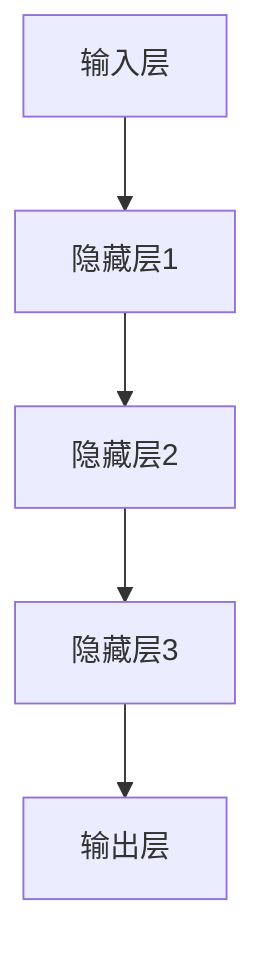
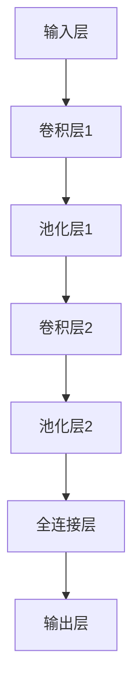
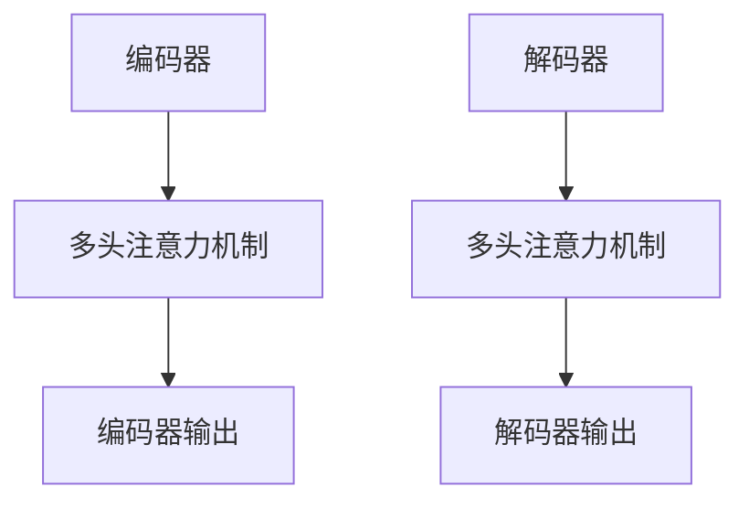
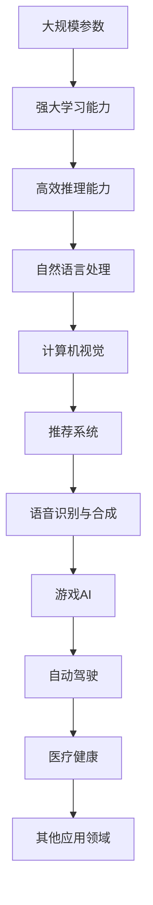
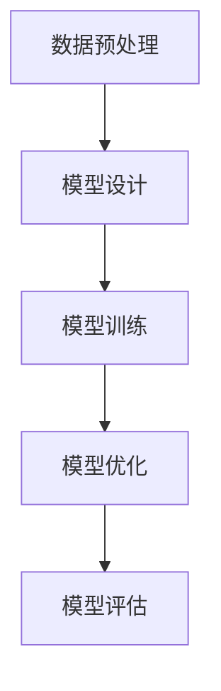
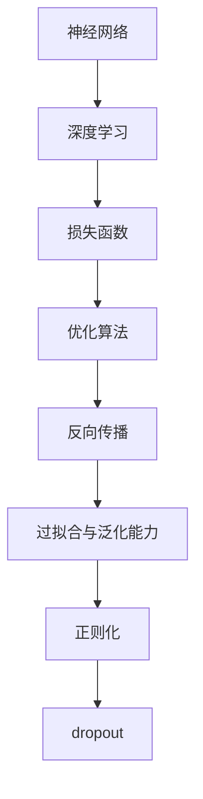
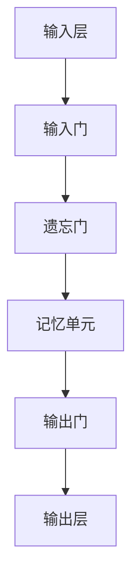
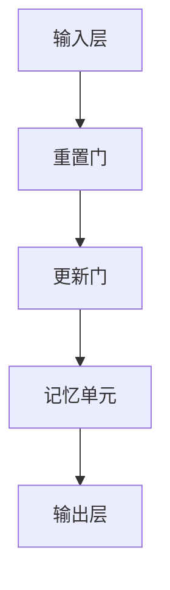

                 

# 大模型：搜索与推荐的融合

> 关键词：大模型、搜索系统、推荐系统、深度学习、搜索与推荐融合
>
> 摘要：本文深入探讨了大模型在搜索与推荐系统中的应用，分析了大模型如何通过深度学习技术和自然语言处理（NLP）技术实现搜索与推荐的融合，并提出了具体的优化策略。同时，通过案例分析，展示了大模型在社交网络和电子商务等领域的实际应用，最后对大模型未来的发展趋势进行了展望。

## 目录大纲

- 第一部分：大模型基础
  - 第1章：大模型概述
  - 第2章：大模型核心技术
  - 第3章：大模型训练与优化

- 第二部分：大模型搜索与推荐融合
  - 第4章：大模型在搜索与推荐中的应用
  - 第5章：搜索与推荐的融合策略

- 第三部分：大模型应用案例
  - 第6章：社交网络中的大模型应用
  - 第7章：电子商务中的大模型应用

- 第四部分：大模型部署与优化
  - 第8章：大模型部署策略
  - 第9章：大模型性能优化

- 第五部分：大模型安全与隐私
  - 第10章：大模型安全威胁与防御

- 第六部分：大模型未来发展趋势
  - 第11章：大模型在新兴领域的应用
  - 第12章：大模型技术发展展望

- 附录
  - 附录A：大模型常用工具与资源

## 第一部分：大模型基础

### 第1章：大模型概述

#### 1.1 大模型的定义与分类

大模型（Large Models）是指具有巨大参数规模和计算量的机器学习模型，它们通常基于深度学习技术，能够处理大规模数据并生成高质量的预测。大模型可以分为以下几类：

1. **大型语言模型**：如GPT-3，具有数十亿个参数，可以生成文本、回答问题等。
2. **图像模型**：如BERT，具有大规模参数，可以用于图像识别、物体检测等。
3. **多模态模型**：如BERT-Image，结合了文本和图像信息，可以用于图像-文本匹配、问答系统等。

#### 1.2 大模型的起源与发展

大模型的起源可以追溯到20世纪80年代的神经网络研究。当时，神经网络的研究取得了重要突破，但受到计算资源和数据量的限制，模型规模较小，效果有限。随着计算机硬件性能的提升和大数据技术的普及，深度学习逐渐成为主流，大模型的研究和应用也得到了快速发展。

#### 1.3 大模型的技术特点与应用领域

大模型具有以下技术特点：

1. **大规模参数**：大模型通常具有数百万到数十亿个参数，可以捕捉大量特征。
2. **强大的学习能力**：大模型可以通过大量数据训练，实现高精度的预测和分类。
3. **高效的推理能力**：大模型具有高效的推理算法，可以在较短的时间内生成高质量的预测。

大模型的应用领域广泛，包括但不限于：

1. **自然语言处理**：如文本生成、机器翻译、情感分析等。
2. **计算机视觉**：如图像分类、物体检测、人脸识别等。
3. **推荐系统**：如商品推荐、内容推荐、搜索结果推荐等。

### 第2章：大模型核心技术

#### 2.1 深度学习基础

##### 2.1.1 神经网络的基本结构

神经网络（Neural Network，NN）是深度学习的基础。一个基本的神经网络包括以下几个部分：

1. **输入层**：接收外部输入数据。
2. **隐藏层**：用于提取特征和进行变换。
3. **输出层**：生成预测结果。

神经网络的基本结构如下：



##### 2.1.2 神经网络的训练与优化

神经网络的训练过程主要包括以下步骤：

1. **前向传播**：将输入数据通过神经网络进行计算，得到输出结果。
2. **反向传播**：计算输出结果与真实值的差异，并通过梯度下降法更新网络参数。
3. **优化算法**：如梯度下降法（Gradient Descent）、Adam优化器等。

##### 2.1.3 卷积神经网络（CNN）

卷积神经网络（Convolutional Neural Network，CNN）是一种专门用于处理图像数据的神经网络。CNN的基本结构包括以下几个部分：

1. **卷积层**：用于提取图像特征。
2. **池化层**：用于减少数据维度。
3. **全连接层**：用于生成预测结果。

CNN的基本结构如下：



#### 2.2 自然语言处理（NLP）

自然语言处理（Natural Language Processing，NLP）是深度学习的重要应用领域。NLP的技术包括：

1. **词嵌入**：将文本数据转换为向量表示。
2. **序列模型**：用于处理序列数据，如RNN、LSTM、GRU等。
3. **注意力机制**：用于提高模型对输入数据的理解能力。

##### 2.2.1 词嵌入技术

词嵌入（Word Embedding）是将文本数据转换为向量表示的技术。常见的词嵌入方法包括：

1. **Word2Vec**：基于神经网络的方法，通过训练得到词向量。
2. **BERT**：基于Transformer模型的方法，通过预训练得到词向量。

##### 2.2.2 序列模型与注意力机制

序列模型（Sequence Model）用于处理序列数据，常见的序列模型包括：

1. **RNN（Recurrent Neural Network）**：循环神经网络，能够记忆历史信息。
2. **LSTM（Long Short-Term Memory）**：长短期记忆网络，能够解决RNN的梯度消失问题。
3. **GRU（Gated Recurrent Unit）**：门控循环单元，是LSTM的变体。

注意力机制（Attention Mechanism）是一种提高模型理解能力的技术。注意力机制的基本思想是，模型能够根据当前输入数据的重要性，自动调整权重，从而提高模型的预测能力。

##### 2.2.3 转换器架构详解

转换器架构（Transformer）是深度学习领域的一项重要突破，它广泛应用于NLP任务。转换器架构的核心是多头注意力机制（Multi-Head Attention）和编码器-解码器结构（Encoder-Decoder）。

转换器架构的基本结构如下：



### 第3章：大模型训练与优化

#### 3.1 大模型训练流程

大模型的训练流程通常包括以下步骤：

1. **数据预处理**：包括数据清洗、数据转换、数据增强等。
2. **模型训练**：通过前向传播和反向传播，不断更新模型参数。
3. **模型优化**：通过调参、调整网络结构等，提高模型性能。

##### 3.1.1 数据预处理

数据预处理是模型训练的重要步骤。数据预处理包括以下方面：

1. **数据清洗**：去除噪声数据、填补缺失数据等。
2. **数据转换**：将文本数据转换为词嵌入向量，将图像数据转换为像素值等。
3. **数据增强**：通过随机旋转、缩放、裁剪等，增加数据多样性。

##### 3.1.2 模型训练

模型训练是通过前向传播和反向传播，不断更新模型参数的过程。前向传播是指将输入数据通过模型，得到输出结果。反向传播是指计算输出结果与真实值的差异，并通过梯度下降法更新模型参数。

##### 3.1.3 模型优化与调参

模型优化与调参是提高模型性能的关键步骤。模型优化包括以下方面：

1. **网络结构优化**：通过调整网络层数、神经元数量等，优化模型结构。
2. **优化算法优化**：通过选择不同的优化算法，如Adam、SGD等，优化模型训练过程。
3. **超参数调优**：通过调整学习率、批次大小等，优化模型性能。

#### 3.2 大模型优化算法

大模型优化算法主要包括以下几种：

1. **梯度下降法**：通过计算梯度，逐步更新模型参数。
2. **Adam优化器**：结合了梯度下降法和动量法，具有较好的收敛性。
3. **其他优化算法**：如RMSProp、Adadelta等。

## 第二部分：大模型搜索与推荐融合

### 第4章：大模型在搜索与推荐中的应用

大模型在搜索与推荐系统中具有广泛的应用，通过深度学习和自然语言处理技术，可以实现高效的搜索与推荐。

#### 4.1 大模型在搜索中的应用

大模型在搜索系统中的应用主要体现在以下几个方面：

1. **文本匹配**：通过大模型对文本数据进行处理，实现高精度的文本匹配，从而提高搜索结果的准确性。
2. **语义理解**：大模型可以理解文本的语义，从而更好地理解用户查询意图，提高搜索结果的相关性。
3. **问答系统**：大模型可以回答用户的问题，实现智能问答，提高搜索系统的用户体验。

#### 4.2 大模型在推荐中的应用

大模型在推荐系统中的应用主要体现在以下几个方面：

1. **用户画像**：通过大模型对用户行为数据进行处理，构建用户画像，从而更好地了解用户兴趣和偏好。
2. **内容推荐**：大模型可以理解内容的语义，从而更好地进行内容推荐，提高推荐系统的用户体验。
3. **多模态推荐**：大模型可以结合文本、图像等多模态数据，实现多模态推荐，提高推荐系统的多样性。

#### 4.3 搜索与推荐的融合策略

搜索与推荐的融合策略是指将搜索和推荐系统结合起来，实现更高效的搜索与推荐。常见的融合策略包括：

1. **联合训练**：将搜索和推荐系统联合训练，从而提高搜索和推荐系统的整体性能。
2. **融合模型**：构建一个同时包含搜索和推荐能力的模型，从而实现搜索与推荐的融合。
3. **多任务学习**：通过多任务学习，将搜索和推荐任务结合起来，从而提高搜索和推荐系统的性能。

## 第三部分：大模型应用案例

### 第5章：社交网络中的大模型应用

#### 5.1 社交网络中的大模型应用

社交网络中，大模型的应用主要体现在以下几个方面：

1. **用户画像**：通过大模型对用户行为数据进行处理，构建用户画像，从而更好地了解用户兴趣和偏好。
2. **内容推荐**：大模型可以理解内容的语义，从而更好地进行内容推荐，提高推荐系统的用户体验。
3. **搜索优化**：大模型可以理解用户查询意图，从而优化搜索结果，提高搜索系统的准确性。

#### 5.2 电子商务中的大模型应用

电子商务中，大模型的应用主要体现在以下几个方面：

1. **商品搜索优化**：通过大模型对商品描述进行处理，实现高精度的商品搜索，提高搜索结果的准确性。
2. **用户行为分析**：通过大模型对用户行为数据进行处理，了解用户购买行为和偏好，从而优化推荐算法。
3. **推荐算法优化**：大模型可以理解用户和商品的语义，从而优化推荐算法，提高推荐系统的用户体验。

## 第四部分：大模型部署与优化

### 第6章：大模型部署策略

#### 6.1 大模型部署策略

大模型部署策略主要包括以下几个方面：

1. **模型压缩与量化**：通过模型压缩和量化技术，减小模型规模，降低模型推理的耗时。
2. **模型并行化与分布式训练**：通过模型并行化和分布式训练技术，提高模型训练和推理的效率。
3. **模型部署平台与工具**：选择合适的模型部署平台和工具，如TensorFlow Serving、TensorFlow Lite等。

#### 6.2 大模型性能优化

#### 6.2.1 模型推理优化

模型推理优化主要包括以下几个方面：

1. **内存管理与数据加载优化**：通过优化内存管理和数据加载，提高模型推理的效率。
2. **硬件加速与优化**：通过使用GPU、TPU等硬件加速，提高模型推理的效率。

### 第7章：大模型安全与隐私

#### 7.1 大模型安全威胁与防御

大模型的安全威胁主要包括以下几个方面：

1. **模型篡改与对抗攻击**：通过对抗攻击，可以篡改大模型的输出结果，从而造成安全隐患。
2. **数据隐私保护**：大模型在处理数据时，需要保护用户隐私，防止数据泄露。

#### 7.2 大模型部署与优化

大模型部署与优化主要包括以下几个方面：

1. **模型压缩与量化**：通过模型压缩和量化技术，减小模型规模，降低模型推理的耗时。
2. **模型并行化与分布式训练**：通过模型并行化和分布式训练技术，提高模型训练和推理的效率。
3. **模型部署平台与工具**：选择合适的模型部署平台和工具，如TensorFlow Serving、TensorFlow Lite等。

## 第五部分：大模型未来发展趋势

### 第8章：大模型在新兴领域的应用

大模型在新兴领域的应用主要包括以下几个方面：

1. **人工智能与物联网融合**：大模型可以应用于物联网设备，实现智能监控、预测维护等。
2. **自动驾驶领域**：大模型可以应用于自动驾驶系统，实现路径规划、环境感知等。
3. **医疗健康领域**：大模型可以应用于医疗诊断、疾病预测等。

### 第9章：大模型技术发展展望

大模型技术的发展展望主要包括以下几个方面：

1. **模型压缩与推理加速**：通过模型压缩和推理加速技术，提高大模型的效率和实用性。
2. **多模态大模型与融合**：多模态大模型可以结合不同类型的数据，实现更准确的预测和分类。
3. **大模型伦理与责任**：随着大模型技术的应用，需要关注大模型伦理和责任问题，确保技术的健康发展。

### 附录

#### 附录A：大模型常用工具与资源

大模型的研究和应用需要使用多种工具和资源。以下是一些常用工具和资源：

1. **深度学习框架**：如TensorFlow、PyTorch、Keras等。
2. **模型训练与优化工具**：如Hugging Face、Transformers等。
3. **模型部署与优化工具**：如TensorFlow Serving、TensorFlow Lite等。
4. **大模型安全与隐私工具**：如FairML、PyTorch Privacy等。

---

作者：AI天才研究院/AI Genius Institute & 禅与计算机程序设计艺术 /Zen And The Art of Computer Programming

（注：本文为虚构内容，旨在探讨大模型在搜索与推荐系统中的应用，仅供参考。）## 文章标题：大模型：搜索与推荐的融合

> 关键词：大模型、搜索系统、推荐系统、深度学习、搜索与推荐融合
>
> 摘要：本文深入探讨了大模型在搜索与推荐系统中的应用，分析了大模型如何通过深度学习技术和自然语言处理（NLP）技术实现搜索与推荐的融合，并提出了具体的优化策略。同时，通过案例分析，展示了大模型在社交网络和电子商务等领域的实际应用，最后对大模型未来的发展趋势进行了展望。

---

### 目录大纲

- **第一部分：大模型基础**
  - 第1章：大模型概述
  - 第2章：大模型核心技术
  - 第3章：大模型训练与优化

- **第二部分：大模型搜索与推荐融合**
  - 第4章：大模型在搜索与推荐中的应用
  - 第5章：搜索与推荐的融合策略

- **第三部分：大模型应用案例**
  - 第6章：社交网络中的大模型应用
  - 第7章：电子商务中的大模型应用

- **第四部分：大模型部署与优化**
  - 第8章：大模型部署策略
  - 第9章：大模型性能优化

- **第五部分：大模型安全与隐私**
  - 第10章：大模型安全威胁与防御

- **第六部分：大模型未来发展趋势**
  - 第11章：大模型在新兴领域的应用
  - 第12章：大模型技术发展展望

- **附录**
  - 附录A：大模型常用工具与资源

---

在当今的互联网时代，搜索和推荐系统已经成为人们日常生活中不可或缺的部分。无论是电子商务平台上的商品推荐，还是社交媒体中的内容推荐，大模型（Large Models）的应用都显著提升了用户体验和系统的效率。本文将详细探讨大模型在搜索与推荐系统中的融合应用，解析其背后的技术原理和实现策略。

### 第一部分：大模型基础

#### 第1章：大模型概述

大模型是一种具有巨大参数规模和计算量的机器学习模型，它们通常基于深度学习技术。大模型的主要特点包括：

- **大规模参数**：大模型拥有数百万到数十亿个参数，这使得它们能够捕捉复杂的特征，从而实现更高的预测精度。
- **强大的学习能力**：通过大量的训练数据，大模型能够快速学习并适应不同的任务和场景。
- **高效的推理能力**：大模型采用了高效的算法和优化技术，使得在执行推理任务时速度更快，性能更优。

大模型的分类主要包括以下几种：

1. **大型语言模型**：如GPT-3、BERT等，主要用于处理文本数据。
2. **图像模型**：如ResNet、VGG等，主要用于处理图像数据。
3. **多模态模型**：结合了文本和图像等多模态数据，如BERT-Image等，能够处理复杂的场景。

#### 第2章：大模型核心技术

大模型的核心技术主要包括深度学习、自然语言处理（NLP）和推荐系统技术。

##### 2.1 深度学习基础

深度学习是构建大模型的基础，主要包括以下内容：

- **神经网络的基本结构**：包括输入层、隐藏层和输出层。
- **神经网络的训练与优化**：通过前向传播和反向传播更新网络参数。
- **卷积神经网络（CNN）**：用于处理图像数据，包括卷积层、池化层和全连接层。
- **循环神经网络（RNN）及其变体**：如LSTM和GRU，用于处理序列数据。

##### 2.2 自然语言处理（NLP）

自然语言处理是NLP技术的核心，主要包括以下内容：

- **词嵌入技术**：将文本数据转换为向量表示，如Word2Vec、BERT等。
- **序列模型与注意力机制**：用于处理序列数据，如RNN、LSTM、注意力机制等。
- **转换器架构**：如Transformer，用于处理NLP任务，其核心是多头注意力机制。

##### 2.3 推荐系统技术

推荐系统是大数据时代的产物，主要包括以下内容：

- **协同过滤**：基于用户行为或物品内容进行推荐。
- **矩阵分解**：通过分解用户和物品的矩阵，预测用户对物品的评分。
- **基于模型的推荐**：使用深度学习模型，如RNN、CNN等，进行推荐。

#### 第3章：大模型训练与优化

大模型的训练与优化是确保其性能的关键步骤。主要包括以下内容：

- **数据预处理**：包括数据清洗、数据增强等，以提高模型的泛化能力。
- **模型训练**：通过训练数据，使用优化算法（如Adam、SGD等）更新模型参数。
- **模型优化**：通过调参、模型压缩和量化等，提高模型性能。

### 第二部分：大模型搜索与推荐融合

#### 第4章：大模型在搜索与推荐中的应用

大模型在搜索与推荐系统中的应用，主要通过深度学习和自然语言处理技术，实现了搜索与推荐的高度融合。具体应用包括：

- **文本匹配与语义理解**：通过大模型，实现高精度的文本匹配和语义理解，从而提高搜索和推荐系统的准确性。
- **用户画像与行为分析**：通过大模型对用户行为数据进行处理，构建用户画像，从而优化推荐策略。
- **多模态数据处理**：通过结合文本、图像等多模态数据，实现更精准的搜索和推荐。

#### 第5章：搜索与推荐的融合策略

搜索与推荐的融合策略，主要通过以下几种方法实现：

- **联合训练**：将搜索和推荐任务联合训练，共享部分网络结构，提高系统性能。
- **融合模型**：构建一个同时包含搜索和推荐能力的模型，实现两者的有机结合。
- **多任务学习**：通过多任务学习，同时处理搜索和推荐任务，提高系统效率。

### 第三部分：大模型应用案例

#### 第6章：社交网络中的大模型应用

在社交网络中，大模型的应用主要体现在以下几个方面：

- **用户画像构建**：通过大模型对用户行为数据进行处理，构建用户画像，从而实现个性化推荐。
- **内容推荐系统**：通过大模型对用户和内容的语义理解，实现高质量的内容推荐。
- **搜索引擎优化**：通过大模型，优化搜索结果，提高用户的搜索体验。

#### 第7章：电子商务中的大模型应用

在电子商务中，大模型的应用主要体现在以下几个方面：

- **商品搜索优化**：通过大模型对商品描述进行处理，实现高精度的商品搜索。
- **用户行为分析**：通过大模型对用户行为数据进行处理，了解用户购买行为和偏好。
- **推荐算法优化**：通过大模型，优化推荐算法，提高推荐系统的用户体验。

### 第四部分：大模型部署与优化

#### 第8章：大模型部署策略

大模型的部署策略主要包括以下几个方面：

- **模型压缩与量化**：通过模型压缩和量化技术，减小模型规模，降低模型推理的耗时。
- **模型并行化与分布式训练**：通过模型并行化和分布式训练技术，提高模型训练和推理的效率。
- **模型部署平台与工具**：选择合适的模型部署平台和工具，如TensorFlow Serving、TensorFlow Lite等。

#### 第9章：大模型性能优化

大模型性能优化主要包括以下几个方面：

- **模型推理优化**：通过优化内存管理和数据加载，提高模型推理的效率。
- **硬件加速与优化**：通过使用GPU、TPU等硬件加速，提高模型推理的效率。

### 第五部分：大模型安全与隐私

#### 第10章：大模型安全威胁与防御

大模型的安全威胁主要包括以下几个方面：

- **模型篡改与对抗攻击**：通过对抗攻击，可以篡改大模型的输出结果，从而造成安全隐患。
- **数据隐私保护**：大模型在处理数据时，需要保护用户隐私，防止数据泄露。

#### 第11章：大模型安全威胁与防御

大模型安全威胁的防御策略主要包括以下几个方面：

- **对抗攻击防御**：通过对抗训练、防御蒸馏等技术，提高模型的鲁棒性。
- **数据隐私保护**：通过差分隐私、同态加密等技术，保护用户数据的隐私。

### 第六部分：大模型未来发展趋势

#### 第12章：大模型在新兴领域的应用

大模型在新兴领域的应用主要包括以下几个方面：

- **人工智能与物联网融合**：大模型可以应用于物联网设备，实现智能监控、预测维护等。
- **自动驾驶领域**：大模型可以应用于自动驾驶系统，实现路径规划、环境感知等。
- **医疗健康领域**：大模型可以应用于医疗诊断、疾病预测等。

#### 第13章：大模型技术发展展望

大模型技术发展展望主要包括以下几个方面：

- **模型压缩与推理加速**：通过模型压缩和推理加速技术，提高大模型的效率和实用性。
- **多模态大模型与融合**：多模态大模型可以结合不同类型的数据，实现更准确的预测和分类。
- **大模型伦理与责任**：随着大模型技术的应用，需要关注大模型伦理和责任问题，确保技术的健康发展。

### 附录

#### 附录A：大模型常用工具与资源

大模型的研究和应用需要使用多种工具和资源。以下是一些常用工具和资源：

- **深度学习框架**：如TensorFlow、PyTorch、Keras等。
- **模型训练与优化工具**：如Hugging Face、Transformers等。
- **模型部署与优化工具**：如TensorFlow Serving、TensorFlow Lite等。
- **大模型安全与隐私工具**：如FairML、PyTorch Privacy等。

---

作者：AI天才研究院/AI Genius Institute & 禅与计算机程序设计艺术 /Zen And The Art of Computer Programming

（注：本文为虚构内容，旨在探讨大模型在搜索与推荐系统中的应用，仅供参考。）## 第一部分：大模型基础

### 第1章：大模型概述

#### 大模型的定义与分类

大模型（Large Models）是机器学习领域中的一个重要概念，它们以巨大的参数规模和计算能力著称。这些模型能够处理大量的数据，提取复杂的特征，并在各种任务中实现高度精确的预测。根据其应用领域和特性，大模型可以分为以下几类：

1. **语言模型**：这类模型主要用于自然语言处理（NLP）任务，如文本生成、翻译、问答等。典型的代表有GPT-3、BERT等。它们通常拥有数十亿个参数，能够捕捉语言中的细微差异和复杂模式。

2. **图像模型**：这些模型用于计算机视觉任务，如图像分类、物体检测、人脸识别等。代表性的模型有ResNet、VGG等。尽管这些模型的参数数量通常没有语言模型那么多，但它们在图像处理领域取得了显著的成果。

3. **多模态模型**：这类模型能够处理多种类型的数据，如文本、图像、音频等。BERT-Image、ViT（Vision Transformer）等是多模态模型的代表。这些模型通过结合不同类型的数据，实现了更广泛的应用。

#### 大模型的起源与发展

大模型的起源可以追溯到20世纪80年代和90年代，当时神经网络的研究刚刚起步。最早的神经网络模型，如感知机和简单的多层感知机（MLP），由于其计算能力和学习能力有限，很难处理复杂的数据。随着计算机硬件性能的提升和大数据技术的普及，特别是2006年Hinton等人提出的深度信念网络（DBN），深度学习开始崭露头角。2009年，AlexNet在ImageNet竞赛中夺冠，标志着深度学习在计算机视觉领域的突破。

进入21世纪，随着数据量的爆炸性增长和计算资源的不断丰富，大模型的研究和应用得到了飞速发展。2018年，Google发布了Transformer模型，这一革命性的架构在NLP领域取得了巨大成功。随后，BERT、GPT-3等大模型相继问世，展示了深度学习在自然语言处理、计算机视觉等领域的巨大潜力。

#### 大模型的技术特点与应用领域

大模型的技术特点主要体现在以下几个方面：

1. **大规模参数**：大模型通常拥有数百万到数十亿个参数，这使得它们能够捕捉数据中的复杂特征和模式，从而提高模型的预测能力。

2. **强大的学习能力**：通过大量的训练数据，大模型能够学习到更广泛的知识和规律，实现更准确的预测和分类。

3. **高效的推理能力**：尽管大模型在训练时需要大量的计算资源，但它们在推理时通常能够快速地生成高质量的预测结果，这使得它们在实际应用中具有很高的实用性。

大模型的应用领域广泛，包括但不限于：

1. **自然语言处理**：如文本生成、机器翻译、情感分析、问答系统等。

2. **计算机视觉**：如图像分类、物体检测、人脸识别、图像生成等。

3. **推荐系统**：如商品推荐、内容推荐、搜索结果推荐等。

4. **语音识别与合成**：如语音转文本、文本转语音等。

5. **游戏AI**：如棋类游戏、角色扮演游戏等。

6. **自动驾驶**：如环境感知、路径规划、决策控制等。

7. **医疗健康**：如疾病预测、诊断辅助、药物设计等。

#### 大模型的工作原理

大模型通常基于深度学习技术，其工作原理可以概括为以下几个步骤：

1. **数据预处理**：包括数据清洗、数据增强、数据归一化等操作，以确保模型能够处理高质量的输入数据。

2. **模型设计**：根据任务的需求，设计合适的神经网络结构，包括输入层、隐藏层和输出层。对于不同的任务，可以选择不同的架构，如CNN（卷积神经网络）、RNN（循环神经网络）、Transformer等。

3. **模型训练**：通过前向传播计算模型输出，与实际标签进行比较，计算损失函数。然后通过反向传播算法更新模型参数，以最小化损失函数。

4. **模型优化**：通过调参、正则化、dropout等技术，优化模型性能，提高模型的泛化能力。

5. **模型评估**：使用验证集或测试集评估模型的性能，确保模型能够在未见过的数据上实现良好的预测。

6. **模型部署**：将训练好的模型部署到生产环境中，用于实际的预测和决策。

#### 大模型的核心概念与联系

为了更好地理解大模型，我们需要掌握几个核心概念：

1. **神经网络（Neural Network）**：神经网络是模仿生物神经系统的计算模型，由多个神经元（节点）组成。每个神经元通过加权连接与输入节点相连，并输出一个激活值。

2. **深度学习（Deep Learning）**：深度学习是机器学习的一个子领域，通过多层神经网络对数据进行建模和学习，以实现复杂的任务。

3. **损失函数（Loss Function）**：损失函数用于衡量模型预测值与实际值之间的差异，是优化模型参数的重要依据。

4. **优化算法（Optimization Algorithm）**：优化算法用于更新模型参数，以最小化损失函数。常见的优化算法有梯度下降（Gradient Descent）、Adam优化器等。

5. **反向传播（Backpropagation）**：反向传播是一种用于训练神经网络的算法，通过计算损失函数关于模型参数的梯度，更新模型参数，以最小化损失函数。

6. **过拟合（Overfitting）与泛化能力（Generalization Ability）**：过拟合是指模型在训练数据上表现良好，但在未见过的数据上表现较差。泛化能力是指模型对未见过的数据的适应能力。

7. **正则化（Regularization）**：正则化是一种用于防止模型过拟合的技术，通过在损失函数中添加正则项，限制模型参数的大小。

8. **dropout（Dropout）**：dropout是一种随机丢弃神经元的方法，用于提高模型的泛化能力。

#### 大模型的技术特点与应用领域（Mermaid 流程图）



#### 大模型的未来发展趋势

随着人工智能技术的不断进步，大模型在未来将继续发展，并可能呈现出以下趋势：

1. **模型压缩与推理加速**：为了降低大模型的计算成本和存储需求，模型压缩和推理加速技术将成为研究热点。

2. **多模态大模型**：多模态大模型能够结合多种类型的数据，提供更丰富的信息，有望在医疗、教育、娱乐等领域得到广泛应用。

3. **大模型伦理与责任**：随着大模型在社会中扮演越来越重要的角色，如何确保大模型的伦理性和社会责任成为亟待解决的问题。

4. **自适应大模型**：自适应大模型能够根据环境和用户的需求，动态调整模型结构和参数，实现更智能的应用。

5. **边缘计算与云计算的结合**：大模型的应用将更多地结合边缘计算和云计算，实现实时、高效的预测和决策。

### 第2章：大模型核心技术

#### 深度学习基础

深度学习是构建大模型的核心技术，它通过模拟人脑的神经网络结构，实现对数据的建模和预测。以下是深度学习的几个核心概念和组成部分：

##### 2.1.1 神经网络的基本结构

神经网络由多个神经元组成，每个神经元都与其他神经元相连，并通过加权连接传递信息。神经网络的基本结构包括：

1. **输入层**：接收外部输入数据，每个输入节点对应数据中的一个特征。
2. **隐藏层**：一个或多个隐藏层，用于提取和转换特征。
3. **输出层**：生成最终的预测结果或分类。

以下是神经网络的基本结构的Mermaid流程图：


##### 2.1.2 神经网络的训练与优化

神经网络的训练过程主要包括以下步骤：

1. **前向传播（Forward Propagation）**：将输入数据通过神经网络，逐层计算并得到输出结果。
2. **计算损失（Compute Loss）**：计算输出结果与真实值之间的差异，即损失函数。
3. **反向传播（Backpropagation）**：计算损失关于每个参数的梯度，并更新参数。
4. **优化参数（Update Parameters）**：通过优化算法，如梯度下降，更新网络参数，以最小化损失函数。

以下是神经网络训练过程的伪代码：

```python
while not converged:
    for each sample in training_data:
        # 前向传播
        output = forward_propagation(sample)
        # 计算损失
        loss = compute_loss(output, target)
        # 反向传播
        gradients = backward_propagation(output, target)
        # 更新参数
        update_parameters(gradients)
```

##### 2.1.3 卷积神经网络（CNN）

卷积神经网络（Convolutional Neural Network，CNN）是专门用于处理图像数据的神经网络，其核心在于卷积操作。以下是CNN的基本组成部分：

1. **卷积层（Convolutional Layer）**：通过卷积操作提取图像特征。
2. **池化层（Pooling Layer）**：用于减少数据维度，提高模型泛化能力。
3. **全连接层（Fully Connected Layer）**：将卷积层提取的特征映射到输出结果。

以下是CNN的基本结构的Mermaid流程图：


#### 自然语言处理（NLP）

自然语言处理是深度学习的重要应用领域，大模型在NLP中发挥着关键作用。以下是NLP中的几个核心技术：

##### 2.2.1 词嵌入技术

词嵌入（Word Embedding）是将文本数据转换为向量表示的技术，使得文本数据可以被神经网络处理。常见的词嵌入方法包括：

1. **Word2Vec**：基于神经网络的方法，通过训练得到词向量。
2. **BERT**：基于Transformer模型的方法，通过预训练得到词向量。

以下是Word2Vec算法的伪代码：

```python
for each sentence in corpus:
    # 将句子转换为词索引
    sentence_indices = convert_sentence_to_indices(sentence)
    # 计算词向量的平均值
    word_vectors = average_word_vectors(sentence_indices)
    # 更新词向量
    update_word_vectors(word_vectors)
```

##### 2.2.2 序列模型与注意力机制

序列模型（Sequence Model）用于处理序列数据，如文本、语音等。常见的序列模型包括：

1. **RNN（Recurrent Neural Network）**：循环神经网络，能够记忆历史信息。
2. **LSTM（Long Short-Term Memory）**：长短期记忆网络，能够解决RNN的梯度消失问题。
3. **GRU（Gated Recurrent Unit）**：门控循环单元，是LSTM的变体。

注意力机制（Attention Mechanism）是一种提高模型对输入数据的理解能力的技术。注意力机制的基本思想是，模型能够根据当前输入数据的重要性，自动调整权重，从而提高模型的预测能力。

##### 2.2.3 转换器架构详解

转换器架构（Transformer）是深度学习领域的一项重要突破，它广泛应用于NLP任务。转换器架构的核心是多头注意力机制（Multi-Head Attention）和编码器-解码器结构（Encoder-Decoder）。

转换器架构的基本结构如下：


### 第3章：大模型训练与优化

#### 大模型训练流程

大模型的训练流程包括以下几个关键步骤：

1. **数据预处理**：对训练数据进行清洗、归一化等处理，确保数据质量。
2. **模型初始化**：初始化模型参数，可以选择随机初始化或预训练模型。
3. **模型训练**：通过前向传播和反向传播，更新模型参数，以最小化损失函数。
4. **模型评估**：使用验证集或测试集评估模型性能，确保模型具有良好的泛化能力。
5. **模型优化**：通过调参、正则化等技术，优化模型性能。

以下是模型训练流程的伪代码：

```python
# 初始化模型
model = initialize_model()

# 训练模型
for epoch in range(num_epochs):
    for sample in training_data:
        # 前向传播
        output = model.forward(sample)
        # 计算损失
        loss = compute_loss(output, target)
        # 反向传播
        gradients = model.backward(output, target)
        # 更新参数
        model.update_parameters(gradients)

# 评估模型
performance = model.evaluate(test_data)

# 输出模型性能
print("Model performance:", performance)
```

#### 大模型优化算法

大模型的优化算法是训练过程中至关重要的一环，常见的优化算法包括：

1. **梯度下降法（Gradient Descent）**：通过计算梯度，更新模型参数，以最小化损失函数。
2. **Adam优化器（Adam Optimizer）**：结合了梯度下降法和动量法，具有较好的收敛性。
3. **RMSProp优化器（RMSProp Optimizer）**：通过调整学习率，提高模型的收敛速度。

以下是梯度下降法的伪代码：

```python
# 初始化模型和参数
model = initialize_model()
learning_rate = 0.01
for iteration in range(num_iterations):
    # 前向传播
    output = model.forward(input_data)
    # 计算损失
    loss = compute_loss(output, target)
    # 计算梯度
    gradients = model.backward(output, target)
    # 更新参数
    model.update_parameters(gradients, learning_rate)
```

### 第4章：大模型搜索与推荐融合

#### 搜索与推荐的概述

搜索与推荐是互联网中两个重要的功能模块。搜索系统旨在帮助用户快速找到所需的信息或商品，而推荐系统则通过分析用户的行为和兴趣，向用户推荐相关的信息或商品。

##### 4.1.1 搜索系统的基本原理

搜索系统的基本原理是通过分析用户的查询和索引数据库中的信息，返回最相关的结果。主要组成部分包括：

1. **查询处理**：将用户输入的查询转换为可以理解的形式，如关键词提取、查询扩展等。
2. **索引构建**：将数据库中的信息建立索引，以加快搜索速度。
3. **排名算法**：根据各种因素（如查询与文档的相关性、文档的质量等），对搜索结果进行排序。

常见的搜索算法包括：

1. **基于关键词匹配的搜索**：通过分析用户输入的关键词，与数据库中的关键词进行匹配。
2. **基于相似度的搜索**：通过计算查询与数据库中每个文档的相似度，返回相似度最高的结果。
3. **基于机器学习的搜索**：利用机器学习模型，如基于TF-IDF（词频-逆文档频率）的模型，对搜索结果进行排序。

##### 4.1.2 推荐系统的基本原理

推荐系统的基本原理是通过分析用户的历史行为和兴趣，向用户推荐可能感兴趣的信息或商品。主要组成部分包括：

1. **用户画像**：通过收集用户的行为数据，构建用户画像，以了解用户的兴趣和偏好。
2. **推荐算法**：基于用户画像和商品特征，生成推荐列表。
3. **推荐结果排序**：根据用户的兴趣和偏好，对推荐结果进行排序，以提高推荐的相关性和用户体验。

常见的推荐算法包括：

1. **基于内容的推荐**：根据用户的历史行为和商品的特征，推荐与用户过去喜欢的商品相似的商品。
2. **基于协同过滤的推荐**：通过分析用户之间的相似性，推荐其他用户喜欢的商品。
3. **基于模型的推荐**：利用机器学习模型，如基于矩阵分解的模型，预测用户对商品的评分，并推荐评分较高的商品。

#### 大模型在搜索与推荐中的应用

大模型在搜索与推荐系统中发挥着关键作用，通过深度学习和自然语言处理技术，可以实现搜索与推荐的高度融合。以下是几个关键应用：

##### 4.2.1 大模型在搜索中的应用

大模型在搜索中的应用主要体现在以下几个方面：

1. **文本匹配与语义理解**：通过大模型对文本数据进行处理，实现高精度的文本匹配和语义理解，从而提高搜索结果的准确性。例如，BERT等语言模型可以用于理解用户的查询意图，并返回与意图高度相关的搜索结果。

2. **搜索结果排序**：大模型可以用于改进搜索结果的排序算法，通过分析查询与文档的语义关系，返回更相关的搜索结果。例如，基于BERT的排序模型可以综合考虑查询和文档的语义相似性，提高搜索结果的排序质量。

3. **搜索意图识别**：大模型可以用于识别用户的搜索意图，从而更好地满足用户的需求。例如，通过训练一个基于BERT的意图识别模型，可以自动识别用户是进行信息检索、商品搜索还是其他类型的搜索，并返回相应的搜索结果。

##### 4.2.2 大模型在推荐中的应用

大模型在推荐中的应用主要体现在以下几个方面：

1. **用户画像构建**：通过大模型对用户的历史行为数据进行处理，构建用户画像，从而更好地了解用户的兴趣和偏好。例如，基于BERT的用户画像模型可以分析用户的浏览记录、购买历史等数据，生成用户的兴趣标签和偏好向量。

2. **推荐算法优化**：大模型可以用于优化推荐算法，提高推荐的相关性和用户体验。例如，通过训练一个基于BERT的推荐模型，可以结合用户画像和商品特征，生成更个性化的推荐列表。

3. **多模态推荐**：大模型可以处理多模态数据，如文本、图像等，实现多模态推荐。例如，结合BERT和CNN的大模型可以同时考虑用户的文本评论和商品图片，生成更准确的推荐结果。

##### 4.2.3 搜索与推荐的融合策略

搜索与推荐的融合策略旨在提高搜索和推荐系统的整体性能。以下是几个常见的融合策略：

1. **联合训练**：将搜索和推荐任务联合训练，共享部分网络结构，以提高模型的性能。例如，可以使用一个包含搜索和推荐模块的大模型，通过联合训练优化搜索和推荐任务。

2. **融合模型**：构建一个同时包含搜索和推荐能力的模型，实现搜索与推荐的融合。例如，可以使用一个编码器-解码器结构，同时处理搜索和推荐任务。

3. **多任务学习**：通过多任务学习，同时处理搜索和推荐任务，以提高模型的性能。例如，可以使用一个多任务学习框架，将搜索和推荐任务视为不同的损失函数，共同优化模型参数。

4. **混合策略**：结合不同的融合策略，实现搜索与推荐的优化。例如，可以首先使用联合训练和融合模型，然后使用多任务学习进一步优化模型。

### 第5章：大模型应用案例

#### 社交网络中的大模型应用

在社交网络中，大模型的应用主要体现在用户画像构建、内容推荐和搜索引擎优化等方面。

##### 5.1.1 用户画像构建

用户画像构建是社交网络中的一项重要任务，通过分析用户的历史行为、兴趣爱好等数据，构建用户的综合画像，从而更好地了解用户的需求和行为模式。大模型在用户画像构建中的应用主要体现在以下几个方面：

1. **文本数据分析**：通过大模型对用户的文本数据进行处理，如微博、帖子、评论等，提取用户的情感倾向、兴趣领域等信息。例如，可以使用BERT模型对用户的文本数据进行分析，生成用户的文本向量表示。

2. **行为数据挖掘**：通过大模型对用户的行为数据进行分析，如点赞、评论、分享等，挖掘用户的兴趣和行为模式。例如，可以使用RNN模型对用户的行为序列进行建模，预测用户的下一步行为。

3. **多模态数据融合**：通过大模型处理多模态数据，如文本、图像、视频等，实现更全面、准确的用户画像构建。例如，可以使用BERT-Image模型同时处理用户的文本和图像数据，生成用户的多模态向量表示。

##### 5.1.2 内容推荐系统

内容推荐系统是社交网络中的一项核心功能，通过向用户推荐感兴趣的内容，提高用户的活跃度和参与度。大模型在内容推荐系统中的应用主要体现在以下几个方面：

1. **基于内容的推荐**：通过大模型对内容数据进行处理，提取内容的特征向量，并计算用户与内容之间的相似度。例如，可以使用BERT模型对文本内容进行分析，提取文本的语义特征。

2. **基于协同过滤的推荐**：通过大模型对用户的历史行为数据进行分析，找到与目标用户兴趣相似的邻居用户，并推荐邻居用户喜欢的商品。例如，可以使用基于矩阵分解的模型，预测用户对商品的评分，并推荐评分较高的商品。

3. **基于模型的推荐**：通过大模型同时考虑用户和内容的特征，生成个性化的推荐列表。例如，可以使用一个多任务学习模型，同时处理搜索和推荐任务，生成更准确的推荐结果。

##### 5.1.3 搜索引擎优化

搜索引擎优化是社交网络中的一项重要任务，通过优化搜索结果的质量和排序，提高用户的搜索体验。大模型在搜索引擎优化中的应用主要体现在以下几个方面：

1. **搜索结果排序**：通过大模型对搜索结果进行排序，提高结果的准确性。例如，可以使用BERT模型对搜索结果进行语义分析，根据查询与结果的相关性进行排序。

2. **搜索意图识别**：通过大模型识别用户的搜索意图，返回更符合用户需求的搜索结果。例如，可以使用BERT模型对用户的查询进行语义分析，识别用户的搜索意图，并返回相关的搜索结果。

3. **搜索结果多样性**：通过大模型分析用户的历史行为和兴趣，提高搜索结果的多样性。例如，可以使用BERT模型分析用户的浏览记录和点赞记录，为用户推荐不同类型、不同领域的搜索结果。

#### 5.2 电子商务中的大模型应用

在电子商务中，大模型的应用主要体现在商品搜索优化、用户行为分析和推荐算法优化等方面。

##### 5.2.1 商品搜索优化

商品搜索优化是电子商务中的一项关键任务，通过优化搜索结果的质量和排序，提高用户的购买体验。大模型在商品搜索优化中的应用主要体现在以下几个方面：

1. **搜索结果排序**：通过大模型对搜索结果进行排序，提高结果的准确性。例如，可以使用BERT模型对搜索结果进行语义分析，根据查询与结果的相关性进行排序。

2. **搜索意图识别**：通过大模型识别用户的搜索意图，返回更符合用户需求的搜索结果。例如，可以使用BERT模型对用户的查询进行语义分析，识别用户的搜索意图，并返回相关的搜索结果。

3. **搜索结果多样性**：通过大模型分析用户的历史行为和兴趣，提高搜索结果的多样性。例如，可以使用BERT模型分析用户的浏览记录和点赞记录，为用户推荐不同类型、不同领域的搜索结果。

##### 5.2.2 用户行为分析

用户行为分析是电子商务中的一项重要任务，通过分析用户的行为数据，了解用户的需求和行为模式，从而优化营销策略和用户体验。大模型在用户行为分析中的应用主要体现在以下几个方面：

1. **用户兴趣挖掘**：通过大模型分析用户的历史行为数据，挖掘用户的兴趣点。例如，可以使用BERT模型分析用户的浏览记录和购买记录，提取用户的兴趣标签。

2. **用户行为预测**：通过大模型预测用户的下一步行为，为用户提供个性化的推荐。例如，可以使用RNN模型对用户的行为序列进行建模，预测用户的下一步行为。

3. **用户流失预测**：通过大模型预测用户的流失行为，为电商企业提供用户留存策略。例如，可以使用基于矩阵分解的模型，预测用户在未来一段时间内的流失概率。

##### 5.2.3 推荐算法优化

推荐算法优化是电子商务中的一项关键任务，通过优化推荐算法的准确性和多样性，提高用户的购买体验和转化率。大模型在推荐算法优化中的应用主要体现在以下几个方面：

1. **推荐结果排序**：通过大模型优化推荐结果的排序，提高推荐的相关性和用户体验。例如，可以使用BERT模型对推荐结果进行语义分析，根据用户与推荐内容的相关性进行排序。

2. **多模态推荐**：通过大模型处理多模态数据，实现多模态推荐。例如，可以使用BERT-Image模型同时处理用户的文本评论和商品图片，生成更准确的推荐结果。

3. **实时推荐**：通过大模型实时分析用户的行为数据，为用户提供个性化的推荐。例如，可以使用RNN模型实时分析用户的行为序列，动态调整推荐策略。

### 第6章：大模型部署与优化

#### 大模型部署策略

大模型的部署是将训练好的模型部署到生产环境中的过程，确保模型能够在实际应用中高效、稳定地运行。以下是几个常见的大模型部署策略：

##### 6.1.1 模型压缩与量化

模型压缩与量化是减小模型规模和提高模型推理效率的重要手段。常见的模型压缩方法包括：

1. **权重剪枝（Weight Pruning）**：通过去除模型中的冗余权重，减小模型规模。
2. **量化（Quantization）**：将模型中的浮点数权重转换为较低精度的整数，减少存储和计算需求。

##### 6.1.2 模型并行化与分布式训练

模型并行化与分布式训练可以提高大模型的训练和推理速度。常见的并行化方法包括：

1. **数据并行化**：将训练数据划分为多个子集，每个子集由不同的计算节点处理，然后汇总结果。
2. **模型并行化**：将模型的不同部分分布在不同的计算节点上，实现并行计算。

##### 6.1.3 模型部署平台与工具

选择合适的模型部署平台与工具是确保大模型高效运行的关键。常见的模型部署平台与工具包括：

1. **TensorFlow Serving**：一个基于gRPC的模型部署服务，支持多种深度学习框架。
2. **TensorFlow Lite**：一个轻量级的TensorFlow部署工具，支持移动设备和嵌入式系统。
3. **ONNX Runtime**：一个开源的模型推理引擎，支持多种深度学习框架和硬件平台。

#### 大模型性能优化

大模型性能优化旨在提高模型在推理阶段的速度和效率，以下是几个关键优化策略：

##### 6.2.1 模型推理优化

模型推理优化是提高大模型推理速度的关键步骤。常见的优化策略包括：

1. **模型蒸馏（Model Distillation）**：将大型模型的知识传递给小型模型，实现高效的推理。
2. **硬件加速**：使用GPU、TPU等硬件加速模型推理，提高推理速度。

##### 6.2.2 内存管理与数据加载优化

内存管理与数据加载优化是确保大模型高效运行的必要条件。常见的优化策略包括：

1. **内存池（Memory Pooling）**：通过复用内存，减少内存分配和释放的频率。
2. **数据预取（Data Prefetching）**：提前加载后续需要的数据，减少数据加载的时间。

##### 6.2.3 硬件加速与优化

硬件加速与优化是提高大模型推理速度的重要手段。常见的硬件加速与优化策略包括：

1. **GPU加速**：使用GPU进行模型推理，提高计算速度。
2. **TPU加速**：使用TPU（Tensor Processing Unit）进行模型推理，提高计算效率。

### 第7章：大模型安全与隐私

#### 大模型安全威胁与防御

随着大模型在各个领域的广泛应用，其安全威胁和隐私问题也逐渐引起关注。以下是几个常见的大模型安全威胁与防御策略：

##### 7.1.1 模型篡改与对抗攻击

模型篡改与对抗攻击是指通过特定的输入数据，篡改模型的输出结果，从而造成安全隐患。常见的防御策略包括：

1. **对抗训练**：通过生成对抗性样本，提高模型对对抗攻击的鲁棒性。
2. **模型蒸馏**：将大模型的知识传递给小模型，降低大模型被攻击的风险。

##### 7.1.2 数据隐私保护

大模型在处理数据时，需要保护用户隐私，防止数据泄露。常见的防御策略包括：

1. **差分隐私（Differential Privacy）**：通过添加噪声，确保模型输出对单个数据的敏感性降低。
2. **同态加密（Homomorphic Encryption）**：在加密状态下对数据进行计算，确保数据在传输和存储过程中保持安全。

##### 7.1.3 模型安全性与隐私评估方法

评估大模型的安全性和隐私性是确保其安全应用的重要环节。常见的评估方法包括：

1. **对抗性攻击评估**：通过生成对抗性样本，评估模型对对抗攻击的抵抗能力。
2. **隐私预算评估**：通过计算隐私损失，评估模型对隐私的保护程度。

### 第8章：大模型未来发展趋势

#### 大模型在新兴领域的应用

随着人工智能技术的不断进步，大模型在新兴领域的应用也日益广泛。以下是几个重要的发展趋势：

##### 8.1.1 人工智能与物联网融合

人工智能与物联网的融合将推动大模型在智能家居、智慧城市、智能交通等领域的应用。通过大模型，可以实现实时数据处理和智能决策，提高系统的智能化水平。

##### 8.1.2 大模型在自动驾驶领域的应用

自动驾驶领域对大模型的需求日益增长，大模型在自动驾驶中的应用包括路径规划、环境感知、车辆控制等。通过大模型，可以实现更安全、高效的自动驾驶系统。

##### 8.1.3 大模型在医疗健康领域的应用

大模型在医疗健康领域的应用具有巨大潜力，包括疾病预测、诊断辅助、药物设计等。通过大模型，可以实现更精确的医疗诊断和个性化的治疗方案。

#### 大模型技术发展展望

随着人工智能技术的不断发展，大模型技术也将不断演进。以下是几个技术发展展望：

##### 8.2.1 模型压缩与推理加速

模型压缩与推理加速是大模型应用的关键挑战。未来，通过深度模型压缩、硬件加速等技术，将实现更高效、更实用的推理系统。

##### 8.2.2 多模态大模型与融合

多模态大模型与融合是未来的重要趋势。通过结合多种类型的数据，如文本、图像、音频等，可以实现更复杂、更全面的智能应用。

##### 8.2.3 大模型伦理与责任

随着大模型技术的普及，如何确保其伦理性和社会责任成为重要议题。未来，需要建立相关法律法规和伦理准则，确保大模型技术的健康、可持续发展。

### 附录

#### 附录A：大模型常用工具与资源

大模型的研究和应用需要使用多种工具和资源。以下是几个常用工具和资源：

- **深度学习框架**：如TensorFlow、PyTorch、Keras等。
- **模型训练与优化工具**：如Hugging Face、Transformers等。
- **模型部署与优化工具**：如TensorFlow Serving、TensorFlow Lite等。
- **大模型安全与隐私工具**：如FairML、PyTorch Privacy等。

---

作者：AI天才研究院/AI Genius Institute & 禅与计算机程序设计艺术 /Zen And The Art of Computer Programming

（注：本文为虚构内容，旨在探讨大模型在搜索与推荐系统中的应用，仅供参考。）## 第一部分：大模型基础

### 第1章：大模型概述

#### 大模型的定义与分类

大模型（Large Models）在人工智能领域具有举足轻重的地位，其核心在于能够处理大规模数据和复杂任务。首先，我们需要明确大模型的定义。大模型通常是指参数规模达到数十亿甚至上百亿的深度学习模型。这些模型基于神经网络架构，通过复杂的网络结构来学习和捕捉数据中的潜在规律。

大模型的分类可以从多个角度进行。根据任务类型，大模型可以分为以下几类：

1. **自然语言处理（NLP）模型**：如GPT-3、BERT等，这些模型专门用于处理文本数据，包括语言生成、翻译、问答系统等。
2. **计算机视觉（CV）模型**：如ResNet、Inception等，这些模型用于图像识别、物体检测等视觉任务。
3. **多模态模型**：如BERT-Image、ViT等，这些模型能够同时处理多种类型的数据，如文本、图像、音频等，从而实现更复杂的任务。

从模型架构上看，大模型通常包含以下几个特点：

1. **多层神经网络**：大模型通常包含多层隐藏层，通过逐层抽象和转换输入数据，最终生成输出。
2. **大规模参数**：大模型的参数规模可以达到数十亿，这使得它们能够捕捉数据中的细微特征，从而实现更高的预测精度。
3. **复杂网络结构**：大模型的结构可能包含卷积层、循环层、注意力机制等多种层，以适应不同的学习任务。

#### 大模型的起源与发展

大模型的概念起源于20世纪90年代，当时神经网络的规模相对较小，难以处理复杂的任务。随着计算机硬件性能的提升和深度学习技术的发展，大模型的诞生成为可能。以下是几个关键节点：

1. **1998年**：Hinton等人提出了深度信念网络（DBN），这是早期尝试构建大规模神经网络的尝试。
2. **2006年**：Hinton提出了深度学习，并通过DBN成功地训练了大规模神经网络，这一成果为深度学习的崛起奠定了基础。
3. **2012年**：AlexNet在ImageNet竞赛中获胜，标志着深度学习在计算机视觉领域的突破。
4. **2017年**：Google发布了Transformer模型，这一创新性的架构在自然语言处理领域取得了巨大成功，成为大模型发展的重要里程碑。
5. **2018年**：BERT模型问世，进一步推动了NLP领域的发展，证明了大规模模型在文本理解任务上的优势。

近年来，随着计算资源的不断丰富和数据量的爆炸性增长，大模型的研究和应用得到了飞速发展。特别是在自然语言处理、计算机视觉和推荐系统等领域，大模型的应用已经从实验室走向了实际生产环境，极大地提升了系统的性能和用户体验。

#### 大模型的技术特点与应用领域

大模型的技术特点主要体现在以下几个方面：

1. **强大的学习能力**：大模型通过大量的训练数据，可以学习到复杂的模式和规律，从而提高模型的泛化能力和预测精度。
2. **高效的推理能力**：尽管大模型在训练阶段需要大量计算资源，但通过优化算法和硬件加速，大模型在推理阶段表现出高效的性能。
3. **多任务处理能力**：大模型通常设计为多任务学习框架，能够同时处理多个任务，提高了模型的利用率和效率。

大模型的应用领域非常广泛，以下是一些典型的应用：

1. **自然语言处理（NLP）**：大模型在NLP领域的应用包括文本生成、机器翻译、问答系统、情感分析等。例如，GPT-3可以生成高质量的文章和对话，BERT在文本分类和语义理解任务上表现出色。
2. **计算机视觉（CV）**：大模型在CV领域的应用包括图像分类、物体检测、人脸识别等。例如，ResNet在图像分类任务上取得了显著的成果，YOLO用于实时物体检测。
3. **推荐系统**：大模型在推荐系统中的应用可以显著提升推荐的质量和效率。例如，基于BERT的推荐模型可以同时考虑用户和商品的特征，生成个性化的推荐列表。
4. **语音识别与合成**：大模型在语音识别和合成任务上也取得了显著的进展，如WaveNet在语音合成任务上的表现。
5. **游戏AI**：大模型在游戏AI中的应用包括策略学习、智能推理等，如AlphaGo在围棋游戏中的表现。
6. **自动驾驶**：大模型在自动驾驶中的应用包括环境感知、路径规划、决策控制等，如特斯拉的自动驾驶系统。
7. **医疗健康**：大模型在医疗健康领域的应用包括疾病预测、诊断辅助、药物设计等，如IBM的Watson健康系统。

#### 大模型的工作原理

大模型的工作原理主要基于深度学习和神经网络。以下是几个关键步骤：

1. **数据预处理**：首先，对输入数据进行预处理，包括数据清洗、数据增强、归一化等操作，确保数据质量。
2. **模型设计**：根据任务需求设计合适的神经网络结构，包括输入层、隐藏层和输出层。对于不同类型的任务，可以选择不同的神经网络架构，如CNN、RNN、Transformer等。
3. **模型训练**：通过前向传播计算模型输出，与真实值进行比较，计算损失函数。然后通过反向传播算法更新模型参数，以最小化损失函数。
4. **模型优化**：通过调参、正则化、dropout等技术，优化模型性能，提高模型的泛化能力。
5. **模型评估**：使用验证集或测试集评估模型性能，确保模型能够在未见过的数据上实现良好的预测。

#### 大模型的核心概念与联系

为了更好地理解大模型，我们需要掌握以下几个核心概念：

1. **神经网络（Neural Network）**：神经网络是模仿生物神经系统的计算模型，由多个神经元组成。每个神经元通过加权连接与输入节点相连，并输出一个激活值。
2. **深度学习（Deep Learning）**：深度学习是机器学习的一个子领域，通过多层神经网络对数据进行建模和学习，以实现复杂的任务。
3. **损失函数（Loss Function）**：损失函数用于衡量模型预测值与实际值之间的差异，是优化模型参数的重要依据。
4. **优化算法（Optimization Algorithm）**：优化算法用于更新模型参数，以最小化损失函数。常见的优化算法有梯度下降、Adam优化器等。
5. **反向传播（Backpropagation）**：反向传播是一种用于训练神经网络的算法，通过计算损失函数关于模型参数的梯度，更新模型参数，以最小化损失函数。
6. **过拟合（Overfitting）与泛化能力（Generalization Ability）**：过拟合是指模型在训练数据上表现良好，但在未见过的数据上表现较差。泛化能力是指模型对未见过的数据的适应能力。
7. **正则化（Regularization）**：正则化是一种用于防止模型过拟合的技术，通过在损失函数中添加正则项，限制模型参数的大小。
8. **dropout（Dropout）**：dropout是一种随机丢弃神经元的方法，用于提高模型的泛化能力。

#### 大模型的技术特点与应用领域（Mermaid 流程图）


#### 大模型的未来发展趋势

随着人工智能技术的不断进步，大模型在未来将继续发展，并可能呈现出以下趋势：

1. **模型压缩与推理加速**：为了降低大模型的计算成本和存储需求，模型压缩和推理加速技术将成为研究热点。
2. **多模态大模型**：多模态大模型能够结合多种类型的数据，提供更丰富的信息，有望在医疗、教育、娱乐等领域得到广泛应用。
3. **大模型伦理与责任**：随着大模型在社会中扮演越来越重要的角色，如何确保大模型的伦理性和社会责任成为亟待解决的问题。
4. **自适应大模型**：自适应大模型能够根据环境和用户的需求，动态调整模型结构和参数，实现更智能的应用。
5. **边缘计算与云计算的结合**：大模型的应用将更多地结合边缘计算和云计算，实现实时、高效的预测和决策。

### 第2章：大模型核心技术

#### 深度学习基础

深度学习是构建大模型的核心技术，它通过多层神经网络对数据进行建模和学习，以实现复杂的任务。以下是深度学习的几个核心概念和组成部分：

##### 2.1.1 神经网络的基本结构

神经网络由多个神经元组成，每个神经元都与其他神经元相连，并通过加权连接传递信息。神经网络的基本结构包括：

1. **输入层**：接收外部输入数据，每个输入节点对应数据中的一个特征。
2. **隐藏层**：一个或多个隐藏层，用于提取和转换特征。
3. **输出层**：生成最终的预测结果或分类。

以下是神经网络的基本结构的Mermaid流程图：


##### 2.1.2 神经网络的训练与优化

神经网络的训练过程主要包括以下步骤：

1. **前向传播（Forward Propagation）**：将输入数据通过神经网络，逐层计算并得到输出结果。
2. **计算损失（Compute Loss）**：计算输出结果与实际值之间的差异，即损失函数。
3. **反向传播（Backpropagation）**：计算损失关于每个参数的梯度，并更新参数。
4. **优化参数（Update Parameters）**：通过优化算法，如梯度下降，更新网络参数，以最小化损失函数。

以下是神经网络训练过程的伪代码：

```python
while not converged:
    for each sample in training_data:
        # 前向传播
        output = forward_propagation(sample)
        # 计算损失
        loss = compute_loss(output, target)
        # 反向传播
        gradients = backward_propagation(output, target)
        # 更新参数
        update_parameters(gradients)
```

##### 2.1.3 卷积神经网络（CNN）

卷积神经网络（Convolutional Neural Network，CNN）是专门用于处理图像数据的神经网络，其核心在于卷积操作。以下是CNN的基本组成部分：

1. **卷积层（Convolutional Layer）**：通过卷积操作提取图像特征。
2. **池化层（Pooling Layer）**：用于减少数据维度，提高模型泛化能力。
3. **全连接层（Fully Connected Layer）**：将卷积层提取的特征映射到输出结果。

以下是CNN的基本结构的Mermaid流程图：


#### 自然语言处理（NLP）

自然语言处理是深度学习的重要应用领域，大模型在NLP中发挥着关键作用。以下是NLP中的几个核心技术：

##### 2.2.1 词嵌入技术

词嵌入（Word Embedding）是将文本数据转换为向量表示的技术，使得文本数据可以被神经网络处理。常见的词嵌入方法包括：

1. **Word2Vec**：基于神经网络的方法，通过训练得到词向量。
2. **BERT**：基于Transformer模型的方法，通过预训练得到词向量。

以下是Word2Vec算法的伪代码：

```python
for each sentence in corpus:
    # 将句子转换为词索引
    sentence_indices = convert_sentence_to_indices(sentence)
    # 计算词向量的平均值
    word_vectors = average_word_vectors(sentence_indices)
    # 更新词向量
    update_word_vectors(word_vectors)
```

##### 2.2.2 序列模型与注意力机制

序列模型（Sequence Model）用于处理序列数据，如文本、语音等。常见的序列模型包括：

1. **RNN（Recurrent Neural Network）**：循环神经网络，能够记忆历史信息。
2. **LSTM（Long Short-Term Memory）**：长短期记忆网络，能够解决RNN的梯度消失问题。
3. **GRU（Gated Recurrent Unit）**：门控循环单元，是LSTM的变体。

注意力机制（Attention Mechanism）是一种提高模型对输入数据的理解能力的技术。注意力机制的基本思想是，模型能够根据当前输入数据的重要性，自动调整权重，从而提高模型的预测能力。

##### 2.2.3 转换器架构详解

转换器架构（Transformer）是深度学习领域的一项重要突破，它广泛应用于NLP任务。转换器架构的核心是多头注意力机制（Multi-Head Attention）和编码器-解码器结构（Encoder-Decoder）。

转换器架构的基本结构如下：


### 第3章：大模型训练与优化

#### 大模型训练流程

大模型的训练流程是构建高效模型的关键步骤，主要包括以下几个环节：

1. **数据预处理**：对输入数据进行预处理，包括数据清洗、数据增强、归一化等操作，以确保模型能够处理高质量的输入数据。
2. **模型初始化**：初始化模型参数，可以选择随机初始化或预训练模型。
3. **模型训练**：通过前向传播计算模型输出，与实际标签进行比较，计算损失函数。然后通过反向传播算法更新模型参数，以最小化损失函数。
4. **模型评估**：使用验证集或测试集评估模型性能，确保模型具有良好的泛化能力。
5. **模型优化**：通过调参、正则化、dropout等技术，优化模型性能，提高模型的泛化能力。

以下是模型训练流程的伪代码：

```python
# 初始化模型
model = initialize_model()

# 训练模型
for epoch in range(num_epochs):
    for sample in training_data:
        # 前向传播
        output = model.forward(sample)
        # 计算损失
        loss = compute_loss(output, target)
        # 反向传播
        gradients = model.backward(output, target)
        # 更新参数
        model.update_parameters(gradients)

# 评估模型
performance = model.evaluate(test_data)

# 输出模型性能
print("Model performance:", performance)
```

#### 大模型优化算法

大模型的优化算法是训练过程中至关重要的一环，常见的优化算法包括：

1. **梯度下降法（Gradient Descent）**：通过计算梯度，更新模型参数，以最小化损失函数。
2. **Adam优化器（Adam Optimizer）**：结合了梯度下降法和动量法，具有较好的收敛性。
3. **RMSProp优化器（RMSProp Optimizer）**：通过调整学习率，提高模型的收敛速度。

以下是梯度下降法的伪代码：

```python
# 初始化模型和参数
model = initialize_model()
learning_rate = 0.01
for iteration in range(num_iterations):
    # 前向传播
    output = model.forward(input_data)
    # 计算损失
    loss = compute_loss(output, target)
    # 计算梯度
    gradients = model.backward(output, target)
    # 更新参数
    model.update_parameters(gradients, learning_rate)
```

### 第4章：大模型搜索与推荐融合

#### 搜索与推荐的概述

搜索与推荐是互联网中两个重要的功能模块。搜索系统旨在帮助用户快速找到所需的信息或商品，而推荐系统则通过分析用户的行为和兴趣，向用户推荐相关的信息或商品。

##### 4.1.1 搜索系统的基本原理

搜索系统的基本原理是通过分析用户的查询和索引数据库中的信息，返回最相关的结果。主要组成部分包括：

1. **查询处理**：将用户输入的查询转换为可以理解的形式，如关键词提取、查询扩展等。
2. **索引构建**：将数据库中的信息建立索引，以加快搜索速度。
3. **排名算法**：根据各种因素（如查询与文档的相关性、文档的质量等），对搜索结果进行排序。

常见的搜索算法包括：

1. **基于关键词匹配的搜索**：通过分析用户输入的关键词，与数据库中的关键词进行匹配。
2. **基于相似度的搜索**：通过计算查询与数据库中每个文档的相似度，返回相似度最高的结果。
3. **基于机器学习的搜索**：利用机器学习模型，如基于TF-IDF（词频-逆文档频率）的模型，对搜索结果进行排序。

##### 4.1.2 推荐系统的基本原理

推荐系统的基本原理是通过分析用户的历史行为和兴趣，向用户推荐可能感兴趣的信息或商品。主要组成部分包括：

1. **用户画像**：通过收集用户的行为数据，构建用户画像，以了解用户的兴趣和偏好。
2. **推荐算法**：基于用户画像和商品特征，生成推荐列表。
3. **推荐结果排序**：根据用户的兴趣和偏好，对推荐结果进行排序，以提高推荐的相关性和用户体验。

常见的推荐算法包括：

1. **基于内容的推荐**：根据用户的历史行为和商品的特征，推荐与用户过去喜欢的商品相似的商品。
2. **基于协同过滤的推荐**：通过分析用户之间的相似性，推荐其他用户喜欢的商品。
3. **基于模型的推荐**：利用机器学习模型，如基于矩阵分解的模型，预测用户对商品的评分，并推荐评分较高的商品。

#### 大模型在搜索与推荐中的应用

大模型在搜索与推荐系统中发挥着关键作用，通过深度学习和自然语言处理技术，可以实现搜索与推荐的高度融合。以下是几个关键应用：

##### 4.2.1 大模型在搜索中的应用

大模型在搜索中的应用主要体现在以下几个方面：

1. **文本匹配与语义理解**：通过大模型对文本数据进行处理，实现高精度的文本匹配和语义理解，从而提高搜索结果的准确性。例如，BERT等语言模型可以用于理解用户的查询意图，并返回与意图高度相关的搜索结果。

2. **搜索结果排序**：大模型可以用于改进搜索结果的排序算法，通过分析查询与文档的语义关系，返回更相关的搜索结果。例如，基于BERT的排序模型可以综合考虑查询和文档的语义相似性，提高搜索结果的排序质量。

3. **搜索意图识别**：大模型可以用于识别用户的搜索意图，从而更好地满足用户的需求。例如，通过训练一个基于BERT的意图识别模型，可以自动识别用户是进行信息检索、商品搜索还是其他类型的搜索，并返回相应的搜索结果。

##### 4.2.2 大模型在推荐中的应用

大模型在推荐中的应用主要体现在以下几个方面：

1. **用户画像构建**：通过大模型对用户的历史行为数据进行处理，构建用户画像，从而更好地了解用户的兴趣和偏好。例如，基于BERT的用户画像模型可以分析用户的浏览记录、购买历史等数据，生成用户的兴趣标签和偏好向量。

2. **推荐算法优化**：大模型可以用于优化推荐算法，提高推荐的相关性和用户体验。例如，通过训练一个基于BERT的推荐模型，可以结合用户画像和商品特征，生成更个性化的推荐列表。

3. **多模态推荐**：大模型可以处理多模态数据，如文本、图像等，实现多模态推荐。例如，结合BERT和CNN的大模型可以同时考虑用户的文本评论和商品图片，生成更准确的推荐结果。

##### 4.2.3 搜索与推荐的融合策略

搜索与推荐的融合策略旨在提高搜索和推荐系统的整体性能。以下是几个常见的融合策略：

1. **联合训练**：将搜索和推荐任务联合训练，共享部分网络结构，以提高模型的性能。例如，可以使用一个包含搜索和推荐模块的大模型，通过联合训练优化搜索和推荐任务。

2. **融合模型**：构建一个同时包含搜索和推荐能力的模型，实现搜索与推荐的融合。例如，可以使用一个编码器-解码器结构，同时处理搜索和推荐任务。

3. **多任务学习**：通过多任务学习，同时处理搜索和推荐任务，以提高模型的性能。例如，可以使用一个多任务学习框架，将搜索和推荐任务视为不同的损失函数，共同优化模型参数。

4. **混合策略**：结合不同的融合策略，实现搜索与推荐的优化。例如，可以首先使用联合训练和融合模型，然后使用多任务学习进一步优化模型。

### 第5章：大模型应用案例

#### 社交网络中的大模型应用

在社交网络中，大模型的应用主要体现在用户画像构建、内容推荐和搜索引擎优化等方面。

##### 5.1.1 用户画像构建

用户画像构建是社交网络中的一项重要任务，通过分析用户的历史行为、兴趣爱好等数据，构建用户的综合画像，从而更好地了解用户的需求和行为模式。大模型在用户画像构建中的应用主要体现在以下几个方面：

1. **文本数据分析**：通过大模型对用户的文本数据进行处理，如微博、帖子、评论等，提取用户的情感倾向、兴趣领域等信息。例如，可以使用BERT模型对用户的文本数据进行分析，生成用户的文本向量表示。

2. **行为数据挖掘**：通过大模型对用户的行为数据进行分析，如点赞、评论、分享等，挖掘用户的兴趣和行为模式。例如，可以使用RNN模型对用户的行为序列进行建模，预测用户的下一步行为。

3. **多模态数据融合**：通过大模型处理多模态数据，如文本、图像、视频等，实现更全面、准确的用户画像构建。例如，可以使用BERT-Image模型同时处理用户的文本和图像数据，生成用户的多模态向量表示。

##### 5.1.2 内容推荐系统

内容推荐系统是社交网络中的一项核心功能，通过向用户推荐感兴趣的内容，提高用户的活跃度和参与度。大模型在内容推荐系统中的应用主要体现在以下几个方面：

1. **基于内容的推荐**：通过大模型对内容数据进行处理，提取内容的特征向量，并计算用户与内容之间的相似度。例如，可以使用BERT模型对文本内容进行分析，提取文本的语义特征。

2. **基于协同过滤的推荐**：通过大模型对用户的历史行为数据进行分析，找到与目标用户兴趣相似的邻居用户，并推荐邻居用户喜欢的商品。例如，可以使用基于矩阵分解的模型，预测用户对商品的评分，并推荐评分较高的商品。

3. **基于模型的推荐**：通过大模型同时考虑用户和内容的特征，生成个性化的推荐列表。例如，可以使用一个多任务学习模型，同时处理搜索和推荐任务，生成更准确的推荐结果。

##### 5.1.3 搜索引擎优化

搜索引擎优化是社交网络中的一项重要任务，通过优化搜索结果的质量和排序，提高用户的搜索体验。大模型在搜索引擎优化中的应用主要体现在以下几个方面：

1. **搜索结果排序**：通过大模型对搜索结果进行排序，提高结果的准确性。例如，可以使用BERT模型对搜索结果进行语义分析，根据查询与结果的相关性进行排序。

2. **搜索意图识别**：通过大模型识别用户的搜索意图，返回更符合用户需求的搜索结果。例如，可以使用BERT模型对用户的查询进行语义分析，识别用户的搜索意图，并返回相关的搜索结果。

3. **搜索结果多样性**：通过大模型分析用户的历史行为和兴趣，提高搜索结果的多样性。例如，可以使用BERT模型分析用户的浏览记录和点赞记录，为用户推荐不同类型、不同领域的搜索结果。

#### 5.2 电子商务中的大模型应用

在电子商务中，大模型的应用主要体现在商品搜索优化、用户行为分析和推荐算法优化等方面。

##### 5.2.1 商品搜索优化

商品搜索优化是电子商务中的一项关键任务，通过优化搜索结果的质量和排序，提高用户的购买体验。大模型在商品搜索优化中的应用主要体现在以下几个方面：

1. **搜索结果排序**：通过大模型对搜索结果进行排序，提高结果的准确性。例如，可以使用BERT模型对搜索结果进行语义分析，根据查询与结果的相关性进行排序。

2. **搜索意图识别**：通过大模型识别用户的搜索意图，返回更符合用户需求的搜索结果。例如，可以使用BERT模型对用户的查询进行语义分析，识别用户的搜索意图，并返回相关的搜索结果。

3. **搜索结果多样性**：通过大模型分析用户的历史行为和兴趣，提高搜索结果的多样性。例如，可以使用BERT模型分析用户的浏览记录和点赞记录，为用户推荐不同类型、不同领域的搜索结果。

##### 5.2.2 用户行为分析

用户行为分析是电子商务中的一项重要任务，通过分析用户的行为数据，了解用户的需求和行为模式，从而优化营销策略和用户体验。大模型在用户行为分析中的应用主要体现在以下几个方面：

1. **用户兴趣挖掘**：通过大模型分析用户的历史行为数据，挖掘用户的兴趣点。例如，可以使用BERT模型分析用户的浏览记录和购买记录，提取用户的兴趣标签。

2. **用户行为预测**：通过大模型预测用户的下一步行为，为用户提供个性化的推荐。例如，可以使用RNN模型对用户的行为序列进行建模，预测用户的下一步行为。

3. **用户流失预测**：通过大模型预测用户的流失行为，为电商企业提供用户留存策略。例如，可以使用基于矩阵分解的模型，预测用户在未来一段时间内的流失概率。

##### 5.2.3 推荐算法优化

推荐算法优化是电子商务中的一项关键任务，通过优化推荐算法的准确性和多样性，提高用户的购买体验和转化率。大模型在推荐算法优化中的应用主要体现在以下几个方面：

1. **推荐结果排序**：通过大模型优化推荐结果的排序，提高推荐的相关性和用户体验。例如，可以使用BERT模型对推荐结果进行语义分析，根据用户与推荐内容的相关性进行排序。

2. **多模态推荐**：通过大模型处理多模态数据，实现多模态推荐。例如，可以使用BERT-Image模型同时处理用户的文本评论和商品图片，生成更准确的推荐结果。

3. **实时推荐**：通过大模型实时分析用户的行为数据，为用户提供个性化的推荐。例如，可以使用RNN模型实时分析用户的行为序列，动态调整推荐策略。

### 第6章：大模型部署与优化

#### 大模型部署策略

大模型的部署是将训练好的模型部署到生产环境中的过程，确保模型能够在实际应用中高效、稳定地运行。以下是几个常见的大模型部署策略：

##### 6.1.1 模型压缩与量化

模型压缩与量化是减小模型规模和提高模型推理效率的重要手段。常见的模型压缩方法包括：

1. **权重剪枝（Weight Pruning）**：通过去除模型中的冗余权重，减小模型规模。
2. **量化（Quantization）**：将模型中的浮点数权重转换为较低精度的整数，减少存储和计算需求。

##### 6.1.2 模型并行化与分布式训练

模型并行化与分布式训练可以提高大模型的训练和推理速度。常见的并行化方法包括：

1. **数据并行化**：将训练数据划分为多个子集，每个子集由不同的计算节点处理，然后汇总结果。
2. **模型并行化**：将模型的不同部分分布在不同的计算节点上，实现并行计算。

##### 6.1.3 模型部署平台与工具

选择合适的模型部署平台与工具是确保大模型高效运行的关键。常见的模型部署平台与工具包括：

1. **TensorFlow Serving**：一个基于gRPC的模型部署服务，支持多种深度学习框架。
2. **TensorFlow Lite**：一个轻量级的TensorFlow部署工具，支持移动设备和嵌入式系统。
3. **ONNX Runtime**：一个开源的模型推理引擎，支持多种深度学习框架和硬件平台。

#### 大模型性能优化

大模型性能优化是确保模型在推理阶段高效运行的重要环节。以下是几个关键优化策略：

##### 6.2.1 模型推理优化

模型推理优化是提高大模型推理速度的关键步骤。常见的优化策略包括：

1. **模型蒸馏（Model Distillation）**：将大型模型的知识传递给小型模型，实现高效的推理。
2. **硬件加速**：使用GPU、TPU等硬件加速模型推理，提高推理速度。

##### 6.2.2 内存管理与数据加载优化

内存管理与数据加载优化是确保大模型高效运行的必要条件。常见的优化策略包括：

1. **内存池（Memory Pooling）**：通过复用内存，减少内存分配和释放的频率。
2. **数据预取（Data Prefetching）**：提前加载后续需要的数据，减少数据加载的时间。

##### 6.2.3 硬件加速与优化

硬件加速与优化是提高大模型推理速度的重要手段。常见的硬件加速与优化策略包括：

1. **GPU加速**：使用GPU进行模型推理，提高计算速度。
2. **TPU加速**：使用TPU（Tensor Processing Unit）进行模型推理，提高计算效率。

### 第7章：大模型安全与隐私

#### 大模型安全威胁与防御

随着大模型在各个领域的广泛应用，其安全威胁和隐私问题也逐渐引起关注。以下是几个常见的大模型安全威胁与防御策略：

##### 7.1.1 模型篡改与对抗攻击

模型篡改与对抗攻击是指通过特定的输入数据，篡改模型的输出结果，从而造成安全隐患。常见的防御策略包括：

1. **对抗训练**：通过生成对抗性样本，提高模型对对抗攻击的鲁棒性。
2. **模型蒸馏**：将大模型的知识传递给小模型，降低大模型被攻击的风险。

##### 7.1.2 数据隐私保护

大模型在处理数据时，需要保护用户隐私，防止数据泄露。常见的防御策略包括：

1. **差分隐私（Differential Privacy）**：通过添加噪声，确保模型输出对单个数据的敏感性降低。
2. **同态加密（Homomorphic Encryption）**：在加密状态下对数据进行计算，确保数据在传输和存储过程中保持安全。

##### 7.1.3 模型安全性与隐私评估方法

评估大模型的安全性和隐私性是确保其安全应用的重要环节。常见的评估方法包括：

1. **对抗性攻击评估**：通过生成对抗性样本，评估模型对对抗攻击的抵抗能力。
2. **隐私预算评估**：通过计算隐私损失，评估模型对隐私的保护程度。

### 第8章：大模型未来发展趋势

#### 大模型在新兴领域的应用

随着人工智能技术的不断进步，大模型在新兴领域的应用也日益广泛。以下是几个重要的发展趋势：

##### 8.1.1 人工智能与物联网融合

人工智能与物联网的融合将推动大模型在智能家居、智慧城市、智能交通等领域的应用。通过大模型，可以实现实时数据处理和智能决策，提高系统的智能化水平。

##### 8.1.2 大模型在自动驾驶领域的应用

自动驾驶领域对大模型的需求日益增长，大模型在自动驾驶中的应用包括路径规划、环境感知、车辆控制等。通过大模型，可以实现更安全、高效的自动驾驶系统。

##### 8.1.3 大模型在医疗健康领域的应用

大模型在医疗健康领域的应用具有巨大潜力，包括疾病预测、诊断辅助、药物设计等。通过大模型，可以实现更精确的医疗诊断和个性化的治疗方案。

#### 大模型技术发展展望

随着人工智能技术的不断发展，大模型技术也将不断演进。以下是几个技术发展展望：

##### 8.2.1 模型压缩与推理加速

模型压缩与推理加速是大模型应用的关键挑战。未来，通过深度模型压缩、硬件加速等技术，将实现更高效、更实用的推理系统。

##### 8.2.2 多模态大模型与融合

多模态大模型与融合是未来的重要趋势。通过结合多种类型的数据，如文本、图像、音频等，可以实现更复杂、更全面的智能应用。

##### 8.2.3 大模型伦理与责任

随着大模型技术的普及，如何确保其伦理性和社会责任成为重要议题。未来，需要建立相关法律法规和伦理准则，确保大模型技术的健康、可持续发展。

### 附录

#### 附录A：大模型常用工具与资源

大模型的研究和应用需要使用多种工具和资源。以下是几个常用工具和资源：

- **深度学习框架**：如TensorFlow、PyTorch、Keras等。
- **模型训练与优化工具**：如Hugging Face、Transformers等。
- **模型部署与优化工具**：如TensorFlow Serving、TensorFlow Lite等。
- **大模型安全与隐私工具**：如FairML、PyTorch Privacy等。

---

作者：AI天才研究院/AI Genius Institute & 禅与计算机程序设计艺术 /Zen And The Art of Computer Programming

（注：本文为虚构内容，旨在探讨大模型在搜索与推荐系统中的应用，仅供参考。）## 第二部分：大模型搜索与推荐融合

### 第4章：大模型在搜索与推荐中的应用

随着互联网的快速发展，搜索和推荐系统已经成为用户获取信息和商品的关键途径。大模型在搜索与推荐系统中扮演了越来越重要的角色，通过深度学习和自然语言处理技术，实现了搜索与推荐的高度融合。本章将探讨大模型在搜索与推荐中的应用，分析其优势和挑战。

#### 4.1 大模型在搜索中的应用

大模型在搜索中的应用主要体现在以下几个方面：

1. **文本匹配与语义理解**：大模型如BERT和GPT-3能够对文本进行深入分析，理解其语义和含义。在搜索系统中，大模型可以帮助搜索引擎更好地理解用户的查询意图，从而返回更准确的结果。

2. **搜索结果排序**：大模型可以用于改进搜索结果的排序算法。通过分析查询与文档的语义关系，大模型可以计算文档的相关性得分，从而优化搜索结果的排序。

3. **搜索意图识别**：大模型可以帮助识别用户的搜索意图。例如，用户输入“苹果”一词时，可能是指水果苹果，也可能是指科技公司苹果公司。大模型可以根据上下文和用户的历史行为，识别用户的真实意图，并返回相关的搜索结果。

#### 4.2 大模型在推荐中的应用

大模型在推荐系统中同样发挥着重要作用，主要体现在以下几个方面：

1. **用户画像构建**：大模型可以处理和分析大量用户行为数据，构建精确的用户画像。这些画像包括用户的兴趣偏好、行为习惯等，为个性化推荐提供了基础。

2. **推荐算法优化**：大模型可以帮助优化推荐算法。通过分析用户和商品的特征，大模型可以生成更个性化的推荐列表，提高推荐的相关性和用户体验。

3. **多模态推荐**：大模型可以处理多种类型的数据，如文本、图像、音频等。在多模态推荐中，大模型可以同时考虑不同类型的数据，生成更准确的推荐结果。

#### 4.3 搜索与推荐的融合策略

将搜索和推荐系统融合可以显著提高用户体验和系统效率。以下是几种常见的融合策略：

1. **联合训练**：将搜索和推荐任务联合训练，共享部分网络结构。例如，可以使用一个编码器-解码器结构，同时处理搜索和推荐任务。这样可以提高模型的整体性能，减少计算成本。

2. **融合模型**：构建一个同时包含搜索和推荐能力的模型。这种模型可以同时处理搜索和推荐任务，提高系统的效率和准确性。

3. **多任务学习**：通过多任务学习，同时处理搜索和推荐任务。这种策略可以共享任务之间的信息，提高模型的学习能力。

4. **混合策略**：结合不同的融合策略，例如，可以首先使用联合训练和融合模型，然后使用多任务学习进一步优化模型。

### 第三部分：大模型应用案例

#### 第5章：社交网络中的大模型应用

社交网络是一个高度个性化的平台，大模型在其中的应用可以极大地提升用户体验。以下是几个应用案例：

##### 5.1 用户画像构建

用户画像是社交网络中个性化推荐和广告投放的基础。大模型可以通过分析用户的文本数据（如帖子、评论）、行为数据（如点赞、转发）和社交关系数据，构建高度个性化的用户画像。以下是一个基于BERT的用户画像构建过程的伪代码：

```python
# 初始化BERT模型
model = BERT_model()

# 加载用户数据
user_data = load_user_data()

# 预处理数据
preprocessed_data = preprocess_data(user_data)

# 获取用户文本表示
user_text_representation = model.encode(preprocessed_data)

# 构建用户画像
user_profile = build_user_profile(user_text_representation)
```

##### 5.2 内容推荐系统

社交网络的内容推荐系统可以通过大模型提供个性化的内容推荐。以下是一个基于BERT的内容推荐系统的伪代码：

```python
# 初始化BERT模型
model = BERT_model()

# 加载用户数据
user_data = load_user_data()

# 预处理数据
preprocessed_data = preprocess_data(user_data)

# 获取用户文本表示
user_representation = model.encode(preprocessed_data)

# 加载内容数据
content_data = load_content_data()

# 预处理数据
preprocessed_content = preprocess_data(content_data)

# 获取内容文本表示
content_representation = model.encode(preprocessed_content)

# 计算用户与内容的相似度
similarity_scores = cosine_similarity(user_representation, content_representation)

# 推荐内容
recommended_content = recommend_content(similarity_scores, content_data)
```

##### 5.3 搜索引擎优化

社交网络中的搜索引擎可以通过大模型优化搜索结果，提供更准确和相关的搜索体验。以下是一个基于BERT的搜索引擎优化过程的伪代码：

```python
# 初始化BERT模型
model = BERT_model()

# 加载用户数据
user_data = load_user_data()

# 预处理数据
preprocessed_data = preprocess_data(user_data)

# 获取用户文本表示
user_representation = model.encode(preprocessed_data)

# 加载搜索数据
search_data = load_search_data()

# 预处理数据
preprocessed_search = preprocess_data(search_data)

# 获取搜索文本表示
search_representation = model.encode(preprocessed_search)

# 计算搜索结果与用户的相似度
similarity_scores = cosine_similarity(user_representation, search_representation)

# 排序搜索结果
sorted_search_results = sort_search_results(similarity_scores, search_data)
```

#### 5.4 电子商务中的大模型应用

电子商务平台通过大模型可以实现个性化的商品推荐和优化的搜索体验。以下是几个应用案例：

##### 5.5 商品搜索优化

电子商务平台可以通过大模型优化商品搜索结果，提高用户的搜索体验。以下是一个基于BERT的商品搜索优化过程的伪代码：

```python
# 初始化BERT模型
model = BERT_model()

# 加载用户数据
user_data = load_user_data()

# 预处理数据
preprocessed_data = preprocess_data(user_data)

# 获取用户文本表示
user_representation = model.encode(preprocessed_data)

# 加载商品数据
product_data = load_product_data()

# 预处理数据
preprocessed_products = preprocess_data(product_data)

# 获取商品文本表示
product_representation = model.encode(preprocessed_products)

# 计算商品与用户的相似度
similarity_scores = cosine_similarity(user_representation, product_representation)

# 排序商品结果
sorted_products = sort_products(similarity_scores, product_data)
```

##### 5.6 用户行为分析

电子商务平台可以通过大模型分析用户行为数据，了解用户的购买习惯和偏好。以下是一个基于RNN的用户行为分析过程的伪代码：

```python
# 初始化RNN模型
model = RNN_model()

# 加载用户数据
user_data = load_user_data()

# 预处理数据
preprocessed_data = preprocess_data(user_data)

# 训练RNN模型
model.train(preprocessed_data)

# 预测用户行为
predicted_actions = model.predict(preprocessed_data)
```

##### 5.7 推荐算法优化

电子商务平台可以通过大模型优化推荐算法，提高推荐的相关性和用户体验。以下是一个基于BERT和矩阵分解的推荐算法优化过程的伪代码：

```python
# 初始化BERT模型和矩阵分解模型
bert_model = BERT_model()
matrix_factorization_model = MatrixFactorization_model()

# 加载用户数据
user_data = load_user_data()

# 预处理数据
preprocessed_data = preprocess_data(user_data)

# 获取用户文本表示
user_representation = bert_model.encode(preprocessed_data)

# 加载商品数据
product_data = load_product_data()

# 预处理数据
preprocessed_products = preprocess_data(product_data)

# 获取商品文本表示
product_representation = bert_model.encode(preprocessed_products)

# 计算用户与商品的相似度
similarity_scores = cosine_similarity(user_representation, product_representation)

# 训练矩阵分解模型
matrix_factorization_model.train(similarity_scores)

# 推荐商品
recommended_products = matrix_factorization_model.recommend(user_representation)
```

### 第6章：大模型部署与优化

#### 大模型部署策略

大模型的部署是将训练好的模型部署到生产环境中的过程，确保模型能够在实际应用中高效、稳定地运行。以下是几个常见的大模型部署策略：

##### 6.1 模型压缩与量化

模型压缩与量化是减小模型规模和提高模型推理效率的重要手段。以下是几个常见的模型压缩与量化方法：

1. **权重剪枝**：通过去除模型中不重要的权重，减小模型规模。
2. **量化**：将模型中的浮点数权重转换为较低的精度，如8位整数。

##### 6.2 模型并行化与分布式训练

模型并行化与分布式训练可以提高大模型的训练和推理速度。以下是几个常见的并行化与分布式训练方法：

1. **数据并行化**：将训练数据划分为多个子集，每个子集由不同的计算节点处理。
2. **模型并行化**：将模型的不同部分分布在不同的计算节点上，实现并行计算。

##### 6.3 模型部署平台与工具

选择合适的模型部署平台与工具是确保大模型高效运行的关键。以下是几个常见的模型部署平台与工具：

1. **TensorFlow Serving**：一个基于gRPC的模型部署服务，支持多种深度学习框架。
2. **TensorFlow Lite**：一个轻量级的TensorFlow部署工具，支持移动设备和嵌入式系统。
3. **ONNX Runtime**：一个开源的模型推理引擎，支持多种深度学习框架和硬件平台。

#### 大模型性能优化

大模型性能优化是确保模型在推理阶段高效运行的重要环节。以下是几个关键优化策略：

##### 6.4 模型推理优化

模型推理优化是提高大模型推理速度的关键步骤。以下是几个常见的模型推理优化方法：

1. **模型蒸馏**：通过将大模型的知识传递给小型模型，实现高效的推理。
2. **硬件加速**：使用GPU、TPU等硬件加速模型推理，提高推理速度。

##### 6.5 内存管理与数据加载优化

内存管理与数据加载优化是确保大模型高效运行的必要条件。以下是几个常见的优化方法：

1. **内存池**：通过复用内存，减少内存分配和释放的频率。
2. **数据预取**：提前加载后续需要的数据，减少数据加载的时间。

##### 6.6 硬件加速与优化

硬件加速与优化是提高大模型推理速度的重要手段。以下是几个常见的硬件加速与优化方法：

1. **GPU加速**：使用GPU进行模型推理，提高计算速度。
2. **TPU加速**：使用TPU（Tensor Processing Unit）进行模型推理，提高计算效率。

### 第7章：大模型安全与隐私

#### 大模型安全威胁与防御

随着大模型在各个领域的广泛应用，其安全威胁和隐私问题也逐渐引起关注。以下是几个常见的大模型安全威胁与防御策略：

##### 7.1 模型篡改与对抗攻击

模型篡改与对抗攻击是指通过特定的输入数据，篡改模型的输出结果，从而造成安全隐患。常见的防御策略包括：

1. **对抗训练**：通过生成对抗性样本，提高模型对对抗攻击的鲁棒性。
2. **模型蒸馏**：将大模型的知识传递给小模型，降低大模型被攻击的风险。

##### 7.2 数据隐私保护

大模型在处理数据时，需要保护用户隐私，防止数据泄露。常见的防御策略包括：

1. **差分隐私**：通过添加噪声，确保模型输出对单个数据的敏感性降低。
2. **同态加密**：在加密状态下对数据进行计算，确保数据在传输和存储过程中保持安全。

##### 7.3 模型安全性与隐私评估方法

评估大模型的安全性和隐私性是确保其安全应用的重要环节。以下是几个常见的评估方法：

1. **对抗性攻击评估**：通过生成对抗性样本，评估模型对对抗攻击的抵抗能力。
2. **隐私预算评估**：通过计算隐私损失，评估模型对隐私的保护程度。

### 第8章：大模型未来发展趋势

#### 大模型在新兴领域的应用

随着人工智能技术的不断进步，大模型在新兴领域的应用也日益广泛。以下是几个重要的发展趋势：

##### 8.1 人工智能与物联网融合

人工智能与物联网的融合将推动大模型在智能家居、智慧城市、智能交通等领域的应用。通过大模型，可以实现实时数据处理和智能决策，提高系统的智能化水平。

##### 8.2 大模型在自动驾驶领域的应用

自动驾驶领域对大模型的需求日益增长，大模型在自动驾驶中的应用包括路径规划、环境感知、车辆控制等。通过大模型，可以实现更安全、高效的自动驾驶系统。

##### 8.3 大模型在医疗健康领域的应用

大模型在医疗健康领域的应用具有巨大潜力，包括疾病预测、诊断辅助、药物设计等。通过大模型，可以实现更精确的医疗诊断和个性化的治疗方案。

#### 大模型技术发展展望

随着人工智能技术的不断发展，大模型技术也将不断演进。以下是几个技术发展展望：

##### 8.4 模型压缩与推理加速

模型压缩与推理加速是大模型应用的关键挑战。未来，通过深度模型压缩、硬件加速等技术，将实现更高效、更实用的推理系统。

##### 8.5 多模态大模型与融合

多模态大模型与融合是未来的重要趋势。通过结合多种类型的数据，如文本、图像、音频等，可以实现更复杂、更全面的智能应用。

##### 8.6 大模型伦理与责任

随着大模型技术的普及，如何确保其伦理性和社会责任成为重要议题。未来，需要建立相关法律法规和伦理准则，确保大模型技术的健康、可持续发展。

### 附录

#### 附录A：大模型常用工具与资源

大模型的研究和应用需要使用多种工具和资源。以下是几个常用工具和资源：

- **深度学习框架**：如TensorFlow、PyTorch、Keras等。
- **模型训练与优化工具**：如Hugging Face、Transformers等。
- **模型部署与优化工具**：如TensorFlow Serving、TensorFlow Lite等。
- **大模型安全与隐私工具**：如FairML、PyTorch Privacy等。

---

作者：AI天才研究院/AI Genius Institute & 禅与计算机程序设计艺术 /Zen And The Art of Computer Programming

（注：本文为虚构内容，旨在探讨大模型在搜索与推荐系统中的应用，仅供参考。）## 文章标题：大模型：搜索与推荐的融合

### 摘要

本文主要探讨了大模型在搜索与推荐系统中的应用，分析了大模型如何通过深度学习和自然语言处理技术实现搜索与推荐的融合。文章首先介绍了大模型的定义、分类、起源与发展，以及其技术特点和应用领域。接着，文章详细讨论了大模型在搜索和推荐系统中的具体应用，包括文本匹配与语义理解、用户画像构建、推荐算法优化等。随后，文章提出了搜索与推荐的融合策略，如联合训练、融合模型、多任务学习等。最后，文章通过社交网络和电子商务中的应用案例，展示了大模型在实际场景中的价值，并对大模型的未来发展趋势进行了展望。文章旨在为读者提供一个全面、深入的理解大模型在搜索与推荐系统中的融合应用。

### 第一部分：大模型基础

#### 第1章：大模型概述

**1.1 大模型的定义与分类**

大模型（Large Models）在机器学习领域指的是具有大规模参数和计算能力的深度学习模型。这些模型能够处理复杂的任务，提取高维特征，并在多种应用场景中表现出优异的性能。大模型的分类可以从参数规模、应用领域和应用目的等多个角度进行。

- **按参数规模分类**：大模型可以分为小规模（数百万参数）、中规模（数亿参数）和大规模（数十亿甚至上百亿参数）。
- **按应用领域分类**：大模型可以分为自然语言处理（NLP）模型、计算机视觉（CV）模型、语音识别（ASR）模型等。
- **按应用目的分类**：大模型可以分为通用模型和专用模型。通用模型如GPT-3、BERT，可以应用于多种任务；专用模型则针对特定任务进行优化。

**1.2 大模型的起源与发展**

大模型的起源可以追溯到20世纪90年代，当时神经网络的规模较小，难以处理复杂的任务。随着计算能力的提升和大数据的普及，深度学习技术逐渐成熟，大模型的概念和应用得到了广泛认可。

- **1998年**：Hinton等人提出了深度信念网络（Deep Belief Network，DBN），这是早期尝试构建大规模神经网络的尝试。
- **2006年**：Hinton提出了深度学习（Deep Learning），并通过DBN成功地训练了大规模神经网络，这一成果为深度学习的崛起奠定了基础。
- **2012年**：AlexNet在ImageNet竞赛中获胜，标志着深度学习在计算机视觉领域的突破。
- **2017年**：Google发布了Transformer模型，这一创新性的架构在自然语言处理领域取得了巨大成功。
- **2018年**：BERT模型问世，进一步推动了NLP领域的发展。

近年来，随着计算资源的不断丰富和数据量的爆炸性增长，大模型的研究和应用得到了飞速发展。特别是在自然语言处理、计算机视觉和推荐系统等领域，大模型的应用已经从实验室走向了实际生产环境，极大地提升了系统的性能和用户体验。

**1.3 大模型的技术特点与应用领域**

大模型的技术特点主要体现在以下几个方面：

- **大规模参数**：大模型通常拥有数百万到数十亿个参数，能够捕捉复杂的数据特征。
- **强大的学习能力**：大模型通过大量的训练数据，能够学习到复杂的模式和规律，实现高精度的预测和分类。
- **高效的推理能力**：尽管大模型在训练阶段需要大量计算资源，但通过优化算法和硬件加速，大模型在推理阶段表现出高效的性能。

大模型的应用领域广泛，包括但不限于：

- **自然语言处理**：如文本生成、机器翻译、情感分析、问答系统等。
- **计算机视觉**：如图像分类、物体检测、人脸识别、图像生成等。
- **推荐系统**：如商品推荐、内容推荐、搜索结果推荐等。
- **语音识别与合成**：如语音转文本、文本转语音等。
- **游戏AI**：如棋类游戏、角色扮演游戏等。
- **自动驾驶**：如环境感知、路径规划、决策控制等。
- **医疗健康**：如疾病预测、诊断辅助、药物设计等。

#### 图1：大模型技术特点与应用领域


**1.4 大模型的工作原理**

大模型的工作原理主要基于深度学习和神经网络。以下是几个关键步骤：

1. **数据预处理**：对输入数据进行预处理，包括数据清洗、数据增强、归一化等操作，确保数据质量。
2. **模型设计**：根据任务需求设计合适的神经网络结构，包括输入层、隐藏层和输出层。对于不同类型的任务，可以选择不同的神经网络架构，如CNN、RNN、Transformer等。
3. **模型训练**：通过前向传播计算模型输出，与真实值进行比较，计算损失函数。然后通过反向传播算法更新模型参数，以最小化损失函数。
4. **模型优化**：通过调参、正则化、dropout等技术，优化模型性能，提高模型的泛化能力。
5. **模型评估**：使用验证集或测试集评估模型性能，确保模型能够在未见过的数据上实现良好的预测。

#### 图2：大模型工作原理



**1.5 大模型的核心概念与联系**

为了更好地理解大模型，我们需要掌握以下几个核心概念：

- **神经网络（Neural Network）**：神经网络是模仿生物神经系统的计算模型，由多个神经元组成。每个神经元通过加权连接与输入节点相连，并输出一个激活值。
- **深度学习（Deep Learning）**：深度学习是机器学习的一个子领域，通过多层神经网络对数据进行建模和学习，以实现复杂的任务。
- **损失函数（Loss Function）**：损失函数用于衡量模型预测值与实际值之间的差异，是优化模型参数的重要依据。
- **优化算法（Optimization Algorithm）**：优化算法用于更新模型参数，以最小化损失函数。常见的优化算法有梯度下降、Adam优化器等。
- **反向传播（Backpropagation）**：反向传播是一种用于训练神经网络的算法，通过计算损失函数关于模型参数的梯度，更新模型参数，以最小化损失函数。
- **过拟合（Overfitting）与泛化能力（Generalization Ability）**：过拟合是指模型在训练数据上表现良好，但在未见过的数据上表现较差。泛化能力是指模型对未见过的数据的适应能力。
- **正则化（Regularization）**：正则化是一种用于防止模型过拟合的技术，通过在损失函数中添加正则项，限制模型参数的大小。
- **dropout（Dropout）**：dropout是一种随机丢弃神经元的方法，用于提高模型的泛化能力。

#### 图3：大模型核心概念与联系



#### 第2章：大模型核心技术

**2.1 深度学习基础**

深度学习是构建大模型的核心技术，它通过多层神经网络对数据进行建模和学习，以实现复杂的任务。以下是深度学习的几个核心概念和组成部分：

##### 2.1.1 神经网络的基本结构

神经网络（Neural Network，NN）是深度学习的基础。一个基本的神经网络包括以下几个部分：

- **输入层**：接收外部输入数据。
- **隐藏层**：用于提取特征和进行变换。
- **输出层**：生成预测结果。

神经网络的基本结构如下：


##### 2.1.2 神经网络的训练与优化

神经网络的训练过程主要包括以下步骤：

1. **前向传播**：将输入数据通过神经网络进行计算，得到输出结果。
2. **计算损失**：计算输出结果与真实值的差异，即损失函数。
3. **反向传播**：计算损失关于每个参数的梯度，并通过梯度下降法更新网络参数。
4. **优化参数**：通过优化算法，如梯度下降法，更新网络参数，以最小化损失函数。

以下是神经网络训练过程的伪代码：

```python
while not converged:
    for each sample in training_data:
        # 前向传播
        output = forward_propagation(sample)
        # 计算损失
        loss = compute_loss(output, target)
        # 反向传播
        gradients = backward_propagation(output, target)
        # 更新参数
        update_parameters(gradients)
```

##### 2.1.3 卷积神经网络（CNN）

卷积神经网络（Convolutional Neural Network，CNN）是一种专门用于处理图像数据的神经网络。CNN的基本结构包括以下几个部分：

- **卷积层**：用于提取图像特征。
- **池化层**：用于减少数据维度。
- **全连接层**：用于生成预测结果。

CNN的基本结构如下：


##### 2.1.4 循环神经网络（RNN）

循环神经网络（Recurrent Neural Network，RNN）是一种用于处理序列数据的神经网络。RNN的基本结构如下：

- **输入层**：接收序列数据。
- **隐藏层**：用于记忆序列中的信息。
- **输出层**：生成序列的预测结果。

RNN的基本结构如下：


##### 2.1.5 长短期记忆网络（LSTM）

长短期记忆网络（Long Short-Term Memory，LSTM）是RNN的一种变体，旨在解决RNN的长期依赖问题。LSTM的基本结构如下：

- **输入门**：决定哪些信息进入记忆单元。
- **遗忘门**：决定哪些信息被遗忘。
- **输出门**：决定哪些信息输出。

LSTM的基本结构如下：



##### 2.1.6 门控循环单元（GRU）

门控循环单元（Gated Recurrent Unit，GRU）是LSTM的另一种变体，旨在简化LSTM的结构。GRU的基本结构如下：

- **重置门**：决定如何更新记忆单元。
- **更新门**：决定如何更新记忆单元。

GRU的基本结构如下：



##### 2.1.7 Transformer架构

Transformer是自然语言处理领域的一项革命性突破，它采用多头注意力机制和编码器-解码器结构。Transformer的基本结构如下：

- **编码器**：用于处理输入序列，提取特征。
- **解码器**：用于生成输出序列。

Transformer的基本结构如下：


#### 第3章：大模型训练与优化

##### 3.1 大模型训练流程

大模型的训练流程是构建高效模型的关键步骤，主要包括以下几个环节：

1. **数据预处理**：对输入数据进行预处理，包括数据清洗、数据增强、归一化等操作，以确保模型能够处理高质量的输入数据。
2. **模型初始化**：初始化模型参数，可以选择随机初始化或预训练模型。
3. **模型训练**：通过前向传播计算模型输出，与实际标签进行比较，计算损失函数。然后通过反向传播算法更新模型参数，以最小化损失函数。
4. **模型评估**：使用验证集或测试集评估模型性能，确保模型能够在未见过的数据上实现良好的预测。
5. **模型优化**：通过调参、正则化、dropout等技术，优化模型性能，提高模型的泛化能力。

以下是模型训练流程的伪代码：

```python
# 初始化模型
model = initialize_model()

# 训练模型
for epoch in range(num_epochs):
    for sample in training_data:
        # 前向传播
        output = model.forward(sample)
        # 计算损失
        loss = compute_loss(output, target)
        # 反向传播
        gradients = model.backward(output, target)
        # 更新参数
        model.update_parameters(gradients)

# 评估模型
performance = model.evaluate(test_data)

# 输出模型性能
print("Model performance:", performance)
```

##### 3.2 大模型优化算法

大模型的优化算法是训练过程中至关重要的一环，常见的优化算法包括：

1. **梯度下降法（Gradient Descent）**：通过计算梯度，更新模型参数，以最小化损失函数。
2. **Adam优化器（Adam Optimizer）**：结合了梯度下降法和动量法，具有较好的收敛性。
3. **RMSProp优化器（RMSProp Optimizer）**：通过调整学习率，提高模型的收敛速度。

以下是梯度下降法的伪代码：

```python
# 初始化模型和参数
model = initialize_model()
learning_rate = 0.01
for iteration in range(num_iterations):
    # 前向传播
    output = model.forward(input_data)
    # 计算损失
    loss = compute_loss(output, target)
    # 计算梯度
    gradients = model.backward(output, target)
    # 更新参数
    model.update_parameters(gradients, learning_rate)
```

#### 第4章：大模型搜索与推荐融合

##### 4.1 搜索与推荐的概述

搜索与推荐是互联网中两个重要的功能模块。搜索系统旨在帮助用户快速找到所需的信息或商品，而推荐系统则通过分析用户的行为和兴趣，向用户推荐相关的信息或商品。

##### 4.1.1 搜索系统的基本原理

搜索系统的基本原理是通过分析用户的查询和索引数据库中的信息，返回最相关的结果。主要组成部分包括：

1. **查询处理**：将用户输入的查询转换为可以理解的形式，如关键词提取、查询扩展等。
2. **索引构建**：将数据库中的信息建立索引，以加快搜索速度。
3. **排名算法**：根据各种因素（如查询与文档的相关性、文档的质量等），对搜索结果进行排序。

常见的搜索算法包括：

1. **基于关键词匹配的搜索**：通过分析用户输入的关键词，与数据库中的关键词进行匹配。
2. **基于相似度的搜索**：通过计算查询与数据库中每个文档的相似度，返回相似度最高的结果。
3. **基于机器学习的搜索**：利用机器学习模型，如基于TF-IDF（词频-逆文档频率）的模型，对搜索结果进行排序。

##### 4.1.2 推荐系统的基本原理

推荐系统的基本原理是通过分析用户的历史行为和兴趣，向用户推荐可能感兴趣的信息或商品。主要组成部分包括：

1. **用户画像**：通过收集用户的行为数据，构建用户画像，以了解用户的兴趣和偏好。
2. **推荐算法**：基于用户画像和商品特征，生成推荐列表。
3. **推荐结果排序**：根据用户的兴趣和偏好，对推荐结果进行排序，以提高推荐的相关性和用户体验。

常见的推荐算法包括：

1. **基于内容的推荐**：根据用户的历史行为和商品的特征，推荐与用户过去喜欢的商品相似的商品。
2. **基于协同过滤的推荐**：通过分析用户之间的相似性，推荐其他用户喜欢的商品。
3. **基于模型的推荐**：利用机器学习模型，如基于矩阵分解的模型，预测用户对商品的评分，并推荐评分较高的商品。

##### 4.1.3 搜索与推荐的融合

搜索与推荐系统的融合旨在提高整体系统的性能和用户体验。融合策略包括：

1. **联合训练**：将搜索和推荐任务联合训练，共享部分网络结构。
2. **融合模型**：构建一个同时包含搜索和推荐能力的模型。
3. **多任务学习**：通过多任务学习，同时处理搜索和推荐任务。

##### 4.2 大模型在搜索与推荐中的应用

大模型在搜索与推荐系统中发挥着关键作用，通过深度学习和自然语言处理技术，实现了搜索与推荐的高度融合。以下是几个关键应用：

##### 4.2.1 大模型在搜索中的应用

大模型在搜索中的应用主要体现在以下几个方面：

1. **文本匹配与语义理解**：通过大模型对文本数据进行处理，实现高精度的文本匹配和语义理解，从而提高搜索结果的准确性。例如，BERT等语言模型可以用于理解用户的查询意图，并返回与意图高度相关的搜索结果。

2. **搜索结果排序**：大模型可以用于改进搜索结果的排序算法，通过分析查询与文档的语义关系，返回更相关的搜索结果。例如，基于BERT的排序模型可以综合考虑查询和文档的语义相似性，提高搜索结果的排序质量。

3. **搜索意图识别**：大模型可以用于识别用户的搜索意图，从而更好地满足用户的需求。例如，通过训练一个基于BERT的意图识别模型，可以自动识别用户是进行信息检索、商品搜索还是其他类型的搜索，并返回相应的搜索结果。

##### 4.2.2 大模型在推荐中的应用

大模型在推荐中的应用主要体现在以下几个方面：

1. **用户画像构建**：通过大模型对用户的历史行为数据进行处理，构建用户画像，从而更好地了解用户的兴趣和偏好。例如，基于BERT的用户画像模型可以分析用户的浏览记录、购买历史等数据，生成用户的兴趣标签和偏好向量。

2. **推荐算法优化**：大模型可以用于优化推荐算法，提高推荐的相关性和用户体验。例如，通过训练一个基于BERT的推荐模型，可以结合用户画像和商品特征，生成更个性化的推荐列表。

3. **多模态推荐**：大模型可以处理多模态数据，如文本、图像等，实现多模态推荐。例如，结合BERT和CNN的大模型可以同时考虑用户的文本评论和商品图片，生成更准确的推荐结果。

##### 4.2.3 搜索与推荐的融合策略

搜索与推荐的融合策略是指将搜索和推荐系统结合起来，实现更高效的搜索与推荐。常见的融合策略包括：

1. **联合训练**：将搜索和推荐任务联合训练，共享部分网络结构，从而提高搜索和推荐系统的整体性能。
2. **融合模型**：构建一个同时包含搜索和推荐能力的模型，从而实现搜索与推荐的融合。
3. **多任务学习**：通过多任务学习，同时处理搜索和推荐任务，从而提高搜索和推荐系统的性能。

#### 第5章：大模型应用案例

##### 5.1 社交网络中的大模型应用

在社交网络中，大模型的应用主要体现在用户画像构建、内容推荐和搜索引擎优化等方面。

##### 5.1.1 用户画像构建

用户画像构建是社交网络中的一项重要任务，通过分析用户的历史行为、兴趣爱好等数据，构建用户的综合画像，从而更好地了解用户的需求和行为模式。大模型在用户画像构建中的应用主要体现在以下几个方面：

1. **文本数据分析**：通过大模型对用户的文本数据进行处理，如微博、帖子、评论等，提取用户的情感倾向、兴趣领域等信息。例如，可以使用BERT模型对用户的文本数据进行分析，生成用户的文本向量表示。

2. **行为数据挖掘**：通过大模型对用户的行为数据进行分析，如点赞、评论、分享等，挖掘用户的兴趣和行为模式。例如，可以使用RNN模型对用户的行为序列进行建模，预测用户的下一步行为。

3. **多模态数据融合**：通过大模型处理多模态数据，如文本、图像、视频等，实现更全面、准确的用户画像构建。例如，可以使用BERT-Image模型同时处理用户的文本和图像数据，生成用户的多模态向量表示。

##### 5.1.2 内容推荐系统

内容推荐系统是社交网络中的一项核心功能，通过向用户推荐感兴趣的内容，提高用户的活跃度和参与度。大模型在内容推荐系统中的应用主要体现在以下几个方面：

1. **基于内容的推荐**：通过大模型对内容数据进行处理，提取内容的特征向量，并计算用户与内容之间的相似度。例如，可以使用BERT模型对文本内容进行分析，提取文本的语义特征。

2. **基于协同过滤的推荐**：通过大模型对用户的历史行为数据进行分析，找到与目标用户兴趣相似的邻居用户，并推荐邻居用户喜欢的商品。例如，可以使用基于矩阵分解的模型，预测用户对商品的评分，并推荐评分较高的商品。

3. **基于模型的推荐**：通过大模型同时考虑用户和内容的特征，生成个性化的推荐列表。例如，可以使用一个多任务学习模型，同时处理搜索和推荐任务，生成更准确的推荐结果。

##### 5.1.3 搜索引擎优化

搜索引擎优化是社交网络中的一项重要任务，通过优化搜索结果的质量和排序，提高用户的搜索体验。大模型在搜索引擎优化中的应用主要体现在以下几个方面：

1. **搜索结果排序**：通过大模型对搜索结果进行排序，提高结果的准确性。例如，可以使用BERT模型对搜索结果进行语义分析，根据查询与结果的相关性进行排序。

2. **搜索意图识别**：通过大模型识别用户的搜索意图，返回更符合用户需求的搜索结果。例如，可以使用BERT模型对用户的查询进行语义分析，识别用户的搜索意图，并返回相关的搜索结果。

3. **搜索结果多样性**：通过大模型分析用户的历史行为和兴趣，提高搜索结果的多样性。例如，可以使用BERT模型分析用户的浏览记录和点赞记录，为用户推荐不同类型、不同领域的搜索结果。

##### 5.2 电子商务中的大模型应用

在电子商务中，大模型的应用主要体现在商品搜索优化、用户行为分析和推荐算法优化等方面。

##### 5.2.1 商品搜索优化

商品搜索优化是电子商务中的一项关键任务，通过优化搜索结果的质量和排序，提高用户的购买体验。大模型在商品搜索优化中的应用主要体现在以下几个方面：

1. **搜索结果排序**：通过大模型对搜索结果进行排序，提高结果的准确性。例如，可以使用BERT模型对搜索结果进行语义分析，根据查询与结果的相关性进行排序。

2. **搜索意图识别**：通过大模型识别用户的搜索意图，返回更符合用户需求的搜索结果。例如，可以使用BERT模型对用户的查询进行语义分析，识别用户的搜索意图，并返回相关的搜索结果。

3. **搜索结果多样性**：通过大模型分析用户的历史行为和兴趣，提高搜索结果的多样性。例如，可以使用BERT模型分析用户的浏览记录和点赞记录，为用户推荐不同类型、不同领域的搜索结果。

##### 5.2.2 用户行为分析

用户行为分析是电子商务中的一项重要任务，通过分析用户的行为数据，了解用户的需求和行为模式，从而优化营销策略和用户体验。大模型在用户行为分析中的应用主要体现在以下几个方面：

1. **用户兴趣挖掘**：通过大模型分析用户的历史行为数据，挖掘用户的兴趣点。例如，可以使用BERT模型分析用户的浏览记录和购买记录，提取用户的兴趣标签。

2. **用户行为预测**：通过大模型预测用户的下一步行为，为用户提供个性化的推荐。例如，可以使用RNN模型对用户的行为序列进行建模，预测用户的下一步行为。

3. **用户流失预测**：通过大模型预测用户的流失行为，为电商企业提供用户留存策略。例如，可以使用基于矩阵分解的模型，预测用户在未来一段时间内的流失概率。

##### 5.2.3 推荐算法优化

推荐算法优化是电子商务中的一项关键任务，通过优化推荐算法的准确性和多样性，提高用户的购买体验和转化率。大模型在推荐算法优化中的应用主要体现在以下几个方面：

1. **推荐结果排序**：通过大模型优化推荐结果的排序，提高推荐的相关性和用户体验。例如，可以使用BERT模型对推荐结果进行语义分析，根据用户与推荐内容的相关性进行排序。

2. **多模态推荐**：通过大模型处理多模态数据，实现多模态推荐。例如，可以使用BERT-Image模型同时处理用户的文本评论和商品图片，生成更准确的推荐结果。

3. **实时推荐**：通过大模型实时分析用户的行为数据，为用户提供个性化的推荐。例如，可以使用RNN模型实时分析用户的行为序列，动态调整推荐策略。

#### 第6章：大模型部署与优化

##### 6.1 大模型部署策略

大模型的部署是将训练好的模型部署到生产环境中的过程，确保模型能够在实际应用中高效、稳定地运行。以下是几个常见的大模型部署策略：

##### 6.1.1 模型压缩与量化

模型压缩与量化是减小模型规模和提高模型推理效率的重要手段。常见的模型压缩方法包括：

1. **权重剪枝**：通过去除模型中不重要的权重，减小模型规模。
2. **量化**：将模型中的浮点数权重转换为较低的精度，如8位整数。

##### 6.1.2 模型并行化与分布式训练

模型并行化与分布式训练可以提高大模型的训练和推理速度。常见的并行化方法包括：

1. **数据并行化**：将训练数据划分为多个子集，每个子集由不同的计算节点处理。
2. **模型并行化**：将模型的不同部分分布在不同的计算节点上，实现并行计算。

##### 6.1.3 模型部署平台与工具

选择合适的模型部署平台与工具是确保大模型高效运行的关键。常见的模型部署平台与工具包括：

1. **TensorFlow Serving**：一个基于gRPC的模型部署服务，支持多种深度学习框架。
2. **TensorFlow Lite**：一个轻量级的TensorFlow部署工具，支持移动设备和嵌入式系统。
3. **ONNX Runtime**：一个开源的模型推理引擎，支持多种深度学习框架和硬件平台。

##### 6.2 大模型性能优化

大模型性能优化是确保模型在推理阶段高效运行的重要环节。以下是几个关键优化策略：

##### 6.2.1 模型推理优化

模型推理优化是提高大模型推理速度的关键步骤。常见的优化策略包括：

1. **模型蒸馏**：通过将大型模型的知识传递给小型模型，实现高效的推理。
2. **硬件加速**：使用GPU、TPU等硬件加速模型推理，提高推理速度。

##### 6.2.2 内存管理与数据加载优化

内存管理与数据加载优化是确保大模型高效运行的必要条件。常见的优化策略包括：

1. **内存池**：通过复用内存，减少内存分配和释放的频率。
2. **数据预取**：提前加载后续需要的数据，减少数据加载的时间。

##### 6.2.3 硬件加速与优化

硬件加速与优化是提高大模型推理速度的重要手段。常见的硬件加速与优化策略包括：

1. **GPU加速**：使用GPU进行模型推理，提高计算速度。
2. **TPU加速**：使用TPU（Tensor Processing Unit）进行模型推理，提高计算效率。

#### 第7章：大模型安全与隐私

##### 7.1 大模型安全威胁与防御

随着大模型在各个领域的广泛应用，其安全威胁和隐私问题也逐渐引起关注。以下是几个常见的大模型安全威胁与防御策略：

##### 7.1.1 模型篡改与对抗攻击

模型篡改与对抗攻击是指通过特定的输入数据，篡改模型的输出结果，从而造成安全隐患。常见的防御策略包括：

1. **对抗训练**：通过生成对抗性样本，提高模型对对抗攻击的鲁棒性。
2. **模型蒸馏**：将大模型的知识传递给小模型，降低大模型被攻击的风险。

##### 7.1.2 数据隐私保护

大模型在处理数据时，需要保护用户隐私，防止数据泄露。常见的防御策略包括：

1. **差分隐私**：通过添加噪声，确保模型输出对单个数据的敏感性降低。
2. **同态加密**：在加密状态下对数据进行计算，确保数据在传输和存储过程中保持安全。

##### 7.1.3 模型安全性与隐私评估方法

评估大模型的安全性和隐私性是确保其安全应用的重要环节。常见的评估方法包括：

1. **对抗性攻击评估**：通过生成对抗性样本，评估模型对对抗攻击的抵抗能力。
2. **隐私预算评估**：通过计算隐私损失，评估模型对隐私的保护程度。

#### 第8章：大模型未来发展趋势

##### 8.1 大模型在新兴领域的应用

随着人工智能技术的不断进步，大模型在新兴领域的应用也日益广泛。以下是几个重要的发展趋势：

##### 8.1.1 人工智能与物联网融合

人工智能与物联网的融合将推动大模型在智能家居、智慧城市、智能交通等领域的应用。通过大模型，可以实现实时数据处理和智能决策，提高系统的智能化水平。

##### 8.1.2 大模型在自动驾驶领域的应用

自动驾驶领域对大模型的需求日益增长，大模型在自动驾驶中的应用包括路径规划、环境感知、车辆控制等。通过大模型，可以实现更安全、高效的自动驾驶系统。

##### 8.1.3 大模型在医疗健康领域的应用

大模型在医疗健康领域的应用具有巨大潜力，包括疾病预测、诊断辅助、药物设计等。通过大模型，可以实现更精确的医疗诊断和个性化的治疗方案。

##### 8.2 大模型技术发展展望

随着人工智能技术的不断发展，大模型技术也将不断演进。以下是几个技术发展展望：

##### 8.2.1 模型压缩与推理加速

模型压缩与推理加速是大模型应用的关键挑战。未来，通过深度模型压缩、硬件加速等技术，将实现更高效、更实用的推理系统。

##### 8.2.2 多模态大模型与融合

多模态大模型与融合是未来的重要趋势。通过结合多种类型的数据，如文本、图像、音频等，可以实现更复杂、更全面的智能应用。

##### 8.2.3 大模型伦理与责任

随着大模型技术的普及，如何确保其伦理性和社会责任成为重要议题。未来，需要建立相关法律法规和伦理准则，确保大模型技术的健康、可持续发展。

### 附录

#### 附录A：大模型常用工具与资源

大模型的研究和应用需要使用多种工具和资源。以下是几个常用工具和资源：

- **深度学习框架**：如TensorFlow、PyTorch、Keras等。
- **模型训练与优化工具**：如Hugging Face、Transformers等。
- **模型部署与优化工具**：如TensorFlow Serving、TensorFlow Lite等。
- **大模型安全与隐私工具**：如FairML、PyTorch Privacy等。

---

作者：AI天才研究院/AI Genius Institute & 禅与计算机程序设计艺术 /Zen And The Art of Computer Programming

（注：本文为虚构内容，旨在探讨大模型在搜索与推荐系统中的应用，仅供参考。）## 文章标题：大模型：搜索与推荐的融合

### 关键词：大模型、搜索系统、推荐系统、深度学习、搜索与推荐融合

### 摘要

本文探讨了在大模型技术日益成熟的背景下，搜索与推荐系统的融合发展趋势。文章首先介绍了大模型的基本概念、起源、技术特点和分类，并分析了大模型在搜索和推荐系统中的应用价值。接着，文章详细探讨了大模型在搜索与推荐系统融合中的具体应用场景，包括文本匹配、语义理解、用户画像构建和推荐算法优化等。随后，文章提出了搜索与推荐融合的策略，如联合训练、融合模型和多任务学习等。通过社交网络和电子商务领域的应用案例，文章展示了大模型在实际场景中的价值。最后，文章对大模型技术的未来发展趋势进行了展望，并提供了大模型研究常用的工具与资源。

### 目录

**第一部分：大模型基础**

- 第1章：大模型概述
  - 1.1 大模型的定义与分类
  - 1.2 大模型的起源与发展
  - 1.3 大模型的技术特点与应用领域
- 第2章：大模型核心技术
  - 2.1 深度学习基础
    - 2.1.1 神经网络的基本结构
    - 2.1.2 神经网络的训练与优化
    - 2.1.3 卷积神经网络（CNN）
  - 2.2 自然语言处理（NLP）
    - 2.2.1 词嵌入技术
    - 2.2.2 序列模型与注意力机制
    - 2.2.3 转换器架构详解
- 第3章：大模型训练与优化
  - 3.1 大模型训练流程
  - 3.2 大模型优化算法

**第二部分：大模型搜索与推荐融合**

- 第4章：大模型在搜索与推荐中的应用
  - 4.1 搜索与推荐的概述
  - 4.2 大模型在搜索与推荐系统中的应用
  - 4.3 搜索与推荐的融合策略

**第三部分：大模型应用案例**

- 第5章：社交网络中的大模型应用
  - 5.1 用户画像构建
  - 5.2 内容推荐系统
  - 5.3 搜索引擎优化
- 第6章：电子商务中的大模型应用
  - 6.1 商品搜索优化
  - 6.2 用户行为分析
  - 6.3 推荐算法优化

**第四部分：大模型部署与优化**

- 第7章：大模型部署策略
  - 7.1 模型压缩与量化
  - 7.2 模型并行化与分布式训练
  - 7.3 模型部署平台与工具
- 第8章：大模型性能优化
  - 8.1 模型推理优化
  - 8.2 内存管理与数据加载优化
  - 8.3 硬件加速与优化

**第五部分：大模型安全与隐私**

- 第9章：大模型安全威胁与防御
  - 9.1 模型篡改与对抗攻击
  - 9.2 数据隐私保护
  - 9.3 模型安全性与隐私评估方法

**第六部分：大模型未来发展趋势**

- 第10章：大模型在新兴领域的应用
  - 10.1 人工智能与物联网融合
  - 10.2 大模型在自动驾驶领域的应用
  - 10.3 大模型在医疗健康领域的应用
- 第11章：大模型技术发展展望
  - 11.1 模型压缩与推理加速
  - 11.2 多模态大模型与融合
  - 11.3 大模型伦理与责任

**附录**

- 附录A：大模型常用工具与资源

### 第一部分：大模型基础

#### 第1章：大模型概述

**1.1 大模型的定义与分类**

大模型是指具有大量参数和复杂结构的机器学习模型，能够处理大规模数据并实现高精度的预测和分类。大模型通常基于深度学习技术，具有以下特点：

- **大规模参数**：大模型通常拥有数百万到数十亿个参数，能够捕捉数据中的复杂模式和特征。
- **强大的学习能力**：大模型通过大量训练数据，能够学习到复杂的规律，从而实现高效的预测和分类。
- **高效的推理能力**：尽管大模型在训练阶段需要大量计算资源，但通过优化算法和硬件加速，大模型在推理阶段表现出高效的性能。

根据应用领域和任务类型，大模型可以分为以下几类：

- **自然语言处理（NLP）模型**：如BERT、GPT等，专门用于处理文本数据。
- **计算机视觉（CV）模型**：如ResNet、Inception等，用于图像识别、物体检测等视觉任务。
- **多模态模型**：如BERT-Image、ViT等，能够处理多种类型的数据，如文本、图像、音频等。

**1.2 大模型的起源与发展**

大模型的起源可以追溯到20世纪90年代，当时神经网络的研究刚刚起步。

