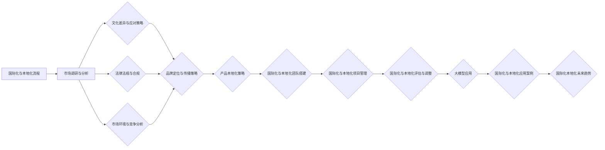

                 

### 文章标题

《大模型企业的国际化本地化策略》

### 关键词

国际化、本地化、大模型、人工智能、市场调研、文化适应性、法律法规、智能客服、个性化推荐、供应链管理、案例研究、未来趋势。

### 摘要

随着全球化的发展，大模型企业在国际市场上的竞争日益激烈。本文首先介绍了国际化与本地化的核心概念和策略，探讨了文化差异、法律法规和市场环境等挑战。接着，通过详细的市场调研和分析，企业能够制定有效的国际化本地化策略。文章进一步展示了大模型在国际化本地化中的应用，包括多语言翻译、个性化推荐和智能客服系统等实际案例。最后，分析了国际化本地化的未来趋势，提出了数据驱动和智能化策略的优化方向。通过本文的探讨，企业可以更好地理解和应对国际化本地化过程中的挑战，实现全球市场拓展和业务增长。## 《大模型企业的国际化本地化策略》目录大纲

以下是《大模型企业的国际化本地化策略》的目录大纲：

### 第一部分：国际化本地化策略基础

#### 第1章：国际化与本地化概述

- 1.1 国际化与本地化的定义及关系
  - 国际化
  - 本地化
  - 二者关系
- 1.2 国际化与本地化的核心概念
  - 文化适应性
  - 语言适应性
  - 法规适应性
  - 市场适应性
- 1.3 国际化与本地化的目标与作用
  - 企业国际化目标
  - 本地化策略在企业国际化中的作用

#### 第2章：国际化与本地化的挑战

- 2.1 文化差异与应对策略
  - 文化差异的类型
  - 文化适应性的策略
- 2.2 法律法规与合规
  - 国际法规的多样性
  - 合规性要求的分析
- 2.3 市场环境与竞争
  - 不同市场的特点
  - 竞争策略

#### 第3章：国际化与本地化的策略

- 3.1 市场调研与分析
  - 市场调研的方法
  - 数据分析技巧
- 3.2 品牌定位与传播
  - 品牌定位策略
  - 品牌传播渠道
- 3.3 产品本地化策略
  - 产品本地化的内容
  - 产品本地化的方法

#### 第4章：国际化与本地化的实施

- 4.1 国际化与本地化的团队搭建
  - 国际化团队的组建
  - 本地化团队的组建
- 4.2 国际化与本地化的项目管理
  - 项目管理工具
  - 项目管理方法
- 4.3 国际化与本地化的评估与调整
  - 评估指标
  - 调整策略

### 第二部分：大模型在国际化本地化中的应用

#### 第5章：大模型在国际化本地化中的作用

- 5.1 大模型在市场调研中的作用
  - 数据挖掘与分析
  - 市场预测
- 5.2 大模型在品牌传播中的作用
  - 自然语言处理
  - 情感分析
- 5.3 大模型在产品本地化中的作用
  - 机器翻译
  - 语言模型优化

#### 第6章：大模型在国际化本地化的应用案例

- 6.1 案例一：跨国电商平台的国际化策略
  - 案例背景
  - 国际化策略
  - 本地化策略
- 6.2 案例二：大型制造业企业的本地化策略
  - 案例背景
  - 本地化策略
  - 成功经验
- 6.3 案例三：餐饮连锁企业的国际化经验
  - 案例背景
  - 国际化策略
  - 本地化策略

#### 第7章：大模型在国际化本地化中的未来趋势

- 7.1 大模型在国际化本地化中的发展趋势
  - 新技术的影响
  - 市场需求的演变
- 7.2 国际化本地化策略的优化方向
  - 数据驱动策略
  - 智能化策略
- 7.3 国际化本地化未来的挑战与机遇
  - 挑战分析
  - 机遇探讨

### 附录：国际化本地化资源与工具

- 7.1 国际化本地化相关网站和工具
  - 市场调研工具
  - 语言处理工具
  - 项目管理工具
- 7.2 国际化本地化案例库
  - 案例介绍
  - 案例分析
  - 案例启示
- 7.3 Mermaid 流程图：国际化与本地化流程
- 7.4 伪代码：国际化与本地化策略评估
- 7.5 数学模型与公式：文化适应性指数（CAI）
- 7.6 代码解读与分析：国际化与本地化中的大模型应用

---

通过以上目录大纲，本文将系统地探讨大模型企业在国际化本地化过程中的策略和实践，帮助读者深入了解并掌握这一重要领域。## 第一部分：国际化本地化策略基础

### 第1章：国际化与本地化概述

#### 1.1 国际化与本地化的定义及关系

国际化（Internationalization）是指企业将其业务扩展到全球市场，通过标准化和适应性策略，使其产品和服务能够适应不同文化、语言和法规的要求。国际化不仅仅是地理上的扩展，还包括市场策略、品牌传播、供应链管理等多个方面的全球化。

本地化（Localization）是在国际化基础上，针对特定市场进行产品、服务、内容和文化适应的过程。本地化确保产品在目标市场中的可用性和吸引力，使其能够满足当地消费者的需求。本地化包括语言翻译、文化定制、法规合规等多个方面。

国际化与本地化的关系可以概括为：国际化是企业走向全球市场的起点，而本地化是国际化的深化和具体化。国际化侧重于企业的全球市场策略和基础建设，本地化则侧重于对特定市场的深入适应和优化。

#### 1.2 国际化与本地化的核心概念

1. **文化适应性**：文化适应性是国际化本地化的核心概念之一，它涉及企业如何理解和适应不同文化环境。文化适应性包括对当地价值观、习俗、宗教信仰和社会规范的理解和尊重，以及如何将这些元素融入产品和服务中。

2. **语言适应性**：语言适应性是本地化的一个重要方面，包括将产品和服务翻译成目标市场的语言，以及确保语言表达符合当地的语言习惯和风格。

3. **法规适应性**：法规适应性是指企业如何遵守目标市场的法律法规，包括数据保护法、消费者权益保护法、反垄断法等。法规适应性是企业成功进入国际市场的重要保障。

4. **市场适应性**：市场适应性涉及企业如何根据不同市场的需求、消费习惯、经济环境等因素调整其产品和服务。市场适应性包括产品创新、价格策略、渠道选择等多个方面。

#### 1.3 国际化与本地化的目标与作用

1. **企业国际化目标**：
   - **市场扩展**：通过国际化，企业可以进入新的市场，扩大销售渠道，增加收入。
   - **资源获取**：国际化可以帮助企业获取全球资源，如人才、技术、资金等，提升企业的竞争力。
   - **品牌提升**：国际化可以提升企业的品牌形象，增强品牌在全球市场的认知度和影响力。

2. **本地化策略在企业国际化中的作用**：
   - **满足消费者需求**：本地化使企业能够更好地理解和满足目标市场的消费者需求，提高消费者满意度。
   - **降低市场风险**：本地化策略可以帮助企业规避文化、法规和市场风险，降低国际化过程中的不确定性。
   - **提升市场份额**：本地化策略有助于企业快速进入市场，抢占市场份额，提升品牌竞争力。

通过国际化与本地化策略的结合，企业可以更好地应对全球市场的挑战，实现持续增长和长期发展。## 第2章：国际化与本地化的挑战

### 2.1 文化差异与应对策略

文化差异是国际化过程中面临的重要挑战之一。不同国家和地区在价值观、宗教信仰、习俗和礼仪等方面存在显著差异，这些差异可能对企业的市场策略、产品定位和品牌传播产生深远影响。

#### 文化差异的类型

1. **价值观差异**：不同文化对时间、空间、工作、家庭、社会等价值观有不同的理解，这可能导致企业在沟通、决策和商业行为上的冲突。
2. **宗教信仰差异**：宗教信仰对人们的生活、行为和道德观念有重要影响。企业在进入具有不同宗教信仰的市场时，需要尊重和适应该市场的宗教习俗。
3. **习俗和礼仪差异**：不同文化有不同的习俗和礼仪，如饮食、服饰、社交礼仪等。企业需要了解并尊重这些习俗，避免文化冲突。
4. **沟通风格差异**：不同文化在沟通风格上存在差异，如直接与间接表达、高语境与低语境沟通等。企业需要根据目标市场的沟通风格调整其沟通策略。

#### 文化适应性的策略

1. **文化研究**：企业需要投入资源进行文化研究，深入了解目标市场的文化特点，包括价值观、宗教信仰、习俗和礼仪等。
2. **文化培训**：企业应开展文化培训，提高员工对目标市场的文化理解，增强跨文化沟通能力。
3. **文化适配产品**：在产品和服务的设计过程中，企业应考虑文化适配性，确保产品符合目标市场的文化需求。
4. **本地化团队**：组建本地化团队，由具有丰富目标市场经验的专业人士组成，负责制定和实施本地化策略。
5. **文化敏感性营销**：在品牌传播和营销活动中，企业应展示对目标市场文化的尊重和适应，通过文化敏感的营销策略提升品牌形象。

#### 成功案例

- **麦当劳**：麦当劳在进入中国市场时，对饮食文化进行了深入研究，推出了符合中国消费者口味的汉堡、薯条等食品。此外，麦当劳还尊重中国的宗教和习俗，如春节期间推出节日套餐，获得了广大消费者的喜爱。

### 2.2 法律法规与合规

法律法规是国际化过程中不可忽视的挑战。不同国家和地区在法律法规体系、执法力度和合规要求上存在显著差异。企业在国际化过程中需要遵守目标市场的法律法规，以确保业务的合法性和稳定性。

#### 国际法规的多样性

1. **数据保护法**：不同国家和地区对数据保护的规定不同，如欧洲的《通用数据保护条例》（GDPR）对美国的数据隐私法规有较大影响。
2. **消费者权益保护法**：不同国家和地区的消费者权益保护法规存在差异，企业需要了解并遵守当地的消费者权益保护法规。
3. **反垄断法**：不同国家和地区的反垄断法规对企业的市场行为有严格的限制，企业需要避免垄断行为和反竞争行为。
4. **劳动法**：不同国家和地区的劳动法规定存在差异，企业需要遵守当地的劳动法规定，确保员工权益。

#### 合规性要求的分析

1. **数据保护合规**：企业需要确保收集、存储和传输的数据符合目标市场的数据保护法规，采取必要的数据保护措施，如数据加密、访问控制等。
2. **消费者权益保护合规**：企业需要确保产品和服务符合目标市场的消费者权益保护法规，提供透明、公正的消费者交易条件。
3. **反垄断合规**：企业需要避免垄断行为，合理定价，公平竞争，确保企业的市场行为符合反垄断法规。
4. **劳动法合规**：企业需要遵守当地的劳动法规定，确保员工的工资、福利和工作条件符合法规要求。

#### 成功案例

- **苹果公司**：苹果公司在全球范围内遵守数据保护法规，特别是在欧洲市场，苹果公司积极实施GDPR规定，确保用户数据的安全和隐私。此外，苹果公司在产品定价和营销策略上也遵循各地的消费者权益保护法规，赢得了消费者的信任。

### 2.3 市场环境与竞争

市场环境是国际化过程中不可忽视的因素。不同市场的经济环境、消费习惯、竞争态势等对企业国际化策略有重要影响。

#### 不同市场的特点

1. **经济环境**：不同市场的经济发展水平、消费水平、通货膨胀率等经济指标存在差异，企业需要根据市场特点制定相应的市场策略。
2. **消费习惯**：不同市场的消费习惯和消费文化存在差异，如购物习惯、品牌偏好、支付方式等，企业需要了解并适应这些差异。
3. **竞争态势**：不同市场的竞争态势和竞争格局不同，企业需要分析竞争对手的策略和市场份额，制定有针对性的竞争策略。

#### 竞争策略

1. **差异化策略**：企业可以通过产品创新、服务质量、品牌形象等方面的差异化，在竞争激烈的市场中脱颖而出。
2. **成本领先策略**：企业可以通过优化供应链、降低成本，提供更具竞争力的价格，以获得市场份额。
3. **本地化策略**：企业可以根据不同市场的特点，制定本地化策略，如调整产品规格、推出符合当地消费者需求的创新产品等。
4. **合作策略**：企业可以通过与当地企业合作，共享资源、技术和市场渠道，提高市场竞争力。

#### 成功案例

- **特斯拉**：特斯拉在全球市场的竞争策略中，采取了差异化策略和本地化策略。特斯拉通过技术创新和高质量的电动汽车产品，在全球市场上树立了独特的品牌形象。同时，特斯拉根据不同市场的需求，推出符合当地消费者需求的车型，如特斯拉Model 3在中国市场的本地化版本。

通过上述分析和案例，我们可以看到文化差异、法律法规和市场环境是国际化过程中不可忽视的挑战。企业需要通过深入的文化研究、法规遵守和市场竞争分析，制定有效的国际化本地化策略，以应对这些挑战，实现全球市场的成功。## 第3章：国际化与本地化的策略

### 3.1 市场调研与分析

市场调研是制定国际化本地化策略的基础，通过系统性的调研和分析，企业能够深入了解目标市场的需求、竞争态势和消费者行为，为制定策略提供科学依据。

#### 市场调研的方法

1. **定量调研**：定量调研是通过问卷调查、数据分析等方法，收集大量数据，以量化形式呈现市场状况。这种方法适用于大规模市场调研，能够提供客观、可靠的数据支持。

2. **定性调研**：定性调研是通过访谈、焦点小组讨论等方法，深入了解消费者的主观感受、态度和行为。这种方法适用于深入了解消费者心理和市场趋势，有助于发现潜在需求。

3. **竞争对手分析**：通过对竞争对手的产品、市场策略、市场份额等方面进行分析，企业可以了解自身在市场中的位置和竞争力，从而制定相应的市场策略。

#### 数据分析技巧

1. **描述性分析**：描述性分析是对市场数据进行简单统计，如计算平均值、中位数、标准差等，以了解数据的整体分布和特征。

2. **相关性分析**：相关性分析用于判断两个变量之间的关系，如市场销售额与消费者满意度之间的相关性。通过相关性分析，企业可以识别影响市场表现的关键因素。

3. **回归分析**：回归分析用于建立变量之间的数学模型，预测因变量的变化。例如，通过回归分析，企业可以预测在不同市场策略下的销售额。

#### 成功案例

- **可口可乐**：可口可乐在进入中国市场前，进行了全面的市场调研。通过定量调研和定性调研，可口可乐了解了消费者的口味偏好、消费习惯和品牌认知。在此基础上，可口可乐调整了产品线，推出了符合中国消费者口味的新产品，如“可口可乐咖啡味”。这一策略取得了巨大成功，可口可乐在中国市场的市场份额大幅提升。

### 3.2 品牌定位与传播

品牌定位是国际化本地化策略的重要组成部分，它决定了企业在目标市场中的形象和市场地位。有效的品牌定位能够帮助企业吸引目标消费者，提高品牌认知度和忠诚度。

#### 品牌定位策略

1. **差异化定位**：差异化定位是通过独特的产品特点或品牌形象，在市场中树立独特的品牌形象。例如，宝马通过“豪华、运动、科技”的差异化定位，吸引了大量追求高品质和驾驶乐趣的消费者。

2. **聚焦定位**：聚焦定位是将品牌定位在一个特定的细分市场，通过精准的市场定位，满足特定消费者的需求。例如，苹果公司通过“高端、创新、用户体验”的聚焦定位，在智能手机市场中取得了巨大成功。

3. **价值定位**：价值定位是通过提供高质量的产品和服务，为消费者创造价值。例如，小米公司通过“高性价比、智能生态”的价值定位，赢得了大量年轻消费者的青睐。

#### 品牌传播渠道

1. **线上渠道**：包括社交媒体、搜索引擎营销、内容营销等。线上渠道能够快速传播品牌信息，提高品牌曝光度和认知度。

2. **线下渠道**：包括广告、公关活动、门店体验等。线下渠道能够增强品牌与消费者的互动，提升品牌形象。

3. **跨国合作**：通过与国际知名品牌或媒体的合作，提升品牌的国际影响力和认可度。

#### 成功案例

- **阿里巴巴**：阿里巴巴在国际化过程中，通过差异化定位和线上渠道传播，成功树立了“全球最大的电子商务平台”的品牌形象。阿里巴巴通过社交媒体和电商平台，与全球消费者建立紧密联系，不断提升品牌认知度和忠诚度。

### 3.3 产品本地化策略

产品本地化是国际化本地化策略的核心环节，通过适应目标市场的文化、语言和消费者需求，企业能够提高产品的市场接受度和竞争力。

#### 产品本地化的内容

1. **语言本地化**：将产品说明书、用户界面、广告文案等翻译成目标市场的语言，确保语言表达符合当地的文化和语言习惯。

2. **文化适配**：根据目标市场的文化特点，调整产品的外观、设计、功能和包装，使其更符合当地消费者的审美和文化偏好。

3. **法规合规**：确保产品符合目标市场的法律法规，如安全标准、环保要求等。

4. **产品创新**：根据目标市场的需求和竞争态势，进行产品创新，推出符合当地消费者需求的新产品。

#### 产品本地化的方法

1. **市场调研**：通过市场调研，了解目标市场的消费者需求和偏好，为产品本地化提供依据。

2. **本地化团队**：组建本地化团队，由具备目标市场经验的专家组成，负责制定和实施产品本地化策略。

3. **合作伙伴**：与当地合作伙伴合作，共同开发适应目标市场的产品，利用当地资源和技术。

4. **用户反馈**：通过用户反馈，不断优化产品，确保产品能够满足当地消费者的需求。

#### 成功案例

- **三星**：三星在进入中国市场时，进行了全面的产品本地化。三星通过调研发现，中国消费者对手机的外观和功能有很高的要求，因此三星推出了符合中国消费者口味的新产品，如Galaxy Note系列。此外，三星还针对中国消费者的偏好，对产品的外观和功能进行了调整，如增加中文输入法、优化拍照功能等。这些本地化策略帮助三星在中国市场取得了巨大的成功。

通过上述策略，企业能够更好地应对国际化过程中的挑战，提高产品的市场接受度和竞争力，实现全球市场的成功。## 第4章：国际化与本地化的实施

### 4.1 国际化与本地化的团队搭建

国际化与本地化的成功离不开高效的团队支持。组建专业的国际化与本地化团队是实施国际化本地化策略的关键步骤。以下将详细探讨国际化团队和本地化团队的组建策略。

#### 国际化团队的组建

1. **团队成员**：
   - **国际化项目经理**：负责整个国际化项目的规划、执行和监督，确保项目按照预定时间和预算完成。
   - **市场分析师**：负责市场调研和分析，为国际化策略提供数据支持。
   - **翻译专家**：负责翻译产品文档、用户界面和广告文案，确保语言的准确性和文化适应性。
   - **文化顾问**：负责研究目标市场的文化特点，提供文化适应建议。
   - **技术专家**：负责技术实现，确保产品的国际化质量和兼容性。
   - **法律顾问**：负责确保产品符合目标市场的法律法规。

2. **组建策略**：
   - **内部招聘**：从公司内部选拔具备国际化经验和专业技能的人才，如跨国公司的员工、国际业务部门的员工等。
   - **外部招聘**：通过招聘网站、人才市场等渠道招聘具有国际化背景的专业人才。
   - **培训与培养**：对团队成员进行国际化知识和技能的培训，提高其跨文化沟通和协作能力。

#### 本地化团队的组建

1. **团队成员**：
   - **本地化项目经理**：负责本地化项目的规划、执行和监督，确保项目按计划推进。
   - **本地化工程师**：负责产品的本地化实现，包括语言翻译、文化适配和技术调整。
   - **本地化测试员**：负责测试产品的本地化质量，确保产品在目标市场中的可用性和稳定性。
   - **市场推广专家**：负责本地化产品的市场推广，包括广告、公关活动等。
   - **本地化顾问**：负责研究目标市场的消费者需求和偏好，提供本地化策略建议。

2. **组建策略**：
   - **内部组建**：利用公司内部的本地化资源，组建本地化团队。这种方式可以充分利用内部人才和资源，降低成本。
   - **外部组建**：通过外包服务或与本地化服务提供商合作，组建专业的本地化团队。这种方式可以快速响应市场变化，提高本地化效率。
   - **文化适配**：确保团队成员具备目标市场的文化背景和语言能力，提高本地化策略的有效性。

通过精心组建国际化与本地化团队，企业可以确保国际化本地化策略的顺利实施，提高产品的市场接受度和竞争力。有效的团队协作和资源整合是国际化本地化成功的关键。### 4.2 国际化与本地化的项目管理

在国际化与本地化过程中，项目管理是确保项目顺利实施和成功完成的关键。以下将详细探讨国际化与本地化项目管理的工具、方法和策略。

#### 项目管理工具

1. **Asana**：Asana是一款功能强大的项目管理工具，适用于团队协作和任务管理。它支持任务分配、进度跟踪和协作，有助于提高项目效率。

2. **Trello**：Trello是一款简单易用的看板工具，通过可视化卡片管理任务，便于团队成员了解项目进度和责任分工。

3. **Slack**：Slack是一款团队沟通和协作工具，支持实时消息传递、文件共享和通知提醒，有助于团队成员之间的高效沟通。

4. **JIRA**：JIRA是一款专业的项目管理工具，适用于敏捷开发和任务管理。它支持缺陷跟踪、需求管理和项目进度监控，有助于提高项目质量。

5. **Microsoft Project**：Microsoft Project是一款功能强大的项目管理软件，适用于复杂项目规划和资源管理。它支持任务分配、进度跟踪和资源优化，有助于提高项目效率。

#### 项目管理方法

1. **敏捷开发**：敏捷开发是一种迭代和增量的软件开发方法，适用于国际化与本地化项目。通过持续交付可用的软件，快速响应市场变化，提高项目的灵活性和适应性。

2. **六西格玛**：六西格玛是一种质量管理方法，通过减少缺陷和提高过程效率，提高项目的质量和可靠性。

3. **项目风险管理**：项目风险管理是一种系统性的方法，用于识别、评估和应对项目风险。通过制定风险应对策略，降低项目风险对项目进度和质量的影响。

4. **迭代开发**：迭代开发是一种循环的开发方法，通过反复迭代和改进，逐步实现项目的目标。这种方法适用于复杂的国际化与本地化项目，有助于提高项目的可管理性和灵活性。

#### 项目管理策略

1. **明确项目目标**：在项目启动阶段，明确项目的目标、范围和里程碑，确保团队成员对项目有清晰的认识。

2. **任务分配与责任分工**：根据团队成员的技能和经验，合理分配任务，明确责任分工，确保项目任务的有序推进。

3. **进度跟踪与评估**：定期跟踪项目进度，评估项目完成情况，及时发现和解决问题，确保项目按时、按质完成。

4. **沟通与协作**：建立高效的沟通渠道，确保团队成员之间的信息传递和协作，提高项目的执行效率。

5. **资源管理**：合理配置项目资源，包括人力资源、物资资源和财务资源，确保项目资源的优化利用。

6. **质量控制**：制定严格的质量控制标准，确保项目的质量符合要求。通过定期的质量检查和评审，及时发现和纠正问题。

7. **风险管理**：建立风险管理机制，识别、评估和应对项目风险，降低项目风险对项目进度和质量的影响。

通过有效的国际化与本地化项目管理，企业可以确保项目的顺利实施和成功完成，提高产品的市场接受度和竞争力。有效的项目管理策略和工具的合理应用，是国际化本地化成功的关键。### 4.3 国际化与本地化的评估与调整

在国际化和本地化策略的实施过程中，定期评估和调整是确保策略有效性和持续改进的关键。以下将详细探讨评估指标、调整策略以及如何优化国际化与本地化策略。

#### 评估指标

1. **市场占有率**：市场占有率是衡量产品在目标市场中的竞争力和市场份额的重要指标。通过对比不同市场的销售数据，评估产品在各个市场的表现。

2. **用户满意度**：用户满意度是衡量产品服务质量的重要指标。通过用户反馈、调查问卷等方式，了解用户对产品和服务的满意度，评估本地化策略的有效性。

3. **成本效益**：成本效益是衡量国际化与本地化策略的经济效益的重要指标。通过对比不同市场的投资回报率，评估策略的成本效益。

4. **品牌认知度**：品牌认知度是衡量品牌在目标市场中的知名度和认可程度的重要指标。通过市场调研和消费者调查，了解品牌在不同市场的认知度。

5. **法规合规率**：法规合规率是衡量企业遵守目标市场法律法规的程度的重要指标。通过内部审计和外部审查，评估企业合规性。

#### 调整策略

1. **市场策略调整**：根据市场调研和用户反馈，及时调整市场策略。例如，如果用户满意度较低，可以优化产品和服务，提高用户体验。

2. **产品本地化调整**：根据市场反馈和消费者需求，不断优化产品本地化策略。例如，如果发现某些产品功能在目标市场不符合消费者需求，可以进行调整或改进。

3. **品牌传播策略调整**：根据市场环境和消费者行为，调整品牌传播策略。例如，如果发现某些渠道的传播效果不佳，可以增加投入或更换传播渠道。

4. **供应链管理调整**：根据市场变化和供应链效率，优化供应链管理策略。例如，如果发现某些供应链环节存在瓶颈，可以改进供应链流程或选择更优质的供应商。

#### 优化方向

1. **数据驱动**：通过大数据分析和人工智能技术，实现数据驱动的国际化与本地化策略。利用数据分析，优化市场定位、产品设计和推广策略。

2. **智能化**：利用人工智能和机器学习技术，提高国际化与本地化的智能化水平。例如，通过智能客服系统，提供24/7的客户服务。

3. **全球化协作**：建立全球协作网络，共享资源和经验。通过全球协作，优化国际化与本地化策略，提高全球市场的运营效率。

4. **持续改进**：建立持续改进机制，定期评估和调整国际化与本地化策略。通过不断优化，确保策略的适应性和有效性。

通过定期评估和调整，企业可以不断优化国际化与本地化策略，提高产品的市场接受度和竞争力，实现全球市场的成功。有效的评估和调整机制，是国际化本地化持续发展的重要保障。### 第二部分：大模型在国际化本地化中的应用

#### 第5章：大模型在国际化本地化中的作用

随着人工智能和大数据技术的发展，大模型在国际化本地化中发挥着越来越重要的作用。大模型通过自然语言处理、推荐系统和智能客服等技术的应用，为企业的国际化本地化策略提供了强有力的技术支持。以下将详细探讨大模型在国际化本地化中的应用。

##### 5.1 大模型在市场调研中的作用

市场调研是国际化本地化策略制定的重要基础，而大模型在市场调研中具有显著优势。通过大数据分析和机器学习技术，大模型能够从海量数据中提取有价值的信息，为市场调研提供有力支持。

1. **数据挖掘与分析**：大模型能够对大量市场数据进行分析，包括用户行为、消费习惯、市场竞争态势等。通过数据挖掘，大模型可以识别出市场中的趋势和规律，为企业的市场策略提供数据支持。

2. **市场预测**：大模型可以通过历史数据，对未来的市场趋势进行预测。例如，通过分析过去几年的销售数据，大模型可以预测未来某一市场的需求变化，帮助企业在产品定位、库存管理等方面做出准确决策。

##### 5.2 大模型在品牌传播中的作用

品牌传播是国际化本地化策略的重要组成部分，而大模型在品牌传播中具有显著优势。通过自然语言处理和情感分析技术，大模型能够提高品牌传播的效率和质量。

1. **自然语言处理**：大模型可以通过自然语言处理技术，自动生成高质量的文案和广告内容。例如，通过分析用户的搜索关键词和社交媒体言论，大模型可以生成针对性的广告文案，提高广告的点击率和转化率。

2. **情感分析**：大模型可以通过情感分析技术，分析用户的情感和态度，为品牌传播提供策略建议。例如，通过分析用户的评价和评论，大模型可以识别出用户对品牌的正面和负面情感，帮助企业优化品牌传播策略。

##### 5.3 大模型在产品本地化中的作用

产品本地化是国际化本地化的核心环节，而大模型在产品本地化中具有显著优势。通过机器翻译、语言模型优化等技术，大模型能够提高产品本地化的效率和质量。

1. **机器翻译**：大模型可以通过机器翻译技术，自动将产品文档、用户界面和广告内容翻译成目标市场的语言。通过深度学习和神经网络技术，大模型能够生成高质量的翻译结果，减少翻译错误和歧义。

2. **语言模型优化**：大模型可以通过语言模型优化技术，提高本地化产品的语言表达准确性。例如，通过分析目标市场的语言使用习惯和表达方式，大模型可以优化语言模型，使本地化产品更符合当地语言习惯。

##### 案例研究：跨国电商平台的国际化本地化策略

以下以某跨国电商平台的国际化本地化策略为例，探讨大模型在其中的应用。

1. **市场调研**：该电商平台利用大模型进行市场调研，通过分析全球市场的用户数据，识别出不同市场的消费趋势和需求变化。例如，通过分析用户的搜索关键词和购买行为，大模型预测出某一款产品在某地区具有很高的需求潜力，从而帮助企业提前布局。

2. **品牌传播**：该电商平台利用大模型生成高质量的广告文案和营销内容，通过自然语言处理技术，分析用户的语言偏好和情感，制定有针对性的品牌传播策略。例如，通过分析用户的社交媒体言论，大模型发现用户对某一款产品有很高的期望，于是该电商平台推出了一款符合用户期望的新产品，并在社交媒体上进行了广泛宣传，成功吸引了大量用户。

3. **产品本地化**：该电商平台利用大模型进行产品本地化，通过机器翻译技术，将产品文档和用户界面翻译成多种语言。通过语言模型优化技术，大模型优化了本地化产品的语言表达，使其更符合当地语言习惯。例如，在进入日本市场时，该电商平台通过大模型优化了日语界面，使其更符合日本用户的语言习惯，提高了用户满意度。

通过以上案例，我们可以看到大模型在国际化本地化中的应用，为企业的市场调研、品牌传播和产品本地化提供了强有力的技术支持。大模型的应用不仅提高了企业的效率和效果，还提升了用户体验，增强了企业的竞争力。在未来的发展中，大模型将继续发挥重要作用，助力企业实现全球化扩展。### 第6章：大模型在国际化本地化的应用案例

在国际化本地化过程中，大模型的应用已经为许多企业带来了显著的成效。以下将介绍三个实际案例，详细探讨大模型在国际化本地化中的应用，以及这些企业如何利用大模型实现全球市场的成功。

#### 案例一：跨国电商平台的国际化策略

**背景**：某全球知名的电商平台希望进一步拓展国际市场，以满足不同地区消费者的需求。

**应用**：
1. **多语言翻译**：利用大模型，该平台实现了网站和应用程序的多语言支持。通过机器翻译模型，自动将产品描述、用户界面和客服回答翻译成多种语言，提高了用户体验和满意度。
2. **个性化推荐**：基于用户行为数据和购买历史，大模型为用户提供了个性化的产品推荐。通过深度学习算法，分析用户的浏览记录和购买偏好，为用户推荐他们可能感兴趣的产品，提高了转化率和销售额。
3. **智能客服**：通过自然语言处理技术，大模型构建了智能客服系统，能够实时解答用户问题，提供24/7的在线支持。这不仅提高了客服效率，还减少了人工成本。

**结果**：通过大模型的应用，该电商平台在国际化过程中取得了显著成效。多语言支持使平台能够覆盖更多语言的用户，个性化推荐和智能客服提高了用户满意度和转化率，进一步巩固了平台在国际市场的地位。

#### 案例二：大型制造业企业的本地化策略

**背景**：某大型制造业企业计划进入欧洲市场，以满足当地消费者对产品质量和服务的需求。

**应用**：
1. **产品本地化**：利用大模型，该企业对产品进行本地化改造，以满足欧洲市场的特殊需求。通过机器翻译和自然语言处理技术，对产品说明书、用户手册等进行翻译和优化，确保文本符合当地语言习惯。
2. **供应链优化**：大模型分析欧洲市场的供应链数据，优化物流和库存管理。通过预测需求变化和库存水平，提高了供应链的灵活性和响应速度。
3. **智能客服**：利用大模型构建智能客服系统，为欧洲市场的用户提供多语言支持。通过自然语言理解技术，智能客服系统能够快速响应用户问题，提供专业的解决方案。

**结果**：通过大模型的应用，该企业在欧洲市场取得了良好的业绩。产品本地化和供应链优化提高了产品竞争力和市场占有率，智能客服系统提升了用户满意度和品牌形象。

#### 案例三：餐饮连锁企业的国际化经验

**背景**：某知名餐饮连锁企业计划在全球范围内扩张，以拓展国际市场。

**应用**：
1. **个性化菜单**：利用大模型，该企业根据不同市场的消费者偏好，设计了个性化的菜单。通过分析消费者数据，大模型推荐了当地受欢迎的菜品，提高了顾客满意度。
2. **文化适配**：大模型分析了各市场的文化特点，调整了餐厅的装修风格和营销策略。例如，在进入日本市场时，该企业采用了日本传统的设计风格，并在菜单中增加了寿司等当地特色美食。
3. **智能客服**：通过大模型构建的智能客服系统，该企业为全球用户提供了多语言支持。智能客服系统能够理解用户的语言和需求，提供及时的帮助和解答。

**结果**：通过大模型的应用，该餐饮连锁企业在全球市场获得了成功。个性化菜单和文化适配策略吸引了当地消费者，智能客服系统提升了用户体验和满意度，进一步巩固了品牌在全球市场的影响力。

#### 总结

通过以上三个案例，我们可以看到大模型在国际化本地化中的应用，不仅提高了企业的运营效率和市场竞争力，还增强了用户满意度和品牌形象。大模型的应用为企业在全球化过程中提供了强有力的技术支持，使其能够更好地适应不同市场的需求，实现全球市场的成功。在未来的发展中，大模型将继续发挥重要作用，助力企业实现更加深入的国际化本地化。### 第7章：大模型在国际化本地化中的未来趋势

#### 7.1 大模型在国际化本地化中的发展趋势

随着人工智能技术的快速发展，大模型在国际化本地化中的应用趋势愈发明显。以下是未来几年大模型在国际化本地化中的几个发展趋势：

1. **智能化水平提升**：大模型的智能化水平将进一步提高，通过深度学习和自然语言处理技术，大模型能够更准确地理解和预测用户需求，提供更加个性化的服务。

2. **跨语言处理能力增强**：随着多语言处理技术的进步，大模型将实现更高效、更准确的跨语言翻译和文本分析，为国际化本地化提供更强有力的支持。

3. **数据驱动的决策**：大模型在数据分析方面的优势将使其成为数据驱动决策的重要工具。企业可以利用大模型对市场数据进行深入分析，优化产品策略和市场营销策略。

4. **个性化推荐系统的普及**：个性化推荐系统将在国际化本地化中更加普及，通过大模型，企业可以更精准地推荐产品和服务，提高用户满意度和转化率。

5. **智能客服的全面应用**：智能客服系统将在国际化本地化中发挥更大作用，通过大模型，智能客服能够提供24/7的高效服务，降低企业运营成本。

#### 7.2 国际化本地化策略的优化方向

在未来，国际化本地化策略将更加智能化和数据驱动，以下是几个优化方向：

1. **数据驱动的市场调研**：企业将利用大数据和机器学习技术，进行数据驱动的市场调研，深入了解目标市场的消费者行为和需求变化，为国际化本地化策略提供数据支持。

2. **智能化的供应链管理**：通过物联网和人工智能技术，企业可以实现智能化的供应链管理，提高供应链的透明度和响应速度，降低运营成本。

3. **智能化的品牌传播**：企业将利用大数据和人工智能技术，进行智能化的品牌传播，通过分析用户数据和社交媒体互动，制定更加精准的品牌传播策略。

4. **个性化的产品和服务**：企业将根据不同市场的需求和消费者偏好，提供更加个性化的产品和服务，提高用户满意度和忠诚度。

5. **智能化的客户体验**：企业将利用人工智能技术，提供智能化的客户体验，通过智能客服、个性化推荐等手段，提高客户满意度和转化率。

#### 7.3 国际化本地化未来的挑战与机遇

在未来，国际化本地化将面临一系列挑战和机遇：

1. **挑战**：
   - **数据隐私和安全**：随着大数据和人工智能技术的应用，数据隐私和安全问题将更加突出。企业需要采取措施确保用户数据的安全和合规。
   - **文化差异**：不同市场的文化差异将带来挑战，企业需要深入了解并适应不同市场的文化特点，制定相应的本地化策略。
   - **法规合规**：不同国家和地区的法律法规将给企业带来合规挑战，企业需要确保在各个市场中的运营符合当地法规。

2. **机遇**：
   - **全球市场扩展**：随着全球化的发展，企业将面临更广阔的市场机会，可以通过国际化本地化策略，进入更多市场，实现业务的全球化扩展。
   - **技术创新**：人工智能和大数据技术的不断进步，将为国际化本地化提供更强大的技术支持，帮助企业提高运营效率和市场竞争力。
   - **用户体验提升**：通过智能化和个性化的服务，企业可以提供更加优质的用户体验，提高用户满意度和忠诚度。

#### 总结

大模型在国际化本地化中的应用将呈现智能化、数据驱动和个性化的发展趋势。企业需要抓住这些趋势，优化国际化本地化策略，应对挑战，把握机遇，实现全球市场的成功。在未来，大模型将继续发挥重要作用，助力企业实现更加深入的国际化本地化。### 附录：国际化本地化资源与工具

在国际化本地化过程中，企业需要依赖多种资源与工具来支持其市场调研、产品本地化、品牌传播和供应链管理等工作。以下是一些主流的国际化本地化资源与工具，包括市场调研工具、语言处理工具、项目管理工具以及相关的案例库和最佳实践。

#### A.1 市场调研与数据分析工具

1. **Google Analytics**：提供详细的市场分析报告，帮助企业了解用户行为和市场趋势。
2. **SurveyMonkey**：专业的在线调查工具，用于收集消费者反馈和市场数据。
3. **Qualtrics**：强大的市场调研和数据分析平台，支持复杂的调研设计和分析。
4. **Tableau**：数据可视化工具，用于创建交互式数据报告和仪表盘。
5. **Google Trends**：分析全球搜索趋势，帮助企业了解市场热点和潜在机会。

#### A.2 语言处理工具

1. **Google Translate**：提供强大的在线翻译服务，支持多种语言之间的转换。
2. **DeepL Translator**：高质量的在线翻译服务，尤其擅长专业文献和学术论文的翻译。
3. **Transifex**：专业的本地化平台，支持大规模的网站和应用程序翻译。
4. **Crowdin**：支持协作翻译的平台，适合团队进行多语言项目管理。
5. **SDL Tridion**：专业的企业内容管理系统，支持多语言内容管理和发布。
6. **Lingoport**：提供国际化测试和工具，帮助确保产品的国际化质量。

#### A.3 项目管理与协作工具

1. **Asana**：项目管理工具，帮助团队跟踪项目进度和任务分配。
2. **Trello**：简单易用的看板工具，适合团队协作和任务管理。
3. **Slack**：团队沟通和协作工具，支持实时消息传递和文件共享。
4. **Zoom**：远程会议和视频通话工具，适合跨国团队协作。
5. **JIRA**：敏捷项目管理工具，支持团队协作和任务跟踪。

#### A.4 语言学习与文化适应资源

1. **Duolingo**：免费的语言学习平台，提供多种语言的学习资源。
2. **Rosetta Stone**：专业的语言学习软件，适用于初学者和高级学习者。
3. **Coursera**：在线教育平台，提供多种国际商务和文化适应课程。
4. **LinkedIn Learning**：提供专业的商务和文化适应课程，适合企业培训。
5. **Memrise**：有趣的语言学习应用，通过游戏化的方式帮助用户学习。

#### A.5 国际贸易与法规资源

1. **国际贸易中心（ITC）**：提供国际贸易和市场情报，帮助企业了解全球市场。
2. **世界贸易组织（WTO）**：提供国际贸易法规和政策信息，帮助企业在全球市场中合规运营。
3. **欧洲联盟官方网站**：提供欧盟的法律法规和贸易信息。
4. **美国国际贸易管理局（ITA）**：提供美国国际贸易政策和法规信息。
5. **联合国贸易和发展会议（UNCTAD）**：提供全球贸易和发展数据。

#### A.6 国际化本地化案例库与最佳实践

1. **国际化本地化案例库**：收集和整理了众多企业的国际化本地化案例，供企业参考学习。
2. **国际化本地化论坛**：企业可以在这里分享经验和探讨问题，获取行业最佳实践。
3. **国际市场营销协会（AMA）**：提供国际化营销资源和案例，帮助企业提高国际化营销能力。
4. **哈佛商学院国际化案例库**：提供丰富的国际化案例研究，供商学院学生和企业学习。

#### A.7 本地化技术资源与文档

1. **国际化开发指南**：提供开发国际化软件和应用程序的详细指南和最佳实践。
2. **国际化测试工具**：用于检测软件产品的国际化质量和兼容性。
3. **国际化工具和插件**：适用于主流开发框架和平台的国际化插件和工具，如i18next、gettext等。
4. **国际化网站建设指南**：提供网站国际化建设的指导文档，帮助网站管理员创建多语言网站。
5. **本地化社区**：聚集了众多本地化专业人士，提供技术支持和资源共享。

通过以上资源与工具，企业可以更好地制定和实施国际化本地化策略，提高产品的市场适应性和竞争力。同时，这些工具和资源也为企业的国际化发展提供了强有力的技术支持和实践指导。### 附录：国际化本地化流程流程图

以下是国际化本地化流程的Mermaid流程图：



该流程图展示了国际化本地化的主要步骤，从市场调研与分析开始，到评估与调整，以及大模型的应用和未来趋势。通过这个流程，企业可以系统性地实施国际化本地化策略，提高产品的市场竞争力。### 附录：国际化本地化策略评估伪代码

以下是一个用于评估国际化本地化策略的伪代码示例：

```python
def evaluate_localization_strategy(strategy):
    """
    评估国际化与本地化策略的函数。
    
    参数:
    strategy: 国际化与本地化策略的字典，包含市场调研、文化

