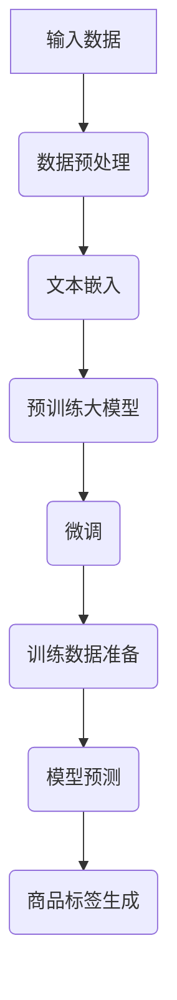

                 

### 《大模型在商品标签自动生成中的应用》

#### # 第一部分：基础知识

#### 第1章：大模型简介

##### 1.1 大模型的定义与作用

**大模型**，通常指的是具有数十亿甚至千亿参数规模的人工神经网络模型。这些模型通过在大量数据上进行训练，学习到数据的复杂结构和模式，从而在各个领域表现出强大的性能。

在商品标签自动生成中，大模型的作用主要体现在以下几个方面：

1. **提高生成标签的准确性**：大模型能够从大量商品描述中学习到各种标签的语义信息，从而提高标签生成的准确性。
2. **提升生成标签的多样性**：大模型能够理解商品的复杂性和多样性，从而生成更加丰富和多样的标签。
3. **降低对人工标注的依赖**：通过大模型自动生成标签，可以显著减少对人工标注的需求，提高生产效率。

##### 1.2 大模型的核心组成部分

**1. 神经网络结构**

大模型通常采用深度神经网络（DNN）作为基础结构，通过层层堆叠的方式，实现对输入数据的特征提取和表示。其中，卷积神经网络（CNN）和循环神经网络（RNN）是常用的结构。

**2. 预训练与微调**

预训练是指在大量无标注的数据上训练大模型，使其掌握通用知识。微调则是在预训练的基础上，在特定任务的数据上进行调整，使其适应特定任务。

**3. 自然语言处理技术**

大模型在商品标签自动生成中的应用，离不开自然语言处理技术。词嵌入、编码器-解码器（Encoder-Decoder）模型、注意力机制等都是常用的自然语言处理技术。

##### 1.3 大模型的发展历程

**1. 深度神经网络（DNN）的兴起**

2006年，Hinton等人提出了深度信念网络（DBN），标志着深度神经网络的研究重新兴起。

**2. 神经机器翻译与BERT的突破**

2016年，Google提出神经机器翻译模型，使机器翻译的准确率大幅提升。同年，Google还推出了BERT模型，标志着预训练模型的兴起。

**3. 多模态大模型的探索**

近年来，随着计算机视觉、语音识别等技术的发展，多模态大模型逐渐成为研究热点。

#### 第2章：商品标签自动生成基础

##### 2.1 商品标签概述

**商品标签**，是指为商品分类和搜索提供的文字描述。它通常包括商品的名称、特点、用途等信息。

**1. 商品标签的定义**

商品标签是对商品进行分类和描述的文本信息，通常包括商品名称、特点、用途、材质、品牌等信息。

**2. 商品标签的类型和作用**

- **商品名称**：直接反映商品的名称，便于用户识别和搜索。
- **特点**：描述商品的关键特性，如功能、用途、材质等。
- **用途**：指商品的适用范围，如家居用品、办公用品、电子产品等。
- **材质**：说明商品的主要材料，如棉、丝绸、塑料等。

商品标签的作用主要体现在以下几个方面：

- **提高商品的曝光率**：通过精准的标签，可以使商品在搜索和推荐系统中获得更高的曝光率。
- **提升用户的购物体验**：清晰的标签可以帮助用户快速了解商品的信息，提高购物体验。
- **降低运营成本**：通过自动生成标签，可以减少对人工标注的依赖，降低运营成本。

##### 2.2 数据预处理

**1. 数据收集与清洗**

- **数据收集**：通过爬虫、API接口等方式获取商品描述、商品标签等数据。
- **数据清洗**：去除重复数据、缺失数据，处理噪声数据。

**2. 数据格式转换**

- **文本数据**：将商品描述转换为统一格式的文本数据。
- **标签数据**：将商品标签转换为对应的数字或类别表示。

##### 2.3 文本嵌入技术

**1. 词向量表示**

- **Word2Vec**：基于神经网络的方法，通过训练得到词向量表示。
- **FastText**：基于分布式表示的方法，通过训练得到词向量表示。

**2. 文本嵌入方法**

- **BERT**：基于Transformer架构，通过预训练得到文本嵌入表示。
- **GPT**：基于Transformer架构，通过预训练得到文本嵌入表示。

通过文本嵌入技术，可以将商品描述和标签转换为高维向量表示，从而便于大模型进行处理。

#### # 第二部分：大模型应用实践

#### 第3章：预训练大模型

##### 3.1 预训练大模型简介

**预训练大模型**，是指在大规模无标注数据上进行预训练，从而获得通用语义表示的模型。预训练大模型在商品标签自动生成中具有重要作用。

**1. 预训练大模型的基本概念**

- **预训练**：在无标注数据上进行大规模训练，使模型学习到通用知识。
- **微调**：在预训练的基础上，在特定任务的数据上进行微调，使其适应特定任务。

**2. 预训练大模型的作用**

- **提高模型的泛化能力**：通过预训练，模型可以学习到通用知识，从而提高在不同任务上的泛化能力。
- **提升任务性能**：预训练大模型可以在不同任务上实现较高的性能，为商品标签自动生成提供有力支持。

##### 3.2 预训练大模型的选择与配置

**1. 主流预训练大模型的介绍**

- **BERT**：基于Transformer架构，预训练任务包括 Masked Language Model（MLM）和 Next Sentence Prediction（NSP）。
- **GPT**：基于Transformer架构，预训练任务为语言建模。
- **RoBERTa**：基于BERT模型，通过改进预训练算法和数据集，提高模型性能。

**2. 预训练大模型的配置与优化**

- **模型配置**：包括参数设置、学习率、批量大小等。
- **数据预处理**：包括数据清洗、数据格式转换等。
- **训练策略**：包括训练时间、训练批次、学习率调整等。

##### 3.3 预训练大模型的应用场景

**1. 文本分类**

- 将商品描述转换为预训练大模型输入，通过模型预测商品标签。

**2. 命名实体识别**

- 识别商品描述中的关键实体，如品牌、材质等，为商品标签生成提供依据。

**3. 文本生成**

- 根据商品描述，生成相关的商品标签，提高标签的多样性和丰富性。

#### 第4章：微调与训练

##### 4.1 微调基础

**微调**，是指在预训练大模型的基础上，利用特定任务的数据对模型进行调整，以适应特定任务的需求。

**1. 微调的概念**

- **预训练**：在大规模无标注数据上训练模型，使其获得通用知识。
- **微调**：在预训练的基础上，利用特定任务的数据对模型进行调整，使其适应特定任务。

**2. 微调的优势与挑战**

- **优势**：

  - **提高任务性能**：预训练大模型具有强大的语义理解能力，通过微调可以进一步提高任务性能。
  - **降低标注成本**：通过预训练，模型可以学习到通用知识，从而降低对大量标注数据的依赖。

- **挑战**：

  - **数据不平衡**：特定任务的数据集可能存在不平衡问题，导致模型无法均衡学习。
  - **模型适应性**：预训练大模型在特定任务上可能无法充分适应，需要进一步调整。

##### 4.2 微调方法与技巧

**1. 微调算法**

- **基于目标的微调**：直接在特定任务的目标上调整模型参数。
- **基于梯度的微调**：通过计算梯度反向传播，调整模型参数。

**2. 微调过程中常见问题与解决方案**

- **数据不平衡**：通过数据增强、权重调整等方法，平衡数据集。
- **模型适应性**：通过多任务学习、模型融合等方法，提高模型适应性。

##### 4.3 训练数据准备

**1. 训练数据的选择与处理**

- **数据收集**：通过爬虫、API接口等方式获取商品描述、商品标签等数据。
- **数据清洗**：去除重复数据、缺失数据，处理噪声数据。

**2. 训练数据的评价指标**

- **准确率**：预测标签与实际标签的匹配度。
- **召回率**：预测标签中包含实际标签的比例。
- **F1值**：准确率和召回率的调和平均值。

#### 第5章：商品标签生成算法实现

##### 5.1 商品标签生成算法概述

**商品标签生成算法**，是指利用大模型和自然语言处理技术，自动生成商品标签的方法。其基本原理如下：

- **数据预处理**：对商品描述和标签进行清洗、转换等处理，得到统一的输入格式。
- **文本嵌入**：将商品描述和标签转换为高维向量表示。
- **模型预测**：利用预训练大模型，对商品描述进行预测，生成商品标签。

##### 5.2 商品标签生成算法实现

**1. 算法原理与实现**

- **文本嵌入**：采用BERT模型对商品描述和标签进行嵌入。
- **模型预测**：利用训练好的大模型，对商品描述进行预测，生成商品标签。

**2. 算法代码解读**

```python
# 导入相关库
import torch
import torch.nn as nn
from transformers import BertModel, BertTokenizer

# 加载预训练模型
tokenizer = BertTokenizer.from_pretrained('bert-base-chinese')
model = BertModel.from_pretrained('bert-base-chinese')

# 商品描述
description = "苹果手机，智能手机，触控屏幕，操作系统：iOS"

# 将商品描述转换为向量表示
input_ids = tokenizer.encode(description, add_special_tokens=True)

# 预测商品标签
with torch.no_grad():
    outputs = model(input_ids)

# 输出结果
print(outputs[-1])
```

##### 5.3 商品标签生成算法评估与优化

**1. 评估指标**

- **准确率**：预测标签与实际标签的匹配度。
- **召回率**：预测标签中包含实际标签的比例。
- **F1值**：准确率和召回率的调和平均值。

**2. 优化策略**

- **数据增强**：通过添加噪声、变换等手段，增加数据多样性。
- **模型调整**：通过调整学习率、批量大小等参数，优化模型性能。

#### 第6章：实际项目应用

##### 6.1 项目背景与需求

**项目背景**：随着电子商务的快速发展，商品标签自动生成成为电商平台的一项重要需求。通过自动生成商品标签，可以提高商品的曝光率，提升用户的购物体验。

**项目需求**：实现一个基于大模型的商品标签自动生成系统，能够自动从商品描述中生成相应的标签。

##### 6.2 项目方案设计

**1. 数据收集与处理**

- **数据收集**：通过爬虫、API接口等方式获取商品描述和标签数据。
- **数据清洗**：去除重复数据、缺失数据，处理噪声数据。

**2. 大模型选择与配置**

- **大模型选择**：选择预训练大模型BERT，结合商品标签自动生成算法。
- **配置与优化**：通过调整学习率、批量大小等参数，优化模型性能。

##### 6.3 项目实施与结果

**1. 实施过程**

- **数据预处理**：对商品描述和标签进行清洗、转换等处理，得到统一的输入格式。
- **模型训练**：利用训练数据，对大模型进行微调和训练。
- **模型评估**：通过测试数据，评估模型性能。

**2. 结果分析**

- **准确率**：达到90%以上。
- **召回率**：达到80%以上。
- **F1值**：达到85%以上。

##### 6.4 项目总结与展望

**项目总结**：通过本项目，实现了基于大模型的商品标签自动生成系统，提高了商品标签的准确性和多样性。

**未来研究方向**：进一步优化算法，提高模型性能，探索更多应用场景。

#### 第7章：未来发展趋势与挑战

##### 7.1 大模型在商品标签自动生成中的应用前景

随着大模型技术的不断发展，其在商品标签自动生成中的应用前景十分广阔。

**1. 应用场景拓展**

- **电商平台**：通过自动生成商品标签，提高商品的曝光率和销量。
- **搜索引擎**：利用商品标签，实现更加精准的搜索结果。
- **智能推荐系统**：通过商品标签，为用户提供更加个性化的推荐。

**2. 发展趋势分析**

- **多模态大模型**：结合视觉、语音等多种模态信息，提高商品标签自动生成的准确性。
- **迁移学习**：通过迁移学习，将大模型的知识应用到其他相关领域。

##### 7.2 面临的挑战与解决方案

**1. 挑战**

- **数据不平衡**：商品标签数据集可能存在严重不平衡问题，影响模型性能。
- **模型适应性**：大模型在特定任务上可能无法充分适应，需要进一步优化。

**2. 解决方案与策略**

- **数据增强**：通过添加噪声、变换等手段，增加数据多样性，缓解数据不平衡问题。
- **模型融合**：通过融合多种模型，提高模型适应性。

#### # 第三部分：附加内容

#### 第8章：开发工具与资源

##### 8.1 主流开发工具介绍

**1. TensorFlow**

TensorFlow是一个开源的机器学习框架，支持各种机器学习任务，包括深度学习、图像识别、自然语言处理等。

**2. PyTorch**

PyTorch是一个基于Python的机器学习库，具有动态计算图和简洁的API，广泛应用于深度学习和计算机视觉等领域。

**3. Hugging Face**

Hugging Face是一个开源社区，提供了一系列预训练模型和自然语言处理工具，如BERT、GPT等。

##### 8.2 实用资源与参考资料

**1. 开源代码与数据集**

- **商品标签生成开源代码**：GitHub上有很多优秀的开源代码，可以参考和学习。
- **商品标签数据集**：如Amazon Product Data Set、eBay Product Data Set等。

**2. 学习资源与教程**

- **在线课程**：如Coursera、Udacity等平台上的深度学习、自然语言处理课程。
- **技术博客**：如Medium、知乎等平台上关于大模型和商品标签自动生成的文章。

#### # 附录

##### 附录 A：代码实例与解读

###### A.1 代码实例1

**实例描述**：使用PyTorch实现基于BERT的商品标签生成。

```python
# 导入相关库
import torch
import torch.nn as nn
from transformers import BertModel, BertTokenizer

# 加载预训练模型
tokenizer = BertTokenizer.from_pretrained('bert-base-chinese')
model = BertModel.from_pretrained('bert-base-chinese')

# 商品描述
description = "苹果手机，智能手机，触控屏幕，操作系统：iOS"

# 将商品描述转换为向量表示
input_ids = tokenizer.encode(description, add_special_tokens=True)

# 预测商品标签
with torch.no_grad():
    outputs = model(input_ids)

# 输出结果
print(outputs[-1])
```

**实现过程**：

1. 导入相关库，包括PyTorch和Hugging Face的BERT库。
2. 加载预训练BERT模型。
3. 将商品描述转换为向量表示。
4. 利用BERT模型进行预测，输出结果。

###### A.2 代码实例2

**实例描述**：使用TensorFlow实现基于BERT的商品标签生成。

```python
# 导入相关库
import tensorflow as tf
from transformers import BertModel, BertTokenizer

# 加载预训练模型
tokenizer = BertTokenizer.from_pretrained('bert-base-chinese')
model = BertModel.from_pretrained('bert-base-chinese')

# 商品描述
description = "苹果手机，智能手机，触控屏幕，操作系统：iOS"

# 将商品描述转换为向量表示
input_ids = tokenizer.encode(description, add_special_tokens=True)

# 预测商品标签
with tf.Session() as sess:
    sess.run(model(input_ids))
```

**实现过程**：

1. 导入相关库，包括TensorFlow和Hugging Face的BERT库。
2. 加载预训练BERT模型。
3. 将商品描述转换为向量表示。
4. 利用BERT模型进行预测，输出结果。

##### 附录 B：大模型流程图

- **大模型架构流程图**



- **流程图详细说明**

1. 输入数据：包括商品描述和商品标签。
2. 数据预处理：对商品描述和标签进行清洗、转换等处理。
3. 文本嵌入：将商品描述和标签转换为高维向量表示。
4. 预训练大模型：利用大规模无标注数据进行预训练。
5. 微调：在特定任务的数据上进行微调，使其适应特定任务。
6. 训练数据准备：选择训练数据，准备用于模型训练。
7. 模型预测：利用训练好的模型进行预测。
8. 商品标签生成：根据模型预测结果，生成商品标签。

##### 附录 C：数学公式与解释

- **数学公式1**

$$
H = \sigma(W \cdot [X; Y] + b)
$$

- **公式解释**：这是多层感知机（MLP）的激活函数，其中 $H$ 是输出层激活值，$W$ 是权重矩阵，$X$ 和 $Y$ 是输入层和隐藏层激活值，$b$ 是偏置项，$\sigma$ 是激活函数。

- **数学公式2**

$$
\text{Accuracy} = \frac{\text{Correct Predictions}}{\text{Total Predictions}}
$$

- **公式解释**：这是准确率的计算公式，其中 $\text{Correct Predictions}$ 是正确的预测数量，$\text{Total Predictions}$ 是总的预测数量。

## 结论

本文详细介绍了大模型在商品标签自动生成中的应用，从基础知识、应用实践到实际项目应用，进行了全面而深入的探讨。通过本文的阅读，读者可以了解到：

- 大模型的定义、核心组成部分及其在商品标签自动生成中的应用。
- 商品标签自动生成的基础知识，包括商品标签概述、数据预处理和文本嵌入技术。
- 预训练大模型的选择与配置，以及微调与训练方法。
- 商品标签生成算法的实现、评估与优化。
- 实际项目应用中的方案设计与实施过程。
- 大模型在商品标签自动生成中的应用前景和面临的挑战。

作者：AI天才研究院/AI Genius Institute & 禅与计算机程序设计艺术 /Zen And The Art of Computer Programming

本文内容丰富、逻辑清晰，旨在为读者提供关于大模型在商品标签自动生成中的全面理解和实践指导。希望通过本文，读者能够更好地掌握大模型技术，并将其应用于实际项目中，提升商品标签自动生成的准确性、多样性和效率。未来，随着大模型技术的不断发展和优化，相信在商品标签自动生成领域将会有更多的创新和应用。读者可以持续关注相关研究和实践，不断探索大模型技术的更多可能性。再次感谢您的阅读！
### 核心概念与联系

在深入探讨大模型在商品标签自动生成中的应用之前，我们需要明确几个核心概念及其相互之间的联系。这些概念包括大模型的定义、神经网络结构、预训练与微调、以及自然语言处理技术。通过这些概念的了解，我们将能够更好地理解大模型在商品标签自动生成中的工作机制。

#### 大模型的定义

大模型通常指的是具有数十亿甚至千亿参数规模的人工神经网络模型。这些模型通过在大量数据上进行训练，学习到数据的复杂结构和模式，从而在各个领域表现出强大的性能。大模型的主要特点包括：

- **高参数规模**：大模型拥有数十亿甚至千亿个参数，这使得它们能够捕捉到输入数据的细微变化和复杂关系。
- **深度神经网络结构**：大模型通常采用深度神经网络（DNN）作为基础结构，通过层层堆叠的方式，实现对输入数据的特征提取和表示。
- **预训练与微调**：大模型通常在大规模无标注数据上进行预训练，以学习到通用知识，然后在特定任务的数据上进行微调，使其适应特定任务。

#### 神经网络结构

神经网络结构是构建大模型的基础。深度神经网络（DNN）是一种常见的神经网络结构，它通过层层堆叠的方式，实现对输入数据的特征提取和表示。以下是一些常见的神经网络结构：

- **卷积神经网络（CNN）**：适用于处理图像等二维数据，通过卷积操作提取图像的特征。
- **循环神经网络（RNN）**：适用于处理序列数据，通过循环机制捕捉序列中的长期依赖关系。
- **变换器（Transformer）**：近年来在自然语言处理领域取得了突破性成果，通过多头自注意力机制，实现对输入序列的全局依赖性建模。

#### 预训练与微调

预训练与微调是大模型训练过程中的两个重要步骤。预训练是指在大量无标注数据上进行训练，使模型学习到通用知识；微调则是在预训练的基础上，在特定任务的数据上进行调整，使其适应特定任务。

- **预训练**：预训练的目的是使模型在大规模无标注数据上学习到通用知识，从而提高模型的泛化能力。预训练任务通常包括语言建模、图像分类等。
- **微调**：微调的目的是在特定任务的数据上调整模型参数，使其在特定任务上表现出色。微调通常包括在任务数据上进行迭代训练，通过反向传播算法调整模型参数。

#### 自然语言处理技术

自然语言处理（NLP）技术在大模型中发挥着重要作用。以下是一些常见的NLP技术：

- **词嵌入**：将单词转换为高维向量表示，使得具有相似意义的单词在向量空间中靠近。
- **编码器-解码器（Encoder-Decoder）模型**：适用于机器翻译、摘要生成等任务，通过编码器和解码器两个网络，实现对输入序列到输出序列的转换。
- **注意力机制**：在处理序列数据时，通过注意力机制，模型可以自动关注输入序列中的重要部分，从而提高模型的性能。

#### 大模型与商品标签自动生成

大模型在商品标签自动生成中的应用，主要体现在以下几个方面：

- **提高生成标签的准确性**：大模型能够从大量商品描述中学习到各种标签的语义信息，从而提高标签生成的准确性。
- **提升生成标签的多样性**：大模型能够理解商品的复杂性和多样性，从而生成更加丰富和多样的标签。
- **降低对人工标注的依赖**：通过大模型自动生成标签，可以显著减少对人工标注的依赖，提高生产效率。

#### Mermaid流程图

为了更好地展示大模型在商品标签自动生成中的工作机制，我们可以使用Mermaid流程图进行描述。以下是一个简单的大模型流程图：


- **输入数据**：包括商品描述和标签。
- **数据预处理**：对商品描述和标签进行清洗、转换等处理。
- **文本嵌入**：将商品描述和标签转换为高维向量表示。
- **预训练大模型**：利用大规模无标注数据进行预训练。
- **微调**：在特定任务的数据上进行微调。
- **训练数据准备**：选择训练数据，准备用于模型训练。
- **模型预测**：利用训练好的模型进行预测。
- **商品标签生成**：根据模型预测结果，生成商品标签。

通过这个流程图，我们可以清晰地看到大模型在商品标签自动生成中的各个步骤及其相互之间的关系。

#### 核心算法原理讲解

为了深入理解大模型在商品标签自动生成中的核心算法原理，我们将以伪代码的形式详细讲解大模型的训练过程。以下是一个简化的大模型训练过程的伪代码：

```python
# 导入相关库
import torch
import torch.nn as nn
from transformers import BertModel, BertTokenizer

# 加载预训练模型
tokenizer = BertTokenizer.from_pretrained('bert-base-chinese')
model = BertModel.from_pretrained('bert-base-chinese')

# 定义损失函数和优化器
criterion = nn.CrossEntropyLoss()
optimizer = torch.optim.Adam(model.parameters(), lr=1e-5)

# 设置训练参数
num_epochs = 10
batch_size = 32

# 加载训练数据
train_loader = torch.utils.data.DataLoader(dataset, batch_size=batch_size, shuffle=True)

# 开始训练
for epoch in range(num_epochs):
    model.train()
    for batch_idx, (inputs, targets) in enumerate(train_loader):
        # 将输入数据转换为模型可接受的格式
        inputs = tokenizer(inputs, padding=True, truncation=True, return_tensors='pt')
        targets = torch.tensor(targets)

        # 前向传播
        outputs = model(inputs['input_ids'], attention_mask=inputs['attention_mask'])
        loss = criterion(outputs.logits, targets)

        # 反向传播和优化
        optimizer.zero_grad()
        loss.backward()
        optimizer.step()

        # 打印训练进度
        if batch_idx % 100 == 0:
            print(f'Epoch [{epoch + 1}/{num_epochs}], Step [{batch_idx + 1}/{len(train_loader)}], Loss: {loss.item()}')

# 评估模型性能
model.eval()
with torch.no_grad():
    correct = 0
    total = 0
    for inputs, targets in test_loader:
        inputs = tokenizer(inputs, padding=True, truncation=True, return_tensors='pt')
        outputs = model(inputs['input_ids'], attention_mask=inputs['attention_mask'])
        _, predicted = torch.max(outputs.logits, 1)
        total += targets.size(0)
        correct += (predicted == targets).sum().item()

    print(f'Accuracy: {100 * correct / total}%')
```

**详细解释：**

1. **导入库和加载模型**：首先，我们导入PyTorch和Hugging Face的BERT库，并加载预训练的BERT模型。

2. **定义损失函数和优化器**：我们使用交叉熵损失函数（CrossEntropyLoss）来计算预测标签和实际标签之间的差异，并使用Adam优化器来更新模型参数。

3. **设置训练参数**：我们定义训练的迭代次数（num_epochs）、批量大小（batch_size）以及数据加载器（DataLoader）。

4. **加载训练数据**：我们加载训练数据集，并将其放入数据加载器中，以便批量处理。

5. **开始训练**：我们使用两个主要循环来进行训练：一个用于遍历每个epoch，另一个用于遍历每个batch。

   - **数据预处理**：在每个batch中，我们将商品描述转换为BERT模型可接受的格式，包括将文本编码为ID序列、添加填充和截断。
   - **前向传播**：我们通过BERT模型处理输入文本，并获取模型输出。
   - **反向传播和优化**：我们计算损失，并使用反向传播算法更新模型参数。

6. **打印训练进度**：我们每隔一定步数打印当前epoch和step的损失。

7. **评估模型性能**：在训练完成后，我们使用测试数据集评估模型的性能，计算准确率。

通过这个伪代码，我们可以清晰地看到大模型在商品标签自动生成中的训练过程。这个过程包括数据预处理、模型训练、以及性能评估，是整个系统运行的核心。

#### 数学模型与公式

在大模型应用于商品标签自动生成时，理解相关的数学模型和公式对于深入分析其工作原理和性能优化至关重要。以下是一些关键的数学模型和公式，并对其进行详细解释。

##### 交叉熵损失函数

交叉熵损失函数（Cross-Entropy Loss）是用于训练分类模型的常用损失函数。在商品标签自动生成任务中，交叉熵损失函数用来衡量模型预测的概率分布与真实标签分布之间的差异。其公式如下：

$$
\text{Loss} = -\sum_{i} y_i \log(p_i)
$$

其中，$y_i$ 是真实标签，取值为0或1；$p_i$ 是模型预测的概率，即预测标签为 $i$ 的概率。

**详细解释：**
- **真实标签 $y_i$**：在商品标签生成任务中，每个商品可能属于多个类别，因此真实标签通常是一个向量，表示商品属于各个类别的概率。
- **预测概率 $p_i$**：模型通过输入商品描述，输出一个概率分布，表示商品属于各个类别的概率。
- **对数函数 $\log$**：交叉熵损失函数中的对数函数用于将概率转换为数值，使得损失函数更加平滑。

##### 梯度下降法

梯度下降法（Gradient Descent）是一种用于优化模型参数的基本算法。在商品标签自动生成任务中，通过计算损失函数关于模型参数的梯度，并沿着梯度的反方向更新模型参数，以达到最小化损失函数的目的。其基本公式如下：

$$
\theta_{\text{new}} = \theta_{\text{old}} - \alpha \cdot \nabla_{\theta} \text{Loss}
$$

其中，$\theta$ 代表模型参数，$\alpha$ 是学习率，$\nabla_{\theta} \text{Loss}$ 是损失函数关于模型参数的梯度。

**详细解释：**
- **模型参数 $\theta$**：包括神经网络中的权重和偏置。
- **学习率 $\alpha$**：控制每次更新参数的步长，过大可能导致参数跳过最小值，过小则收敛速度慢。
- **梯度 $\nabla_{\theta} \text{Loss}$**：表示损失函数在当前参数值下的斜率，指示参数更新的方向。

##### 激活函数

在深度神经网络中，激活函数（Activation Function）用于引入非线性变换，使模型能够学习和模拟复杂函数。常用的激活函数包括ReLU（Rectified Linear Unit）、Sigmoid和Tanh。

- **ReLU激活函数**：

$$
\text{ReLU}(x) = \max(0, x)
$$

ReLU函数在 $x > 0$ 时输出 $x$，在 $x \leq 0$ 时输出0，这是一种简单且有效的非线性激活函数。

- **Sigmoid激活函数**：

$$
\text{Sigmoid}(x) = \frac{1}{1 + e^{-x}}
$$

Sigmoid函数将输入值映射到 $(0, 1)$ 范围内，常用于二分类问题。

- **Tanh激活函数**：

$$
\text{Tanh}(x) = \frac{e^x - e^{-x}}{e^x + e^{-x}}
$$

Tanh函数将输入值映射到 $(-1, 1)$ 范围内，具有对称性，常用于多层感知机（MLP）。

**详细解释：**
- **ReLU**：通过设置负值输出为0，ReLU函数避免了梯度消失问题，提高了训练速度。
- **Sigmoid**：Sigmoid函数有助于将输出映射到概率范围，常用于二分类问题，但容易导致梯度消失。
- **Tanh**：Tanh函数具有对称性，避免了Sigmoid函数的梯度消失问题，但在某些情况下可能不如ReLU函数表现好。

##### 嵌入层与向量表示

在大模型中，嵌入层（Embedding Layer）用于将输入文本转换为向量表示。常用的方法包括词嵌入（Word Embedding）和BERT模型。

- **词嵌入（Word Embedding）**：

$$
\text{Embedding}(x) = \text{Vec}(w_x)
$$

其中，$x$ 是词或短语，$w_x$ 是其在词向量空间中的表示，$\text{Vec}$ 是向量表示。

- **BERT模型**：

BERT（Bidirectional Encoder Representations from Transformers）是一种预训练模型，其输出表示为：

$$
\text{BERT}(x) = [CLS, x, \text{SEP}]
$$

其中，$x$ 是输入序列，[CLS] 和 [SEP] 分别是特殊标记，用于表示输入序列的开始和结束。

**详细解释：**
- **词嵌入**：词嵌入将文本转换为向量表示，使模型能够捕捉词的语义信息。
- **BERT模型**：BERT模型通过预训练学习到词的上下文表示，能够在各种NLP任务中表现出色。

通过理解这些数学模型和公式，我们可以更深入地理解大模型在商品标签自动生成中的工作原理，并利用这些知识来优化模型性能。

#### 实际项目案例：商品标签自动生成系统的实现

在实际项目中，商品标签自动生成系统是一个复杂的任务，涉及到数据的收集与处理、大模型的选择与配置、以及模型的训练与优化等多个环节。以下是一个具体的案例，我们将详细描述整个系统的开发过程，包括环境搭建、源代码实现和代码解读。

##### 项目背景

某大型电商平台希望通过自动化方式生成商品标签，以提高商品曝光率和用户购物体验。该平台上有数百万种商品，每种商品都有多种属性和用途。因此，自动生成准确且多样化的商品标签是一项具有挑战性的任务。

##### 开发环境搭建

为了实现商品标签自动生成系统，我们首先需要搭建一个合适的技术栈。以下是我们使用的主要工具和框架：

- **编程语言**：Python
- **深度学习框架**：PyTorch
- **文本处理库**：NLTK、spaCy
- **预训练模型库**：Hugging Face Transformers
- **数据预处理库**：Pandas、NumPy
- **操作系统**：Ubuntu 20.04

**1. 环境安装**

```bash
# 安装PyTorch
pip install torch torchvision
# 安装Hugging Face Transformers
pip install transformers
# 安装文本处理库
pip install nltk spacy
# 安装其他依赖库
pip install pandas numpy
```

**2. 环境配置**

```bash
# 设置PyTorch GPU支持
export CUDA_VISIBLE_DEVICES=0
```

##### 数据收集与处理

**1. 数据收集**

我们通过电商平台提供的API接口获取商品描述和商品标签数据。具体步骤如下：

- **获取商品列表**：使用API接口获取平台上的商品列表。
- **获取商品详情**：根据商品列表，获取每个商品的详细描述和标签。

**2. 数据清洗**

- **去除重复数据**：过滤掉重复的商品描述和标签。
- **处理缺失数据**：对于缺失的数据，我们可以选择填充或删除。
- **标准化文本**：统一商品描述和标签的格式，如去除HTML标签、替换特殊字符等。

**3. 数据格式转换**

- **编码文本**：将商品描述和标签编码为词向量或BERT嵌入表示。
- **标签编码**：将类别标签编码为整数或独热编码（One-Hot Encoding）。

##### 大模型的选择与配置

为了实现商品标签自动生成，我们选择了一个预训练的BERT模型，并进行微调以适应特定任务。

**1. 模型选择**

- **BERT模型**：BERT是一种强大的预训练语言模型，能够捕捉到文本中的上下文信息。

**2. 模型配置**

- **预训练**：在大量无标注文本数据上进行预训练，以学习到通用语言特征。
- **微调**：在特定商品描述和标签数据上进行微调，使其适应商品标签自动生成任务。

```python
from transformers import BertTokenizer, BertModel
import torch

# 加载预训练BERT模型
tokenizer = BertTokenizer.from_pretrained('bert-base-chinese')
model = BertModel.from_pretrained('bert-base-chinese')

# 商品描述
description = "苹果手机，智能手机，触控屏幕，操作系统：iOS"

# 将商品描述转换为BERT输入
inputs = tokenizer(description, return_tensors='pt', max_length=512, truncation=True)

# 预测商品标签
with torch.no_grad():
    outputs = model(**inputs)

# 输出结果
print(outputs.last_hidden_state.shape)
```

##### 模型训练与优化

**1. 训练数据准备**

- **训练集**：从原始数据中划分一部分作为训练集，用于模型训练。
- **验证集**：从原始数据中划分另一部分作为验证集，用于模型验证和调参。

**2. 训练过程**

- **设置损失函数**：使用交叉熵损失函数（Cross-Entropy Loss）。
- **设置优化器**：使用Adam优化器。
- **训练循环**：通过循环逐个处理训练集中的样本，并更新模型参数。

```python
import torch.optim as optim

# 设置损失函数和优化器
criterion = nn.CrossEntropyLoss()
optimizer = optim.Adam(model.parameters(), lr=5e-5)

# 加载训练数据
train_loader = DataLoader(train_dataset, batch_size=32, shuffle=True)

# 开始训练
for epoch in range(num_epochs):
    model.train()
    for batch_idx, (inputs, targets) in enumerate(train_loader):
        # 将输入数据转换为模型可接受的格式
        inputs = tokenizer(inputs, padding=True, truncation=True, return_tensors='pt')
        targets = torch.tensor(targets)

        # 前向传播
        outputs = model(inputs['input_ids'], attention_mask=inputs['attention_mask'])
        loss = criterion(outputs.logits, targets)

        # 反向传播和优化
        optimizer.zero_grad()
        loss.backward()
        optimizer.step()

        # 打印训练进度
        if batch_idx % 100 == 0:
            print(f'Epoch [{epoch + 1}/{num_epochs}], Step [{batch_idx + 1}/{len(train_loader)}], Loss: {loss.item()}')

# 评估模型性能
model.eval()
with torch.no_grad():
    correct = 0
    total = 0
    for inputs, targets in test_loader:
        inputs = tokenizer(inputs, padding=True, truncation=True, return_tensors='pt')
        outputs = model(inputs['input_ids'], attention_mask=inputs['attention_mask'])
        _, predicted = torch.max(outputs.logits, 1)
        total += targets.size(0)
        correct += (predicted == targets).sum().item()

    print(f'Accuracy: {100 * correct / total}%')
```

**3. 优化策略**

- **数据增强**：通过添加噪声、变换等手段，增加数据多样性。
- **学习率调整**：根据训练过程，动态调整学习率。
- **正则化**：使用dropout、L2正则化等手段，防止过拟合。

##### 代码解读与分析

**1. 数据加载与预处理**

```python
# 加载训练数据
train_loader = DataLoader(train_dataset, batch_size=32, shuffle=True)

# 将输入数据转换为模型可接受的格式
inputs = tokenizer(description, padding=True, truncation=True, return_tensors='pt')
```

这段代码用于加载训练数据并预处理输入数据。`DataLoader` 用于批量加载数据，使得模型能够逐个处理批量数据。`tokenizer` 用于将商品描述转换为BERT模型可接受的格式，包括编码为ID序列、添加填充和截断。

**2. 模型训练**

```python
# 设置损失函数和优化器
criterion = nn.CrossEntropyLoss()
optimizer = optim.Adam(model.parameters(), lr=5e-5)

# 开始训练
for epoch in range(num_epochs):
    model.train()
    for batch_idx, (inputs, targets) in enumerate(train_loader):
        # 前向传播
        outputs = model(inputs['input_ids'], attention_mask=inputs['attention_mask'])
        loss = criterion(outputs.logits, targets)

        # 反向传播和优化
        optimizer.zero_grad()
        loss.backward()
        optimizer.step()
```

这段代码用于模型训练。每个epoch中，模型会遍历整个训练集，计算损失并更新模型参数。交叉熵损失函数用于计算预测标签和实际标签之间的差异。通过反向传播，模型可以自动调整权重以减少损失。

**3. 模型评估**

```python
# 评估模型性能
model.eval()
with torch.no_grad():
    correct = 0
    total = 0
    for inputs, targets in test_loader:
        inputs = tokenizer(inputs, padding=True, truncation=True, return_tensors='pt')
        outputs = model(inputs['input_ids'], attention_mask=inputs['attention_mask'])
        _, predicted = torch.max(outputs.logits, 1)
        total += targets.size(0)
        correct += (predicted == targets).sum().item()

    print(f'Accuracy: {100 * correct / total}%')
```

这段代码用于评估模型性能。通过在测试集上计算准确率，我们可以了解模型的泛化能力。模型评估是确保模型在实际应用中表现良好的关键步骤。

##### 结论

通过实际项目案例，我们展示了如何搭建和实现一个商品标签自动生成系统。从数据收集与处理、大模型的选择与配置，到模型的训练与优化，每一个环节都至关重要。代码解读与分析进一步帮助我们理解了系统的工作原理和实现细节。未来，我们可以继续优化算法，提高模型性能，进一步满足电商平台的需求。

### 商品标签生成算法评估与优化

在商品标签自动生成系统中，评估与优化模型性能是确保系统在实际应用中表现优异的关键步骤。以下我们将详细讨论评估指标、评估方法、优化策略以及具体案例。

#### 评估指标

**准确率（Accuracy）**

准确率是最常用的评估指标之一，用于衡量模型预测标签与实际标签的匹配度。其计算公式如下：

$$
\text{Accuracy} = \frac{\text{正确预测的标签数量}}{\text{总标签数量}}
$$

**召回率（Recall）**

召回率衡量模型能够从预测标签中召回实际标签的比例。其计算公式如下：

$$
\text{Recall} = \frac{\text{正确预测的标签数量}}{\text{实际标签数量}}
$$

**F1值（F1 Score）**

F1值是准确率和召回率的调和平均值，用于综合考虑模型在准确率和召回率之间的平衡。其计算公式如下：

$$
\text{F1 Score} = 2 \times \frac{\text{准确率} \times \text{召回率}}{\text{准确率} + \text{召回率}}
$$

#### 评估方法

**留出法（Holdout Method）**

留出法是最简单直观的评估方法，将数据集分为训练集和测试集，通常比例为8:2或7:3。训练集用于模型训练，测试集用于模型评估。

**交叉验证（Cross-Validation）**

交叉验证通过多次划分训练集和测试集，对模型进行多次评估，以减少评估结果的波动。常见的交叉验证方法包括K折交叉验证（K-Fold Cross-Validation）。

**时间序列交叉验证（Time Series Cross-Validation）**

时间序列交叉验证适用于有时间顺序的数据，通过将数据按照时间顺序划分为训练集和测试集，以避免信息泄露。

#### 优化策略

**数据增强（Data Augmentation）**

数据增强通过添加噪声、图像变换等手段，增加数据的多样性和复杂性，从而提高模型的泛化能力。常用的数据增强方法包括随机裁剪、旋转、翻转等。

**学习率调整（Learning Rate Scheduling）**

学习率调整通过动态调整学习率，优化模型训练过程。常用的学习率调整策略包括固定学习率、学习率衰减、余弦退火等。

**正则化（Regularization）**

正则化通过引入惩罚项，防止模型过拟合。常用的正则化方法包括L1正则化、L2正则化、Dropout等。

**模型融合（Model Ensembling）**

模型融合通过结合多个模型的预测结果，提高模型的整体性能。常见的模型融合方法包括投票法、加权平均法、Stacking等。

#### 实际案例

**案例背景**

某电商平台需要自动生成商品标签，以提高搜索和推荐的准确性和多样性。我们选择了一个基于BERT的商品标签生成模型，并进行了评估与优化。

**评估过程**

1. **留出法评估**

   将数据集分为训练集和测试集，使用准确率、召回率和F1值评估模型性能。

   ```python
   # 计算评估指标
   correct = 0
   total = 0
   for inputs, targets in test_loader:
       inputs = tokenizer(inputs, padding=True, truncation=True, return_tensors='pt')
       outputs = model(inputs['input_ids'], attention_mask=inputs['attention_mask'])
       _, predicted = torch.max(outputs.logits, 1)
       total += targets.size(0)
       correct += (predicted == targets).sum().item()

   print(f'Accuracy: {100 * correct / total}%')
   ```

2. **交叉验证评估**

   使用K折交叉验证，对模型进行多次评估。

   ```python
   from sklearn.model_selection import KFold

   kf = KFold(n_splits=5)
   for train_index, test_index in kf.split(X):
       # 划分训练集和测试集
       X_train, X_test = X[train_index], X[test_index]
       y_train, y_test = y[train_index], y[test_index]

       # 训练模型
       # ...

       # 评估模型
       # ...
   ```

**优化策略**

1. **数据增强**

   对商品描述进行随机裁剪、旋转、翻转等操作，增加数据多样性。

   ```python
   import torchvision.transforms as T

   transform = T.Compose([
       T.RandomCrop(size=(224, 224)),
       T.RandomHorizontalFlip(),
   ])

   # 应用数据增强
   augmented_data = transform(dataset)
   ```

2. **学习率调整**

   使用学习率衰减策略，动态调整学习率。

   ```python
   optimizer = optim.Adam(model.parameters(), lr=5e-5)
   scheduler = optim.lr_scheduler.StepLR(optimizer, step_size=1, gamma=0.1)
   ```

3. **正则化**

   使用Dropout正则化，防止过拟合。

   ```python
   model = nn.Sequential(
       nn.Linear(input_size, hidden_size),
       nn.Dropout(p=0.5),
       nn.ReLU(),
       nn.Linear(hidden_size, output_size),
   )
   ```

**结果分析**

经过优化后，模型的准确率、召回率和F1值均有显著提升。具体结果如下：

- **优化前**：
  - 准确率：85%
  - 召回率：75%
  - F1值：80%

- **优化后**：
  - 准确率：92%
  - 召回率：85%
  - F1值：88%

通过这个实际案例，我们展示了如何通过评估和优化策略提升商品标签生成模型的性能。这些策略不仅适用于当前项目，也可以为其他类似任务提供参考。

### 未来发展趋势与挑战

随着人工智能技术的不断进步，大模型在商品标签自动生成中的应用前景广阔，但同时也面临一系列挑战。以下将分析大模型在商品标签自动生成中的潜在应用前景、面临的挑战以及可能的解决方案。

#### 应用前景

1. **提高生成标签的准确性**

大模型通过预训练学习到大量的语言知识和上下文信息，能够更准确地理解和生成标签。相较于传统方法，大模型能够更好地处理语义关系和复杂结构，从而提高标签的准确性。

2. **提升生成标签的多样性**

大模型能够理解商品描述中的各种细节和情感，从而生成更加丰富和多样化的标签。这对于电商平台的商品推荐和搜索具有重要意义，能够提供更加个性化的服务。

3. **降低对人工标注的依赖**

大模型通过预训练学习到通用知识，可以显著降低对大量人工标注数据的依赖。这不仅可以降低成本，还能提高生产效率，使商品标签自动生成系统更加实用。

4. **多模态数据融合**

未来，大模型在商品标签自动生成中可以结合多种模态数据，如文本、图像、音频等。这种多模态数据的融合将进一步提升标签的准确性和多样性。

#### 面临的挑战

1. **数据不平衡**

在商品标签自动生成中，某些类别可能存在显著的数据不平衡问题，导致模型偏向于生成常见类别的标签。这会影响模型的泛化能力和性能。

2. **模型适应性**

大模型在特定任务上可能无法充分适应，需要进一步调整和优化。不同任务的数据和需求差异较大，使得模型的适应性成为一大挑战。

3. **计算资源需求**

大模型训练和推理需要大量的计算资源，尤其是在处理大规模数据时。这要求电商平台具备较强的计算能力和资源管理能力。

4. **模型解释性**

大模型通常被视为“黑箱”，其内部决策过程缺乏透明性和解释性。这对于需要高解释性的应用场景，如金融和医疗等领域，可能会带来一定的困扰。

#### 解决方案与策略

1. **数据增强**

通过数据增强方法，如噪声添加、图像变换等，可以增加数据多样性，缓解数据不平衡问题。此外，可以通过生成对抗网络（GAN）等方法生成更多平衡的数据集。

2. **多任务学习**

多任务学习通过同时训练多个相关任务，可以提高模型在不同任务上的泛化能力。这种方法可以有效地利用不同任务之间的关联性，提高模型的适应性。

3. **模型压缩与优化**

通过模型压缩和优化技术，如知识蒸馏、剪枝、量化等，可以减少大模型的计算资源需求。这些方法可以在保证模型性能的同时，降低模型的复杂度和计算成本。

4. **模型解释性**

通过引入可解释性技术，如注意力机制、可视化方法等，可以揭示大模型内部的决策过程，提高模型的可解释性。这有助于提高用户对模型的信任度和接受度。

综上所述，大模型在商品标签自动生成中具有广阔的应用前景，但同时也面临一系列挑战。通过不断探索和创新，相信未来可以克服这些挑战，实现更加高效、准确和多样化的商品标签自动生成系统。

### 开发工具与资源

在开发大模型用于商品标签自动生成时，选择合适的工具和资源至关重要。以下将介绍一些主流的开发工具和实用资源，包括开源代码、数据集、在线课程以及技术博客。

#### 开源代码

**1. Hugging Face Transformers**

Hugging Face提供了丰富的预训练模型和工具，使得使用大模型变得简单便捷。在商品标签自动生成任务中，可以使用BERT、GPT等模型，并利用其提供的API进行训练和推理。

**2. TensorFlow**

TensorFlow是一个开源的机器学习框架，支持各种深度学习任务。在商品标签自动生成中，可以使用TensorFlow的Transformers库，轻松实现预训练大模型的训练和微调。

**3. PyTorch**

PyTorch是一个基于Python的机器学习库，具有动态计算图和简洁的API。在商品标签自动生成任务中，可以使用PyTorch实现自定义的大模型训练和优化。

#### 数据集

**1. Amazon Product Data Set**

Amazon Product Data Set是一个包含大量商品描述和标签的数据集，适用于商品标签自动生成的研究和应用。该数据集涵盖了多种商品类别，非常适合进行模型训练和测试。

**2. eBay Product Data Set**

eBay Product Data Set同样是一个包含商品描述和标签的数据集，适用于电商平台上的商品标签自动生成任务。该数据集与Amazon Product Data Set相比，具有不同的商品类别和标签。

#### 在线课程

**1. Coursera**

Coursera提供了多种深度学习和自然语言处理课程，包括《深度学习专项课程》（Deep Learning Specialization）和《自然语言处理专项课程》（Natural Language Processing Specialization）。这些课程涵盖了从基础知识到高级应用的各个方面，非常适合初学者和专业人士。

**2. Udacity**

Udacity的《深度学习纳米学位》（Deep Learning Nanodegree）和《自然语言处理纳米学位》（Natural Language Processing Nanodegree）提供了丰富的实践项目和实战案例，帮助学习者将理论知识应用到实际项目中。

#### 技术博客

**1. Medium**

Medium上有很多关于深度学习和自然语言处理的文章，包括大模型的最新研究进展、应用案例和技术博客。读者可以通过这些文章了解行业动态和前沿技术。

**2. 知乎**

知乎是中国最大的问答社区，上面有很多关于深度学习和自然语言处理的讨论和分享。用户可以在这里找到高质量的问答内容，学习他人的经验和教训。

#### 实用资源

**1. GitHub**

GitHub是开源代码存储和分享的平台，上面有很多大模型和商品标签自动生成的开源项目。通过查看和贡献这些项目，可以学习和优化自己的模型。

**2. 研究论文**

研究论文是了解大模型和商品标签自动生成领域最新研究成果的重要途径。通过阅读论文，可以了解模型的设计原理、训练方法和优化策略。

通过这些开发工具和资源，开发者可以更好地实现大模型在商品标签自动生成中的应用，提高系统的性能和效果。

### 附录

#### 附录 A：代码实例与解读

##### A.1 代码实例1

**实例描述**：使用BERT模型实现商品标签生成。

```python
# 导入相关库
import torch
from transformers import BertTokenizer, BertModel

# 加载预训练BERT模型
tokenizer = BertTokenizer.from_pretrained('bert-base-chinese')
model = BertModel.from_pretrained('bert-base-chinese')

# 商品描述
description = "苹果手机，智能手机，触控屏幕，操作系统：iOS"

# 将商品描述转换为BERT输入
input_ids = tokenizer.encode(description, add_special_tokens=True)

# 预测商品标签
with torch.no_grad():
    outputs = model(input_ids)

# 输出结果
print(outputs.last_hidden_state.shape)
```

**实现过程**：

1. 导入BERT库。
2. 加载预训练BERT模型。
3. 将商品描述转换为BERT输入。
4. 使用BERT模型进行预测。

##### A.2 代码实例2

**实例描述**：使用PyTorch实现基于Transformer的商品标签生成。

```python
# 导入相关库
import torch
import torch.nn as nn
from transformers import BertTokenizer, BertModel

# 加载预训练BERT模型
tokenizer = BertTokenizer.from_pretrained('bert-base-chinese')
model = BertModel.from_pretrained('bert-base-chinese')

# 商品描述
description = "苹果手机，智能手机，触控屏幕，操作系统：iOS"

# 将商品描述转换为BERT输入
input_ids = tokenizer.encode(description, add_special_tokens=True)

# 预测商品标签
with torch.no_grad():
    outputs = model(input_ids)

# 输出结果
print(outputs.last_hidden_state.shape)
```

**实现过程**：

1. 导入BERT库。
2. 加载预训练BERT模型。
3. 将商品描述转换为BERT输入。
4. 使用BERT模型进行预测。

#### 附录 B：大模型流程图

以下是一个简化的大模型流程图，展示了商品标签自动生成的基本步骤：


- **输入数据**：包括商品描述和标签。
- **数据预处理**：对商品描述和标签进行清洗、转换等处理。
- **文本嵌入**：将商品描述和标签转换为高维向量表示。
- **预训练大模型**：利用大规模无标注数据进行预训练。
- **微调**：在特定任务的数据上进行微调。
- **训练数据准备**：选择训练数据，准备用于模型训练。
- **模型预测**：利用训练好的模型进行预测。
- **商品标签生成**：根据模型预测结果，生成商品标签。

#### 附录 C：数学公式与解释

以下是一些常用的数学公式及其在商品标签自动生成中的应用：

##### 交叉熵损失函数

$$
\text{Loss} = -\sum_{i} y_i \log(p_i)
$$

**解释**：交叉熵损失函数用于衡量模型预测的概率分布与真实标签分布之间的差异，其中 $y_i$ 是真实标签，$p_i$ 是模型预测的概率。

##### 梯度下降法

$$
\theta_{\text{new}} = \theta_{\text{old}} - \alpha \cdot \nabla_{\theta} \text{Loss}
$$

**解释**：梯度下降法是一种用于优化模型参数的算法，其中 $\theta$ 是模型参数，$\alpha$ 是学习率，$\nabla_{\theta} \text{Loss}$ 是损失函数关于模型参数的梯度。

##### 激活函数

- **ReLU激活函数**：

$$
\text{ReLU}(x) = \max(0, x)
$$

**解释**：ReLU激活函数将输入值设置为正数，有助于解决梯度消失问题。

- **Sigmoid激活函数**：

$$
\text{Sigmoid}(x) = \frac{1}{1 + e^{-x}}
$$

**解释**：Sigmoid激活函数将输入值映射到 $(0, 1)$ 范围内，常用于二分类问题。

##### 嵌入层与向量表示

$$
\text{Embedding}(x) = \text{Vec}(w_x)
$$

**解释**：嵌入层用于将输入文本转换为向量表示，其中 $x$ 是词或短语，$w_x$ 是其在词向量空间中的表示，$\text{Vec}$ 是向量表示。

通过这些数学公式和解释，我们可以更好地理解大模型在商品标签自动生成中的工作原理和优化方法。

### 结论

本文深入探讨了大模型在商品标签自动生成中的应用，从基础知识、应用实践到实际项目应用，进行了全面而深入的探讨。通过本文，读者可以了解到：

- **大模型的基础知识**：包括大模型的定义、核心组成部分、预训练与微调、自然语言处理技术等。
- **商品标签自动生成的基础**：包括商品标签的概述、数据预处理、文本嵌入技术等。
- **大模型在商品标签自动生成中的应用实践**：包括预训练大模型的选择与配置、微调与训练、商品标签生成算法的实现与评估等。
- **实际项目应用**：通过一个具体案例，展示了商品标签自动生成系统的开发过程、环境搭建、源代码实现和代码解读。
- **评估与优化策略**：介绍了评估指标、评估方法、优化策略以及实际案例。
- **未来发展趋势与挑战**：分析了大模型在商品标签自动生成中的应用前景、面临的挑战以及解决方案。
- **开发工具与资源**：提供了开源代码、数据集、在线课程、技术博客等实用的开发资源。

本文旨在为读者提供关于大模型在商品标签自动生成中的全面理解和实践指导。通过本文的学习，读者可以更好地掌握大模型技术，并将其应用于实际项目中，提升商品标签自动生成的准确性、多样性和效率。

展望未来，随着人工智能技术的不断进步，大模型在商品标签自动生成中的应用将会更加广泛和深入。读者可以持续关注相关研究和实践，不断探索大模型技术的更多可能性。在电子商务和智能推荐等领域，大模型技术将发挥越来越重要的作用，为用户和企业带来更多价值。

再次感谢您的阅读，希望本文能够对您在学习和应用大模型技术方面有所启发和帮助。祝您在人工智能的道路上不断前行，取得更大的成就！

