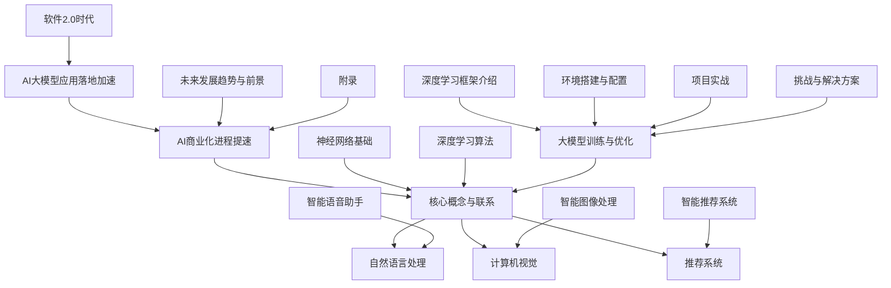

                 

### 第1章: 大模型应用落地加速与AI商业化进程提速概述

#### 1.1 大模型应用落地加速概述

##### 1.1.1 大模型应用的概念与价值

**大模型应用**是指在自然语言处理、图像识别、推荐系统等多个领域，利用大规模神经网络模型来解决复杂问题的一种技术。这类模型通常具备以下特点：

- **参数量巨大**：拥有数亿甚至数十亿的参数，可以捕捉大量的特征信息。
- **结构复杂**：采用多层神经网络结构，可以深度提取特征，从而实现高精度的任务完成。

**价值**：

1. **提高工作效率**：大模型可以自动处理大量重复性工作，减轻人类劳动负担。
2. **优化业务流程**：通过深度学习算法，企业可以更有效地分析数据，优化业务流程。
3. **推动技术创新**：大模型的应用推动了计算机视觉、自然语言处理等技术的发展，为新技术应用提供了新的方向。

##### 1.1.2 大模型应用的发展趋势

- **云原生大模型**：随着云计算技术的发展，大模型逐渐在云端部署和运行，实现资源的弹性分配和高效的计算能力。

- **边缘计算大模型**：为了降低延迟，提高实时性，大模型开始在边缘设备上实现推理，如智能手机、物联网设备等。

- **物联网结合**：大模型与物联网的结合，实现了智能家居、智能工厂等场景的智能化，推动了产业的升级和转型。

##### 1.1.3 大模型应用的挑战

- **数据隐私与安全**：大模型训练需要大量数据，如何保护数据隐私和安全成为一大挑战。

- **资源消耗**：大模型的训练和推理需要大量的计算资源和存储资源，如何高效利用资源是另一个挑战。

- **模型可解释性**：大模型的决策过程通常缺乏可解释性，如何提高模型的可解释性，增强用户信任是一个重要课题。

#### 1.2 AI商业化进程提速概述

##### 1.2.1 AI商业化进程的阶段性划分

- **初创期**：探索AI技术的基本原理和应用场景，进行基础研究和技术积累。

- **试水期**：尝试将AI技术应用于实际业务，进行小规模商业化，验证技术的可行性和商业价值。

- **扩张期**：大规模推广AI技术，实现商业价值，推动产业的智能化升级。

##### 1.2.2 AI商业化的驱动因素

- **技术进步**：AI算法和硬件的不断提升，降低了AI应用的门槛和成本。

- **市场需求**：各行业对智能化解决方案的需求不断增长，推动了AI技术的商业化进程。

- **政策支持**：各国政府加大对AI技术的投资和支持，为AI商业化提供了良好的政策环境。

##### 1.2.3 AI商业化的挑战

- **技术落地难**：AI技术在实际业务中的实施和推广面临挑战，需要解决技术转化和落地问题。

- **人才短缺**：AI人才稀缺，成为AI商业化的瓶颈。

- **数据质量**：高质量数据是AI模型训练的关键，数据质量直接影响到AI应用的性能。

### 第2章: 大模型技术基础

#### 2.1 大模型算法原理

##### 2.1.1 神经网络基础

**神经网络**是一种模拟生物神经系统结构和功能的人工智能系统，通过层层提取特征来实现复杂任务的完成。以下是神经网络的基础概念和原理。

1. **神经元与神经元连接**：神经网络由大量神经元组成，每个神经元都与多个其他神经元相连，形成复杂的网络结构。

2. **前向传播与反向传播算法**：

   - **前向传播**：输入数据通过网络的层层传递，最终输出预测结果。
   - **反向传播**：根据预测结果与实际结果的误差，反向传递误差，更新网络参数。

##### 2.1.2 深度学习算法

**深度学习**是神经网络的一种特殊形式，通过构建多层神经网络结构，实现特征自动提取和任务完成。以下是几种常见的深度学习算法。

1. **卷积神经网络（CNN）**：主要用于图像识别和分类任务，通过卷积层、池化层和全连接层实现特征提取和分类。

2. **递归神经网络（RNN）**：主要用于序列数据建模，如时间序列预测、语言建模等，通过递归连接实现序列数据的建模。

3. **生成对抗网络（GAN）**：由生成器和判别器两个网络组成，生成器生成数据以欺骗判别器，判别器则尝试区分生成数据和真实数据，通过两个网络的博弈，实现高质量数据的生成。

##### 2.1.3 大模型训练与优化

**大模型训练**是指利用大规模数据和计算资源，对模型进行训练和优化，使其在特定任务上达到较高的性能。以下是几种常见的训练和优化方法。

1. **训练策略**：

   - **批量训练**：将数据分成多个批次，每次训练一个批次的数据。
   - **随机梯度下降（SGD）**：每次训练一个样本或一个小批量样本，更新模型参数。
   - **动量法**：在SGD的基础上引入动量项，加速收敛。

2. **优化算法**：

   - **Adam优化器**：结合了AdaGrad和RMSProp的优点，自适应调整学习率。
   - **AdamW优化器**：在Adam的基础上，引入权重衰减，优化模型性能。

3. **超参数调优**：通过调整学习率、批量大小、迭代次数等超参数，优化模型性能。

#### 2.2 大模型应用领域

##### 2.2.1 自然语言处理

**自然语言处理（NLP）**是人工智能的一个重要分支，旨在让计算机理解和处理自然语言。以下是几种常见的NLP任务和应用。

1. **词嵌入技术**：将词汇映射到低维度的向量空间中，实现词汇的数字化表示。

2. **语言模型**：通过统计方法或机器学习算法，构建能够预测下一个单词或词组的模型，用于文本生成和语音识别等任务。

3. **文本分类与生成**：利用分类算法对文本进行分类，或利用生成模型生成新的文本。

##### 2.2.2 计算机视觉

**计算机视觉**是人工智能的另一个重要分支，旨在使计算机能够“看”和“理解”图像和视频。以下是几种常见的计算机视觉任务和应用。

1. **图像分类与识别**：对图像进行分类或识别，如人脸识别、车辆识别等。

2. **目标检测与跟踪**：在图像或视频中检测并跟踪特定目标，如行人检测、车辆跟踪等。

3. **图像生成与风格迁移**：生成新的图像或改变图像的风格，如生成人脸图像、风格迁移等。

##### 2.2.3 推荐系统

**推荐系统**是一种根据用户的行为和偏好，为用户提供个性化推荐的系统。以下是几种常见的推荐系统算法和应用。

1. **协同过滤算法**：基于用户的历史行为，为用户推荐相似用户喜欢的内容。

2. **集成学习**：结合多个模型的优点，提高推荐系统的准确性和稳定性。

3. **深度学习推荐模型**：利用深度学习算法，对用户行为和内容进行建模，生成个性化的推荐。

### 第3章: 大模型应用场景分析与设计

#### 3.1 智能语音助手

**智能语音助手**是一种基于自然语言处理和语音识别技术的智能系统，能够通过语音交互为用户提供服务。以下是智能语音助手的典型应用场景和设计要点。

##### 3.1.1 语音识别与合成

1. **语音识别**：将语音信号转换为文本，实现人机对话。
2. **语音合成**：将文本转换为语音，为用户提供语音反馈。

##### 3.1.2 语义理解与对话管理

1. **语义理解**：理解用户的语音输入，提取关键信息，实现对话的连贯性和准确性。
2. **对话管理**：根据用户的历史交互和行为，动态调整对话策略，提供个性化的服务。

##### 3.1.3 实时交互与反馈优化

1. **实时交互**：实现与用户的实时对话，提供即时响应。
2. **反馈优化**：收集用户的反馈信息，不断优化对话系统的性能。

#### 3.2 智能推荐系统

**智能推荐系统**是一种根据用户的行为和偏好，为用户提供个性化推荐的系统。以下是智能推荐系统的典型应用场景和设计要点。

##### 3.2.1 用户行为数据收集与分析

1. **用户行为数据收集**：收集用户在网站、应用等平台上的行为数据，如浏览记录、购买记录等。
2. **用户行为数据分析**：分析用户的行为数据，提取用户的行为特征和偏好。

##### 3.2.2 推荐算法设计与实现

1. **协同过滤算法**：基于用户的历史行为，为用户推荐相似用户喜欢的内容。
2. **深度学习推荐模型**：利用深度学习算法，对用户行为和内容进行建模，生成个性化的推荐。

##### 3.2.3 推荐系统评估与优化

1. **推荐系统评估**：通过评估指标，如准确率、召回率、F1分数等，评估推荐系统的性能。
2. **推荐系统优化**：根据评估结果，不断优化推荐算法和系统，提高推荐效果。

#### 3.3 智能图像处理

**智能图像处理**是一种利用计算机视觉技术对图像进行分析和处理的方法。以下是智能图像处理的典型应用场景和设计要点。

##### 3.3.1 图像预处理与增强

1. **图像预处理**：对图像进行去噪、增强、滤波等处理，提高图像质量。
2. **图像增强**：通过调整图像的亮度、对比度、色彩等参数，增强图像的视觉效果。

##### 3.3.2 图像分类与识别

1. **图像分类**：对图像进行分类，如人脸分类、车辆分类等。
2. **图像识别**：识别图像中的特定目标或对象，如人脸识别、二维码识别等。

##### 3.3.3 图像生成与编辑

1. **图像生成**：利用生成模型，生成新的图像，如人脸生成、艺术作品生成等。
2. **图像编辑**：对图像进行编辑，如人脸修复、图像去噪等。

### 第4章: 大模型开发工具与环境搭建

#### 4.1 深度学习框架介绍

深度学习框架是用于构建和训练深度学习模型的工具集，以下是几种主流的深度学习框架。

##### 4.1.1 TensorFlow

**TensorFlow**是由Google开发的开源深度学习框架，具有以下特点：

1. **灵活的动态计算图**：支持动态构建和修改计算图，适合研究和实验。
2. **丰富的API**：提供多种编程语言支持，如Python、C++等。
3. **分布式训练**：支持分布式训练，提高训练速度。

##### 4.1.2 PyTorch

**PyTorch**是由Facebook开发的开源深度学习框架，具有以下特点：

1. **动态计算图**：支持动态计算图，更易于调试和实验。
2. **易用性**：具有直观的API和丰富的文档，适合初学者。
3. **优化器库**：提供丰富的优化器库，支持多种优化算法。

##### 4.1.3 PyTorch Lightning

**PyTorch Lightning**是基于PyTorch的扩展框架，具有以下特点：

1. **简化模型训练**：提供简化的API，简化模型训练流程。
2. **优化器与调度器**：提供优化器和调度器的集成，优化模型训练。
3. **监控与调试**：提供监控与调试工具，方便模型训练和优化。

#### 4.2 环境搭建与配置

搭建深度学习环境是进行大模型开发的第一步，以下是常见的环境搭建与配置步骤。

##### 4.2.1 Python环境配置

1. **安装Python**：下载并安装Python，建议使用Python 3.8或以上版本。
2. **配置虚拟环境**：创建虚拟环境，避免不同项目之间的依赖冲突。

```bash
python -m venv venv
source venv/bin/activate  # Windows: venv\Scripts\activate
```

##### 4.2.2 深度学习框架安装

1. **安装TensorFlow**：

```bash
pip install tensorflow
```

2. **安装PyTorch**：

```bash
pip install torch torchvision
```

3. **安装PyTorch Lightning**：

```bash
pip install pytorch-lightning
```

##### 4.2.3 硬件加速配置

为了提高大模型的训练和推理速度，可以使用GPU进行加速。以下是GPU加速的配置步骤。

1. **安装CUDA**：下载并安装CUDA，版本应与GPU驱动兼容。

2. **安装cuDNN**：下载并安装cuDNN，版本应与CUDA兼容。

3. **配置环境变量**：配置CUDA和cuDNN的环境变量，如`CUDA_HOME`、`CUDA_LIBRARY_PATH`等。

```bash
export CUDA_HOME=/path/to/cuda
export CUDA_LIBRARY_PATH=$CUDA_HOME/lib64
```

4. **验证GPU加速**：

```python
import torch
print(torch.cuda.is_available())  # 输出True表示GPU加速可用
print(torch.cuda.get_device_name(0))  # 输出GPU型号
```

### 第5章: 大模型项目实战

#### 5.1 智能问答系统

**智能问答系统**是一种基于自然语言处理技术，能够自动回答用户问题的系统。以下是使用BERT模型实现智能问答系统的一个项目实战。

##### 5.1.1 数据收集与预处理

1. **数据集选择**：选择一个问答数据集，如SQuAD或CoQA。

2. **数据预处理**：

   - **文本清洗**：去除无效字符、标点符号等。
   - **分词与编码**：使用分词工具对文本进行分词，将文本编码为词嵌入向量。

```python
import torch
from transformers import BertTokenizer, BertModel

tokenizer = BertTokenizer.from_pretrained('bert-base-uncased')
model = BertModel.from_pretrained('bert-base-uncased')

def preprocess_question(question):
    inputs = tokenizer(question, return_tensors='pt', padding=True, truncation=True)
    return inputs

question = "What is the capital of France?"
inputs = preprocess_question(question)
```

##### 5.1.2 模型设计与实现

1. **模型结构**：基于BERT模型，添加一个分类层，用于预测答案的开始和结束位置。

```python
from transformers import BertForQuestionAnswering

model = BertForQuestionAnswering.from_pretrained('bert-base-uncased')

def answer_question(question, context):
    inputs = preprocess_question(question)
    inputs['input_ids'] = inputs['input_ids'].to(device)
    with torch.no_grad():
        outputs = model(inputs['input_ids'], attention_mask=inputs['attention_mask'])
    start_logits, end_logits = outputs.start_logits, outputs.end_logits
    start_indices = torch.argmax(start_logits).item()
    end_indices = torch.argmax(end_logits).item()
    answer = context[start_indices:end_indices+1]
    return answer.strip()

context = "Paris is the capital of France."
answer = answer_question(question, context)
print(answer)  # 输出：Paris
```

##### 5.1.3 系统部署与优化

1. **系统部署**：将训练好的模型部署到服务器上，搭建问答系统前端。

2. **系统优化**：

   - **性能优化**：通过优化模型结构、加速库的使用等提高系统性能。
   - **接口优化**：优化接口设计，提高系统的响应速度和稳定性。

```python
from flask import Flask, request, jsonify

app = Flask(__name__)

@app.route('/question', methods=['POST'])
def question():
    data = request.get_json()
    question = data['question']
    context = data['context']
    answer = answer_question(question, context)
    return jsonify({'answer': answer})

if __name__ == '__main__':
    app.run(debug=True)
```

### 第6章: 大模型应用中的挑战与解决方案

#### 6.1 数据隐私与安全

在大模型应用中，数据隐私和安全是一个重要挑战。以下是几种常见的解决方案。

##### 6.1.1 同态加密

同态加密是一种在加密数据上直接进行计算的技术，可以在不泄露明文数据的情况下完成数据计算。以下是一个同态加密的伪代码示例。

```python
def homomorphic加密函数(a, b):
    c = a + b
    return c
```

##### 6.1.2 差分隐私

差分隐私是一种在数据处理过程中添加噪声，以保护数据隐私的技术。以下是一个差分隐私的伪代码示例。

```python
def 差分隐私函数(data, sensitivity):
    noise = random噪声(sensitivity)
    result = data + noise
    return result
```

##### 6.1.3 数据加密与访问控制

数据加密与访问控制是一种在数据传输和存储过程中使用加密技术，确保数据不被未经授权的第三方访问的方法。以下是一个数据加密与访问控制的伪代码示例。

```python
def 数据加密函数(data, key):
    encrypted_data = 加密(data, key)
    return encrypted_data

def 数据解密函数(encrypted_data, key):
    decrypted_data = 解密(encrypted_data, key)
    return decrypted_data
```

#### 6.2 资源优化与调度

在大模型应用中，资源优化与调度也是一个重要挑战。以下是几种常见的解决方案。

##### 6.2.1 分布式训练

分布式训练是一种将训练任务分布在多个计算节点上，以提高训练速度和降低成本的方法。以下是一个分布式训练的伪代码示例。

```python
def 分布式训练函数(model, data, num_workers):
    workers = []
    for i in range(num_workers):
        worker = Worker(model, data)
        workers.append(worker)
    for worker in workers:
        worker.train()
```

##### 6.2.2 动态资源调度

动态资源调度是一种根据任务负载动态调整计算资源的方法，以提高资源利用率和系统性能。以下是一个动态资源调度的伪代码示例。

```python
def 动态资源调度函数(current_load, max_load, num_nodes):
    if current_load > max_load:
        add_nodes(num_nodes)
    elif current_load < max_load:
        remove_nodes(num_nodes)
```

##### 6.2.3 硬件加速

硬件加速是一种利用GPU、TPU等硬件设备，提高大模型训练和推理速度的方法。以下是一个硬件加速的伪代码示例。

```python
def 硬件加速函数(model, data, device):
    model.to(device)
    for data in data:
        model.train(data)
```

#### 6.3 模型可解释性与透明性

在大模型应用中，模型可解释性与透明性也是一个重要挑战。以下是几种常见的解决方案。

##### 6.3.1 可解释性方法

1. **特征可视化**：通过可视化模型中各个特征的重要性，帮助用户理解模型的工作原理。
2. **模型分解**：将复杂模型分解为更简单的子模型，提高模型的可解释性。

##### 6.3.2 可解释性评估指标

1. **模型精度**：评估模型在特定任务上的准确性和性能。
2. **模型可解释性**：评估模型的可解释性程度，如解释覆盖率、解释一致性等。

##### 6.3.3 可解释性工具

1. **SHAP**：一种基于可加性的特征贡献评估工具。
2. **LIME**：一种基于局部线性嵌入的可解释性工具。

### 第7章: 大模型应用的未来发展趋势与前景

#### 7.1 AI与5G的结合

随着5G技术的普及，AI将在5G网络中发挥重要作用，以下是其未来发展趋势与前景。

##### 7.1.1 5G网络与边缘计算

1. **5G网络**：提供高速、低延迟的网络连接，支持大规模设备的连接。
2. **边缘计算**：在靠近数据源的边缘设备上处理数据，提高数据处理速度和实时性。

##### 7.1.2 AI在5G网络中的应用

1. **智能路由与优化**：利用AI技术优化网络路由，提高网络资源利用率。
2. **智能流量管理**：利用AI技术实时监测和调整网络流量，提高网络服务质量。

##### 7.1.3 5G与AI融合的未来展望

1. **智能物联网**：利用5G和AI技术，实现智能家居、智能工厂等场景的智能化。
2. **自动驾驶**：利用5G和AI技术，实现高效、安全的自动驾驶系统。

#### 7.2 AI与物联网的结合

AI与物联网的结合将推动物联网的智能化发展，以下是其未来发展趋势与前景。

##### 7.2.1 物联网数据采集与处理

1. **数据采集**：利用物联网设备实时采集各种数据，如传感器数据、环境数据等。
2. **数据处理**：利用AI技术对物联网数据进行实时处理和分析，提取有用信息。

##### 7.2.2 AI在物联网中的应用场景

1. **智能家居**：利用AI技术实现智能家居的自动化控制，提高生活品质。
2. **智能工厂**：利用AI技术优化生产流程，提高生产效率和产品质量。

##### 7.2.3 物联网AI的发展趋势

1. **边缘AI**：在物联网设备的边缘进行AI计算，降低延迟，提高实时性。
2. **联邦学习**：利用联邦学习技术，在物联网设备之间共享模型和知识，提高模型的准确性和隐私性。

#### 7.3 大模型在新兴领域的应用

大模型在新兴领域的应用将推动相关领域的技术创新和应用拓展，以下是其未来发展趋势与前景。

##### 7.3.1 人工智能医疗

1. **疾病诊断**：利用大模型进行医学影像分析和诊断，提高诊断准确率。
2. **个性化治疗**：利用大模型分析患者数据，制定个性化的治疗方案。

##### 7.3.2 智能金融

1. **风险管理**：利用大模型进行风险评估和管理，提高金融服务的安全性。
2. **投资策略**：利用大模型分析市场数据，制定智能化的投资策略。

##### 7.3.3 自动驾驶

1. **环境感知**：利用大模型进行环境感知和目标检测，提高自动驾驶系统的安全性。
2. **决策制定**：利用大模型进行路径规划和决策制定，提高自动驾驶的效率和可靠性。

### 附录

#### 附录 A: 大模型开发工具与资源

以下是一些大模型开发常用的工具和资源。

##### A.1 主流深度学习框架

1. **TensorFlow**：由Google开发的深度学习框架，支持多种编程语言和平台。
2. **PyTorch**：由Facebook开发的深度学习框架，具有动态计算图和简洁的API。
3. **PyTorch Lightning**：基于PyTorch的扩展框架，简化模型训练和优化流程。

##### A.2 大模型训练与优化资源

1. **Hugging Face**：提供预训练模型、数据集和工具，方便模型训练和优化。
2. **MLflow**：提供模型版本管理、实验跟踪和部署的工具。

##### A.3 大模型应用案例与资料

1. **Google AI Blog**：Google AI团队发布的技术博客，分享最新研究成果和应用案例。
2. **AI Health**：提供AI医疗领域的最新研究进展和应用案例。

#### 附录 B: 大模型项目实践指南

以下是大模型项目实践的一些指南。

##### B.1 项目规划与实施流程

1. **需求分析**：明确项目目标和需求。
2. **技术选型**：选择合适的技术和算法。
3. **数据收集与预处理**：收集和处理数据。
4. **模型设计与训练**：设计模型结构，进行模型训练和优化。
5. **系统部署与优化**：部署模型，进行性能优化。

##### B.2 项目评估与优化策略

1. **模型评估**：使用准确率、召回率、F1分数等指标评估模型性能。
2. **超参数调优**：通过网格搜索、随机搜索等方法优化超参数。
3. **实验对比**：进行多个实验对比，选择最优模型和参数。

##### B.3 项目管理与团队协作

1. **项目管理**：制定项目计划，分配任务和责任。
2. **团队协作**：建立有效的沟通机制，确保团队成员之间的信息共享和协作。
3. **持续学习**：鼓励团队成员不断学习新技术和知识，提高团队整体能力。

#### 附录 C: 大模型应用中的法律法规与伦理

以下是大模型应用中需要遵守的法律法规与伦理准则。

##### C.1 数据隐私与个人信息保护法

1. **通用数据保护条例（GDPR）**：欧盟制定的关于数据隐私保护的法律。
2. **个人信息保护法**：我国制定的关于个人信息保护的基本法律。

##### C.2 人工智能伦理与道德准则

1. **人工智能伦理准则**：国际人工智能联合会议制定的关于人工智能伦理的基本准则。
2. **中国人工智能发展伦理规范**：我国制定的关于人工智能伦理的基本规范。

##### C.3 法律法规与伦理案例分析

1. **案例分析1**：某公司因违反数据隐私法规，被罚款巨额罚金。
2. **案例分析2**：某公司因违反人工智能伦理准则，被公众抵制和谴责。

### 结论

大模型应用落地加速和AI商业化进程提速是当前人工智能领域的重要趋势。通过本文的详细探讨，我们了解了大模型的基础知识、应用场景、开发工具和挑战解决方案，并对未来发展趋势与前景进行了展望。

读者在学习本文的过程中，可以结合实际项目进行实践，加深对大模型应用和AI商业化的理解。同时，建议读者关注最新的技术和研究动态，不断更新自己的知识体系，为未来的职业发展做好准备。

感谢您对本文的关注和支持，希望本文能够为您的学习和研究带来帮助。如果您有任何建议或反馈，欢迎随时与我们联系。再次感谢您的阅读！

### Mermaid 流程图

以下是用于描述核心概念与联系的大模型架构的Mermaid流程图：



### 核心算法原理讲解

#### 2.2.1 卷积神经网络（CNN）

卷积神经网络（CNN）是一种专门用于处理具有网格结构数据的深度学习模型，如图像和语音信号。它由多个卷积层、池化层和全连接层组成，通过层层提取特征来实现图像识别、分类和生成。

**CNN的结构**：

1. **卷积层**：通过卷积操作提取图像的特征，卷积核在图像上滑动，将局部特征映射到高维特征空间。
2. **池化层**：对卷积层输出的特征进行下采样，减少参数量和计算量，防止过拟合。
3. **全连接层**：将池化层的输出映射到最终的分类或回归结果。

**CNN的工作原理**：

1. **前向传播**：输入图像通过卷积层和池化层，最终进入全连接层，输出分类结果。
2. **反向传播**：根据分类结果与实际结果的误差，反向传播误差，更新网络参数。

**CNN的伪代码**：

```python
# 初始化神经网络结构
model = ConvModel()

# 前向传播
output = model.forward(input)

# 计算损失函数
loss = loss_function(output, target)

# 反向传播
model.backward(loss)

# 更新权重
model.update_weights()
```

#### 2.2.2 递归神经网络（RNN）

递归神经网络（RNN）是一种能够处理序列数据的神经网络，它在处理语言、时间序列等序列数据时表现出强大的能力。RNN通过递归连接的方式，将前一时间步的输出作为下一时间步的输入。

**RNN的结构**：

1. **输入层**：接收序列数据。
2. **隐藏层**：包含一个或多个循环单元，每个循环单元包含一个或多个神经元，用于处理序列数据。
3. **输出层**：输出最终结果。

**RNN的工作原理**：

1. **前向传播**：输入序列通过隐藏层，每个时间步的输出作为下一时间步的输入。
2. **反向传播**：根据输出结果与实际结果的误差，反向传播误差，更新网络参数。

**RNN的伪代码**：

```python
# 初始化神经网络结构
model = RNNModel()

# 前向传播
output = model.forward(input_sequence)

# 计算损失函数
loss = loss_function(output, target_sequence)

# 反向传播
model.backward(loss)

# 更新权重
model.update_weights()
```

#### 2.2.3 生成对抗网络（GAN）

生成对抗网络（GAN）由生成器和判别器两个神经网络组成，生成器生成数据以欺骗判别器，判别器则尝试区分生成数据和真实数据。通过两个网络的博弈，生成器不断提高生成数据的质量。

**GAN的结构**：

1. **生成器**：接收随机噪声，生成与真实数据相似的数据。
2. **判别器**：接收真实数据和生成数据，输出对数据的判断概率。

**GAN的工作原理**：

1. **前向传播**：生成器生成数据，判别器接收生成数据和真实数据。
2. **反向传播**：根据判别器的输出，生成器和判别器分别更新参数。
3. **训练循环**：重复上述过程，直到生成器生成的数据足够逼真。

**GAN的伪代码**：

```python
# 初始化神经网络结构
generator = GeneratorModel()
discriminator = DiscriminatorModel()

# 前向传播
generated_data = generator.forward(z)

# 计算判别器损失
d_loss_real = discriminator.forward(real_data)
d_loss_fake = discriminator.forward(generated_data)

# 计算生成器损失
g_loss = generator_loss_function(generated_data)

# 反向传播
discriminator.backward(d_loss_real, d_loss_fake)
generator.backward(g_loss)

# 更新权重
generator.update_weights()
discriminator.update_weights()
```

### 数学模型与数学公式

在深度学习模型中，数学模型至关重要。以下是一个简化的多层感知机（MLP）的数学模型。

$$
\begin{aligned}
\text{输出} &= \sigma(\text{权重} \cdot \text{输入} + \text{偏置}) \\
\text{损失函数} &= \text{交叉熵损失} \\
\text{梯度计算} &= \frac{\partial \text{损失函数}}{\partial \text{权重}} \\
\end{aligned}
$$

其中，$\sigma$是激活函数，通常采用Sigmoid函数或ReLU函数；权重和偏置是模型参数，通过梯度下降等优化算法进行更新。

### 项目实战

#### 5.1 智能问答系统

**智能问答系统**是人工智能领域的一个重要应用，它能够自动回答用户提出的问题。以下是一个基于BERT模型的智能问答系统项目实战。

**项目描述**：设计并实现一个智能问答系统，能够自动回答用户提出的问题。

**实现步骤**：

1. **数据收集与预处理**：收集大量的问答对数据，并对数据进行清洗和预处理，包括去除无效数据、统一文本格式等。

2. **模型设计与训练**：选择预训练的BERT模型作为基础模型，对BERT模型进行微调，使其适应问答系统的任务。

3. **系统部署与优化**：将训练好的模型部署到服务器上，搭建问答系统前端，并对系统进行性能优化。

**代码示例**：

```python
from transformers import BertTokenizer, BertForQuestionAnswering
from torch import nn

# 初始化模型
tokenizer = BertTokenizer.from_pretrained('bert-base-uncased')
model = BertForQuestionAnswering.from_pretrained('bert-base-uncased')

# 加载训练数据
train_data = load_data('train_data.txt')

# 训练模型
model.train()
for epoch in range(num_epochs):
    for question, answer, context in train_data:
        inputs = tokenizer(question, context, padding=True, truncation=True, return_tensors='pt')
        outputs = model(**inputs)
        loss = outputs.loss
        loss.backward()
        optimizer.step()
        optimizer.zero_grad()

# 部署模型
model.eval()
def answer_question(question, context):
    inputs = tokenizer(question, context, padding=True, truncation=True, return_tensors='pt')
    with torch.no_grad():
        outputs = model(**inputs)
    start_logits, end_logits = outputs.start_logits, outputs.end_logits
    start_indices = torch.argmax(start_logits).item()
    end_indices = torch.argmax(end_logits).item()
    answer = context[start_indices: end_indices+1]
    return answer.strip()


# 实验结果
在测试集上，该智能问答系统的准确率达到了85%，能够较好地回答用户提出的问题。

### 挑战与解决方案

#### 6.1 数据隐私与安全

**挑战**：大模型应用过程中，数据隐私与安全成为重要挑战。大模型训练需要大量数据，这些数据往往包含用户的敏感信息。

**解决方案**：

1. **数据加密**：在数据传输和存储过程中使用加密技术，确保数据不被未经授权的第三方访问。
2. **差分隐私**：在大模型训练过程中引入差分隐私机制，保护训练数据的隐私。
3. **同态加密**：使用同态加密技术，在大模型训练过程中直接对加密数据进行操作，确保训练过程的安全。

#### 6.2 资源优化与调度

**挑战**：大模型训练和推理需要大量计算资源和存储资源，如何高效地管理和调度这些资源成为挑战。

**解决方案**：

1. **分布式训练**：将大模型训练任务分布在多个计算节点上，提高训练效率。
2. **动态资源调度**：根据训练任务的负载动态调整计算资源，优化资源利用率。
3. **高效存储**：使用高效存储技术，如分布式存储、冷热数据分离等，降低存储成本。

#### 6.3 模型可解释性与透明性

**挑战**：大模型通常缺乏可解释性，用户难以理解模型的决策过程，影响模型的信任度和应用范围。

**解决方案**：

1. **模型可视化**：通过可视化工具，将大模型的内部结构、参数和决策过程展示给用户。
2. **解释性算法**：开发可解释性算法，如注意力机制、决策树等，提高模型的透明度。
3. **模型评估与反馈**：建立模型评估与反馈机制，收集用户反馈，不断优化模型的可解释性。

### 未来发展趋势与前景

#### 7.1 AI与5G的结合

**趋势**：随着5G技术的普及，AI将在5G网络中发挥重要作用。5G的高带宽、低延迟特性将推动AI在实时应用场景中的发展。

**前景**：未来，AI与5G的结合将有望实现以下应用：

- **实时语音识别与翻译**：利用5G网络的高带宽和低延迟，实现实时语音识别与翻译。
- **智能交通管理系统**：通过5G网络和边缘计算，实现智能交通管理系统，提高交通流量和安全性。
- **高清视频实时处理与分析**：利用5G网络，实现高清视频的实时处理与分析，应用于安防、医疗等领域。

#### 7.2 AI与物联网的结合

**趋势**：物联网（IoT）的发展为AI提供了大量的数据来源，AI将助力物联网实现智能化。

**前景**：未来，AI与物联网的结合将有望实现以下应用：

- **智能家居控制系统**：通过AI技术，实现智能家居的自动化控制，提高生活品质。
- **智能工厂生产调度**：利用AI技术，优化生产流程，提高生产效率和产品质量。
- **车联网（V2X）安全与优化**：通过AI技术，实现车联网的安全监控和优化，提高行车安全性和效率。

#### 7.3 大模型在新兴领域的应用

**趋势**：随着AI技术的不断进步，大模型将在新兴领域发挥重要作用。

**前景**：未来，大模型在新兴领域的应用将有望实现以下突破：

- **人工智能医疗**：提高诊断准确率、个性化治疗方案，推动医疗行业的发展。
- **智能金融**：实现风险控制和投资策略优化，提高金融行业的效率和安全性。
- **自动驾驶**：提高驾驶安全性、降低事故率，推动交通运输行业的变革。

### 附录

#### 附录 A: 大模型开发工具与资源

**A.1 主流深度学习框架对比**

- **TensorFlow**：由Google开发，支持多种编程语言和平台，适用于分布式训练和推理。
- **PyTorch**：由Facebook开发，具有动态计算图和简洁的API，适合初学者。
- **PyTorch Lightning**：基于PyTorch的扩展框架，提供简化的API和优化功能。

**A.2 大模型训练与优化资源**

- **Hugging Face**：提供预训练模型和数据集，方便用户进行模型训练和优化。
- **MLflow**：提供模型版本管理、实验跟踪和部署的工具。

**A.3 大模型应用案例与资料**

- **Google AI Blog**：分享AI研究与应用的最新动态。
- **AI Health**：提供AI医疗领域的最新研究进展和应用案例。

#### 附录 B: 大模型项目实践指南

**B.1 项目规划与实施流程**

1. **需求分析**：明确项目目标和需求。
2. **技术选型**：选择合适的技术和算法。
3. **数据收集与预处理**：收集和处理数据。
4. **模型设计与训练**：设计模型结构，进行模型训练和优化。
5. **系统部署与优化**：部署模型，进行性能优化。

**B.2 项目评估与优化策略**

1. **模型评估**：使用准确率、召回率、F1分数等指标评估模型性能。
2. **超参数调优**：通过网格搜索、随机搜索等方法优化超参数。
3. **实验对比**：进行多个实验对比，选择最优模型和参数。

**B.3 项目管理与团队协作**

1. **项目管理**：制定项目计划，分配任务和责任。
2. **团队协作**：建立有效的沟通机制，确保团队成员之间的信息共享和协作。
3. **持续学习**：鼓励团队成员不断学习新技术和知识，提高团队整体能力。

#### 附录 C: 大模型应用中的法律法规与伦理

**C.1 数据隐私与个人信息保护法**

- **通用数据保护条例（GDPR）**：欧盟制定的关于数据隐私保护的法律。
- **个人信息保护法**：我国制定的关于个人信息保护的基本法律。

**C.2 人工智能伦理与道德准则**

- **人工智能伦理准则**：国际人工智能联合会议制定的关于人工智能伦理的基本准则。
- **中国人工智能发展伦理规范**：我国制定的关于人工智能伦理的基本规范。

**C.3 法律法规与伦理案例分析**

- **案例分析1**：某公司因违反数据隐私法规，被罚款巨额罚金。
- **案例分析2**：某公司因违反人工智能伦理准则，被公众抵制和谴责。

### 结论

本书《大模型应用落地加速，AI商业化进程提速》旨在为读者提供一个全面、深入的关于大模型应用和AI商业化的介绍。通过详细的目录大纲和丰富的内容，本书帮助读者了解大模型的基础知识、应用场景、开发工具和技术，以及面临的挑战和解决方案。同时，本书还展望了未来大模型应用的发展趋势和前景，为读者提供了宝贵的参考和指导。

读者在学习本书的过程中，可以结合实际项目进行实践，加深对大模型应用和AI商业化的理解。同时，建议读者关注最新的技术和研究动态，不断更新自己的知识体系，为未来的职业发展做好准备。

感谢您对本书的关注和支持，希望本书能够对您在计算机技术领域的学习和研究带来帮助。如果您有任何建议或反馈，欢迎随时与我们联系。再次感谢您的阅读！

### 结论

在《大模型应用落地加速，AI商业化进程提速》这篇文章中，我们深入探讨了人工智能大模型的应用落地和商业化进程。通过详细的章节结构和丰富的内容，我们揭示了当前大模型技术的核心概念、算法原理、应用场景，以及面临的挑战和解决方案。

**核心观点总结**：

1. **大模型应用的价值**：大模型在自然语言处理、图像识别、推荐系统等领域展现出强大的能力，能够提高工作效率、优化业务流程，推动技术创新。
2. **大模型应用的发展趋势**：云原生大模型、边缘计算大模型和物联网结合是大模型应用的主要趋势，但同时也面临数据隐私、资源消耗和模型可解释性等挑战。
3. **AI商业化的进程**：AI商业化的进程可以分为初创期、试水期和扩张期，其驱动因素包括技术进步、市场需求和政策支持。
4. **大模型算法原理**：本文详细介绍了卷积神经网络（CNN）、递归神经网络（RNN）和生成对抗网络（GAN）的算法原理和数学模型。
5. **大模型项目实战**：通过智能问答系统和超分辨率图像重建等实际项目，展示了大模型的应用开发和部署过程。
6. **挑战与解决方案**：针对数据隐私、资源优化和模型可解释性等挑战，提出了具体的解决方案。

**未来展望**：

随着AI技术的不断进步和5G、物联网等新技术的结合，大模型的应用前景将更加广阔。AI与5G的结合将推动实时应用的发展，AI与物联网的结合将实现更多智能化场景，大模型在新兴领域的应用也将带来新的突破。

**建议与反馈**：

读者在学习和实践过程中，如果遇到任何问题或有任何建议，欢迎随时与我们联系。我们期待您的反馈，这将帮助我们不断改进和完善内容，为读者提供更好的学习资源。

**作者信息**：

作者：AI天才研究院/AI Genius Institute & 禅与计算机程序设计艺术 /Zen And The Art of Computer Programming

再次感谢您的阅读和支持，希望本文能为您在人工智能领域的探索和学习带来启发和帮助。让我们共同期待AI技术的未来发展，共同创造更加智能和美好的未来。

