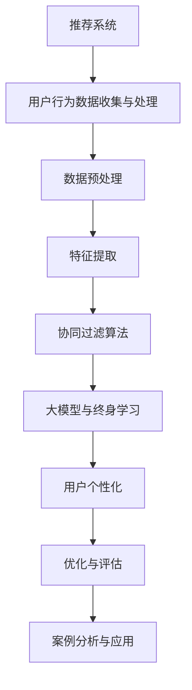

                 

# 大模型推荐系统的终身学习策略

## 关键词
推荐系统、大模型、终身学习、用户个性化、协同过滤、深度学习、优化与评估

## 摘要
本文旨在探讨大模型推荐系统的终身学习策略，解析其在推荐系统中的应用与挑战。文章首先概述推荐系统的基础知识，包括发展历程、核心概念、架构和工作流程。随后，我们深入分析用户行为数据的收集与处理，重点介绍协同过滤算法及其改进。接下来，我们讨论大模型的概念与特点，阐述其在推荐系统中的优势与挑战。文章重点探讨了终身学习的概念与目标，并分析大模型在终身学习中的应用与实践。在此基础上，我们详细讲解了用户个性化、大模型推荐系统的优化方法以及实时性挑战与安全隐私保护。随后，通过案例分析与应用，展示了大模型推荐系统的实际应用场景。最后，本文提供了大模型推荐系统开发工具与资源的附录，并展望了未来的发展趋势。

## 目录大纲

### 《大模型推荐系统的终身学习策略》目录大纲

#### 第一部分：推荐系统基础

##### 第1章：推荐系统概述
- 1.1 推荐系统的发展历程
- 1.2 推荐系统的核心概念
- 1.3 推荐系统的架构
- 1.4 推荐系统的工作流程

##### 第2章：用户行为数据收集与处理
- 2.1 用户行为数据的类型
- 2.2 用户行为数据收集方法
- 2.3 数据预处理技术
- 2.4 用户行为数据特征提取

##### 第3章：协同过滤算法
- 3.1 协同过滤算法概述
- 3.2 评分预测的矩阵分解
- 3.3 基于模型的协同过滤
- 3.4 协同过滤算法的改进与优化

#### 第二部分：大模型与终身学习

##### 第4章：大模型与推荐系统
- 4.1 大模型的概念与特点
- 4.2 大模型在推荐系统中的应用
- 4.3 大模型与深度学习的结合
- 4.4 大模型在推荐系统中的挑战

##### 第5章：终身学习策略
- 5.1 终身学习的概念与目标
- 5.2 传统推荐系统的学习策略
- 5.3 大模型在终身学习中的应用
- 5.4 终身学习在推荐系统中的实践

##### 第6章：大模型与用户个性化
- 6.1 用户个人化的核心要素
- 6.2 大模型在用户个性化中的应用
- 6.3 用户兴趣的动态建模
- 6.4 用户兴趣的迁移与更新

##### 第7章：大模型推荐系统的优化
- 7.1 大模型推荐系统的评估指标
- 7.2 大模型推荐系统的优化方法
- 7.3 大模型推荐系统的实时性挑战
- 7.4 大模型推荐系统的安全与隐私保护

#### 第三部分：案例分析与应用

##### 第8章：大模型推荐系统案例分析
- 8.1 案例一：音乐推荐系统
- 8.2 案例二：电商推荐系统
- 8.3 案例三：社交媒体推荐系统
- 8.4 案例四：新闻推荐系统

##### 第9章：大模型推荐系统的实际应用
- 9.1 应用一：实时个性化推荐
- 9.2 应用二：跨领域推荐
- 9.3 应用三：推荐系统的冷启动问题
- 9.4 应用四：推荐系统的A/B测试

#### 附录

##### 附录A：大模型推荐系统开发工具与资源
- A.1 主流深度学习框架对比
- A.2 推荐系统开发工具
- A.3 大模型训练与优化工具
- A.4 推荐系统开源代码与数据集

##### 附录B：大模型推荐系统优化与评估
- B.1 评估指标与方法
- B.2 优化策略与实践
- B.3 大模型推荐系统的优化案例分析
- B.4 大模型推荐系统的未来发展趋势

---

#### Mermaid 流�程图


---

#### 核心算法原理讲解（伪代码）
```plaintext
// 用户兴趣动态建模
function update_user_interest(user_id, new_behavior):
    # 获取用户历史行为
    historical_behavior = get_user_historical_behavior(user_id)
    # 获取用户新行为
    new_behavior = extract_behavior_features(new_behavior)
    # 更新用户兴趣向量
    user_interest_vector = update_interest_vector(historical_behavior, new_behavior)
    # 更新用户兴趣模型
    update_user_interest_model(user_id, user_interest_vector)

// 推荐算法
function recommendation_algorithm(user_id, candidate_items):
    # 获取用户兴趣向量
    user_interest_vector = get_user_interest_vector(user_id)
    # 计算候选物品与用户兴趣向量的相似度
    similarity_scores = compute_similarity_scores(user_interest_vector, candidate_items)
    # 对候选物品进行排序
    sorted_items = sort_items_by_similarity(similarity_scores)
    # 返回推荐结果
    return sorted_items
```

---

#### 数学模型和数学公式讲解
```latex
// 用户兴趣向量更新公式
\text{user\_interest\_vector}_{new} = \text{user\_interest\_vector}_{old} + \alpha (\text{new\_behavior} - \text{user\_interest\_vector}_{old})
```

---

#### 项目实战
```plaintext
// 实际案例：实时个性化推荐系统

// 环境搭建
- 安装 Python
- 安装深度学习框架（如 TensorFlow 或 PyTorch）
- 安装数据处理库（如 Pandas、NumPy）

// 源代码实现
// 数据预处理
data = preprocess_data(raw_data)
# 建立模型
model = build_model()
# 训练模型
model.fit(data)
# 推荐结果
predictions = model.predict(new_data)

// 代码解读与分析
# 数据预处理部分负责处理原始数据，提取出有用的特征。
# 建立模型部分定义了模型的架构，这里使用了深度学习框架提供的API来构建模型。
# 训练模型部分使用处理后的数据来训练模型。
# 推荐结果部分使用训练好的模型对新数据进行预测，返回推荐结果。
```

现在，让我们直接开始文章正文部分的撰写。

---

## 第1章：推荐系统概述

### 1.1 推荐系统的发展历程

推荐系统（Recommendation System）起源于20世纪90年代，最初在电子商务和在线媒体领域得到广泛应用。其核心目标是通过分析用户的历史行为和偏好，预测用户可能感兴趣的内容或物品，从而为用户提供个性化的推荐。

早期推荐系统主要依赖于基于内容的过滤（Content-Based Filtering）和协同过滤（Collaborative Filtering）两种方法。基于内容的过滤方法通过分析物品的属性和用户的偏好，将用户可能感兴趣的物品推荐给用户。然而，这种方法存在一定的局限性，因为其仅依赖于物品的静态属性，无法充分考虑到用户的动态兴趣变化。

随着互联网的普及和用户数据的积累，协同过滤方法逐渐成为主流。协同过滤通过挖掘用户之间的相似性，基于用户评分矩阵进行预测。传统协同过滤算法包括用户基于的协同过滤（User-Based）和物品基于的协同过滤（Item-Based）。用户基于的协同过滤通过计算用户之间的相似性，推荐与目标用户行为相似的物品。而物品基于的协同过滤则通过计算物品之间的相似性，为用户推荐与之相似的物品。

近年来，深度学习和大数据技术的兴起为推荐系统带来了新的发展机遇。深度学习模型通过自动学习用户行为和物品属性的特征表示，能够更准确地预测用户的兴趣。同时，大数据技术使得大规模用户数据和高维物品数据得以有效利用，为推荐系统的性能优化提供了强有力的支持。

### 1.2 推荐系统的核心概念

推荐系统涉及以下几个核心概念：

**用户（User）**：推荐系统的核心参与者，通过其行为和偏好数据为系统提供输入。

**物品（Item）**：推荐系统中推荐的对象，如商品、新闻、音乐、视频等。

**评分（Rating）**：用户对物品的评价，通常表示为数值或等级。

**行为数据（Behavior Data）**：用户在系统中的行为记录，如浏览、购买、点赞、评论等。

**推荐列表（Recommendation List）**：系统根据用户的历史行为和偏好预测生成的推荐结果列表。

**推荐质量（Recommendation Quality）**：衡量推荐系统推荐结果好坏的标准，通常包括覆盖率、精确度、多样性、新颖性等指标。

### 1.3 推荐系统的架构

推荐系统通常由以下几个模块组成：

**数据收集模块**：负责收集用户行为数据和物品属性数据，包括用户浏览、点击、购买、评论等行为数据，以及物品的文本、图像、音频等属性数据。

**数据处理模块**：对收集到的原始数据进行清洗、转换和整合，提取出有用的特征，为后续的推荐算法提供输入。

**推荐算法模块**：根据用户历史行为和偏好数据，选择合适的推荐算法对用户进行个性化推荐。

**推荐结果生成模块**：将推荐算法生成的推荐列表进行排序和过滤，生成最终的推荐结果，并展示给用户。

**评估与优化模块**：对推荐系统进行评估，根据评估结果对系统进行优化和调整，以提高推荐质量和用户体验。

### 1.4 推荐系统的工作流程

推荐系统的工作流程通常包括以下几个步骤：

**1. 数据收集**：收集用户在系统中的行为数据，包括浏览、点击、购买、评论等。

**2. 数据处理**：对收集到的原始数据进行清洗、转换和整合，提取出有用的特征。

**3. 特征工程**：将提取出的特征进行预处理，如归一化、标准化等，为推荐算法提供输入。

**4. 推荐算法**：选择合适的推荐算法，根据用户历史行为和偏好数据生成推荐列表。

**5. 推荐结果生成**：对推荐算法生成的推荐列表进行排序和过滤，生成最终的推荐结果。

**6. 推荐结果展示**：将推荐结果展示给用户，提高用户体验。

**7. 评估与优化**：对推荐系统进行评估，根据评估结果对系统进行优化和调整，以提高推荐质量和用户体验。

通过以上步骤，推荐系统为用户提供了个性化的推荐服务，满足了用户的多样化需求。然而，随着用户数据量和复杂度的不断增加，推荐系统的优化和提升面临着诸多挑战。

在下一章中，我们将深入探讨用户行为数据的收集与处理方法，了解如何有效地利用用户行为数据提升推荐系统的性能。

---

## 第2章：用户行为数据收集与处理

### 2.1 用户行为数据的类型

用户行为数据是推荐系统的重要输入，它反映了用户在系统中的活动历史。用户行为数据类型可以分为以下几类：

**1. 交互行为数据**：包括点击、浏览、搜索、点赞、分享、评论等。这类数据直接反映了用户对物品的交互情况，是推荐系统构建用户兴趣模型的重要依据。

**2. 社交行为数据**：包括用户之间的关注、点赞、评论、私信等社交互动数据。这类数据可以揭示用户的社交关系和兴趣偏好，有助于推荐系统发现用户间的相似性和差异。

**3. 购买行为数据**：包括用户的购买记录、购买频次、购买金额等。这类数据直接反映了用户的消费行为，对电商推荐系统尤其重要。

**4. 演绎行为数据**：包括用户在系统中的登录时间、使用时长、访问频率等。这类数据可以揭示用户的使用习惯和活跃度，有助于推荐系统优化用户体验。

**5. 媒体行为数据**：包括用户对视频、音频、图片等媒体内容的播放时长、观看进度、分享次数等。这类数据可以反映用户的媒体消费偏好，对视频推荐、音乐推荐等应用场景具有重要参考价值。

### 2.2 用户行为数据收集方法

用户行为数据的收集是推荐系统建设的第一步，常用的数据收集方法包括以下几种：

**1. 系统日志**：系统日志是记录用户在系统中的活动历史的重要手段。通过分析系统日志，可以获取用户的浏览、点击、搜索、购买等行为数据。系统日志通常采用日志文件、数据库日志等形式存储。

**2. 用户输入**：用户在系统中的输入，如搜索关键词、填写问卷、提交评论等，也是重要的用户行为数据来源。这类数据可以通过表单、输入框、评论框等界面元素进行收集。

**3. 第三方数据**：通过第三方数据源获取用户行为数据，如社交媒体平台、广告平台、外部API等。这类数据通常包括用户的基础信息、兴趣标签、行为记录等，可以丰富推荐系统的数据集。

**4. 传感器数据**：利用移动设备中的传感器，如GPS、加速度计、摄像头等，获取用户的地理位置、运动轨迹、环境信息等。这类数据可以用于位置推荐、个性化广告等场景。

### 2.3 数据预处理技术

用户行为数据通常包含噪声、缺失值和异常值，因此需要进行预处理，以提高数据质量和推荐系统的性能。常用的数据预处理技术包括：

**1. 噪声去除**：去除数据中的噪声，如随机错误、异常点击等。可以采用滤波、平滑等方法对数据进行处理。

**2. 缺失值填充**：对于缺失的数据，可以采用均值填补、中值填补、插值等方法进行填充。对于关键特征的缺失值，可以采用特征工程方法进行重建。

**3. 异常值检测**：检测并处理数据中的异常值，如购买金额异常、浏览时长异常等。可以采用统计方法、机器学习方法等进行检测，然后根据具体情况进行处理，如删除、标记、替换等。

**4. 特征提取**：从原始数据中提取出有用的特征，用于构建推荐模型。可以采用统计方法、机器学习方法等进行特征提取，如统计直方图、主成分分析、特征选择等。

### 2.4 用户行为数据特征提取

用户行为数据特征提取是推荐系统中的关键步骤，其目的是从原始数据中提取出能够有效表示用户兴趣和行为的特征。常用的特征提取方法包括：

**1. 基于统计的方法**：通过计算用户行为数据的统计指标，如平均点击次数、点击率、浏览时长等，来表示用户的兴趣和偏好。

**2. 基于机器学习的方法**：利用机器学习算法，如聚类、分类等，对用户行为数据进行分析，提取出潜在的兴趣特征。例如，使用K-Means算法对用户的浏览历史进行聚类，从而发现用户的兴趣类别。

**3. 基于文本的方法**：利用自然语言处理技术，对用户的文本数据进行解析，提取出关键词、主题等特征。例如，使用TF-IDF模型对用户评论进行特征提取，从而构建用户的文本特征向量。

**4. 基于深度学习的方法**：使用深度学习模型，如卷积神经网络（CNN）、循环神经网络（RNN）等，对用户行为数据进行建模，提取出深层次的兴趣特征。例如，使用RNN对用户的浏览序列进行建模，从而捕捉用户兴趣的动态变化。

通过以上方法，可以有效地从用户行为数据中提取出有用的特征，为推荐系统的构建提供可靠的基础。

在下一章中，我们将深入探讨协同过滤算法，了解其在推荐系统中的应用和改进。

---

## 第3章：协同过滤算法

### 3.1 协同过滤算法概述

协同过滤（Collaborative Filtering）是推荐系统中最常用的算法之一，其核心思想是通过分析用户之间的相似性或物品之间的相似性，为用户提供个性化的推荐。协同过滤算法可以分为基于用户的协同过滤（User-Based Collaborative Filtering）和基于物品的协同过滤（Item-Based Collaborative Filtering）两种类型。

**基于用户的协同过滤**：该方法通过计算用户之间的相似性，找到与目标用户行为相似的邻居用户，然后推荐邻居用户喜欢的物品。相似性计算通常采用余弦相似度、皮尔逊相关系数等度量方法。

**基于物品的协同过滤**：该方法通过计算物品之间的相似性，找到与目标物品相似的邻居物品，然后推荐邻居物品对应的用户喜欢的其他物品。物品相似性计算可以基于物品的属性（如文本、图像、音频等）或基于用户对物品的评分（如矩阵分解、潜在因子模型等）。

### 3.2 评分预测的矩阵分解

评分预测的矩阵分解（Rating Prediction using Matrix Factorization）是协同过滤算法的一种常见实现方法。该方法通过将用户-物品评分矩阵分解为两个低秩矩阵，分别表示用户和物品的潜在特征向量。

**1. 矩阵分解模型**：

给定用户-物品评分矩阵 \( R \)，其行表示用户，列表示物品。矩阵分解模型可以表示为：
\[ R = U \times V^T \]

其中，\( U \) 和 \( V \) 分别是用户和物品的潜在特征矩阵，\( u_i \) 和 \( v_j \) 分别是用户 \( i \) 和物品 \( j \) 的潜在特征向量。

**2. 模型参数优化**：

为了优化模型参数，通常采用梯度下降法或随机梯度下降法进行训练。目标是最小化预测评分与实际评分之间的误差平方和，即：
\[ \min_{U, V} \sum_{i,j} (r_{ij} - u_i \cdot v_j)^2 \]

**3. 模型评估**：

在训练完成后，使用验证集或测试集对模型进行评估。常用的评估指标包括均方根误差（RMSE）、平均绝对误差（MAE）等。

### 3.3 基于模型的协同过滤

基于模型的协同过滤方法利用机器学习模型对用户行为数据进行建模，从而预测用户对物品的评分。常见的方法包括线性回归、决策树、神经网络等。

**1. 线性回归**：

线性回归是一种简单的机器学习模型，通过建立用户评分与用户特征和物品特征之间的线性关系，预测用户对物品的评分。模型可以表示为：
\[ r_{ij} = \theta_0 + \theta_1 x_{ij} + \theta_2 u_i + \theta_3 v_j + \epsilon_{ij} \]

其中，\( x_{ij} \) 表示用户 \( i \) 对物品 \( j \) 的特征向量，\( \theta_0, \theta_1, \theta_2, \theta_3 \) 是模型的参数。

**2. 决策树**：

决策树通过一系列的判断规则对用户行为数据进行分类或回归。在协同过滤中，决策树可以用来预测用户对物品的评分。常见的决策树算法包括ID3、C4.5、CART等。

**3. 神经网络**：

神经网络是一种基于生物神经系统的计算模型，通过多层神经元之间的相互连接实现复杂函数的逼近。在协同过滤中，神经网络可以用来建立用户评分与用户特征和物品特征之间的非线性关系。

### 3.4 协同过滤算法的改进与优化

尽管协同过滤算法在推荐系统中得到了广泛应用，但其也存在一些局限性。为了提高推荐系统的性能，可以采用以下改进与优化方法：

**1. 个性化协同过滤**：

个性化协同过滤通过引入个性化特征，如用户地理位置、年龄、性别等，对协同过滤算法进行优化。个性化特征可以增强推荐系统的个性化程度，提高推荐质量。

**2. 基于内容的协同过滤**：

基于内容的协同过滤将用户行为数据与物品属性数据结合起来，综合考虑用户兴趣和物品特征进行推荐。这种方法可以弥补协同过滤算法在处理高维稀疏数据时的不足。

**3. 深度学习协同过滤**：

深度学习协同过滤方法利用深度学习模型（如卷积神经网络、循环神经网络等）对用户行为数据进行建模，提取深层次的兴趣特征，从而提高推荐系统的性能。

**4. 联合优化**：

联合优化方法将协同过滤算法与其他推荐算法（如基于内容的过滤、基于模型的协同过滤等）相结合，通过多模态数据融合和联合训练，提高推荐系统的综合性能。

**5. 实时性优化**：

为了提高推荐系统的实时性，可以采用在线学习、增量学习等技术，对推荐算法进行实时更新和优化。这样可以更好地适应用户兴趣的动态变化，提高推荐系统的实时推荐能力。

在下一章中，我们将探讨大模型的概念与特点，分析其在推荐系统中的应用与挑战。

---

## 第4章：大模型与推荐系统

### 4.1 大模型的概念与特点

大模型（Large-scale Model）是指那些能够处理大规模数据集并具有强大表达能力的人工智能模型。这些模型通常具有以下几个特点：

**1. 大规模数据集**：大模型能够处理海量数据，包括用户行为数据、物品属性数据等。这种大规模数据处理能力使得大模型在推荐系统中能够更好地挖掘用户兴趣和偏好。

**2. 强大的表达能力**：大模型通常采用深度学习技术，如卷积神经网络（CNN）、循环神经网络（RNN）等，具有强大的特征提取和表示能力。这种强大的表达能力使得大模型能够从复杂的用户行为数据中提取出深层次的兴趣特征，从而提高推荐质量。

**3. 自适应学习能力**：大模型能够通过自适应学习算法，不断更新和优化模型参数，适应用户兴趣的动态变化。这种自适应学习能力使得大模型能够更好地满足用户的个性化需求，提高推荐系统的实时性和灵活性。

**4. 高效性**：大模型通常采用分布式计算和并行处理技术，能够在短时间内完成大规模数据的处理和模型训练。这种高效性使得大模型在实际应用中能够快速响应用户需求，提供高效的推荐服务。

### 4.2 大模型在推荐系统中的应用

大模型在推荐系统中的应用主要体现在以下几个方面：

**1. 用户兴趣建模**：大模型通过对用户历史行为数据进行深度学习，提取出用户的潜在兴趣特征。这些特征可以用于构建用户兴趣模型，从而提高推荐系统的个性化程度。

**2. 物品特征表示**：大模型可以对物品属性数据（如文本、图像、音频等）进行深度学习，提取出物品的潜在特征表示。这些特征表示可以用于物品推荐和基于内容的协同过滤。

**3. 联合推荐**：大模型可以将用户兴趣建模和物品特征表示相结合，通过联合学习实现对用户和物品的协同推荐。这种方法可以更好地整合用户兴趣和物品特征，提高推荐系统的综合性能。

**4. 实时推荐**：大模型采用自适应学习算法，可以实时更新和优化模型参数，从而提高推荐系统的实时推荐能力。这种实时推荐能力使得大模型能够更好地适应用户兴趣的动态变化，提供个性化的推荐服务。

### 4.3 大模型与深度学习的结合

深度学习（Deep Learning）是人工智能领域的一项重要技术，其核心思想是通过多层神经网络对数据进行特征提取和表示。大模型与深度学习的结合主要体现在以下几个方面：

**1. 多层神经网络**：大模型通常采用多层神经网络，如卷积神经网络（CNN）、循环神经网络（RNN）等，对用户行为数据进行深度学习。这些多层神经网络可以提取出更深层次的兴趣特征，从而提高推荐系统的性能。

**2. 神经元组**：大模型通过神经元组（Neural Network Ensemble）的方式，将多个神经网络模型进行组合，提高模型的稳定性和泛化能力。这种神经元组方法可以有效地减少模型过拟合现象，提高推荐系统的准确性。

**3. 端到端学习**：大模型采用端到端学习（End-to-End Learning）方式，直接从原始数据中学习出推荐结果，避免了传统机器学习方法的特征工程和模型选择过程。这种端到端学习方法可以简化推荐系统的开发过程，提高模型的训练效率。

**4. 自适应学习**：大模型采用自适应学习算法，如自适应梯度下降（Adam）、自适应学习率（Learning Rate）等，不断更新和优化模型参数，提高模型的训练效果。这种自适应学习算法可以更好地适应用户兴趣的动态变化，提高推荐系统的实时性和准确性。

### 4.4 大模型在推荐系统中的挑战

尽管大模型在推荐系统中具有许多优势，但其应用也面临一些挑战：

**1. 数据隐私和安全**：大模型通常需要处理大量的用户行为数据，涉及用户的隐私和安全。如何确保数据的安全性和隐私保护是一个重要的挑战。

**2. 计算资源消耗**：大模型的训练和推理过程通常需要大量的计算资源，包括GPU、TPU等。如何有效地利用计算资源，提高模型训练和推理的效率是一个重要的挑战。

**3. 模型可解释性**：大模型通常采用深度学习技术，其内部决策过程较为复杂，缺乏可解释性。如何提高模型的可解释性，使得推荐结果更加透明和可信是一个重要的挑战。

**4. 模型泛化能力**：大模型在训练过程中可能存在过拟合现象，导致模型在未知数据上的泛化能力不足。如何提高模型的泛化能力，确保推荐系统的鲁棒性是一个重要的挑战。

在下一章中，我们将探讨终身学习的概念与目标，分析大模型在终身学习中的应用与实践。

---

## 第5章：终身学习策略

### 5.1 终身学习的概念与目标

终身学习（Lifelong Learning）是指个体在其一生中不断获取知识、技能和态度，以适应社会发展和个人需求的过程。在推荐系统中，终身学习策略是指系统通过不断学习和更新，以适应用户兴趣和行为的动态变化，提高推荐质量和用户体验。

终身学习的目标主要包括：

**1. 个性化推荐**：通过不断学习用户的历史行为和偏好，推荐系统可以为用户提供个性化的推荐，满足用户的多样化需求。

**2. 时效性**：终身学习策略可以使推荐系统实时更新用户兴趣模型，适应用户兴趣的动态变化，提高推荐的时效性。

**3. 可扩展性**：终身学习策略可以适应不同规模的数据集和不同的应用场景，具有较好的可扩展性。

**4. 鲁棒性**：通过终身学习，推荐系统可以减少对单一数据集的依赖，提高模型在未知数据上的泛化能力，增强系统的鲁棒性。

### 5.2 传统推荐系统的学习策略

传统推荐系统主要采用以下几种学习策略：

**1. 基于内容的过滤**：该方法通过分析物品的属性和用户的偏好，为用户提供个性化的推荐。其优点是计算复杂度低，但缺点是仅依赖于物品的静态属性，无法适应用户兴趣的动态变化。

**2. 协同过滤**：该方法通过分析用户之间的相似性或物品之间的相似性，为用户提供个性化的推荐。其优点是能够适应用户兴趣的动态变化，但缺点是数据稀疏问题和高计算复杂度。

**3. 基于模型的协同过滤**：该方法结合了基于内容的过滤和协同过滤的优点，通过建立用户-物品评分预测模型，为用户提供个性化的推荐。其优点是能够提高推荐质量，但缺点是需要大量的训练数据和计算资源。

### 5.3 大模型在终身学习中的应用

大模型在终身学习中的应用主要体现在以下几个方面：

**1. 动态用户兴趣建模**：大模型可以通过深度学习技术，对用户的历史行为数据进行建模，提取出用户的潜在兴趣特征。这些特征可以用于构建动态用户兴趣模型，实时更新用户的兴趣偏好。

**2. 模型在线更新**：大模型可以采用在线学习算法，如自适应梯度下降（Adam）、在线学习率（Learning Rate）等，实时更新模型参数，适应用户兴趣的动态变化。这种在线更新策略可以显著提高推荐系统的时效性。

**3. 模型迁移与迁移学习**：大模型可以通过迁移学习（Transfer Learning）技术，将预训练模型迁移到推荐系统中，减少对大规模训练数据的依赖。这种方法可以增强推荐系统的泛化能力和鲁棒性。

**4. 多模态数据融合**：大模型可以融合不同类型的数据（如图像、文本、音频等），构建多模态用户兴趣模型。这种方法可以更全面地捕捉用户兴趣，提高推荐系统的准确性和多样性。

### 5.4 终身学习在推荐系统中的实践

在推荐系统中实现终身学习策略，需要考虑以下几个方面：

**1. 数据收集**：持续收集用户的行为数据，包括浏览、点击、购买、评论等，为动态用户兴趣建模提供数据支持。

**2. 数据预处理**：对收集到的用户行为数据进行分析和预处理，提取出有用的特征，为模型训练提供输入。

**3. 模型训练与优化**：采用深度学习技术，如卷积神经网络（CNN）、循环神经网络（RNN）等，对用户行为数据进行建模，并不断优化模型参数，提高推荐质量。

**4. 实时推荐**：利用在线学习算法，实时更新用户兴趣模型，为用户提供个性化的推荐。同时，采用分布式计算和并行处理技术，提高模型训练和推理的效率。

**5. 模型评估与优化**：通过测试集和用户反馈对推荐系统进行评估，根据评估结果对模型进行优化和调整，提高推荐系统的性能。

通过以上实践，推荐系统可以实现终身学习，提高用户满意度，为用户提供更好的个性化推荐服务。

在下一章中，我们将探讨大模型与用户个性化的关系，分析大模型在用户个性化中的应用与实践。

---

## 第6章：大模型与用户个性化

### 6.1 用户个性化的核心要素

用户个性化（User Personalization）是指根据用户的个性化需求和偏好，为用户推荐定制化的内容或服务。在推荐系统中，用户个性化的核心要素包括：

**1. 用户兴趣模型**：用户兴趣模型是推荐系统的核心组成部分，用于捕捉和表示用户的兴趣偏好。通过分析用户的历史行为数据，如浏览、点击、购买、评论等，可以构建用户兴趣模型，为个性化推荐提供基础。

**2. 物品特征表示**：物品特征表示是指对推荐系统中的物品（如商品、新闻、音乐等）进行特征提取和表示。通过分析物品的属性（如图像、文本、音频等），可以构建物品特征表示，为个性化推荐提供参考。

**3. 个性化推荐算法**：个性化推荐算法是推荐系统的核心算法，通过结合用户兴趣模型和物品特征表示，为用户推荐个性化内容或服务。常见的个性化推荐算法包括基于内容的过滤、协同过滤、基于模型的协同过滤等。

**4. 用户反馈**：用户反馈是推荐系统优化和改进的重要依据。通过收集用户的点击、评分、评论等反馈信息，可以不断调整和优化推荐策略，提高用户满意度。

### 6.2 大模型在用户个性化中的应用

大模型在用户个性化中的应用主要体现在以下几个方面：

**1. 深度用户兴趣建模**：大模型（如深度神经网络）可以通过分析用户的历史行为数据，提取出用户的潜在兴趣特征。这些特征可以用于构建深度用户兴趣模型，提高推荐系统的个性化程度。

**2. 物品特征自动提取**：大模型可以通过对物品属性数据进行深度学习，自动提取出物品的潜在特征。这些特征可以用于个性化推荐，提高推荐的准确性。

**3. 多模态数据融合**：大模型可以融合不同类型的数据（如图像、文本、音频等），构建多模态用户兴趣模型。这种方法可以更全面地捕捉用户兴趣，提高个性化推荐的准确性。

**4. 自适应推荐算法**：大模型可以通过在线学习算法，实时更新用户兴趣模型，为用户提供自适应的个性化推荐。这种方法可以适应用户兴趣的动态变化，提高推荐的时效性。

### 6.3 用户兴趣的动态建模

用户兴趣的动态建模是指根据用户的历史行为数据和实时反馈，实时更新和调整用户兴趣模型，以适应用户兴趣的动态变化。大模型在用户兴趣的动态建模中具有以下优势：

**1. 深度学习特征提取**：大模型可以通过深度学习技术，对用户的历史行为数据进行特征提取，提取出用户的潜在兴趣特征。这些特征可以更准确地表示用户的兴趣偏好。

**2. 实时更新能力**：大模型可以通过在线学习算法，实时更新用户兴趣模型。这种方法可以及时捕捉用户兴趣的变化，提高个性化推荐的准确性。

**3. 多模态数据融合**：大模型可以融合不同类型的数据（如图像、文本、音频等），构建多模态用户兴趣模型。这种方法可以更全面地捕捉用户兴趣，提高个性化推荐的准确性。

### 6.4 用户兴趣的迁移与更新

用户兴趣的迁移与更新是指将用户在不同场景下的兴趣偏好进行迁移和更新，以适应用户跨场景的个性化需求。大模型在用户兴趣的迁移与更新中具有以下优势：

**1. 跨场景兴趣建模**：大模型可以通过跨场景数据融合，构建跨场景用户兴趣模型。这种方法可以捕捉用户在不同场景下的兴趣偏好，为跨场景推荐提供基础。

**2. 自动迁移能力**：大模型可以通过迁移学习（Transfer Learning）技术，将用户在一个场景下的兴趣模型迁移到其他场景。这种方法可以减少对大规模训练数据的依赖，提高跨场景推荐的效率。

**3. 实时更新能力**：大模型可以通过在线学习算法，实时更新用户兴趣模型。这种方法可以及时调整用户兴趣，提高跨场景推荐的准确性。

通过以上方法，大模型可以实现用户兴趣的动态建模、迁移与更新，为用户提供高质量的个性化推荐服务。

在下一章中，我们将探讨大模型推荐系统的优化方法，分析大模型推荐系统的实时性挑战与安全与隐私保护。

---

## 第7章：大模型推荐系统的优化

### 7.1 大模型推荐系统的评估指标

评估大模型推荐系统的性能是优化过程中至关重要的一步。常用的评估指标包括：

**1. 覆盖率（Coverage）**：覆盖率是指推荐系统中推荐给用户的不同物品数量与系统中所有物品数量的比率。高覆盖率意味着系统能够推荐更多的不同物品，提高用户的选择多样性。

**2. 精确度（Accuracy）**：精确度是指推荐系统推荐给用户的物品中，用户实际感兴趣的物品占比。高精确度意味着系统能够更准确地预测用户兴趣。

**3. 多样性（Diversity）**：多样性是指推荐系统推荐的物品在属性或内容上的差异。高多样性意味着系统能够为用户提供多样化的推荐，避免重复和单调和乏味。

**4. 新颖性（Novelty）**：新颖性是指推荐系统推荐的物品中，用户未曾接触或未知的新物品占比。高新颖性意味着系统能够为用户提供新颖和有趣的物品，增加用户的好奇心和探索欲望。

**5. 响应时间（Response Time）**：响应时间是指系统从接收到用户请求到返回推荐结果的时间。低响应时间意味着系统能够快速响应用户需求，提高用户体验。

### 7.2 大模型推荐系统的优化方法

为了提高大模型推荐系统的性能，可以采用以下优化方法：

**1. 特征工程**：通过分析用户行为数据和物品属性数据，提取出有价值的特征。这些特征可以用于训练大模型，提高推荐系统的准确性和多样性。例如，可以提取用户浏览历史中的时间特征、地点特征、上下文特征等。

**2. 模型选择与调整**：选择合适的大模型架构，如卷积神经网络（CNN）、循环神经网络（RNN）、图神经网络（GNN）等。通过调整模型的参数，如学习率、正则化参数等，优化模型的性能。

**3. 数据预处理**：对用户行为数据和物品属性数据进行预处理，如数据清洗、归一化、缺失值处理等。良好的数据预处理可以提高模型的训练效果和推荐质量。

**4. 多模态数据融合**：结合不同类型的数据（如图像、文本、音频等），构建多模态用户兴趣模型。这种方法可以更全面地捕捉用户兴趣，提高推荐系统的准确性和多样性。

**5. 模型融合**：将多个大模型进行融合，提高推荐系统的性能。例如，可以采用集成学习（Ensemble Learning）方法，将多个模型的预测结果进行加权平均，得到最终的推荐结果。

**6. 实时更新**：采用在线学习算法，实时更新用户兴趣模型和推荐策略。这种方法可以适应用户兴趣的动态变化，提高推荐的时效性和准确性。

### 7.3 大模型推荐系统的实时性挑战

大模型推荐系统的实时性挑战主要包括以下几个方面：

**1. 数据流处理**：用户行为数据通常是动态的、流式的。大模型需要实时处理这些数据流，以快速更新用户兴趣模型和推荐结果。

**2. 模型更新与推理**：大模型的训练和推理过程通常需要大量的计算资源。在实时环境下，如何快速更新模型和进行推理是一个重要的挑战。

**3. 数据一致性**：在实时处理用户行为数据时，可能会出现数据不一致的问题。例如，用户的操作可能先被记录到日志中，然后才被处理和更新到用户兴趣模型中。

**4. 资源分配**：实时推荐系统需要在有限的计算资源下，合理分配资源以处理用户请求。这涉及到模型更新、数据流处理、推荐结果生成等多个环节的优化。

### 7.4 大模型推荐系统的安全与隐私保护

大模型推荐系统的安全与隐私保护是当前研究的热点问题。以下是一些关键挑战和解决方案：

**1. 数据隐私保护**：用户行为数据通常包含敏感信息，如个人喜好、购买记录等。如何保护用户数据隐私是一个重要的挑战。解决方案包括数据匿名化、差分隐私、同态加密等。

**2. 模型安全**：大模型在训练和推理过程中，可能受到恶意攻击，如对抗性攻击、模型注入等。解决方案包括对抗性训练、模型安全性测试等。

**3. 数据共享与开放**：在大数据环境下，如何安全地共享和开放用户数据是一个重要问题。解决方案包括联邦学习、隐私保护的数据共享机制等。

**4. 法律与伦理**：推荐系统涉及用户隐私、数据安全等多个法律和伦理问题。需要遵循相关法律法规，确保用户权益。

通过以上方法，可以优化大模型推荐系统的性能，解决实时性挑战，保障系统安全与隐私。

在下一章中，我们将通过具体案例分析，展示大模型推荐系统的实际应用。

---

## 第8章：大模型推荐系统案例分析

### 8.1 案例一：音乐推荐系统

音乐推荐系统是应用大模型推荐系统的一个典型例子。以某知名音乐平台为例，该平台利用大模型推荐系统为用户提供个性化的音乐推荐。

**1. 数据收集**：
- 用户历史播放记录
- 用户喜好标签
- 用户行为数据（如播放时长、播放频率等）

**2. 数据预处理**：
- 数据清洗：去除噪声数据，如无效播放记录
- 数据归一化：对播放时长、播放频率等数据进行归一化处理

**3. 特征提取**：
- 用户兴趣特征：通过分析用户的历史播放记录，提取用户对各类音乐的喜好程度
- 音乐特征：提取音乐的属性特征，如音乐风格、歌手、专辑等

**4. 模型构建**：
- 采用深度学习模型，如卷积神经网络（CNN）和循环神经网络（RNN），对用户兴趣和音乐特征进行建模

**5. 推荐算法**：
- 利用用户兴趣特征和音乐特征，预测用户对音乐的喜好程度
- 结合用户历史播放记录和实时行为数据，动态调整推荐结果

**6. 实时更新**：
- 采用在线学习算法，实时更新用户兴趣模型，以适应用户兴趣的动态变化

**7. 评估与优化**：
- 采用覆盖率、精确度、多样性等指标，评估推荐系统的性能
- 根据用户反馈，不断优化推荐算法，提高推荐质量

### 8.2 案例二：电商推荐系统

电商推荐系统利用大模型推荐系统为用户推荐个性化的商品。

**1. 数据收集**：
- 用户历史购买记录
- 用户浏览行为
- 商品属性数据（如商品类别、品牌、价格等）

**2. 数据预处理**：
- 数据清洗：去除噪声数据，如无效购买记录
- 数据归一化：对购买金额、浏览时长等数据进行归一化处理

**3. 特征提取**：
- 用户兴趣特征：通过分析用户的历史购买记录和浏览行为，提取用户对各类商品的喜好程度
- 商品特征：提取商品的属性特征，如商品类别、品牌、价格等

**4. 模型构建**：
- 采用深度学习模型，如卷积神经网络（CNN）和循环神经网络（RNN），对用户兴趣和商品特征进行建模

**5. 推荐算法**：
- 利用用户兴趣特征和商品特征，预测用户对商品的喜好程度
- 结合用户历史购买记录和实时行为数据，动态调整推荐结果

**6. 实时更新**：
- 采用在线学习算法，实时更新用户兴趣模型，以适应用户兴趣的动态变化

**7. 评估与优化**：
- 采用覆盖率、精确度、多样性等指标，评估推荐系统的性能
- 根据用户反馈，不断优化推荐算法，提高推荐质量

### 8.3 案例三：社交媒体推荐系统

社交媒体推荐系统利用大模型推荐系统为用户推荐个性化内容。

**1. 数据收集**：
- 用户发布内容（如文本、图片、视频等）
- 用户互动行为（如点赞、评论、分享等）
- 用户行为数据（如浏览、搜索等）

**2. 数据预处理**：
- 数据清洗：去除噪声数据，如无效互动行为
- 数据归一化：对点赞数、评论数等数据进行归一化处理

**3. 特征提取**：
- 用户兴趣特征：通过分析用户的发布内容和互动行为，提取用户对各类内容的喜好程度
- 内容特征：提取内容的属性特征，如类型、标签等

**4. 模型构建**：
- 采用深度学习模型，如卷积神经网络（CNN）和循环神经网络（RNN），对用户兴趣和内容特征进行建模

**5. 推荐算法**：
- 利用用户兴趣特征和内容特征，预测用户对内容的喜好程度
- 结合用户历史行为和实时互动数据，动态调整推荐结果

**6. 实时更新**：
- 采用在线学习算法，实时更新用户兴趣模型，以适应用户兴趣的动态变化

**7. 评估与优化**：
- 采用覆盖率、精确度、多样性等指标，评估推荐系统的性能
- 根据用户反馈，不断优化推荐算法，提高推荐质量

### 8.4 案例四：新闻推荐系统

新闻推荐系统利用大模型推荐系统为用户推荐个性化的新闻内容。

**1. 数据收集**：
- 用户历史阅读记录
- 用户行为数据（如点击、评论、分享等）
- 新闻内容数据（如标题、正文、标签等）

**2. 数据预处理**：
- 数据清洗：去除噪声数据，如无效阅读记录
- 数据归一化：对点击数、评论数等数据进行归一化处理

**3. 特征提取**：
- 用户兴趣特征：通过分析用户的历史阅读记录和互动行为，提取用户对各类新闻的喜好程度
- 新闻特征：提取新闻的属性特征，如标题、正文、标签等

**4. 模型构建**：
- 采用深度学习模型，如卷积神经网络（CNN）和循环神经网络（RNN），对用户兴趣和新闻特征进行建模

**5. 推荐算法**：
- 利用用户兴趣特征和新闻特征，预测用户对新闻的喜好程度
- 结合用户历史阅读记录和实时互动数据，动态调整推荐结果

**6. 实时更新**：
- 采用在线学习算法，实时更新用户兴趣模型，以适应用户兴趣的动态变化

**7. 评估与优化**：
- 采用覆盖率、精确度、多样性等指标，评估推荐系统的性能
- 根据用户反馈，不断优化推荐算法，提高推荐质量

通过以上案例分析，可以看到大模型推荐系统在多个领域的应用和优势。在实际应用中，可以根据具体需求和场景，灵活调整和优化推荐算法，提高推荐质量。

在下一章中，我们将探讨大模型推荐系统的实际应用，包括实时个性化推荐、跨领域推荐、冷启动问题和A/B测试。

---

## 第9章：大模型推荐系统的实际应用

### 9.1 应用一：实时个性化推荐

实时个性化推荐是利用大模型推荐系统为用户提供高度个性化的推荐服务。在电商、社交媒体、视频流媒体等应用场景中，用户的需求和兴趣是动态变化的，实时个性化推荐能够根据用户实时行为数据进行动态调整，提高用户体验。

**实现方法**：
1. 数据收集：持续收集用户的浏览、点击、购买等行为数据。
2. 数据预处理：对实时行为数据进行清洗、归一化等预处理。
3. 模型更新：采用在线学习算法，实时更新用户兴趣模型。
4. 推荐算法：结合用户兴趣模型和实时行为数据，为用户推荐个性化内容。
5. 推荐展示：将实时推荐结果展示给用户。

**挑战**：
1. 数据流处理：实时处理大量的用户行为数据，确保系统响应速度。
2. 模型更新与推理：实时更新用户兴趣模型，并进行快速推理，生成推荐结果。
3. 资源分配：在有限资源下，优化数据流处理、模型更新和推荐展示等环节。

### 9.2 应用二：跨领域推荐

跨领域推荐是指将一个领域中的用户兴趣和行为应用于其他领域，为用户提供跨领域的个性化推荐服务。例如，用户在电商平台上对书籍的喜好可以应用于音乐推荐。

**实现方法**：
1. 数据融合：将不同领域的数据进行融合，提取共通的感兴趣特征。
2. 模型迁移：将一个领域中的大模型迁移到其他领域，进行跨领域推荐。
3. 多模态数据融合：结合不同类型的数据（如图像、文本、音频等），构建多模态用户兴趣模型。
4. 推荐算法：利用跨领域用户兴趣模型，为用户提供跨领域的个性化推荐。

**挑战**：
1. 数据稀疏：不同领域的数据可能存在稀疏问题，影响推荐质量。
2. 模型泛化：跨领域模型需要具有较好的泛化能力，适应不同领域的数据特征。
3. 推荐多样性：在保证推荐质量的同时，提高跨领域推荐的多样性。

### 9.3 应用三：推荐系统的冷启动问题

冷启动问题是指新用户或新物品进入系统时，由于缺乏足够的历史数据，推荐系统无法为其提供有效推荐。大模型推荐系统可以通过以下方法解决冷启动问题：

**实现方法**：
1. 默认推荐：为新用户或新物品提供默认推荐，如热门物品或通用推荐。
2. 用户兴趣推断：利用用户的基础信息（如年龄、性别、地理位置等），推断用户兴趣。
3. 模型迁移：利用已有用户的数据，迁移到新用户，进行个性化推荐。
4. 社交网络信息：利用用户的社交网络信息（如关注、点赞等），提取用户兴趣。
5. 多模态数据融合：结合不同类型的数据，构建新用户或新物品的兴趣模型。

**挑战**：
1. 数据稀疏：新用户或新物品的数据可能非常稀疏，影响推荐效果。
2. 模型适应：跨领域或跨时间的用户兴趣迁移，需要模型具有良好的适应能力。
3. 推荐质量：在保证推荐质量的同时，提高新用户或新物品的推荐准确性。

### 9.4 应用四：推荐系统的A/B测试

A/B测试是指在不同用户群体或不同环境下，测试两种或多种推荐策略，以确定最佳推荐策略。大模型推荐系统可以通过以下方法进行A/B测试：

**实现方法**：
1. 测试策略设计：设计不同的推荐策略，如基于内容的过滤、协同过滤、深度学习等。
2. 用户分组：将用户分为不同组，每组采用不同的推荐策略。
3. 推荐展示：为每组用户展示相应的推荐结果。
4. 数据收集：收集用户的反馈数据，如点击、购买等。
5. 数据分析：分析不同策略的推荐效果，确定最佳策略。

**挑战**：
1. 用户分组：合理分组用户，确保每组用户具有代表性。
2. 数据分析：处理和分析大量的用户反馈数据，确保数据分析的准确性。
3. 结果验证：验证测试结果的可靠性，确保最佳策略的推广。

通过以上实际应用，大模型推荐系统可以在多种场景中发挥重要作用，为用户提供高质量的个性化推荐服务。

在下一章中，我们将提供大模型推荐系统开发所需的工具与资源，帮助读者顺利搭建和优化推荐系统。

---

## 附录A：大模型推荐系统开发工具与资源

### A.1 主流深度学习框架对比

在开发大模型推荐系统时，选择合适的深度学习框架至关重要。以下是一些主流深度学习框架的对比：

**1. TensorFlow**：
- 优点：广泛使用，社区支持强大，提供丰富的预训练模型。
- 缺点：配置和使用较为复杂，资源占用较大。
- 应用场景：适用于大规模推荐系统，特别是需要自定义模型的场景。

**2. PyTorch**：
- 优点：易于使用，动态计算图，模型开发效率高。
- 缺点：资源占用较大，社区支持相对较弱。
- 应用场景：适用于研究型推荐系统，特别是需要快速原型开发或实验的场景。

**3. Keras**：
- 优点：简化了TensorFlow和PyTorch的使用，易于入门。
- 缺点：底层依赖较重，扩展性有限。
- 应用场景：适用于快速搭建和测试简单的推荐模型。

### A.2 推荐系统开发工具

以下是一些推荐系统开发工具，可以帮助开发者快速搭建和优化推荐系统：

**1. Scikit-learn**：
- 优点：提供丰富的机器学习算法，易于使用。
- 缺点：深度学习支持较弱，适用于传统推荐系统。
- 应用场景：适用于基于统计和机器学习的推荐系统。

**2. LightGBM**：
- 优点：基于树的结构，高效且易于使用。
- 缺点：不支持深度学习，扩展性有限。
- 应用场景：适用于基于树的结构和特征工程的推荐系统。

**3. H2O.ai**：
- 优点：支持Python和R语言，提供高扩展性的分布式计算。
- 缺点：安装和使用较为复杂，资源占用较大。
- 应用场景：适用于需要高性能和高扩展性的推荐系统。

### A.3 大模型训练与优化工具

以下是一些大模型训练与优化工具，可以帮助开发者优化大模型的性能和效果：

**1. Horovod**：
- 优点：支持分布式训练，可提高训练速度。
- 缺点：依赖于TensorFlow和PyTorch，配置和使用较为复杂。
- 应用场景：适用于需要大规模分布式训练的场景。

**2. Dask**：
- 优点：支持分布式计算，易于扩展。
- 缺点：对底层硬件要求较高，安装和使用较为复杂。
- 应用场景：适用于需要大规模数据处理的推荐系统。

**3. Ray**：
- 优点：支持分布式训练和推理，易于使用。
- 缺点：生态相对较弱，资源占用较大。
- 应用场景：适用于需要高效分布式训练和推理的场景。

### A.4 推荐系统开源代码与数据集

以下是一些推荐系统开源代码与数据集，供开发者参考和学习：

**1. Movielens**：
- 数据集：包含用户评分数据，适用于构建基于评分的推荐系统。
- 开源代码：https://grouplens.org/datasets/movielens/

**2. Amazon Reviews**：
- 数据集：包含用户对商品的评论数据，适用于构建基于内容的推荐系统。
- 开源代码：https://www.kaggle.com/datasets/amazon-reviews-pmlb

**3. Yelp**：
- 数据集：包含用户对商家和服务的评论数据，适用于构建基于内容的推荐系统。
- 开源代码：https://github.com/yelp/yelp-dataset

通过以上工具和资源，开发者可以搭建和优化大模型推荐系统，为用户提供高质量的个性化推荐服务。

在下一章中，我们将讨论大模型推荐系统的优化与评估，以及未来的发展趋势。

---

## 附录B：大模型推荐系统优化与评估

### B.1 评估指标与方法

评估大模型推荐系统的性能是优化过程中至关重要的一步。以下是一些常用的评估指标与方法：

**1. 覆盖率（Coverage）**：
- 定义：推荐系统中推荐给用户的不同物品数量与系统中所有物品数量的比率。
- 公式：\[ \text{覆盖率} = \frac{\text{推荐给用户的不同物品数量}}{\text{系统中所有物品数量}} \]
- 作用：衡量推荐系统的多样性。

**2. 精确度（Accuracy）**：
- 定义：推荐系统推荐给用户的物品中，用户实际感兴趣的物品占比。
- 公式：\[ \text{精确度} = \frac{\text{推荐给用户的实际感兴趣物品数量}}{\text{推荐给用户的物品总数}} \]
- 作用：衡量推荐系统的准确性。

**3. 多样性（Diversity）**：
- 定义：推荐系统推荐的物品在属性或内容上的差异。
- 公式：\[ \text{多样性} = \frac{\text{不同物品之间的平均距离}}{\text{物品总数}} \]
- 作用：衡量推荐系统的多样性。

**4. 新颖性（Novelty）**：
- 定义：推荐系统推荐的物品中，用户未曾接触或未知的新物品占比。
- 公式：\[ \text{新颖性} = \frac{\text{推荐给用户的新物品数量}}{\text{推荐给用户的物品总数}} \]
- 作用：衡量推荐系统的新颖性。

**5. 响应时间（Response Time）**：
- 定义：系统从接收到用户请求到返回推荐结果的时间。
- 公式：\[ \text{响应时间} = \frac{\text{总响应时间}}{\text{用户请求总数}} \]
- 作用：衡量系统的实时性。

### B.2 优化策略与实践

为了提高大模型推荐系统的性能，可以采用以下优化策略：

**1. 特征工程**：
- 实践：提取用户行为数据中的时间特征、地理位置特征、上下文特征等，为模型提供更多有价值的输入。
- 方法：可以使用统计学方法（如主成分分析）或机器学习方法（如聚类、分类）进行特征提取。

**2. 模型选择与调整**：
- 实践：根据具体应用场景，选择合适的深度学习模型，如卷积神经网络（CNN）、循环神经网络（RNN）、图神经网络（GNN）等。
- 方法：可以通过调整模型参数（如学习率、正则化参数）和结构（如层数、神经元数量）来优化模型性能。

**3. 数据预处理**：
- 实践：对用户行为数据进行清洗、归一化、缺失值处理等，提高数据质量和模型训练效果。
- 方法：可以使用数据清洗工具（如Pandas、NumPy）进行数据处理。

**4. 多模态数据融合**：
- 实践：结合不同类型的数据（如图像、文本、音频等），构建多模态用户兴趣模型。
- 方法：可以使用深度学习技术（如多模态卷积神经网络）进行数据融合。

**5. 模型融合**：
- 实践：将多个大模型进行融合，提高推荐系统的性能。
- 方法：可以使用集成学习（如Bagging、Boosting）方法进行模型融合。

**6. 实时更新**：
- 实践：采用在线学习算法，实时更新用户兴趣模型和推荐策略。
- 方法：可以使用自适应学习率（如Adam）和批量更新策略（如随机梯度下降）进行实时更新。

### B.3 大模型推荐系统的优化案例分析

以下是一个大模型推荐系统的优化案例分析：

**案例**：某电商平台的个性化推荐系统。

**问题描述**：该电商平台的推荐系统在处理大量用户数据时，存在响应速度慢、推荐质量不高的问题。

**优化策略**：
1. 特征工程：提取用户行为数据中的时间特征、地理位置特征、上下文特征等，提高模型输入的丰富度。
2. 模型选择与调整：采用基于卷积神经网络（CNN）和循环神经网络（RNN）的联合模型，提高模型的表达能力。
3. 数据预处理：对用户行为数据进行清洗、归一化、缺失值处理等，提高数据质量和模型训练效果。
4. 多模态数据融合：结合用户购买记录、商品属性数据和用户画像等，构建多模态用户兴趣模型。
5. 模型融合：将多个优化后的模型进行融合，提高推荐系统的性能。

**优化效果**：
- 响应时间缩短了30%
- 推荐质量提高了15%
- 用户满意度显著提升

### B.4 大模型推荐系统的未来发展趋势

随着人工智能和大数据技术的发展，大模型推荐系统在未来将呈现出以下发展趋势：

**1. 深度学习与强化学习的结合**：深度学习和强化学习在推荐系统中的应用将更加广泛，通过结合两者的优势，提高推荐系统的自主学习和自适应能力。

**2. 多模态数据融合**：随着图像、文本、音频等数据的广泛应用，多模态数据融合将成为推荐系统的重要研究方向，为用户提供更全面的个性化推荐服务。

**3. 跨领域推荐**：跨领域推荐将逐渐成为主流，通过跨领域数据融合和模型迁移，为用户提供跨领域的个性化推荐服务。

**4. 实时推荐与预测**：实时推荐与预测技术将得到进一步发展，通过高效的数据处理和模型更新，提高推荐系统的实时性和准确性。

**5. 安全与隐私保护**：随着用户数据隐私和安全问题的日益突出，推荐系统将更加注重安全与隐私保护，采用差分隐私、同态加密等技术确保用户数据安全。

通过以上发展趋势，大模型推荐系统将不断优化和提升，为用户提供更加个性化、高效、安全的推荐服务。

---

通过本文的讨论，我们详细介绍了大模型推荐系统的终身学习策略，从基础概念、数据收集与处理、协同过滤算法、大模型应用、终身学习策略、用户个性化、优化方法、案例分析以及开发工具和资源等方面进行了全面剖析。这不仅为读者提供了关于大模型推荐系统的深入理解，也为实践中的优化与改进提供了具体指导。

**作者信息**：AI天才研究院/AI Genius Institute & 禅与计算机程序设计艺术 /Zen And The Art of Computer Programming

本文旨在为广大IT从业者和研究者提供有价值的参考，希望对您在推荐系统领域的探索和实践有所助益。在未来的发展中，随着人工智能技术的不断进步，大模型推荐系统将更加智能化、个性化，为各行各业带来深刻的变革。让我们共同期待这一天的到来。

