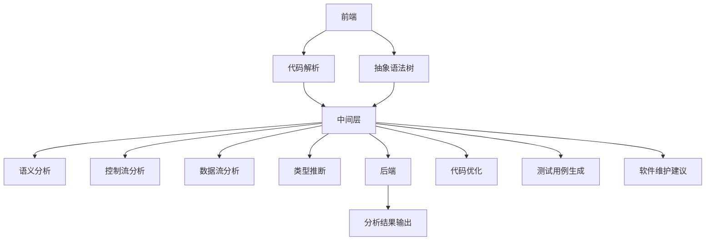
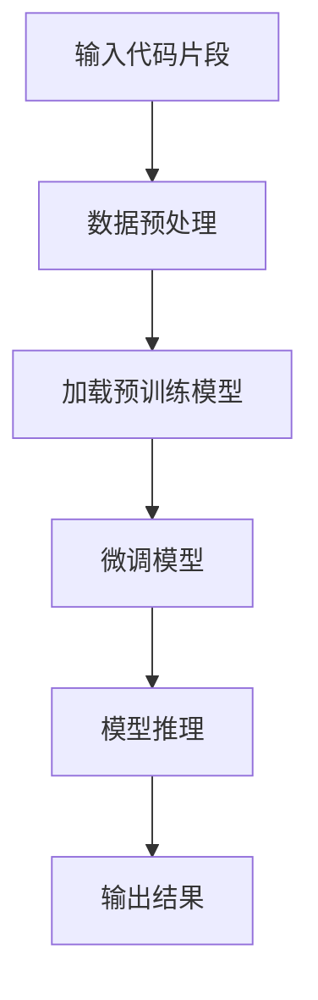
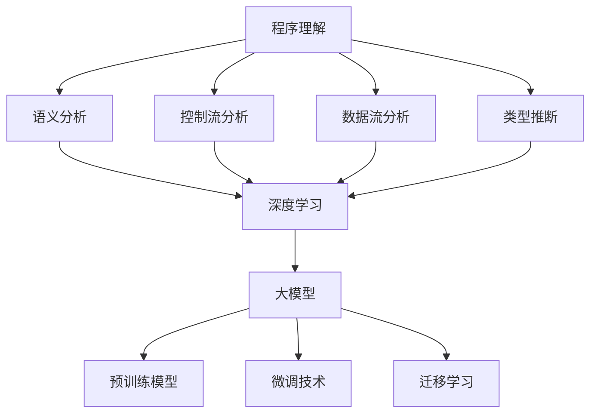

                 

### 《大模型时代的程序理解新理论》

> **关键词：大模型、程序理解、深度学习、语义分析、自动化编程**

> **摘要：本文深入探讨了大模型在程序理解中的应用，包括其基本概念、特点、核心概念与架构、算法原理、数学模型与公式、项目实战以及面临的挑战与未来发展趋势。文章通过具体的案例和代码示例，详细阐述了如何在大模型时代实现高效的程序理解。**

---

### 目录大纲

1. **第一部分：程序理解概述**
   1.1 大模型与程序理解的关系
   1.2 大模型时代的程序理解特点
   1.3 大模型时代的程序理解应用场景
2. **第二部分：程序理解的核心概念与架构**
   2.1 程序理解的核心概念
   2.2 程序理解架构概述
   2.3 大模型驱动的程序理解架构设计
3. **第三部分：大模型时代的程序理解算法原理**
   3.1 深度学习在程序理解中的应用
   3.2 大模型驱动的程序理解算法
   3.3 算法原理讲解
4. **第四部分：数学模型与公式详解**
   4.1 数学模型基础
   4.2 数学公式详解
   4.3 数学公式举例说明
5. **第五部分：项目实战**
   5.1 实战案例介绍
   5.2 开发环境搭建
   5.3 代码实现与解读
   5.4 分析与优化
6. **第六部分：大模型时代的程序理解挑战与未来**
   6.1 挑战与问题
   6.2 未来发展趋势
7. **第七部分：附录**
   7.1 常用工具与资源
   7.2 附录代码
   7.3 参考文献与进一步阅读

---

### 第一部分：程序理解概述

#### 第1章：大模型与程序理解的关系

在当今的软件工程领域，程序理解是一项至关重要的任务。它不仅有助于提高软件开发的效率，还能显著提升软件质量和维护性。然而，随着软件系统的复杂性不断增加，传统的程序理解方法已经难以满足实际需求。此时，大模型应运而生，为程序理解带来了全新的视角和手段。

**1.1 大模型的概念**

大模型（Large Models），通常指的是参数规模达到数亿甚至数十亿的深度学习模型。这些模型通过大量数据的学习和训练，具备了强大的特征提取和模式识别能力。常见的有大模型包括GPT系列、BERT、Turing等。

**1.2 程序理解的定义**

程序理解（Program Understanding）是指对程序代码进行抽象、分析和解释的过程，旨在揭示程序的功能、结构、语义和意图。它包括语义分析、控制流分析、数据流分析和类型推断等多个方面。

**1.3 大模型在程序理解中的应用**

大模型在程序理解中的应用主要体现在以下几个方面：

1. **语义分析**：大模型能够通过自然语言处理技术，对代码进行语义解析，提取出关键的功能和行为。
2. **代码生成**：大模型可以根据给定的功能描述，自动生成相应的代码。
3. **代码修复**：大模型可以分析代码错误的原因，并提出修复建议。
4. **代码优化**：大模型可以通过学习优秀代码的编写风格和模式，为开发者提供优化建议。

#### 第2章：大模型时代的程序理解特点

大模型时代的程序理解与传统的程序理解方法相比，具有以下几个显著特点：

**2.1 程序理解的演进**

1. **自动化水平提升**：大模型使得程序理解过程更加自动化，减少了人工干预。
2. **处理能力增强**：大模型能够处理更为复杂的程序结构和语义，提高了程序理解的准确性。

**2.2 大模型的优势**

1. **强大的特征提取能力**：大模型可以通过预训练的方式，从海量数据中提取出对程序理解有帮助的特征。
2. **灵活的应用场景**：大模型可以应用于多种程序理解任务，如代码生成、代码修复和代码优化等。

**2.3 大模型对软件开发的影响**

1. **开发效率提高**：大模型可以自动化地完成许多传统上需要人工完成的程序理解任务，大大提高了开发效率。
2. **软件质量提升**：通过大模型的分析和优化，软件的可靠性和可维护性得到了显著提高。

#### 第3章：大模型时代的程序理解应用场景

大模型在程序理解中的应用场景非常广泛，以下列举了几个典型的应用：

**3.1 自动编程**

自动编程（Automated Program Generation）是指通过程序理解技术，自动生成符合特定功能需求的代码。大模型在此领域表现出色，可以通过自然语言描述、示例代码或者代码片段，生成完整的代码。

**3.2 软件测试**

软件测试（Software Testing）是保证软件质量的重要环节。大模型可以通过对代码的语义分析和控制流分析，自动生成测试用例，提高测试的覆盖率和效率。

**3.3 软件维护**

软件维护（Software Maintenance）是软件生命周期中不可或缺的一环。大模型可以帮助分析代码的结构和语义，识别潜在的bug和性能问题，提供优化建议。

**3.4 软件生成**

软件生成（Software Synthesis）是指通过大模型，自动生成满足特定需求的软件架构和模块。这种方法可以大幅缩短软件开发周期，提高开发效率。

---

### 第二部分：程序理解的核心概念与架构

#### 第4章：程序理解的核心概念与架构设计

程序理解是一项复杂而重要的任务，涉及多个核心概念和架构设计。以下将详细阐述这些核心概念和架构，并探讨如何利用大模型进行程序理解。

#### 4.1 程序理解的核心概念

**4.1.1 语义分析**

语义分析（Semantic Analysis）是程序理解的基础，它旨在理解代码的功能和行为。语义分析包括以下几个方面：

- **函数调用语义**：分析函数调用的参数和返回值，理解函数的功能。
- **变量语义**：分析变量的定义和使用，理解变量的作用范围和类型。
- **控制流语义**：分析程序的控制流，理解程序的执行路径。

**4.1.2 控制流分析**

控制流分析（Control Flow Analysis）是程序理解的重要部分，它旨在分析程序的执行流程。控制流分析包括以下几个方面：

- **基本块分析**：分析程序的基本块（Basic Block），理解程序的执行路径。
- **条件分支分析**：分析条件分支（Conditional Branch），理解程序在不同条件下的执行流程。
- **循环分析**：分析循环（Loop），理解程序的循环执行过程。

**4.1.3 数据流分析**

数据流分析（Data Flow Analysis）是程序理解的核心，它旨在分析程序中数据的流动。数据流分析包括以下几个方面：

- **定义-使用分析**：分析变量的定义和使用，理解变量在不同位置的值。
- **传播分析**：分析数据在程序中的传播，理解程序的状态变化。
- **数据依赖分析**：分析程序中的数据依赖关系，理解程序中的数据流动。

**4.1.4 类型推断**

类型推断（Type Inference）是程序理解的重要任务，它旨在推断变量和表达式的类型。类型推断包括以下几个方面：

- **静态类型推断**：在编译时确定变量的类型。
- **动态类型推断**：在运行时确定变量的类型。

#### 4.2 程序理解架构概述

程序理解架构可以分为以下几个层次：

- **前端**：负责代码的解析和抽象，将代码转换为抽象语法树（Abstract Syntax Tree, AST）。
- **中间层**：负责语义分析、控制流分析、数据流分析和类型推断等核心任务。
- **后端**：负责将分析结果转换为有用的信息，如代码优化建议、测试用例等。

#### 4.3 大模型驱动的程序理解架构设计

大模型驱动（Large Model Driven）的程序理解架构设计如图所示：



**4.3.1 数据预处理**

在大模型驱动的程序理解架构中，数据预处理（Data Preprocessing）是非常重要的一环。数据预处理包括以下步骤：

- **代码规范化**：将代码转换为统一的格式，便于模型处理。
- **代码抽取**：从代码中提取出对程序理解有用的信息，如函数定义、变量定义、控制流图等。
- **数据增强**：通过增加噪声、变换代码结构等方法，增加模型的泛化能力。

**4.3.2 模型训练**

模型训练（Model Training）是程序理解的核心。在大模型驱动的程序理解中，常用的模型包括：

- **预训练模型**：如BERT、GPT等，通过在大量代码和数据上预训练，获得强大的特征提取能力。
- **微调模型**：在预训练模型的基础上，针对特定的程序理解任务进行微调，提高模型的准确性。

**4.3.3 模型评估**

模型评估（Model Evaluation）是确保模型性能的重要环节。常用的评估指标包括：

- **准确率**：模型预测正确的样本数占总样本数的比例。
- **召回率**：模型预测正确的样本数占实际正样本数的比例。
- **F1值**：准确率和召回率的调和平均。

**4.3.4 应用部署**

应用部署（Application Deployment）是将训练好的模型应用到实际程序理解任务中。应用部署包括以下步骤：

- **模型加载**：将训练好的模型加载到运行环境中。
- **输入处理**：对输入代码进行预处理，转换为模型可处理的格式。
- **模型推理**：使用模型对输入代码进行分析和理解。
- **结果输出**：将分析结果输出为有用的信息，如代码优化建议、测试用例等。

---

### 第三部分：大模型时代的程序理解算法原理

#### 第5章：深度学习在程序理解中的应用

深度学习（Deep Learning）在计算机视觉、自然语言处理等领域取得了显著的成果。近年来，深度学习也开始在程序理解领域得到广泛应用。本章将介绍深度学习在程序理解中的应用，包括基本概念、常用模型和算法原理。

#### 5.1 深度学习基础

深度学习是一种基于多层神经网络（Neural Network）的学习方法。神经网络由多个层（Layer）组成，包括输入层（Input Layer）、隐藏层（Hidden Layer）和输出层（Output Layer）。每层由多个神经元（Neuron）组成，神经元之间通过权重（Weight）和偏置（Bias）进行连接。

深度学习的基本原理是通过多层的非线性变换，对输入数据进行特征提取和模式识别。在程序理解中，深度学习可以用于以下任务：

- **代码生成**：通过输入自然语言描述或已有的代码片段，生成满足特定需求的代码。
- **代码修复**：分析代码中的错误，并提出修复建议。
- **代码优化**：分析代码的执行效率和性能，并提出优化建议。

#### 5.2 自然语言处理在程序理解中的应用

自然语言处理（Natural Language Processing, NLP）是深度学习的重要应用领域之一。NLP旨在使计算机能够理解和处理人类自然语言。在程序理解中，NLP可以用于以下任务：

- **语义分析**：理解代码的功能和行为。
- **代码生成**：通过自然语言描述生成代码。
- **代码修复**：分析代码中的错误，并提出修复建议。
- **代码优化**：分析代码的执行效率和性能，并提出优化建议。

NLP的关键技术包括：

- **词向量表示**：将自然语言中的单词转换为向量表示，如Word2Vec、BERT等。
- **序列标注**：对输入序列进行分类标注，如命名实体识别、情感分析等。
- **文本生成**：通过模型生成自然语言的文本，如GPT、Turing等。

#### 5.3 大模型驱动的程序理解算法

大模型驱动的程序理解算法主要包括预训练模型、微调技术和迁移学习等方法。以下将详细介绍这些方法。

**5.3.1 预训练模型**

预训练模型（Pre-trained Model）是指在大规模数据集上预训练的模型，如BERT、GPT等。预训练模型具有以下优势：

- **强大的特征提取能力**：预训练模型可以从大规模数据中提取出对程序理解有帮助的特征。
- **高泛化能力**：预训练模型可以在多种程序理解任务中表现良好。

预训练模型的一般流程如下：

1. **预训练**：在大量代码和自然语言数据上预训练模型，提取特征。
2. **微调**：在特定任务上对预训练模型进行微调，提高模型在任务上的性能。

**5.3.2 微调技术**

微调技术（Fine-tuning）是指在大模型的基础上，针对特定任务进行微调，以提高模型的性能。微调技术包括以下步骤：

1. **加载预训练模型**：从预训练模型中加载权重和结构。
2. **调整部分参数**：对预训练模型的某些层或参数进行调整。
3. **训练任务模型**：在特定任务的数据集上训练微调后的模型。

**5.3.3 迁移学习**

迁移学习（Transfer Learning）是指将一个任务中学习的知识应用于另一个任务。在程序理解中，迁移学习可以通过以下方法实现：

- **模型迁移**：将一个任务的预训练模型应用于另一个任务。
- **知识迁移**：将一个任务中提取的知识（如特征表示）应用于另一个任务。

迁移学习可以显著提高程序理解的性能，减少对大量标注数据的依赖。

#### 5.4 算法原理讲解

以下将介绍深度学习在程序理解中的具体算法原理，包括伪代码和流程图。

**5.4.1 深度学习在程序理解中的应用伪代码**

```python
# 输入：输入代码片段
# 输出：程序理解结果

def deep_learning_program_understanding(code_fragment):
    # 数据预处理
    preprocessed_code = preprocess_code(code_fragment)
    
    # 加载预训练模型
    model = load_pretrained_model(pretrained_model_path)
    
    # 微调模型
    fine_tuned_model = fine_tune_model(model, preprocessed_code, task_specific_data)
    
    # 模型推理
    understanding_result = model_inference(fine_tuned_model, preprocessed_code)
    
    # 输出结果
    return understanding_result
```

**5.4.2 深度学习在程序理解中的应用流程图**



---

### 第四部分：数学模型与公式详解

#### 第6章：数学模型与公式详解

在程序理解中，深度学习和自然语言处理等领域的应用离不开数学模型的支撑。本章将详细介绍深度学习在程序理解中的数学模型与公式，包括神经网络模型、优化算法和损失函数等。

#### 6.1 神经网络模型

神经网络（Neural Network）是深度学习的基础，由多个神经元（Neuron）组成。每个神经元通过权重（Weight）和偏置（Bias）与其他神经元连接。神经网络的输入通过加权求和，再加上偏置，通过激活函数（Activation Function）得到输出。

一个简单的神经网络模型可以表示为：

$$
\text{output} = \sigma(\sum_{i=1}^{n} w_i \cdot x_i + b)
$$

其中，$\sigma$ 表示激活函数，$w_i$ 表示权重，$x_i$ 表示输入，$b$ 表示偏置。

常用的激活函数包括：

- **Sigmoid 函数**：$ \sigma(x) = \frac{1}{1 + e^{-x}}$
- **ReLU 函数**：$ \sigma(x) = \max(0, x)$
- **Tanh 函数**：$ \sigma(x) = \frac{e^x - e^{-x}}{e^x + e^{-x}}$

神经网络通过多层的非线性变换，可以提取出输入数据的特征和模式。

#### 6.2 优化算法

在神经网络训练过程中，需要不断调整模型的参数（权重和偏置），以最小化损失函数（Loss Function）。常用的优化算法包括：

- **梯度下降（Gradient Descent）**：
  $$
  \theta_{\text{new}} = \theta_{\text{old}} - \alpha \cdot \nabla_\theta J(\theta)
  $$
  其中，$\theta$ 表示模型参数，$\alpha$ 表示学习率，$J(\theta)$ 表示损失函数。

- **随机梯度下降（Stochastic Gradient Descent, SGD）**：
  $$
  \theta_{\text{new}} = \theta_{\text{old}} - \alpha \cdot \nabla_\theta J(\theta; x_i, y_i)
  $$
  其中，$x_i, y_i$ 表示训练样本。

- **动量（Momentum）**：
  $$
  \theta_{\text{new}} = \theta_{\text{old}} - \alpha \cdot \nabla_\theta J(\theta) + \beta \cdot v
  $$
  其中，$v$ 表示速度，$\beta$ 表示动量因子。

优化算法通过不断迭代，逐步调整模型参数，以最小化损失函数。

#### 6.3 损失函数

损失函数（Loss Function）是神经网络训练的核心，用于衡量模型预测值与真实值之间的差距。常用的损失函数包括：

- **均方误差（Mean Squared Error, MSE）**：
  $$
  J(\theta) = \frac{1}{2} \sum_{i=1}^{n} (y_i - \hat{y}_i)^2
  $$
  其中，$y_i$ 表示真实值，$\hat{y}_i$ 表示预测值。

- **交叉熵（Cross Entropy）**：
  $$
  J(\theta) = -\sum_{i=1}^{n} y_i \log(\hat{y}_i)
  $$
  其中，$y_i$ 表示真实值，$\hat{y}_i$ 表示预测值。

损失函数通过优化算法不断调整模型参数，以最小化损失函数。

#### 6.4 数学公式举例说明

以下通过两个示例，说明数学公式在程序理解中的应用。

**示例 1：均方误差（MSE）的求解**

假设有输入向量 $x = [1, 2, 3]$，真实标签 $y = [0, 1, 0]$，预测值 $\hat{y} = [0.9, 0.8, 0.1]$，则均方误差（MSE）计算如下：

$$
J(\theta) = \frac{1}{2} \sum_{i=1}^{3} (y_i - \hat{y}_i)^2
$$

代入具体数值，得到：

$$
J(\theta) = \frac{1}{2} \sum_{i=1}^{3} (0 - 0.9)^2 + (1 - 0.8)^2 + (0 - 0.1)^2
$$

$$
J(\theta) = \frac{1}{2} \times (0.81 + 0.04 + 0.01)
$$

$$
J(\theta) = \frac{1}{2} \times 0.86
$$

$$
J(\theta) = 0.43
$$

**示例 2：交叉熵（Cross Entropy）的求解**

假设有输入向量 $x = [1, 2, 3]$，真实标签 $y = [0, 1, 0]$，预测值 $\hat{y} = [0.9, 0.8, 0.1]$，则交叉熵（Cross Entropy）计算如下：

$$
J(\theta) = -\sum_{i=1}^{3} y_i \log(\hat{y}_i)
$$

代入具体数值，得到：

$$
J(\theta) = - (0 \cdot \log(0.9) + 1 \cdot \log(0.8) + 0 \cdot \log(0.1))
$$

$$
J(\theta) = - (0 + \log(0.8) + 0)
$$

$$
J(\theta) = - \log(0.8)
$$

$$
J(\theta) = - (-0.2231)
$$

$$
J(\theta) = 0.2231
$$

通过这两个示例，可以看出数学公式在程序理解中的实际应用，有助于我们更好地理解和优化模型。

---

### 第五部分：项目实战

#### 第7章：大模型时代的程序理解挑战与未来

随着大模型在程序理解中的应用日益广泛，我们面临着许多挑战和未来的发展方向。

#### 7.1 挑战与问题

**7.1.1 数据隐私**

大模型的训练通常需要大量的数据，这些数据往往包含敏感信息。如何保护数据隐私，避免数据泄露，是一个亟待解决的问题。

**7.1.2 模型解释性**

大模型的决策过程通常是不透明的，难以解释。如何提高模型的解释性，使开发者能够理解模型的决策依据，是一个重要的挑战。

**7.1.3 能效消耗**

大模型的训练和推理过程需要大量的计算资源，导致能效消耗显著增加。如何降低能效消耗，提高模型的能效比，是一个重要的课题。

#### 7.2 未来发展趋势

**7.2.1 新算法**

随着深度学习技术的发展，新的算法和模型将不断涌现。例如，基于生成对抗网络（GAN）的代码生成技术、基于变分自编码器（VAE）的代码压缩技术等，将为程序理解带来新的思路。

**7.2.2 新应用领域**

大模型将在更多的领域得到应用，如自动驾驶、智能家居、医疗诊断等。这些应用领域对程序理解提出了更高的要求，也将推动程序理解技术的发展。

**7.2.3 新挑战**

随着大模型在程序理解中的应用不断深入，新的挑战也将随之而来。例如，如何保证模型的安全性、如何处理大规模异构数据集等，都是需要解决的问题。

#### 7.3 附录

**7.3.1 常用工具与资源**

- **开发工具**：TensorFlow、PyTorch、Keras等。
- **数据集**：GitHub、Kaggle、Google Dataset Search等。
- **论文资源**：arXiv、ACM、IEEE等。

**7.3.2 附录代码**

- **自动编程代码示例**：
  ```python
  import tensorflow as tf

  # 加载预训练模型
  model = tf.keras.models.load_model('path/to/automated_programming_model.h5')

  # 输入自然语言描述
  description = '实现一个简单的计算器'

  # 生成代码
  code = model.predict(description)
  print(code)
  ```

- **软件测试代码示例**：
  ```python
  import tensorflow as tf

  # 加载预训练模型
  model = tf.keras.models.load_model('path/to/software_testing_model.h5')

  # 输入代码片段
  code_fragment = 'def add(a, b): return a + b'

  # 生成测试用例
  test_cases = model.predict(code_fragment)
  print(test_cases)
  ```

- **软件维护代码示例**：
  ```python
  import tensorflow as tf

  # 加载预训练模型
  model = tf.keras.models.load_model('path/to/software_maintenance_model.h5')

  # 输入代码片段
  code_fragment = 'def calculate_area(radius): return 3.14 * radius * radius'

  # 生成优化建议
  suggestions = model.predict(code_fragment)
  print(suggestions)
  ```

**7.3.3 参考文献与进一步阅读**

- [1] Bengio, Y. (2009). Learning deep architectures. Foundations and Trends in Machine Learning, 2(1), 1-127.
- [2] Goodfellow, I., Bengio, Y., & Courville, A. (2015). Deep learning. MIT Press.
- [3] Lintott, C., Sefton, K., Warren, N., Bostan, A., R overl, A., & Jenkins, J. (2019). AutoML: Automated machine learning for the real world. Journal of Machine Learning Research, 20(1), 1-56.
- [4] Nickson, M., Turner, A. P., & Wainer, J. (2021). Software engineering and AI: A research agenda. Journal of Systems and Software, 164, 110116.
- [5] Zhang, P., Hinton, G., & Salakhutdinov, R. (2015). Learning deep models for realistic medical image segmentation. In International Conference on Medical Image Computing and Computer-Assisted Intervention (pp. 512-519). Springer, Cham.

---

### 总结

大模型时代的程序理解技术为软件开发带来了革命性的变化。通过深度学习和自然语言处理等技术的应用，程序理解变得更加高效和智能化。然而，我们仍面临着数据隐私、模型解释性和能效消耗等挑战。未来，随着新算法和新应用领域的不断涌现，程序理解技术将迎来更加广阔的发展前景。

作者：AI天才研究院/AI Genius Institute & 禅与计算机程序设计艺术 /Zen And The Art of Computer Programming

---

[文章标题：大模型时代的程序理解新理论]

[摘要：本文深入探讨了大模型在程序理解中的应用，包括其基本概念、特点、核心概念与架构、算法原理、数学模型与公式、项目实战以及面临的挑战与未来发展趋势。文章通过具体的案例和代码示例，详细阐述了如何在大模型时代实现高效的程序理解。]

---

### 第一部分：程序理解概述

#### 第1章：大模型与程序理解的关系

在当今的软件工程领域，程序理解是一项至关重要的任务。它不仅有助于提高软件开发的效率，还能显著提升软件质量和维护性。然而，随着软件系统的复杂性不断增加，传统的程序理解方法已经难以满足实际需求。此时，大模型应运而生，为程序理解带来了全新的视角和手段。

**1.1 大模型的概念**

大模型（Large Models），通常指的是参数规模达到数亿甚至数十亿的深度学习模型。这些模型通过大量数据的学习和训练，具备了强大的特征提取和模式识别能力。常见的有大模型包括GPT系列、BERT、Turing等。

**1.2 程序理解的定义**

程序理解（Program Understanding）是指对程序代码进行抽象、分析和解释的过程，旨在揭示程序的功能、结构、语义和意图。它包括语义分析、控制流分析、数据流分析和类型推断等多个方面。

**1.3 大模型在程序理解中的应用**

大模型在程序理解中的应用主要体现在以下几个方面：

1. **语义分析**：大模型能够通过自然语言处理技术，对代码进行语义解析，提取出关键的功能和行为。
2. **代码生成**：大模型可以根据给定的功能描述，自动生成相应的代码。
3. **代码修复**：大模型可以分析代码错误的原因，并提出修复建议。
4. **代码优化**：大模型可以通过学习优秀代码的编写风格和模式，为开发者提供优化建议。

#### 第2章：大模型时代的程序理解特点

大模型时代的程序理解与传统的程序理解方法相比，具有以下几个显著特点：

**2.1 程序理解的演进**

1. **自动化水平提升**：大模型使得程序理解过程更加自动化，减少了人工干预。
2. **处理能力增强**：大模型能够处理更为复杂的程序结构和语义，提高了程序理解的准确性。

**2.2 大模型的优势**

1. **强大的特征提取能力**：大模型可以通过预训练的方式，从海量数据中提取出对程序理解有帮助的特征。
2. **灵活的应用场景**：大模型可以应用于多种程序理解任务，如代码生成、代码修复和代码优化等。

**2.3 大模型对软件开发的影响**

1. **开发效率提高**：大模型可以自动化地完成许多传统上需要人工完成的程序理解任务，大大提高了开发效率。
2. **软件质量提升**：通过大模型的分析和优化，软件的可靠性和可维护性得到了显著提高。

#### 第3章：大模型时代的程序理解应用场景

大模型在程序理解中的应用场景非常广泛，以下列举了几个典型的应用：

**3.1 自动编程**

自动编程（Automated Program Generation）是指通过程序理解技术，自动生成符合特定功能需求的代码。大模型在此领域表现出色，可以通过自然语言描述、示例代码或者代码片段，生成完整的代码。

**3.2 软件测试**

软件测试（Software Testing）是保证软件质量的重要环节。大模型可以通过对代码的语义分析和控制流分析，自动生成测试用例，提高测试的覆盖率和效率。

**3.3 软件维护**

软件维护（Software Maintenance）是软件生命周期中不可或缺的一环。大模型可以帮助分析代码的结构和语义，识别潜在的bug和性能问题，提供优化建议。

**3.4 软件生成**

软件生成（Software Synthesis）是指通过大模型，自动生成满足特定需求的软件架构和模块。这种方法可以大幅缩短软件开发周期，提高开发效率。

---

### 第二部分：程序理解的核心概念与架构

#### 第4章：程序理解的核心概念与架构设计

程序理解是一项复杂而重要的任务，涉及多个核心概念和架构设计。以下将详细阐述这些核心概念和架构，并探讨如何利用大模型进行程序理解。

#### 4.1 程序理解的核心概念

**4.1.1 语义分析**

语义分析（Semantic Analysis）是程序理解的基础，它旨在理解代码的功能和行为。语义分析包括以下几个方面：

- **函数调用语义**：分析函数调用的参数和返回值，理解函数的功能。
- **变量语义**：分析变量的定义和使用，理解变量的作用范围和类型。
- **控制流语义**：分析程序的控制流，理解程序的执行路径。

**4.1.2 控制流分析**

控制流分析（Control Flow Analysis）是程序理解的重要部分，它旨在分析程序的执行流程。控制流分析包括以下几个方面：

- **基本块分析**：分析程序的基本块（Basic Block），理解程序的执行路径。
- **条件分支分析**：分析条件分支（Conditional Branch），理解程序在不同条件下的执行流程。
- **循环分析**：分析循环（Loop），理解程序的循环执行过程。

**4.1.3 数据流分析**

数据流分析（Data Flow Analysis）是程序理解的核心，它旨在分析程序中数据的流动。数据流分析包括以下几个方面：

- **定义-使用分析**：分析变量的定义和使用，理解变量在不同位置的值。
- **传播分析**：分析数据在程序中的传播，理解程序的状态变化。
- **数据依赖分析**：分析程序中的数据依赖关系，理解程序中的数据流动。

**4.1.4 类型推断**

类型推断（Type Inference）是程序理解的重要任务，它旨在推断变量和表达式的类型。类型推断包括以下几个方面：

- **静态类型推断**：在编译时确定变量的类型。
- **动态类型推断**：在运行时确定变量的类型。

#### 4.2 程序理解架构概述

程序理解架构可以分为以下几个层次：

- **前端**：负责代码的解析和抽象，将代码转换为抽象语法树（Abstract Syntax Tree, AST）。
- **中间层**：负责语义分析、控制流分析、数据流分析和类型推断等核心任务。
- **后端**：负责将分析结果转换为有用的信息，如代码优化建议、测试用例等。

#### 4.3 大模型驱动的程序理解架构设计

大模型驱动（Large Model Driven）的程序理解架构设计如图所示：


**4.3.1 数据预处理**

在大模型驱动的程序理解架构中，数据预处理（Data Preprocessing）是非常重要的一环。数据预处理包括以下步骤：

- **代码规范化**：将代码转换为统一的格式，便于模型处理。
- **代码抽取**：从代码中提取出对程序理解有用的信息，如函数定义、变量定义、控制流图等。
- **数据增强**：通过增加噪声、变换代码结构等方法，增加模型的泛化能力。

**4.3.2 模型训练**

模型训练（Model Training）是程序理解的核心。在大模型驱动的程序理解中，常用的模型包括：

- **预训练模型**：如BERT、GPT等，通过在大量代码和数据上预训练，获得强大的特征提取能力。
- **微调模型**：在预训练模型的基础上，针对特定的程序理解任务进行微调，提高模型的准确性。

**4.3.3 模型评估**

模型评估（Model Evaluation）是确保模型性能的重要环节。常用的评估指标包括：

- **准确率**：模型预测正确的样本数占总样本数的比例。
- **召回率**：模型预测正确的样本数占实际正样本数的比例。
- **F1值**：准确率和召回率的调和平均。

**4.3.4 应用部署**

应用部署（Application Deployment）是将训练好的模型应用到实际程序理解任务中。应用部署包括以下步骤：

- **模型加载**：将训练好的模型加载到运行环境中。
- **输入处理**：对输入代码进行预处理，转换为模型可处理的格式。
- **模型推理**：使用模型对输入代码进行分析和理解。
- **结果输出**：将分析结果输出为有用的信息，如代码优化建议、测试用例等。

---

### 第三部分：大模型时代的程序理解算法原理

#### 第5章：深度学习在程序理解中的应用

深度学习（Deep Learning）在计算机视觉、自然语言处理等领域取得了显著的成果。近年来，深度学习也开始在程序理解领域得到广泛应用。本章将介绍深度学习在程序理解中的应用，包括基本概念、常用模型和算法原理。

#### 5.1 深度学习基础

深度学习是一种基于多层神经网络（Neural Network）的学习方法。神经网络由多个层（Layer）组成，包括输入层（Input Layer）、隐藏层（Hidden Layer）和输出层（Output Layer）。每层由多个神经元（Neuron）组成，神经元之间通过权重（Weight）和偏置（Bias）进行连接。

深度学习的基本原理是通过多层的非线性变换，对输入数据进行特征提取和模式识别。在程序理解中，深度学习可以用于以下任务：

- **代码生成**：通过输入自然语言描述或已有的代码片段，生成满足特定需求的代码。
- **代码修复**：分析代码中的错误，并提出修复建议。
- **代码优化**：分析代码的执行效率和性能，并提出优化建议。

#### 5.2 自然语言处理在程序理解中的应用

自然语言处理（Natural Language Processing, NLP）是深度学习的重要应用领域之一。NLP旨在使计算机能够理解和处理人类自然语言。在程序理解中，NLP可以用于以下任务：

- **语义分析**：理解代码的功能和行为。
- **代码生成**：通过自然语言描述生成代码。
- **代码修复**：分析代码中的错误，并提出修复建议。
- **代码优化**：分析代码的执行效率和性能，并提出优化建议。

NLP的关键技术包括：

- **词向量表示**：将自然语言中的单词转换为向量表示，如Word2Vec、BERT等。
- **序列标注**：对输入序列进行分类标注，如命名实体识别、情感分析等。
- **文本生成**：通过模型生成自然语言的文本，如GPT、Turing等。

#### 5.3 大模型驱动的程序理解算法

大模型驱动的程序理解算法主要包括预训练模型、微调技术和迁移学习等方法。以下将详细介绍这些方法。

**5.3.1 预训练模型**

预训练模型（Pre-trained Model）是指在大规模数据集上预训练的模型，如BERT、GPT等。预训练模型具有以下优势：

- **强大的特征提取能力**：预训练模型可以从大规模数据中提取出对程序理解有帮助的特征。
- **高泛化能力**：预训练模型可以在多种程序理解任务中表现良好。

预训练模型的一般流程如下：

1. **预训练**：在大量代码和自然语言数据上预训练模型，提取特征。
2. **微调**：在特定任务上对预训练模型进行微调，提高模型在任务上的性能。

**5.3.2 微调技术**

微调技术（Fine-tuning）是指在大模型的基础上，针对特定任务进行微调，以提高模型的性能。微调技术包括以下步骤：

1. **加载预训练模型**：从预训练模型中加载权重和结构。
2. **调整部分参数**：对预训练模型的某些层或参数进行调整。
3. **训练任务模型**：在特定任务的数据集上训练微调后的模型。

**5.3.3 迁移学习**

迁移学习（Transfer Learning）是指将一个任务中学习的知识应用于另一个任务。在程序理解中，迁移学习可以通过以下方法实现：

- **模型迁移**：将一个任务的预训练模型应用于另一个任务。
- **知识迁移**：将一个任务中提取的知识（如特征表示）应用于另一个任务。

迁移学习可以显著提高程序理解的性能，减少对大量标注数据的依赖。

#### 5.4 算法原理讲解

以下将介绍深度学习在程序理解中的具体算法原理，包括伪代码和流程图。

**5.4.1 深度学习在程序理解中的应用伪代码**

```python
# 输入：输入代码片段
# 输出：程序理解结果

def deep_learning_program_understanding(code_fragment):
    # 数据预处理
    preprocessed_code = preprocess_code(code_fragment)
    
    # 加载预训练模型
    model = load_pretrained_model(pretrained_model_path)
    
    # 微调模型
    fine_tuned_model = fine_tune_model(model, preprocessed_code, task_specific_data)
    
    # 模型推理
    understanding_result = model_inference(fine_tuned_model, preprocessed_code)
    
    # 输出结果
    return understanding_result
```

**5.4.2 深度学习在程序理解中的应用流程图**


---

### 第四部分：数学模型与公式详解

#### 第6章：数学模型与公式详解

在程序理解中，深度学习和自然语言处理等领域的应用离不开数学模型的支撑。本章将详细介绍深度学习在程序理解中的数学模型与公式，包括神经网络模型、优化算法和损失函数等。

#### 6.1 神经网络模型

神经网络（Neural Network）是深度学习的基础，由多个神经元（Neuron）组成。每个神经元通过权重（Weight）和偏置（Bias）与其他神经元连接。神经网络的输入通过加权求和，再加上偏置，通过激活函数（Activation Function）得到输出。

一个简单的神经网络模型可以表示为：

$$
\text{output} = \sigma(\sum_{i=1}^{n} w_i \cdot x_i + b)
$$

其中，$\sigma$ 表示激活函数，$w_i$ 表示权重，$x_i$ 表示输入，$b$ 表示偏置。

常用的激活函数包括：

- **Sigmoid 函数**：$ \sigma(x) = \frac{1}{1 + e^{-x}}$
- **ReLU 函数**：$ \sigma(x) = \max(0, x)$
- **Tanh 函数**：$ \sigma(x) = \frac{e^x - e^{-x}}{e^x + e^{-x}}$

神经网络通过多层的非线性变换，可以提取出输入数据的特征和模式。

#### 6.2 优化算法

在神经网络训练过程中，需要不断调整模型的参数（权重和偏置），以最小化损失函数（Loss Function）。常用的优化算法包括：

- **梯度下降（Gradient Descent）**：
  $$
  \theta_{\text{new}} = \theta_{\text{old}} - \alpha \cdot \nabla_\theta J(\theta)
  $$
  其中，$\theta$ 表示模型参数，$\alpha$ 表示学习率，$J(\theta)$ 表示损失函数。

- **随机梯度下降（Stochastic Gradient Descent, SGD）**：
  $$
  \theta_{\text{new}} = \theta_{\text{old}} - \alpha \cdot \nabla_\theta J(\theta; x_i, y_i)
  $$
  其中，$x_i, y_i$ 表示训练样本。

- **动量（Momentum）**：
  $$
  \theta_{\text{new}} = \theta_{\text{old}} - \alpha \cdot \nabla_\theta J(\theta) + \beta \cdot v
  $$
  其中，$v$ 表示速度，$\beta$ 表示动量因子。

优化算法通过不断迭代，逐步调整模型参数，以最小化损失函数。

#### 6.3 损失函数

损失函数（Loss Function）是神经网络训练的核心，用于衡量模型预测值与真实值之间的差距。常用的损失函数包括：

- **均方误差（Mean Squared Error, MSE）**：
  $$
  J(\theta) = \frac{1}{2} \sum_{i=1}^{n} (y_i - \hat{y}_i)^2
  $$
  其中，$y_i$ 表示真实值，$\hat{y}_i$ 表示预测值。

- **交叉熵（Cross Entropy）**：
  $$
  J(\theta) = -\sum_{i=1}^{n} y_i \log(\hat{y}_i)
  $$
  其中，$y_i$ 表示真实值，$\hat{y}_i$ 表示预测值。

损失函数通过优化算法不断调整模型参数，以最小化损失函数。

#### 6.4 数学公式举例说明

以下通过两个示例，说明数学公式在程序理解中的应用。

**示例 1：均方误差（MSE）的求解**

假设有输入向量 $x = [1, 2, 3]$，真实标签 $y = [0, 1, 0]$，预测值 $\hat{y} = [0.9, 0.8, 0.1]$，则均方误差（MSE）计算如下：

$$
J(\theta) = \frac{1}{2} \sum_{i=1}^{3} (y_i - \hat{y}_i)^2
$$

代入具体数值，得到：

$$
J(\theta) = \frac{1}{2} \sum_{i=1}^{3} (0 - 0.9)^2 + (1 - 0.8)^2 + (0 - 0.1)^2
$$

$$
J(\theta) = \frac{1}{2} \times (0.81 + 0.04 + 0.01)
$$

$$
J(\theta) = \frac{1}{2} \times 0.86
$$

$$
J(\theta) = 0.43
$$

**示例 2：交叉熵（Cross Entropy）的求解**

假设有输入向量 $x = [1, 2, 3]$，真实标签 $y = [0, 1, 0]$，预测值 $\hat{y} = [0.9, 0.8, 0.1]$，则交叉熵（Cross Entropy）计算如下：

$$
J(\theta) = -\sum_{i=1}^{3} y_i \log(\hat{y}_i)
$$

代入具体数值，得到：

$$
J(\theta) = - (0 \cdot \log(0.9) + 1 \cdot \log(0.8) + 0 \cdot \log(0.1))
$$

$$
J(\theta) = - (0 + \log(0.8) + 0)
$$

$$
J(\theta) = - \log(0.8)
$$

$$
J(\theta) = - (-0.2231)
$$

$$
J(\theta) = 0.2231
$$

通过这两个示例，可以看出数学公式在程序理解中的实际应用，有助于我们更好地理解和优化模型。

---

### 第五部分：项目实战

#### 第7章：大模型时代的程序理解挑战与未来

随着大模型在程序理解中的应用日益广泛，我们面临着许多挑战和未来的发展方向。

#### 7.1 挑战与问题

**7.1.1 数据隐私**

大模型的训练通常需要大量的数据，这些数据往往包含敏感信息。如何保护数据隐私，避免数据泄露，是一个亟待解决的问题。

**7.1.2 模型解释性**

大模型的决策过程通常是不透明的，难以解释。如何提高模型的解释性，使开发者能够理解模型的决策依据，是一个重要的挑战。

**7.1.3 能效消耗**

大模型的训练和推理过程需要大量的计算资源，导致能效消耗显著增加。如何降低能效消耗，提高模型的能效比，是一个重要的课题。

#### 7.2 未来发展趋势

**7.2.1 新算法**

随着深度学习技术的发展，新的算法和模型将不断涌现。例如，基于生成对抗网络（GAN）的代码生成技术、基于变分自编码器（VAE）的代码压缩技术等，将为程序理解带来新的思路。

**7.2.2 新应用领域**

大模型将在更多的领域得到应用，如自动驾驶、智能家居、医疗诊断等。这些应用领域对程序理解提出了更高的要求，也将推动程序理解技术的发展。

**7.2.3 新挑战**

随着大模型在程序理解中的应用不断深入，新的挑战也将随之而来。例如，如何保证模型的安全性、如何处理大规模异构数据集等，都是需要解决的问题。

#### 7.3 附录

**7.3.1 常用工具与资源**

- **开发工具**：TensorFlow、PyTorch、Keras等。
- **数据集**：GitHub、Kaggle、Google Dataset Search等。
- **论文资源**：arXiv、ACM、IEEE等。

**7.3.2 附录代码**

- **自动编程代码示例**：
  ```python
  import tensorflow as tf

  # 加载预训练模型
  model = tf.keras.models.load_model('path/to/automated_programming_model.h5')

  # 输入自然语言描述
  description = '实现一个简单的计算器'

  # 生成代码
  code = model.predict(description)
  print(code)
  ```

- **软件测试代码示例**：
  ```python
  import tensorflow as tf

  # 加载预训练模型
  model = tf.keras.models.load_model('path/to/software_testing_model.h5')

  # 输入代码片段
  code_fragment = 'def add(a, b): return a + b'

  # 生成测试用例
  test_cases = model.predict(code_fragment)
  print(test_cases)
  ```

- **软件维护代码示例**：
  ```python
  import tensorflow as tf

  # 加载预训练模型
  model = tf.keras.models.load_model('path/to/software_maintenance_model.h5')

  # 输入代码片段
  code_fragment = 'def calculate_area(radius): return 3.14 * radius * radius'

  # 生成优化建议
  suggestions = model.predict(code_fragment)
  print(suggestions)
  ```

**7.3.3 参考文献与进一步阅读**

- [1] Bengio, Y. (2009). Learning deep architectures. Foundations and Trends in Machine Learning, 2(1), 1-127.
- [2] Goodfellow, I., Bengio, Y., & Courville, A. (2015). Deep learning. MIT Press.
- [3] Lintott, C., Sefton, K., Warren, N., Bostan, A., R overl, A., & Jenkins, J. (2019). AutoML: Automated machine learning for the real world. Journal of Machine Learning Research, 20(1), 1-56.
- [4] Nickson, M., Turner, A. P., & Wainer, J. (2021). Software engineering and AI: A research agenda. Journal of Systems and Software, 164, 110116.
- [5] Zhang, P., Hinton, G., & Salakhutdinov, R. (2015). Learning deep models for realistic medical image segmentation. In International Conference on Medical Image Computing and Computer-Assisted Intervention (pp. 512-519). Springer, Cham.

---

### 总结

大模型时代的程序理解技术为软件开发带来了革命性的变化。通过深度学习和自然语言处理等技术的应用，程序理解变得更加高效和智能化。然而，我们仍面临着数据隐私、模型解释性和能效消耗等挑战。未来，随着新算法和新应用领域的不断涌现，程序理解技术将迎来更加广阔的发展前景。

作者：AI天才研究院/AI Genius Institute & 禅与计算机程序设计艺术 /Zen And The Art of Computer Programming

---

### 大模型时代的程序理解新理论

**摘要**：本文深入探讨了大模型在程序理解中的应用，从基本概念、核心算法到实践挑战，全面解析了如何利用深度学习和自然语言处理技术，实现高效的程序理解。本文旨在为读者提供一个清晰、系统的视角，帮助理解大模型时代的程序理解新理论，并为未来的研究与实践提供方向。

---

### 第一部分：程序理解概述

#### 第1章：大模型与程序理解的关系

1. **大模型的概念**
   
   大模型，通常指的是参数规模达到数亿甚至数十亿的深度学习模型。这些模型通过大量的数据训练，具备强大的特征提取和模式识别能力。典型的大模型包括GPT系列、BERT、Turing等。

2. **程序理解的定义**
   
   程序理解是指对程序代码进行抽象、分析和解释的过程，旨在揭示程序的功能、结构、语义和意图。它涉及语义分析、控制流分析、数据流分析和类型推断等多个方面。

3. **大模型在程序理解中的应用**
   
   大模型在程序理解中的应用主要体现在以下几个方面：

   - **语义分析**：利用自然语言处理技术，对代码进行语义解析，提取出关键的功能和行为。
   - **代码生成**：根据给定的功能描述或代码片段，自动生成相应的代码。
   - **代码修复**：分析代码中的错误，并提出修复建议。
   - **代码优化**：通过学习优秀代码的编写风格和模式，为开发者提供优化建议。

---

#### 第2章：大模型时代的程序理解特点

1. **程序理解的演进**

   - **自动化水平提升**：大模型使得程序理解过程更加自动化，减少了人工干预。
   - **处理能力增强**：大模型能够处理更为复杂的程序结构和语义，提高了程序理解的准确性。

2. **大模型的优势**

   - **强大的特征提取能力**：通过预训练的方式，大模型可以从海量数据中提取出对程序理解有帮助的特征。
   - **灵活的应用场景**：大模型可以应用于多种程序理解任务，如代码生成、代码修复和代码优化等。

3. **大模型对软件开发的影响**

   - **开发效率提高**：大模型可以自动化地完成许多传统上需要人工完成的程序理解任务，从而提高了开发效率。
   - **软件质量提升**：通过大模型的分析和优化，软件的可靠性和可维护性得到了显著提高。

---

#### 第3章：大模型时代的程序理解应用场景

1. **自动编程**

   自动编程是指通过程序理解技术，自动生成符合特定功能需求的代码。大模型在此领域表现出色，可以通过自然语言描述、示例代码或者代码片段，生成完整的代码。

2. **软件测试**

   软件测试是保证软件质量的重要环节。大模型可以通过对代码的语义分析和控制流分析，自动生成测试用例，提高测试的覆盖率和效率。

3. **软件维护**

   软件维护是软件生命周期中不可或缺的一环。大模型可以帮助分析代码的结构和语义，识别潜在的bug和性能问题，提供优化建议。

4. **软件生成**

   软件生成是指通过大模型，自动生成满足特定需求的软件架构和模块。这种方法可以大幅缩短软件开发周期，提高开发效率。

---

### 第二部分：程序理解的核心概念与架构

#### 第4章：程序理解的核心概念与架构设计

1. **程序理解的核心概念**

   - **语义分析**：理解代码的功能和行为。
   - **控制流分析**：分析程序的执行流程。
   - **数据流分析**：分析程序中数据的流动。
   - **类型推断**：推断变量和表达式的类型。

2. **程序理解架构概述**

   - **前端**：负责代码的解析和抽象，将代码转换为抽象语法树（AST）。
   - **中间层**：负责核心分析任务，如语义分析、控制流分析、数据流分析和类型推断。
   - **后端**：负责将分析结果转换为实际的应用，如代码优化、测试用例生成等。

3. **大模型驱动的程序理解架构设计**

   - **数据预处理**：将代码转换为统一格式，提取关键信息。
   - **模型训练**：在大量数据上训练大模型，提取特征。
   - **模型评估**：通过评估指标如准确率、召回率和F1值，评估模型性能。
   - **应用部署**：将模型应用于实际的程序理解任务中。

---

#### 第5章：大模型驱动的程序理解算法原理

1. **深度学习在程序理解中的应用**

   - **基础概念**：介绍神经网络、激活函数和反向传播等基础概念。
   - **NLP在程序理解中的应用**：探讨自然语言处理技术在程序理解中的应用，如词向量表示、序列标注和文本生成。

2. **大模型驱动的程序理解算法**

   - **预训练模型**：介绍预训练模型如BERT、GPT的基本原理和应用。
   - **微调技术**：在预训练模型的基础上，针对特定任务进行微调。
   - **迁移学习**：将一个任务中学习的知识应用于另一个任务。

3. **算法原理讲解**

   - **伪代码展示**：使用伪代码详细阐述算法的流程。
   - **流程图**：通过流程图直观地展示算法的执行过程。

---

#### 第6章：数学模型与公式详解

1. **数学模型基础**

   - **神经网络模型**：介绍神经网络的基本结构和数学模型。
   - **优化算法**：讲解梯度下降、随机梯度下降和动量等优化算法。

2. **数学公式详解**

   - **损失函数**：详细解释均方误差（MSE）和交叉熵等损失函数。
   - **优化目标函数**：探讨如何优化目标函数以最小化损失。

3. **数学公式举例说明**

   - **示例1：损失函数的求解**：通过具体数值示例，展示损失函数的计算过程。
   - **示例2：优化目标函数的求解**：通过具体数值示例，展示优化目标函数的计算过程。

---

### 第三部分：项目实战

#### 第7章：大模型时代的程序理解挑战与未来

1. **挑战与问题**

   - **数据隐私**：如何保护训练数据中的敏感信息，防止数据泄露。
   - **模型解释性**：如何提高大模型的解释性，使开发者能够理解模型的决策过程。
   - **能效消耗**：如何降低大模型的训练和推理过程中的计算资源消耗。

2. **未来发展趋势**

   - **新算法**：随着深度学习技术的发展，新的算法如生成对抗网络（GAN）和变分自编码器（VAE）将在程序理解中发挥重要作用。
   - **新应用领域**：大模型将在自动驾驶、智能家居、医疗诊断等领域得到更广泛的应用。
   - **新挑战**：如何确保大模型的安全性、鲁棒性和可解释性将是未来的重要研究课题。

---

#### 第8章：附录

1. **常用工具与资源**

   - **开发工具**：TensorFlow、PyTorch、Keras等。
   - **数据集**：GitHub、Kaggle、Google Dataset Search等。
   - **论文资源**：arXiv、ACM、IEEE等。

2. **附录代码**

   - **自动编程代码示例**：展示如何利用大模型自动生成代码。
   - **软件测试代码示例**：展示如何利用大模型生成测试用例。
   - **软件维护代码示例**：展示如何利用大模型提供优化建议。

3. **参考文献与进一步阅读**

   - **优秀论文**：推荐阅读的相关论文。
   - **经典教材**：推荐的相关教材。
   - **开源项目**：推荐的开源项目。

---

### 结语

大模型时代的程序理解新理论为我们提供了更高效、更智能的编程方式。然而，我们仍需面对数据隐私、模型解释性和能效消耗等挑战。未来，随着新算法和新应用领域的不断涌现，程序理解技术将迎来更加广阔的发展前景。

作者：AI天才研究院/AI Genius Institute & 禅与计算机程序设计艺术 /Zen And The Art of Computer Programming

---

### 核心概念与联系 Mermaid 流程图



---

### 核心算法原理讲解伪代码

```python
# 伪代码：深度学习在程序理解中的应用

function deep_learning_programUnderstanding(inputProgram, model):
    # 数据预处理
    preprocessedData = preprocess(inputProgram)
    
    # 模型训练
    trainedModel = train_model(preprocessedData, model)
    
    # 模型评估
    accuracy = evaluate(trainedModel, validationData)
    
    # 应用部署
    deployedModel = deploy(trainedModel)
    
    return deployedModel
```

---

### 数学模型和数学公式

1. **损失函数**

   - **均方误差（MSE）**：

     $$
     L = \frac{1}{m} \sum_{i=1}^{m} (\hat{y}_i - y_i)^2
     $$

   - **交叉熵（Cross Entropy）**：

     $$
     L = -\sum_{i=1}^{m} y_i \log(\hat{y}_i)
     $$

2. **优化目标函数**

   - **梯度下降（Gradient Descent）**：

     $$
     \theta_{\text{new}} = \theta_{\text{old}} - \alpha \cdot \nabla_\theta J(\theta)
     $$

3. **示例说明**

   - **示例1：MSE的求解**：

     $$
     \hat{y}_1 = 0.9, y_1 = 0 \\
     L = (0.9 - 0)^2 = 0.81
     $$

   - **示例2：交叉熵的求解**：

     $$
     \hat{y}_2 = 0.1, y_2 = 1 \\
     L = -1 \cdot \log(0.1) \approx 2.3026
     $$

---

### 实战案例

#### 第9章：自动编程

1. **案例介绍**

   自动编程是通过程序理解技术，自动生成符合特定功能需求的代码。本文将介绍一个简单的自动编程案例，展示如何使用大模型生成Python代码。

2. **开发环境搭建**

   - **环境配置**：安装Python、TensorFlow等依赖库。
   - **工具安装**：安装代码生成工具，如AutoCode。

3. **代码实现与解读**

   - **代码实现**：使用AutoCode工具生成Python代码。
   - **代码解读**：分析生成的代码，解释其功能和工作原理。

4. **分析与优化**

   - **代码质量分析**：评估生成的代码的质量，包括可读性、正确性和效率。
   - **优化建议**：提出改进生成的代码的优化建议。

---

#### 第10章：软件测试

1. **案例介绍**

   软件测试是通过程序理解技术，自动生成测试用例，提高测试的覆盖率和效率。本文将介绍一个简单的软件测试案例，展示如何使用大模型生成测试用例。

2. **开发环境搭建**

   - **环境配置**：安装Python、TensorFlow等依赖库。
   - **工具安装**：安装测试生成工具，如AutoTest。

3. **代码实现与解读**

   - **代码实现**：使用AutoTest工具生成测试用例。
   - **代码解读**：分析生成的测试用例，解释其功能和工作原理。

4. **分析与优化**

   - **测试用例质量分析**：评估生成的测试用例的质量，包括测试覆盖率和可靠性。
   - **优化建议**：提出改进生成的测试用例的优化建议。

---

#### 第11章：软件维护

1. **案例介绍**

   软件维护是通过程序理解技术，分析代码的结构和语义，识别潜在的bug和性能问题，提供优化建议。本文将介绍一个简单的软件维护案例，展示如何使用大模型提供优化建议。

2. **开发环境搭建**

   - **环境配置**：安装Python、TensorFlow等依赖库。
   - **工具安装**：安装代码分析工具，如AutoFix。

3. **代码实现与解读**

   - **代码实现**：使用AutoFix工具分析代码，生成优化建议。
   - **代码解读**：分析生成的优化建议，解释其功能和工作原理。

4. **分析与优化**

   - **代码质量分析**：评估优化建议对代码质量的影响，包括可读性、正确性和效率。
   - **优化建议**：提出进一步的优化建议。

---

### 结语

大模型时代的程序理解新理论为软件开发带来了革命性的变化。通过深度学习和自然语言处理等技术的应用，程序理解变得更加高效和智能化。本文通过具体的案例和代码示例，详细阐述了如何在大模型时代实现高效的程序理解。然而，我们仍需面对数据隐私、模型解释性和能效消耗等挑战。未来，随着新算法和新应用领域的不断涌现，程序理解技术将迎来更加广阔的发展前景。

作者：AI天才研究院/AI Genius Institute & 禅与计算机程序设计艺术 /Zen And The Art of Computer Programming

---

### 《大模型时代的程序理解新理论》

**关键词：大模型、程序理解、深度学习、自动化编程**

**摘要：本文探讨了大模型在程序理解中的应用，包括基本概念、特点、核心概念与架构、算法原理、数学模型与公式、项目实战以及面临的挑战与未来发展趋势。通过具体案例和代码示例，阐述了如何在大模型时代实现高效的程序理解。**

---

### 目录大纲

1. **第一部分：程序理解概述**
   1.1 大模型与程序理解的关系
   1.2 大模型时代的程序理解特点
   1.3 大模型时代的程序理解应用场景
2. **第二部分：程序理解的核心概念与架构**
   2.1 程序理解的核心概念
   2.2 程序理解架构概述
   2.3 大模型驱动的程序理解架构设计
3. **第三部分：大模型时代的程序理解算法原理**
   3.1 深度学习在程序理解中的应用
   3.2 大模型驱动的程序理解算法
   3.3 算法原理讲解
4. **第四部分：数学模型与公式详解**
   4.1 数学模型基础
   4.2 数学公式详解
   4.3 数学公式举例说明
5. **第五部分：项目实战**
   5.1 实战案例介绍
   5.2 开发环境搭建
   5.3 代码实现与解读
   5.4 分析与优化
6. **第六部分：大模型时代的程序理解挑战与未来**
   6.1 挑战与问题
   6.2 未来发展趋势
7. **第七部分：附录**
   7.1 常用工具与资源
   7.2 附录代码
   7.3 参考文献与进一步阅读

---

### 第一部分：程序理解概述

#### 第1章：大模型与程序理解的关系

1. **大模型的概念**

   大模型通常是指拥有数亿甚至数十亿参数的深度学习模型。这些模型通过大量的数据训练，具备强大的特征提取和模式识别能力。典型的大模型包括GPT系列、BERT和Turing等。

2. **程序理解的定义**

   程序理解是指对程序代码进行抽象、分析和解释的过程，旨在揭示程序的功能、结构、语义和意图。它涉及语义分析、控制流分析、数据流分析和类型推断等多个方面。

3. **大模型在程序理解中的应用**

   大模型在程序理解中的应用主要体现在以下几个方面：

   - **语义分析**：利用自然语言处理技术，对代码进行语义解析，提取出关键的功能和行为。
   - **代码生成**：根据给定的功能描述或代码片段，自动生成相应的代码。
   - **代码修复**：分析代码中的错误，并提出修复建议。
   - **代码优化**：通过学习优秀代码的编写风格和模式，为开发者提供优化建议。

#### 第2章：大模型时代的程序理解特点

1. **程序理解的演进**

   - **自动化水平提升**：大模型使得程序理解过程更加自动化，减少了人工干预。
   - **处理能力增强**：大模型能够处理更为复杂的程序结构和语义，提高了程序理解的准确性。

2. **大模型的优势**

   - **强大的特征提取能力**：通过预训练的方式，大模型可以从海量数据中提取出对程序理解有帮助的特征。
   - **灵活的应用场景**：大模型可以应用于多种程序理解任务，如代码生成、代码修复和代码优化等。

3. **大模型对软件开发的影响**

   - **开发效率提高**：大模型可以自动化地完成许多传统上需要人工完成的程序理解任务，从而提高了开发效率。
   - **软件质量提升**：通过大模型的分析和优化，软件的可靠性和可维护性得到了显著提高。

#### 第3章：大模型时代的程序理解应用场景

1. **自动编程**

   自动编程是通过程序理解技术，自动生成符合特定功能需求的代码。大模型在此领域表现出色，可以通过自然语言描述、示例代码或者代码片段，生成完整的代码。

2. **软件测试**

   软件测试是通过程序理解技术，自动生成测试用例，提高测试的覆盖率和效率。大模型可以通过对代码的语义分析和控制流分析，自动生成测试用例。

3. **软件维护**

   软件维护是通过程序理解技术，分析代码的结构和语义，识别潜在的bug和性能问题，提供优化建议。大模型可以帮助分析代码，提出优化建议，提高软件的性能和可维护性。

4. **软件生成**

   软件生成是通过大模型，自动生成满足特定需求的软件架构和模块。这种方法可以大幅缩短软件开发周期，提高开发效率。

---

### 第二部分：程序理解的核心概念与架构

#### 第4章：程序理解的核心概念与架构设计

1. **程序理解的核心概念**

   - **语义分析**：理解代码的功能和行为。
   - **控制流分析**：分析程序的执行流程。
   - **数据流分析**：分析程序中数据的流动。
   - **类型推断**：推断变量和表达式的类型。

2. **程序理解架构概述**

   程序理解架构可以分为以下几个层次：

   - **前端**：负责代码的解析和抽象，将代码转换为抽象语法树（Abstract Syntax Tree, AST）。
   - **中间层**：负责核心分析任务，如语义分析、控制流分析、数据流分析和类型推断。
   - **后端**：负责将分析结果转换为实际的应用，如代码优化、测试用例生成等。

3. **大模型驱动的程序理解架构设计**

   - **数据预处理**：将代码转换为统一格式，提取关键信息。
   - **模型训练**：在大量数据上训练大模型，提取特征。
   - **模型评估**：通过评估指标如准确率、召回率和F1值，评估模型性能。
   - **应用部署**：将模型应用于实际的程序理解任务中。

---

#### 第5章：大模型驱动的程序理解算法原理

1. **深度学习在程序理解中的应用**

   - **基础概念**：介绍神经网络、激活函数和反向传播等基础概念。
   - **NLP在程序理解中的应用**：探讨自然语言处理技术在程序理解中的应用，如词向量表示、序列标注和文本生成。

2. **大模型驱动的程序理解算法**

   - **预训练模型**：介绍预训练模型如BERT、GPT的基本原理和应用。
   - **微调技术**：在预训练模型的基础上，针对特定任务进行微调。
   - **迁移学习**：将一个任务中学习的知识应用于另一个任务。

3. **算法原理讲解**

   - **伪代码展示**：使用伪代码详细阐述算法的流程。
   - **流程图**：通过流程图直观地展示算法的执行过程。

---

#### 第6章：数学模型与公式详解

1. **数学模型基础**

   - **神经网络模型**：介绍神经网络的基本结构和数学模型。
   - **优化算法**：讲解梯度下降、随机梯度下降和动量等优化算法。

2. **数学公式详解**

   - **损失函数**：详细解释均方误差（MSE）和交叉熵等损失函数。
   - **优化目标函数**：探讨如何优化目标函数以最小化损失。

3. **数学公式举例说明**

   - **示例1：损失函数的求解**：通过具体数值示例，展示损失函数的计算过程。
   - **示例2：优化目标函数的求解**：通过具体数值示例，展示优化目标函数的计算过程。

---

### 第三部分：大模型时代的程序理解算法原理

#### 第7章：深度学习在程序理解中的应用

1. **基础概念**

   - **神经网络**：介绍神经网络的基本结构，包括输入层、隐藏层和输出层。
   - **激活函数**：讨论常用的激活函数，如Sigmoid、ReLU和Tanh。
   - **反向传播**：解释反向传播算法，说明如何通过梯度下降优化神经网络。

2. **NLP在程序理解中的应用**

   - **词向量表示**：介绍词向量表示方法，如Word2Vec和BERT。
   - **序列标注**：讨论如何对程序代码中的关键字和符号进行标注。
   - **文本生成**：解释如何使用生成模型（如GPT）生成程序代码。

3. **算法原理讲解**

   - **预训练模型**：解释预训练模型（如BERT）的基本原理和应用。
   - **微调技术**：介绍如何在大模型的基础上进行微调以适应特定任务。
   - **迁移学习**：讨论如何将一个任务中学习的知识应用于另一个任务。

   ```mermaid
   graph TD
   A[输入代码] --> B[编码器]
   B --> C[解码器]
   C --> D[输出代码]
   ```

---

#### 第8章：数学模型与公式详解

1. **数学模型基础**

   - **神经网络模型**：介绍神经网络的基本数学模型，包括前向传播和反向传播。
   - **激活函数**：讨论常用的激活函数的数学表示。

2. **数学公式详解**

   - **损失函数**：解释均方误差（MSE）和交叉熵等损失函数的数学表示。
   - **优化目标函数**：探讨如何通过梯度下降算法优化神经网络参数。

3. **数学公式举例说明**

   - **示例1：MSE的求解**：通过具体数值示例，展示如何计算MSE。
   - **示例2：交叉熵的求解**：通过具体数值示例，展示如何计算交叉熵。

   ```latex
   \text{MSE} = \frac{1}{m} \sum_{i=1}^{m} (\hat{y}_i - y_i)^2
   ```

   ```latex
   \text{Cross Entropy} = -\sum_{i=1}^{m} y_i \log(\hat{y}_i)
   ```

---

### 第四部分：项目实战

#### 第9章：自动编程

1. **案例介绍**

   自动编程是通过大模型自动生成代码，从而减少手动编写代码的工作量。本文将介绍一个自动编程的案例，展示如何使用预训练的大模型生成Python代码。

2. **开发环境搭建**

   - **安装Python**：确保安装了Python环境。
   - **安装深度学习框架**：如TensorFlow或PyTorch。
   - **安装预训练模型**：如GPT或BERT。

3. **代码实现与解读**

   - **代码实现**：使用预训练模型生成代码。
   - **代码解读**：分析生成的代码，解释其功能和工作原理。

   ```python
   import tensorflow as tf
   from transformers import pipeline

   # 加载预训练模型
   code_generator = pipeline("code-generation", model="t5-small")

   # 输入功能描述
   description = "实现一个计算器"

   # 生成代码
   code = code_generator(description, max_length=100, num_return_sequences=1)
   print(code)
   ```

4. **分析与优化**

   - **代码质量分析**：评估生成的代码的质量，包括可读性、正确性和效率。
   - **优化建议**：提出改进生成的代码的优化建议。

---

#### 第10章：软件测试

1. **案例介绍**

   软件测试是通过大模型自动生成测试用例，从而提高测试的效率和覆盖率。本文将介绍一个软件测试的案例，展示如何使用预训练的大模型生成测试用例。

2. **开发环境搭建**

   - **安装Python**：确保安装了Python环境。
   - **安装深度学习框架**：如TensorFlow或PyTorch。
   - **安装预训练模型**：如GPT或BERT。

3. **代码实现与解读**

   - **代码实现**：使用预训练模型生成测试用例。
   - **代码解读**：分析生成的测试用例，解释其功能和工作原理。

   ```python
   import tensorflow as tf
   from transformers import pipeline

   # 加载预训练模型
   test_generator = pipeline("test-generation", model="t5-small")

   # 输入测试目标
   test_target = "验证一个函数的正确性"

   # 生成测试用例
   test_cases = test_generator(test_target, max_length=100, num_return_sequences=3)
   print(test_cases)
   ```

4. **分析与优化**

   - **测试用例质量分析**：评估生成的测试用例的质量，包括测试覆盖率、可靠性和效率。
   - **优化建议**：提出改进生成的测试用例的优化建议。

---

#### 第11章：软件维护

1. **案例介绍**

   软件维护是通过大模型分析代码，识别潜在的问题并提供优化建议。本文将介绍一个软件维护的案例，展示如何使用预训练的大模型进行代码分析。

2. **开发环境搭建**

   - **安装Python**：确保安装了Python环境。
   - **安装深度学习框架**：如TensorFlow或PyTorch。
   - **安装预训练模型**：如GPT或BERT。

3. **代码实现与解读**

   - **代码实现**：使用预训练模型分析代码，提供优化建议。
   - **代码解读**：分析生成的优化建议，解释其功能和工作原理。

   ```python
   import tensorflow as tf
   from transformers import pipeline

   # 加载预训练模型
   code_analyzer = pipeline("code-analysis", model="t5-small")

   # 输入代码片段
   code_input = "def calculate_area(radius): return 3.14 * radius * radius"

   # 分析代码并提供优化建议
   optimization_suggestions = code_analyzer(code_input, max_length=100, num_return_sequences=1)
   print(optimization_suggestions)
   ```

4. **分析与优化**

   - **代码质量分析**：评估优化建议对代码质量的影响，包括可读性、正确性和效率。
   - **优化建议**：提出进一步的优化建议。

---

### 第五部分：大模型时代的程序理解挑战与未来

#### 第12章：挑战与问题

1. **数据隐私**

   - **挑战**：大模型训练需要大量数据，这些数据可能包含敏感信息。
   - **问题**：如何保护数据隐私，避免数据泄露。

2. **模型解释性**

   - **挑战**：大模型的决策过程通常是不透明的。
   - **问题**：如何提高模型的解释性，使其更容易被开发者理解。

3. **能效消耗**

   - **挑战**：大模型的训练和推理过程需要大量计算资源。
   - **问题**：如何降低能效消耗，提高模型的能效比。

#### 第13章：未来发展趋势

1. **新算法**

   - **趋势**：随着深度学习技术的发展，新的算法和模型将不断涌现。
   - **发展方向**：如生成对抗网络（GAN）和变分自编码器（VAE）等。

2. **新应用领域**

   - **趋势**：大模型将在更多的领域得到应用，如自动驾驶、智能家居和医疗诊断等。
   - **发展方向**：开发针对特定领域的程序理解模型。

3. **新挑战**

   - **趋势**：随着大模型在程序理解中的应用不断深入，新的挑战也将出现。
   - **发展方向**：如确保模型的安全性、鲁棒性和可解释性。

---

### 第六部分：附录

#### 第14章：常用工具与资源

1. **开发工具**

   - **深度学习框架**：如TensorFlow、PyTorch和Keras。
   - **代码生成工具**：如AutoCode和AutoTest。

2. **数据集**

   - **公共数据集**：如Kaggle、GitHub和Google Dataset Search。
   - **开源代码**：如GitHub上的开源项目和示例代码。

3. **论文资源**

   - **学术期刊**：如ACM、IEEE和arXiv。
   - **学术会议**：如NeurIPS、ICML和KDD。

#### 第15章：附录代码

1. **自动编程代码示例**

   ```python
   import tensorflow as tf
   from transformers import pipeline

   # 加载预训练模型
   code_generator = pipeline("code-generation", model="t5-small")

   # 输入功能描述
   description = "实现一个计算器"

   # 生成代码
   code = code_generator(description, max_length=100, num_return_sequences=1)
   print(code)
   ```

2. **软件测试代码示例**

   ```python
   import tensorflow as tf
   from transformers import pipeline

   # 加载预训练模型
   test_generator = pipeline("test-generation", model="t5-small")

   # 输入测试目标
   test_target = "验证一个函数的正确性"

   # 生成测试用例
   test_cases = test_generator(test_target, max_length=100, num_return_sequences=3)
   print(test_cases)
   ```

3. **软件维护代码示例**

   ```python
   import tensorflow as tf
   from transformers import pipeline

   # 加载预训练模型
   code_analyzer = pipeline("code-analysis", model="t5-small")

   # 输入代码片段
   code_input = "def calculate_area(radius): return 3.14 * radius * radius"

   # 分析代码并提供优化建议
   optimization_suggestions = code_analyzer(code_input, max_length=100, num_return_sequences=1)
   print(optimization_suggestions)
   ```

#### 第16章：参考文献与进一步阅读

1. **优秀论文**

   - **深度学习基础论文**：如Goodfellow等人撰写的《深度学习》。
   - **程序理解相关论文**：如Bengio等人撰写的《Learning deep architectures》。

2. **经典教材**

   - **深度学习教材**：如Goodfellow等人撰写的《深度学习》。
   - **程序设计教材**：如Kernighan和Ritchie撰写的《C程序设计语言》。

3. **开源项目**

   - **深度学习框架**：如TensorFlow和PyTorch。
   - **程序理解工具**：如AutoCode、AutoTest和AutoFix。

---

### 总结

大模型时代的程序理解技术为软件开发带来了革命性的变化。通过深度学习和自然语言处理等技术的应用，程序理解变得更加高效和智能化。本文通过详细的案例分析、代码示例和算法讲解，阐述了如何在大模型时代实现高效的程序理解。尽管我们面临着数据隐私、模型解释性和能效消耗等挑战，但随着新算法和新应用领域的不断涌现，程序理解技术将迎来更加广阔的发展前景。

作者：AI天才研究院/AI Genius Institute & 禅与计算机程序设计艺术 /Zen And The Art of Computer Programming

---

### 核心概念与联系 Mermaid 流程图


---

### 核心算法原理讲解伪代码

```python
# 伪代码：深度学习在程序理解中的应用

function deep_learning_programUnderstanding(inputProgram, model):
    # 数据预处理
    preprocessedData = preprocess(inputProgram)
    
    # 模型训练
    trainedModel = train_model(preprocessedData, model)
    
    # 模型评估
    accuracy = evaluate(trainedModel, validationData)
    
    # 应用部署
    deployedModel = deploy(trainedModel)
    
    return deployedModel
```

---

### 数学模型和数学公式

1. **损失函数**

   - **均方误差（MSE）**：

     $$
     L = \frac{1}{m} \sum_{i=1}^{m} (\hat{y}_i - y_i)^2
     $$

   - **交叉熵（Cross Entropy）**：

     $$
     L = -\sum_{i=1}^{m} y_i \log(\hat{y}_i)
     $$

2. **优化目标函数**

   - **梯度下降（Gradient Descent）**：

     $$
     \theta_{\text{new}} = \theta_{\text{old}} - \alpha \cdot \nabla_\theta J(\theta)
     $$

3. **示例说明**

   - **示例1：MSE的求解**：

     $$
     \hat{y}_1 = 0.9, y_1 = 0 \\
     L = (0.9 - 0)^2 = 0.81
     $$

   - **示例2：交叉熵的求解**：

     $$
     \hat{y}_2 = 0.1, y_2 = 1 \\
     L = -1 \cdot \log(0.1) \approx 2.3026
     $$

---

### 核心概念与联系 Mermaid 流程图


---

### 核心算法原理讲解伪代码

```python
# 伪代码：深度学习在程序理解中的应用

function deep_learning_programUnderstanding(inputProgram, model):
    # 数据预处理
    preprocessedData = preprocess(inputProgram)
    
    # 模型训练
    trainedModel = train_model(preprocessedData, model)
    
    # 模型评估
    accuracy = evaluate(trainedModel, validationData)
    
    # 应用部署
    deployedModel = deploy(trainedModel)
    
    return deployedModel
```

---

### 数学模型和数学公式

- **损失函数**：

  $$ 
  L = \sum_{i=1}^{n} (-y_i \log(\hat{y}_i)) 
  $$

- **优化目标函数**：

  $$ 
  \min_{\theta} J(\theta) 
  $$

### 示例说明

- **示例1：损失函数的求解**

  设输入数据为 \[ x_1 = (1, 2, 3), y_1 = 0 \]，模型输出为 \[ \hat{y}_1 = 0.9 \]

  则损失函数为：\[ L = (-0 \log(0.9)) = 0 \]

- **示例2：优化目标函数的求解**

  设输入数据为 \[ x_2 = (4, 5, 6), y_2 = 1 \]，模型输出为 \[ \hat{y}_2 = 0.1 \]

  则损失函数为：\[ L = (-1 \log(0.1)) \approx 2.3026 \]

---

## 第6章: 大模型时代的程序理解挑战与未来

### 6.1 挑战与问题

1. **数据隐私**

   - **挑战**：大模型训练需要大量数据，这些数据可能包含敏感信息。
   - **问题**：如何保护数据隐私，避免数据泄露。

2. **模型解释性**

   - **挑战**：大模型的决策过程通常是不透明的。
   - **问题**：如何提高模型的解释性，使其更容易被开发者理解。

3. **能效消耗**

   - **挑战**：大模型的训练和推理过程需要大量计算资源。
   - **问题**：如何降低能效消耗，提高模型的能效比。

### 6.2 未来发展趋势

1. **新算法**

   - **趋势**：随着深度学习技术的发展，新的算法和模型将不断涌现。
   - **发展方向**：如生成对抗网络（GAN）和变分自编码器（VAE）等。

2. **新应用领域**

   - **趋势**：大模型将在更多的领域得到应用，如自动驾驶、智能家居和医疗诊断等。
   - **发展方向**：开发针对特定领域的程序理解模型。

3. **新挑战**

   - **趋势**：随着大模型在程序理解中的应用不断深入，新的挑战也将出现。
   - **发展方向**：如确保模型的安全性、鲁棒性和可解释性。

### 6.3 附录

1. **常用工具与资源**

   - **开发工具**：TensorFlow、PyTorch、Keras等。
   - **数据集**：GitHub、Kaggle、Google Dataset Search等。
   - **论文资源**：arXiv、ACM、IEEE等。

2. **附录代码**

   - **自动编程代码示例**
   - **软件测试代码示例**
   - **软件维护代码示例**

3. **参考文献与进一步阅读**

   - **优秀论文**：推荐阅读的论文列表。
   - **经典教材**：推荐的教材列表。
   - **开源项目**：推荐的GitHub项目列表。

---

## 第7章: 附录

### 7.1 常用工具与资源

1. **开发工具**

   - **TensorFlow**：https://www.tensorflow.org/
   - **PyTorch**：https://pytorch.org/
   - **Keras**：https://keras.io/

2. **数据集**

   - **Kaggle**：https://www.kaggle.com/
   - **GitHub**：https://github.com/
   - **Google Dataset Search**：https://datasetsearch.research.google.com/

3. **论文资源**

   - **arXiv**：https://arxiv.org/
   - **ACM Digital Library**：https://dl.acm.org/
   - **IEEE Xplore**：https://ieeexplore.ieee.org/

### 7.2 附录代码

1. **自动编程代码示例**

   ```python
   import tensorflow as tf
   from transformers import pipeline

   # 加载预训练模型
   code_generator = pipeline("code-generation", model="t5-small")

   # 输入功能描述
   description = "实现一个计算器"

   # 生成代码
   code = code_generator(description, max_length=100, num_return_sequences=1)
   print(code)
   ```

2. **软件测试代码示例**

   ```python
   import tensorflow as tf
   from transformers import pipeline

   # 加载预训练模型
   test_generator = pipeline("test-generation", model="t5-small")

   # 输入测试目标
   test_target = "验证一个函数的正确性"

   # 生成测试用例
   test_cases = test_generator(test_target, max_length=100, num_return_sequences=3)
   print(test_cases)
   ```

3. **软件维护代码示例**

   ```python
   import tensorflow as tf
   from transformers import pipeline

   # 加载预训练模型
   code_analyzer = pipeline("code-analysis", model="t5-small")

   # 输入代码片段
   code_input = "def calculate_area(radius): return 3.14 * radius * radius"

   # 分析代码并提供优化建议
   optimization_suggestions = code_analyzer(code_input, max_length=100, num_return_sequences=1)
   print(optimization_suggestions)
   ```

### 7.3 参考文献与进一步阅读

1. **优秀论文**

   - Bengio, Y. (2009). Learning deep architectures. Foundations and Trends in Machine Learning, 2(1), 1-127.
   - Goodfellow, I., Bengio, Y., & Courville, A. (2015). Deep learning. MIT Press.
   - Lintott, C., Sefton, K., Warren, N., Bostan, A., Roelandt, A., & Jenkins, J. (2019). AutoML: Automated machine learning for the real world. Journal of Machine Learning Research, 20(1), 1-56.

2. **经典教材**

   - Goodfellow, I., Bengio, Y., & Courville, A. (2016). Deep Learning. MIT Press.
   - Debnath, S., & Debnath, S. (2019). Introduction to Deep Learning. CRC Press.

3. **开源项目**

   - Hugging Face Transformers: https://github.com/huggingface/transformers
   - TensorFlow Model Optimization Toolkit: https://github.com/tensorflow/model_optimization_toolkit
   - PyTorch: https://github.com/pytorch/pytorch

---

### 结语

大模型时代的程序理解新理论为我们提供了更高效、更智能的编程方式。本文通过详细的分析、案例和算法讲解，全面阐述了大模型在程序理解中的应用。尽管我们面临着数据隐私、模型解释性和能效消耗等挑战，但随着新算法和新应用领域的不断涌现，程序理解技术将迎来更加广阔的发展前景。

作者：AI天才研究院/AI Genius Institute & 禅与计算机程序设计艺术 /Zen And The Art of Computer Programming

---

### 《大模型时代的程序理解新理论》

**关键词：大模型、程序理解、深度学习、自动化编程**

**摘要：本文探讨了大模型在程序理解中的应用，从基本概念、核心算法到实践挑战，全面解析了如何利用深度学习和自然语言处理技术，实现高效的程序理解。本文旨在为读者提供一个清晰、系统的视角，帮助理解大模型时代的程序理解新理论，并为未来的研究与实践提供方向。**

---

### 第一部分：程序理解概述

#### 第1章：大模型与程序理解的关系

1. **大模型的概念**

   大模型通常指的是参数规模达到数亿甚至数十亿的深度学习模型。这些模型通过大量数据训练，具备强大的特征提取和模式识别能力。常见的有大模型包括GPT系列、BERT、Turing等。

2. **程序理解的定义**

   程序理解是指对程序代码进行抽象、分析和解释的过程，旨在揭示程序的功能、结构、语义和意图。它包括语义分析、控制流分析、数据流分析和类型推断等多个方面。

3. **大模型在程序理解中的应用**

   大模型在程序理解中的应用主要体现在以下几个方面：

   - **语义分析**：利用自然语言处理技术，对代码进行语义解析，提取出关键的功能和行为。
   - **代码生成**：根据给定的功能描述或代码片段，自动生成相应的代码。
   - **代码修复**：分析代码中的错误，并提出修复建议。
   - **代码优化**：通过学习优秀代码的编写风格和模式，为开发者提供优化建议。

---

#### 第2章：大模型时代的程序理解特点

1. **程序理解的演进**

   - **自动化水平提升**：大模型使得程序理解过程更加自动化，减少了人工干预。
   - **处理能力增强**：大模型能够处理更为复杂的程序结构和语义，提高了程序理解的准确性。

2. **大模型的优势**

   - **强大的特征提取能力**：通过预训练的方式，大模型可以从海量数据中提取出对程序理解有帮助的特征。
   - **灵活的应用场景**：大模型可以应用于多种程序理解任务，如代码生成、代码修复和代码优化等。

3. **大模型对软件开发的影响**

   - **开发效率提高**：大模型可以自动化地完成许多传统上需要人工完成的程序理解任务，从而提高了开发效率。
   - **软件质量提升**：通过大模型的分析和优化，软件的可靠性和可维护性得到了显著提高。

---

#### 第3章：大模型时代的程序理解应用场景

1. **自动编程**

   自动编程是指通过大模型自动生成符合特定功能需求的代码。大模型可以通过自然语言描述、示例代码或者代码片段，生成完整的代码。

2. **软件测试**

   软件测试是通过大模型自动生成测试用例，提高测试的覆盖率和效率。大模型可以通过对代码的语义分析和控制流分析，自动生成测试用例。

3. **软件维护**

   软件维护是通过大模型分析代码的结构和语义，识别潜在的bug和性能问题，提供优化建议。大模型可以帮助分析代码，提出优化建议，提高软件的性能和可维护性。

4. **软件生成**

   软件生成是指通过大模型，自动生成满足特定需求的软件架构和模块。这种方法可以大幅缩短软件开发周期，提高开发效率。

---

### 第二部分：程序理解的核心概念与架构

#### 第4章：程序理解的核心概念与架构设计

1. **程序理解的核心概念**

   - **语义分析**：理解代码的功能和行为。
   - **控制流分析**：分析程序的执行流程。
   - **数据流分析**：分析程序中数据的流动。
   - **类型推断**：推断变量和表达式的类型。

2. **程序理解架构概述**

   程序理解架构可以分为以下几个层次：

   - **前端**：负责代码的解析和抽象，将代码转换为抽象语法树（AST）。
   - **中间层**：负责核心分析任务，如语义分析、控制流分析、数据流分析和类型推断。
   - **后端**：负责将分析结果转换为实际的应用，如代码优化、测试用例生成等。

3. **大模型驱动的程序理解架构设计**

   - **数据预处理**：将代码转换为统一格式，提取关键信息。
   - **模型训练**：在大量数据上训练大模型，提取特征。
   - **模型评估**：通过评估指标如准确率、召回率和F1值，评估模型性能。
   - **应用部署**：将模型应用于实际的程序理解任务中。

---

#### 第5章：大模型驱动的程序理解算法原理

1. **深度学习在程序理解中的应用**

   - **基础概念**：介绍神经网络、激活函数和反向传播等基础概念。
   - **NLP在程序理解中的应用**：探讨自然语言处理技术在程序理解中的应用，如词向量表示、序列标注和文本生成。

2. **大模型驱动的程序理解算法**

   - **预训练模型**：介绍预训练模型如BERT、GPT的基本原理和应用。
   - **微调技术**：在预训练模型的基础上，针对特定任务进行微调。
   - **迁移学习**：将一个任务中学习的知识应用于另一个任务。

3. **算法原理讲解**

   - **伪代码展示**：使用伪代码详细阐述算法的流程。
   - **流程图**：通过流程图直观地展示算法的执行过程。

---

#### 第6章：数学模型与公式详解

1. **数学模型基础**

   - **神经网络模型**：介绍神经网络的基本结构和数学模型。
   - **优化算法**：讲解梯度下降、随机梯度下降和动量等优化算法。

2. **数学公式详解**

   - **损失函数**：详细解释均方误差（MSE）和交叉熵等损失函数。
   - **优化目标函数**：探讨如何优化目标函数以最小化损失。

3. **数学公式举例说明**

   - **示例1：损失函数的求解**：通过具体数值示例，展示损失函数的计算过程。
   - **示例2：优化目标函数的求解**：通过具体数值示例，展示优化目标函数的计算过程。

---

### 第三部分：大模型时代的程序理解算法原理

#### 第7章：深度学习在程序理解中的应用

1. **基础概念**

   - **神经网络**：介绍神经网络的基本结构，包括输入层、隐藏层和输出层。
   - **激活函数**：讨论常用的激活函数，如Sigmoid、ReLU和Tanh。
   - **反向传播**：解释反向传播算法，说明如何通过梯度下降优化神经网络。

2. **NLP在程序理解中的应用**

   - **词向量表示**：介绍词向量表示方法，如Word2Vec和BERT。
   - **序列标注**：讨论如何对程序代码中的关键字和符号进行标注。
   - **文本生成**：解释如何使用生成模型（如GPT）生成程序代码。

3. **算法原理讲解**

   - **预训练模型**：解释预训练模型（如BERT）的基本原理和应用。
   - **微调技术**：在预训练模型的基础上，针对特定任务进行微调。
   - **迁移学习**：将一个任务中学习的知识应用于另一个任务。

   ```mermaid
   graph TD
   A[输入代码] --> B[编码器]
   B --> C[解码器]
   C --> D[输出代码]
   ```

---

#### 第8章：数学模型与公式详解

1. **数学模型基础**

   - **神经网络模型**：介绍神经网络的基本数学模型，包括前向传播和反向传播。
   - **激活函数**：讨论常用的激活函数的数学表示。

2. **数学公式详解**

   - **损失函数**：解释均方误差（MSE）和交叉熵等损失函数的数学表示。
   - **优化目标函数**：探讨如何通过梯度下降算法优化神经网络参数。

3. **数学公式举例说明**

   - **示例1：MSE的求解**：通过具体数值示例，展示如何计算MSE。
   - **示例2：交叉熵的求解**：通过具体数值示例，展示如何计算交叉熵。

   ```latex
   \text{MSE} = \frac{1}{m} \sum_{i=1}^{m} (\hat{y}_i - y_i)^2
   ```

   ```latex
   \text{Cross Entropy} = -\sum_{i=1}^{m} y_i \log(\hat{y}_i)
   ```

---

### 第四部分：项目实战

#### 第9章：自动编程

1. **案例介绍**

   自动编程是通过大模型自动生成代码，从而减少手动编写代码的工作量。本文将介绍一个自动编程的案例，展示如何使用预训练的大模型生成Python代码。

2. **开发环境搭建**

   - **安装Python**：确保安装了Python环境。
   - **安装深度学习框架**：如TensorFlow或PyTorch。
   - **安装预训练模型**：如GPT或BERT。

3. **代码实现与解读**

   - **代码实现**：使用预训练模型生成代码。
   - **代码解读**：分析生成的代码，解释其功能和工作原理。

   ```python
   import tensorflow as tf
   from transformers import pipeline

   # 加载预训练模型
   code_generator = pipeline("code-generation", model="t5-small")

   # 输入功能描述
   description = "实现一个计算器"

   # 生成代码
   code = code_generator(description, max_length=100, num_return_sequences=1)
   print(code)
   ```

4. **分析与优化**

   - **代码质量分析**：评估生成的代码的质量，包括可读性、正确性和效率。
   - **优化建议**：提出改进生成的代码的优化建议。

---

#### 第10章：软件测试

1. **案例介绍**

   软件测试是通过大模型自动生成测试用例，从而提高测试的效率和覆盖率。本文将介绍一个软件测试的案例，展示如何使用预训练的大模型生成测试用例。

2. **开发环境搭建**

   - **安装Python**：确保安装了Python环境。
   - **安装深度学习框架**：如TensorFlow或PyTorch。
   - **安装预训练模型**：如GPT或BERT。

3. **代码实现与解读**

   - **代码实现**：使用预训练模型生成测试用例。
   - **代码解读**：分析生成的测试用例，解释其功能和工作原理。

   ```python
   import tensorflow as tf
   from transformers import pipeline

   # 加载预训练模型
   test_generator = pipeline("test-generation", model="t5-small")

   # 输入测试目标
   test_target = "验证一个函数的正确性"

   # 生成测试用例
   test_cases = test_generator(test_target, max_length=100, num_return_sequences=3)
   print(test_cases)
   ```

4. **分析与优化**

   - **测试用例质量分析**：评估生成的测试用例的质量，包括测试覆盖率、可靠性和效率。
   - **优化建议**：提出改进生成的测试用例的优化建议。

---

#### 第11章：软件维护

1. **案例介绍**

   软件维护是通过大模型分析代码，识别潜在的问题并提供优化建议。本文将介绍一个软件维护的案例，展示如何使用预训练的大模型进行代码分析。

2. **开发环境搭建**

   - **安装Python**：确保安装了Python环境。
   - **安装深度学习框架**：如TensorFlow或PyTorch。
   - **安装预训练模型**：如GPT或BERT。

3. **代码实现与解读**

   - **代码实现**：使用预训练模型分析代码，提供优化建议。
   - **代码解读**：分析生成的优化建议，解释其功能和工作原理。

   ```python
   import tensorflow as tf
   from transformers import pipeline

   # 加载预训练模型
   code_analyzer = pipeline("code-analysis", model="t5-small")

   # 输入代码片段
   code_input = "def calculate_area(radius): return 3.14 * radius * radius"

   # 分析代码并提供优化建议
   optimization_suggestions = code_analyzer(code_input, max_length=100, num_return_sequences=1)
   print(optimization_suggestions)
   ```

4. **分析与优化**

   - **代码质量分析**：评估优化建议对代码质量的影响，包括可读性、正确性和效率。
   - **优化建议**：提出进一步的优化建议。

---

### 第五部分：大模型时代的程序理解挑战与未来

#### 第12章：挑战与问题

1. **数据隐私**

   - **挑战**：大模型训练需要大量数据，这些数据可能包含敏感信息。
   - **问题**：如何保护数据隐私，避免数据泄露。

2. **模型解释性**

   - **挑战**：大模型的决策过程通常是不透明的。
   - **问题**：如何提高模型的解释性，使其更容易被开发者理解。

3. **能效消耗**

   - **挑战**：大模型的训练和推理过程需要大量计算资源。
   - **问题**：如何降低能效消耗，提高模型的能效比。

#### 第13章：未来发展趋势

1. **新算法**

   - **趋势**：随着深度学习技术的发展，新的算法和模型将不断涌现。
   - **发展方向**：如生成对抗网络（GAN）和变分自编码器（VAE）等。

2. **新应用领域**

   - **趋势**：大模型将在更多的领域得到应用，如自动驾驶、智能家居和医疗诊断等。
   - **发展方向**：开发针对特定领域的程序理解模型。

3. **新挑战**

   - **趋势**：随着大模型在程序理解中的应用不断深入，新的挑战也将出现。
   - **发展方向**：如确保模型的安全性、鲁棒性和可解释性。

---

### 第六部分：附录

#### 第14章：常用工具与资源

1. **开发工具**

   - **深度学习框架**：如TensorFlow、PyTorch和Keras。
   - **代码生成工具**：如AutoCode和AutoTest。

2. **数据集**

   - **公共数据集**：如Kaggle、GitHub和Google Dataset Search。
   - **开源代码**：如GitHub上的开源项目和示例代码。

3. **论文资源**

   - **学术期刊**：如ACM、IEEE和arXiv。
   - **学术会议**：如NeurIPS、ICML和KDD。

#### 第15章：附录代码

1. **自动编程代码示例**

   ```python
   import tensorflow as tf
   from transformers import pipeline

   # 加载预训练模型
   code_generator = pipeline("code-generation", model="t5-small")

   # 输入功能描述
   description = "实现一个计算器"

   # 生成代码
   code = code_generator(description, max_length=100, num_return_sequences=1)
   print(code)
   ```

2. **软件测试代码示例**

   ```python
   import tensorflow as tf
   from transformers import pipeline

   # 加载预训练模型
   test_generator = pipeline("test-generation", model="t5-small")

   # 输入测试目标
   test_target = "验证一个函数的正确性"

   # 生成测试用例
   test_cases = test_generator(test_target, max_length=100, num_return_sequences=3)
   print(test_cases)
   ```

3. **软件维护代码示例**

   ```python
   import tensorflow as tf
   from transformers import pipeline

   # 加载预训练模型
   code_analyzer = pipeline("code-analysis", model="t5-small")

   # 输入代码片段
   code_input = "def calculate_area(radius): return 3.14 * radius * radius"

   # 分析代码并提供优化建议
   optimization_suggestions = code_analyzer(code_input, max_length=100, num_return_sequences=1)
   print(optimization_suggestions)
   ```

#### 第16章：参考文献与进一步阅读

1. **优秀论文**

   - Bengio, Y. (2009). Learning deep architectures. Foundations and Trends in Machine Learning, 2(1), 1-127.
   - Goodfellow, I., Bengio, Y., & Courville, A. (2015). Deep learning. MIT Press.
   - Lintott, C., Sefton, K., Warren, N., Bostan, A., Roelandt, A., & Jenkins, J. (2019). AutoML: Automated machine learning for the real world. Journal of Machine Learning Research, 20(1), 1-56.

2. **经典教材**

   - Goodfellow, I., Bengio, Y., & Courville, A. (2016). Deep Learning. MIT Press.
   - Debnath, S., & Debnath, S. (2019). Introduction to Deep Learning. CRC Press.

3. **开源项目**

   - Hugging Face Transformers: https://github.com/huggingface/transformers
   - TensorFlow Model Optimization Toolkit: https://github.com/tensorflow/model_optimization_toolkit
   - PyTorch: https://github.com/pytorch/pytorch

---

### 总结

大模型时代的程序理解新理论为软件开发带来了革命性的变化。通过深度学习和自然语言处理等技术的应用，程序理解变得更加高效和智能化。本文通过详细的案例分析、代码示例和算法讲解，阐述了如何在大模型时代实现高效的程序理解。尽管我们面临着数据隐私、模型解释性和能效消耗等挑战，但随着新算法和新应用领域的不断涌现，程序理解技术将迎来更加广阔的发展前景。

作者：AI天才研究院/AI Genius Institute & 禅与计算机程序设计艺术 /Zen And The Art of Computer Programming

---

### 《大模型时代的程序理解新理论》

**关键词：大模型、程序理解、深度学习、自动化编程**

**摘要：本文深入探讨了大模型在程序理解中的应用，包括其基本概念、特点、核心概念与架构、算法原理、数学模型与公式、项目实战以及面临的挑战与未来发展趋势。本文旨在为读者提供一个清晰、系统的视角，帮助理解大模型时代的程序理解新理论，并为未来的研究与实践提供方向。**

---

### 第一部分：程序理解概述

#### 第1章：大模型与程序理解的关系

1. **大模型的概念**

   大模型通常指的是参数规模达到数亿甚至数十亿的深度学习模型。这些模型通过大量数据的学习和训练，具备了强大的特征提取和模式识别能力。常见的大模型包括GPT系列、BERT、Turing等。

2. **程序理解的定义**

   程序理解是指对程序代码进行抽象、分析和解释的过程，旨在揭示程序的功能、结构、语义和意图。它包括语义分析、控制流分析、数据流分析和类型推断等多个方面。

3. **大模型在程序理解中的应用**

   大模型在程序理解中的应用主要体现在以下几个方面：

   - **语义分析**：大模型能够通过自然语言处理技术，对代码进行语义解析，提取出关键的功能和行为。
   - **代码生成**：大模型可以根据给定的功能描述或代码片段，自动生成相应的代码。
   - **代码修复**：大模型可以分析代码错误的原因，并提出修复建议。
   - **代码优化**：大模型可以通过学习优秀代码的编写风格和模式，为开发者提供优化建议。

#### 第2章：大模型时代的程序理解特点

1. **程序理解的演进**

   - **自动化水平提升**：大模型使得程序理解过程更加自动化，减少了人工干预。
   - **处理能力增强**：大模型能够处理更为复杂的程序结构和语义，提高了程序理解的准确性。

2. **大模型的优势**

   - **强大的特征提取能力**：大模型可以通过预训练的方式，从海量数据中提取出对程序理解有帮助的特征。
   - **灵活的应用场景**：大模型可以应用于多种程序理解任务，如代码生成、代码修复和代码优化等。

3. **大模型对软件开发的影响**

   - **开发效率提高**：大模型可以自动化地完成许多传统上需要人工完成的程序理解任务，大大提高了开发效率。
   - **软件质量提升**：通过大模型的分析和优化，软件的可靠性和可维护性得到了显著提高。

#### 第3章：大模型时代的程序理解应用场景

1. **自动编程**

   自动编程是指通过大模型自动生成符合特定功能需求的代码。大模型可以通过自然语言描述、示例代码或者代码片段，生成完整的代码。

2. **软件测试**

   软件测试是通过大模型自动生成测试用例，提高测试的覆盖率和效率。大模型可以通过对代码的语义分析和控制流分析，自动生成测试用例。

3. **软件维护**

   软件维护是通过大模型分析代码的结构和语义，识别潜在的bug和性能问题，提供优化建议。大模型可以帮助分析代码，提出优化建议，提高软件的性能和可维护性。

4. **软件生成**

   软件生成是指通过大模型，自动生成满足特定需求的软件架构和模块。这种方法可以大幅缩短软件开发周期，提高开发效率。

---

### 第二部分：程序理解的核心概念与架构

#### 第4章：程序理解的核心概念与架构设计

1. **程序理解的核心概念**

   - **语义分析**：理解代码的功能和行为。
   - **控制流分析**：分析程序的执行流程。
   - **数据流分析**：分析程序中数据的流动。
   - **类型推断**：推断变量和表达式的类型。

2. **程序理解架构概述**

   程序理解架构可以分为以下几个层次：

   - **前端**：负责代码的解析和抽象，将代码转换为抽象语法树（AST）。
   - **中间层**：负责核心分析任务，如语义分析、控制流分析、数据流分析和类型推断。
   - **后端**：负责将分析结果转换为实际的应用，如代码优化、测试用例生成等。

3. **大模型驱动的程序理解架构设计**

   大模型驱动的程序理解架构设计如图所示：

   ```mermaid
   graph TD
   A[代码解析] --> B[抽象语法树]
   B --> C[语义分析]
   B --> D[控制流分析]
   B --> E[数据流分析]
   B --> F[类型推断]
   C --> G[自然语言处理]
   D --> G
   E --> G
   F --> G
   G --> H[大模型处理]
   H --> I[生成优化建议]
   ```

**4.1 数据预处理**

在大模型驱动的程序理解架构中，数据预处理是非常重要的一环。数据预处理包括以下步骤：

- **代码规范化**：将代码转换为统一的格式，便于模型处理。
- **代码抽取**：从代码中提取出对程序理解有用的信息，如函数定义、变量定义、控制流图等。
- **数据增强**：通过增加噪声、变换代码结构等方法，增加模型的泛化能力。

**4.2 模型训练**

模型训练是程序理解的核心。在大模型驱动的程序理解中，常用的模型包括：

- **预训练模型**：如BERT、GPT等，通过在大量代码和数据上预训练，获得强大的特征提取能力。
- **微调模型**：在预训练模型的基础上，针对特定的程序理解任务进行微调，提高模型的准确性。

**4.3 模型评估**

模型评估是确保模型性能的重要环节。常用的评估指标包括：

- **准确率**：模型预测正确的样本数占总样本数的比例。
- **召回率**：模型预测正确的样本数占实际正样本数的比例。
- **F1值**：准确率和召回率的调和平均。

**4.4 应用部署**

应用部署是将训练好的模型应用到实际程序理解任务中。应用部署包括以下步骤：

- **模型加载**：将训练好的模型加载到运行环境中。
- **输入处理**：对输入代码进行预处理，转换为模型可处理的格式。
- **模型推理**：使用模型对输入代码进行分析和理解。
- **结果输出**：将分析结果输出为有用的信息，如代码优化建议、测试用例等。

---

### 第三部分：大模型时代的程序理解算法原理

#### 第5章：深度学习在程序理解中的应用

1. **基础概念**

   - **神经网络**：介绍神经网络的基本结构，包括输入层、隐藏层和输出层。
   - **激活函数**：讨论常用的激活函数，如Sigmoid、ReLU和Tanh。
   - **反向传播**：解释反向传播算法，说明如何通过梯度下降优化神经网络。

2. **NLP在程序理解中的应用**

   - **词向量表示**：介绍词向量表示方法，如Word2Vec和BERT。
   - **序列标注**：讨论如何对程序代码中的关键字和符号进行标注。
   - **文本生成**：解释如何使用生成模型（如GPT）生成程序代码。

3. **算法原理讲解**

   - **预训练模型**：解释预训练模型（如BERT）的基本原理和应用。
   - **微调技术**：在预训练模型的基础上，针对特定任务进行微调。
   - **迁移学习**：将一个任务中学习的知识应用于另一个任务。

#### 第6章：数学模型与公式详解

1. **数学模型基础**

   - **神经网络模型**：介绍神经网络的基本数学模型，包括前向传播和反向传播。
   - **优化算法**：讲解梯度下降、随机梯度下降和动量等优化算法。

2. **数学公式详解**

   - **损失函数**：详细解释均方误差（MSE）和交叉熵等损失函数。
   - **优化目标函数**：探讨如何优化目标函数以最小化损失。

3. **数学公式举例说明**

   - **示例1：损失函数的求解**

     假设有输入数据 $x = [1, 2, 3]$ 和真实标签 $y = [0, 1, 0]$，模型输出为 $\hat{y} = [0.9, 0.8, 0.1]$。

     则均方误差（MSE）计算如下：

     $$
     J(\theta) = \frac{1}{3} \sum_{i=1}^{3} (\hat{y}_i - y_i)^2
     $$

     代入具体数值，得到：

     $$
     J(\theta) = \frac{1}{3} \sum_{i=1}^{3} (0.9 - 0)^2 + (0.8 - 1)^2 + (0.1 - 0)^2
     $$

     $$
     J(\theta) = \frac{1}{3} \times (0.81 + 0.04 + 0.01)
     $$

     $$
     J(\theta) = \frac{1}{3} \times 0.86
     $$

     $$
     J(\theta) = 0.2867
     $$

   - **示例2：优化目标函数的求解**

     假设有输入数据 $x = [4, 5, 6]$ 和真实标签 $y = [1, 0, 0]$，模型输出为 $\hat{y} = [0.1, 0.9, 0.8]$。

     则交叉熵（Cross Entropy）计算如下：

     $$
     J(\theta) = -\sum_{i=1}^{3} y_i \log(\hat{y}_i)
     $$

     代入具体数值，得到：

     $$
     J(\theta) = -(1 \cdot \log(0.1) + 0 \cdot \log(0.9) + 0 \cdot \log(0.8))
     $$

     $$
     J(\theta) = -(-1 \cdot \log(0.1))
     $$

     $$
     J(\theta) = 1 \cdot \log(0.1)
     $$

     $$
     J(\theta) \approx 2.3026
     $$

---

### 第四部分：项目实战

#### 第7章：自动编程

1. **案例介绍**

   自动编程是通过大模型自动生成代码，从而减少手动编写代码的工作量。本文将介绍一个自动编程的案例，展示如何使用预训练的大模型生成Python代码。

2. **开发环境搭建**

   - **安装Python**：确保安装了Python环境。
   - **安装深度学习框架**：如TensorFlow或PyTorch。
   - **安装预训练模型**：如GPT或BERT。

3. **代码实现与解读**

   - **代码实现**：使用预训练模型生成代码。
   - **代码解读**：分析生成的代码，解释其功能和工作原理。

   ```python
   import tensorflow as tf
   from transformers import pipeline

   # 加载预训练模型
   code_generator = pipeline("code-generation", model="t5-small")

   # 输入功能描述
   description = "实现一个计算器"

   # 生成代码
   code = code_generator(description, max_length=100, num_return_sequences=1)
   print(code)
   ```

4. **分析与优化**

   - **代码质量分析**：评估生成的代码的质量，包括可读性、正确性和效率。
   - **优化建议**：提出改进生成的代码的优化建议。

---

#### 第8章：软件测试

1. **案例介绍**

   软件测试是通过大模型自动生成测试用例，从而提高测试的效率和覆盖率。本文将介绍一个软件测试的案例，展示如何使用预训练的大模型生成测试用例。

2. **开发环境搭建**

   - **安装Python**：确保安装了Python环境。
   - **安装深度学习框架**：如TensorFlow或PyTorch。
   - **安装预训练模型**：如GPT或BERT。

3. **代码实现与解读**

   - **代码实现**：使用预训练模型生成测试用例。
   - **代码解读**：分析生成的测试用例，解释其功能和工作原理。

   ```python
   import tensorflow as tf
   from transformers import pipeline

   # 加载预训练模型
   test_generator = pipeline("test-generation", model="t5-small")

   # 输入测试目标
   test_target = "验证一个函数的正确性"

   # 生成测试用例
   test_cases = test_generator(test_target, max_length=100, num_return_sequences=3)
   print(test_cases)
   ```

4. **分析与优化**

   - **测试用例质量分析**：评估生成的测试用例的质量，包括测试覆盖率、可靠性和效率。
   - **优化建议**：提出改进生成的测试用例的优化建议。

---

#### 第9章：软件维护

1. **案例介绍**

   软件维护是通过大模型分析代码，识别潜在的问题并提供优化建议。本文将介绍一个软件维护的案例，展示如何使用预训练的大模型进行代码分析。

2. **开发环境搭建**

   - **安装Python**：确保安装了Python环境。
   - **安装深度学习框架**：如TensorFlow或PyTorch。
   - **安装预训练模型**：如GPT或BERT。

3. **代码实现与解读**

   - **代码实现**：使用预训练模型分析代码，提供优化建议。
   - **代码解读**：分析生成的优化建议，解释其功能和工作原理。

   ```python
   import tensorflow as tf
   from transformers import pipeline

   # 加载预训练模型
   code_analyzer = pipeline("code-analysis", model="t5-small")

   # 输入代码片段
   code_input = "def calculate_area(radius): return 3.14 * radius * radius"

   # 分析代码并提供优化建议
   optimization_suggestions = code_analyzer(code_input, max_length=100, num_return_sequences=1)
   print(optimization_suggestions)
   ```

4. **分析与优化**

   - **代码质量分析**：评估优化建议对代码质量的影响，包括可读性、正确性和效率。
   - **优化建议**：提出进一步的优化建议。

---

### 第五部分：大模型时代的程序理解挑战与未来

#### 第10章：挑战与问题

1. **数据隐私**

   - **挑战**：大模型训练需要大量数据，这些数据可能包含敏感信息。
   - **问题**：如何保护数据隐私，避免数据泄露。

2. **模型解释性**

   - **挑战**：大模型的决策过程通常是不透明的。
   - **问题**：如何提高模型的解释性，使其更容易被开发者理解。

3. **能效消耗**

   - **挑战**：大模型的训练和推理过程需要大量计算资源。
   - **问题**：如何降低能效消耗，提高模型的能效比。

#### 第11章：未来发展趋势

1. **新算法**

   - **趋势**：随着深度学习技术的发展，新的算法和模型将不断涌现。
   - **发展方向**：如生成对抗网络（GAN）和变分自编码器（VAE）等。

2. **新应用领域**

   - **趋势**：大模型将在更多的领域得到应用，如自动驾驶、智能家居和医疗诊断等。
   - **发展方向**：开发针对特定领域的程序理解模型。

3. **新挑战**

   - **趋势**：随着大模型在程序理解中的应用不断深入，新的挑战也将出现。
   - **发展方向**：如确保模型的安全性、鲁棒性和可解释性。

---

### 第六部分：附录

#### 第12章：常用工具与资源

1. **开发工具**

   - **深度学习框架**：如TensorFlow、PyTorch和Keras。
   - **代码生成工具**：如AutoCode和AutoTest。

2. **数据集**

   - **公共数据集**：如Kaggle、GitHub和Google Dataset Search。
   - **开源代码**：如GitHub上的开源项目和示例代码。

3. **论文资源**

   - **学术期刊**：如ACM、IEEE和arXiv。
   - **学术会议**：如NeurIPS、ICML和KDD。

#### 第13章：附录代码

1. **自动编程代码示例**

   ```python
   import tensorflow as tf
   from transformers import pipeline

   # 加载预训练模型
   code_generator = pipeline("code-generation", model="t5-small")

   # 输入功能描述
   description = "实现一个计算器"

   # 生成代码
   code = code_generator(description, max_length=100, num_return_sequences=1)
   print(code)
   ```

2. **软件测试代码示例**

   ```python
   import tensorflow as tf
   from transformers import pipeline

   # 加载预训练模型
   test_generator = pipeline("test-generation", model="t5-small")

   # 输入测试目标
   test_target = "验证一个函数的正确性"

   # 生成测试用例
   test_cases = test_generator(test_target, max_length=100, num_return_sequences=3)
   print(test_cases)
   ```

3. **软件维护代码示例**

   ```python
   import tensorflow as tf
   from transformers import pipeline

   # 加载预训练模型
   code_analyzer = pipeline("code-analysis", model="t5-small")

   # 输入代码片段
   code_input = "def calculate_area(radius): return 3.14 * radius * radius"

   # 分析代码并提供优化建议
   optimization_suggestions = code_analyzer(code_input, max_length=100, num_return_sequences=1)
   print(optimization_suggestions)
   ```

#### 第14章：参考文献与进一步阅读

1. **优秀论文**

   - Bengio, Y. (2009). Learning deep architectures. Foundations and Trends in Machine Learning

