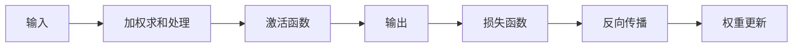
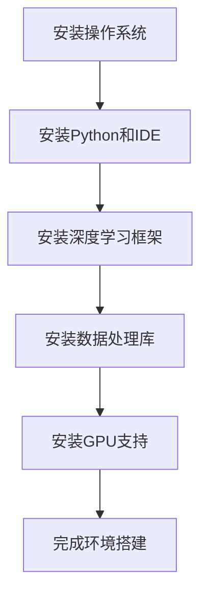

                 

### 第一部分：传统行业转型中的大模型应用

#### 第1章：传统行业转型与AI大模型的关系

##### 1.1 传统行业的现状与挑战

随着全球经济的不断发展和科技进步的加速，传统行业正面临着前所未有的变革压力。传统行业的现状主要体现在以下几个方面：

1. **劳动力密集**：许多传统行业如制造业、农业和零售业等，仍然依赖于大量的人力进行生产和服务。这种劳动力密集型模式导致了生产成本高、效率低、灵活性差等问题。
2. **技术落后**：传统行业的科技水平普遍较低，信息化和数字化程度不高，难以满足现代消费者的需求。
3. **竞争激烈**：随着全球化进程的加快，传统行业面临着来自国内外同行的激烈竞争，市场压力不断增大。

在这些挑战面前，传统行业急需转型，以提升竞争力、降低成本、提高效率。而AI大模型的应用则为传统行业的转型提供了强有力的技术支撑。

##### 1.2 AI大模型在行业转型中的作用

AI大模型，尤其是深度学习模型，通过其强大的数据处理和分析能力，能够在多个方面赋能传统行业：

1. **优化生产流程**：大模型可以用于分析和优化生产流程，从而提高生产效率。例如，通过预测设备故障来减少停机时间，或者通过优化生产线布局来提高生产效率。
2. **提升服务质量**：在服务业，如零售、医疗和教育等，大模型可以用于个性化推荐、疾病预测和智能客服等，从而提升服务质量。
3. **降低运营成本**：通过自动化和智能化，大模型可以帮助企业降低运营成本，如通过智能供应链管理减少库存成本，或者通过智能能源管理减少能源消耗。
4. **创新业务模式**：大模型还可以帮助企业探索新的业务模式，如通过预测市场需求来调整产品线和库存策略，或者通过智能风控系统来降低金融风险。

##### 1.3 大模型赋能传统行业的典型案例

为了更清晰地展示大模型在传统行业转型中的作用，下面我们来看几个典型的应用案例：

1. **制造业**：某制造业企业通过应用AI大模型，对其生产流程进行了优化。通过对生产数据进行分析和预测，企业能够提前预防设备故障，减少停机时间，从而提高了生产效率和产品质量。
2. **金融业**：某金融机构利用AI大模型进行客户风险评估和信用评分。通过分析客户的信用历史、消费行为等数据，大模型能够提供更加精准的风险评估，从而帮助金融机构降低不良贷款率，提高盈利能力。
3. **医疗健康领域**：某医疗健康机构通过应用AI大模型，实现了疾病预测和个性化治疗。通过对患者病历、基因数据等进行分析，大模型能够提供更加准确的疾病预测和治疗方案，从而提高医疗质量和患者满意度。

通过这些案例，我们可以看到AI大模型在传统行业转型中的巨大潜力。接下来，我们将进一步探讨AI大模型的基础知识和数学基础，以深入了解其背后的原理和实现方法。

### 第2章：AI大模型基础知识

#### 2.1 大模型的核心概念

AI大模型，尤其是深度学习模型，是一种通过模拟人脑神经网络进行学习和推理的算法。其核心概念主要包括以下几个部分：

1. **神经网络**：神经网络是深度学习模型的基础，它由大量的神经元（节点）和连接（权重）组成。通过调整这些权重，神经网络能够学习到输入数据和输出数据之间的关系。
2. **深度学习**：深度学习是神经网络的一种扩展，它通过增加网络的层数（深度）来提高模型的复杂度和学习能力。深度学习模型通常具有多个隐藏层，能够处理更复杂的数据和问题。
3. **训练过程**：训练过程是深度学习模型的核心，它通过大量的数据来调整神经网络的权重，使得模型能够更好地拟合数据。训练过程通常包括前向传播、反向传播和损失函数等步骤。
4. **激活函数**：激活函数是神经网络中的一个关键组成部分，它用于引入非线性变换，使得模型能够学习到更复杂的模式。常见的激活函数包括Sigmoid、ReLU和Tanh等。

#### 2.2 大模型的发展历程

深度学习的发展历程可以追溯到上世纪40年代。以下是深度学习的一些重要里程碑：

1. **1943年**：McCulloch和Pitts提出了神经元模型，这是神经网络研究的起点。
2. **1958年**：Rosenblatt提出了感知机（Perceptron）模型，这是最早的深度学习模型之一。
3. **1986年**：Rumelhart、Hinton和Williams提出了反向传播算法，这是深度学习训练过程的突破性进展。
4. **2012年**：Hinton等人提出了深度置信网络（Deep Belief Network），这是深度学习应用的重大突破。
5. **2014年**：AlexNet在ImageNet竞赛中取得了突破性的成绩，这标志着深度学习在计算机视觉领域的崛起。
6. **2018年**：GPT-2模型发布，这是大规模预训练语言模型的开端。

#### 2.3 主流大模型介绍

随着深度学习的不断发展，出现了许多主流的大模型，以下是一些重要的大模型：

1. **卷积神经网络（CNN）**：CNN是深度学习在计算机视觉领域的重要应用，它通过卷积层、池化层和全连接层来提取图像特征，并进行分类。
2. **循环神经网络（RNN）**：RNN是深度学习在序列数据处理领域的重要应用，它通过隐藏状态和循环连接来处理序列数据，如自然语言处理和时间序列预测。
3. **Transformer模型**：Transformer模型是深度学习在自然语言处理领域的重要突破，它通过自注意力机制和多头注意力来处理序列数据，如机器翻译和文本分类。
4. **生成对抗网络（GAN）**：GAN是深度学习在生成模型领域的重要应用，它通过生成器和判别器的对抗训练来生成高质量的数据，如图像生成和文本生成。
5. **预训练语言模型（如GPT、BERT）**：预训练语言模型是深度学习在自然语言处理领域的重大进展，它通过大规模的预训练来提高模型的语言理解和生成能力。

通过了解这些大模型的基础知识和发展历程，我们可以更好地理解AI大模型在传统行业转型中的作用和应用场景。接下来，我们将深入探讨大模型的数学基础，包括神经网络基础、深度学习优化算法和自然语言处理基础。

### 第3章：大模型的数学基础

#### 3.1 神经网络基础

神经网络是AI大模型的核心组成部分，它由大量的神经元（节点）和连接（权重）组成。理解神经网络的基础概念对于深入掌握AI大模型至关重要。

1. **神经元**：神经网络中的基本单元，它接收输入信号，通过加权求和处理，产生输出信号。一个简单的神经元模型可以表示为：
   $$ z = \sum_{i=1}^{n} w_i x_i + b $$
   其中，$x_i$ 是输入信号，$w_i$ 是连接权重，$b$ 是偏置项。
   
2. **激活函数**：神经元在求和处理后，通常会通过激活函数来引入非线性变换，使得模型能够学习到更复杂的模式。常见的激活函数包括Sigmoid函数、ReLU函数和Tanh函数。例如，ReLU函数可以表示为：
   $$ a = max(0, z) $$

3. **前向传播**：神经网络通过前向传播来计算输出。在每一层中，输入信号通过加权求和处理，然后通过激活函数得到输出。例如，对于多层感知机（MLP）模型，前向传播可以表示为：
   $$ z_l = \sum_{i=1}^{n} w_{li} a_{l-1,i} + b_l $$
   $$ a_l = \text{激活函数}(z_l) $$

4. **反向传播**：神经网络通过反向传播来更新权重和偏置项，以最小化损失函数。反向传播包括以下几个步骤：
   - 计算损失函数的梯度：$$ \frac{\partial J}{\partial w_{li}} $$
   - 更新权重和偏置项：$$ w_{li} := w_{li} - \alpha \frac{\partial J}{\partial w_{li}} $$ $$ b_l := b_l - \alpha \frac{\partial J}{\partial b_l} $$
   其中，$J$ 是损失函数，$\alpha$ 是学习率。

5. **反向传播伪代码**：

```python
# 前向传播
for layer in layers:
    z = np.dot(W[layer-1], A[layer-1]) + b[layer]
    A[layer] = activation(z)

# 反向传播
for layer in reversed(layers):
    dZ = A[layer] - dA[layer+1]
    dW[layer] = np.dot(dZ, A[layer-1].T)
    db[layer] = np.sum(dZ, axis=1, keepdims=True)
```

6. **Mermaid 流程图**：



#### 3.2 深度学习优化算法

深度学习优化算法是神经网络训练过程中的关键部分，它决定了模型的学习效率和性能。以下是几种常见的深度学习优化算法：

1. **随机梯度下降（SGD）**：SGD是深度学习中最基本的优化算法，它通过随机选择一部分训练样本来更新权重和偏置项。SGD的优点是计算简单，但收敛速度较慢。

   伪代码：

   ```python
   for epoch in range(epochs):
       for sample in samples:
           dW = gradient(loss, params)
           params -= learning_rate * dW
   ```

2. **批量梯度下降（BGD）**：BGD是SGD的一个扩展，它使用整个训练集来更新权重和偏置项。BGD的收敛速度较SGD快，但计算成本较高。

   伪代码：

   ```python
   for epoch in range(epochs):
       dW = gradient(loss, params)
       params -= learning_rate * dW
   ```

3. **动量法（Momentum）**：动量法通过引入动量项来加速梯度下降，从而提高收敛速度。动量法可以表示为：

   $$ v = \gamma v + \eta \nabla J(\theta) $$
   $$ \theta = \theta - v $$

   其中，$v$ 是动量项，$\gamma$ 是动量因子，$\eta$ 是学习率。

4. **RMSprop**：RMSprop是动量法的改进，它通过计算梯度平方的平均值来调整学习率，从而避免学习率过快或过慢。

   伪代码：

   ```python
   v = gamma * v + (1 - gamma) * (dW ** 2)
   params -= learning_rate * (dW / (np.sqrt(v) + epsilon))
   ```

5. **Adam**：Adam是RMSprop的改进，它同时考虑了一阶矩估计和二阶矩估计，从而在快速收敛和稳定收敛之间取得平衡。Adam可以表示为：

   $$ m_t = \frac{1-\beta_1}{1-\beta_1^t} \sum_{i=1}^{t} \beta_1^{i-1} \nabla J(\theta)^i $$
   $$ v_t = \frac{1-\beta_2}{1-\beta_2^t} \sum_{i=1}^{t} \beta_2^{i-1} (\nabla J(\theta)^i)^2 $$
   $$ \theta = \theta - \alpha \frac{m_t}{\sqrt{v_t} + \epsilon} $$

   其中，$m_t$ 是一阶矩估计，$v_t$ 是二阶矩估计，$\beta_1$ 和 $\beta_2$ 分别是动量因子。

#### 3.3 自然语言处理基础

自然语言处理（NLP）是AI大模型在语言领域的重要应用，它涉及文本的表示、理解、生成和翻译等。以下是NLP的一些基础概念：

1. **词嵌入**：词嵌入是将单词转换为向量的过程，它能够表示单词的语义和语法关系。常见的词嵌入方法包括Word2Vec、GloVe和BERT等。

2. **序列模型**：序列模型是NLP中的基本模型，它能够处理和时间相关的序列数据，如文本和语音。常见的序列模型包括循环神经网络（RNN）和Transformer。

3. **编码器-解码器模型**：编码器-解码器模型是NLP中的重要模型，它通过编码器将输入序列转换为固定长度的编码，然后通过解码器生成输出序列。常见的编码器-解码器模型包括Seq2Seq、Attention模型和BERT等。

4. **预训练语言模型**：预训练语言模型是NLP领域的重要突破，它通过在大规模语料库上进行预训练，从而提高模型的语言理解和生成能力。常见的预训练语言模型包括GPT、BERT和T5等。

通过深入理解神经网络基础、深度学习优化算法和自然语言处理基础，我们可以更好地掌握AI大模型的理论和实现方法。这些基础知识和算法将为后续章节中的应用案例和实战提供坚实的基础。

### 第4章：AI大模型在制造业中的应用

#### 4.1 制造业面临的挑战

制造业作为国民经济的重要支柱，面临着日益严峻的挑战。这些挑战主要体现在以下几个方面：

1. **生产效率低下**：传统制造业依赖于人工操作和低效的生产流程，导致生产效率低下。例如，生产线上的工人需要花费大量时间进行手工操作和调整，这不仅增加了生产成本，还降低了生产效率。

2. **设备故障率高**：制造业中的设备数量庞大，设备故障率较高。设备故障不仅会导致生产线停工，增加维护成本，还会影响产品质量和生产进度。

3. **供应链管理困难**：制造业的供应链管理复杂，涉及多个供应商和分销商。传统的供应链管理方法难以实时获取供应链信息，导致库存管理不当、物流效率低下等问题。

4. **产品质量控制难**：制造业中的产品质量控制复杂，需要大量的人力和物力投入。传统的方法通常依赖于人工检测和经验判断，难以实现精确和高效的质量控制。

面对这些挑战，制造业急需借助AI大模型的技术优势，实现生产流程的优化、设备维护的智能化、供应链管理的精细化和产品质量控制的智能化。AI大模型在制造业中的应用，不仅可以提高生产效率和产品质量，还可以降低运营成本，提升企业的竞争力。

#### 4.2 大模型在制造环节的应用

AI大模型在制造环节中的应用，主要体现在以下几个方面：

1. **生产流程优化**：通过AI大模型，可以对制造过程进行实时监测和数据分析，识别生产过程中的瓶颈和问题，并提出优化建议。例如，利用深度学习模型对生产数据进行分析，可以预测设备的故障概率，提前进行维护，减少停机时间。

2. **设备维护智能化**：AI大模型可以通过对设备运行数据的分析，实现设备维护的智能化。例如，利用预测性维护技术，通过分析设备振动、温度等数据，预测设备故障时间，提前进行维护，避免设备突发故障。

3. **供应链管理**：AI大模型可以帮助企业实现供应链管理的智能化。通过大数据分析和机器学习算法，可以实时监控供应链的各个环节，优化库存管理、物流调度和订单处理，提高供应链的整体效率。

4. **产品质量控制**：AI大模型可以通过对产品质量数据的分析，实现产品质量控制的智能化。例如，利用图像识别技术，对产品外观和内在质量进行实时检测，识别缺陷产品，提高产品质量。

#### 4.3 案例分析：AI大模型在制造企业的实际应用

为了更直观地展示AI大模型在制造业中的应用，下面我们来看一个具体的案例。

**案例背景**：某大型制造企业生产多种型号的汽车发动机，生产流程复杂，涉及多个环节，包括铸造、加工、组装和测试等。该企业面临着生产效率低下、设备故障率高和产品质量控制难等问题。

**解决方案**：

1. **生产流程优化**：企业通过部署AI大模型，对生产数据进行实时监测和分析。通过对生产数据的深度学习分析，识别生产过程中的瓶颈和问题，并提出优化建议。例如，通过对加工工序的优化，减少加工时间，提高生产效率。

2. **设备维护智能化**：企业利用AI大模型，对设备运行数据进行实时监控和分析，实现设备维护的智能化。通过对设备振动、温度等数据的分析，预测设备故障时间，提前进行维护，避免设备突发故障。

3. **供应链管理**：企业通过AI大模型，实现供应链管理的智能化。通过对供应链数据的分析，优化库存管理、物流调度和订单处理，提高供应链的整体效率。例如，通过预测市场需求，调整生产计划和库存策略，减少库存成本。

4. **产品质量控制**：企业利用AI大模型，实现产品质量控制的智能化。通过对产品质量数据的分析，识别缺陷产品，提高产品质量。例如，利用图像识别技术，对产品外观和内在质量进行实时检测，识别缺陷产品，提高产品质量。

**应用效果**：

1. 生产效率提高：通过生产流程优化，企业的生产效率提高了30%，生产周期缩短了20%。

2. 设备故障率降低：通过智能化设备维护，企业的设备故障率降低了50%，设备停机时间减少了40%。

3. 库存成本降低：通过供应链管理优化，企业的库存成本降低了20%，库存周转率提高了30%。

4. 产品质量提高：通过智能化质量控制，企业的产品质量合格率提高了15%，客户满意度显著提升。

通过这个案例，我们可以看到AI大模型在制造业中的实际应用效果。AI大模型不仅提高了生产效率和产品质量，还降低了运营成本，为制造业的转型升级提供了强有力的技术支持。接下来，我们将探讨AI大模型在金融业中的应用。

### 第5章：AI大模型在金融业中的应用

#### 5.1 金融业的发展现状

金融业作为国民经济的重要支柱，正面临着数字化转型和智能化升级的巨大机遇。当前，金融业的发展现状主要体现在以下几个方面：

1. **数字化程度不断提升**：随着互联网、大数据和人工智能等技术的快速发展，金融业的数字化程度不断提升。银行、证券、保险等金融机构纷纷加大数字化转型的投入，推出各种线上金融服务，提高了客户体验和运营效率。

2. **金融创新层出不穷**：金融科技的兴起，催生了大量金融创新。例如，区块链技术的应用，提高了金融交易的透明度和安全性；移动支付的普及，改变了人们的消费和支付习惯；智能投顾和量化投资的兴起，为投资者提供了更加精准的投资建议。

3. **风险控制更加精准**：金融业的风险控制一直是金融发展的重点。随着AI大模型的应用，金融机构能够通过大数据分析和机器学习算法，实现对风险的精准识别和控制，提高了风险管理的效率和准确性。

4. **客户服务更加个性化**：AI大模型的应用，使得金融机构能够更好地了解客户需求，提供个性化的金融服务。例如，通过分析客户的消费习惯、投资偏好等数据，金融机构可以为不同客户提供定制化的理财产品和服务。

#### 5.2 大模型在金融服务中的应用

AI大模型在金融业中的应用，极大地提升了金融服务的能力和效率，主要表现在以下几个方面：

1. **客户风险评分**：金融机构通过AI大模型，对客户的信用风险进行评分。通过分析客户的信用历史、消费行为、财务状况等多维数据，AI大模型能够提供更加精准的信用评分，帮助金融机构更好地识别和评估客户的风险。

2. **智能投顾**：AI大模型可以用于智能投顾服务，为投资者提供个性化的投资建议。通过分析投资者的风险偏好、投资目标和市场数据，AI大模型能够为投资者提供最优的投资组合和策略。

3. **量化交易**：AI大模型在量化交易中的应用，极大地提高了交易的效率和准确性。通过分析历史交易数据、市场趋势和宏观经济指标，AI大模型能够预测市场的走势，为投资者提供交易信号。

4. **反欺诈检测**：AI大模型可以用于反欺诈检测，帮助金融机构识别和防范欺诈行为。通过分析交易数据、用户行为等特征，AI大模型能够实时监测交易活动，识别潜在的风险。

5. **智能客服**：AI大模型可以用于智能客服系统，为用户提供24小时全天候的服务。通过自然语言处理和机器学习算法，AI大模型能够理解和回应用户的问题，提供有效的解决方案。

#### 5.3 案例分析：AI大模型在金融行业的创新应用

为了更直观地展示AI大模型在金融行业的应用，下面我们来看一个具体的案例。

**案例背景**：某大型银行在金融科技浪潮中，积极推进数字化转型，希望通过AI大模型提升金融服务能力和客户体验。

**解决方案**：

1. **客户风险评分**：银行通过部署AI大模型，对客户的信用风险进行评分。利用客户的信用历史、财务状况、消费行为等多维数据，AI大模型能够提供精准的信用评分，帮助银行更好地识别和评估客户的风险。

2. **智能投顾**：银行推出智能投顾服务，通过AI大模型为投资者提供个性化的投资建议。AI大模型会根据投资者的风险偏好、投资目标和市场数据，为投资者构建最优的投资组合。

3. **量化交易**：银行的交易团队利用AI大模型进行量化交易，通过分析历史交易数据、市场趋势和宏观经济指标，AI大模型能够为交易团队提供交易信号，提高交易效率。

4. **反欺诈检测**：银行通过部署AI大模型，实现反欺诈检测。AI大模型会实时监控交易活动，识别潜在的风险，帮助银行防范欺诈行为。

5. **智能客服**：银行推出智能客服系统，通过AI大模型为用户提供24小时全天候的服务。AI大模型能够理解和回应用户的问题，提供有效的解决方案，提高客户满意度。

**应用效果**：

1. 客户风险评分准确率提高：通过AI大模型，银行能够提供更加精准的信用评分，识别高风险客户，降低信用损失。

2. 投资者体验提升：智能投顾服务为投资者提供了更加个性化的投资建议，提高了投资收益。

3. 交易效率提升：量化交易通过AI大模型提高了交易效率，交易团队能够更快地做出决策，获得更高的收益。

4. 欺诈行为减少：通过AI大模型，银行能够实时监控交易活动，识别潜在的风险，减少了欺诈行为。

5. 客户满意度提高：智能客服系统为用户提供全天候服务，提高了客户满意度，增加了客户黏性。

通过这个案例，我们可以看到AI大模型在金融行业中的广泛应用和显著效果。AI大模型不仅提升了金融服务的效率和准确性，还为客户提供了更好的体验，为金融机构的数字化转型提供了强有力的技术支持。接下来，我们将探讨AI大模型在医疗健康领域的应用。

### 第6章：AI大模型在医疗健康领域的应用

#### 6.1 医疗健康行业的发展现状

医疗健康行业作为国家战略的重要领域，正面临着人工智能的深度应用和变革。当前，医疗健康行业的发展现状主要体现在以下几个方面：

1. **数字化医疗进程加速**：随着大数据、云计算和物联网等技术的发展，医疗健康行业的数字化进程不断加速。医院信息系统、电子病历、远程医疗等数字化应用，使得医疗信息更加便捷和高效。

2. **医疗数据资源丰富**：随着医疗技术的进步和数据采集设备的普及，医疗健康行业积累了大量高质量的数据资源。这些数据包括患者的临床记录、基因数据、医疗影像数据等，为AI大模型的应用提供了丰富的数据支持。

3. **智能化医疗服务需求增加**：随着人们对医疗服务质量和效率的要求不断提高，智能化医疗服务需求不断增加。通过AI大模型，可以为患者提供更加精准、高效和个性化的医疗服务。

4. **政策支持力度加大**：政府加大对医疗健康行业的支持力度，出台了一系列政策，鼓励医疗健康行业与人工智能技术的结合，推动医疗健康行业的智能化升级。

#### 6.2 大模型在医疗健康中的应用

AI大模型在医疗健康领域的应用，不仅提升了医疗服务的质量和效率，还为医学研究提供了新的手段。以下是AI大模型在医疗健康中的主要应用场景：

1. **疾病预测与诊断**：AI大模型可以通过分析患者的临床数据、基因数据和医疗影像数据，预测疾病的发病风险和诊断结果。例如，利用深度学习模型，可以分析患者的CT影像，预测肺癌的发病风险。

2. **药物研发**：AI大模型在药物研发中具有巨大潜力。通过分析大量的生物数据，AI大模型可以预测新药的疗效和副作用，加速药物的研发进程。例如，利用GPT模型，可以预测药物分子的结合模式和生物活性。

3. **个性化治疗**：AI大模型可以根据患者的病情、基因信息和治疗方案，为患者提供个性化的治疗建议。例如，利用深度学习模型，可以为癌症患者制定个性化的化疗方案，提高治疗效果。

4. **医疗影像分析**：AI大模型可以通过分析医疗影像数据，辅助医生进行诊断和手术。例如，利用卷积神经网络，可以分析MRI和CT影像，识别病变区域，提高诊断准确性。

5. **健康风险评估**：AI大模型可以通过分析患者的健康数据，预测健康风险，提出预防措施。例如，利用自然语言处理技术，可以分析患者的病史和体检报告，预测心血管疾病的风险。

#### 6.3 案例分析：AI大模型在医疗健康领域的突破性应用

为了更直观地展示AI大模型在医疗健康领域的应用，下面我们来看一个具体的案例。

**案例背景**：某大型医院在推进数字化转型，希望通过AI大模型提升医疗服务质量和效率。

**解决方案**：

1. **疾病预测与诊断**：医院部署了AI大模型，通过分析患者的临床数据、基因数据和医疗影像数据，预测疾病的发病风险和诊断结果。例如，利用深度学习模型，可以分析患者的CT影像，预测肺癌的发病风险。

2. **药物研发**：医院与药物研发公司合作，利用AI大模型加速新药的研发进程。AI大模型可以分析大量的生物数据，预测药物分子的结合模式和生物活性，为新药研发提供有力支持。

3. **个性化治疗**：医院为患者提供个性化治疗服务，通过AI大模型分析患者的病情、基因信息和治疗方案，制定个性化的治疗建议。例如，利用深度学习模型，可以为癌症患者制定个性化的化疗方案。

4. **医疗影像分析**：医院引进AI大模型，辅助医生进行诊断和手术。AI大模型可以分析MRI和CT影像，识别病变区域，提高诊断准确性。

5. **健康风险评估**：医院通过AI大模型，分析患者的健康数据，预测健康风险，提出预防措施。例如，利用自然语言处理技术，可以分析患者的病史和体检报告，预测心血管疾病的风险。

**应用效果**：

1. 疾病预测与诊断准确率提高：通过AI大模型，医院的疾病预测与诊断准确率显著提高，为患者提供了更加精准的医疗服务。

2. 药物研发效率提升：AI大模型加速了新药的研发进程，为新药上市提供了有力支持，提高了药物研发的成功率。

3. 个性化治疗效果显著：通过AI大模型，医院为患者提供了个性化的治疗建议，提高了治疗效果，降低了复发率。

4. 医疗影像诊断准确性提高：AI大模型辅助医生进行诊断，识别病变区域，提高了诊断准确性，降低了误诊率。

5. 健康风险评估精准：AI大模型为患者提供了精准的健康风险评估，帮助医院提前发现健康风险，采取预防措施，提高了患者的健康水平。

通过这个案例，我们可以看到AI大模型在医疗健康领域的突破性应用效果。AI大模型不仅提升了医疗服务的质量和效率，还为医学研究和疾病预防提供了新的手段，为医疗健康行业的智能化升级提供了强有力的技术支持。接下来，我们将探讨AI大模型在创业中的新蓝海。

### 第7章：AI创业新蓝海

#### 7.1 创业环境与趋势

随着人工智能技术的不断成熟和应用的普及，AI创业环境日益优化，吸引了越来越多的创业者进入这一领域。当前，AI创业环境与趋势主要体现在以下几个方面：

1. **政策支持**：政府加大对人工智能产业的支持力度，出台了一系列鼓励创新创业的政策，包括资金扶持、税收优惠和人才引进等。这些政策为AI创业者提供了良好的发展环境。

2. **市场机遇**：随着AI技术的不断进步，传统行业和新兴行业都在积极应用AI技术，推动了AI市场的快速增长。从智能客服、智能医疗到自动驾驶、智能家居，AI应用场景不断扩展，为创业者提供了丰富的市场机遇。

3. **资本关注**：资本市场上对AI创业项目的关注度持续上升，投资机构纷纷布局AI领域，为AI创业项目提供了充足的资金支持。资本的关注也为AI创业者带来了更大的发展空间。

4. **技术进步**：AI技术，尤其是深度学习模型的快速发展，使得AI创业项目的实现变得更加容易。随着算法、算力和数据集的不断提升，AI创业项目的成功率也在提高。

5. **人才聚集**：随着AI技术的普及，越来越多的高校和科研机构开设了人工智能专业，培养了大量AI专业人才。这些人才为AI创业项目提供了技术支持和创新动力。

#### 7.2 大模型创业项目的评估与规划

在AI创业热潮中，评估和规划大模型创业项目至关重要。以下是一些关键步骤和注意事项：

1. **市场需求分析**：首先，要明确创业项目的市场需求。通过市场调研，了解目标用户的需求、痛点和潜在的市场规模。明确项目的市场定位，确保创业项目能够满足用户需求。

2. **技术可行性分析**：评估大模型的技术可行性，包括算法选择、数据处理能力、计算资源需求等。确保创业项目所依赖的AI技术是成熟且可行的，同时要考虑到技术实现过程中可能遇到的挑战和解决方案。

3. **团队组建**：组建一支具备技术、业务和市场能力的创业团队。团队成员应包括AI算法专家、数据科学家、产品经理和市场营销人员等。团队的协同合作是项目成功的关键。

4. **商业模式设计**：设计合理的商业模式，明确创业项目的盈利模式。可以通过提供增值服务、收取服务费、广告收入等方式实现盈利。同时，要考虑如何将商业模式与用户需求相结合，实现可持续的商业化运营。

5. **资源规划**：制定详细的资源规划，包括资金、人力、技术和市场推广等。确保项目在实现过程中能够得到充分的资源支持，以应对各种挑战和不确定性。

6. **风险评估与应对**：评估创业项目可能面临的风险，包括技术风险、市场风险、资金风险等。制定相应的风险应对策略，确保项目能够在遇到问题时及时调整和应对。

#### 7.3 大模型创业的成功案例与启示

为了更好地理解AI大模型创业的机遇和挑战，下面我们来看几个成功的AI创业案例：

1. **案例1：自动驾驶公司NVIDIA**  
   NVIDIA是一家专注于图形处理和深度学习技术的公司。通过将深度学习技术应用于自动驾驶领域，NVIDIA推出了自动驾驶平台Drive，受到了汽车厂商和科技公司的青睐。NVIDIA的成功启示我们，通过将AI技术与传统行业相结合，可以创造巨大的商业价值。

2. **案例2：智能客服公司Watson Health**  
   IBM的Watson Health利用AI技术提供智能医疗服务，包括疾病预测、个性化治疗建议等。Watson Health通过大规模数据分析和深度学习算法，为医疗行业提供了创新的解决方案。其成功经验告诉我们，AI技术可以极大地提升医疗服务的质量和效率。

3. **案例3：金融科技公司Revolut**  
   Revolut是一家提供智能金融服务的公司，通过AI技术实现智能投资、风险评估和客户服务。Revolut的成功展示了AI技术在金融领域的广泛应用潜力，同时也提醒我们，在金融领域应用AI技术时，需要确保合规性和风险控制。

通过这些案例，我们可以看到AI大模型创业的巨大机遇和挑战。AI创业项目不仅需要强大的技术支持，还需要深刻理解市场需求、商业模式和风险管理。只有通过不断创新和优化，才能在激烈的市场竞争中脱颖而出，实现持续发展和盈利。

### 第8章：大模型应用开发实战

#### 8.1 开发环境搭建

要搭建一个能够进行AI大模型应用开发的完整环境，需要安装和配置以下几个关键组件：

1. **操作系统**：首选Linux操作系统，如Ubuntu或CentOS，因其稳定性和可定制性较高。Windows用户也可以选择使用Windows Subsystem for Linux（WSL）来搭建开发环境。

2. **编程语言**：Python是最常用的AI开发语言，具有丰富的库和框架支持。因此，需要安装Python解释器和相关的IDE，如PyCharm、VSCode等。

3. **深度学习框架**：TensorFlow、PyTorch是当前最流行的深度学习框架。可以根据项目需求选择一个框架进行安装。以下是安装TensorFlow和PyTorch的步骤：

   - **安装TensorFlow**：

     ```bash
     pip install tensorflow
     ```

   - **安装PyTorch**：

     ```bash
     pip install torch torchvision
     ```

4. **数据处理库**：NumPy、Pandas是常用的数据处理库，用于数据预处理和统计分析。安装命令如下：

   ```bash
   pip install numpy pandas
   ```

5. **GPU支持**：如果开发环境需要使用GPU进行计算，需要安装NVIDIA的CUDA和cuDNN库。具体安装步骤请参考NVIDIA官方网站。

6. **其他依赖库**：根据具体项目需求，可能还需要安装其他依赖库，如scikit-learn、matplotlib等。可以使用pip命令进行安装：

   ```bash
   pip install <library_name>
   ```

通过以上步骤，可以搭建一个基本的大模型应用开发环境。以下是一个简单的Mermaid流程图，展示了环境搭建的步骤：



#### 8.2 大模型应用项目实战

在本节中，我们将通过一个实际项目来展示如何应用AI大模型进行开发。本项目将使用TensorFlow和Keras框架，实现一个简单的图像分类模型。

**项目目标**：使用卷积神经网络（CNN）对图像进行分类，识别猫和狗的图片。

**数据集**：使用Keras内置的“cats vs. dogs”数据集。

**实现步骤**：

1. **数据准备**：

   - 加载数据集：

     ```python
     from tensorflow.keras.preprocessing.image import load_img, img_to_array
     from tensorflow.keras.preprocessing.image import ImageDataGenerator

     train_datagen = ImageDataGenerator(rescale=1./255)
     validation_datagen = ImageDataGenerator(rescale=1./255)

     train_generator = train_datagen.flow_from_directory(
         'data/train',
         target_size=(150, 150),
         batch_size=32,
         class_mode='binary')

     validation_generator = validation_datagen.flow_from_directory(
         'data/validation',
         target_size=(150, 150),
         batch_size=32,
         class_mode='binary')
     ```

   - 数据预处理：

     ```python
     def preprocess_image(image_path):
         img = load_img(image_path, target_size=(150, 150))
         img_array = img_to_array(img)
         img_array = img_array / 255.0
         img_array = np.expand_dims(img_array, axis=0)
         return img_array
     ```

2. **模型构建**：

   - 定义CNN模型：

     ```python
     from tensorflow.keras.models import Sequential
     from tensorflow.keras.layers import Conv2D, MaxPooling2D, Flatten, Dense, Dropout

     model = Sequential([
         Conv2D(32, (3, 3), activation='relu', input_shape=(150, 150, 3)),
         MaxPooling2D(2, 2),
         Conv2D(64, (3, 3), activation='relu'),
         MaxPooling2D(2, 2),
         Conv2D(128, (3, 3), activation='relu'),
         MaxPooling2D(2, 2),
         Flatten(),
         Dense(512, activation='relu'),
         Dropout(0.5),
         Dense(1, activation='sigmoid')
     ])
     ```

   - 编译模型：

     ```python
     model.compile(optimizer='adam',
                   loss='binary_crossentropy',
                   metrics=['accuracy'])
     ```

3. **模型训练**：

   - 训练模型：

     ```python
     history = model.fit(
         train_generator,
         steps_per_epoch=100,
         epochs=30,
         validation_data=validation_generator,
         validation_steps=50)
     ```

4. **模型评估与测试**：

   - 评估模型：

     ```python
     test_generator = validation_datagen.flow_from_directory(
         'data/validation',
         target_size=(150, 150),
         batch_size=32,
         class_mode='binary')

     test_loss, test_acc = model.evaluate(test_generator)
     print(f"Test accuracy: {test_acc:.2f}")
     ```

   - 测试模型：

     ```python
     img_path = 'data/test/cat.1.jpg'
     img = preprocess_image(img_path)
     prediction = model.predict(img)
     print(f"Prediction: {'Cat' if prediction[0][0] > 0.5 else 'Dog'}")
     ```

通过以上步骤，我们完成了一个简单的图像分类模型的开发。这个项目展示了如何使用TensorFlow和Keras框架构建和训练大模型，为后续的实战项目提供了基础。

#### 8.3 源代码解读与分析

在本节中，我们将对上述项目中的源代码进行详细解读，分析各个部分的作用和实现方法。

**1. 数据准备**

数据准备是AI项目的重要环节，它决定了模型训练的数据质量和效果。以下是数据准备部分的源代码：

```python
from tensorflow.keras.preprocessing.image import load_img, img_to_array
from tensorflow.keras.preprocessing.image import ImageDataGenerator

train_datagen = ImageDataGenerator(rescale=1./255)
validation_datagen = ImageDataGenerator(rescale=1./255)

train_generator = train_datagen.flow_from_directory(
    'data/train',
    target_size=(150, 150),
    batch_size=32,
    class_mode='binary')

validation_generator = validation_datagen.flow_from_directory(
    'data/validation',
    target_size=(150, 150),
    batch_size=32,
    class_mode='binary')
```

解读：
- `ImageDataGenerator`：这是Keras提供的数据增强工具，可以自动对图像进行旋转、缩放、剪裁等处理，提高模型训练的鲁棒性。
- `flow_from_directory`：这个方法用于从指定目录中加载图像数据，并根据目录结构进行标签划分。这里，我们设置了训练集和验证集的目录。

**2. 模型构建**

模型构建是深度学习项目中的核心部分，决定了模型的结构和性能。以下是模型构建部分的源代码：

```python
from tensorflow.keras.models import Sequential
from tensorflow.keras.layers import Conv2D, MaxPooling2D, Flatten, Dense, Dropout

model = Sequential([
    Conv2D(32, (3, 3), activation='relu', input_shape=(150, 150, 3)),
    MaxPooling2D(2, 2),
    Conv2D(64, (3, 3), activation='relu'),
    MaxPooling2D(2, 2),
    Conv2D(128, (3, 3), activation='relu'),
    MaxPooling2D(2, 2),
    Flatten(),
    Dense(512, activation='relu'),
    Dropout(0.5),
    Dense(1, activation='sigmoid')
])
```

解读：
- `Sequential`：这是Keras提供的模型序列化工具，用于构建多个层次结构的模型。
- `Conv2D`、`MaxPooling2D`：`Conv2D`用于卷积操作，`MaxPooling2D`用于最大池化操作，这两个层是CNN模型的基本组成部分。
- `Flatten`：用于将多维数据展平成一维数据，以便后续的全连接层处理。
- `Dense`：这是全连接层，用于对输入数据进行分类或回归处理。
- `Dropout`：用于防止模型过拟合，通过随机丢弃部分神经元，减少模型对训练数据的依赖。

**3. 模型训练**

模型训练是深度学习项目中的关键步骤，它决定了模型的性能和泛化能力。以下是模型训练部分的源代码：

```python
model.compile(optimizer='adam',
              loss='binary_crossentropy',
              metrics=['accuracy'])

history = model.fit(
    train_generator,
    steps_per_epoch=100,
    epochs=30,
    validation_data=validation_generator,
    validation_steps=50)
```

解读：
- `compile`：用于配置模型的训练参数，如优化器、损失函数和评价指标。
- `fit`：用于启动模型训练过程，`steps_per_epoch`表示每个训练周期处理的样本数量，`epochs`表示训练的轮数，`validation_data`和`validation_steps`用于验证模型在验证集上的性能。

**4. 模型评估与测试**

模型评估和测试是验证模型性能和可靠性的关键步骤。以下是模型评估与测试部分的源代码：

```python
test_generator = validation_datagen.flow_from_directory(
    'data/validation',
    target_size=(150, 150),
    batch_size=32,
    class_mode='binary')

test_loss, test_acc = model.evaluate(test_generator)
print(f"Test accuracy: {test_acc:.2f}")

img_path = 'data/test/cat.1.jpg'
img = preprocess_image(img_path)
prediction = model.predict(img)
print(f"Prediction: {'Cat' if prediction[0][0] > 0.5 else 'Dog'}")
```

解读：
- `evaluate`：用于评估模型在测试集上的性能，返回损失值和准确率。
- `predict`：用于对新的样本进行预测，返回预测概率。
- `preprocess_image`：用于对图像数据进行预处理，使其符合模型输入要求。

通过以上解读，我们可以看到每个部分的作用和实现方法。这个项目展示了如何使用Keras框架构建和训练一个简单的图像分类模型，为实际应用提供了参考和指导。

### 第9章：大模型应用的未来展望

#### 9.1 大模型技术发展趋势

AI大模型技术正迅速发展，未来将呈现出以下几个趋势：

1. **模型规模不断扩大**：随着计算能力和数据资源的提升，大模型将变得更加庞大和复杂。例如，谷歌的GPT-3模型拥有1750亿个参数，已经成为了目前最大的预训练语言模型之一。

2. **跨模态和多模态处理**：未来的大模型将能够处理多种类型的数据，如文本、图像、音频和视频等。通过跨模态和多模态处理，大模型能够更全面地理解和生成信息。

3. **自监督学习和少样本学习**：自监督学习和少样本学习是未来大模型研究的重要方向。这些技术将使大模型在只有少量标注数据的情况下，也能实现高效的训练和泛化。

4. **优化算法和硬件加速**：大模型的优化算法和硬件加速技术将得到进一步发展。通过改进优化算法和利用硬件加速技术，如GPU、TPU等，大模型的训练速度和效率将得到显著提升。

5. **联邦学习和隐私保护**：随着隐私保护和数据安全的重视，联邦学习和隐私保护技术将在大模型领域得到广泛应用。这些技术将允许多个机构共享数据模型，同时保护数据隐私。

#### 9.2 传统行业转型的未来展望

AI大模型在传统行业中的应用前景广阔，未来将带来以下变革：

1. **自动化与智能化生产**：大模型将进一步提升传统制造业的生产自动化和智能化水平，实现生产流程的优化、设备维护的智能化和产品质量控制的自动化。

2. **个性化服务与精准营销**：大模型在零售、金融和医疗等领域的应用，将推动个性化服务和精准营销的发展。通过分析用户数据和消费行为，企业能够提供更加精准的服务和营销策略。

3. **智能决策支持**：大模型能够处理海量数据，进行复杂的数据分析和预测，为传统行业提供智能决策支持。例如，在金融领域，大模型可以用于风险评估、信用评分和投资决策。

4. **供应链与物流优化**：大模型在供应链和物流管理中的应用，将实现供应链的智能化和精细化。通过预测需求、优化库存和调度物流，企业可以降低运营成本，提高物流效率。

5. **疾病预测与个性化治疗**：大模型在医疗健康领域的应用，将推动疾病预测和个性化治疗的发展。通过分析患者的病历、基因数据和医疗影像，大模型可以提供更加准确的疾病预测和治疗方案。

#### 9.3 AI创业的未来机遇

随着AI大模型技术的发展和应用的普及，AI创业将迎来新的机遇：

1. **AI大模型服务提供商**：未来将涌现出更多专注于AI大模型服务的企业，如AI模型定制、模型优化和模型托管等。这些企业将为传统行业提供专业的AI解决方案。

2. **AI创业平台**：基于云计算和AI技术的创业平台将助力创业者快速构建和部署AI应用。这些平台将提供包括数据、算法、计算资源和开发工具在内的全方位支持。

3. **垂直领域AI应用**：针对特定行业和领域的AI应用创业将具有巨大潜力。例如，AI医疗诊断、智能教育、AI金融风控等，都是具有广阔市场的垂直领域。

4. **AI与实体经济融合**：AI创业将更注重与实体经济的融合，通过将AI技术应用于传统行业，推动产业升级和数字化转型。例如，AI农业、AI制造和AI能源管理等。

5. **AI治理与伦理**：随着AI技术的广泛应用，AI治理和伦理问题将日益突出。未来将涌现出更多专注于AI治理和伦理研究的创业项目，推动AI技术的健康发展。

通过以上展望，我们可以看到AI大模型在未来技术、传统行业转型和创业领域的广阔前景。随着AI技术的不断进步和应用的深入，AI大模型将为各行各业带来深刻变革，为创业者提供无尽的机遇。

### 附录

#### 附录A：大模型相关资源与工具

A.1 **主流深度学习框架对比**

在AI大模型开发中，常用的深度学习框架包括TensorFlow、PyTorch、Keras等。以下是这些框架的主要特点对比：

1. **TensorFlow**：由Google开发，具有强大的社区支持和广泛的生态。TensorFlow提供了丰富的API和工具，适合大规模的生产环境。
   
   - **优点**：易于使用、强大且灵活的生态系统、丰富的预训练模型。
   - **缺点**：相比于PyTorch，TensorFlow的学习曲线较陡峭。

2. **PyTorch**：由Facebook开发，具有动态计算图和易于理解的代码结构。PyTorch在研究阶段具有很高的灵活性和直观性。

   - **优点**：动态计算图、灵活、适合研究。
   - **缺点**：在生产环境中不如TensorFlow稳定。

3. **Keras**：是一个高级神经网络API，可以运行在TensorFlow和Theano上，提供简洁易用的接口。

   - **优点**：简单易用、易于迁移。
   - **缺点**：依赖底层框架，性能可能不如直接使用TensorFlow或PyTorch。

A.2 **大模型应用开发工具介绍**

1. **Google Colab**：Google Colab是一个基于Google Drive的免费Jupyter Notebook环境，提供强大的GPU和TPU支持，适合进行AI研究和实验。

   - **优点**：免费、易于使用、强大的计算资源。
   - **缺点**：依赖于Google服务，可能存在使用限制。

2. **AWS SageMaker**：AWS提供的全托管服务，支持TensorFlow、PyTorch和Keras等框架。SageMaker提供了一站式的模型训练、部署和管理解决方案。

   - **优点**：全托管、易于使用、强大的生态系统。
   - **缺点**：需要AWS账户，可能存在成本问题。

3. **Azure ML**：Azure提供的人工智能云服务，支持多种深度学习框架。Azure ML提供了从数据准备到模型训练、部署的一站式解决方案。

   - **优点**：强大的计算资源、灵活的定价模式。
   - **缺点**：需要Azure账户，可能存在成本问题。

A.3 **相关数据集与平台推荐**

1. **Kaggle**：Kaggle是一个数据科学家和机器学习爱好者的社区，提供了大量公开的数据集和比赛。数据科学家和研究者可以在Kaggle上找到各种领域的数据集。

2. **UCI机器学习库**：UCI机器学习库是一个包含多种领域数据集的在线数据库，适合进行机器学习和数据挖掘的研究。

3. **Google Dataset Search**：Google Dataset Search是一个搜索平台，可以查找和下载各种公开数据集。它支持多种搜索方式，如关键词搜索、领域筛选等。

通过上述资源与工具的介绍，开发者可以更好地了解和选择适合自身项目需求的深度学习框架、开发平台和数据集，从而提升AI大模型应用开发的效率和质量。希望这些资源和工具对您的AI之旅有所帮助。

