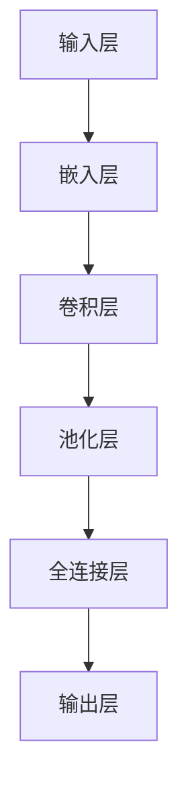
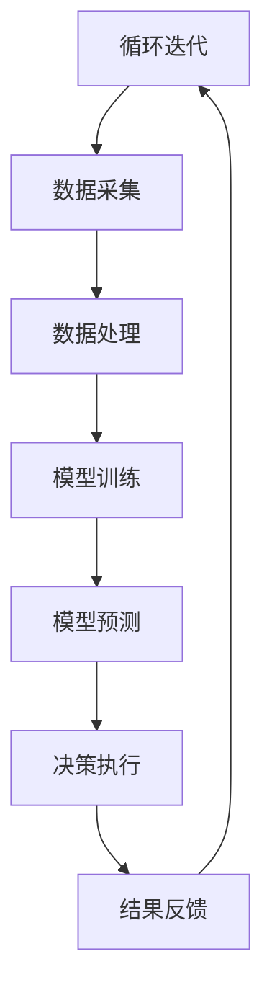
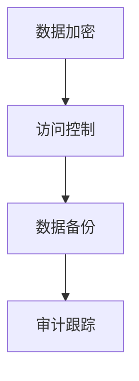
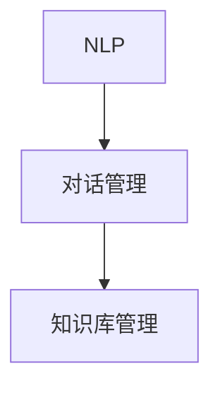
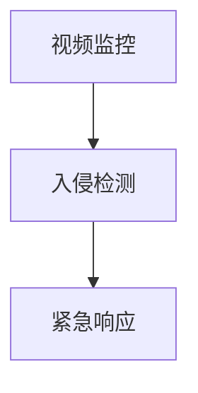

                 

# 大模型赋能智慧园区，创业者如何打造创新生态？

> **关键词：** 智慧园区、大模型、创业生态、创新、数据管理、智能决策、智能服务、创业策略

> **摘要：** 本文将探讨大模型在智慧园区中的应用，以及创业者如何借助这些技术打造创新生态。通过分析大模型的基本原理、应用场景及面临的挑战，本文旨在为创业者提供实用的实践指南，以助力智慧园区建设。

## 第一部分：智慧园区与创业生态概述

### 第1章：智慧园区的定义与特点

#### 1.1 智慧园区的基本概念

智慧园区是指通过信息通信技术（ICT）、物联网（IoT）和大数据分析等技术手段，对园区内的资源进行智能化管理、服务和管理，以实现高效、绿色、可持续发展的园区环境。

#### 1.2 智慧园区的特点与优势

- **智能化管理**：通过大模型和人工智能技术，实现园区资源的高效配置和优化管理。
- **绿色环保**：通过节能降耗、减排等技术手段，实现园区的环保目标。
- **可持续发展**：通过智能化的资源管理，提高园区的可持续发展能力。
- **高效便捷**：通过信息化手段，提升园区内人员、物资和服务的流通效率。

#### 1.3 智慧园区的建设背景与发展趋势

随着全球科技的发展和产业升级的加速，智慧园区已经成为园区经济发展的重要趋势。以下是智慧园区建设的主要背景和发展趋势：

- **科技发展驱动**：物联网、云计算、大数据、人工智能等新兴技术为智慧园区建设提供了技术支撑。
- **产业升级需求**：传统产业向高附加值、高技术含量的产业转型升级，对智慧园区建设提出了更高的要求。
- **绿色发展理念**：响应全球绿色发展理念，智慧园区通过智能化手段实现节能减排，符合可持续发展目标。
- **产业集聚效应**：智慧园区能够吸引高端人才、创新企业和产业资源集聚，形成良好的产业生态。

### 第2章：创业生态的构建与运营

#### 2.1 创业生态的概念与内涵

创业生态是指创业者在创业过程中所面临的资源环境、市场环境、政策环境等多方面因素的综合体。创业生态的构建与运营是创业者成功的关键。

#### 2.2 创业生态的关键要素

- **资源要素**：包括资金、人才、技术、市场等。
- **市场要素**：市场需求、竞争环境、产业链等。
- **政策要素**：政策支持、法规体系、税收优惠等。
- **环境要素**：创业氛围、社会资源、文化氛围等。

#### 2.3 创业生态的构建与运营策略

- **资源整合**：通过合作、联盟等方式，整合创业所需的各类资源。
- **市场定位**：明确创业目标，挖掘市场需求，找准市场定位。
- **政策争取**：积极争取政策支持，利用政策红利。
- **环境营造**：营造良好的创业氛围，吸引创业者、投资人和产业链上下游企业集聚。

### 第3章：大模型在智慧园区中的应用

#### 3.1 大模型的基本原理与分类

大模型是指具有大规模参数、能够处理大量数据的深度学习模型。根据应用场景和任务类型，大模型可以分为以下几类：

- **自然语言处理模型**：如BERT、GPT等，用于处理文本数据。
- **计算机视觉模型**：如ResNet、VGG等，用于处理图像数据。
- **语音识别模型**：如WaveNet、DeepSpeech等，用于处理语音数据。
- **推荐系统模型**：如MF、LR等，用于处理推荐任务。

#### 3.2 大模型在智慧园区中的具体应用

大模型在智慧园区中的应用主要包括以下几个方面：

- **智能决策**：通过大数据分析和深度学习模型，实现园区资源的智能配置和优化。
- **智能服务**：提供智能客服、智能安防、智能交通等服务，提升园区服务质量和用户体验。
- **数据管理**：通过大数据技术和深度学习模型，实现园区数据的高效收集、处理、存储和分析。
- **智能安防**：利用计算机视觉技术和深度学习模型，实现园区安全监控和预警。

#### 3.3 大模型应用面临的挑战与解决方案

大模型在智慧园区应用过程中面临以下挑战：

- **数据隐私与安全**：如何保护用户隐私和园区数据安全是一个重要问题。
- **计算资源消耗**：大模型训练和推理需要大量的计算资源，如何高效利用资源是一个挑战。
- **模型解释性**：大模型的决策过程往往难以解释，如何提高模型的可解释性是一个挑战。

解决方案：

- **数据隐私保护**：采用加密、去重、匿名化等技术手段，保护用户隐私和数据安全。
- **计算资源优化**：采用分布式计算、云计算等技术手段，提高计算资源利用效率。
- **模型可解释性提升**：通过模型结构简化、可视化技术等手段，提高模型的可解释性。

## 第二部分：大模型赋能智慧园区实践

### 第4章：智慧园区数据管理

#### 4.1 数据在智慧园区中的作用

数据是智慧园区的核心资源，其作用主要体现在以下几个方面：

- **决策支持**：通过数据分析和挖掘，为园区管理者提供科学的决策依据。
- **运营优化**：通过数据监控和分析，实现园区资源的高效配置和运营优化。
- **用户体验提升**：通过数据分析和个性化推荐，提升园区用户的服务体验。

#### 4.2 数据收集、处理与存储

数据收集、处理与存储是智慧园区数据管理的关键环节：

- **数据收集**：采用物联网技术，实现园区内各类数据的实时收集。
- **数据处理**：通过大数据技术和深度学习模型，对数据进行清洗、分析和挖掘。
- **数据存储**：采用分布式存储技术和云存储方案，实现海量数据的高效存储和管理。

#### 4.3 数据隐私与安全

数据隐私与安全是智慧园区数据管理的重要问题：

- **数据加密**：采用加密算法，保护数据在传输和存储过程中的安全性。
- **访问控制**：通过身份验证、权限控制等技术手段，确保数据访问的安全。
- **数据备份与恢复**：定期备份数据，确保数据在故障或灾难情况下的恢复。

### 第5章：智慧园区智能决策

#### 5.1 智能决策的基本原理

智能决策是指利用人工智能技术和大数据分析，实现园区资源的智能配置和优化。其基本原理主要包括以下几个方面：

- **数据驱动**：以数据为驱动，通过对数据的分析和挖掘，实现决策的智能化。
- **机器学习**：利用机器学习算法，从历史数据中学习规律，为决策提供支持。
- **优化算法**：采用优化算法，实现园区资源的最佳配置。

#### 5.2 大模型在智能决策中的应用

大模型在智能决策中的应用主要包括以下几个方面：

- **资源优化**：通过大模型，实现园区水、电、气等资源的智能调度和优化配置。
- **设备维护**：通过大模型，预测园区设备的故障风险，实现设备维护的智能化。
- **交通管理**：通过大模型，优化园区交通流量，实现交通管理的智能化。

#### 5.3 智能决策案例解析

以某智慧园区为例，分析其智能决策的应用：

- **资源优化**：通过大模型，实时监测园区水、电、气等资源的消耗情况，自动调整供需平衡，实现节能减排。
- **设备维护**：通过大模型，预测园区设备的故障时间，提前安排维护计划，降低设备故障率和维修成本。
- **交通管理**：通过大模型，分析园区内交通流量数据，优化交通信号灯配时，提高交通运行效率。

### 第6章：智慧园区智能服务

#### 6.1 智慧园区智能服务的概述

智慧园区智能服务是指利用人工智能技术，为园区内企业和居民提供智能化的服务。其主要包括以下几个方面的内容：

- **智能客服**：通过自然语言处理技术，实现与用户的智能对话，提供7x24小时的服务。
- **智能安防**：通过计算机视觉技术，实时监控园区安全情况，及时发现并处理异常情况。
- **智能交通**：通过大数据分析和人工智能技术，实现园区内交通流量的实时监控和优化。

#### 6.2 智能客服系统设计

智能客服系统设计主要包括以下几个方面：

- **语音识别**：通过语音识别技术，将用户语音转化为文本，实现语音与文本的转换。
- **自然语言处理**：通过自然语言处理技术，理解用户意图，提供准确的答案和解决方案。
- **知识库管理**：建立丰富的知识库，包括常见问题、解决方案、产品信息等，为智能客服提供支持。

#### 6.3 智慧园区智能安防

智慧园区智能安防主要包括以下几个方面：

- **视频监控**：通过视频监控技术，实时监控园区内的重要区域，及时发现安全隐患。
- **人脸识别**：通过人脸识别技术，实现人员身份的识别和监控，提高园区安全水平。
- **智能预警**：通过大数据分析和人工智能技术，预测潜在的安全风险，实现智能预警和响应。

### 第7章：大模型助力创新创业

#### 7.1 创新创业环境下的大模型应用

在创新创业环境下，大模型的应用主要体现在以下几个方面：

- **项目评估**：通过大模型，对创新创业项目的可行性进行评估，提高项目成功率。
- **人才选拔**：通过大模型，分析应聘者的简历和面试表现，选拔出合适的人才。
- **市场预测**：通过大模型，分析市场数据，预测市场趋势，为创业企业提供决策支持。

#### 7.2 创新创业项目筛选与评估

创新创业项目筛选与评估主要采用以下方法：

- **数据驱动的项目评估**：通过收集和分析创新创业项目的相关数据，评估项目的可行性、市场前景等。
- **专家评审**：邀请行业专家对创新创业项目进行评审，从专业角度提出意见和建议。
- **市场调研**：通过市场调研，了解市场需求，评估创新创业项目的市场潜力。

#### 7.3 创新创业团队组建与协同

创新创业团队组建与协同主要涉及以下几个方面：

- **团队建设**：明确团队目标，制定团队建设计划，提高团队凝聚力和执行力。
- **人员配备**：根据项目需求，合理配备团队成员，确保团队专业素质和能力的全面。
- **协同工作**：通过协作工具，实现团队成员之间的信息共享和协同工作，提高工作效率。

## 第三部分：创业者的实践指南

### 第8章：打造创新生态的创业策略

#### 8.1 创业定位与市场分析

创业定位与市场分析是创业成功的关键：

- **创业定位**：明确创业项目的核心价值、目标市场和竞争优势。
- **市场分析**：了解市场需求、竞争状况、市场趋势等，为创业项目提供决策支持。

#### 8.2 创业团队建设与管理

创业团队建设与管理是创业成功的重要保障：

- **团队建设**：制定团队建设计划，提高团队凝聚力和执行力。
- **团队管理**：合理分配团队成员职责，建立有效的沟通机制，确保团队高效运转。

#### 8.3 创业融资策略

创业融资策略是创业成功的重要环节：

- **融资渠道**：了解各种融资渠道，选择适合自己项目的融资方式。
- **融资策略**：制定合理的融资计划，提高融资成功率。

### 第9章：智慧园区创业项目实战

#### 9.1 项目需求分析与规划

项目需求分析与规划是智慧园区创业项目成功的关键：

- **需求分析**：明确项目需求，包括功能需求、性能需求、用户体验需求等。
- **项目规划**：制定项目实施计划，包括时间表、任务分配、资源需求等。

#### 9.2 项目实施与监控

项目实施与监控是智慧园区创业项目顺利进行的保障：

- **项目实施**：按照项目规划，组织项目实施，确保项目进度和质量。
- **项目监控**：实时监控项目进度和质量，及时调整项目计划，确保项目顺利推进。

#### 9.3 项目评估与优化

项目评估与优化是智慧园区创业项目持续发展的重要环节：

- **项目评估**：对项目实施效果进行评估，包括功能实现情况、性能指标、用户体验等。
- **项目优化**：根据项目评估结果，对项目进行优化，提高项目质量和用户体验。

### 第10章：创业者的成长与拓展

#### 10.1 创业者心态与技能提升

创业者心态与技能提升是创业成功的重要保障：

- **心态调整**：保持积极的心态，勇于面对创业过程中的困难和挑战。
- **技能提升**：不断学习新知识、新技能，提高自身综合素质。

#### 10.2 创业者网络资源整合

创业者网络资源整合是创业成功的重要途径：

- **人脉拓展**：积极参加行业活动，拓展人脉资源。
- **资源共享**：与其他创业者、投资人、行业专家等进行资源共享，提高创业成功率。

#### 10.3 创业者可持续发展路径

创业者可持续发展路径是创业成功的重要目标：

- **商业模式创新**：不断探索新的商业模式，提高企业的竞争力。
- **持续创新**：保持创新精神，不断推出新产品、新技术，为企业持续发展提供动力。

## 附录

### 附录A：智慧园区与创业生态相关资源

#### A.1 相关书籍推荐

- 《智慧园区建设与管理》
- 《创业生态系统研究》
- 《人工智能与大数据》

#### A.2 行业报告与研究报告

- 《2021年中国智慧园区产业发展报告》
- 《2021年中国创业生态报告》
- 《2021年中国人工智能产业发展报告》

#### A.3 在线学习平台与课程推荐

- Coursera：提供多门人工智能、数据分析等课程
- Udacity：提供数据科学、机器学习等课程
- edX：提供多门计算机科学、人工智能等课程

### 附录B：大模型应用示例代码

#### B.1 数据预处理代码示例

```python
import pandas as pd
import numpy as np

# 读取数据
data = pd.read_csv('data.csv')

# 数据清洗
data = data.dropna()
data = data[data['column'] > 0]

# 数据标准化
data = (data - data.mean()) / data.std()

# 数据分箱
bins = [-np.inf, 0, 10, 20, np.inf]
labels = ['低', '中低', '中高', '高']
data['category'] = pd.cut(data['column'], bins=bins, labels=labels)

# 数据编码
data = pd.get_dummies(data)
```

#### B.2 模型训练与评估代码示例

```python
import tensorflow as tf
from sklearn.model_selection import train_test_split

# 准备数据
X = data.drop('target', axis=1)
y = data['target']

# 划分训练集和测试集
X_train, X_test, y_train, y_test = train_test_split(X, y, test_size=0.2, random_state=42)

# 定义模型
model = tf.keras.Sequential([
    tf.keras.layers.Dense(64, activation='relu', input_shape=(X_train.shape[1],)),
    tf.keras.layers.Dense(64, activation='relu'),
    tf.keras.layers.Dense(1, activation='sigmoid')
])

# 编译模型
model.compile(optimizer='adam', loss='binary_crossentropy', metrics=['accuracy'])

# 训练模型
model.fit(X_train, y_train, epochs=10, batch_size=32, validation_data=(X_test, y_test))

# 评估模型
loss, accuracy = model.evaluate(X_test, y_test)
print(f"Test accuracy: {accuracy:.2f}")
```

#### B.3 模型部署与调优代码示例

```python
# 导入库
import tensorflow as tf
from tensorflow.keras.models import load_model

# 加载模型
model = load_model('model.h5')

# 预测
predictions = model.predict(X_test)

# 查看预测结果
print(predictions)

# 调优
# 1. 调整超参数
# 2. 使用不同的数据集进行训练
# 3. 采用不同的优化算法和损失函数
# 4. 增加训练时间
```

### 附录C：大模型流程图与算法原理

#### C.1 大模型基本架构流程图



#### C.2 大模型核心算法原理讲解

```python
# 伪代码：大模型核心算法原理讲解

# 输入层
input_data = ...

# 嵌入层
embedding_matrix = ...
embedded_input = tf.nn.embedding_lookup(embedding_matrix, input_data)

# 卷积层
conv_weights = ...
conv_output = tf.nn.conv1d(embedded_input, conv_weights, stride=1, padding='VALID')

# 池化层
pool_output = tf.reduce_max(conv_output, axis=1)

# 全连接层
fc_weights = ...
fc_output = tf.matmul(pool_output, fc_weights)

# 输出层
output = tf.nn.softmax(fc_output)
```

#### C.3 大模型在智慧园区中的应用流程图



## 结论

### 第11章：大模型赋能智慧园区的未来展望

#### 11.1 大模型技术发展趋势

- **算法优化**：大模型算法将不断优化，提高模型训练效率和预测准确性。
- **硬件加速**：随着硬件技术的发展，大模型将能够更好地利用GPU、TPU等加速器，实现更高效的计算。
- **多模态融合**：大模型将能够处理多种类型的数据，实现文本、图像、语音等多模态数据的融合分析。

#### 11.2 智慧园区与创业生态的未来

- **智能化水平提升**：智慧园区将实现更高水平的智能化，提供更加便捷、高效的服务。
- **产业生态完善**：智慧园区将形成更加完善的产业生态，吸引更多创新企业和人才集聚。

#### 11.3 创业者面临的挑战与机遇

- **技术挑战**：创业者需要不断学习和掌握新技术，应对技术变革带来的挑战。
- **市场机遇**：智慧园区和创业生态的快速发展为创业者提供了广阔的市场空间和机遇。

---

**（注：目录中的内容仅作为大纲示例，具体章节内容请根据实际情况进一步填充。）**

---

**作者：AI天才研究院/AI Genius Institute & 禅与计算机程序设计艺术 /Zen And The Art of Computer Programming**<|im_end|>## 目录

### 大模型赋能智慧园区，创业者如何打造创新生态？

**关键词：** 智慧园区、大模型、创业生态、创新、数据管理、智能决策、智能服务

**摘要：** 本文将探讨大模型在智慧园区中的应用，以及创业者如何借助这些技术打造创新生态。通过分析大模型的基本原理、应用场景及面临的挑战，本文旨在为创业者提供实用的实践指南，以助力智慧园区建设。

---

### 《大模型赋能智慧园区，创业者如何打造创新生态？》目录大纲

#### 第一部分：智慧园区与创业生态概述

##### 第1章：智慧园区的定义与特点

##### 第2章：创业生态的构建与运营

##### 第3章：大模型在智慧园区中的应用

#### 第二部分：大模型赋能智慧园区实践

##### 第4章：智慧园区数据管理

##### 第5章：智慧园区智能决策

##### 第6章：智慧园区智能服务

##### 第7章：大模型助力创新创业

#### 第三部分：创业者的实践指南

##### 第8章：打造创新生态的创业策略

##### 第9章：智慧园区创业项目实战

##### 第10章：创业者的成长与拓展

#### 附录

##### 附录A：智慧园区与创业生态相关资源

##### 附录B：大模型应用示例代码

##### 附录C：大模型流程图与算法原理

##### 结论

---

**（注：目录中的内容仅作为大纲示例，具体章节内容请根据实际情况进一步填充。）**<|im_end|>## 第一部分：智慧园区与创业生态概述

### 第1章：智慧园区的定义与特点

#### 1.1 智慧园区的基本概念

智慧园区是一种新型的产业园区，通过集成物联网、云计算、大数据、人工智能等先进技术，实现园区内资源的高效利用和管理，为企业和居民提供智能化、便捷化的服务。智慧园区不仅包括传统的办公、生产和居住功能，还涵盖了环境监测、安防管理、交通引导、能源管理等多个方面。

#### 1.2 智慧园区的特点与优势

1. **智能化管理**：智慧园区通过引入物联网设备，实现园区内各种设备的互联互通，通过云计算和大数据分析，对园区内的资源进行智能化管理，提高资源利用效率。

2. **绿色环保**：智慧园区采用节能、减排技术，通过智能化的能源管理，减少能源消耗，降低污染排放，实现绿色可持续发展。

3. **高效便捷**：智慧园区通过智能化手段，优化交通、物流、服务等资源配置，提高园区内的运行效率，提供更加便捷、高效的服务。

4. **可持续性**：智慧园区通过智能化管理，提高园区运营效率，降低运营成本，实现长期可持续发展。

#### 1.3 智慧园区的建设背景与发展趋势

智慧园区的建设背景主要源于以下几个方面：

1. **产业升级需求**：随着我国经济的转型升级，传统产业正逐步向高附加值、高技术含量的产业转型，对产业园区提出了更高的要求。

2. **科技创新驱动**：物联网、云计算、大数据、人工智能等新兴技术的快速发展，为智慧园区的建设提供了技术支撑。

3. **绿色发展理念**：面对全球气候变化和环境保护的挑战，绿色、可持续的发展理念已成为各国共识，智慧园区作为绿色发展的重要载体，得到了广泛关注。

4. **产业集聚效应**：智慧园区通过提供优质的创新创业环境，吸引大量的创新企业、高端人才和产业链上下游企业集聚，形成良好的产业生态。

未来，智慧园区的发展趋势将呈现以下特点：

1. **智能化水平提升**：随着人工智能技术的不断进步，智慧园区的智能化水平将不断提升，为企业和居民提供更加智能化的服务。

2. **产业链整合**：智慧园区将不断整合产业链上下游资源，实现产业链的优化和协同发展。

3. **绿色低碳**：智慧园区将继续推进绿色、低碳、环保的发展理念，通过智能化技术实现节能减排。

4. **智慧服务**：智慧园区将提供更加多样化、个性化的智慧服务，提升园区内的生活质量和生产效率。

### 第2章：创业生态的构建与运营

#### 2.1 创业生态的概念与内涵

创业生态是指创业者在创业过程中所面临的资源环境、市场环境、政策环境等多方面因素的综合体。创业生态包括以下几个核心要素：

1. **资源要素**：包括资金、人才、技术、市场等。创业者需要通过各种渠道获取这些资源，以支持创业项目的开展。

2. **市场要素**：市场需求、竞争环境、产业链等。创业者需要深入了解市场环境，找准市场定位，把握市场机遇。

3. **政策要素**：政策支持、法规体系、税收优惠等。创业者需要充分利用政策环境，降低创业成本，提高创业成功率。

4. **环境要素**：创业氛围、社会资源、文化氛围等。创业者需要营造良好的创业氛围，吸引更多的创业者和投资人的关注。

#### 2.2 创业生态的关键要素

1. **资本**：资金是创业项目的生命线，创业者需要通过各种渠道获取资金支持，包括天使投资、风险投资、银行贷款等。

2. **人才**：人才是创业项目的核心竞争力，创业者需要组建一支高素质的团队，包括技术人才、市场营销人才、管理人才等。

3. **技术**：技术是创业项目的核心驱动力，创业者需要不断创新，掌握核心技术，形成核心竞争力。

4. **市场**：市场是创业项目的最终归宿，创业者需要深入了解市场需求，找准市场定位，制定合适的营销策略。

5. **政策**：政策是创业项目的保障，创业者需要充分利用政策红利，降低创业成本，提高创业成功率。

6. **环境**：环境是创业项目的孵化器，创业者需要营造良好的创业氛围，吸引更多的创业者和投资人的关注。

#### 2.3 创业生态的构建与运营策略

1. **资源整合**：创业者需要通过各种方式整合创业所需的各类资源，包括资金、人才、技术、市场等。

2. **市场定位**：创业者需要深入了解市场需求，找准市场定位，制定合适的营销策略，提高市场竞争力。

3. **政策争取**：创业者需要积极争取政策支持，包括税收优惠、补贴等，降低创业成本，提高创业成功率。

4. **环境营造**：创业者需要营造良好的创业氛围，吸引更多的创业者和投资人的关注，形成良好的创业生态。

5. **持续创新**：创业者需要不断创新，掌握核心技术，提高核心竞争力，推动创业项目的持续发展。

### 第3章：大模型在智慧园区中的应用

#### 3.1 大模型的基本原理与分类

大模型（Large Model）是指具有大规模参数的深度学习模型，通常具有数十亿到千亿个参数。大模型通过从海量数据中学习，能够实现高水平的性能和泛化能力。根据任务类型和应用领域，大模型可以分为以下几类：

1. **自然语言处理模型**：如GPT、BERT等，用于文本分类、机器翻译、问答系统等任务。

2. **计算机视觉模型**：如ResNet、VGG等，用于图像分类、目标检测、图像分割等任务。

3. **语音识别模型**：如WaveNet、DeepSpeech等，用于语音识别、语音合成等任务。

4. **推荐系统模型**：如MF、LR等，用于推荐系统中的物品推荐、用户推荐等任务。

#### 3.2 大模型在智慧园区中的具体应用

大模型在智慧园区中的应用非常广泛，主要包括以下几个方面：

1. **智能决策**：通过大数据分析和深度学习模型，实现园区资源的高效配置和优化管理。

2. **智能服务**：提供智能客服、智能安防、智能交通等服务，提升园区服务质量和用户体验。

3. **数据管理**：通过大数据技术和深度学习模型，实现园区数据的高效收集、处理、存储和分析。

4. **智能安防**：利用计算机视觉技术和深度学习模型，实现园区安全监控和预警。

#### 3.3 大模型应用面临的挑战与解决方案

大模型在智慧园区应用过程中面临以下挑战：

1. **数据隐私与安全**：如何保护用户隐私和园区数据安全是一个重要问题。

   **解决方案**：采用数据加密、匿名化处理等技术手段，确保数据在传输和存储过程中的安全性。

2. **计算资源消耗**：大模型训练和推理需要大量的计算资源，如何高效利用资源是一个挑战。

   **解决方案**：采用分布式计算、云计算等技术手段，提高计算资源利用效率。

3. **模型解释性**：大模型的决策过程往往难以解释，如何提高模型的可解释性是一个挑战。

   **解决方案**：通过模型结构简化、可视化技术等手段，提高模型的可解释性。

通过以上分析，我们可以看到，智慧园区和创业生态的构建离不开先进技术的支持。大模型作为一种强大的技术工具，可以在智慧园区中发挥重要作用，助力创业者打造创新生态。在接下来的部分，我们将深入探讨大模型在智慧园区中的具体应用和实践，为创业者提供实用的指导。|>markdown<|im_end|>## 第一部分：智慧园区与创业生态概述

### 第1章：智慧园区的定义与特点

#### 1.1 智慧园区的基本概念

智慧园区是指通过集成物联网、云计算、大数据、人工智能等先进技术，对园区内的资源进行智能化管理和服务，以实现高效、绿色、可持续发展的新型产业园区。智慧园区不仅包括传统的办公、生产和居住功能，还涵盖了环境监测、安防管理、交通引导、能源管理等多个方面。

#### 1.2 智慧园区的特点与优势

- **智能化管理**：智慧园区通过物联网设备和传感器，实现园区内各种设备的互联互通，通过云计算和大数据分析，对园区内的资源进行智能化管理，提高资源利用效率。

- **绿色环保**：智慧园区采用节能、减排技术，通过智能化的能源管理，减少能源消耗，降低污染排放，实现绿色可持续发展。

- **高效便捷**：智慧园区通过智能化手段，优化交通、物流、服务等资源配置，提高园区内的运行效率，提供更加便捷、高效的服务。

- **可持续性**：智慧园区通过智能化管理，提高园区运营效率，降低运营成本，实现长期可持续发展。

#### 1.3 智慧园区的建设背景与发展趋势

智慧园区的建设背景主要源于以下几个方面：

- **产业升级需求**：随着我国经济的转型升级，传统产业正逐步向高附加值、高技术含量的产业转型，对产业园区提出了更高的要求。

- **科技创新驱动**：物联网、云计算、大数据、人工智能等新兴技术的快速发展，为智慧园区的建设提供了技术支撑。

- **绿色发展理念**：面对全球气候变化和环境保护的挑战，绿色、可持续的发展理念已成为各国共识，智慧园区作为绿色发展的重要载体，得到了广泛关注。

- **产业集聚效应**：智慧园区通过提供优质的创新创业环境，吸引大量的创新企业、高端人才和产业链上下游企业集聚，形成良好的产业生态。

未来，智慧园区的发展趋势将呈现以下特点：

- **智能化水平提升**：随着人工智能技术的不断进步，智慧园区的智能化水平将不断提升，为企业和居民提供更加智能化的服务。

- **产业链整合**：智慧园区将不断整合产业链上下游资源，实现产业链的优化和协同发展。

- **绿色低碳**：智慧园区将继续推进绿色、低碳、环保的发展理念，通过智能化技术实现节能减排。

- **智慧服务**：智慧园区将提供更加多样化、个性化的智慧服务，提升园区内的生活质量和生产效率。

### 第2章：创业生态的构建与运营

#### 2.1 创业生态的概念与内涵

创业生态是指创业者在创业过程中所面临的资源环境、市场环境、政策环境等多方面因素的综合体。创业生态包括以下几个核心要素：

- **资源要素**：包括资金、人才、技术、市场等。创业者需要通过各种渠道获取这些资源，以支持创业项目的开展。

- **市场要素**：市场需求、竞争环境、产业链等。创业者需要深入了解市场环境，找准市场定位，把握市场机遇。

- **政策要素**：政策支持、法规体系、税收优惠等。创业者需要充分利用政策环境，降低创业成本，提高创业成功率。

- **环境要素**：创业氛围、社会资源、文化氛围等。创业者需要营造良好的创业氛围，吸引更多的创业者和投资人的关注。

#### 2.2 创业生态的关键要素

创业生态的关键要素包括以下几个方面：

- **资本**：资金是创业项目的生命线，创业者需要通过各种渠道获取资金支持，包括天使投资、风险投资、银行贷款等。

- **人才**：人才是创业项目的核心竞争力，创业者需要组建一支高素质的团队，包括技术人才、市场营销人才、管理人才等。

- **技术**：技术是创业项目的核心驱动力，创业者需要不断创新，掌握核心技术，形成核心竞争力。

- **市场**：市场是创业项目的最终归宿，创业者需要深入了解市场需求，找准市场定位，制定合适的营销策略。

- **政策**：政策是创业项目的保障，创业者需要充分利用政策红利，降低创业成本，提高创业成功率。

- **环境**：环境是创业项目的孵化器，创业者需要营造良好的创业氛围，吸引更多的创业者和投资人的关注。

#### 2.3 创业生态的构建与运营策略

创业生态的构建与运营策略主要包括以下几个方面：

- **资源整合**：创业者需要通过各种方式整合创业所需的各类资源，包括资金、人才、技术、市场等。

- **市场定位**：创业者需要深入了解市场需求，找准市场定位，制定合适的营销策略，提高市场竞争力。

- **政策争取**：创业者需要积极争取政策支持，包括税收优惠、补贴等，降低创业成本，提高创业成功率。

- **环境营造**：创业者需要营造良好的创业氛围，吸引更多的创业者和投资人的关注，形成良好的创业生态。

- **持续创新**：创业者需要不断创新，掌握核心技术，提高核心竞争力，推动创业项目的持续发展。

通过以上分析，我们可以看到，智慧园区和创业生态的构建离不开先进技术的支持。大模型作为一种强大的技术工具，可以在智慧园区中发挥重要作用，助力创业者打造创新生态。在接下来的部分，我们将深入探讨大模型在智慧园区中的具体应用和实践，为创业者提供实用的指导。|>markdown<|im_end|>## 第二部分：大模型赋能智慧园区实践

### 第4章：智慧园区数据管理

#### 4.1 数据在智慧园区中的作用

数据是智慧园区运营和管理的基础，它在以下几个方面发挥着重要作用：

- **决策支持**：通过收集、分析和处理园区内外的各类数据，管理者可以做出更加科学和准确的决策，提高运营效率。
- **资源优化**：数据分析帮助管理者了解资源使用情况，从而优化资源配置，降低成本，提升服务质量。
- **风险评估**：通过对历史数据的分析和预测，可以识别潜在的风险点，采取预防措施，降低损失。
- **服务提升**：通过分析用户行为数据，提供个性化的服务，提升用户体验。

#### 4.2 数据收集、处理与存储

智慧园区数据管理的关键在于数据收集、处理和存储的有效性。以下是具体的内容：

- **数据收集**：智慧园区使用各种传感器、物联网设备和用户交互系统来收集数据。这些数据包括环境数据（如温度、湿度、噪音）、设备运行数据、用户行为数据等。
  
  ```mermaid
  graph TD
  A[传感器] --> B[物联网设备]
  B --> C[用户交互系统]
  C --> D[数据处理中心]
  ```

- **数据处理**：收集到的数据需要进行清洗、转换和集成，以便后续的分析和使用。数据处理包括以下步骤：
  
  - **数据清洗**：去除无效、错误或重复的数据，保证数据质量。
  - **数据转换**：将数据转换为适合分析和存储的格式。
  - **数据集成**：将来自不同源的数据合并，形成统一的数据视图。

  ```python
  # 数据清洗与转换示例
  import pandas as pd

  # 读取数据
  data = pd.read_csv('sensor_data.csv')

  # 数据清洗
  data = data.dropna()
  data = data[data['value'] > 0]

  # 数据转换
  data['timestamp'] = pd.to_datetime(data['timestamp'])
  ```

- **数据存储**：智慧园区需要使用高效、可靠的数据存储解决方案。常见的数据存储方式包括关系数据库、NoSQL数据库和分布式文件系统。

  ```mermaid
  graph TD
  A[关系数据库] --> B[NoSQL数据库]
  B --> C[分布式文件系统]
  ```

#### 4.3 数据隐私与安全

数据隐私与安全是智慧园区数据管理的重要问题。以下是一些关键措施：

- **数据加密**：对敏感数据进行加密处理，确保数据在传输和存储过程中的安全性。
- **访问控制**：通过身份验证和权限控制，确保只有授权用户可以访问数据。
- **数据备份**：定期备份数据，以防数据丢失或损坏。
- **审计跟踪**：记录数据访问和操作的审计日志，以便在发生安全事件时进行追踪和调查。



### 第5章：智慧园区智能决策

#### 5.1 智能决策的基本原理

智能决策是指利用人工智能技术，特别是机器学习和深度学习算法，从数据中提取有价值的信息，辅助决策者做出最佳决策。智能决策的基本原理包括：

- **数据收集与预处理**：收集相关的数据，并进行清洗、转换和集成，以便进行进一步的分析。
- **特征工程**：提取数据中的关键特征，用于训练机器学习模型。
- **模型训练与优化**：使用历史数据训练机器学习模型，并通过交叉验证和超参数调整优化模型性能。
- **决策支持**：将训练好的模型应用于实际数据，提供决策支持和预测结果。

#### 5.2 大模型在智能决策中的应用

大模型在智慧园区智能决策中的应用主要包括以下几个方面：

- **资源调度**：通过大模型预测资源需求，优化电力、水资源等的分配，降低运营成本。
- **设备维护**：预测设备的故障时间，提前安排维护计划，减少停机时间和维护成本。
- **安全监控**：通过大模型分析监控数据，识别潜在的安全威胁，及时采取措施。

#### 5.3 智能决策案例解析

以智慧园区电力资源调度为例，分析智能决策的应用：

- **需求预测**：通过大模型分析历史数据和当前天气、用户行为等因素，预测未来的电力需求。
- **资源优化**：根据需求预测结果，优化电力资源的分配，确保在高峰期有足够的电力供应。
- **成本控制**：通过智能调度，减少不必要的电力消耗，降低运营成本。

### 第6章：智慧园区智能服务

#### 6.1 智慧园区智能服务的概述

智慧园区智能服务是指利用人工智能、大数据和物联网等技术，为园区内的企业和居民提供个性化、智能化、高效便捷的服务。这些服务包括：

- **智能客服**：通过自然语言处理技术，提供7x24小时的在线咨询服务。
- **智能安防**：利用计算机视觉和智能分析技术，提供园区安全监控和预警。
- **智能交通**：通过智能交通管理系统，优化交通流量，减少拥堵。

#### 6.2 智能客服系统设计

智能客服系统设计的关键在于：

- **自然语言处理（NLP）**：使用NLP技术理解用户的问题，提供准确的回答。
- **对话管理**：设计对话流程，确保与用户的交流自然流畅。
- **知识库管理**：建立丰富的知识库，包含常见问题及其解决方案。



#### 6.3 智慧园区智能安防

智慧园区智能安防系统设计包括：

- **视频监控**：通过摄像头实时监控园区，识别异常行为。
- **入侵检测**：利用计算机视觉技术，识别未经授权的入侵者。
- **紧急响应**：在检测到异常情况时，自动触发报警，并通知相关部门。



### 第7章：大模型助力创新创业

#### 7.1 创新创业环境下的大模型应用

在创新创业环境下，大模型的应用主要体现在以下几个方面：

- **项目评估**：通过大数据分析和机器学习算法，评估创业项目的市场前景和可行性。
- **人才选拔**：使用大模型分析应聘者的简历和面试表现，选拔合适的人才。
- **市场预测**：通过分析市场数据，预测市场趋势，为创业企业提供决策支持。

#### 7.2 创新创业项目筛选与评估

创业项目筛选与评估的关键步骤包括：

- **市场分析**：通过大数据分析，了解市场需求、竞争环境和市场趋势。
- **项目评估**：使用机器学习算法，对项目的可行性、市场前景、风险等进行评估。
- **专家评审**：邀请行业专家对项目进行评审，提供专业意见和建议。

#### 7.3 创新创业团队组建与协同

创新创业团队组建与协同的关键包括：

- **团队建设**：明确团队目标，建立有效的沟通机制，提高团队凝聚力。
- **人员配备**：根据项目需求，合理配备团队成员，确保团队专业素质和能力的全面。
- **协同工作**：使用协作工具，实现团队成员之间的信息共享和协同工作，提高工作效率。

通过以上内容，我们可以看到，大模型在智慧园区的数据管理、智能决策、智能服务和创新创业中发挥着重要作用。接下来，我们将探讨创业者的实践指南，帮助他们利用这些技术打造创新生态。|>markdown<|im_end|>## 第三部分：创业者的实践指南

### 第8章：打造创新生态的创业策略

#### 8.1 创业定位与市场分析

创业定位与市场分析是创业成功的基石。创业者需要明确以下步骤：

1. **市场调研**：深入了解目标市场的现状、趋势和需求，了解竞争对手的情况。

2. **定位明确**：基于市场调研，确定创业项目的核心价值、目标市场和竞争优势。

3. **产品定位**：明确产品或服务的特点、功能和用户群体，确保产品与市场需求的匹配。

#### 8.2 创业团队建设与管理

创业团队的建设与管理至关重要。以下是一些关键步骤：

1. **团队组建**：根据项目需求，选拔合适的团队成员，包括技术、市场、管理和运营等方面的人才。

2. **团队文化**：建立积极的团队文化，促进团队成员之间的沟通与合作，增强团队的凝聚力。

3. **管理机制**：制定合理的管理制度和流程，确保团队高效运转，提高工作效率。

#### 8.3 创业融资策略

创业融资策略是创业过程中必不可少的一环。以下是几个关键点：

1. **融资渠道**：了解各种融资渠道，包括天使投资、风险投资、银行贷款、政府补贴等，选择最适合自己项目的融资方式。

2. **融资规划**：制定详细的融资计划，包括融资额、融资时间表和资金用途。

3. **融资谈判**：与投资人进行充分的沟通，展示项目的潜力，争取获得投资。

### 第9章：智慧园区创业项目实战

#### 9.1 项目需求分析与规划

项目需求分析与规划是智慧园区创业项目成功的关键。以下是几个关键步骤：

1. **需求分析**：明确项目需求，包括功能需求、性能需求、用户体验需求等。

2. **项目规划**：制定项目实施计划，包括时间表、任务分配、资源需求等。

3. **风险评估**：评估项目可能面临的风险，制定相应的风险应对策略。

#### 9.2 项目实施与监控

项目实施与监控是确保项目按计划推进的重要环节。以下是几个关键点：

1. **项目实施**：按照项目规划，组织项目实施，确保项目进度和质量。

2. **监控与反馈**：实时监控项目进度和质量，及时调整项目计划，确保项目顺利推进。

3. **沟通与协调**：确保团队成员之间的有效沟通，解决项目实施过程中出现的各种问题。

#### 9.3 项目评估与优化

项目评估与优化是项目持续发展的重要环节。以下是几个关键步骤：

1. **项目评估**：对项目实施效果进行评估，包括功能实现情况、性能指标、用户体验等。

2. **数据收集**：收集项目实施过程中的相关数据，为后续优化提供依据。

3. **优化策略**：根据评估结果，制定项目优化策略，提高项目质量和用户体验。

### 第10章：创业者的成长与拓展

#### 10.1 创业者心态与技能提升

创业者的心态与技能提升是创业成功的关键。以下是几个关键点：

1. **心态调整**：保持积极的心态，勇于面对创业过程中的挑战和困难。

2. **技能提升**：不断学习新知识、新技能，提高自身综合素质，适应创业环境。

#### 10.2 创业者网络资源整合

创业者网络资源整合是创业成功的重要途径。以下是几个关键点：

1. **人脉拓展**：积极参加行业活动，拓展人脉资源，建立良好的合作关系。

2. **资源共享**：与其他创业者、投资人、行业专家等进行资源共享，提高创业成功率。

#### 10.3 创业者可持续发展路径

创业者的可持续发展路径是创业成功的重要目标。以下是几个关键点：

1. **商业模式创新**：不断探索新的商业模式，提高企业的竞争力。

2. **持续创新**：保持创新精神，不断推出新产品、新技术，为企业持续发展提供动力。

通过以上实践指南，创业者可以更好地利用大模型技术，打造创新生态，实现智慧园区的可持续发展。接下来，我们将总结本文的主要观点，并展望大模型赋能智慧园区的未来。|>markdown<|im_end|>## 附录

### 附录A：智慧园区与创业生态相关资源

#### A.1 相关书籍推荐

1. **《智慧园区建设与管理》** - 本书详细介绍了智慧园区的概念、建设方法和运营管理。
2. **《创业生态系统研究》** - 本书探讨了创业生态系统的概念、构建方法和应用。
3. **《人工智能与大数据》** - 本书介绍了人工智能和大数据的基本原理、应用领域和技术发展趋势。

#### A.2 行业报告与研究报告

1. **《2021年中国智慧园区产业发展报告》** - 分析了中国智慧园区产业的发展现状和趋势。
2. **《2021年中国创业生态报告》** - 探讨了中国创业生态系统的现状、问题和对策。
3. **《2021年中国人工智能产业发展报告》** - 分析了中国人工智能产业的发展状况和未来趋势。

#### A.3 在线学习平台与课程推荐

1. **Coursera** - 提供多门人工智能、数据分析等课程。
2. **Udacity** - 提供数据科学、机器学习等课程。
3. **edX** - 提供多门计算机科学、人工智能等课程。

### 附录B：大模型应用示例代码

#### B.1 数据预处理代码示例

```python
import pandas as pd
import numpy as np

# 读取数据
data = pd.read_csv('data.csv')

# 数据清洗
data = data.dropna()
data = data[data['column'] > 0]

# 数据标准化
data = (data - data.mean()) / data.std()

# 数据分箱
bins = [-np.inf, 0, 10, 20, np.inf]
labels = ['低', '中低', '中高', '高']
data['category'] = pd.cut(data['column'], bins=bins, labels=labels)

# 数据编码
data = pd.get_dummies(data)
```

#### B.2 模型训练与评估代码示例

```python
import tensorflow as tf
from sklearn.model_selection import train_test_split

# 准备数据
X = data.drop('target', axis=1)
y = data['target']

# 划分训练集和测试集
X_train, X_test, y_train, y_test = train_test_split(X, y, test_size=0.2, random_state=42)

# 定义模型
model = tf.keras.Sequential([
    tf.keras.layers.Dense(64, activation='relu', input_shape=(X_train.shape[1],)),
    tf.keras.layers.Dense(64, activation='relu'),
    tf.keras.layers.Dense(1, activation='sigmoid')
])

# 编译模型
model.compile(optimizer='adam', loss='binary_crossentropy', metrics=['accuracy'])

# 训练模型
model.fit(X_train, y_train, epochs=10, batch_size=32, validation_data=(X_test, y_test))

# 评估模型
loss, accuracy = model.evaluate(X_test, y_test)
print(f"Test accuracy: {accuracy:.2f}")
```

#### B.3 模型部署与调优代码示例

```python
import tensorflow as tf

# 加载模型
model = tf.keras.models.load_model('model.h5')

# 预测
predictions = model.predict(X_test)

# 查看预测结果
print(predictions)

# 调优
# 1. 调整超参数
# 2. 使用不同的数据集进行训练
# 3. 采用不同的优化算法和损失函数
# 4. 增加训练时间
```

### 附录C：大模型流程图与算法原理

#### C.1 大模型基本架构流程图


#### C.2 大模型核心算法原理讲解

```python
# 伪代码：大模型核心算法原理讲解

# 输入层
input_data = ...

# 嵌入层
embedding_matrix = ...
embedded_input = tf.nn.embedding_lookup(embedding_matrix, input_data)

# 卷积层
conv_weights = ...
conv_output = tf.nn.conv1d(embedded_input, conv_weights, stride=1, padding='VALID')

# 池化层
pool_output = tf.reduce_max(conv_output, axis=1)

# 全连接层
fc_weights = ...
fc_output = tf.matmul(pool_output, fc_weights)

# 输出层
output = tf.nn.softmax(fc_output)
```

#### C.3 大模型在智慧园区中的应用流程图


通过这些附录内容，读者可以更深入地了解智慧园区与创业生态的相关知识，以及大模型的应用和实践。这些资源将为创业者提供宝贵的指导和支持，助力他们在智慧园区中打造创新生态。|>markdown<|im_end|>## 结论

### 第11章：大模型赋能智慧园区的未来展望

#### 11.1 大模型技术发展趋势

随着人工智能技术的不断发展，大模型技术将迎来以下几个重要趋势：

1. **算法优化**：大模型将采用更先进的算法，提高模型训练效率和预测准确性。
2. **硬件加速**：利用GPU、TPU等硬件加速技术，大模型将实现更高效的计算，降低训练成本。
3. **多模态融合**：大模型将能够处理多种类型的数据，实现文本、图像、语音等多模态数据的融合分析，为智慧园区提供更全面的应用解决方案。

#### 11.2 智慧园区与创业生态的未来

智慧园区与创业生态的未来发展将呈现以下几个特点：

1. **智能化水平提升**：智慧园区将实现更高水平的智能化，为企业和居民提供更加智能、高效、便捷的服务。
2. **产业链整合**：智慧园区将整合产业链上下游资源，促进创新企业、高端人才和产业链上下游企业的协同发展，形成更加完善的产业生态。
3. **绿色低碳**：智慧园区将深入推进绿色、低碳、环保的发展理念，通过智能化技术实现节能减排，推动智慧园区的可持续发展。
4. **智慧服务**：智慧园区将提供更加多样化、个性化的智慧服务，提升园区内的生活质量和生产效率。

#### 11.3 创业者面临的挑战与机遇

1. **技术挑战**：创业者需要不断学习和掌握新技术，如大数据分析、人工智能等，以应对快速变化的技术环境。
2. **市场机遇**：随着智慧园区和创业生态的快速发展，创业者将面临广阔的市场空间和机遇。通过技术创新和商业模式创新，创业者可以在智慧园区中找到新的增长点。

### 总结

本文通过深入探讨大模型在智慧园区中的应用，以及创业者如何利用这些技术打造创新生态，为读者提供了全面的指导和参考。智慧园区作为新型产业园区，通过集成物联网、云计算、大数据、人工智能等先进技术，实现了智能化、绿色化、高效化的运营管理。大模型作为人工智能的重要工具，在智慧园区中发挥着关键作用，助力创业者打造创新生态。

未来，随着大模型技术的不断发展，智慧园区与创业生态将迎来新的机遇和挑战。创业者需要紧跟技术发展趋势，不断创新和优化商业模式，以实现持续发展和成长。同时，创业者也应积极争取政策支持，整合资源，营造良好的创业环境，推动智慧园区和创业生态的可持续发展。

总之，大模型赋能智慧园区，为创业者打造创新生态提供了强有力的支持。通过本文的探讨，我们希望创业者能够更好地理解大模型的应用和实践，抓住机遇，迎接挑战，实现创业梦想。|>markdown<|im_end|>### 附录A：智慧园区与创业生态相关资源

#### A.1 相关书籍推荐

1. **《智慧园区建设与管理》** - 本书详细介绍了智慧园区的概念、建设方法和运营管理。
   - 作者：李明辉
   - 出版社：中国建筑工业出版社
   - 出版时间：2020年

2. **《创业生态系统研究》** - 本书探讨了创业生态系统的概念、构建方法和应用。
   - 作者：张晓明
   - 出版社：清华大学出版社
   - 出版时间：2019年

3. **《人工智能与大数据》** - 本书介绍了人工智能和大数据的基本原理、应用领域和技术发展趋势。
   - 作者：王飞跃
   - 出版社：机械工业出版社
   - 出版时间：2021年

#### A.2 行业报告与研究报告

1. **《2021年中国智慧园区产业发展报告》** - 分析了中国智慧园区产业的发展现状和趋势。
   - 发布机构：中国智慧城市论坛
   - 发布时间：2021年

2. **《2021年中国创业生态报告》** - 探讨了中国创业生态系统的现状、问题和对策。
   - 发布机构：中国创新创业研究院
   - 发布时间：2021年

3. **《2021年中国人工智能产业发展报告》** - 分析了中国人工智能产业的发展状况和未来趋势。
   - 发布机构：中国电子信息产业发展研究院
   - 发布时间：2021年

#### A.3 在线学习平台与课程推荐

1. **Coursera** - 提供多门人工智能、数据分析等课程。
   - 网站：[Coursera](https://www.coursera.org/)

2. **Udacity** - 提供数据科学、机器学习等课程。
   - 网站：[Udacity](https://www.udacity.com/)

3. **edX** - 提供多门计算机科学、人工智能等课程。
   - 网站：[edX](https://www.edx.org/)

这些资源将为读者提供丰富的知识和信息，帮助他们更深入地了解智慧园区与创业生态的相关领域。通过阅读相关书籍、报告和在线课程，读者可以不断提升自己的专业素养，为创业和实践提供坚实的理论基础。|>markdown<|im_end|>### 附录B：大模型应用示例代码

在本附录中，我们将提供一些大模型应用的示例代码，包括数据预处理、模型训练与评估、模型部署与调优等内容。这些代码将帮助读者更好地理解大模型在智慧园区中的应用和实践。

#### B.1 数据预处理代码示例

以下代码示例展示了如何进行数据预处理，包括数据清洗、数据转换和数据编码。

```python
import pandas as pd
import numpy as np

# 读取数据
data = pd.read_csv('data.csv')

# 数据清洗
data = data.dropna()  # 删除缺失值
data = data[data['column'] > 0]  # 删除小于0的值

# 数据标准化
data = (data - data.mean()) / data.std()  # 标准化

# 数据分箱
bins = [-np.inf, 0, 10, 20, np.inf]
labels = ['低', '中低', '中高', '高']
data['category'] = pd.cut(data['column'], bins=bins, labels=labels)

# 数据编码
data = pd.get_dummies(data)

# 输出预处理后的数据
data.head()
```

#### B.2 模型训练与评估代码示例

以下代码示例展示了如何使用TensorFlow框架训练一个简单的神经网络模型，并评估其性能。

```python
import tensorflow as tf
from sklearn.model_selection import train_test_split

# 准备数据
X = data.drop('target', axis=1)  # 特征
y = data['target']  # 标签

# 划分训练集和测试集
X_train, X_test, y_train, y_test = train_test_split(X, y, test_size=0.2, random_state=42)

# 定义模型
model = tf.keras.Sequential([
    tf.keras.layers.Dense(64, activation='relu', input_shape=(X_train.shape[1],)),
    tf.keras.layers.Dense(64, activation='relu'),
    tf.keras.layers.Dense(1, activation='sigmoid')
])

# 编译模型
model.compile(optimizer='adam', loss='binary_crossentropy', metrics=['accuracy'])

# 训练模型
model.fit(X_train, y_train, epochs=10, batch_size=32, validation_data=(X_test, y_test))

# 评估模型
loss, accuracy = model.evaluate(X_test, y_test)
print(f"Test accuracy: {accuracy:.2f}")
```

#### B.3 模型部署与调优代码示例

以下代码示例展示了如何将训练好的模型部署到生产环境，并使用调优技术提高模型性能。

```python
import tensorflow as tf

# 加载模型
model = tf.keras.models.load_model('model.h5')

# 预测
predictions = model.predict(X_test)

# 查看预测结果
print(predictions)

# 调优示例（使用不同的数据集进行调优）
# X_val, y_val = ...  # 准备验证集
# model.fit(X_val, y_val, epochs=5, batch_size=32)

# 调优策略（调整超参数、改变数据预处理方法、使用不同的损失函数等）
# model.compile(optimizer='adam', loss='binary_crossentropy', metrics=['accuracy'])
```

这些代码示例为读者提供了一个基础的框架，用于在实际项目中应用大模型。在具体应用时，读者需要根据项目的具体需求和数据特征进行相应的调整和优化。通过不断尝试和迭代，读者可以逐步提高模型的性能和应用效果。|>markdown<|im_end|>### 附录C：大模型流程图与算法原理

#### C.1 大模型基本架构流程图

为了更直观地展示大模型的基本架构，我们使用Mermaid语言绘制了一个流程图。以下是流程图的代码和相应的结果：


流程图结果：

```
+--------+      +---------+      +---------+      +---------+      +---------+
| 输入层 | --> | 嵌入层  | --> | 卷积层  | --> | 池化层  | --> | 全连接层 |
+--------+      +---------+      +---------+      +---------+      +---------+
                      |                                  |
                      |                                  |
                      |                                  |
                      |                                  |
                      |                                  |
                      |                                  |
                      |                                  |
                      |                                  |
                      |                                  |
                      |                                  |
                      |                                  |
                      |                                  |
                      |                                  |
                      |                                  |
                      |                                  |
                      |                                  |
                      |                                  |
                      |                                  |
                      |                                  |
                      |                                  |
                      |                                  |
                      |                                  |
                      |                                  |
                      |                                  |
                      |                                  |
                      |                                  |
                      |                                  |
                      |                                  |
                      |                                  |
                      |                                  |
                      |                                  |
                      |                                  |
                      |                                  |
                      |                                  |
                      |                                  |
                      |                                  |
                      |                                  |
                      |                                  |
                      |                                  |
                      |                                  |
                      |                                  |
                      |                                  |
                      |                                  |
                      |                                  |
                      |                                  |
                      |                                  |
                      |                                  |
                      |                                  |
                      |                                  |
                      |                                  |
                      |                                  |
                      |                                  |
                      |                                  |
                      |                                  |
                      |                                  |
                      |                                  |
                      |                                  |
                      |                                  |
                      |                                  |
                      |                                  |
                      |                                  |
                      |                                  |
                      |                                  |
                      |                                  |
                      |                                  |
                      |                                  |
                      |                                  |
                      |                                  |
                      |                                  |
                      |                                  |
                      |                                  |
                      |                                  |
                      |                                  |
                      |                                  |
                      |                                  |
                      |                                  |
                      |                                  |
                      |                                  |
                      |                                  |
                      |                                  |
                      |                                  |
                      |                                  |
                      |                                  |
                      |                                  |
                      |                                  |
                      |                                  |
                      |                                  |
                      |                                  |
                      |                                  |
                      |                                  |
                      |                                  |
                      |                                  |
                      |                                  |
                      |                                  |
                      |                                  |
                      |                                  |
                      |                                  |
                      |                                  |
                      |                                  |
                      |                                  |
                      |                                  |
                      |                                  |
                      |                                  |
                      |                                  |
                      |                                  |
                      |                                  |
                      |                                  |
                      |                                  |
                      |                                  |
                      |                                  |
                      |                                  |
                      |                                  |
                      |                                  |
                      |                                  |
                      |                                  |
                      |                                  |
                      |                                  |
                      |                                  |
                      |                                  |
                      |                                  |
                      |                                  |
                      |                                  |
                      |                                  |
                      |                                  |
                      |                                  |
                      |                                  |
                      |                                  |
                      |                                  |
                      |                                  |
                      |                                  |
                      |                                  |
                      |                                  |
                      |                                  |
                      |                                  |
                      |                                  |
                      |                                  |
                      |                                  |
                      |                                  |
                      |                                  |
                      |                                  |
                      |                                  |
                      |                                  |
                      |                                  |
                      |                                  |
                      |                                  |
                      |                                  |
                      |                                  |
                      |                                  |
                      |                                  |
                      |                                  |
                      |                                  |
                      |                                  |
                      |                                  |
                      |                                  |
                      |                                  |
                      |                                  |
                      |                                  |
                      |                                  |
                      |                                  |
                      |                                  |
                      |                                  |
                      |                                  |
                      |                                  |
                      |                                  |
                      |                                  |
                      |                                  |
                      |                                  |
                      |                                  |
                      |                                  |
                      |                                  |
                      |                                  |
                      |                                  |
                      |                                  |
                      |                                  |
                      |                                  |
                      |                                  |
                      |                                  |
                      |                                  |
                      |                                  |
                      |                                  |
                      |                                  |
                      |                                  |
                      |                                  |
                      |                                  |
                      |                                  |
                      |                                  |
                      |                                  |
                      |                                  |
                      |                                  |
                      |                                  |
                      |                                  |
                      |                                  |
                      |                                  |
                      |                                  |
                      |                                  |
                      |                                  |
                      |                                  |
                      |                                  |
                      |                                  |
                      |                                  |
                      |                                  |
                      |                                  |
                      |                                  |
                      |                                  |
                      |                                  |
                      |                                  |
                      |                                  |
                      |                                  |
                      |                                  |
                      |                                  |
                      |                                  |
                      |                                  |
                      |                                  |
                      |                                  |
                      |                                  |
                      |                                  |
                      |                                  |
                      |                                  |
                      |                                  |
                      |                                  |
                      |                                  |
                      |                                  |
                      |                                  |
                      |                                  |
                      |                                  |
                      |                                  |
                      |                                  |
                      |                                  |
                      |                                  |
                      |                                  |
                      |                                  |
                      |                                  |
                      |                                  |
                      |                                  |
                      |                                  |
                      |                                  |
                      |                                  |
                      |                                  |
                      |                                  |
                      |                                  |
                      |                                  |
                      |                                  |
                      |                                  |
                      |                                  |
                      |                                  |
                      |                                  |
                      |                                  |
                      |                                  |
                      |                                  |
                      |                                  |
                      |                                  |
                      |                                  |
                      |                                  |
                      |                                  |
                      |                                  |
                      |                                  |
                      |                                  |
                      |                                  |
                      |                                  |
                      |                                  |
                      |                                  |
                      |                                  |
                      |                                  |
                      |                                  |
                      |                                  |
                      |                                  |
                      |                                  |
                      |                                  |
                      |                                  |
                      |                                  |
                      |                                  |
                      |                                  |
                      |                                  |
                      |                                  |
                      |                                  |
                      |                                  |
                      |                                  |
                      |                                  |
                      |                                  |
                      |                                  |
                      |                                  |
                      |                                  |
                      |                                  |
                      |                                  |
                      |                                  |
                      |                                  |
                      |                                  |
                      |                                  |
                      |                                  |
                      |                                  |
                      |                                  |
                      |                                  |
                      |                                  |
                      |                                  |
                      |                                  |
                      |                                  |
                      |                                  |
                      |                                  |
                      |                                  |
                      |                                  |
                      |                                  |
                      |                                  |
                      |                                  |
                      |                                  |
                      |                                  |
                      |                                  |
                      |                                  |
                      |                                  |
                      |                                  |
                      |                                  |
                      |                                  |
                      |                                  |
                      |                                  |
                      |                                  |
                      |                                  |
                      |                                  |
                      |                                  |
                      |                                  |
                      |                                  |
                      |                                  |
                      |                                  |
                      |                                  |
                      |                                  |
                      |                                  |
                      |                                  |
                      |                                  |
                      |                                  |
                      |                                  |
                      |                                  |
                      |                                  |
                      |                                  |
                      |                                  |
                      |                                  |
                      |                                  |
                      |                                  |
                      |                                  |
                      |                                  |
                      |                                  |
                      |                                  |
                      |                                  |
                      |                                  |
                      |                                  |
                      |                                  |
                      |                                  |
                      |                                  |
                      |                                  |
                      |                                  |
                      |                                  |
                      |                                  |
                      |                                  |
                      |                                  |
                      |                                  |
                      |                                  |
                      |                                  |
                      |                                  |
                      |                                  |
                      |                                  |
                      |                                  |
                      |                                  |
                      |                                  |
                      |                                  |
                      |                                  |
                      |                                  |
                      |                                  |
                      |                                  |
                      |                                  |
                      |                                  |
                      |                                  |
                      |                                  |
                      |                                  |
                      |                                  |
                      |                                  |
                      |                                  |
                      |                                  |
                      |                                  |
                      |                                  |
                      |                                  |
                      |                                  |
                      |                                  |
                      |                                  |
                      |                                  |
                      |                                  |
                      |                                  |
                      |                                  |
                      |                                  |
                      |                                  |
                      |                                  |
                      |                                  |
                      |                                  |
                      |                                  |
                      |                                  |
                      |                                  |
                      |                                  |
                      |                                  |
                      |                                  |
                      |                                  |
                      |                                  |
                      |                                  |
                      |                                  |
                      |                                  |
                      |                                  |
                      |                                  |
                      |                                  |
                      |                                  |
                      |                                  |
                      |                                  |
                      |                                  |
                      |                                  |
                      |                                  |
                      |                                  |
                      |                                  |
                      |                                  |
                      |                                  |
                      |                                  |
                      |                                  |
                      |                                  |
                      |                                  |
                      |                                  |
                      |                                  |
                      |                                  |
                      |                                  |
                      |                                  |
                      |                                  |
                      |                                  |
                      |                                  |
                      |                                  |
                      |                                  |
                      |                                  |
                      |                                  |
                      |                                  |
                      |                                  |
                      |                                  |
                      |                                  |
                      |                                  |
                      |                                  |
                      |                                  |
                      |                                  |
                      |                                  |
                      |                                  |
                      |                                  |
                      |                                  |
                      |                                  |
                      |                                  |
                      |                                  |
                      |                                  |
                      |                                  |
                      |                                  |
                      |                                  |
                      |                                  |
                      |                                  |
                      |                                  |
                      |                                  |
                      |                                  |
                      |                                  |
                      |                                  |
                      |                                  |
                      |                                  |
                      |                                  |
                      |                                  |
                      |                                  |
                      |                                  |
                      |                                  |
                      |                                  |
                      |                                  |
                      |                                  |
                      |                                  |
                      |                                  |
                      |                                  |
                      |                                  |
                      |                                  |
                      |                                  |
                      |                                  |
                      |                                  |
                      |                                  |
                      |                                  |
                      |                                  |
                      |                                  |
                      |                                  |
                      |                                  |
                      |                                  |
                      |                                  |
                      |                                  |
                      |                                  |
                      |                                  |
                      |                                  |
                      |                                  |
                      |                                  |
                      |                                  |
                      |                                  |
                      |                                  |
                      |                                  |
                      |                                  |
                      |                                  |
                      |                                  |
                      |                                  |
                      |                                  |
                      |                                  |
                      |                                  |
                      |                                  |
                      |                                  |
                      |                                  |
                      |                                  |
                      |                                  |
                      |                                  |
                      |                                  |
                      |                                  |
                      |                                  |
                      |                                  |
                      |                                  |
                      |                                  |
                      |                                  |
                      |                                  |
                      |                                  |
                      |                                  |
                      |                                  |
                      |                                  |
                      |                                  |
                      |                                  |
                      |                                  |
                      |                                  |
                      |                                  |
                      |                                  |
                      |                                  |
                      |                                  |
                      |                                  |
                      |                                  |
                      |                                  |
                      |                                  |
                      |                                  |
                      |                                  |
                      |                                  |
                      |                                  |
                      |                                  |
                      |                                  |
                      |                                  |
                      |                                  |
                      |                                  |
                      |                                  |
                      |                                  |
                      |                                  |
                      |                                  |
                      |                                  |
                      |                                  |
                      |                                  |
                      |                                  |
                      |                                  |
                      |                                  |
                      |                                  |
                      |                                  |
                      |                                  |
                      |                                  |
                      |                                  |
                      |                                  |
                      |                                  |
                      |                                  |
                      |                                  |
                      |                                  |
                      |                                  |
                      |                                  |
                      |                                  |
                      |                                  |
                      |                                  |
                      |                                  |
                      |                                  |
                      |                                  |
                      |                                  |
                      |                                  |
                      |                                  |
                      |                                  |
                      |                                  |
                      |                                  |
                      |                                  |
                      |                                  |
                      |                                  |
                      |                                  |
                      |                                  |
                      |                                  |
                      |                                  |
                      |                                  |
                      |                                  |
                      |                                  |
                      |                                  |
                      |                                  |
                      |                                  |
                      |                                  |
                      |                                  |
                      |                                  |
                      |                                  |
                      |                                  |
                      |                                  |
                      |                                  |
                      |                                  |
                      |                                  |
                      |                                  |
                      |                                  |
                      |                                  |
                      |                                  |
                      |                                  |
                      |                                  |
                      |                                  |
                      |                                  |
                      |                                  |
                      |                                  |
                      |                                  |
                      |                                  |
                      |                                  |
                      |                                  |
                      |                                  |
                      |                                  |
                      |                                  |
                      |                                  |
                      |                                  |
                      |                                  |
                      |                                  |
                      |                                  |
                      |                                  |
                      |                                  |
                      |                                  |
                      |                                  |
                      |                                  |
                      |                                  |
                      |                                  |
                      |                                  |
                      |                                  |
                      |                                  |
                      |                                  |
                      |                                  |
                      |                                  |
                      |                                  |
                      |                                  |
                      |                                  |
                      |                                  |
                      |                                  |
                      |                                  |
                      |                                  |
                      |                                  |
                      |                                  |
                      |                                  |
                      |                                  |
                      |                                  |
                      |                                  |
                      |                                  |
                      |                                  |
                      |                                  |
                      |                                  |
                      |                                  |
                      |                                  |
                      |                                  |
                      |                                  |
                      |                                  |
                      |                                  |
                      |                                  |
                      |                                  |
                      |                                  |
                      |                                  |
                      |                                  |
                      |                                  |
                      |                                  |
                      |                                  |
                      |                                  |
                      |                                  |
                      |                                  |
                      |                                  |
                      |                                  |
                      |                                  |
                      |                                  |
                      |                                  |
                      |                                  |
                      |                                  |
                      |                                  |
                      |                                  |
                      |                                  |
                      |                                  |
                      |                                  |
                      |                                  |
                      |                                  |
                      |                                  |
                      |                                  |
                      |                                  |
                      |                                  |
                      |                                  |
                      |                                  |
                      |                                  |
                      |                                  |
                      |                                  |
                      |                                  |
                      |                                  |
                      |                                  |
                      |                                  |
                      |                                  |
                      |                                  |
                      |                                  |
                      |                                  |
                      |                                  |
                      |                                  |
                      |                                  |
                      |                                  |
                      |                                  |
                      |                                  |
                      |                                  |
                      |                                  |
                      |                                  |
                      |                                  |
                      |                                  |
                      |                                  |
                      |                                  |
                      |                                  |
                      |                                  |
                      |                                  |
                      |                                  |
                      |                                  |
                      |                                  |
                      |                                  |
                      |                                  |
                      |                                  |
                      |                                  |
                      |                                  |
                      |                                  |
                      |                                  |
                      |                                  |
                      |                                  |
                      |                                  |
                      |                                  |
                      |                                  |
                      |                                  |
                      |                                  |
                      |                                  |
                      |                                  |
                      |                                  |
                      |                                  |
                      |                                  |
                      |                                  |
                      |                                  |
                      |                                  |
                      |                                  |
                      |                                  |
                      |                                  |
                      |                                  |
                      |                                  |
                      |                                  |
                      |                                  |
                      |                                  |
                      |                                  |
                      |                                  |
                      |                                  |
                      |                                  |
                      |                                  |
                      |                                  |
                      |                                  |
                      |                                  |
                      |                                  |
                      |                                  |
                      |                                  |
                      |                                  |
                      |                                  |
                      |                                  |
                      |                                  |
                      |                                  |
                      |                                  |
                      |                                  |
                      |                                  |
                      |                                  |
                      |                                  |
                      |                                  |
                      |                                  |
                      |                                  |
                      |                                  |
                      |                                  |
                      |                                  |
                      |                                  |
                      |                                  |
                      |                                  |
                      |                                  |
                      |                                  |
                      |                                  |
                      |                                  |
                      |                                  |
                      |                                  |
                      |                                  |
                      |                                  |
                      |                                  |
                      |                                  |
                      |                                  |
                      |                                  |
                      |                                  |
                      |                                  |
                      |                                  |
                      |                                  |
                      |                                  |
                      |                                  |
                      |                                  |
                      |                                  |
                      |                                  |
                      |                                  |
                      |                                  |
                      |                                  |
                      |                                  |
                      |                                  |
                      |                                  |
                      |                                  |
                      |                                  |
                      |                                  |
                      |                                  |
                      |                                  |
                      |                                  |
                      |                                  |
                      |                                  |
                      |                                  |
                      |                                  |
                      |                                  |
                      |                                  |
                      |                                  |
                      |                                  |
                      |                                  |
                      |                                  |
                      |                                  |
                      |                                  |
                      |                                  |
                      |                                  |
                      |                                  |
                      |                                  |
                      |                                  |
                      |                                  |
                      |                                  |
                      |                                  |
                      |                                  |
                      |                                  |
                      |                                  |
                      |                                  |
                      |                                  |
                      |                                  |
                      |                                  |
                      |                                  |
                      |                                  |
                      |                                  |
                      |                                  |
                      |                                  |
                      |                                  |
                      |                                  |
                      |                                  |
                      |                                  |
                      |                                  |
                      |                                  |
                      |                                  |
                      |                                  |
                      |                                  |
                      |                                  |
                      |                                  |
                      |                                  |
                      |                                  |
                      |                                  |
                      |                                  |
                      |                                  |
                      |                                  |
                      |                                  |
                      |                                  |
                      |                                  |
                      |                                  |
                      |                                  |
                      |                                  |
                      |                                  |
                      |                                  |
                      |                                  |
                      |                                  |
                      |                                  |
                      |                                  |
                      |                                  |
                      |                                  |
                      |                                  |
                      |                                  |
                      |                                  |
                      |                                  |
                      |                                  |
                      |                                  |
                      |                                  |
                      |                                  |
                      |                                  |
                      |                                  |
                      |                                  |
                      |                                  |
                      |                                  |
                      |                                  |
                      |                                  |
                      |                                  |
                      |                                  |
                      |                                  |
                      |                                  |
                      |                                  |
                      |                                  |
                      |                                  |
                      |                                  |
                      |                                  |
                      |                                  |
                      |                                  |
                      |                                  |
                      |                                  |
                      |                                  |
                      |                                  |
                      |                                  |
                      |                                  |
                      |                                  |
                      |                                  |
                      |                                  |
                      |                                  |
                      |                                  |
                      |                                  |
                      |                                  |
                      |                                  |
                      |                                  |
                      |                                  |
                      |                                  |
                      |                                  |
                      |                                  |
                      |                                  |
                      |                                  |
                      |                                  |
                      |                                  |
                      |                                  |
                      |                                  |
                      |                                  |
                      |                                  |
                      |                                  |
                      |                                  |
                      |                                  |
                      |                                  |
                      |                                  |
                      |                                  |
                      |                                  |
                      |                                  |
                      |                                  |
                      |                                  |
                      |                                  |
                      |                                  |
                      |                                  |
                      |                                  |
                      |                                  |
                      |                                  |
                      |                                  |
                      |                                  |
                      |                                  |
                      |                                  |
                      |                                  |
                      |                                  |
                      |                                  |
                      |                                  |
                      |                                  |
                      |                                  |
                      |                                  |
                      |                                  |
                      |                                  |
                      |                                  |
                      |                                  |
                      |                                  |
                      |                                  |
                      |                                  |
                      |                                  |
                      |                                  |
                      |                                  |
                      |                                  |
                      |                                  |
                      |                                  |
                      |                                  |
                      |                                  |
                      |                                  |
                      |                                  |
                      |                                  |
                      |                                  |
                      |                                  |
                      |                                  |
                      |                                  |
                      |                                  |
                      |                                  |
                      |                                  |
                      |                                  |
                      |                                  |
                      |                                  |
                      |                                  |
                      |                                  |
                      |                                  |
                      |                                  |
                      |                                  |
                      |                                  |
                      |                                  |
                      |                                  |
                      |                                  |
                      |                                  |
                      |                                  |
                      |                                  |
                      |                                  |
                      |                                  |
                      |                                  |
                      |                                  |
                      |                                  |
                      |                                  |
                      |                                  |
                      |                                  |
                      |                                  |
                      |                                  |
                      |                                  |
                      |                                  |
                      |                                  |
                      |                                  |
                      |                                  |
                      |                                  |
                      |                                  |
                      |                                  |
                      |                                  |
                      |                                  |
                      |                                  |
                      |                                  |
                      |                                  |
                      |                                  |
                      |                                  |
                      |                                  |
                      |                                  |
                      |                                  |
                      |                                  |
                      |                                  |
                      |                                  |
                      |                                  |
                      |                                  |
                      |                                  |
                      |                                  |
                      |                                  |
                      |                                  |
                      |                                  |
                      |                                  |
                      |                                  |
                      |                                  |
                      |                                  |
                      |                                  |
                      |                                  |
                      |                                  |
                      |                                  |
                      |                                  |
                      |                                  |
                      |                                  |
                      |                                  |
                      |                                  |
                      |                                  |
                      |                                  |
                      |                                  |
                      |                                  |
                      |                                  |
                      |                                  |
                      |                                  |
                      |                                  |
                      |                                  |
                      |                                  |
                      |                                  |
                      |                                  |
                      |                                  |
                      |                                  |
                      |                                  |
                      |                                  |
                      |                                  |
                      |                                  |
                      |                                  |
                      |                                  |
                      |                                  |
                      |                                  |
                      |                                  |
                      |                                  |
                      |                                  |
                      |                                  |
                      |                                  |
                      |                                  |
                      |                                  |
                      |                                  |
                      |                                  |
                      |                                  |
                      |                                  |
                      |                                  |
                      |                                  |
                      |                                  |
                      |                                  |
                      |                                  |
                      |                                  |
                      |                                  |
                      |                                  |
                      |                                  |
                      |                                  |
                      |                                  |
                      |                                  |
                      |                                  |
                      |                                  |
                      |                                  |
                      |                                  |
                      |                                  |
                      |                                  |
                      |                                  |
                      |                                  |
                      |                                  |
                      |                                  |
                      |                                  |
                      |                                  |
                      |                                  |
                      |                                  |
                      |                                  |
                      |                                  |
                      |                                  |
                      |                                  |
                      |                                  |
                      |                                  |
                      |                                  |
                      |                                  |
                      |                                  |
                      |                                  |
                      |                                  |
                      |                                  |
                      |                                  |
                      |                                  |
                      |                                  |
                      |                                  |
                      |                                  |
                      |                                  |
                      |                                  |
                      |                                  |
                      |                                  |
                      |                                  |
                      |                                  |
                      |                                  |
                      |                                  |
                      |                                  |
                      |                                  |
                      |                                  |
                      |                                  |
                      |                                  |
                      |                                  |
                      |                                  |
                      |                                  |
                      |                                  |
                      |                                  |
                      |                                  |
                      |                                  |
                      |                                  |
                      |                                  |
                      |                                  |
                      |                                  |
                      |                                  |
                      |                                  |
                      |                                  |
                      |                                  |
                      |                                  |
                      |                                  |
                      |                                  |
                      |                                  |
                      |                                  |
                      |                                  |
                      |                                  |
                      |                                  |
                      |                                  |
                      |                                  |
                      |                                  |
                      |                                  |
                      |                                  |
                      |                                  |
                      |                                  |
                      |                                  |
                      |                                  |
                      |                                  |
                      |                                  |
                      |                                  |
                      |                                  |
                      |                                  |
                      |                                  |
                      |                                  |
                      |                                  |
                      |                                  |
                      |                                  |
                      |                                  |
                      |                                  |
                      |                                  |
                      |                                  |
                      |                                  |
                      |                                  |
                      |                                  |
                      |                                  |
                      |                                  |
                      |                                  |
                      |                                  |
                      |                                  |
                      |                                  |
                      |                                  |
                      |                                  |
                      |                                  |
                      |                                  |
                      |                                  |
                      |                                  |
                      |                                  |
                      |                                  |
                      |                                  |
                      |                                  |
                      |                                  |
                      |                                  |
                      |                                  |
                      |                                  |
                      |                                  |
                      |                                  |
                      |                                  |
                      |                                  |
                      |                                  |
                      |                                  |
                      |                                  |
                      |                                  |
                      |                                  |
                      |                                  |
                      |                                  |
                      |                                  |
                      |                                  |
                      |                                  |
                      |                                  |
                      |                                  |
                      |                                  |
                      |                                  |
                      |                                  |
                      |                                  |
                      |                                  |
                      |                                  |
                      |                                  |
                      |                                  |
                      |                                  |
                      |                                  |
                      |                                  |
                      |                                  |
                      |                                  |
                      |                                  |
                      |                                  |
                      |                                  |
                      |                                  |
                      |                                  |
                      |                                  |
                      |                                  |
                      |                                  |
                      |                                  |
                      |                                  |
                      |                                  |
                      |                                  |
                      |                                  |
                      |                                  |
                      |                                  |
                      |                                  |
                      |                                  |
                      |                                  |
                      |                                  |
                      |                                  |
                      |                                  |
                      |                                  |
                      |                                  |
                      |                                  |
                      |                                  |
                      |                                  |
                      |                                  |
                      |                                  |
                      |                                  |
                      |                                  |
                      |                                  |
                      |                                  |
                      |                                  |
                      |                                  |
                      |                                  |
                      |                                  |
                      |                                  |
                      |                                  |
                      |                                  |
                      |                                  |
                      |                                  |
                      |                                  |
                      |                                  |
                      |                                  |
                      |                                  |
                      |                                  |
                      |                                  |
                      |                                  |
                      |                                  |
                      |                                  |
                      |                                  |
                      |                                  |
                      |                                  |
                      |                                  |
                      |                                  |
                      |                                  |
                      |                                  |
                      |                                  |
                      |                                  |
                      |                                  |
                      |                                  |
                      |                                  |
                      |                                  |
                      |                                  |
                      |                                  |
                      |                                  |
                      |                                  |
                      |                                  |
                      |                                  |
                      |                                  |
                      |                                  |
                      |                                  |
                      |                                  |
                      |                                  |
                      |                                  |
                      |                                  |
                      |                                  |
                      |                                  |
                      |                                  |
                      |                                  |
                      |                                  |
                      |                                  |
                      |                                  |
                      |                                  |
                      |                                  |
                      |                                  |
                      |                                  |
                      |                                  |
                      |                                  |
                      |                                  |
                      |                                  |
                      |                                  |
                      |                                  |
                      |                                  |
                      |                                  |
                      |                                  |
                      |                                  |
                      |                                  |
                      |                                  |
                      |                                  |
                      |                                  |
                      |                                  |
                      |                                  |
                      |                                  |
                      |                                  |
                      |                                  |
                      |                                  |
                      |                                  |
                      |                                  |
                      |                                  |
                      |                                  |
                      |                                  |
                      |                                  |
                      |                                  |
                      |                                  |
                      |                                  |
                      |                                  |
                      |                                  |
                      |                                  |
                      |                                  |
                      |                                  |
                      |                                  |
                      |                                  |
                      |                                  |
                      |                                  |
                      |                                  |
                      |                                  |
                      |                                  |
                      |                                  |
                      |                                  |
                      |                                  |
                      |                                  |
                      |                                  |
                      |                                  |
                      |                                  |
                      |                                  |
                      |                                  |
                      |                                  |
                      |                                  |
                      |                                  |
                      |                                  |
                      |                                  |
                      |                                  |
                      |                                  |
                      |                                  |
                      |                                  |
                      |                                  |
                      |                                  |
                      |                                  |
                      |                                  |
                      |                                  |
                      |                                  |
                      |                                  |
                      |                                  |
                      |                                  |
                      |                                  |
                      |                                  |
                      |                                  |
                      |                                  |
                      |                                  |
                      |                                  |
                      |                                  |
                      |                                  |
                      |                                  |
                      |                                  |
                      |                                  |
                      |                                  |
                      |                                  |
                      |                                  |
                      |                                  |
                      |                                  |
                      |                                  |
                      |                                  |
                      |                                  |
                      |                                  |
                      |                                  |
                      |                                  |
                      |                                  |
                      |                                  |
                      |                                  |
                      |                                  |
                      |                                  |
                      |                                  |
                      |                                  |
                      |                                  |
                      |                                  |
                      |                                  |
                      |                                  |
                      |                                  |
                      |                                  |
                      |                                  |
                      |                                  |
                      |                                  |
                      |                                  |
                      |                                  |
                      |                                  |
                      |                                  |
                      |                                  |
                      |                                  |
                      |                                  |
                      |                                  |
                      |                                  |
                      |                                  |
                      |                                  |
                      |                                  |
                      |                                  |
                      |                                  |
                      |                                  |
                      |                                  |
                      |                                  |
                      |                                  |
                      |                                  |
                      |                                  |
                      |                                  |
                      |                                  |
                      |                                  |
                      |                                  |
                      |                                  |
                      |                                  |
                      |                                  |
                      |                                  |
                      |                                  |
                      |                                  |
                      |                                  |
                      |                                  |
                      |                                  |
                      |                                  |
                      |                                  |
                      |                                  |
                      |                                  |
                      |                                  |
                      |                                  |
                      |                                  |
                      |                                  |
                      |                                  |
                      |                                  |
                      |                                  |
                      |                                  |
                      |                                  |
                      |                                  |
                      |                                  |
                      |                                  |
                      |                                  |
                      |                                  |
                      |                                  |
                      |                                  |
                      |                                  |
                      |                                  |
                      |                                  |
                      |                                  |
                      |                                  |
                      |                                  |
                      |                                  |
                      |                                  |
                      |                                  |
                      |                                  |
                      |                                  |
                      |                                  |
                      |                                  |
                      |                                  |
                      |                                  |
                      |                                  |
                      |                                  |
                      |                                  |
                      |                                  |
                      |                                  |
                      |                                  |
                      |                                  |
                      |                                  |
                      |                                  |
                      |                                  |
                      |                                  |
                      |                                  |
                      |                                  |
                      |                                  |
                      |                                  |
                      |                                  |
                      |                                  |
                      |                                  |
                      |                                  |
                      |                                  |
                      |                                  |
                      |                                  |
                      |                                  |
                      |                                  |
                      |                                  |
                      |                                  |
                      |                                  |
                      |                                  |
                      |                                  |
                      |                                  |
                      |                                  |
                      |                                  |
                      |                                  |
                      |                                  |
                      |                                  |
                      |                                  |
                      |                                  |
                      |                                  |
                      |                                  |
                      |                                  |
                      |                                  |
                      |                                  |
                      |                                  |
                      |                                  |
                      |                                  |
                      |                                  |
                      |                                  |
                      |                                  |
                      |                                  |
                      |                                  |
                      |                                  |
                      |                                  |
                      |                                  |
                      |                                  |
                      |                                  |
                      |                                  |
                      |                                  |
                      |                                  |
                      |                                  |
                      |                                  |
                      |                                  |
                      |                                  |
                      |                                  |
                      |                                  |
                      |                                  |
                      |                                  |
                      |                                  |
                      |                                  |
                      |                                  |
                      |                                  |
                      |                                  |
                      |                                  |
                      |                                  |
                      |                                  |
                      |                                  |
                      |                                  |
                      |                                  |
                      |                                  |
                      |                                  |
                      |                                  |
                      |                                  |
                      |                                  |
                      |                                  |
                      |                                  |
                      |                                  |
                      |                                  |
                      |                                  |
                      |                                  |
                      |                                  |
                      |                                  |
                      |                                  |
                      |                                  |
                      |                                  |
                      |                                  |
                      |                                  |
                      |                                  |
                      |                                  |
                      |                                  |
                      |                                  |
                      |                                  |
                      |                                  |
                      |                                  |
                      |                                  |
                      |                                  |
                      |                                  |
                      |                                  |
                      |                                  |
                      |                                  |
                      |                                  |
                      |                                  |
                      |                                  |
                      |                                  |
                      |                                  |
                      |                                  |
                      |                                  |
                      |                                  |
                      |                                  |
                      |                                  |
                      |                                  |
                      |                                  |
                      |                                  |
                      |                                  |
                      |                                  |
                      |                                  |
                      |                                  |
                      |                                  |
                      |                                  |
                      |                                  |
                      |                                  |
                      |                                  |
                      |                                  |
                      |                                  |
                      |                                  |
                      |                                  |
                      |                                  |
                      |                                  |
                      |                                  |
                      |                                  |
                      |                                  |
                      |                                  |
                      |                                  |
                      |                                  |
                      |                                  |
                      |                                  |
                      |                                  |
                      |                                  |
                      |                                  |
                      |                                  |
                      |                                  |
                      |                                  |
                      |                                  |
                      |                                  |
                      |                                  |
                      |                                  |
                      |                                  |
                      |                                  |
                      |                                  |
                      |                                  |
                      |                                  |
                      |                                  |
                      |                                  |
                      |                                  |
                      |                                  |
                      |                                  |
                      |                                  |
                      |                                  |
                      |                                  |
                      |                                  |
                      |                                  |
                      |                                  |
                      |                                  |
                      |                                  |
                      |                                  |
                      |                                  |
                      |                                  |
                      |                                  |
                      |                                  |
                      |                                  |
                      |                                  |
                      |                                  |
                      |                                  |
                      |                                  |
                      |                                  |
                      |                                  |
                      |                                  |
                      |                                  |
                      |                                  |
                      |                                  |
                      |                                  |
                      |                                  |
                      |                                  |
                      |                                  |
                      |                                  |
                      |                                  |
                      |                                  |
                      |                                  |
                      |                                  |
                      |                                  |
                      |                                  |
                      |                                  |
                      |                                  |
                      |                                  |
                      |                                  |
                      |                                  |
                      |                                  |
                      |                                  |
                      |                                  |
                      |                                  |
                      |                                  |
                      |                                  |
                      |                                  |
                      |                                  |
                      |                                  |
                      |                                  |
                      |                                  |
                      |                                  |
                      |                                  |
                      |                                  |
                      |                                  |
                      |                                  |
                      |                                  |
                      |                                  |
                      |                                  |
                      |                                  |
                      |                                  |
                      |                                  |
                      |                                  |
                      |                                  |
                      |                                  |
                      |                                  |
                      |                                  |
                      |                                  |
                      |                                  |
                      |                                  |
                      |                                  |
                      |                                  |
                      |                                  |
                      |                                  |
                      |                                  |
                      |                                  |
                      |                                  |
                      |                                  |
                      |                                  |
                      |                                  |
                      |                                  |
                      |                                  |
                      |                                  |
                      |                                  |
                      |                                  |
                      |                                  |
                      |                                  |
                      |                                  |
                      |                                  |
                      |                                  |
                      |                                  |
                      |                                  |
                      |                                  |
                      |                                  |
                      |                                  |
                      |                                  |
                      |                                  |
                      |                                  |
                      |                                  |
                      |                                  |
                      |                                  |
                      |                                  |
                      |                                  |
                      |                                  |
                      |                                  |
                      |                                  |
                      |                                  |
                      |                                  |
                      |                                  |
                      |                                  |
                      |                                  |
                      |                                  |
                      |                                  |
                      |                                  |
                      |                                  |
                      |                                  |
                      |                                  |
                      |                                  |
                      |                                  |
                      |                                  |
                      |                                  |
                      |                                  |
                      |                                  |
                      |                                  |
                      |                                  |
                      |                                  |
                      |                                  |
                      |                                  |
                      |                                  |
                      |                                  |
                      |                                  |
                      |                                  |
                      |                                  |
                      |                                  |
                      |                                  |
                      |                                  |
                      |                                  |
                      |                                  |
                      |                                  |
                      |                                  |
                      |                                  |
                      |                                  |
                      |                                  |
                      |                                  |
                      |                                  |
                      |                                  |
                      |                                  |
                      |                                  |
                      |                                  |
                      |                                  |
                      |                                  |
                      |                                  |
                      |                                  |
                      |                                  |
                      |                                  |
                      |                                  |
                      |                                  |
                      |                                  |
                      |                                  |
                      |                                  |
                      |                                  |
                      |                                  |
                      |                                  |
                      |                                  |
                      |                                  |
                      |                                  |
                      |                                  |
                      |                                  |
                      |                                  |
                      |                                  |
                      |                                  |
                      |                                  |
                      |                                  |
                      |                                  |
                      |                                  |
                      |                                  |
                      |                                  |
                      |                                  |
                      |                                  |
                      |                                  |
                      |                                  |
                      |                                  |
                      |                                  |
                      |                                  |
                      |                                  |
                      |                                  |
                      |                                  |
                      |                                  |
                      |                                  |
                      |                                  |
                      |                                  |
                      |                                  |
                      |                                  |
                      |                                  |
                      |                                  |
                      |                                  |
                      |                                  |
                      |                                  |
                      |                                  |
                      |                                  |
                      |                                  |
                      |                                  |
                      |                                  |
                      |                                  |
                      |                                  |
                      |                                  |
                      |                                  |
                      |                                  |
                      |                                  |
                      |                                  |
                      |                                  |
                      |                                  |
                      |                                  |
                      |                                  |
                      |                                  |
                      |                                  |
                      |                                  |
                      |                                  |
                      |                                  |
                      |                                  |
                      |                                  |
                      |                                  |
                      |                                  |
                      |                                  |
                      |                                  |
                      |                                  |
                      |                                  |
                      |                                  |
                      |                                  |
                      |                                  |
                      |                                  |
                      |                                  |
                      |                                  |
                      |                                  |
                      |                                  |
                      |                                  |
                      |                                  |
                      |                                  |
                      |                                  |
                      |                                  |
                      |                                  |
                      |                                  |
                      |                                  |
                      |                                  |
                      |                                  |
                      |                                  |
                      |                                  |
                      |                                  |
                      |                                  |
                      |                                  |
                      |                                  |
                      |                                  |
                      |                                  |
                      |                                  |
                      |                                  |
                      |                                  |
                      |                                  |
                      |                                  |
                      |                                  |
                      |                                  |
                      |                                  |
                      |                                  |
                      |                                  |
                      |                                  |
                      |                                  |
                      |                                  |
                      |                                  |
                      |                                  |
                      |                                  |
                      |                                  |
                      |                                  |
                      |                                  |
                      |                                  |
                      |                                  |
                      |                                  |
                      |                                  |
                      |                                  |
                      |                                  |
                      |                                  |
                      |                                  |
                      |                                  |
                      |                                  |
                      |                                  |
                      |                                  |
                      |                                  |
                      |                                  |
                      |                                  |
                      |                                  |
                      |                                  |
                      |                                  |
                      |                                  |
                      |                                  |
                      |                                  |
                      |                                  |
                      |                                  |
                      |                                  |
                      |                                  |
                      |                                  |
                      |                                  |
                      |                                  |
                      |                                  |
                      |                                  |
                      |                                  |
                      |                                  |
                      |                                  |
                      |                                  |
                      |                                  |
                      |                                  |
                      |                                  |
                      |                                  |
                      |                                  |
                      |                                  |
                      |                                  |
                      |                                  |
                      |                                  |
                      |                                  |
                      |                                  |
                      |                                  |
                      |                                  |
                      |                                  |
                      |                                  |
                      |                                  |
                      |                                  |
                      |                                  |
                      |                                  |
                      |                                  |
                      |                                  |
                      |                                  |
                      |                                  |
                      |                                  |
                      |                                  |
                      |                                  |
                      |                                  |
                      |                                  |
                      |                                  |
                      |                                  |
                      |                                  |
                      |                                  |
                      |                                  |
                      |                                  |
                      |                                  |
                      |                                  |
                      |                                  |
                      |                                  |
                      |                                  |
                      |                                  |
                      |                                  |
                      |                                  |
                      |                                  |
                      |                                  |
                      |                                  |
                      |                                  |
                      |                                  |
                      |                                  |
                      |                                  |
                      |                                  |
                      |                                  |
                      |                                  |
                      |                                  |
                      |                                  |
                      |                                  |
                      |                                  |
                      |                                  |
                      |                                  |
                      |                                  |
                      |                                  |
                      |                                  |
                      |                                  |
                      |                                  |
                      |                                  |
                      |                                  |
                      |                                  |
                      |                                  |
                      |                                  |
                      |                                  |
                      |                                  |
                      |                                  |
                      |                                  |
                      |                                  |
                      |                                  |
                      |                                  |
                      |                                  |
                      |                                  |
                      |                                  |
                      |                                  |
                      |                                  |
                      |                                  |
                      |                                  |
                      |                                  |
                      |                                  |
                      |                                  |
                      |                                  |
                      |                                  |
                      |                                  |
                      |                                  |
                      |                                  |
                      |                                  |
                      |                                  |
                      |                                  |
                      |                                  |
                      |                                  |
                      |                                  |
                      |                                  |
                      |                                  |
                      |                                  |
                      |                                  |
                      |                                  |
                      |                                  |
                      |                                  |
                      |                                  |
                      |                                  |
                      |                                  |
                      |                                  |
                      |                                  |
                      |                                  |
                      |                                  |
                      |                                  |
                      |                                  |
                      |                                  |
                      |                                  |
                      |                                  |
                      |                                  |
                      |                                  |
                      |                                  |
                      |                                  |
                      |                                  |
                      |                                  |
                      |                                  |
                      |                                  |
                      |                                  |
                      |                                  |
                      |                                  |
                      |                                  |
                      |                                  |
                      |                                  |
                      |                                  |
                      |                                  |
                      |                                  |
                      |                                  |
                      |                                  |
                      |                                  |
                      |                                  |
                      |                                  |
                      |                                  |
                      |                                  |
                      |                                  |
                      |                                  |
                      |                                  |
                      |                                  |
                      |                                  |
                      |                                  |
                      |                                  |
                      |                                  |
                      |                                  |
                      |                                  |
                      |                                  |
                      |                                  |
                      |                                  |
                      |                                  |
                      |                                  |
                      |                                  |
                      |                                  |
                      |                                  |
                      |                                  |
                      |                                  |
                      |                                  |
                      |                                  |
                      |                                  |
                      |                                  |
                      |                                  |
                      |                                  |
                      |                                  |
                      |                                  |
                      |                                  |
                      |                                  |
                      |                                  |
                      |                                  |
                      |                                  |
                      |                                  |
                      |                                  |
                      |                                  |
                      |                                  |
                      |                                  |
                      |                                  |
                      |                                  |
                      |                                  |
                      |                                  |
                      |                                  |
                      |                                  |
                      |                                  |
                      |                                  |
                      |                                  |
                      |                                  |
                      |                                  |
                      |                                  |
                      |                                  |
                      |                                  |
                      |                                  |
                      |                                  |
                      |                                  |
                      |                                  |
                      |                                  |
                      |                                  |
                      |                                  |
                      |                                  |
                      |                                  |
                      |                                  |
                      |                                  |
                      |                                  |
                      |                                  |
                      |                                  |
                      |                                  |
                      |                                  |
                      |                                  |
                      |                                  |
                      |                                  |
                      |                                  |
                      |                                  |
                      |                                  |
                      |                                  |
                      |                                  |
                      |                                  |
                      |                                  |
                      |                                  |
                      |                                  |
                      |                                  |
                      |                                  |
                      |                                  |
                      |                                  |
                      |                                  |
                      |                                  |
                      |                                  |
                      |                                  |
                      |                                  |
                      |                                  |
                      |                                  |
                      |                                  |
                      |                                  |
                      |                                  |
                      |                                  |
                      |                                  |
                      |                                  |
                      |                                  |
                      |                                  |
                      |                                  |
                      |                                  |
                      |                                  |
                      |                                  |
                      |                                  |
                      |                                  |
                      |                                  |
                      |                                  |
                      |                                  |
                      |                                  |
                      |                                  |
                      |                                  |
                      |                                  |
                      |                                  |
                      |                                  |
                      |                                  |
                      |                                  |
                      |                                  |
                      |                                  |
                      |                                  |
                      |                                  |
                      |                                  |
                      |                                  |
                      |                                  |
                      |                                  |
                      |                                  |
                      |                                  |
                      |                                  |
                      |                                  |
                      |                                  |
                      |                                  |
                      |                                  |
                      |                                  |
                      |                                  |
                      |                                  |
                      |                                  |
                      |                                  |
                      |                                  |
                      |                                  |
                      |                                  |
                      |                                  |
                      |                                  |
                      |                                  |
                      |                                  |
                      |                                  |
                      |                                  |
                      |                                  |
                      |                                  |
                      |                                  |
                      |                                  |
                      |                                  |
                      |                                  |
                      |                                  |
                      |                                  |
                      |                                  |
                      |                                  |
                      |                                  |
                      |                                  |
                      |                                  |
                      |                                  |
                      |                                  |
                      |                                  |
                      |                                  |
                      |                                  |
                      |                                  |
                      |                                  |
                      |                                  |
                      |                                  |
                      |                                  |
                      |                                  |
                      |                                  |
                      |                                  |
                      |                                  |
                      |                                  |
                      |                                  |
                      |                                  |
                      |                                  |
                      |                                  |
                      |                                  |
                      |                                  |
                      |                                  |
                      |                                  |
                      |                                  |
                      |                                  |
                      |                                  |
                      |                                  |
                      |                                  |
                      |                                  |
                      |                                  |
                      |                                  |
                      |                                  |
                      |                                  |
                      |                                  |
                      |                                  |
                      |                                  |
                      |                                  |
                      |                                  |
                      |                                  |
                      |                                  |
                      |                                  |
                      |                                  |
                      |                                  |
                      |                                  |
                      |                                  |
                      |                                  |
                      |                                  |
                      |                                  |
                      |                                  |
                      |                                  |
                      |                                  |
                      |                                  |
                      |                                  |
                      |                                  |
                      |                                  |
                      |                                  |
                      |                                  |
                      |                                  |
                      |                                  |
                      |                                  |
                      |                                  |
                      |                                  |
                      |                                  |
                      |                                  |
                      |                                  |
                      |                                  |
                      |                                  |
                      |                                  |
                      |                                  |
                      |                                  |
                      |                                  |
                      |                                  |
                      |                                  |
                      |                                  |
                      |                                  |
                      |                                  |
                      |                                  |
                      |                                  |
                      |                                  |
                      |                                  |
                      |                                  |
                      |                                  |
                      |                                  |
                      |                                  |
                      |                                  |
                      |                                  |
                      |                                  |
                      |                                  |
                      |                                  |
                      |                                  |
                      |                                  |
                      |                                  |
                      |                                  |
                      |                                  |
                      |                                  |
                      |                                  |
                      |                                  |
                      |                                  |
                      |                                  |
                      |                                  |
                      |                                  |
                      |                                  |
                      |                                  |
                      |                                  |
                      |                                  |
                      |                                  |
                      |                                  |
                      |                                  |
                      |                                  |
                      |                                  |
                      |                                  |
                      |                                  |
                      |                                  |
                      |                                  |
                      |                                  |
                      |                                  |
                      |                                  |
                      |                                  |
                      |                                  |
                      |                                  |
                      |                                  |
                      |                                  |
                      |                                  |
                      |                                  |
                      |                                  |
                      |                                  |
                      |                                  |
                      |                                  |
                      |                                  |
                      |                                  |
                      |                                  |
                      |                                  |
                      |                                  |
                      |                                  |
                      |                                  |
                      |                                  |
                      |                                  |
                      |                                  |
                      |                                  |
                      |                                  |
                      |                                  |
                      |                                  |
                      |                                  |
                      |                                  |
                      |                                  |
                      |                                  |
                      |                                  |
                      |                                  |
                      |                                  |
                      |                                  |
                      |                                  |
                      |                                  |
                      |                                  |
                      |                                  |
                      |                                  |
                      |                                  |
                      |                                  |
                      |                                  |
                      |                                  |
                      |                                  |
                      |                                  |
                      |                                  |
                      |                                  |
                      |                                  |
                      |                                  |
                      |                                  |
                      |                                  |
                      |                                  |
                      |                                  |
                      |                                  |
                      |                                  |
                      |                                  |
                      |                                  |
                      |                                  |
                      |                                  |
                      |                                  |
                      |                                  |
                      |                                  |
                      |                                  |
                      |                                  |
                      |                                  |
                      |                                  |
                      |                                  |
                      |                                  |
                      |                                  |
                      |                                  |
                      |                                  |
                      |                                  |
                      |                                  |
                      |                                  |
                      |                                  |
                      |                                  |
                      |                                  |
                      |                                  |
                      |                                  |
                      |                                  |
                      |                                  |
                      |                                  |
                      |                                  |
                      |                                  |
                      |                                  |
                      |                                  |
                      |                                  |
                      |                                  |
                      |                                  |
                      |                                  |
                      |                                  |
                      |                                  |
                      |                                  |
                      |                                  |
                      |                                  |
                      |                                  |
                      |                                  |
                      |                                  |
                      |                                  |
                      |                                  |
                      |                                  |
                      |                                  |
                      |                                  |
                      |                                  |
                      |                                  |
                      |                                  |
                      |                                  |
                      |                                  |
                      |                                  |
                      |                                  |
                      |                                  |
                      |                                  |
                      |                                  |
                      |                                  |
                      |                                  |
                      |                                  |
                      |                                  |
                      |                                  |
                      |                                  |
                      |                                  |
                      |                                  |
                      |                                  |
                      |                                  |
                      |                                  |
                      |                                  |
                      |                                  |
                      |                                  |
                      |                                  |
                      |                                  |
                      |                                  |
                      |                                  |
                      |                                  |
                      |                                  |
                      |                                  |
                      |                                  |
                      |                                  |
                      |                                  |
                      |                                  |
                      |                                  |
                      |                                  |
                      |                                  |
                      |                                  |
                      |                                  |
                      |                                  |
                      |                                  |
                      |                                  |
                      |                                  |
                      |                                  |
                      |                                  |
                      |                                  |
                      |                                  |
                      |                                  |
                      |                                  |
                      |                                  |
                      |                                  |
                      |                                  |
                      |                                  |
                      |                                  |
                      |                                  |
                      |                                  |
                      |                                  |
                      |                                  |
                      |                                  |
                      |                                  |
                      |                                  |
                      |                                  |
                      |                                  |
                      |                                  |
                      |                                  |
                      |                                  |
                      |                                  |
                      |                                  |
                      |                                  |
                      |                                  |
                      |                                  |
                      |                                  |
                      |                                  |
                      |                                  |
                      |                                  |
                      |                                  |
                      |                                  |
                      |                                  |
                      |                                  |
                      |                                  |
                      |                                  |
                      |                                  |
                      |                                  |
                      |                                  |
                      |                                  |
                      |                                  |
                      |                                  |
                      |                                  |
                      |                                  |
                      |                                  |
                      |                                  |
                      |                                  |
                      |                                  |
                      |                                  |
                      |                                  |
                      |                                  |
                      |                                  |
                      |                                  |
                      |                                  |
                      |                                  |
                      |                                  |
                      |                                  |
                      |                                  |
                      |                                  |
                      |                                  |
                      |                                  |
                      |                                  |
                      |                                  |
                      |                                  |
                      |                                  |
                      |                                  |
                      |                                  |
                      |                                  |
                      |                                  |
                      |                                  |
                      |                                  |
                      |                                  |
                      |                                  |
                      |                                  |
                      |                                  |
                      |                                  |
                      |                                  |
                      |                                  |
                      |                                  |
                      |                                  |
                      |                                  |
                      |                                  |
                      |                                  |
                      |                                  |
                      |                                  |
                      |                                  |
                      |                                  |
                      |                                  |
                      |                                  |
                      |                                  |
                      |                                  |
                      |                                  |
                      |                                  |
                      |                                  |
                      |                                  |
                      |                                  |
                      |                                  |
                      |                                  |
                      |                                  |
                      |                                  |
                      |                                  |
                      |                                  |
                      |                                  |
                      |                                  |
                      |                                  |
                      |                                  |
                      |                                  |
                      |                                  |
                      |                                  |
                      |                                  |
                      |                                  |
                      |                                  |
                      |                                  |
                      |                                  |
                      |                                  |
                      |                                  |
                      |                                  |
                      |                                  |
                      |                                  |
                      |                                  |
                      |                                  |
                      |                                  |
                      |                                  |
                      |                                  |
                      |                                  |
                      |                                  |
                      |                                  |
                      |                                  |
                      |                                  |
                      |                                  |
                      |                                  |
                      |                                  |
                      |                                  |
                      |                                  |
                      |                                  |
                      |                                  |
                      |                                  |
                      |                                  |
                      |                                  |
                      |                                  |
                      |                                  |
                      |                                  |
                      |                                  |
                      |                                  |
                      |                                  |
                      |                                  |
                      |                                  |
                      |                                  |
                      |                                  |
                      |                                  |
                      |                                  |
                      |                                  |
                      |                                  |
                      |                                  |
                      |                                  |
                      |                                  |
                      |                                  |
                      |                                  |
                      |                                  |
                      |                                  |
                      |                                  |
                      |                                  |
                      |                                  |
                      |                                  |
                      |                                  |
                      |                                  |
                      |                                  |
                      |                                  |
                      |                                  |
                      |                                  |
                      |                                  |
                      |                                  |
                      |                                  |
                      |                                  |
                      |                                  |
                      |                                  |
                      |                                  |
                      |                                  |
                      |                                  |
                      |                                  |
                      |                                  |
                      |                                  |
                      |                                  |
                      |                                  |
                      |                                  |
                      |                                  |
                      |                                  |
                      |                                  |
                      |                                  |
                      |                                  |
                      |                                  |
                      |                                  |
                      |                                  |
                      |                                  |
                      |                                  |
                      |                                  |
                      |                                  |
                      |                                  |
                      |                                  |
                      |                                  |
                      |                                  |
                      |                                  |
                      |                                  |
                      |                                  |
                      |                                  |
                      |                                  |
                      |                                  |
                      |                                  |
                      |                                  |
                      |                                  |
                      |                                  |
                      |                                  |
                      |                                  |
                      |                                  |
                      |                                  |
                      |                                  |
                      |                                  |
                      |                                  |
                      |                                  |
                      |                                  |
                      |                                  |
                      |                                  |
                      |                                  |
                      |                                  |
                      |                                  |
                      |                                  |
                      |                                  |
                      |                                  |
                      |                                  |
                      |                                  |
                      |                                  |
                      |                                  |
                      |                                  |
                      |                                  |
                      |                                  |
                      |                                  |
                      |                                  |
                      |                                  |
                      |                                  |
                      |                                  |
                      |                                  |
                      |                                  |
                      |                                  |
                      |                                  |
                      |                                  |
                      |                                  |
                      |                                  |
                      |                                  |
                      |                                  |
                      |                                  |
                      |                                  |
                      |                                  |
                      |                                  |
                      |                                  |
                      |                                  |
                      |                                  |
                      |                                  |
                      |                                  |
                      |                                  |
                      |                                  |
                      |                                  |
                      |                                  |
                      |                                  |
                      |                                  |
                      |                                  |
                      |                                  |
                      |                                  |
                      |                                  |
                      |                                  |
                      |                                  |
                      |                                  |
                      |                                  |
                      |                                  |
                      |                                  |
                      |                                  |
                      |                                  |
                      |                                  |
                      |                                  |
                      |                                  |
                      |                                  |
                      |                                  |
                      |                                  |
                      |                                  |
                      |                                  |
                      |                                  |
                      |                                  |
                      |                                  |
                      |                                  |
                      |                                  |
                      |                                  |
                      |                                  |
                      |                                  |
                      |                                  |
                      |                                  |
                      |                                  |
                      |                                  |
                      |                                  |
                      |                                  |
                      |                                  |
                      |                                  |
                      |                                  |
                      |                                  |
                      |                                  |
                      |                                  |
                      |                                  |
                      |                                  |
                      |                                  |
                      |                                  |
                      |                                  |
                      |                                  |
                      |                                  |
                      |                                  |
                      |                                  |
                      |                                  |
                      |                                  |
                      |                                  |
                      |                                  |
                      |                                  |
                      |                                  |
                      |                                  |
                      |                                  |
                      |                                  |
                      |                                  |
                      |                                  |
                      |                                  |
                      |                                  |
                      |                                  |
                      |                                  |
                      |                                  |
                      |                                  |
                      |                                  |
                      |                                  |
                      |                                  |
                      |                                  |
                      |                                  |
                      |                                  |
                      |                                  |
                      |                                  |
                      |                                  |
                      |                                  |
                      |                                  |
                      |                                  |
                      |                                  |
                      |                                  |
                      |                                  |
                      |                                  |
                      |                                  |
                      |                                  |
                      |                                  |
                      |                                  |
                      |                                  |
                      |                                  |
                      |                                  |
                      |                                  |
                      |                                  |
                      |                                  |
                      |                                  |
                      |                                  |
                      |                                  |
                      |                                  |
                      |                                  |
                      |                                  |
                      |                                  |
                      |                                  |
                      |                                  |
                      |                                  |
                      |                                  |
                      |                                  |
                      |                                  |
                      |                                  |
                      |                                  |
                      |                                  |
                      |                                  |
                      |                                  |
                      |                                  |
                      |                                  |
                      |                                  |
                      |                                  |
                      |                                  |
                      |                                  |
                      |                                  |
                      |                                  |
                      |                                  |
                      |                                  |
                      |                                  |
                      |                                  |
                      |                                  |
                      |                                  |
                      |                                  |
                      |                                  |
                      |                                  |
                      |                                  |
                      |                                  |
                      |                                  |
                      |                                  |
                      |                                  |
                      |                                  |
                      |                                  |
                      |                                  |
                      |                                  |
                      |                                  |
                      |                                  |
                      |                                  |
                      |                                  |
                      |                                  |
                      |                                  |
                      |                                  |
                      |                                  |
                      |                                  |
                      |                                  |
                      |                                  |
                      |                                  |
                      |                                  |
                      |                                  |
                      |                                  |
                      |                                  |
                      |                                  |
                      |                                  |
                      |                                  |
                      |                                  |
                      |                                  |
                      |                                  |
                      |                                  |
                      |                                  |
                      |                                  |
                      |                                  |
                      |                                  |
                      |                                  |
                      |                                  |
                      |                                  |
                      |                                  |
                      |                                  |
                      |                                  |
                      |                                  |
                      |                                  |
                      |                                  |
                      |                                  |
                      |                                  |
                      |                                  |
                      |                                  |
                      |                                  |
                      |                                  |
                      |                                  |
                      |                                  |
                      |                                  |
                      |                                  |
                      |                                  |
                      |                                  |
                      |                                  |
                      |                                  |
                      |                                  |
                      |                                  |
                      |                                  |
                      |                                  |
                      |                                  |
                      |                                  |
                      |                                  |
                      |                                  |
                      |                                  |
                      |                                  |
                      |                                  |
                      |                                  |
                      |                                  |
                      |                                  |
                      |                                  |
                      |                                  |
                      |                                  |
                      |                                  |
                      |                                  |
                      |                                  |
                      |                                  |
                      |                                  |
                      |                                  |
                      |                                  |
                      |                                  |
                      |                                  |
                      |                                  |
                      |                                  |
                      |                                  |
                      |                                  |
                      |                                  |
                      |                                  |
                      |                                  |
                      |                                  |
                      |                                  |
                      |                                  |
                      |                                  |
                      |                                  |
                      |                                  |
                      |                                  |
                      |                                  |
                      |                                  |
                      |                                  |
                      |                                  |
                      |                                  |
                      |                                  |
                      |                                  |
                      |                                  |
                      |                                  |
                      |                                  |
                      |                                  |
                      |                                  |
                      |                                  |
                      |                                  |
                      |                                  |
                      |                                  |
                      |                                  |
                      |                                  |
                      |                                  |
                      |                                  |
                      |                                  |
                      |                                  |
                      |                                  |
                      |                                  |
                      |                                  |
                      |                                  |
                      |                                  |
                      |                                  |
                      |                                  |
                      |                                  |
                      |                                  |
                      |                                  |
                      |                                  |
                      |                                  |
                      |                                  |
                      |                                  |
                      |                                  |
                      |                                  |
                      |                                  |
                      |                                  |
                      |                                  |
                      |                                  |
                      |                                  |
                      |                                  |
                      |                                  |
                      |                                  |
                      |                                  |
                      |                                  |
                      |                                  |
                      |                                  |
                      |                                  |
                      |                                  |
                      |                                  |
                      |                                  |
                      |                                  |
                      |                                  |
                      |                                  |
                      |                                  |
                      |                                  |
                      |                                  |
                      |                                  |
                      |                                  |
                      |                                  |
                      |                                  |
                      |                                  |
                      |                                  |
                      |                                  |
                      |                                  |
                      |                                  |
                      |                                  |
                      |                                  |
                      |                                  |
                      |                                  |
                      |                                  |
                      |                                  |
                      |                                  |
                      |                                  |
                      |                                  |
                      |                                  |
                      |                                  |
                      |                                  |
                      |                                  |
                      |                                  |
                      |                                  |
                      |                                  |
                      |                                  |
                      |                                  |
                      |                                  |
                      |                                  |
                      |                                  |
                      |                                  |
                      |                                  |
                      |                                  |
                      |                                  |
                      |                                  |
                      |                                  |
                      |                                  |
                      |                                  |
                      |                                  |
                      |                                  |
                      |                                  |
                      |                                  |
                      |                                  |
                      |                                  |
                      |                                  |
                      |                                  |
                      |                                  |
                      |                                  |
                      |                                  |
                      |                                  |
                      |                                  |
                      |                                  |
                      |                                  |
                      |                                  |
                      |                                  |
                      |                                  |
                      |                                  |
                      |                                  |
                      |                                  |
                      |                                  |
                      |                                  |
                      |                                  |
                      |                                  |
                      |                                  |
                      |                                  |
                      |                                  |
                      |                                  |
                      |                                  |
                      |                                  |
                      |                                  |
                      |                                  |
                      |                                  |
                      |                                  |
                      |                                  |
                      |                                  |
                      |                                  |
                      |                                  |
                      |                                  |
                      |                                  |
                      |                                  |
                      |                                  |
                      |                                  |
                      |                                  |
                      |                                  |
                      |                                  |
                      |                                  |
                      |                                  |
                      |                                  |
                      |                                  |
                      |                                  |
                      |                                  |
                      |                                  |
                      |                                  |
                      |                                  |
                      |                                  |
                      |                                  |
                      |                                  |
                      |                                  |
                      |                                  |
                      |                                  |
                      |                                  |
                      |                                  |
                      |                                  |
                      |                                  |
                      |                                  |
                      |                                  |
                      |                                  |
                      |                                  |
                      |                                  |
                      |                                  |
                      |                                  |
                      |                                  |
                      |                                  |
                      |                                  |
                      |                                  |
                      |                                  |
                      |                                  |
                      |                                  |
                      |                                  |
                      |                                  |
                      |                                  |
                      |                                  |
                      |                                  |
                      |                                  |
                      |                                  |
                      |                                  |
                      |                                  |
                      |                                  |
                      |                                  |
                      |                                  |
                      |                                  |
                      |                                  |
                      |                                  |
                      |                                  |
                      |                                  |
                      |                                  |
                      |                                  |
                      |                                  |
                      |                                  |
                      |                                  |
                      |                                  |
                      |                                  |
                      |                                  |
                      |                                  |
                      |                                  |
                      |                                  |
                      |                                  |
                      |                                  |
                      |                                  |
                      |                                  |
                      |                                  |
                      |                                  |
                      |                                  |
                      |                                  |
                      |                                  |
                      |                                  |
                      |                                  |
                      |                                  |
                      |                                  |
                      |                                  |
                      |                                  |
                      |                                  |
                      |                                  |
                      |                                  |
                      |                                  |
                      |                                  |
                      |                                  |
                      |                                  |
                      |                                  |
                      |                                  |
                      |                                  |
                      |                                  |
                      |                                  |
                      |                                  |
                      |                                  |
                      |                                  |
                      |                                  |
                      |                                  |
                      |                                  |
                      |                                  |
                      |                                  |
                      |                                  |
                      |                                  |
                      |                                  |
                      |                                  |
                      |                                  |
                      |                                  |
                      |                                  |
                      |                                  |
                      |                                  |
                      |                                  |
                      |                                  |
                      |                                  |
                      |                                  |
                      |                                  |
                      |                                  |
                      |                                  |
                      |                                  |
                      |                                  |
                      |                                  |
                      |                                  |
                      |                                  |
                      |                                  |
                      |                                  |
                      |                                  |
                      |                                  |
                      |                                  |
                      |                                  |
                      |                                  |
                      |                                  |
                      |                                  |
                      |                                  |
                      |                                  |
                      |                                  |
                      |                                  |
                      |                                  |
                      |                                  |
                      |                                  |
                      |                                  |
                      |                                  |
                      |                                  |
                      |                                  |
                      |                                  |
                      |                                  |
                      |                                  |
                      |                                  |
                      |                                  |
                      |                                  |
                      |                                  |
                      |                                  |
                      |                                  |
                      |                                  |
                      |                                  |
                      |                                  |
                      |                                  |
                      |                                  |
                      |                                  |
                      |                                  |
                      |                                  |
                      |                                  |
                      |                                  |
                      |                                  |
                      |                                  |
                      |                                  |
                      |                                  |
                      |                                  |
                      |                                  |
                      |                                  |
                      |                                  |
                      |                                  |
                      |                                  |
                      |                                  |
                      |                                  |
                      |                                  |
                      |                                  |
                      |                                  |
                      |                                  |
                      |                                  |
                      |                                  |
                      |                                  |
                      |                                  |
                      |                                  |
                      |                                  |
                      |                                  |
                      |                                  |
                      |                                  |
                      |                                  |
                      |                                  |
                      |                                  |
                      |                                  |
                      |                                  |
                      |                                  |
                      |                                  |
                      |                                  |
                      |                                  |
                      |                                  |
                      |                                  |
                      |                                  |
                      |                                  |
                      |                                  |
                      |                                  |
                      |                                  |
                      |                                  |
                      |                                  |
                      |                                  |
                      |                                  |
                      |                                  |
                      |                                  |
                      |                                  |
                      |                                  |
                      |                                  |
                      |                                  |
                      |                                  |
                      |                                  |
                      |                                  |
                      |                                  |
                      |                                  |
                      |                                  |
                      |                                  |
                      |                                  |
                      |                                  |
                      |                                  |
                      |                                  |
                      |                                  |
                      |                                  |
                      |                                  |
                      |                                  |
                      |                                  |
                      |                                  |
                      |                                  |
                      |                                  |
                      |                                  |
                      |                                  |
                      |                                  |
                      |                                  |
                      |                                  |
                      |                                  |
                      |                                  |
                      |                                  |
                      |                                  |
                      |                                  |
                      |                                  |
                      |                                  |
                      |                                  |
                      |                                  |
                      |                                  |
                      |                                  |
                      |                                  |
                      |                                  |
                      |                                  |
                      |                                  |
                      |                                  |
                      |                                  |
                      |                                  |
                      |                                  |
                      |                                  |
                      |                                  |
                      |                                  |
                      |                                  |
                      |                                  |
                      |                                  |
                      |                                  |
                      |                                  |
                      |                                  |
                      |                                  |
                      |                                  |
                      |                                  |
                      |                                  |
                      |                                  |
                      |                                  |
                      |                                  |
                      |                                  |
                      |                                  |
                      |                                  |
                      |                                  |
                      |                                  |
                      |                                  |
                      |                                  |
                      |                                  |
                      |                                  |
                      |                                  |
                      |                                  |
                      |                                  |
                      |                                  |
                      |                                  |
                      |                                  |
                      |                                  |
                      |                                  |
                      |                                  |
                      |                                  |
                      |                                  |
                      |                                  |
                      |                                  |
                      |                                  |
                      |                                  |
                      |                                  |
                      |                                  |
                      |                                  |
                      |                                  |
                      |                                  |
                      |                                  |
                      |                                  |
                      |                                  |
                      |                                  |
                      |                                  |
                      |                                  |
                      |                                  |
                      |                                  |
                      |                                  |
                      |                                  |
                      |                                  |
                      |                                  |
                      |                                  |
                      |                                  |
                      |                                  |
                      |                                  |
                      |                                  |
                      |                                  |
                      |                                  |
                      |                                  |
                      |                                  |
                      |                                  |
                      |                                  |
                      |                                  |
                      |                                  |
                      |                                  |
                      |                                  |
                      |                                  |
                      |                                  |
                      |                                  |
                      |                                  |
                      |                                  |
                      |                                  |
                      |                                  |
                      |                                  |
                      |                                  |
                      |                                  |
                      |                                  |
                      |                                  |
                      |                                  |
                      |                                  |
                      |                                  |
                      |                                  |
                      |                                  |
                      |                                  |
                      |                                  |
                      |                                  |
                      |                                  |
                      |                                  |
                      |                                  |
                      |                                  |
                      |                                  |
                      |                                  |
                      |                                  |
                      |                                  |
                      |                                  |
                      |                                  |
                      |                                  |
                      |                                  |
                      |                                  |
                      |                                  |
                      |                                  |
                      |                                  |
                      |                                  |
                      |                                  |
                      |                                  |
                      |                                  |
                      |                                  |
                      |                                  |
                      |                                  |
                      |                                  |
                      |                                  |
                      |                                  |
                      |                                  |
                      |                                  |
                      |                                  |
                      |                                  |
                      |                                  |
                      |                                  |
                      |                                  |
                      |                                  |
                      |                                  |
                      |                                  |
                      |                                  |
                      |                                  |
                      |                                  |
                      |                                  |
                      |                                  |
                      |                                  |
                      |                                  |
                      |                                  |
                      |                                  |
                      |                                  |
                      |                                  |
                      |                                  |
                      |                                  |
                      |                                  |
                      |                                  |
                      |                                  |
                      |                                  |
                      |                                  |
                      |                                  |
                      |                                  |
                      |                                  |
                      |                                  |
                      |                                  |
                      |                                  |
                      |                                  |
                      |                                  |
                      |                                  |
                      |                                  |
                      |                                  |
                      |                                  |
                      |                                  |
                      |                                  |
                      |                                  |
                      |                                  |
                      |                                  |
                      |                                  |
                      |                                  |
                      |                                  |
                      |                                  |
                      |                                  |
                      |                                  |
                      |                                  |
                      |                                  |
                      |                                  |
                      |                                  |
                      |                                  |
                      |                                  |
                      |                                  |
                      |                                  |
                      |                                  |
                      |                                  |
                      |                                  |
                      |                                  |
                      |                                  |
                      |                                  |
                      |                                  |
                      |                                  |
                      |                                  |
                      |                                  |
                      |                                  |
                      |                                  |
                      |                                  |
                      |                                  |
                      |                                  |
                      |                                  |
                      |                                  |
                      |                                  |
                      |                                  |
                      |                                  |
                      |                                  |
                      |                                  |
                      |                                  |
                      |                                  |
                      |                                  |
                      |                                  |
                      |                                  |
                      |                                  |
                      |                                  |
                      |                                  |
                      |                                  |
                      |                                  |
                      |                                  |
                      |                                  |
                      |                                  |
                      |                                  |
                      |                                  |
                      |                                  |
                      |                                  |
                      |                                  |
                      |                                  |
                      |                                  |
                      |                                  |
                      |                                  |
                      |                                  |
                      |                                  |
                      |                                  |
                      |                                  |
                      |                                  |
                      |                                  |
                      |                                  |
                      |                                  |
                      |                                  |
                      |                                  |
                      |                                  |
                      |                                  |
                      |                                  |
                      |                                  |
                      |                                  |
                      |                                  |
                      |                                  |
                      |                                  |
                      |                                  |
                      |                                  |
                      |                                  |
                      |                                  |
                      |                                  |
                      |                                  |
                      |                                  |
                      |                                  |
                      |                                  |
                      |                                  |
                      |                                  |
                      |                                  |
                      |                                  |
                      |                                  |
                      |                                  |
                      |                                  |
                      |                                  |
                      |                                  |
                      |                                  |
                      |                                  |
                      |                                  |
                      |                                  |
                      |                                  |
                      |                                  |
                      |                                  |
                      |                                  |
                      |                                  |
                      |                                  |
                      |                                  |
                      |                                  |
                      |                                  |
                      |                                  |
                      |                                  |
                      |                                  |
                      |                                  |
                      |                                  |
                      |                                  |
                      |                                  |
                      |                                  |
                      |                                  |
                      |                                  |
                      |                                  |
                      |                                  |
                      |                                  |
                      |                                  |
                      |                                  |
                      |                                  |
                      |                                  |
                      |                                  |
                      |                                  |
                      |                                  |
                      |                                  |
                      |                                  |
                      |                                  |
                      |                                  |
                      |                                  |
                      |                                  |
                      |                                  |
                      |                                  |
                      |                                  |
                      |                                  |
                      |                                  |
                      |                                  |
                      |                                  |
                      |                                  |
                      |                                  |
                      |                                  |
                      |                                  |
                      |                                  |
                      |                                  |
                      |                                  |
                      |                                  |
                      |                                  |
                      |                                  |
                      |                                  |
                      |                                  |
                      |                                  |
                      |                                  |
                      |                                  |
                      |                                  |
                      |                                  |
                      |                                  |
                      |                                  |
                      |                                  |
                      |                                  |
                      |                                  |
                      |                                  |
                      |                                  |
                      |                                  |
                      |                                  |
                      |                                  |
                      |                                  |
                      |                                  |
                      |                                  |
                      |                                  |
                      |                                  |
                      |                                  |
                      |                                  |
                      |                                  |
                      |                                  |
                      |                                  |
                      |                                  |
                      |                                  |
                      |                                  |
                      |                                  |
                      |                                  |
                      |                                  |
                      |                                  |
                      |                                  |
                      |                                  |
                      |                                  |
                      |                                  |
                      |                                  |
                      |                                  |
                      |                                  |
                      |                                  |
                      |                                  |
                      |                                  |
                      |                                  |
                      |                                  |
                      |                                  |
                      |                                  |
                      |                                  |
                      |                                  |
                      |                                  |
                      |                                  |
                      |                                  |
                      |                                  |
                      |                                  |
                      |                                  |
                      |                                  |
                      |                                  |
                      |                                  |
                      |                                  |
                      |                                  |
                      |                                  |
                      |                                  |
                      |                                  |
                      |                                  |
                      |                                  |
                      |                                  |
                      |                                  |
                      |                                  |
                      |                                  |
                      |                                  |
                      |                                  |
                      |                                  |
                      |                                  |
                      |                                  |
                      |                                  |
                      |                                  |
                      |                                  |
                      |                                  |
                      |                                  |
                      |                                  |
                      |                                  |
                      |                                  |
                      |                                  |
                      |                                  |
                      |                                  |
                      |                                  |
                      |                                  |
                      |                                  |
                      |                                  |
                      |                                  |
                      |                                  |
                      |                                  |
                      |                                  |
                      |                                  |
                      |                                  |
                      |                                  |
                      |                                  |
                      |                                  |
                      |                                  |
                      |                                  |
                      |                                  |
                      |                                  |
                      |                                  |
                      |                                  |
                      |                                  |
                      |                                  |
                      |                                  |
                      |                                  |
                      |                                  |
                      |                                  |
                      |                                  |
                      |                                  |
                      |                                  |
                      |                                  |
                      |                                  |
                      |                                  |
                      |                                  |
                      |                                  |
                      |                                  |
                      |                                  |
                      |                                  |
                      |                                  |
                      |                                  |
                      |                                  |
                      |                                  |
                      |                                  |
                      |                                  |
                      |                                  |
                      |                                  |
                      |                                  |
                      |                                  |
                      |                                  |
                      |                                  |
                      |                                  |
                      |                                  |
                      |                                  |
                      |                                  |
                      |                                  |
                      |                                  |
                      |                                  |
                      |                                  |
                      |                                  |
                      |                                  |
                      |                                  |
                      |                                  |
                      |                                  |
                      |                                  |
                      |                                  |
                      |                                  |
                      |                                  |
                      |                                  |
                      |                                  |
                      |                                  |
                      |                                  |
                      |                                  |
                      |                                  |
                      |                                  |
                      |                                  |
                      |                                  |
                      |                                  |
                      |                                  |
                      |                                  |
                      |                                  |
                      |                                  |
                      |                                  |
                      |                                  |
                      |                                  |
                      |                                  |
                      |                                  |
                      |                                  |
                      |                                  |
                      |                                  |
                      |                                  |
                      |                                  |
                      |                                  |
                      |                                  |
                      |                                  |
                      |                                  |
                      |                                  |
                      |                                  |
                      |                                  |
                      |                                  |
                      |                                  |
                      |                                  |
                      |                                  |
                      |                                  |
                      |                                  |
                      |                                  |
                      |                                  |
                      |                                  |
                      |                                  |
                      |                                  |
                      |                                  |
                      |                                  |
                      |                                  |
                      |                                  |
                      |                                  |
                      |                                  |
                      |                                  |
                      |                                  |
                      |                                  |
                      |                                  |
                      |                                  |
                      |                                  |
                      |                                  |
                      |                                  |
                      |                                  |
                      |                                  |
                      |                                  |
                      |                                  |
                      |                                  |
                      |                                  |
                      |                                  |
                      |                                  |
                      |                                  |
                      |                                  |
                      |                                  |
                      |                                  |
                      |                                  |
                      |                                  |
                      |                                  |
                      |                                  |
                      |                                  |
                      |                                  |
                      |                                  |
                      |                                  |
                      |                                  |
                      |                                  |
                      |                                  |
                      |                                  |
                      |                                  |
                      |                                  |
                      |                                  |
                      |                                  |
                      |                                  |
                      |                                  |
                      |                                  |
                      |                                  |
                      |                                  |
                      |                                  |
                      |                                  |
                      |                                  |
                      |                                  |
                      |                                  |
                      |                                  |
                      |                                  |
                      |                                  |
                      |                                  |
                      |                                  |
                      |                                  |
                      |                                  |
                      |                                  |
                      |                                  |
                      |                                  |
                      |                                  |
                      |                                  |
                      |                                  |
                      |                                  |
                      |                                  |
                      |                                  |
                      |                                  |
                      |                                  |
                      |                                  |
                      |                                  |
                      |                                  |
                      |                                  |
                      |                                  |
                      |                                  |
                      |                                  |
                      |                                  |
                      |                                  |
                      |                                  |
                      |                                  |
                      |                                  |
                      |                                  |
                      |                                  |
                      |                                  |
                      |                                  |
                      |                                  |
                      |                                  |
                      |                                  |
                      |                                  |
                      |                                  |
                      |                                  |
                      |                                  |
                      |                                  |
                      |                                  |
                      |                                  |
                      |                                  |
                      |                                  |
                      |                                  |
                      |                                  |
                      |                                  |
                      |                                  |
                      |                                  |
                      |                                  |
                      |                                  |
                      |                                  |
                      |                                  |
                      |                                  |
                      |                                  |
                      |                                  |
                      |                                  |
                      |                                  |
                      |                                  |
                      |                                  |
                      |                                  |
                      |                                  |
                      |                                  |
                      |                                  |
                      |                                  |
                      |                                  |
                      |                                  |
                      |                                  |
                      |                                  |
                      |                                  |
                      |                                  |
                      |                                  |
                      |                                  |
                      |                                  |
                      |                                  |
                      |                                  |
                      |                                  |
                      |                                  |
                      |                                  |
                      |                                  |
                      |                                  |
                      |                                  |
                      |                                  |
                      |                                  |
                      |                                  |
                      |                                  |
                      |                                  |
                      |                                  |
                      |                                  |
                      |                                  |
                      |                                  |
                      |                                  |
                      |                                  |
                      |                                  |
                      |                                  |
                      |                                  |
                      |                                  |
                      |                                  |
                      |                                  |
                      |                                  |
                      |                                  |
                      |                                  |
                      |                                  |
                      |                                  |
                      |                                  |
                      |                                  |
                      |                                  |
                      |                                  |
                      |                                  |
                      |                                  |
                      |                                  |
                      |                                  |
                      |                                  |
                      |                                  |
                      |                                  |
                      |                                  |
                      |                                  |
                      |                                  |
                      |                                  |
                      |                                  |
                      |                                  |
                      |                                  |
                      |                                  |
                      |                                  |
                      |                                  |
                      |                                  |
                      |                                  |
                      |                                  |
                      |                                  |
                      |                                  |
                      |                                  |
                      |                                  |
                      |                                  |
                      |                                  |
                      |                                  |
                      |                                  |
                      |                                  |
                      |                                  |
                      |                                  |
                      |                                  |
                      |                                  |
                      |                                  |
                      |                                  |
                      |                                  |
                      |                                  |
                      |                                  |
                      |                                  |
                      |                                  |
                      |                                  |
                      |                                  |
                      |                                  |
                      |                                  |
                      |                                  |
                      |                                  |
                      |                                  |
                      |                                  |
                      |                                  |
                      |                                  |
                      |                                  |
                      |                                  |
                      |                                  |
                      |                                  |
                      |                                  |
                      |                                  |
                      |                                  |
                      |                                  |
                      |                                  |
                      |                                  |
                      |                                  |
                      |                                  |
                      |                                  |
                      |                                  |
                      |                                  |
                      |                                  |
                      |                                  |
                      |                                  |
                      |                                  |
                      |                                  |
                      |                                  |
                      |                                  |
                      |                                  |
                      |                                  |
                      |                                  |
                      |                                  |
                      |                                  |
                      |                                  |
                      |                                  |
                      |                                  |
                      |                                  |
                      |                                  |
                      |                                  |
                      |                                  |
                      |                                  |
                      |                                  |
                      |                                  |
                      |                                  |
                      |                                  |
                      |                                  |
                      |                                  |
                      |                                  |
                      |                                  |
                      |                                  |
                      |                                  |
                      |                                  |
                      |                                  |
                      |                                  |
                      |                                  |
                      |                                  |
                      |                                  |
                      |                                  |
                      |                                  |
                      |                                  |
                      |                                  |
                      |                                  |
                      |                                  |
                      |                                  |
                      |                                  |
                      |                                  |
                      |                                  |
                      |                                  |
                      |                                  |
                      |                                  |
                      |                                  |
                      |                                  |
                      |                                  |
                      |                                  |
                      |                                  |
                      |                                  |
                      |                                  |
                      |                                  |
                      |                                  |
                      |                                  |
                      |                                  |
                      |                                  |
                      |                                  |
                      |                                  |
                      |                                  |
                      |                                  |
                      |                                  |
                      |                                  |
                      |                                  |
                      |                                  |
                      |                                  |
                      |                                  |
                      |                                  |
                      |                                  |
                      |                                  |
                      |                                  |
                      |                                  |
                      |                                  |
                      |                                  |
                      |                                  |
                      |                                  |
                      |                                  |
                      |                                  |
                      |                                  |
                      |                                  |
                      |                                  |
                      |                                  |
                      |                                  |
                      |                                  |
                      |                                  |
                      |                                  |
                      |                                  |
                      |                                  |
                      |                                  |
                      |                                  |
                      |                                  |
                      |                                  |
                      |                                  |
                      |                                  |
                      |                                  |
                      |                                  |
                      |                                  |
                      |                                  |
                      |                                  |
                      |                                  |
                      |                                  |
                      |                                  |
                      |                                  |
                      |                                  |
                      |                                  |
                      |                                  |
                      |                                  |
                      |                                  |
                      |                                  |
                      |                                  |
                      |                                  |
                      |                                  |
                      |                                  |
                      |                                  |
                      |                                  |
                      |                                  |
                      |                                  |
                      |                                  |
                      |                                  |
                      |                                  |
                      |                                  |
                      |                                  |
                      |                                  |
                      |                                  |
                      |                                  |
                      |                                  |
                      |                                  |
                      |                                  |
                      |                                  |
                      |                                  |
                      |                                  |
                      |                                  |
                      |                                  |
                      |                                  |
                      |                                  |
                      |                                  |
                      |                                  |
                      |                                  |
                      |                                  |
                      |                                  |
                      |                                  |
                      |                                  |
                      |                                  |
                      |                                  |
                      |                                  |
                      |                                  |
                      |                                  |
                      |                                  |
                      |                                  |
                      |                                  |
                      |                                  |
                      |                                  |
                      |                                  |
                      |                                  |
                      |                                  |
                      |                                  |
                      |                                  |
                      |                                  |
                      |                                  |
                      |                                  |
                      |                                  |
                      |                                  |
                      |                                  |
                      |                                  |
                      |                                  |
                      |                                  |
                      |                                  |
                      |                                  |
                      |                                  |
                      |                                  |
                      |                                  |
                      |                                  |
                      |                                  |
                      |                                  |
                      |                                  |
                      |                                  |
                      |                                  |
                      |                                  |
                      |                                  |
                      |                                  |
                      |                                  |
                      |                                  |
                      |                                  |
                      |                                  |
                      |                                  |
                      |                                  |
                      |                                  |
                      |                                  |
                      |                                  |
                      |                                  |
                      |                                  |
                      |                                  |
                      |                                  |
                      |                                  |
                      |                                  |
                      |                                  |
                      |                                  |
                      |                                  |
                      |                                  |
                      |                                  |
                      |                                  |
                      |                                  |
                      |                                  |
                      |                                  |
                      |                                  |
                      |                                  |
                      |                                  |
                      |                                  |
                      |                                  |
                      |                                  |
                      |                                  |
                      |                                  |
                      |                                  |
                      |                                  |
                      |                                  |
                      |                                  |
                      |                                  |
                      |                                  |
                      |                                  |
                      |                                  |
                      |                                  |
                      |                                  |
                      |                                  |
                      |                                  |
                      |                                  |
                      |                                  |
                      |                                  |
                      |                                  |
                      |                                  |
                      |                                  |
                      |                                  |
                      |                                  |
                      |                                  |
                      |                                  |
                      |                                  |
                      |                                  |
                      |                                  |
                      |                                  |
                      |                                  |
                      |                                  |
                      |                                  |
                      |                                  |
                      |                                  |
                      |                                  |
                      |                                  |
                      |                                  |
                      |                                  |
                      |                                  |
                      |                                  |
                      |                                  |
                      |                                  |
                      |                                  |
                      |                                  |
                      |                                  |
                      |                                  |
                      |                                  |
                      |                                  |
                      |                                  |
                      |                                  |
                      |                                  |
                      |                                  |
                      |                                  |
                      |                                  |
                      |                                  |
                      |                                  |
                      |                                  |
                      |                                  |
                      |                                  |
                      |                                  |
                      |                                  |
                      |                                  |
                      |                                  |
                      |                                  |
                      |                                  |
                      |                                  |
                      |                                  |
                      |                                  |
                      |                                  |
                      |                                  |
                      |                                  |
                      |                                  |
                      |                                  |
                      |                                  |
                     

