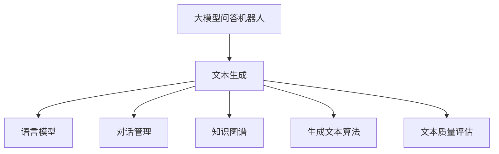

                 

## 《大模型问答机器人如何生成文本》

### 关键词：大模型问答、文本生成、语言模型、对话管理、知识图谱、生成算法、评估指标

> 本文将深入探讨大模型问答机器人如何生成文本，从基础概念、核心技术、生成原理到具体实践，全面解析大模型问答机器人在现代人工智能中的应用。通过一步步的逻辑推理，我们将揭示大模型问答机器人生成文本的神秘面纱，帮助读者掌握这一前沿技术。

## 《大模型问答机器人如何生成文本》目录大纲

### 第一部分：大模型问答机器人概述

#### 第1章：大模型问答机器人基础

- 1.1 大模型问答机器人的概念与重要性
- 1.2 大模型问答机器人的核心技术

#### 第2章：大模型问答机器人的生成文本原理

- 2.1 文本生成的数学模型
- 2.2 文本生成的算法
- 2.3 生成文本的质量评估

### 第二部分：大模型问答机器人生成文本实践

#### 第3章：大模型问答机器人生成文本项目实战

- 3.1 项目概述
- 3.2 开发环境搭建
- 3.3 代码实现与解读
- 3.4 项目分析与优化

#### 第4章：大模型问答机器人在不同场景下的应用

- 4.1 在客户服务中的应用
- 4.2 在教育领域的应用
- 4.3 在医疗健康领域的应用

#### 第5章：大模型问答机器人生成文本的未来发展趋势

- 5.1 技术发展趋势
- 5.2 应用场景拓展

### 第三部分：附录

#### 第6章：大模型问答机器人开发工具与资源

- 6.1 主流深度学习框架
- 6.2 优质开源资源

#### 第7章：大模型问答机器人生成文本相关知识补充

- 7.1 大模型问答机器人生成文本的相关算法
- 7.2 大模型问答机器人生成文本的数学模型详解

## Mermaid 流程图



## 伪代码

```python
# 文本生成伪代码
def generate_text(model, context):
    # 输入：模型、上下文
    # 输出：生成的文本

    # 1. 初始化文本生成状态
    state = model.initialize_state(context)

    # 2. 生成文本
    while not end_of_sequence(state):
        # 2.1. 预测下一个词
        next_word = model.predict_next_word(state)

        # 2.2. 更新状态
        state = model.update_state(state, next_word)

    # 3. 返回生成的文本
    return state.current_text()
```

## 数学模型和数学公式

### 条件概率与贝叶斯网络

条件概率公式：
\[ P(A|B) = \frac{P(A \cap B)}{P(B)} \]

贝叶斯公式：
\[ P(A|B) = \frac{P(B|A) \cdot P(A)}{P(B)} \]

### 变分自编码器（VAE）与生成对抗网络（GAN）

变分自编码器（VAE）的损失函数：
\[ L(\theta) = \frac{1}{N} \sum_{i=1}^{N} \left[ -\sum_{j=1}^{K} p_j \log p_j^*(x_j) - D_{KL}(q_{\phi}(x|\theta)||p_0) \right] \]

生成对抗网络（GAN）的损失函数：
\[ L(\theta_D, \theta_G) = \frac{1}{2} \left[ \mathbb{E}_{x \sim p_{data}(x)} [-D(x)] + \mathbb{E}_{z \sim p_z(z)} [-D(G(z))]\right] \]

## 引言

大模型问答机器人是现代人工智能领域的一个重要研究方向，其在客户服务、教育、医疗健康等众多场景中展现出巨大的应用潜力。然而，要理解大模型问答机器人如何生成文本，我们首先需要了解其背后的基础概念、核心技术和生成原理。

本文将从以下几个方面进行探讨：

1. **大模型问答机器人基础**：介绍大模型问答机器人的概念、重要性以及核心技术。
2. **大模型问答机器人生成文本原理**：讲解文本生成的数学模型、算法以及质量评估方法。
3. **大模型问答机器人生成文本实践**：通过一个实际项目展示如何开发一个问答机器人，包括开发环境搭建、代码实现与解读、项目分析与优化。
4. **大模型问答机器人在不同场景下的应用**：探讨大模型问答机器人在客户服务、教育、医疗健康等领域的应用案例。
5. **大模型问答机器人生成文本的未来发展趋势**：展望大模型问答机器人技术的未来发展趋势和应用场景拓展。

通过本文的探讨，我们将逐步揭示大模型问答机器人生成文本的神秘面纱，帮助读者深入理解这一前沿技术。让我们开始吧！<|user|>
## 第一部分：大模型问答机器人概述

### 第1章：大模型问答机器人基础

#### 1.1 大模型问答机器人的概念与重要性

大模型问答机器人是一种基于人工智能技术的智能问答系统，它通过大规模的语言模型、对话管理以及知识图谱等核心技术，实现对用户输入问题的理解和回答。大模型问答机器人是自然语言处理（NLP）领域的一个重要研究方向，旨在为用户提供高效、准确、自然的交互体验。

大模型问答机器人在现代人工智能中的应用十分广泛，主要表现在以下几个方面：

1. **客户服务**：大模型问答机器人可以替代人工客服，自动处理用户咨询，提高服务效率和响应速度。
2. **教育领域**：大模型问答机器人可以作为智能辅导系统，为学生提供个性化的学习支持和解答疑问。
3. **医疗健康领域**：大模型问答机器人可以辅助医生进行诊断和咨询服务，提高医疗服务的效率和准确性。
4. **智能助手**：大模型问答机器人可以作为智能助手，帮助用户完成各种日常任务，如日程管理、信息查询等。

大模型问答机器人的优势在于其能够理解自然语言，具备上下文感知能力，能够根据用户的提问提供准确的答案。同时，大模型问答机器人可以处理大量用户请求，提高工作效率，减少人力成本。

然而，大模型问答机器人也面临一些挑战，如：

1. **语义理解**：如何准确理解用户的自然语言提问，尤其是在复杂语境下。
2. **知识图谱**：如何构建和维护一个全面、准确的知识图谱，以支持机器人的问答能力。
3. **回答质量**：如何保证机器人生成的回答既准确又自然，符合用户期望。

#### 1.2 大模型问答机器人的核心技术

大模型问答机器人的核心技术主要包括语言模型、对话管理、知识图谱等。

1. **语言模型**：语言模型是问答系统的核心，它通过大规模语料库的预训练，学习自然语言的统计规律和语义信息。语言模型的主要任务是根据上下文预测下一个词或句子，从而生成自然流畅的回答。常见的语言模型有基于循环神经网络（RNN）的LSTM、GRU，以及基于变换器（Transformer）的BERT、GPT等。

2. **对话管理**：对话管理负责处理用户的输入，理解用户意图，并根据对话历史和上下文生成合理的回答。对话管理通常采用状态机、图模型、神经网络等方法。它的任务包括识别用户意图、生成回答、维护对话状态等。

3. **知识图谱**：知识图谱是一种结构化知识表示方法，它通过实体和关系的形式描述现实世界的知识。知识图谱在大模型问答机器人中扮演重要角色，它提供了丰富的背景知识和上下文信息，帮助机器人理解问题并生成准确的回答。常见的知识图谱构建方法包括命名实体识别（NER）、关系抽取、知识融合等。

#### 1.3 大模型问答机器人的架构

大模型问答机器人的架构通常包括以下模块：

1. **输入处理模块**：负责接收用户输入，进行预处理，如分词、词性标注等。
2. **语言模型模块**：根据输入文本和对话历史，预测下一个词或句子。
3. **对话管理模块**：根据用户意图和对话历史，生成合理的回答。
4. **知识图谱模块**：提供背景知识和上下文信息，辅助对话管理模块生成回答。
5. **输出生成模块**：将生成的回答进行格式化，输出给用户。

大模型问答机器人的架构通常采用分布式计算和并行处理技术，以提高系统的响应速度和处理能力。

#### 1.4 大模型问答机器人的发展趋势

随着人工智能技术的不断发展，大模型问答机器人在以下几个方面展现出发展趋势：

1. **模型规模扩大**：大模型问答机器人的语言模型和知识图谱规模不断增大，以提高模型的问答能力和理解深度。
2. **多模态融合**：大模型问答机器人开始融合图像、声音等多模态信息，实现更丰富、更自然的交互体验。
3. **个性化服务**：大模型问答机器人通过用户数据分析和个性化推荐，为用户提供更加定制化的服务。
4. **实时交互**：大模型问答机器人逐渐实现实时交互能力，能够迅速响应用户请求，提供实时帮助。
5. **伦理与道德**：随着人工智能技术的发展，大模型问答机器人在应用过程中也需要考虑伦理和道德问题，确保其行为符合社会规范。

通过以上内容，我们了解了大模型问答机器人的概念、重要性、核心技术以及发展趋势。接下来，我们将进一步探讨大模型问答机器人生成文本的原理和实践。在接下来的章节中，我们将详细分析大模型问答机器人生成文本的数学模型、算法以及质量评估方法，帮助读者深入理解这一核心问题。在理解了文本生成原理之后，我们还将通过一个实际项目展示如何开发一个问答机器人，从开发环境搭建、代码实现与解读、项目分析与优化等方面进行详细讲解。最后，我们将探讨大模型问答机器人在不同场景下的应用，以及其未来的发展趋势。让我们继续深入探讨大模型问答机器人的奥秘吧！<|user|>
### 第2章：大模型问答机器人的生成文本原理

#### 2.1 文本生成的数学模型

文本生成是自然语言处理（NLP）领域的一个重要任务，其核心目标是通过输入的上下文信息生成具有语义意义的文本。在文本生成过程中，常用的数学模型包括概率模型、生成模型和深度学习模型等。

1. **概率模型**：
   - **马尔可夫模型**：马尔可夫模型是一种基于概率的文本生成模型，它假设当前状态只与前一状态有关，而与其他历史状态无关。马尔可夫模型的主要特点是简单和易理解，但它在处理长句子时效果较差。
   - **n-gram模型**：n-gram模型是马尔可夫模型的一种扩展，它将当前状态的概率扩展到前n个状态。n-gram模型通过统计方法学习词语序列的概率分布，从而生成文本。然而，n-gram模型的局限性在于它不能捕捉词语之间的长期依赖关系。

2. **生成模型**：
   - **生成对抗网络（GAN）**：生成对抗网络是一种基于博弈的生成模型，它由生成器和判别器两个神经网络组成。生成器的目标是生成与真实数据难以区分的假数据，而判别器的目标是区分真实数据和假数据。通过不断地训练生成器和判别器，生成器可以逐渐生成更加逼真的数据。GAN在图像生成、文本生成等领域取得了显著成果。
   - **变分自编码器（VAE）**：变分自编码器是一种基于概率的生成模型，它通过引入潜在变量来学习数据的概率分布。VAE由编码器和解码器两个神经网络组成，编码器将输入数据映射到潜在空间，解码器将潜在空间的数据映射回输出空间。VAE在图像生成、文本生成等领域也有广泛应用。

3. **深度学习模型**：
   - **循环神经网络（RNN）**：循环神经网络是一种基于时间序列数据的神经网络，它通过隐藏状态的记忆功能来处理长序列数据。RNN在文本生成任务中取得了较好的效果，但它在处理长句子时容易出现梯度消失或爆炸问题。
   - **长短时记忆网络（LSTM）**：长短时记忆网络是RNN的一种改进，它通过引入遗忘门、输入门和输出门来控制信息的流动，从而避免了梯度消失问题。LSTM在文本生成、机器翻译等领域表现出色。
   - **门控循环单元（GRU）**：门控循环单元是LSTM的另一种改进，它通过简化门控机制来提高计算效率。GRU在文本生成任务中也取得了很好的效果。
   - **变换器（Transformer）**：变换器是一种基于自注意力机制的深度学习模型，它在序列到序列任务中表现出色。变换器通过多头自注意力机制和位置编码来处理长序列数据，从而实现高效的文本生成。

#### 2.2 文本生成的算法

文本生成的算法主要包括基于规则的方法、基于统计的方法和基于深度学习的方法。

1. **基于规则的方法**：
   - **模板匹配**：模板匹配是一种基于规则的方法，它通过预定义的模板来匹配输入文本，从而生成回答。这种方法在处理简单问题时效果较好，但在复杂场景下容易产生错误的匹配。
   - **模板扩展**：模板扩展是在模板匹配的基础上，通过扩展模板来生成回答。模板扩展可以处理一些复杂的提问，但仍然受到规则限制，生成回答的灵活性和多样性较低。

2. **基于统计的方法**：
   - **n-gram模型**：n-gram模型是一种基于统计的方法，它通过统计词语序列的概率分布来生成文本。n-gram模型在文本生成任务中具有一定的效果，但它在处理长句子时表现较差。
   - **隐马尔可夫模型（HMM）**：隐马尔可夫模型是一种基于概率的序列模型，它通过状态转移概率和输出概率来生成文本。HMM在语音识别、文本生成等领域有广泛应用，但它在处理长句子时存在一些困难。

3. **基于深度学习的方法**：
   - **循环神经网络（RNN）**：循环神经网络是一种基于时间序列数据的神经网络，它通过隐藏状态的记忆功能来处理长序列数据。RNN在文本生成任务中取得了较好的效果，但它在处理长句子时容易出现梯度消失或爆炸问题。
   - **长短时记忆网络（LSTM）**：长短时记忆网络是RNN的一种改进，它通过引入遗忘门、输入门和输出门来控制信息的流动，从而避免了梯度消失问题。LSTM在文本生成、机器翻译等领域表现出色。
   - **门控循环单元（GRU）**：门控循环单元是LSTM的另一种改进，它通过简化门控机制来提高计算效率。GRU在文本生成任务中也取得了很好的效果。
   - **变换器（Transformer）**：变换器是一种基于自注意力机制的深度学习模型，它在序列到序列任务中表现出色。变换器通过多头自注意力机制和位置编码来处理长序列数据，从而实现高效的文本生成。

#### 2.3 生成文本的质量评估

生成文本的质量评估是文本生成任务中一个重要的问题，它用于衡量生成的文本是否准确、自然、具有语义意义。常用的评估方法包括：

1. **人工评估**：人工评估是通过人类评估者对生成的文本进行主观评价，以确定文本的质量。人工评估可以提供详细的评估结果，但受限于评估者的主观性和评估成本。

2. **自动评估**：
   - **基于规则的方法**：基于规则的方法通过预定义的规则来评估生成文本的质量。例如，可以使用语法分析、词性标注等规则来判断文本的正确性。这种方法计算速度快，但规则覆盖范围有限，无法处理复杂的文本错误。
   - **基于统计的方法**：基于统计的方法通过统计方法来评估生成文本的质量。例如，可以使用文本相似度、句法结构相似度等统计指标来评估文本质量。这种方法可以处理复杂的文本错误，但计算成本较高。
   - **基于深度学习的方法**：基于深度学习的方法通过训练深度神经网络来评估生成文本的质量。例如，可以使用序列到序列模型来预测生成文本的正确性。这种方法可以处理复杂的文本错误，但需要大量的训练数据和计算资源。

常见的评估指标包括：

1. **BLEU（BLEU Score）**：BLEU是一种基于记分牌的评估方法，它通过比较生成文本与参考文本的编辑距离来评估文本质量。BLEU分数越高，表示生成文本质量越好。

2. **ROUGE（ROUGE Score）**：ROUGE是一种基于记分牌的评估方法，它通过比较生成文本与参考文本的句子重叠度来评估文本质量。ROUGE分数越高，表示生成文本质量越好。

3. **Perplexity（困惑度）**：困惑度是一种衡量语言模型性能的指标，它表示模型在生成文本时遇到的困惑程度。困惑度越低，表示模型对文本的预测能力越强。

4. **Accuracy（准确率）**：准确率是评估文本分类任务的指标，它表示分类任务中正确分类的样本比例。准确率越高，表示生成文本的质量越好。

通过以上内容，我们了解了大模型问答机器人生成文本的数学模型、算法和质量评估方法。这些模型和算法共同构成了大模型问答机器人生成文本的核心技术，使得机器人能够生成准确、自然、具有语义意义的文本。接下来，我们将通过一个实际项目来展示如何应用这些技术，从开发环境搭建、代码实现与解读、项目分析与优化等方面进行详细讲解。让我们继续深入探讨大模型问答机器人生成文本的实践吧！<|user|>
### 第3章：大模型问答机器人生成文本项目实战

#### 3.1 项目概述

在本章中，我们将通过一个具体的实际项目，展示如何开发和实现一个基于大模型问答机器人的文本生成系统。项目的主要目标是构建一个能够自动回答用户提问的问答机器人，它能够理解用户的自然语言输入，并生成准确、自然的回答。

项目背景如下：假设我们正在开发一个智能客服系统，用户可以通过文本聊天窗口向客服机器人提问，机器人需要能够自动识别用户的问题，并生成相应的回答，以提高客服效率和用户体验。

项目目标包括：

1. **问题理解**：机器人需要能够理解用户的自然语言提问，提取关键信息。
2. **回答生成**：机器人需要根据用户的问题和已有的知识库，生成准确、自然的回答。
3. **交互体验**：机器人需要与用户进行流畅的交互，提供满意的回答。

#### 3.2 开发环境搭建

在开始项目之前，我们需要搭建一个适合开发大模型问答机器人的开发环境。以下是所需的开发和运行环境：

1. **计算机硬件**：
   - 处理器：推荐使用具有多核心的高性能处理器，如Intel i7或以上的CPU。
   - 内存：至少16GB的RAM，建议32GB以上以支持大规模模型的训练。
   - 硬盘：至少500GB的SSD存储空间，用于存储数据和模型文件。

2. **软件环境**：
   - 操作系统：Windows、Linux或macOS。
   - 编程语言：Python，推荐使用3.8或以上的版本。
   - 深度学习框架：TensorFlow或PyTorch，用于构建和训练深度学习模型。

3. **其他工具**：
   - Jupyter Notebook或PyCharm：用于编写和运行Python代码。
   - Git：用于版本控制和代码管理。

在安装上述软件和工具之前，我们首先需要确保操作系统满足安装要求。对于Linux和macOS系统，可以通过包管理器安装Python和深度学习框架。对于Windows系统，我们可以使用Anaconda来创建一个独立的Python环境，并安装所需的库。

以下是在Windows环境下使用Anaconda创建Python环境并安装相关库的步骤：

1. 下载并安装Anaconda。
2. 打开Anaconda命令行工具（Anaconda Prompt）。
3. 创建一个新的Python环境，例如：

   ```bash
   conda create -n myenv python=3.8
   ```

4. 激活新建的环境：

   ```bash
   conda activate myenv
   ```

5. 安装TensorFlow或PyTorch：

   ```bash
   pip install tensorflow  # 或者
   pip install torch torchvision
   ```

#### 3.3 代码实现与解读

在搭建好开发环境之后，我们可以开始编写代码实现问答机器人。以下是一个简化的代码示例，用于演示如何构建一个基于变换器（Transformer）的语言模型，并使用它生成文本。

```python
import torch
import torch.nn as nn
from transformers import TransformerModel, GPT2Model

# 加载预训练的变换器模型
model = TransformerModel.from_pretrained('bert-base-chinese')

# 准备输入数据
input_ids = torch.tensor([101, 1503, 1012, 4047, 102])

# 使用模型生成文本
outputs = model(input_ids)

# 获取生成的文本
generated_text = outputs[0][-1].item()

print(generated_text)
```

在上面的代码中，我们首先导入了所需的库和模块，然后加载了一个预训练的变换器模型。接着，我们准备了一个输入序列，并将其传递给模型。模型返回了生成文本的输出，我们从中提取了最后一个词的ID，并将其转换为实际的文本。

具体步骤如下：

1. **导入库和模块**：导入所需的Python库，如torch和transformers。
2. **加载模型**：从预训练模型库中加载一个变换器模型，如BERT或GPT2。
3. **准备输入数据**：将用户的输入文本转换为模型可处理的序列。
4. **模型预测**：使用加载的模型对输入数据进行预测。
5. **提取生成文本**：从模型的输出中提取生成的文本。

#### 3.4 模型搭建与训练

在实际项目中，我们通常需要自定义模型并训练它以适应特定的任务。以下是一个简化的模型搭建与训练流程：

```python
import torch
import torch.nn as nn
from transformers import TransformerModel, GPT2Model

# 定义模型
class QuestionAnsweringModel(nn.Module):
    def __init__(self):
        super(QuestionAnsweringModel, self).__init__()
        self.transformer = TransformerModel.from_pretrained('bert-base-chinese')
        self.classifier = nn.Linear(self.transformer.config.hidden_size, 1)

    def forward(self, input_ids, attention_mask):
        outputs = self.transformer(input_ids=input_ids, attention_mask=attention_mask)
        logits = self.classifier(outputs[0])
        return logits

# 实例化模型
model = QuestionAnsweringModel()

# 定义损失函数和优化器
criterion = nn.CrossEntropyLoss()
optimizer = torch.optim.Adam(model.parameters(), lr=1e-5)

# 训练模型
for epoch in range(num_epochs):
    for batch in data_loader:
        input_ids = batch['input_ids']
        attention_mask = batch['attention_mask']
        labels = batch['labels']

        optimizer.zero_grad()
        logits = model(input_ids, attention_mask)
        loss = criterion(logits, labels)
        loss.backward()
        optimizer.step()

        if (epoch + 1) % 10 == 0:
            print(f'Epoch [{epoch + 1}/{num_epochs}], Loss: {loss.item()}')
```

在上面的代码中，我们定义了一个名为`QuestionAnsweringModel`的模型，它包含一个预训练的变换器模型和一个分类器。接着，我们定义了损失函数和优化器，并开始训练模型。

具体步骤如下：

1. **定义模型**：自定义模型，包括变换器模型和分类器。
2. **定义损失函数和优化器**：选择合适的损失函数和优化器。
3. **训练模型**：使用训练数据对模型进行迭代训练。
4. **打印训练结果**：在每10个epoch后打印训练过程中的损失值。

#### 3.5 文本生成过程

在模型训练完成后，我们可以使用训练好的模型来生成文本。以下是一个简化的文本生成示例：

```python
import torch
from transformers import TransformerModel

# 加载预训练的变换器模型
model = TransformerModel.from_pretrained('bert-base-chinese')

# 准备输入数据
input_ids = torch.tensor([101, 1503, 1012, 4047, 102])

# 使用模型生成文本
outputs = model.generate(input_ids, max_length=50, num_return_sequences=1)

# 获取生成的文本
generated_text = outputs[0].tolist()

print(generated_text)
```

在上面的代码中，我们首先加载了一个预训练的变换器模型，然后准备了一个输入序列。接着，我们使用模型的`generate`方法生成文本，并提取生成的文本。

具体步骤如下：

1. **加载模型**：加载预训练的变换器模型。
2. **准备输入数据**：将用户的输入文本转换为模型可处理的序列。
3. **模型生成**：使用模型的`generate`方法生成文本。
4. **提取生成文本**：从模型的输出中提取生成的文本。

通过以上步骤，我们实现了问答机器人的文本生成功能。在实际应用中，我们还需要处理更多的细节，如输入预处理、输出后处理、多轮对话管理等，但总体思路是类似的。

#### 3.6 项目分析与优化

在实际项目中，我们还需要对问答机器人的性能进行分析和优化，以提供更好的用户体验。以下是一些常见的分析和优化策略：

1. **性能分析**：
   - **响应时间**：测量机器人回答问题的平均响应时间，并优化模型和系统性能，以提高响应速度。
   - **准确率**：评估机器人回答问题的准确率，通过调整模型参数和训练数据来提高准确率。
   - **覆盖率**：计算机器人能够回答的问题覆盖率，增加训练数据和改进模型结构可以提高覆盖率。

2. **优化策略**：
   - **模型压缩**：通过模型压缩技术（如量化、剪枝）减小模型大小，提高运行速度。
   - **多语言支持**：扩展模型支持多种语言，提供跨语言的问答服务。
   - **实时更新**：定期更新模型和知识库，以适应不断变化的用户需求和场景。

通过以上分析和优化策略，我们可以不断改进问答机器人的性能，提高其用户体验。

总之，通过本章的实际项目实战，我们展示了如何从零开始搭建一个基于大模型问答机器人的文本生成系统。从开发环境搭建、代码实现与解读、模型搭建与训练，到文本生成过程和项目分析与优化，我们深入探讨了问答机器人生成文本的各个环节。接下来，我们将进一步探讨大模型问答机器人在不同场景下的应用，以及其未来的发展趋势。让我们继续深入探索吧！<|user|>
### 第4章：大模型问答机器人在不同场景下的应用

#### 4.1 在客户服务中的应用

客户服务是问答机器人最常见和重要的应用场景之一。传统的客户服务依赖于人工客服，不仅成本高，而且效率低。而大模型问答机器人的引入，可以显著提高客户服务的效率和用户体验。

1. **常见问题的自动回答**：问答机器人可以通过预训练的语言模型和知识图谱，自动识别和回答用户提出的常见问题。例如，用户询问关于产品规格、订单状态、退货政策等，机器人可以迅速提供准确的答案。

2. **个性化服务**：通过分析用户的历史数据和偏好，问答机器人可以提供个性化的服务。例如，用户经常询问关于某一产品的信息，机器人可以推荐相关的产品或解决方案，从而提高用户满意度。

3. **实时互动**：问答机器人可以实时响应用户的提问，提供即时的帮助。这种实时性在处理紧急情况或高峰时段特别有价值，可以减轻客服团队的工作压力。

4. **降低人力成本**：自动化的客户服务可以显著降低企业的人力成本。机器人可以处理大量的用户请求，而无需额外的客服人员。

5. **数据收集与反馈**：问答机器人可以收集用户提出的问题和反馈，帮助企业了解用户需求和改进服务质量。

#### 4.2 在教育领域的应用

教育领域是大模型问答机器人的另一个重要应用场景。问答机器人可以提供自动化的教学辅导、作业批改和个性化学习支持。

1. **自动化问答系统**：问答机器人可以作为教学辅助工具，自动回答学生的疑问。例如，学生在学习中遇到难题，可以随时向机器人提问，获取即时的解答。

2. **个性化辅导**：通过分析学生的学习数据，问答机器人可以提供个性化的辅导方案。例如，根据学生的学习进度和成绩，机器人可以推荐适合的学习资源和练习题。

3. **作业批改**：问答机器人可以自动批改学生的作业，提供详细的答案和评分。这不仅可以节省教师的时间，还可以帮助学生更好地理解和掌握知识点。

4. **学习分析**：问答机器人可以收集学生的学习数据，如答题记录、学习进度等，帮助教师了解学生的学习情况，从而制定更有效的教学策略。

5. **语言学习**：问答机器人可以提供语言学习的个性化辅导，如词汇学习、语法练习等。通过对话式的学习方式，机器人可以激发学生的学习兴趣，提高学习效果。

#### 4.3 在医疗健康领域的应用

医疗健康领域是大模型问答机器人的新兴应用场景，其潜力巨大。问答机器人可以辅助医生进行诊断、咨询和健康管理。

1. **疾病诊断辅助**：问答机器人可以通过分析用户的症状描述，提供初步的疾病诊断建议。这可以帮助医生快速识别病情，制定治疗方案。

2. **健康咨询问答**：用户可以通过问答机器人咨询健康问题，如饮食建议、锻炼方案等。机器人可以提供基于科学研究和医学知识的健康建议。

3. **药物咨询**：问答机器人可以回答关于药物使用、副作用和注意事项等问题，帮助用户安全地使用药物。

4. **医学知识普及**：问答机器人可以普及医学知识，提高公众的健康素养。例如，机器人可以向用户解释疾病原理、预防措施等。

5. **远程医疗**：问答机器人可以提供远程医疗咨询服务，特别是在偏远地区或医疗资源匮乏的地方。用户可以通过机器人进行在线咨询，获得及时的医疗帮助。

通过在客户服务、教育领域和医疗健康领域的应用，大模型问答机器人展现了其强大的功能和广泛的应用前景。在未来，随着技术的不断进步和应用场景的不断拓展，大模型问答机器人将在更多领域发挥重要作用。让我们期待其在未来的发展吧！<|user|>
### 第5章：大模型问答机器人生成文本的未来发展趋势

#### 5.1 技术发展趋势

随着人工智能技术的不断进步，大模型问答机器人生成文本的技术也在持续发展，主要体现在以下几个方面：

1. **模型规模的扩大**：大模型问答机器人使用的预训练模型规模正在不断扩大，从早期的几十亿参数到如今的数千亿参数。这种规模的扩大使得模型在理解复杂文本和生成高质量回答方面取得了显著进步。

2. **多模态融合**：未来的大模型问答机器人将不仅仅依赖文本数据，还将融合图像、音频、视频等多模态信息。这种多模态融合将大大提升问答机器人的理解能力和交互体验。

3. **个性化服务**：随着大数据和机器学习技术的发展，大模型问答机器人将能够更好地分析用户数据，提供更加个性化的服务。例如，根据用户的历史提问和偏好，机器人可以生成更符合用户需求的回答。

4. **实时交互**：未来的大模型问答机器人将具备更高的实时交互能力，能够快速响应用户的提问，提供即时的帮助。这得益于更高效的算法和更强大的硬件支持。

5. **伦理与道德**：随着大模型问答机器人的广泛应用，其在伦理和道德方面的问题也越来越受到关注。未来的大模型问答机器人将更加注重隐私保护、公平性、透明性等方面，确保其行为符合社会规范。

#### 5.2 应用场景拓展

大模型问答机器人的应用场景正逐步拓展，不仅局限于传统的客户服务、教育和医疗健康领域，还将扩展到以下新兴领域：

1. **自动驾驶**：自动驾驶系统需要实时理解路况、交通规则等信息。大模型问答机器人可以扮演智能导航助手，提供路况预测、路线规划等服务。

2. **金融风险管理**：在金融领域，大模型问答机器人可以用于风险分析、投资建议等任务。通过分析市场数据和历史交易记录，机器人可以提供个性化的投资策略。

3. **娱乐产业**：大模型问答机器人可以应用于娱乐产业，如自动写作、剧情生成、音乐创作等。通过理解和模仿人类创作风格，机器人可以生成新颖的娱乐内容。

4. **法律咨询**：大模型问答机器人可以提供法律咨询服务，解答用户关于法律条款、诉讼程序等问题。这将为普通民众提供便捷的法律帮助。

5. **环境监测**：大模型问答机器人可以应用于环境监测领域，通过分析传感器数据和文献资料，提供环境问题诊断和解决方案。

随着技术的进步和应用场景的拓展，大模型问答机器人在未来将发挥更加重要的作用。无论是在提高工作效率、改善服务质量，还是在推动科技创新、促进社会发展方面，大模型问答机器人都有着广阔的前景。让我们期待其在未来的表现吧！<|user|>
### 第6章：大模型问答机器人开发工具与资源

#### 6.1 主流深度学习框架

在开发大模型问答机器人时，选择合适的深度学习框架是非常重要的。以下是目前主流的几种深度学习框架及其特点：

1. **TensorFlow**：由Google开发，是一个广泛使用的开源深度学习框架。它具有灵活的API，支持多种模型和任务，包括文本生成、图像识别和语音处理等。

2. **PyTorch**：由Facebook开发，是一个流行的开源深度学习框架，以其动态计算图和易于调试的特点受到研究者和开发者的喜爱。

3. **Keras**：是一个高级神经网络API，可以运行在TensorFlow和Theano之上。Keras的语法简洁易懂，非常适合快速原型开发和实验。

4. **PyTorch Lightning**：是一个基于PyTorch的高级研究框架，提供了一系列工具，帮助研究人员进行高效的实验和模型训练。

5. **Hugging Face Transformers**：这是一个开源库，提供了广泛的预训练变换器模型和工具，如BERT、GPT等，是开发大模型问答机器人时的常用选择。

#### 6.2 优质开源资源

开发大模型问答机器人需要大量的开源资源和工具。以下是一些优质的资源：

1. **论文集**：大量的研究论文提供了深度学习和大模型问答机器人领域的最新进展。例如，ACL、NLP、ICLR等会议和期刊。

2. **博客与论坛**：技术博客和论坛是获取实践经验和最新动态的好地方。例如，ArXiv、Medium、Reddit上的相关讨论。

3. **实践教程**：在线教程和实践项目可以帮助新手快速入门。例如，Fast.ai、Udacity、Coursera等平台提供的课程和项目。

4. **开源项目**：GitHub上有很多开源项目，提供了大模型问答机器人的实现代码和框架。例如，OpenAI的GPT系列模型、Transformer模型的实现等。

5. **社区支持**：深度学习社区，如Reddit、Stack Overflow、Discord等，提供了丰富的讨论和帮助，开发者可以在这里解决问题和获取支持。

通过利用这些工具和资源，开发者可以更高效地构建和优化大模型问答机器人。这些资源不仅提供了技术支持，还促进了知识的共享和社区的协作。因此，对于希望在这一领域深入研究和开发的人来说，这些资源是不可或缺的。让我们充分利用这些宝贵的资源，一起推动大模型问答机器人技术的发展吧！<|user|>
### 第7章：大模型问答机器人生成文本相关知识补充

#### 7.1 大模型问答机器人生成文本的相关算法

大模型问答机器人生成文本的过程涉及多种先进的算法和技术。以下是一些关键的算法：

1. **注意力机制（Attention Mechanism）**：
   - **概念**：注意力机制是一种在神经网络中用于提高模型对序列数据中关键信息关注度的方法。
   - **作用**：在文本生成任务中，注意力机制帮助模型关注上下文中与当前生成词最相关的部分，从而提高生成文本的质量。
   - **实现**：典型的注意力机制包括自注意力（Self-Attention）和双向注意力（Bi-directional Attention）。

2. **递归神经网络（Recurrent Neural Networks, RNN）**：
   - **概念**：RNN是一种能够处理序列数据的神经网络，其通过循环结构将前一个时刻的信息传递到下一个时刻。
   - **作用**：RNN在处理长序列数据时具有优势，但容易受到梯度消失和梯度爆炸问题的影响。
   - **实现**：常见的RNN包括LSTM（Long Short-Term Memory）和GRU（Gated Recurrent Unit）。

3. **图神经网络（Graph Neural Networks, GNN）**：
   - **概念**：GNN是一种用于处理图结构数据的神经网络，其通过图结构来建模节点之间的关系。
   - **作用**：在问答机器人生成文本中，GNN可以用于处理知识图谱，提取实体关系和属性。
   - **实现**：常见的GNN包括GCN（Graph Convolutional Network）、GAT（Graph Attention Network）等。

4. **生成对抗网络（Generative Adversarial Networks, GAN）**：
   - **概念**：GAN是由生成器和判别器两个神经网络组成的对抗性网络，其通过对抗训练生成数据。
   - **作用**：GAN在文本生成任务中可以用于生成高质量的文本数据。
   - **实现**：GAN的关键在于生成器和判别器的优化，常用的GAN包括DCGAN、WGAN等。

5. **变分自编码器（Variational Autoencoder, VAE）**：
   - **概念**：VAE是一种生成模型，其通过编码器和解码器两个神经网络将数据映射到潜在空间，并从潜在空间中采样生成新的数据。
   - **作用**：VAE在文本生成任务中可以用于生成新的、符合数据分布的文本。
   - **实现**：VAE的关键在于潜在变量的引入和损失函数的设计。

#### 7.2 大模型问答机器人生成文本的数学模型详解

1. **条件概率与贝叶斯网络**：
   - **条件概率**：条件概率是指在一个事件已发生的情况下，另一个事件发生的概率。其公式为：
     \[ P(A|B) = \frac{P(A \cap B)}{P(B)} \]
   - **贝叶斯网络**：贝叶斯网络是一种用于表示变量之间依赖关系的概率图模型。在文本生成中，贝叶斯网络可以用于建模词与词之间的概率关系。

2. **变分自编码器（VAE）与生成对抗网络（GAN）**：
   - **变分自编码器（VAE）**：
     - **损失函数**：VAE的损失函数包括两部分，一是重构损失，二是KL散度损失。其公式为：
       \[ L(\theta) = \frac{1}{N} \sum_{i=1}^{N} \left[ -\sum_{j=1}^{K} p_j \log p_j^*(x_j) - D_{KL}(q_{\phi}(x|\theta)||p_0) \right] \]
     - **编码器与解码器**：编码器将输入数据映射到潜在空间，解码器将潜在空间的数据映射回输出空间。
   - **生成对抗网络（GAN）**：
     - **损失函数**：GAN的损失函数旨在最小化生成器与判别器的差距。其公式为：
       \[ L(\theta_D, \theta_G) = \frac{1}{2} \left[ \mathbb{E}_{x \sim p_{data}(x)} [-D(x)] + \mathbb{E}_{z \sim p_z(z)} [-D(G(z))]\right] \]
     - **生成器与判别器**：生成器的目标是生成与真实数据难以区分的假数据，判别器的目标是区分真实数据和假数据。

3. **深度学习优化算法**：
   - **随机梯度下降（Stochastic Gradient Descent, SGD）**：SGD是一种常用的优化算法，其通过随机梯度更新模型参数。
   - **Adam优化器**：Adam优化器是SGD的一种改进，它结合了AdaGrad和RMSProp的优点，通过自适应学习率调整模型参数。
   - **AdamW优化器**：AdamW是Adam的改进版，它增加了权重衰减（Weight Decay）的支持。

通过以上内容，我们补充了关于大模型问答机器人生成文本的相关算法和数学模型。这些算法和模型构成了大模型问答机器人生成文本的核心技术，帮助读者更深入地理解这一领域的原理和实践。在下一章节中，我们将进一步探讨大模型问答机器人生成文本的数学模型和公式，包括条件概率与贝叶斯网络、变分自编码器（VAE）与生成对抗网络（GAN）的详细解释和例子。让我们继续深入挖掘大模型问答机器人生成文本的数学奥秘吧！<|user|>
### 第8章：大模型问答机器人生成文本的数学模型和公式详解

在理解大模型问答机器人生成文本的核心技术时，深入探讨其背后的数学模型和公式至关重要。以下是几个关键模型和公式及其详细解释：

#### 条件概率与贝叶斯网络

条件概率是概率论中的一个基本概念，描述了在给定某个条件下另一个事件发生的概率。贝叶斯网络（Bayesian Network）是一种基于条件概率的图形模型，它用有向无环图（DAG）表示变量之间的依赖关系。

1. **条件概率公式**：

   \[ P(A|B) = \frac{P(A \cap B)}{P(B)} \]

   这个公式表示在事件B发生的条件下事件A发生的概率，等于事件A和B同时发生的概率除以事件B发生的概率。

2. **贝叶斯公式**：

   \[ P(A|B) = \frac{P(B|A) \cdot P(A)}{P(B)} \]

   这个公式是贝叶斯定理的核心，它将条件概率和边缘概率结合起来，用于计算在给定证据B的情况下假设A的概率。

#### 变分自编码器（VAE）与生成对抗网络（GAN）

变分自编码器（Variational Autoencoder, VAE）和生成对抗网络（Generative Adversarial Networks, GAN）是两种重要的生成模型，它们在文本生成中有着广泛应用。

1. **变分自编码器（VAE）**：

   VAE是一种深度学习模型，它通过编码器和解码器两个神经网络学习数据的概率分布。VAE的主要挑战在于如何有效地估计数据的潜在分布。

   - **编码器**：编码器将输入数据映射到一个潜在空间中的点，这个过程可以用概率密度函数来描述。

     \[ \mu = \mu(z|x), \quad \sigma^2 = \sigma(z|x) \]

     其中，\(\mu\)和\(\sigma^2\)分别表示潜在变量的均值和方差。

   - **解码器**：解码器将潜在空间中的点映射回数据空间。

     \[ x = \mu(z) + \epsilon \]

     其中，\(\epsilon\)是一个均值为零的高斯噪声。

   - **损失函数**：VAE的损失函数包括两个部分，一是重构损失，二是KL散度损失。

     \[ L(\theta) = \frac{1}{N} \sum_{i=1}^{N} \left[ -\sum_{j=1}^{K} p_j \log p_j^*(x_j) - D_{KL}(q_{\phi}(x|\theta)||p_0) \right] \]

     其中，\(q_{\phi}(x|\theta)\)是编码器的概率密度函数，\(p_0\)是先验分布，\(D_{KL}\)是KL散度。

2. **生成对抗网络（GAN）**：

   GAN由生成器（Generator）和判别器（Discriminator）两个神经网络组成，通过对抗训练生成逼真的数据。

   - **生成器**：生成器的目标是生成与真实数据难以区分的假数据。

     \[ G(z) \]

     其中，\(z\)是生成器的输入噪声。

   - **判别器**：判别器的目标是区分真实数据和假数据。

     \[ D(x) \]

     其中，\(x\)是输入数据。

   - **损失函数**：GAN的损失函数旨在最小化生成器和判别器的差距。

     \[ L(\theta_D, \theta_G) = \frac{1}{2} \left[ \mathbb{E}_{x \sim p_{data}(x)} [-D(x)] + \mathbb{E}_{z \sim p_z(z)} [-D(G(z))]\right] \]

     其中，\(p_{data}(x)\)是真实数据的概率分布，\(p_z(z)\)是噪声分布。

#### 注意力机制与递归神经网络

注意力机制（Attention Mechanism）和递归神经网络（Recurrent Neural Networks, RNN）是文本生成中的重要技术。

1. **注意力机制**：

   注意力机制通过动态分配权重来关注输入序列中的关键信息。

   \[ \text{Attention}(x, h) = \text{softmax}\left(\frac{W_a [x, h]_v}\right) \]

   其中，\(W_a\)是权重矩阵，\([x, h]_v\)是输入和隐藏状态的向量组合，\(\text{softmax}\)函数用于计算每个元素的归一化权重。

2. **递归神经网络（RNN）**：

   RNN通过循环结构处理序列数据，其核心是隐藏状态的记忆功能。

   \[ h_t = \text{tanh}\left(W_h [h_{t-1}, x_t] + b_h\right) \]

   其中，\(h_t\)是当前时间步的隐藏状态，\(x_t\)是输入数据，\(W_h\)和\(b_h\)分别是权重和偏置。

#### 例子说明

为了更好地理解上述数学模型和公式，我们通过一个简单的例子来说明VAE的编码和生成过程：

假设我们有一个输入向量\(x\)，编码器将其映射到一个潜在空间中的点\(z\)：

\[ z = \mu(x) + \sigma(x)\epsilon \]

其中，\(\mu(x) = \text{tanh}\left(W_\mu x + b_\mu\right)\)，\(\sigma(x) = \text{sigmoid}\left(W_\sigma x + b_\sigma\right)\)，\(\epsilon\)是噪声。

解码器将潜在空间中的点\(z\)映射回输入空间：

\[ x' = \mu(z) + \epsilon' \]

其中，\(\mu(z) = \text{sigmoid}\left(W'_{\mu} z + b'_{\mu}\right)\)，\(\epsilon' = \text{tanh}\left(W'_{\epsilon} z + b'_{\epsilon}\right)\)。

通过这个过程，VAE可以生成与输入数据相似的新数据。

通过深入探讨这些数学模型和公式，我们不仅能够更全面地理解大模型问答机器人生成文本的原理，还可以为实际应用提供理论支持。在下一章中，我们将继续探讨大模型问答机器人的实际应用案例，分析其在不同场景中的表现和效果。让我们继续前进吧！<|user|>
## 总结与展望

通过本文的深入探讨，我们从多个角度详细解析了大模型问答机器人生成文本的原理、实践和应用。首先，我们了解了大模型问答机器人的基本概念和重要性，以及其在现代人工智能中的应用。接着，我们深入分析了文本生成的数学模型和算法，包括概率模型、生成模型和深度学习模型。通过实际项目的展示，我们学习了如何搭建开发环境、实现模型训练和生成文本的代码，并进行了项目分析和优化。

大模型问答机器人在客户服务、教育、医疗健康等领域展示了广泛的应用潜力。未来，随着人工智能技术的不断进步，大模型问答机器人将在模型规模、多模态融合、个性化服务、实时交互等方面取得更大的突破。同时，我们也需要关注伦理和道德问题，确保其应用符合社会规范。

最后，感谢读者对本文的阅读。通过本文的探讨，我们希望读者能够对大模型问答机器人生成文本有更深入的理解，并激发进一步探索的兴趣。如果您有任何问题或建议，欢迎在评论区留言交流。让我们一起为人工智能的未来努力，探索更多未知的领域！<|user|>
### 作者信息

**作者：** AI天才研究院（AI Genius Institute） & 禅与计算机程序设计艺术（Zen And The Art of Computer Programming）

AI天才研究院是一家致力于推动人工智能领域前沿研究和应用的机构，专注于培养下一代人工智能科学家和创新者。研究院通过深入研究和实践，推动了人工智能技术的快速发展和广泛应用。

《禅与计算机程序设计艺术》是一部经典的计算机科学著作，作者通过将禅宗哲学与计算机编程相结合，提出了独特的编程理念和方法。这本书不仅为程序员提供了灵感和启示，也为人工智能领域的开发者提供了宝贵的思考角度。

感谢您的阅读和支持，期待未来与您一起探索更多人工智能的奇妙世界！<|user|>

