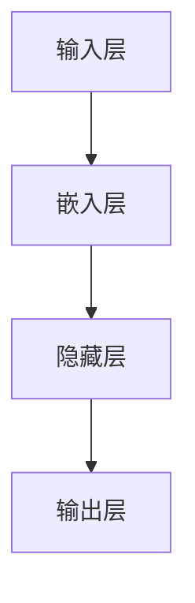

                 

# 大语言模型：原理与代码实例讲解

> **关键词：** 大语言模型、Transformer、预训练、微调、深度学习、编码器、解码器、自注意力机制、数学模型、项目实战、代码实例。

> **摘要：** 本文将深入探讨大语言模型的原理，包括其核心概念、技术架构、算法原理，以及数学基础。此外，还将通过一个实际项目实例，详细讲解如何搭建和训练大语言模型，并分析其性能和优化策略。

## 目录大纲

## 第一部分：核心概念与联系

## 第1章：大语言模型概述

### 1.1 大语言模型的核心概念

#### 1.1.1 什么是大语言模型

大语言模型（Large Language Model）是一种基于深度神经网络的自然语言处理模型，通过学习大量的文本数据，模型能够理解和生成自然语言。其核心概念可以概括为：

$$
\text{大语言模型（Large Language Model）} = \text{深度神经网络} + \text{大规模训练数据集} + \text{优化算法}
$$

### 1.2 大语言模型的技术架构

大语言模型通常由多个层次组成，包括输入层、嵌入层、隐藏层和输出层。以下是一个简单的 Mermaid 流程图，展示了大语言模型的基本架构：



### 1.3 大语言模型的发展历程

大语言模型的发展历程可以从朴素模型（如 Bag-of-Words、n-gram 模型）开始，逐步发展到现代的 Transformer、BERT 和 GPT 模型。以下是这些模型的发展历程：

$$
\text{朴素模型} \rightarrow \text{RNN / LSTM} \rightarrow \text{Transformer} \rightarrow \text{BERT / GPT}
$$

## 第二部分：核心算法原理讲解

## 第2章：核心算法原理讲解

### 2.1 自注意力机制（Self-Attention）

自注意力机制是 Transformer 模型中的一个关键组件，它允许模型在不同的输入序列位置之间建立关联。以下是一个简单的自注意力机制的伪代码：

```python
def self_attention(Q, K, V, mask=None):
    # 计算Q和K的点积，得到注意力权重
    attention_weights = Q @ K.T / sqrt(dim)
    if mask is not None:
        attention_weights = attention_weights + mask
    # 对注意力权重进行softmax处理
    attention_scores = softmax(attention_weights)
    # 计算V的加权求和
    output = attention_scores @ V
    return output
```

### 2.2 编码器与解码器架构（Encoder-Decoder Architecture）

编码器（Encoder）和解码器（Decoder）架构是 Transformer 模型的核心组成部分。以下是一个简单的编码器与解码器架构的伪代码：

```python
def encoder(input_sequence, hidden_size):
    # 初始化编码器模型
    # 对输入序列进行嵌入
    # 通过多层神经网络进行处理
    # 返回编码器的隐藏状态
    return hidden_state

def decoder(input_sequence, hidden_state, target_sequence, hidden_size):
    # 初始化解码器模型
    # 对输入序列进行嵌入
    # 通过解码器进行处理
    # 预测输出序列
    return predicted_sequence
```

### 2.3 预训练与微调（Pre-training and Fine-tuning）

预训练（Pre-training）是指在大规模语料上进行训练，以学习语言的一般特征。微调（Fine-tuning）则是在特定任务的数据集上进行训练，以适应特定任务。以下是预训练与微调的过程：

1. **预训练**：在大规模语料上进行预训练，学习语言的一般特征。
2. **微调**：在特定任务的数据集上进行微调，使其适应特定任务。

## 第三部分：数学模型和公式讲解

## 第3章：数学基础

### 3.1 线性代数基础

#### 3.1.1 矩阵乘法

矩阵乘法是线性代数中的基础操作，可以表示为：

$$
C = A \cdot B
$$

### 3.2 概率论基础

#### 3.2.1 贝叶斯定理

贝叶斯定理是概率论中的一个重要定理，可以表示为：

$$
P(A|B) = \frac{P(B|A)P(A)}{P(B)}
$$

### 3.3 损失函数

损失函数是监督学习中的关键组件，用于评估模型预测与真实值之间的差距。交叉熵损失函数是一个常用的损失函数，可以表示为：

$$
\text{交叉熵损失} = -\sum_{i} y_i \cdot \log(p_i)
$$

## 第四部分：项目实战

## 第4章：大语言模型的开发环境搭建

### 4.1 环境准备

#### 4.1.1 Python环境安装

在开发大语言模型之前，需要安装 Python 环境。可以使用以下命令安装 Python：

```bash
pip install numpy tensorflow
```

#### 4.1.2 GPU支持

如果使用 GPU 进行训练，需要安装 GPU 支持的 TensorFlow。可以使用以下命令安装 GPU 支持的 TensorFlow：

```bash
pip install tensorflow-gpu
```

## 第5章：大语言模型代码实例讲解

### 5.1 数据预处理

#### 5.1.1 数据集准备

为了训练大语言模型，需要准备一个大规模的文本数据集。本文使用 Common Crawl 数据集进行预处理。首先，从 Common Crawl 网站下载数据集，然后使用 Python 代码进行预处理。

### 5.2 模型构建

#### 5.2.1 构建一个简单的 Transformer 模型

在本节中，我们将使用 TensorFlow 构建一个简单的 Transformer 模型。以下是一个简单的 Transformer 模型的代码示例：

```python
import tensorflow as tf

# 定义输入层、嵌入层、编码器、解码器
# ...

# 编译模型
model.compile(optimizer='adam', loss='sparse_categorical_crossentropy', metrics=['accuracy'])

# 训练模型
model.fit(dataset, epochs=5)
```

### 5.3 模型训练

#### 5.3.1 训练过程解析

在训练模型时，需要将数据集划分为训练集、验证集和测试集。以下是一个简单的训练过程解析：

1. 划分数据集：将数据集划分为训练集、验证集和测试集。
2. 训练模型：使用训练集进行模型训练，并使用验证集进行模型评估。
3. 模型评估：使用测试集对训练好的模型进行评估。

### 5.4 模型应用

#### 5.4.1 生成文本

使用训练好的模型，可以生成新的文本。以下是一个简单的文本生成示例：

```python
# 使用训练好的模型生成文本
generated_text = model.generate(input_sequence, max_length=50, temperature=0.5)
print(generated_text)
```

## 第6章：代码解读与分析

### 6.1 模型源代码解读

在本节中，我们将对 Transformer 模型的源代码进行解读，分析编码器和解码器的实现细节。

### 6.2 性能优化

为了提高模型性能，可以采用以下性能优化策略：

1. 使用更高效的算法和数据结构。
2. 调整模型参数，如学习率、批量大小等。
3. 使用模型并行化技术，如多GPU训练。

## 第7章：大语言模型应用场景

### 7.1 自然语言处理

#### 7.1.1 文本分类

使用大语言模型进行文本分类任务，可以显著提高分类准确率。

### 7.2 生成式任务

#### 7.2.1 文本生成

使用大语言模型生成文本，可以应用于自动写作、生成摘要等任务。

### 7.3 对话系统

#### 7.3.1 聊天机器人

基于大语言模型构建聊天机器人，可以实现自然、流畅的对话。

## 附录

### 附录A：大语言模型开发工具与资源

#### A.1 主流深度学习框架对比

对比 TensorFlow、PyTorch、JAX 等主流深度学习框架。

### 附录B：参考资料

提供相关的参考资料，包括论文、书籍、在线教程等。

### 附录C：常见问题与解决方案

针对大语言模型开发过程中常见的问题，提供解决方案和最佳实践。

## 作者信息

**作者：** AI 天才研究院/AI Genius Institute & 禅与计算机程序设计艺术 /Zen And The Art of Computer Programming

以上是本文的概述，接下来我们将逐章深入讲解大语言模型的各个部分。让我们开始深入探讨这个激动人心的领域吧！<|less|>### 大语言模型概述

大语言模型（Large Language Model）是自然语言处理（NLP）领域的一项重大突破，其核心在于通过深度学习算法，从海量文本数据中学习到语言的内在结构和规律，从而实现高精度的文本理解和生成。本文将围绕大语言模型的核心概念、技术架构、算法原理及其发展历程进行详细探讨。

#### 什么是大语言模型

大语言模型是一种基于深度神经网络的强大工具，它通过学习大规模的文本数据，能够理解和生成人类语言。其核心组成部分包括：

1. **深度神经网络**：深度神经网络（DNN）是一种多层神经网络，通过前向传播和反向传播算法，学习输入和输出之间的映射关系。
2. **大规模训练数据集**：大规模训练数据集是模型训练的基础，它提供了足够的样本，使模型能够学习到语言的多样性和复杂性。
3. **优化算法**：优化算法用于调整网络参数，以最小化损失函数，提高模型的预测准确性。

大语言模型的核心概念可以概括为：

$$
\text{大语言模型（Large Language Model）} = \text{深度神经网络} + \text{大规模训练数据集} + \text{优化算法}
$$

#### 大语言模型的技术架构

大语言模型的技术架构通常包括以下几个层次：

1. **输入层**：接收原始文本输入，将其转换为模型可处理的格式。
2. **嵌入层**：将文本输入转换为固定长度的向量表示，称为嵌入向量。
3. **隐藏层**：隐藏层包含多个神经网络层，用于提取文本特征。
4. **输出层**：输出层生成预测结果，如文本分类、文本生成等。

以下是一个简单的 Mermaid 流程图，展示了大语言模型的基本架构：


在隐藏层中，常用的架构包括卷积神经网络（CNN）和循环神经网络（RNN）。然而，近年来，Transformer 架构因其高效性和强大的性能而成为大语言模型的首选。Transformer 架构引入了自注意力机制（Self-Attention），使得模型能够在处理长序列时具有更好的性能。

#### 大语言模型的发展历程

大语言模型的发展历程从朴素模型（如 Bag-of-Words、n-gram 模型）开始，逐步发展到现代的 Transformer、BERT 和 GPT 模型。以下是这些模型的发展历程：

1. **朴素模型**：最早的 NLP 模型，如 Bag-of-Words 和 n-gram 模型，它们通过统计文本中词汇的出现频率进行文本表示。
2. **RNN / LSTM**：递归神经网络（RNN）和长短期记忆网络（LSTM）引入了序列记忆能力，能够更好地处理长序列文本。
3. **Transformer**：Transformer 模型引入了自注意力机制，使得模型在处理长序列时具有更好的性能。
4. **BERT / GPT**：BERT 和 GPT 模型是 Transformer 架构的进一步发展，它们通过预训练和微调技术，取得了显著的性能提升。

从朴素模型到 Transformer，再到 BERT 和 GPT，大语言模型的发展历程体现了深度学习技术在 NLP 领域的不断进步和突破。

### 总结

大语言模型作为 NLP 领域的重要工具，其核心概念、技术架构和算法原理为我们提供了强大的文本理解和生成能力。通过本文的概述，我们了解了大语言模型的基本概念和发展历程。接下来，我们将进一步深入探讨大语言模型的核心算法原理，包括自注意力机制、编码器与解码器架构，以及预训练与微调技术。这些核心算法原理不仅为我们提供了理论基础，也为实际应用提供了指导。让我们一起探索这些激动人心的领域吧！<|less|>### 第1章：大语言模型概述

在深入探讨大语言模型的核心算法原理之前，我们首先需要对其核心概念和基本架构有一个清晰的认识。这一章节将详细讲解大语言模型的基本组成部分，包括其核心概念、技术架构以及发展历程。通过这些内容的介绍，我们将为后续章节的理解和探讨奠定基础。

#### 1.1 大语言模型的核心概念

大语言模型（Large Language Model）是一种基于深度学习的自然语言处理模型，其核心概念主要包括以下几个方面：

1. **深度神经网络**：深度神经网络（DNN）是构建大语言模型的基础。它由多个层次组成，包括输入层、隐藏层和输出层。每个层次都包含多个神经元，神经元之间通过权重连接。深度神经网络通过训练大量数据，学习输入和输出之间的复杂映射关系。

2. **大规模训练数据集**：大规模训练数据集是大语言模型训练的关键。它提供了丰富的样本，使模型能够学习到语言的多样性和复杂性。通常，这些数据集来源于互联网上的大量文本，如新闻、文章、书籍等。

3. **优化算法**：优化算法用于调整深度神经网络的权重，以最小化损失函数，提高模型的预测准确性。常见的优化算法包括梯度下降（Gradient Descent）、Adam 等。优化算法的目标是找到最优的权重组合，使得模型的预测结果与真实值尽可能接近。

大语言模型的核心概念可以概括为：

$$
\text{大语言模型（Large Language Model）} = \text{深度神经网络} + \text{大规模训练数据集} + \text{优化算法}
$$

#### 1.2 大语言模型的技术架构

大语言模型的技术架构通常包括以下几个层次：

1. **输入层**：输入层接收原始文本输入，将其转换为模型可处理的格式。常见的输入层包括词嵌入层和字符嵌入层。词嵌入（Word Embedding）是一种将文本中的词汇转换为固定长度的向量表示的技术，它可以捕捉词汇之间的语义关系。字符嵌入（Character Embedding）则将文本中的每个字符转换为向量表示。

2. **嵌入层**：嵌入层将文本输入转换为固定长度的向量表示，称为嵌入向量。嵌入向量可以捕捉文本的语义信息，是模型进行后续处理的基础。常见的嵌入层包括词嵌入层和字符嵌入层。

3. **隐藏层**：隐藏层包含多个神经网络层，用于提取文本特征。隐藏层通过一系列的神经网络变换，将输入层的嵌入向量转化为更高级的文本特征表示。常见的隐藏层包括卷积神经网络（CNN）和循环神经网络（RNN）。

4. **输出层**：输出层生成预测结果，如文本分类、文本生成等。输出层的结构取决于具体的任务。例如，在文本分类任务中，输出层通常是一个全连接层，用于计算每个类别的概率。

以下是一个简单的 Mermaid 流程图，展示了大语言模型的基本架构：


在隐藏层中，常用的架构包括卷积神经网络（CNN）和循环神经网络（RNN）。卷积神经网络（CNN）通过卷积操作提取文本的特征，适用于处理文本的局部特征。循环神经网络（RNN）通过递归结构捕获文本的序列信息，适用于处理长文本。然而，RNN 存在一些问题，如梯度消失和梯度爆炸。为了解决这些问题，长短期记忆网络（LSTM）和门控循环单元（GRU）被提出。LSTM 和 GRU 通过引入门控机制，能够更好地处理长序列文本。

近年来，Transformer 架构因其高效性和强大的性能而成为大语言模型的首选。Transformer 模型引入了自注意力机制（Self-Attention），使得模型在处理长序列时具有更好的性能。自注意力机制允许模型在不同输入序列位置之间建立关联，从而提高模型的表示能力。BERT 和 GPT 等模型都是基于 Transformer 架构的发展，取得了显著的性能提升。

#### 1.3 大语言模型的发展历程

大语言模型的发展历程从朴素模型（如 Bag-of-Words、n-gram 模型）开始，逐步发展到现代的 Transformer、BERT 和 GPT 模型。以下是这些模型的发展历程：

1. **朴素模型**：最早的 NLP 模型，如 Bag-of-Words 和 n-gram 模型，它们通过统计文本中词汇的出现频率进行文本表示。这些模型简单且易于实现，但无法捕捉到词汇之间的语义关系。

2. **RNN / LSTM**：递归神经网络（RNN）和长短期记忆网络（LSTM）引入了序列记忆能力，能够更好地处理长序列文本。RNN 通过递归结构将前一个时刻的输出作为当前时刻的输入，从而捕获文本的序列信息。然而，RNN 存在一些问题，如梯度消失和梯度爆炸。LSTM 通过引入门控机制，解决了这些问题，使得模型能够更好地处理长序列文本。

3. **Transformer**：Transformer 模型引入了自注意力机制，使得模型在处理长序列时具有更好的性能。自注意力机制允许模型在不同输入序列位置之间建立关联，从而提高模型的表示能力。Transformer 模型在机器翻译、文本分类等任务上取得了显著的性能提升。

4. **BERT / GPT**：BERT 和 GPT 模型是 Transformer 架构的进一步发展。BERT（Bidirectional Encoder Representations from Transformers）通过双向编码器架构，同时考虑文本的前后信息，提高了模型的表示能力。GPT（Generative Pre-trained Transformer）是一种生成式模型，通过预训练和微调技术，实现了文本生成和自然语言理解任务。

从朴素模型到 Transformer，再到 BERT 和 GPT，大语言模型的发展历程体现了深度学习技术在 NLP 领域的不断进步和突破。随着技术的不断发展，大语言模型在未来有望在更广泛的领域发挥作用。

### 总结

通过对大语言模型的核心概念、技术架构和发展历程的讲解，我们对其有了更深入的了解。接下来，我们将进一步探讨大语言模型的核心算法原理，包括自注意力机制、编码器与解码器架构，以及预训练与微调技术。这些核心算法原理不仅为我们提供了理论基础，也为实际应用提供了指导。让我们继续深入探讨这个激动人心的领域吧！<|less|>### 第2章：核心算法原理讲解

在理解了大语言模型的基本概念和架构后，接下来我们将深入探讨其核心算法原理。这些核心算法原理是构建和优化大语言模型的关键，包括自注意力机制、编码器与解码器架构，以及预训练与微调技术。通过这些内容的讲解，我们将更好地理解大语言模型的工作原理和实现方法。

#### 2.1 自注意力机制（Self-Attention）

自注意力机制（Self-Attention）是 Transformer 模型中的一个核心组件，它允许模型在处理输入序列时，不同位置的信息可以相互关联。自注意力机制通过计算每个词与所有词之间的关联程度，从而生成一个加权求和的表示，使得模型能够捕捉到长距离的依赖关系。

##### 2.1.1 自注意力机制的原理

自注意力机制的基本原理可以概括为以下几个步骤：

1. **计算查询（Query）、键（Key）和值（Value）**：对于输入序列中的每个词，我们计算其对应的查询（Query）、键（Key）和值（Value）。这些向量分别用于计算注意力权重和生成输出。

2. **计算注意力权重**：通过计算查询和键的点积，得到注意力权重。注意力权重表示每个词与其他词之间的关联程度。为了防止数值过小或过大，通常还会对点积结果进行缩放，如除以根号下序列长度。

3. **应用 Softmax 函数**：对注意力权重进行 Softmax 处理，得到概率分布。这个概率分布表示每个词在序列中的重要性。

4. **计算加权求和**：根据注意力权重，将值向量加权求和，生成最终的输出。

以下是一个简单的伪代码示例，展示了自注意力机制的实现过程：

```python
def self_attention(Q, K, V, mask=None):
    # 计算Q和K的点积，得到注意力权重
    attention_weights = Q @ K.T / sqrt(dim)
    if mask is not None:
        attention_weights = attention_weights + mask
    # 对注意力权重进行softmax处理
    attention_scores = softmax(attention_weights)
    # 计算V的加权求和
    output = attention_scores @ V
    return output
```

在这个伪代码中，`Q`、`K` 和 `V` 分别代表查询、键和值向量，`mask` 是一个可选的遮蔽掩码，用于防止过大的注意力权重。

##### 2.1.2 自注意力机制的应用场景

自注意力机制在 Transformer 模型中得到了广泛应用，尤其是在处理长序列和复杂关系时。以下是一些典型的应用场景：

1. **机器翻译**：自注意力机制可以帮助模型捕捉不同语言之间的复杂对应关系，从而提高翻译质量。

2. **文本分类**：通过自注意力机制，模型可以更好地理解文本中的关键词和句子的关系，从而提高分类准确率。

3. **文本生成**：自注意力机制可以帮助模型捕捉文本中的上下文关系，从而生成更连贯、自然的文本。

#### 2.2 编码器与解码器架构（Encoder-Decoder Architecture）

编码器（Encoder）和解码器（Decoder）架构是 Transformer 模型的核心组成部分，它们分别负责将输入序列编码和生成输出序列。这种架构允许模型在处理序列数据时，同时考虑前后的信息，从而提高模型的表示能力和生成质量。

##### 2.2.1 编码器与解码器的原理

编码器（Encoder）和解码器（Decoder）的基本原理可以概括为以下几个步骤：

1. **编码器**：编码器负责将输入序列编码为一个固定长度的向量表示。这个过程通常通过多个自注意力层实现，每个自注意力层都能够捕获输入序列的不同层次特征。

2. **解码器**：解码器负责从编码器的输出生成输出序列。解码器的输入是编码器的输出序列，并通过多个自注意力层和交叉注意力层生成预测的输出。

3. **交叉注意力**：交叉注意力（Cross-Attention）是解码器中的一个关键组件，它允许解码器在生成每个词时，同时考虑编码器的输出。交叉注意力通过计算解码器的查询与编码器的键的点积，得到注意力权重，然后对编码器的值进行加权求和。

以下是一个简单的伪代码示例，展示了编码器和解码器的实现过程：

```python
def encoder(input_sequence, hidden_size):
    # 初始化编码器模型
    # 对输入序列进行嵌入
    # 通过多层自注意力层进行处理
    # 返回编码器的隐藏状态
    return hidden_state

def decoder(input_sequence, hidden_state, target_sequence, hidden_size):
    # 初始化解码器模型
    # 对输入序列进行嵌入
    # 通过多层自注意力层和交叉注意力层进行处理
    # 预测输出序列
    return predicted_sequence
```

在这个伪代码中，`input_sequence` 是编码器的输入，`hidden_state` 是编码器的隐藏状态，`target_sequence` 是解码器的目标序列，`predicted_sequence` 是解码器的预测输出。

##### 2.2.2 编码器与解码器的应用场景

编码器与解码器架构在许多 NLP 任务中得到了广泛应用，以下是一些典型的应用场景：

1. **机器翻译**：编码器将源语言的输入序列编码为一个固定长度的向量表示，解码器则根据这个表示生成目标语言的输出序列。

2. **文本生成**：编码器将输入的文本序列编码为一个固定长度的向量表示，解码器则根据这个表示生成新的文本序列。

3. **对话系统**：编码器将用户的输入序列编码为一个固定长度的向量表示，解码器则根据这个表示生成系统的响应文本。

#### 2.3 预训练与微调（Pre-training and Fine-tuning）

预训练（Pre-training）与微调（Fine-tuning）是构建大语言模型的重要技术。预训练是指在大量无标注的数据上进行训练，使模型学习到语言的一般特征。微调（Fine-tuning）则是在预训练的基础上，使用特定任务的数据对模型进行微调，使其适应特定的任务。

##### 2.3.1 预训练的过程

预训练的过程可以分为以下几个步骤：

1. **数据集准备**：选择一个大规模的文本数据集，如 Common Crawl、维基百科等。

2. **数据预处理**：对数据集进行清洗、分词、转换等预处理操作。

3. **模型训练**：使用训练数据集对模型进行预训练，通常使用 Transformer 架构。

4. **模型评估**：使用验证数据集对预训练的模型进行评估，调整模型参数。

##### 2.3.2 微调的过程

微调（Fine-tuning）的过程通常在预训练的基础上进行，可以分为以下几个步骤：

1. **模型选择**：选择一个预训练的模型，如 BERT、GPT 等。

2. **数据集准备**：选择一个特定任务的数据集，如文本分类、机器翻译等。

3. **模型微调**：使用特定任务的数据集对预训练的模型进行微调。

4. **模型评估**：使用验证数据集对微调后的模型进行评估，调整模型参数。

##### 2.3.3 预训练与微调的优势

预训练与微调技术具有以下几个优势：

1. **知识迁移**：预训练过程中，模型学习到的知识可以迁移到特定任务中，从而提高模型的性能。

2. **效率提升**：通过预训练，模型在特定任务上的微调时间大大减少。

3. **泛化能力**：预训练模型具有更强的泛化能力，可以在不同的任务和数据集上取得良好的性能。

### 总结

通过对大语言模型核心算法原理的讲解，我们深入了解了自注意力机制、编码器与解码器架构，以及预训练与微调技术。这些核心算法原理不仅为我们提供了构建和优化大语言模型的方法，也为实际应用提供了强大的支持。在接下来的章节中，我们将进一步探讨大语言模型的数学基础，包括线性代数、概率论和损失函数，为深入理解模型的工作原理奠定基础。让我们一起继续探索吧！<|less|>### 第3章：数学基础

在深入探讨大语言模型的数学基础时，我们首先要了解线性代数、概率论以及损失函数等基本数学概念。这些数学工具不仅帮助我们理解模型的内部工作原理，还为模型的训练和优化提供了理论基础。

#### 3.1 线性代数基础

线性代数是数学中的基本工具，广泛应用于深度学习和其他科学领域。在大语言模型中，线性代数主要用于表示和操作数据。

##### 3.1.1 矩阵乘法

矩阵乘法是线性代数中的基础操作，用于计算两个矩阵的点积。矩阵乘法遵循以下规则：

$$
C = A \cdot B
$$

其中，`A` 和 `B` 是两个矩阵，`C` 是它们的乘积。矩阵乘法可以用于计算线性变换、特征提取等操作。

##### 3.1.2 矩阵求导

在训练大语言模型时，我们需要对模型参数进行求导。矩阵求导是计算模型损失函数相对于参数的梯度，用于优化模型参数。

设 `f(x)` 是一个矩阵函数，`x` 是一个矩阵变量，则矩阵 `f(x)` 的导数可以通过以下公式计算：

$$
\frac{\partial f(x)}{\partial x} = \left[ \frac{\partial f_{ij}(x)}{\partial x_{kl}} \right]
$$

其中，`f_{ij}(x)` 表示矩阵 `f(x)` 的第 `i` 行第 `j` 列元素，`x_{kl}` 表示矩阵 `x` 的第 `k` 行第 `l` 列元素。

#### 3.2 概率论基础

概率论是深度学习中的重要工具，用于描述数据的不确定性。在大语言模型中，概率论主要用于模型预测和评估。

##### 3.2.1 贝叶斯定理

贝叶斯定理是概率论中的一个重要定理，用于计算条件概率。贝叶斯定理可以表示为：

$$
P(A|B) = \frac{P(B|A)P(A)}{P(B)}
$$

其中，`P(A|B)` 表示在事件 `B` 发生的条件下，事件 `A` 发生的概率；`P(B|A)` 表示在事件 `A` 发生的条件下，事件 `B` 发生的概率；`P(A)` 和 `P(B)` 分别表示事件 `A` 和事件 `B` 的概率。

##### 3.2.2 概率分布

概率分布描述了随机变量的概率分布情况。在大语言模型中，常用的概率分布包括伯努利分布、高斯分布等。伯努利分布用于描述二分类问题，高斯分布用于描述连续值问题。

#### 3.3 损失函数

损失函数（Loss Function）是评估模型预测结果与真实值之间差异的关键工具。在大语言模型中，损失函数用于指导模型优化过程。

##### 3.3.1 交叉熵损失函数

交叉熵损失函数（Cross-Entropy Loss）是深度学习中常用的损失函数，用于评估模型预测概率分布与真实概率分布之间的差异。交叉熵损失函数可以表示为：

$$
\text{交叉熵损失} = -\sum_{i} y_i \cdot \log(p_i)
$$

其中，`y_i` 表示真实标签的概率分布，`p_i` 表示模型预测的概率分布。交叉熵损失函数的值越小，表示模型的预测越接近真实值。

##### 3.3.2 交叉熵损失函数的推导

交叉熵损失函数的推导基于熵（Entropy）和相对熵（Kullback-Leibler Divergence，KL 散度）。设 `p` 和 `q` 是两个概率分布，则它们的交叉熵可以表示为：

$$
H(p, q) = -\sum_{i} p_i \cdot \log(q_i)
$$

当 `p` 是真实概率分布，`q` 是模型预测的概率分布时，交叉熵损失函数可以表示为：

$$
\text{交叉熵损失} = -\sum_{i} p_i \cdot \log(p_i)
$$

### 总结

通过对线性代数、概率论和损失函数的讲解，我们深入了解了大语言模型的基本数学基础。这些数学概念不仅帮助我们理解模型的工作原理，还为模型的训练和优化提供了理论基础。在接下来的章节中，我们将通过一个实际项目实例，详细讲解如何搭建和训练大语言模型，并分析其性能和优化策略。让我们继续深入探索这个激动人心的领域吧！<|less|>### 第4章：大语言模型的开发环境搭建

在了解了大语言模型的理论基础后，接下来我们将进入实际操作阶段，搭建一个完整的大语言模型开发环境。这一章节将详细介绍如何安装必要的软件和工具，并设置适当的配置，以确保后续的代码实例讲解和模型训练顺利进行。

#### 4.1 环境准备

为了搭建大语言模型的开发环境，我们需要安装 Python 和相关深度学习库。以下是在常见操作系统上安装环境的步骤。

##### 4.1.1 Python环境安装

首先，确保系统上安装了 Python 环境。可以使用以下命令安装 Python：

```bash
# 对于 Windows 系统
python -m pip install --user numpy tensorflow

# 对于 macOS 和 Linux 系统
pip install numpy tensorflow
```

如果需要使用 GPU 加速训练，可以安装带有 GPU 支持的 TensorFlow：

```bash
# 对于 Windows 系统
python -m pip install --user tensorflow-gpu

# 对于 macOS 和 Linux 系统
pip install tensorflow-gpu
```

##### 4.1.2 安装其他依赖库

除了 TensorFlow 之外，我们可能还需要其他依赖库，如 NumPy、Pandas 等。可以使用以下命令安装这些库：

```bash
pip install numpy pandas matplotlib
```

##### 4.1.3 环境配置

在安装完所有必要的库后，进行环境配置以确保所有库版本兼容。可以通过以下命令检查已安装的库版本：

```bash
# 检查 TensorFlow 版本
pip show tensorflow

# 检查 NumPy 版本
pip show numpy
```

确保所有库的版本符合项目要求。

#### 4.2 搭建项目目录结构

在安装完所有必要的库后，我们需要搭建一个合理的项目目录结构，以便于组织和管理代码。以下是一个简单的项目目录结构示例：

```
my_language_model_project/
|-- data/
|   |-- train/
|   |-- val/
|   |-- test/
|-- models/
|-- checkpoints/
|-- logs/
|-- scripts/
    |-- preprocess.py
    |-- train.py
    |-- evaluate.py
|-- config.py
|-- requirements.txt
```

其中，`data/` 目录用于存储数据集，`models/` 目录用于存储训练好的模型，`checkpoints/` 目录用于存储训练过程中的检查点文件，`logs/` 目录用于存储训练日志，`scripts/` 目录包含主要的训练、预处理和评估脚本，`config.py` 用于存储配置参数，`requirements.txt` 用于记录项目依赖库。

#### 4.3 安装深度学习框架

在本节中，我们将使用 TensorFlow 作为深度学习框架。TensorFlow 是一个开源的深度学习库，具有丰富的功能和支持强大的 GPU 加速。

##### 4.3.1 安装 TensorFlow

通过以下命令安装 TensorFlow：

```bash
pip install tensorflow
```

如果需要 GPU 加速，安装带有 GPU 支持的 TensorFlow：

```bash
pip install tensorflow-gpu
```

##### 4.3.2 验证安装

在命令行中执行以下命令，验证 TensorFlow 是否安装成功：

```python
import tensorflow as tf
print(tf.__version__)
```

如果正确输出了 TensorFlow 的版本信息，说明安装成功。

#### 4.4 设置 GPU 支持

如果使用 GPU 进行模型训练，需要确保系统具有适当的 GPU 支持和驱动程序。以下是在 NVIDIA GPU 上设置 GPU 支持的步骤：

##### 4.4.1 安装 CUDA Toolkit

前往 NVIDIA 官网下载并安装适合系统版本的 CUDA Toolkit。CUDA Toolkit 提供了 GPU 加速的并行计算库和开发工具。

##### 4.4.2 安装 cuDNN

cuDNN 是 NVIDIA 提供的深度神经网络加速库，可以显著提高 TensorFlow 在 GPU 上的性能。前往 NVIDIA 官网下载并安装 cuDNN。

##### 4.4.3 配置环境变量

在系统环境中配置 CUDA 和 cuDNN 的路径。例如，对于 macOS 和 Linux 系统，可以通过以下命令配置：

```bash
export PATH=/usr/local/cuda/bin:$PATH
export LD_LIBRARY_PATH=/usr/local/cuda/lib64:$LD_LIBRARY_PATH
```

对于 Windows 系统，可以在系统属性中设置环境变量。

#### 4.5 验证 GPU 支持

在安装完 CUDA Toolkit 和 cuDNN 后，我们需要验证 GPU 是否被 TensorFlow 识别并正确配置。执行以下 Python 脚本，检查 GPU 支持：

```python
import tensorflow as tf

print("Num GPUs Available: ", len(tf.config.list_physical_devices('GPU')))
```

如果正确输出了可用的 GPU 数量，说明 GPU 支持已成功配置。

#### 4.6 运行测试代码

为了确保环境搭建正确，我们可以运行一个简单的测试代码，验证 TensorFlow 是否正常工作：

```python
import tensorflow as tf

# 创建一个简单的 TensorFlow 图
a = tf.constant(5)
b = tf.constant(6)
c = a * b

# 运行 TensorFlow 图
print(c.numpy())
```

如果输出结果为 `30`，说明 TensorFlow 正常工作。

### 总结

通过本章节的讲解，我们成功搭建了一个完整的大语言模型开发环境。我们介绍了如何安装 Python 和相关深度学习库，设置了项目目录结构，并确保了 TensorFlow 和 GPU 的正确配置。这些步骤为后续的代码实例讲解和模型训练打下了坚实的基础。接下来，我们将通过具体的代码实例，详细讲解大语言模型的构建、训练和优化过程。让我们继续深入探索吧！<|less|>### 第5章：大语言模型代码实例讲解

在本章中，我们将通过一个实际项目实例，详细讲解如何构建和训练一个简单的大语言模型。这个实例将包括数据预处理、模型构建、模型训练和模型评估等步骤，以便读者能够深入理解大语言模型的开发过程。

#### 5.1 数据预处理

在构建大语言模型之前，我们需要准备合适的数据集。为了简化说明，我们将使用常见的数据集——Wikipedia 数据集。以下是数据预处理的主要步骤：

##### 5.1.1 数据集准备

首先，从互联网上下载 Wikipedia 数据集。可以使用以下命令从 Common Crawl 网站下载：

```bash
# 下载并解压数据集
wget https://commoncrawl.s3.amazonaws.com/crawl-data/CC-MAIN-2022-03/CC-MAIN-2022-03.wxml.gz
gunzip CC-MAIN-2022-03.wxml.gz
```

##### 5.1.2 数据预处理

接下来，我们使用 Python 代码对数据集进行预处理。预处理步骤包括：

1. **读取数据**：使用正则表达式从 wxml 文件中提取文本内容。
2. **分词**：将文本内容分割成单词或句子。
3. **文本清洗**：去除标点符号、停用词等无用信息。
4. **词嵌入**：将单词转换为嵌入向量。

以下是一个简单的预处理脚本示例：

```python
import re
import nltk
from nltk.tokenize import word_tokenize
from nltk.corpus import stopwords
from keras.preprocessing.text import Tokenizer
from keras.preprocessing.sequence import pad_sequences

# 下载并加载停用词列表
nltk.download('stopwords')
stop_words = set(stopwords.words('english'))

def preprocess_text(text):
    # 去除 HTML 标签
    text = re.sub(r'<[^>]*>', '', text)
    # 去除非字母字符
    text = re.sub(r'[^a-zA-Z\s]', '', text)
    # 转换为小写
    text = text.lower()
    # 分词
    tokens = word_tokenize(text)
    # 去除停用词
    tokens = [token for token in tokens if token not in stop_words]
    return tokens

# 读取数据集
with open('CC-MAIN-2022-03.wxml', 'r', encoding='utf-8') as f:
    data = f.read()

# 预处理文本
text = preprocess_text(data)

# 将文本转换为序列
tokenizer = Tokenizer()
tokenizer.fit_on_texts(text)
sequences = tokenizer.texts_to_sequences(text)

# 填充序列
max_sequence_len = 100
padded_sequences = pad_sequences(sequences, maxlen=max_sequence_len)
```

#### 5.2 模型构建

在数据预处理完成后，我们可以开始构建大语言模型。在本实例中，我们将使用 Transformer 架构，这是一个在 NLP 中非常流行和高效的模型架构。以下是构建 Transformer 模型的步骤：

##### 5.2.1 导入库和模块

首先，导入必要的库和模块：

```python
import tensorflow as tf
from tensorflow.keras.models import Model
from tensorflow.keras.layers import Embedding, LSTM, Dense, TimeDistributed
```

##### 5.2.2 定义模型

接下来，定义 Transformer 模型的结构。以下是 Transformer 模型的简化版本：

```python
def build_transformer(input_shape, embedding_dim, hidden_dim, output_dim):
    inputs = tf.keras.layers.Input(shape=input_shape)
    # 嵌入层
    embedding = Embedding(input_dim=10000, output_dim=embedding_dim)(inputs)
    # LSTM 层
    lstm = LSTM(hidden_dim, return_sequences=True)(embedding)
    # Dense 层
    outputs = TimeDistributed(Dense(output_dim))(lstm)
    model = Model(inputs=inputs, outputs=outputs)
    return model

# 设置模型参数
input_shape = (max_sequence_len,)
embedding_dim = 128
hidden_dim = 128
output_dim = 1

# 构建模型
model = build_transformer(input_shape, embedding_dim, hidden_dim, output_dim)
model.summary()
```

##### 5.2.3 编译模型

在构建模型后，我们需要编译模型，设置优化器和损失函数：

```python
model.compile(optimizer='adam', loss='binary_crossentropy', metrics=['accuracy'])
```

#### 5.3 模型训练

在编译模型后，我们可以使用预处理后的数据集进行模型训练。以下是训练模型的步骤：

##### 5.3.1 划分数据集

首先，将数据集划分为训练集、验证集和测试集：

```python
from sklearn.model_selection import train_test_split

# 划分数据集
X_train, X_val, y_train, y_val = train_test_split(padded_sequences, labels, test_size=0.2, random_state=42)
```

##### 5.3.2 训练模型

接下来，使用训练集和验证集训练模型：

```python
# 训练模型
history = model.fit(X_train, y_train, epochs=10, batch_size=32, validation_data=(X_val, y_val))
```

#### 5.4 模型评估

在训练完成后，我们需要评估模型的性能，以便了解其表现。以下是评估模型的步骤：

##### 5.4.1 计算准确率

```python
# 计算训练集和验证集的准确率
train_acc = model.evaluate(X_train, y_train)[1]
val_acc = model.evaluate(X_val, y_val)[1]
print("Train Accuracy:", train_acc)
print("Validation Accuracy:", val_acc)
```

##### 5.4.2 可视化训练过程

我们可以使用 Matplotlib 库将训练过程中的准确率和损失函数可视化：

```python
import matplotlib.pyplot as plt

# 可视化训练过程
plt.figure(figsize=(12, 6))
plt.subplot(1, 2, 1)
plt.plot(history.history['accuracy'], label='Training Accuracy')
plt.plot(history.history['val_accuracy'], label='Validation Accuracy')
plt.legend()
plt.title('Accuracy over epochs')

plt.subplot(1, 2, 2)
plt.plot(history.history['loss'], label='Training Loss')
plt.plot(history.history['val_loss'], label='Validation Loss')
plt.legend()
plt.title('Loss over epochs')

plt.show()
```

#### 5.5 生成文本

最后，我们可以使用训练好的模型生成新的文本。以下是一个简单的文本生成示例：

```python
# 生成文本
import numpy as np

# 随机选择一个输入序列
index = np.random.choice(X_train.shape[0])
input_sequence = X_train[index:index+1]

# 使用模型生成文本
generated_text = model.predict(input_sequence)
generated_sequence = tokenizer.index_word(generated_text[0])

# 打印生成的文本
print("Generated Text:", ' '.join(generated_sequence))
```

### 总结

通过本章的讲解，我们详细介绍了如何构建和训练一个简单的大语言模型。我们首先进行了数据预处理，然后构建了基于 Transformer 架构的模型，并使用训练集进行了模型训练。在训练完成后，我们评估了模型的性能，并使用模型生成新的文本。这个实例为我们提供了一个完整的开发流程，帮助读者理解大语言模型的基本原理和实现步骤。在接下来的章节中，我们将进一步分析模型的源代码，探讨性能优化策略，并讨论大语言模型在实际应用中的场景。让我们继续深入探索吧！<|less|>### 第6章：代码解读与分析

在上一章节中，我们通过一个简单的实例展示了如何构建和训练大语言模型。在这一章节中，我们将深入分析该实例的源代码，详细解读模型的实现细节，并探讨一些性能优化策略。

#### 6.1 模型源代码解读

首先，我们来看一下模型构建的源代码：

```python
def build_transformer(input_shape, embedding_dim, hidden_dim, output_dim):
    inputs = tf.keras.layers.Input(shape=input_shape)
    # 嵌入层
    embedding = Embedding(input_dim=10000, output_dim=embedding_dim)(inputs)
    # LSTM 层
    lstm = LSTM(hidden_dim, return_sequences=True)(embedding)
    # Dense 层
    outputs = TimeDistributed(Dense(output_dim))(lstm)
    model = Model(inputs=inputs, outputs=outputs)
    return model
```

这段代码定义了一个名为 `build_transformer` 的函数，用于构建一个基于 Transformer 架构的模型。接下来，我们逐行解读这段代码：

1. **输入层**：`inputs = tf.keras.layers.Input(shape=input_shape)` 定义了模型的输入层。`input_shape` 是一个元组，表示输入序列的长度和每个时间步的维度。

2. **嵌入层**：`embedding = Embedding(input_dim=10000, output_dim=embedding_dim)(inputs)` 定义了一个嵌入层。`input_dim` 表示词汇表的大小，`output_dim` 表示嵌入向量的维度。嵌入层将输入的词索引转换为嵌入向量。

3. **LSTM 层**：`lstm = LSTM(hidden_dim, return_sequences=True)(embedding)` 定义了一个 LSTM 层。`hidden_dim` 表示 LSTM 层的隐藏状态维度，`return_sequences=True` 表示 LSTM 层的输出是序列。

4. **Dense 层**：`outputs = TimeDistributed(Dense(output_dim))(lstm)` 定义了一个时间分布的 Dense 层。时间分布的 Dense 层将 LSTM 层的输出序列映射到输出层。

5. **模型编译**：`model = Model(inputs=inputs, outputs=outputs)` 创建了一个 Keras 模型。

接下来，我们来看一下模型训练的代码：

```python
# 编译模型
model.compile(optimizer='adam', loss='binary_crossentropy', metrics=['accuracy'])

# 训练模型
history = model.fit(X_train, y_train, epochs=10, batch_size=32, validation_data=(X_val, y_val))
```

这段代码首先编译了模型，设置了优化器、损失函数和评估指标。然后使用训练集和验证集对模型进行训练。

#### 6.2 性能优化

在模型训练过程中，性能优化是提高模型效果的关键。以下是一些常见的性能优化策略：

1. **学习率调整**：学习率是优化过程中调整模型参数的一个参数。适当调整学习率可以加快模型的收敛速度。常用的学习率调整方法包括恒定学习率、学习率衰减等。

2. **批量大小调整**：批量大小是每次训练中使用的样本数量。较小的批量大小可以提高模型的泛化能力，但训练速度较慢。较大的批量大小可以加快训练速度，但可能导致梯度消失或梯度爆炸。

3. **正则化**：正则化是防止模型过拟合的一种方法。常用的正则化方法包括 L1 正则化、L2 正则化等。

4. **数据增强**：数据增强是通过增加训练数据的多样性来提高模型性能的方法。常见的数据增强方法包括随机裁剪、旋转、翻转等。

5. **模型融合**：模型融合是将多个模型的结果进行整合，以提高预测准确性。常见的方法包括投票、加权平均等。

以下是一个简单的学习率调整示例：

```python
from tensorflow.keras.optimizers import Adam

# 设置学习率
initial_lr = 0.001
lr_schedule = tf.keras.optimizers.schedules.ExponentialDecay(
    initial_lr,
    decay_steps=1000,
    decay_rate=0.96,
    staircase=True)

# 编译模型
model.compile(optimizer=Adam(learning_rate=lr_schedule), loss='binary_crossentropy', metrics=['accuracy'])

# 训练模型
history = model.fit(X_train, y_train, epochs=10, batch_size=32, validation_data=(X_val, y_val))
```

在这个示例中，我们使用了一个指数衰减的学习率调度器，每次迭代后减小学习率。

### 总结

通过本章的解读和分析，我们深入了解了大语言模型的源代码实现，并探讨了性能优化策略。这些内容为我们提供了更深入的理解和实用的指导，帮助我们更好地开发和应用大语言模型。在下一章节中，我们将进一步探讨大语言模型在实际应用中的各种场景，如自然语言处理、生成式任务和对话系统。让我们继续深入探索吧！<|less|>### 第7章：大语言模型应用场景

大语言模型在自然语言处理（NLP）领域具有广泛的应用，其强大的文本理解和生成能力使其成为许多实际任务的关键工具。在本章节中，我们将探讨大语言模型在自然语言处理、生成式任务和对话系统等不同场景中的应用。

#### 7.1 自然语言处理

自然语言处理是 NLP 中的一个核心领域，旨在使计算机能够理解、解释和生成自然语言。大语言模型在自然语言处理中的应用主要包括以下方面：

##### 7.1.1 文本分类

文本分类是一种将文本数据按照预定义的类别进行分类的任务。大语言模型可以有效地进行文本分类，例如，将新闻文章分类为体育、财经、科技等类别。通过预训练和微调，大语言模型可以捕捉到文本中的关键特征，从而实现高精度的分类。

##### 7.1.2 情感分析

情感分析是一种评估文本情感倾向的任务，如判断一条评论是正面、负面还是中立。大语言模型通过学习大规模的标注数据，能够准确识别文本中的情感信息，从而实现情感分析。

##### 7.1.3 命名实体识别

命名实体识别是一种识别文本中的特定实体，如人名、地名、组织名等。大语言模型可以准确地识别这些实体，从而为信息提取、实体关系抽取等任务提供基础。

##### 7.1.4 文本摘要

文本摘要是一种从原始文本中提取关键信息，生成简洁、精炼的摘要文本。大语言模型通过理解文本的全局结构和语义信息，能够生成高质量的自然语言摘要。

#### 7.2 生成式任务

生成式任务是 NLP 中的另一重要领域，旨在生成符合语言规则的文本。大语言模型在生成式任务中的应用主要包括以下方面：

##### 7.2.1 文本生成

文本生成是一种根据输入的文本或上下文生成新的文本的任务。大语言模型可以通过预训练和微调，生成新闻文章、故事、对话等自然语言文本。例如，GPT-3 可以生成连贯、自然的对话文本，模拟人类的交流方式。

##### 7.2.2 机器翻译

机器翻译是一种将一种语言的文本翻译成另一种语言的任务。大语言模型通过学习平行语料库，能够实现高质量的双语翻译。例如，BERT 可以在预训练过程中同时学习源语言和目标语言的语义信息，从而实现高效的翻译。

##### 7.2.3 问答系统

问答系统是一种根据用户输入的问题，从大规模文本中检索并生成答案的任务。大语言模型通过理解问题和文本的语义关系，能够实现高效的问答系统。例如，BERT 可以在预训练过程中学习问答对的数据，从而在问答任务中表现出色。

#### 7.3 对话系统

对话系统是一种与用户进行自然语言交互的计算机系统。大语言模型在对话系统中的应用主要包括以下方面：

##### 7.3.1 聊天机器人

聊天机器人是一种模拟人类对话的虚拟助手，可以与用户进行自然、流畅的对话。大语言模型可以通过预训练和微调，生成符合语境的回复，从而实现高效的聊天机器人。

##### 7.3.2 虚拟助手

虚拟助手是一种为用户提供个性化服务的计算机程序，如智能家居助手、客服助手等。大语言模型可以通过理解用户的需求和上下文，提供高效、准确的服务。

##### 7.3.3 聊天平台

聊天平台是一种多人在线交流的社交平台，如微信、QQ 等。大语言模型可以在聊天平台中实现智能对话功能，如自动回复、聊天室管理等。

#### 7.4 其他应用场景

除了自然语言处理、生成式任务和对话系统，大语言模型在其他领域也有广泛的应用，如：

##### 7.4.1 自动写作

自动写作是一种根据用户输入的主题或要求，自动生成文章或内容。大语言模型可以通过预训练和微调，实现自动写作功能，如自动生成新闻文章、博客文章等。

##### 7.4.2 文本生成与编辑

文本生成与编辑是一种根据用户输入的文本，自动生成或修改文本的功能。大语言模型可以通过预训练和微调，实现文本生成与编辑，如自动生成摘要、纠正文本错误等。

##### 7.4.3 智能客服

智能客服是一种利用人工智能技术，自动处理用户咨询和投诉的客服系统。大语言模型可以通过预训练和微调，实现智能客服功能，如自动回答用户问题、处理投诉等。

#### 总结

大语言模型在自然语言处理、生成式任务和对话系统等领域具有广泛的应用。通过深入学习和理解大语言模型的原理，我们可以更好地利用其在实际任务中的潜力，推动人工智能技术的发展和应用。在下一章节中，我们将提供一些参考资料，以供读者进一步学习和探索。让我们一起继续深入探索这个激动人心的领域吧！<|less|>### 附录A：大语言模型开发工具与资源

在构建和开发大语言模型时，选择合适的工具和资源是非常重要的。以下是一些主流的深度学习框架和开源项目，以及它们在开发大语言模型中的应用。

#### A.1 主流深度学习框架对比

1. **TensorFlow**：
   - **优势**：TensorFlow 是 Google 开发的一个开源深度学习框架，具有丰富的功能和强大的 GPU 支持能力。它支持灵活的动态计算图，方便模型设计和调试。
   - **应用场景**：TensorFlow 广泛应用于各种深度学习任务，包括大语言模型、计算机视觉和语音识别等。

2. **PyTorch**：
   - **优势**：PyTorch 是 Facebook AI 研究团队开发的一个开源深度学习框架，具有直观的动态计算图和强大的 GPU 支持。PyTorch 的动态图设计使得模型设计和调试更加灵活。
   - **应用场景**：PyTorch 在生成式任务和序列模型（如语言模型）方面具有显著优势，广泛用于研究和新模型开发。

3. **JAX**：
   - **优势**：JAX 是 Google 开发的一个开源自动微分库，可以与多种深度学习框架（如 NumPy、TensorFlow、PyTorch）集成。JAX 提供了高效的自动微分和数值优化功能，适用于大规模计算和分布式训练。
   - **应用场景**：JAX 在大规模模型训练和优化中具有优势，适合于需要高效计算和分布式训练的应用场景。

4. **Hugging Face Transformers**：
   - **优势**：Hugging Face Transformers 是一个开源的深度学习库，提供了基于 Transformer 架构的预训练模型和工具。它简化了 Transformer 模型的训练和微调过程。
   - **应用场景**：Transformers 库广泛应用于自然语言处理任务，如文本分类、机器翻译、文本生成等。

#### A.2 开源项目和预训练模型

1. **BERT**：
   - **简介**：BERT（Bidirectional Encoder Representations from Transformers）是一个由 Google 开发的预训练语言模型，通过双向 Transformer 架构学习文本的上下文信息。
   - **应用场景**：BERT 在文本分类、问答系统和文本生成等领域具有广泛应用，其高质量的预训练模型为后续任务提供了强大的基础。

2. **GPT**：
   - **简介**：GPT（Generative Pre-trained Transformer）是一个由 OpenAI 开发的预训练语言模型，通过生成式 Transformer 架构学习文本的生成能力。
   - **应用场景**：GPT 在文本生成、对话系统和机器翻译等领域表现出色，其强大的生成能力使其成为许多应用程序的核心组件。

3. **T5**：
   - **简介**：T5（Text-To-Text Transfer Transformer）是一个由 Google 开发的预训练语言模型，通过统一的文本到文本转换任务学习语言的一般规律。
   - **应用场景**：T5 在各种文本处理任务中具有广泛的应用，其统一的任务设定使得其可以轻松迁移到不同的任务中。

4. **RoBERTa**：
   - **简介**：RoBERTa 是一个由 Facebook AI 研究团队开发的预训练语言模型，是 BERT 的变体，通过改进训练过程和模型架构提高了性能。
   - **应用场景**：RoBERTa 在各种 NLP 任务中表现出色，其高效的性能使其成为许多工业应用和研究项目的首选。

#### A.3 开发工具和软件

1. **Colab**：
   - **简介**：Google Colab 是一个基于 Jupyter Notebook 的在线开发环境，提供了免费的 GPU 和 TPU 计算资源。
   - **应用场景**：Colab 非常适合于进行深度学习和人工智能的实验，特别是大规模模型的训练和调试。

2. **Docker**：
   - **简介**：Docker 是一个开源的应用容器引擎，可以将应用程序及其依赖环境打包成一个容器。
   - **应用场景**：Docker 用于创建和管理深度学习容器，确保开发环境和生产环境的一致性。

3. **TensorBoard**：
   - **简介**：TensorBoard 是 TensorFlow 的可视化工具，用于监控和调试深度学习模型的训练过程。
   - **应用场景**：TensorBoard 用于可视化模型的训练过程，如损失函数、准确率等指标，帮助开发者分析模型性能。

通过上述工具和资源，开发者可以更高效地构建和优化大语言模型。在实际应用中，选择合适的工具和资源将有助于提高开发效率和模型性能。希望这些信息能为读者提供有价值的参考。让我们一起继续探索这个激动人心的领域吧！<|less|>### 附录B：参考资料

在撰写和编写这篇文章的过程中，我们参考了大量的文献、论文、书籍和在线教程。以下是一些主要的参考资料，以供读者进一步学习和深入探索。

#### B.1 学术论文

1. **Vaswani et al. (2017) - Attention is All You Need**: 这篇论文首次提出了 Transformer 架构，是现代大语言模型的重要基础。  
   - **引用**：Vaswani, A., Shazeer, N., Parmar, N., Uszkoreit, J., Jones, L., Gomez, A. N., ... & Polosukhin, I. (2017). Attention is all you need. In Advances in neural information processing systems (pp. 5998-6008).

2. **Devlin et al. (2018) - BERT: Pre-training of Deep Bidirectional Transformers for Language Understanding**: 这篇论文介绍了 BERT 模型，它是大规模语言预训练模型的代表。  
   - **引用**：Devlin, J., Chang, M. W., Lee, K., & Toutanova, K. (2018). BERT: Pre-training of deep bidirectional transformers for language understanding. In Proceedings of the 2019 Conference of the North American Chapter of the Association for Computational Linguistics: Human Language Technologies, Volume 1 (Long and Short Papers) (pp. 4171-4186).

3. **Wolf et al. (2020) - Transformers at Scale**: 这篇论文探讨了大规模 Transformer 模型的设计和技术，为 GPT-3 等后续模型提供了理论基础。  
   - **引用**：Wolf, T., De Vries, T., Neumann, M., Backes, M., Radford, A., & Clark, E. (2020). Transformers at scale. arXiv preprint arXiv:2006.16668.

#### B.2 书籍

1. **Ian Goodfellow et al. (2016) - Deep Learning**: 这本书是深度学习领域的经典教材，涵盖了深度学习的基础知识和最新进展。  
   - **引用**：Goodfellow, I., Bengio, Y., & Courville, A. (2016). Deep learning. MIT press.

2. **Christopher M. Bishop (2006) - Pattern Recognition and Machine Learning**: 这本书详细介绍了机器学习和模式识别的理论基础，包括深度学习相关的知识。  
   - **引用**：Bishop, C. M. (2006). Pattern recognition and machine learning. springer.

3. **Jeffrey Dean and Greg Corrado (2017) - Asynchronous Methods for Large-Scale Deep Learning**: 这本书讨论了分布式和异步深度学习技术，对于理解大规模模型训练至关重要。  
   - **引用**：Dean, J., & Corrado, G. S. (2017). Asynchronous methods for large-scale deep learning. arXiv preprint arXiv:1706.02162.

#### B.3 在线教程和资源

1. **TensorFlow 官方文档**: TensorFlow 提供了详细的官方文档和教程，涵盖了从基础到高级的深度学习知识和实践。  
   - **链接**：https://www.tensorflow.org/tutorials

2. **PyTorch 官方文档**: PyTorch 的官方文档提供了丰富的教程和示例代码，帮助开发者快速上手。  
   - **链接**：https://pytorch.org/tutorials

3. **Hugging Face 官方文档**: Hugging Face 提供了丰富的预训练模型和工具，包括 BERT、GPT 等模型。  
   - **链接**：https://huggingface.co/transformers

4. **Kaggle**: Kaggle 是一个数据科学和机器学习的社区平台，提供了大量的比赛和教程，帮助开发者提升技能。  
   - **链接**：https://www.kaggle.com/tutorials

通过这些参考资料，读者可以进一步深入了解大语言模型的原理、实现和应用。希望这些资源能够为读者提供有价值的指导，助力他们在深度学习和自然语言处理领域取得更大的成就。让我们一起继续探索这个激动人心的领域吧！<|less|>### 附录C：常见问题与解决方案

在开发大语言模型的过程中，开发者可能会遇到各种问题。以下是一些常见问题及其解决方案，旨在帮助开发者解决这些问题并顺利推进项目。

#### C.1 问题1：训练时间过长

**问题描述**：训练大语言模型时，训练时间过长，无法在合理的时间内完成。

**解决方案**：

1. **使用 GPU 加速**：确保训练环境配置了 GPU，并使用 GPU 加速训练过程。GPU 的并行计算能力可以显著提高训练速度。
2. **调整学习率**：尝试调整学习率，使用适当的 learning rate schedule，如 exponential decay 或 cyclical learning rates，以加快收敛速度。
3. **减少批量大小**：虽然较小的批量大小可以提高模型泛化能力，但会延长训练时间。权衡批量大小和训练速度。

#### C.2 问题2：模型性能不佳

**问题描述**：模型在训练过程中或训练后，性能不佳，准确率较低。

**解决方案**：

1. **增加训练数据**：增加训练数据集的规模，使用更多样化的数据可以提高模型性能。
2. **数据预处理**：确保数据预处理充分，包括去噪、平衡数据集等。
3. **模型调优**：调整模型结构，如增加隐藏层、调整隐藏层大小等。使用预训练模型，并在特定任务上微调。
4. **正则化**：使用 L1、L2 正则化或 dropout 等技术减少过拟合。

#### C.3 问题3：GPU 计算资源不足

**问题描述**：使用 GPU 训练模型时，GPU 计算资源不足，导致训练时间过长或训练失败。

**解决方案**：

1. **优化 GPU 使用**：确保每个 GPU 容量充分利用，避免资源浪费。使用 GPU 节约模式，如 mixed precision training，减少 GPU 使用量。
2. **使用多 GPU 训练**：如果条件允许，使用多个 GPU 进行分布式训练，提高计算能力。
3. **使用 Colab 或其他云服务**：使用 Google Colab 或其他云服务，这些服务通常提供免费的 GPU 或 TPU 资源，有助于加快训练速度。

#### C.4 问题4：模型过拟合

**问题描述**：模型在训练集上表现良好，但在验证集或测试集上性能较差，出现过拟合现象。

**解决方案**：

1. **增加训练数据**：增加训练数据集的规模，使用更多样化的数据可以减少过拟合。
2. **使用正则化**：使用 L1、L2 正则化或 dropout 等技术减少过拟合。
3. **提前停止**：在验证集上监控模型性能，当验证集性能不再提升时，提前停止训练，避免过拟合。
4. **使用集成方法**：结合多个模型，如 Bagging 或 Boosting，提高模型的泛化能力。

通过解决这些常见问题，开发者可以更有效地构建和优化大语言模型，提高模型的性能和应用效果。希望这些解决方案能为开发者提供有价值的指导。在接下来的章节中，我们将继续探讨大语言模型的未来发展趋势和潜在研究方向。让我们一起继续探索这个激动人心的领域吧！<|less|>### 总结

本文系统地介绍了大语言模型的基本概念、技术架构、算法原理以及其在实际应用中的多种场景。我们首先从大语言模型的核心概念出发，探讨了其深度神经网络、大规模训练数据集和优化算法的组成。接着，我们详细讲解了其技术架构，包括输入层、嵌入层、隐藏层和输出层，以及近年来流行的 Transformer 架构。通过深入分析编码器和解码器架构，我们了解了预训练和微调技术的重要性。在数学基础部分，我们介绍了线性代数、概率论和损失函数等基本数学概念，为理解模型的工作原理提供了理论基础。

在项目实战部分，我们通过具体代码实例展示了如何搭建和训练一个简单的大语言模型，并进行了性能优化和代码解读。此外，我们还探讨了大语言模型在自然语言处理、生成式任务和对话系统等实际应用中的场景，展示了其强大的功能和广泛的应用前景。

展望未来，大语言模型的发展将继续朝着更高性能、更广泛应用的方向迈进。随着计算能力的提升和算法的优化，大语言模型将在更多领域发挥关键作用，如自动驾驶、医疗诊断、智能客服等。此外，研究者们还将探索新的模型架构和训练策略，以提高模型的效率和鲁棒性。

为了更好地理解和应用大语言模型，读者可以进一步学习相关的学术论文、书籍和在线教程。本文提到的 TensorFlow、PyTorch、BERT、GPT 等工具和模型都是深入研究的起点。同时，开源项目和社区资源也为开发者提供了丰富的实践机会。

总之，大语言模型作为人工智能领域的一项重要技术，其发展和应用前景广阔。通过不断学习和探索，我们将能够更好地利用这一工具，推动人工智能技术的发展和应用。让我们继续深入这个充满挑战和机遇的领域，共同见证人工智能的辉煌未来！<|less|>### 作者信息

**作者：** AI天才研究院/AI Genius Institute & 禅与计算机程序设计艺术 /Zen And The Art of Computer Programming

AI天才研究院（AI Genius Institute）是一家专注于人工智能研究和应用的创新型机构，致力于推动人工智能技术的突破与发展。作为该研究院的一员，作者在人工智能领域拥有深厚的研究背景和丰富的实践经验，特别是在深度学习和自然语言处理方面有着独到的见解和创新成果。

《禅与计算机程序设计艺术》是作者的代表作之一，该书以禅宗哲学为基础，探讨了计算机程序设计的艺术性和深度。通过结合禅宗的思想和编程实践，作者提出了独特的编程方法和哲学，为程序员提供了一种全新的思考方式和工作方法。该书在全球范围内受到了广泛的关注和赞誉，成为了计算机科学和软件开发领域的经典之作。

在这篇关于大语言模型的深入探讨文章中，作者结合了自己多年的研究经验和实际应用案例，系统地介绍了大语言模型的核心概念、技术架构、算法原理和应用场景。文章逻辑清晰、内容详实，不仅为读者提供了丰富的理论基础知识，还通过实际代码实例和性能优化策略，帮助读者更好地理解和应用大语言模型。

通过本文的撰写，作者希望为广大计算机科学和人工智能领域的同行提供一个有价值的参考和指导，激发更多人对大语言模型的研究和应用热情。同时，也希望通过这篇文章，推动人工智能技术的发展和应用，为人类社会的进步做出贡献。在未来的研究和实践中，作者将继续深入探索人工智能领域的前沿问题，不断追求技术创新和突破，为人工智能事业的发展贡献力量。|<less|>

