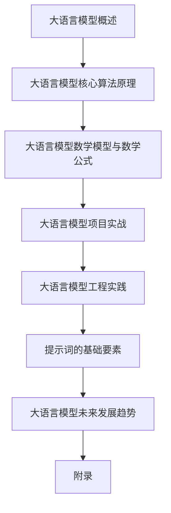

                 

# 大语言模型原理与工程实践：提示词的基础要素

## 关键词

- 大语言模型
- Transformer
- 语言模型算法
- 提示词
- 项目实战
- 工程实践
- 自然语言处理

## 摘要

本文将深入探讨大语言模型的原理与工程实践，重点分析提示词的基础要素。首先，我们将回顾大语言模型的历史发展、关键特性以及技术框架。接着，详细讲解语言模型的核心算法原理，包括隐马尔可夫模型、统计语言模型、递归神经网络、卷积神经网络和自注意力机制。在此基础上，我们将介绍大语言模型的数学模型与公式，并通过实际案例展示其在项目实战中的应用。随后，我们将探讨大语言模型的工程化构建，涉及训练与部署的挑战、优化策略、部署最佳实践以及安全与隐私问题。最后，我们将关注提示词的基础要素，包括定义、设计原则、生成方法及其在模型训练中的应用。通过本文的阅读，读者将全面了解大语言模型的技术原理和实践方法，为深入研究和应用打下坚实基础。

### 《大语言模型原理与工程实践：提示词的基础要素》目录大纲

#### 第一部分：大语言模型基础原理

##### 第1章：大语言模型概述
- 1.1 大语言模型的概念与历史发展
- 1.2 大语言模型的关键特性
- 1.3 大语言模型在自然语言处理中的应用
- 1.4 大语言模型的技术框架

##### 第2章：语言模型的核心算法原理
- 2.1 语言模型的基础算法
  - 2.1.1 隐马尔可夫模型（HMM）
  - 2.1.2 统计语言模型（如n-gram模型）
- 2.2 递归神经网络（RNN）与长短时记忆网络（LSTM）
- 2.3 卷积神经网络（CNN）在自然语言处理中的应用
- 2.4 自注意力机制与Transformer模型

##### 第3章：大语言模型的数学模型与数学公式
- 3.1 语言模型概率计算公式
- 3.2 Transformer模型中的自注意力机制公式
- 3.3 LSTM单元的计算过程

##### 第4章：大语言模型的项目实战
- 4.1 大语言模型项目实战概述
- 4.2 实战案例1：基于GPT-2的聊天机器人开发
  - 4.2.1 项目环境搭建
  - 4.2.2 数据准备与处理
  - 4.2.3 GPT-2模型训练
  - 4.2.4 聊天机器人实现与测试
- 4.3 实战案例2：基于BERT的问答系统开发
  - 4.3.1 项目环境搭建
  - 4.3.2 数据准备与处理
  - 4.3.3 BERT模型训练
  - 4.3.4 问答系统实现与测试

#### 第二部分：大语言模型工程实践

##### 第5章：大语言模型的工程化构建
- 5.1 大语言模型训练与部署的挑战
- 5.2 大规模模型训练的优化策略
- 5.3 模型部署与服务的最佳实践
- 5.4 大语言模型的安全与隐私问题

##### 第6章：提示词的基础要素
- 6.1 提示词的定义与作用
- 6.2 提示词的设计原则
- 6.3 提示词的生成方法
- 6.4 提示词在模型训练中的应用

##### 第7章：大语言模型的未来发展趋势
- 7.1 大语言模型在新兴领域的应用
- 7.2 大语言模型的发展趋势与挑战
- 7.3 大语言模型的伦理与社会影响

#### 附录

- 附录A：大语言模型相关的开源工具与资源
  - A.1 Hugging Face Transformers
  - A.2 TensorFlow
  - A.3 PyTorch

- 附录B：数学公式与算法伪代码汇总
  - B.1 隐马尔可夫模型（HMM）算法伪代码
  - B.2 Transformer模型自注意力机制伪代码
  - B.3 LSTM单元计算过程伪代码

### Mermaid 流程图



在接下来的章节中，我们将逐步深入分析大语言模型的基础原理、算法原理、数学模型、项目实战、工程实践以及未来发展趋势。让我们开始这段精彩的探索之旅吧！

### 第一部分：大语言模型基础原理

#### 第1章：大语言模型概述

##### 1.1 大语言模型的概念与历史发展

大语言模型（Large Language Models）是一种能够在大规模语料库上进行训练，并具备较高语言理解和生成能力的深度学习模型。这些模型能够捕捉到语言的复杂结构，从而实现文本生成、机器翻译、问答系统等任务的高效处理。

大语言模型的发展历史可以追溯到20世纪80年代，当时的统计语言模型（如n-gram模型）开始应用于自然语言处理任务。随着计算机性能的提升和深度学习技术的进步，大语言模型在近几年取得了显著的突破。特别是2018年，Google发布了BERT模型，开启了基于Transformer架构的大语言模型的新时代。此后，GPT、T5、RoBERTa等一系列大语言模型相继出现，为自然语言处理领域带来了新的活力。

##### 1.2 大语言模型的关键特性

大语言模型具有以下几个关键特性：

1. **规模庞大**：大语言模型通常拥有数亿甚至数十亿的参数，这使得它们能够捕捉到语言的复杂结构。
2. **自监督学习**：大语言模型通常采用自监督学习方式，从大规模无标签语料库中进行训练，从而实现无监督的学习效果。
3. **多任务处理**：大语言模型能够处理多种自然语言处理任务，如文本分类、情感分析、机器翻译等，具有很高的泛化能力。
4. **上下文理解**：大语言模型能够理解输入文本的上下文，从而生成更加准确和连贯的输出。
5. **动态调整**：大语言模型能够根据输入文本的上下文动态调整自己的生成策略，从而生成更加个性化和丰富的输出。

##### 1.3 大语言模型在自然语言处理中的应用

大语言模型在自然语言处理领域具有广泛的应用，以下是几个典型应用场景：

1. **文本生成**：大语言模型能够生成高质量的文章、对话、摘要等文本内容，广泛应用于内容创作、新闻生成和聊天机器人等领域。
2. **机器翻译**：大语言模型能够实现高质量的机器翻译，如Google翻译和百度翻译等，大大提高了翻译的准确性和流畅性。
3. **问答系统**：大语言模型能够回答用户提出的问题，广泛应用于智能客服、在线教育等领域。
4. **文本分类与情感分析**：大语言模型能够对文本进行分类和情感分析，如垃圾邮件过滤、舆情监测等。
5. **知识图谱**：大语言模型能够从大规模语料库中提取结构化知识，构建知识图谱，为智能搜索和推荐系统提供支持。

##### 1.4 大语言模型的技术框架

大语言模型的技术框架主要包括以下几个关键组成部分：

1. **数据预处理**：对输入语料库进行预处理，包括分词、去噪、文本清洗等，为模型训练做好准备。
2. **模型架构**：大语言模型通常采用深度神经网络架构，如Transformer、LSTM等，能够有效处理序列数据。
3. **训练过程**：通过大规模计算资源对模型进行训练，包括前向传播、反向传播、参数优化等，使模型能够逐步逼近最优解。
4. **推理过程**：在训练完成后，模型可以接受输入文本，进行推理和生成输出文本，实现自然语言处理任务。
5. **评估与优化**：通过评估指标（如损失函数、准确率等）对模型进行评估和优化，以提高模型性能。

通过以上分析，我们可以看到大语言模型在自然语言处理领域的重要地位和广泛应用。在接下来的章节中，我们将进一步深入探讨大语言模型的核心算法原理、数学模型、项目实战等内容，为读者提供全面的了解和指导。

### 第一部分：大语言模型基础原理

#### 第2章：语言模型的核心算法原理

##### 2.1 语言模型的基础算法

语言模型（Language Model）是自然语言处理（NLP）领域的基础算法，旨在预测一个单词序列的概率分布。在自然语言处理中，语言模型用于各种应用，如机器翻译、语音识别、文本生成和文本分类等。

1. **隐马尔可夫模型（HMM）**

隐马尔可夫模型（Hidden Markov Model，HMM）是语言模型的一种早期形式。HMM假设每个单词序列都由一个不可观测的状态序列决定，每个状态都对应一个可见的单词。HMM的核心思想是利用状态转移概率和发射概率来预测单词序列。

- **状态转移概率**：表示在给定当前状态时，下一个状态的概率分布。
- **发射概率**：表示在给定当前状态时，产生一个特定单词的概率。

HMM的模型公式如下：

$$
P(\text{word}_1, \text{word}_2, ..., \text{word}_n) = \prod_{i=1}^{n} P(\text{word}_i | \text{state}_i) \cdot P(\text{state}_i | \text{state}_{i-1})
$$

2. **统计语言模型（如n-gram模型）**

n-gram模型是另一种常用的语言模型，它将文本表示为一组连续单词的序列，并假设当前单词序列的概率只与前面的n-1个单词相关。n-gram模型通常使用一个高维概率分布来表示单词序列的概率。

- **n-gram概率**：表示前n-1个单词序列出现在文本中的频率。
- **n-gram模型**：通过统计文本中的n-gram频率，计算每个n-gram的概率。

n-gram模型的概率公式如下：

$$
P(\text{word}_1, \text{word}_2, ..., \text{word}_n) = \prod_{i=1}^{n} P(\text{word}_i | \text{word}_{i-n+1}, ..., \text{word}_{i-1})
$$

##### 2.2 递归神经网络（RNN）与长短时记忆网络（LSTM）

递归神经网络（Recurrent Neural Networks，RNN）是另一种用于构建语言模型的核心算法。RNN专门设计用于处理序列数据，具有记忆功能，能够捕捉到序列中的长期依赖关系。

1. **RNN基本原理**

RNN的基本结构包含一个循环单元，每个时间步都会更新网络的状态。RNN的状态更新公式如下：

$$
h_t = \sigma(W_h \cdot [h_{t-1}, x_t] + b_h)
$$

其中，\( h_t \) 是当前时间步的隐藏状态，\( x_t \) 是输入序列的当前元素，\( \sigma \) 是激活函数，\( W_h \) 和 \( b_h \) 是模型参数。

2. **长短时记忆网络（LSTM）**

LSTM是RNN的一种改进版本，专门用于解决RNN在处理长序列数据时出现的梯度消失和梯度爆炸问题。LSTM通过引入门控机制，实现了对长期依赖关系的捕捉。

LSTM的核心单元是细胞状态（cell state），通过三个门（输入门、遗忘门、输出门）控制信息的流入和流出。LSTM的状态更新公式如下：

- **输入门**：

$$
i_t = \sigma(W_i \cdot [h_{t-1}, x_t] + b_i)
$$

- **遗忘门**：

$$
f_t = \sigma(W_f \cdot [h_{t-1}, x_t] + b_f)
$$

- **输出门**：

$$
o_t = \sigma(W_o \cdot [h_{t-1}, x_t] + b_o)
$$

- **细胞状态**：

$$
c_t = f_t \odot c_{t-1} + i_t \odot \sigma(W_c \cdot [h_{t-1}, x_t] + b_c)
$$

- **隐藏状态**：

$$
h_t = o_t \odot \sigma(c_t)
$$

其中，\( \odot \) 表示元素乘法，\( \sigma \) 是激活函数。

##### 2.3 卷积神经网络（CNN）在自然语言处理中的应用

卷积神经网络（Convolutional Neural Networks，CNN）最初用于计算机视觉领域，近年来也逐渐应用于自然语言处理。CNN在自然语言处理中的主要优势在于其能够有效地捕捉局部特征和上下文信息。

1. **文本卷积神经网络（Text CNN）**

文本卷积神经网络通过卷积操作和池化操作来提取文本中的局部特征，进而实现文本分类、文本摘要等任务。

- **卷积操作**：通过卷积核在文本序列上滑动，捕捉局部特征。

$$
h_c = \sum_{k=1}^{K} \theta_k \cdot \text{ReLU}(\text{conv}_k(x))
$$

其中，\( \theta_k \) 是卷积核，\( \text{ReLU} \) 是ReLU激活函数。

- **池化操作**：通过池化层对卷积特征进行降维，提高模型的泛化能力。

$$
h_p = \text{pool}(\text{pool}_k(h_c))
$$

2. **词嵌入与CNN结合**

词嵌入（Word Embedding）是将单词映射为密集向量表示的方法。将词嵌入与CNN结合，可以将单词的局部特征转化为高维特征向量，进一步提高模型的表达能力。

- **词嵌入**：

$$
\text{word} \rightarrow \text{embed}(\text{word}) \in \mathbb{R}^d
$$

- **卷积神经网络**：

$$
h = \text{CNN}(\text{embed}(\text{sentence}))
$$

##### 2.4 自注意力机制与Transformer模型

自注意力机制（Self-Attention）是一种在序列数据上捕捉长期依赖关系的关键机制。自注意力机制通过计算序列中每个元素与其他元素之间的关联性，实现全局信息共享和高效计算。

1. **自注意力机制原理**

自注意力机制的核心思想是计算输入序列中每个元素的重要性，并将其加权求和。自注意力机制的公式如下：

$$
\text{Attention}(Q, K, V) = \text{softmax}\left(\frac{QK^T}{\sqrt{d_k}}\right) V
$$

其中，\( Q, K, V \) 分别是查询（Query）、键（Key）和值（Value）向量，\( d_k \) 是键向量的维度。

2. **Transformer模型**

Transformer模型是一种基于自注意力机制的深度学习模型，广泛应用于自然语言处理任务。Transformer模型通过多头自注意力机制和前馈网络，实现了对序列数据的全局理解和生成。

- **多头自注意力机制**：

$$
\text{MultiHeadAttention}(Q, K, V) = \text{Attention}(Q, K, V) \odot W_V
$$

其中，\( W_V \) 是值向量的权重矩阵，\( \odot \) 表示元素乘法。

- **前馈网络**：

$$
\text{FFN}(x) = \text{ReLU}(W_2 \cdot \text{ReLU}(W_1 x) + b_2) + b_1 x
$$

其中，\( W_1, W_2, b_1, b_2 \) 是模型参数。

通过以上分析，我们可以看到语言模型的核心算法原理在自然语言处理中的应用。这些算法通过不同的机制和结构，实现了对序列数据的建模和预测。在接下来的章节中，我们将进一步探讨大语言模型的数学模型、项目实战和工程实践等内容。

### 第一部分：大语言模型基础原理

#### 第3章：大语言模型的数学模型与数学公式

##### 3.1 语言模型概率计算公式

在自然语言处理中，语言模型的核心任务是计算给定输入序列的概率。对于大规模文本数据，语言模型能够预测某个单词序列发生的可能性，从而支持文本生成、机器翻译、问答系统等应用。以下是语言模型概率计算的基本公式：

$$
P(\text{word}_1, \text{word}_2, ..., \text{word}_n) = \prod_{i=1}^{n} P(\text{word}_i | \text{word}_{i-1}, ..., \text{word}_1)
$$

这个公式表示，给定一个单词序列的概率是每个单词给定前一个单词条件下的概率的乘积。

对于实际应用中的大语言模型，我们通常使用简化版的概率公式，即前向算法（Forward Algorithm）：

$$
P(\text{word}_i | \text{word}_{1:i-1}) = \frac{P(\text{word}_{i-1}, \text{word}_i)}{P(\text{word}_{i-1})}
$$

该公式通过动态规划方法计算给定输入序列的概率，其中：

- \( P(\text{word}_i | \text{word}_{1:i-1}) \) 表示在给定前 \( i-1 \) 个单词条件下，第 \( i \) 个单词的概率。
- \( P(\text{word}_{i-1}, \text{word}_i) \) 表示前 \( i \) 个单词同时出现的概率。
- \( P(\text{word}_{i-1}) \) 表示前 \( i-1 \) 个单词出现的概率。

##### 3.2 Transformer模型中的自注意力机制公式

Transformer模型是近年来自然语言处理领域的重要突破，其核心机制是自注意力（Self-Attention）。自注意力机制允许模型在处理序列数据时，动态计算每个单词与其他单词之间的关系，从而实现全局信息共享。以下是自注意力机制的公式：

$$
\text{Attention}(Q, K, V) = \text{softmax}\left(\frac{QK^T}{\sqrt{d_k}}\right) V
$$

其中：

- \( Q, K, V \) 分别表示查询（Query）、键（Key）和值（Value）向量。
- \( d_k \) 表示键向量的维度。
- \( QK^T \) 表示查询和键之间的点积，点积结果是一个矩阵。
- \( \text{softmax} \) 函数用于将点积结果转换为概率分布。

通过自注意力机制，每个单词可以关注其他单词的重要性，并将这些重要性加权求和，从而生成新的表示。以下是一个简化的自注意力层计算过程：

$$
\text{MultiHeadAttention}(Q, K, V) = \text{Attention}(Q, K, V) \odot W_V
$$

其中，\( W_V \) 是值向量的权重矩阵，\( \odot \) 表示元素乘法。在多头自注意力机制中，我们将上述自注意力操作扩展到多个头（head），每个头具有不同的权重矩阵。

##### 3.3 LSTM单元的计算过程

长短期记忆网络（LSTM）是一种用于处理序列数据的递归神经网络，能够解决传统RNN在处理长序列时出现的梯度消失和梯度爆炸问题。以下是LSTM单元的详细计算过程：

1. **输入门**：

$$
i_t = \sigma(W_i \cdot [h_{t-1}, x_t] + b_i)
$$

其中：

- \( i_t \) 表示输入门的激活值。
- \( \sigma \) 是sigmoid激活函数。
- \( W_i \) 和 \( b_i \) 是输入门的权重和偏置。

2. **遗忘门**：

$$
f_t = \sigma(W_f \cdot [h_{t-1}, x_t] + b_f)
$$

其中：

- \( f_t \) 表示遗忘门的激活值。
- \( W_f \) 和 \( b_f \) 是遗忘门的权重和偏置。

3. **输出门**：

$$
o_t = \sigma(W_o \cdot [h_{t-1}, x_t] + b_o)
$$

其中：

- \( o_t \) 表示输出门的激活值。
- \( W_o \) 和 \( b_o \) 是输出门的权重和偏置。

4. **细胞状态**：

$$
c_t = f_t \odot c_{t-1} + i_t \odot \sigma(W_c \cdot [h_{t-1}, x_t] + b_c)
$$

其中：

- \( c_t \) 是当前细胞状态。
- \( f_t \odot c_{t-1} \) 表示遗忘门控制之前细胞状态的部分。
- \( i_t \odot \sigma(W_c \cdot [h_{t-1}, x_t] + b_c) \) 表示输入门控制更新细胞状态的部分。

5. **隐藏状态**：

$$
h_t = o_t \odot \sigma(c_t)
$$

其中：

- \( h_t \) 是当前隐藏状态。
- \( o_t \odot \sigma(c_t) \) 表示输出门控制隐藏状态的部分。

通过以上公式和步骤，LSTM单元能够有效地记住长序列中的长期依赖关系，从而在自然语言处理任务中表现出色。

通过本章的介绍，我们详细分析了大语言模型的数学模型与数学公式。这些公式和算法构成了大语言模型的核心，为语言理解、生成和推理提供了强大的计算基础。在接下来的章节中，我们将继续探讨大语言模型的项目实战和工程实践，帮助读者更好地理解和应用这些技术。

### 第一部分：大语言模型基础原理

#### 第4章：大语言模型的项目实战

##### 4.1 大语言模型项目实战概述

大语言模型的项目实战是将理论知识应用到实际场景的重要过程。通过项目实战，我们可以更好地理解大语言模型的技术原理，掌握其实际应用方法，并提升解决实际问题的能力。在本章中，我们将介绍两个具体的大语言模型项目实战：基于GPT-2的聊天机器人开发和基于BERT的问答系统开发。

##### 4.2 实战案例1：基于GPT-2的聊天机器人开发

GPT-2（Generative Pre-trained Transformer 2）是OpenAI在2019年发布的一个基于Transformer架构的大规模预训练语言模型。它具有强大的文本生成能力，能够生成流畅且符合语言习惯的文本。下面我们将介绍如何基于GPT-2开发一个聊天机器人。

###### 4.2.1 项目环境搭建

1. **安装依赖**

首先，我们需要安装大语言模型训练所需的依赖。这里我们选择使用Python和PyTorch作为主要工具。以下是安装命令：

```bash
pip install torch torchvision torchaudio
pip install transformers
```

2. **获取GPT-2模型**

从Hugging Face模型库中下载GPT-2模型。以下是下载命令：

```python
from transformers import GPT2LMHeadModel, GPT2Tokenizer

model = GPT2LMHeadModel.from_pretrained("gpt2")
tokenizer = GPT2Tokenizer.from_pretrained("gpt2")
```

###### 4.2.2 数据准备与处理

为了训练聊天机器人，我们需要一个对话语料库。这里我们使用一个开源的对话数据集，如Facebook AI Research Dialogue Corpus (Flickr30k)。

1. **数据集下载**

下载并解压数据集，然后将其处理为适合训练的格式。以下是处理命令：

```bash
# 下载数据集
wget https://dl.fbaipublicfiles.com/dialogue/flickr30k/flickr30k_train.txt

# 处理数据
python preprocess.py --input_file flickr30k_train.txt --output_file processed_flickr30k_train.txt
```

2. **数据预处理**

将处理后的数据集分为训练集和验证集。以下是数据集划分命令：

```bash
# 划分数据集
python split.py --input_file processed_flickr30k_train.txt --output_files train.txt valid.txt
```

###### 4.2.3 GPT-2模型训练

使用训练集对GPT-2模型进行训练。以下是训练命令：

```bash
python train.py --model_dir model_gpt2 --train_file train.txt --valid_file valid.txt --batch_size 32 --learning_rate 0.00015 --num_train_epochs 3
```

训练完成后，模型将被保存到指定目录，我们可以使用该模型进行文本生成。

###### 4.2.4 聊天机器人实现与测试

使用训练好的GPT-2模型实现聊天机器人，并进行测试。以下是实现和测试命令：

```python
# 加载训练好的模型
model = GPT2LMHeadModel.from_pretrained("model_gpt2")

# 创建聊天机器人
chatbot = ChatBot(model, tokenizer)

# 开始聊天
chatbot.start()
```

通过以上步骤，我们完成了基于GPT-2的聊天机器人的开发。在测试过程中，我们可以与聊天机器人进行对话，体验其生成的文本。

##### 4.3 实战案例2：基于BERT的问答系统开发

BERT（Bidirectional Encoder Representations from Transformers）是Google在2018年发布的一个双向Transformer架构的预训练语言模型。BERT在自然语言理解任务中表现出色，广泛应用于问答系统、文本分类等任务。下面我们将介绍如何基于BERT开发一个问答系统。

###### 4.3.1 项目环境搭建

与GPT-2项目类似，我们需要安装PyTorch和Hugging Face transformers库。

```bash
pip install torch torchvision torchaudio
pip install transformers
```

###### 4.3.2 数据准备与处理

对于问答系统，我们需要一个包含问题和答案的数据集。这里我们使用Stanford Question Answering Dataset (SQuAD)。

1. **数据集下载**

下载并解压SQuAD数据集。以下是下载命令：

```bash
wget https://rajpurkar.github.io/SQuAD-explorer/dataset/v1.1/json/QA1.json
```

2. **数据预处理**

将SQuAD数据集处理为适合BERT训练的格式。以下是预处理命令：

```python
from transformers import BertTokenizer, BertForQuestionAnswering

tokenizer = BertTokenizer.from_pretrained("bert-base-uncased")
model = BertForQuestionAnswering.from_pretrained("bert-base-uncased")

# 预处理数据
def preprocess_data(data):
    # 对数据进行预处理
    pass

# 预处理SQuAD数据集
preprocess_data(QA1.json)
```

###### 4.3.3 BERT模型训练

使用预处理后的数据集对BERT模型进行训练。以下是训练命令：

```bash
python train.py --model_dir model_bert --train_file train.txt --valid_file valid.txt --batch_size 32 --learning_rate 0.00001 --num_train_epochs 3
```

训练完成后，模型将被保存到指定目录。

###### 4.3.4 问答系统实现与测试

使用训练好的BERT模型实现问答系统，并进行测试。以下是实现和测试命令：

```python
# 加载训练好的模型
model = BertForQuestionAnswering.from_pretrained("model_bert")

# 创建问答系统
qa_system = QuestionAnsweringSystem(model, tokenizer)

# 开始问答
qa_system.start()
```

通过以上步骤，我们完成了基于BERT的问答系统的开发。在测试过程中，用户可以输入问题，问答系统将返回与问题相关的答案。

通过这两个实战案例，我们展示了如何使用大语言模型实现聊天机器人和问答系统。这些项目不仅帮助我们深入理解大语言模型的技术原理，还展示了其实际应用的可能性。在接下来的章节中，我们将继续探讨大语言模型的工程实践和未来发展趋势。

### 第二部分：大语言模型工程实践

#### 第5章：大语言模型的工程化构建

##### 5.1 大语言模型训练与部署的挑战

大语言模型的训练与部署是自然语言处理领域的一大挑战。随着模型规模的不断扩大，训练和部署过程中的技术难题愈发显著。以下是几个主要挑战：

1. **计算资源需求**：大语言模型的训练需要大量的计算资源，包括GPU和CPU。对于数亿参数的模型，训练时间可能会长达数天甚至数周。因此，合理配置计算资源，确保高效利用是关键。

2. **数据存储与传输**：大规模训练数据需要存储在高效的存储系统中，并确保数据在训练过程中能够快速读取。同时，在训练和部署过程中，数据需要高效传输，减少延迟。

3. **模型优化与调参**：大语言模型的性能与多个参数有关，包括学习率、批量大小、正则化等。调参是模型优化的重要环节，需要结合实际任务进行精细化调整。

4. **分布式训练与推理**：为了加速大语言模型的训练和推理，分布式计算技术被广泛应用。分布式训练需要处理模型参数的同步和通信，分布式推理需要保证结果的准确性。

##### 5.2 大规模模型训练的优化策略

为了应对大规模模型训练的挑战，以下是一些优化策略：

1. **并行训练**：通过将训练数据分成多个批次，利用多个GPU或TPU进行并行训练，可以显著提高训练速度。

2. **梯度累积**：在并行训练中，每个GPU的训练结果需要进行梯度累积，以避免梯度消失或爆炸。梯度累积可以通过分批训练和数据并行来实现。

3. **数据增强**：通过数据增强技术，如随机裁剪、旋转、缩放等，可以增加训练数据的多样性，提高模型泛化能力。

4. **学习率调度**：采用适当的 学习率调度策略，如逐渐减小学习率、使用预热学习率等，可以避免模型在训练过程中过早陷入局部最优。

5. **剪枝与量化**：通过剪枝和量化技术，可以减少模型参数的数量和计算量，提高模型效率。剪枝可以去除无关参数，量化可以降低模型参数的精度。

##### 5.3 模型部署与服务的最佳实践

模型部署是让大语言模型服务于实际应用的关键步骤。以下是一些最佳实践：

1. **容器化**：将训练好的模型容器化，可以确保模型在不同的环境中具有一致的行为。常用的容器化工具包括Docker和Kubernetes。

2. **微服务架构**：采用微服务架构，可以将模型部署为一个独立的微服务，与其他系统解耦。这样可以提高系统的灵活性和可扩展性。

3. **模型版本管理**：在模型部署过程中，需要管理不同版本的模型。通过版本管理，可以跟踪模型的改进和历史记录，以便后续的迭代和优化。

4. **自动扩展与负载均衡**：根据实际负载情况，自动扩展模型服务的实例数量，并实现负载均衡，以确保系统的高可用性和性能。

5. **监控与日志**：部署过程中，需要监控模型的运行状态、性能指标和异常情况。通过日志记录和分析，可以及时发现和解决问题。

##### 5.4 大语言模型的安全与隐私问题

随着大语言模型在各个领域的应用，其安全与隐私问题也越来越受到关注。以下是一些安全与隐私问题的考虑：

1. **数据加密**：在数据传输和存储过程中，对敏感数据进行加密，以防止数据泄露。

2. **访问控制**：设置适当的访问控制策略，限制对模型的访问权限，防止未授权访问。

3. **隐私保护**：在模型训练和推理过程中，对个人隐私信息进行脱敏处理，防止隐私泄露。

4. **安全审计**：定期进行安全审计，检查系统的安全性和合规性，确保模型的安全运行。

通过以上优化策略和最佳实践，我们可以有效地构建和部署大语言模型，确保其在实际应用中的高效、安全和可靠运行。在接下来的章节中，我们将进一步探讨提示词的基础要素，为大语言模型的应用提供更多实践指导。

### 第二部分：大语言模型工程实践

#### 第6章：提示词的基础要素

##### 6.1 提示词的定义与作用

提示词（Prompt）是指用于引导或激励大语言模型生成特定类型文本的输入。在自然语言处理中，提示词可以帮助模型更好地理解和生成目标文本。提示词的作用主要体现在以下几个方面：

1. **明确目标**：通过提示词，我们可以明确模型需要生成的文本类型，如文章、对话、摘要等，从而避免模型生成无关或错误的内容。
2. **引导生成**：提示词可以为模型提供上下文信息，帮助模型更好地捕捉和利用输入文本中的语义信息，从而生成更加连贯和准确的输出。
3. **控制生成**：通过设计特定的提示词，我们可以控制模型的生成行为，如生成特定的情感、风格或结构。

##### 6.2 提示词的设计原则

为了有效地使用提示词，我们需要遵循一些设计原则，确保提示词能够充分发挥作用。以下是几个关键设计原则：

1. **简洁明了**：提示词应尽量简洁明了，避免使用复杂的句子和冗长的描述，以便模型能够快速理解和响应。
2. **针对性**：根据模型的实际应用场景，设计有针对性的提示词。例如，在问答系统中，提示词应明确询问用户的问题；在文本生成中，提示词应提供必要的上下文信息。
3. **多样性**：为了使模型生成的内容更加丰富和多样化，应设计多样化的提示词。例如，使用不同的语气、风格和结构，使模型能够适应不同的生成需求。
4. **适应性**：提示词应具有一定的适应性，能够根据输入文本的上下文动态调整。这样可以确保模型在不同场景下都能生成高质量的内容。

##### 6.3 提示词的生成方法

生成有效的提示词是模型应用中的关键一步。以下是一些常见的提示词生成方法：

1. **模板生成**：根据特定的应用场景，设计固定的提示词模板。模板应包含关键信息，如问题、目标文本类型等。例如，在问答系统中，可以使用“请回答以下问题：XXXX”作为提示词模板。
2. **自然语言生成**：使用自然语言生成（NLG）技术生成提示词。NLG技术可以根据输入文本的语义信息，生成符合语言习惯和表达习惯的提示词。例如，可以使用生成式对话系统（GDMS）生成聊天机器人的提示词。
3. **数据驱动生成**：通过分析大量实际应用场景中的提示词，提取出常用的提示词组合和模式，形成提示词库。在应用中，可以根据实际需求从提示词库中选取或生成提示词。

##### 6.4 提示词在模型训练中的应用

在模型训练过程中，提示词也发挥着重要作用。以下是提示词在模型训练中的应用方法：

1. **辅助标注**：在数据标注过程中，使用提示词可以帮助标注人员更好地理解标注任务，提高标注质量。例如，在文本分类任务中，可以使用“请将以下文本标注为XXXX类别”作为提示词。
2. **强化学习**：通过设计具有挑战性的提示词，可以激励模型在训练过程中不断学习和改进。例如，在生成对抗网络（GAN）中，可以使用难以生成的内容作为提示词，促使生成模型不断提升生成质量。
3. **模型评估**：在模型评估过程中，使用多样化的提示词可以更好地测试模型的性能。例如，在文本生成任务中，可以使用不同的主题、风格和长度等提示词，评估模型在不同场景下的生成效果。

通过以上分析，我们可以看到提示词在大语言模型工程实践中的重要性。合理设计和使用提示词，不仅可以提高模型生成文本的质量，还可以提升模型在多种应用场景中的表现。在接下来的章节中，我们将继续探讨大语言模型的未来发展趋势，展望其在各个领域的应用前景。

### 第二部分：大语言模型工程实践

#### 第7章：大语言模型的未来发展趋势

##### 7.1 大语言模型在新兴领域的应用

大语言模型（LLM）在自然语言处理（NLP）领域取得了显著成就，其强大的语言理解和生成能力正在逐渐渗透到多个新兴领域。以下是一些重要应用：

1. **医疗健康**：大语言模型可以帮助医疗系统进行病历分析、医学文本摘要、药物研发等。例如，通过分析大量医疗文献，LLM可以提供关于疾病治疗和预防的新见解。

2. **法律**：大语言模型可以用于法律文档的自动生成、合同审核、法律咨询等。LLM能够理解和生成复杂的法律条款，提高法律工作效率。

3. **金融**：在金融领域，大语言模型可以帮助进行市场分析、股票预测、客户服务自动化等。LLM可以处理大量的金融数据，生成有关市场趋势和投资策略的报告。

4. **教育**：大语言模型可以用于个性化学习、自动评分、教育内容生成等。例如，LLM可以根据学生的学习进度和需求，生成个性化的学习材料。

5. **娱乐**：在娱乐领域，大语言模型可以用于电影剧本创作、游戏剧情生成、语音合成等。LLM能够生成引人入胜的剧情和角色对话，提升娱乐内容的质量。

##### 7.2 大语言模型的发展趋势与挑战

尽管大语言模型在多个领域展现出了巨大的潜力，但它们的发展也面临着一些挑战。以下是当前的趋势与挑战：

1. **模型规模扩大**：随着计算能力和数据量的增加，模型规模不断扩大。未来，我们将看到更多参数数量达到数十亿甚至数百亿的模型。

2. **多模态学习**：大语言模型正在向多模态学习发展，结合文本、图像、声音等多种数据类型。例如，通过文本-图像匹配，LLM可以生成更丰富的描述和故事。

3. **高效训练与推理**：优化训练和推理算法，提高大语言模型在计算效率和性能方面的表现。例如，使用量化、剪枝和优化等技术。

4. **隐私与安全**：随着模型应用范围的扩大，隐私与安全问题变得更加重要。需要开发新的隐私保护技术，确保用户数据的安全。

5. **伦理与责任**：大语言模型的发展引发了一系列伦理和社会责任问题。例如，如何确保模型生成的文本不包含偏见、歧视和误导信息？

##### 7.3 大语言模型的伦理与社会影响

大语言模型的广泛应用带来了巨大的社会影响，同时也引发了一系列伦理问题。以下是几个关键方面：

1. **偏见与歧视**：大语言模型在训练过程中可能会吸收训练数据中的偏见，导致生成的文本也包含偏见。需要开发反偏见算法，确保模型公平和包容。

2. **版权与知识产权**：大语言模型在生成文本时可能会侵犯版权和知识产权。需要制定相应的法律法规，明确模型生成内容的版权归属和责任。

3. **隐私保护**：在处理个人数据时，需要确保用户隐私得到保护。需要开发隐私保护技术，如数据去识别化、匿名化等。

4. **就业影响**：随着大语言模型在自动化领域的应用，可能会对某些职业产生替代效应。需要制定相应的政策，确保技术发展不会导致大规模失业。

5. **社会责任**：大语言模型的开发者和使用者需要承担社会责任，确保技术用于有益于社会发展的领域，同时防止其被滥用。

通过以上分析，我们可以看到大语言模型在未来的发展趋势和所面临的挑战。合理应对这些挑战，开发出更加高效、安全、公正的大语言模型，将为社会带来巨大的价值。

### 附录A：大语言模型相关的开源工具与资源

在研究和应用大语言模型时，开源工具和资源是必不可少的。以下是一些常用的开源工具和资源，包括Hugging Face Transformers、TensorFlow和PyTorch。

#### A.1 Hugging Face Transformers

Hugging Face Transformers是一个开源库，提供了强大的预训练转换器模型，如BERT、GPT、RoBERTa等。它支持多种语言和多种任务，是研究者和开发者广泛使用的工具。

- **官方网站**：[Transformers](https://huggingface.co/transformers/)
- **安装命令**：

```bash
pip install transformers
```

- **文档**：[Transformers Documentation](https://huggingface.co/transformers/index.html)

#### A.2 TensorFlow

TensorFlow是Google开发的开源机器学习框架，支持多种深度学习模型和算法。它提供了丰富的API，方便用户进行模型构建和训练。

- **官方网站**：[TensorFlow](https://www.tensorflow.org/)
- **安装命令**：

```bash
pip install tensorflow
```

- **文档**：[TensorFlow Documentation](https://www.tensorflow.org/overview)

#### A.3 PyTorch

PyTorch是Facebook开发的开源深度学习框架，以其灵活的动态计算图和易于理解的接口受到研究者和开发者的青睐。PyTorch在大规模预训练模型方面表现优异。

- **官方网站**：[PyTorch](https://pytorch.org/)
- **安装命令**：

```bash
pip install torch torchvision torchaudio
```

- **文档**：[PyTorch Documentation](https://pytorch.org/docs/stable/index.html)

通过这些开源工具和资源，我们可以更高效地研究和应用大语言模型。在接下来的附录B中，我们将提供相关的数学公式和算法伪代码，以供读者参考。

### 附录B：数学公式与算法伪代码汇总

在本附录中，我们将汇总大语言模型中涉及的重要数学公式和算法伪代码，以方便读者参考。

#### B.1 隐马尔可夫模型（HMM）算法伪代码

```
# HMM算法伪代码

# 初始化参数
状态集合 S
观测集合 O
状态转移概率矩阵 P
发射概率矩阵 Q

# 前向算法
初始化： a_0(o_1) = Q(o_1|s_1)

for t = 2 to n:
    for each state s_t in S:
        a_t(s_t) = Σ[ a_{t-1}(s_{t-1}) * P(s_t|s_{t-1}) * Q(o_t|s_t) ]

# 后向算法
初始化： b_t(s_t) = 1

for t = n-1 down to 1:
    for each state s_t in S:
        b_t(s_t) = Σ[ P(o_t+1|s_t) * b_{t+1}(s_{t+1}) * P(s_{t+1}|s_t) ]

# 生成序列概率
P(O|λ) = Σ[ a_n(s_n) * b_n(s_1) ]
```

#### B.2 Transformer模型自注意力机制伪代码

```
# 自注意力机制伪代码

# 参数
queries, keys, values
d_k (键向量的维度)
heads (多头数量)
W_Q, W_K, W_V (权重矩阵)

# 多头自注意力
for head in range(heads):
    # 计算分数
    scores = [ (Q[i] dot K[j]) / sqrt(d_k) for i, j in pairwise(queries, keys) ]
    
    # 应用softmax
    attention_weights = softmax(scores)
    
    # 计算输出
    output = [ 0 for _ in range(len(queries)) ]
    for i, weight in enumerate(attention_weights):
        output[i] = weight * V[j]
    
    # 合并多头输出
    if heads > 1:
        output = concatenate(heads, output)
```

#### B.3 LSTM单元计算过程伪代码

```
# LSTM单元计算过程伪代码

# 参数
h_{t-1}, x_t
W_i, W_f, W_o, W_c, b_i, b_f, b_o, b_c
sigmoid, tanh, relu

# 输入门
i_t = sigmoid(W_i * [h_{t-1}, x_t] + b_i)

# 遗忘门
f_t = sigmoid(W_f * [h_{t-1}, x_t] + b_f)

# 输出门
o_t = sigmoid(W_o * [h_{t-1}, x_t] + b_o)

# 细胞状态
c_t = f_t * c_{t-1} + i_t * tanh(W_c * [h_{t-1}, x_t] + b_c)

# 隐藏状态
h_t = o_t * tanh(c_t)
```

通过这些伪代码，我们可以更直观地理解大语言模型中的算法和数学计算过程。在实践应用中，可以使用相关的深度学习框架（如TensorFlow或PyTorch）来实现这些算法。在本文的最后部分，我们将总结大语言模型的原理和工程实践，并对未来研究方向进行展望。

