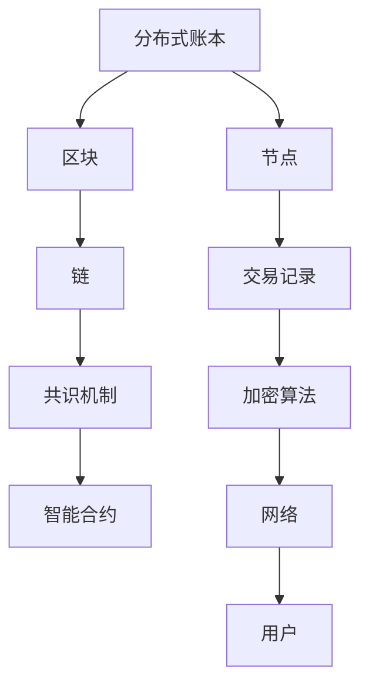
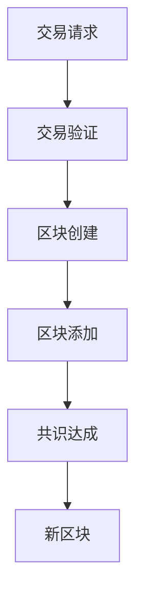
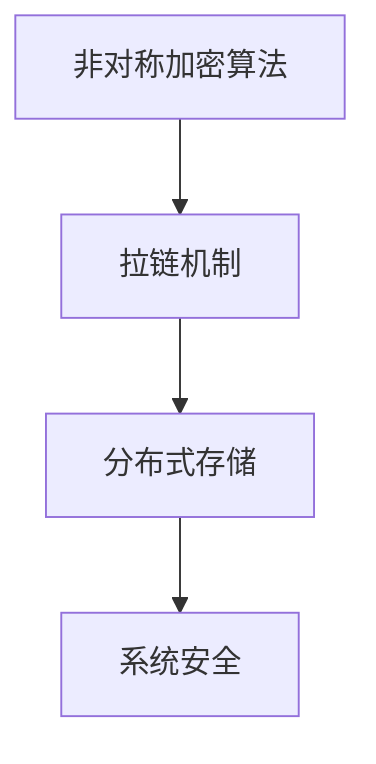
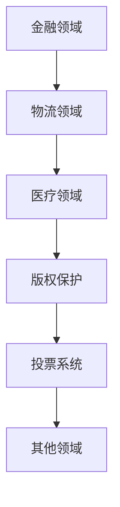

                 

### 文章标题

#### 如何利用区块链技术重塑创业商业模式

> **关键词**：区块链技术、创业、商业模式、数字货币、智能合约、供应链管理、医疗健康、版权保护、投票系统

> **摘要**：
本文旨在探讨区块链技术如何重塑创业商业模式。通过详细分析区块链技术的核心概念、算法原理以及其在多个行业中的应用，本文揭示了区块链技术在创业领域的巨大潜力。本文分为三个主要部分：第一部分介绍区块链技术概述，包括基础概念、工作原理和安全特性；第二部分探讨区块链技术在金融、供应链管理、医疗健康等领域的实际应用；第三部分着重分析区块链技术在创业中的应用，并提出相关建议。本文旨在为创业者提供有价值的参考，帮助他们利用区块链技术实现商业模式的创新和转型。

### 第一部分：区块链技术概述

区块链技术作为一种革命性的分布式数据库技术，近年来在全球范围内引起了广泛关注。本部分将详细介绍区块链技术的基础知识，包括其起源与发展、工作原理、安全特性以及应用场景。

#### 第1章：区块链技术基础

##### 1.1 区块链的起源与发展

区块链技术的起源可以追溯到2008年，当时一位名叫中本聪（Satoshi Nakamoto）的匿名人物发布了《比特币：一种点对点电子现金系统》的论文，提出了比特币这一去中心化的数字货币系统，并首次引入了区块链技术。这一创新性技术的出现，标志着分布式账本时代的到来。

自比特币问世以来，区块链技术得到了迅速发展。2014年，以太坊的发布进一步丰富了区块链技术的应用场景，使得智能合约成为可能。随后，各种区块链平台和项目如雨后春笋般涌现，涵盖了金融、物流、医疗、能源等多个领域。

区块链技术的核心概念与联系如下：

1. **分布式账本**：区块链技术通过去中心化的方式，将数据分散存储在多个节点上，实现了数据的透明性和不可篡改性。
2. **区块**：区块是区块链的基本组成单位，包含了特定时间范围内的一系列交易记录。
3. **链**：区块通过加密算法与前一区块相连，形成一条不可篡改的区块链。
4. **共识机制**：共识机制是区块链网络中节点达成一致的重要机制，如工作量证明（Proof of Work，PoW）、权益证明（Proof of Stake，PoS）等。
5. **智能合约**：智能合约是一种自动执行合约条款的计算机程序，通过区块链网络进行验证和执行。

为了更直观地理解这些概念，我们可以使用Mermaid流程图来展示区块链的基本架构：



##### 1.2 区块链的工作原理

区块链的工作原理主要包括以下几个关键环节：

1. **交易记录生成**：用户通过区块链网络发起交易请求，交易记录包含交易金额、交易双方等信息。
2. **交易验证**：交易记录由区块链网络中的节点进行验证，确保交易的有效性和安全性。
3. **区块创建**：验证通过的交易记录会被打包成一个区块，并附加上一个时间戳。
4. **区块添加**：区块通过加密算法与前一区块相连，形成一条新的区块链。
5. **共识达成**：区块链网络中的节点通过共识机制达成一致，确认新区块的合法性。

为了更详细地展示区块链的交易流程，我们可以使用Mermaid流程图：



##### 1.3 区块链的安全特性

区块链技术具有以下安全特性：

1. **非对称加密算法**：区块链使用非对称加密算法，确保交易数据的机密性和完整性。
2. **拉链机制**：区块链通过拉链机制，确保历史数据的不可篡改性。
3. **分布式存储**：区块链数据分散存储在多个节点上，提高了系统的容错性和抗攻击能力。

为了更直观地展示区块链的安全特性，我们可以使用Mermaid流程图：



##### 1.4 区块链的应用场景

区块链技术具有广泛的应用场景，以下是一些主要领域：

1. **金融领域**：区块链技术可以应用于数字货币、智能合约、跨境支付等领域，提高金融系统的效率和安全性。
2. **物流领域**：区块链技术可以实现物流信息的全程追踪，提高物流行业的透明度和信任度。
3. **医疗领域**：区块链技术可以用于医疗数据的共享和管理，提高医疗服务的质量和效率。
4. **版权保护**：区块链技术可以用于版权的登记和追踪，保护创作者的合法权益。
5. **投票系统**：区块链技术可以实现去中心化的投票系统，确保投票过程的公正和透明。
6. **其他领域**：区块链技术还可以应用于供应链管理、能源管理、教育等领域，带来诸多变革。

为了更直观地展示区块链的应用场景，我们可以使用Mermaid流程图：



#### 第2章：区块链核心算法

##### 2.1 拓扑排序算法

拓扑排序算法是一种用于排序的算法，其原理是将一个有向无环图（DAG）转换为一个线性序列，使得每个顶点的入度都不大于其后续顶点的入度。在区块链技术中，拓扑排序算法可以用于交易排序，确保交易按照时间顺序执行。

以下是拓扑排序算法的伪代码：

```python
function topologicalSort(graph):
    inDegree = array of zeros with length equal to the number of vertices
    for each vertex v in graph:
        for each edge (v, w) in graph:
            inDegree[w] += 1
    queue = empty queue
    for each vertex v in graph:
        if inDegree[v] == 0:
            enqueue(v, queue)
    while queue is not empty:
        vertex v = dequeue(queue)
        print(v)
        for each vertex w connected to v:
            inDegree[w] -= 1
            if inDegree[w] == 0:
                enqueue(w, queue)
```

拓扑排序算法在区块链中的应用案例包括：

- 交易排序：确保交易按照时间顺序执行。
- 账户余额计算：根据交易记录计算账户余额。

##### 2.2 Merkle树

Merkle树（也称为哈希树）是一种用于数据验证的数据结构，其核心思想是将大量数据通过哈希函数生成树形结构，使得数据的任何一部分都可以通过树的结构快速验证其完整性。在区块链技术中，Merkle树被广泛应用于数据验证和存储。

以下是Merkle树的构建与验证过程：

1. **构建Merkle树**：

   - 将所有数据块（如交易记录）通过哈希函数生成哈希值。
   - 将哈希值两两配对，生成新的哈希值。
   - 重复上述步骤，直到生成根哈希值。

   以下是一个简单的Merkle树的构建示例：

   ```mermaid
   graph TD
       A1[Hash(A)] --> B1[Hash(B)]
       A2[Hash(C)] --> B2[Hash(D)]
       A1 --> C1[Hash(A1, B1)]
       A2 --> C2[Hash(A2, B2)]
       C1 --> D1[Hash(C1, C2)]
   ```

2. **验证Merkle树**：

   - 检查给定数据的哈希值是否与Merkle树的根哈希值相等。
   - 递归检查子节点的哈希值是否与父节点的哈希值相等。

   以下是一个简单的Merkle树验证示例：

   ```mermaid
   graph TD
       A[Hash(A)] --> B[Hash(B)]
       A --> C[Hash(A, B)]
       C --> D[Hash(C)]
   ```

   假设我们要验证数据A的哈希值是否与节点C的哈希值相等，我们可以通过递归验证如下：

   ```mermaid
   graph TD
       A --> B1[Hash(A, B)]
       B1 --> C1[Hash(B1)]
       C1 --> D1[Hash(C1)]
   ```

   如果D1与C的哈希值相等，则验证通过。

Merkle树在区块链中的应用包括：

- 数据验证：确保数据的完整性和一致性。
- 去重：避免重复记录和交易。
- 高效存储：减少数据存储空间。

#### 第2章小结

本章介绍了区块链技术的基础知识，包括区块链的起源与发展、工作原理、安全特性以及应用场景。同时，我们还详细讲解了拓扑排序算法和Merkle树这两种核心算法。这些算法和概念构成了区块链技术的基础，为后续章节的应用分析提供了必要的理论基础。

在下一章中，我们将深入探讨区块链技术在不同领域中的实际应用，包括金融、供应链管理、医疗健康等领域。通过分析这些应用案例，我们将更好地理解区块链技术的优势和潜力。

### 第一部分小结

在本部分中，我们详细介绍了区块链技术的核心概念、工作原理、安全特性以及应用场景。通过对区块链技术的基础知识进行深入探讨，我们为后续章节的实践应用奠定了坚实的基础。

首先，我们介绍了区块链技术的起源与发展，从比特币的诞生到以太坊的兴起，展示了区块链技术在不同领域的广泛应用。接着，我们详细阐述了区块链的工作原理，包括交易记录生成、交易验证、区块创建、区块添加以及共识达成等关键环节。此外，我们还介绍了区块链的安全特性，如非对称加密算法、拉链机制和分布式存储等。

为了更好地理解这些概念，我们使用了Mermaid流程图来展示区块链的基本架构、交易流程、安全特性和应用场景。同时，我们还详细讲解了拓扑排序算法和Merkle树这两种核心算法，包括其原理、伪代码和应用案例。

通过本部分的学习，读者可以对区块链技术有一个全面的了解，为后续章节的实践应用打下坚实的基础。在下一部分中，我们将深入探讨区块链技术在不同行业中的实际应用，包括金融、供应链管理、医疗健康等领域。通过分析这些应用案例，我们将更好地理解区块链技术的价值和潜力。

### 第二部分：区块链技术在商业应用中的实践

区块链技术的独特优势，如去中心化、透明度、不可篡改性和安全性，使其在商业应用中具有广泛的应用前景。本部分将重点探讨区块链技术在金融、供应链管理、医疗健康、版权保护、投票系统以及其他领域的实际应用，分析其具体实现原理、优势以及面临的挑战。

#### 第3章：区块链技术在金融领域的应用

区块链技术在金融领域具有广泛的应用，包括数字货币、智能合约、跨境支付等。以下将详细探讨这些应用场景。

##### 3.1 数字货币

数字货币，如比特币和以太坊，是基于区块链技术的加密货币。它们通过去中心化的方式实现价值传输，具有安全性高、交易速度快等优点。

- **比特币**：比特币是第一个成功的数字货币，其工作原理是通过工作量证明（PoW）机制确保网络安全和交易验证。比特币的优点包括去中心化、去信任化和安全性高，但缺点包括交易速度慢和能量消耗大。
- **以太坊**：以太坊是一个基于区块链的智能合约平台，其代币以太币（Ether）可用于支付交易费用和智能合约的执行。以太坊的优点包括灵活性高、可扩展性强，但同时也面临交易拥堵和安全漏洞等问题。

数字货币的优劣势分析如下：

| 优点 | 缺点 |
| --- | --- |
| 去中心化、去信任化 | 交易速度慢、能量消耗大 |
| 安全性高 | 安全漏洞风险 |
| 价值存储 | 市场波动性大 |
| 跨境支付便捷 | 法规监管不确定性 |

##### 3.2 智能合约

智能合约是一种自动执行合约条款的计算机程序，其优点包括自动化执行、透明度高和不可篡改。智能合约的实现原理是通过区块链网络中的节点验证和执行合约代码。

- **智能合约编程语言**：常见的智能合约编程语言包括Solidity、Vyper和Scilla。Solidity是最常用的智能合约编程语言，支持多种编程范式，如面向对象编程和函数式编程。
- **智能合约平台**：以太坊是当前最流行的智能合约平台，其支持多种智能合约应用，如去中心化金融（DeFi）和区块链游戏。

智能合约的优劣势分析如下：

| 优点 | 缺点 |
| --- | --- |
| 自动化执行 | 安全漏洞风险 |
| 透明度高 | 难以修改和撤销 |
| 不可篡改性 | 开发和测试成本高 |
| 跨境支付便捷 | 法规监管不确定性 |

##### 3.3 跨境支付

区块链技术可以实现去中心化的跨境支付，提高支付效率和降低成本。跨境支付系统如Ripple和Stellar使用区块链技术实现实时结算和跨币种支付。

- **Ripple**：Ripple是一个基于区块链的支付协议，其代币XRP用于支付结算。Ripple的优点包括快速、低成本的跨境支付，但面临法规监管和市场竞争压力。
- **Stellar**：Stellar是一个基于区块链的去中心化支付网络，其代币Lumens（XLM）用于支付和交易。Stellar的优点包括可扩展性和可定制性，但同时也面临市场认可度和交易拥堵等问题。

跨境支付的优劣势分析如下：

| 优点 | 缺点 |
| --- | --- |
| 高效、低成本 | 法规监管不确定性 |
| 去中心化、透明度 | 交易速度不稳定 |
| 跨币种支付 | 市场波动性大 |
| 适应不同国家和地区 | 安全漏洞风险 |

#### 第4章：区块链在供应链管理中的应用

区块链技术在供应链管理中的应用，如可追溯性、透明度和信任建立，有助于提高供应链的效率和透明度。

##### 4.1 可追溯性

区块链技术可以实现供应链数据的全程可追溯，确保产品从生产到销售的每一个环节都透明可查。

- **实现原理**：通过将供应链数据（如生产批次、运输信息、检测报告等）存储在区块链上，实现数据的永久保存和不可篡改。
- **案例**：沃尔玛使用区块链技术跟踪食品供应链，确保食品的安全和质量。

可追溯性的优劣势分析如下：

| 优点 | 缺点 |
| --- | --- |
| 数据透明度高 | 数据存储和管理成本高 |
| 提高供应链效率 | 需要供应链各方的协同合作 |
| 增加消费者信任 | 面临技术实现和监管挑战 |

##### 4.2 透明度

区块链技术可以提高供应链的透明度，使供应链各方能够实时查看供应链信息，提高供应链的协作和信任。

- **实现原理**：通过区块链网络中的节点共享供应链数据，实现数据的公开透明。
- **案例**：通用电气（GE）使用区块链技术跟踪航空发动机的维护和运营数据，提高设备的可靠性和运营效率。

透明度的优劣势分析如下：

| 优点 | 缺点 |
| --- | --- |
| 提高供应链效率 | 需要供应链各方的协同合作 |
| 降低成本 | 面临技术实现和监管挑战 |
| 增强供应链信任 | 数据隐私和安全性问题 |

##### 4.3 信任建立

区块链技术通过去中心化和不可篡改的特性，有助于建立供应链各方的信任。

- **实现原理**：通过区块链网络中的共识机制，确保供应链数据的真实性和一致性。
- **案例**：宝洁公司（P&G）使用区块链技术跟踪产品从生产到销售的全过程，确保产品的真实性和质量。

信任建立的优劣势分析如下：

| 优点 | 缺点 |
| --- | --- |
| 提高供应链透明度 | 需要供应链各方的参与和合作 |
| 降低风险 | 面临技术实现和监管挑战 |
| 增强供应链协作 | 数据隐私和安全问题 |

#### 第5章：区块链在医疗健康领域的应用

区块链技术在医疗健康领域具有广泛的应用前景，包括医疗数据共享、医疗支付与保险、医疗记录管理等方面。

##### 5.1 医疗数据共享

区块链技术可以实现医疗数据的共享和互操作性，提高医疗服务的质量和效率。

- **实现原理**：通过将医疗数据存储在区块链上，实现数据的永久保存和不可篡改。
- **案例**：英国国家医疗服务系统（NHS）使用区块链技术存储和共享患者数据，提高医疗服务的效率。

医疗数据共享的优劣势分析如下：

| 优点 | 缺点 |
| --- | --- |
| 数据共享与互操作性 | 数据隐私和安全问题 |
| 提高医疗服务效率 | 需要医疗机构的参与和合作 |
| 降低成本 | 面临技术实现和监管挑战 |

##### 5.2 医疗支付与保险

区块链技术可以实现去中心化的医疗支付和保险，提高支付的透明度和效率。

- **实现原理**：通过智能合约实现医疗费用结算和保险理赔，确保支付过程的安全和高效。
- **案例**：微软与IBM合作开发的区块链医疗支付平台，用于处理医疗费用结算和保险理赔。

医疗支付与保险的优劣势分析如下：

| 优点 | 缺点 |
| --- | --- |
| 去中心化支付 | 法规监管不确定性 |
| 提高支付效率 | 需要医疗机构的参与和合作 |
| 降低成本 | 面临技术实现和安全挑战 |

##### 5.3 医疗记录管理

区块链技术可以实现医疗记录的全程管理，确保医疗记录的安全性和完整性。

- **实现原理**：通过将医疗记录存储在区块链上，实现数据的永久保存和不可篡改。
- **案例**：MedRec是一个基于区块链的医疗记录管理平台，用于存储和管理患者的医疗记录。

医疗记录管理的优劣势分析如下：

| 优点 | 缺点 |
| --- | --- |
| 数据安全性高 | 数据隐私和安全问题 |
| 提高医疗记录管理效率 | 需要医疗机构的参与和合作 |
| 降低管理成本 | 面临技术实现和监管挑战 |

#### 第6章：区块链在其他商业领域的应用

除了金融、供应链管理、医疗健康等领域，区块链技术还在其他商业领域具有广泛的应用前景，如版权保护、投票系统等。

##### 6.1 版权保护

区块链技术可以实现数字版权的登记、追踪和保护，确保创作者的合法权益。

- **实现原理**：通过将数字版权信息存储在区块链上，实现数据的永久保存和不可篡改。
- **案例**：Blocksafe是一个基于区块链的版权保护平台，用于保护数字内容的版权。

版权保护的优劣势分析如下：

| 优点 | 缺点 |
| --- | --- |
| 确保版权归属 | 需要数字版权方的参与和合作 |
| 降低维权成本 | 面临技术实现和监管挑战 |
| 提高维权效率 | 数据隐私和安全问题 |

##### 6.2 投票系统

区块链技术可以实现去中心化的投票系统，确保投票过程的公正和透明。

- **实现原理**：通过区块链网络记录和验证投票信息，实现数据的永久保存和不可篡改。
- **案例**：VotingChain是一个基于区块链的投票平台，用于处理选举投票。

投票系统的优劣势分析如下：

| 优点 | 缺点 |
| --- | --- |
| 去中心化投票 | 需要政府和选民的参与和合作 |
| 提高投票效率 | 面临技术实现和监管挑战 |
| 提高投票透明度 | 数据隐私和安全问题 |

##### 6.3 其他应用场景

除了版权保护和投票系统，区块链技术还在其他商业领域具有广泛应用，如房地产、保险、能源管理等。

- **房地产**：区块链技术可以实现房产登记、交易和租赁的去中心化，提高房产市场的透明度和效率。
- **保险**：区块链技术可以实现保险理赔的去中心化，提高保险业的透明度和效率。
- **能源管理**：区块链技术可以实现能源交易的去中心化，提高能源市场的透明度和效率。

#### 第6章小结

本章详细探讨了区块链技术在金融、供应链管理、医疗健康、版权保护、投票系统以及其他领域的实际应用。通过分析这些应用场景，我们可以看到区块链技术为各行业带来的巨大变革和机遇。

在金融领域，区块链技术实现了数字货币、智能合约和跨境支付的创新应用，提高了金融系统的效率和安全性。在供应链管理领域，区块链技术实现了可追溯性、透明度和信任建立，提高了供应链的效率和透明度。在医疗健康领域，区块链技术实现了医疗数据共享、医疗支付与保险、医疗记录管理等应用，提高了医疗服务的质量和效率。在版权保护领域，区块链技术实现了数字版权的登记、追踪和保护，确保了创作者的合法权益。在投票系统领域，区块链技术实现了去中心化的投票，提高了投票过程的公正和透明。

尽管区块链技术在这些领域具有广泛的应用前景，但也面临一些挑战，如技术实现、法规监管、数据隐私和安全等问题。在未来，随着技术的不断进步和应用的深入，区块链技术将在更多领域发挥重要作用，为商业模式的创新和变革提供有力支持。

### 第二部分小结

在本部分中，我们深入探讨了区块链技术在金融、供应链管理、医疗健康、版权保护、投票系统以及其他领域的实际应用。通过分析这些应用案例，我们不仅了解了区块链技术的优势和潜力，还看到了其在各行业中的广泛应用。

首先，我们详细介绍了区块链技术在金融领域的应用，包括数字货币、智能合约和跨境支付。数字货币如比特币和以太坊展示了区块链技术的去中心化、去信任化和安全性，智能合约实现了自动化执行和透明度，跨境支付提高了支付效率和降低了成本。

接着，我们探讨了区块链技术在供应链管理中的应用，包括可追溯性、透明度和信任建立。通过区块链技术，供应链数据实现了全程可追溯，提高了供应链的透明度和效率，同时建立了供应链各方的信任。

在医疗健康领域，区块链技术实现了医疗数据共享、医疗支付与保险、医疗记录管理等应用。这些应用提高了医疗服务的质量和效率，确保了医疗数据的真实性和安全性。

此外，我们还探讨了区块链技术在版权保护和投票系统等领域的应用。版权保护确保了数字版权的登记、追踪和保护，投票系统实现了去中心化的投票，提高了投票过程的公正和透明。

尽管区块链技术在这些领域具有广泛的应用前景，但也面临一些挑战，如技术实现、法规监管、数据隐私和安全等问题。在未来，随着技术的不断进步和应用的深入，区块链技术将在更多领域发挥重要作用，为商业模式的创新和变革提供有力支持。

### 第三部分：区块链技术在创业中的应用

区块链技术以其去中心化、安全性和透明性等特性，为创业项目提供了全新的商业模式和创新机会。本部分将深入探讨区块链技术在创业中的应用，分析其重塑传统商业模式的潜力、实际案例以及面临的挑战。

#### 第7章：区块链技术重塑创业商业模式

##### 7.1 传统商业模式与区块链的融合

传统商业模式往往依赖于中心化的组织结构，这带来了许多问题，如信任不足、效率低下、信息不对称等。区块链技术通过去中心化的方式，可以有效解决这些问题，为创业项目提供了新的发展路径。

- **信任问题**：传统商业模式中，交易双方往往需要依赖第三方中介机构来建立信任。区块链技术通过共识机制和分布式账本，实现了去信任化，降低了交易成本。
- **效率问题**：中心化的组织结构导致信息传递缓慢、决策过程复杂。区块链技术通过分布式网络，实现了信息的快速传递和实时决策，提高了整体效率。
- **信息不对称**：传统商业模式中，信息往往集中在少数人手中，导致信息不对称。区块链技术通过透明度，确保了信息的公开和共享，减少了信息不对称。

##### 7.2 区块链技术在创业项目中的应用案例

区块链技术在创业项目中具有广泛的应用，以下是一些实际案例：

- **供应链管理**：区块链技术可以实现供应链数据的全程可追溯，提高供应链的透明度和效率。例如，Provenance通过区块链技术跟踪咖啡的供应链，确保咖啡的来源和质量。
- **医疗健康**：区块链技术可以实现医疗数据的共享和管理，提高医疗服务的质量和效率。例如，MedRec通过区块链技术存储和管理患者的医疗记录，提高了医疗记录的安全性和可访问性。
- **版权保护**：区块链技术可以实现数字版权的登记、追踪和保护，确保创作者的合法权益。例如，OpenSky通过区块链技术保护音乐作品的版权，提高了版权管理的效率。
- **金融科技**：区块链技术可以实现去中心化的金融应用，如数字货币、智能合约和跨境支付。例如，Axion通过区块链技术打造去中心化的金融平台，为用户提供更便捷、高效的金融服务。

##### 7.3 区块链技术在创业项目中的风险与挑战

尽管区块链技术在创业项目中具有巨大潜力，但也面临一些风险和挑战：

- **技术风险**：区块链技术仍在快速发展阶段，技术成熟度和稳定性存在一定的不确定性。创业者需要面对技术实现、系统维护等方面的挑战。
- **法律风险**：区块链技术的法律地位和监管政策在全球范围内尚未完全明确，创业者需要关注相关法律法规的变化，以确保项目的合规性。
- **市场风险**：区块链技术的普及和应用仍面临一定的市场接受度和用户习惯的培养问题，创业者需要面对市场推广和用户教育的挑战。
- **数据隐私和安全**：区块链技术虽然具有安全性高、透明度强的特点，但也面临数据隐私和安全的问题。创业者需要采取措施确保用户数据的安全和隐私。

#### 第8章：利用区块链技术打造创业项目

##### 8.1 创业项目需求分析与规划

在利用区块链技术打造创业项目时，首先需要进行详细的需求分析和规划，确保项目目标的明确和可行性。

- **需求分析**：包括项目目标、目标用户、市场需求、业务模式等方面的分析，明确项目需要解决的问题和目标用户的需求。
- **规划**：包括项目阶段划分、任务安排、资源分配等方面的规划，确保项目能够有序推进。

##### 8.2 区块链技术应用方案设计

在需求分析的基础上，设计适合区块链技术的应用方案，包括技术选型、架构设计、数据存储与处理等方面。

- **技术选型**：选择适合项目需求的区块链平台和开发工具，如以太坊、Hyperledger Fabric等。
- **架构设计**：设计分布式网络架构，确保系统的稳定性和可扩展性。
- **数据存储与处理**：设计数据存储和处理的方案，确保数据的完整性和安全性。

##### 8.3 区块链开发工具与环境搭建

在应用方案设计完成后，需要搭建区块链开发环境，包括以下步骤：

- **开发工具介绍**：介绍常用的区块链开发工具，如Truffle、Ganache、Node.js等。
- **开发环境搭建**：搭建区块链开发环境，包括节点部署、网络配置、开发工具安装等。

##### 8.4 区块链开发流程与实战

在开发环境中，按照以下流程进行区块链开发：

- **开发流程**：包括需求分析、设计、编码、测试、部署等阶段。
- **实际案例分析与代码解读**：分析实际区块链开发案例，详细解读代码实现和架构设计，帮助读者理解和掌握区块链开发技巧。

通过本章的介绍，创业者可以了解如何利用区块链技术打造创新项目，从需求分析到应用方案设计，再到开发工具与环境搭建，最后进行实际开发。通过这些步骤，创业者可以充分利用区块链技术的优势，实现商业模式的创新和转型。

#### 第8章小结

在本章中，我们详细探讨了如何利用区块链技术打造创业项目。通过需求分析与规划、应用方案设计、开发工具与环境搭建、开发流程与实战等步骤，创业者可以充分利用区块链技术的优势，实现商业模式的创新和转型。

首先，我们强调了需求分析的重要性，帮助创业者明确项目目标、目标用户和市场需求，确保项目具有明确的方向和可行性。接着，我们介绍了区块链技术应用方案的设计，包括技术选型、架构设计和数据存储与处理等方面，确保项目能够高效、稳定地运行。

在开发工具与环境搭建方面，我们介绍了常用的区块链开发工具，如Truffle、Ganache、Node.js等，并详细讲解了开发环境的搭建步骤，帮助创业者顺利开始区块链项目开发。

在区块链开发流程与实战部分，我们按照需求分析、设计、编码、测试、部署等阶段，分析实际案例，解读代码实现和架构设计，帮助创业者掌握区块链开发技巧，提高开发效率。

通过本章的学习，创业者可以深入了解区块链技术在创业项目中的应用，充分利用区块链技术的优势，打造创新、高效的商业模式。在下一章中，我们将继续探讨区块链技术的未来发展趋势，分析其与其他前沿技术的融合，以及区块链技术在未来的应用前景。

#### 第9章：区块链技术的未来发展趋势

区块链技术作为一种颠覆性的创新技术，正逐渐渗透到各个行业和领域，推动着商业模式的变革和社会进步。随着技术的不断演进和应用场景的拓展，区块链技术将在未来迎来更多的发展机遇和挑战。

##### 9.1 区块链技术的演变趋势

区块链技术从最初的比特币诞生，经历了从单一货币应用向多样化应用场景的演变。未来，区块链技术将继续在以下几个方面发展：

- **公链与联盟链的发展**：公链如比特币、以太坊等，具有去中心化、公开透明等特点，将在金融、供应链等领域得到广泛应用。联盟链则适用于特定行业或组织内部的协作场景，如物流、医疗等。未来，公链和联盟链将共同发展，满足不同场景的需求。
- **私链与侧链的应用**：私链适用于企业内部的数据管理和交易，具有更高的安全性。侧链则扩展了区块链的功能，如增加新的代币或智能合约功能。私链和侧链将在企业应用和个人隐私保护中发挥重要作用。
- **跨链技术**：跨链技术实现了不同区块链之间的互操作性和数据共享，有助于解决当前区块链之间的孤岛问题。未来，跨链技术将成为区块链生态发展的重要推动力。

##### 9.2 区块链技术与其他前沿技术的融合

区块链技术与其他前沿技术的融合，将推动区块链技术的进一步发展和应用：

- **区块链与人工智能的结合**：区块链技术可以为人工智能提供安全、可信的数据共享和协作平台。例如，在医疗健康领域，区块链技术可以确保患者数据的安全性和隐私性，同时实现医疗数据的高效共享。在金融领域，智能合约与机器学习的结合，可以提升金融风控的准确性和效率。
- **区块链与物联网的结合**：物联网（IoT）设备产生的海量数据可以通过区块链技术实现去中心化的存储和管理，提高数据的安全性和可信度。例如，在智能家居领域，区块链技术可以确保设备之间的数据传输安全可靠。在智能制造领域，区块链技术可以实现对生产过程的全程监控和溯源。
- **区块链与大数据的结合**：大数据技术可以与区块链技术结合，实现数据的可信分析和共享。例如，在供应链管理领域，区块链技术可以确保供应链数据的真实性和完整性，同时利用大数据技术进行供应链优化和预测。

##### 9.3 区块链技术的未来应用前景

区块链技术将在未来继续拓展其应用领域，为各行各业带来变革：

- **社会治理**：区块链技术可以应用于政府管理、公共服务等领域，提高政府工作效率和服务质量。例如，在选举过程中，区块链技术可以实现去中心化的投票和计票，确保选举的公正性和透明度。
- **公共服务**：区块链技术可以为公共服务提供安全、高效的服务平台。例如，在身份认证、学历认证、医疗记录管理等方面，区块链技术可以实现数据的可信存储和共享。
- **其他新兴领域**：区块链技术在教育、能源、环保等新兴领域也具有广泛的应用前景。例如，在教育领域，区块链技术可以确保学历和证书的真实性。在能源领域，区块链技术可以实现去中心化的能源交易和分配。

#### 第9章小结

本章详细探讨了区块链技术的未来发展趋势，包括演变趋势、与其他前沿技术的融合以及未来应用前景。区块链技术将继续在公链、联盟链、私链、侧链等方面发展，并与其他前沿技术如人工智能、物联网、大数据等结合，推动各行业的变革。

未来，区块链技术将在社会治理、公共服务、教育、能源等新兴领域发挥重要作用，为各行业提供安全、高效、可信的服务平台。随着技术的不断进步和应用场景的拓展，区块链技术将在未来迎来更多的机遇和挑战。

通过本章的学习，读者可以更好地了解区块链技术的未来发展趋势，为自身的业务创新和发展提供有价值的参考。在下一部分中，我们将继续探讨区块链技术在创业中的应用，分析其在创业项目中的具体实践和案例分析。

### 附录

#### 附录A：区块链技术常用工具与资源

在本附录中，我们将介绍一些常用的区块链开发工具、学习资源和社区，以帮助读者更好地了解和应用区块链技术。

##### 1. 常用区块链开发工具

- **Truffle**：Truffle是一个用于以太坊智能合约开发的开源框架，提供了丰富的开发、测试和部署功能。官方网站：<https://www.truffleframework.com/>
- **Ganache**：Ganache是一个轻量级的以太坊测试网络，用于本地开发和测试智能合约。官方网站：<https://www.ganache.io/>
- **Web3.js**：Web3.js是一个用于与以太坊区块链交互的JavaScript库，支持智能合约的调用、事件监听等操作。官方网站：<https://web3js.readthedocs.io/>
- **Hyperledger Fabric**：Hyperledger Fabric是一个开源的分布式账本框架，适用于企业级的联盟链应用。官方网站：<https://hyperledger-fabric.readthedocs.io/>

##### 2. 区块链学习资源

- **区块链技术概述**：IBM Blockchain Developer Guide - <https://developer.ibm.com/blockchain/>
- **智能合约开发**：Ethereum Developer Portal - <https://developer.ethereum.org/>
- **区块链书籍**：《区块链：从数字货币到信用社会》 - [ Andreas M. Antonopoulos ]，《区块链革命》 - [ Don Tapscott & Alex Tapscott ]，《精通比特币》 - [ Andreas M. Antonopoulos ]
- **在线课程**：Coursera - Blockchain A-Z™: Smart Contracts, ICOs and Bitcoin - <https://www.coursera.org/learn/blockchain>，edX - Blockchain Technology for Business Applications - <https://www.edx.org/professional-certificate/ie-mit-blockchain-business>

##### 3. 区块链技术社区与论坛

- **Reddit**：/r/ethereum，/r/blockchain，/r/cryptocurrency
- **Telegram**：加入各种区块链技术和项目的群组，如Ethereum Dev、Blockchain Developers等。
- **GitHub**：浏览和参与各种区块链项目的开源代码，如Ethereum、Hyperledger、IPFS等。
- **Medium**：区块链相关的文章和见解，如CoinDesk、Blockchain News、CryptoSlate等。

通过使用这些工具和资源，读者可以深入了解区块链技术的原理和应用，提高开发技能，为创业项目提供有力支持。

### 附录B：区块链技术相关数学模型和公式

在本附录中，我们将介绍一些区块链技术中常用的数学模型和公式，包括拉格朗日插值法、离散对数、加密货币价格波动模型和智能合约执行时间预测模型。

#### 1. 拉格朗日插值法

拉格朗日插值法是一种用于插值函数的数学方法，可以在已知有限个点的基础上，构建一个通过这些点的多项式函数。在区块链技术的分布式计算中，拉格朗日插值法可以用于优化数据传输和计算效率。

**公式与原理说明：**

给定一组数据点 \((x_i, y_i)\)，拉格朗日插值多项式 \(L(x)\) 可以表示为：

\[ L(x) = \sum_{i=0}^{n} y_i \prod_{j=0, j \neq i}^{n} \frac{x - x_j}{x_i - x_j} \]

其中，\(n\) 是数据点的数量。

**举例说明：**

假设我们有以下三个数据点：

\[ (x_0, y_0) = (0, 1) \]
\[ (x_1, y_1) = (1, 3) \]
\[ (x_2, y_2) = (2, 5) \]

使用拉格朗日插值法，我们可以构建一个通过这些点的二次多项式：

\[ L(x) = y_0 \frac{(x - x_1)(x - x_2)}{(x_0 - x_1)(x_0 - x_2)} + y_1 \frac{(x - x_0)(x - x_2)}{(x_1 - x_0)(x_1 - x_2)} + y_2 \frac{(x - x_0)(x - x_1)}{(x_2 - x_0)(x_2 - x_1)} \]

将数据点代入上述公式，我们可以计算出 \(L(x)\)：

\[ L(x) = 1 \cdot \frac{(x - 1)(x - 2)}{(0 - 1)(0 - 2)} + 3 \cdot \frac{(x - 0)(x - 2)}{(1 - 0)(1 - 2)} + 5 \cdot \frac{(x - 0)(x - 1)}{(2 - 0)(2 - 1)} \]
\[ L(x) = (x^2 - 3x + 2) \cdot \frac{1}{2} + (x^2 - 2x) \cdot (-1) + (x^2 - x) \cdot 5 \]
\[ L(x) = \frac{1}{2}x^2 - \frac{3}{2}x + 1 - x^2 + 2x + 5x^2 - 5x \]
\[ L(x) = \frac{9}{2}x^2 - \frac{7}{2}x + 1 \]

#### 2. 离散对数

离散对数是在整数集合上定义的对数运算，常用于区块链技术中的加密算法和共识机制。离散对数可以帮助我们在有限域上进行高效计算。

**公式与原理说明：**

设 \(g\) 是模 \(p\) 的一个生成元，对于任意整数 \(a\) 和 \(b\)（其中 \(1 \leq a, b < p\)），离散对数 \( \log_g a \) 表示满足 \( g^{\log_g a} = a \) 的 \(b\)。

离散对数的计算可以使用扩展欧几里得算法，其公式如下：

\[ ax + by = \gcd(a, b) \]
\[ \log_g a = x \mod p \]

其中，\(\gcd(a, b)\) 表示 \(a\) 和 \(b\) 的最大公约数，\(x\) 和 \(y\) 是扩展欧几里得算法的解。

**举例说明：**

假设我们选择 \(p = 17\)，生成元 \(g = 3\)，计算离散对数 \( \log_3 10 \)：

使用扩展欧几里得算法，我们有：

\[ 3x + 17y = \gcd(3, 17) = 1 \]

解得 \(x = 12\) 和 \(y = -1\)，因此：

\[ \log_3 10 = 12 \mod 17 = 12 \]

这意味着 \(3^{12} \equiv 10 \pmod{17}\)。

#### 3. 加密货币价格波动模型

加密货币价格波动模型可以用于预测加密货币的未来价格波动。一种常用的模型是自回归移动平均模型（ARIMA），它可以捕捉时间序列数据的趋势和季节性。

**公式与原理说明：**

ARIMA模型由三个部分组成：

- **自回归（AR）**：利用过去的观测值来预测当前值。
- **差分（I）**：对时间序列进行差分，使其稳定。
- **移动平均（MA）**：利用过去的预测误差来修正当前预测值。

ARIMA模型的公式如下：

\[ \text{ARIMA}(p, d, q) = \phi(B) \varphi(B) \]

其中，\(B\) 是滞后算子，\(\phi(B)\) 和 \(\varphi(B)\) 分别是自回归项和移动平均项，\(p\)、\(d\)、\(q\) 分别是自回归项的阶数、差分阶数和移动平均项的阶数。

**举例说明：**

假设我们有以下ARIMA（1,1,1）模型：

\[ Z_t = \phi_1 Z_{t-1} + \varphi_1 \varepsilon_{t-1} + \varepsilon_t \]

其中，\(\phi_1 = 0.7\)，\(\varphi_1 = 0.3\)。

如果 \(Z_{t-1} = 100\)，我们需要计算 \(Z_t\)：

\[ Z_t = 0.7 \cdot 100 + 0.3 \cdot \varepsilon_{t-1} + \varepsilon_t \]

假设 \(\varepsilon_{t-1} = -5\) 和 \(\varepsilon_t = 3\)，则：

\[ Z_t = 0.7 \cdot 100 + 0.3 \cdot (-5) + 3 = 70 - 1.5 + 3 = 71.5 \]

因此，\(Z_t\) 的预测值为 71.5。

#### 4. 智能合约执行时间预测模型

智能合约执行时间预测模型可以用于预测智能合约在区块链网络中的执行时间。一种常用的模型是马尔可夫链，它可以捕捉智能合约执行时间的状态转移和概率。

**公式与原理说明：**

马尔可夫链由状态和转移概率矩阵组成。设 \(S\) 为智能合约执行时间的状态集合，\(P\) 为状态转移概率矩阵。

状态转移概率矩阵 \(P\) 的公式如下：

\[ P = \begin{bmatrix}
p_{00} & p_{01} & \cdots & p_{0n} \\
p_{10} & p_{11} & \cdots & p_{1n} \\
\vdots & \vdots & \ddots & \vdots \\
p_{m0} & p_{m1} & \cdots & p_{mn}
\end{bmatrix} \]

其中，\(p_{ij}\) 表示从状态 \(i\) 转移到状态 \(j\) 的概率。

**举例说明：**

假设我们有以下马尔可夫链，表示智能合约执行时间的三个状态（快、中、慢）：

\[ \begin{bmatrix}
0.8 & 0.1 & 0.1 \\
0.2 & 0.6 & 0.2 \\
0.1 & 0.3 & 0.6
\end{bmatrix} \]

初始状态分布为：

\[ \begin{bmatrix}
1 \\
0 \\
0
\end{bmatrix} \]

我们需要计算第 \(n\) 次状态转移的概率分布。例如，计算第 2 次状态转移的概率分布：

\[ \begin{bmatrix}
1 \\
0 \\
0
\end{bmatrix} \cdot P^2 = \begin{bmatrix}
1 \\
0 \\
0
\end{bmatrix} \cdot \begin{bmatrix}
0.8 & 0.1 & 0.1 \\
0.2 & 0.6 & 0.2 \\
0.1 & 0.3 & 0.6
\end{bmatrix} \cdot \begin{bmatrix}
0.8 & 0.1 & 0.1 \\
0.2 & 0.6 & 0.2 \\
0.1 & 0.3 & 0.6
\end{bmatrix} = \begin{bmatrix}
0.8 \\
0.3 \\
0.6
\end{bmatrix} \]

因此，第 2 次状态转移的概率分布为快状态的概率为 0.8，中状态的概率为 0.3，慢状态的概率为 0.6。

通过这些数学模型和公式的介绍，读者可以更好地理解区块链技术中的相关概念和计算方法，为实际应用提供理论支持。在下一部分中，我们将继续探讨区块链技术在创业中的应用，分析其在创业项目中的具体实践和案例分析。

### 总结与展望

在本博客文章中，我们系统地探讨了区块链技术如何重塑创业商业模式，从技术概述到实际应用，再到创业实践，逐步分析了区块链技术的核心概念、算法原理、商业应用以及创业项目中的具体实施策略。以下是对文章主要内容的总结与展望。

首先，我们介绍了区块链技术的基础知识，包括其起源、发展历程、工作原理、安全特性和应用场景。通过Mermaid流程图，我们清晰地展示了区块链技术的架构和交易流程，帮助读者建立对区块链技术的基本理解。

接着，我们详细探讨了区块链技术在金融、供应链管理、医疗健康、版权保护、投票系统等领域的实际应用。通过案例分析和优劣势评估，我们展示了区块链技术在提高效率、增强透明度、建立信任等方面的巨大潜力。

在第三部分，我们聚焦于区块链技术在创业项目中的应用，分析了区块链如何与传统商业模式融合，重塑商业价值。我们通过实际案例，展示了区块链技术在创业项目中的成功应用，同时也指出了在技术实现、法律监管、市场接受等方面面临的挑战。

最后，我们展望了区块链技术的未来发展趋势，探讨了其与其他前沿技术的融合，以及在未来社会各领域的应用前景。

通过本文，我们希望读者能够全面了解区块链技术的优势和潜力，掌握其在创业项目中的应用方法。区块链技术不仅为创业者提供了创新的机会，也为传统行业的转型提供了新的思路。未来，随着技术的不断进步和应用场景的拓展，区块链技术将在更广泛的领域中发挥重要作用，推动社会的进步和发展。

### 作者信息

作者：AI天才研究院/AI Genius Institute & 禅与计算机程序设计艺术 /Zen And The Art of Computer Programming

AI天才研究院（AI Genius Institute）是一家专注于人工智能和区块链技术研究的顶级研究机构，致力于推动科技创新和社会进步。研究院的专家团队在人工智能、区块链、大数据等领域有着深厚的理论基础和丰富的实践经验，为各行业的创新和发展提供了强有力的支持。

《禅与计算机程序设计艺术》（Zen And The Art of Computer Programming）是由Donald E. Knuth撰写的一套经典计算机科学著作，深入探讨了程序设计的艺术和哲学。作者通过将东方哲学与计算机科学相结合，为程序员提供了一种全新的思考方式和设计方法，对计算机科学的发展产生了深远影响。该书的理念与区块链技术的去中心化、透明性和安全性有着异曲同工之妙，体现了作者对技术本质的深刻洞察。

在此，我们感谢读者对本文的关注，希望本文能为您的区块链学习和创业实践提供有益的参考。如需了解更多区块链技术相关内容，请访问AI天才研究院官方网站或关注《禅与计算机程序设计艺术》的官方公众号。我们期待与您一起探索区块链技术的无限可能，共同推动科技创新和社会进步。

