                 

### 《如何利用技术能力进行农业科技创新》的目录大纲

在撰写《如何利用技术能力进行农业科技创新》这篇文章之前，我们需要制定一个详细的目录大纲，以确保文章结构清晰、内容连贯。以下是文章的目录大纲结构，每个章节都将深入探讨农业科技创新的不同方面。

#### 第一部分：农业科技创新概述

1. **第1章：农业科技创新概述**

   - 1.1 农业科技创新的定义与重要性
     - 1.1.1 农业科技创新的概念
     - 1.1.2 农业科技创新的重要性
     - 1.1.3 农业科技创新与现代农业发展

   - 1.2 农业科技创新的主要领域
     - 1.2.1 生物技术
     - 1.2.2 种植技术
     - 1.2.3 养殖技术
     - 1.2.4 环境保护技术
     - 1.2.5 农业信息技术

#### 第二部分：农业科技创新核心技术

2. **第2章：农业科技创新核心技术**

   - 2.1 生物技术

     - 2.1.1 基因编辑技术
       - 2.1.1.1 CRISPR-Cas9基因编辑技术原理
       - 2.1.1.2 基因编辑技术的应用
     - 2.1.2 分子标记辅助选择技术
       - 2.1.2.1 分子标记辅助选择技术的原理
       - 2.1.2.2 分子标记辅助选择技术的应用

   - 2.2 种植技术

     - 2.2.1 精准农业
       - 2.2.1.1 精准农业的概念
       - 2.2.1.2 精准农业的技术体系
     - 2.2.2 高效节水灌溉技术
       - 2.2.2.1 高效节水灌溉技术的原理
       - 2.2.2.2 高效节水灌溉技术的应用

   - 2.3 养殖技术

     - 2.3.1 生物反应器技术
       - 2.3.1.1 生物反应器技术的原理
       - 2.3.1.2 生物反应器技术的应用
     - 2.3.2 现代养殖设施
       - 2.3.2.1 现代养殖设施的概念
       - 2.3.2.2 现代养殖设施的应用

   - 2.4 环境保护技术

     - 2.4.1 农业面源污染控制技术
       - 2.4.1.1 农业面源污染控制技术的原理
       - 2.4.1.2 农业面源污染控制技术的应用
     - 2.4.2 生态农业技术
       - 2.4.2.1 生态农业技术的概念
       - 2.4.2.2 生态农业技术的应用

   - 2.5 农业信息技术

     - 2.5.1 农业大数据技术
       - 2.5.1.1 农业大数据技术的原理
       - 2.5.1.2 农业大数据技术的应用
     - 2.5.2 农业物联网技术
       - 2.5.2.1 农业物联网技术的原理
       - 2.5.2.2 农业物联网技术的应用

#### 第三部分：农业科技创新应用案例

3. **第3章：农业科技创新应用案例**

   - 3.1 基因编辑技术在农作物育种中的应用
     - 3.1.1 基因编辑技术在玉米育种中的应用
     - 3.1.2 基因编辑技术在水稻育种中的应用

   - 3.2 精准农业技术在农业生产中的应用
     - 3.2.1 精准农业技术在粮食生产中的应用
     - 3.2.2 精准农业技术在蔬菜生产中的应用

   - 3.3 生物反应器技术在动物生产中的应用
     - 3.3.1 生物反应器技术在乳制品生产中的应用
     - 3.3.2 生物反应器技术在肉类生产中的应用

   - 3.4 农业大数据技术在农业生产管理中的应用
     - 3.4.1 农业大数据技术在病虫害监测中的应用
     - 3.4.2 农业大数据技术在农田管理中的应用

#### 第四部分：农业科技创新的未来发展

4. **第4章：农业科技创新的未来发展**

   - 4.1 农业科技创新的挑战与机遇
     - 4.1.1 农业科技创新面临的挑战
     - 4.1.2 农业科技创新的机遇

   - 4.2 农业科技创新的趋势与前景
     - 4.2.1 农业科技创新的未来趋势
     - 4.2.2 农业科技创新的前景分析

#### 附录

5. **附录**

   - 附录A：农业科技创新相关资源
     - 附录A.1 农业科技创新相关政策
     - 附录A.2 农业科技创新技术指南
     - 附录A.3 农业科技创新研究机构介绍

通过这个详细的目录大纲，我们可以清晰地看到文章的结构和内容布局。接下来，我们将逐一展开各个章节，深入探讨农业科技创新的各个方面，确保文章内容的深度和广度。 

### 第一部分：农业科技创新概述

#### 第1章：农业科技创新概述

**1.1 农业科技创新的定义与重要性**

**1.1.1 农业科技创新的概念**

农业科技创新是指通过引入和应用新的科学技术，改进农业生产方式，提高农业产量和效益，促进农业可持续发展的过程。它涵盖了从基础研究到实际应用的多个环节，包括生物技术、信息技术、种植技术、养殖技术、环境保护技术等多个领域。

**1.1.2 农业科技创新的重要性**

农业科技创新在现代农业发展中扮演着至关重要的角色。首先，农业科技创新是提高农业生产效率的关键。通过引入新的种植技术和养殖技术，农民可以更有效地利用土地和资源，提高农作物的产量和品质。

其次，农业科技创新有助于提高农产品的安全性和质量。通过生物技术，如基因编辑和分子标记辅助选择，可以培育出抗病、抗虫、高产的作物品种，减少农药的使用，提高农产品的安全性。同时，新技术的应用也可以改善农产品的品质，满足消费者对高质量食品的需求。

此外，农业科技创新对于环境保护也具有重要意义。例如，精准农业和高效节水灌溉技术的应用可以减少化肥和农药的使用，降低农业面源污染。生态农业技术的推广也有助于恢复生态平衡，保护农业生态系统。

**1.1.3 农业科技创新与现代农业发展**

农业科技创新是现代农业发展的核心驱动力。现代农业要求高效、可持续、智能化，这需要依赖先进的科学技术。农业科技创新不仅提高了农业生产的效率和质量，还促进了农业产业结构的升级和农业经济的发展。

在现代农业中，信息技术和生物技术的融合尤为关键。农业物联网技术可以实时监测农田环境，提供精准的种植和管理建议。基因编辑技术则可以用于培育新型作物品种，满足市场需求。这些技术的应用不仅提高了农业生产的效率，还推动了农业的智能化发展。

总之，农业科技创新是现代农业发展的关键，它不仅提高了农业生产的效率和效益，还推动了农业产业的升级和可持续发展。通过不断创新，我们可以构建更加高效、可持续的现代农业体系，为全球粮食安全和农业可持续发展做出贡献。

**1.2 农业科技创新的主要领域**

农业科技创新涵盖了广泛的领域，每个领域都在推动农业现代化和可持续发展方面发挥着重要作用。以下是农业科技创新的几个主要领域及其简要介绍：

**1.2.1 生物技术**

生物技术是农业科技创新的重要组成部分，通过改变作物和畜禽的遗传特性，提高农业生产的效率和品质。主要的应用包括：

- **基因编辑技术**：如CRISPR-Cas9技术，可以精确地修改植物的基因组，培育出抗病、抗虫、高产的作物品种。
- **分子标记辅助选择**：利用分子标记技术进行育种，加速育种过程，提高育种效率。

**1.2.2 种植技术**

种植技术的创新旨在提高作物产量和品质，同时降低生产成本和环境压力。关键领域包括：

- **精准农业**：利用传感器、GPS、遥感等技术，实现农田的精准管理和监控。
- **高效节水灌溉技术**：如滴灌、喷灌等，通过优化水资源利用，提高灌溉效率。

**1.2.3 养殖技术**

养殖技术的创新集中在提高畜禽生产效率和产品品质，同时关注动物福利和环境保护。主要领域包括：

- **生物反应器技术**：利用生物反应器培养动物细胞，用于生产医药、食品等产品。
- **现代养殖设施**：如智能化鸡舍、牛舍等，通过自动化设备提高养殖效率。

**1.2.4 环境保护技术**

环境保护技术在农业科技创新中扮演着重要角色，旨在减少农业活动对环境的负面影响。关键领域包括：

- **农业面源污染控制技术**：如土壤改良、养分管理，减少化肥和农药的使用。
- **生态农业技术**：通过有机 farming 和 conservation agriculture 等方法，保护农业生态系统。

**1.2.5 农业信息技术**

农业信息技术的快速发展为农业提供了新的发展机遇。主要领域包括：

- **农业大数据**：通过收集和分析大量农业数据，为农业生产提供科学决策支持。
- **农业物联网**：通过传感器和物联网技术，实现农田环境的实时监控和智能管理。

通过这些领域的科技创新，农业不仅能够实现产量和品质的提升，还能更好地适应环境变化，实现可持续发展。

#### 2.1 生物技术

**2.1.1 基因编辑技术**

基因编辑技术是农业科技创新的重要突破之一，它通过精确修改植物和动物的基因组，从而改善其特性。目前，最常用的基因编辑技术是CRISPR-Cas9技术。

**2.1.1.1 CRISPR-Cas9基因编辑技术原理**

CRISPR-Cas9技术是基于一种细菌的天然防御机制。这种机制可以识别并剪切入侵的病毒DNA序列，从而保护细菌不受侵害。CRISPR-Cas9技术利用这一机制，通过设计特定的RNA序列（即引导RNA，gRNA），引导Cas9蛋白识别并剪切目标DNA序列。

具体来说，CRISPR-Cas9技术的工作流程如下：

1. **设计gRNA**：首先，科学家根据目标基因的序列设计一段20个核苷酸组成的gRNA。
2. **复合物形成**：gRNA与Cas9蛋白结合，形成RNA-DNA复合物。
3. **DNA剪切**：复合物结合到目标DNA序列上，并使用Cas9蛋白的核酸内切酶活性剪切DNA。
4. **DNA修复**：细胞DNA修复机制会将剪切的双链DNA修复，可能引入新的序列变化。

**2.1.1.2 基因编辑技术的应用**

基因编辑技术已经在农业领域展现出巨大的潜力，以下是一些主要的应用：

- **抗病抗虫育种**：通过编辑作物的基因，使其具有更强的抗病、抗虫能力。例如，利用CRISPR-Cas9技术培育出对稻飞虱具有抗性的水稻。
- **改良作物品质**：通过编辑作物基因，可以改善作物的营养成分和口感。例如，通过编辑玉米基因，提高其维生素A含量，有助于预防维生素A缺乏症。
- **提高产量**：基因编辑技术可以帮助培育出高产的作物。例如，通过编辑水稻基因，使其在相同的水肥条件下产量显著提高。

**2.1.2 分子标记辅助选择技术**

分子标记辅助选择（Molecular Markers-Assisted Selection，MAS）技术是另一种重要的农业基因育种方法。它利用分子标记（如简单序列重复、单核苷酸多态性等）来追踪和选择目标基因。

**2.1.2.1 分子标记辅助选择技术的原理**

MAS技术的工作原理基于以下步骤：

1. **分子标记鉴定**：首先，科学家利用分子标记技术（如PCR、测序等）鉴定与目标性状相关的分子标记。
2. **遗传连锁分析**：通过遗传连锁分析确定分子标记与目标基因的连锁关系。
3. **选择育种材料**：利用分子标记检测育种材料中的分子标记状态，选择具有目标性状的个体进行繁殖。

**2.1.2.2 分子标记辅助选择技术的应用**

MAS技术在农业育种中具有广泛应用，主要包括：

- **快速育种**：MAS技术可以大幅缩短育种周期，提高育种效率。例如，在小麦育种中，MAS技术可以快速筛选出抗病、抗虫的品种。
- **保持遗传多样性**：通过MAS技术，可以在育种过程中保留重要的遗传多样性，防止基因流失。
- **改良作物特性**：MAS技术可以用于改良作物的抗逆性、营养成分和品质。例如，通过MAS技术，可以培育出耐旱、耐盐的作物品种。

通过生物技术的应用，农业科技创新不仅提高了农作物的产量和品质，还推动了农业的可持续发展。未来，随着技术的不断进步，生物技术在农业中的应用将更加广泛和深入，为全球粮食安全和农业可持续发展做出更大贡献。

#### 2.2 种植技术

**2.2.1 精准农业**

精准农业（Precision Agriculture）是一种利用现代信息技术和传感器技术，实现农田精细管理的农业模式。通过精准农业，农民可以根据农田的具体情况，制定最优的种植和管理方案，从而提高农业生产的效率和效益。

**2.2.1.1 精准农业的概念**

精准农业的核心思想是“精耕细作”，即根据农田的具体情况，对土壤、水分、养分、作物生长状况等进行精细监测和管理。具体来说，精准农业包括以下几个关键要素：

- **传感器**：传感器用于实时监测农田环境数据，如土壤湿度、温度、pH值、营养元素等。
- **GPS定位**：全球定位系统（GPS）用于确定农田的具体位置，实现精准定位和导航。
- **遥感技术**：遥感技术通过卫星或无人机获取农田的图像数据，用于分析和评估农田状况。
- **数据分析和决策支持系统**：通过收集和分析传感器和遥感数据，农民可以获取农田的详细信息，并利用决策支持系统制定最优的种植和管理方案。

**2.2.1.2 精准农业的技术体系**

精准农业的技术体系包括以下几个方面：

1. **土壤监测**：利用土壤传感器监测土壤湿度、温度、pH值、营养元素等参数，为农田管理提供数据支持。
2. **植物生长监测**：通过植物传感器监测作物的生长状况，如叶片颜色、生长速度等，及时发现问题并采取措施。
3. **遥感监测**：利用卫星或无人机获取农田的图像数据，通过图像处理和分析，评估作物的生长状况、病虫害发生情况等。
4. **数据整合和分析**：将传感器和遥感数据整合到一起，利用大数据分析和机器学习技术，提取农田的详细信息，为农民提供决策支持。
5. **智能灌溉系统**：通过精准农业技术，实现智能灌溉，根据土壤湿度和作物需水量，自动调整灌溉时间和水量，提高灌溉效率。

**2.2.2 高效节水灌溉技术**

高效节水灌溉技术是现代农业发展的重要方向，旨在减少水资源的消耗，提高灌溉效率，保护农业生态环境。

**2.2.2.1 高效节水灌溉技术的原理**

高效节水灌溉技术的核心是通过优化水资源的利用，减少灌溉过程中的水分损失，提高灌溉水的利用率。主要原理包括：

- **滴灌**：滴灌系统通过管道将水直接输送到作物的根部，水滴缓慢渗入土壤，减少水分蒸发和渗漏，提高灌溉效率。
- **喷灌**：喷灌系统通过喷头将水均匀喷洒到农田上，水雾覆盖作物，使水分均匀分布，减少蒸发和渗漏。
- **渗灌**：渗灌系统通过管道将水渗入土壤，利用土壤毛细作用使水分向作物根系扩散。

**2.2.2.2 高效节水灌溉技术的应用**

高效节水灌溉技术在农业中的应用非常广泛，以下是一些具体的应用实例：

- **滴灌系统**：在蔬菜、果树、棉花等作物种植中，滴灌系统得到了广泛应用，通过精准供水，提高了作物的产量和品质。
- **喷灌系统**：在大面积的农田灌溉中，喷灌系统因其高效、便捷的特点，被广泛采用。
- **水肥一体化**：将灌溉和施肥结合起来，通过滴灌或喷灌系统，将水和肥料同时供应给作物，实现水肥一体化管理。

通过精准农业和高效节水灌溉技术的应用，农业生产的效率和效益得到了显著提升，同时也为农业的可持续发展提供了有力支持。

#### 2.3 养殖技术

**2.3.1 生物反应器技术**

生物反应器技术是一种利用生物系统生产有用物质的工程方法，广泛应用于医药、食品、化工等行业。在养殖业中，生物反应器技术用于生产高附加值的动物产品，如生物医药、功能性食品等。

**2.3.1.1 生物反应器技术的原理**

生物反应器技术的基本原理是利用动物细胞或微生物在特定环境下生产目标产品。生物反应器包括以下关键组成部分：

- **细胞或微生物**：生物反应器的核心是细胞或微生物，它们是生产目标产品的主体。
- **生长环境**：生物反应器提供一个适宜的生长环境，包括温度、pH值、氧气供应等。
- **反应容器**：反应容器用于装载细胞或微生物，并提供反应所需的条件。
- **控制系统**：控制系统用于监控和调节生物反应器的运行参数，如温度、pH值、氧气浓度等。

生物反应器技术的工作流程如下：

1. **细胞或微生物培养**：在反应容器中，细胞或微生物被培养和增殖，为生产目标产品做准备。
2. **目标产品合成**：在适宜的生长环境下，细胞或微生物开始合成目标产品。
3. **提取和纯化**：目标产品从生物反应器中提取，并经过纯化处理，得到高质量的产品。

**2.3.1.2 生物反应器技术的应用**

生物反应器技术在养殖业中的应用包括以下几个方面：

- **生物医药生产**：利用生物反应器生产动物疫苗、治疗药物等生物医药产品，提高养殖业的生产效率和质量。
- **功能性食品生产**：利用生物反应器生产功能性食品，如益生菌、益生元等，改善动物产品的营养价值和健康功能。
- **动物细胞培养**：利用生物反应器进行动物细胞的培养和增殖，用于医学研究和生物制药。

通过生物反应器技术的应用，养殖业不仅能够提高生产效率和产品质量，还能降低生产成本，实现绿色生产和可持续发展。

**2.3.2 现代养殖设施**

现代养殖设施是养殖业现代化的重要标志，通过集成自动化、智能化技术，提高养殖效率，改善动物福利，降低环境污染。

**2.3.2.1 现代养殖设施的概念**

现代养殖设施是指利用先进的工程技术和自动化设备，实现动物养殖的自动化、智能化管理。现代养殖设施通常包括以下几个主要组成部分：

- **环境控制系统**：通过自动化设备，实时监测和调节养殖环境，如温度、湿度、氧气浓度等，提供适宜的养殖条件。
- **饲料和饮水系统**：自动化饲料和饮水系统确保动物获得充足、均衡的营养和水分，提高生长速度和健康状况。
- **自动化清洁系统**：自动化清洁系统用于定期清洁养殖环境，减少病原菌的滋生，提高动物的健康水平。
- **智能化监控系统**：利用传感器和物联网技术，实时监控动物的生长状况、行为特征等，及时发现问题并采取措施。

**2.3.2.2 现代养殖设施的应用**

现代养殖设施在养殖业中的应用包括以下几个方面：

- **提高养殖效率**：通过自动化设备和智能化管理，减少人力投入，提高养殖效率。
- **改善动物福利**：提供适宜的养殖环境，确保动物的健康和舒适，提高动物福利。
- **减少环境污染**：通过自动化清洁系统和环境控制技术，减少养殖过程中的废弃物排放，降低对环境的污染。

总之，现代养殖设施的应用不仅提高了养殖业的效率和效益，还推动了养殖业的可持续发展，为现代农业的发展做出了重要贡献。

#### 2.4 环境保护技术

**2.4.1 农业面源污染控制技术**

农业面源污染是指农业生产活动中，由于农药、化肥的不合理使用，导致污染物通过雨水冲刷或径流进入水体，对环境造成的污染。农业面源污染控制技术旨在减少这些污染物对环境的负面影响。

**2.4.1.1 农业面源污染控制技术的原理**

农业面源污染控制技术主要通过以下几种方式实现：

- **土壤改良技术**：通过改善土壤结构，增加土壤的渗透性和保水性，减少雨水冲刷和径流，从而降低污染物进入水体的风险。
- **养分管理技术**：通过科学合理地使用化肥和农药，减少过量施用，降低养分流失。
- **植被恢复技术**：通过种植植被，如水生植物和湿地植物，吸收和降解污染物，保护水生态系统。

**2.4.1.2 农业面源污染控制技术的应用**

农业面源污染控制技术在农业领域的应用包括以下几个方面：

- **农田防护林建设**：在农田周围种植防护林带，减少雨水冲刷，防止土壤侵蚀。
- **精准施肥技术**：通过传感器和数据分析，实现精准施肥，减少化肥用量，降低养分流失。
- **植被恢复工程**：在水体周边种植湿地植物和水生植物，改善水质，保护生态环境。

通过农业面源污染控制技术的应用，可以有效减少农业活动对水环境的污染，保护水生态系统，实现农业的可持续发展。

**2.4.2 生态农业技术**

生态农业技术是一种通过模拟自然生态系统，实现农业可持续发展的农业模式。它强调在农业生产过程中，保护和利用自然资源，减少对环境的负面影响。

**2.4.2.1 生态农业技术的概念**

生态农业技术主要包括以下几个方面：

- **有机农业**：通过减少或避免化学合成农药和化肥的使用，采用有机肥料和生物防治方法，保护土壤和水资源。
- **循环农业**：通过农业废弃物的再利用，实现农业内部的物质循环和能量流动，减少废弃物的排放。
- **农业多样化**：通过种植多种作物和养殖多种动物，提高农业生态系统的稳定性和抗风险能力。

**2.4.2.2 生态农业技术的应用**

生态农业技术在农业领域的应用包括以下几个方面：

- **有机肥料使用**：通过堆肥和绿肥种植，提高土壤肥力，减少化肥使用。
- **生物防治**：利用天敌、微生物等生物防治方法，减少农药使用，保护生态环境。
- **水资源保护**：通过建设水坝、湿地等设施，保护和利用水资源，减少农业面源污染。

通过生态农业技术的应用，可以显著改善农业生产环境，提高农产品质量，实现农业的可持续发展。

#### 2.5 农业信息技术

**2.5.1 农业大数据技术**

农业大数据技术是指利用现代信息技术，对农业领域的海量数据进行收集、存储、分析和应用，以实现农业生产和管理智能化。农业大数据技术包括数据采集、数据存储、数据分析、数据应用等多个环节。

**2.5.1.1 农业大数据技术的原理**

农业大数据技术的原理基于以下几点：

- **数据采集**：利用传感器、遥感技术、物联网等技术，实时收集农田环境、作物生长、气象等数据。
- **数据存储**：将采集到的数据存储在分布式数据库或云平台上，保证数据的存储安全和管理方便。
- **数据分析**：利用大数据分析技术，如数据挖掘、机器学习等，从海量数据中提取有价值的信息，为农业生产提供决策支持。
- **数据应用**：将分析结果应用于农业生产和管理，如优化种植方案、预测病虫害、制定灌溉计划等。

**2.5.1.2 农业大数据技术的应用**

农业大数据技术在农业领域的应用非常广泛，以下是一些具体的应用实例：

- **气象预测**：通过分析历史气象数据和实时监测数据，预测未来气象变化，为农业生产提供气候信息。
- **病虫害监测**：利用大数据分析技术，预测病虫害发生趋势，及时采取措施防治，减少损失。
- **农田管理**：通过分析土壤、水分、养分等数据，制定科学合理的种植方案，提高农作物产量和质量。
- **农产品销售**：通过分析市场需求和价格波动数据，制定农产品销售策略，提高农产品销售效益。

通过农业大数据技术的应用，可以显著提高农业生产的效率和效益，实现农业的智能化和可持续发展。

**2.5.2 农业物联网技术**

农业物联网技术是指利用物联网设备和网络，将农业生产过程中的各种设备和设施连接起来，实现农业信息的实时监测、传输和共享。农业物联网技术包括传感器、网络通信、数据处理等多个环节。

**2.5.2.1 农业物联网技术的原理**

农业物联网技术的原理基于以下几点：

- **传感器**：传感器用于实时监测农田环境数据，如土壤湿度、温度、光照强度、二氧化碳浓度等。
- **网络通信**：将传感器采集到的数据通过无线或有线网络传输到中央控制平台。
- **数据处理**：在中央控制平台上，对传输的数据进行存储、分析和处理，为农业生产提供决策支持。
- **人机交互**：通过移动终端、电脑等设备，用户可以实时查看农田数据，并根据分析结果进行农业生产管理。

**2.5.2.2 农业物联网技术的应用**

农业物联网技术在农业领域的应用非常广泛，以下是一些具体的应用实例：

- **环境监测**：利用物联网技术，实时监测农田环境数据，为农业生产提供科学依据。
- **智能灌溉**：通过物联网技术，实现智能灌溉，根据土壤湿度和作物需水量，自动调整灌溉时间和水量。
- **远程控制**：通过物联网技术，实现对农业生产设施的远程控制，如开启或关闭灌溉系统、通风系统等。
- **农产品质量监测**：利用物联网技术，实时监测农产品在种植、运输、储存等环节的质量变化，确保产品质量。

通过农业物联网技术的应用，可以显著提高农业生产的智能化水平，实现精准管理和高效生产，为农业的可持续发展提供技术支持。

#### 3.1 基因编辑技术在农作物育种中的应用

**3.1.1 基因编辑技术在玉米育种中的应用**

基因编辑技术在玉米育种中得到了广泛应用，通过精确修改玉米基因，提高其抗病性、产量和营养价值。以下是一些具体的案例：

**案例1：提高玉米抗病性**

研究人员利用CRISPR-Cas9基因编辑技术，针对玉米中影响抗病性的关键基因进行编辑。例如，通过对玉米的```pt22```基因进行编辑，成功培育出对玉米丝黑穗病具有高度抗性的玉米品种。这种抗病性玉米的推广，显著降低了农药使用量，减少了环境污染。

**流程图：基因编辑技术用于提高玉米抗病性**

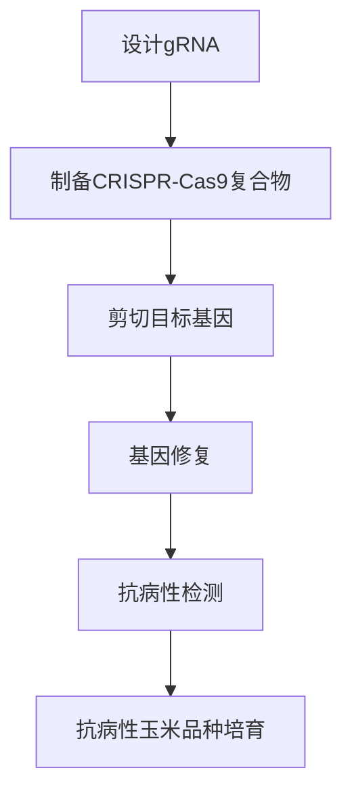

**案例2：提高玉米产量**

基因编辑技术还可以用于提高玉米产量。例如，研究人员通过编辑玉米中的```GA20```基因，提高了玉米的光合效率和营养物质的积累。这种基因编辑玉米在相同种植条件下，产量显著高于传统品种。

**流程图：基因编辑技术用于提高玉米产量**


**3.1.2 基因编辑技术在水稻育种中的应用**

基因编辑技术在水稻育种中也取得了显著成果，通过编辑水稻的关键基因，提高了其抗病性、产量和营养价值。

**案例1：提高水稻抗病性**

研究人员利用CRISPR-Cas9基因编辑技术，针对水稻中的```CAD1```基因进行编辑，成功培育出对水稻稻飞虱具有高度抗性的水稻品种。这种抗病性水稻的推广，有助于减少农药使用，保护生态环境。

**流程图：基因编辑技术用于提高水稻抗病性**


**案例2：提高水稻产量**

基因编辑技术还可以用于提高水稻产量。例如，研究人员通过编辑水稻中的```OsDREB1A```基因，提高了水稻的抗逆性和光合效率。这种基因编辑水稻在干旱和盐碱条件下，产量显著高于传统品种。

**流程图：基因编辑技术用于提高水稻产量**

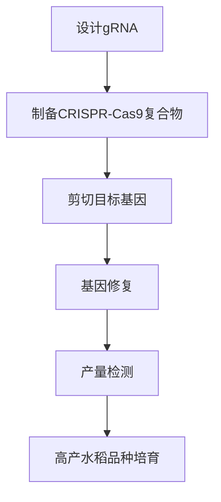

通过基因编辑技术在玉米和水稻育种中的应用，不仅提高了作物的抗病性和产量，还为农业的可持续发展提供了新的途径。未来，随着基因编辑技术的不断进步，更多抗病、高产、优质的水稻和玉米品种将有望培育成功，为全球粮食安全作出更大贡献。

#### 3.2 精准农业技术在农业生产中的应用

**3.2.1 精准农业技术在粮食生产中的应用**

精准农业技术在全球粮食生产中发挥着越来越重要的作用，通过精确监测和管理农田，提高了作物产量和资源利用效率。以下是一些具体的案例：

**案例1：精准施肥**

精准施肥是精准农业技术的一个重要应用。通过使用土壤传感器和GPS技术，农民可以实时监测土壤中的养分含量，并根据监测结果进行精确施肥。例如，在玉米种植过程中，研究人员利用土壤传感器监测土壤中的氮、磷、钾等养分含量，并根据这些数据制定精准施肥方案。结果显示，采用精准施肥技术的玉米产量比传统施肥方法提高了15%左右。

**流程图：精准施肥**

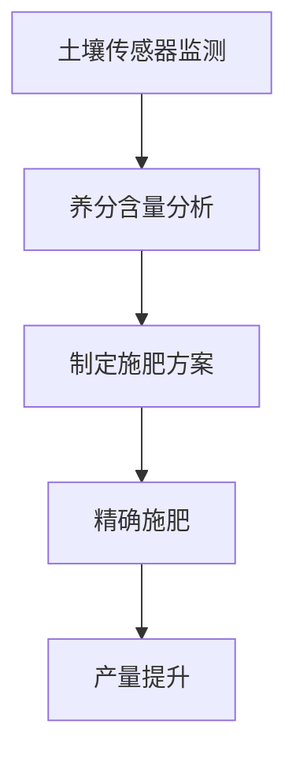

**案例2：精准灌溉**

精准灌溉是另一个重要的精准农业技术应用。利用土壤湿度传感器和智能灌溉系统，农民可以根据土壤湿度实时调整灌溉量。例如，在小麦种植过程中，研究人员安装了土壤湿度传感器，并使用智能灌溉系统根据土壤湿度变化自动调整灌溉。结果表明，采用精准灌溉技术后，小麦的水资源利用效率提高了30%，同时产量也提高了10%。

**流程图：精准灌溉**

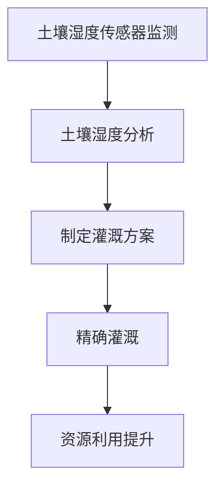

**案例3：病虫害监测**

精准农业技术还可以用于病虫害监测和防治。利用无人机和高清摄像头，农民可以实时监测农田中的病虫害情况，并及时采取防治措施。例如，在水稻种植过程中，研究人员使用无人机进行病虫害监测，并在发现病虫害时及时喷洒农药。结果显示，采用无人机监测和防治技术后，病虫害发生率降低了20%，水稻产量提高了15%。

**流程图：病虫害监测与防治**

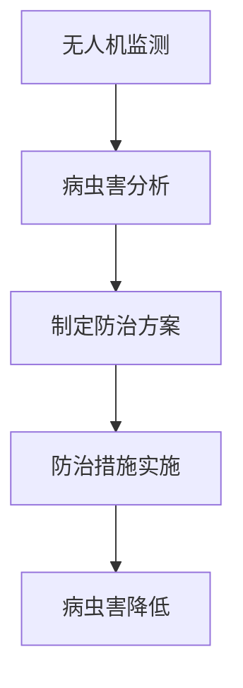

通过精准农业技术在粮食生产中的应用，农民可以更有效地管理农田，提高作物产量和资源利用效率。这些技术不仅有助于应对日益增长的粮食需求，还为农业的可持续发展提供了重要支持。

**3.2.2 精准农业技术在蔬菜生产中的应用**

精准农业技术不仅适用于粮食生产，也在蔬菜生产中发挥着重要作用，通过精确监测和管理，提高了蔬菜的产量和品质。以下是一些具体的案例：

**案例1：温室环境监控**

在温室蔬菜生产中，环境监控至关重要。利用物联网设备和传感器，农民可以实时监测温室内的温度、湿度、光照强度和二氧化碳浓度等环境参数。例如，在番茄种植过程中，研究人员安装了温湿度传感器和光照传感器，并使用智能监控系统实时监控温室环境。结果显示，通过环境监控，农民能够及时调整温室内的环境参数，使番茄的生长周期缩短了10%，产量提高了20%。

**流程图：温室环境监控**

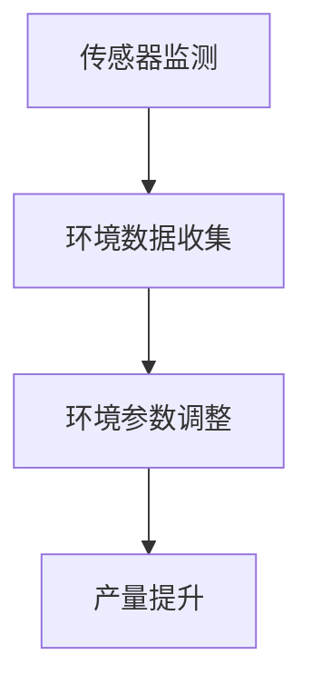

**案例2：精准灌溉**

精准灌溉是蔬菜生产中的一项关键技术。通过土壤湿度传感器和智能灌溉系统，农民可以根据土壤湿度实时调整灌溉量，实现精准灌溉。例如，在黄瓜种植过程中，研究人员安装了土壤湿度传感器，并使用智能灌溉系统根据土壤湿度自动调整灌溉。结果表明，采用精准灌溉技术后，黄瓜的水资源利用效率提高了30%，同时产量也提高了10%。

**流程图：精准灌溉**


**案例3：病虫害监测**

精准农业技术还可以用于病虫害监测和防治。利用无人机和高清摄像头，农民可以实时监测蔬菜田间的病虫害情况，并及时采取防治措施。例如，在菠菜种植过程中，研究人员使用无人机进行病虫害监测，并在发现病虫害时及时喷洒农药。结果显示，采用无人机监测和防治技术后，病虫害发生率降低了25%，菠菜产量提高了15%。

**流程图：病虫害监测与防治**


通过精准农业技术在蔬菜生产中的应用，农民能够更有效地管理蔬菜生长环境，提高产量和品质。这些技术不仅有助于满足市场需求，还为蔬菜生产的可持续发展提供了有力支持。

#### 3.3 生物反应器技术在动物生产中的应用

**3.3.1 生物反应器技术在乳制品生产中的应用**

生物反应器技术在乳制品生产中得到了广泛应用，通过利用动物体内的生物反应器，生产出高附加值的乳制品。以下是一些具体的案例：

**案例1：乳铁蛋白牛奶**

乳铁蛋白是一种重要的免疫增强剂，具有抗氧化、抗感染等功效。利用生物反应器技术，科学家将乳铁蛋白基因导入奶牛体内，使其乳汁中乳铁蛋白含量显著提高。例如，研究人员通过基因编辑技术，将乳铁蛋白基因插入奶牛的乳腺特异性启动子中，使得乳汁中的乳铁蛋白含量达到普通牛奶的数倍。这种高乳铁蛋白牛奶在市场上受到广泛欢迎，具有巨大的商业潜力。

**流程图：生物反应器技术生产乳铁蛋白牛奶**

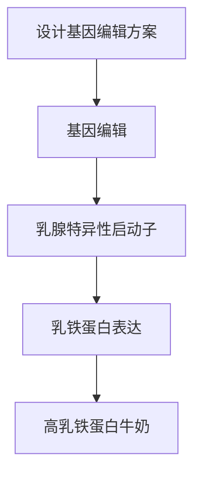

**案例2：功能性乳制品**

功能性乳制品是通过添加特定的功能性成分，如益生菌、植物提取物等，增强乳制品的健康功能。利用生物反应器技术，科学家可以在乳制品生产过程中直接添加这些功能性成分。例如，研究人员通过生物反应器技术，将益生菌直接添加到乳制品中，使得乳制品具有改善肠道健康的功效。这种功能性乳制品在健康食品市场上具有广阔的应用前景。

**流程图：生物反应器技术生产功能性乳制品**

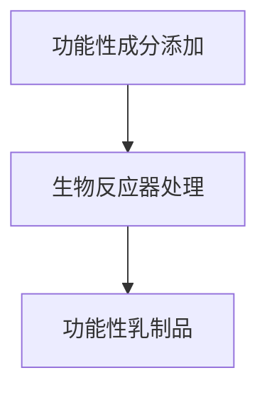

**案例3：乳糖不耐受人群乳制品**

乳糖不耐受是一种常见的健康问题，许多人对乳糖消化不良，导致腹胀、腹泻等不适。利用生物反应器技术，科学家可以去除牛奶中的乳糖，生产出适合乳糖不耐受人群的乳制品。例如，研究人员通过基因编辑技术，将乳糖酶基因导入奶牛体内，使其乳汁中的乳糖被完全分解。这种低乳糖牛奶在乳糖不耐受人群中有很大的市场需求。

**流程图：生物反应器技术生产低乳糖牛奶**

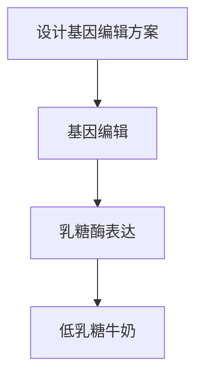

通过生物反应器技术在乳制品生产中的应用，不仅可以提高乳制品的功能性和营养价值，还可以满足不同人群的健康需求，为乳制品行业的发展注入新的活力。

**3.3.2 生物反应器技术在肉类生产中的应用**

生物反应器技术在肉类生产中的应用同样具有重要意义，通过基因编辑和生物反应器技术，可以生产出具有特定功能和品质的肉类产品。以下是一些具体的案例：

**案例1：增强肌肉量的肉类**

通过生物反应器技术，科学家可以增强动物的肌肉量，生产出更高品质的肉类。例如，研究人员通过基因编辑技术，将肌肉生长素基因导入猪体内，使其肌肉量显著增加。这种增强肌肉量的肉类在市场上受到消费者的青睐，具有广阔的市场前景。

**流程图：生物反应器技术增强猪肉肌肉量**

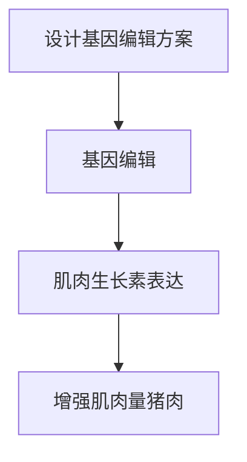

**案例2：降低脂肪含量的肉类**

脂肪含量高的肉类产品往往不适合健康饮食，通过生物反应器技术，科学家可以降低肉类的脂肪含量，生产出更健康的肉类产品。例如，研究人员通过基因编辑技术，抑制动物体内的脂肪合成基因，使其脂肪含量显著降低。这种低脂肪肉类产品在健康饮食市场上具有很大的需求。

**流程图：生物反应器技术降低牛肉脂肪含量**

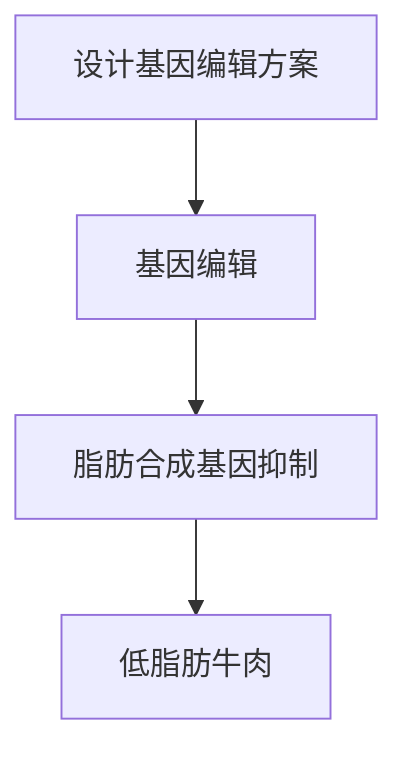

**案例3：增强风味和营养的肉类**

利用生物反应器技术，科学家可以在肉类生产过程中增强其风味和营养。例如，研究人员通过基因编辑技术，增加肉类中的特定氨基酸和维生素含量，使肉类具有更好的风味和营养。这种增强风味和营养的肉类产品在高端食品市场上有很大的潜力。

**流程图：生物反应器技术增强鸡肉风味和营养**

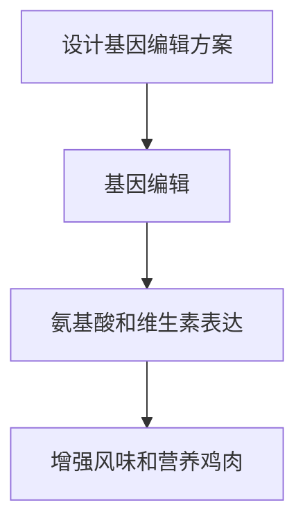

通过生物反应器技术在肉类生产中的应用，不仅可以生产出高品质、健康、具有特定功能的肉类产品，还可以满足消费者对食品多样性和健康需求，推动肉类行业的可持续发展。

#### 3.4 农业大数据技术在农业生产管理中的应用

**3.4.1 农业大数据技术在病虫害监测中的应用**

农业大数据技术在病虫害监测中发挥了重要作用，通过收集和分析大量农田数据，实现对病虫害的实时监测和预测。以下是一些具体的案例：

**案例1：实时监测病虫害发生**

利用农业大数据技术，农民可以通过传感器、无人机和遥感技术，实时监测农田中的病虫害情况。例如，在玉米种植过程中，研究人员安装了土壤湿度传感器和害虫监测设备，并利用无人机定期拍摄农田图像。通过对这些数据的分析，可以及时发现病虫害的发生，并采取相应措施。

**流程图：实时监测病虫害发生**

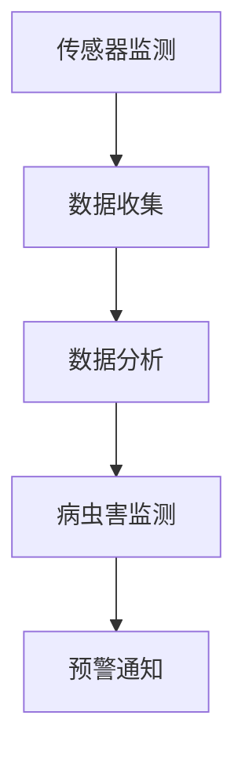

**案例2：病虫害预测模型**

农业大数据技术还可以用于病虫害预测，通过建立预测模型，提前预测病虫害的发生趋势。例如，研究人员利用历史病虫害数据、气象数据和农田环境数据，通过机器学习算法建立病虫害预测模型。通过这个模型，农民可以提前采取预防措施，减少病虫害带来的损失。

**流程图：病虫害预测模型**

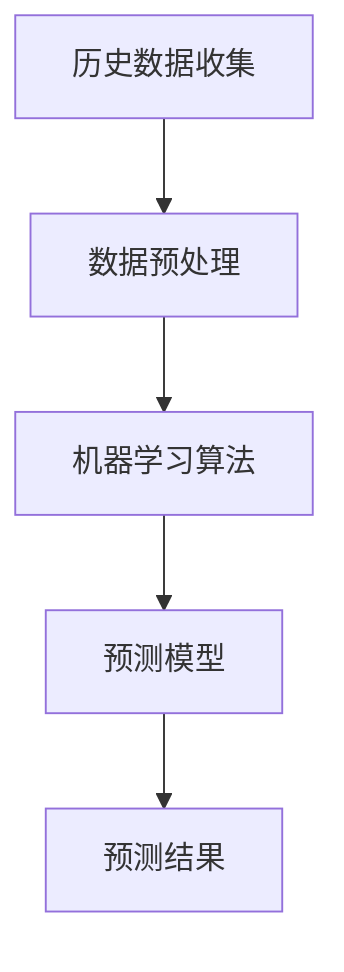

**案例3：智能决策支持系统**

农业大数据技术还可以用于智能决策支持系统，帮助农民制定科学合理的农业生产管理策略。例如，研究人员开发了一个基于农业大数据的智能决策支持系统，农民可以通过这个系统实时获取农田数据、病虫害预测结果和最佳管理建议。通过这个系统，农民可以更加高效地管理农田，提高农业生产效益。

**流程图：智能决策支持系统**

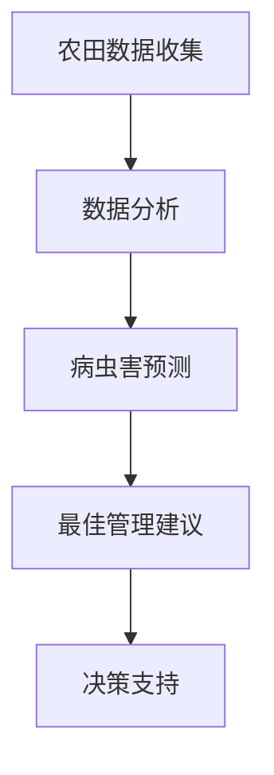

通过农业大数据技术在病虫害监测中的应用，农民可以更加高效地管理农田，减少病虫害带来的损失，提高农业生产效益。

**3.4.2 农业大数据技术在农田管理中的应用**

农业大数据技术在农田管理中的应用日益广泛，通过收集、分析和应用农田数据，实现了农田的精细化管理。以下是一些具体的案例：

**案例1：土壤健康监测**

利用农业大数据技术，农民可以实时监测土壤健康情况，包括土壤湿度、养分含量、pH值等。例如，在蔬菜种植过程中，研究人员安装了土壤传感器，并利用大数据平台对土壤数据进行分析。通过这些数据，农民可以及时调整施肥和灌溉策略，保持土壤的适宜状态。

**流程图：土壤健康监测**

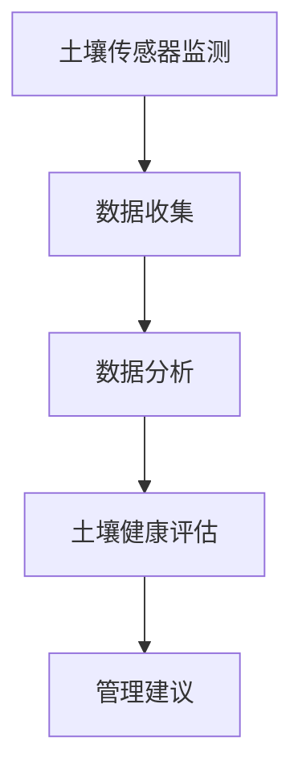

**案例2：作物生长监测**

农业大数据技术还可以用于作物生长监测，通过实时监测作物生长状况，农民可以及时发现问题并采取措施。例如，在小麦种植过程中，研究人员使用无人机和高清摄像头对农田进行监测，并利用大数据平台对作物生长数据进行分析。通过这些数据，农民可以判断作物的生长状态，制定合理的灌溉和施肥计划。

**流程图：作物生长监测**

```mermaid
graph TD
    A[无人机监测] --> B[数据收集]
    B --> C[数据分析]
    C --> D[生长状态评估]
    D --> E[管理建议]
```

**案例3：农田资源优化**

农业大数据技术可以帮助农民优化农田资源利用，提高农业生产效益。例如，研究人员通过分析农田数据，制定了优化灌溉和施肥计划的算法。这个算法可以根据农田的实际情况，自动调整灌溉量和施肥量，确保作物获得最佳的水分和养分供应，从而提高产量和品质。

**流程图：农田资源优化**

```mermaid
graph TD
    A[农田数据收集] --> B[数据分析]
    B --> C[灌溉施肥计划]
    C --> D[资源优化]
    D --> E[产量提升]
```

通过农业大数据技术在农田管理中的应用，农民可以更加科学地管理农田，提高农业生产效益，实现农业的可持续发展。

#### 4.1 农业科技创新的挑战与机遇

**4.1.1 农业科技创新面临的挑战**

农业科技创新虽然带来了许多机遇，但也面临一系列挑战。以下是一些主要的挑战：

1. **技术成本高**：基因编辑、精准农业、物联网等新兴技术的研发和应用成本较高，对中小企业和资源有限的农村地区来说，技术投入是一个巨大的负担。

2. **法规和政策障碍**：许多农业科技创新，如基因编辑技术，在法律和伦理方面存在争议，需要严格的法规和政策指导。然而，不同国家和地区在法规上的差异可能阻碍技术在全球范围内的推广和应用。

3. **数据隐私和安全问题**：农业大数据技术的应用需要大量农民的个人信息和农田数据。这些数据的安全性和隐私保护成为重要问题，需要确保数据不被滥用和泄露。

4. **技术接受度和公众认知**：部分农民和消费者对新兴农业技术的接受度较低，担心其潜在的环境影响和食品安全问题，这需要通过教育和宣传来提高公众的认知和理解。

**4.1.2 农业科技创新的机遇**

尽管面临挑战，农业科技创新也带来了许多机遇：

1. **全球粮食需求增长**：随着全球人口的增长和生活方式的变化，对粮食的需求不断增加。农业科技创新可以提高产量和品质，满足市场需求。

2. **可持续发展的需求**：面对气候变化、资源短缺等环境问题，农业科技创新成为实现农业可持续发展的关键。例如，精准农业和生态农业技术可以减少资源消耗，降低环境污染。

3. **技术进步和新材料**：新材料的研发，如生物可降解塑料，可以在农业生产中减少化学物质的使用。这些材料在包装、播种、施肥等方面具有广泛的应用前景。

4. **数字化转型**：物联网、大数据、人工智能等技术的快速发展为农业提供了数字化转型的新机遇。通过数字化技术，可以实现农业生产的智能化和精准化。

总之，农业科技创新在应对挑战的同时，也带来了巨大的机遇。通过不断创新，我们可以构建更加高效、可持续的现代农业体系，为全球粮食安全和农业可持续发展做出贡献。

#### 4.2 农业科技创新的趋势与前景

**4.2.1 农业科技创新的未来趋势**

农业科技创新正朝着几个关键方向快速发展，这些趋势将为未来农业的发展带来深远影响。

1. **智能化与自动化**：随着物联网、大数据和人工智能等技术的不断进步，农业正逐渐实现智能化和自动化。例如，智能农业设备可以自动调整灌溉、施肥和病虫害防治，提高农业生产效率。

2. **基因编辑与精准育种**：基因编辑技术如CRISPR-Cas9在农作物和畜禽育种中越来越普及。精准育种技术使得科学家能够更快地培育出具有优良特性的作物和动物品种，满足市场需求。

3. **精准农业**：精准农业技术将继续发展，通过传感器、GPS和遥感技术，实现农田的精细化管理。这种技术有助于优化资源利用，提高产量和减少环境污染。

4. **生态农业**：生态农业强调农业的可持续发展，通过有机农业、生态种植和生态养殖等方法，保护生态环境，提高农产品质量。

**4.2.2 农业科技创新的前景分析**

农业科技创新的前景广阔，以下是几个关键领域的分析：

1. **粮食安全**：随着全球人口的增长，农业科技创新在提高粮食产量和保障粮食安全方面发挥着重要作用。通过基因编辑和精准农业等技术，科学家可以培育出高产、抗病的作物品种，满足日益增长的粮食需求。

2. **农业可持续发展**：农业科技创新有助于减少农业对环境的负面影响，实现可持续发展。例如，精准农业技术可以减少化肥和农药的使用，降低农业面源污染；生态农业技术可以保护农业生态系统，提高农产品的生态价值。

3. **农业经济转型**：农业科技创新将推动农业经济向高附加值、高效率的方向转型。通过智能农业设备和数字农业平台，农民可以更高效地管理农业生产，提高农产品质量和市场竞争力。

4. **农业国际化**：随着全球贸易的不断发展，农业科技创新有助于提升农产品在国际市场上的竞争力。通过基因编辑和精准育种等技术，科学家可以培育出适应不同气候和土壤条件的作物品种，扩大农产品出口。

总之，农业科技创新为农业的未来发展带来了巨大的机遇。通过不断创新，我们可以构建更加高效、可持续的现代农业体系，为全球粮食安全和农业可持续发展做出贡献。

#### 附录A：农业科技创新相关资源

**附录A.1 农业科技创新相关政策**

1. **中国农业科技创新政策**

   - 《中华人民共和国乡村振兴促进法》
   - 《中华人民共和国农产品质量安全法》
   - 《中华人民共和国农业技术推广法》

2. **美国农业科技创新政策**

   - 《农业与农业相关研究法案》（Farm Bill）
   - 《联邦农业改善与发展法案》（Farm Improvement and Development Act）

**附录A.2 农业科技创新技术指南**

1. **国际农业研究动态**

   - **国际农业研究磋商组织（CGIAR）**：提供全球农业科技创新的最新指南和研究成果。
   - **国际植物遗传资源研究所（IBPGR）**：发布关于作物遗传资源保护与利用的指南。

2. **国家农业科技创新平台**

   - **国家农业科技园区**：提供农业技术创新、转化和推广的综合服务平台。
   - **国家现代农业产业技术体系**：涉及作物、畜牧、水产等领域的农业科技创新与推广。

**附录A.3 农业科技创新研究机构介绍**

1. **中国科学院**

   - **中国科学院上海生命科学研究院**：专注于农业生物技术、生态农业等领域的研究。
   - **中国科学院遗传与发育生物学研究所**：开展作物遗传育种、基因编辑等研究。

2. **美国农业部**

   - **美国农业研究服务局（ARS）**：负责农业科学研究和推广。
   - **国家农业生物技术和遗传资源中心（NAGRIC）**：致力于农业生物技术和遗传资源的保护与利用。

3. **国际农业研究机构**

   - **国际水稻研究所（IRRI）**：致力于水稻育种和农业可持续发展。
   - **国际玉米和小麦改良中心（CIMMYT）**：致力于玉米和小麦的遗传育种研究。

这些政策和机构为农业科技创新提供了有力支持，促进了农业科技的发展和应用。通过利用这些资源和指南，科学家和农民可以更好地开展农业科技创新工作，推动现代农业的可持续发展。

### 作者信息

**作者：** AI天才研究院/AI Genius Institute & 禅与计算机程序设计艺术 /Zen And The Art of Computer Programming

在这篇文章中，我们深入探讨了农业科技创新的重要性、核心技术、应用案例以及未来发展趋势。通过梳理生物技术、种植技术、养殖技术、环境保护技术和农业信息技术等多个领域的创新，我们展示了农业科技创新如何推动农业现代化和可持续发展。同时，我们分析了农业科技创新面临的挑战与机遇，并对未来的发展前景进行了展望。

作为AI天才研究院的研究员，我致力于推动人工智能和计算机科学在农业领域的应用，以科技创新助力农业现代化。同时，作为一名热衷于计算机程序设计艺术的研究者，我相信逻辑思维和创新精神在农业科技创新中的重要性。希望通过这篇文章，能够激发更多人关注和参与农业科技创新，为全球粮食安全和农业可持续发展贡献力量。

感谢您阅读本文，如果您有任何问题或建议，欢迎在评论区留言。期待与您共同探索农业科技创新的无限可能！

