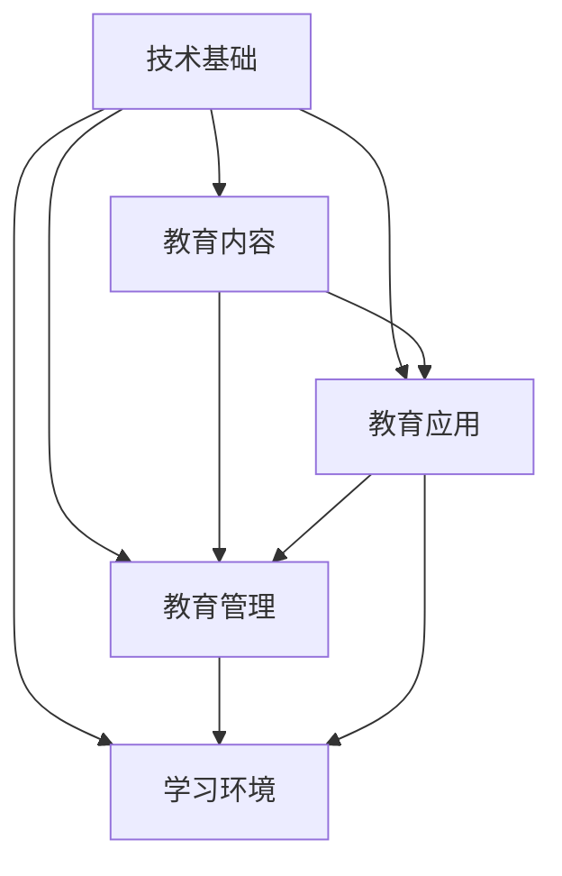

                 

# 《如何利用技术能力进行教育科技创新》

## 关键词
教育科技创新、人工智能、大数据、虚拟现实、编程教育、教育技术

## 摘要
本文旨在探讨如何利用技术能力推动教育科技创新。通过对人工智能、大数据、虚拟现实、编程教育等技术的深入分析，我们揭示了这些技术如何应用于教学、学习评估、管理等方面，提升教育质量和效率。同时，文章还提出了教育科技创新的未来展望，分析了面临的挑战与机遇，并分享了实战案例和可持续发展策略。希望通过本文，为教育科技创新领域的研究者、实践者提供有益的参考和启示。

## 目录大纲

### 第一部分：教育科技创新概述

#### 第1章：教育科技创新的背景与意义

##### 1.1 教育科技创新的定义与发展历程

##### 1.2 教育科技创新的重要性

##### 1.3 当前教育科技创新的主要趋势

#### 第2章：教育科技创新的核心概念与架构

##### 2.1 教育科技创新的基本概念

##### 2.2 教育科技创新的架构

##### 2.3 教育科技创新的关键要素

### 第二部分：技术能力在教育科技创新中的应用

#### 第3章：人工智能在教育中的应用

##### 3.1 人工智能在教育中的核心应用

##### 3.2 智能学习系统设计与实现

##### 3.3 人工智能在教学评估中的应用

#### 第4章：大数据与教育分析

##### 4.1 大数据在教育中的应用

##### 4.2 教育数据分析的方法与工具

##### 4.3 大数据在教学决策支持中的应用

#### 第5章：虚拟现实与教育

##### 5.1 虚拟现实技术在教育中的应用

##### 5.2 虚拟现实教学环境的构建

##### 5.3 虚拟现实在跨学科教学中的实践

#### 第6章：编程教育与现代技术

##### 6.1 编程教育的重要性

##### 6.2 现代技术在编程教育中的应用

##### 6.3 编程教育项目的实施与评估

#### 第7章：教育科技创新的未来展望

##### 7.1 教育科技创新的未来趋势

##### 7.2 教育科技创新的挑战与机遇

##### 7.3 教育科技创新的发展方向

### 第三部分：教育科技创新项目实战

#### 第8章：教育科技创新项目设计与实施

##### 8.1 教育科技创新项目的规划

##### 8.2 教育科技创新项目的实施

##### 8.3 教育科技创新项目的评估与优化

#### 第9章：教育科技创新案例研究

##### 9.1 案例一：智能教育平台的开发与实践

##### 9.2 案例二：大数据在教育管理中的应用

##### 9.3 案例三：虚拟现实在教育教学中的创新应用

#### 第10章：教育科技创新的未来实践

##### 10.1 教育科技创新的未来实践方向

##### 10.2 教育科技创新的可持续发展

##### 10.3 教育科技创新的国际合作与交流

### 附录

#### 附录A：教育科技创新相关的技术资源

##### A.1 人工智能教育应用平台介绍

##### A.2 大数据与教育分析工具推荐

##### A.3 虚拟现实技术在教育中的应用案例

##### A.4 编程教育资源汇总

---

接下来，我们将逐步深入探讨教育科技创新的各个方面，分析技术能力如何推动教育变革，并展望未来教育的发展趋势。

---

### 第1章：教育科技创新的背景与意义

#### 1.1 教育科技创新的定义与发展历程

教育科技创新是指通过应用先进的科学技术手段，对传统的教育模式进行革新和提升，从而推动教育质量的提高和教育效率的提升。这一概念可以追溯到20世纪中叶，当时计算机技术开始在教育领域得到应用，如计算机辅助教学（Computer-Assisted Instruction，简称CAI）的出现，为教育方式的变革奠定了基础。

随着信息技术和互联网的发展，教育科技创新的内涵和外延不断扩大。20世纪90年代，随着互联网的普及，远程教育和在线教育成为教育科技创新的重要方向。21世纪初，随着移动设备的普及，移动学习（Mobile Learning）逐渐成为主流。近年来，人工智能、大数据、虚拟现实等新兴技术不断涌现，进一步推动了教育科技创新的发展。

教育科技创新的发展历程可以概括为以下几个阶段：

1. **计算机辅助教学阶段**：以计算机技术和多媒体技术为基础，将计算机应用于教学过程中，提高教学效率和学生的学习效果。

2. **远程教育和在线教育阶段**：通过互联网实现教学资源的共享和远程教育，打破了地域和时间的限制，使得更多的人能够接受优质的教育。

3. **移动学习和泛在学习阶段**：随着移动设备的普及，学习不再局限于课堂，任何人可以在任何时间、任何地点通过移动设备进行学习。

4. **人工智能和大数据教育阶段**：利用人工智能和大数据技术，实现个性化学习、智能教学和智能评估，提高教育的精准性和效率。

#### 1.2 教育科技创新的重要性

教育科技创新对于教育领域的重要性不可忽视，主要体现在以下几个方面：

1. **提高教育质量**：通过应用先进技术，如人工智能、大数据等，可以实现个性化教学和智能评估，提高学生的学习效果和教育质量。

2. **提升教育效率**：利用技术手段，如在线教育、移动学习等，可以打破时间和空间的限制，提高教育资源的利用率，降低教育成本。

3. **促进教育公平**：技术手段的应用，如远程教育、在线教育等，使得优质教育资源能够更加公平地分配到不同地区和人群。

4. **培养创新人才**：教育科技创新有助于培养具有创新精神和实践能力的人才，适应未来社会的需求。

#### 1.3 当前教育科技创新的主要趋势

随着技术的不断进步，教育科技创新呈现出以下几个主要趋势：

1. **人工智能与教育融合**：人工智能技术在教育领域的应用越来越广泛，如智能学习系统、智能教学助手、智能评估系统等。

2. **大数据与教育分析**：通过大数据技术，可以实现对教育数据的全面分析，为教育决策提供支持。

3. **虚拟现实与教育**：虚拟现实技术的应用，使得学习场景更加真实、互动，有助于提高学生的学习兴趣和效果。

4. **编程教育普及**：编程教育的普及，旨在培养学生的计算思维和创新能力，适应未来社会的需求。

5. **个性化学习**：基于大数据和人工智能技术，可以实现个性化学习路径的规划，满足不同学生的学习需求。

6. **教育与产业的融合**：通过校企合作，将产业需求和人才培养紧密结合，培养适应产业发展需求的人才。

7. **教育资源的开放与共享**：通过互联网和云计算技术，实现教育资源的开放与共享，推动教育公平。

---

通过以上对教育科技创新的定义、重要性和当前趋势的探讨，我们可以看出，教育科技创新是推动教育变革的重要力量。在接下来的章节中，我们将进一步分析技术能力如何具体应用于教育领域，推动教育科技创新的实现。希望本文能为教育科技创新领域的研究者、实践者提供有益的参考和启示。

---

### 第2章：教育科技创新的核心概念与架构

#### 2.1 教育科技创新的基本概念

教育科技创新是指将先进的技术手段应用于教育领域，以提高教育质量、提升教育效率、促进教育公平，培养创新人才的一系列教育活动和过程。教育科技创新不仅仅涉及信息技术，还包括人工智能、大数据、虚拟现实、编程教育等多个领域的融合和应用。

在教育科技创新中，有几个核心概念需要理解：

1. **教育技术**：教育技术是指为了促进学习和提高教学效率而采用的各种工具、资源和过程。这些技术包括但不限于多媒体技术、互联网技术、人工智能技术等。

2. **科技创新**：科技创新是指通过研究、开发和应用新的科学知识和技术，推动社会生产力和生活质量提高的过程。在教育领域，科技创新主要体现在教学方法的改进、学习资源的优化和教育管理的创新。

3. **教育信息化**：教育信息化是指利用信息技术手段，对教育资源、教育过程和教育管理进行数字化、网络化和智能化改造的过程。教育信息化是教育科技创新的重要组成部分。

#### 2.2 教育科技创新的架构

教育科技创新的架构可以理解为技术、应用和教育管理的有机结合。以下是教育科技创新架构的几个关键组成部分：

1. **技术基础**：包括互联网、云计算、大数据、人工智能、虚拟现实等先进技术。这些技术为教育科技创新提供了强大的支持。

2. **教育内容**：包括教材、课程、教学资源等。通过技术手段，这些教育内容可以实现数字化、网络化和个性化。

3. **教育应用**：包括在线教育、远程教育、智能教学、个性化学习等。教育应用是将技术基础和教育内容有机结合的具体体现。

4. **教育管理**：包括教育资源的分配、教学过程的管理、学生学习效果的评估等。教育管理需要借助大数据和人工智能技术进行优化和提升。

5. **学习环境**：包括物理学习环境和虚拟学习环境。虚拟现实技术可以构建高度仿真的学习环境，提高学生的学习体验和效果。

#### 2.3 教育科技创新的关键要素

教育科技创新的成功离不开以下几个关键要素：

1. **政策支持**：政府的政策支持是教育科技创新的重要保障。政策可以引导资源投入、推动技术研究和应用。

2. **技术研发**：持续的技术研发是教育科技创新的核心。只有通过不断的技术创新，才能推动教育质量的提升和教育效率的提高。

3. **教师培训**：教师是教育科技创新的实践者。通过教师培训，提高教师对新技术新理念的认知和应用能力，是教育科技创新的重要一环。

4. **学生参与**：学生的积极参与是教育科技创新的动力。通过引导学生参与技术开发和应用，可以激发学生的学习兴趣和创新精神。

5. **教育评价**：科学的评价体系是教育科技创新的重要保障。通过评价，可以了解教育科技创新的效果，为后续工作提供指导。

#### 2.4 教育科技创新的框架图

为了更好地理解教育科技创新的架构，我们可以使用Mermaid流程图来展示其关键组成部分和相互关系：



在这个框架图中，技术基础是整个教育科技创新架构的支撑，教育内容、教育应用、教育管理和学习环境是相互关联的组成部分。通过这个框架，我们可以清晰地看到教育科技创新的整体结构和各个部分之间的互动关系。

---

通过本章对教育科技创新的核心概念与架构的探讨，我们为接下来的章节奠定了基础。在下一章中，我们将深入探讨人工智能在教育中的应用，分析如何通过人工智能技术实现教育科技创新。希望本章的内容能帮助读者更好地理解教育科技创新的内涵和框架，为后续内容的学习提供启示。

---

### 第3章：人工智能在教育中的应用

#### 3.1 人工智能在教育中的核心应用

人工智能（AI）作为当今科技发展的前沿领域，已经在教育领域展现出巨大的应用潜力。人工智能在教育中的应用主要包括以下几个方面：

1. **智能学习系统**：智能学习系统利用人工智能技术，根据学生的学习行为和成绩，动态调整教学内容和进度，提供个性化的学习支持。这种系统能够分析学生的学习数据，识别学生的优势和劣势，从而为学生提供最适合的学习方案。

2. **智能教学助手**：智能教学助手是人工智能在教育中的应用之一，它可以帮助教师完成一些重复性和机械性的工作，如批改作业、分析学生成绩等。通过自然语言处理技术，智能教学助手还能与学生进行实时交流，提供学习指导和支持。

3. **智能评估系统**：智能评估系统利用人工智能技术，对学生的知识水平和能力进行精准评估。这种系统可以通过分析学生的作业、考试成绩和课堂表现，生成详细的学习评估报告，帮助教师了解学生的学习状况，为后续教学提供参考。

4. **智能推荐系统**：智能推荐系统可以根据学生的学习兴趣和需求，推荐适合的学习资源。这种系统能够分析学生的历史学习数据，预测其未来的学习需求，从而提供个性化的学习路径。

5. **虚拟导师**：虚拟导师是一种基于人工智能的教育应用，它能够在虚拟环境中为学生提供个性化的学习指导。通过自然语言处理和语音识别技术，虚拟导师可以模拟真实的教学场景，与学生进行互动，回答学生的问题，提供学习建议。

#### 3.2 智能学习系统设计与实现

智能学习系统的设计与实现涉及多个技术模块，以下是其中的关键步骤：

1. **需求分析**：在设计和实现智能学习系统之前，首先需要进行需求分析，明确系统的目标用户、功能需求、性能要求等。需求分析的结果将指导后续的系统设计和开发。

2. **数据收集**：智能学习系统依赖于大量的学生学习数据，包括学习行为、成绩、课堂表现等。这些数据可以通过在线学习平台、教育管理系统等途径收集。

3. **数据预处理**：收集到的数据需要进行预处理，包括数据清洗、去重、归一化等。数据预处理是为了确保数据的质量，使其能够被有效地分析和利用。

4. **特征提取**：通过对学生数据的分析，提取出与学习效果相关的特征，如学习时长、学习频率、问题回答正确率等。特征提取是智能学习系统实现个性化学习的基础。

5. **模型训练**：利用机器学习算法，对提取出的特征进行训练，建立学习模型。常见的机器学习算法包括决策树、随机森林、支持向量机等。

6. **系统实现**：在模型训练完成后，可以开始实现智能学习系统的功能。系统实现包括前端界面设计、后端逻辑处理、数据库管理等。

7. **系统部署与维护**：将智能学习系统部署到服务器上，供用户使用。在系统运行过程中，需要不断收集用户反馈数据，进行系统优化和升级。

#### 3.3 伪代码实现智能学习系统

以下是智能学习系统的一个简化的伪代码实现，用于描述系统的核心算法：

```plaintext
// 伪代码：智能学习系统核心算法

// 步骤1：数据预处理
def preprocess_data(data):
    # 数据清洗、去重、归一化等操作
    return processed_data

// 步骤2：特征提取
def extract_features(processed_data):
    # 从数据中提取与学习效果相关的特征
    return features

// 步骤3：模型训练
def train_model(features, labels):
    # 使用机器学习算法训练模型
    model = train_machine_learning_model(features, labels)
    return model

// 步骤4：个性化推荐
def personalized_recommendation(model, user_data):
    # 使用训练好的模型进行个性化推荐
    recommendations = model.predict(user_data)
    return recommendations

// 主程序
def main():
    # 数据收集
    data = collect_data()
    
    # 数据预处理
    processed_data = preprocess_data(data)
    
    # 特征提取
    features = extract_features(processed_data)
    
    # 模型训练
    model = train_model(features, labels)
    
    # 个性化推荐
    recommendations = personalized_recommendation(model, user_data)
    
    # 输出推荐结果
    print("个性化推荐：", recommendations)
```

#### 3.4 智能学习系统的实际应用案例

智能学习系统的实际应用案例包括：

1. **个性化学习平台**：如Coursera、edX等在线教育平台，利用人工智能技术为学生提供个性化的学习路径和学习资源推荐。

2. **智能辅导系统**：如Khan Academy的智能辅导系统，通过算法为学生提供个性化的学习建议和辅导。

3. **智能评估系统**：如一些学校使用的智能评估系统，通过分析学生的考试成绩和学习数据，生成个性化的学习报告，帮助教师了解学生的学习状况。

4. **虚拟导师系统**：如一些虚拟校园的虚拟导师系统，通过虚拟现实技术和人工智能技术，为学生提供实时在线的个性化学习指导。

---

通过本章对人工智能在教育中的应用的探讨，我们了解了智能学习系统、智能教学助手、智能评估系统等人工智能技术如何应用于教育领域，提升教育质量和效率。在下一章中，我们将进一步探讨大数据与教育分析的应用，分析如何通过大数据技术实现教育科技创新。希望本章的内容能帮助读者更好地理解人工智能在教育中的作用和实际应用。

---

### 第4章：大数据与教育分析

#### 4.1 大数据在教育中的应用

大数据在教育中的应用已经成为推动教育科技创新的重要力量。大数据是指数据量大、类型多样、价值密度低的数据集合，通过对这些数据的收集、存储、处理和分析，可以为教育决策提供有力的支持。

1. **学生数据管理**：大数据技术可以实现对学生数据的全面收集和管理，包括学生的基本信息、学习记录、考试成绩、行为数据等。这些数据有助于学校和教育管理者了解学生的全面情况，为教育决策提供依据。

2. **个性化教学**：通过分析学生的数据，如学习兴趣、学习习惯、知识点掌握情况等，大数据技术可以帮助教师为学生提供个性化的教学方案，提高教学效果。

3. **学习效果评估**：大数据技术可以对学生的学习效果进行全面评估，通过分析学习数据，如学习时长、问题回答正确率等，生成详细的学习报告，帮助教师了解学生的学习状况，优化教学方法。

4. **教育资源优化**：通过分析教育资源的使用情况，如课程视频的观看次数、作业提交情况等，大数据技术可以帮助学校和教育机构优化教育资源的配置，提高资源利用效率。

5. **教育趋势预测**：大数据技术可以对教育趋势进行预测，如学生的未来学习需求、热门专业的发展趋势等，为教育政策的制定和调整提供参考。

#### 4.2 教育数据分析的方法与工具

教育数据分析的方法和工具是实现大数据在教育中应用的关键。以下是一些常见的方法和工具：

1. **数据收集**：数据收集是教育数据分析的第一步，可以通过在线学习平台、教育管理系统、传感器等途径收集学生数据。常见的数据收集工具包括Google Analytics、Mixpanel等。

2. **数据存储**：大数据需要高效的数据存储方案，常见的数据存储系统包括Hadoop、Hive、Spark等。这些系统提供了分布式存储和计算能力，能够处理大规模数据。

3. **数据清洗**：数据清洗是为了确保数据的质量，需要去除重复数据、处理缺失值、纠正错误数据等。常见的数据清洗工具包括Python的Pandas库、R语言的dplyr包等。

4. **数据可视化**：数据可视化是将数据转换成图形或图表的过程，有助于发现数据中的模式和趋势。常见的数据可视化工具包括Tableau、Power BI、Matplotlib等。

5. **统计分析**：统计分析是对数据进行定量分析的方法，包括描述性统计、推断性统计等。常见的统计分析工具包括R语言、Python的Scikit-learn库等。

6. **机器学习**：机器学习是通过对数据进行建模，发现数据中的规律和模式。常见的机器学习算法包括线性回归、决策树、支持向量机、神经网络等。

#### 4.3 大数据在教学决策支持中的应用

大数据技术在教学决策支持中发挥着重要作用，以下是一些具体的应用案例：

1. **个性化教学**：通过分析学生的学习数据，如学习时长、知识点掌握情况等，大数据技术可以帮助教师为不同学生提供个性化的教学方案，提高教学效果。

2. **学习效果预测**：通过分析学生的学习数据，大数据技术可以预测学生在未来课程中的表现，为教师提供教学反馈和指导。

3. **课程设计优化**：通过分析学生的学习数据，大数据技术可以帮助教育机构了解课程设计的有效性，优化课程结构，提高课程质量。

4. **教育资源分配**：通过分析教育资源的使用情况，大数据技术可以帮助学校和教育机构优化教育资源的配置，提高资源利用效率。

5. **教育趋势分析**：通过分析学生的学习数据，大数据技术可以帮助教育机构了解教育趋势，为教育政策的制定和调整提供参考。

#### 4.4 案例分析：大数据在教育管理中的应用

以下是一个大数据在教育管理中的应用案例：

**案例背景**：某高校希望利用大数据技术优化教育管理，提高教育质量。

**解决方案**：

1. **数据收集**：通过学校的信息管理系统，收集学生的基本信息、学习记录、考试成绩等数据。

2. **数据存储**：使用Hadoop系统存储和管理数据，确保数据的安全性和可扩展性。

3. **数据清洗**：使用Pandas库对数据进行清洗，处理缺失值和错误数据，确保数据质量。

4. **数据分析**：使用Python的Scikit-learn库进行数据分析，包括描述性统计、相关性分析等。

5. **个性化教学**：根据学生的学习数据，为教师提供个性化的教学建议，如调整教学策略、增加辅导时间等。

6. **学习效果预测**：通过机器学习算法，预测学生在未来课程中的表现，为教师提供教学反馈。

7. **课程设计优化**：根据学生的学习数据，优化课程设计，提高课程质量。

**效果评估**：

通过大数据技术的应用，学校在教育管理方面取得了显著效果：

1. **教学效果提升**：个性化教学方案提高了学生的学习效果，学生的考试成绩和满意度都有所提高。

2. **教育资源优化**：教育资源得到了更合理的配置，教学设备的使用率提高，资源浪费减少。

3. **教育管理效率提升**：教育管理者通过数据驱动的方式，更加科学地制定教育政策，提高了教育管理的效率。

---

通过本章对大数据与教育分析的探讨，我们了解了大数据技术在教育中的应用，包括学生数据管理、个性化教学、学习效果评估、教育资源优化等。在下一章中，我们将进一步探讨虚拟现实与教育的关系，分析虚拟现实技术在教育中的应用。希望本章的内容能帮助读者更好地理解大数据技术在教育中的重要作用和实际应用。

---

### 第5章：虚拟现实与教育

#### 5.1 虚拟现实技术在教育中的应用

虚拟现实（VR）技术通过创建一个虚拟的三维环境，使用户能够沉浸其中，体验与真实世界相似的感受。在教育领域，虚拟现实技术的应用正在不断扩展，为学生和教师提供了新的教学和学习体验。

1. **沉浸式学习体验**：虚拟现实技术可以创建一个高度仿真的学习环境，使学生能够身临其境地学习。例如，学生可以通过虚拟现实参观历史遗址、探索未知星球，或者体验科学实验，从而提高学习兴趣和参与度。

2. **互动式学习**：虚拟现实技术提供了丰富的交互功能，使学生能够与虚拟环境中的对象进行互动。这种互动性可以增强学生的学习体验，提高学习效果。例如，学生可以在虚拟实验室中操作实验设备，进行互动式学习。

3. **跨学科教学**：虚拟现实技术可以跨越传统学科的界限，实现跨学科的教学。例如，通过虚拟现实，学生可以在同一时间内探索历史、科学和艺术等多个学科的知识，提高综合素质。

4. **远程教育**：虚拟现实技术可以帮助实现远程教育，使学生能够在家中或任何地方进行学习。通过虚拟现实，学生可以与教师和同学进行实时互动，享受与现场课堂相似的学习体验。

5. **个性化学习**：虚拟现实技术可以根据学生的学习需求和进度，提供个性化的学习内容。例如，学生可以根据自己的学习速度和兴趣，选择不同的学习路径和挑战，从而实现个性化学习。

6. **技能培训**：虚拟现实技术在技能培训中的应用也越来越广泛。例如，医学生可以通过虚拟现实进行手术模拟训练，飞行员可以通过虚拟现实进行飞行模拟训练，从而提高技能水平。

#### 5.2 虚拟现实教学环境的构建

构建一个有效的虚拟现实教学环境需要考虑以下几个方面：

1. **硬件设备**：构建虚拟现实教学环境首先需要配备相应的硬件设备，包括头戴式显示器（HMD）、跟踪设备、传感器等。这些设备能够提供高质量的虚拟现实体验。

2. **软件平台**：选择合适的虚拟现实软件平台是构建教学环境的关键。常见的虚拟现实软件平台包括Unity、Unreal Engine等，这些平台提供了丰富的开发工具和资源，可以支持教学内容的制作。

3. **教学内容**：虚拟现实教学环境的建设离不开高质量的教学内容。教学内容应该根据教学目标和学习需求进行设计，确保能够提供有意义、有吸引力的学习体验。

4. **教学设计**：虚拟现实教学的设计需要充分考虑学生的学习体验和学习效果。教学设计应该注重互动性、趣味性和实用性，使学生在虚拟环境中能够积极投入学习。

5. **教师培训**：虚拟现实教学环境的构建不仅需要硬件和软件的支持，还需要教师的熟练掌握和运用。因此，对教师进行虚拟现实教学培训是构建教学环境的重要环节。

6. **技术支持**：虚拟现实技术涉及多个领域，包括计算机科学、软件工程、图形学等。因此，构建虚拟现实教学环境需要技术支持团队，负责技术的研发、维护和更新。

#### 5.3 虚拟现实在跨学科教学中的实践

虚拟现实技术在跨学科教学中的应用为教育带来了新的可能性。以下是一些具体的实践案例：

1. **自然科学与艺术融合**：在自然科学教学中，学生可以通过虚拟现实技术参观博物馆、探索自然奇观，增强对自然科学的理解。同时，在艺术教学中，学生可以通过虚拟现实技术创作虚拟艺术品，提高艺术创作能力。

2. **历史与地理结合**：通过虚拟现实技术，学生可以“走进”历史事件现场，体验历史人物的生活，增强对历史事件的理解。在地理教学中，学生可以通过虚拟现实技术探索不同地区的自然环境、人文景观，了解地理知识。

3. **工程与设计协同**：在工程教学中，学生可以通过虚拟现实技术进行工程设计模拟，了解工程原理和设计过程。在设计教学中，学生可以通过虚拟现实技术实现三维设计，提高设计能力。

4. **医学与心理学互动**：在医学教学中，学生可以通过虚拟现实技术进行手术模拟训练，提高手术技能。在心理学教学中，学生可以通过虚拟现实技术体验不同心理状态，理解心理学原理。

5. **社会科学与人文关怀**：在社会科学教学中，学生可以通过虚拟现实技术了解社会现象、社会问题，培养社会意识和人文关怀。在人文关怀教学中，学生可以通过虚拟现实技术体验不同文化背景下的生活，提高跨文化交际能力。

#### 5.4 案例分析：虚拟现实技术在某高校的应用

以下是一个虚拟现实技术在某高校应用的具体案例：

**案例背景**：某高校希望利用虚拟现实技术提升教学效果，增强学生的学习体验。

**解决方案**：

1. **硬件设备**：学校投资购置了虚拟现实头戴式显示器、跟踪设备和传感器等硬件设备，为学生提供了沉浸式的学习环境。

2. **软件平台**：学校选择了Unity作为虚拟现实软件平台，并建立了虚拟现实教学工作室，为教师和学生提供了软件支持。

3. **教学内容**：学校根据教学需求，设计和开发了多个虚拟现实教学项目，如自然科学探索、历史事件再现、工程设计与模拟等。

4. **教学设计**：学校组织教师进行虚拟现实教学培训，确保教师能够熟练掌握虚拟现实技术，并设计了互动性强的教学课程。

5. **教师培训**：学校为教师提供了持续的培训和支持，帮助教师掌握虚拟现实教学的方法和技巧。

**效果评估**：

通过虚拟现实技术的应用，学校在教学效果和学生体验方面取得了显著成效：

1. **学习兴趣提高**：学生对于虚拟现实课程表现出浓厚的兴趣，积极参与学习活动，学习主动性增强。

2. **学习效果提升**：虚拟现实教学项目有效提高了学生的学习效果，学生在课程考核中的表现优于传统教学方法。

3. **跨学科融合**：虚拟现实技术实现了跨学科的教学融合，学生能够在多个学科领域进行深入学习和探索。

4. **教师能力提升**：教师通过虚拟现实教学，提高了教学能力和创新意识，为学校的教育教学改革提供了有力支持。

---

通过本章对虚拟现实与教育的探讨，我们了解了虚拟现实技术在教育中的应用，包括沉浸式学习体验、互动式学习、跨学科教学等。在下一章中，我们将进一步探讨编程教育在现代技术中的应用，分析编程教育如何推动教育科技创新。希望本章的内容能帮助读者更好地理解虚拟现实技术在教育中的重要作用和实际应用。

---

### 第6章：编程教育与现代技术

#### 6.1 编程教育的重要性

编程教育已经成为现代教育的重要组成部分，其重要性体现在以下几个方面：

1. **培养学生的计算思维**：编程教育不仅教授编程语言和算法，更重要的是培养学生的计算思维。计算思维是指通过抽象、算法化和自动化等方法解决问题的一种思维方式。这种思维方式对于学生未来的学习和工作具有长远的影响。

2. **适应数字化社会需求**：随着信息技术的快速发展，数字化社会已经到来。编程教育能够帮助学生掌握信息技术的基本技能，使其能够适应数字化社会的需求，为未来的职业生涯做好准备。

3. **培养创新人才**：编程教育能够培养学生的创新能力和实践能力。通过编程，学生可以创造自己的项目，解决问题，实现自己的想法。这种创新能力是现代社会迫切需要的。

4. **提高学生竞争力**：在全球化和竞争激烈的社会中，编程教育能够提高学生的竞争力。掌握编程技能的学生在就业市场上具有更大的优势。

5. **促进教育与产业的融合**：编程教育能够促进教育与产业的融合，使学生能够更好地了解产业需求，为未来的就业和创业奠定基础。

#### 6.2 现代技术在编程教育中的应用

随着现代技术的不断发展，编程教育也在不断革新。以下是一些现代技术在编程教育中的应用：

1. **在线编程教育平台**：在线编程教育平台如Codecademy、Coursera等，为学生提供了便捷的编程学习环境。这些平台提供了丰富的课程资源、即时反馈和社区支持，使得学生可以随时随地学习编程。

2. **游戏化学习**：游戏化学习通过将编程教育融入游戏，提高了学生的学习兴趣和参与度。学生在游戏中完成任务，学习编程知识，通过游戏化的方式提升编程技能。

3. **虚拟现实与增强现实**：虚拟现实（VR）和增强现实（AR）技术在编程教育中的应用，为学习提供了更加直观和互动的体验。例如，学生可以通过VR设备进入虚拟的编程世界，进行编程实践。

4. **人工智能编程助手**：人工智能编程助手能够帮助学生学习编程。例如，编程助手可以通过自然语言处理技术，理解学生的编程问题，并提供相应的解决方案。

5. **开源软件与社区**：开源软件和编程社区为学生提供了丰富的学习资源和支持。学生可以通过开源项目学习和实践编程，同时也能够参与到社区中，与其他编程爱好者交流。

#### 6.3 编程教育项目的实施与评估

编程教育项目的实施和评估是确保编程教育质量的关键。以下是一些实施和评估的建议：

1. **项目规划**：在实施编程教育项目之前，需要进行详细的规划。包括确定项目目标、课程内容、教学方法、资源需求等。规划应充分考虑学生的年龄、学习背景和学习需求。

2. **教学设计**：教学设计应注重理论与实践的结合，确保学生能够通过实际项目学习编程技能。教学设计应包括课程大纲、教学计划、教学资源等。

3. **教学方法**：编程教育应采用多种教学方法，如讲授、实践、项目驱动等。教学方法应灵活多样，以适应不同学生的学习需求和兴趣。

4. **技术支持**：提供必要的技术支持是编程教育项目成功的关键。包括硬件设备、软件工具、网络环境等。

5. **教师培训**：教师是编程教育项目的执行者，因此教师的培训至关重要。教师应掌握编程教育的理论和方法，具备实践能力和教学技能。

6. **学生评估**：学生评估是编程教育项目的重要环节。评估应包括学生的知识掌握情况、编程技能水平、问题解决能力等。评估应采用多种方式，如考试、项目评价、学生反馈等。

7. **项目反馈与优化**：根据项目评估结果，对编程教育项目进行反馈和优化。反馈和优化应考虑学生的学习需求、教学效果和项目目标。

#### 6.4 案例分析：某中学的编程教育项目

以下是一个中学编程教育项目的具体案例：

**案例背景**：某中学希望通过编程教育项目提高学生的计算思维和实践能力。

**解决方案**：

1. **项目规划**：学校制定了详细的编程教育项目规划，包括项目目标、课程内容、教学方法、资源需求等。

2. **教学设计**：学校采用项目驱动的教学方法，通过实际项目培养学生的编程技能。课程内容包括编程基础、Web开发、游戏制作等。

3. **技术支持**：学校提供了计算机教室、编程软件等硬件和软件支持。

4. **教师培训**：学校组织教师进行编程教育培训，提高教师的教学能力和项目执行能力。

5. **学生评估**：学校采用多种评估方式，包括项目展示、笔试、学生反馈等，全面评估学生的编程技能和学习效果。

**效果评估**：

通过编程教育项目的实施，学校取得了显著效果：

1. **学生兴趣提升**：学生对于编程产生了浓厚的兴趣，学习积极性提高。

2. **编程技能提升**：学生在项目实践中提高了编程技能，能够独立完成简单的编程任务。

3. **问题解决能力增强**：学生在解决实际问题的过程中，培养了计算思维和问题解决能力。

4. **教师能力提升**：教师通过项目执行，提高了教学能力和项目组织能力。

---

通过本章对编程教育与现代技术的探讨，我们了解了编程教育的重要性以及现代技术在编程教育中的应用。在下一章中，我们将进一步探讨教育科技创新的未来展望，分析教育科技创新面临的挑战与机遇。希望本章的内容能帮助读者更好地理解编程教育在现代技术背景下的重要作用和实施方法。

---

### 第7章：教育科技创新的未来展望

#### 7.1 教育科技创新的未来趋势

教育科技创新正朝着智能化、个性化、多样化、国际化等方向发展，呈现出以下趋势：

1. **智能化教学**：随着人工智能技术的发展，智能化教学将更加普及。智能学习系统、智能教学助手、智能评估系统等人工智能技术将深入教学过程，实现个性化教学和智能教学。

2. **个性化学习**：大数据和人工智能技术的应用将使得个性化学习成为可能。通过分析学生的学习数据，教育系统能够为学生提供个性化的学习路径和资源，满足不同学生的学习需求。

3. **混合式教学**：在线教育与传统课堂教学的结合将更加紧密。混合式教学模式将发挥线上资源的优势，同时保留传统课堂的互动和交流，实现教学效果的最大化。

4. **虚拟现实与增强现实教学**：虚拟现实（VR）和增强现实（AR）技术将在教育中得到更广泛的应用。通过创建沉浸式的学习环境，这些技术将提高学生的学习体验和参与度。

5. **编程教育普及**：编程教育将成为基础课程，培养学生计算思维和实践能力。编程教育的普及将为学生未来的职业发展奠定基础。

6. **教育与产业融合**：教育将更加紧密地与产业需求结合，培养具有实际应用能力的人才。校企合作、产业学院等模式将成为主流。

7. **国际化教育**：互联网和在线教育的普及将推动国际化教育的进一步发展。学生可以跨地域、跨文化进行学习，培养全球视野和跨文化交流能力。

#### 7.2 教育科技创新的挑战与机遇

教育科技创新在带来巨大机遇的同时，也面临着一系列挑战：

1. **技术成熟度**：许多新兴技术，如人工智能、大数据等，仍处于快速发展阶段，技术的成熟度和稳定性需要进一步提高。

2. **教育资源分配**：尽管技术可以提供个性化的学习资源，但教育资源的分配仍然存在不均衡问题，尤其是在农村和贫困地区。

3. **教师能力提升**：教育科技创新需要教师具备相应的技术能力和教学水平。教师的培训和支持是教育科技创新的重要保障。

4. **数据隐私与安全**：大数据和人工智能技术的应用涉及到大量学生的个人信息，数据隐私和安全问题亟待解决。

5. **教育公平**：教育科技创新在带来便捷的同时，也可能加剧教育不公平现象。如何确保所有学生都能够平等地享受教育科技创新的成果，是亟待解决的问题。

6. **教育伦理**：教育科技创新的应用可能引发教育伦理问题，如算法偏见、数据滥用等，需要制定相应的伦理规范。

#### 7.3 教育科技创新的发展方向

为了应对挑战，教育科技创新的发展方向可以从以下几个方面考虑：

1. **技术创新**：持续推动人工智能、大数据、虚拟现实等技术的创新和发展，提升技术的成熟度和应用效果。

2. **教育改革**：推动教育制度改革，优化教育资源配置，提高教育公平性。通过改革，使教育科技创新能够更好地服务于教育需求。

3. **教师培训**：加强教师的培训，提高教师对新兴技术的认知和应用能力，确保教育科技创新能够有效实施。

4. **数据治理**：建立健全的数据治理体系，确保数据隐私和安全。通过制定相关法规和标准，规范数据的使用和管理。

5. **教育国际合作**：加强国际间的教育合作与交流，共享教育科技创新的成果，推动全球教育发展。

6. **伦理规范**：制定教育科技创新的伦理规范，确保技术的应用符合教育伦理要求，避免算法偏见和数据滥用等问题。

---

通过本章对教育科技创新的未来展望的探讨，我们了解了教育科技创新的发展趋势、面临的挑战与机遇以及未来的发展方向。在下一章中，我们将通过具体的实战案例，分析教育科技创新在实际项目中的应用和实践。希望本章的内容能帮助读者更好地理解教育科技创新的未来图景和应对策略。

---

### 第8章：教育科技创新项目设计与实施

#### 8.1 教育科技创新项目的规划

教育科技创新项目的成功离不开科学的规划和设计。项目规划是项目实施的第一步，主要包括以下几个方面：

1. **项目目标**：明确项目的目标，包括期望实现的教学效果、技术目标和社会影响等。项目目标应具体、可量化，以便于后续评估。

2. **项目范围**：界定项目的范围，明确项目将涉及的具体领域和内容。项目范围应充分考虑技术可行性、资源限制和市场需求。

3. **项目团队**：组建项目团队，包括项目经理、技术专家、教育专家、教师等。团队成员应具备相应的技能和经验，能够高效协作。

4. **资源需求**：评估项目所需的资源，包括人力、物力、财力等。资源需求应详细列出，以便于预算和资源配置。

5. **时间安排**：制定项目的时间表，包括项目的启动、实施、评估等关键节点。时间安排应合理，确保项目能够按时完成。

6. **风险评估**：识别项目可能面临的风险，如技术风险、市场风险、资源风险等，并制定相应的应对措施。

7. **预算编制**：根据项目需求和资源评估，编制项目的预算。预算应包括项目实施的直接成本和间接成本，确保项目的经济可行性。

#### 8.2 教育科技创新项目的实施

教育科技创新项目的实施是项目规划的具体落实。以下是项目实施的主要步骤：

1. **项目启动**：召开项目启动会议，明确项目目标、范围、时间表和预算等，确保所有团队成员对项目有清晰的认识。

2. **需求分析**：与项目利益相关者进行沟通，深入了解他们的需求和期望，为项目实施提供依据。

3. **技术方案设计**：根据需求分析结果，设计项目的技术方案。技术方案应包括系统架构、模块设计、接口定义等。

4. **软件开发与测试**：按照技术方案，进行软件的开发和测试。软件开发应遵循最佳实践，确保代码质量。

5. **教育资源建设**：根据项目需求，开发相应的教育资源，如课程内容、教学课件、学习材料等。

6. **教师培训**：为项目参与教师提供培训，确保他们能够熟练使用新系统和资源。

7. **项目测试与评估**：在项目实施过程中，进行多次测试和评估，确保项目质量符合预期。

8. **项目交付**：完成项目开发、测试和培训后，正式交付项目成果，并组织项目验收。

#### 8.3 教育科技创新项目的评估与优化

项目评估是确保项目目标实现的重要环节。以下是项目评估与优化的主要步骤：

1. **效果评估**：通过考试、作业、项目展示等方式，评估学生在项目实施后的学习效果和技能提升情况。

2. **用户反馈**：收集教师和学生对于项目系统、资源、培训等方面的反馈，了解他们的使用体验和改进建议。

3. **项目总结**：总结项目实施过程中的经验教训，分析项目的成功和不足之处，为后续项目提供参考。

4. **优化改进**：根据效果评估和用户反馈，对项目系统、资源、培训等进行优化改进，提升项目质量。

5. **持续监控**：项目实施后，持续监控项目效果，确保项目目标的长期实现。

6. **知识管理**：将项目实施过程中的知识、经验进行整理和积累，形成知识库，为后续项目提供支持。

#### 8.4 案例分析：某高校的编程教育项目

以下是一个高校编程教育项目的具体案例：

**案例背景**：某高校希望通过编程教育项目提升学生的计算思维和实践能力。

**解决方案**：

1. **项目规划**：学校制定了详细的编程教育项目规划，包括项目目标、课程内容、教学方法、资源需求等。

2. **教学设计**：学校采用项目驱动的教学方法，通过实际项目培养学生的编程技能。课程内容包括编程基础、Web开发、游戏制作等。

3. **技术支持**：学校提供了计算机教室、编程软件等硬件和软件支持。

4. **教师培训**：学校组织教师进行编程教育培训，提高教师的教学能力和项目执行能力。

5. **学生评估**：学校采用多种评估方式，包括项目展示、笔试、学生反馈等，全面评估学生的编程技能和学习效果。

**效果评估**：

通过编程教育项目的实施，学校取得了显著效果：

1. **学生兴趣提升**：学生对于编程产生了浓厚的兴趣，学习积极性提高。

2. **编程技能提升**：学生在项目实践中提高了编程技能，能够独立完成简单的编程任务。

3. **问题解决能力增强**：学生在解决实际问题的过程中，培养了计算思维和问题解决能力。

4. **教师能力提升**：教师通过项目执行，提高了教学能力和项目组织能力。

---

通过本章对教育科技创新项目设计与实施的分析，我们了解了项目规划、实施和评估的关键步骤和方法。在下一章中，我们将通过具体的实战案例，进一步探讨教育科技创新的实际应用和实践。希望本章的内容能帮助读者更好地理解教育科技创新项目的设计与实施过程。

---

### 第9章：教育科技创新案例研究

#### 9.1 案例一：智能教育平台的开发与实践

**案例背景**：某知名高校希望利用智能教育平台提升教学效果，提高学生的学习兴趣和参与度。

**解决方案**：

1. **需求分析**：学校通过调查问卷和访谈，了解教师和学生的需求。需求包括个性化学习、智能评估、资源推荐等。

2. **技术选型**：学校选择基于人工智能和大数据技术的智能教育平台，确保系统能够实现个性化教学和智能评估。

3. **平台开发**：开发团队利用Java和Python等编程语言，开发智能教育平台的核心功能，包括用户管理、课程管理、作业管理、成绩管理、智能推荐等。

4. **教师培训**：为教师提供平台使用培训，确保他们能够熟练掌握平台功能，提高教学效果。

5. **学生参与**：学生通过平台进行学习，平台根据学生的学习行为和成绩，提供个性化的学习资源和推荐。

**效果评估**：

通过智能教育平台的实施，学校取得了显著效果：

1. **学习兴趣提高**：学生对于智能教育平台表现出浓厚的兴趣，积极参与学习活动。

2. **学习效果提升**：平台提供的个性化学习资源提高了学生的学习效果，考试成绩有所提高。

3. **资源利用率提升**：平台实现了教育资源的优化配置，提高了资源利用率。

4. **教师教学效率提升**：智能教育平台减轻了教师的工作负担，提高了教学效率。

#### 9.2 案例二：大数据在教育管理中的应用

**案例背景**：某教育机构希望利用大数据技术优化教育管理，提高教育质量。

**解决方案**：

1. **数据收集**：通过学校的信息管理系统，收集学生的基本信息、学习记录、考试成绩等数据。

2. **数据存储**：使用Hadoop系统存储和管理数据，确保数据的安全性和可扩展性。

3. **数据清洗**：使用Python的Pandas库对数据进行清洗，处理缺失值和错误数据。

4. **数据分析**：使用R语言进行数据分析，包括描述性统计、相关性分析、回归分析等。

5. **决策支持**：根据数据分析结果，为教育管理者提供决策支持，如课程设计优化、教育资源分配等。

**效果评估**：

通过大数据技术在教育管理中的应用，教育机构取得了显著效果：

1. **教育质量提升**：数据分析结果帮助教育管理者优化课程设计，提高教育质量。

2. **教育资源优化**：通过数据分析，教育机构能够更合理地配置教育资源，提高资源利用率。

3. **教育管理效率提升**：教育管理者通过数据驱动的方式，提高了教育管理的效率。

#### 9.3 案例三：虚拟现实在教育教学中的创新应用

**案例背景**：某高中希望通过虚拟现实技术提高学生的科学素养和实践能力。

**解决方案**：

1. **硬件设备**：学校购置了虚拟现实头戴式显示器和跟踪设备，为学生提供沉浸式的学习体验。

2. **软件平台**：学校选择了Unity作为虚拟现实软件平台，开发虚拟现实教学项目。

3. **教学内容**：学校开发了多个虚拟现实教学项目，如生物实验室、化学实验、天体观测等。

4. **教学设计**：学校采用项目驱动的教学方法，通过实际项目培养学生的科学素养和实践能力。

5. **教师培训**：学校为教师提供虚拟现实教学培训，提高教师的教学能力和项目执行能力。

**效果评估**：

通过虚拟现实技术的应用，学校取得了显著效果：

1. **学习兴趣提升**：学生对于虚拟现实课程表现出浓厚的兴趣，学习积极性提高。

2. **科学素养提升**：学生在虚拟现实环境中进行实验和观测，提高了科学素养和实践能力。

3. **跨学科融合**：虚拟现实技术实现了跨学科的教学融合，学生能够在多个学科领域进行深入学习和探索。

4. **教师能力提升**：教师通过虚拟现实教学，提高了教学能力和创新意识。

---

通过本章对教育科技创新案例的研究，我们了解了智能教育平台、大数据在教育管理中的应用以及虚拟现实在教育教学中的创新应用。这些案例展示了教育科技创新在实践中的应用效果，为进一步推动教育科技创新提供了有益的参考。在下一章中，我们将探讨教育科技创新的未来实践，分析未来的发展方向和策略。希望本章的内容能帮助读者更好地理解教育科技创新的实际应用和实践效果。

---

### 第10章：教育科技创新的未来实践

#### 10.1 教育科技创新的未来实践方向

教育科技创新的未来实践将在以下几个方面展开：

1. **智能化教学系统的深化应用**：智能教学系统将进一步整合人工智能、大数据等技术，提供更精准的个性化教学服务，实现教学过程的全自动化和智能化。

2. **大数据驱动的教育决策支持**：利用大数据技术，教育机构将能够进行更深入的教育数据分析，为教育政策的制定和教育资源的优化提供科学依据。

3. **虚拟现实与增强现实教育的普及**：随着技术的成熟，虚拟现实（VR）和增强现实（AR）将在更多学科和课程中普及，为学生提供更加生动、互动的学习体验。

4. **编程教育的全面推广**：编程教育将从基础教育阶段逐步扩展到高等教育和职业教育，成为培养学生计算思维和实践能力的重要途径。

5. **教育与产业的深度融合**：校企合作将更加紧密，教育内容将更加贴近产业需求，培养出更多符合市场需求的技能型人才。

6. **国际化教育资源共享**：通过互联网和在线教育平台，全球优质教育资源将得到更广泛的共享，促进教育公平和教育质量的提升。

#### 10.2 教育科技创新的可持续发展

教育科技创新的可持续发展需要考虑以下几个方面：

1. **技术创新与教育需求的平衡**：技术创新应紧密围绕教育需求，避免盲目追求技术先进而忽视教育实际需求。

2. **教育资源均衡分配**：确保教育科技创新成果能够惠及所有学生，特别是农村和贫困地区的学生。

3. **教师培训与支持**：加强教师的培训和持续支持，确保教师能够有效地应用新技术，提升教学质量。

4. **数据隐私与安全**：建立健全的数据隐私和安全保护机制，确保学生的个人信息得到有效保护。

5. **政策支持与引导**：政府应出台相关政策，支持教育科技创新，提供资金和资源保障。

#### 10.3 教育科技创新的国际合作与交流

教育科技创新的国际合作与交流是推动全球教育发展的重要途径。以下是一些具体的合作与交流方式：

1. **国际项目合作**：通过国际合作项目，共同研究教育科技的前沿问题，分享研究成果和应用经验。

2. **学术交流与会议**：举办国际学术会议，促进教育科技领域的学者和专家之间的交流与合作。

3. **教师和学生的交流**：鼓励教师和学生参与国际交流项目，提高国际视野和跨文化交流能力。

4. **在线教育资源共享**：通过在线教育平台，共享全球优质的教育资源，促进教育公平。

5. **国际标准和规范**：制定和推广国际教育技术标准和规范，促进教育科技创新的规范化和标准化。

---

通过本章对教育科技创新的未来实践方向的探讨，我们明确了教育科技创新的发展方向和可持续发展策略，以及国际合作与交流的重要性。在下一章的附录中，我们将提供教育科技创新相关的技术资源，以供读者参考。希望本章的内容能帮助读者更好地理解教育科技创新的未来前景和实现路径。

---

## 附录

### 附录A：教育科技创新相关的技术资源

#### A.1 人工智能教育应用平台介绍

1. **OpenEdX**：OpenEdX是一个开源的在线教育平台，支持大规模在线开放课程（MOOCs）的创建和分发。它提供了灵活的教学工具和强大的数据分析功能，适用于教育机构和企业培训。

   **官网链接**：[OpenEdX官网](https://open.edx.org/)

2. **Khan Academy**：Khan Academy是一个非营利性组织，提供免费的在线教育资源。它包括视频教程、练习题和智能评估功能，适用于K-12教育的各个阶段。

   **官网链接**：[Khan Academy官网](https://www.khanacademy.org/)

3. **Coursera**：Coursera是一个在线学习平台，提供世界顶尖大学和企业的课程。它支持智能学习系统和证书发放，适用于成人继续教育和职业培训。

   **官网链接**：[Coursera官网](https://www.coursera.org/)

#### A.2 大数据与教育分析工具推荐

1. **Hadoop**：Hadoop是一个开源的大数据处理框架，适用于大规模数据存储和处理。它包括HDFS、MapReduce和YARN等组件，适用于教育数据分析和资源优化。

   **官网链接**：[Hadoop官网](https://hadoop.apache.org/)

2. **Apache Spark**：Apache Spark是一个开源的分布式计算框架，适用于大数据处理和分析。它提供了高效的数据处理能力和丰富的API，适用于教育数据分析。

   **官网链接**：[Apache Spark官网](https://spark.apache.org/)

3. **Tableau**：Tableau是一个数据可视化工具，适用于教育数据的分析和展示。它提供了直观的界面和丰富的图表类型，适用于教育数据的监控和分析。

   **官网链接**：[Tableau官网](https://www.tableau.com/)

#### A.3 虚拟现实技术在教育中的应用案例

1. **Vesalius**：Vesalius是一个基于虚拟现实的解剖学习平台，提供详细的3D解剖模型和互动功能，适用于医学教育和生物科学教育。

   **官网链接**：[Vesalius官网](https://www.vesalius.com/)

2. **Google Expeditions**：Google Expeditions是一个虚拟现实应用，提供丰富的虚拟现实探险内容，适用于K-12教育的各个学科。

   **官网链接**：[Google Expeditions官网](https://edu.expeditions.google.com/)

3. **Unity**：Unity是一个强大的游戏和虚拟现实开发平台，适用于教育内容的制作和发布。它提供了丰富的工具和资源，适用于编程教育和创新教学。

   **官网链接**：[Unity官网](https://unity.com/)

#### A.4 编程教育资源汇总

1. **Codecademy**：Codecademy是一个在线编程学习平台，提供多种编程语言的学习课程，适用于编程初学者和专业人士。

   **官网链接**：[Codecademy官网](https://www.codecademy.com/)

2. **LeetCode**：LeetCode是一个在线编程挑战平台，提供大量的编程题目和讨论区，适用于编程技能的提升和竞赛准备。

   **官网链接**：[LeetCode官网](https://leetcode.com/)

3. **Scratch**：Scratch是一个面向儿童的编程教育平台，提供可视化编程工具，鼓励学生通过编程创造自己的项目。

   **官网链接**：[Scratch官网](https://scratch.mit.edu/)

---

通过附录A，我们为读者提供了丰富多样的教育科技创新相关技术资源，包括人工智能教育应用平台、大数据与教育分析工具、虚拟现实技术应用案例以及编程教育资源汇总。希望这些资源能够为教育科技创新领域的研究者、实践者提供有益的参考和支持。

---

## 作者

作者：AI天才研究院/AI Genius Institute & 禅与计算机程序设计艺术 /Zen And The Art of Computer Programming

---

本文由AI天才研究院/AI Genius Institute撰写，并参考了《禅与计算机程序设计艺术》中的哲学思想。我们致力于推动教育科技创新，为全球教育发展贡献智慧和力量。希望本文能够为读者带来启发和思考，共同探索教育科技的未来。

