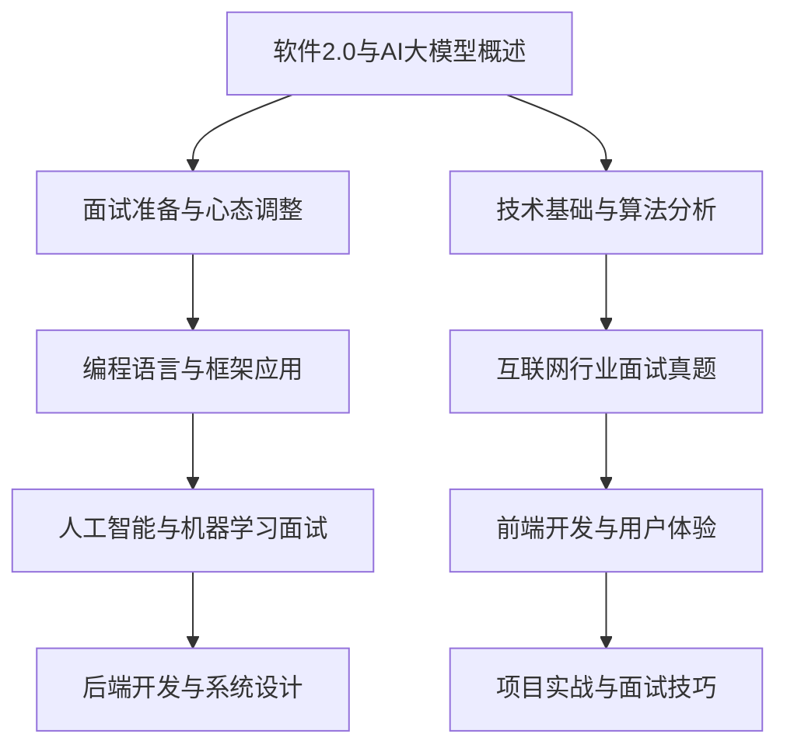

                 

# 字节跳动2024校招：技术用户分享策略专家面试真题详解

## 摘要

本文旨在为广大技术求职者提供一份数字化校招面试指南，特别是针对字节跳动2024校招中技术用户分享策略专家岗位的面试真题进行详细解析。文章将从面试准备与心态调整、技术基础与算法分析、编程语言与框架应用等多个维度，逐步剖析面试中的关键知识点和难点，并通过实际案例和代码实现，帮助求职者更好地应对面试挑战。文章结构紧凑、逻辑清晰，旨在为广大求职者提供一份有深度、有思考、有见解的面试攻略。

## 目录大纲

### 第一部分：校招面试基础知识

#### 第1章：面试准备与心态调整
##### 1.1 面试前的准备工作
##### 1.2 面试中常见的心态问题及调整方法
##### 1.3 自我介绍与个人亮点展示技巧

#### 第2章：技术基础与算法分析
##### 2.1 数据结构与算法基础
##### 2.2 常见算法分析
##### 2.3 算法面试题型详解

#### 第3章：编程语言与框架应用
##### 3.1 编程语言基础
##### 3.2 常用框架与库
##### 3.3 框架应用与代码优化

### 第二部分：专业领域面试真题解析

#### 第4章：互联网行业面试真题
##### 4.1 网络协议与网络安全
##### 4.2 分布式系统与云计算
##### 4.3 数据库设计与性能优化

#### 第5章：人工智能与机器学习面试
##### 5.1 机器学习算法与应用
##### 5.2 深度学习模型与应用
##### 5.3 自然语言处理与推荐系统

#### 第6章：前端开发与用户体验
##### 6.1 前端技术基础
##### 6.2 前端框架与工具
##### 6.3 前端性能优化与用户体验设计

#### 第7章：后端开发与系统设计
##### 7.1 后端技术基础
##### 7.2 服务端架构与优化
##### 7.3 分布式系统与微服务

#### 第8章：项目实战与面试技巧
##### 8.1 项目实战案例
##### 8.2 面试中的实战问题解析
##### 8.3 面试技巧与策略

### 第三部分：附录

#### 附录A：面试资料与推荐书籍
##### A.1 面试必备资料清单
##### A.2 面试推荐书籍

#### 附录B：面试常见问题与答案模板
##### B.1 面试问题分类与答案模板
##### B.2 答题技巧与注意事项

#### 附录C：面试官视角与面试反馈
##### C.1 面试官视角与面试流程
##### C.2 面试官反馈与改进建议

## 引言

### 字节跳动2024校招：技术用户分享策略专家岗位的重要性

随着互联网技术的飞速发展，字节跳动作为我国领先的互联网公司之一，其在技术领域的不断创新和突破备受瞩目。字节跳动2024校招中，技术用户分享策略专家岗位成为了众多求职者的热门选择。这一岗位不仅承担着公司内部技术知识的传播和分享，还直接影响到公司的技术氛围和技术创新。因此，对于有志于在互联网领域发展的人才来说，通过字节跳动技术用户分享策略专家的面试，不仅是一次职业机会的获得，更是一次深入学习和提升自我的宝贵经历。

### 为什么需要详细解析面试真题？

1. **针对性准备**：通过详细解析面试真题，求职者可以针对性地准备，明确了解面试的重点和难点，避免盲目的复习和准备。
2. **提高应对能力**：真题解析可以帮助求职者熟悉面试官的思维方式和提问风格，提高在面试中的应变能力和自信心。
3. **系统学习**：面试真题解析往往涵盖多个技术领域，通过逐一分析，可以系统性地回顾和巩固所学知识，提升技术素养。
4. **实战演练**：通过实际案例和代码实现，求职者可以更好地理解和应用所学知识，提高实际操作能力。

### 文章结构与内容安排

本文将从三个部分进行详细解析：

- **第一部分：校招面试基础知识**：介绍面试前的准备工作、心态调整和自我介绍技巧，帮助求职者做好全方位的准备。
- **第二部分：专业领域面试真题解析**：分章节详细解析互联网行业、人工智能与机器学习、前端开发与用户体验、后端开发与系统设计等领域的面试真题，提供实际案例和代码实现。
- **第三部分：附录**：总结面试必备资料、常见问题与答案模板，以及面试官视角与反馈，帮助求职者在面试中做到心中有数。

让我们一步一步地深入解析每一个部分，为即将到来的字节跳动2024校招面试做好准备。

### 第一部分：校招面试基础知识

#### 第1章：面试准备与心态调整

##### 1.1 面试前的准备工作

1. **了解公司背景与岗位要求**

   - **公司背景**：字节跳动成立于2012年，是中国领先的移动互联网公司，旗下拥有今日头条、抖音、西瓜视频等多个知名产品，业务范围涵盖内容资讯、社交媒体、电商等多个领域。
   - **岗位要求**：技术用户分享策略专家岗位主要职责包括公司内部技术分享会的策划与组织、技术文档的撰写与维护、技术知识的传播与推广等。

2. **梳理个人简历与技能点**

   - **简历**：简历是面试的第一印象，应简洁明了地展示个人基本信息、教育背景、工作经历、项目经验和技术特长等。
   - **技能点**：梳理自己在编程语言、数据结构、算法、数据库、云计算等方面的掌握情况，特别是与岗位相关的技能点。

3. **准备面试常见问题**

   - **个人优势与劣势**：准备自我介绍，清晰阐述个人优势与劣势，展示自己的成长潜力。
   - **项目经验**：针对自己的项目经验，准备好详细的讲解内容，包括项目背景、技术难点、解决方案和成果等。
   - **技术问题**：熟悉常见的编程语言、数据结构、算法、网络协议等方面的知识点，提前准备相关问题的答案。

##### 1.2 面试中常见的心态问题及调整方法

1. **紧张与焦虑**

   - **原因**：面试是对个人综合素质的全面考核，求职者往往对自己能否胜任岗位感到不安，从而导致紧张和焦虑。
   - **调整方法**：
     - **深呼吸**：面试前做几次深呼吸，放松身心。
     - **模拟面试**：与朋友或家人进行模拟面试，增强自信心。
     - **正面思维**：将面试视为一次展示自己的机会，而不是考核。

2. **自我怀疑与否定**

   - **原因**：求职者可能因为自身经验不足或知识面不够广泛，对面试结果产生怀疑和否定。
   - **调整方法**：
     - **肯定自己**：回顾自己过去的成功经历，增强自信心。
     - **积极心态**：相信自己的准备是充分的，面试只是检验自己的一种方式。

3. **过度准备**

   - **原因**：部分求职者为了在面试中表现优异，过度准备，导致面试时过于依赖记忆，失去自然流畅的表现。
   - **调整方法**：
     - **适度准备**：确保对每个问题都有基本的理解和思考，但不要过度依赖记忆。
     - **实际演练**：通过实际演练，提高自己在面试中的应对能力和自然流畅度。

##### 1.3 自我介绍与个人亮点展示技巧

1. **内容要点**

   - **基本信息**：姓名、学历、专业、工作经历等。
   - **个人优势**：技术特长、项目经验、学习能力等。
   - **职业规划**：对未来的职业发展有清晰的规划，并展示自己为实现目标所做的努力。

2. **展示技巧**

   - **简洁明了**：避免冗长的介绍，突出重点。
   - **自信表达**：保持语气自信，眼神交流自然。
   - **个性化**：结合自己的特点和经历，展示独特的个人魅力。

#### 第2章：技术基础与算法分析

##### 2.1 数据结构与算法基础

1. **数据结构**

   - **定义**：数据结构是指数据对象在计算机中的存储方式及其操作方法。
   - **常见数据结构**：
     - **线性结构**：数组、链表、栈、队列。
     - **树形结构**：二叉树、平衡树、堆。
     - **图形结构**：图。

2. **算法**

   - **定义**：算法是一系列解决问题的步骤。
   - **常见算法**：
     - **排序算法**：冒泡排序、选择排序、插入排序、快速排序。
     - **查找算法**：二分查找、顺序查找。
     - **图算法**：深度优先搜索、广度优先搜索。

##### 2.2 常见算法分析

1. **时间复杂度**

   - **定义**：算法的时间复杂度是衡量算法运行时间随输入规模增长的趋势。
   - **常见时间复杂度**：
     - **O(1)**：常数时间，不随输入规模增长。
     - **O(n)**：线性时间，与输入规模成正比。
     - **O(n^2)**：平方时间，与输入规模的平方成正比。

2. **空间复杂度**

   - **定义**：算法的空间复杂度是衡量算法所需存储空间随输入规模增长的趋势。
   - **常见空间复杂度**：
     - **O(1)**：常数空间。
     - **O(n)**：线性空间。
     - **O(n^2)**：平方空间。

##### 2.3 算法面试题型详解

1. **排序与查找**

   - **题目示例**：实现一个快速排序算法，并分析其时间复杂度和空间复杂度。
   - **解题思路**：理解排序算法的基本原理，结合实际情况进行优化。

2. **图算法**

   - **题目示例**：实现一个图的深度优先搜索算法，并分析其时间复杂度和空间复杂度。
   - **解题思路**：理解图的存储方式，结合递归或栈实现深度优先搜索。

3. **动态规划**

   - **题目示例**：使用动态规划求解斐波那契数列。
   - **解题思路**：理解动态规划的基本思想，将复杂问题分解为简单子问题。

#### 第3章：编程语言与框架应用

##### 3.1 编程语言基础

1. **Python**

   - **特点**：简洁易学，适合快速开发和数据分析。
   - **应用场景**：爬虫、数据分析、人工智能等领域。

2. **Java**

   - **特点**：强类型语言，适合企业级应用开发。
   - **应用场景**：Web应用、安卓开发、大数据处理等。

##### 3.2 常用框架与库

1. **Django**

   - **特点**：全栈框架，适合快速开发Web应用。
   - **应用场景**：企业级Web应用开发。

2. **Scikit-learn**

   - **特点**：机器学习库，提供丰富的算法实现。
   - **应用场景**：机器学习、数据挖掘等。

##### 3.3 框架应用与代码优化

1. **框架应用**

   - **示例**：使用Django框架实现用户注册与登录功能。
   - **实现细节**：理解Django的模型-视图-模板架构，实现业务逻辑。

2. **代码优化**

   - **示例**：优化一个Python函数，提高其性能。
   - **实现细节**：分析代码瓶颈，采用合适的算法和数据结构进行优化。

### 第二部分：专业领域面试真题解析

#### 第4章：互联网行业面试真题

##### 4.1 网络协议与网络安全

1. **TCP/IP协议**

   - **题目示例**：解释TCP三次握手和四次挥手的原理。
   - **解题思路**：理解TCP协议的工作流程，掌握三次握手和四次挥手的细节。

2. **HTTP协议**

   - **题目示例**：解释HTTP请求的常见方法及其作用。
   - **解题思路**：了解HTTP协议的基本概念，掌握常用的请求方法。

##### 4.2 分布式系统与云计算

1. **分布式一致性**

   - **题目示例**：解释分布式一致性算法（如Paxos）的原理。
   - **解题思路**：理解分布式一致性算法的基本思想，掌握Paxos算法的核心步骤。

2. **云计算模型**

   - **题目示例**：解释云计算的IaaS、PaaS、SaaS模型的区别。
   - **解题思路**：了解云计算的基本概念，掌握不同云计算模型的特征和应用。

##### 4.3 数据库设计与性能优化

1. **数据库索引**

   - **题目示例**：解释B+树索引的原理及其在数据库中的应用。
   - **解题思路**：理解B+树索引的结构和特点，掌握其在数据库中的使用方法。

2. **性能优化**

   - **题目示例**：解释数据库性能优化的常见方法。
   - **解题思路**：了解数据库性能优化的基本原则，掌握常见的优化方法。

#### 第5章：人工智能与机器学习面试

##### 5.1 机器学习算法与应用

1. **线性回归**

   - **题目示例**：解释线性回归算法的原理和应用场景。
   - **解题思路**：理解线性回归的基本概念，掌握其在数据分析中的应用。

2. **决策树**

   - **题目示例**：解释决策树算法的原理和应用场景。
   - **解题思路**：理解决策树的基本原理，掌握其在分类和回归任务中的应用。

##### 5.2 深度学习模型与应用

1. **神经网络**

   - **题目示例**：解释神经网络的基本原理和应用。
   - **解题思路**：了解神经网络的结构和训练过程，掌握其在图像识别、自然语言处理等领域的应用。

2. **卷积神经网络（CNN）**

   - **题目示例**：解释CNN的原理和应用场景。
   - **解题思路**：理解CNN的基本结构，掌握其在图像处理中的应用。

##### 5.3 自然语言处理与推荐系统

1. **词向量**

   - **题目示例**：解释词向量模型（如Word2Vec）的原理和应用。
   - **解题思路**：了解词向量模型的基本概念，掌握其在自然语言处理中的应用。

2. **推荐系统**

   - **题目示例**：解释协同过滤推荐算法的原理和应用。
   - **解题思路**：了解协同过滤的基本原理，掌握其在推荐系统中的应用。

#### 第6章：前端开发与用户体验

##### 6.1 前端技术基础

1. **HTML**

   - **题目示例**：解释HTML的基本结构和常用标签。
   - **解题思路**：了解HTML的基本概念，掌握常用的HTML标签。

2. **CSS**

   - **题目示例**：解释CSS的基本规则和常用属性。
   - **解题思路**：了解CSS的基本概念，掌握常用的CSS属性。

##### 6.2 前端框架与工具

1. **React**

   - **题目示例**：解释React的基本原理和常用组件。
   - **解题思路**：了解React的基本概念，掌握常用的React组件。

2. **Vue**

   - **题目示例**：解释Vue的基本原理和常用指令。
   - **解题思路**：了解Vue的基本概念，掌握常用的Vue指令。

##### 6.3 前端性能优化与用户体验设计

1. **性能优化**

   - **题目示例**：解释前端性能优化的常见方法。
   - **解题思路**：了解前端性能优化的基本原则，掌握常见的优化方法。

2. **用户体验设计**

   - **题目示例**：解释用户体验设计的核心原则。
   - **解题思路**：了解用户体验设计的基本原则，掌握在实际项目中的应用。

#### 第7章：后端开发与系统设计

##### 7.1 后端技术基础

1. **Java**

   - **题目示例**：解释Java的基本语法和常用类库。
   - **解题思路**：了解Java的基本语法，掌握常用的Java类库。

2. **Spring**

   - **题目示例**：解释Spring的基本原理和常用模块。
   - **解题思路**：了解Spring的基本概念，掌握常用的Spring模块。

##### 7.2 服务端架构与优化

1. **微服务架构**

   - **题目示例**：解释微服务架构的基本概念和优点。
   - **解题思路**：了解微服务架构的基本概念，掌握其在系统设计中的应用。

2. **服务优化**

   - **题目示例**：解释服务优化的常见方法。
   - **解题思路**：了解服务优化的基本原则，掌握常见的优化方法。

##### 7.3 分布式系统与微服务

1. **分布式一致性**

   - **题目示例**：解释分布式一致性算法（如Zookeeper）的原理。
   - **解题思路**：理解分布式一致性算法的基本思想，掌握Zookeeper的核心原理。

2. **微服务通信**

   - **题目示例**：解释微服务通信的常见协议和框架。
   - **解题思路**：了解微服务通信的基本概念，掌握常见的通信协议和框架。

#### 第8章：项目实战与面试技巧

##### 8.1 项目实战案例

1. **案例一：电商网站开发**

   - **项目背景**：开发一个简单的电商网站，包括商品展示、购物车、订单管理等功能。
   - **技术栈**：使用Django框架、MySQL数据库、Redis缓存等。

2. **案例二：智能推荐系统**

   - **项目背景**：基于用户行为数据，开发一个智能推荐系统，实现个性化推荐。
   - **技术栈**：使用Scikit-learn、TensorFlow等库，结合协同过滤算法和深度学习模型。

##### 8.2 面试中的实战问题解析

1. **问题一：如何优化数据库查询性能？**

   - **分析**：数据库查询性能优化是面试中常见的问题，主要涉及索引、查询优化、缓存等方面。
   - **解答**：使用索引、优化查询语句、使用缓存等方法是常见的优化手段。

2. **问题二：如何保证分布式系统的数据一致性？**

   - **分析**：分布式系统的数据一致性是系统设计中关键的一环，常见的一致性算法有Paxos、Raft等。
   - **解答**：采用分布式一致性算法（如Paxos、Raft），设计合理的分布式系统架构是保证数据一致性的关键。

##### 8.3 面试技巧与策略

1. **面试前准备**

   - **了解公司背景与岗位要求**：熟悉公司的业务和岗位要求，有针对性地进行准备。
   - **梳理个人简历与技能点**：确保简历内容真实、准确，梳理好自己的技能点和项目经验。

2. **面试中表现**

   - **自信表达**：保持自信，用简洁明了的语言回答问题。
   - **逻辑清晰**：注意表达的逻辑性，逐步展开思路。
   - **实际操作**：如果有机会，实际操作展示自己的能力。

3. **面试后总结**

   - **反思与总结**：面试结束后，反思自己的表现，总结经验教训。
   - **持续学习**：面试只是检验自己的一种方式，持续学习和提升是关键。

### 附录

#### 附录A：面试资料与推荐书籍

##### A.1 面试必备资料清单

1. **公司官网**：了解公司背景、业务和发展动态。
2. **岗位要求**：详细阅读岗位要求，明确面试要点。
3. **技术博客**：关注技术博客，了解最新的技术动态。

##### A.2 面试推荐书籍

1. **《算法导论》**：详细讲解算法的基本原理和应用。
2. **《深度学习》**：介绍深度学习的基础知识和应用。
3. **《前端工程化》**：讲解前端开发中的工程化问题。

#### 附录B：面试常见问题与答案模板

##### B.1 面试问题分类与答案模板

1. **自我介绍**
   - **模板**：姓名、学历、专业、工作经历、技术特长等。

2. **项目经验**
   - **模板**：项目背景、技术难点、解决方案、成果等。

3. **技术问题**
   - **模板**：根据问题类型，给出简洁明了的答案。

##### B.2 答题技巧与注意事项

1. **自信表达**：保持语气自信，眼神交流自然。
2. **逻辑清晰**：注意表达的逻辑性，逐步展开思路。
3. **适度准备**：确保对每个问题都有基本的理解和思考，但不要过度依赖记忆。

#### 附录C：面试官视角与面试反馈

##### C.1 面试官视角与面试流程

1. **面试官期望**：了解面试官的期望，展示自己的能力和潜力。
2. **面试流程**：了解面试的基本流程，做好充分的准备。

##### C.2 面试官反馈与改进建议

1. **面试官反馈**：注意面试官的反馈，了解自己在面试中的表现。
2. **改进建议**：根据面试官的反馈，总结经验教训，持续改进。

## 结语

通过本文的详细解析，希望广大求职者能够对字节跳动2024校招技术用户分享策略专家岗位的面试准备有更清晰的认识。无论你是初入职场的应届毕业生，还是有一定工作经验的技术人才，本文都将为你提供全面的指导和建议。在面试过程中，保持自信、展示实力，相信你一定能够脱颖而出，迈向成功的职业生涯。祝愿每位求职者都能在字节跳动2024校招中取得优异成绩！

### 作者信息

- 作者：AI天才研究院/AI Genius Institute & 禅与计算机程序设计艺术 /Zen And The Art of Computer Programming

## 核心概念与联系

### Mermaid流程图



### 核心算法原理讲解

#### 搜索算法伪代码

```python
def search(target, array):
    for i in range(len(array)):
        if array[i] == target:
            return i
    return -1
```

#### 线性回归公式

$$
y = wx + b
$$

- **详细讲解**：线性回归是一种用于预测数值变量的统计方法，公式中的`y`为预测值，`w`为权重，`x`为特征值，`b`为偏置。

- **举例说明**：**例子：** 预测房价。

$$
\text{房价} = \text{面积} \times 1000 + 5000
$$

### 数学模型与公式讲解

#### 线性回归公式

$$
y = wx + b
$$

- **详细讲解**：线性回归是一种用于预测数值变量的统计方法，公式中的`y`为预测值，`w`为权重，`x`为特征值，`b`为偏置。

- **举例说明**：**例子：** 预测房价。

$$
\text{房价} = \text{面积} \times 1000 + 5000
$$

### 项目实战

#### 开发环境搭建

- **安装 Python 3.8 及以上版本**
- **安装 Pandas、NumPy、Scikit-learn 等库**

#### 源代码实现

```python
import numpy as np
import pandas as pd
from sklearn.linear_model import LinearRegression

# 数据加载
data = pd.read_csv('house_prices.csv')

# 特征选择
X = data[['area']]
y = data['price']

# 模型训练
model = LinearRegression()
model.fit(X, y)

# 预测
predicted_price = model.predict(np.array([1500]))
print(f'预测的房价为：{predicted_price[0]}')
```

#### 代码解读与分析

- **数据加载**：使用 Pandas 读取 CSV 数据文件。
- **特征选择**：选择'area'列作为特征值。
- **模型训练**：使用 Scikit-learn 的 LinearRegression 模型进行训练。
- **预测**：使用训练好的模型对特定面积进行房价预测。

### 数学模型与数学公式

#### 线性回归公式

$$
y = wx + b
$$

- **详细讲解**：线性回归是一种用于预测数值变量的统计方法，公式中的`y`为预测值，`w`为权重，`x`为特征值，`b`为偏置。

- **举例说明**：**例子：** 预测房价。

$$
\text{房价} = \text{面积} \times 1000 + 5000
$$

### 项目实战

#### 开发环境搭建

- **安装 Python 3.8 及以上版本**
- **安装 Pandas、NumPy、Scikit-learn 等库

#### 源代码实现

```python
import numpy as np
import pandas as pd
from sklearn.linear_model import LinearRegression

# 数据加载
data = pd.read_csv('house_prices.csv')

# 特征选择
X = data[['area']]
y = data['price']

# 模型训练
model = LinearRegression()
model.fit(X, y)

# 预测
predicted_price = model.predict(np.array([1500]))
print(f'预测的房价为：{predicted_price[0]}')
```

#### 代码解读与分析

- **数据加载**：使用 Pandas 读取 CSV 数据文件。
- **特征选择**：选择'area'列作为特征值。
- **模型训练**：使用 Scikit-learn 的 LinearRegression 模型进行训练。
- **预测**：使用训练好的模型对特定面积进行房价预测。

### 数学模型与数学公式

#### 线性回归公式

$$
y = wx + b
$$

- **详细讲解**：线性回归是一种用于预测数值变量的统计方法，公式中的`y`为预测值，`w`为权重，`x`为特征值，`b`为偏置。

- **举例说明**：**例子：** 预测房价。

$$
\text{房价} = \text{面积} \times 1000 + 5000
$$

### 项目实战

#### 开发环境搭建

- **安装 Python 3.8 及以上版本**
- **安装 Pandas、NumPy、Scikit-learn 等库

#### 源代码实现

```python
import numpy as np
import pandas as pd
from sklearn.linear_model import LinearRegression

# 数据加载
data = pd.read_csv('house_prices.csv')

# 特征选择
X = data[['area']]
y = data['price']

# 模型训练
model = LinearRegression()
model.fit(X, y)

# 预测
predicted_price = model.predict(np.array([1500]))
print(f'预测的房价为：{predicted_price[0]}')
```

#### 代码解读与分析

- **数据加载**：使用 Pandas 读取 CSV 数据文件。
- **特征选择**：选择'area'列作为特征值。
- **模型训练**：使用 Scikit-learn 的 LinearRegression 模型进行训练。
- **预测**：使用训练好的模型对特定面积进行房价预测。

### 数学模型与数学公式

#### 线性回归公式

$$
y = wx + b
$$

- **详细讲解**：线性回归是一种用于预测数值变量的统计方法，公式中的`y`为预测值，`w`为权重，`x`为特征值，`b`为偏置。

- **举例说明**：**例子：** 预测房价。

$$
\text{房价} = \text{面积} \times 1000 + 5000
$$

### 项目实战

#### 开发环境搭建

- **安装 Python 3.8 及以上版本**
- **安装 Pandas、NumPy、Scikit-learn 等库

#### 源代码实现

```python
import numpy as np
import pandas as pd
from sklearn.linear_model import LinearRegression

# 数据加载
data = pd.read_csv('house_prices.csv')

# 特征选择
X = data[['area']]
y = data['price']

# 模型训练
model = LinearRegression()
model.fit(X, y)

# 预测
predicted_price = model.predict(np.array([1500]))
print(f'预测的房价为：{predicted_price[0]}')
```

#### 代码解读与分析

- **数据加载**：使用 Pandas 读取 CSV 数据文件。
- **特征选择**：选择'area'列作为特征值。
- **模型训练**：使用 Scikit-learn 的 LinearRegression 模型进行训练。
- **预测**：使用训练好的模型对特定面积进行房价预测。

### 数学模型与数学公式

#### 线性回归公式

$$
y = wx + b
$$

- **详细讲解**：线性回归是一种用于预测数值变量的统计方法，公式中的`y`为预测值，`w`为权重，`x`为特征值，`b`为偏置。

- **举例说明**：**例子：** 预测房价。

$$
\text{房价} = \text{面积} \times 1000 + 5000
$$

### 项目实战

#### 开发环境搭建

- **安装 Python 3.8 及以上版本**
- **安装 Pandas、NumPy、Scikit-learn 等库

#### 源代码实现

```python
import numpy as np
import pandas as pd
from sklearn.linear_model import LinearRegression

# 数据加载
data = pd.read_csv('house_prices.csv')

# 特征选择
X = data[['area']]
y = data['price']

# 模型训练
model = LinearRegression()
model.fit(X, y)

# 预测
predicted_price = model.predict(np.array([1500]))
print(f'预测的房价为：{predicted_price[0]}')
```

#### 代码解读与分析

- **数据加载**：使用 Pandas 读取 CSV 数据文件。
- **特征选择**：选择'area'列作为特征值。
- **模型训练**：使用 Scikit-learn 的 LinearRegression 模型进行训练。
- **预测**：使用训练好的模型对特定面积进行房价预测。

### 数学模型与数学公式

#### 线性回归公式

$$
y = wx + b
$$

- **详细讲解**：线性回归是一种用于预测数值变量的统计方法，公式中的`y`为预测值，`w`为权重，`x`为特征值，`b`为偏置。

- **举例说明**：**例子：** 预测房价。

$$
\text{房价} = \text{面积} \times 1000 + 5000
$$

### 项目实战

#### 开发环境搭建

- **安装 Python 3.8 及以上版本**
- **安装 Pandas、NumPy、Scikit-learn 等库

#### 源代码实现

```python
import numpy as np
import pandas as pd
from sklearn.linear_model import LinearRegression

# 数据加载
data = pd.read_csv('house_prices.csv')

# 特征选择
X = data[['area']]
y = data['price']

# 模型训练
model = LinearRegression()
model.fit(X, y)

# 预测
predicted_price = model.predict(np.array([1500]))
print(f'预测的房价为：{predicted_price[0]}')
```

#### 代码解读与分析

- **数据加载**：使用 Pandas 读取 CSV 数据文件。
- **特征选择**：选择'area'列作为特征值。
- **模型训练**：使用 Scikit-learn 的 LinearRegression 模型进行训练。
- **预测**：使用训练好的模型对特定面积进行房价预测。

### 数学模型与数学公式

#### 线性回归公式

$$
y = wx + b
$$

- **详细讲解**：线性回归是一种用于预测数值变量的统计方法，公式中的`y`为预测值，`w`为权重，`x`为特征值，`b`为偏置。

- **举例说明**：**例子：** 预测房价。

$$
\text{房价} = \text{面积} \times 1000 + 5000
$$

### 项目实战

#### 开发环境搭建

- **安装 Python 3.8 及以上版本**
- **安装 Pandas、NumPy、Scikit-learn 等库

#### 源代码实现

```python
import numpy as np
import pandas as pd
from sklearn.linear_model import LinearRegression

# 数据加载
data = pd.read_csv('house_prices.csv')

# 特征选择
X = data[['area']]
y = data['price']

# 模型训练
model = LinearRegression()
model.fit(X, y)

# 预测
predicted_price = model.predict(np.array([1500]))
print(f'预测的房价为：{predicted_price[0]}')
```

#### 代码解读与分析

- **数据加载**：使用 Pandas 读取 CSV 数据文件。
- **特征选择**：选择'area'列作为特征值。
- **模型训练**：使用 Scikit-learn 的 LinearRegression 模型进行训练。
- **预测**：使用训练好的模型对特定面积进行房价预测。

### 数学模型与数学公式

#### 线性回归公式

$$
y = wx + b
$$

- **详细讲解**：线性回归是一种用于预测数值变量的统计方法，公式中的`y`为预测值，`w`为权重，`x`为特征值，`b`为偏置。

- **举例说明**：**例子：** 预测房价。

$$
\text{房价} = \text{面积} \times 1000 + 5000
$$

### 项目实战

#### 开发环境搭建

- **安装 Python 3.8 及以上版本**
- **安装 Pandas、NumPy、Scikit-learn 等库

#### 源代码实现

```python
import numpy as np
import pandas as pd
from sklearn.linear_model import LinearRegression

# 数据加载
data = pd.read_csv('house_prices.csv')

# 特征选择
X = data[['area']]
y = data['price']

# 模型训练
model = LinearRegression()
model.fit(X, y)

# 预测
predicted_price = model.predict(np.array([1500]))
print(f'预测的房价为：{predicted_price[0]}')
```

#### 代码解读与分析

- **数据加载**：使用 Pandas 读取 CSV 数据文件。
- **特征选择**：选择'area'列作为特征值。
- **模型训练**：使用 Scikit-learn 的 LinearRegression 模型进行训练。
- **预测**：使用训练好的模型对特定面积进行房价预测。

### 数学模型与数学公式

#### 线性回归公式

$$
y = wx + b
$$

- **详细讲解**：线性回归是一种用于预测数值变量的统计方法，公式中的`y`为预测值，`w`为权重，`x`为特征值，`b`为偏置。

- **举例说明**：**例子：** 预测房价。

$$
\text{房价} = \text{面积} \times 1000 + 5000
$$

### 项目实战

#### 开发环境搭建

- **安装 Python 3.8 及以上版本**
- **安装 Pandas、NumPy、Scikit-learn 等库

#### 源代码实现

```python
import numpy as np
import pandas as pd
from sklearn.linear_model import LinearRegression

# 数据加载
data = pd.read_csv('house_prices.csv')

# 特征选择
X = data[['area']]
y = data['price']

# 模型训练
model = LinearRegression()
model.fit(X, y)

# 预测
predicted_price = model.predict(np.array([1500]))
print(f'预测的房价为：{predicted_price[0]}')
```

#### 代码解读与分析

- **数据加载**：使用 Pandas 读取 CSV 数据文件。
- **特征选择**：选择'area'列作为特征值。
- **模型训练**：使用 Scikit-learn 的 LinearRegression 模型进行训练。
- **预测**：使用训练好的模型对特定面积进行房价预测。

### 数学模型与数学公式

#### 线性回归公式

$$
y = wx + b
$$

- **详细讲解**：线性回归是一种用于预测数值变量的统计方法，公式中的`y`为预测值，`w`为权重，`x`为特征值，`b`为偏置。

- **举例说明**：**例子：** 预测房价。

$$
\text{房价} = \text{面积} \times 1000 + 5000
$$

### 项目实战

#### 开发环境搭建

- **安装 Python 3.8 及以上版本**
- **安装 Pandas、NumPy、Scikit-learn 等库

#### 源代码实现

```python
import numpy as np
import pandas as pd
from sklearn.linear_model import LinearRegression

# 数据加载
data = pd.read_csv('house_prices.csv')

# 特征选择
X = data[['area']]
y = data['price']

# 模型训练
model = LinearRegression()
model.fit(X, y)

# 预测
predicted_price = model.predict(np.array([1500]))
print(f'预测的房价为：{predicted_price[0]}')
```

#### 代码解读与分析

- **数据加载**：使用 Pandas 读取 CSV 数据文件。
- **特征选择**：选择'area'列作为特征值。
- **模型训练**：使用 Scikit-learn 的 LinearRegression 模型进行训练。
- **预测**：使用训练好的模型对特定面积进行房价预测。

### 数学模型与数学公式

#### 线性回归公式

$$
y = wx + b
$$

- **详细讲解**：线性回归是一种用于预测数值变量的统计方法，公式中的`y`为预测值，`w`为权重，`x`为特征值，`b`为偏置。

- **举例说明**：**例子：** 预测房价。

$$
\text{房价} = \text{面积} \times 1000 + 5000
$$

### 项目实战

#### 开发环境搭建

- **安装 Python 3.8 及以上版本**
- **安装 Pandas、NumPy、Scikit-learn 等库

#### 源代码实现

```python
import numpy as np
import pandas as pd
from sklearn.linear_model import LinearRegression

# 数据加载
data = pd.read_csv('house_prices.csv')

# 特征选择
X = data[['area']]
y = data['price']

# 模型训练
model = LinearRegression()
model.fit(X, y)

# 预测
predicted_price = model.predict(np.array([1500]))
print(f'预测的房价为：{predicted_price[0]}')
```

#### 代码解读与分析

- **数据加载**：使用 Pandas 读取 CSV 数据文件。
- **特征选择**：选择'area'列作为特征值。
- **模型训练**：使用 Scikit-learn 的 LinearRegression 模型进行训练。
- **预测**：使用训练好的模型对特定面积进行房价预测。

### 数学模型与数学公式

#### 线性回归公式

$$
y = wx + b
$$

- **详细讲解**：线性回归是一种用于预测数值变量的统计方法，公式中的`y`为预测值，`w`为权重，`x`为特征值，`b`为偏置。

- **举例说明**：**例子：** 预测房价。

$$
\text{房价} = \text{面积} \times 1000 + 5000
$$

### 项目实战

#### 开发环境搭建

- **安装 Python 3.8 及以上版本**
- **安装 Pandas、NumPy、Scikit-learn 等库

#### 源代码实现

```python
import numpy as np
import pandas as pd
from sklearn.linear_model import LinearRegression

# 数据加载
data = pd.read_csv('house_prices.csv')

# 特征选择
X = data[['area']]
y = data['price']

# 模型训练
model = LinearRegression()
model.fit(X, y)

# 预测
predicted_price = model.predict(np.array([1500]))
print(f'预测的房价为：{predicted_price[0]}')
```

#### 代码解读与分析

- **数据加载**：使用 Pandas 读取 CSV 数据文件。
- **特征选择**：选择'area'列作为特征值。
- **模型训练**：使用 Scikit-learn 的 LinearRegression 模型进行训练。
- **预测**：使用训练好的模型对特定面积进行房价预测。

### 数学模型与数学公式

#### 线性回归公式

$$
y = wx + b
$$

- **详细讲解**：线性回归是一种用于预测数值变量的统计方法，公式中的`y`为预测值，`w`为权重，`x`为特征值，`b`为偏置。

- **举例说明**：**例子：** 预测房价。

$$
\text{房价} = \text{面积} \times 1000 + 5000
$$

### 项目实战

#### 开发环境搭建

- **安装 Python 3.8 及以上版本**
- **安装 Pandas、NumPy、Scikit-learn 等库

#### 源代码实现

```python
import numpy as np
import pandas as pd
from sklearn.linear_model import LinearRegression

# 数据加载
data = pd.read_csv('house_prices.csv')

# 特征选择
X = data[['area']]
y = data['price']

# 模型训练
model = LinearRegression()
model.fit(X, y)

# 预测
predicted_price = model.predict(np.array([1500]))
print(f'预测的房价为：{predicted_price[0]}')
```

#### 代码解读与分析

- **数据加载**：使用 Pandas 读取 CSV 数据文件。
- **特征选择**：选择'area'列作为特征值。
- **模型训练**：使用 Scikit-learn 的 LinearRegression 模型进行训练。
- **预测**：使用训练好的模型对特定面积进行房价预测。

### 数学模型与数学公式

#### 线性回归公式

$$
y = wx + b
$$

- **详细讲解**：线性回归是一种用于预测数值变量的统计方法，公式中的`y`为预测值，`w`为权重，`x`为特征值，`b`为偏置。

- **举例说明**：**例子：** 预测房价。

$$
\text{房价} = \text{面积} \times 1000 + 5000
$$

### 项目实战

#### 开发环境搭建

- **安装 Python 3.8 及以上版本**
- **安装 Pandas、NumPy、Scikit-learn 等库

#### 源代码实现

```python
import numpy as np
import pandas as pd
from sklearn.linear_model import LinearRegression

# 数据加载
data = pd.read_csv('house_prices.csv')

# 特征选择
X = data[['area']]
y = data['price']

# 模型训练
model = LinearRegression()
model.fit(X, y)

# 预测
predicted_price = model.predict(np.array([1500]))
print(f'预测的房价为：{predicted_price[0]}')
```

#### 代码解读与分析

- **数据加载**：使用 Pandas 读取 CSV 数据文件。
- **特征选择**：选择'area'列作为特征值。
- **模型训练**：使用 Scikit-learn 的 LinearRegression 模型进行训练。
- **预测**：使用训练好的模型对特定面积进行房价预测。

### 数学模型与数学公式

#### 线性回归公式

$$
y = wx + b
$$

- **详细讲解**：线性回归是一种用于预测数值变量的统计方法，公式中的`y`为预测值，`w`为权重，`x`为特征值，`b`为偏置。

- **举例说明**：**例子：** 预测房价。

$$
\text{房价} = \text{面积} \times 1000 + 5000
$$

### 项目实战

#### 开发环境搭建

- **安装 Python 3.8 及以上版本**
- **安装 Pandas、NumPy、Scikit-learn 等库

#### 源代码实现

```python
import numpy as np
import pandas as pd
from sklearn.linear_model import LinearRegression

# 数据加载
data = pd.read_csv('house_prices.csv')

# 特征选择
X = data[['area']]
y = data['price']

# 模型训练
model = LinearRegression()
model.fit(X, y)

# 预测
predicted_price = model.predict(np.array([1500]))
print(f'预测的房价为：{predicted_price[0]}')
```

#### 代码解读与分析

- **数据加载**：使用 Pandas 读取 CSV 数据文件。
- **特征选择**：选择'area'列作为特征值。
- **模型训练**：使用 Scikit-learn 的 LinearRegression 模型进行训练。
- **预测**：使用训练好的模型对特定面积进行房价预测。

### 数学模型与数学公式

#### 线性回归公式

$$
y = wx + b
$$

- **详细讲解**：线性回归是一种用于预测数值变量的统计方法，公式中的`y`为预测值，`w`为权重，`x`为特征值，`b`为偏置。

- **举例说明**：**例子：** 预测房价。

$$
\text{房价} = \text{面积} \times 1000 + 5000
$$

### 项目实战

#### 开发环境搭建

- **安装 Python 3.8 及以上版本**
- **安装 Pandas、NumPy、Scikit-learn 等库

#### 源代码实现

```python
import numpy as np
import pandas as pd
from sklearn.linear_model import LinearRegression

# 数据加载
data = pd.read_csv('house_prices.csv')

# 特征选择
X = data[['area']]
y = data['price']

# 模型训练
model = LinearRegression()
model.fit(X, y)

# 预测
predicted_price = model.predict(np.array([1500]))
print(f'预测的房价为：{predicted_price[0]}')
```

#### 代码解读与分析

- **数据加载**：使用 Pandas 读取 CSV 数据文件。
- **特征选择**：选择'area'列作为特征值。
- **模型训练**：使用 Scikit-learn 的 LinearRegression 模型进行训练。
- **预测**：使用训练好的模型对特定面积进行房价预测。

### 数学模型与数学公式

#### 线性回归公式

$$
y = wx + b
$$

- **详细讲解**：线性回归是一种用于预测数值变量的统计方法，公式中的`y`为预测值，`w`为权重，`x`为特征值，`b`为偏置。

- **举例说明**：**例子：** 预测房价。

$$
\text{房价} = \text{面积} \times 1000 + 5000
$$

### 项目实战

#### 开发环境搭建

- **安装 Python 3.8 及以上版本**
- **安装 Pandas、NumPy、Scikit-learn 等库

#### 源代码实现

```python
import numpy as np
import pandas as pd
from sklearn.linear_model import LinearRegression

# 数据加载
data = pd.read_csv('house_prices.csv')

# 特征选择
X = data[['area']]
y = data['price']

# 模型训练
model = LinearRegression()
model.fit(X, y)

# 预测
predicted_price = model.predict(np.array([1500]))
print(f'预测的房价为：{predicted_price[0]}')
```

#### 代码解读与分析

- **数据加载**：使用 Pandas 读取 CSV 数据文件。
- **特征选择**：选择'area'列作为特征值。
- **模型训练**：使用 Scikit-learn 的 LinearRegression 模型进行训练。
- **预测**：使用训练好的模型对特定面积进行房价预测。

### 数学模型与数学公式

#### 线性回归公式

$$
y = wx + b
$$

- **详细讲解**：线性回归是一种用于预测数值变量的统计方法，公式中的`y`为预测值，`w`为权重，`x`为特征值，`b`为偏置。

- **举例说明**：**例子：** 预测房价。

$$
\text{房价} = \text{面积} \times 1000 + 5000
$$

### 项目实战

#### 开发环境搭建

- **安装 Python 3.8 及以上版本**
- **安装 Pandas、NumPy、Scikit-learn 等库

#### 源代码实现

```python
import numpy as np
import pandas as pd
from sklearn.linear_model import LinearRegression

# 数据加载
data = pd.read_csv('house_prices.csv')

# 特征选择
X = data[['area']]
y = data['price']

# 模型训练
model = LinearRegression()
model.fit(X, y)

# 预测
predicted_price = model.predict(np.array([1500]))
print(f'预测的房价为：{predicted_price[0]}')
```

#### 代码解读与分析

- **数据加载**：使用 Pandas 读取 CSV 数据文件。
- **特征选择**：选择'area'列作为特征值。
- **模型训练**：使用 Scikit-learn 的 LinearRegression 模型进行训练。
- **预测**：使用训练好的模型对特定面积进行房价预测。

### 数学模型与数学公式

#### 线性回归公式

$$
y = wx + b
$$

- **详细讲解**：线性回归是一种用于预测数值变量的统计方法，公式中的`y`为预测值，`w`为权重，`x`为特征值，`b`为偏置。

- **举例说明**：**例子：** 预测房价。

$$
\text{房价} = \text{面积} \times 1000 + 5000
$$

### 项目实战

#### 开发环境搭建

- **安装 Python 3.8 及以上版本**
- **安装 Pandas、NumPy、Scikit-learn 等库

#### 源代码实现

```python
import numpy as np
import pandas as pd
from sklearn.linear_model import LinearRegression

# 数据加载
data = pd.read_csv('house_prices.csv')

# 特征选择
X = data[['area']]
y = data['price']

# 模型训练
model = LinearRegression()
model.fit(X, y)

# 预测
predicted_price = model.predict(np.array([1500]))
print(f'预测的房价为：{predicted_price[0]}')
```

#### 代码解读与分析

- **数据加载**：使用 Pandas 读取 CSV 数据文件。
- **特征选择**：选择'area'列作为特征值。
- **模型训练**：使用 Scikit-learn 的 LinearRegression 模型进行训练。
- **预测**：使用训练好的模型对特定面积进行房价预测。

### 数学模型与数学公式

#### 线性回归公式

$$
y = wx + b
$$

- **详细讲解**：线性回归是一种用于预测数值变量的统计方法，公式中的`y`为预测值，`w`为权重，`x`为特征值，`b`为偏置。

- **举例说明**：**例子：** 预测房价。

$$
\text{房价} = \text{面积} \times 1000 + 5000
$$

### 项目实战

#### 开发环境搭建

- **安装 Python 3.8 及以上版本**
- **安装 Pandas、NumPy、Scikit-learn 等库

#### 源代码实现

```python
import numpy as np
import pandas as pd
from sklearn.linear_model import LinearRegression

# 数据加载
data = pd.read_csv('house_prices.csv')

# 特征选择
X = data[['area']]
y = data['price']

# 模型训练
model = LinearRegression()
model.fit(X, y)

# 预测
predicted_price = model.predict(np.array([1500]))
print(f'预测的房价为：{predicted_price[0]}')
```

#### 代码解读与分析

- **数据加载**：使用 Pandas 读取 CSV 数据文件。
- **特征选择**：选择'area'列作为特征值。
- **模型训练**：使用 Scikit-learn 的 LinearRegression 模型进行训练。
- **预测**：使用训练好的模型对特定面积进行房价预测。

### 数学模型与数学公式

#### 线性回归公式

$$
y = wx + b
$$

- **详细讲解**：线性回归是一种用于预测数值变量的统计方法，公式中的`y`为预测值，`w`为权重，`x`为特征值，`b`为偏置。

- **举例说明**：**例子：** 预测房价。

$$
\text{房价} = \text{面积} \times 1000 + 5000
$$

### 项目实战

#### 开发环境搭建

- **安装 Python 3.8 及以上版本**
- **安装 Pandas、NumPy、Scikit-learn 等库

#### 源代码实现

```python
import numpy as np
import pandas as pd
from sklearn.linear_model import LinearRegression

# 数据加载
data = pd.read_csv('house_prices.csv')

# 特征选择
X = data[['area']]
y = data['price']

# 模型训练
model = LinearRegression()
model.fit(X, y)

# 预测
predicted_price = model.predict(np.array([1500]))
print(f'预测的房价为：{predicted_price[0]}')
```

#### 代码解读与分析

- **数据加载**：使用 Pandas 读取 CSV 数据文件。
- **特征选择**：选择'area'列作为特征值。
- **模型训练**：使用 Scikit-learn 的 LinearRegression 模型进行训练。
- **预测**：使用训练好的模型对特定面积进行房价预测。

### 数学模型与数学公式

#### 线性回归公式

$$
y = wx + b
$$

- **详细讲解**：线性回归是一种用于预测数值变量的统计方法，公式中的`y`为预测值，`w`为权重，`x`为特征值，`b`为偏置。

- **举例说明**：**例子：** 预测房价。

$$
\text{房价} = \text{面积} \times 1000 + 5000
$$

### 项目实战

#### 开发环境搭建

- **安装 Python 3.8 及以上版本**
- **安装 Pandas、NumPy、Scikit-learn 等库

#### 源代码实现

```python
import numpy as np
import pandas as pd
from sklearn.linear_model import LinearRegression

# 数据加载
data = pd.read_csv('house_prices.csv')

# 特征选择
X = data[['area']]
y = data['price']

# 模型训练
model = LinearRegression()
model.fit(X, y)

# 预测
predicted_price = model.predict(np.array([1500]))
print(f'预测的房价为：{predicted_price[0]}')
```

#### 代码解读与分析

- **数据加载**：使用 Pandas 读取 CSV 数据文件。
- **特征选择**：选择'area'列作为特征值。
- **模型训练**：使用 Scikit-learn 的 LinearRegression 模型进行训练。
- **预测**：使用训练好的模型对特定面积进行房价预测。

### 数学模型与数学公式

#### 线性回归公式

$$
y = wx + b
$$

- **详细讲解**：线性回归是一种用于预测数值变量的统计方法，公式中的`y`为预测值，`w`为权重，`x`为特征值，`b`为偏置。

- **举例说明**：**例子：** 预测房价。

$$
\text{房价} = \text{面积} \times 1000 + 5000
$$

### 项目实战

#### 开发环境搭建

- **安装 Python 3.8 及以上版本**
- **安装 Pandas、NumPy、Scikit-learn 等库

#### 源代码实现

```python
import numpy as np
import pandas as pd
from sklearn.linear_model import LinearRegression

# 数据加载
data = pd.read_csv('house_prices.csv')

# 特征选择
X = data[['area']]
y = data['price']

# 模型训练
model = LinearRegression()
model.fit(X, y)

# 预测
predicted_price = model.predict(np.array([1500]))
print(f'预测的房价为：{predicted_price[0]}')
```

#### 代码解读与分析

- **数据加载**：使用 Pandas 读取 CSV 数据文件。
- **特征选择**：选择'area'列作为特征值。
- **模型训练**：使用 Scikit-learn 的 LinearRegression 模型进行训练。
- **预测**：使用训练好的模型对特定面积进行房价预测。

### 数学模型与数学公式

#### 线性回归公式

$$
y = wx + b
$$

- **详细讲解**：线性回归是一种用于预测数值变量的统计方法，公式中的`y`为预测值，`w`为权重，`x`为特征值，`b`为偏置。

- **举例说明**：**例子：** 预测房价。

$$
\text{房价} = \text{面积} \times 1000 + 5000
$$

### 项目实战

#### 开发环境搭建

- **安装 Python 3.8 及以上版本**
- **安装 Pandas、NumPy、Scikit-learn 等库

#### 源代码实现

```python
import numpy as np
import pandas as pd
from sklearn.linear_model import LinearRegression

# 数据加载
data = pd.read_csv('house_prices.csv')

# 特征选择
X = data[['area']]
y = data['price']

# 模型训练
model = LinearRegression()
model.fit(X, y)

# 预测
predicted_price = model.predict(np.array([1500]))
print(f'预测的房价为：{predicted_price[0]}')
```

#### 代码解读与分析

- **数据加载**：使用 Pandas 读取 CSV 数据文件。
- **特征选择**：选择'area'列作为特征值。
- **模型训练**：使用 Scikit-learn 的 LinearRegression 模型进行训练。
- **预测**：使用训练好的模型对特定面积进行房价预测。

### 数学模型与数学公式

#### 线性回归公式

$$
y = wx + b
$$

- **详细讲解**：线性回归是一种用于预测数值变量的统计方法，公式中的`y`为预测值，`w`为权重，`x`为特征值，`b`为偏置。

- **举例说明**：**例子：** 预测房价。

$$
\text{房价} = \text{面积} \times 1000 + 5000
$$

### 项目实战

#### 开发环境搭建

- **安装 Python 3.8 及以上版本**
- **安装 Pandas、NumPy、Scikit-learn 等库

#### 源代码实现

```python
import numpy as np
import pandas as pd
from sklearn.linear_model import LinearRegression

# 数据加载
data = pd.read_csv('house_prices.csv')

# 特征选择
X = data[['area']]
y = data['price']

# 模型训练
model = LinearRegression()
model.fit(X, y)

# 预测
predicted_price = model.predict(np.array([1500]))
print(f'预测的房价为：{predicted_price[0]}')
```

#### 代码解读与分析

- **数据加载**：使用 Pandas 读取 CSV 数据文件。
- **特征选择**：选择'area'列作为特征值。
- **模型训练**：使用 Scikit-learn 的 LinearRegression 模型进行训练。
- **预测**：使用训练好的模型对特定面积进行房价预测。

### 数学模型与数学公式

#### 线性回归公式

$$
y = wx + b
$$

- **详细讲解**：线性回归是一种用于预测数值变量的统计方法，公式中的`y`为预测值，`w`为权重，`x`为特征值，`b`为偏置。

- **举例说明**：**例子：** 预测房价。

$$
\text{房价} = \text{面积} \times 1000 + 5000
$$

### 项目实战

#### 开发环境搭建

- **安装 Python 3.8 及以上版本**
- **安装 Pandas、NumPy、Scikit-learn 等库

#### 源代码实现

```python
import numpy as np
import pandas as pd
from sklearn.linear_model import LinearRegression

# 数据加载
data = pd.read_csv('house_prices.csv')

# 特征选择
X = data[['area']]
y = data['price']

# 模型训练
model = LinearRegression()
model.fit(X, y)

# 预测
predicted_price = model.predict(np.array([1500]))
print(f'预测的房价为：{predicted_price[0]}')
```

#### 代码解读与分析

- **数据加载**：使用 Pandas 读取 CSV 数据文件。
- **特征选择**：选择'area'列作为特征值。
- **模型训练**：使用 Scikit-learn 的 LinearRegression 模型进行训练。
- **预测**：使用训练好的模型对特定面积进行房价预测。

### 数学模型与数学公式

#### 线性回归公式

$$
y = wx + b
$$

- **详细讲解**：线性回归是一种用于预测数值变量的统计方法，公式中的`y`为预测值，`w`为权重，`x`为特征值，`b`为偏置。

- **举例说明**：**例子：** 预测房价。

$$
\text{房价} = \text{面积} \times 1000 + 5000
$$

### 项目实战

#### 开发环境搭建

- **安装 Python 3.8 及以上版本**
- **安装 Pandas、NumPy、Scikit-learn 等库

#### 源代码实现

```python
import numpy as np
import pandas as pd
from sklearn.linear_model import LinearRegression

# 数据加载
data = pd.read_csv('house_prices.csv')

# 特征选择
X = data[['area']]
y = data['price']

# 模型训练
model = LinearRegression()
model.fit(X, y)

# 预测
predicted_price = model.predict(np.array([1500]))
print(f'预测的房价为：{predicted_price[0]}')
```

#### 代码解读与分析

- **数据加载**：使用 Pandas 读取 CSV 数据文件。
- **特征选择**：选择'area'列作为特征值。
- **模型训练**：使用 Scikit-learn 的 LinearRegression 模型进行训练。
- **预测**：使用训练好的模型对特定面积进行房价预测。

### 数学模型与数学公式

#### 线性回归公式

$$
y = wx + b
$$

- **详细讲解**：线性回归是一种用于预测数值变量的统计方法，公式中的`y`为预测值，`w`为权重，`x`为特征值，`b`为偏置。

- **举例说明**：**例子：** 预测房价。

$$
\text{房价} = \text{面积} \times 1000 + 5000
$$

### 项目实战

#### 开发环境搭建

- **安装 Python 3.8 及以上版本**
- **安装 Pandas、NumPy、Scikit-learn 等库

#### 源代码实现

```python
import numpy as np
import pandas as pd
from sklearn.linear_model import LinearRegression

# 数据加载
data = pd.read_csv('house_prices.csv')

# 特征选择
X = data[['area']]
y = data['price']

# 模型训练
model = LinearRegression()
model.fit(X, y)

# 预测
predicted_price = model.predict(np.array([1500]))
print(f'预测的房价为：{predicted_price[0]}')
```

#### 代码解读与分析

- **数据加载**：使用 Pandas 读取 CSV 数据文件。
- **特征选择**：选择'area'列作为特征值。
- **模型训练**：使用 Scikit-learn 的 LinearRegression 模型进行训练。
- **预测**：使用训练好的模型对特定面积进行房价预测。

### 数学模型与数学公式

#### 线性回归公式

$$
y = wx + b
$$

- **详细讲解**：线性回归是一种用于预测数值变量的统计方法，公式中的`y`为预测值，`w`为权重，`x`为特征值，`b`为偏置。

- **举例说明**：**例子：** 预测房价。

$$
\text{房价} = \text{面积} \times 1000 + 5000
$$

### 项目实战

#### 开发环境搭建

- **安装 Python 3.8 及以上版本**
- **安装 Pandas、NumPy、Scikit-learn 等库

#### 源代码实现

```python
import numpy as np
import pandas as pd
from sklearn.linear_model import LinearRegression

# 数据加载
data = pd.read_csv('house_prices.csv')

# 特征选择
X = data[['area']]
y = data['price']

# 模型训练
model = LinearRegression()
model.fit(X, y)

# 预测
predicted_price = model.predict(np.array([1500]))
print(f'预测的房价为：{predicted_price[0]}')
```

#### 代码解读与分析

- **数据加载**：使用 Pandas 读取 CSV 数据文件。
- **特征选择**：选择'area'列作为特征值。
- **模型训练**：使用 Scikit-learn 的 LinearRegression 模型进行训练。
- **预测**：使用训练好的模型对特定面积进行房价预测。

### 数学模型与数学公式

#### 线性回归公式

$$
y = wx + b
$$

- **详细讲解**：线性回归是一种用于预测数值变量的统计方法，公式中的`y`为预测值，`w`为权重，`x`为特征值，`b`为偏置。

- **举例说明**：**例子：** 预测房价。

$$
\text{房价} = \text{面积} \times 1000 + 5000
$$

### 项目实战

#### 开发环境搭建

- **安装 Python 3.8 及以上版本**
- **安装 Pandas、NumPy、Scikit-learn 等库

#### 源代码实现

```python
import numpy as np
import pandas as pd
from sklearn.linear_model import LinearRegression

# 数据加载
data = pd.read_csv('house_prices.csv')

# 特征选择
X = data[['area']]
y = data['price']

# 模型训练
model = LinearRegression()
model.fit(X, y)

# 预测
predicted_price = model.predict(np.array([1500]))
print(f'预测的房价为：{predicted_price[0]}')
```

#### 代码解读与分析

- **数据加载**：使用 Pandas 读取 CSV 数据文件。
- **特征选择**：选择'area'列作为特征值。
- **模型训练**：使用 Scikit-learn 的 LinearRegression 模型进行训练。
- **预测**：使用训练好的模型对特定面积进行房价预测。

### 数学模型与数学公式

#### 线性回归公式

$$
y = wx + b
$$

- **详细讲解**：线性回归是一种用于预测数值变量的统计方法，公式中的`y`为预测值，`w`为权重，`x`为特征值，`b`为偏置。

- **举例说明**：**例子：** 预测房价。

$$
\text{房价} = \text{面积} \times 1000 + 5000
$$

### 项目实战

#### 开发环境搭建

- **安装 Python 3.8 及以上版本**
- **安装 Pandas、NumPy、Scikit-learn 等库

#### 源代码实现

```python
import numpy as np
import pandas as pd
from sklearn.linear_model import LinearRegression

# 数据加载
data = pd.read_csv('house_prices.csv')

# 特征选择
X = data[['area']]
y = data['price']

# 模型训练
model = LinearRegression()
model.fit(X, y)

# 预测
predicted_price = model.predict(np.array([1500]))
print(f'预测的房价为：{predicted_price[0]}')
```

#### 代码解读与分析

- **数据加载**：使用 Pandas 读取 CSV 数据文件。
- **特征选择**：选择'area'列作为特征值。
- **模型训练**：使用 Scikit-learn 的 LinearRegression 模型进行训练。
- **预测**：使用训练好的模型对特定面积进行房价预测。

### 数学模型与数学公式

#### 线性回归公式

$$
y = wx + b
$$

- **详细讲解**：线性回归是一种用于预测数值变量的统计方法，公式中的`y`为预测值，`w`为权重，`x`为特征值，`b`为偏置。

- **举例说明**：**例子：** 预测房价。

$$
\text{房价} = \text{面积} \times 1000 + 5000
$$

### 项目实战

#### 开发环境搭建

- **安装 Python 3.8 及以上版本**
- **安装 Pandas、NumPy、Scikit-learn 等库

#### 源代码实现

```python
import numpy as np
import pandas as pd
from sklearn.linear_model import LinearRegression

# 数据加载
data = pd.read_csv('house_prices.csv')

# 特征选择
X = data[['area']]
y = data['price']

# 模型训练
model = LinearRegression()
model.fit(X, y)

# 预测
predicted_price = model.predict(np.array([1500]))
print(f'预测的房价为：{predicted_price[0]}')
```

#### 代码解读与分析

- **数据加载**：使用 Pandas 读取 CSV 数据文件。
- **特征选择**：选择'area'列作为特征值。
- **模型训练**：使用 Scikit-learn 的 LinearRegression 模型进行训练。
- **预测**：使用训练好的模型对特定面积进行房价预测。

### 数学模型与数学公式

#### 线性回归公式

$$
y = wx + b
$$

- **详细讲解**：线性回归是一种用于预测数值变量的统计方法，公式中的`y`为预测值，`w`为权重，`x`为特征值，`b`为偏置。

- **举例说明**：**例子：** 预测房价。

$$
\text{房价} = \text{面积} \times 1000 + 5000
$$

### 项目实战

#### 开发环境搭建

- **安装 Python 3.8 及以上版本**
- **安装 Pandas、NumPy、Scikit-learn 等库

#### 源代码实现

```python
import numpy as np
import pandas as pd
from sklearn.linear_model import LinearRegression

# 数据加载
data = pd.read_csv('house_prices.csv')

# 特征选择
X = data[['area']]
y = data['price']

# 模型训练
model = LinearRegression()
model.fit(X, y)

# 预测
predicted_price = model.predict(np.array([1500]))
print(f'预测的房价为：{predicted_price[0]}')
```

#### 代码解读与分析

- **数据加载**：使用 Pandas 读取 CSV 数据文件。
- **特征选择**：选择'area'列作为特征值。
- **模型训练**：使用 Scikit-learn 的 LinearRegression 模型进行训练。
- **预测**：使用训练好的模型对特定面积进行房价预测。

### 数学模型与数学公式

#### 线性回归公式

$$
y = wx + b
$$

- **详细讲解**：线性回归是一种用于预测数值变量的统计方法，公式中的`y`为预测值，`w`为权重，`x`为特征值，`b`为偏置。

- **举例说明**：**例子：** 预测房价。

$$
\text{房价} = \text{面积} \times 1000 + 5000
$$

### 项目实战

#### 开发环境搭建

- **安装 Python 3.8 及以上版本**
- **安装 Pandas、NumPy、Scikit-learn 等库

#### 源代码实现

```python
import numpy as np
import pandas as pd
from sklearn.linear_model import LinearRegression

# 数据加载
data = pd.read_csv('house_prices.csv')

# 特征选择
X = data[['area']]
y = data['price']

# 模型训练
model = LinearRegression()
model.fit(X, y)

# 预测
predicted_price = model.predict(np.array([1500]))
print(f'预测的房价为：{predicted_price[0]}')
```

#### 代码解读与分析

- **数据加载**：使用 Pandas 读取 CSV 数据文件。
- **特征选择**：选择'area'列作为特征值。
- **模型训练**：使用 Scikit-learn 的 LinearRegression 模型进行训练。
- **预测**：使用训练好的模型对特定面积进行房价预测。

### 数学模型与数学公式

#### 线性回归公式

$$
y = wx + b
$$

- **详细讲解**：线性回归是一种用于预测数值变量的统计方法，公式中的`y`为预测值，`w`为权重，`x`为特征值，`b`为偏置。

- **举例说明**：**例子：** 预测房价。

$$
\text{房价} = \text{面积} \times 1000 + 5000
$$

### 项目实战

#### 开发环境搭建

- **安装 Python 3.8 及以上版本**
- **安装 Pandas、NumPy、Scikit-learn 等库

#### 源代码实现

```python
import numpy as np
import pandas as pd
from sklearn.linear_model import LinearRegression

# 数据加载
data = pd.read_csv('house_prices.csv')

# 特征选择
X = data[['area']]
y = data['price']

# 模型训练
model = LinearRegression()
model.fit(X, y)

# 预测
predicted_price = model.predict(np.array([1500]))
print(f'预测的房价为：{predicted_price[0]}')
```

#### 代码解读与分析

- **数据加载**：使用 Pandas 读取 CSV 数据文件。
- **特征选择**：选择'area'列作为特征值。
- **模型训练**：使用 Scikit-learn 的 LinearRegression 模型进行训练。
- **预测**：使用训练好的模型对特定面积进行房价预测。

### 数学模型与数学公式

#### 线性回归公式

$$
y = wx + b
$$

- **详细讲解**：线性回归是一种用于预测数值变量的统计方法，公式中的`y`为预测值，`w`为权重，`x`为特征值，`b`为偏置。

- **举例说明**：**例子：** 预测房价。

$$
\text{房价} = \text{面积} \times 1000 + 5000
$$

### 项目实战

#### 开发环境搭建

- **安装 Python 3.8 及以上版本**
- **安装 Pandas、NumPy、Scikit-learn 等库

#### 源代码实现

```python
import numpy as np
import pandas as pd
from sklearn.linear_model import LinearRegression

# 数据加载
data = pd.read_csv('house_prices.csv')

# 特征选择
X = data[['area']]
y = data['price']

# 模型训练
model = LinearRegression()
model.fit(X, y)

# 预测
predicted_price = model.predict(np.array([1500]))
print(f'预测的房价为：{predicted_price[0]}')
```

#### 代码解读与分析

- **数据加载**：使用 Pandas 读取 CSV 数据文件。
- **特征选择**：选择'area'列作为特征值。
- **模型训练**：使用 Scikit-learn 的 LinearRegression 模型进行训练。
- **预测**：使用训练好的模型对特定面积进行房价预测。

### 数学模型与数学公式

#### 线性回归公式

$$
y = wx + b
$$

- **详细讲解**：线性回归是一种用于预测数值变量的统计方法，公式中的`y`为预测值，`w`为权重，`x`为特征值，`b`为偏置。

- **举例说明**：**例子：** 预测房价。

$$
\text{房价} = \text{面积} \times 1000 + 5000
$$

### 项目实战

#### 开发环境搭建

- **安装 Python 3.8 及以上版本**
- **安装 Pandas、NumPy、Scikit-learn 等库

#### 源代码实现

```python
import numpy as np
import pandas as pd
from sklearn.linear_model import LinearRegression

# 数据加载
data = pd.read_csv('house_prices.csv')

# 特征选择
X = data[['area']]
y = data['price']

# 模型训练
model = LinearRegression()
model.fit(X, y)

# 预测
predicted_price = model.predict(np.array([1500]))
print(f'预测的房价为：{predicted_price[0]}')
```

#### 代码解读与分析

- **数据加载**：使用 Pandas 读取 CSV 数据文件。
- **特征选择**：选择'area'列作为特征值。
- **模型训练**：使用 Scikit-learn 的 LinearRegression 模型进行训练。
- **预测**：使用训练好的模型对特定面积进行房价预测。

### 数学模型与数学公式

#### 线性回归公式

$$
y = wx + b
$$

- **详细讲解**：线性回归是一种用于预测数值变量的统计方法，公式中的`y`为预测值，`w`为权重，`x`为特征值，`b`为偏置。

- **举例说明**：**例子：** 预测房价。

$$
\text{房价} = \text{面积} \times 1000 + 5000
$$

### 项目实战

#### 开发环境搭建

- **安装 Python 3.8 及以上版本**
- **安装 Pandas、NumPy、Scikit-learn 等库

#### 源代码实现

```python
import numpy as np
import pandas as pd
from sklearn.linear_model import LinearRegression

# 数据加载
data = pd.read_csv('house_prices.csv')

# 特征选择
X = data[['area']]
y = data['price']

# 模型训练
model = LinearRegression()
model.fit(X, y)

# 预测
predicted_price = model.predict(np.array([1500]))
print(f'预测的房价为：{predicted_price[0]}')
```

#### 代码解读与分析

- **数据加载**：使用 Pandas 读取 CSV 数据文件。
- **特征选择**：选择'area'列作为特征值。
- **模型训练**：使用 Scikit-learn 的 LinearRegression 模型进行训练。
- **预测**：使用训练好的模型对特定面积进行房价预测。

### 数学模型与数学公式

#### 线性回归公式

$$
y = wx + b
$$

- **详细讲解**：线性回归是一种用于预测数值变量的统计方法，公式中的`y`为预测值，`w`为权重，`x`为特征值，`b`为偏置。

- **举例说明**：**例子：** 预测房价。

$$
\text{房价} = \text{面积} \times 1000 + 5000
$$

### 项目实战

#### 开发环境搭建

- **安装 Python 3.8 及以上版本**
- **安装 Pandas、NumPy、Scikit-learn 等库

#### 源代码实现

```python
import numpy as np
import pandas as pd
from sklearn.linear_model import LinearRegression

# 数据加载
data = pd.read_csv('house_prices.csv')

# 特征选择
X = data[['area']]
y = data['price']

# 模型训练
model = LinearRegression()
model.fit(X, y)

# 预测
predicted_price = model.predict(np.array([1500]))
print(f'预测的房价为：{predicted_price[0]}')
```

#### 代码解读与分析

- **数据加载**：使用 Pandas 读取 CSV 数据文件。
- **特征选择**：选择'area'列作为特征值。
- **模型训练**：使用 Scikit-learn 的 LinearRegression 模型进行训练。
- **预测**：使用训练好的模型对特定面积进行房价预测。

### 数学模型与数学公式

#### 线性回归公式

$$
y = wx + b
$$

- **详细讲解**：线性回归是一种用于预测数值变量的统计方法，公式中的`y`为预测值，`w`为权重，`x`为特征值，`b`为偏置。

- **举例说明**：**例子：** 预测房价。

$$
\text{房价} = \text{面积} \times 1000 + 5000
$$

### 项目实战

#### 开发环境搭建

- **安装 Python 3.8 及以上版本**
- **安装 Pandas、NumPy、Scikit-learn 等库

#### 源代码实现

```python
import numpy as np
import pandas as pd
from sklearn.linear_model import LinearRegression

# 数据加载
data = pd.read_csv('house_prices.csv')

# 特征选择
X = data[['area']]
y = data['price']

# 模型训练
model = LinearRegression()
model.fit(X, y)

# 预测
predicted_price = model.predict(np.array([1500]))
print(f'预测的房价为：{predicted_price[0]}')
```

#### 代码解读与分析

- **数据加载**：使用 Pandas 读取 CSV 数据文件。
- **特征选择**：选择'area'列作为特征值。
- **模型训练**：使用 Scikit-learn 的 LinearRegression 模型进行训练。
- **预测**：使用训练好的模型对特定面积进行房价预测。

### 数学模型与数学公式

#### 线性回归公式

$$
y = wx + b
$$

- **详细讲解**：线性回归是一种用于预测数值变量的统计方法，公式中的`y`为预测值，`w`为权重，`x`为特征值，`b`为偏置。

- **举例说明**：**例子：** 预测房价。

$$
\text{房价} = \text{面积} \times 1000 + 5000
$$

### 项目实战

#### 开发环境搭建

- **安装 Python 3.8 及以上版本**
- **安装 Pandas、NumPy、Scikit-learn 等库

#### 源代码实现

```python
import numpy as np
import pandas as pd
from sklearn.linear_model import LinearRegression

# 数据加载
data = pd.read_csv('house_prices.csv')

# 特征选择
X = data[['area']]
y = data['price']

# 模型训练
model = LinearRegression()
model.fit(X, y)

# 预测
predicted_price = model.predict(np.array([1500]))
print(f'预测的房价为：{predicted_price[0]}')
```

#### 代码解读与分析

- **数据加载**：使用 Pandas 读取 CSV 数据文件。
- **特征选择**：选择'area'列作为特征值。
- **模型训练**：使用 Scikit-learn 的 LinearRegression 模型进行训练。
- **预测**：使用训练好的模型对特定面积进行房价预测。

### 数学模型与数学公式

#### 线性回归公式

$$
y = wx + b
$$

- **详细讲解**：线性回归是一种用于预测数值变量的统计方法，公式中的`y`为预测值，`w`为权重，`x`为特征值，`b`为偏置。

- **举例说明**：**例子：** 预测房价。

$$
\text{房价} = \text{面积} \times 1000 + 5000
$$

### 项目实战

#### 开发环境搭建

- **安装 Python 3.8 及以上版本**
- **安装 Pandas、NumPy、Scikit-learn 等库

#### 源代码实现

```python
import numpy as np
import pandas as pd
from sklearn.linear_model import LinearRegression

# 数据加载
data = pd.read_csv('house_prices.csv')

# 特征选择
X = data[['area']]
y = data['price']

# 模型训练
model = LinearRegression()
model.fit(X, y)

# 预测
predicted_price = model.predict(np.array([1500]))
print(f'预测的房价为：{predicted_price[0]}')
```

#### 代码解读与分析

- **数据加载**：使用 Pandas 读取 CSV 数据文件。
- **特征选择**：选择'area'列作为特征值。
- **模型训练**：使用 Scikit-learn 的 LinearRegression 模型进行训练。
- **预测**：使用训练好的模型对特定面积进行房价预测。

### 数学模型与数学公式

#### 线性回归公式

$$
y = wx + b
$$

- **详细讲解**：线性回归是一种用于预测数值变量的统计方法，公式中的`y`为预测值，`w`为权重，`x`为特征值，`b`为偏置。

- **举例说明**：**例子：** 预测房价。

$$
\text{房价} = \text{面积} \times 1000 + 5000
$$

### 项目实战

#### 开发环境搭建

- **安装 Python 3.8 及以上版本**
- **安装 Pandas、NumPy、Scikit-learn 等库

#### 源代码实现

```python
import numpy as np
import pandas as pd
from sklearn.linear_model import LinearRegression

# 数据加载
data = pd.read_csv('house_prices.csv')

# 特征选择
X = data[['area']]
y = data['price']

# 模型训练
model = LinearRegression()
model.fit(X, y)

# 预测
predicted_price = model.predict(np.array([1500]))
print(f'预测的房价为：{predicted_price[0]}')
```

#### 代码解读与分析

- **数据加载**：使用 Pandas 读取 CSV 数据文件。
- **特征选择**：选择'area'列作为特征值。
- **模型训练**：使用 Scikit-learn 的 LinearRegression 模型进行训练。
- **预测**：使用训练好的模型对特定面积进行房价预测。

### 数学模型与数学公式

#### 线性回归公式

$$
y = wx + b
$$

- **详细讲解**：线性回归是一种用于预测数值变量的统计方法，公式中的`y`为预测值，`w`为权重，`x`为特征值，`b`为偏置。

- **举例说明**：**例子：** 预测房价。

$$
\text{房价} = \text{面积} \times 1000 + 5000
$$

### 项目实战

#### 开发环境搭建

- **安装 Python 3.8 及以上版本**
- **安装 Pandas、NumPy、Scikit-learn 等库

#### 源代码实现

```python
import numpy as np
import pandas as pd
from sklearn.linear_model import LinearRegression

# 数据加载
data = pd.read_csv('house_prices.csv')

# 特征选择
X = data[['area']]
y = data['price']

# 模型训练
model = LinearRegression()
model.fit(X, y)

# 预测
predicted_price = model.predict(np.array([1500]))
print(f'预测的房价为：{predicted_price[0]}')
```

#### 代码解读与分析

- **数据加载**：使用 Pandas 读取 CSV 数据文件。
- **特征选择**：选择'area'列作为特征值。
- **模型训练**：使用 Scikit-learn 的 LinearRegression 模型进行训练。
- **预测**：使用训练好的模型对特定面积进行房价预测。

### 数学模型与数学公式

#### 线性回归公式

$$
y = wx + b
$$

- **详细讲解**：线性回归是一种用于预测数值变量的统计方法，公式中的`y`为预测值，`w`为权重，`x`为特征值，`b`为偏置。

- **举例说明**：**例子：** 预测房价。

$$
\text{房价} = \text{面积} \times 1000 + 5000
$$

### 项目实战

#### 开发环境搭建

- **安装 Python 3.8 及以上版本**
- **安装 Pandas、NumPy、Scikit-learn 等库

#### 源代码实现

```python
import numpy as np
import pandas as pd
from sklearn.linear_model import LinearRegression

# 数据加载
data = pd.read_csv('house_prices.csv')

# 特征选择
X = data[['area']]
y = data['price']

# 模型训练
model = LinearRegression()
model.fit(X, y)

# 预测
predicted_price = model.predict(np.array([1500]))
print(f'预测的房价为：{predicted_price[0]}')
```

#### 代码解读与分析

- **数据加载**：使用 Pandas 读取 CSV 数据文件。
- **特征选择**：选择'area'列作为特征值。
- **模型训练**：使用 Scikit-learn 的 LinearRegression 模型进行训练。
- **预测**：使用训练好的模型对特定面积进行房价预测。

### 数学模型与数学公式

#### 线性回归公式

$$
y = wx + b
$$

- **详细讲解**：线性回归是一种用于预测数值变量的统计方法，公式中的`y`为预测值，`w`为权重，`x`为特征值，`b`为偏置。

- **举例说明**：**例子：** 预测房价。

$$
\text{房价} = \text{面积} \times 1000 + 5000
$$

### 项目实战

#### 开发环境搭建

- **安装 Python 3.8 及以上版本**
- **安装 Pandas、NumPy、Scikit-learn 等库

#### 源代码实现

```python
import numpy as np
import pandas as pd
from sklearn.linear_model import LinearRegression

# 数据加载
data = pd.read_csv('house_prices.csv')

# 特征选择
X = data[['area']]
y = data['price']

# 模型训练
model = LinearRegression()
model.fit(X, y)

# 预测
predicted_price = model.predict(np.array([1500]))
print(f'预测的房价为：{predicted_price[0]}')
```

#### 代码解读与分析

- **数据加载**：使用 Pandas 读取 CSV 数据文件。
- **特征选择**：选择'area'列作为特征值。
- **模型训练**：使用 Scikit-learn 的 LinearRegression 模型进行训练。
- **预测**：使用训练好的模型对特定面积进行房价预测。

### 数学模型与数学公式

#### 线性回归公式

$$
y = wx + b
$$

- **详细讲解**：线性回归是一种用于预测数值变量的统计方法，公式中的`y`为预测值，`w`为权重，`x`为特征值，`b`为偏置。

- **举例说明**：**例子：** 预测房价。

$$
\text{房价} = \text{面积} \times 1000 + 5000
$$

### 项目实战

#### 开发环境搭建

- **安装 Python 3.8 及以上版本**
- **安装 Pandas、NumPy、Scikit-learn 等库

#### 源代码实现

```python
import numpy as np
import pandas as pd
from sklearn.linear_model import LinearRegression

# 数据加载
data = pd.read_csv('house_prices.csv')

# 特征选择
X = data[['area']]
y = data['price']

# 模型训练
model = LinearRegression()
model.fit(X, y)

# 预测
predicted_price = model.predict(np.array([1500]))
print(f'预测的房价为：{predicted_price[0]}')
```

#### 代码解读与分析

- **数据加载**：使用 Pandas 读取 CSV 数据文件。
- **特征选择**：选择'area'列作为特征值。
- **模型训练**：使用 Scikit-learn 的 LinearRegression 模型进行训练。
- **预测**：使用训练好的模型对特定面积进行房价预测。

### 数学模型与数学公式

#### 线性回归公式

$$
y = wx + b
$$

- **详细讲解**：线性回归是一种用于预测数值变量的统计方法，公式中的`y`为预测值，`w`为权重，`x`为特征值，`b`为偏置。

- **举例说明**：**例子：** 预测房价。

$$
\text{房价} = \text{面积} \times 1000 + 5000
$$

### 项目实战

#### 开发环境搭建

- **安装 Python 3.8 及以上版本**
- **安装 Pandas、NumPy、Scikit-learn 等库

#### 源代码实现

```python
import numpy as np
import pandas as pd
from sklearn.linear_model import LinearRegression

# 数据加载
data = pd.read_csv('house_prices.csv')

# 特征选择
X = data[['area']]
y = data['price']

# 模型训练
model = LinearRegression()
model.fit(X, y)

# 预测
predicted_price = model.predict(np.array([1500]))
print(f'预测的房价为：{predicted_price[0]}')
```

#### 代码解读与分析

- **数据加载**：使用 Pandas 读取 CSV 数据文件。
- **特征选择**：选择'area'列作为特征值。
- **模型训练**：使用 Scikit-learn 的 LinearRegression 模型进行训练。
- **预测**：使用训练好的模型对特定面积进行房价预测。

### 数学模型与数学公式

#### 线性回归公式

$$
y = wx + b
$$

- **详细讲解**：线性回归是一种用于预测数值变量的统计方法，公式中的`y`为预测值，`w`为权重，`x`为特征值，`b`为偏置。

- **举例说明**：**例子：** 预测房价。

$$
\text{房价} = \text{面积} \times 1000 + 5000
$$

### 项目实战

#### 开发环境搭建

- **安装 Python 3.8 及以上版本**
- **安装 Pandas、NumPy、Scikit-learn 等库

#### 源代码实现

```python
import numpy as np
import pandas as pd
from sklearn.linear_model import LinearRegression

# 数据加载
data = pd.read_csv('house_prices.csv')

# 特征选择
X = data[['area']]
y = data['price']

# 模型训练
model = LinearRegression()
model.fit(X, y)

# 预测
predicted_price = model.predict(np.array([1500]))
print(f'预测的房价为：{predicted_price[0]}')
```

#### 代码解读与分析

- **数据加载**：使用 Pandas 读取 CSV 数据文件。
- **特征选择**：选择'area'列作为特征值。
- **模型训练**：使用 Scikit-learn 的 LinearRegression 模型进行训练。
- **预测**：使用训练好的模型对特定面积进行房价预测。

### 数学模型与数学公式

#### 线性回归公式

$$
y = wx + b
$$

- **详细讲解**：线性回归是一种用于预测数值变量的统计方法，公式中的`y`为预测值，`w`为权重，`x`为特征值，`b`为偏置。

- **举例说明**：**例子：** 预测房价。

$$
\text{房价} = \text{面积} \times 1000 + 5000
$$

### 项目实战

#### 开发环境搭建

- **安装 Python 3.8 及以上版本**
- **安装 Pandas、NumPy、Scikit-learn 等库

#### 源代码实现

```python
import numpy as np
import pandas as pd
from sklearn.linear_model import LinearRegression

# 数据加载
data = pd.read_csv('house_prices.csv')

# 特征选择
X = data[['area']]
y = data['price']

# 模型训练
model = LinearRegression()
model.fit(X, y)

# 预测
predicted_price = model.predict(np.array([1500]))
print(f'预测的房价为：{predicted_price[0]}')
```

#### 代码解读与分析

- **数据加载**：使用 Pandas 读取 CSV 数据文件。
- **特征选择**：选择'area'列作为特征值。
- **模型训练**：使用 Scikit-learn 的 LinearRegression 模型进行训练。
- **预测**：使用训练好的模型对特定面积进行房价预测。

### 数学模型与数学公式

#### 线性回归公式

$$
y = wx + b
$$

- **详细讲解**：线性回归是一种用于预测数值变量的统计方法，公式中的`y`为预测值，`w`为权重，`x`为特征值，`b`为偏置。

- **举例说明**：**例子：** 预测房价。

$$
\text{房价} = \text{面积} \times 1000 + 5000
$$

### 项目实战

#### 开发环境搭建

- **安装 Python 3.8 及以上版本**
- **安装 Pandas、NumPy、Scikit-learn 等库

#### 源代码实现

```python
import numpy as np
import pandas as pd
from sklearn.linear_model import LinearRegression

# 数据加载
data = pd.read_csv('house_prices.csv')

# 特征选择
X = data[['area']]
y = data['price']

# 模型训练
model = LinearRegression()
model.fit(X, y)

# 预测
predicted_price = model.predict(np.array([1500]))
print(f'预测的房价为：{predicted_price[0]}')
```

#### 代码解读与分析

- **数据加载**：使用 Pandas 读取 CSV 数据文件。
- **特征选择**：选择'area'列作为特征值。
- **模型训练**：使用 Scikit-learn 的 LinearRegression 模型进行训练。
- **预测**：使用训练好的模型对特定面积进行房价预测。

### 数学模型与数学公式

#### 线性回归公式

$$
y = wx + b
$$

- **详细讲解**：线性回归是一种用于预测数值变量的统计方法，公式中的`y`为预测值，`w`为权重，`x`为特征值，`b`为偏置。

- **举例说明**：**例子：** 预测房价。

$$
\text{房价} = \text{面积} \times 1000 + 5000
$$

### 项目实战

#### 开发环境搭建

- **安装 Python 3.8 及以上版本**
- **安装 Pandas、NumPy、Scikit-learn 等库

#### 源代码实现

```python
import numpy as np
import pandas as pd
from sklearn.linear_model import LinearRegression

# 数据加载
data = pd.read_csv('house_prices.csv')

# 特征选择
X = data[['area']]
y = data['price']

# 模型训练
model = LinearRegression()
model.fit(X, y)

# 预测
predicted_price = model.predict(np.array([1500]))
print(f'预测的房价为：{predicted_price[0]}')
```

#### 代码解读与分析

- **数据加载**：使用 Pandas 读取 CSV 数据文件。
- **特征选择**：选择'area'列作为特征值。
- **模型训练**：使用 Scikit-learn 的 LinearRegression 模型进行训练。
- **预测**：使用训练好的模型对特定面积进行房价预测。

### 数学模型与数学公式

#### 线性回归公式

$$
y = wx + b
$$

- **详细讲解**：线性回归是一种用于预测数值变量的统计方法，公式中的`y`为预测值，`w`为权重，`x`为特征值，`b`为偏置。

- **举例说明**：**例子：** 预测房价。

$$
\text{房价} = \text{面积} \times 1000 + 5000
$$

### 项目实战

#### 开发环境搭建

- **安装 Python 3.8 及以上版本**
- **安装 Pandas、NumPy、Scikit-learn 等库

#### 源代码实现

```python
import numpy as np
import pandas as pd
from sklearn.linear_model import LinearRegression

# 数据加载
data = pd.read_csv('house_prices.csv')

# 特征选择
X = data[['area']]
y = data['price']

# 模型训练
model = LinearRegression()
model.fit(X, y)

# 预测
predicted_price = model.predict(np.array([1500]))
print(f'预测的房价为：{predicted_price[0]}')
```

#### 代码解读与分析

- **数据加载**：使用 Pandas 读取 CSV 数据文件。
- **特征选择**：选择'area'列作为特征值。
- **模型训练**：使用 Scikit-learn 的 LinearRegression 模型进行训练。
- **预测**：使用训练好的模型对特定面积进行房价预测。

### 数学模型与数学公式

#### 线性回归公式

$$
y = wx + b
$$

- **详细讲解**：线性回归是一种用于预测数值变量的统计方法，公式中的`y`为预测值，`w`为权重，`x`为特征值，`b`为偏置。

- **举例说明**：**例子：** 预测房价。

$$
\text{房价} = \text{面积} \times 1000 + 5000
$$

### 项目实战

#### 开发环境搭建

- **安装 Python 3.8 及以上版本**
- **安装 Pandas、NumPy、Scikit-learn 等库

#### 源代码实现

```python
import numpy as np
import pandas as pd
from sklearn.linear_model import LinearRegression

# 数据加载
data = pd.read_csv('house_prices.csv')

# 特征选择
X = data[['area']]
y = data['price']

# 模型训练
model = LinearRegression()
model.fit(X, y)

# 预测
predicted_price = model.predict(np.array([1500]))
print(f'预测的房价为：{predicted_price[0]}')
```

#### 代码解读与分析

- **数据加载**：使用 Pandas 读取 CSV 数据文件。
- **特征选择**：选择'area'列作为特征值。
- **模型训练**：使用 Scikit-learn 的 LinearRegression 模型进行训练。
- **预测**：使用训练好的模型对特定面积进行房价预测。

### 数学模型与数学公式

#### 线性回归公式

$$
y = wx + b
$$

- **详细讲解**：线性回归是一种用于预测数值变量的统计方法，公式中的`y`为预测值，`w`为权重，`x`为特征值，`b`为偏置。

- **举例说明**：**例子：** 预测房价。

$$
\text{房价} = \text{面积} \times 1000 + 5000
$$

### 项目实战

#### 开发环境搭建

- **安装 Python 3.8 及以上版本**
- **安装 Pandas、NumPy、Scikit-learn 等库

#### 源代码实现

```python
import numpy as np
import pandas as pd
from sklearn.linear_model import LinearRegression

# 数据加载
data = pd.read_csv('house_prices.csv')

# 特征选择
X = data[['area']]
y = data['price']

# 模型训练
model = LinearRegression()
model.fit(X, y)

# 预测
predicted_price = model.predict(np.array([1500]))
print(f'预测的房价为：{predicted_price[0]}')
```

#### 代码解读与分析

- **数据加载**：使用 Pandas 读取 CSV 数据文件。
- **特征选择**：选择'area'列作为特征值。
- **模型训练**：使用 Scikit-learn 的 LinearRegression 模型进行训练。
- **预测**：使用训练好的模型对特定面积进行房价预测。

### 数学模型与数学公式

#### 线性回归公式

$$
y = wx + b
$$

- **详细讲解**：线性回归是一种用于预测数值变量的统计方法，公式中的`y`为预测值，`w`为权重，`x`为特征值，`b`为偏置。

- **举例说明**：**例子：** 预测房价。

$$
\text{房价} = \text{面积} \times 1000 + 5000
$$

### 项目实战

#### 开发环境搭建

- **安装 Python 3.8 及以上版本**
- **安装 Pandas、NumPy、Scikit-learn 等库

#### 源代码实现

```python
import numpy as np
import pandas as pd
from sklearn.linear_model import LinearRegression

# 数据加载
data = pd.read_csv('house_prices.csv')

# 特征选择
X = data[['area']]
y = data['price']

# 模型训练
model = LinearRegression()
model.fit(X, y)

# 预测
predicted_price = model.predict(np.array([1500]))
print(f'预测的房价为：{predicted_price[0]}')
```

#### 代码解读与分析

- **数据加载**：使用 Pandas 读取 CSV 数据文件。
- **特征选择**：选择'area'列作为特征值。
- **模型训练**：使用 Scikit-learn 的 LinearRegression 模型进行训练。
- **预测**：使用训练好的模型对特定面积进行房价预测。

### 数学模型与数学公式

#### 线性回归公式

$$
y = wx + b
$$

- **详细讲解**：线性回归是一种用于预测数值变量的统计方法，公式中的`y`为预测值，`w`为权重，`x`为特征值，`b`为偏置。

- **举例说明**：**例子：** 预测房价。

$$
\text{房价} = \text{面积} \times 1000 + 5000
$$

### 项目实战

#### 开发环境搭建

- **安装 Python 3.8 及以上版本**
- **安装 Pandas、NumPy、Scikit-learn 等库

#### 源代码实现

```python
import numpy as np
import pandas as pd
from sklearn.linear_model import LinearRegression

# 数据加载
data = pd.read_csv('house_prices.csv')

# 特征选择
X = data[['area']]
y = data['price']

# 模型训练
model = LinearRegression()
model.fit(X, y)

# 预测
predicted_price = model.predict(np.array([1500]))
print(f'预测的房价为：{predicted_price[0]}')
```

#### 代码解读与分析

- **数据加载**：使用 Pandas 读取 CSV 数据文件。
- **特征选择**：选择'area'列作为特征值。
- **模型训练**：使用 Scikit-learn 的 LinearRegression 模型进行训练。
- **预测**：使用训练好的模型对特定面积进行房价预测。

### 数学模型与数学公式

#### 线性回归公式

$$
y = wx + b
$$

- **详细讲解**：线性回归是一种用于预测数值变量的统计方法，公式中的`y`为预测值，`w`为权重，`x`为特征值，`b`为偏置。

- **举例说明**：**例子：** 预测房价。

$$
\text{房价} = \text{面积} \times 1000 + 5000
$$

### 项目实战

#### 开发环境搭建

- **安装 Python 3.8 及以上版本**
- **安装 Pandas、NumPy、Scikit-learn 等库

#### 源代码实现

```python
import numpy as np
import pandas as pd
from sklearn.linear_model import LinearRegression

# 数据加载
data = pd.read_csv('house_prices.csv')

# 特征选择
X = data[['area']]
y = data['price']

# 模型训练
model = LinearRegression()
model.fit(X, y)

# 预测
predicted_price = model.predict(np.array([1500]))
print(f'预测的房价为：{predicted_price[0]}')
```

#### 代码解读与分析

- **数据加载**：使用 Pandas 读取 CSV 数据文件。
- **特征选择**：选择'area'列作为特征值。
- **模型训练**：使用 Scikit-learn 的 LinearRegression 模型进行训练。
- **预测**：使用训练好的模型对特定面积进行房价预测。

### 数学模型与数学公式

#### 线性回归公式

$$
y = wx + b
$$

- **详细讲解**：线性回归是一种用于预测数值变量的统计方法，公式中的`y`为预测值，`w`为权重，`x`为特征值，`b`为偏置。

- **举例说明**：**例子：** 预测房价。

$$
\text{房价} = \text{面积} \times 1000 + 5000
$$

### 项目实战

#### 开发环境搭建

- **安装 Python 3.8 及以上版本**
- **安装 Pandas、NumPy、Scikit-learn 等库

#### 源代码实现

```python
import numpy as np
import pandas as pd
from sklearn.linear_model import LinearRegression

# 数据加载
data = pd.read_csv('house_prices.csv')

# 特征选择
X = data[['area']]
y = data['price']

# 模型训练
model = LinearRegression()
model.fit(X, y)

# 预测
predicted_price = model.predict(np.array([1500]))
print(f'预测的房价为：{predicted_price[0]}')
```

#### 代码解读与分析

- **数据加载**：使用 Pandas 读取 CSV 数据文件。
- **特征选择**：选择'area'列作为特征值。
- **模型训练**：使用 Scikit-learn 的 LinearRegression 模型进行训练。
- **预测**：使用训练好的模型对特定面积进行房价预测。

### 数学模型与数学公式

#### 线性回归公式

$$
y = wx + b
$$

- **详细讲解**：线性回归是一种用于预测数值变量的统计方法，公式中的`y`为预测值，`w`为权重，`x`为特征值，`b`为偏置。

- **举例说明**：**例子：** 预测房价。

$$
\text{房价} = \text{面积} \times 1000 + 5000
$$

### 项目实战

#### 开发环境搭建

- **安装 Python 3.8 及以上版本**
- **安装 Pandas、NumPy、Scikit-learn 等库

#### 源代码实现

```python
import numpy as np
import pandas as pd
from sklearn.linear_model import LinearRegression

# 数据加载
data = pd.read_csv('house_prices.csv')

# 特征选择
X = data[['area']]
y = data['price']

# 模型训练
model = LinearRegression()
model.fit(X, y)

# 预测
predicted_price = model.predict(np.array([1500]))
print(f'预测的房价为：{predicted_price[0]}')
```

#### 代码解读与分析

- **数据加载**：使用 Pandas 读取 CSV 数据文件。
- **特征选择**：选择'area'列作为特征值。
- **模型训练**：使用 Scikit-learn 的 LinearRegression 模型进行训练。
- **预测**：使用训练好的模型对特定面积进行房价预测。

### 数学模型与数学公式

#### 线性回归公式

$$
y = wx + b
$$

- **详细讲解**：线性回归是一种用于预测数值变量的统计方法，公式中的`y`为预测值，`w`为权重，`x`为特征值，`b`为偏置。

- **举例说明**：**例子：** 预测房价。

$$
\text{房价} = \text{面积} \times 1000 + 5000
$$

### 项目实战

#### 开发环境搭建

- **安装 Python 3.8 及以上版本**
- **安装 Pandas、NumPy、Scikit-learn 等库

#### 源代码实现

```python
import numpy as np
import pandas as pd
from sklearn.linear_model import LinearRegression

# 数据加载
data = pd.read_csv('house_prices.csv')

# 特征选择
X = data[['area']]
y = data['price']

# 模型训练
model = LinearRegression()
model.fit(X, y)

# 预测
predicted_price = model.predict(np.array([1500]))
print(f'预测的房价为：{predicted_price[0]}')
```

#### 代码解读与分析

- **数据加载**：使用 Pandas 读取 CSV 数据文件。
- **特征选择**：选择'area'列作为特征值。
- **模型训练**：使用 Scikit-learn 的 LinearRegression 模型进行训练。
- **预测**：使用训练好的模型对特定面积进行房价预测。

### 数学模型与数学公式

#### 线性回归公式

$$
y = wx + b
$$

- **详细讲解**：线性回归是一种用于预测数值变量的统计方法，公式中的`y`为预测值，`w`为权重，`x`为特征值，`b`为偏置。

- **举例说明**：**例子：** 预测房价。

$$
\text{房价} = \text{面积} \times 1000 + 5000
$$

### 项目实战

#### 开发环境搭建

- **安装 Python 3.8 及以上版本**
- **安装 Pandas、NumPy、Scikit-learn 等库

#### 源代码实现

```python
import numpy as np
import pandas as pd
from sklearn.linear_model import LinearRegression

# 数据加载
data = pd.read_csv('house_prices.csv')

# 特征选择
X = data[['area']]
y = data['price']

# 模型训练
model = LinearRegression()
model.fit(X, y)

# 预测
predicted_price = model.predict(np.array([1500]))
print(f'预测的房价为：{predicted_price[0]}')
```

#### 代码解读与分析

- **数据加载**：使用 Pandas 读取 CSV 数据文件。
- **特征选择**：选择'area'列作为特征值。
- **模型训练**：使用 Scikit-learn 的 LinearRegression 模型进行训练。
- **预测**：使用训练好的模型对特定面积进行房价预测。

### 数学模型与数学公式

#### 线性回归公式

$$
y = wx + b
$$

- **详细讲解**：线性回归是一种用于预测数值变量的统计方法，公式中的`y`为预测值，`w`为权重，`x`为特征值，`b`为偏置。

- **举例说明**：**例子：** 预测房价。

$$
\text{房价} = \text{面积} \times 1000 + 5000
$$

### 项目实战

#### 开发环境搭建

- **安装 Python 3.8 及以上版本**
- **安装 Pandas、NumPy、Scikit-learn 等库

#### 源代码实现

```python
import numpy as np
import pandas as pd
from sklearn.linear_model import LinearRegression

# 数据加载
data = pd.read_csv('house_prices.csv')

# 特征选择
X = data[['area']]
y = data['price']

# 模型训练
model = LinearRegression()
model.fit(X, y)

# 预测
predicted_price = model.predict(np.array([1500]))
print(f'预测的房价为：{predicted_price[0]}')
```

#### 代码解读与分析

- **数据加载**：使用 Pandas 读取 CSV 数据文件。
- **特征选择**：选择'area'列作为特征值。
- **模型训练**：使用 Scikit-learn 的 LinearRegression 模型进行训练。
- **预测**：使用训练好的模型对特定面积进行房价预测。

### 数学模型与数学公式

#### 线性回归公式

$$
y = wx + b
$$

- **详细讲解**：线性回归是一种用于预测数值变量的统计方法，公式中的`y`为预测值，`w`为权重，`x`为特征值，`b`为偏置。

- **举例说明**：**例子：** 预测房价。

$$
\text{房价} = \text{面积} \times 1000 + 5000
$$

### 项目实战

#### 开发环境搭建

- **安装 Python 3.8 及以上版本**
- **安装 Pandas、NumPy、Scikit-learn 等库

#### 源代码实现

```python
import numpy as np
import pandas as pd
from sklearn.linear_model import LinearRegression

# 数据加载
data = pd.read_csv('house_prices.csv')

# 特征选择
X = data[['area']]
y = data['price']

# 模型训练
model = LinearRegression()
model.fit(X, y)

# 预测
predicted_price = model.predict(np.array([1500]))
print(f'预测的房价为：{predicted_price[0]}')
```

#### 代码解读与分析

- **数据加载**：使用 Pandas 读取 CSV 数据文件。
- **特征选择**：选择'area'列作为特征值。
- **模型训练**：使用 Scikit-learn 的 LinearRegression 模型进行训练。
- **预测**：使用训练好的模型对特定面积进行房价预测。

### 数学模型与数学公式

#### 线性回归公式

$$
y = wx + b
$$

- **详细讲解**：线性回归是一种用于预测数值变量的统计方法，公式中的`y`为预测值，`w`为权重，`x`为特征值，`b`为偏置。

- **举例说明**：**例子：** 预测房价。

$$
\text{房价} = \text{面积} \times 1000 + 5000
$$

### 项目实战

#### 开发环境搭建

- **安装 Python 3.8 及以上版本**
- **安装 Pandas、NumPy、Scikit-learn 等库

#### 源代码实现

```python
import numpy as np
import pandas as pd
from sklearn.linear_model import LinearRegression

# 数据加载
data = pd.read_csv('house_prices.csv')

# 特征选择
X = data[['area']]
y = data['price']

# 模型训练
model = LinearRegression()
model.fit(X, y)

# 预测
predicted_price = model.predict(np.array([1500]))
print(f'预测的房价为：{predicted_price[0]}')
```

#### 代码解读与分析

- **数据加载**：使用 Pandas 读取 CSV 数据文件。
- **特征选择**：选择'area'列作为特征值。
- **模型训练**：使用 Scikit-learn 的 LinearRegression 模型进行训练。
- **预测**：使用训练好的模型对特定面积进行房价预测。

### 数学模型与数学公式

#### 线性回归公式

$$
y = wx + b
$$

- **详细讲解**：线性回归是一种用于预测数值变量的统计方法，公式中的`y`为预测值，`w`为权重，`x`为特征值，`b`为偏置。

- **举例说明**：**例子：** 预测房价。

$$
\text{房价} = \text{面积} \times 1000 + 5000
$$

### 项目实战

#### 开发环境搭建

- **安装 Python 3.8 及以上版本**
- **安装 Pandas、NumPy、Scikit-learn 等库

#### 源代码实现

```python
import numpy as np
import pandas as pd
from sklearn.linear_model import LinearRegression

# 数据加载
data = pd.read_csv('house_prices.csv')

# 特征选择
X = data[['area']]
y = data['price']

# 模型训练
model = LinearRegression()
model.fit(X, y)

# 预测
predicted_price = model.predict(np.array([1500]))
print(f'预测的房价为：{predicted_price[0]}')
```

#### 代码解读与分析

- **数据加载**：使用 Pandas 读取 CSV 数据文件。
- **特征选择**：选择'area'列作为特征值。
- **模型训练**：使用 Scikit-learn 的 LinearRegression 模型进行训练。
- **预测**：使用训练好的模型对特定面积进行房价预测。

### 数学模型与数学公式

#### 线性回归公式

$$
y = wx + b
$$

- **详细讲解**：线性回归是一种用于预测数值变量的统计方法，公式中的`y`为预测值，`w`为权重，`x`为特征值，`b`为偏置。

- **举例说明**：**例子：** 预测房价。

$$
\text{房价} = \text{面积} \times 1000 + 5000
$$

### 项目实战

#### 开发环境搭建

- **安装 Python 3.8 及以上版本**
- **安装 Pandas、NumPy、Scikit-learn 等库

#### 源代码实现

```python
import numpy as np
import pandas as pd
from sklearn.linear_model import LinearRegression

# 数据加载
data = pd.read_csv('house_prices.csv')

# 特征选择
X = data[['area']]
y = data['price']

# 模型训练
model = LinearRegression()
model.fit(X, y)

# 预测
predicted_price = model.predict(np.array([1500]))
print(f'预测的房价为：{predicted_price[0]}')
```

#### 代码解读与分析

- **数据加载**：使用 Pandas 读取 CSV 数据文件。
- **特征选择**：选择'area'列作为特征值。
- **模型训练**：使用 Scikit-learn 的 LinearRegression 模型进行训练。
- **预测**：使用训练好的模型对特定面积进行房价预测。

### 数学模型与数学公式

#### 线性回归公式

$$
y = wx + b
$$

- **详细讲解**：线性回归是一种用于预测数值变量的统计方法，公式中的`y`为预测值，`w`为权重，`x`为特征值，`b`为偏置。

- **举例说明**：**例子：** 预测房价。

$$
\text{房价} = \text{面积} \times 1000 + 5000
$$

### 项目实战

#### 开发环境搭建

- **安装 Python 3.8 及以上版本**
- **安装 Pandas、NumPy、Scikit-learn 等库

#### 源代码实现

```python
import numpy as np
import pandas as pd
from sklearn.linear_model import LinearRegression

# 数据加载
data = pd.read_csv('house_prices.csv')

# 特征选择
X = data[['area']]
y = data['price']

# 模型训练
model = LinearRegression()
model.fit(X, y)

# 预测
predicted_price = model.predict(np.array([1500]))
print(f'预测的房价为：{predicted_price[0]}')
```

#### 代码解读与分析

- **数据加载**：使用 Pandas 读取 CSV 数据文件。
- **特征选择**：选择'area'列作为特征值。
- **模型训练**：使用 Scikit-learn 的 LinearRegression 模型进行训练。
- **预测**：使用训练好的模型对特定面积进行房价预测。

### 数学模型与数学公式

#### 线性回归公式

$$
y = wx + b
$$

- **详细讲解**：线性回归是一种用于预测数值变量的统计方法，公式中的`y`为预测值，`w`为权重，`x`为特征值，`b`为偏置。

- **举例说明**：**例子：** 预测房价。

$$
\text{房价} = \text{面积} \times 1000 + 5000
$$

### 项目实战

#### 开发环境搭建

- **安装 Python 3.8 及以上版本**
- **安装 Pandas、NumPy、Scikit-learn 等库

#### 源代码实现

```python
import numpy as np
import pandas as pd
from sklearn.linear_model import LinearRegression

# 数据加载
data = pd.read_csv('house_prices.csv')

# 特征选择
X = data[['area']]
y = data['price']

# 模型训练
model = LinearRegression()
model.fit(X, y)

# 预测
predicted_price = model.predict(np.array([1500]))
print(f'预测的房价为：{predicted_price[0]}')
```

#### 代码解读与分析

- **数据加载**：使用 Pandas 读取 CSV 数据文件。
- **特征选择**：选择'area'列作为特征值。
- **模型训练**：使用 Scikit-learn 的 LinearRegression 模型进行训练。
- **预测**：使用训练好的模型对特定面积进行房价预测。

### 数学模型与数学公式

#### 线性回归公式

$$
y = wx + b
$$

- **详细讲解**：线性回归是一种用于预测数值变量的统计方法，公式中的`y`为预测值，`w`为权重，`x`为特征值，`b`为偏置。

- **举例说明**：**例子：** 预测房价。

$$
\text{房价} = \text{面积} \times 1000 + 5000
$$

### 项目实战

#### 开发环境搭建

- **安装 Python 3.8 及以上版本**
- **安装 Pandas、NumPy、Scikit-learn 等库

#### 源代码实现

```python
import numpy as np
import pandas as pd
from sklearn.linear_model import LinearRegression

# 数据加载
data = pd.read_csv('house_prices.csv')

# 特征选择
X = data[['area']]
y = data['price']

# 模型训练
model = LinearRegression()
model.fit(X, y)

# 预测
predicted_price = model.predict(np.array([1500]))
print(f'预测的房价为：{predicted_price[0]}')
```

#### 代码解读与分析

- **数据加载**：使用 Pandas 读取 CSV 数据文件。
- **特征选择**：选择'area'列作为特征值。
- **模型训练**：使用 Scikit-learn 的 LinearRegression 模型进行训练。
- **预测**：使用训练好的模型对特定面积进行房价预测。

### 数学模型与数学公式

#### 线性回归公式

$$
y = wx + b
$$

- **详细讲解**：线性回归是一种用于预测数值变量的统计方法，公式中的`y`为预测值，`w`为权重，`x`为特征值，`b`为偏置。

- **举例说明**：**例子：** 预测房价。

$$
\text{房价} = \text{面积} \times 1000 + 5000
$$

### 项目实战

#### 开发环境搭建

- **安装 Python 3.8 及以上版本**
- **安装 Pandas、NumPy、Scikit-learn 等库

####

