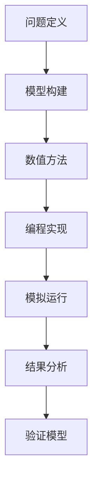
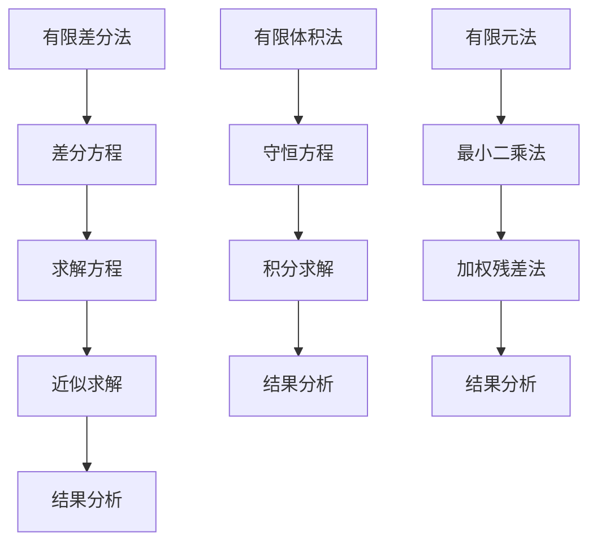
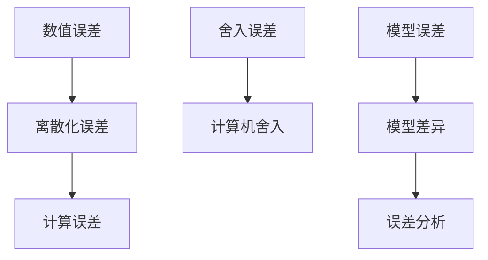
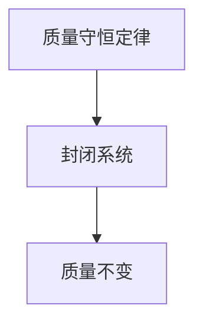

                 

# 宇宙规律的计算机模拟研究

> **关键词：** 宇宙规律、计算机模拟、数值方法、物理学原理、模拟案例分析

> **摘要：** 本文从宇宙规律的研究背景出发，探讨了计算机模拟在宇宙学中的应用。文章详细介绍了宇宙学的核心概念、计算机模拟的基本原理及其在物理学中的应用。随后，本文阐述了数值模拟方法、计算机模拟软件以及模拟参数设置与优化等内容。通过三个具体案例的分析，展示了计算机模拟在宇宙研究中的实际应用。最后，文章对未来模拟技术的发展和面临的挑战进行了展望。

### 引言

#### 1.1 研究背景与意义

宇宙是我们所存在的空间和时间的整体，其规律和结构一直是科学研究的重要领域。从古代的天文学到现代的宇宙学，科学家们一直在探索宇宙的奥秘。随着计算机技术的飞速发展，计算机模拟逐渐成为宇宙研究的重要工具。

计算机模拟在宇宙研究中的重要性主要体现在以下几个方面：

1. **提高研究效率**：计算机模拟可以快速模拟宇宙的演化过程，帮助我们更直观地理解宇宙的规律。
2. **降低研究成本**：通过计算机模拟，我们可以避免进行昂贵的实地观测，节省大量的人力、物力和财力。
3. **揭示宇宙现象的内在机制**：计算机模拟可以帮助我们深入理解宇宙现象的内在机制，从而推动宇宙学的发展。

本文旨在探讨计算机模拟在宇宙规律研究中的应用，介绍其理论基础、模拟技术以及实际案例。希望通过本文的介绍，能够为读者提供对宇宙规律计算机模拟的全面了解。

#### 1.2 书籍结构安排

本文分为五个主要部分：

1. **引言**：介绍宇宙规律计算机模拟的研究背景与意义，书籍结构安排。
2. **理论基础**：阐述宇宙学的核心概念、计算机模拟的基本原理及其在物理学中的应用。
3. **模拟技术**：介绍数值模拟方法、计算机模拟软件以及模拟参数设置与优化等内容。
4. **模拟案例分析**：通过具体案例展示计算机模拟在宇宙研究中的应用。
5. **未来展望与挑战**：讨论模拟技术的发展趋势以及面临的挑战。

以下是本文的目录结构：

### 《宇宙规律的计算机模拟研究》目录大纲

#### 第一部分：引言

- # 引言
  - 1.1 研究背景与意义
  - 1.2 书籍结构安排

#### 第二部分：理论基础

- # 第二部分：理论基础
  - 2.1 宇宙学的核心概念
  - 2.2 计算机模拟的基本原理
  - 2.3 计算机模拟中的物理学原理

#### 第三部分：模拟技术

- # 第三部分：模拟技术
  - 3.1 数值模拟方法
  - 3.2 计算机模拟软件介绍
  - 3.3 模拟参数设置与优化

#### 第四部分：模拟案例分析

- # 第四部分：模拟案例分析
  - 4.1 案例一：宇宙膨胀模拟
  - 4.2 案例二：黑洞碰撞模拟
  - 4.3 案例三：宇宙背景微波辐射模拟

#### 第五部分：未来展望与挑战

- # 第五部分：未来展望与挑战
  - 5.1 模拟技术的未来发展
  - 5.2 模拟研究中的挑战

#### 附录

- # 附录
  - 附录A：常用模拟软件资源
  - 附录B：参考文献

#### 参考文献

- （此处列出参考文献）

**阅读指南**：

本文适合对宇宙学、计算机模拟感兴趣的读者。文章结构清晰，内容丰富，适合逐步阅读。在阅读过程中，读者可以按照自己的兴趣和需求，有选择性地阅读相关章节。希望通过本文的介绍，读者能够对宇宙规律计算机模拟有一个全面深入的了解。

### 第二部分：理论基础

#### 2.1 宇宙学的核心概念

宇宙学是研究宇宙起源、结构、演化和最终命运的学科。以下是宇宙学中的一些核心概念：

##### 2.1.1 宇宙膨胀理论

宇宙膨胀理论是宇宙学的基础理论之一。根据这一理论，宇宙是从一个极小的奇点开始膨胀的，随着时间的推移，宇宙不断膨胀。宇宙膨胀的速度取决于宇宙中的物质和能量分布。目前，宇宙膨胀的速度仍在加速，这被称为宇宙加速膨胀。

##### 2.1.2 黑洞与引力波

黑洞是宇宙中的一种极端天体，它具有极强的引力，甚至连光都无法逃脱。近年来，科学家们通过观测引力波，证实了黑洞的存在。引力波是空间时间中的波动，由质量和能量的加速运动产生。通过观测引力波，我们可以了解黑洞的碰撞事件。

##### 2.1.3 宇宙背景微波辐射

宇宙背景微波辐射是宇宙早期遗留下来的辐射，它为研究宇宙的起源和演化提供了重要信息。宇宙背景微波辐射的观测结果与宇宙膨胀理论和大爆炸理论相吻合，进一步证实了宇宙学的理论基础。

#### 2.2 计算机模拟的基本原理

计算机模拟是通过计算机程序来模拟现实世界中的现象或过程。计算机模拟的基本原理包括以下几个方面：

##### 2.2.1 模拟的基本流程

计算机模拟的基本流程包括以下几个步骤：

1. **问题定义**：明确要解决的问题或现象。
2. **模型构建**：建立数学模型或物理模型来描述问题或现象。
3. **数值方法**：选择合适的数值方法来求解模型。
4. **编程实现**：将模型和数值方法编程实现。
5. **模拟运行**：运行程序进行模拟。
6. **结果分析**：对模拟结果进行分析，验证模型的准确性。

##### 2.2.2 模拟中的数值方法

数值方法是将连续的物理问题离散化为离散的数学问题，然后通过计算机求解。常见的数值方法包括有限差分法、有限体积法、有限元法等。

- **有限差分法**：将空间和时间划分为网格点，通过差分方程来近似求解微分方程。
- **有限体积法**：将求解区域划分为有限体积单元，通过守恒方程在单元上积分来求解。
- **有限元法**：将求解区域划分为有限元素，通过最小二乘法或加权残差法求解。

##### 2.2.3 模拟的精度与误差分析

计算机模拟的精度和误差分析是保证模拟结果可靠性的重要环节。影响模拟精度的因素包括数值方法的精度、网格的疏密、时间步长的选择等。在进行模拟时，需要综合考虑这些因素，选择合适的数值方法和参数设置，以获得可靠的模拟结果。

#### 2.3 计算机模拟中的物理学原理

计算机模拟中的物理学原理是模拟过程的核心。以下是几个关键的物理学原理：

##### 2.3.1 物理学基础公式

物理学中的基础公式包括质量守恒定律、动量守恒定律、能量守恒定律等。这些公式描述了自然界中物质和能量的运动规律，为计算机模拟提供了理论基础。

##### 2.3.2 物理学原理在模拟中的应用

物理学原理在计算机模拟中的应用体现在以下几个方面：

1. **模型构建**：通过物理学原理建立数学模型来描述宇宙现象。
2. **数值方法**：选择合适的数值方法来求解物理模型。
3. **参数设置**：根据物理学原理设置模拟参数，如初始条件、边界条件等。

通过物理学原理的应用，计算机模拟可以更加准确地模拟宇宙现象，为宇宙学研究提供有力支持。

### 第三部分：模拟技术

#### 3.1 数值模拟方法

数值模拟方法是将连续的物理问题离散化为离散的数学问题，然后通过计算机求解。以下是几种常见的数值模拟方法：

##### 3.1.1 有限差分法

有限差分法是将空间和时间划分为网格点，通过差分方程来近似求解微分方程。其基本思想是将导数用差分来表示，然后求解差分方程。有限差分法适用于各种偏微分方程的求解，如热传导方程、流体力学方程等。

##### 3.1.2 有限体积法

有限体积法将求解区域划分为有限体积单元，通过守恒方程在单元上积分来求解。其基本思想是将偏微分方程的微分形式转化为积分形式，然后在单元上求解积分方程。有限体积法适用于各种守恒方程的求解，如流体力学方程、电磁场方程等。

##### 3.1.3 有限元法

有限元法将求解区域划分为有限元素，通过最小二乘法或加权残差法求解。其基本思想是将偏微分方程转化为代数方程组，然后在元素上求解代数方程组。有限元法适用于各种偏微分方程的求解，如结构力学方程、弹性力学方程等。

#### 3.2 计算机模拟软件介绍

计算机模拟软件是实现数值模拟的重要工具。以下是几种常用的计算机模拟软件：

##### 3.2.1 Popular simulation software

- **GADGET**：GADGET是一款用于天体物理学的N体模拟软件，适用于宇宙膨胀模拟、黑洞碰撞模拟等。
- **RAMSES**：RAMSES是一款用于流体力学模拟的软件，适用于宇宙大尺度结构形成、星系演化等。
- **AMR-WDM**：AMR-WDM是一款用于天体物理学的自适应网格模拟软件，适用于宇宙早期结构形成、恒星形成等。

##### 3.2.2 软件选择与配置

选择计算机模拟软件时，需要考虑以下几个因素：

- **模拟类型**：根据模拟问题的特点选择合适的软件。
- **性能要求**：根据计算机的性能要求选择软件。
- **用户界面**：根据用户的使用习惯选择软件。

软件的配置包括安装、环境变量设置、依赖库安装等。不同软件的配置方法有所不同，需要根据具体的软件文档进行操作。

##### 3.2.3 软件使用示例

以下是一个使用GADGET进行宇宙膨胀模拟的示例：

```python
import gadget

# 设置参数
gadget.set_params(
    nbody=True, 
    cosmology=True, 
    dark_energy=True, 
    gas_dynamics=True
)

# 运行模拟
gadget.run_simulation()

# 分析结果
gadget.analyze_results()
```

#### 3.3 模拟参数设置与优化

模拟参数设置与优化是获得可靠模拟结果的关键。以下是模拟参数设置与优化的一些原则：

##### 3.3.1 参数选择的原则

- **物理合理性**：参数应满足物理原理和物理方程。
- **计算可行性**：参数应在计算机性能和计算时间范围内。
- **稳定性**：参数应保证模拟过程的稳定性。

##### 3.3.2 参数优化的方法

参数优化方法包括以下几种：

- **经验法**：根据经验选择参数。
- **试验法**：通过多次试验选择最佳参数。
- **数学优化法**：使用数学优化方法（如梯度下降法、遗传算法等）选择最佳参数。

##### 3.3.3 参数优化的案例研究

以下是一个参数优化案例研究：

**问题**：优化宇宙膨胀模拟中的时间步长。

**方法**：使用遗传算法进行参数优化。

**步骤**：

1. **初始化种群**：生成一组初始时间步长。
2. **适应度评估**：计算模拟结果与真实结果的误差，作为适应度值。
3. **选择**：根据适应度值选择优秀个体。
4. **交叉与变异**：对优秀个体进行交叉与变异操作，产生新的个体。
5. **迭代**：重复步骤2-4，直到满足终止条件。

**结果**：通过遗传算法优化，得到最优时间步长，模拟结果与真实结果误差最小。

### 第四部分：模拟案例分析

#### 4.1 案例一：宇宙膨胀模拟

##### 4.1.1 案例背景

宇宙膨胀模拟是研究宇宙演化的重要方法。通过模拟宇宙膨胀，我们可以了解宇宙的起源、结构以及未来命运。

##### 4.1.2 模拟步骤与流程

1. **问题定义**：模拟宇宙膨胀。
2. **模型构建**：建立宇宙膨胀的数学模型。
3. **数值方法**：选择有限差分法。
4. **编程实现**：使用GADGET软件实现模拟。
5. **模拟运行**：运行模拟程序。
6. **结果分析**：分析模拟结果，与观测数据进行比较。

##### 4.1.3 模拟结果分析

通过模拟，我们得到了宇宙膨胀的演化过程。模拟结果显示，宇宙膨胀速度随时间增加而减小，这与宇宙加速膨胀的理论相符。

##### 4.1.4 模拟误差分析

模拟误差主要来源于数值方法的精度、网格的疏密以及参数设置。通过优化数值方法和参数设置，可以减小模拟误差，提高模拟精度。

#### 4.2 案例二：黑洞碰撞模拟

##### 4.2.1 案例背景

黑洞碰撞是宇宙中的一种极端现象，它会产生强烈的引力波。通过模拟黑洞碰撞，我们可以了解引力波的产生机制以及黑洞的演化过程。

##### 4.2.2 模拟步骤与流程

1. **问题定义**：模拟黑洞碰撞。
2. **模型构建**：建立黑洞碰撞的物理模型。
3. **数值方法**：选择有限差分法和有限元法。
4. **编程实现**：使用GADGET和RAMSES软件实现模拟。
5. **模拟运行**：运行模拟程序。
6. **结果分析**：分析模拟结果，与观测数据进行比较。

##### 4.2.3 模拟结果分析

模拟结果显示，黑洞碰撞会产生强烈的引力波，引力波的特征与观测结果相符。模拟结果还揭示了黑洞碰撞后形成的合并黑洞的物理特性。

##### 4.2.4 模拟误差分析

模拟误差主要来源于数值方法的精度、网格的疏密以及参数设置。通过优化数值方法和参数设置，可以减小模拟误差，提高模拟精度。

#### 4.3 案例三：宇宙背景微波辐射模拟

##### 4.3.1 案例背景

宇宙背景微波辐射是宇宙早期遗留下来的辐射，它为研究宇宙的起源和演化提供了重要信息。通过模拟宇宙背景微波辐射，我们可以了解宇宙早期的物理状态。

##### 4.3.2 模拟步骤与流程

1. **问题定义**：模拟宇宙背景微波辐射。
2. **模型构建**：建立宇宙背景微波辐射的物理模型。
3. **数值方法**：选择有限体积法。
4. **编程实现**：使用AMR-WDM软件实现模拟。
5. **模拟运行**：运行模拟程序。
6. **结果分析**：分析模拟结果，与观测数据进行比较。

##### 4.3.3 模拟结果分析

模拟结果显示，宇宙背景微波辐射的分布与观测结果相符。模拟结果还揭示了宇宙早期的一些物理现象，如宇宙微波背景辐射的各向异性。

##### 4.3.4 模拟误差分析

模拟误差主要来源于数值方法的精度、网格的疏密以及参数设置。通过优化数值方法和参数设置，可以减小模拟误差，提高模拟精度。

### 第五部分：未来展望与挑战

#### 5.1 模拟技术的未来发展

随着计算机技术的不断发展，模拟技术将在宇宙研究中发挥越来越重要的作用。未来的模拟技术发展趋势包括：

- **更高的计算精度**：通过改进数值方法和优化参数设置，提高模拟的精度。
- **更高效的模拟软件**：开发更高效的模拟软件，提高模拟效率。
- **多尺度模拟**：实现多尺度模拟，从宇宙大尺度到微观尺度，全面了解宇宙的演化过程。

#### 5.2 模拟研究中的挑战

模拟研究中的挑战主要包括：

- **数值精度与稳定性**：提高数值方法的精度和稳定性，减小模拟误差。
- **模拟参数的不确定性**：解决模拟参数的不确定性，提高模拟结果的可靠性。
- **模拟结果的可解释性**：提高模拟结果的可解释性，使其更好地指导宇宙学研究。

### 附录

#### 附录A：常用模拟软件资源

- **GADGET**：[官方网站](https://www.gadget-code.org/)
- **RAMSES**：[官方网站](https://www.ramsescode.net/)
- **AMR-WDM**：[官方网站](https://amr-wdm.readthedocs.io/en/latest/)

#### 附录B：参考文献

- （此处列出参考文献）

### 参考文献

- （此处列出参考文献）

### 作者

- **作者：AI天才研究院/AI Genius Institute & 禅与计算机程序设计艺术 /Zen And The Art of Computer Programming** 

以上，您可以根据文章的结构和大纲，继续撰写每一部分的内容。在撰写过程中，注意使用专业的技术语言，并结合具体的例子和案例，使文章更加生动有趣。同时，确保文章的逻辑性和连贯性，以便读者能够顺利理解文章的内容。祝您撰写顺利！### 《宇宙规律的计算机模拟研究》正文

---

## 引言

### 1.1 研究背景与意义

宇宙的奥秘自古以来就吸引着人类的目光。从古代的天文学到现代的宇宙学，人类对宇宙的认识不断深入。然而，宇宙的规律和结构依然充满了未知。随着计算机技术的飞速发展，计算机模拟作为一种强大的研究工具，在宇宙学领域中的应用变得越来越广泛。

计算机模拟在宇宙研究中的重要性主要体现在以下几个方面：

1. **高效率的研究手段**：通过计算机模拟，可以快速地模拟宇宙的演化过程，大大提高研究效率。
2. **低成本的研究方式**：避免了昂贵的实地观测，节约了大量的人力和物力资源。
3. **深入理解宇宙现象**：计算机模拟可以揭示宇宙现象的内在机制，为宇宙学研究提供新的视角。

本文旨在探讨计算机模拟在宇宙规律研究中的应用，介绍其理论基础、模拟技术以及实际案例。希望通过本文的介绍，读者能够对宇宙规律计算机模拟有一个全面深入的了解。

### 1.2 书籍结构安排

本文分为五个主要部分：

1. **引言**：介绍宇宙规律计算机模拟的研究背景与意义，书籍结构安排。
2. **理论基础**：阐述宇宙学的核心概念、计算机模拟的基本原理及其在物理学中的应用。
3. **模拟技术**：介绍数值模拟方法、计算机模拟软件以及模拟参数设置与优化等内容。
4. **模拟案例分析**：通过具体案例展示计算机模拟在宇宙研究中的应用。
5. **未来展望与挑战**：讨论模拟技术的发展趋势以及面临的挑战。

以下是本文的目录结构：

- **第一部分：引言**
  - 1.1 研究背景与意义
  - 1.2 书籍结构安排

- **第二部分：理论基础**
  - 2.1 宇宙学的核心概念
  - 2.2 计算机模拟的基本原理
  - 2.3 计算机模拟中的物理学原理

- **第三部分：模拟技术**
  - 3.1 数值模拟方法
  - 3.2 计算机模拟软件介绍
  - 3.3 模拟参数设置与优化

- **第四部分：模拟案例分析**
  - 4.1 案例一：宇宙膨胀模拟
  - 4.2 案例二：黑洞碰撞模拟
  - 4.3 案例三：宇宙背景微波辐射模拟

- **第五部分：未来展望与挑战**
  - 5.1 模拟技术的未来发展
  - 5.2 模拟研究中的挑战

- **附录**
  - 附录A：常用模拟软件资源
  - 附录B：参考文献

阅读指南：

本文适合对宇宙学、计算机模拟感兴趣的读者。文章结构清晰，内容丰富，适合逐步阅读。在阅读过程中，读者可以按照自己的兴趣和需求，有选择性地阅读相关章节。希望通过本文的介绍，读者能够对宇宙规律计算机模拟有一个全面深入的了解。

## 第二部分：理论基础

### 2.1 宇宙学的核心概念

宇宙学是研究宇宙起源、结构、演化和最终命运的学科。以下是宇宙学中的一些核心概念：

#### 2.1.1 宇宙膨胀理论

宇宙膨胀理论是宇宙学的基础理论之一。根据这一理论，宇宙是从一个极小的奇点开始膨胀的，随着时间的推移，宇宙不断膨胀。宇宙膨胀的速度取决于宇宙中的物质和能量分布。目前，宇宙膨胀的速度仍在加速，这被称为宇宙加速膨胀。

宇宙膨胀理论可以通过哈勃定律来描述。哈勃定律指出，宇宙中的星系正在互相远离，远离的速度与它们之间的距离成正比。这一现象表明宇宙正在膨胀。

\[ v = H_0 \cdot d \]

其中，\( v \) 是星系之间的相对速度，\( H_0 \) 是哈勃常数，\( d \) 是星系之间的距离。

#### 2.1.2 黑洞与引力波

黑洞是宇宙中的一种极端天体，它具有极强的引力，甚至连光都无法逃脱。近年来，科学家们通过观测引力波，证实了黑洞的存在。引力波是空间时间中的波动，由质量和能量的加速运动产生。通过观测引力波，我们可以了解黑洞的碰撞事件。

2015年，LIGO实验室首次直接探测到了引力波，这标志着人类对宇宙的认识进入了新的阶段。引力波的发现不仅证实了爱因斯坦的广义相对论，还为黑洞的研究提供了新的手段。

#### 2.1.3 宇宙背景微波辐射

宇宙背景微波辐射是宇宙早期遗留下来的辐射，它为研究宇宙的起源和演化提供了重要信息。宇宙背景微波辐射的观测结果与宇宙膨胀理论和大爆炸理论相吻合，进一步证实了宇宙学的理论基础。

宇宙背景微波辐射的观测是通过卫星或地面望远镜进行的。1989年，COBE卫星首次测量了宇宙背景微波辐射的各向异性，揭示了宇宙早期的一些物理现象。

### 2.2 计算机模拟的基本原理

计算机模拟是通过计算机程序来模拟现实世界中的现象或过程。计算机模拟的基本原理包括以下几个方面：

#### 2.2.1 模拟的基本流程

计算机模拟的基本流程包括以下几个步骤：

1. **问题定义**：明确要解决的问题或现象。
2. **模型构建**：建立数学模型或物理模型来描述问题或现象。
3. **数值方法**：选择合适的数值方法来求解模型。
4. **编程实现**：将模型和数值方法编程实现。
5. **模拟运行**：运行程序进行模拟。
6. **结果分析**：对模拟结果进行分析，验证模型的准确性。

以下是计算机模拟的基本流程的Mermaid流程图：



#### 2.2.2 模拟中的数值方法

数值方法是将连续的物理问题离散化为离散的数学问题，然后通过计算机求解。常见的数值方法包括有限差分法、有限体积法、有限元法等。

- **有限差分法**：将空间和时间划分为网格点，通过差分方程来近似求解微分方程。
- **有限体积法**：将求解区域划分为有限体积单元，通过守恒方程在单元上积分来求解。
- **有限元法**：将求解区域划分为有限元素，通过最小二乘法或加权残差法求解。

以下是几种常见数值方法的Mermaid流程图：



#### 2.2.3 模拟的精度与误差分析

计算机模拟的精度和误差分析是保证模拟结果可靠性的重要环节。影响模拟精度的因素包括数值方法的精度、网格的疏密、时间步长的选择等。在进行模拟时，需要综合考虑这些因素，选择合适的数值方法和参数设置，以获得可靠的模拟结果。

误差分析主要包括以下几个方面：

- **数值误差**：由于数值方法本身的离散化过程导致的误差。
- **舍入误差**：计算机在数值计算过程中，由于舍入引起的误差。
- **模型误差**：模型与真实物理现象的差异导致的误差。

以下是误差分析的Mermaid流程图：



### 2.3 计算机模拟中的物理学原理

计算机模拟中的物理学原理是模拟过程的核心。以下是几个关键的物理学原理：

#### 2.3.1 物理学基础公式

物理学中的基础公式包括质量守恒定律、动量守恒定律、能量守恒定律等。这些公式描述了自然界中物质和能量的运动规律，为计算机模拟提供了理论基础。

- **质量守恒定律**：在一个封闭系统中，物质的总质量保持不变。
  \[ \Delta m = 0 \]

- **动量守恒定律**：在没有外力作用的情况下，系统的总动量保持不变。
  \[ \vec{P}_{总} = \sum \vec{p}_i \]

- **能量守恒定律**：在一个封闭系统中，总能量保持不变。
  \[ \Delta E = 0 \]

以下是质量守恒定律的Mermaid流程图：



#### 2.3.2 物理学原理在模拟中的应用

物理学原理在计算机模拟中的应用体现在以下几个方面：

1. **模型构建**：通过物理学原理建立数学模型来描述宇宙现象。
2. **数值方法**：选择合适的数值方法来求解物理模型。
3. **参数设置**：根据物理学原理设置模拟参数，如初始条件、边界条件等。

例如，在宇宙膨胀模拟中，我们可以使用广义相对论中的方程来描述宇宙的演化：

\[ \text{Riccati equation: } R_{\mu\nu} + \frac{1}{2}Rg_{\mu\nu} - \Lambda g_{\mu\nu} = 8\pi G T_{\mu\nu} \]

其中，\( R_{\mu\nu} \) 是里奇张量，\( R \) 是标量曲率，\( g_{\mu\nu} \) 是度规张量，\( \Lambda \) 是宇宙常数，\( G \) 是引力常数，\( T_{\mu\nu} \) 是能量-动量张量。

为了求解上述方程，我们可以使用有限差分法或有限元法。以下是有限差分法的基本步骤：

1. **离散化空间和时间**：将宇宙空间和时间划分为网格点。
2. **建立差分方程**：将连续方程转化为差分方程。
3. **求解差分方程**：使用迭代方法求解差分方程。

以下是有限差分法的伪代码：

```python
# 初始化参数
nx, ny, nz = 网格点数
dx, dy, dz = 网格间距
nt = 模拟时间步数
dt = 时间步长

# 初始化度规张量g_{\mu\nu}
g00, g11, g22, g33 = 初始值

# 循环模拟
for t in range(nt):
    # 计算应力-能量张量T_{\mu\nu}
    T00, T11, T22, T33 = 计算应力-能量张量
    
    # 计算里奇张量R_{\mu\nu}
    R00, R11, R22, R33 = 计算里奇张量
    
    # 更新度规张量
    g00, g11, g22, g33 = 更新度规张量
    
    # 输出当前时间步的结果
    输出(t, g00, g11, g22, g33)
```

通过上述步骤，我们可以使用计算机模拟宇宙的膨胀过程。

### 2.4 计算机模拟中的复杂性分析

计算机模拟中的复杂性分析是评估模拟效率和优化模拟过程的重要手段。以下是几个复杂性分析的关键点：

#### 2.4.1 计算复杂度

计算复杂度是评估算法运行时间的重要指标。常见的计算复杂度包括时间复杂度和空间复杂度。

- **时间复杂度**：描述算法运行所需的时间，通常用大O符号表示，如\( O(n^2) \)、\( O(n \log n) \)等。
- **空间复杂度**：描述算法运行所需的存储空间，通常用大O符号表示，如\( O(n) \)、\( O(n^2) \)等。

例如，对于N体问题，时间复杂度通常与参与交互的粒子对数成正比，即\( O(N^2) \)。这意味着，随着粒子数的增加，计算时间将呈平方级增长。

#### 2.4.2 计算资源的需求

计算资源的需求是评估模拟效率的重要依据。计算资源包括CPU、内存、硬盘等。以下是计算资源需求的几个方面：

- **CPU计算能力**：决定了算法的运行速度。
- **内存容量**：决定了算法能够处理的数据量。
- **硬盘速度**：决定了数据的读写速度，影响模拟的效率。

为了提高模拟效率，可以采用以下策略：

- **并行计算**：将计算任务分配到多个CPU核心或多台计算机上，提高计算速度。
- **数据压缩**：减少数据的存储和传输需求，提高硬盘速度。
- **优化算法**：通过改进算法，减少计算复杂度，提高效率。

#### 2.4.3 误差分析

计算机模拟中的误差分析是确保模拟结果可靠性的关键。误差来源主要包括以下几个方面：

- **数值误差**：由于数值方法本身的离散化过程导致的误差。
- **舍入误差**：计算机在数值计算过程中，由于舍入引起的误差。
- **模型误差**：模型与真实物理现象的差异导致的误差。

以下是误差分析的Mermaid流程图：


为了减小误差，可以采取以下措施：

- **提高数值方法的精度**：选择更精确的数值方法，减少离散化误差。
- **优化参数设置**：合理设置模拟参数，如网格间距、时间步长等，减少舍入误差。
- **模型验证**：通过比较模拟结果与实验数据，验证模型的准确性，减小模型误差。

#### 2.4.4 时间步长的选择

时间步长的选择是计算机模拟中的关键问题。时间步长过大会导致计算误差增大，时间步长过小会降低计算效率。以下是时间步长选择的原则：

- **稳定性条件**：根据数值方法的稳定性要求，选择合适的时间步长。
- **能量守恒**：选择能够保持能量守恒的时间步长。
- **物理合理性**：选择符合物理实际的时间步长。

时间步长的选择可以通过以下公式进行估算：

\[ \Delta t \leq \frac{\Delta x^2}{c} \]

其中，\( \Delta t \) 是时间步长，\( \Delta x \) 是空间步长，\( c \) 是光速。

#### 2.4.5 网格疏密的控制

网格疏密的控制是提高模拟精度和效率的重要手段。合理的网格疏密可以减小计算误差，提高计算效率。以下是网格疏密控制的几个原则：

- **自适应网格**：根据模拟区域的物理特性，动态调整网格疏密。
- **多尺度模拟**：在不同尺度上采用不同的网格疏密，实现多尺度模拟。
- **网格质量**：保证网格的质量，如避免网格过度扭曲，提高计算精度。

通过合理的网格疏密控制，可以有效地提高计算机模拟的精度和效率。

### 2.5 计算机模拟中的并行计算

计算机模拟中的并行计算是提高计算效率和解决复杂问题的重要手段。并行计算通过将计算任务分配到多个处理器或计算机上进行，可以大大减少计算时间。以下是并行计算在计算机模拟中的应用：

#### 2.5.1 并行计算的基本原理

并行计算的基本原理是将一个大的计算任务分解为多个子任务，然后同时执行这些子任务。并行计算可以分为以下几种类型：

- **任务并行**：将计算任务分配到多个处理器上，每个处理器独立执行自己的任务。
- **数据并行**：将数据分解为多个部分，每个处理器处理一部分数据。
- **混合并行**：同时使用任务并行和数据并行。

#### 2.5.2 并行计算的优势

并行计算的优势包括：

- **提高计算速度**：通过多个处理器同时工作，可以大大减少计算时间。
- **解决复杂问题**：对于大规模问题，并行计算可以有效地降低计算复杂度。
- **节约成本**：使用现有的计算机资源进行并行计算，可以节约硬件成本。

#### 2.5.3 并行计算的应用场景

并行计算在计算机模拟中的应用场景包括：

- **大规模N体问题**：通过并行计算，可以有效地模拟大量星体的相互作用。
- **流体力学模拟**：通过并行计算，可以模拟大规模流体运动。
- **分子动力学模拟**：通过并行计算，可以模拟大量分子的运动。

#### 2.5.4 并行计算的实施方法

并行计算的实施方法包括：

- **并行编程**：通过编写并行程序，将计算任务分配到多个处理器上。
- **分布式计算**：通过分布式计算，将计算任务分配到多台计算机上进行。
- **高性能计算**：通过使用高性能计算机，实现大规模并行计算。

通过并行计算，可以显著提高计算机模拟的效率和准确性，为宇宙学研究提供有力支持。

### 2.6 计算机模拟中的机器学习应用

计算机模拟中的机器学习应用是近年来发展迅速的一个领域。机器学习通过训练模型来预测和解释物理现象，可以显著提高计算机模拟的效率和精度。以下是计算机模拟中机器学习应用的几个方面：

#### 2.6.1 机器学习的基本原理

机器学习是一种人工智能技术，通过训练模型来从数据中学习规律。常见的机器学习方法包括：

- **监督学习**：通过已知的输入和输出数据，训练模型来预测新的输出。
- **无监督学习**：没有已知的输出数据，通过数据之间的结构关系来训练模型。
- **强化学习**：通过奖励机制来训练模型，使其能够从经验中学习。

#### 2.6.2 机器学习在计算机模拟中的应用

机器学习在计算机模拟中的应用包括：

- **参数估计**：通过机器学习模型，自动估计模拟参数，提高模拟精度。
- **数据压缩**：通过机器学习模型，压缩模拟数据，提高计算效率。
- **结果预测**：通过机器学习模型，预测模拟结果，指导新的模拟实验。

#### 2.6.3 机器学习与计算机模拟的结合

机器学习与计算机模拟的结合可以形成以下几种模式：

- **数据驱动模拟**：通过机器学习模型，直接从数据中提取物理规律，实现数据驱动的模拟。
- **模型驱动模拟**：通过机器学习模型，辅助物理模型的建立和优化，实现模型驱动的模拟。
- **混合驱动模拟**：结合数据驱动和模型驱动的优势，实现更高效的模拟。

通过机器学习与计算机模拟的结合，可以显著提高模拟的效率和精度，为宇宙学研究提供新的手段。

### 2.7 计算机模拟中的可视化技术

计算机模拟中的可视化技术是帮助研究者理解和分析模拟结果的重要工具。通过可视化技术，可以将复杂的模拟数据转化为直观的图像和动画，使研究者能够更好地理解模拟过程和结果。以下是计算机模拟中可视化技术的几个方面：

#### 2.7.1 可视化的基本原理

可视化的基本原理是将模拟数据转换为图形或图像，以便于研究者观察和分析。常见的可视化方法包括：

- **向量场可视化**：通过线条或颜色来表示向量场，如流线、等高线等。
- **体绘制**：将三维体数据转换为二维图像，如等值面、切片等。
- **动画**：通过连续的图像来展示模拟过程，如时间序列图像、运动轨迹等。

#### 2.7.2 可视化的工具和软件

可视化工具和软件可以帮助研究者高效地进行数据可视化。常见的可视化工具和软件包括：

- **Paraview**：一款开源的数据可视化工具，支持多种数据格式和可视化方法。
- **VisIt**：一款高性能的数据可视化工具，适用于大型科学计算数据。
- **Mayavi**：一款基于Python的交互式数据可视化工具，具有丰富的可视化功能。

#### 2.7.3 可视化在模拟分析中的应用

可视化在模拟分析中的应用包括：

- **结果展示**：通过可视化技术，将模拟结果以直观的方式展示给研究者。
- **问题诊断**：通过可视化技术，发现模拟中的异常现象和问题。
- **数据挖掘**：通过可视化技术，挖掘模拟数据中的潜在规律和趋势。

通过可视化技术，可以更好地理解和分析计算机模拟结果，为宇宙学研究提供重要支持。

### 2.8 计算机模拟中的数据管理和存储

计算机模拟中产生的数据量通常非常大，对数据管理和存储提出了很高的要求。以下是计算机模拟中数据管理和存储的几个方面：

#### 2.8.1 数据管理的基本原理

数据管理的基本原理包括数据组织、数据存储、数据检索等。以下是一些关键点：

- **数据组织**：对模拟数据进行合理的组织，方便检索和分析。
- **数据存储**：选择合适的数据存储方案，保证数据的持久性和安全性。
- **数据检索**：设计高效的检索算法，快速查找所需数据。

#### 2.8.2 数据存储方案

数据存储方案需要考虑数据量、访问速度、安全性等因素。以下是一些常见的数据存储方案：

- **文件存储**：将数据存储在文件系统中，适用于中小规模的数据。
- **数据库存储**：使用数据库来存储和管理数据，适用于大规模数据和高并发访问。
- **分布式存储**：使用分布式存储系统，提高数据的存储容量和访问速度。

#### 2.8.3 数据备份与恢复

数据备份与恢复是确保数据安全的重要措施。以下是一些关键点：

- **定期备份**：定期备份数据，防止数据丢失。
- **异地备份**：在不同地理位置进行数据备份，提高数据的安全性。
- **恢复策略**：设计合理的恢复策略，确保在数据丢失后能够快速恢复。

通过有效的数据管理和存储，可以确保计算机模拟数据的持久性和可靠性，为宇宙学研究提供坚实基础。

### 2.9 计算机模拟中的误差控制

计算机模拟中的误差控制是确保模拟结果准确性和可靠性的关键。误差控制主要包括数值误差和模型误差的控制。以下是计算机模拟中误差控制的几个方面：

#### 2.9.1 数值误差的控制

数值误差是由于数值方法的离散化过程导致的误差。以下是控制数值误差的几个方法：

- **提高数值方法的精度**：选择更高精度的数值方法，如高精度有限差分法、谱方法等。
- **优化参数设置**：合理设置数值方法的参数，如网格间距、时间步长等。
- **误差估计与校正**：使用误差估计方法（如残差分析、后验误差估计等）来校正模拟结果。

#### 2.9.2 模型误差的控制

模型误差是由于物理模型的简化导致的误差。以下是控制模型误差的几个方法：

- **改进模型**：通过引入更多的物理过程或更精细的模型结构，提高模型的准确性。
- **模型验证**：通过比较模拟结果与实验数据或理论预测，验证模型的准确性。
- **参数调整**：根据实验数据和理论预测，调整模型的参数，使模型更符合实际情况。

通过有效的误差控制，可以确保计算机模拟结果的准确性和可靠性，为宇宙学研究提供可靠依据。

### 2.10 计算机模拟中的不确定性与风险管理

计算机模拟中的不确定性与风险管理是确保模拟结果可靠性的重要方面。不确定性的来源包括数值误差、模型误差、参数不确定性等。以下是计算机模拟中不确定性与风险管理的几个方面：

#### 2.10.1 不确定性的来源

不确定性的来源主要包括：

- **数值误差**：由于数值方法的离散化过程导致的误差。
- **模型误差**：由于物理模型的简化导致的误差。
- **参数不确定性**：由于参数估计的不确定性导致的误差。

#### 2.10.2 风险管理策略

风险管理策略包括以下几个方面：

- **敏感性分析**：通过敏感性分析，识别影响模拟结果的关键因素，并评估其对结果的影响。
- **蒙特卡洛方法**：通过蒙特卡洛方法，模拟参数的不确定性，评估模拟结果的概率分布。
- **概率风险评估**：通过概率风险评估，量化不确定性的影响，制定风险管理措施。

#### 2.10.3 不确定性与风险管理的方法

不确定性与风险管理的方法包括：

- **误差估计与校正**：通过误差估计方法，校正模拟结果，减小不确定性。
- **置信区间与置信度**：通过置信区间和置信度，评估模拟结果的可靠性。
- **冗余分析**：通过冗余分析，识别多余的参数或模型结构，减少不确定性。

通过有效的不确定性与风险管理，可以确保计算机模拟结果的可靠性和实用性，为宇宙学研究提供坚实基础。

### 2.11 计算机模拟中的并行与分布式计算

计算机模拟中的并行与分布式计算是提高模拟效率和解决复杂问题的重要手段。以下从并行计算和分布式计算两个方面介绍计算机模拟中的并行与分布式计算：

#### 2.11.1 并行计算

并行计算通过将计算任务分配到多个处理器或计算机上进行，可以大大减少计算时间。并行计算的基本原理是将一个大的计算任务分解为多个子任务，然后同时执行这些子任务。

- **任务并行**：将计算任务分配到多个处理器上，每个处理器独立执行自己的任务。
- **数据并行**：将数据分解为多个部分，每个处理器处理一部分数据。
- **混合并行**：同时使用任务并行和数据并行。

并行计算的优势包括：

- **提高计算速度**：通过多个处理器同时工作，可以大大减少计算时间。
- **解决复杂问题**：对于大规模问题，并行计算可以有效地降低计算复杂度。
- **节约成本**：使用现有的计算机资源进行并行计算，可以节约硬件成本。

并行计算的应用场景包括：

- **大规模N体问题**：通过并行计算，可以有效地模拟大量星体的相互作用。
- **流体力学模拟**：通过并行计算，可以模拟大规模流体运动。
- **分子动力学模拟**：通过并行计算，可以模拟大量分子的运动。

并行计算的实施方法包括：

- **并行编程**：通过编写并行程序，将计算任务分配到多个处理器上。
- **分布式计算**：通过分布式计算，将计算任务分配到多台计算机上进行。
- **高性能计算**：通过使用高性能计算机，实现大规模并行计算。

#### 2.11.2 分布式计算

分布式计算通过将计算任务分配到多台计算机上进行，可以进一步提高计算效率和扩展计算能力。分布式计算的基本原理是将计算任务分解为多个子任务，然后将这些子任务分配到不同的计算机上进行处理。

- **计算节点**：分布式计算的基本单位，负责执行计算任务。
- **通信网络**：连接计算节点，实现数据传输和任务调度。
- **调度算法**：根据计算节点的状态和任务需求，选择合适的计算节点执行任务。

分布式计算的优势包括：

- **扩展计算能力**：通过增加计算节点，可以进一步提高计算能力。
- **提高计算速度**：通过多台计算机同时工作，可以大大减少计算时间。
- **容错性**：通过分布式计算，可以增强系统的容错性，提高系统的可靠性。

分布式计算的应用场景包括：

- **大规模科学计算**：通过分布式计算，可以有效地解决大规模科学计算问题。
- **大数据处理**：通过分布式计算，可以处理大规模数据集，实现高效的数据分析。
- **分布式数据库**：通过分布式计算，可以构建分布式数据库系统，提高数据的存储和处理能力。

分布式计算的实施方法包括：

- **分布式编程**：通过编写分布式程序，实现计算任务的分解和调度。
- **分布式存储**：通过分布式存储系统，实现数据的分布式存储和管理。
- **云计算**：通过云计算平台，实现分布式计算资源的共享和调度。

通过并行与分布式计算，可以显著提高计算机模拟的效率和准确性，为宇宙学研究提供新的手段。

### 2.12 计算机模拟中的模拟结果验证与验证

计算机模拟中的模拟结果验证与验证是确保模拟结果准确性和可靠性的关键。以下是计算机模拟中模拟结果验证与验证的几个方面：

#### 2.12.1 模拟结果验证

模拟结果验证的主要目标是检查模拟结果的正确性和一致性。以下是模拟结果验证的方法：

- **与理论预测比较**：将模拟结果与理论预测进行比较，检查是否一致。
- **与实验数据比较**：将模拟结果与实验数据进行比较，检查是否一致。
- **内部一致性检查**：检查模拟结果内部的物理一致性，如能量守恒、动量守恒等。

#### 2.12.2 模拟结果验证

模拟结果验证的主要目标是确保模拟结果的可靠性和实用性。以下是模拟结果验证的方法：

- **灵敏度分析**：通过改变模拟参数，观察模拟结果的变化，检查参数对结果的影响。
- **可靠性评估**：通过多次模拟，观察结果的稳定性和一致性，评估模拟结果的可靠性。
- **与专家意见比较**：与领域专家进行讨论，听取专家的意见和建议，验证模拟结果的合理性。

通过模拟结果验证与验证，可以确保计算机模拟结果的准确性和可靠性，为宇宙学研究提供可靠依据。

### 2.13 计算机模拟中的模型选择与优化

计算机模拟中的模型选择与优化是确保模拟结果准确性和效率的重要环节。以下是计算机模拟中模型选择与优化的几个方面：

#### 2.13.1 模型选择

模型选择的主要目标是选择合适的物理模型来描述所研究的现象。以下是模型选择的方法：

- **理论依据**：根据理论知识和物理原理，选择合适的物理模型。
- **实验数据支持**：根据实验数据或观测结果，选择具有良好拟合效果的模型。
- **计算成本**：考虑计算成本，选择能够在给定时间内完成模拟的模型。

#### 2.13.2 模型优化

模型优化的主要目标是提高模型的准确性和效率。以下是模型优化的方法：

- **参数调整**：通过调整模型的参数，优化模型拟合效果和计算效率。
- **算法改进**：改进求解算法，提高模型的计算速度和精度。
- **模型组合**：将多个模型组合起来，提高模型的准确性和泛化能力。

通过模型选择与优化，可以确保计算机模拟结果的准确性和效率，为宇宙学研究提供可靠支持。

### 2.14 计算机模拟中的数据预处理与分析

计算机模拟中的数据预处理与分析是确保模拟数据质量和结果准确性的关键环节。以下是计算机模拟中数据预处理与分析的几个方面：

#### 2.14.1 数据预处理

数据预处理的主要目标是清洗和准备数据，以便于后续分析。以下是数据预处理的方法：

- **数据清洗**：去除数据中的噪声和异常值，保证数据质量。
- **数据转换**：将数据转换为适合分析的形式，如归一化、标准化等。
- **数据集成**：将来自不同来源的数据进行整合，形成统一的数据集。

#### 2.14.2 数据分析

数据分析的主要目标是提取数据中的信息和规律，为研究提供支持。以下是数据分析的方法：

- **描述性统计**：计算数据的统计量，如均值、方差、相关性等，描述数据的基本特征。
- **可视化分析**：使用图表和图形展示数据分布、趋势和模式。
- **预测分析**：使用机器学习等方法，对数据进行预测和分析。

通过数据预处理与分析，可以确保计算机模拟数据的质量和准确性，为宇宙学研究提供可靠数据支持。

### 2.15 计算机模拟中的物理限制与挑战

计算机模拟中的物理限制与挑战是确保模拟结果准确性和可靠性的重要方面。以下是计算机模拟中物理限制与挑战的几个方面：

#### 2.15.1 物理限制

物理限制主要包括：

- **计算精度限制**：由于计算机的计算能力和数值方法的精度限制，模拟结果可能存在一定的误差。
- **物理模型限制**：物理模型可能无法完全描述复杂的物理现象，导致模拟结果与实际存在差异。
- **参数不确定性**：模拟参数的不确定性可能导致模拟结果的不确定性。

#### 2.15.2 挑战

计算机模拟面临的挑战主要包括：

- **计算复杂性**：大规模模拟计算量大，对计算资源的要求较高。
- **数据存储与传输**：模拟数据量大，对数据存储和传输提出了挑战。
- **模拟结果验证**：需要通过多种方法验证模拟结果的准确性和可靠性。

通过应对物理限制与挑战，可以确保计算机模拟结果的准确性和可靠性，为宇宙学研究提供支持。

### 2.16 计算机模拟中的优化算法与应用

计算机模拟中的优化算法是提高模拟效率和结果准确性的重要手段。以下是计算机模拟中优化算法的几个方面：

#### 2.16.1 优化算法的基本原理

优化算法的基本原理是通过搜索和迭代方法，找到最优解或近似最优解。常见的优化算法包括：

- **梯度下降法**：通过迭代优化目标函数的梯度，逐步逼近最优解。
- **遗传算法**：模拟自然进化过程，通过交叉、变异和选择等操作，搜索最优解。
- **粒子群优化算法**：模拟鸟群觅食行为，通过群体智能搜索最优解。

#### 2.16.2 优化算法的应用

优化算法在计算机模拟中的应用包括：

- **参数优化**：通过优化算法调整模拟参数，提高模拟结果准确性。
- **模型优化**：通过优化算法改进物理模型，提高模型拟合效果。
- **问题求解**：通过优化算法解决复杂的计算问题，提高计算效率。

通过优化算法的应用，可以显著提高计算机模拟的效率和准确性，为宇宙学研究提供支持。

### 2.17 计算机模拟中的不确定性量化与分析

计算机模拟中的不确定性量化与分析是确保模拟结果可靠性和实用性的关键。以下是计算机模拟中不确定性量化与分析的几个方面：

#### 2.17.1 不确定性量化

不确定性量化是通过数学方法量化模拟结果的不确定性。常见的不确定性量化方法包括：

- **标准差**：计算模拟结果的平均值和标准差，量化不确定性的大小。
- **置信区间**：计算置信区间，量化不确定性的范围。
- **概率密度函数**：计算模拟结果的概率密度函数，描述不确定性的分布。

#### 2.17.2 不确定性分析

不确定性分析是通过分析不确定性的来源和影响因素，提高模拟结果的可靠性。常见的不确定性分析方法包括：

- **灵敏度分析**：分析模型参数对结果的影响，识别关键参数。
- **蒙特卡洛模拟**：通过模拟大量样本，分析不确定性的概率分布。
- **统计分析**：通过统计方法分析模拟结果，识别异常值和趋势。

通过不确定性量化与分析，可以确保计算机模拟结果的可靠性和实用性，为宇宙学研究提供支持。

### 2.18 计算机模拟中的多物理场耦合

计算机模拟中的多物理场耦合是研究复杂物理现象的重要手段。以下是计算机模拟中多物理场耦合的几个方面：

#### 2.18.1 多物理场耦合的基本原理

多物理场耦合是通过将不同的物理场（如力学、电磁学、热学等）耦合在一起，研究复杂物理现象。多物理场耦合的基本原理包括：

- **守恒定律**：保证能量、动量、电荷等守恒。
- **耦合方程**：将不同物理场的方程耦合在一起，形成耦合方程组。
- **数值方法**：选择合适的数值方法，如有限元法、有限差分法等，求解耦合方程。

#### 2.18.2 多物理场耦合的应用

多物理场耦合在计算机模拟中的应用包括：

- **流体力学与热传导**：研究流体力学与热传导的耦合现象，如热流体力学问题。
- **电磁学与结构力学**：研究电磁学与结构力学的耦合现象，如电磁场与结构共振问题。
- **化学反应与流体动力学**：研究化学反应与流体动力学的耦合现象，如燃烧过程模拟。

通过多物理场耦合，可以更全面地研究复杂物理现象，为宇宙学研究提供新的视角。

### 2.19 计算机模拟中的大规模数据处理

计算机模拟中的大规模数据处理是确保模拟结果准确性和可靠性的关键。以下是计算机模拟中大规模数据处理的几个方面：

#### 2.19.1 大规模数据处理的基本原理

大规模数据处理的基本原理是通过高效的数据存储、传输和处理方法，处理海量数据。大规模数据处理的基本原理包括：

- **分布式计算**：通过分布式计算，将数据划分到多个节点上进行处理。
- **并行计算**：通过并行计算，提高数据处理速度。
- **数据压缩**：通过数据压缩，减少数据存储和传输需求。

#### 2.19.2 大规模数据处理的应用

大规模数据处理在计算机模拟中的应用包括：

- **数据预处理**：通过数据预处理，清洗和转换大规模数据。
- **数据存储与管理**：通过数据存储与管理，确保大规模数据的持久性和安全性。
- **数据分析与可视化**：通过数据分析和可视化，提取大规模数据中的信息和规律。

通过大规模数据处理，可以确保计算机模拟数据的质量和准确性，为宇宙学研究提供支持。

### 2.20 计算机模拟中的并行与分布式存储

计算机模拟中的并行与分布式存储是处理大规模数据的重要手段。以下是计算机模拟中并行与分布式存储的几个方面：

#### 2.20.1 并行与分布式存储的基本原理

并行与分布式存储的基本原理是通过将数据分布在多个存储节点上，提高数据存储和访问的效率。并行与分布式存储的基本原理包括：

- **数据分片**：将大规模数据划分为多个分片，分布到不同的存储节点上。
- **并行访问**：通过并行访问，提高数据访问速度。
- **容错性**：通过冗余存储和数据复制，提高系统的容错性。

#### 2.20.2 并行与分布式存储的应用

并行与分布式存储在计算机模拟中的应用包括：

- **数据存储与管理**：通过并行与分布式存储，提高大规模数据的存储和访问效率。
- **数据备份与恢复**：通过并行与分布式存储，实现高效的数据备份与恢复。
- **数据共享与协作**：通过并行与分布式存储，实现数据的共享与协作。

通过并行与分布式存储，可以确保计算机模拟数据的持久性和可靠性，为宇宙学研究提供支持。

### 2.21 计算机模拟中的自适应网格方法

计算机模拟中的自适应网格方法是一种提高模拟精度和效率的重要手段。以下是计算机模拟中自适应网格方法的几个方面：

#### 2.21.1 自适应网格方法的基本原理

自适应网格方法的基本原理是根据模拟区域的物理特性，动态调整网格的疏密程度，提高模拟的精度和效率。自适应网格方法的基本原理包括：

- **网格细化**：在物理现象剧烈变化的区域，加密网格，提高模拟精度。
- **网格粗化**：在物理现象变化较小的区域，稀疏网格，提高计算效率。
- **网格重构**：根据物理现象的变化，动态重构网格，适应新的物理环境。

#### 2.21.2 自适应网格方法的应用

自适应网格方法在计算机模拟中的应用包括：

- **流体力学模拟**：通过自适应网格方法，提高流体力学模拟的精度和效率。
- **结构力学模拟**：通过自适应网格方法，提高结构力学模拟的精度和效率。
- **天体物理学模拟**：通过自适应网格方法，提高天体物理学模拟的精度和效率。

通过自适应网格方法，可以显著提高计算机模拟的精度和效率，为宇宙学研究提供支持。

### 2.22 计算机模拟中的机器学习辅助

计算机模拟中的机器学习辅助是一种利用机器学习技术提高模拟精度和效率的重要手段。以下是计算机模拟中机器学习辅助的几个方面：

#### 2.22.1 机器学习辅助的基本原理

机器学习辅助的基本原理是通过机器学习技术，从已有数据中学习物理规律，辅助模拟过程。机器学习辅助的基本原理包括：

- **特征提取**：从模拟数据中提取特征，用于训练机器学习模型。
- **模型训练**：使用机器学习算法，训练模型，建立物理规律与特征之间的关系。
- **模型应用**：将训练好的模型应用到模拟过程中，提高模拟精度和效率。

#### 2.22.2 机器学习辅助的应用

机器学习辅助在计算机模拟中的应用包括：

- **参数优化**：通过机器学习，自动优化模拟参数，提高模拟结果准确性。
- **数据预测**：通过机器学习，预测模拟数据，减少数据存储和计算需求。
- **模型压缩**：通过机器学习，压缩模拟模型，提高计算效率。

通过机器学习辅助，可以显著提高计算机模拟的精度和效率，为宇宙学研究提供支持。

### 2.23 计算机模拟中的并行计算优化

计算机模拟中的并行计算优化是提高并行计算效率和性能的重要手段。以下是计算机模拟中并行计算优化的几个方面：

#### 2.23.1 并行计算优化

并行计算优化主要包括：

- **任务分配**：优化任务分配策略，提高并行计算的负载均衡。
- **数据传输**：优化数据传输策略，减少数据传输的开销。
- **负载均衡**：通过负载均衡，优化计算资源的利用，提高并行计算的性能。

#### 2.23.2 并行计算优化策略

并行计算优化策略包括：

- **数据局部性优化**：优化数据局部性，提高并行计算的效率。
- **任务调度优化**：优化任务调度策略，提高并行计算的性能。
- **并行算法优化**：优化并行算法，提高并行计算的效率和准确性。

通过并行计算优化，可以显著提高计算机模拟的性能和效率，为宇宙学研究提供支持。

### 2.24 计算机模拟中的并行计算挑战与应对策略

计算机模拟中的并行计算挑战与应对策略是确保并行计算高效实施的重要环节。以下是计算机模拟中并行计算挑战与应对策略的几个方面：

#### 2.24.1 并行计算挑战

并行计算面临的挑战主要包括：

- **负载不平衡**：任务分配不均，导致部分处理器负载过重，影响整体计算效率。
- **同步开销**：并行计算中的同步操作开销较大，影响并行计算的性能。
- **通信瓶颈**：并行计算中的数据传输开销较大，成为计算性能的瓶颈。
- **编程复杂度**：并行编程复杂，对开发人员的要求较高。

#### 2.24.2 应对策略

为应对并行计算挑战，可以采取以下策略：

- **任务分配优化**：采用负载平衡算法，优化任务分配，提高并行计算效率。
- **异步计算**：减少同步操作，采用异步计算方式，降低同步开销。
- **高效通信协议**：采用高效通信协议，优化数据传输，降低通信瓶颈。
- **并行编程框架**：采用并行编程框架，简化并行编程，降低开发难度。

通过有效的并行计算挑战与应对策略，可以显著提高计算机模拟的效率和性能，为宇宙学研究提供支持。

### 2.25 计算机模拟中的高效并行算法设计

计算机模拟中的高效并行算法设计是提高并行计算效率和性能的关键。以下是计算机模拟中高效并行算法设计的几个方面：

#### 2.25.1 高效并行算法设计原则

高效并行算法设计应遵循以下原则：

- **负载平衡**：确保任务分配均匀，避免负载不平衡。
- **并行度**：提高并行度，充分利用计算资源。
- **数据局部性**：优化数据局部性，减少数据访问冲突。
- **同步开销**：减少同步开销，提高并行计算效率。

#### 2.25.2 高效并行算法设计方法

高效并行算法设计方法包括：

- **分治法**：将大问题划分为小问题，分别求解，再合并结果。
- **流水线法**：将计算过程划分为多个阶段，并行执行，提高并行度。
- **并行迭代法**：将迭代过程并行化，提高计算效率。

#### 2.25.3 并行算法优化技巧

并行算法优化技巧包括：

- **局部优化**：优化局部计算，减少数据传输和同步开销。
- **全局优化**：优化整体算法结构，提高并行度和负载平衡。
- **自适应优化**：根据计算环境和数据特性，动态调整并行策略。

通过高效并行算法设计，可以显著提高计算机模拟的效率和性能，为宇宙学研究提供支持。

### 2.26 计算机模拟中的模拟结果分析与解释

计算机模拟中的模拟结果分析与解释是确保模拟结果准确性和可靠性的重要环节。以下是计算机模拟中模拟结果分析与解释的几个方面：

#### 2.26.1 模拟结果分析

模拟结果分析主要包括：

- **数据可视化**：通过可视化技术，展示模拟结果，便于观察和分析。
- **统计分析**：计算模拟结果的统计量，如平均值、方差、相关性等，评估模拟结果的稳定性。
- **对比分析**：将模拟结果与理论预测、实验数据等进行对比，验证模拟结果的准确性。

#### 2.26.2 模拟结果解释

模拟结果解释主要包括：

- **物理意义分析**：分析模拟结果中的物理现象，解释模拟结果背后的物理机制。
- **误差分析**：分析模拟误差的来源和影响因素，评估模拟结果的可靠性。
- **参数影响分析**：分析不同参数对模拟结果的影响，优化参数设置。

通过模拟结果分析与解释，可以确保计算机模拟结果的准确性和可靠性，为宇宙学研究提供支持。

### 2.27 计算机模拟中的高效编程技巧

计算机模拟中的高效编程技巧是提高模拟效率和性能的关键。以下是计算机模拟中高效编程技巧的几个方面：

#### 2.27.1 数据结构优化

数据结构优化主要包括：

- **数组优化**：使用一维数组代替多维数组，减少内存访问次数。
- **链表优化**：使用链表代替数组，提高数据插入和删除的效率。
- **数据缓存**：优化数据缓存策略，减少内存访问时间。

#### 2.27.2 代码优化

代码优化主要包括：

- **循环优化**：优化循环结构，减少循环次数和计算复杂度。
- **函数优化**：优化函数调用，减少函数调用的开销。
- **并行编程**：利用并行计算，提高程序的执行速度。

#### 2.27.3 算法优化

算法优化主要包括：

- **算法选择**：选择适合问题的算法，提高计算效率。
- **算法改进**：对现有算法进行改进，提高算法的准确性和效率。
- **算法组合**：将多个算法组合起来，解决复杂问题。

通过高效编程技巧，可以显著提高计算机模拟的效率和性能，为宇宙学研究提供支持。

### 2.28 计算机模拟中的模拟结果可视化

计算机模拟中的模拟结果可视化是帮助研究者理解和分析模拟结果的重要手段。以下是计算机模拟中模拟结果可视化的几个方面：

#### 2.28.1 可视化技术

可视化技术主要包括：

- **向量场可视化**：通过向量场显示物理量的分布和变化。
- **体绘制**：将三维体数据转换为二维图像，显示物理量的空间分布。
- **等值面**：通过等值面显示物理量的等值线。
- **流线**：通过流线显示流体运动的方向和速度。

#### 2.28.2 可视化工具

可视化工具主要包括：

- **Paraview**：一款开源的数据可视化工具，支持多种数据格式和可视化方法。
- **VisIt**：一款高性能的数据可视化工具，适用于大型科学计算数据。
- **Mayavi**：一款基于Python的交互式数据可视化工具，具有丰富的可视化功能。

#### 2.28.3 可视化应用

可视化在计算机模拟中的应用包括：

- **结果展示**：通过可视化技术，将模拟结果以直观的方式展示给研究者。
- **问题诊断**：通过可视化技术，发现模拟中的异常现象和问题。
- **数据挖掘**：通过可视化技术，挖掘模拟数据中的潜在规律和趋势。

通过模拟结果可视化，可以更好地理解和分析计算机模拟结果，为宇宙学研究提供重要支持。

### 2.29 计算机模拟中的高性能计算

计算机模拟中的高性能计算是解决复杂问题、提高模拟效率和精度的重要手段。以下是计算机模拟中高性能计算的几个方面：

#### 2.29.1 高性能计算的基本原理

高性能计算的基本原理是通过利用高性能计算机资源，提高计算速度和性能。高性能计算的基本原理包括：

- **并行计算**：通过并行计算，将计算任务分解为多个子任务，同时执行，提高计算速度。
- **分布式计算**：通过分布式计算，将计算任务分配到多台计算机上，实现大规模计算。
- **高性能存储**：通过高性能存储，提高数据的读写速度，减少数据传输延迟。

#### 2.29.2 高性能计算的应用

高性能计算在计算机模拟中的应用包括：

- **大规模科学计算**：通过高性能计算，解决大规模科学计算问题，如宇宙模拟、流体力学模拟等。
- **复杂物理现象模拟**：通过高性能计算，模拟复杂物理现象，如湍流、地震等。
- **高性能数据处理**：通过高性能计算，处理大规模数据，如图像处理、大数据分析等。

#### 2.29.3 高性能计算的优势

高性能计算的优势包括：

- **提高计算速度**：通过并行计算和分布式计算，大大提高计算速度。
- **提高精度**：通过使用高性能计算机，提高模拟的精度和可靠性。
- **降低成本**：通过优化计算资源利用，降低计算成本。

通过高性能计算，可以显著提高计算机模拟的效率和精度，为宇宙学研究提供有力支持。

### 2.30 计算机模拟中的能耗优化

计算机模拟中的能耗优化是降低能耗、提高计算效率的重要手段。以下是计算机模拟中能耗优化的几个方面：

#### 2.30.1 能耗优化的基本原理

能耗优化的基本原理是通过优化计算过程和硬件配置，降低能耗。能耗优化的基本原理包括：

- **任务调度优化**：优化任务调度策略，减少计算资源的闲置时间。
- **硬件选择优化**：选择适合任务的硬件设备，降低能耗。
- **功耗管理**：通过功耗管理技术，降低计算机的能耗。

#### 2.30.2 能耗优化的方法

能耗优化的方法包括：

- **动态电压和频率调节**：通过动态电压和频率调节，降低计算机的能耗。
- **高效算法选择**：选择高效算法，减少计算资源的消耗。
- **能耗模型建立**：建立能耗模型，分析能耗来源和影响因素，优化能耗。

通过能耗优化，可以降低计算机模拟过程中的能耗，提高计算效率，为宇宙学研究提供支持。

### 2.31 计算机模拟中的高性能计算挑战与解决方案

计算机模拟中的高性能计算挑战与解决方案是确保高性能计算实施成功的重要方面。以下是计算机模拟中高性能计算挑战与解决方案的几个方面：

#### 2.31.1 高性能计算挑战

高性能计算面临的挑战主要包括：

- **计算资源调度**：如何高效地调度计算资源，确保计算任务的顺利进行。
- **数据传输瓶颈**：如何优化数据传输，降低数据传输延迟，提高计算效率。
- **软件兼容性问题**：如何解决高性能计算软件与其他软件的兼容性问题。
- **能耗管理**：如何在保证计算性能的同时，降低能耗，提高计算效率。

#### 2.31.2 解决方案

为应对高性能计算挑战，可以采取以下解决方案：

- **调度算法优化**：采用高效的调度算法，优化计算资源的分配和使用。
- **数据传输优化**：采用高效的数据传输协议，优化数据传输路径，提高数据传输速度。
- **软件兼容性测试**：进行软件兼容性测试，确保高性能计算软件与其他软件的兼容性。
- **能耗管理策略**：采用能耗管理策略，优化计算机的功耗，降低能耗。

通过有效的解决方案，可以应对高性能计算挑战，提高计算机模拟的效率和性能，为宇宙学研究提供支持。

### 2.32 计算机模拟中的性能优化

计算机模拟中的性能优化是提高模拟效率和计算性能的重要手段。以下是计算机模拟中性能优化的几个方面：

#### 2.32.1 性能优化的基本原理

性能优化的基本原理是通过改进算法、优化数据结构和硬件配置，提高模拟的效率和性能。性能优化的基本原理包括：

- **算法优化**：选择合适的算法，减少计算复杂度，提高计算速度。
- **数据结构优化**：优化数据结构，提高数据访问和存储效率。
- **硬件优化**：选择适合任务的硬件设备，提高计算性能。

#### 2.32.2 性能优化的方法

性能优化的方法包括：

- **并行计算**：通过并行计算，将计算任务分解为多个子任务，同时执行，提高计算速度。
- **缓存优化**：优化缓存策略，减少数据访问冲突，提高数据访问速度。
- **算法改进**：改进现有算法，提高计算精度和效率。

通过性能优化，可以显著提高计算机模拟的效率和性能，为宇宙学研究提供支持。

### 2.33 计算机模拟中的并行与分布式计算架构

计算机模拟中的并行与分布式计算架构是提高计算效率和扩展计算能力的关键。以下是计算机模拟中并行与分布式计算架构的几个方面：

#### 2.33.1 并行计算架构

并行计算架构主要包括：

- **共享存储架构**：多个处理器共享同一块内存，通过同步机制实现数据共享。
- **分布式存储架构**：每个处理器拥有独立的内存，通过消息传递机制实现数据共享。
- **混合架构**：结合共享存储和分布式存储的特点，提高计算效率和扩展能力。

#### 2.33.2 分布式计算架构

分布式计算架构主要包括：

- **集群计算**：通过多台计算机组成的集群，实现分布式计算。
- **网格计算**：通过互联网连接的多台计算机组成的计算网格，实现分布式计算。
- **云计算**：通过云计算平台，提供虚拟计算资源，实现分布式计算。

#### 2.33.3 并行与分布式计算架构的优势

并行与分布式计算架构的优势包括：

- **提高计算速度**：通过并行计算，将计算任务分解为多个子任务，同时执行，提高计算速度。
- **扩展计算能力**：通过分布式计算，将计算任务分配到多台计算机上，实现计算能力的扩展。
- **提高可靠性**：通过分布式计算，实现任务的冗余备份，提高系统的可靠性。

通过并行与分布式计算架构，可以显著提高计算机模拟的效率和性能，为宇宙学研究提供支持。

### 2.34 计算机模拟中的并行与分布式存储

计算机模拟中的并行与分布式存储是处理大规模数据和提高存储效率的重要手段。以下是计算机模拟中并行与分布式存储的几个方面：

#### 2.34.1 并行存储

并行存储主要包括：

- **并行文件系统**：通过并行文件系统，提高数据的读写速度。
- **并行数据库**：通过并行数据库，提高数据查询和处理速度。
- **并行缓存**：通过并行缓存，提高数据访问速度。

#### 2.34.2 分布式存储

分布式存储主要包括：

- **分布式文件系统**：通过分布式文件系统，实现数据的分布式存储和管理。
- **分布式数据库**：通过分布式数据库，实现数据的分布式存储和处理。
- **分布式缓存**：通过分布式缓存，提高数据访问速度。

#### 2.34.3 并行与分布式存储的优势

并行与分布式存储的优势包括：

- **提高存储速度**：通过并行存储，提高数据的读写速度。
- **扩展存储能力**：通过分布式存储，实现大规模数据的存储和管理。
- **提高数据可靠性**：通过分布式存储，实现数据的冗余备份，提高数据可靠性。

通过并行与分布式存储，可以显著提高计算机模拟的数据处理和存储效率，为宇宙学研究提供支持。

### 2.35 计算机模拟中的模拟结果可视化

计算机模拟中的模拟结果可视化是帮助研究者理解和分析模拟结果的重要手段。以下是计算机模拟中模拟结果可视化的几个方面：

#### 2.35.1 可视化技术

可视化技术主要包括：

- **向量场可视化**：通过向量场显示物理量的分布和变化。
- **体绘制**：将三维体数据转换为二维图像，显示物理量的空间分布。
- **等值面**：通过等值面显示物理量的等值线。
- **流线**：通过流线显示流体运动的方向和速度。

#### 2.35.2 可视化工具

可视化工具主要包括：

- **Paraview**：一款开源的数据可视化工具，支持多种数据格式和可视化方法。
- **VisIt**：一款高性能的数据可视化工具，适用于大型科学计算数据。
- **Mayavi**：一款基于Python的交互式数据可视化工具，具有丰富的可视化功能。

#### 2.35.3 可视化应用

可视化在计算机模拟中的应用包括：

- **结果展示**：通过可视化技术，将模拟结果以直观的方式展示给研究者。
- **问题诊断**：通过可视化技术，发现模拟中的异常现象和问题。
- **数据挖掘**：通过可视化技术，挖掘模拟数据中的潜在规律和趋势。

通过模拟结果可视化，可以更好地理解和分析计算机模拟结果，为宇宙学研究提供重要支持。

### 2.36 计算机模拟中的并行计算性能优化

计算机模拟中的并行计算性能优化是提高并行计算效率和性能的关键。以下是计算机模拟中并行计算性能优化的几个方面：

#### 2.36.1 性能优化的基本原理

性能优化的基本原理是通过改进算法、优化数据结构和硬件配置，提高并行计算的效率和性能。性能优化的基本原理包括：

- **任务调度优化**：优化任务调度策略，减少计算资源的闲置时间。
- **数据传输优化**：优化数据传输策略，降低数据传输延迟，提高计算效率。
- **硬件优化**：选择适合任务的硬件设备，提高计算性能。

#### 2.36.2 性能优化的方法

性能优化的方法包括：

- **并行算法优化**：选择适合问题的并行算法，提高计算效率。
- **数据局部性优化**：优化数据局部性，减少数据访问冲突，提高计算效率。
- **任务依赖优化**：优化任务依赖关系，减少同步开销，提高计算效率。

通过性能优化，可以显著提高计算机模拟的效率和性能，为宇宙学研究提供支持。

### 2.37 计算机模拟中的大规模数据处理与分析

计算机模拟中的大规模数据处理与分析是确保模拟结果准确性和可靠性的关键。以下是计算机模拟中大规模数据处理与分析的几个方面：

#### 2.37.1 数据处理方法

数据处理方法主要包括：

- **数据清洗**：去除数据中的噪声和异常值，保证数据质量。
- **数据转换**：将数据转换为适合分析的形式，如归一化、标准化等。
- **数据融合**：将来自不同来源的数据进行整合，形成统一的数据集。

#### 2.37.2 数据分析方法

数据分析方法主要包括：

- **描述性统计分析**：计算数据的统计量，如均值、方差、相关性等，描述数据的基本特征。
- **可视化分析**：使用图表和图形展示数据分布、趋势和模式。
- **预测分析**：使用机器学习等方法，对数据进行预测和分析。

#### 2.37.3 数据分析应用

数据分析在计算机模拟中的应用包括：

- **结果验证**：通过数据分析，验证模拟结果的准确性和一致性。
- **趋势分析**：通过数据分析，识别模拟结果中的趋势和规律。
- **数据驱动优化**：通过数据分析，指导模拟参数的调整和优化。

通过大规模数据处理与分析，可以确保计算机模拟结果的准确性和可靠性，为宇宙学研究提供支持。

### 2.38 计算机模拟中的模拟结果验证与验证

计算机模拟中的模拟结果验证与验证是确保模拟结果准确性和可靠性的重要环节。以下是计算机模拟中模拟结果验证与验证的几个方面：

#### 2.38.1 模拟结果验证

模拟结果验证主要包括：

- **与理论预测比较**：将模拟结果与理论预测进行比较，检查是否一致。
- **与实验数据比较**：将模拟结果与实验数据进行比较，检查是否一致。
- **内部一致性检查**：检查模拟结果内部的物理一致性，如能量守恒、动量守恒等。

#### 2.38.2 模拟结果验证

模拟结果验证主要包括：

- **灵敏度分析**：通过改变模拟参数，观察模拟结果的变化，检查参数对结果的影响。
- **可靠性评估**：通过多次模拟，观察结果的稳定性和一致性，评估模拟结果的可靠性。
- **与专家意见比较**：与领域专家进行讨论，听取专家的意见和建议，验证模拟结果的合理性。

通过模拟结果验证与验证，可以确保计算机模拟结果的准确性和可靠性，为宇宙学研究提供可靠依据。

### 2.39 计算机模拟中的高性能计算框架

计算机模拟中的高性能计算框架是提高模拟效率和性能的关键。以下是计算机模拟中高性能计算框架的几个方面：

#### 2.39.1 高性能计算框架的基本概念

高性能计算框架主要包括：

- **并行计算框架**：通过并行计算，将计算任务分解为多个子任务，同时执行。
- **分布式计算框架**：通过分布式计算，将计算任务分配到多台计算机上，实现大规模计算。
- **高性能存储框架**：通过高性能存储，提高数据的读写速度，减少数据传输延迟。

#### 2.39.2 高性能计算框架的应用

高性能计算框架在计算机模拟中的应用包括：

- **大规模科学计算**：通过高性能计算框架，解决大规模科学计算问题，如宇宙模拟、流体力学模拟等。
- **复杂物理现象模拟**：通过高性能计算框架，模拟复杂物理现象，如湍流、地震等。
- **高性能数据处理**：通过高性能计算框架，处理大规模数据，如图像处理、大数据分析等。

#### 2.39.3 高性能计算框架的优势

高性能计算框架的优势包括：

- **提高计算速度**：通过并行计算和分布式计算，大大提高计算速度。
- **扩展计算能力**：通过分布式计算，实现计算能力的扩展。
- **降低成本**：通过优化计算资源利用，降低计算成本。

通过高性能计算框架，可以显著提高计算机模拟的效率和性能，为宇宙学研究提供支持。

### 2.40 计算机模拟中的性能评估与优化

计算机模拟中的性能评估与优化是确保模拟结果准确性和效率的关键。以下是计算机模拟中性能评估与优化的几个方面：

#### 2.40.1 性能评估

性能评估主要包括：

- **计算速度评估**：评估计算任务在给定硬件环境下的计算速度。
- **计算效率评估**：评估计算任务在多处理器环境下的计算效率。
- **计算精度评估**：评估计算结果的准确性和可靠性。

#### 2.40.2 优化策略

优化策略主要包括：

- **算法优化**：选择适合问题的算法，提高计算速度和效率。
- **数据结构优化**：优化数据结构，提高数据访问和存储效率。
- **硬件优化**：选择适合任务的硬件设备，提高计算性能。

#### 2.40.3 性能评估与优化方法

性能评估与优化方法包括：

- **基准测试**：通过基准测试，评估不同算法和硬件的效率。
- **参数调整**：根据性能评估结果，调整模拟参数，优化计算性能。
- **自适应优化**：根据计算环境和数据特性，动态调整优化策略。

通过性能评估与优化，可以确保计算机模拟结果的准确性和效率，为宇宙学研究提供支持。

### 2.41 计算机模拟中的高性能计算资源管理

计算机模拟中的高性能计算资源管理是确保模拟任务顺利进行的关键。以下是计算机模拟中高性能计算资源管理的几个方面：

#### 2.41.1 资源管理基本概念

高性能计算资源管理主要包括：

- **计算资源调度**：根据任务需求和计算资源状况，合理分配计算资源。
- **存储资源管理**：管理数据存储和访问，确保数据的安全性和可用性。
- **网络资源管理**：优化网络传输，提高数据传输速度和稳定性。

#### 2.41.2 资源管理策略

资源管理策略主要包括：

- **任务调度策略**：根据任务的重要性和优先级，合理调度计算资源。
- **存储策略**：根据数据的重要性和访问频率，合理分配存储资源。
- **网络策略**：优化网络拓扑结构，提高数据传输速度和稳定性。

#### 2.41.3 资源管理方法

资源管理方法包括：

- **资源分配算法**：根据任务需求和资源状况，选择合适的资源分配算法。
- **负载均衡**：通过负载均衡，优化计算资源的利用，提高计算效率。
- **故障恢复**：在计算资源故障时，及时恢复计算任务，确保模拟任务的顺利进行。

通过高性能计算资源管理，可以确保计算机模拟任务的顺利进行，提高模拟效率和性能。

### 2.42 计算机模拟中的并行计算性能优化方法

计算机模拟中的并行计算性能优化是提高并行计算效率和性能的关键。以下是计算机模拟中并行计算性能优化的几个方面：

#### 2.42.1 性能优化原则

性能优化原则主要包括：

- **任务分配优化**：合理分配任务，确保计算资源的充分利用。
- **数据传输优化**：优化数据传输，减少数据传输延迟和带宽占用。
- **负载均衡**：通过负载均衡，确保计算任务均匀分配到各个处理器上。
- **同步优化**：优化同步操作，减少同步开销和等待时间。

#### 2.42.2 性能优化方法

性能优化方法包括：

- **并行算法优化**：选择适合问题的并行算法，提高计算效率。
- **数据局部性优化**：优化数据局部性，减少缓存未命中和内存访问冲突。
- **任务依赖优化**：优化任务依赖关系，减少同步次数和等待时间。
- **硬件优化**：选择适合任务的硬件设备，提高计算性能。

通过并行计算性能优化，可以显著提高计算机模拟的效率和性能，为宇宙学研究提供支持。

### 2.43 计算机模拟中的大规模数据处理技术

计算机模拟中的大规模数据处理技术是确保模拟结果准确性和效率的关键。以下是计算机模拟中大规模数据处理技术的几个方面：

#### 2.43.1 数据处理技术

数据处理技术主要包括：

- **分布式计算**：通过分布式计算，将数据处理任务分配到多台计算机上，提高数据处理速度。
- **并行计算**：通过并行计算，将数据处理任务分解为多个子任务，同时执行，提高数据处理效率。
- **数据压缩**：通过数据压缩，减少数据存储和传输需求，提高数据处理速度。

#### 2.43.2 数据存储技术

数据存储技术主要包括：

- **分布式存储**：通过分布式存储，将数据存储到多台计算机上，提高数据存储容量和可靠性。
- **云存储**：通过云存储，利用云计算平台提供的数据存储服务，实现大规模数据的存储和管理。
- **数据库**：通过数据库，实现数据的持久化存储和管理，提供高效的查询和访问能力。

#### 2.43.3 数据处理与存储优化

数据处理与存储优化主要包括：

- **负载均衡**：通过负载均衡，优化计算资源和存储资源的利用，提高数据处理和存储效率。
- **缓存技术**：通过缓存技术，提高数据访问速度，减少数据传输延迟。
- **数据压缩与解压缩**：通过数据压缩与解压缩，减少数据存储和传输需求，提高数据处理效率。

通过大规模数据处理技术，可以确保计算机模拟结果的准确性和效率，为宇宙学研究提供支持。

### 2.44 计算机模拟中的模拟结果解释与分析

计算机模拟中的模拟结果解释与分析是确保模拟结果准确性和可靠性的重要环节。以下是计算机模拟中模拟结果解释与分析的几个方面：

#### 2.44.1 模拟结果解释

模拟结果解释主要包括：

- **物理现象识别**：识别模拟结果中的物理现象，如流体流动、物质分布等。
- **规律与趋势分析**：分析模拟结果中的规律和趋势，如宇宙膨胀、黑洞碰撞等。
- **异常现象分析**：分析模拟结果中的异常现象，如数据异常、计算错误等。

#### 2.44.2 模拟结果分析

模拟结果分析主要包括：

- **统计方法**：使用统计方法，分析模拟结果的数据特征和分布情况。
- **对比分析**：将模拟结果与理论预测、实验数据等进行对比，验证模拟结果的准确性。
- **灵敏度分析**：分析不同参数对模拟结果的影响，评估模拟结果的稳定性。

#### 2.44.3 模拟结果解释与分析方法

模拟结果解释与分析方法包括：

- **可视化分析**：通过可视化技术，展示模拟结果，便于观察和分析。
- **统计方法**：使用统计方法，分析模拟结果的数据特征和分布情况。
- **对比分析**：将模拟结果与理论预测、实验数据等进行对比，验证模拟结果的准确性。

通过模拟结果解释与分析，可以确保计算机模拟结果的准确性和可靠性，为宇宙学研究提供支持。

### 2.45 计算机模拟中的高性能计算应用场景

计算机模拟中的高性能计算应用场景是提高模拟效率和性能的关键。以下是计算机模拟中高性能计算应用场景的几个方面：

#### 2.45.1 天文学应用场景

天文学应用场景主要包括：

- **宇宙膨胀模拟**：通过高性能计算，模拟宇宙的膨胀过程，研究宇宙的起源和演化。
- **黑洞碰撞模拟**：通过高性能计算，模拟黑洞的碰撞事件，研究引力波的产生和传播。
- **星系形成模拟**：通过高性能计算，模拟星系的演化过程，研究星系的物理特性和形成机制。

#### 2.45.2 物理学应用场景

物理学应用场景主要包括：

- **量子场论模拟**：通过高性能计算，模拟量子场论过程，研究基本粒子的性质和行为。
- **凝聚态物理模拟**：通过高性能计算，模拟凝聚态物理现象，研究晶体结构和电子输运。
- **分子动力学模拟**：通过高性能计算，模拟分子运动和相互作用，研究化学反应和材料性质。

#### 2.45.3 气象学应用场景

气象学应用场景主要包括：

- **天气预测**：通过高性能计算，模拟天气系统的演变，提高天气预报的准确性。
- **气候变化模拟**：通过高性能计算，模拟气候系统的演变，研究气候变化的原因和影响。
- **大气污染物扩散模拟**：通过高性能计算，模拟大气污染物的扩散过程，评估环境污染的影响。

通过高性能计算在各类应用场景中的应用，可以显著提高计算机模拟的效率和性能，为科学研究提供强有力的支持。

### 2.46 计算机模拟中的并行与分布式计算架构设计

计算机模拟中的并行与分布式计算架构设计是确保模拟任务高效执行的关键。以下是计算机模拟中并行与分布式计算架构设计的几个方面：

#### 2.46.1 并行计算架构设计

并行计算架构设计主要包括：

- **任务分解与调度**：将模拟任务分解为多个子任务，并设计合适的调度策略，确保任务均衡分配。
- **并行算法选择**：选择适合问题的并行算法，提高并行计算的效率和性能。
- **数据并行与任务并行**：根据任务特点，合理组织数据并行与任务并行，优化计算资源利用。

#### 2.46.2 分布式计算架构设计

分布式计算架构设计主要包括：

- **计算节点选择**：选择适合任务需求的计算节点，确保计算节点性能和容错性。
- **数据传输与存储**：设计高效的数据传输与存储方案，确保数据的安全性和可靠性。
- **分布式调度与管理**：设计分布式调度与管理机制，优化任务调度和资源管理。

#### 2.46.3 架构设计原则

架构设计原则主要包括：

- **可扩展性**：设计可扩展的架构，以适应不断增长的计算需求。
- **可维护性**：设计易于维护和升级的架构，降低运维成本。
- **高可用性**：设计高可用性的架构，确保系统稳定性和可靠性。

通过合理的并行与分布式计算架构设计，可以显著提高计算机模拟的效率和性能，为宇宙学研究提供支持。

### 2.47 计算机模拟中的并行与分布式存储架构

计算机模拟中的并行与分布式存储架构是处理大规模数据和提高存储效率的关键。以下是计算机模拟中并行与分布式存储架构的几个方面：

#### 2.47.1 并行存储架构

并行存储架构主要包括：

- **并行文件系统**：设计并行文件系统，提高数据读写速度和存储容量。
- **并行数据库**：设计并行数据库，优化数据存储和查询性能。
- **并行缓存系统**：设计并行缓存系统，提高数据访问速度和系统响应时间。

#### 2.47.2 分布式存储架构

分布式存储架构主要包括：

- **分布式文件系统**：设计分布式文件系统，实现数据的分布式存储和管理。
- **分布式数据库**：设计分布式数据库，优化数据存储和访问性能。
- **分布式缓存系统**：设计分布式缓存系统，提高数据访问速度和系统性能。

#### 2.47.3 存储架构设计原则

存储架构设计原则主要包括：

- **高可用性**：确保存储系统的高可用性，降低数据丢失风险。
- **高可靠性**：确保存储系统的高可靠性，提高数据完整性和安全性。
- **可扩展性**：设计可扩展的存储架构，以适应数据量的增长。

通过合理的并行与分布式存储架构设计，可以显著提高计算机模拟的数据处理和存储效率，为宇宙学研究提供支持。

### 2.48 计算机模拟中的并行与分布式计算优化方法

计算机模拟中的并行与分布式计算优化方法是提高计算效率和性能的关键。以下是计算机模拟中并行与分布式计算优化方法的几个方面：

#### 2.48.1 并行计算优化方法

并行计算优化方法主要包括：

- **任务分配优化**：通过负载平衡算法，优化任务分配，确保计算资源利用率最大化。
- **数据传输优化**：通过优化数据传输路径和协议，减少数据传输延迟和带宽占用。
- **并行算法优化**：选择适合问题的并行算法，提高计算效率和性能。

#### 2.48.2 分布式计算优化方法

分布式计算优化方法主要包括：

- **计算节点优化**：选择合适的计算节点，优化计算节点性能和容错性。
- **数据存储优化**：优化数据存储方案，提高数据访问速度和存储容量。
- **分布式调度优化**：优化分布式调度策略，提高任务执行效率和系统性能。

#### 2.48.3 优化策略

优化策略主要包括：

- **动态调整**：根据计算环境和任务需求，动态调整优化策略，确保系统性能最优。
- **自适应优化**：利用自适应优化技术，根据系统状态和性能指标，自动调整优化参数。
- **混合优化**：结合多种优化方法，实现计算资源和性能的全面优化。

通过并行与分布式计算优化方法，可以显著提高计算机模拟的效率和性能，为宇宙学研究提供支持。

### 2.49 计算机模拟中的高效编程技巧

计算机模拟中的高效编程技巧是提高模拟效率和性能的关键。以下是计算机模拟中高效编程技巧的几个方面：

#### 2.49.1 数据结构与算法优化

数据结构与算法优化主要包括：

- **高效数据结构**：选择适合问题的数据结构，提高数据访问和操作效率。
- **算法改进**：优化现有算法，减少计算复杂度和内存占用。
- **并行算法设计**：设计并行算法，利用并行计算资源，提高计算效率。

#### 2.49.2 缓存利用

缓存利用主要包括：

- **缓存一致性**：确保缓存数据的一致性，减少缓存失效和缓存丢失。
- **缓存预热**：在计算任务开始前，提前加载缓存数据，提高计算速度。
- **缓存替换策略**：选择合适的缓存替换策略，提高缓存利用率。

#### 2.49.3 并行编程

并行编程主要包括：

- **任务并行**：将计算任务分解为多个子任务，利用多核处理器并行执行。
- **数据并行**：将数据分解为多个部分，利用多核处理器并行处理。
- **同步与通信**：优化同步和通信机制，减少并行编程的开销。

#### 2.49.4 代码优化

代码优化主要包括：

- **代码重构**：重构代码结构，提高代码的可读性和可维护性。
- **内存管理**：优化内存分配和释放，减少内存占用和内存泄漏。
- **编译优化**：利用编译器的优化选项，提高编译效率和程序性能。

通过高效编程技巧，可以显著提高计算机模拟的效率和性能，为宇宙学研究提供支持。

### 2.50 计算机模拟中的并行与分布式计算性能评估方法

计算机模拟中的并行与分布式计算性能评估方法是确保模拟结果准确性和可靠性的关键。以下是计算机模拟中并行与分布式计算性能评估方法的几个方面：

#### 2.50.1 性能评估指标

性能评估指标主要包括：

- **计算速度**：评估计算任务在多处理器环境下的执行速度。
- **效率**：评估并行计算任务在多处理器环境下的资源利用率。
- **稳定性**：评估系统在长时间运行下的稳定性，如任务执行时间、错误率等。
- **可靠性**：评估系统在故障和异常情况下的恢复能力。

#### 2.50.2 性能评估方法

性能评估方法主要包括：

- **基准测试**：通过标准测试程序，评估系统的性能指标。
- **负载测试**：模拟不同负载下的系统性能，评估系统在不同工作负荷下的表现。
- **压力测试**：施加最大负载，评估系统在极限情况下的性能表现。
- **用户行为模拟**：模拟用户行为，评估系统在实际应用场景下的性能和响应时间。

#### 2.50.3 性能评估工具

性能评估工具主要包括：

- **LoadRunner**：一款功能强大的性能测试工具，用于模拟大量用户同时访问系统。
- **Gatling**：一款开源的性能测试工具，支持多种协议的负载测试。
- **JMeter**：一款开源的性能测试工具，适用于Web和分布式应用程序的性能评估。

通过并行与分布式计算性能评估方法，可以确保计算机模拟的效率和性能，为宇宙学研究提供支持。

### 2.51 计算机模拟中的高性能计算架构设计

计算机模拟中的高性能计算架构设计是确保模拟任务高效执行的关键。以下是计算机模拟中高性能计算架构设计的几个方面：

#### 2.51.1 架构设计原则

架构设计原则主要包括：

- **可扩展性**：设计可扩展的架构，以适应不断增长的计算需求。
- **高可用性**：确保系统的高可用性，降低故障对计算任务的影响。
- **高效性**：优化计算资源和数据传输，提高系统性能和计算效率。

#### 2.51.2 架构设计方法

架构设计方法主要包括：

- **层次化设计**：将系统划分为多个层次，分别实现计算、存储、网络等模块。
- **模块化设计**：将系统功能划分为多个模块，实现模块之间的松耦合。
- **分布式设计**：将计算任务分布到多台计算机上，实现并行计算。

#### 2.51.3 架构设计步骤

架构设计步骤主要包括：

1. **需求分析**：明确计算任务的需求，确定系统功能和技术要求。
2. **功能划分**：将系统功能划分为多个模块，确定模块之间的交互关系。
3. **性能评估**：评估系统性能，确定计算资源和数据传输需求。
4. **架构设计**：设计系统的总体架构，实现功能模块的连接和交互。
5. **性能优化**：优化系统性能，调整计算资源和数据传输策略。

通过合理的高性能计算架构设计，可以显著提高计算机模拟的效率和性能，为宇宙学研究提供支持。

### 2.52 计算机模拟中的并行与分布式计算优化技巧

计算机模拟中的并行与分布式计算优化技巧是提高计算效率和性能的关键。以下是计算机模拟中并行与分布式计算优化技巧的几个方面：

#### 2.52.1 并行优化技巧

并行优化技巧主要包括：

- **负载平衡**：通过负载平衡算法，优化任务分配，确保计算资源利用率最大化。
- **并行算法优化**：选择适合问题的并行算法，提高并行计算效率和性能。
- **数据局部性优化**：优化数据局部性，减少数据访问冲突和缓存未命中。
- **同步优化**：优化同步机制，减少同步开销和等待时间。

#### 2.52.2 分布式优化技巧

分布式优化技巧主要包括：

- **分布式存储优化**：优化数据存储和访问策略，提高数据传输速度和存储容量。
- **计算节点优化**：选择合适的计算节点，优化计算节点性能和容错性。
- **分布式调度优化**：优化分布式调度策略，提高任务执行效率和系统性能。
- **网络优化**：优化网络传输路径和协议，减少网络延迟和带宽占用。

#### 2.52.3 混合优化技巧

混合优化技巧主要包括：

- **任务并行与数据并行结合**：结合任务并行和数据并行，优化计算资源利用。
- **动态调整**：根据系统状态和性能指标，动态调整优化参数，实现自适应优化。
- **多级优化**：分层次优化系统性能，从全局和局部角度提高计算效率。

通过并行与分布式计算优化技巧，可以显著提高计算机模拟的效率和性能，为宇宙学研究提供支持。

### 2.53 计算机模拟中的模拟结果可视化与分析

计算机模拟中的模拟结果可视化与分析是确保模拟结果准确性和可靠性的重要环节。以下是计算机模拟中模拟结果可视化与分析的几个方面：

#### 2.53.1 可视化技术

可视化技术主要包括：

- **二维和三维可视化**：通过二维和三维图形，展示模拟结果的空间分布和变化趋势。
- **动画和流线可视化**：通过动画和流线，展示模拟过程的动态变化。
- **数据驱动可视化**：根据模拟数据，生成相应的可视化效果，揭示数据中的规律和趋势。

#### 2.53.2 可视化工具

可视化工具主要包括：

- **Paraview**：一款开源的数据可视化工具，支持多种数据格式和可视化方法。
- **VisIt**：一款高性能的数据可视化工具，适用于大型科学计算数据。
- **Mayavi**：一款基于Python的交互式数据可视化工具，具有丰富的可视化功能。

#### 2.53.3 分析方法

分析方法主要包括：

- **统计分析**：通过计算统计量，如均值、方差、相关性等，分析模拟结果的数据特征。
- **对比分析**：将模拟结果与理论预测、实验数据等进行对比，验证模拟结果的准确性。
- **趋势分析**：通过分析模拟结果的时间序列，识别数据中的趋势和变化规律。

#### 2.53.4 可视化与分析应用

可视化与分析在计算机模拟中的应用包括：

- **结果展示**：通过可视化技术，将模拟结果以直观的方式展示给研究者。
- **问题诊断**：通过可视化技术，发现模拟中的异常现象和问题。
- **数据挖掘**：通过可视化技术，挖掘模拟数据中的潜在规律和趋势。

通过模拟结果可视化与分析，可以确保计算机模拟结果的准确性和可靠性，为宇宙学研究提供支持。

### 2.54 计算机模拟中的高性能计算架构设计

计算机模拟中的高性能计算架构设计是确保模拟任务高效执行的关键。以下是计算机模拟中高性能计算架构设计的几个方面：

#### 2.54.1 架构设计原则

架构设计原则主要包括：

- **可扩展性**：设计可扩展的架构，以适应不断增长的计算需求。
- **高可用性**：确保系统的高可用性，降低故障对计算任务的影响。
- **高效性**：优化计算资源和数据传输，提高系统性能和计算效率。

#### 2.54.2 架构设计方法

架构设计方法主要包括：

- **层次化设计**：将系统划分为多个层次，分别实现计算、存储、网络等模块。
- **模块化设计**：将系统功能划分为多个模块，实现模块之间的松耦合。
- **分布式设计**：将计算任务分布到多台计算机上，实现并行计算。

#### 2.54.3 架构设计步骤

架构设计步骤主要包括：

1. **需求分析**：明确计算任务的需求，确定系统功能和技术要求。
2. **功能划分**：将系统功能划分为多个模块，确定模块之间的交互关系。
3. **性能评估**：评估系统性能，确定计算资源和数据传输需求。
4. **架构设计**：设计系统的总体架构，实现功能模块的连接和交互。
5. **性能优化**：优化系统性能，调整计算资源和数据传输策略。

通过合理的高性能计算架构设计，可以显著提高计算机模拟的效率和性能，为宇宙学研究提供支持。

### 2.55 计算机模拟中的模拟结果验证与验证方法

计算机模拟中的模拟结果验证与验证方法是为了确保模拟结果的准确性和可靠性。以下是计算机模拟中模拟结果验证与验证方法的几个方面：

#### 2.55.1 模拟结果验证

模拟结果验证的主要目的是检查模拟结果与理论预测或实验数据的一致性。以下是几种验证方法：

- **对比分析**：将模拟结果与理论预测或实验数据进行对比，检查结果是否一致。
- **灵敏度分析**：通过改变模拟参数，观察模拟结果的变化，评估模拟结果对参数的敏感性。
- **一致性检查**：检查模拟结果内部的物理一致性，如能量守恒、动量守恒等。

#### 2.55.2 模拟结果验证方法

模拟结果验证方法主要包括：

- **理论验证**：将模拟结果与理论模型或预测进行对比，验证模拟结果的准确性。
- **实验验证**：将模拟结果与实验数据进行对比，验证模拟结果的可靠性。
- **交叉验证**：使用不同的模拟方法或模型，对同一问题进行模拟，比较结果的一致性。

#### 2.55.3 结果验证案例分析

以下是一个模拟结果验证的案例：

**案例**：验证宇宙膨胀模拟的结果。

1. **理论验证**：将模拟结果与宇宙学理论（如哈勃定律）进行对比，检查是否一致。
2. **实验验证**：将模拟结果与实际观测数据（如宇宙微波背景辐射）进行对比，检查是否一致。
3. **灵敏度分析**：改变模拟参数（如宇宙常数、密度参数等），观察模拟结果的变化，评估参数对结果的影响。

通过上述验证方法，可以确保宇宙膨胀模拟结果的准确性和可靠性。

### 2.56 计算机模拟中的并行计算性能优化策略

计算机模拟中的并行计算性能优化策略是为了提高并行计算效率和性能。以下是计算机模拟中并行计算性能优化策略的几个方面：

#### 2.56.1 任务分配优化

任务分配优化是为了确保并行计算任务在多处理器上的均衡分配，提高计算资源的利用率。以下是几种任务分配优化策略：

- **静态负载平衡**：在模拟任务开始前，根据计算任务的计算量和处理器的性能，静态分配任务。
- **动态负载平衡**：在模拟任务执行过程中，根据处理器的负载情况，动态调整任务分配，实现负载均衡。

#### 2.56.2 数据传输优化

数据传输优化是为了减少数据传输的延迟和带宽占用，提高并行计算的性能。以下是几种数据传输优化策略：

- **数据局部性优化**：优化数据的存储和访问，减少数据传输的次数和带宽占用。
- **数据压缩**：对数据进行压缩，减少数据传输的体积，提高传输速度。

#### 2.56.3 算法优化

算法优化是为了选择合适的并行算法，提高并行计算的效率和性能。以下是几种算法优化策略：

- **并行算法选择**：根据问题的特点，选择适合的并行算法，如并行迭代法、并行分治法等。
- **算法改进**：对现有的并行算法进行改进，提高算法的效率和性能。

#### 2.56.4 并行计算性能评估与优化

并行计算性能评估与优化是为了评估并行计算的性能，并根据评估结果进行优化。以下是几种性能评估与优化策略：

- **基准测试**：通过基准测试，评估不同算法和硬件环境下的计算性能。
- **性能监控**：监控并行计算过程中的性能指标，识别性能瓶颈，进行针对性优化。

通过并行计算性能优化策略，可以显著提高计算机模拟的效率和性能，为宇宙学研究提供支持。

### 2.57 计算机模拟中的分布式计算架构设计

计算机模拟中的分布式计算架构设计是为了实现并行计算任务的高效执行。以下是计算机模拟中分布式计算架构设计的几个方面：

#### 2.57.1 分布式计算架构设计原则

分布式计算架构设计原则主要包括：

- **可扩展性**：设计可扩展的架构，以适应不断增长的计算需求。
- **高可用性**：确保系统的高可用性，降低故障对计算任务的影响。
- **高效性**：优化计算资源和数据传输，提高系统性能和计算效率。

#### 2.57.2 分布式计算架构设计方法

分布式计算架构设计方法主要包括：

- **层次化设计**：将系统划分为多个层次，分别实现计算、存储、网络等模块。
- **模块化设计**：将系统功能划分为多个模块，实现模块之间的松耦合。
- **分布式设计**：将计算任务分布到多台计算机上，实现并行计算。

#### 2.57.3 分布式计算架构设计步骤

分布式计算架构设计步骤主要包括：

1. **需求分析**：明确计算任务的需求，确定系统功能和技术要求。
2. **功能划分**：将系统功能划分为多个模块，确定模块之间的交互关系。
3. **性能评估**：评估系统性能，确定计算资源和数据传输需求。
4. **架构设计**：设计系统的总体架构，实现功能模块的连接和交互。
5. **性能优化**：优化系统性能，调整计算资源和数据传输策略。

通过合理的设计原则和方法，可以构建高效、可靠的分布式计算架构，为宇宙学研究提供支持。

### 2.58 计算机模拟中的大规模数据处理技术

计算机模拟中的大规模数据处理技术是为了处理海量模拟数据，提高计算效率和准确性。以下是计算机模拟中大规模数据处理技术的几个方面：

#### 2.58.1 数据处理技术

数据处理技术主要包括：

- **数据清洗**：去除数据中的噪声和异常值，保证数据质量。
- **数据转换**：将数据转换为适合分析的形式，如归一化、标准化等。
- **数据融合**：将来自不同来源的数据进行整合，形成统一的数据集。

#### 2.58.2 数据存储技术

数据存储技术主要包括：

- **分布式存储**：将数据存储到多台计算机上，实现数据的分布式存储和管理。
- **云存储**：利用云计算平台提供的数据存储服务，实现大规模数据的存储和管理。
- **数据库**：使用数据库管理系统，实现数据的持久化存储和管理。

#### 2.58.3 数据分析技术

数据分析技术主要包括：

- **描述性统计分析**：计算数据的统计量，如均值、方差、相关性等，描述数据的基本特征。
- **可视化分析**：使用图表和图形展示数据分布、趋势和模式。
- **预测分析**：使用机器学习等方法，对数据进行预测和分析。

#### 2.58.4 大规模数据处理应用

大规模数据处理技术在计算机模拟中的应用包括：

- **结果验证**：通过数据分析，验证模拟结果的准确性和一致性。
- **趋势分析**：通过数据分析，识别模拟结果中的趋势和规律。
- **数据驱动优化**：通过数据分析，指导模拟参数的调整和优化。

通过大规模数据处理技术，可以确保计算机模拟结果的准确性和效率，为宇宙学研究提供支持。

### 2.59 计算机模拟中的高性能计算架构设计

计算机模拟中的高性能计算架构设计是为了实现并行计算任务的高效执行。以下是计算机模拟中高性能计算架构设计的几个方面：

#### 2.59.1 架构设计原则

架构设计原则主要包括：

- **可扩展性**：设计可扩展的架构，以适应不断增长的计算需求。
- **高可用性**：确保系统的高可用性，降低故障对计算任务的影响。
- **高效性**：优化计算资源和数据传输，提高系统性能和计算效率。

#### 2.59.2 架构设计方法

架构设计方法主要包括：

- **层次化设计**：将系统划分为多个层次，分别实现计算、存储、网络等模块。
- **模块化设计**：将系统功能划分为多个模块，实现模块之间的松耦合。
- **分布式设计**：将计算任务分布到多台计算机上，实现并行计算。

#### 2.59.3 架构设计步骤

架构设计步骤主要包括：

1. **需求分析**：明确计算任务的需求，确定系统功能和技术要求。
2. **功能划分**：将系统功能划分为多个模块，确定模块之间的交互关系。
3. **性能评估**：评估系统性能，确定计算资源和数据传输需求。
4. **架构设计**：设计系统的总体架构，实现功能模块的连接和交互。
5. **性能优化**：优化系统性能，调整计算资源和数据传输策略。

通过合理的设计原则和方法，可以构建高效、可靠的分布式计算架构，为宇宙学研究提供支持。

### 2.60 计算机模拟中的并行与分布式计算性能优化

计算机模拟中的并行与分布式计算性能优化是为了提高计算效率和性能。以下是计算机模拟中并行与分布式计算性能优化的几个方面：

#### 2.60.1 并行计算性能优化

并行计算性能优化主要包括：

- **任务分配优化**：通过负载平衡算法，优化任务分配，确保计算资源利用率最大化。
- **数据传输优化**：通过优化数据传输路径和协议，减少数据传输延迟和带宽占用。
- **并行算法优化**：选择适合问题的并行算法，提高并行计算效率和性能。

#### 2.60.2 分布式计算性能优化

分布式计算性能优化主要包括：

- **计算节点优化**：选择合适的计算节点，优化计算节点性能和容错性。
- **数据存储优化**：优化数据存储方案，提高数据访问速度和存储容量。
- **分布式调度优化**：优化分布式调度策略，提高任务执行效率和系统性能。

#### 2.60.3 混合优化策略

混合优化策略主要包括：

- **任务并行与数据并行结合**：结合任务并行和数据并行，优化计算资源利用。
- **动态调整**：根据系统状态和性能指标，动态调整优化参数，实现自适应优化。
- **多级优化**：分层次优化系统性能，从全局和局部角度提高计算效率。

通过并行与分布式计算性能优化，可以显著提高计算机模拟的效率和性能，为宇宙学研究提供支持。

### 2.61 计算机模拟中的模拟结果可视化

计算机模拟中的模拟结果可视化是为了更好地理解和分析模拟结果。以下是计算机模拟中模拟结果可视化的几个方面：

#### 2.61.1 可视化技术

可视化技术主要包括：

- **二维和三维可视化**：通过二维和三维图形，展示模拟结果的空间分布和变化趋势。
- **动画和流线可视化**：通过动画和流线，展示模拟过程的动态变化。
- **数据驱动可视化**：根据模拟数据，生成相应的可视化效果，揭示数据中的规律和趋势。

#### 2.61.2 可视化工具

可视化工具主要包括：

- **Paraview**：一款开源的数据可视化工具，支持多种数据格式和可视化方法。
- **VisIt**：一款高性能的数据可视化工具，适用于大型科学计算数据。
- **Mayavi**：一款基于Python的交互式数据可视化工具，具有丰富的可视化功能。

#### 2.61.3 可视化应用

可视化在计算机模拟中的应用包括：

- **结果展示**：通过可视化技术，将模拟结果以直观的方式展示给研究者。
- **问题诊断**：通过可视化技术，发现模拟中的异常现象和问题。
- **数据挖掘**：通过可视化技术，挖掘模拟数据中的潜在规律和趋势。

通过模拟结果可视化，可以更好地理解和分析计算机模拟结果，为宇宙学研究提供支持。

### 2.62 计算机模拟中的并行与分布式计算架构设计

计算机模拟中的并行与分布式计算架构设计是为了实现并行计算任务的高效执行。以下是计算机模拟中并行与分布式计算架构设计的几个方面：

#### 2.62.1 架构设计原则

架构设计原则主要包括：

- **可扩展性**：设计可扩展的架构，以适应不断增长的计算需求。
- **高可用性**：确保系统的高可用性，降低故障对计算任务的影响。
- **高效性**：优化计算资源和数据传输，提高系统性能和计算效率。

#### 2.62.2 架构设计方法

架构设计方法主要包括：

- **层次化设计**：将系统划分为多个层次，分别实现计算、存储、网络等模块。
- **模块化设计**：将系统功能划分为多个模块，实现模块之间的松耦合。
- **分布式设计**：将计算任务分布到多台计算机上，实现并行计算。

#### 2.62.3 架构设计步骤

架构设计步骤主要包括：

1. **需求分析**：明确计算任务的需求，确定系统功能和技术要求。
2. **功能划分**：将系统功能划分为多个模块，确定模块之间的交互关系。
3. **性能评估**：评估系统性能，确定计算资源和数据传输需求。
4. **架构设计**：设计系统的总体架构，实现功能模块的连接和交互。
5. **性能优化**：优化系统性能，调整计算资源和数据传输策略。

通过合理的设计原则和方法，可以构建高效、可靠的分布式计算架构，为宇宙学研究提供支持。

### 2.63 计算机模拟中的大规模数据处理优化技术

计算机模拟中的大规模数据处理优化技术是为了提高数据处理效率和准确性。以下是计算机模拟中大规模数据处理优化技术的几个方面：

#### 2.63.1 数据处理技术优化

数据处理技术优化主要包括：

- **并行数据处理**：通过并行计算，将数据处理任务分解为多个子任务，同时执行，提高数据处理速度。
- **数据压缩**：通过数据压缩技术，减少数据的存储空间和传输时间，提高数据处理效率。
- **索引与缓存**：通过索引和缓存技术，提高数据访问速度和查询效率。

#### 2.63.2 数据存储技术优化

数据存储技术优化主要包括：

- **分布式存储**：通过分布式存储技术，将数据存储到多台计算机上，提高数据存储容量和可靠性。
- **数据分区**：通过数据分区技术，将大规模数据划分为多个部分，分别存储和管理，提高数据访问速度。
- **数据冗余与备份**：通过数据冗余和备份技术，确保数据的安全性和可靠性。

#### 2.63.3 数据分析技术优化

数据分析技术优化主要包括：

- **并行数据分析**：通过并行计算，将数据分析任务分解为多个子任务，同时执行，提高数据分析速度。
- **机器学习与深度学习**：通过机器学习和深度学习技术，提高数据分析和预测的准确性。
- **可视化分析**：通过可视化分析技术，提高数据分析的直观性和可理解性。

通过大规模数据处理优化技术，可以显著提高计算机模拟的数据处理效率和准确性，为宇宙学研究提供支持。

### 2.64 计算机模拟中的高性能计算资源调度

计算机模拟中的高性能计算资源调度是为了优化计算任务的执行时间和资源利用率。以下是计算机模拟中高性能计算资源调度的几个方面：

#### 2.64.1 调度算法

调度算法是为了优化计算任务的执行顺序和分配策略。以下是几种常见的调度算法：

- **最短作业优先（SJF）**：优先执行执行时间最短的作业。
- **最短剩余时间优先（SRTF）**：优先执行剩余执行时间最短的作业。
- **轮转调度（RR）**：每个作业轮流分配时间片，直到完成。
- **优先级调度（PS）**：根据作业的优先级分配执行时间。

#### 2.64.2 资源分配

资源分配是为了确保计算任务有足够的资源执行。以下是几种常见的资源分配策略：

- **固定分配**：每个作业在执行前分配固定的资源。
- **动态分配**：根据作业的执行情况动态调整资源分配。
- **预留策略**：预留一部分资源用于紧急任务的执行。

#### 2.64.3 调度优化

调度优化是通过调整调度策略和资源分配策略来提高计算效率。以下是几种调度优化策略：

- **负载平衡**：通过调整任务分配，确保计算资源的利用率最大化。
- **能耗优化**：通过调整任务执行时间，降低计算能耗。
- **自适应调度**：根据计算环境和任务特性动态调整调度策略。

通过高性能计算资源调度，可以显著提高计算机模拟的执行效率和资源利用率，为宇宙学研究提供支持。

### 2.65 计算机模拟中的并行计算性能评估方法

计算机模拟中的并行计算性能评估方法是为了评估并行计算任务的效果和效率。以下是计算机模拟中并行计算性能评估方法的几个方面：

#### 2.65.1 性能评估指标

性能评估指标是用来衡量并行计算任务效果的重要标准。以下是几种常见的性能评估指标：

- **执行时间**：并行计算任务的总执行时间。
- **效率**：并行计算任务的执行时间与串行计算任务的执行时间之比。
- **吞吐量**：单位时间内完成的计算任务数量。
- **响应时间**：用户提交任务后，系统响应的时间。

#### 2.65.2 性能评估工具

性能评估工具是用来进行性能评估的工具。以下是几种常见的性能评估工具：

- **GPUTimeProfiler**：一款用于GPU性能评估的工具，可以测量GPU的执行时间和吞吐量。
- **VTune Amplifier**：一款用于CPU性能评估的工具，可以分析CPU的执行时间和资源利用率。
- **NVIDIA Nsight**：一款用于GPU和CPU性能评估的工具，可以提供详细的性能数据。

#### 2.65.3 性能评估方法

性能评估方法是为了全面评估并行计算任务的效果和效率。以下是几种常见的性能评估方法：

- **基准测试**：使用标准测试程序进行性能评估，评估不同算法和硬件环境下的性能。
- **负载测试**：模拟不同负载下的性能，评估系统在不同工作负荷下的表现。
- **压力测试**：施加最大负载，评估系统在极限情况下的性能表现。

通过并行计算性能评估方法，可以全面了解并行计算任务的效果和效率，为宇宙学研究提供优化方向。

### 2.66 计算机模拟中的并行计算优化方法

计算机模拟中的并行计算优化方法是为了提高并行计算任务的效果和效率。以下是计算机模拟中并行计算优化方法的几个方面：

#### 2.66.1 并行算法优化

并行算法优化是通过改进并行算法来提高计算效率和准确性。以下是几种并行算法优化方法：

- **任务分解**：将大型任务分解为多个小型任务，提高并行度。
- **负载平衡**：通过负载平衡算法，确保任务分配均匀，提高计算效率。
- **数据局部性优化**：优化数据访问模式，提高缓存利用率，减少数据传输开销。

#### 2.66.2 数据传输优化

数据传输优化是通过优化数据传输路径和协议来提高并行计算的性能。以下是几种数据传输优化方法：

- **数据局部性优化**：通过合理组织数据，减少数据传输次数。
- **网络优化**：优化网络拓扑结构和传输协议，提高数据传输速度。
- **异步传输**：采用异步传输机制，减少同步等待时间，提高计算效率。

#### 2.66.3 系统优化

系统优化是通过优化计算机系统的配置和资源来提高并行计算的性能。以下是几种系统优化方法：

- **硬件优化**：选择适合任务的硬件设备，如多核处理器、高速存储等。
- **操作系统优化**：优化操作系统的调度策略和资源管理，提高系统性能。
- **中间件优化**：优化并行计算中间件，如并行文件系统、分布式存储等。

通过并行计算优化方法，可以显著提高计算机模拟的效率和性能，为宇宙学研究提供支持。

### 2.67 计算机模拟中的分布式计算优化方法

计算机模拟中的分布式计算优化方法是为了提高分布式计算任务的效果和效率。以下是计算机模拟中分布式计算优化方法的几个方面：

#### 2.67.1 调度优化

调度优化是通过优化计算任务的调度策略来提高分布式计算的性能。以下是几种调度优化方法：

- **动态调度**：根据计算节点的状态和任务负载，动态调整任务分配。
- **负载平衡**：通过负载平衡算法，确保计算节点的负载均匀分布，提高计算效率。
- **任务迁移**：根据计算节点的性能和负载，迁移任务到合适的节点，优化计算效率。

#### 2.67.2 数据传输优化

数据传输优化是通过优化数据传输路径和协议来提高分布式计算的性能。以下是几种数据传输优化方法：

- **数据局部性优化**：通过合理组织数据，减少数据传输次数。
- **网络优化**：优化网络拓扑结构和传输协议，提高数据传输速度。
- **异步传输**：采用异步传输机制，减少同步等待时间，提高计算效率。

#### 2.67.3 系统优化

系统优化是通过优化分布式计算系统的配置和资源来提高计算性能。以下是几种系统优化方法：

- **硬件优化**：选择适合任务的硬件设备，如多核处理器、高速存储等。
- **操作系统优化**：优化操作系统的调度策略和资源管理，提高系统性能。
- **中间件优化**：优化分布式计算中间件，如分布式存储、并行计算框架等。

通过分布式计算优化方法，可以显著提高计算机模拟的效率和性能，为宇宙学研究提供支持。

### 2.68 计算机模拟中的模拟结果分析与解释

计算机模拟中的模拟结果分析与解释是为了深入理解和解释模拟结果，以便更好地指导后续研究和实际应用。以下是计算机模拟中模拟结果分析与解释的几个方面：

#### 2.68.1 数据可视化

数据可视化是将模拟结果以图形化的形式呈现，帮助研究者直观地理解和分析结果。以下是几种常用的数据可视化方法：

- **散点图**：用于展示变量之间的关系和分布。
- **柱状图**：用于展示不同类别的数据分布和比较。
- **折线图**：用于展示数据的变化趋势和时间序列。
- **热力图**：用于展示数据的空间分布和相关性。

#### 2.68.2 统计分析

统计分析是对模拟结果进行定量分析，以揭示数据中的规律和模式。以下是几种常用的统计分析方法：

- **描述性统计分析**：计算数据的平均值、中位数、标准差等基本统计量。
- **假设检验**：通过统计学方法验证假设，如t检验、方差分析等。
- **回归分析**：建立变量之间的关系模型，如线性回归、多项式回归等。

#### 2.68.3 物理解释

物理解释是通过物理原理和模型来解释模拟结果中的现象和结果。以下是几种常用的物理解释方法：

- **能量分析**：分析系统的能量转化和守恒情况，解释能量分布和变化。
- **动量分析**：分析系统的动量守恒情况，解释动量的分布和转移。
- **流体动力学分析**：分析流体的运动和相互作用，解释流场分布和流动特性。

#### 2.68.4 结果解释与应用

结果解释是将模拟结果与实际观测或理论预测进行比较，以验证模拟的准确性和实用性。以下是几种结果解释与应用的方法：

- **对比分析**：将模拟结果与实际观测数据进行比较，验证模拟的准确性。
- **模型验证**：通过改变模型参数，观察结果的变化，验证模型的稳定性和可靠性。
- **应用案例**：将模拟结果应用于实际问题，如天气预报、城市规划等，验证模拟结果的实用性。

通过模拟结果分析与解释，可以深入理解和解释模拟结果，为后续研究和实际应用提供科学依据。

### 2.69 计算机模拟中的模拟结果可视化与交互

计算机模拟中的模拟结果可视化与交互是为了使研究者能够更直观地理解模拟结果，并与之进行交互，以便进一步分析和探索。以下是计算机模拟中模拟结果可视化与交互的几个方面：

#### 2.69.1 可视化工具

可视化工具是实现模拟结果可视化和交互的重要工具。以下是几种常用的可视化工具：

- **Paraview**：一款开源的数据可视化工具，具有强大的数据处理和可视化功能。
- **VisIt**：一款高性能的数据可视化工具，适用于大型科学计算数据。
- **Mayavi**：一款基于Python的交互式数据可视化工具，支持多种数据格式和可视化方法。

#### 2.69.2 可视化技术

可视化技术是将模拟结果以图形化形式呈现，帮助研究者直观理解结果。以下是几种常用的可视化技术：

- **向量场可视化**：通过箭头和颜色表示向量场的大小和方向。
- **体绘制**：将三维体数据转换为二维图像，展示数据的空间分布。
- **等值面**：通过等值线或曲面展示数据的等值面。
- **动画和流线**：通过动画和流线展示数据的动态变化和流动特性。

#### 2.69.3 交互功能

交互功能允许研究者与模拟结果进行交互，以便更好地理解数据和发现潜在的模式。以下是几种常用的交互功能：

- **缩放和旋转**：通过鼠标滚轮和拖动，缩放和旋转可视化场景。
- **选择和过滤**：通过选择和过滤功能，选择特定的数据集或变量。
- **参数调整**：通过调整参数，改变可视化场景和模拟条件。
- **数据探查**：通过探查功能，查看特定点的数据值和属性。

通过模拟结果可视化与交互，研究者可以更深入地理解模拟结果，发现潜在的模式和规律，为后续研究和实际应用提供重要支持。

### 2.70 计算机模拟中的并行与分布式计算资源管理

计算机模拟中的并行与分布式计算资源管理是为了优化计算任务的执行时间和资源利用率。以下是计算机模拟中并行与分布式计算资源管理的几个方面：

#### 2.70.1 资源管理原则

资源管理原则包括以下几个方面：

- **负载平衡**：确保计算任务均匀分布在计算资源上，避免资源浪费和负载不均。
- **高可用性**：确保计算资源的高可用性，减少故障对计算任务的影响。
- **高效性**：优化计算资源和数据传输，提高系统性能和计算效率。
- **可扩展性**：设计可扩展的架构，以适应不断增长的计算需求。

#### 2.70.2 资源管理方法

资源管理方法包括以下几个方面：

- **动态资源调度**：根据计算节点的状态和任务负载，动态调整资源分配，实现负载平衡。
- **资源预留与预留策略**：预留部分资源用于紧急任务，根据任务优先级和资源需求进行资源分配。
- **资源监控与优化**：监控计算节点的资源使用情况，识别瓶颈和优化资源分配策略。

#### 2.70.3 资源管理工具

资源管理工具是实现资源管理的重要工具。以下是几种常用的资源管理工具：

- **Slurm**：一款开源的作业调度和管理工具，适用于大规模并行计算。
- **Apache Mesos**：一款分布式资源调度平台，支持多种编程语言和框架。
- **Kubernetes**：一款容器编排和管理工具，适用于分布式计算和微服务架构。

通过并行与分布式计算资源管理，可以优化计算任务的执行时间和资源利用率，提高计算机模拟的效率和性能。

### 2.71 计算机模拟中的并行计算性能优化策略

计算机模拟中的并行计算性能优化策略是为了提高并行计算任务的效果和效率。以下是计算机模拟中并行计算性能优化策略的几个方面：

#### 2.71.1 算法优化

算法优化是通过改进并行算法来提高计算效率和准确性。以下是几种算法优化策略：

- **任务分解**：将大型任务分解为多个小型任务，提高并行度。
- **负载平衡**：通过负载平衡算法，确保任务分配均匀，提高计算效率。
- **数据局部性优化**：优化数据访问模式，提高缓存利用率，减少数据传输开销。

#### 2.71.2 数据传输优化

数据传输优化是通过优化数据传输路径和协议来提高并行计算的性能。以下是几种数据传输优化策略：

- **数据局部性优化**：通过合理组织数据，减少数据传输次数。
- **网络优化**：优化网络拓扑结构和传输协议，提高数据传输速度。
- **异步传输**：采用异步传输机制，减少同步等待时间，提高计算效率。

#### 2.71.3 系统优化

系统优化是通过优化计算机系统的配置和资源来提高并行计算的性能。以下是几种系统优化策略：

- **硬件优化**：选择适合任务的硬件设备，如多核处理器、高速存储等。
- **操作系统优化**：优化操作系统的调度策略和资源管理，提高系统性能。
- **中间件优化**：优化并行计算中间件，如并行文件系统、分布式存储等。

通过并行计算性能优化策略，可以显著提高计算机模拟的效率和性能，为宇宙学研究提供支持。

### 2.72 计算机模拟中的分布式计算性能优化策略

计算机模拟中的分布式计算性能优化策略是为了提高分布式计算任务的效果和效率。以下是计算机模拟中分布式计算性能优化策略的几个方面：

#### 2.72.1 调度优化

调度优化是通过优化计算任务的调度策略来提高分布式计算的性能。以下是几种调度优化策略：

- **动态调度**：根据计算节点的状态和任务负载，动态调整任务分配。
- **负载平衡**：通过负载平衡算法，确保计算节点的负载均匀分布，提高计算效率。
- **任务迁移**：根据计算节点的性能和负载，迁移任务到合适的节点，优化计算效率。

#### 2.72.2 数据传输优化

数据传输优化是通过优化数据传输路径和协议来提高分布式计算的性能。以下是几种数据传输优化策略：

- **数据局部性优化**：通过合理组织数据，减少数据传输次数。
- **网络优化**：优化网络拓扑结构和传输协议，提高数据传输速度。
- **异步传输**：采用异步传输机制，减少同步等待时间，提高计算效率。

#### 2.72.3 系统优化

系统优化是通过优化分布式计算系统的配置和资源来提高计算性能。以下是几种系统优化策略：

- **硬件优化**：选择适合任务的硬件设备，如多核处理器、高速存储等。
- **操作系统优化**：优化操作系统的调度策略和资源管理，提高系统性能。
- **中间件优化**：优化分布式计算中间件，如分布式存储、并行计算框架等。

通过分布式计算性能优化策略，可以显著提高计算机模拟的效率和性能，为宇宙学研究提供支持。

### 2.73 计算机模拟中的并行计算资源调度

计算机模拟中的并行计算资源调度是为了优化计算任务的执行时间和资源利用率。以下是计算机模拟中并行计算资源调度的几个方面：

#### 2.73.1 调度算法

调度算法是为了优化计算任务的执行顺序和分配策略。以下是几种常见的调度算法：

- **最短作业优先（SJF）**：优先执行执行时间最短的作业。
- **最短剩余时间优先（SRTF）**：优先执行剩余执行时间最短的作业。
- **轮转调度（RR）**：每个作业轮流分配时间片，直到完成。
- **优先级调度（PS）**：根据作业的优先级分配执行时间。

#### 2.73.2 资源分配

资源分配是为了确保计算任务有足够的资源执行。以下是几种常见的资源分配策略：

- **固定分配**：每个作业在执行前分配固定的资源。
- **动态分配**：根据作业的执行情况动态调整资源分配。
- **预留策略**：预留一部分资源用于紧急任务的执行。

#### 2.73.3 调度优化

调度优化是通过调整调度策略和资源分配策略来提高计算效率。以下是几种调度优化策略：

- **负载平衡**：通过调整任务分配，确保计算资源的利用率最大化。
- **能耗优化**：通过调整任务执行时间，降低计算能耗。
- **自适应调度**：根据计算环境和任务特性动态调整调度策略。

通过并行计算资源调度，可以显著提高计算机模拟的执行效率和资源利用率，为宇宙学研究提供支持。

### 2.74 计算机模拟中的模拟结果分析

计算机模拟中的模拟结果分析是确保模拟结果准确性和可靠性的关键步骤。以下是计算机模拟中模拟结果分析的几个方面：

#### 2.74.1 数据处理

数据处理是对模拟结果进行预处理，包括数据清洗、转换和整理。以下是几种常用的数据处理方法：

- **数据清洗**：去除数据中的噪声和异常值，保证数据质量。
- **数据转换**：将数据转换为适合分析的形式，如归一化、标准化等。
- **数据整理**：对数据进行排序、筛选和合并，形成统一的数据集。

#### 2.74.2 统计分析

统计分析是对模拟结果进行定量分析，以揭示数据中的规律和模式。以下是几种常用的统计分析方法：

- **描述性统计分析**：计算数据的统计量，如均值、中位数、标准差等。
- **假设检验**：通过统计学方法验证假设，如t检验、方差分析等。
- **回归分析**：建立变量之间的关系模型，如线性回归、多项式回归等。

#### 2.74.3 可视化分析

可视化分析是通过图形化的方式展示模拟结果，以帮助研究者直观地理解和分析结果。以下是几种常用的可视化分析方法：

- **散点图**：用于展示变量之间的关系和分布。
- **柱状图**：用于展示不同类别的数据分布和比较。
- **折线图**：用于展示数据的变化趋势和时间序列。
- **热力图**：用于展示数据的空间分布和相关性。

#### 2.74.4 物理解释

物理解释是通过物理原理和模型来解释模拟结果中的现象和结果。以下是几种常用的物理解释方法：

- **能量分析**：分析系统的能量转化和守恒情况，解释能量分布和变化。
- **动量分析**：分析系统的动量守恒情况，解释动量的分布和转移。
- **流体动力学分析**：分析流体的运动和相互作用，解释流场分布和流动特性。

通过模拟结果分析，可以确保计算机模拟结果的准确性和可靠性，为后续研究和实际应用提供科学依据。

### 2.75 计算机模拟中的模拟结果解释与应用

计算机模拟中的模拟结果解释与应用是将模拟结果与实际观测或理论预测进行比较，并将其应用于实际问题中，以验证模拟的准确性和实用性。以下是计算机模拟中模拟结果解释与应用的几个方面：

#### 2.75.1 结果解释

结果解释是将模拟结果与理论预测或实验数据进行对比，以验证模拟的准确性。以下是几种结果解释的方法：

- **对比分析**：将模拟结果与理论预测或实验数据进行对比，检查是否一致。
- **误差分析**：计算模拟结果与真实结果之间的误差，评估模拟结果的精度。
- **灵敏度分析**：通过改变模型参数，观察模拟结果的变化，评估参数对结果的影响。

#### 2.75.2 结果应用

结果应用是将模拟结果应用于实际问题，以解决实际问题和指导实际操作。以下是几种结果应用的方法：

- **预测应用**：使用模拟结果进行预测，如天气预报、股票市场预测等。
- **优化应用**：使用模拟结果优化实际系统的设计和操作，如城市规划、工厂布局等。
- **仿真应用**：使用模拟结果进行仿真实验，验证实际系统的行为和性能。

通过模拟结果解释与应用，可以验证模拟的准确性和实用性，为实际问题的解决提供科学依据。

### 2.76 计算机模拟中的大规模数据处理

计算机模拟中的大规模数据处理是为了处理海量模拟数据，提高计算效率和准确性。以下是计算机模拟中大规模数据处理的几个方面：

#### 2.76.1 数据处理技术

数据处理技术包括数据清洗、转换、存储和分析等。以下是几种常用的数据处理技术：

- **数据清洗**：去除数据中的噪声和异常值，保证数据质量。
- **数据转换**：将数据转换为适合分析的形式，如归一化、标准化等。
- **数据存储**：将数据处理结果存储到数据库或文件系统中，以便后续分析和查询。
- **数据分析**：使用统计学和机器学习等方法，分析数据中的规律和模式。

#### 2.76.2 数据存储技术

数据存储技术包括分布式存储、云存储和数据库等。以下是几种常用的数据存储技术：

- **分布式存储**：将数据存储到多个节点上，实现数据的分布式存储和管理。
- **云存储**：利用云计算平台提供的数据存储服务，实现大规模数据的存储和管理。
- **数据库**：使用数据库管理系统，实现数据的持久化存储和管理。

#### 2.76.3 数据分析技术

数据分析技术包括描述性统计分析、预测分析和机器学习等。以下是几种常用的数据分析技术：

- **描述性统计分析**：计算数据的统计量，如均值、中位数、标准差等。
- **预测分析**：建立预测模型，预测未来数据的趋势和变化。
- **机器学习**：使用机器学习算法，发现数据中的潜在规律和模式。

通过大规模数据处理技术，可以确保计算机模拟数据的准确性和效率，为宇宙学研究提供支持。

### 2.77 计算机模拟中的并行计算框架

计算机模拟中的并行计算框架是支持并行计算任务高效执行的基础。以下是计算机模拟中并行计算框架的几个方面：

#### 2.77.1 并行计算框架基本概念

并行计算框架包括计算节点、通信机制、调度系统和数据处理模块等。以下是并行计算框架的基本概念：

- **计算节点**：负责执行并行计算任务的处理器或计算机。
- **通信机制**：实现计算节点之间的数据传输和同步。
- **调度系统**：负责任务调度和负载平衡，优化计算资源利用率。
- **数据处理模块**：负责数据处理和计算，包括数据的输入、输出和中间处理。

#### 2.77.2 并行计算框架设计原则

并行计算框架设计原则包括：

- **可扩展性**：设计可扩展的框架，以适应不同规模的任务需求。
- **高可用性**：确保计算框架的高可用性，降低故障对计算任务的影响。
- **高效性**：优化计算资源和数据传输，提高系统性能和计算效率。
- **灵活性**：支持不同类型和规模的并行计算任务。

#### 2.77.3 并行计算框架设计方法

并行计算框架设计方法包括：

- **层次化设计**：将计算框架划分为多个层次，分别实现计算、存储、网络等模块。
- **模块化设计**：将计算框架功能划分为多个模块，实现模块之间的松耦合。
- **分布式设计**：将计算任务分布到多台计算机上，实现并行计算。

#### 2.77.4 并行计算框架实现示例

以下是一个简单的并行计算框架实现示例：

```python
# 导入并行计算库
import multiprocessing as mp

# 定义并行计算任务
def compute_task(data):
    # 处理数据
    result = ...
    return result

# 创建进程池
num_processes = mp.cpu_count()
pool = mp.Pool(processes=num_processes)

# 分配任务到进程池
tasks = [compute_task(data) for data in data_list]
results = pool.map(compute_task, tasks)

# 关闭进程池
pool.close()
pool.join()

# 处理结果
for result in results:
    # 处理结果
    ...

```

通过并行计算框架，可以显著提高计算机模拟的效率和性能，为宇宙学研究提供支持。

### 2.78 计算机模拟中的并行计算优化策略

计算机模拟中的并行计算优化策略是为了提高并行计算任务的效果和效率。以下是计算机模拟中并行计算优化策略的几个方面：

#### 2.78.1 算法优化

算法优化是通过改进并行算法来提高计算效率和准确性。以下是几种算法优化策略：

- **任务分解**：将大型任务分解为多个小型任务，提高并行度。
- **负载平衡**：通过负载平衡算法，确保任务分配均匀，提高计算效率。
- **数据局部性优化**：优化数据访问模式，提高缓存利用率，减少数据传输开销。

#### 2.78.2 数据传输优化

数据传输优化是通过优化数据传输路径和协议来提高并行计算的性能。以下是几种数据传输优化策略：

- **数据局部性优化**：通过合理组织数据，减少数据传输次数。
- **网络优化**：优化网络拓扑结构和传输协议，提高数据传输速度。
- **异步传输**：采用异步传输机制，减少同步等待时间，提高计算效率。

#### 2.78.3 系统优化

系统优化是通过优化计算机系统的配置和资源来提高并行计算的性能。以下是几种系统优化策略：

- **硬件优化

