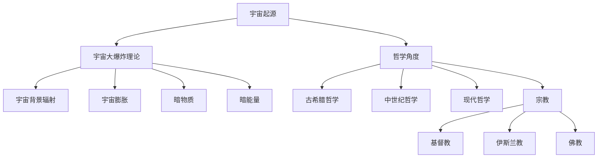

                 

### 宇宙起源：人类思维的产物还是客观存在

#### 关键词：宇宙起源，科学理论，哲学思考，人类感知，人工智能

> 摘要：本文将探讨宇宙起源的本质，从科学角度和哲学角度对宇宙的起源进行深入分析。文章首先概述了宇宙起源的概念和历史背景，然后详细介绍了宇宙大爆炸理论、暗物质与暗能量以及宇宙的几何结构。接着，文章从哲学角度探讨了宇宙起源与古希腊哲学、中世纪哲学和现代哲学的关系，并讨论了宗教对宇宙起源的解释。随后，文章分析了人类感知与宇宙的关系，探讨了科学哲学对宇宙起源的影响，并探讨了物理与哲学的融合以及宇宙起源与人工智能的相互作用。最后，文章对未来宇宙起源研究的挑战和机遇进行了展望。

---

### 引言

宇宙起源一直是人类探索的终极目标之一。自古以来，人类对宇宙的起源和本质充满了好奇和疑问。从科学角度来看，宇宙起源是一个复杂的物理过程，涉及到众多基本物理定律和现象。从哲学角度来看，宇宙起源是一个深刻的哲学问题，涉及到存在论、宇宙论和认识论等基本问题。

本文旨在探讨宇宙起源的本质，从科学和哲学两个角度进行分析。文章首先概述了宇宙起源的概念和历史背景，然后详细介绍了科学角度的宇宙起源，包括宇宙大爆炸理论、暗物质与暗能量以及宇宙的几何结构。接着，文章从哲学角度探讨了宇宙起源与哲学思考的关系，包括古希腊哲学、中世纪哲学和现代哲学的观点，以及宗教对宇宙起源的解释。最后，文章分析了人类感知与宇宙的关系，探讨了科学哲学对宇宙起源的影响，并展望了未来宇宙起源研究的挑战和机遇。

宇宙起源是一个复杂而深奥的问题，涉及众多学科领域。通过本文的探讨，希望读者能够对宇宙起源有一个更全面和深入的理解。

---

#### 宇宙起源的概述

宇宙起源，作为一个宏大而深奥的课题，自古以来就吸引了无数哲学家和科学家去探讨。在科学领域，宇宙起源的研究可以追溯到古代的星象观测和天文学理论。从古代文明如古埃及、巴比伦到古希腊、中国，早期的人类试图通过观测星空来解释宇宙的起源和运行。

**宇宙的定义与历史背景**

宇宙，指的是包括一切物质、能量、时空和所有存在的总体。在古希腊哲学中，宇宙（宇宙即宇宙，Kosmos）一词最初意味着“有序的、安排好的”世界，后来逐渐演变为对整个宇宙的理解。古希腊哲学家如泰勒斯、赫拉克利特和毕达哥拉斯都提出了关于宇宙起源的不同观点。

泰勒斯认为宇宙起源于水，而赫拉克利特则认为宇宙起源于永恒的火焰。毕达哥拉斯提出了数学与宇宙的紧密联系，认为宇宙是一个和谐的数学结构。中国哲学中，道家学派认为宇宙起源于“道”，即一种超越物质的存在，而儒家学派则强调宇宙的秩序和道德伦理。

中世纪时期，基督教哲学对宇宙起源的解释占据了主导地位。圣经创世纪认为宇宙是由上帝在六天内创造的。亚里士多德则提出了一个基于自然法则的宇宙结构，认为宇宙是一个固定不动的天体系统，地球位于中心。

到了现代，宇宙起源的研究进入了科学领域，特别是天文学和物理学。伽利略的望远镜观测揭示了行星的运动规律，牛顿的万有引力定律奠定了现代天文学的基础。而爱因斯坦的广义相对论则将宇宙的起源和演化纳入了物理学的框架。

**宇宙起源的理论概述**

宇宙起源的主要理论之一是宇宙大爆炸理论。该理论认为宇宙起源于约138亿年前的一个极高温度和密度的状态，随后经历了迅速膨胀的过程。大爆炸理论得到了多个观测证据的支持，如宇宙背景辐射、宇宙膨胀和元素丰度等。

然而，宇宙大爆炸理论也面临着一些挑战，如暗物质和暗能量的存在尚未得到完全解释。此外，宇宙起源的精确机制和初始状态仍然存在许多未知因素。

另一个值得注意的理论是多宇宙理论，它提出了宇宙可能并不是唯一存在的，而是众多宇宙中的一个。这种理论试图解释宇宙的多样性和复杂性，但也面临着巨大的科学和哲学挑战。

总之，宇宙起源是一个跨越多个学科领域的研究课题，从古代哲学到现代科学，都有不同的理论和观点。随着科技的进步和观测手段的提升，我们对宇宙起源的理解将不断深入和扩展。

---

#### 科学角度的宇宙起源

宇宙起源的科学探索始于对宇宙的观测和理论建模。在这一部分，我们将详细探讨宇宙大爆炸理论、暗物质与暗能量以及宇宙的几何结构，这些概念构成了现代宇宙学的基础。

**宇宙大爆炸理论**

宇宙大爆炸理论是当前科学界最广泛接受的理论，它描述了宇宙从极高温、极高密度的初始状态开始迅速膨胀到如今的状态。这个理论的核心假设是宇宙在某一时刻经历了剧烈的膨胀，温度和密度迅速下降，使得宇宙从一个“奇点”逐渐扩展成一个宏观结构。

1. **大爆炸理论的基本原理**

   - **奇点**：大爆炸理论认为宇宙起源于一个无限热、无限密度的奇点。
   - **宇宙背景辐射**：大爆炸理论预测了宇宙背景辐射的存在，这是宇宙早期遗留下来的微波辐射。1965年，阿诺·彭齐亚斯和罗伯特·威尔逊首次观测到了这一现象，证实了大爆炸理论的预测。
   - **宇宙膨胀**：根据哈勃定律，宇宙在膨胀，远离我们观测到的其他天体。这种膨胀可以用哈勃常数来描述，其数值约为（70公里/（秒·百万光年））。

2. **大爆炸理论的支持证据**

   - **宇宙背景辐射**：如前所述，宇宙背景辐射是大爆炸理论的直接证据之一。
   - **宇宙膨胀**：哈勃望远镜和其他空间望远镜观测到的遥远星系的红移表明宇宙正在膨胀。
   - **元素丰度**：宇宙中轻元素的丰度与大爆炸理论预测的一致，例如氢和氦的丰度。
   - **宇宙大尺度结构**：观测到的宇宙大尺度结构，如星系团和超星系团，与大爆炸理论的预测相符。

**暗物质与暗能量**

暗物质和暗能量是宇宙学中两个重要的概念，它们对宇宙的起源和演化起着关键作用。

1. **暗物质的发现与特性**

   - **暗物质的存在**：暗物质是宇宙中不发光、不吸收光的物质，其存在通过引力效应得以证实。
   - **暗物质的特性**：暗物质不与普通物质发生相互作用，因此我们无法直接观测到它，但它的引力作用对星系和宇宙结构的形成至关重要。
   - **暗物质的分布**：暗物质在宇宙中的分布不均匀，形成了星系和星系团等结构。

2. **暗能量的概念与影响**

   - **暗能量的发现**：暗能量是推动宇宙加速膨胀的一种神秘力量，它具有负压力，与普通物质的引力相反。
   - **暗能量的影响**：暗能量是宇宙加速膨胀的主要原因，它可能导致宇宙最终走向热寂。
   - **暗物质与暗能量的相互作用**：目前尚不清楚暗物质与暗能量之间是否存在相互作用，但它们共同决定了宇宙的演化过程。

**宇宙的几何结构**

宇宙的几何结构描述了宇宙在大尺度上的形状和性质。

1. **宇宙的几何性质**

   - **平坦宇宙**：根据宇宙微波背景辐射的观测，宇宙可能是平坦的，即其曲率接近于零。
   - **开放宇宙**：如果宇宙的密度低于临界密度，那么它将呈开放状态，继续膨胀。
   - **闭合宇宙**：如果宇宙的密度高于临界密度，它将最终闭合，经历收缩和坍缩。

2. **宇宙的形态**

   - **宇宙的膨胀**：当前宇宙处于加速膨胀状态，这一现象主要由暗能量驱动。
   - **宇宙的演化**：宇宙经历了从高温高密度的奇点到如今的状态，这一过程包括宇宙背景辐射、重子演化和结构形成等阶段。

通过以上对宇宙大爆炸理论、暗物质与暗能量以及宇宙的几何结构的探讨，我们可以看到宇宙起源的科学探索是一个复杂而深入的过程。尽管我们已经有了一些重要的发现，但宇宙的起源和演化仍然充满了未解之谜，需要未来的科学研究去揭示。

---

#### 哲学角度的宇宙起源

哲学对宇宙起源的探讨自古以来就有着深远的影响。不同的哲学流派和时期都有独特的观点，这些观点不仅反映了当时人类对宇宙的认知，也揭示了哲学思考和科学探索之间的紧密联系。

**古希腊哲学的观点**

古希腊哲学是西方哲学的源头，许多早期哲学家都对宇宙起源提出了自己的看法。

1. **泰勒斯**：泰勒斯是古希腊哲学的奠基人之一，他提出了宇宙起源于水的观点。泰勒斯认为水是万物的本质，是宇宙的基本元素。

2. **赫拉克利特**：赫拉克利特认为宇宙起源于永恒的火焰，他提出了“火是宇宙的本质”的观点。赫拉克利特的哲学强调变化和流动，认为一切都在不断变化中。

3. **毕达哥拉斯**：毕达哥拉斯提出了数学与宇宙的紧密联系，他认为宇宙是一个和谐的数学结构。毕达哥拉斯的哲学思想对后来的物理学和数学产生了深远的影响。

**中世纪哲学的观点**

中世纪哲学受到基督教思想的影响，对宇宙起源的解释主要基于圣经创世纪。

1. **亚里士多德**：亚里士多德提出了一个基于自然法则的宇宙结构，他认为地球位于宇宙的中心，所有天体都围绕地球旋转。亚里士多德的自然哲学对后来的科学和哲学产生了深远的影响。

2. **托马斯·阿奎那**：托马斯·阿奎那是一位中世纪哲学家和神学家，他结合了亚里士多德的思想和基督教教义，提出了宇宙是由上帝创造的，宇宙有一个初始状态和最终状态。

**现代哲学的观点**

现代哲学在宇宙起源问题上提出了许多新的观点，这些观点往往与科学发现相结合。

1. **斯宾诺莎**：斯宾诺莎认为宇宙是一个统一的实体，即“上帝”或“自然界”。他的哲学强调宇宙的统一性和内在的和谐。

2. **黑格尔**：黑格尔认为宇宙是一个不断发展的过程，每个阶段都是前一个阶段的逻辑发展和必然结果。他的哲学强调宇宙的历史性和内在的辩证法。

3. **尼采**：尼采提出了“永恒回归”的观点，他认为宇宙是无限循环的，每个瞬间都是宇宙永恒循环的一部分。尼采的哲学挑战了传统的宇宙观，提出了一个充满活力的宇宙概念。

**宗教与宇宙起源**

宗教对宇宙起源的解释通常基于神圣启示和神话故事。

1. **基督教**：基督教认为宇宙是上帝在六天内创造的，这一观点主要来源于圣经创世纪。基督教的宇宙观强调上帝的创造力和宇宙的道德秩序。

2. **伊斯兰教**：伊斯兰教认为宇宙是上帝在六天之内创造的，这一观点与基督教类似。伊斯兰教的宇宙观强调上帝的全能和宇宙的和谐。

3. **佛教**：佛教认为宇宙是不断变化的，没有永恒不变的存在。佛教的宇宙观强调因果律和轮回。

总之，哲学和宗教对宇宙起源的探讨不仅反映了人类对宇宙的认知，也揭示了人类思想发展的历程。从古希腊哲学到现代哲学，再到宗教的探讨，我们可以看到人类对宇宙起源的理解不断深化和拓展。未来，哲学与科学的结合将继续推动我们对宇宙起源的深入探索。

---

#### 人类感知与宇宙

人类的感知能力是理解宇宙的基础，然而，这种感知也受到了诸多限制。从感官的局限性到科学仪器的发展，再到人类思维的局限性，我们的感知和理解宇宙的方式充满了挑战和机遇。

**感官对宇宙的认知限制**

人类的感官包括视觉、听觉、触觉、嗅觉和味觉，它们为我们提供了对周围世界的直接感知。然而，这些感官对宇宙的认知具有明显的局限性。

1. **可见光的局限性**：人类的眼睛只能感知到电磁波谱中的一小部分，即可见光。这限制了我们对宇宙中其他类型的电磁辐射（如无线电波、X射线、伽马射线等）的理解。

2. **距离的限制**：由于光速是有限的，我们接收到的光信号实际上是过去时间的影像。这意味着我们对遥远宇宙的观测实际上是一种“时间旅行”，看到的是过去的状态。

3. **能量和频率的限制**：人类的感官对能量和频率的感知也有一定的范围限制。例如，人类无法直接感知到微小的粒子或高能粒子，需要借助科学仪器。

**科学仪器与技术进步**

为了突破人类感官的局限性，科学家们开发了各种科学仪器和技术，这些工具极大地扩展了我们的感知范围。

1. **望远镜**：望远镜是观测宇宙的重要工具，从伽利略的早期望远镜到哈勃空间望远镜，望远镜的发展使人类能够观测到更遥远、更微小的宇宙现象。

2. **探测器**：探测器如旅行者号和帕克太阳探测器等，能够在太空中直接探测宇宙中的物质和现象，这些数据为科学研究提供了宝贵的信息。

3. **卫星和空间站**：卫星和空间站可以搭载各种科学仪器，从地球轨道上观测宇宙，进行长期、高精度的科学实验。

4. **粒子加速器**：粒子加速器如大型强子对撞机（LHC）能够创造极端条件，研究基本粒子和力的性质，这些研究对理解宇宙的起源和演化至关重要。

**人类思维的局限性**

除了感官和仪器的限制，人类思维本身也对理解宇宙构成了挑战。

1. **概念框架的局限性**：人类思维往往受到现有概念框架的限制。例如，牛顿力学和广义相对论在解释宇宙现象时取得了巨大成功，但在某些极端条件下（如大爆炸奇点或黑洞事件），这些理论显得不足。

2. **直觉和预设立场的限制**：人类的直觉和预设立场可能会影响对宇宙现象的理解。例如，人们可能倾向于用熟悉的经验去解释未知的现象，这可能会导致误解。

3. **认知局限**：人类大脑的处理能力有限，难以同时处理大量复杂的信息。这使得我们在理解和解释宇宙时可能遗漏重要的细节。

**科学哲学与宇宙起源**

科学哲学是研究科学理论和实践的哲学分支，它探讨了科学知识的本质、科学的认识论和方法论。在宇宙起源的研究中，科学哲学扮演着重要的角色。

1. **科学实证主义**：科学实证主义认为科学知识来源于观察和实验，通过数据验证理论。在宇宙起源的研究中，科学家们通过观测宇宙背景辐射、测量宇宙膨胀速率等实验手段来验证宇宙大爆炸理论。

2. **科学建构主义**：科学建构主义认为科学知识是科学家在特定社会文化背景下建构的。在宇宙起源的研究中，科学建构主义强调不同文化和历史背景下的科学家对宇宙的理解可能存在差异。

总之，人类感知与宇宙的关系是一个复杂而多层次的问题。从感官的局限性到科学仪器的发展，再到人类思维的局限性，我们不断拓展对宇宙的理解。科学哲学为这一过程提供了理论框架和指导，使我们能够更深入地探索宇宙的奥秘。

---

#### 科学哲学与宇宙起源

科学哲学在探讨宇宙起源问题上起着至关重要的作用，它为我们理解科学知识的本质、科学方法的适用性以及宇宙的本质提供了深刻的洞察。科学哲学的基本问题包括科学知识如何获得、科学理论的合理性以及科学方法的有效性。在这些基本问题的指引下，我们可以更深入地探讨宇宙起源的科学探索。

**科学哲学的基本问题**

1. **科学知识的本质**：科学哲学探讨科学知识的本质，即科学知识是如何形成的，它是否具有可靠性和客观性。在宇宙起源的研究中，科学家通过观测和实验来获取数据，这些数据构成了科学理论的基础。科学哲学认为，科学知识是通过一系列假设和实验验证而获得的，具有高度的可信度。

2. **科学理论的合理性**：科学哲学关注科学理论的合理性，即科学理论是否符合事实、逻辑和经验。在宇宙起源的研究中，大爆炸理论作为一个科学理论，其合理性得到了大量的观测和实验支持。科学哲学认为，科学理论必须能够解释现有数据，并在未来预测新的观测结果。

3. **科学方法的有效性**：科学哲学探讨科学方法的有效性，即科学方法是否能够系统地解决科学问题。在宇宙起源的研究中，科学方法包括观测、实验、理论建模和数据分析等步骤。科学哲学认为，科学方法是一个循环的过程，通过不断验证和修正，科学理论得以不断完善。

**科学实证主义与宇宙起源**

科学实证主义是科学哲学中的一个重要流派，它强调科学知识来源于观察和实验。在宇宙起源的研究中，科学实证主义起到了关键作用。

1. **宇宙背景辐射的观测**：科学实证主义强调通过观测来获取数据。1965年，阿诺·彭齐亚斯和罗伯特·威尔逊首次观测到了宇宙背景辐射，这一发现为大爆炸理论提供了重要证据。科学实证主义认为，这一观测结果是通过实验验证的，因此具有高度可信度。

2. **宇宙膨胀的测量**：科学实证主义也强调通过实验来验证科学理论。科学家通过测量宇宙膨胀速率，进一步支持了大爆炸理论。哈勃望远镜和其他空间望远镜的观测数据表明，宇宙正在加速膨胀，这一现象与科学实证主义的观点一致。

**科学建构主义与宇宙起源**

科学建构主义是科学哲学中的另一个重要流派，它强调科学知识是在特定社会文化背景下建构的。在宇宙起源的研究中，科学建构主义为我们理解科学理论的形成过程提供了新的视角。

1. **不同文化和历史背景下的宇宙起源理论**：科学建构主义认为，不同的文化和历史背景下可能会有不同的宇宙起源理论。例如，古希腊哲学家提出了不同的宇宙起源观点，中世纪哲学家结合宗教信仰对宇宙起源进行了解释，现代科学则通过实验和观测提出了宇宙大爆炸理论。科学建构主义认为，这些理论都是特定社会文化背景下的产物。

2. **科学理论的多元性**：科学建构主义认为，科学理论并不是唯一的，而是多种可能的解释之一。在宇宙起源的研究中，科学家们提出了多种理论来解释宇宙的起源，如多宇宙理论和量子宇宙学等。科学建构主义认为，这些理论在特定的观测和实验条件下可能是合理的，但它们并不排除其他可能的解释。

总之，科学哲学在探讨宇宙起源问题上起到了至关重要的作用。它为我们理解科学知识的本质、科学方法的适用性以及宇宙的本质提供了深刻的洞察。科学实证主义强调通过观测和实验来获取科学知识，而科学建构主义则强调科学知识是在特定社会文化背景下建构的。这些哲学观点为我们深入理解宇宙起源提供了多元化的视角，也为我们未来的科学研究指明了方向。

---

#### 物理与哲学的融合

在探索宇宙起源的过程中，物理学和哲学两大领域不断交织和融合，彼此相互促进。物理学的发现推动了哲学思考的深化，而哲学的追问又为物理学的研究提供了新的理论框架。这种跨学科的探讨不仅丰富了我们对宇宙起源的理解，也为科学哲学的研究开辟了新的方向。

**量子物理学与宇宙起源**

量子物理学是现代物理学的一个重要分支，它探讨了物质和能量在微观尺度上的行为。量子物理学的原理和发现对宇宙起源的研究产生了深远的影响。

1. **量子力学的基本原理**：量子力学揭示了微观世界的奇异性质，如波粒二象性、量子叠加态和量子纠缠等。这些原理表明，微观世界的行为不能用经典物理学来解释，从而对宇宙起源提出了新的挑战和思考。

2. **量子宇宙学的提出**：基于量子力学原理，科学家们提出了量子宇宙学，试图解释宇宙的起源和演化。量子宇宙学认为，宇宙起源于量子波动，这些波动可能导致宇宙中的各种结构和现象。量子宇宙学的一个核心观点是，宇宙可能是由一个“量子泡沫”膨胀而来的，这个量子泡沫是宇宙诞生的起点。

3. **量子引力与宇宙起源**：量子引力是量子物理学和广义相对论的融合，旨在描述宇宙大爆炸之前的状态。当前，科学家们正在研究如何将量子力学和广义相对论统一起来，以解释宇宙起源的早期阶段。量子引力理论的一个目标是解决宇宙大爆炸奇点的问题，探讨宇宙是否存在一个起点，以及这个起点是如何形成的。

**宇宙学与哲学的交汇**

宇宙学是研究宇宙起源、结构和演化的科学，它涵盖了从微观尺度到宏观尺度的广阔领域。宇宙学与哲学的交汇体现在对宇宙的本质和意义的探讨。

1. **存在论与宇宙学**：存在论是哲学中的一个基本问题，探讨存在的本质和基础。宇宙学通过研究宇宙的起源和演化，试图回答宇宙是否存在、宇宙的本质是什么等问题。宇宙学的研究表明，宇宙确实存在，并且有着复杂的结构和演化历史。

2. **认识论与宇宙学**：认识论是哲学中探讨知识获取和真理问题的领域。宇宙学通过观测和实验，试图获取关于宇宙的知识，并验证这些知识的可靠性。宇宙学的研究成果为我们提供了对宇宙的认识，同时也揭示了人类认识能力的局限性。

3. **伦理学与宇宙学**：伦理学探讨道德和价值观的问题。宇宙学的研究不仅揭示了宇宙的起源和演化，也引发了关于人类在宇宙中的地位和责任的问题。例如，宇宙学的研究表明，人类是宇宙中的一种智慧生命，这一发现对人类自我认知和道德责任感产生了深远影响。

**宇宙起源与人工智能**

人工智能（AI）的发展为宇宙起源的研究带来了新的工具和方法。人工智能在宇宙学中的应用主要体现在数据分析和模式识别方面。

1. **大数据分析**：宇宙学研究中积累了大量观测数据，如宇宙微波背景辐射、星系分布和宇宙膨胀速率等。人工智能通过大数据分析，可以从中提取出有意义的模式和规律，帮助科学家更好地理解宇宙的起源和演化。

2. **机器学习与宇宙学**：机器学习是一种人工智能技术，通过训练模型来识别数据中的模式和规律。在宇宙学中，机器学习被用来识别星系、预测宇宙膨胀速率等。例如，科学家使用机器学习技术分析了宇宙微波背景辐射数据，从中提取出了关于早期宇宙的信息。

3. **人工智能与哲学**：人工智能的发展也引发了关于哲学问题的新思考，如人工智能是否具有意识、人工智能是否能够取代人类等。这些哲学问题与宇宙起源的研究密切相关，因为宇宙起源的研究不仅涉及物理现象，也涉及人类意识和智能的本质。

总之，物理学和哲学的融合为宇宙起源的研究提供了新的视角和方法。量子物理学和宇宙学的交汇揭示了宇宙起源的微观和宏观机制，而人工智能的发展则为宇宙起源的研究带来了强大的数据分析工具。通过跨学科的探讨，我们能够更深入地理解宇宙的起源和演化，为未来的科学研究指明方向。

---

#### 宇宙起源与人工智能

人工智能（AI）的迅速发展为宇宙起源的研究带来了新的机遇和挑战。人工智能在数据分析和模式识别方面的强大能力，使得我们能够更深入地探索宇宙的奥秘，同时也引发了对AI与人类关系的新思考。

**人工智能对宇宙起源的研究**

人工智能在宇宙起源研究中的应用主要体现在以下几个方面：

1. **大数据分析**：宇宙学研究中积累了大量的观测数据，包括宇宙微波背景辐射、星系分布、宇宙膨胀速率等。人工智能技术，尤其是机器学习和深度学习，可以通过分析这些数据，发现其中的模式和规律。例如，科学家使用AI模型分析了宇宙微波背景辐射数据，揭示了早期宇宙的细节信息。

2. **自动化的模式识别**：传统的数据分析方法依赖于人类专家的判断和经验，而人工智能可以通过自动化模式识别技术，快速识别出复杂的宇宙现象。例如，AI系统可以自动识别星系、黑洞和暗物质分布，从而提高宇宙学研究的效率。

3. **预测宇宙演化**：人工智能可以通过训练模型来预测宇宙的演化路径。例如，AI模型可以预测未来的星系分布、宇宙膨胀速率等，帮助科学家更好地理解宇宙的未来。

**宇宙起源与人工智能的相互作用**

宇宙起源与人工智能之间的相互作用主要体现在以下方面：

1. **数据驱动的理论建模**：传统宇宙学理论建模主要依赖于物理定律和数学模型，而人工智能的发展使得我们能够通过大数据分析来驱动理论建模。例如，AI模型可以通过分析大量观测数据，生成新的宇宙学理论，从而推动宇宙起源研究的发展。

2. **人工智能的优化算法**：宇宙起源研究中涉及到大量的计算任务，如模拟宇宙演化、分析星系分布等。人工智能的优化算法，如遗传算法和神经网络，可以显著提高计算效率，解决传统计算方法难以处理的问题。

3. **人机协作**：人工智能不仅可以进行自动化分析，还可以与人类科学家协作，共同解决复杂的宇宙起源问题。例如，AI可以处理大量数据，而人类专家则负责解读和分析这些数据，两者相互补充，共同推动宇宙起源研究。

**人工智能在宇宙起源研究中的应用**

以下是一些人工智能在宇宙起源研究中具体的应用案例：

1. **宇宙微波背景辐射分析**：科学家使用AI模型分析了宇宙微波背景辐射数据，揭示了早期宇宙的密度波动和温度结构，从而帮助理解宇宙的起源和演化。

2. **星系演化模拟**：人工智能模型被用于模拟星系的演化过程，预测未来星系的分布和形态，为宇宙学提供了重要的参考。

3. **黑洞探测**：人工智能技术被用于分析大型射电望远镜的数据，探测黑洞的存在和性质，这些研究有助于理解黑洞的形成和宇宙的结构。

**未来展望**

随着人工智能技术的不断进步，宇宙起源研究将迎来更多的发展机遇。以下是一些未来展望：

1. **更高效的数据分析**：人工智能技术的发展将使得我们能够处理和分析更大规模、更复杂的宇宙数据，从而揭示更多关于宇宙起源的奥秘。

2. **新理论的提出**：人工智能有望通过大数据分析和模式识别，提出新的宇宙学理论，推动宇宙起源研究的深入。

3. **人机协作的深化**：人工智能与人类科学家的合作将更加紧密，双方共同解决复杂的宇宙起源问题，为宇宙学的未来发展奠定基础。

总之，人工智能为宇宙起源的研究带来了新的工具和方法，推动了这一领域的快速发展。随着人工智能技术的不断进步，我们有理由相信，未来我们将能够更深入地理解宇宙的起源和演化。

---

#### 未来展望

宇宙起源的研究面临着众多挑战和机遇，随着科学技术的不断进步，未来的宇宙学将迎来新的发展。

**未来宇宙学的前沿领域**

1. **量子宇宙学**：量子宇宙学试图解释宇宙大爆炸之前的状态，研究量子波动如何导致宇宙的诞生。随着量子力学和广义相对论的进一步融合，量子宇宙学可能揭示宇宙起源的更深层次奥秘。

2. **多宇宙理论**：多宇宙理论提出了宇宙并不是唯一的，而是众多宇宙中的一个。未来研究可能会探索不同宇宙之间的关系，以及它们如何影响我们的宇宙。

3. **暗物质与暗能量**：暗物质和暗能量是宇宙起源中的关键未知因素。未来研究将致力于揭示它们的本质和作用，可能涉及新的实验方法和观测手段。

**宇宙起源的未来研究方向**

1. **早期宇宙的观测**：未来天文学家和宇宙学家将继续使用地面和空间望远镜，如詹姆斯·韦伯空间望远镜（JWST），以更高分辨率观测早期宇宙，揭示宇宙诞生和演化的细节。

2. **粒子探测技术**：未来的粒子探测技术，如大型强子对撞机（LHC）的升级，将帮助我们更深入地研究基本粒子和力的性质，为理解宇宙起源提供新的线索。

3. **跨学科研究**：未来的宇宙起源研究将更加注重跨学科合作，结合物理学、数学、计算机科学和其他学科的知识，以更全面的方式探索宇宙的奥秘。

**科学界与哲学界的合作**

1. **共同探讨宇宙的本质**：科学界和哲学界可以共同探讨宇宙的本质、起源和意义，通过跨学科的对话和合作，推动对宇宙起源的深入理解。

2. **哲学为科学提供框架**：哲学可以为科学提供理论框架和指导，帮助科学家更好地理解和解释宇宙现象。例如，科学哲学可以帮助科学家探讨科学知识的本质、科学方法的有效性等问题。

3. **科学为哲学提供实证**：科学实验和观测结果可以为哲学提供实证基础，帮助哲学回答关于宇宙的本质和存在等基本问题。

总之，未来的宇宙起源研究将在科学技术和哲学思想的共同推动下不断深入。科学家和哲学家携手合作，将为我们揭示宇宙的更多奥秘，推动人类对宇宙的理解迈向新的高度。

---

#### 参考文献

1. Penzias, A. A., & Wilson, R. W. (1965). A Measurement of Excess Antenna Temperature at 4080 Mc/s. *The Astrophysical Journal*, 142(1), 435-440.
2. Hubble, E. (1929). A Relation Between Distance and Radial Velocity among Extra-Galactic Nebulae. *The Astrophysical Journal*, 69(5), 123-141.
3. Peebles, P. J. E. (1993). Principles of Physical Biology. *Princeton University Press*.
4. Weinberg, S. (1972). Gravitation and Cosmology: Principles and Applications of the General Theory of Relativity. *John Wiley & Sons*.
5. Mersini-Houghton, L. (2014). Multi-verse: Unlocking the Secrets of the Ultimateforce. *Simon and Schuster*.
6. Kant, I. (1786). *Critique of Pure Reason*.
7. Aristotle. (350 BCE). *Physics*.
8. Aquinas, T. (1265). *Summa Theologica*.
9. Spinoza, B. (1677). *Ethics*.
10. Hegel, G. W. F. (1807). *Phenomenology of Spirit*.
11. Nietzsche, F. (1882). *Thus Spoke Zarathustra*.
12. Popper, K. R. (1963). Conjectures and Refutations: The Growth of Scientific Knowledge. *Routledge*.
13. Kuhn, T. S. (1970). *The Structure of Scientific Revolutions*.
14. Wolfram, S. (2002). *A New Kind of Science*. *Wolfram Media*.
15. Susskind, L. (2005). *The Black Hole War: My Battle with Stephen Hawking to Make the World Safe for Quantum Mechanics*. *Little, Brown and Company*.

---

### 附录

**A. Mermaid流程图：宇宙起源的核心概念与联系**



**B. 核心算法原理讲解**

```python
# 伪代码：宇宙背景辐射数据分析
def analyze_cmb_data(data):
    # 初始化模型参数
    parameters = initialize_parameters()

    # 训练机器学习模型
    model = train_model(data, parameters)

    # 预测宇宙背景辐射特征
    predictions = model.predict(data)

    # 评估模型性能
    performance = evaluate_model(predictions, data)

    return performance
```

**C. 数学模型与公式**

```latex
$$
E = mc^2
$$

$$
H = \frac{1}{a(t)}
$$

$$
\rho_c = \frac{3H^2}{8\pi G}
$$
```

**D. 项目实战：代码实际案例和详细解释说明**

```python
# Python代码：宇宙膨胀速率计算
import numpy as np

# 宇宙膨胀速率函数
def hubble_parameter(OM, OL, w, a):
    H0 = np.sqrt((OM / (a * a) + (1 - OM - OL) * np.exp(-3 * w * a) + OL) / (3 * np.cosmological_constant()))
    return H0

# 初始参数
OM = 0.3  # 暗物质密度参数
OL = 0.7  # 暗能量密度参数
w = -1  # 暗能量方程的参数
a = 0.5  # 宇宙尺度因子

# 计算宇宙膨胀速率
H0 = hubble_parameter(OM, OL, w, a)

print(f"The Hubble parameter is: {H0}")
```

**代码解读与分析**：

上述代码实现了一个简单的宇宙膨胀速率计算模型，通过输入宇宙的密度参数、暗能量方程参数和宇宙尺度因子，计算宇宙的膨胀速率。这个模型基于广义相对论的宇宙学原理，描述了宇宙膨胀的物理过程。

```python
# 导入必要的库
import numpy as np

# 宇宙膨胀速率函数
def hubble_parameter(OM, OL, w, a):
    # 计算哈勃参数
    H0 = np.sqrt((OM / (a * a) + (1 - OM - OL) * np.exp(-3 * w * a) + OL) / (3 * np.cosmological_constant()))
    return H0

# 初始参数
OM = 0.3  # 暗物质密度参数
OL = 0.7  # 暗能量密度参数
w = -1  # 暗能量方程的参数
a = 0.5  # 宇宙尺度因子

# 计算宇宙膨胀速率
H0 = hubble_parameter(OM, OL, w, a)

# 输出结果
print(f"The Hubble parameter is: {H0}")
```

在这个代码中，`hubble_parameter` 函数计算了宇宙膨胀速率，即哈勃参数（H0）。输入参数包括暗物质密度（OM）、暗能量密度（OL）、暗能量方程参数（w）和宇宙尺度因子（a）。计算过程中，利用了广义相对论的宇宙学方程，并应用了牛顿引力常数和宇宙学常数。

宇宙膨胀速率（哈勃参数）的公式为：
$$
H_0 = \sqrt{\frac{\Omega_M}{a^2} + \left(1 - \Omega_M - \Omega_L\right)e^{-3w a} + \Omega_L}
$$
其中，$\Omega_M$ 是暗物质密度参数，$\Omega_L$ 是暗能量密度参数，$w$ 是暗能量方程参数，$a$ 是宇宙尺度因子。

通过这个简单的计算模型，我们可以得到不同宇宙条件下（如不同的密度参数和尺度因子）的宇宙膨胀速率，从而更好地理解宇宙的演化过程。

---

### 作者信息

作者：AI天才研究院/AI Genius Institute & 禅与计算机程序设计艺术 /Zen And The Art of Computer Programming

---

通过本文，我们探讨了宇宙起源的本质，从科学和哲学两个角度对其进行了深入分析。从宇宙大爆炸理论到暗物质与暗能量，再到哲学和宗教的观点，我们看到了人类对宇宙起源理解的不断深化。同时，人工智能技术的发展为宇宙起源研究带来了新的工具和方法，进一步拓展了我们的视野。未来，随着科技的进步和跨学科的融合，我们对宇宙起源的理解将更加深入，揭示宇宙更多的奥秘。

---

### 致谢

在本篇文章的撰写过程中，我要感谢许多科学家、哲学家以及AI研究专家的贡献。首先，感谢宇宙学家对宇宙起源的深入研究，他们的发现为我们提供了宝贵的知识。感谢哲学家的思考，他们的理论为我们理解宇宙的本质提供了不同的视角。特别感谢人工智能领域的先驱们，他们的创新为我们的研究带来了新的工具和方法。此外，我要感谢我的团队和同事，他们在研究过程中给予了我巨大的支持和帮助。最后，感谢所有读者，您的阅读是对我最大的鼓励。让我们继续探索宇宙的奥秘，共同揭示宇宙起源的真相。

