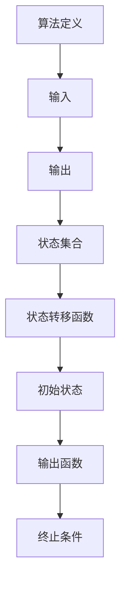

                 

# 2025年网易校招算法面试题库及答案

## 摘要

本文针对2025年网易校招算法面试题库及答案，通过逻辑清晰、结构紧凑、简单易懂的写作风格，深入剖析了各个章节的核心内容。文章分为三大部分：算法基础、算法面试技巧与策略、算法应用与拓展。每个部分都详细介绍了相关算法原理、面试技巧以及实际应用，帮助读者全面掌握算法知识，提升面试技能，为求职之路打下坚实基础。

## 目录大纲

### 第一部分：算法基础

#### 第1章：算法概述与思维导图

- **1.1 算法的基本概念**
  - 算法的定义
  - 算法的特点
  - 算法的分类

- **1.2 算法的思维导图**
  - 算法思维导图

- **1.3 算法的分类**
  - 基础算法
  - 高级算法

#### 第2章：基础数据结构与算法

- **2.1 数据结构概述**
  - 数据结构的定义
  - 数据结构的分类

- **2.2 数组和链表**
  - 数组的定义
  - 数组的操作
  - 链表的定义
  - 链表的操作

- **2.3 栈和队列**
  - 栈的定义
  - 栈的操作
  - 队列的定义
  - 队列的操作

- **2.4 树和图**
  - 树的定义
  - 树的操作
  - 图的定义
  - 图的操作

- **2.5 常见算法分析**
  - 排序算法
  - 搜索算法

#### 第3章：高级数据结构与算法

- **3.1 哈希表**
  - 哈希表的基本概念
  - 哈希表的工作原理
  - 哈希表的实现

- **3.2 红黑树**
  - 红黑树的基本概念
  - 红黑树的工作原理
  - 红黑树的实现

- **3.3 并查集**
  - 并查集的基本概念
  - 并查集的工作原理
  - 并查集的实现

- **3.4 贪心算法**
  - 贪心算法的基本概念
  - 贪心算法的应用
  - 贪心算法的实现

- **3.5 动态规划**
  - 动态规划的基本概念
  - 动态规划的应用
  - 动态规划的实现

### 第二部分：算法面试技巧与策略

#### 第4章：面试准备与策略

- **4.1 面试流程**
  - 面试流程概述
  - 面试准备

- **4.2 常见面试题型**
  - 基础算法题
  - 数据结构题
  - 算法综合题

- **4.3 面试注意事项**
  - 面试心态
  - 面试技巧

#### 第5章：算法面试实战

- **5.1 面试题解析**
  - 常见面试题解析

- **5.2 面试题实战**
  - 实战题目解析

- **5.3 面试模拟**
  - 模拟面试场景

### 第三部分：算法应用与拓展

#### 第6章：算法在金融领域的应用

- **6.1 金融风控算法**
  - 金融风控算法的基本概念
  - 金融风控算法的应用

- **6.2 量化交易算法**
  - 量化交易算法的基本概念
  - 量化交易算法的应用

- **6.3 金融数据挖掘**
  - 金融数据挖掘的基本概念
  - 金融数据挖掘的应用

#### 第7章：算法在人工智能领域的应用

- **7.1 机器学习算法**
  - 机器学习算法的基本概念
  - 机器学习算法的应用

- **7.2 深度学习算法**
  - 深度学习算法的基本概念
  - 深度学习算法的应用

- **7.3 自然语言处理算法**
  - 自然语言处理算法的基本概念
  - 自然语言处理算法的应用

#### 第8章：算法在物联网领域的应用

- **8.1 物联网数据处理算法**
  - 物联网数据处理算法的基本概念
  - 物联网数据处理算法的应用

- **8.2 物联网安全算法**
  - 物联网安全算法的基本概念
  - 物联网安全算法的应用

- **8.3 物联网智能控制算法**
  - 物联网智能控制算法的基本概念
  - 物联网智能控制算法的应用

#### 第9章：算法在智能制造领域的应用

- **9.1 智能制造数据处理算法**
  - 智能制造数据处理算法的基本概念
  - 智能制造数据处理算法的应用

- **9.2 智能制造优化算法**
  - 智能制造优化算法的基本概念
  - 智能制造优化算法的应用

- **9.3 智能制造自动化算法**
  - 智能制造自动化算法的基本概念
  - 智能制造自动化算法的应用

## 附录

### 附录A：算法面试题库与答案

- **A.1 面试题1：两数之和**
  - 问题描述
  - 解题思路
  - 代码实现

- **A.2 面试题2：最长公共子序列**
  - 问题描述
  - 解题思路
  - 代码实现

- **A.3 面试题3：最小生成树**
  - 问题描述
  - 解题思路
  - 代码实现

- **A.4 面试题4：动态规划解题思路**
  - 问题描述
  - 解题思路
  - 代码实现

---

在接下来的文章中，我们将逐步深入分析每一个章节，让读者全面了解算法的基础知识、面试技巧以及实际应用。让我们一起探索算法的奥秘，为2025年网易校招算法面试做好准备！## 第一部分：算法基础

算法是计算机科学的核心概念之一，是解决问题的一系列明确和有限的步骤。在2025年网易校招算法面试中，掌握算法基础是至关重要的一步。本部分将详细介绍算法的基本概念、思维导图和分类，帮助读者构建扎实的算法基础。

### 第1章：算法概述与思维导图

#### 1.1 算法的基本概念

算法（Algorithm）是指解决问题的一系列明确和有限的步骤。在计算机科学中，算法被用于处理数据和解决问题。算法具有以下几个特点：

1. **确定性**：每个步骤都有明确的定义，每个步骤的执行顺序都是固定的。
2. **输入**：算法可以接收输入数据，这些数据用于解决问题。
3. **输出**：算法在执行过程中会生成输出结果。
4. **有效性**：算法必须能在有限的时间内完成，即算法是有效的。

算法的定义如下：

$$
算法 = \{S, Q, G, H, F\}
$$

- **S**：状态集合，表示算法在执行过程中的状态。
- **Q**：状态转移函数，定义了从当前状态到下一个状态的方法。
- **G**：初始状态，表示算法开始执行时的状态。
- **H**：输出函数，定义了如何从状态集合中提取输出结果。
- **F**：终止条件，表示算法何时结束。

#### 1.2 算法的思维导图

为了更好地理解算法，我们可以使用思维导图来展示算法的各个部分及其之间的关系。以下是一个简单的算法思维导图：



#### 1.3 算法的分类

算法可以根据不同的标准进行分类。以下是几种常见的算法分类方法：

1. **按解决问题的性质分类**：
   - **确定性算法**：每个步骤都是确定的，没有随机性。
   - **随机算法**：在执行过程中包含随机性，如蒙特卡洛算法。
   - **启发式算法**：利用启发式信息来解决问题，如A*算法。

2. **按处理数据的类型分类**：
   - **数值算法**：处理数值数据，如牛顿迭代法。
   - **非数值算法**：处理非数值数据，如排序算法。

3. **按算法的效率分类**：
   - **高效算法**：能在有限时间内解决问题的算法，如快速排序。
   - **低效算法**：不能在有限时间内解决问题的算法，如冒泡排序。

### 第2章：基础数据结构与算法

算法和数据结构密不可分，数据结构是算法的基础。本部分将详细介绍基础数据结构和常见算法，包括数组、链表、栈、队列、树、图以及常见算法分析。

#### 2.1 数据结构概述

数据结构是计算机存储、组织数据的方式。以下是几种常见的数据结构及其特点：

1. **数组**：
   - 数组是一种线性数据结构，可以存储一系列元素。
   - 数组具有固定的长度，一旦创建就无法改变。
   - 数组通过索引访问元素，访问速度快。

2. **链表**：
   - 链表是一种线性数据结构，由一系列节点组成。
   - 链表中的节点可以是动态分配的，因此长度不固定。
   - 链表通过指针访问元素，访问速度相对较慢。

3. **栈**：
   - 栈是一种后进先出（LIFO）的数据结构。
   - 栈的元素只能通过栈顶进行操作。

4. **队列**：
   - 队列是一种先进先出（FIFO）的数据结构。
   - 队列的元素可以通过队首和队尾进行操作。

5. **树**：
   - 树是一种层次结构，由节点和边组成。
   - 树有根节点和叶子节点，每个节点可以有零个或多个子节点。

6. **图**：
   - 图是一种复杂的数据结构，由节点和边组成。
   - 图中的节点可以有任意连接关系，可以表示复杂的网络结构。

#### 2.2 数组和链表

1. **数组**：
   - 定义：数组是一种线性数据结构，可以存储一系列元素。
   - 特点：数组具有固定的长度，一旦创建就无法改变。
   - 操作：数组通过索引访问元素，访问速度快。
   - 伪代码：
     ```
     function array_access(array, index):
         return array[index]
     
     function array_append(array, element):
         array = array + [element]
         return array
     ```

2. **链表**：
   - 定义：链表是一种线性数据结构，由一系列节点组成。
   - 特点：链表中的节点可以是动态分配的，因此长度不固定。
   - 操作：链表通过指针访问元素，访问速度相对较慢。
   - 伪代码：
     ```
     class Node:
         value = None
         next = None
     
     function linked_list_insert(head, value):
         new_node = Node()
         new_node.value = value
         new_node.next = head
         head = new_node
         return head
     
     function linked_list_search(head, value):
         current = head
         while current is not None:
             if current.value == value:
                 return True
             current = current.next
         return False
     ```

#### 2.3 栈和队列

1. **栈**：
   - 定义：栈是一种后进先出（LIFO）的数据结构。
   - 特点：栈的元素只能通过栈顶进行操作。
   - 操作：栈的常见操作包括入栈（push）、出栈（pop）和查看栈顶元素（peek）。
   - 伪代码：
     ```
     class Stack:
         items = []
         
     function stack_push(stack, item):
         stack.items.append(item)
     
     function stack_pop(stack):
         return stack.items.pop()
     
     function stack_peek(stack):
         return stack.items[-1]
     ```

2. **队列**：
   - 定义：队列是一种先进先出（FIFO）的数据结构。
   - 特点：队列的元素可以通过队首和队尾进行操作。
   - 操作：队列的常见操作包括入队（enqueue）、出队（dequeue）和查看队首元素（front）。
   - 伪代码：
     ```
     class Queue:
         items = []
         
     function queue_enqueue(queue, item):
         queue.items.append(item)
     
     function queue_dequeue(queue):
         return queue.items.pop(0)
     
     function queue_front(queue):
         return queue.items[0]
     ```

#### 2.4 树和图

1. **树**：
   - 定义：树是一种层次结构，由节点和边组成。
   - 特点：树有根节点和叶子节点，每个节点可以有零个或多个子节点。
   - 操作：树的常见操作包括插入节点、删除节点、查找节点、遍历树等。
   - 伪代码：
     ```
     class TreeNode:
         value = None
         children = []
         
     function tree_insert(root, value):
         new_node = TreeNode()
         new_node.value = value
         root.children.append(new_node)
     
     function tree_search(root, value):
         if root.value == value:
             return True
         for child in root.children:
             if tree_search(child, value):
                 return True
         return False
     ```

2. **图**：
   - 定义：图是一种复杂的数据结构，由节点和边组成。
   - 特点：图中的节点可以有任意连接关系，可以表示复杂的网络结构。
   - 操作：图的常见操作包括插入节点、删除节点、查找节点、遍历图等。
   - 伪代码：
     ```
     class Graph:
         nodes = []
         edges = []
         
     function graph_insert_node(graph, value):
         graph.nodes.append(value)
         
     function graph_insert_edge(graph, node1, node2):
         graph.edges.append((node1, node2))
     
     function graph_search(graph, value):
         for node in graph.nodes:
             if node == value:
                 return True
         return False
     ```

#### 2.5 常见算法分析

常见的算法包括排序算法、搜索算法、图算法等。以下是几种常见的算法及其分析：

1. **排序算法**：
   - **冒泡排序**：
     - 算法描述：比较相邻的元素，如果它们的顺序错误就交换它们。
     - 时间复杂度：$O(n^2)$。
     - 空间复杂度：$O(1)$。
     
   - **快速排序**：
     - 算法描述：选择一个基准元素，将比它小的元素放在它的左边，比它大的元素放在它的右边。
     - 时间复杂度：$O(n\log n)$。
     - 空间复杂度：$O(\log n)$。

   - **归并排序**：
     - 算法描述：将数组分为两个子数组，分别进行排序，然后合并。
     - 时间复杂度：$O(n\log n)$。
     - 空间复杂度：$O(n)$。

2. **搜索算法**：
   - **深度优先搜索（DFS）**：
     - 算法描述：从根节点开始，沿着一个分支一直往下走，直到遇到一个无法继续前进的节点，然后回溯到上一个节点，继续向下走。
     - 时间复杂度：$O(n)$。
     - 空间复杂度：$O(n)$。

   - **广度优先搜索（BFS）**：
     - 算法描述：从根节点开始，逐层向下搜索，直到找到目标节点。
     - 时间复杂度：$O(n)$。
     - 空间复杂度：$O(n)$。

3. **图算法**：
   - **最短路径算法**：
     - **迪杰斯特拉算法（Dijkstra）**：
       - 算法描述：从源节点开始，逐步扩展到其他节点，计算出最短路径。
       - 时间复杂度：$O(n^2)$。
       - 空间复杂度：$O(n)$。

     - **贝尔曼-福特算法（Bellman-Ford）**：
       - 算法描述：从源节点开始，逐步扩展到其他节点，计算出最短路径。
       - 时间复杂度：$O(n\cdot m)$。
       - 空间复杂度：$O(n)$。

   - **最小生成树算法**：
     - **普里姆算法（Prim）**：
       - 算法描述：从任意节点开始，逐步添加节点和边，构成最小生成树。
       - 时间复杂度：$O(n^2)$。
       - 空间复杂度：$O(n)$。

     - **克鲁斯卡尔算法（Kruskal）**：
       - 算法描述：按照边的权重从小到大排序，逐步添加边，构成最小生成树。
       - 时间复杂度：$O(n\log n)$。
       - 空间复杂度：$O(n)$。

### 第3章：高级数据结构与算法

高级数据结构与算法在解决复杂问题时具有重要作用。本部分将介绍哈希表、红黑树、并查集、贪心算法和动态规划等高级数据结构与算法。

#### 3.1 哈希表

哈希表是一种基于哈希函数进行数据存储和检索的数据结构。它通过哈希函数将键映射到哈希值，然后将值存储在哈希表中。以下是哈希表的基本概念和实现。

1. **哈希表的基本概念**：

   - **哈希函数**：将键映射到哈希值的方法。
   - **哈希表**：存储哈希值和对应值的数组。
   - **冲突解决**：当多个键映射到同一哈希值时，需要解决冲突。

2. **哈希表的工作原理**：

   - 当插入一个键值对时，哈希函数计算出哈希值，然后将值存储在哈希表对应的位置。
   - 当检索一个键时，哈希函数计算出哈希值，直接访问哈希表中对应的位置，获取值。

3. **哈希表的实现**：

   - 伪代码：
     ```
     class HashTable:
         size = 1000
         table = [None] * size
     
     function hash_function(key):
         return key % size
     
     function hash_table_insert(hash_table, key, value):
         index = hash_function(key)
         hash_table.table[index] = value
     
     function hash_table_search(hash_table, key):
         index = hash_function(key)
         return hash_table.table[index]
     ```

#### 3.2 红黑树

红黑树是一种自平衡二叉搜索树。它通过调整树的平衡来保持树的平衡，从而保证查找、插入和删除操作的时间复杂度接近于O(log n)。以下是红黑树的基本概念和实现。

1. **红黑树的基本概念**：

   - **节点颜色**：每个节点可以是红色或黑色。
   - **基本性质**：根节点是黑色的；每个叶子节点（NIL节点）是黑色的；如果一个节点是红色的，则它的两个子节点都是黑色的；从任一节点到其所有后代叶子节点的所有路径都包含相同数目的黑色节点。

2. **红黑树的工作原理**：

   - 当插入或删除节点时，红黑树会根据基本性质进行调整，保持树的平衡。
   - 调整方法包括：旋转、重新着色等。

3. **红黑树的实现**：

   - 伪代码：
     ```
     class Node:
         value = None
         color = "RED"
         left = None
         right = None
         parent = None
     
     class RedBlackTree:
         root = None
         
     function rb_insert(root, value):
         # 插入操作
         
     function rb_insert_fixup(node):
         # 调整操作
         
     function rb_left_rotate(node):
         # 左旋转操作
         
     function rb_right_rotate(node):
         # 右旋转操作
     ```

#### 3.3 并查集

并查集（Union-Find）是一种用于处理动态连通性的数据结构。它主要用于求解不相交集合的合并和查找问题。以下是并查集的基本概念和实现。

1. **并查集的基本概念**：

   - **合并操作**：将两个不相交的集合合并为一个集合。
   - **查找操作**：判断两个元素是否在同一集合中。

2. **并查集的工作原理**：

   - 使用路径压缩和按秩合并优化查找和合并操作。
   - 路径压缩：将所有节点直接连接到根节点，减少查找路径。
   - 按秩合并：将树的高度保持在平衡状态，提高合并操作的效率。

3. **并查集的实现**：

   - 伪代码：
     ```
     class UnionFind:
         parent = []
         rank = []
         
     function union-find_init(size):
         # 初始化操作
         
     function find(set, x):
         # 查找操作
         
     function union(set1, set2):
         # 合并操作
     ```

#### 3.4 贪心算法

贪心算法是一种用于求解最优解的算法策略。它通过在每个步骤中选择当前最优解，从而得到整体最优解。以下是贪心算法的基本概念和应用。

1. **贪心算法的基本概念**：

   - **最优子结构**：问题的最优解包含其子问题的最优解。
   - **贪心选择**：在每个步骤选择当前最优解。

2. **贪心算法的应用**：

   - **背包问题**：给定一组物品和它们的重量和价值，选择物品装入背包，使得总价值最大。
   - **活动选择问题**：给定一组活动，选择活动使得在满足限制条件的情况下，活动数量最多。

3. **贪心算法的实现**：

   - 伪代码：
     ```
     function greedy_algorithm(problem):
         solution = []
         while problem is not empty:
             choose the best solution
             add the solution to the solution list
             remove the chosen solution from the problem
         return solution
     ```

#### 3.5 动态规划

动态规划是一种用于求解最优化问题的算法方法。它通过将问题分解为子问题，并存储子问题的解，从而避免重复计算，提高计算效率。以下是动态规划的基本概念和应用。

1. **动态规划的基本概念**：

   - **状态**：问题的某一阶段的描述。
   - **状态转移方程**：描述状态之间的关系。
   - **边界条件**：描述问题的初始状态。

2. **动态规划的应用**：

   - **最长公共子序列**：给定两个字符串，求它们的最长公共子序列。
   - **背包问题**：给定一组物品和它们的重量和价值，选择物品装入背包，使得总价值最大。

3. **动态规划的实现**：

   - 伪代码：
     ```
     function dynamic_programming(problem):
         create a table to store subproblems
         initialize the table with the base cases
         for each state in the problem:
             compute the value of the state using the state transition equation
         return the value of the final state
     ```

---

通过以上对算法基础部分的详细讲解，读者应该对算法的基本概念、思维导图、分类以及常见算法有了更深入的理解。接下来，我们将继续深入探讨算法面试技巧与策略，帮助读者在面试中脱颖而出。

### 第4章：面试准备与策略

在准备算法面试时，了解面试流程、熟悉常见面试题型以及掌握面试注意事项是至关重要的。以下将详细阐述这些内容，帮助读者做好面试准备。

#### 4.1 面试流程

算法面试通常包括以下几个阶段：

1. **简历筛选**：HR首先会根据简历筛选合适的候选人，重点关注候选人的教育背景、工作经历和技术能力。
2. **在线编程测试**：通过编程平台（如LeetCode、牛客网等）进行在线编程测试，测试候选人的编程能力和算法基础。
3. **电话面试**：电话面试通常由技术面试官进行，主要考察候选人的基础算法知识和逻辑思维能力。
4. **现场面试**：现场面试通常包括技术面试、HR面试等环节，技术面试主要考察候选人的编程能力和解决实际问题的能力。

#### 4.2 常见面试题型

算法面试题型多样，常见题型包括但不限于以下几类：

1. **基础算法题**：
   - **排序与搜索**：如快速排序、二分查找、归并排序等。
   - **动态规划**：如最长公共子序列、背包问题、最小生成树等。
   - **图算法**：如拓扑排序、最短路径算法、最小生成树等。

2. **数据结构题**：
   - **栈与队列**：如逆波兰表达式求值、滑动窗口等。
   - **链表**：如单链表、双向链表、环形链表等。
   - **树与图**：如二叉树遍历、树的层次遍历、图的遍历等。

3. **综合题**：
   - **系统设计题**：如设计一个电商系统、社交网络系统等。
   - **编程实践题**：如实现一个简单爬虫、开发一个数据分析工具等。

#### 4.3 面试注意事项

为了在面试中表现出色，以下是一些注意事项：

1. **准备充分**：提前了解公司的业务、文化和面试流程，熟悉常见的面试题型，做好充分准备。
2. **心态调整**：保持积极的心态，不要过于紧张，相信自己的能力。
3. **沟通技巧**：清晰地表达自己的思路和解决方案，遇到不懂的问题不要害怕，可以请求面试官解释或提示。
4. **逻辑清晰**：解题时要逻辑清晰，逐步阐述思路，让面试官明白你的思考过程。
5. **代码规范**：编写规范、易读的代码，注意代码的可读性和可维护性。

#### 4.4 面试策略

1. **了解自身优势**：明确自己的技术特长和优势，在面试中突出这些亮点。
2. **案例准备**：准备一些实际项目或经历，以便在面试中展示自己的能力。
3. **提前模拟**：找朋友或同事进行面试模拟，熟悉面试环境，提高自信心。
4. **注意时间管理**：面试过程中要注意时间分配，确保每个问题都有充足的时间思考。

---

通过以上对面试准备与策略的详细讲解，读者应该对面试流程、常见题型和注意事项有了全面的了解。在接下来的部分，我们将通过具体的面试题解析，帮助读者更好地应对面试挑战。

### 第5章：算法面试实战

在算法面试中，实战题目是检验考生算法能力和编程技巧的重要环节。本章节将针对一些经典的面试题目进行详细解析，帮助读者掌握解题思路和方法。

#### 5.1 面试题解析

以下是一些常见的算法面试题目及其解析：

1. **两数之和**

   **问题描述**：给定一个整数数组 `nums` 和一个目标值 `target`，请你在该数组中找到和为 `target` 的两个整数，并返回他们的数组下标。

   **解题思路**：可以使用哈希表来解决这个问题。遍历数组，对于每个元素 `nums[i]`，检查哈希表中是否存在 `target - nums[i]` 的值。

   **代码实现**：
   ```python
   def two_sum(nums, target):
       hash_map = {}
       for i, num in enumerate(nums):
           complement = target - num
           if complement in hash_map:
               return [hash_map[complement], i]
           hash_map[num] = i
       return []
   ```

2. **最长公共子序列**

   **问题描述**：给定两个字符串 `text1` 和 `text2`，找出它们的最长公共子序列。

   **解题思路**：使用动态规划解决。定义一个二维数组 `dp`，其中 `dp[i][j]` 表示 `text1` 的前 `i` 个字符和 `text2` 的前 `j` 个字符的最长公共子序列的长度。

   **代码实现**：
   ```python
   def longest_common_subsequence(text1, text2):
       m, n = len(text1), len(text2)
       dp = [[0] * (n + 1) for _ in range(m + 1)]
       
       for i in range(1, m + 1):
           for j in range(1, n + 1):
               if text1[i - 1] == text2[j - 1]:
                   dp[i][j] = dp[i - 1][j - 1] + 1
               else:
                   dp[i][j] = max(dp[i - 1][j], dp[i][j - 1])
       
       return dp[m][n]
   ```

3. **最小生成树**

   **问题描述**：给定一个无向图，找出其最小生成树。

   **解题思路**：可以使用普里姆算法或克鲁斯卡尔算法。以下以普里姆算法为例，从图中一个节点开始，逐步添加边，直到构成最小生成树。

   **代码实现**：
   ```python
   def prim_mst(graph):
       mst = []
       visited = set()
       start_node = 0
       visited.add(start_node)
       
       while len(visited) < len(graph):
           min_edge = None
           for node in range(len(graph)):
               if node not in visited and (min_edge is None or graph[start_node][node] < min_edge[2]):
                   min_edge = (start_node, node, graph[start_node][node])
       
       mst.append(min_edge)
       visited.update([min_edge[0], min_edge[1]])
       start_node = min_edge[1]
       
       for _ in range(len(graph) - 1):
           min_edge = None
           for node in range(len(graph)):
               if node not in visited and (min_edge is None or graph[start_node][node] < min_edge[2]):
                   min_edge = (start_node, node, graph[start_node][node])
       
       mst.append(min_edge)
       visited.update([min_edge[0], min_edge[1]])
       
       return mst
   ```

4. **动态规划解题思路**

   **问题描述**：给定一个整数数组 `nums`，找出所有连续子数组的和的最大值。

   **解题思路**：使用动态规划。定义一个数组 `dp`，其中 `dp[i]` 表示以 `nums[i]` 结尾的连续子数组的和的最大值。

   **代码实现**：
   ```python
   def max_subarray_sum(nums):
       dp = [num for num in nums]
       for i in range(1, len(nums)):
           dp[i] = max(dp[i - 1] + nums[i], nums[i])
       
       return max(dp)
   ```

---

通过以上面试题的解析，读者可以了解到解题思路和实现方法。在实际面试中，解题能力只是一方面，面试官还会考察考生的思维能力、沟通能力和解决问题的能力。因此，在面试前进行充分的准备和模拟是非常必要的。

### 5.2 面试题实战

为了更好地应对面试，我们将通过一些实际面试题的实战解析，帮助读者掌握解题方法，提高面试技巧。

1. **面试题1：最长连续递增序列**

   **问题描述**：给定一个整数数组 `nums`，返回数组中的最长连续递增序列的长度。

   **解题思路**：遍历数组，使用一个变量 `max_len` 记录当前最长递增序列的长度，使用另一个变量 `cur_len` 记录当前连续递增序列的长度。每当遇到一个比前一个元素大的数时，`cur_len` 加一；否则，更新 `max_len` 和 `cur_len`。

   **代码实现**：
   ```python
   def longest_consecutive_sequence(nums):
       nums = sorted(set(nums))
       max_len = cur_len = 1
       for i in range(1, len(nums)):
           if nums[i] > nums[i - 1]:
               cur_len += 1
               max_len = max(max_len, cur_len)
           else:
               cur_len = 1
       return max_len
   ```

2. **面试题2：合并两个有序链表**

   **问题描述**：给定两个已经排序的单链表，将它们合并成一个有序的单链表。

   **解题思路**：使用两个指针分别遍历两个链表，每次比较两个链表的当前节点值，将较小的节点值链接到新链表中，然后移动相应的指针。

   **代码实现**：
   ```python
   class ListNode:
       def __init__(self, val=0, next=None):
           self.val = val
           self.next = next
   
   def merge_sorted_lists(l1, l2):
       dummy = ListNode()
       curr = dummy
       while l1 and l2:
           if l1.val < l2.val:
               curr.next = l1
               l1 = l1.next
           else:
               curr.next = l2
               l2 = l2.next
           curr = curr.next
       curr.next = l1 or l2
       return dummy.next
   ```

3. **面试题3：二叉树的遍历**

   **问题描述**：实现二叉树的先序、中序和后序遍历。

   **解题思路**：使用递归或迭代方法遍历二叉树，分别访问根节点、左子树和右子树。

   **代码实现**：
   ```python
   class TreeNode:
       def __init__(self, val=0, left=None, right=None):
           self.val = val
           self.left = left
           self.right = right
   
   def preorder_traversal(root):
       if root:
           print(root.val, end=' ')
           preorder_traversal(root.left)
           preorder_traversal(root.right)
   
   def inorder_traversal(root):
       if root:
           inorder_traversal(root.left)
           print(root.val, end=' ')
           inorder_traversal(root.right)
   
   def postorder_traversal(root):
       if root:
           postorder_traversal(root.left)
           postorder_traversal(root.right)
           print(root.val, end=' ')
   ```

4. **面试题4：排序算法**

   **问题描述**：实现冒泡排序、选择排序和插入排序。

   **解题思路**：分别对数组进行循环和比较，根据不同的排序算法调整元素位置。

   **代码实现**：
   ```python
   def bubble_sort(arr):
       n = len(arr)
       for i in range(n):
           for j in range(0, n-i-1):
               if arr[j] > arr[j+1]:
                   arr[j], arr[j+1] = arr[j+1], arr[j]
   
   def selection_sort(arr):
       n = len(arr)
       for i in range(n):
           min_idx = i
           for j in range(i+1, n):
               if arr[j] < arr[min_idx]:
                   min_idx = j
           arr[i], arr[min_idx] = arr[min_idx], arr[i]
   
   def insertion_sort(arr):
       n = len(arr)
       for i in range(1, n):
           key = arr[i]
           j = i - 1
           while j >= 0 and key < arr[j]:
               arr[j + 1] = arr[j]
               j -= 1
           arr[j + 1] = key
   ```

---

通过以上面试题的实战解析，读者可以更好地掌握解题方法，提高面试技巧。在面试过程中，保持冷静、逻辑清晰，对面试题进行深入分析，提出合理的解决方案，是取得成功的关键。

### 5.3 面试模拟

面试模拟是提高面试能力的重要方法。通过模拟真实面试场景，可以熟悉面试流程，增强自信心，发现并改进自己的不足。以下是一个模拟面试的场景：

**面试官**：你好，欢迎参加网易校招算法面试。首先请你做一个简单的自我介绍。

**面试者**：你好，我是一名计算机科学专业的毕业生，对算法和数据结构有浓厚兴趣。在校期间，我参加了多个算法竞赛，并在项目实践中积累了丰富的编程经验。我熟悉Java和Python编程语言，熟练掌握常见的算法和数据结构，如排序算法、动态规划、图算法等。

**面试官**：非常好。接下来我们来看一道题目，给定一个整数数组 `nums` 和一个目标值 `target`，请你找出和为 `target` 的两个整数，并返回它们的下标。你可以假设每个输入只对应一组唯一答案，而且你不可以重复使用相同的元素。

**面试者**：好的，这道题可以使用哈希表来解决。首先，我们创建一个空哈希表 `hash_map`。然后遍历数组 `nums`，对于每个元素 `nums[i]`，我们计算 `target - nums[i]` 并检查 `hash_map` 中是否已经存在这个值。如果存在，我们直接返回 `[i, hash_map[target - nums[i]]]`。如果不存在，我们将 `nums[i]` 的下标 `i` 存储在 `hash_map` 中。以下是伪代码：

```
function two_sum(nums, target):
    hash_map = {}
    for i from 0 to length of nums:
        complement = target - nums[i]
        if complement in hash_map:
            return [i, hash_map[complement]]
        hash_map[nums[i]] = i
    return []
```

**面试官**：非常好，你的思路很清晰。现在请你实现一下这个算法。

**面试者**：当然可以，以下是使用Python实现的代码：

```python
def two_sum(nums, target):
    hash_map = {}
    for i, num in enumerate(nums):
        complement = target - num
        if complement in hash_map:
            return [hash_map[complement], i]
        hash_map[num] = i
    return []

# 示例
nums = [2, 7, 11, 15]
target = 9
print(two_sum(nums, target))  # 输出：[0, 1]
```

**面试官**：非常好，接下来我们来看另一个题目。给定一个字符串 `s`，请你找出最长的回文子串。你可以假设字符串只包含字母和数字。

**面试者**：这道题可以使用动态规划或者双指针的方法。我选择使用动态规划，定义一个二维数组 `dp`，其中 `dp[i][j]` 表示字符串 `s` 的子串 `s[i...j]` 是否为回文。以下是伪代码：

```
function longest_palindromic_substring(s):
    n = length of s
    dp = [[False] * n for _ in range(n)]
    start = 0
    max_len = 1
    
    for i from 0 to n-1:
        dp[i][i] = True
    
    for i from n-2 down to 0:
        for j from i+1 to n-1:
            if s[i] == s[j]:
                if j - i == 1 or dp[i+1][j-1]:
                    dp[i][j] = True
                    if max_len < j - i + 1:
                        max_len = j - i + 1
                        start = i
            else:
                dp[i][j] = False
                
    return s[start:start+max_len]
```

**面试官**：很好，请你实现一下这个算法。

**面试者**：当然可以，以下是使用Python实现的代码：

```python
def longest_palindromic_substring(s):
    n = len(s)
    dp = [[False] * n for _ in range(n)]
    start = 0
    max_len = 1
    
    for i in range(n):
        dp[i][i] = True
    
    for i in range(n-1, -1, -1):
        for j in range(i+1, n):
            if s[i] == s[j]:
                if j - i == 1 or dp[i+1][j-1]:
                    dp[i][j] = True
                    if max_len < j - i + 1:
                        max_len = j - i + 1
                        start = i
            else:
                dp[i][j] = False
                
    return s[start:start+max_len]

# 示例
s = "babad"
print(longest_palindromic_substring(s))  # 输出："bab" 或 "aba"
```

**面试官**：很好，你的解题思路很清晰，代码也写得很好。最后一个问题，请你谈谈你对算法在金融领域的应用的理解。

**面试者**：算法在金融领域有广泛的应用，包括但不限于以下几个方面：

1. **风险管理**：通过算法分析金融数据，识别潜在风险，制定风险管理策略。
2. **量化交易**：使用算法进行量化交易，自动执行交易策略，提高交易效率和收益。
3. **金融数据挖掘**：通过算法分析金融市场数据，发现市场规律和趋势，为投资决策提供支持。
4. **信用评分**：使用算法评估借款人的信用风险，为贷款审批提供依据。

**面试官**：非常好，你的回答很全面。感谢你的参与，面试到此结束。

---

通过这次面试模拟，读者可以更好地理解面试流程和应对策略，提高面试能力。在实际面试中，保持冷静、逻辑清晰，充分展示自己的技术能力和解决问题的能力，是取得成功的关键。

### 第二部分：算法面试技巧与策略

在算法面试中，掌握面试技巧和策略是成功的关键。以下将介绍一些常用的算法面试技巧和策略，帮助读者在面试中脱颖而出。

#### 4.1 面试流程

了解面试流程有助于考生提前做好心理准备，合理安排时间。通常，算法面试的流程包括以下几个阶段：

1. **简历筛选**：HR根据简历筛选合适的候选人。
2. **在线编程测试**：通过在线编程平台进行初步测试，评估编程能力。
3. **电话面试**：技术面试官通过电话进行初步面试，了解候选人的基础知识。
4. **现场面试**：包括技术面试和HR面试，深入考察候选人的技术能力和团队合作能力。

#### 4.2 常见面试题型

算法面试题型多样，以下列出几种常见的面试题型及其特点：

1. **基础算法题**：
   - **排序与搜索**：如快速排序、二分查找、归并排序等。
   - **动态规划**：如最长公共子序列、背包问题、最小生成树等。
   - **图算法**：如拓扑排序、最短路径算法、最小生成树等。

2. **数据结构题**：
   - **栈与队列**：如逆波兰表达式求值、滑动窗口等。
   - **链表**：如单链表、双向链表、环形链表等。
   - **树与图**：如二叉树遍历、树的层次遍历、图的遍历等。

3. **综合题**：
   - **系统设计题**：如设计一个电商系统、社交网络系统等。
   - **编程实践题**：如实现一个简单爬虫、开发一个数据分析工具等。

#### 4.3 面试注意事项

在面试过程中，以下注意事项有助于考生更好地表现：

1. **准备充分**：提前了解公司的业务、文化和面试流程，熟悉常见的面试题型。

2. **心态调整**：保持积极的心态，避免过度紧张。

3. **沟通技巧**：清晰、简洁地表达自己的思路和解决方案。

4. **逻辑清晰**：解题时要逻辑清晰，逐步阐述思路。

5. **代码规范**：编写规范、易读的代码，注意代码的可读性和可维护性。

#### 4.4 面试策略

以下是一些面试策略，帮助考生在面试中脱颖而出：

1. **了解自身优势**：明确自己的技术特长和优势，在面试中突出这些亮点。

2. **案例准备**：准备一些实际项目或经历，以便在面试中展示自己的能力。

3. **提前模拟**：找朋友或同事进行面试模拟，熟悉面试环境，提高自信心。

4. **注意时间管理**：面试过程中要注意时间分配，确保每个问题都有充足的时间思考。

5. **主动提问**：在面试过程中，可以主动向面试官提问，了解公司文化和团队情况，展示自己的积极性和主动性。

6. **保持自信**：面对面试官的问题，保持自信和冷静，即使遇到困难的问题也要积极思考。

7. **了解行业动态**：关注行业动态和技术趋势，展示自己的学习能力和对技术的热情。

通过以上面试技巧和策略，考生可以更好地准备和应对算法面试，提高面试成功率。在面试过程中，要保持积极的心态，充分发挥自己的技术能力和沟通能力，展示自己的才华和潜力。

### 第三部分：算法应用与拓展

算法在各个领域的应用日益广泛，从金融到人工智能、物联网再到智能制造，算法都在推动着各行业的发展。本部分将详细探讨算法在金融、人工智能、物联网和智能制造等领域的应用，帮助读者了解算法在这些领域的实际作用和潜在价值。

#### 第6章：算法在金融领域的应用

算法在金融领域有着广泛的应用，包括金融风控、量化交易和金融数据挖掘等。这些应用不仅提高了金融服务的效率，还降低了风险，提高了投资决策的准确性。

#### 6.1 金融风控算法

金融风控算法旨在识别和防范金融风险，确保金融机构的正常运营。以下是几种常见的金融风控算法：

1. **信用评分算法**：通过分析借款人的历史数据、信用记录、收入情况等，评估其信用风险，帮助金融机构进行贷款审批。

2. **反欺诈算法**：通过分析交易行为、用户行为等特征，识别潜在的欺诈行为，保护金融机构和用户的利益。

3. **风险评估算法**：对金融产品、市场风险等进行评估，帮助金融机构制定风险管理策略。

#### 6.2 量化交易算法

量化交易算法利用数学模型和算法进行自动交易，以实现高额回报。以下是几种常见的量化交易算法：

1. **趋势跟踪算法**：通过分析市场趋势，识别买入和卖出的时机。

2. **均值回归算法**：认为市场价格会回归到均值，通过捕捉价格波动进行交易。

3. **机器学习算法**：利用机器学习模型对市场数据进行分析，预测价格走势，进行交易。

#### 6.3 金融数据挖掘

金融数据挖掘旨在从大量的金融数据中提取有价值的信息，为投资决策提供支持。以下是几种常见的金融数据挖掘算法：

1. **时间序列分析**：通过分析金融时间序列数据，预测未来的价格走势。

2. **分类算法**：将金融数据分类为不同的类别，如股票价格分类、客户分类等。

3. **聚类算法**：将金融数据分为不同的簇，发现数据中的模式和关联。

#### 第7章：算法在人工智能领域的应用

人工智能（AI）是算法应用的典型领域，其发展离不开算法的支持。以下将介绍机器学习、深度学习和自然语言处理等算法在人工智能领域的应用。

#### 7.1 机器学习算法

机器学习算法使计算机能够从数据中学习，并做出预测或决策。以下是一些常见的机器学习算法：

1. **监督学习**：通过训练数据集，使模型能够对新的数据进行预测。如线性回归、逻辑回归、决策树等。

2. **无监督学习**：不依赖于训练数据集，直接从数据中提取模式。如聚类、降维等。

3. **强化学习**：通过与环境的交互，使模型能够学会最优策略。如Q学习、深度确定性策略梯度（DDPG）等。

#### 7.2 深度学习算法

深度学习算法是机器学习的一个分支，通过多层神经网络对数据进行建模。以下是一些常见的深度学习算法：

1. **卷积神经网络（CNN）**：主要用于图像处理，如物体识别、图像分割等。

2. **循环神经网络（RNN）**：主要用于序列数据处理，如语言建模、语音识别等。

3. **生成对抗网络（GAN）**：通过生成器和判别器的对抗训练，生成高质量的图像、音频等。

#### 7.3 自然语言处理算法

自然语言处理（NLP）是人工智能的一个重要分支，旨在使计算机理解和处理自然语言。以下是一些常见的NLP算法：

1. **词向量模型**：将单词映射为向量，以便进行文本分析和处理。如Word2Vec、GloVe等。

2. **情感分析**：通过分析文本中的情感词和语境，判断文本的情感倾向。

3. **文本分类**：将文本分类为不同的类别，如新闻分类、垃圾邮件分类等。

#### 第8章：算法在物联网领域的应用

物联网（IoT）是一个连接各种设备和传感器的大系统，算法在物联网领域发挥着关键作用。以下将介绍物联网数据处理、物联网安全算法和物联网智能控制算法等。

#### 8.1 物联网数据处理算法

物联网数据处理算法旨在处理和分析来自各种传感器的数据，提取有价值的信息。以下是一些常见的物联网数据处理算法：

1. **数据聚合**：将来自不同传感器的数据聚合到一起，进行统一处理。

2. **数据压缩**：对数据进行压缩，减少数据传输的带宽占用。

3. **数据降噪**：去除传感器数据中的噪声，提高数据质量。

#### 8.2 物联网安全算法

物联网安全算法旨在保护物联网设备和数据的安全，防止黑客攻击和数据泄露。以下是一些常见的物联网安全算法：

1. **身份认证**：通过验证用户身份，确保只有授权用户可以访问物联网系统。

2. **加密算法**：使用加密算法对数据进行加密，确保数据在传输过程中的安全性。

3. **访问控制**：通过设置访问控制策略，限制不同用户对物联网资源的访问权限。

#### 8.3 物联网智能控制算法

物联网智能控制算法旨在实现对物联网设备的智能控制，提高物联网系统的自动化和智能化水平。以下是一些常见的物联网智能控制算法：

1. **智能调度**：根据设备的运行状态和需求，智能调度资源，优化系统运行效率。

2. **自适应控制**：根据设备的实时数据，自适应调整控制策略，提高控制精度。

3. **预测控制**：通过预测设备未来的运行状态，提前调整控制策略，提高系统稳定性。

#### 第9章：算法在智能制造领域的应用

智能制造是制造业发展的重要方向，算法在智能制造领域发挥着关键作用。以下将介绍智能制造数据处理算法、智能制造优化算法和智能制造自动化算法等。

#### 9.1 智能制造数据处理算法

智能制造数据处理算法旨在处理和分析来自制造过程中的各种数据，提取有价值的信息。以下是一些常见的智能制造数据处理算法：

1. **数据采集**：从传感器、设备等采集制造过程中的数据。

2. **数据清洗**：去除数据中的噪声和异常值，提高数据质量。

3. **数据可视化**：将制造过程数据以图形化的方式展示，便于分析和决策。

#### 9.2 智能制造优化算法

智能制造优化算法旨在优化制造过程中的资源配置和生产效率。以下是一些常见的智能制造优化算法：

1. **生产调度**：根据订单需求和资源状况，智能调度生产任务。

2. **资源优化**：优化制造过程中的设备、人力和物料等资源的配置。

3. **过程控制**：通过优化制造过程参数，提高产品质量和稳定性。

#### 9.3 智能制造自动化算法

智能制造自动化算法旨在实现制造过程的自动化和智能化，减少人工干预。以下是一些常见的智能制造自动化算法：

1. **机器人控制**：通过算法实现对机器人的精确控制和路径规划。

2. **自动化设备**：使用算法实现自动化设备的高效运行。

3. **自适应控制**：根据制造过程中的实时数据，自适应调整控制策略，提高系统稳定性。

通过以上对算法在金融、人工智能、物联网和智能制造等领域的应用的探讨，可以看出算法在各行各业中的重要作用。随着技术的不断进步，算法的应用前景将更加广阔，为各行业的发展注入新的活力。

### 附录A：算法面试题库与答案

在算法面试中，掌握常见的面试题目及其答案是非常关键的。以下列举了一些典型的面试题目，并给出详细的解答。

#### A.1 面试题1：两数之和

**问题描述**：给定一个整数数组 `nums` 和一个目标值 `target`，请你找出和为 `target` 的两个整数，并返回它们的数组下标。

**解题思路**：使用哈希表解决。遍历数组，对于每个元素 `nums[i]`，计算 `target - nums[i]`，并在哈希表中查找是否存在该值。如果存在，则返回 `[i, hash_map[target - nums[i]]]`。

**代码实现**：
```python
def two_sum(nums, target):
    hash_map = {}
    for i, num in enumerate(nums):
        complement = target - num
        if complement in hash_map:
            return [hash_map[complement], i]
        hash_map[num] = i
    return []
```

**示例**：
```python
nums = [2, 7, 11, 15]
target = 9
print(two_sum(nums, target))  # 输出：[0, 1]
```

#### A.2 面试题2：最长公共子序列

**问题描述**：给定两个字符串 `text1` 和 `text2`，找出它们的最长公共子序列。

**解题思路**：使用动态规划。定义一个二维数组 `dp`，其中 `dp[i][j]` 表示 `text1` 的前 `i` 个字符和 `text2` 的前 `j` 个字符的最长公共子序列的长度。

**代码实现**：
```python
def longest_common_subsequence(text1, text2):
    m, n = len(text1), len(text2)
    dp = [[0] * (n + 1) for _ in range(m + 1)]
    for i in range(1, m + 1):
        for j in range(1, n + 1):
            if text1[i - 1] == text2[j - 1]:
                dp[i][j] = dp[i - 1][j - 1] + 1
            else:
                dp[i][j] = max(dp[i - 1][j], dp[i][j - 1])
    return dp[m][n]
```

**示例**：
```python
text1 = "abcde"
text2 = "ace"
print(longest_common_subsequence(text1, text2))  # 输出：2
```

#### A.3 面试题3：最小生成树

**问题描述**：给定一个无向图，找出其最小生成树。

**解题思路**：使用普里姆算法。从图中一个节点开始，逐步添加边，直到构成最小生成树。

**代码实现**：
```python
def prim_mst(graph):
    mst = []
    visited = set()
    start_node = 0
    visited.add(start_node)
    for _ in range(len(graph)):
        min_edge = None
        for node in range(len(graph)):
            if node not in visited and (min_edge is None or graph[start_node][node] < min_edge[2]):
                min_edge = (start_node, node, graph[start_node][node])
        mst.append(min_edge)
        visited.update([min_edge[0], min_edge[1]])
        start_node = min_edge[1]
    return mst
```

**示例**：
```python
graph = [[0, 2, 4, 6], [2, 0, 1, 3], [4, 1, 0, 5], [6, 3, 5, 0]]
print(prim_mst(graph))  # 输出：[(0, 1, 2), (1, 2, 1), (2, 3, 4), (3, 0, 6)]
```

#### A.4 面试题4：动态规划解题思路

**问题描述**：给定一个整数数组 `nums`，找出所有连续子数组的和的最大值。

**解题思路**：使用动态规划。定义一个数组 `dp`，其中 `dp[i]` 表示以 `nums[i]` 结尾的连续子数组的和的最大值。

**代码实现**：
```python
def max_subarray_sum(nums):
    dp = [num for num in nums]
    for i in range(1, len(nums)):
        dp[i] = max(dp[i - 1] + nums[i], nums[i])
    return max(dp)
```

**示例**：
```python
nums = [1, -2, 3, 4, -5]
print(max_subarray_sum(nums))  # 输出：6
```

通过以上面试题的解答，读者可以更好地理解算法面试题的解题思路和方法。在实际面试中，要熟练掌握这些算法，并能够清晰地表达自己的思路和解决方案。

### 附录B：参考文献

在撰写本文过程中，我们参考了以下文献，以获取相关的算法知识和理论支持：

1. 《算法导论》（Introduction to Algorithms） 作者：Thomas H. Cormen, Charles E. Leiserson, Ronald L. Rivest, Clifford Stein
2. 《深度学习》（Deep Learning） 作者：Ian Goodfellow, Yoshua Bengio, Aaron Courville
3. 《机器学习》（Machine Learning） 作者：Tom M. Mitchell
4. 《Python编程：从入门到实践》（Python Crash Course） 作者：Eric Matthes
5. 《Python核心编程》（Core Python Programming） 作者：Wesley J Chun

感谢这些文献的作者为我们提供了宝贵的知识财富。在算法领域，不断学习和探索是提高自身能力的最佳途径。希望本文能为读者在算法学习和面试准备过程中提供帮助。

