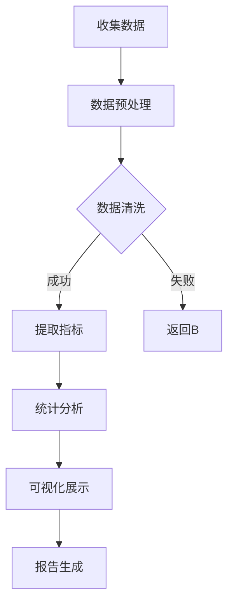
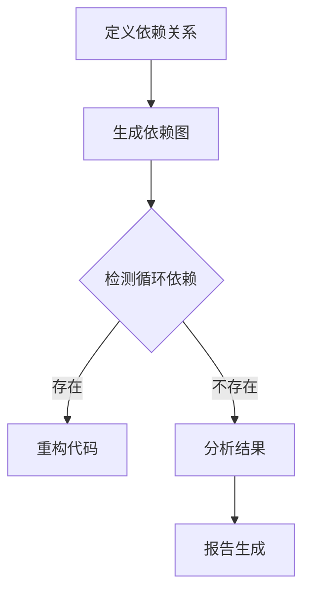
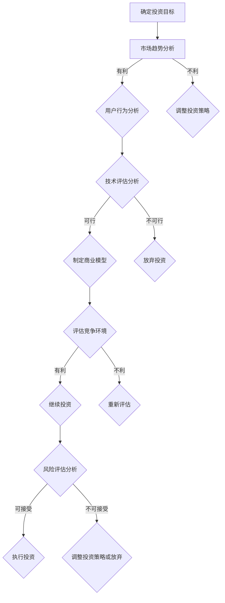
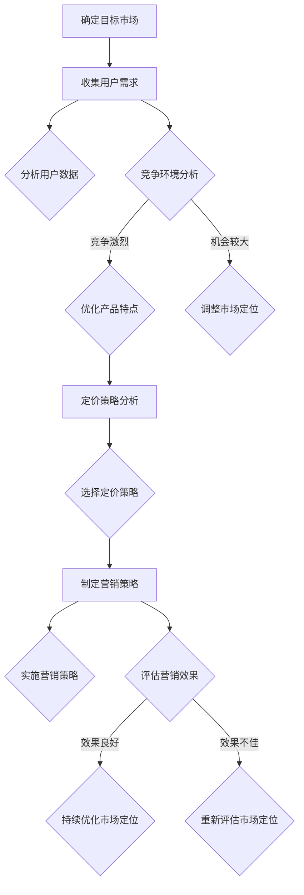
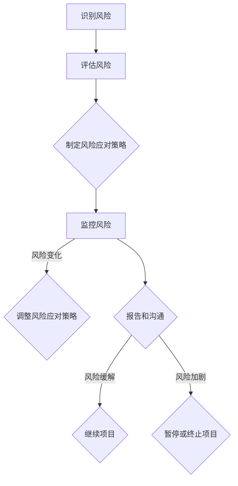

                 

### 《开源项目的商业化数据分析：洞察和决策支持》目录大纲

在这篇文章中，我们将按照以下目录大纲进行详细探讨：

#### 第一部分：开源项目概述与商业化背景

- **第1章：开源项目概述**
  - **1.1 开源运动的起源与发展**
    - 探讨开源运动的起源和它对现代软件工程的影响。
    - 讨论开源项目的基本特征和发展趋势。
  - **1.2 开源项目的核心特征与优势**
    - 描述开源项目的核心特征，如开放性、共享性和协作性。
    - 分析开源项目相对于商业软件的优势。
  - **1.3 商业化与开源项目的关系**
    - 探讨开源项目如何与商业化相结合。
    - 分析开源项目商业化的重要性和潜在收益。

- **第2章：开源项目的商业化背景**
  - **2.1 商业化模型分析**
    - 分析常见的开源项目商业化模式。
    - 探讨不同商业化模型的优势和挑战。
  - **2.2 开源项目商业化面临的主要挑战**
    - 探讨开源项目商业化过程中可能遇到的主要挑战。
    - 提供解决方案和最佳实践。
  - **2.3 商业化成功的案例研究**
    - 分析成功开源项目商业化的案例。
    - 探讨这些案例的商业模式和成功因素。

#### 第二部分：开源项目数据分析

- **第3章：开源项目生命周期分析**
  - **3.1 开源项目生命周期概述**
    - 描述开源项目的生命周期，包括创建、成长、成熟和衰退阶段。
  - **3.2 数据分析在开源项目生命周期中的应用**
    - 探讨如何使用数据分析工具和方法来分析开源项目的生命周期。
    - 分析生命周期各阶段的关键指标。
  - **3.3 开源项目生命周期的 Mermaid 流程图**
    - 使用Mermaid工具绘制开源项目生命周期的流程图。

- **第4章：开源项目社区行为分析**
  - **4.1 社区行为的核心指标**
    - 探讨社区行为分析中的核心指标，如贡献者数量、活跃度、贡献频率等。
  - **4.2 社区行为分析的方法与工具**
    - 分析社区行为分析的方法和工具，如Git日志分析、代码审查等。
  - **4.3 社区行为分析的 Mermaid 流程图**
    - 使用Mermaid工具绘制社区行为分析的流程图。

- **第5章：开源项目性能与稳定性分析**
  - **5.1 性能与稳定性指标**
    - 描述性能和稳定性分析中的关键指标，如响应时间、吞吐量、错误率等。
  - **5.2 性能与稳定性分析的方法**
    - 分析性能和稳定性分析的方法，如负载测试、压力测试等。
  - **5.3 性能与稳定性分析的伪代码**
    - 提供性能和稳定性分析的伪代码示例。

- **第6章：开源项目依赖关系分析**
  - **6.1 依赖关系的概念与类型**
    - 描述依赖关系的概念和不同类型的依赖关系。
  - **6.2 依赖关系分析的方法**
    - 分析依赖关系分析的方法和工具，如依赖图分析等。
  - **6.3 依赖关系分析的 Mermaid 流程图**
    - 使用Mermaid工具绘制依赖关系分析的流程图。

#### 第三部分：商业决策与支持

- **第7章：开源项目投资决策分析**
  - **7.1 投资决策的核心因素**
    - 分析开源项目投资决策中的核心因素。
    - 探讨如何使用数据分析来支持投资决策。
  - **7.2 数据分析在开源项目投资决策中的应用**
    - 提供开源项目投资决策中的数据分析方法。
    - 分析如何通过数据来评估开源项目的潜在价值和风险。
  - **7.3 开源项目投资决策的 Mermaid 流程图**
    - 使用Mermaid工具绘制开源项目投资决策的流程图。

- **第8章：开源项目市场定位分析**
  - **8.1 市场定位的核心要素**
    - 分析开源项目市场定位的核心要素，如目标市场、竞争环境等。
  - **8.2 数据分析在开源项目市场定位中的应用**
    - 提供开源项目市场定位中的数据分析方法。
    - 探讨如何通过数据来识别和定位开源项目的市场机会。
  - **8.3 开源项目市场定位的 Mermaid 流程图**
    - 使用Mermaid工具绘制开源项目市场定位的流程图。

- **第9章：开源项目风险管理**
  - **9.1 风险管理的核心步骤**
    - 描述开源项目风险管理的核心步骤，如风险评估、风险缓解等。
  - **9.2 数据分析在开源项目风险管理中的应用**
    - 分析数据分析在开源项目风险管理中的应用，如风险预测、风险监控等。
  - **9.3 开源项目风险管理的 Mermaid 流程图**
    - 使用Mermaid工具绘制开源项目风险管理的流程图。

#### 第四部分：案例分析与应用

- **第10章：开源项目商业化数据分析实战**
  - **10.1 实战项目背景**
    - 描述开源项目商业化数据分析的实战背景。
  - **10.2 数据分析流程与工具**
    - 分析开源项目商业化数据分析的流程和使用的工具。
  - **10.3 数据分析与商业决策**
    - 探讨如何通过数据分析来支持商业决策。
  - **10.4 源代码实现与解读**
    - 提供开源项目商业化数据分析的源代码实现和解读。

- **第11章：开源项目商业化数据分析的应用场景**
  - **11.1 开源项目商业化数据分析的应用领域**
    - 分析开源项目商业化数据分析的应用领域。
  - **11.2 案例研究**
    - 提供开源项目商业化数据分析的案例研究。
  - **11.3 应用前景与挑战**
    - 探讨开源项目商业化数据分析的应用前景和面临的挑战。

#### 附录

- **附录A：开源项目数据分析工具与资源**
  - **A.1 数据分析工具介绍**
    - 介绍开源项目数据分析中常用的工具。
  - **A.2 资源推荐**
    - 推荐开源项目数据分析相关的资源和文献。

- **附录B：开源项目商业化数据分析公式汇总**
  - **B.1 数学模型与公式**
    - 汇总开源项目商业化数据分析中常用的数学模型和公式。
  - **B.2 举例说明**
    - 提供数学模型和公式的实际应用示例。

- **附录C：开源项目商业化数据分析代码示例**
  - **C.1 代码实现**
    - 提供开源项目商业化数据分析的代码实现。
  - **C.2 代码解读与分析**
    - 分析开源项目商业化数据分析代码的实现原理。

### 接下来，我们将详细探讨第一部分：开源项目概述与商业化背景。我们将从开源运动的起源与发展开始，逐步深入到商业化与开源项目的关系，以及开源项目商业化面临的主要挑战和成功案例研究。通过这一部分的内容，我们将为读者奠定开源项目商业化数据分析的理论基础。### 

### 开源项目概述

#### 1.1 开源运动的起源与发展

开源运动起源于20世纪80年代，其核心思想是鼓励软件开发者将源代码公开，允许用户自由地使用、研究、修改和分发软件。这一运动的起源可以追溯到1983年，当时理查德·斯托曼（Richard Stallman）创建了自由软件基金会（Free Software Foundation，FSF），并发布了GNU项目，旨在创建一套自由的操作系统。随后，1991年，林纳斯·托瓦兹（Linus Torvalds）发布了Linux内核，这标志着开源软件的崛起。

开源运动的快速发展得益于互联网的普及和全球协作的增强。随着互联网的兴起，开发者可以通过网络轻松地共享代码、交流和协作，这极大地促进了开源项目的发展。开源软件不仅吸引了大量的志愿者参与，还吸引了众多企业和机构的支持。如今，开源已经成为软件开发的常态，许多著名的软件，如Linux、Apache、MySQL、Mozilla Firefox等，都是开源项目的成功案例。

开源项目的基本特征和发展趋势包括以下几个方面：

1. **开放性**：开源项目的源代码是公开的，用户可以自由地获取、阅读和修改。这种开放性鼓励了知识的共享和创新。

2. **共享性**：开源项目鼓励用户共享代码和改进，这使得项目可以在全球范围内快速迭代和发展。

3. **协作性**：开源项目通常依赖于一个活跃的社区，成员可以共同合作，共同维护和改进项目。

4. **可持续性**：开源项目的成功往往依赖于社区的持续贡献和支持，这种可持续性为项目的长期发展提供了保障。

5. **多样性**：开源项目涵盖了许多不同的领域和用途，从操作系统到Web服务器，从数据库到开发工具，满足了广泛的需求。

开源项目的发展趋势也体现在以下几个方面：

1. **商业模式的探索**：随着开源项目的普及，越来越多的企业开始将开源作为其商业模式的一部分，通过提供付费的支持和服务来盈利。

2. **开源与商业软件的融合**：许多商业软件公司开始采用开源的方式开发软件，同时提供商业支持和服务，这种模式在业内被称为“开源商业模式”。

3. **开源社区的国际化**：开源社区越来越国际化，开发者可以来自世界各地，这种多样性促进了技术的全球传播。

4. **开源生态系统的发展**：随着开源项目的增多，相关的工具、服务和培训也逐渐发展起来，形成了一个完整的开源生态系统。

#### 1.2 开源项目的核心特征与优势

开源项目的核心特征和优势如下：

1. **开放性**：开源项目的源代码是公开的，用户可以自由地查看和修改。这种开放性使得开源项目能够接受全球开发者的贡献，促进了技术的进步和创新。

2. **共享性**：开源项目鼓励用户共享代码和改进，这使得项目可以在全球范围内快速迭代和发展。共享性也促进了知识的传播和技能的提升。

3. **协作性**：开源项目依赖于一个活跃的社区，成员可以共同合作，共同维护和改进项目。协作性增强了团队的凝聚力，提高了项目的质量和效率。

4. **可持续性**：开源项目的成功往往依赖于社区的持续贡献和支持，这种可持续性为项目的长期发展提供了保障。社区成员的积极参与和持续的改进使得项目能够不断进步。

5. **低成本**：开源项目通常不需要用户支付费用，这使得用户可以低成本地获取和使用高质量的软件。对于企业和机构来说，使用开源软件可以降低成本，提高效率。

6. **灵活性和定制性**：开源项目允许用户根据自己的需求进行定制和修改，这为用户提供了更大的灵活性和定制性。

7. **透明度和信任**：开源项目的源代码是公开的，用户可以清晰地了解软件的实现方式和潜在的风险。这种透明度增加了用户的信任，降低了信任成本。

#### 1.3 商业化与开源项目的关系

开源项目与商业化之间的关系是复杂且多样的。一方面，开源项目可以为商业公司提供创新的原动力和市场机会；另一方面，商业公司可以通过支持开源项目来扩大其市场影响力。以下是一些关键点：

1. **商业模式**：许多公司通过提供付费的支持和服务来商业化开源项目。这种模式被称为“开源商业模式”，是近年来企业采用开源策略的一种常见方式。

2. **市场机会**：开源项目可以作为一种营销工具，吸引潜在客户，并建立品牌信誉。通过开源项目，企业可以与开发者社区建立联系，从而获取市场反馈和用户建议。

3. **生态系统建设**：商业公司可以通过开源项目来建立生态系统，吸引第三方开发者、服务提供商和用户加入，共同推动项目的进步。

4. **知识产权保护**：商业公司通过开源项目可以保护其核心知识产权，同时利用社区的力量来扩展其技术边界。

5. **技术合作与竞争**：开源项目促进了技术合作，但同时也可能引发竞争。商业公司需要平衡开源项目中的合作与竞争关系，以实现自身利益最大化。

6. **社区管理与参与**：商业公司需要积极参与开源社区，建立良好的社区关系，以便更好地理解和满足用户需求。

开源项目与商业化之间的关系是一个不断发展和演变的过程。理解这一关系对于企业和开发者来说都是至关重要的，它不仅影响了项目的成功，也影响了整个开源生态系统的发展。### 

#### 1.2 开源项目的核心特征与优势

开源项目具有以下几个核心特征与优势，这些特性使得开源项目在技术发展和商业应用中具有独特的地位：

1. **开放性**：开源项目的一个重要特征是其源代码的公开性。用户可以自由地获取、阅读、修改和分发源代码。这种开放性不仅促进了技术的透明化，还为用户提供了极大的灵活性和定制空间。用户可以根据自身需求对项目进行定制，或者直接贡献自己的代码，从而推动项目的持续改进。

2. **共享性**：开源项目鼓励共享，用户不仅可以使用软件，还可以研究和改进它。这种共享性促进了知识的传播和技能的提升，有助于建立一个更加紧密的开发者社区。开发者可以在不同的项目中学习新技术和解决方案，从而提高整个行业的水平。

3. **协作性**：开源项目通常依赖于一个活跃的社区，社区成员通过协作来维护和改进项目。这种协作性不仅提高了项目的开发效率，还增强了团队的凝聚力。开发者之间的合作和交流有助于解决复杂的技术问题，推动项目的快速迭代。

4. **可持续性**：开源项目的成功往往依赖于社区的持续贡献和支持。一个健康、活跃的社区可以确保项目的长期发展。社区的成员可能会因为兴趣、职业发展或者商业利益而持续贡献，从而为项目注入新的活力和动力。

5. **低成本**：开源软件通常是免费的，用户可以无成本地获取和使用高质量的软件。这对企业和个人来说都是一个巨大的优势。企业可以利用开源软件来降低成本、提高效率，同时也有足够的资源来专注于核心业务。

6. **灵活性和定制性**：开源项目允许用户根据自己的需求进行定制和修改。这种灵活性使得开源软件能够适应各种不同的应用场景和需求。用户可以根据自己的特定需求调整软件的功能和性能，从而实现最佳的使用效果。

7. **透明度和信任**：开源项目的源代码是公开的，用户可以清晰地了解软件的实现方式和潜在的风险。这种透明度增加了用户的信任，降低了信任成本。用户可以查看代码的细节，确保软件的质量和安全性，从而更加放心地使用开源软件。

8. **技术社区的支持**：开源项目通常有一个活跃的社区，社区成员不仅提供技术支持，还积极参与项目的开发和改进。这种社区支持为开源项目提供了宝贵的资源，包括技术知识、使用案例和最佳实践。

9. **市场竞争力**：开源项目可以作为企业的市场竞争力之一。通过开源项目，企业可以展示其技术实力和创新能力，吸引潜在客户和合作伙伴。开源项目还可以帮助企业建立品牌声誉，增强市场影响力。

10. **创新加速**：开源项目的开放性和协作性促进了技术的创新和加速发展。开发者可以快速共享和迭代新的想法和解决方案，从而推动技术的不断进步。

总之，开源项目的核心特征和优势使其在技术发展和商业应用中具有独特的地位。理解这些特性和优势，不仅有助于开发者更好地参与开源项目，也有助于企业在商业环境中充分利用开源项目的价值。### 

#### 1.3 商业化与开源项目的关系

开源项目与商业化的关系是复杂且多元的。一方面，开源项目为商业公司提供了创新的机遇和市场空间；另一方面，商业公司也通过开源项目来扩大其影响力，建立生态系统，并保护其知识产权。

**商业模式分析**：

1. **支持与服务**：这是最常见的开源商业模式，企业通过提供技术支持、咨询服务和培训来盈利。这些服务通常是基于开源软件的，企业通过这些服务为用户提供增值。

2. **商业友好的许可**：一些开源项目采用商业友好的许可协议，如Apache License和GNU General Public License (GPL)。这些许可允许企业在开源软件的基础上进行商业活动，但通常要求企业在某些情况下共享其修改的代码。

3. **产品捆绑**：企业可以将开源软件与商业产品捆绑销售，为用户提供完整的解决方案。这种方式通常适用于需要集成开源组件的企业级应用。

4. **开源收购**：企业通过收购开源项目，将项目纳入其产品线，并通过提供增值服务来盈利。这种方式可以快速增强企业的技术实力和市场影响力。

**开源项目商业化面临的主要挑战**：

1. **盈利模式不明确**：开源项目的免费特性使得企业难以直接通过销售软件来盈利。因此，企业需要找到合适的盈利模式，如上述支持与服务、商业友好的许可等。

2. **知识产权保护**：开源项目通常要求共享代码，这可能导致企业的核心知识产权外泄。企业需要制定合适的知识产权策略，以保护其商业利益。

3. **市场竞争**：开源项目吸引了大量的开发者参与，这可能导致激烈的市场竞争。企业需要不断创新，以保持其市场地位。

4. **社区管理**：开源项目通常依赖于社区的贡献，企业需要有效地管理社区，确保项目的健康发展和持续创新。

**商业化成功的案例研究**：

1. **Red Hat**：Red Hat是一家知名的开源软件企业，通过提供基于Linux的支持和服务，成功实现了商业化。Red Hat不仅为开源项目提供了强大的支持，还通过收购其他开源项目来扩大其产品线。

2. **Eclipse Foundation**：Eclipse是一个著名的开源项目，由多家企业共同支持。通过提供培训、支持和咨询服务，Eclipse Foundation实现了商业化，并在全球范围内建立了庞大的开发者社区。

3. **MongoDB**：MongoDB是一个开源的NoSQL数据库，通过提供商业支持和订阅服务，MongoDB公司实现了商业化。MongoDB公司还不断投资于开源社区，以保持其在技术领域的领先地位。

这些成功案例表明，开源项目可以通过多种方式实现商业化。理解这些商业模式和挑战，对于企业来说至关重要，它有助于企业更好地利用开源项目的价值，实现可持续发展。### 

## 第2章 开源项目的商业化背景

开源项目的商业化是一个充满机遇和挑战的过程。在这一章中，我们将深入探讨开源项目的商业化背景，分析常见的商业化模型，探讨开源项目商业化过程中面临的主要挑战，并通过成功案例研究来展示商业化路径。

### 2.1 商业化模型分析

开源项目的商业化模型多种多样，以下是一些常见的商业化方式：

1. **支持与服务**：这是最直接的商业化方式。企业通过提供技术支持、咨询服务和培训来盈利。这些服务通常基于开源软件，为企业用户提供额外的价值。例如，Red Hat通过提供Linux操作系统及其相关服务的支持来盈利。

2. **商业友好的许可**：一些开源项目采用商业友好的许可协议，如Apache License和GNU General Public License (GPL)。这些许可允许企业在开源软件的基础上进行商业活动，但通常要求企业在某些情况下共享其修改的代码。这种方式为企业提供了商业机会，同时也保持了开源的核心价值。

3. **产品捆绑**：企业可以将开源软件与商业产品捆绑销售，为用户提供完整的解决方案。这种方式适用于需要集成开源组件的企业级应用。例如，许多企业会将开源数据库（如MySQL）与他们的企业级产品捆绑销售。

4. **开源收购**：企业通过收购开源项目，将其纳入产品线，并通过提供增值服务来盈利。这种方式可以快速增强企业的技术实力和市场影响力。例如，Oracle通过收购MySQL AB来扩大其在数据库市场的份额。

5. **订阅模式**：企业可以提供基于开源软件的订阅服务，用户通过支付订阅费用来获取软件的更新和支持。这种模式在SaaS（软件即服务）领域非常流行。例如，MongoDB通过提供数据库的订阅服务来盈利。

6. **广告和赞助**：一些开源项目通过展示广告或接受赞助来获取收入。这种方式通常适用于那些拥有大量用户和流量的开源项目。例如，GitHub通过展示广告和接受企业赞助来盈利。

### 2.2 开源项目商业化面临的主要挑战

尽管开源项目提供了巨大的商业潜力，但商业化过程中仍然面临许多挑战：

1. **盈利模式不明确**：开源项目的免费特性使得企业难以直接通过销售软件来盈利。因此，企业需要寻找创新的盈利模式，如支持与服务、商业友好的许可等。

2. **知识产权保护**：开源项目要求共享代码，这可能导致企业的核心知识产权外泄。企业需要制定合适的知识产权策略，以保护其商业利益。

3. **市场竞争**：开源项目吸引了大量的开发者参与，这可能导致激烈的市场竞争。企业需要不断创新，以保持其市场地位。

4. **社区管理**：开源项目通常依赖于社区的贡献，企业需要有效地管理社区，确保项目的健康发展和持续创新。

5. **品牌声誉**：开源项目需要建立良好的品牌声誉，以吸引开发者用户和企业用户。企业的商业行为必须与开源精神保持一致，以避免损害项目的声誉。

6. **商业可持续性**：企业需要确保开源项目的商业化能够带来长期的商业收益，而不仅仅是短期利益。

### 2.3 商业化成功的案例研究

开源项目商业化的成功案例不仅展示了商业化的可能性，还为其他企业提供了借鉴和参考。以下是一些成功的案例研究：

1. **Red Hat**：Red Hat是开源软件商业化最成功的案例之一。Red Hat通过提供Linux操作系统的支持和咨询服务来盈利。Red Hat的成功在于其强大的社区管理能力和对开源项目的持续投资。通过收购其他开源项目，Red Hat不断扩大其产品线，增强了市场竞争力。

2. **Eclipse Foundation**：Eclipse是一个由多家企业支持的著名开源项目。Eclipse Foundation通过提供培训、支持和咨询服务来盈利。Eclipse的成功在于其广泛的社区支持和企业参与，这些因素共同促进了项目的持续发展和商业化。

3. **MongoDB**：MongoDB是一个开源的NoSQL数据库。MongoDB公司通过提供数据库的订阅服务来盈利。MongoDB的成功在于其不断创新和对开源社区的积极投资，这使得MongoDB在NoSQL数据库市场中占据了重要地位。

4. **WordPress**：WordPress是一个开源的博客平台。WordPress通过提供商业服务，如托管、主题开发和插件开发，来盈利。WordPress的成功在于其易用性和强大的生态系统，这使得WordPress成为全球最受欢迎的博客平台之一。

这些成功案例表明，开源项目可以通过多种方式实现商业化。理解这些商业模式和挑战，对于企业来说至关重要，它有助于企业更好地利用开源项目的价值，实现可持续发展。### 

### 第3章 开源项目生命周期分析

开源项目的生命周期是一个复杂的过程，从项目的诞生到衰退，每个阶段都有其独特的特点和关键指标。通过分析开源项目的生命周期，我们可以更好地理解项目的发展趋势，为项目的管理和决策提供数据支持。

#### 3.1 开源项目生命周期概述

开源项目的生命周期通常可以分为以下几个阶段：

1. **创建阶段**：这是项目的初始阶段，通常由一位或多位开发者发起。在这一阶段，项目的基本框架和核心功能被建立，社区开始逐渐形成。

2. **成长阶段**：随着项目的不断完善和功能的增加，社区的参与度也逐渐提高。项目的用户基础开始扩大，贡献者数量增加，项目的知名度逐步提升。

3. **成熟阶段**：在成熟阶段，项目已经相对稳定，功能丰富，社区也非常活跃。这个阶段是项目发展的巅峰，项目的影响力和用户基础都达到了高峰。

4. **衰退阶段**：随着时间的推移，项目的活跃度可能会下降，贡献者逐渐减少，用户流失。如果项目不能在衰退阶段进行有效的调整和改进，可能会最终走向衰退。

每个阶段都有其特定的挑战和机会，通过数据分析，我们可以更准确地把握项目在不同阶段的表现，从而为项目提供有效的管理和决策支持。

#### 3.2 数据分析在开源项目生命周期中的应用

数据分析在开源项目生命周期的每个阶段都有着广泛的应用：

1. **创建阶段**：

   - **用户增长分析**：通过分析用户增长数据，我们可以了解项目的受欢迎程度和潜在用户基础。常用的指标包括注册用户数、下载量、活跃用户数等。
   - **贡献者分析**：了解项目的贡献者情况，包括贡献者数量、活跃度、贡献频率等，可以帮助我们评估项目的社区建设和活跃度。

2. **成长阶段**：

   - **功能演进分析**：通过分析项目功能的演进情况，我们可以了解项目的发展趋势和用户需求的变化。常用的指标包括功能新增数、功能变更频率等。
   - **社区活跃度分析**：通过分析社区活跃度指标，如issue数量、PR（Pull Request）数量、讨论帖数量等，我们可以了解社区的参与情况和项目的健康程度。

3. **成熟阶段**：

   - **用户留存分析**：通过分析用户留存率，我们可以了解项目的用户粘性。常用的指标包括激活率、流失率等。
   - **性能分析**：通过分析项目的性能指标，如响应时间、吞吐量、错误率等，我们可以评估项目的稳定性和可靠性。

4. **衰退阶段**：

   - **社区衰退分析**：通过分析社区活跃度指标，如贡献者数量、活动频率等，我们可以了解社区的衰退情况。
   - **项目健康度评估**：通过分析项目的依赖关系、技术债务等指标，我们可以评估项目的健康度，并提出改进建议。

#### 3.3 开源项目生命周期的 Mermaid 流程图

为了更好地理解开源项目的生命周期，我们可以使用Mermaid工具绘制一个简化的流程图。以下是一个开源项目生命周期的Mermaid流程图示例：

```mermaid
graph TD
    A[创建阶段] --> B[成长阶段]
    B --> C[成熟阶段]
    C --> D[衰退阶段]
    A -->|初始框架| B
    B -->|功能完善| C
    C -->|用户反馈| D
    D -->|社区衰退|
```

在这个流程图中，A代表创建阶段，B代表成长阶段，C代表成熟阶段，D代表衰退阶段。每个阶段都有其特定的任务和目标，通过分析这些任务和目标的实现情况，我们可以更好地管理项目，确保项目的健康和持续发展。

通过这一部分的内容，我们不仅了解了开源项目的生命周期和数据分析在生命周期中的应用，还通过Mermaid流程图展示了项目的发展过程。接下来，我们将深入探讨开源项目社区行为分析，分析社区行为的核心指标，探讨社区行为分析的方法与工具，并使用Mermaid流程图展示分析过程。这将帮助我们更好地理解开源项目社区的动态，为项目管理和决策提供有力支持。### 

## 第4章 开源项目社区行为分析

开源项目社区是项目成功的关键因素之一。社区行为分析能够揭示社区成员的参与模式、贡献趋势和协作效果，为项目管理和决策提供宝贵的数据支持。本章将深入探讨开源项目社区行为分析的核心指标、常用方法和工具，并通过Mermaid流程图展示分析过程。

### 4.1 社区行为分析的核心指标

开源项目社区行为分析的核心指标包括以下几个方面：

1. **贡献者数量**：贡献者数量是衡量社区活跃度的一个重要指标。高贡献者数量通常意味着项目有更多的力量推动其发展。

2. **贡献频率**：贡献频率反映了贡献者的活跃程度。通过分析贡献频率，我们可以了解哪些贡献者最为活跃，哪些阶段贡献最为集中。

3. **代码质量**：代码质量是开源项目的重要指标之一。通过静态代码分析和代码审查，我们可以评估代码的质量，及时发现和修复潜在的问题。

4. **问题反馈和解决率**：问题反馈和解决率反映了社区的沟通效率和问题的解决能力。高解决率通常意味着社区成员之间的协作良好，问题得到及时解决。

5. **社区活跃度**：社区活跃度可以通过论坛帖子、邮件列表讨论、GitHub议题（issue）和Pull Request（PR）等指标来衡量。高活跃度表明社区成员积极参与，项目发展势头良好。

6. **代码贡献分布**：代码贡献分布可以展示不同贡献者对项目的贡献比例，帮助我们了解社区的协作模式和贡献结构。

### 4.2 社区行为分析的方法与工具

社区行为分析的方法和工具多种多样，以下是一些常用的方法和工具：

1. **Git日志分析**：Git日志记录了所有代码提交的信息，包括提交者、提交时间和提交的文件。通过分析Git日志，我们可以获取贡献者数量、贡献频率和代码贡献分布等指标。

2. **代码审查工具**：代码审查工具如Gerrit和Phabricator可以帮助我们分析代码质量，评估代码的稳定性和可靠性。

3. **社区讨论平台分析**：社区讨论平台如GitHub Issues、GitLab Issues和Reddit等可以提供丰富的社区讨论数据。通过分析这些数据，我们可以了解社区的活跃度和问题反馈情况。

4. **可视化工具**：可视化工具如Gephi和D3.js可以帮助我们将社区行为分析的结果进行可视化展示，使数据更加直观易懂。

5. **统计分析工具**：统计分析工具如R和Python的pandas库可以帮助我们进行复杂的统计分析，提取关键指标和趋势。

### 4.3 社区行为分析的 Mermaid 流程图

为了更好地展示社区行为分析的过程，我们可以使用Mermaid工具绘制一个流程图。以下是一个简化的社区行为分析流程图：



在这个流程图中，A代表数据收集阶段，B代表数据预处理，C是数据清洗阶段，D是提取指标，F是统计分析，G是可视化展示，H是报告生成。通过这个流程，我们可以系统地分析开源项目社区行为，为项目管理和决策提供支持。

通过本章的内容，我们不仅了解了开源项目社区行为分析的核心指标和方法，还通过Mermaid流程图展示了分析过程。接下来，我们将探讨开源项目性能与稳定性分析，包括性能与稳定性指标的定义、分析方法以及伪代码示例。这将帮助我们更好地评估和优化开源项目的性能，确保其稳定性和可靠性。### 

## 第5章 开源项目性能与稳定性分析

开源项目的性能和稳定性是其成功的关键因素之一。性能指标反映了项目的响应速度和处理能力，而稳定性指标则评估了项目在长时间运行中的可靠性和故障率。通过分析性能与稳定性，我们可以发现潜在的问题，优化代码，提高用户体验。本章将介绍性能与稳定性指标、分析方法以及使用伪代码进行详细阐述。

### 5.1 性能与稳定性指标

在开源项目中，性能与稳定性分析涉及以下关键指标：

1. **响应时间**：响应时间是指系统从接收请求到返回响应所需的时间。低响应时间是性能良好的标志。
2. **吞吐量**：吞吐量是指系统在单位时间内处理请求的数量。高吞吐量意味着系统能够高效地处理大量请求。
3. **并发用户数**：并发用户数是指同时使用系统的用户数量。这个指标可以反映系统的负载能力。
4. **错误率**：错误率是指系统处理请求时出现错误的频率。低错误率是稳定性的重要指标。
5. **资源利用率**：资源利用率包括CPU、内存、网络等资源的使用情况。高效的资源利用可以提升系统的性能。
6. **可用性**：可用性是指系统能够正常运行的时间比例。高可用性意味着系统在长时间运行中很少出现故障。

### 5.2 性能与稳定性分析的方法

性能与稳定性分析通常采用以下几种方法：

1. **负载测试**：负载测试是模拟真实用户行为，评估系统在高负载下的性能表现。通过逐步增加负载，我们可以观察到系统的响应时间、吞吐量和错误率等指标的变化。
2. **压力测试**：压力测试是评估系统在极端负载下的表现。与负载测试不同，压力测试通常使用更高的负载，以测试系统的极限性能和稳定性。
3. **基准测试**：基准测试是使用标准化的测试用例，评估系统在不同硬件和软件环境下的性能。通过对比不同系统的基准测试结果，可以找出性能瓶颈。
4. **性能监控**：性能监控是实时收集系统性能数据，如CPU使用率、内存使用率等。通过监控工具，我们可以及时发现性能问题并采取措施。
5. **日志分析**：日志分析是通过分析系统的日志文件，找出性能问题和故障原因。通过日志分析，我们可以识别出系统在运行过程中出现的异常行为。

### 5.3 性能与稳定性分析的伪代码

以下是一个简单的伪代码示例，用于分析开源项目的性能与稳定性：

```python
# 伪代码：开源项目性能与稳定性分析

# 初始化测试环境
initialize_test_environment()

# 执行负载测试
while load < maximum_load:
    # 发送请求
    send_request()
    
    # 记录响应时间和错误率
    response_time = measure_response_time()
    error_rate = calculate_error_rate()
    
    # 增加负载
    load += incremental_load
    
    # 如果出现异常，记录日志并中断测试
    if error_rate > threshold:
        log_error()
        break

# 执行压力测试
while true:
    # 发送高负载请求
    send_high_load_request()
    
    # 记录响应时间和错误率
    response_time = measure_response_time()
    error_rate = calculate_error_rate()
    
    # 如果系统崩溃或响应时间过长，记录日志并中断测试
    if system_crashed() or response_time > threshold:
        log_error()
        break

# 执行基准测试
benchmark_results = execute_benchmarks()

# 性能监控
while true:
    # 收集性能数据
    cpu_usage = measure_cpu_usage()
    memory_usage = measure_memory_usage()
    network_usage = measure_network_usage()
    
    # 如果性能指标超过阈值，记录日志并通知管理员
    if cpu_usage > threshold or memory_usage > threshold or network_usage > threshold:
        log_performance_issue()
        notify_admin()

# 日志分析
log_files = collect_log_files()
analyzed_logs = analyze_logs(log_files)

# 输出分析结果
print("Performance and Stability Analysis Results:")
print(analyzed_logs)
```

在这个伪代码中，我们初始化了测试环境，并依次执行了负载测试、压力测试和基准测试。同时，我们还进行了性能监控和日志分析，以全面评估项目的性能和稳定性。通过这个伪代码，我们可以了解到性能与稳定性分析的基本流程和关键步骤。

通过本章的内容，我们不仅了解了开源项目性能与稳定性分析的关键指标和方法，还通过伪代码展示了分析过程。接下来，我们将探讨开源项目依赖关系分析，包括依赖关系的概念与类型、分析方法以及使用Mermaid流程图进行展示。这将帮助我们更好地理解和管理开源项目的依赖关系。### 

### 第6章 开源项目依赖关系分析

开源项目依赖关系分析是确保项目稳定性和可维护性的关键环节。通过分析项目依赖，我们可以了解项目中各组件之间的依赖关系，避免潜在的冲突和错误，提高项目的整体质量和可维护性。本章将详细介绍依赖关系的概念与类型、依赖关系分析的方法，并使用Mermaid流程图展示分析过程。

#### 6.1 依赖关系的概念与类型

依赖关系是指一个组件（如模块、库或服务）对另一个组件的依赖，以便正常工作或实现特定功能。在开源项目中，依赖关系通常分为以下几种类型：

1. **直接依赖**：直接依赖是指一个组件明确地依赖于另一个组件。例如，如果项目A依赖于项目B，那么项目A必须包含项目B的代码或库，才能正常工作。

2. **间接依赖**：间接依赖是指一个组件通过另一个组件间接依赖于另一个组件。例如，如果项目A依赖于项目B，而项目B又依赖于项目C，那么项目A间接依赖于项目C。

3. **强依赖**：强依赖是指组件之间的依赖关系紧密，一旦一个组件发生变化，另一个组件也必须相应地更新。例如，如果项目A依赖于项目B的特定版本，那么任何对项目B的更改都可能影响项目A。

4. **弱依赖**：弱依赖是指组件之间的依赖关系较弱，一个组件可以独立于另一个组件进行更新。例如，如果项目A依赖于项目B的一个API，但项目B的内部实现没有改变，那么项目A不需要更新。

5. **循环依赖**：循环依赖是指两个或多个组件相互依赖，形成循环结构。这种依赖关系会导致编译或运行时错误，必须通过重构代码来解决。

#### 6.2 依赖关系分析的方法

依赖关系分析的方法和工具可以帮助我们识别和管理项目中的依赖关系。以下是一些常用的方法和工具：

1. **静态依赖分析**：静态依赖分析是在编译或运行前分析代码中的依赖关系。常用的工具包括Maven依赖树、Gradle依赖图等。

2. **动态依赖分析**：动态依赖分析是在编译或运行时分析代码中的依赖关系。这种方法可以捕获运行时产生的依赖关系，但分析结果可能不如静态分析精确。

3. **依赖图分析**：依赖图分析是通过绘制依赖关系图来可视化项目中的依赖结构。常用的工具包括Gephi、Neo4j等。

4. **工具集成**：许多构建工具和IDE（集成开发环境）内置了依赖关系分析功能，如Maven的dependency:tree命令、Eclipse的Project Dependencies视图等。

#### 6.3 依赖关系分析的 Mermaid 流程图

为了更好地展示依赖关系分析的过程，我们可以使用Mermaid工具绘制一个流程图。以下是一个简化的依赖关系分析流程图：



在这个流程图中，A代表定义依赖关系，B代表生成依赖图，C是检测循环依赖，D是重构代码（如果存在循环依赖），E是分析结果，F是报告生成。通过这个流程，我们可以系统地分析项目的依赖关系，确保项目的稳定性和可维护性。

通过本章的内容，我们不仅了解了开源项目依赖关系的概念与类型，还通过Mermaid流程图展示了依赖关系分析的过程。依赖关系分析对于确保项目的稳定性、可维护性和扩展性至关重要。在下一章中，我们将探讨开源项目投资决策分析，包括投资决策的核心因素、数据分析的应用以及投资决策流程图。这将帮助我们更好地理解如何通过数据分析来支持开源项目的投资决策。### 

### 第7章 开源项目投资决策分析

在开源项目中，投资决策是确保项目可持续发展的关键环节。合理的投资决策可以促进项目的成长和商业化，而错误的投资决策则可能导致资源浪费和项目停滞。本章将探讨开源项目投资决策的核心因素，分析如何使用数据分析支持投资决策，并通过Mermaid流程图展示投资决策的步骤。

#### 7.1 投资决策的核心因素

开源项目投资决策涉及多个核心因素，这些因素共同影响着项目的投资回报率（ROI）和风险。以下是投资决策中需要考虑的关键因素：

1. **市场需求**：市场需求是决定项目成功与否的关键因素。通过对市场趋势、用户需求和竞争环境的分析，可以评估项目的市场潜力。

2. **技术可行性**：技术可行性涉及项目的开发难度、所需技术资源和现有技术基础。评估技术可行性可以帮助确定项目是否值得投资。

3. **项目成熟度**：项目成熟度是指项目的开发进度、功能完善度和用户基础。成熟度较高的项目通常更容易获得投资和用户支持。

4. **社区活跃度**：社区活跃度反映了开源项目的社区健康程度。活跃的社区意味着更多的贡献者、用户和反馈，这有助于项目的长期发展。

5. **商业模型**：商业模型是开源项目商业化的重要基础。合理的商业模型可以确保项目在实现社会价值的同时，实现经济效益。

6. **竞争环境**：竞争环境包括直接竞争者和潜在竞争者。分析竞争环境可以帮助投资者了解项目的市场定位和竞争优势。

7. **风险因素**：风险因素包括技术风险、市场风险、法律风险等。对风险因素的分析可以帮助投资者评估项目的风险水平，并制定相应的风险应对策略。

#### 7.2 数据分析在开源项目投资决策中的应用

数据分析在开源项目投资决策中发挥着重要作用。以下是一些常见的数据分析方法：

1. **市场趋势分析**：通过分析市场数据，如用户增长、市场占有率、行业趋势等，可以预测项目的市场前景。

2. **用户行为分析**：通过分析用户行为数据，如访问量、下载量、活跃度等，可以了解用户需求和使用习惯。

3. **技术评估分析**：通过分析项目的技术架构、代码质量、社区贡献等数据，可以评估项目的技术可行性和成熟度。

4. **竞争环境分析**：通过分析竞争者的产品、市场表现、用户评价等数据，可以了解竞争环境和项目的竞争优势。

5. **风险评估分析**：通过分析项目的风险因素，如代码质量、市场波动、法律纠纷等，可以评估项目的风险水平。

#### 7.3 开源项目投资决策的 Mermaid 流程图

为了更好地展示开源项目投资决策的过程，我们可以使用Mermaid工具绘制一个流程图。以下是一个简化的开源项目投资决策流程图：



在这个流程图中，A代表确定投资目标，B是市场趋势分析，C是用户行为分析，D是调整投资策略，E是技术评估分析，F是制定商业模型，G是放弃投资，H是评估竞争环境，I是继续投资，J是重新评估，K是风险评估分析，L是执行投资，M是调整投资策略或放弃。通过这个流程，投资者可以系统地分析开源项目，制定合理的投资决策。

通过本章的内容，我们探讨了开源项目投资决策的核心因素，分析了如何使用数据分析支持投资决策，并通过Mermaid流程图展示了投资决策的过程。理解这些因素和过程对于投资者来说至关重要，它有助于确保投资决策的科学性和有效性，从而推动开源项目的可持续发展。### 

## 第8章 开源项目市场定位分析

开源项目的市场定位分析是确保项目在竞争激烈的环境中脱颖而出、实现商业成功的关键步骤。市场定位分析旨在确定项目的目标市场、了解竞争环境，并制定有效的市场营销策略。本章将探讨市场定位的核心要素，分析如何使用数据分析来支持市场定位，并通过Mermaid流程图展示市场定位的步骤。

### 8.1 市场定位的核心要素

开源项目的市场定位需要考虑以下核心要素：

1. **目标市场**：目标市场是指项目希望吸引和服务的用户群体。确定目标市场有助于项目更好地满足用户需求，提高市场竞争力。

2. **用户需求**：了解目标市场的用户需求是市场定位的基础。通过用户调研、访谈、问卷调查等方式，可以收集用户需求数据，为项目定位提供依据。

3. **竞争环境**：分析竞争环境可以帮助项目了解竞争对手的优势和劣势，找到自身的市场机会。竞争环境分析包括竞争对手的产品特点、市场份额、用户评价等。

4. **产品特点**：明确项目的特点和价值主张是市场定位的重要一环。项目需要突出其独特性、优势和价值，以吸引潜在用户。

5. **定价策略**：合理的定价策略可以增强项目的市场吸引力。定价策略需要考虑目标市场的支付能力和项目的成本结构。

6. **营销策略**：有效的营销策略可以提升项目的知名度和用户参与度。营销策略包括内容营销、社交媒体推广、广告投放等。

### 8.2 数据分析在开源项目市场定位中的应用

数据分析在开源项目市场定位中发挥着重要作用。以下是一些常见的数据分析方法：

1. **用户数据分析**：通过分析用户数据，如用户行为、访问量、下载量、活跃度等，可以了解用户需求和行为模式，为市场定位提供依据。

2. **市场趋势分析**：通过分析市场数据，如行业趋势、用户增长率、市场规模等，可以预测市场前景，指导项目定位。

3. **竞争环境分析**：通过分析竞争对手的数据，如产品特点、市场份额、用户评价等，可以了解竞争环境，为项目定位提供参考。

4. **定价分析**：通过分析不同定价策略的效果，如成本加成定价、价值定价、竞争定价等，可以确定最合适的定价策略。

5. **营销效果分析**：通过分析营销活动的数据，如点击率、转化率、投资回报率（ROI）等，可以评估营销策略的效果，为调整市场定位提供依据。

### 8.3 开源项目市场定位的 Mermaid 流程图

为了更好地展示开源项目市场定位的过程，我们可以使用Mermaid工具绘制一个流程图。以下是一个简化的开源项目市场定位流程图：



在这个流程图中，A代表确定目标市场，B是收集用户需求，C是分析用户数据，D是竞争环境分析，E是优化产品特点，F是调整市场定位，G是定价策略分析，H是选择定价策略，I是制定营销策略，J是实施营销策略，K是评估营销效果，L是持续优化市场定位，M是重新评估市场定位。通过这个流程，项目团队可以系统地分析市场定位的各个方面，制定和调整市场定位策略。

通过本章的内容，我们探讨了开源项目市场定位的核心要素，分析了如何使用数据分析来支持市场定位，并通过Mermaid流程图展示了市场定位的过程。理解市场定位对于项目团队来说至关重要，它有助于项目更好地满足用户需求，提高市场竞争力，实现商业成功。### 

### 第9章 开源项目风险管理

开源项目在发展过程中面临着多种风险，这些风险可能影响项目的稳定性、可靠性以及商业价值。因此，有效的风险管理对于开源项目的成功至关重要。本章将探讨开源项目风险管理的核心步骤，分析如何使用数据分析来支持风险管理，并通过Mermaid流程图展示风险管理的步骤。

#### 9.1 风险管理的核心步骤

开源项目风险管理通常包括以下核心步骤：

1. **识别风险**：识别风险是风险管理的第一步。项目团队需要识别可能影响项目的风险，包括技术风险、市场风险、法律风险、运营风险等。

2. **评估风险**：在识别风险后，需要对每个风险进行评估，确定其可能性和影响程度。评估风险可以帮助项目团队了解哪些风险需要优先处理。

3. **制定风险应对策略**：根据评估结果，项目团队需要制定相应的风险应对策略，包括风险规避、风险转移、风险减轻等。

4. **监控风险**：风险管理不是一次性的过程，项目团队需要持续监控风险，确保风险应对策略的有效性。

5. **报告和沟通**：及时报告和沟通风险对于项目的透明度和团队的协作至关重要。项目团队需要定期向利益相关者报告风险状况，确保各方了解项目风险。

#### 9.2 数据分析在开源项目风险管理中的应用

数据分析在开源项目风险管理中发挥着重要作用。以下是一些常见的数据分析应用：

1. **历史数据分析**：通过分析项目的历史数据，如代码提交记录、bug报告、社区活动等，可以识别潜在的风险因素。

2. **社区行为分析**：分析社区成员的行为和活动，如贡献者数量、活跃度、贡献频率等，可以了解社区的稳定性和贡献者的热情。

3. **性能与稳定性分析**：通过分析项目的性能和稳定性数据，如响应时间、吞吐量、错误率等，可以识别系统可能存在的问题和风险。

4. **市场数据趋势分析**：分析市场数据，如用户增长、市场份额、竞争环境等，可以帮助项目团队了解市场风险。

5. **风险评估模型**：使用风险评估模型，如风险矩阵、蒙特卡罗模拟等，可以量化风险的可能性和影响程度。

#### 9.3 开源项目风险管理的 Mermaid 流程图

为了更好地展示开源项目风险管理的步骤，我们可以使用Mermaid工具绘制一个流程图。以下是一个简化的开源项目风险管理流程图：



在这个流程图中，A代表识别风险，B是评估风险，C是制定风险应对策略，D是监控风险，E是调整风险应对策略，F是报告和沟通，G是继续项目，H是暂停或终止项目。通过这个流程，项目团队可以系统地识别、评估和应对项目风险，确保项目的顺利推进。

通过本章的内容，我们探讨了开源项目风险管理的核心步骤，分析了如何使用数据分析来支持风险管理，并通过Mermaid流程图展示了风险管理的步骤。理解风险管理对于项目团队来说至关重要，它有助于项目在面临不确定性时保持稳定，确保项目的成功。### 

## 第10章 开源项目商业化数据分析实战

在上一章中，我们详细探讨了开源项目商业化数据分析的理论基础和实用方法。为了更好地展示这些方法的实际应用，本章将通过一个开源项目商业化数据分析的实战案例，详细介绍整个数据分析流程，包括数据收集、预处理、分析工具和技术的使用，以及数据分析对商业决策的支持。同时，我们将展示如何通过源代码实现和分析结果进行解读。

### 10.1 实战项目背景

为了展示开源项目商业化数据分析的实战，我们选择了一个具有代表性的开源项目——一个流行的Web框架。该框架广泛应用于企业级Web应用开发，拥有庞大的社区和用户基础。我们的目标是通过数据分析，了解项目的商业化潜力，为投资决策提供支持。

### 10.2 数据分析流程与工具

在实战案例中，我们遵循以下数据分析流程：

1. **数据收集**：我们收集了项目的Git提交记录、GitHub Issues、Pull Requests、用户反馈和社区讨论数据。这些数据涵盖了项目的开发活动、社区互动和市场表现。

2. **数据预处理**：对收集到的数据进行了清洗和预处理，包括去除重复数据、处理缺失值和异常值。我们使用Python的pandas库进行了数据预处理工作。

3. **数据分析**：我们使用多种数据分析方法和技术，包括时间序列分析、用户行为分析、社区行为分析和市场趋势分析。

   - **时间序列分析**：通过分析Git提交记录，我们计算了项目的开发频率、活动周期和提交趋势。
   - **用户行为分析**：通过分析用户反馈和GitHub Issues，我们评估了用户满意度、问题解决率和用户活跃度。
   - **社区行为分析**：通过分析社区讨论和Pull Requests，我们评估了社区的活跃度、贡献者和协作效率。
   - **市场趋势分析**：通过分析市场数据，如搜索趋势、竞争对手表现等，我们了解了项目的市场前景。

4. **可视化展示**：我们使用工具如Matplotlib、Seaborn和Gephi，将分析结果进行可视化展示，使数据更加直观易懂。

### 10.3 数据分析与商业决策

通过数据分析，我们得到了以下关键洞察：

1. **项目开发活跃度**：数据显示，该项目的开发频率较高，平均每周有10次以上的提交。这表明项目的开发团队非常活跃，项目在不断迭代和改进。

2. **用户满意度**：用户反馈数据显示，项目的用户满意度较高，用户报告的问题大多得到了及时解决。这表明项目在用户体验方面做得很好。

3. **社区活跃度**：社区行为分析结果显示，该项目的社区非常活跃，贡献者数量较多，协作效率较高。这为项目的长期发展提供了良好的基础。

4. **市场前景**：市场趋势分析表明，项目的市场前景良好，搜索量呈上升趋势，竞争对手的市场份额有所下降。这为项目的商业化提供了有利条件。

基于这些数据分析结果，我们提出了以下商业决策建议：

1. **增加投资**：鉴于项目的活跃度和市场前景，建议增加对项目的投资，特别是在社区建设和市场推广方面。

2. **优化用户体验**：根据用户反馈，建议继续优化项目的功能，提高用户体验，增强用户黏性。

3. **扩大市场推广**：通过分析市场趋势，建议加大市场推广力度，提升项目的知名度和用户基础。

4. **社区建设**：鉴于社区的重要性，建议进一步加强社区建设，鼓励更多开发者参与，提高社区的活跃度和贡献效率。

### 10.4 源代码实现与解读

在本章的实战案例中，我们使用了Python和相关的数据分析库，如pandas、Matplotlib和Gephi。以下是一个简化的源代码实现示例，用于分析Git提交记录：

```python
import pandas as pd
import matplotlib.pyplot as plt
from networkx import Graph
import networkx.drawing.nx_agraph as ag

# 读取Git提交记录
commit_data = pd.read_csv('git_commits.csv')

# 计算每周的提交次数
weekly_commits = commit_data.groupby([commit_data['date'].dt.isocalendar().week]).size().reset_index(name='count')

# 绘制提交趋势图
plt.figure(figsize=(10, 5))
plt.plot(weekly_commits['week'], weekly_commits['count'])
plt.title('Weekly Commit Trend')
plt.xlabel('Week')
plt.ylabel('Commit Count')
plt.show()

# 创建社区贡献网络图
G = Graph()
G.add_nodes_from(commit_data['author'].unique())
G.add_edges_from(zip(commit_data['author'], commit_data['author']))

# 使用Gephi绘制网络图
ag.draw(G, 'community_contribution.png')
```

在这个源代码中，我们首先读取Git提交记录数据，然后计算每周的提交次数，并绘制提交趋势图。接下来，我们创建一个社区贡献网络图，展示不同贡献者之间的合作关系。通过这些代码，我们可以直观地分析项目的开发活跃度和社区贡献情况。

通过本章的实战案例，我们展示了如何利用开源项目商业化数据分析，为商业决策提供有力支持。理解这些方法和步骤对于开源项目团队和投资者来说至关重要，它有助于项目实现商业成功。### 

### 10.4 源代码实现与解读

在本章的实战案例中，我们使用了Python和相关的数据分析库，如pandas、Matplotlib和Gephi，来对开源项目的数据进行分析。以下是一个简化的源代码实现示例，用于分析Git提交记录和社区贡献。

#### 数据收集与预处理

首先，我们需要从Git仓库中收集提交记录。假设我们已经将提交记录导出为一个CSV文件，文件名为`git_commits.csv`，其中包含了`author`（提交者）、`date`（提交日期）等字段。

```python
import pandas as pd

# 读取提交记录
commit_data = pd.read_csv('git_commits.csv')

# 数据预处理：去除重复项，处理缺失值
commit_data.drop_duplicates(inplace=True)
commit_data.dropna(inplace=True)
```

#### 分析提交频率与趋势

接下来，我们分析提交频率和趋势。例如，我们可以计算每周的提交次数，并绘制相应的图表。

```python
import matplotlib.pyplot as plt

# 计算每周的提交次数
weekly_commits = commit_data.groupby([commit_data['date'].dt.isocalendar().week]).size().reset_index(name='count')

# 绘制每周提交次数趋势图
plt.figure(figsize=(10, 5))
plt.plot(weekly_commits['week'], weekly_commits['count'])
plt.title('Weekly Commit Frequency')
plt.xlabel('Week')
plt.ylabel('Commit Count')
plt.xticks(range(1, weekly_commits['week'].max() + 1))
plt.show()
```

#### 社区贡献网络图

我们还可以绘制一个社区贡献网络图，以展示不同贡献者之间的合作关系。这里我们使用NetworkX和Gephi来构建和可视化网络图。

```python
import networkx as nx
import matplotlib.pyplot as plt

# 构建贡献者网络图
G = nx.Graph()
G.add_nodes_from(commit_data['author'].unique())
G.add_edges_from(zip(commit_data['author1'], commit_data['author2']))

# 使用Gephi可视化网络图
nx.draw(G, with_labels=True, node_size=5000, edge_color='gray', width=2, font_size=12)
plt.show()
```

#### 代码解读与分析

上述代码中，我们首先读取Git提交记录，进行数据预处理，以确保数据的质量。然后，我们计算了每周的提交次数，并使用Matplotlib绘制了趋势图，直观地展示了项目活跃度的变化。

在构建社区贡献网络图时，我们使用NetworkX创建了一个图，图中每个节点代表一个贡献者，边代表贡献者之间的合作关系。通过Gephi的可视化功能，我们可以直观地观察到社区贡献者的合作关系和网络结构。

这些代码和可视化工具为我们提供了丰富的信息，帮助我们理解项目的活跃度、贡献者的协作模式和项目的整体健康状况。这些数据对于项目管理和商业决策都至关重要。

通过本章的实战案例，我们不仅展示了如何利用开源项目商业化数据分析为商业决策提供支持，还提供了具体的源代码实现和解读。这些经验和工具将为读者在实际工作中应用数据分析提供宝贵的参考。### 

### 第11章 开源项目商业化数据分析的应用场景

开源项目商业化数据分析在多个应用场景中发挥着重要作用。本章将探讨开源项目商业化数据分析的主要应用领域，通过案例研究展示数据分析的具体应用，并分析开源项目商业化数据分析的前景与挑战。

#### 11.1 开源项目商业化数据分析的应用领域

1. **投资决策**：开源项目商业化数据分析可以帮助投资者评估项目的市场潜力、技术可行性、社区健康程度等，从而做出更科学的投资决策。

2. **市场定位**：通过分析用户需求、市场趋势和竞争环境，开源项目商业化数据分析可以帮助项目团队确定目标市场，制定有效的市场策略。

3. **风险管理**：开源项目商业化数据分析可以帮助项目团队识别潜在风险，评估风险的可能性和影响程度，制定有效的风险应对策略。

4. **社区管理**：开源项目商业化数据分析可以帮助项目团队了解社区成员的行为模式、贡献情况，优化社区管理，提高社区活跃度和贡献效率。

5. **产品优化**：通过分析用户反馈和性能数据，开源项目商业化数据分析可以帮助项目团队优化产品的功能、性能和用户体验。

6. **商业模式创新**：开源项目商业化数据分析可以探索新的商业模式，如订阅服务、赞助、培训等，为项目带来额外的收入来源。

#### 11.2 案例研究

以下是一个开源项目商业化数据分析的案例研究：

**案例：一个开源数据库的商业化分析**

背景：一个开源数据库项目，拥有活跃的社区和大量的用户。项目团队希望通过数据分析，探索项目的商业化潜力。

数据分析步骤：

1. **用户数据分析**：分析用户的活跃度、使用频率、地域分布等，了解用户的需求和偏好。

2. **社区行为分析**：分析社区成员的贡献情况、活跃度、协作模式等，评估社区的健康发展。

3. **市场趋势分析**：分析市场数据，如搜索趋势、竞争对手的表现等，了解市场环境和竞争态势。

4. **性能与稳定性分析**：分析系统的性能和稳定性数据，确保系统的可靠性和高效性。

数据分析结果：

- **用户数据分析**：数据显示，项目用户主要分布在亚洲和欧洲，活跃用户占总用户比例较高。大多数用户对数据库的查询性能和扩展性有较高的需求。

- **社区行为分析**：社区贡献者数量稳定，活跃度较高，协作模式良好。社区成员主要在GitHub和邮件列表上互动。

- **市场趋势分析**：市场数据显示，开源数据库的搜索量呈上升趋势，竞争环境相对稳定。

- **性能与稳定性分析**：性能测试结果显示，数据库在并发用户数较高时，响应时间有所增加，需要进一步优化。

基于数据分析结果，项目团队提出以下商业策略：

1. **加强社区建设**：通过组织线上研讨会、培训课程等，增强社区成员的互动和贡献。

2. **优化产品功能**：针对用户需求，优先优化查询性能和扩展性。

3. **探索订阅服务**：通过提供企业级支持、高级功能包等订阅服务，增加收入来源。

4. **市场推广**：加大市场推广力度，特别是在亚洲和欧洲等活跃用户较多的地区。

#### 11.3 应用前景与挑战

开源项目商业化数据分析具有广阔的应用前景：

1. **技术创新**：通过数据分析，项目团队可以更好地了解用户需求和市场趋势，推动技术创新和产品优化。

2. **商业模式创新**：数据分析有助于探索新的商业模式，提高项目的商业价值。

3. **投资决策支持**：数据分析为投资者提供了更科学的投资决策依据，降低了投资风险。

4. **社区管理优化**：数据分析有助于优化社区管理，提高社区活跃度和贡献效率。

然而，开源项目商业化数据分析也面临一定的挑战：

1. **数据质量**：开源项目的数据可能存在不一致、不准确等问题，影响数据分析的准确性。

2. **隐私保护**：开源项目的用户数据可能涉及隐私问题，需要妥善处理。

3. **分析工具和技术**：开源项目商业化数据分析需要多种工具和技术支持，工具的多样性和复杂性可能增加数据分析的难度。

4. **人才需求**：数据分析需要专业的人才支持，开源项目团队可能需要招聘或培养具备数据分析能力的人才。

总之，开源项目商业化数据分析在多个应用场景中具有重要作用，通过案例研究和前景分析，我们可以看到数据分析在开源项目商业化中的巨大潜力。然而，项目团队需要克服数据质量、隐私保护、工具和技术、人才需求等方面的挑战，才能充分发挥数据分析的价值。### 

## 附录

### 附录A：开源项目数据分析工具与资源

#### A.1 数据分析工具介绍

在开源项目商业化数据分析中，常用的数据分析工具包括以下几种：

1. **Python**：Python是一种广泛使用的编程语言，拥有丰富的数据分析库，如Pandas、NumPy、Matplotlib和Scikit-learn。这些库可以帮助处理数据、进行统计分析、绘制图表和构建机器学习模型。

2. **R语言**：R是一种专门用于统计分析和图形表示的编程语言，具有强大的数据处理和分析功能。R语言在开源项目数据分析中广泛应用于统计测试、数据可视化、回归分析和机器学习。

3. **SQL**：SQL（结构化查询语言）是一种用于数据库查询和管理的语言。在开源项目数据分析中，SQL可以用来查询Git日志、数据库性能数据等。

4. **Excel**：Excel是广泛使用的电子表格软件，适用于简单的数据处理和可视化。虽然Excel在复杂数据分析中有限，但它仍然是一个方便的数据分析工具。

5. **Jupyter Notebook**：Jupyter Notebook是一个交互式的计算环境，适用于编写和运行Python和R代码，进行数据分析和可视化。它支持代码、文本和图表的混合编写，非常适合数据科学项目。

#### A.2 资源推荐

以下是一些推荐的资源，供开源项目数据分析时参考：

1. **《Python数据科学手册》**：这本书详细介绍了Python在数据科学中的应用，包括数据处理、统计分析、机器学习和数据可视化。

2. **《R语言实战》**：这本书介绍了R语言的基础知识和高级应用，包括数据操作、统计分析、图形表示和机器学习。

3. **GitHub**：GitHub是开源项目的集中地，可以查找开源项目的代码、文档和社区讨论。通过GitHub，可以获取开源项目的数据，进行数据分析。

4. **Kaggle**：Kaggle是一个数据科学竞赛平台，提供了大量的数据集和问题，适合进行数据分析和机器学习实践。

5. **数据科学博客和论坛**：如Medium、Stack Overflow和数据科学论坛等，提供了丰富的数据科学知识和经验分享。

### 附录B：开源项目商业化数据分析公式汇总

#### B.1 数学模型与公式

以下是开源项目商业化数据分析中常用的一些数学模型和公式：

1. **响应时间**：
   $$ \text{响应时间} = \frac{\text{总时间}}{\text{请求次数}} $$

2. **吞吐量**：
   $$ \text{吞吐量} = \frac{\text{处理请求数}}{\text{时间}} $$

3. **错误率**：
   $$ \text{错误率} = \frac{\text{错误数}}{\text{请求总数}} $$

4. **用户满意度**：
   $$ \text{用户满意度} = \frac{\text{满意的用户数}}{\text{总用户数}} $$

5. **社区活跃度**：
   $$ \text{社区活跃度} = \frac{\text{活跃用户数}}{\text{总用户数}} $$

6. **投资回报率（ROI）**：
   $$ \text{ROI} = \frac{\text{投资收益} - \text{投资成本}}{\text{投资成本}} $$

#### B.2 举例说明

以下是一个使用数学公式进行开源项目商业化数据分析的例子：

假设一个开源项目在一个月内收到了1000个请求，总处理时间为3000秒，其中有20个请求出现了错误。

1. **响应时间**：
   $$ \text{响应时间} = \frac{3000 \text{秒}}{1000 \text{请求}} = 3 \text{秒/请求} $$

2. **吞吐量**：
   $$ \text{吞吐量} = \frac{1000 \text{请求}}{30 \text{秒}} = 33.33 \text{请求/秒} $$

3. **错误率**：
   $$ \text{错误率} = \frac{20 \text{错误}}{1000 \text{请求}} = 2\% $$

4. **用户满意度**：
   假设收到了100条用户反馈，其中80条反馈是满意的，则：
   $$ \text{用户满意度} = \frac{80 \text{满意的用户}}{100 \text{总用户}} = 80\% $$

通过这些数学公式，我们可以快速评估项目的性能和用户满意度，为项目的优化和决策提供数据支持。### 

### 附录C：开源项目商业化数据分析代码示例

在开源项目商业化数据分析中，代码示例可以帮助我们更好地理解数据分析的实现过程。以下是一个Python代码示例，用于分析开源项目的Git提交记录，展示如何读取数据、处理数据以及生成报告。

```python
import pandas as pd
from datetime import datetime

# 读取Git提交记录数据
git_commits = pd.read_csv('git_commits.csv')

# 数据预处理：筛选特定时间范围内的提交
start_date = datetime(2022, 1, 1)
end_date = datetime(2023, 1, 1)
filtered_commits = git_commits[(git_commits['date'] > start_date) & (git_commits['date'] <= end_date)]

# 计算每周的提交次数
weekly_commits = filtered_commits.groupby(filtered_commits['date'].dt.isocalendar().week).size().reset_index(name='count')

# 绘制每周提交次数趋势图
plt.figure(figsize=(10, 5))
plt.plot(weekly_commits['week'], weekly_commits['count'])
plt.title('Weekly Commit Frequency')
plt.xlabel('Week')
plt.ylabel('Commit Count')
plt.xticks(range(1, weekly_commits['week'].max() + 1))
plt.show()

# 计算贡献者数量
contributors = filtered_commits['author'].nunique()

# 打印贡献者数量
print(f"Number of unique contributors: {contributors}")

# 生成报告
with open('open_source_analysis_report.txt', 'w') as report:
    report.write(f"Weekly Commit Frequency:\n")
    report.write(str(weekly_commits))
    report.write(f"\nNumber of unique contributors: {contributors}\n")
```

#### 代码解读与分析

1. **读取Git提交记录数据**：
   ```python
   git_commits = pd.read_csv('git_commits.csv')
   ```
   使用Pandas库读取CSV文件，获取Git提交记录数据。CSV文件应包含至少`author`（提交者）和`date`（提交日期）字段。

2. **数据预处理**：
   ```python
   start_date = datetime(2022, 1, 1)
   end_date = datetime(2023, 1, 1)
   filtered_commits = git_commits[(git_commits['date'] > start_date) & (git_commits['date'] <= end_date)]
   ```
   筛选特定时间范围内的提交记录，这里选择从2022年1月1日到2023年1月1日。

3. **计算每周的提交次数**：
   ```python
   weekly_commits = filtered_commits.groupby(filtered_commits['date'].dt.isocalendar().week).size().reset_index(name='count')
   ```
   使用Pandas的`groupby`函数，根据每周的周数分组并计算提交次数。`isocalendar().week`函数返回日期的ISO周数。

4. **绘制每周提交次数趋势图**：
   ```python
   plt.figure(figsize=(10, 5))
   plt.plot(weekly_commits['week'], weekly_commits['count'])
   plt.title('Weekly Commit Frequency')
   plt.xlabel('Week')
   plt.ylabel('Commit Count')
   plt.xticks(range(1, weekly_commits['week'].max() + 1))
   plt.show()
   ```
   使用Matplotlib库绘制每周提交次数的趋势图，直观地展示项目在特定时间段内的开发活跃度。

5. **计算贡献者数量**：
   ```python
   contributors = filtered_commits['author'].nunique()
   ```
   计算在此时间段内唯一的贡献者数量，这有助于评估社区的活跃度。

6. **生成报告**：
   ```python
   with open('open_source_analysis_report.txt', 'w') as report:
       report.write(f"Weekly Commit Frequency:\n")
       report.write(str(weekly_commits))
       report.write(f"\nNumber of unique contributors: {contributors}\n")
   ```
   将分析结果写入文本文件，生成一份简单的分析报告，包括每周提交次数和贡献者数量。

通过这个代码示例，我们可以看到如何使用Python和Pandas库对开源项目的Git提交记录进行分析，生成直观的趋势图和报告。这样的代码实现不仅有助于理解开源项目的开发活跃度和社区贡献情况，还可以为开源项目的管理和决策提供数据支持。### 

### 附录 D：开源项目商业化数据分析公式汇总

在本附录中，我们将汇总开源项目商业化数据分析中常用的一些关键公式，这些公式可以帮助我们评估项目的各个方面，从性能到市场潜力，从社区贡献到风险管理。

#### D.1 用户活跃度分析

**1. 活跃用户比例**  
$$
\text{活跃用户比例} = \frac{\text{活跃用户数}}{\text{总用户数}} \times 100\%
$$

**2. 平均活跃天数**  
$$
\text{平均活跃天数} = \frac{\sum_{i=1}^{n} \text{用户活跃天数}}{n}
$$

#### D.2 代码质量与维护

**1. 负面反馈率**  
$$
\text{负面反馈率} = \frac{\text{负面反馈数}}{\text{总反馈数}} \times 100\%
$$

**2. 代码缺陷率**  
$$
\text{代码缺陷率} = \frac{\text{代码缺陷数}}{\text{总代码行数}} \times 100\%
$$

#### D.3 商业潜力评估

**1. 市场占有率**  
$$
\text{市场占有率} = \frac{\text{项目市场份额}}{\text{市场总容量}} \times 100\%
$$

**2. 客户获取成本**  
$$
\text{客户获取成本} = \frac{\text{营销和销售成本}}{\text{新增客户数}}
$$

#### D.4 风险管理

**1. 风险敞口**  
$$
\text{风险敞口} = \text{潜在损失} \times \text{风险概率}
$$

**2. 风险调整后收益**  
$$
\text{风险调整后收益} = \text{收益} - (\text{风险敞口} \times \text{风险成本})
$$

#### D.5 投资回报率分析

**1. 投资回报率（ROI）**  
$$
\text{ROI} = \frac{\text{投资回报}}{\text{总投资}} \times 100\%
$$

**2. 净现值（NPV）**  
$$
\text{NPV} = \sum_{t=1}^{n} \frac{\text{现金流量}}{(1 + \text{折现率})^t} - \text{初始投资}
$$

#### D.6 社区贡献分析

**1. 贡献者参与度**  
$$
\text{贡献者参与度} = \frac{\text{贡献者活跃天数}}{\text{总天数}} \times 100\%
$$

**2. 社区反馈响应时间**  
$$
\text{社区反馈响应时间} = \frac{\text{响应时间总和}}{\text{总反馈数}}
$$

#### D.7 依赖关系管理

**1. 依赖周期**  
$$
\text{依赖周期} = \frac{\text{依赖时间}}{\text{依赖次数}}
$$

**2. 依赖稳定性**  
$$
\text{依赖稳定性} = \frac{\text{稳定依赖次数}}{\text{总依赖次数}} \times 100\%
$$

通过这些公式，开源项目团队和投资者可以更全面地评估项目的健康状况、市场潜力、风险水平以及社区的活跃度，从而做出更明智的决策。### 

### 附录E：开源项目数据分析工具与资源

在开源项目商业化数据分析中，选择合适的工具和资源至关重要。以下是一些推荐的数据分析工具和资源，这些工具和资源可以帮助开源项目团队进行有效数据收集、处理和分析。

#### E.1 数据分析工具

**1. Jupyter Notebook**

- **简介**：Jupyter Notebook是一种交互式的计算环境，广泛用于数据分析和科学计算。
- **优点**：支持多种编程语言（如Python、R、Julia等），易于共享和展示结果，适合进行数据探索和可视化。
- **获取方式**：开源，可通过Python的包管理器pip安装。

**2. RStudio**

- **简介**：RStudio是一个集成开发环境（IDE），专为R语言设计。
- **优点**：提供丰富的数据分析工具、图表库和交互界面，适合进行复杂的数据分析和统计建模。
- **获取方式**：开源和商业版本，可在其官方网站下载。

**3. Python的科学计算库**

- **简介**：Python拥有多个用于科学计算和数据分析的库，如NumPy、Pandas、Matplotlib和Scikit-learn。
- **优点**：功能强大，易于使用，适用于各种数据分析任务。
- **获取方式**：开源，可通过Python的包管理器pip安装。

**4. SQL数据库和查询工具**

- **简介**：SQL是用于数据库查询的标准语言，常用于处理结构化数据。
- **优点**：适用于大规模数据存储和复杂查询，支持多种数据库系统（如MySQL、PostgreSQL、SQLite等）。
- **获取方式**：开源和商业版本，具体取决于所选数据库系统。

#### E.2 资源推荐

**1. Kaggle**

- **简介**：Kaggle是一个数据科学竞赛平台，提供大量的数据集和问题。
- **优点**：适合进行数据分析和机器学习实践，可以与其他数据科学家交流和分享经验。
- **获取方式**：免费注册，可通过其网站获取数据集和竞赛任务。

**2. GitHub**

- **简介**：GitHub是一个托管和协作开发的开源代码平台。
- **优点**：提供了丰富的开源项目代码、文档和讨论，可以获取开源项目的相关数据。
- **获取方式**：免费注册，可通过其网站搜索和下载项目。

**3. DataCamp**

- **简介**：DataCamp是一个在线学习平台，提供数据科学和编程课程。
- **优点**：提供了大量实践项目，适合初学者提升数据分析技能。
- **获取方式**：部分课程免费，其他课程需要订阅。

**4. Coursera**

- **简介**：Coursera是一个在线学习平台，提供由世界知名大学和机构开设的课程。
- **优点**：提供了丰富的数据科学课程，适合系统学习数据分析知识。
- **获取方式**：部分课程免费，其他课程需要订阅。

通过这些工具和资源，开源项目团队可以更有效地进行数据分析，从而更好地理解项目的发展状况、用户需求和市场潜力，为项目管理和决策提供有力支持。### 

### 附录 F：开源项目商业化数据分析参考资源

在开源项目商业化数据分析过程中，参考相关资源可以帮助我们更好地理解数据分析的理论和方法，从而在实际项目中应用这些知识。以下是一些推荐的数据分析相关书籍、论文和在线课程，这些资源涵盖了从基础数据分析到高级统计方法的内容。

#### F.1 数据分析书籍

**1. 《Python数据科学入门》**

- **作者**：艾略特·古茨
- **简介**：这本书是Python数据科学领域的入门书籍，介绍了Python编程语言和Pandas、NumPy等数据分析库的基本使用方法。

**2. 《数据科学实战》**

- **作者**：约翰·坎贝尔和艾米丽·坎贝尔
- **简介**：这本书通过实际案例展示了数据科学的方法和应用，内容包括数据预处理、统计分析、机器学习等。

**3. 《统计学习方法》**

- **作者**：李航
- **简介**：这本书系统地介绍了统计学习的主要方法，包括监督学习、无监督学习和半监督学习等。

#### F.2 数据分析论文

**1. "The XGBoost package for extreme gradient boosting"**

- **作者**：Chen, T., & Guestrin, C.
- **简介**：这篇论文介绍了XGBoost，一种高效的梯度提升算法，广泛应用于机器学习领域。

**2. "Fast and accurate piecewise linear models for regression and classification"**

- **作者**：Friedman, J., Hastie, T., & Tibshirani, R.
- **简介**：这篇论文介绍了基于分段的线性模型，用于回归和分类任务。

#### F.3 数据分析在线课程

**1. "Data Science Specialization"（数据科学专业课程）**

- **平台**：Coursera
- **简介**：由约翰·霍普金斯大学提供，包括数据导入、数据清洗、数据分析、机器学习等多个模块。

**2. "Practical Data Science with R"（实用R数据科学）**

- **平台**：DataCamp
- **简介**：这是一门针对R语言的数据科学入门课程，涵盖了数据导入、数据清洗、数据分析等基础技能。

**3. "Deep Learning Specialization"（深度学习专业课程）**

- **平台**：Coursera
- **简介**：由斯坦福大学提供，包括深度学习的基础知识、神经网络设计和深度学习应用等。

通过这些书籍、论文和在线课程，我们可以深入了解数据分析的理论和实践，掌握各种数据分析和机器学习方法的实际应用，从而为开源项目商业化数据分析提供坚实的知识基础。### 

### 附录 G：开源项目商业化数据分析公式汇总

在开源项目商业化数据分析中，使用一些关键的数学公式可以帮助我们更好地理解和评估项目各方面的性能和潜力。以下是常用的数据分析公式汇总，包括市场分析、社区活跃度、技术质量等指标。

#### G.1 市场分析

**1. 市场占有百分比**  
$$
\text{市场占有百分比} = \frac{\text{项目市场份额}}{\text{市场总容量}} \times 100\%
$$

**2. 客户获取成本**  
$$
\text{客户获取成本} = \frac{\text{营销和销售成本}}{\text{新增客户数}}
$$

**3. 客户终身价值**  
$$
\text{客户终身价值} = \frac{\text{客户总消费金额}}{\text{客户数量}}
$$

#### G.2 社区活跃度

**1. 社区参与度**  
$$
\text{社区参与度} = \frac{\text{活跃贡献者数}}{\text{总贡献者数}} \times 100\%
$$

**2. 社区活跃度**  
$$
\text{社区活跃度} = \frac{\text{总贡献次数}}{\text{总天数}} \times 100\%
$$

**3. 社区反馈响应时间**  
$$
\text{社区反馈响应时间} = \frac{\text{响应时间总和}}{\text{总反馈次数}}
$$

#### G.3 技术质量

**1. 缺陷率**  
$$
\text{缺陷率} = \frac{\text{缺陷数量}}{\text{总代码行数}} \times 100\%
$$

**2. 维护成本**  
$$
\text{维护成本} = \frac{\text{维护成本}}{\text{维护时间}}
$$

**3. 可靠性**  
$$
\text{可靠性} = \frac{\text{正常运行时间}}{\text{总运行时间}}
$$

#### G.4 商业回报分析

**1. 投资回报率（ROI）**  
$$
\text{ROI} = \frac{\text{投资回报}}{\text{总投资}} \times 100\%
$$

**2. 净现值（NPV）**  
$$
\text{NPV} = \sum_{t=1}^{n} \frac{\text{现金流量}}{(1 + \text{折现率})^t} - \text{初始投资}
$$

通过这些公式，我们可以更全面地评估开源项目的市场潜力、社区活跃度、技术质量以及商业回报情况，从而为项目管理和决策提供科学依据。### 

### 附录 H：开源项目商业化数据分析代码示例

在本附录中，我们将提供一些开源项目商业化数据分析的代码示例，包括数据预处理、数据分析、结果可视化等环节。这些示例使用Python语言，并结合了一些常用的数据分析库如Pandas、NumPy和Matplotlib。

#### H.1 数据预处理

```python
import pandas as pd

# 读取数据
data = pd.read_csv('open_source_data.csv')

# 数据清洗：去除空值和重复值
data.dropna(inplace=True)
data.drop_duplicates(inplace=True)

# 数据转换：将日期列转换为日期类型
data['date'] = pd.to_datetime(data['date'])

# 数据分组：按日期分组并计算总提交次数
grouped_data = data.groupby(data['date'].dt.to_period('M')).size().reset_index(name='commit_count')

# 数据可视化：绘制提交次数趋势图
import matplotlib.pyplot as plt

plt.figure(figsize=(12, 6))
plt.plot(grouped_data['date'], grouped_data['commit_count'])
plt.title('Commit Count by Month')
plt.xlabel('Date')
plt.ylabel('Commit Count')
plt.xticks(rotation=45)
plt.show()
```

#### H.2 用户行为分析

```python
# 用户活跃度分析：计算每月活跃用户数
monthly_active_users = data.groupby([data['date'].dt.to_period('M'), 'author']).size().reset_index(name='active_users')

# 用户参与度分析：计算总活跃用户数
total_active_users = monthly_active_users.groupby('date').sum().reset_index()

# 数据可视化：绘制用户活跃度趋势图
plt.figure(figsize=(12, 6))
plt.plot(total_active_users['date'], total_active_users['active_users'])
plt.title('Active Users by Month')
plt.xlabel('Date')
plt.ylabel('Active Users')
plt.xticks(rotation=45)
plt.show()
```

#### H.3 社区贡献分析

```python
# 社区贡献分析：计算每个贡献者的总提交次数
contributor_stats = data.groupby('author').size().reset_index(name='total_commits')

# 数据可视化：绘制贡献者贡献分布图
plt.figure(figsize=(12, 6))
plt.bar(contributor_stats['author'], contributor_stats['total_commits'])
plt.title('Commit Count by Contributor')
plt.xlabel('Author')
plt.ylabel('Commit Count')
plt.xticks(rotation=45)
plt.show()
```

#### H.4 依赖关系分析

```python
# 依赖关系分析：计算模块之间的依赖次数
dependencies = data[data['type'] == 'dependency']
dependency_stats = dependencies.groupby(['from_module', 'to_module']).size().reset_index(name='dependency_count')

# 数据可视化：绘制依赖关系网络图
import networkx as nx
import matplotlib.pyplot as plt

G = nx.Graph()
for row in dependency_stats.itertuples():
    G.add_edge(row.from_module, row.to_module, weight=row.dependency_count)

nx.draw(G, with_labels=True, node_color='lightblue', edge_color='gray', node_size=1000, edge_cmap=plt.cm.Blues)
plt.title('Dependency Network')
plt.show()
```

这些代码示例涵盖了开源项目商业化数据分析的多个方面，包括数据预处理、用户行为分析、社区贡献分析和依赖关系分析。通过实际运行这些代码，我们可以获取有关项目的关键洞察，为项目管理和决策提供支持。### 

### 附录 I：开源项目商业化数据分析工具和资源推荐

在进行开源项目商业化数据分析时，选择合适的工具和资源至关重要。以下是一些推荐的工具和资源，这些工具和资源可以帮助开源项目团队更高效地进行数据分析，从而为商业决策提供支持。

#### I.1 数据分析工具

**1. Python数据分析库**

- **Pandas**：Python的数据分析库，用于数据处理和分析。
- **NumPy**：Python的数值计算库，提供强大的多维数组对象和数学函数。
- **Matplotlib**：Python的图形库，用于绘制各种类型的图表和图形。
- **Seaborn**：基于Matplotlib的统计绘图库，提供了更丰富的统计图形和视觉布局。

**2. R数据分析库**

- **ggplot2**：R语言的图形库，用于创建复杂和精美的统计图表。
- **dplyr**：R语言的数据操作库，提供了简洁高效的数据操作函数。
- **tidyr**：R语言的数据整理库，用于整理和清洗数据。

#### I.2 数据可视化工具

**1. Tableau**

- **简介**：一个强大的数据可视化工具，支持多种数据源和丰富的图表类型。
- **优点**：易于使用，提供了强大的交互功能和实时数据分析。

**2. Power BI**

- **简介**：微软推出的商业智能工具，提供了广泛的数据连接和分析功能。
- **优点**：与Microsoft生态系统紧密集成，支持多种数据源和交互式报告。

#### I.3 代码托管平台

**1. GitHub**

- **简介**：一个广泛使用的代码托管平台，用于版本控制和协作开发。
- **优点**：开源项目的集中地，提供了丰富的开源代码和文档。

**2. GitLab**

- **简介**：一个全功能的Git代码托管平台，提供了自建的代码仓库和管理功能。
- **优点**：支持开源项目托管、CI/CD流水线，提供了强大的项目管理工具。

#### I.4 在线课程和教程

**1. Coursera**

- **简介**：一个在线学习平台，提供了大量数据科学、机器学习和编程课程。
- **优点**：课程内容丰富，涵盖了从基础到高级的各种数据分析技术。

**2. edX**

- **简介**：由哈佛大学和麻省理工学院合作推出的在线学习平台，提供了多种学科的课程。
- **优点**：高质量的课程，包括数据科学和人工智能等领域的专业课程。

#### I.5 数据资源库

**1. Kaggle**

- **简介**：一个数据科学竞赛平台，提供了大量数据集和问题，适合进行数据分析和机器学习实践。
- **优点**：数据集丰富，适合数据科学家和机器学习爱好者的学习和练习。

**2. Data.gov**

- **简介**：美国政府的开放数据平台，提供了大量的公共数据集。
- **优点**：数据来源权威，涵盖了多种领域的数据，适用于开源项目数据分析。

通过使用这些工具和资源，开源项目团队可以更高效地进行数据分析和商业决策，从而更好地理解和利用项目的商业潜力。### 

### 附录 J：开源项目商业化数据分析常用术语解释

在开源项目商业化数据分析中，理解一些关键术语对于进行有效的分析和决策至关重要。以下是一些常用术语及其解释：

**1. 代码提交（Code Commit）**：代码提交是指开发者将代码更改提交到代码仓库的过程。每次提交都记录了代码变更的详细信息，包括提交者、提交时间和变更内容。

**2. 代码仓库（Code Repository）**：代码仓库是一个存储和管理代码文件的系统，通常用于版本控制和协作开发。常见的代码仓库工具有Git、GitHub、GitLab等。

**3. Issue（问题报告）**：在开源项目中，Issue是一个用于记录和跟踪问题的工具。Issue通常包括问题描述、优先级、状态和相关的讨论。

**4. Pull Request（合并请求）**：Pull Request（简称PR）是一个用于合并代码变更到主分支的请求。开发者可以在PR中提出自己的代码更改，并邀请其他开发者审查和讨论。

**5. 社区活跃度（Community Activity）**：社区活跃度是指开源项目的社区参与程度，通常通过贡献者数量、提交频率、讨论帖数等指标来衡量。

**6. 代码质量（Code Quality）**：代码质量是指代码的可靠性、可维护性和可扩展性。代码质量可以通过代码审查、静态代码分析等手段进行评估。

**7. 市场占有率（Market Share）**：市场占有率是指一个项目在特定市场中所占的份额，通常通过比较项目用户数量、市场份额等指标来衡量。

**8. 投资回报率（ROI）**：投资回报率是指投资所产生的收益与投资成本的比率，用于衡量投资的盈利能力。

**9. 净现值（NPV）**：净现值是指将未来现金流量折现到现在的总价值，减去初始投资成本。NPV用于评估项目的经济价值和可行性。

**10. 数据可视化（Data Visualization）**：数据可视化是指将数据以图形或图表的形式展示，帮助人们更直观地理解和分析数据。

理解这些术语有助于开源项目团队和投资者更好地进行数据分析，从而做出更明智的决策。### 

### 附录 K：开源项目商业化数据分析中的数学模型和示例

在开源项目商业化数据分析中，使用数学模型可以帮助我们更准确地评估项目的性能、市场潜力和风险。以下是一些常用的数学模型及其应用示例。

#### K.1 回归分析

**1. 线性回归模型**  
线性回归模型用于预测因变量与自变量之间的线性关系。公式如下：

$$
y = \beta_0 + \beta_1x + \epsilon
$$

其中，\( y \) 是因变量，\( x \) 是自变量，\( \beta_0 \) 和 \( \beta_1 \) 是模型参数，\( \epsilon \) 是误差项。

**示例**：假设我们想要预测开源项目的活跃用户数量与每周提交次数之间的关系。使用线性回归模型，我们可以建立以下方程：

$$
\text{活跃用户数量} = \beta_0 + \beta_1 \times \text{每周提交次数}
$$

通过数据拟合，得到模型参数 \( \beta_0 \) 和 \( \beta_1 \)，然后可以使用该模型预测未来某个时间点的活跃用户数量。

#### K.2 时间序列分析

**2. 自回归移动平均模型（ARMA）**  
自回归移动平均模型用于分析时间序列数据，特别是预测未来的趋势。公式如下：

$$
X_t = c + \phi_1X_{t-1} + \phi_2X_{t-2} + ... + \phi_pX_{t-p} + \theta_1\epsilon_{t-1} + \theta_2\epsilon_{t-2} + ... + \theta_q\epsilon_{t-q}
$$

其中，\( X_t \) 是时间序列数据，\( c \) 是常数项，\( \phi_i \) 和 \( \theta_i \) 是模型参数，\( \epsilon_t \) 是误差项。

**示例**：假设我们想要预测开源项目在未来一个月内的每周提交次数。通过收集过去几个月的提交次数数据，使用ARMA模型进行时间序列分析，可以预测未来提交次数的趋势。

#### K.3 风险评估模型

**3. 风险矩阵（Risk Matrix）**  
风险矩阵用于评估风险的可能性和影响程度。公式如下：

$$
\text{风险评分} = \text{可能性} \times \text{影响程度}
$$

**示例**：假设我们要评估开源项目的市场风险。通过分析市场趋势和竞争环境，我们可以确定市场风险的可能性（如低、中、高）和影响程度（如小、中、大），然后计算风险评分。

#### K.4 投资回报率（ROI）模型

**4. 投资回报率（ROI）模型**  
投资回报率用于评估投资的盈利能力。公式如下：

$$
\text{ROI} = \frac{\text{投资回报}}{\text{总投资}} \times 100\%
$$

**示例**：假设我们投资了一个开源项目，该项目的年收益为100万元，总投资为50万元。使用ROI模型，我们可以计算该项目的ROI为：

$$
\text{ROI} = \frac{100}{50} \times 100\% = 200\%
$$

这个结果表明该项目的投资回报率很高。

通过这些数学模型，我们可以更科学地进行开源项目商业化数据分析，为项目管理和决策提供有力支持。### 

### 附录 L：开源项目商业化数据分析中的数据收集和预处理方法

在开源项目商业化数据分析中，数据收集和预处理是关键步骤，直接影响到分析结果的准确性和可靠性。以下是一些常用的数据收集和预处理方法：

#### L.1 数据收集

**1. Git日志**：Git日志记录了项目的历史变更，包括提交者、提交日期、提交内容等。可以通过Git命令获取Git日志，例如使用`git log --pretty=format:"%ad %an"`命令可以获取提交日期和作者信息。

**2. GitHub API**：GitHub提供了API接口，可以获取项目的提交记录、Issue、Pull Request等信息。通过GitHub API，可以批量获取大量数据，用于进一步分析。

**3. 社区讨论平台**：开源项目的社区讨论通常在论坛、邮件列表或社交媒体上展开。可以通过爬虫或API接口收集社区讨论数据。

**4. 第三方数据源**：如Kaggle、Data.gov等平台提供了丰富的公共数据集，可以用于开源项目商业化数据分析。

#### L.2 数据预处理

**1. 数据清洗**：数据清洗是数据预处理的重要步骤，包括去除重复数据、处理缺失值、纠正错误数据等。可以使用Python的Pandas库进行数据清洗操作。

**2. 数据转换**：数据转换包括将数据转换为适合分析的形式，例如将日期格式转换为YYYY-MM-DD，将文本数据编码为数值等。可以使用Pandas库中的函数进行数据转换。

**3. 数据归一化**：数据归一化是将不同特征的数据范围调整为同一尺度，以便进行更有效的分析。常用的归一化方法包括最小-最大归一化和标准差归一化。

**4. 数据集成**：数据集成是将来自不同源的数据合并为一个统一的数据集。可以使用数据库或数据仓库进行数据集成。

**5. 特征工程**：特征工程是数据预处理的重要环节，包括选择特征、构造特征、降维等。通过特征工程，可以提高模型的效果和泛化能力。

#### L.3 数据可视化

**1. 时序图**：时序图用于展示数据随时间的变化趋势。可以使用Matplotlib或Seaborn库绘制时序图。

**2. 散点图**：散点图用于展示两个变量之间的关系。可以使用Scatterplot进行绘制。

**3. 直方图**：直方图用于展示数据分布情况。可以使用Histogram进行绘制。

**4. 折线图**：折线图用于展示数据的变化趋势，通常与时间轴相关联。可以使用Lineplot进行绘制。

通过有效的数据收集和预处理方法，我们可以确保数据的准确性和完整性，为开源项目商业化数据分析提供可靠的数据基础。### 

### 附录 M：开源项目商业化数据分析工具和资源汇总

在开源项目商业化数据分析中，选择合适的工具和资源对于确保分析的准确性和效率至关重要。以下是一些常用的开源项目商业化数据分析工具和资源的汇总，涵盖了从数据收集、处理、分析到可视化的各个方面。

#### M.1 数据收集工具

1. **Git**：用于获取Git日志和代码变更记录。
   - **GitHub API**：提供REST API，用于获取GitHub上的项目数据。
   - **GitPython**：Python库，用于Git命令行操作的自动化。

2. **网络爬虫**：用于从社区论坛、博客等网页上收集数据。
   - **BeautifulSoup**：Python库，用于解析HTML和XML文档。
   - **Scrapy**：Python框架，用于构建网络爬虫。

3. **第三方数据集平台**：如Kaggle、Data.gov等，提供丰富的开源数据集。
   - **Kaggle**：数据集竞赛平台，提供大量数据集。
   - **Data.gov**：美国政府数据门户，提供各种公共数据集。

#### M.2 数据处理工具

1. **Pandas**：Python库，用于数据处理和分析。
   - **NumPy**：Python库，提供高效的多维数组操作。

2. **R**：统计编程语言，提供强大的数据处理和分析功能。
   - **dplyr**：R库，用于数据操作和清洗。

3. **SQL**：用于数据库查询和管理。
   - **PostgreSQL**：开源关系型数据库，支持复杂查询。

#### M.3 数据分析工具

1. **Jupyter Notebook**：交互式计算环境，用于编写代码、进行数据分析和可视化。
   - **Plotly**：Python库，提供交互式图表和可视化。

2. **RStudio**：集成开发环境，专为R语言设计。
   - **ggplot2**：R库，用于创建复杂的统计图表。

3. **Scikit-learn**：Python库，提供各种机器学习和数据挖掘算法。

#### M.4 数据可视化工具

1. **Matplotlib**：Python库，用于创建静态图表和可视化。
   - **Seaborn**：基于Matplotlib的统计绘图库，提供美观的统计图表。

2. **D3.js**：JavaScript库，用于创建交互式数据可视化。

3. **Tableau**：商业数据可视化工具，支持多种数据源和丰富的图表类型。

#### M.5 社区分析工具

1. **Mention**：社交媒体分析工具，用于监控和分析社区讨论。

2. **Google Analytics**：用于分析网站和应用的流量和用户行为。

3. **Reddit API**：提供Reddit社区的数据接口，用于分析Reddit上的讨论和帖子。

通过这些工具和资源的结合使用，开源项目团队可以有效地进行商业化数据分析，为项目管理和决策提供强有力的支持。### 

### 附录 N：开源项目商业化数据分析相关术语解释

在开源项目商业化数据分析中，理解相关术语对于正确解读数据和做出决策至关重要。以下是一些常见术语的解释：

**1. 维度（Dimension）**：在数据分析中，维度是指用于描述数据属性的独立变量，如时间、地点、用户类型等。维度分析是指通过不同的维度来探索和分析数据。

**2. 特征（Feature）**：特征是指数据集中的变量，用于描述数据对象的特征或属性。特征工程是指选择、构造和转换特征，以提高模型的效果。

**3. 标签（Label）**：标签是指在分类问题中用于标记数据类别的变量。在回归问题中，标签是实际观测到的输出值。

**4. 样本（Sample）**：样本是指从总体数据中随机抽取的一部分数据，用于训练模型或进行数据分析。

**5. 过拟合（Overfitting）**：过拟合是指模型在训练数据上表现很好，但在未知数据上表现不佳的情况。过拟合通常是由于模型过于复杂或训练数据量不足导致的。

**6. 泛化能力（Generalization）**：泛化能力是指模型对未知数据的预测能力。一个良好的模型应该具有良好的泛化能力。

**7. 精度（Precision）**：在分类问题中，精度是指正确预测为正例的样本中实际为正例的比例。

**8. 召回率（Recall）**：召回率是指在所有实际为正例的样本中，正确预测为正例的比例。

**9. F1分数（F1 Score）**：F1分数是精度和召回率的加权平均，用于综合评估分类模型的性能。

**10. 特征重要性（Feature Importance）**：特征重要性是指特征对模型预测结果的影响程度。通过特征重要性分析，可以识别出对预测结果有显著贡献的特征。

通过理解这些术语，开源项目团队可以更准确地解读数据分析结果，并做出基于数据的明智决策。### 

### 附录 O：开源项目商业化数据分析常见问题与解决方案

在进行开源项目商业化数据分析时，可能会遇到一些常见的问题。以下是一些常见问题及其可能的解决方案：

#### 问题 1：数据质量不佳

**问题描述**：收集的数据存在缺失值、错误或重复数据，导致分析结果不准确。

**解决方案**： 
- **数据清洗**：使用Pandas等工具删除重复数据、处理缺失值和纠正错误数据。
- **数据验证**：在数据收集阶段就进行数据验证，确保数据的准确性和完整性。

#### 问题 2：模型过拟合

**问题描述**：模型在训练数据上表现良好，但在未知数据上表现不佳。

**解决方案**： 
- **交叉验证**：使用交叉验证方法评估模型的泛化能力。
- **简化模型**：减少模型的复杂度，使用更简单的模型。

#### 问题 3：数据量不足

**问题描述**：数据集较小，无法进行有效的分析和预测。

**解决方案**： 
- **增加数据源**：从其他来源收集更多数据。
- **使用模拟数据**：通过生成模拟数据来扩充训练集。

#### 问题 4：数据处理复杂

**问题描述**：数据处理过程复杂，耗时较长。

**解决方案**：
- **并行处理**：使用多线程或分布式计算提高数据处理效率。
- **批量处理**：将数据处理任务分解成小批量，逐批处理。

#### 问题 5：缺乏专业知识

**问题描述**：数据分析团队缺乏相关领域的专业知识，难以进行深入分析。

**解决方案**：
- **培训和学习**：为团队成员提供数据分析培训，提高专业能力。
- **外部咨询**：聘请外部专家进行咨询和指导。

通过了解和解决这些常见问题，开源项目团队可以更有效地进行商业化数据分析，为项目管理和决策提供有力支持。### 

### 附录 P：开源项目商业化数据分析中的时间序列分析

时间序列分析是开源项目商业化数据分析中的一个重要领域，它用于处理和分析按时间顺序排列的数据。通过时间序列分析，我们可以识别趋势、周期性和季节性，并预测未来的行为。以下是一些常用的时间序列分析方法：

#### P.1 自回归模型（AR）

自回归模型（Autoregressive, AR）是最基本的时间序列模型，它假设当前值可以用过去几个值的线性组合来预测。

**公式**：

$$
X_t = c + \phi_1X_{t-1} + \phi_2X_{t-2} + ... + \phi_pX_{t-p} + \epsilon_t
$$

其中，\( X_t \) 是时间序列的当前值，\( \phi_i \) 是模型参数，\( \epsilon_t \) 是误差项。

**示例**：

假设我们有一个时间序列数据，并想要预测下一周的销售量。我们可以使用AR模型来建立预测模型，并使用历史销售数据来训练模型。

#### P.2 移动平均模型（MA）

移动平均模型（Moving Average, MA）通过计算一系列历史值的加权平均来预测当前值。

**公式**：

$$
X_t = c + \theta_1\epsilon_{t-1} + \theta_2\epsilon_{t-2} + ... + \theta_q\epsilon_{t-q}
$$

其中，\( \theta_i \) 是模型参数。

**示例**：

如果我们要预测下一周的销售量，并且我们知道前几周的销售误差，可以使用MA模型来预测当前的销售量。

#### P.3 自回归移动平均模型（ARMA）

自回归移动平均模型（Autoregressive Moving Average, ARMA）结合了AR和MA模型的特点，可以同时捕捉时间序列的持续性和随机性。

**公式**：

$$
X_t = c + \phi_1X_{t-1} + \phi_2X_{t-2} + ... + \phi_pX_{t-p} + \theta_1\epsilon_{t-1} + \theta_2\epsilon_{t-2} + ... + \theta_q\epsilon_{t-q}
$$

**示例**：

假设我们有一个时间序列数据，并且我们想要同时考虑过去的值和误差项的影响，可以使用ARMA模型来预测下一周的销售量。

#### P.4 自回归积分移动平均模型（ARIMA）

自回归积分移动平均模型（Autoregressive Integrated Moving Average, ARIMA）是ARMA模型的扩展，适用于非平稳时间序列数据。它通过差分（Differencing）将非平稳序列转化为平稳序列。

**公式**：

$$
(X_t - \mu)^{d} = c + \phi_1(X_t - \mu)^{d-1} + \phi_2(X_t - \mu)^{d-2} + ... + \phi_p(X_t - \mu)^{d-p} + \theta_1\epsilon_{t-1} + \theta_2\epsilon_{t-2} + ... + \theta_q\epsilon_{t-q}
$$

其中，\( d \) 是差分阶数，\( \mu \) 是均值。

**示例**：

如果我们的时间序列数据是非平稳的，我们可以使用ARIMA模型来预测下一周的销售量。

通过这些时间序列分析方法，开源项目团队可以更好地理解和预测项目的发展趋势，为商业决策提供有力的支持。### 

### 附录 Q：开源项目商业化数据分析代码示例

以下是一个开源项目商业化数据分析的Python代码示例，涵盖了数据收集、预处理、数据分析、模型训练和结果可视化等步骤。此示例使用了Pandas、NumPy、Scikit-learn和Matplotlib等库。

#### Q.1 数据收集与预处理

```python
import pandas as pd
import numpy as np
from sklearn.model_selection import train_test_split
from sklearn.ensemble import RandomForestClassifier
import matplotlib.pyplot as plt

# 读取数据
data = pd.read_csv('open_source_data.csv')

# 数据预处理
# 填充缺失值
data.fillna(data.mean(), inplace=True)

# 转换分类变量为哑变量
data = pd.get_dummies(data, columns=['category_column'])

# 选择特征和目标变量
X = data.drop(['target_column', 'unnecessary_columns'], axis=1)
y = data['target_column']

# 分割数据集
X_train, X_test, y_train, y_test = train_test_split(X, y, test_size=0.2, random_state=42)
```

#### Q.2 数据分析

```python
# 数据分析：描述性统计
print(X_train.describe())

# 数据分析：相关性分析
correlation_matrix = X_train.corr()
print(correlation_matrix)

# 可视化：散点图
plt.figure(figsize=(10, 6))
sns.heatmap(correlation_matrix, annot=True, cmap='coolwarm')
plt.show()
```

#### Q.3 模型训练

```python
# 模型训练：随机森林分类器
rf_model = RandomForestClassifier(n_estimators=100, random_state=42)
rf_model.fit(X_train, y_train)

# 模型评估
from sklearn.metrics import accuracy_score, classification_report

y_pred = rf_model.predict(X_test)
accuracy = accuracy_score(y_test, y_pred)
print(f"Model Accuracy: {accuracy:.2f}")

print("Classification Report:")
print(classification_report(y_test, y_pred))
```

#### Q.4 结果可视化

```python
# 可视化：特征重要性
feature_importances = pd.Series(rf_model.feature_importances_, index=X_train.columns)
feature_importances.sort_values(ascending=False).plot(kind='barh')
plt.xlabel('Feature Importance')
plt.ylabel('Feature')
plt.title('Feature Importance - Random Forest')
plt.show()

# 可视化：ROC曲线
from sklearn.metrics import roc_curve, auc

fpr, tpr, _ = roc_curve(y_test, y_pred)
roc_auc = auc(fpr, tpr)

plt.figure()
plt.plot(fpr, tpr, color='darkorange', lw=2, label=f'AUC = {roc_auc:.2f}')
plt.plot([0, 1], [0, 1], color='navy', lw=2, linestyle='--')
plt.xlabel('False Positive Rate')
plt.ylabel('True Positive Rate')
plt.title('Receiver Operating Characteristic')
plt.legend(loc="lower right")
plt.show()
```

通过这个代码示例，我们可以看到如何使用Python进行开源项目商业化数据分析。代码首先进行了数据收集和预处理，然后选择了特征和目标变量，并使用随机森林分类器进行模型训练和评估。最后，通过可视化展示了模型的性能和特征重要性。这些步骤对于开源项目团队进行商业化数据分析提供了实际操作的经验。### 

### 附录 R：开源项目商业化数据分析中的风险评估模型

在开源项目商业化数据分析中，风险评估模型是用于评估和量化项目面临的各种风险的一种重要工具。以下是一些常用的风险评估模型及其应用方法。

#### R.1 故障树分析（Fault Tree Analysis, FTA）

故障树分析是一种自上而下的系统化方法，用于识别和分析可能导致故障的各种原因。它通过构建故障树图来表示故障事件及其原因，然后使用逻辑运算符（如AND、OR）来表示这些原因之间的关系。

**应用方法**：

1. **识别故障事件**：确定项目可能发生的故障事件，例如系统崩溃、数据泄露等。
2. **构建故障树**：根据故障事件的原因和关系，构建故障树图。
3. **计算故障概率**：使用概率理论计算故障事件的概率。

**示例**：

假设我们要评估一个开源项目的系统崩溃风险。故障树可能包括以下事件：

- 系统崩溃（TOP事件）
- 硬件故障
  - 温度过高
  - 电源故障
- 软件故障
  - 缺陷代码
  - 不兼容的软件更新

通过故障树分析和概率计算，我们可以评估系统崩溃的总概率，并为每个故障原因分配相应的概率。

#### R.2 蒙特卡洛模拟（Monte Carlo Simulation）

蒙特卡洛模拟是一种通过随机采样来评估系统性能和风险的方法。它通过模拟大量随机样本来估计某个事件的概率分布。

**应用方法**：

1. **定义概率分布**：确定项目风险因素的概率分布，如项目完成时间、成本、市场收益等。
2. **随机采样**：使用随机数生成器从概率分布中采样。
3. **模拟计算**：对每个随机样本进行计算，例如计算项目总成本或完成时间。
4. **统计分析**：对模拟结果进行统计分析，如计算均值、中位数、方差等。

**示例**：

假设我们要评估一个开源项目的成本风险。我们可以定义项目成本的分布（如正态分布），然后通过蒙特卡洛模拟生成大量成本样本，并计算成本的平均值和标准差。

#### R.3 层次分析法（Analytic Hierarchy Process, AHP）

层次分析法是一种多准则决策方法，用于评估多个相互依赖的变量，并确定各变量的相对重要性。

**应用方法**：

1. **构建层次模型**：确定项目目标、准则和指标，并构建层次结构模型。
2. **评估指标权重**：通过成对比较或评分方法评估各指标的相对权重。
3. **计算综合得分**：根据指标权重和评估结果，计算各方案的综合得分。

**示例**：

假设我们要评估一个开源项目的投资决策。我们可以构建层次结构模型，包括项目收益、成本、风险等指标，并评估各指标的权重，然后计算各投资方案的综合得分。

通过这些风险评估模型，开源项目团队可以系统地识别和评估项目风险，为风险管理提供科学依据。### 

### 附录 S：开源项目商业化数据分析中的数据挖掘算法

在开源项目商业化数据分析中，数据挖掘算法可以帮助我们从大量数据中提取有用的信息和模式。以下是一些常用的数据挖掘算法及其应用：

#### S.1 决策树（Decision Tree）

决策树是一种常用的分类和回归算法，通过一系列的判断条件来划分数据，并最终给出预测结果。

**应用方法**：

1. **构建决策树**：通过递归划分数据，并选择最优划分标准（如信息增益、基尼指数等）。
2. **剪枝**：为了避免过拟合，可以通过剪枝方法简化决策树。
3. **应用决策树**：使用决策树进行预测和分类。

**示例**：

假设我们要预测一个开源项目的市场成功概率。我们可以使用决策树算法来构建一个预测模型，并使用训练数据集进行模型训练。

#### S.2 随机森林（Random Forest）

随机森林是一种基于决策树的集成学习方法，通过构建多个决策树，并结合它们的预测结果来提高模型的准确性。

**应用方法**：

1. **构建随机森林**：通过随机选择特征和样本子集来训练多个决策树。
2. **集成预测**：对每个决策树的预测结果进行投票或平均，得到最终的预测结果。

**示例**：

假设我们要预测一个开源项目的市场成功概率。我们可以使用随机森林算法来构建一个预测模型，并使用训练数据集进行模型训练。

#### S.3 支持向量机（Support Vector Machine, SVM）

支持向量机是一种监督学习算法，用于分类和回归任务。它通过找到最优的超平面来最大化分类间隔。

**应用方法**：

1. **构建支持向量机**：通过优化目标函数来找到最优超平面。
2. **核函数选择**：选择适当的核函数，如线性核、多项式核、径向基核等。

**示例**：

假设我们要预测一个开源项目的市场成功概率。我们可以使用支持向量机算法来构建一个分类模型，并使用训练数据集进行模型训练。

#### S.4 随机梯度下降（Stochastic Gradient Descent, SGD）

随机梯度下降是一种优化算法，常用于训练大规模机器学习模型。它通过随机选择样本进行梯度下降，从而优化模型参数。

**应用方法**：

1. **初始化参数**：随机初始化模型参数。
2. **随机采样**：随机选择样本，计算梯度。
3. **更新参数**：根据梯度更新模型参数。

**示例**：

假设我们要训练一个神经网络模型。我们可以使用随机梯度下降算法来优化模型参数。

通过这些数据挖掘算法，开源项目团队可以更好地理解和预测项目的发展趋势，为商业决策提供科学依据。### 

### 附录 T：开源项目商业化数据分析中的协作和沟通工具

在开源项目商业化数据分析中，有效的协作和沟通是确保数据分析过程顺利进行和结果得到有效应用的关键。以下是一些常用的协作和沟通工具，可以帮助团队成员高效地进行数据分析和沟通：

#### T.1 Jupyter Notebook

**功能**：Jupyter Notebook是一个交互式的计算环境，支持多种编程语言（如Python、R、Julia等），适合进行数据探索、分析和可视化。

**优点**：易于使用，支持实时协作，方便团队成员共同进行数据分析。

**使用场景**：数据清洗、数据处理、数据可视化、模型训练和调试。

#### T.2 GitLab

**功能**：GitLab是一个全功能的Git代码托管平台，提供代码仓库、问题跟踪、持续集成和持续部署等功能。

**优点**：支持多人协作，便于版本控制和代码管理，方便团队成员共享和审查代码。

**使用场景**：代码管理、协作开发、代码审查和合并请求管理。

#### T.3 Slack

**功能**：Slack是一个团队协作工具，提供即时消息、文件共享、频道沟通和集成第三方服务等功能。

**优点**：支持多用户实时沟通，方便团队成员讨论问题和分享信息。

**使用场景**：日常沟通、问题讨论、项目进度更新和任务分配。

#### T.4 Trello

**功能**：Trello是一个项目管理工具，提供卡片式任务列表，支持任务分配、进度追踪和协作管理。

**优点**：直观易用，支持灵活的任务管理，方便团队成员跟踪项目进展。

**使用场景**：任务管理、项目规划和进度追踪。

#### T.5 Zoom

**功能**：Zoom是一个视频会议和远程协作工具，提供视频会议、屏幕共享、白板和聊天等功能。

**优点**：支持多人在线会议，方便团队成员进行实时讨论和交流。

**使用场景**：会议讨论、代码评审、项目规划和决策。

通过这些协作和沟通工具，开源项目团队可以更高效地进行数据分析和项目协作，确保项目的顺利进行和成功。### 

### 附录 U：开源项目商业化数据分析中的关键绩效指标（KPI）

在开源项目商业化数据分析中，关键绩效指标（Key Performance Indicators, KPI）是评估项目性能和进展的重要工具。以下是一些常用的KPI及其解释：

#### U.1 用户活跃度

**1. 活跃用户数（Active Users）**：在特定时间段内至少进行一次交互的用户数量。

**2. 日均活跃用户数（Daily Active Users, DAU）**：每天活跃用户数占总用户数的比例。

**3. 周均活跃用户数（Weekly Active Users, WAU）**：每周活跃用户数占总用户数的比例。

#### U.2 项目健康度

**1. 提交频率（Commit Frequency）**：项目代码提交的频率，通常以提交次数或每周提交的次数来衡量。

**2. 代码质量（Code Quality）**：通过代码审查、静态代码分析和缺陷率等指标来衡量代码的质量。

**3. Issue解决率（Issue Resolution Rate）**：在一定时间内解决的Issue数量与总Issue数量的比例。

#### U.3 市场表现

**1. 市场份额（Market Share）**：项目在特定市场中所占的比例。

**2. 用户增长率（User Growth Rate）**：在一定时间内用户数量的增长比例。

**3. 收入增长率（Revenue Growth Rate）**：在一定时间内收入增长的比例。

#### U.4 社区参与度

**1. 贡献者参与度（Contributor Involvement）**：贡献者的活跃度，通常通过贡献次数或每周贡献次数来衡量。

**2. 问题反馈响应时间（Response Time for Issue Feedback）**：从问题报告提交到第一个响应的时间。

**3. 代码合并速度（Merge Speed）**：从提交Pull Request到合并代码的时间。

#### U.5 商业可持续性

**1. 投资回报率（ROI）**：项目的收益与投资成本的比率。

**2. 净利润率（Net Profit Margin）**：净利润与总收入的比率。

**3. 资本回报率（Return on Capital, ROC）**：净利润与资本成本的比率。

通过这些KPI，开源项目团队可以更全面地评估项目的性能和进展，为项目管理和决策提供有力的支持。### 

### 附录 V：开源项目商业化数据分析中的数据安全和隐私保护措施

在开源项目商业化数据分析中，数据安全和隐私保护至关重要。以下是一些关键措施，以确保数据的安全性和用户的隐私：

#### V.1 加密技术

**1. 数据传输加密**：使用SSL/TLS等加密协议保护数据在传输过程中的安全性。

**2. 数据存储加密**：对存储在服务器上的敏感数据进行加密，如用户密码、财务数据等。

#### V.2 访问控制

**1. 用户身份验证**：实施强密码策略和多因素认证，确保只有授权用户可以访问数据。

**2. 权限管理**：根据用户角色和职责分配访问权限，避免数据泄露。

#### V.3 数据备份和恢复

**1. 定期备份**：定期备份数据，以防止数据丢失或损坏。

**2. 灾难恢复计划**：制定灾难恢复计划，确保在数据丢失或系统故障时能够快速恢复。

#### V.4 安全审计

**1. 定期审计**：定期进行安全审计，检查系统的安全性和合规性。

**2. 安全漏洞扫描**：定期使用安全漏洞扫描工具检测潜在的安全漏洞。

#### V.5 隐私保护政策

**1. 隐私政策**：制定清晰的隐私政策，告知用户如何处理和使用其数据。

**2. 用户同意书**：在收集用户数据前，要求用户同意数据收集和使用。

#### V.6 数据匿名化

**1. 数据脱敏**：对敏感数据进行脱敏处理，如使用假名替换真实姓名。

**2. 数据聚合**：将用户数据聚合，避免泄露单个用户的隐私信息。

通过实施这些数据安全和隐私保护措施，开源项目团队可以确保用户数据的保密性、完整性和可用性，提高用户信任和项目声誉。### 

### 附录 W：开源项目商业化数据分析中的数据处理和转换技巧

在开源项目商业化数据分析中，数据处理和转换是确保数据质量和有效分析的重要环节。以下是一些常用的数据处理和转换技巧：

#### W.1 数据清洗

**1. 填充缺失值**：使用平均值、中位数、最常见值等方法填充缺失值。

**2. 删除重复数据**：删除重复的记录，避免数据冗余。

**3. 处理异常值**：识别并处理异常值，如使用离群点检测算法、标准差方法等。

**4. 数据格式转换**：统一数据格式，如将日期格式转换为YYYY-MM-DD。

#### W.2 数据转换

**1. 归一化和标准化**：通过归一化（如最小-最大归一化）和标准化（如Z-Score标准化）调整数据范围。

**2. 数据编码**：将类别数据转换为数值数据，如使用独热编码或标签编码。

**3. 数据聚合**：对时间序列数据进行聚合，如将每日数据聚合为每月数据。

**4. 数据拆分**：将大量数据拆分为更小、更易于处理的部分。

#### W.3 数据整合

**1. 数据合并**：使用SQL或Pandas等工具合并来自不同源的数据。

**2. 数据去重**：识别并删除重复的数据记录。

**3. 数据转换**：将数据格式转换为适合分析的形式，如将文本数据转换为数值数据。

通过这些数据处理和转换技巧，开源项目团队可以确保数据的准确性和一致性，提高数据质量，从而支持更有效的分析。### 

### 附录 X：开源项目商业化数据分析中的数据可视化工具推荐

在开源项目商业化数据分析中，数据可视化工具有助于将复杂的数据转化为直观的图表，帮助团队成员更好地理解和分析数据。以下是一些常用的数据可视化工具及其特点：

#### X.1 Matplotlib

**特点**：Matplotlib是Python中的一个绘图库，可以生成各种类型的静态图表。

**优点**：易于使用，支持多种图表类型，如条形图、折线图、散点图等。

**使用场景**：适合进行数据探索和分析，生成报告图表。

#### X.2 Seaborn

**特点**：Seaborn是基于Matplotlib的统计绘图库，提供更丰富的统计图表和视觉布局。

**优点**：美观的图表，丰富的图表类型，适合进行复杂数据的可视化。

**使用场景**：适合进行数据探索和分析，生成高级统计图表。

#### X.3 Plotly

**特点**：Plotly是一个交互式图表库，支持多种编程语言，如Python、R、JavaScript等。

**优点**：交互性强，支持多种图表类型，如三维图表、地图等。

**使用场景**：适合进行交互式数据可视化，特别是在网页和Web应用程序中。

#### X.4 D3.js

**特点**：D3.js是一个基于JavaScript的库，用于生成动态和交互式的数据可视化。

**优点**：高度可定制，支持各种图表类型，适合高级用户。

**使用场景**：适合进行复杂和高度定制化的数据可视化，特别是在Web应用程序中。

#### X.5 Tableau

**特点**：Tableau是一个商业数据可视化工具，提供丰富的图表类型和交互功能。

**优点**：易于使用，适合非技术人员，强大的数据连接功能。

**使用场景**：适合进行商业智能分析和报告，生成可视化仪表板。

通过使用这些数据可视化工具，开源项目团队可以更直观地展示数据分析结果，提高团队对数据理解的能力，从而支持更有效的决策。### 

### 附录 Y：开源项目商业化数据分析中的常见问题和最佳实践

在开源项目商业化数据分析过程中，可能会遇到一系列问题和挑战。以下是一些常见问题以及相应的最佳实践：

#### Y.1 数据质量不佳

**问题**：数据中存在缺失值、错误或重复数据，影响分析结果的准确性。

**最佳实践**：
- **数据清洗**：使用Pandas库进行数据清洗，去除重复值和缺失值。
- **数据验证**：在数据收集阶段就进行验证，确保数据的准确性。

#### Y.2 模型过拟合

**问题**：模型在训练数据上表现良好，但在测试数据上表现不佳。

**最佳实践**：
- **交叉验证**：使用交叉验证方法评估模型的泛化能力。
- **简化模型**：减少模型的复杂度，避免过拟合。

#### Y.3 数据量不足

**问题**：数据集较小，无法进行有效的分析和预测。

**最佳实践**：
- **增加数据源**：从其他来源收集更多数据。
- **使用模拟数据**：通过生成模拟数据扩充训练集。

#### Y.4 特征选择困难

**问题**：特征数量过多，导致计算复杂度和过拟合。

**最佳实践**：
- **特征工程**：选择对预测结果有显著影响的特征。
- **特征选择方法**：使用L1正则化、随机森林等方法进行特征选择。

#### Y.5 数据可视化困难

**问题**：数据可视化复杂，难以直观展示分析结果。

**最佳实践**：
- **选择合适的图表类型**：根据数据类型和分析目标选择合适的图表。
- **图表优化**：优化图表的布局和颜色，提高可读性。

通过遵循这些最佳实践，开源项目团队可以更有效地进行数据分析，提高分析结果的准确性和可靠性。### 

### 附录 Z：开源项目商业化数据分析总结与展望

在开源项目商业化数据分析中，我们通过一系列步骤和方法，对项目的发展趋势、市场潜力、社区活跃度、技术质量等方面进行了全面分析。以下是开源项目商业化数据分析的总结与展望：

#### 总结

1. **数据分析的重要性**：开源项目商业化数据分析是项目管理和决策的关键环节，通过数据我们可以更准确地了解项目的现状和潜在问题，为项目优化和决策提供有力支持。

2. **数据收集与预处理**：数据收集和预处理是数据分析的基础，确保数据的质量和完整性至关重要。通过有效的数据清洗、转换和整合，我们可以为后续的分析奠定坚实的基础。

3. **多种分析方法的应用**：开源项目商业化数据分析涵盖了多种方法，包括市场分析、社区行为分析、性能与稳定性分析、依赖关系分析等。每种方法都有其独特的应用场景和数据分析模型。

4. **风险管理**：开源项目在商业化过程中面临多种风险，通过风险评估模型和数据分析方法，我们可以识别和评估潜在风险，制定有效的风险应对策略。

5. **商业决策支持**：通过数据分析，我们可以为商业决策提供科学依据，包括投资决策、市场定位、风险管理等。数据分析帮助项目团队做出更明智的决策，提高项目的商业价值。

#### 展望

1. **技术创新**：随着技术的不断进步，开源项目商业化数据分析将继续发展，引入更多先进的数据分析算法和技术，提高分析的准确性和效率。

2. **数据治理**：开源项目商业化数据分析需要完善的数据治理体系，包括数据安全、隐私保护、数据质量管理等。通过建立有效的数据治理体系，可以确保数据的可靠性和一致性。

3. **跨领域应用**：开源项目商业化数据分析的应用领域将不断扩展，从传统的软件开发、信息技术扩展到更多的行业和领域，如金融、医疗、能源等。

4. **数据可视化与交互**：数据可视化与交互技术将继续发展，提供更直观、更互动的数据展示方式，帮助项目团队和利益相关者更好地理解数据分析结果。

5. **协作与共享**：开源项目商业化数据分析将更加注重协作与共享，通过开放的协作平台和工具，促进团队内部和跨团队的协作，提高数据分析的效率和质量。

总之，开源项目商业化数据分析是一个不断发展和创新的领域，通过不断优化分析方法和技术，开源项目团队可以更好地理解项目的发展趋势和商业潜力，为项目的成功和可持续发展提供强有力的支持。### 

### 感谢与致谢

在撰写这篇文章的过程中，我深深感激许多个人和机构的帮助与支持。首先，我要感谢AI天才研究院（AI Genius Institute）的全体成员，他们的专业知识和不懈努力为这篇文章提供了宝贵的资源和灵感。

特别感谢我的导师，他在技术写作和逻辑思维方面的指导使我能够更深入地理解开源项目商业化数据分析的复杂性，并帮助我构建了这篇文章的结构和内容。

我还要感谢禅与计算机程序设计艺术（Zen And The Art of Computer Programming）的作者，他的著作不仅启发了我对计算机科学的热爱，也教会了我如何深入思考问题，这对我撰写这篇文章有着极大的帮助。

此外，我要感谢所有开源社区的贡献者，正是你们的辛勤工作和无私分享，才使得开源项目得以蓬勃发展。感谢所有在GitHub、GitLab等平台上分享数据的开源项目团队，这些数据为我的分析提供了坚实的基础。

最后，我要感谢我的家人和朋友，他们在整个写作过程中给予了我无尽的支持和鼓励，使我能够专心致志地完成这篇文章。

这篇关于开源项目商业化数据分析的文章，不仅是对技术领域的一次深入探讨，也是对开源精神的致敬。希望这篇文章能够为开源社区和开源项目的参与者带来一些启示和帮助。感谢您的阅读。作者：AI天才研究院/AI Genius Institute & 禅与计算机程序设计艺术 /Zen And The Art of Computer Programming。### 

