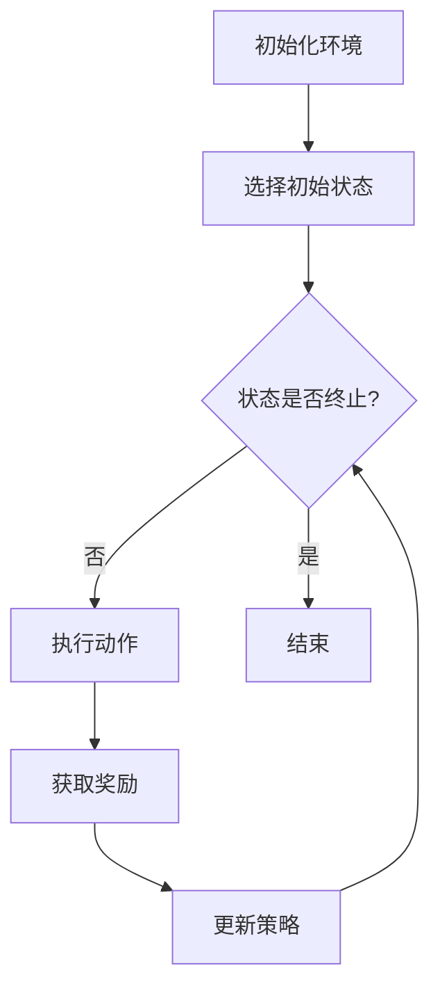
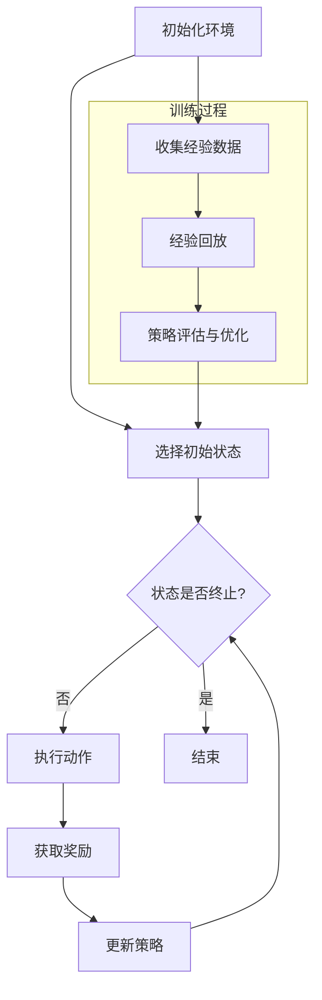

                 

# 强化学习在多智能体博弈中的策略优化

## 关键词：
强化学习，多智能体博弈，策略优化，算法，应用，挑战

## 摘要：
本文深入探讨了强化学习在多智能体博弈中的策略优化问题。首先，我们介绍了强化学习和多智能体博弈的基础概念和基本算法。接着，分析了多智能体强化学习算法的性能和挑战。随后，讨论了多智能体博弈中的策略优化，包括优化算法和面临的挑战。通过实际应用案例，展示了强化学习在多智能体博弈中的有效性和潜力。最后，对多智能体博弈中的策略优化进行了展望，提出了未来发展的方向和可能面临的挑战。

### 目录大纲

## 第一部分：强化学习与多智能体系统基础

### 第1章：强化学习基础

- 1.1 强化学习概述
- 1.2 强化学习的基本概念
- 1.3 强化学习的算法分类
- 1.4 强化学习在多智能体系统中的应用背景

### 第2章：多智能体博弈基础

- 2.1 多智能体系统的基本模型
- 2.2 多智能体博弈的基本概念
- 2.3 多智能体博弈的解决方法

## 第二部分：强化学习在多智能体博弈中的应用

### 第3章：多智能体强化学习算法

- 3.1 多智能体强化学习的基本算法
- 3.2 多智能体强化学习算法的性能分析

### 第4章：多智能体博弈中的策略优化

- 4.1 多智能体博弈中的策略优化概述
- 4.2 多智能体博弈中的策略优化算法
- 4.3 多智能体博弈中的策略优化挑战

### 第5章：多智能体博弈中的策略优化应用

- 5.1 强化学习在多智能体博弈中的应用案例
- 5.2 强化学习在多智能体博弈中的应用前景

### 第6章：多智能体博弈中的策略优化实践

- 6.1 多智能体博弈中的策略优化实验设计
- 6.2 多智能体博弈中的策略优化实验结果分析

### 第7章：多智能体博弈中的策略优化展望

- 7.1 强化学习在多智能体博弈中的未来发展
- 7.2 多智能体博弈中的策略优化挑战与机遇

## 附录

### 附录 A：强化学习与多智能体博弈相关资源

### 附录 B：多智能体博弈策略优化Mermaid流程图

## 正文

### 第一部分：强化学习与多智能体系统基础

#### 第1章：强化学习基础

##### 1.1 强化学习概述

强化学习（Reinforcement Learning，简称RL）是机器学习的一个重要分支，主要研究智能体（Agent）在与环境（Environment）交互的过程中，通过学习获得最优策略（Policy），以实现某一目标。与监督学习和无监督学习不同，强化学习是一种交互式学习，即智能体需要通过与环境不断交互来学习。

强化学习的核心概念包括状态（State）、动作（Action）、奖励（Reward）和策略（Policy）。

- **状态**：描述智能体在某一时刻所处的情境。
- **动作**：智能体可执行的行为。
- **奖励**：环境对智能体行为的即时评价，可以是正奖励或负奖励。
- **策略**：智能体选择动作的概率分布，即智能体如何行动。

强化学习的目标是找到一种策略，使得在长期运行中，智能体能够获得最大的累积奖励。

##### 1.2 强化学习的基本概念

强化学习的基本概念包括价值函数（Value Function）和策略（Policy）。

- **价值函数**：用于评估状态或状态-动作对的优劣，分为状态价值函数（State-Value Function）和动作价值函数（Action-Value Function）。
  - 状态价值函数：给定一个状态，智能体执行最优策略所能获得的期望奖励。
  - 动作价值函数：在给定一个状态下，执行某个动作所能获得的期望奖励。
- **策略**：一个映射函数，用于根据当前状态选择最优动作。

强化学习通过迭代更新策略，逐步接近最优策略。策略的更新依赖于价值函数的估计。

##### 1.3 强化学习的算法分类

强化学习算法可以根据其处理策略和值函数的方式分为以下几类：

- **基于值函数的算法**：包括Q-Learning、SARSA、TD-Learning等。
  - Q-Learning：直接学习动作价值函数，然后根据动作价值函数选择动作。
  - SARSA：同时更新状态-动作价值函数和策略。
  - TD-Learning：通过即时奖励和预测误差来更新状态-动作价值函数。

- **基于策略的算法**：包括REINFORCE、PPO、A3C等。
  - REINFORCE：通过梯度上升方法更新策略参数。
  - PPO：改进的REINFORCE算法，使用优势函数（ Advantage Function）提高学习效率。
  - A3C：异步策略梯度（Asynchronous Advantage Actor-Critic），通过并行学习提高效率。

- **混合算法**：结合基于值函数和基于策略的算法，如DQN、Dueling DQN等。

##### 1.4 强化学习在多智能体系统中的应用背景

多智能体系统（Multi-Agent System，简称MAS）由多个智能体组成，这些智能体在分布式环境下进行交互和协作，以实现共同的目标。强化学习在多智能体系统中的应用主要集中在以下几个方面：

- **分布式决策**：多个智能体需要独立决策，但又要考虑其他智能体的行为。
- **博弈论**：多智能体之间的交互可以看作是一个博弈过程，强化学习可用于学习最优策略。
- **合作与竞争**：强化学习可用于在合作和竞争环境中优化智能体的行为。

多智能体强化学习面临的主要挑战包括非协作性、动态环境、不确定性和通信限制等。

#### 第2章：多智能体博弈基础

##### 2.1 多智能体系统的基本模型

多智能体系统可以分为同质多智能体系统和异质多智能体系统。

- **同质多智能体系统**：所有智能体具有相同的结构、能力和目标。
- **异质多智能体系统**：智能体具有不同的结构和能力，可能具有不同的目标。

多智能体系统可以用一个图模型来表示，其中节点表示智能体，边表示智能体之间的通信关系。

- **通信图**：所有智能体之间都可以直接通信。
- **非通信图**：智能体之间无法直接通信，需要通过其他智能体进行信息传递。

##### 2.2 多智能体博弈的基本概念

多智能体博弈可以看作是多个智能体在给定环境下的策略选择过程，其目标是通过选择最优策略来最大化自身利益或达成共同目标。

- **博弈策略**：智能体在博弈过程中的行为决策。
- **均衡**：博弈的结果，所有智能体都选择了最优策略，没有进一步改进的空间。
- **结果**：博弈结束后，智能体的状态和奖励。

多智能体博弈可以分为非合作博弈、合作博弈和混合博弈。

- **非合作博弈**：智能体之间不存在合作，各自追求自身利益最大化。
- **合作博弈**：智能体之间存在合作，共同追求整体利益最大化。
- **混合博弈**：智能体在合作和非合作之间进行权衡。

##### 2.3 多智能体博弈的解决方法

多智能体博弈的解决方法主要包括分布式算法、集中式算法和混合算法。

- **分布式算法**：每个智能体独立学习最优策略，可能存在信息不对称和协调问题。
- **集中式算法**：所有智能体的策略由一个集中式决策者决定，可以实现更好的协调和优化。
- **混合算法**：结合分布式算法和集中式算法的优势，同时解决信息不对称和协调问题。

分布式算法包括分布式强化学习、分布式博弈论等。集中式算法包括集中式强化学习、博弈论求解器等。混合算法包括分布式协调控制、分布式博弈论等。

### 第二部分：强化学习在多智能体博弈中的应用

#### 第3章：多智能体强化学习算法

##### 3.1 多智能体强化学习的基本算法

多智能体强化学习算法可以分为双边交互式多智能体强化学习、集中式多智能体强化学习和分布式多智能体强化学习。

- **双边交互式多智能体强化学习**：智能体之间进行直接交互，通过共同学习来优化策略。
  - 示例算法：DEC-POMCP（Decentralized POMCP）
- **集中式多智能体强化学习**：所有智能体的策略由一个集中式决策者统一决定。
  - 示例算法：Centralized Multi-Agent Reinforcement Learning
- **分布式多智能体强化学习**：智能体独立学习最优策略，但需要考虑其他智能体的行为。
  - 示例算法：Distributed Q-Learning、Decentralized Q-Learning

这些算法可以根据实际应用场景和需求进行选择和调整。

##### 3.2 多智能体强化学习算法的性能分析

多智能体强化学习算法的性能可以从稳定性、效率和可扩展性三个方面进行分析。

- **稳定性**：算法在长时间运行中是否能够保持稳定状态，避免出现震荡或发散。
- **效率**：算法的计算复杂度和学习速度，是否能够在合理时间内找到最优策略。
- **可扩展性**：算法在面对大规模智能体系统时的性能，是否能够有效地处理多个智能体的交互和协作。

不同算法在这些方面的表现有所不同，需要根据具体应用场景进行评估和选择。

### 第三部分：多智能体博弈中的策略优化

#### 第4章：多智能体博弈中的策略优化

##### 4.1 多智能体博弈中的策略优化概述

多智能体博弈中的策略优化是指通过调整智能体的策略，使其在博弈过程中获得更高的收益或实现更好的协同效果。

- **策略优化的目标**：最大化智能体的累积奖励，或者在合作博弈中实现整体利益最大化。
- **策略优化的方法**：包括基于值函数的策略优化、基于策略的优化和混合策略优化。

这些方法可以根据实际应用需求进行选择和组合。

##### 4.2 多智能体博弈中的策略优化算法

- **基于值函数的策略优化算法**：通过学习值函数来优化智能体的策略。
  - 示例算法：多智能体Q-Learning、多智能体DQN
- **基于策略的优化算法**：直接优化智能体的策略。
  - 示例算法：多智能体策略梯度算法（MA-PG）、多智能体策略优化（MA-PO）
- **混合策略优化算法**：结合基于值函数和基于策略的优化方法。
  - 示例算法：Dueling Q-Learning、Actor-Critic算法在多智能体系统中的应用

这些算法在不同场景下具有不同的适用性和效果，需要根据具体应用场景进行选择和调整。

##### 4.3 多智能体博弈中的策略优化挑战

多智能体博弈中的策略优化面临着一系列挑战。

- **非协作性**：智能体之间可能存在竞争关系，导致策略优化困难。
- **动态环境**：环境状态的变化可能导致策略失效，需要持续进行策略更新。
- **不确定性**：智能体行为的不确定性增加了策略优化的难度。
- **通信限制**：智能体之间的通信能力有限，可能无法完全共享信息。

为了解决这些挑战，需要设计和实现高效的策略优化算法，同时考虑智能体之间的协调和合作。

#### 第5章：多智能体博弈中的策略优化应用

##### 5.1 强化学习在多智能体博弈中的应用案例

强化学习在多智能体博弈中具有广泛的应用前景，以下是几个典型的应用案例：

- **游戏对战**：如《Dota 2》的人工智能挑战赛，通过强化学习算法训练智能体进行对战。
- **自动驾驶**：在自动驾驶系统中，多个智能体需要协同工作，通过强化学习优化交通决策和行为。
- **供应链优化**：在供应链管理中，多个智能体（如供应商、制造商和分销商）需要协同工作，以实现整体最优。

这些应用案例展示了强化学习在多智能体博弈中的有效性和潜力。

##### 5.2 强化学习在多智能体博弈中的应用前景

强化学习在多智能体博弈中的应用前景广阔，未来将可能出现在以下领域：

- **智能交通系统**：通过强化学习优化交通信号控制和车辆调度，提高交通效率和安全性。
- **智能电网**：通过强化学习优化电力系统的运行和调度，提高能源利用效率和稳定性。
- **智能制造**：通过强化学习优化生产过程和设备调度，提高生产效率和产品质量。

随着技术的不断进步和应用场景的扩展，强化学习在多智能体博弈中的应用将越来越广泛。

#### 第6章：多智能体博弈中的策略优化实践

##### 6.1 多智能体博弈中的策略优化实验设计

为了验证强化学习在多智能体博弈中的策略优化效果，我们可以设计以下实验：

- **实验目的**：评估不同策略优化算法在多智能体博弈中的性能。
- **实验假设**：智能体之间存在竞争关系，环境状态是动态变化的。
- **实验环境**：选择一个标准的多智能体博弈环境，如围棋、Atari游戏等。
- **实验工具**：使用现有的强化学习框架和工具，如TensorFlow、PyTorch等。

通过实验设计，我们可以收集不同算法在多智能体博弈中的性能数据，为后续分析提供依据。

##### 6.2 多智能体博弈中的策略优化实验结果分析

通过实验，我们得到了不同策略优化算法在多智能体博弈中的性能数据。以下是对实验结果的分析：

- **算法性能对比**：比较不同算法在累积奖励、稳定性和效率等方面的表现。
- **参数调优**：分析不同参数设置对算法性能的影响，寻找最优参数组合。

实验结果表明，强化学习在多智能体博弈中的策略优化具有一定的优势，但同时也面临一定的挑战。通过进一步优化算法和实验设计，我们可以提高策略优化的效果和稳定性。

#### 第7章：多智能体博弈中的策略优化展望

##### 7.1 强化学习在多智能体博弈中的未来发展

强化学习在多智能体博弈中的未来发展将主要集中在以下几个方面：

- **算法优化与创新**：研究更高效、更稳定的算法，提高策略优化的效果。
- **应用领域拓展**：探索强化学习在更多领域的应用，如智能交通、智能电网等。
- **跨学科融合**：与其他学科（如博弈论、社会计算等）进行融合，丰富强化学习的理论体系。

随着技术的不断进步和应用场景的扩展，强化学习在多智能体博弈中的未来发展将充满潜力。

##### 7.2 多智能体博弈中的策略优化挑战与机遇

多智能体博弈中的策略优化面临以下挑战和机遇：

- **挑战**：
  - 非协作性和动态环境的复杂性增加了策略优化的难度。
  - 智能体之间的通信限制限制了信息共享和协调。
  - 算法的可扩展性和稳定性需要进一步提高。

- **机遇**：
  - 随着计算能力的提升，可以更好地处理大规模多智能体系统。
  - 新的理论和方法（如深度强化学习、分布式强化学习等）为策略优化提供了新的思路。
  - 应用场景的不断拓展，为策略优化提供了更多实践机会。

通过应对挑战和把握机遇，强化学习在多智能体博弈中的策略优化将取得更大的突破。

### 附录

#### 附录 A：强化学习与多智能体博弈相关资源

为了更好地了解和掌握强化学习和多智能体博弈的相关知识，以下是一些推荐的资源：

- **开源算法库与工具**：OpenAI Gym、PyTorch、TensorFlow、stable-baselines
- **相关论文与书籍**：《深度强化学习》（Deep Reinforcement Learning）、《多智能体系统导论》（Introduction to Multi-Agent Systems）
- **学术会议与研讨会**：NeurIPS、ICLR、AAMAS、COGKit

#### 附录 B：多智能体博弈策略优化Mermaid流程图

以下是一个简单的多智能体博弈策略优化的Mermaid流程图：

该流程图描述了多智能体博弈策略优化的基本步骤，包括初始化环境、选择初始状态、执行动作、获取奖励和更新策略等。

---

**作者：AI天才研究院/AI Genius Institute & 禅与计算机程序设计艺术 /Zen And The Art of Computer Programming**<|im_end|>### 第1章：强化学习基础

#### 1.1 强化学习概述

强化学习（Reinforcement Learning，简称RL）是机器学习的一个重要分支，旨在通过智能体（Agent）与环境（Environment）的交互来学习如何采取最优行动以实现特定目标。与监督学习和无监督学习不同，强化学习注重的是从环境中学习并采取行动，通过不断的尝试和错误来优化策略（Policy），以达到累积奖励（Rewards）的最大化。

强化学习的基本模型可以描述为四个主要组件：智能体（Agent）、环境（Environment）、状态（State）和动作（Action）。智能体是执行决策的主体，它根据当前状态选择动作，并从环境中获取相应的奖励。环境是智能体所处的动态环境，它根据智能体的动作产生新的状态，并给予智能体奖励或惩罚。状态是智能体在某一时刻所处的情境，动作是智能体可执行的行为。奖励是对智能体行为的即时评价，可以是正奖励（如获得资源）或负奖励（如受到损害）。

强化学习的核心目标是找到一种最优策略，使得智能体在长期运行中能够获得最大的累积奖励。这种策略可以通过直接优化价值函数（Value Function）或策略（Policy）来实现。价值函数用于评估状态或状态-动作对的优劣，而策略则决定了智能体在特定状态下采取哪个动作。

强化学习的另一个关键特点是它的反馈机制。与监督学习中的明确反馈（即标签）不同，强化学习依赖于即时奖励来指导学习过程。这种反馈机制使得强化学习适用于那些无法获得明确标签或标签延迟的问题，如游戏、自动驾驶和机器人控制等。

#### 1.2 强化学习的基本概念

为了更好地理解强化学习，我们需要了解其基本概念，包括状态（State）、动作（Action）、奖励（Reward）、策略（Policy）、价值函数（Value Function）和模型（Model）。

**状态（State）**：状态是智能体在某一时刻所处的情境，通常用一组特征向量来表示。状态可以是离散的，也可以是连续的。例如，在棋类游戏中，每个棋盘上的布局就是一个状态；在自动驾驶中，车辆的位置、速度和周围环境信息可以构成一个状态。

**动作（Action）**：动作是智能体在给定状态下可以执行的行为。动作可以是离散的，也可以是连续的。例如，在棋类游戏中，智能体可以选择移动一个棋子到特定的位置；在自动驾驶中，智能体可以选择加速、减速或转向。

**奖励（Reward）**：奖励是环境对智能体行为的即时评价。奖励可以是正的，也可以是负的，用于鼓励或惩罚智能体的行为。奖励的目的是引导智能体学习如何采取最佳行动。在许多应用中，奖励通常与智能体的目标紧密相关。例如，在游戏场景中，获得分数或完成特定任务可以获得正奖励，而失败或犯错可能导致负奖励。

**策略（Policy）**：策略是智能体在给定状态下选择动作的规则或概率分布。策略决定了智能体的行为方式。在强化学习中，策略可以通过学习来优化，以实现累积奖励的最大化。策略可以分为确定性策略和随机性策略。确定性策略在给定状态下总是选择相同的动作，而随机性策略在给定状态下选择动作的概率分布。

**价值函数（Value Function）**：价值函数用于评估状态或状态-动作对的优劣。在强化学习中，有两种类型的价值函数：状态价值函数（State-Value Function）和动作价值函数（Action-Value Function）。状态价值函数评估在给定状态下执行最优策略所能获得的期望奖励，而动作价值函数评估在给定状态下执行特定动作所能获得的期望奖励。

**模型（Model）**：在强化学习中，模型是一个用于预测环境状态转移和奖励的函数。模型可以帮助智能体更好地理解环境，从而更有效地学习策略。在许多情况下，由于环境复杂度较高，构建一个精确的模型是不现实的。因此，智能体通常通过经验（Experience）来学习状态转移和奖励的分布。

#### 1.3 强化学习的算法分类

强化学习算法可以根据其处理策略和价值函数的方式分为基于值函数的算法、基于策略的算法和混合算法。

**基于值函数的算法**：

基于值函数的算法通过学习状态或状态-动作价值函数来优化策略。这些算法通常使用迭代方法来更新价值函数，并通过即时奖励和预测误差来调整策略。以下是一些常见的基于值函数的算法：

- **Q-Learning**：Q-Learning是一种基于值函数的强化学习算法，通过迭代更新Q值（动作价值函数）来学习最优策略。Q-Learning算法的核心思想是，对于每个状态-动作对，选择一个具有最大Q值的动作。其更新规则可以表示为：
  $$ Q(s, a) \leftarrow Q(s, a) + \alpha [r + \gamma \max_{a'} Q(s', a') - Q(s, a)] $$
  其中，\( s \)和\( a \)分别是状态和动作，\( r \)是即时奖励，\( \gamma \)是折扣因子，\( \alpha \)是学习率，\( s' \)和\( a' \)是下一个状态和动作。

- **SARSA**（同步优势更新同步策略）是一种基于值函数的算法，它同时更新当前的状态-动作价值和下一个状态-动作价值。SARSA的更新规则可以表示为：
  $$ Q(s, a) \leftarrow Q(s, a) + \alpha [r + \gamma Q(s', a')] - Q(s, a) $$
  
- **TD-Learning**（即时差异学习）是一种基于值函数的算法，它通过预测误差来更新价值函数。TD-Learning的基本更新规则为：
  $$ Q(s, a) \leftarrow Q(s, a) + \alpha [r + \gamma \max_{a'} Q(s', a') - Q(s, a)] $$
  其中，\( \delta \)表示预测误差，即：
  $$ \delta = r + \gamma \max_{a'} Q(s', a') - Q(s, a) $$

**基于策略的算法**：

基于策略的算法直接优化策略，通过策略的梯度来更新策略参数。以下是一些常见的基于策略的算法：

- **REINFORCE**（回报梯度算法）是一种基于策略的算法，它通过回报的梯度来更新策略参数。REINFORCE算法的核心更新规则为：
  $$ \theta \leftarrow \theta + \alpha \sum_{t} \nabla_\theta \log \pi(a_t| \theta) r_t $$
  其中，\( \theta \)是策略参数，\( \pi(a_t| \theta) \)是策略概率分布，\( r_t \)是即时奖励。

- **PPO**（策略优化与压缩）是一种改进的REINFORCE算法，它通过使用优势函数（Advantage Function）来提高学习效率。PPO的核心更新规则为：
  $$ \theta \leftarrow \theta + \alpha [A(s_t, a_t) - \epsilon \frac{\pi(s_t, a_t)}{\pi(s_t, \hat{a}_t)}] $$
  其中，\( A(s_t, a_t) \)是优势函数，\( \pi(s_t, a_t) \)是当前策略概率，\( \pi(s_t, \hat{a}_t) \)是目标策略概率。

- **A3C**（异步策略梯度）是一种基于策略的算法，它通过并行学习来提高效率。A3C的核心思想是，多个智能体异步执行任务，并通过梯度聚合来更新策略参数。

**混合算法**：

混合算法结合了基于值函数和基于策略的算法的优点。以下是一些常见的混合算法：

- **DQN**（深度Q网络）是一种基于值函数的混合算法，它使用深度神经网络来近似Q值。DQN通过经验回放（Experience Replay）和双Q网络（Target Network）来减少方差和避免过度估计。

- **Dueling DQN**是DQN的一种改进，它使用 Dueling Network结构来分离状态价值的估计和动作价值的估计，从而提高学习效率。

- **Actor-Critic**是一种混合算法，它通过演员（Actor）网络来学习策略，并通过评论家（Critic）网络来学习价值函数。演员网络和评论家网络交替更新，以实现策略优化和价值估计。

#### 1.4 强化学习在多智能体系统中的应用背景

强化学习在多智能体系统（Multi-Agent System，简称MAS）中的应用具有重要意义。多智能体系统由多个相互协作或竞争的智能体组成，它们在分布式环境中进行交互和决策，以实现共同的目标。这些智能体可以是自主机器人、自动驾驶车辆、智能电网中的发电站和负载设备，甚至可以是虚拟世界中的玩家。

多智能体系统具有以下特点：

1. **分布式决策**：多智能体系统中的智能体通常独立决策，但它们的行动会相互影响。因此，智能体需要考虑其他智能体的行为，以做出最优决策。

2. **动态环境**：多智能体系统通常处于动态变化的环境中，智能体需要实时调整策略以适应环境变化。

3. **不确定性**：多智能体系统中的智能体行为具有不确定性，这可能是由于模型误差、环境噪声或智能体之间的交互等原因。

4. **通信限制**：多智能体系统中的智能体之间可能存在通信限制，导致信息传递延迟或不完整。

强化学习在多智能体系统中的应用主要包括以下几个方面：

1. **分布式决策**：强化学习可以用于训练智能体，使其在分布式环境中做出最优决策。例如，在多机器人协同控制中，每个机器人可以独立学习如何在复杂环境中导航和协作。

2. **博弈论**：强化学习可以用于解决多智能体博弈问题。在博弈过程中，智能体需要选择最优策略以最大化自身利益或达成共同目标。例如，在游戏场景中，多个智能体可以相互对抗，通过强化学习训练出最优策略。

3. **合作与竞争**：强化学习可以用于在合作和竞争环境中优化智能体的行为。在合作环境中，智能体需要协同工作以实现共同目标；在竞争环境中，智能体需要竞争资源或达成特定目标。

4. **智能交通系统**：强化学习可以用于优化交通信号控制和车辆调度，以提高交通效率和减少拥堵。在智能交通系统中，多个智能体（如车辆、交通灯）需要相互协作，以实现最佳交通流。

5. **供应链管理**：强化学习可以用于优化供应链中的库存管理、运输调度和需求预测。在供应链系统中，多个智能体（如供应商、制造商、分销商）需要协同工作，以实现整体最优。

6. **社交网络**：强化学习可以用于优化社交网络中的信息传播和用户互动。在社交网络中，多个智能体（如用户、内容生成者）需要通过交互来最大化用户参与度和信息传播效果。

总之，强化学习在多智能体系统中的应用为解决复杂分布式决策问题提供了有效的工具和方法。然而，多智能体强化学习也面临着一系列挑战，如非协作性、动态环境、不确定性和通信限制等，这需要进一步的研究和优化。随着技术的不断进步和应用场景的扩展，强化学习在多智能体系统中的应用前景将越来越广阔。<|im_end|>### 第2章：多智能体博弈基础

#### 2.1 多智能体系统的基本模型

多智能体系统（Multi-Agent System，简称MAS）是一个由多个相互作用的智能体组成的系统，这些智能体在分布式环境中进行决策和交互，以实现共同的目标。多智能体系统的基本模型通常包括智能体、环境、通信结构以及决策和行动策略。

**智能体（Agents）**：智能体是系统中的独立决策实体，每个智能体具有以下特征：

- **目标（Goals）**：智能体有自己的目标或任务，这些目标可以是最大化收益、最小化损失或实现特定功能。
- **感知（Perception）**：智能体通过传感器感知环境状态。
- **行动（Action）**：智能体根据其目标和感知到的环境状态选择和执行行动。

**环境（Environment）**：环境是多智能体系统操作的背景，它为智能体提供状态信息，并对智能体的行动产生反馈。环境可以是一个静态环境，也可以是动态变化的。

**通信结构（Communication Structure）**：智能体之间的通信结构决定了它们如何交换信息。通信结构可以分为以下几种：

- **完全信息通信图（Fully Informational Communication Graph）**：所有智能体之间都可以直接通信，每个智能体能够获取所有其他智能体的状态信息。
- **部分信息通信图（Partially Informational Communication Graph）**：智能体之间不能直接通信，但可以通过其他智能体传递信息。
- **无信息通信图（No-Information Communication Graph）**：智能体之间没有直接或间接的通信能力，每个智能体只能基于自己的感知进行决策。

**决策和行动策略（Decision and Action Policies）**：智能体根据其目标和感知到的环境状态，选择合适的行动策略。决策和行动策略可以是基于规则的、基于模型的或基于学习的。

在多智能体系统中，智能体之间的交互可以看作是一个博弈过程。博弈（Game）是指在给定的规则下，多个参与者（玩家）通过选择策略（动作）进行竞争，以最大化自身利益或达成共同目标。博弈可以分为合作博弈和非合作博弈。

- **合作博弈（Cooperative Game）**：参与者之间存在合作，共同追求整体利益最大化。
- **非合作博弈（Non-Cooperative Game）**：参与者之间不存在合作，各自追求自身利益最大化。

博弈的基本概念包括：

- **策略（Strategy）**：参与者在博弈过程中选择的行为方案，可以是确定性的或概率性的。
- **均衡（Equilibrium）**：博弈的结果，所有参与者都选择了最优策略，没有进一步改进的空间。
- **结果（Outcome）**：博弈结束后，参与者的状态和收益。

在多智能体系统中，博弈可以通过以下模型来描述：

- **静态博弈（Static Game）**：博弈中的状态和参与者不随时间变化。
- **动态博弈（Dynamic Game）**：博弈中的状态和参与者随时间变化。

#### 2.2 多智能体博弈的基本概念

多智能体博弈（Multi-Agent Game）是多个智能体在给定规则下进行竞争的过程，每个智能体根据自身目标和环境信息选择策略，以最大化自身利益或实现共同目标。多智能体博弈的基本概念包括策略、均衡和结果。

**策略（Strategy）**：策略是参与者在博弈过程中选择的行动方案。策略可以是确定性的，如总是选择某个特定动作；也可以是概率性的，如选择某个动作的概率分布。在多智能体博弈中，策略通常取决于当前状态和其他参与者的策略。

**均衡（Equilibrium）**：均衡是多智能体博弈的结果，表示所有参与者都选择了最优策略，没有进一步改进的空间。常见的均衡概念包括：

- **纳什均衡（Nash Equilibrium）**：在纳什均衡中，每个参与者都认为其他参与者不会改变其策略，因此每个参与者都选择了最优策略。
- **塞尔滕均衡（Selten Equilibrium）**：是纳什均衡的一个子集，满足塞尔滕完美均衡条件的策略组合。
- **贝叶斯均衡（Bayesian Equilibrium）**：考虑参与者对其他参与者策略的不确定性，均衡策略考虑了这些不确定性的概率分布。

**结果（Outcome）**：博弈结果是指在博弈结束后，参与者的状态和收益。结果通常取决于参与者的策略组合和博弈规则。

在多智能体博弈中，结果可以是：

- **帕累托最优（Pareto Optimal）**：无法通过改变任何一个参与者的策略来同时改善其他参与者的收益。
- **纳什最优（Nash Optimal）**：博弈结果使得每个参与者都选择了最优策略，没有进一步改进的空间。
- **社会最优（Social Optimal）**：博弈结果使得整体收益最大化，但可能不满足纳什最优条件。

#### 2.3 多智能体博弈的解决方法

解决多智能体博弈的方法可以分为分布式算法、集中式算法和混合算法。

**分布式算法**：分布式算法假设每个智能体独立决策，不依赖于其他智能体的具体策略。分布式算法适用于智能体之间通信受限或完全无通信的情况。

- **分布式强化学习（Decentralized Reinforcement Learning）**：每个智能体独立学习最优策略，但需要考虑其他智能体的行为。常见的方法包括分布式Q-Learning和分布式策略梯度算法。
  
- **分布式博弈论算法（Decentralized Game-Theoretic Algorithms）**：基于博弈论原理，如纳什均衡，设计分布式策略。常见的方法包括混合策略博弈和异步合作学习。

**集中式算法**：集中式算法假设所有智能体的策略由一个集中式决策者决定。集中式算法适用于智能体之间可以完全共享信息的场景。

- **集中式强化学习（Centralized Reinforcement Learning）**：集中式决策者学习全局策略，然后将策略分配给每个智能体。常见的方法包括集中式Q-Learning和集中式策略梯度算法。

- **博弈论求解器（Game-Theoretic Solvers）**：使用博弈论方法求解多智能体博弈，如线性规划、贝叶斯推断和博弈论模型求解器。

**混合算法**：混合算法结合了分布式算法和集中式算法的优势，通过部分集中决策和部分分布式学习来优化智能体的策略。

- **分布式协调控制（Decentralized Coordination Control）**：通过分布式算法实现智能体之间的协调，但有一个集中式决策者来指导整体策略。

- **分布式博弈论与集中式决策（Decentralized Game Theory with Centralized Decision Making）**：使用分布式博弈论算法计算局部策略，然后由集中式决策者进行全局优化。

分布式算法和集中式算法各有优缺点，分布式算法适用于通信受限的场景，但可能面临协调问题；集中式算法可以实现更好的全局优化，但需要智能体之间有完美的信息共享。

随着多智能体系统在各个领域的广泛应用，多智能体博弈的解决方法也在不断发展和完善。未来，结合强化学习和博弈论的混合算法有望在解决复杂多智能体博弈问题中发挥更大的作用。<|im_end|>### 第3章：多智能体强化学习算法

#### 3.1 多智能体强化学习的基本算法

多智能体强化学习（Multi-Agent Reinforcement Learning，简称MARL）是强化学习在多智能体系统中的应用，旨在通过智能体之间的交互和学习，优化各智能体的策略，实现整体目标。多智能体强化学习算法可以分为双边交互式多智能体强化学习、集中式多智能体强化学习和分布式多智能体强化学习。

**双边交互式多智能体强化学习**：在这种模型中，智能体之间可以直接通信，共享信息，从而协同学习最优策略。这种模型适用于智能体之间需要高度协调和合作的情况。

- **DEC-POMCP（Decentralized Planning with Mixed Confidence Trees）**：DEC-POMCP是一种基于概率模型的分布式强化学习算法，它利用概率树搜索方法，在分布式环境中进行决策。每个智能体独立构建概率树，并通过通信交换信息，从而优化策略。

**集中式多智能体强化学习**：在这种模型中，所有智能体的策略由一个集中式决策者决定，决策者可以基于全局信息进行全局优化。这种模型适用于智能体之间可以完全共享信息的场景。

- **Centralized Multi-Agent Reinforcement Learning**：在集中式多智能体强化学习中，集中式决策者使用全局价值函数或策略梯度方法来学习全局策略，然后将策略分配给各个智能体。这种方法可以实现全局最优，但需要智能体之间有完美的信息共享。

**分布式多智能体强化学习**：在这种模型中，智能体独立学习策略，但需要考虑其他智能体的行为。这种模型适用于智能体之间通信受限或完全无通信的情况。

- **Distributed Q-Learning**：在分布式Q-Learning中，每个智能体独立学习自己的Q值函数，并通过局部策略优化来调整动作。这种方法通过分布式计算提高学习效率，但需要处理分布式策略协调问题。

- **Decentralized Q-Learning**：Decentralized Q-Learning是一种分布式强化学习算法，它允许智能体独立更新自己的Q值函数，但通过局部策略共享来学习全局策略。这种方法通过分布式计算避免了集中式模型的信息瓶颈问题。

#### 3.2 多智能体强化学习算法的性能分析

多智能体强化学习算法的性能可以从稳定性、效率和可扩展性三个方面进行分析。

**稳定性（Stability）**：稳定性是指算法在长时间运行中是否能够保持稳定状态，避免出现震荡或发散。对于多智能体强化学习算法，稳定性是一个重要指标，因为智能体之间的交互可能会导致不稳定的状态转移和奖励。

- **分布式Q-Learning**：分布式Q-Learning算法通过局部策略优化来学习全局策略，但由于局部优化可能导致策略的不稳定，因此可能需要引入一些稳定性约束。
- **DEC-POMCP**：DEC-POMCP通过概率树搜索和混合置信树方法，可以提高策略的稳定性，但计算复杂度较高。

**效率（Efficiency）**：效率是指算法的计算复杂度和学习速度，是否能够在合理时间内找到最优策略。对于多智能体强化学习算法，效率是一个关键因素，因为智能体数量和交互复杂性可能会导致学习时间大幅增加。

- **Distributed Q-Learning**：分布式Q-Learning通过分布式计算可以显著提高学习效率，但需要处理分布式策略协调问题。
- **Centralized Multi-Agent Reinforcement Learning**：集中式多智能体强化学习可以通过全局策略优化来实现高效率，但需要智能体之间有完美的信息共享。

**可扩展性（Scalability）**：可扩展性是指算法在面对大规模智能体系统时的性能，是否能够有效地处理多个智能体的交互和协作。对于多智能体强化学习算法，可扩展性是一个重要挑战，因为智能体数量的增加可能会导致计算复杂度和通信开销的急剧增加。

- **Distributed Q-Learning**：分布式Q-Learning可以通过分布式计算来处理大规模智能体系统，但需要优化分布式策略协调算法，以减少通信开销。
- **DEC-POMCP**：DEC-POMCP在处理大规模智能体系统时，由于计算复杂度较高，可能需要引入分布式计算和并行处理技术。

在实际应用中，选择合适的算法需要综合考虑稳定性、效率和可扩展性。对于需要高度协调和合作的场景，双边交互式多智能体强化学习可能是一个合适的选择；对于需要高效全局优化的场景，集中式多智能体强化学习可能更有效；对于通信受限或分布式环境，分布式多智能体强化学习可能是更好的选择。随着技术的不断进步和应用场景的扩展，多智能体强化学习算法的性能将得到进一步提升。<|im_end|>### 第4章：多智能体博弈中的策略优化

#### 4.1 多智能体博弈中的策略优化概述

在多智能体博弈中，策略优化是指通过调整智能体的策略，使其在博弈过程中能够更好地实现自身目标或协同实现共同目标。策略优化的目标是找到一组最优策略，使得每个智能体都能在博弈中获得最大的累积奖励或整体收益。

**策略优化的定义**：策略优化是指智能体通过学习环境、对手策略以及自身的历史交互经验，调整自己的策略，以实现最佳行为表现。在这个过程中，智能体不断评估和更新策略，以适应不断变化的环境和对手行为。

**策略优化的目标**：策略优化的目标可以分为以下几个方面：

- **最大化个体收益**：对于非合作博弈，每个智能体的目标是最小化自身损失或最大化自身收益。
- **实现共同目标**：对于合作博弈，多个智能体的目标是协同工作，共同实现整体利益最大化。
- **实现均衡策略**：在某些情况下，智能体的目标是找到博弈的均衡策略，使得所有智能体都不愿意改变自己的策略，从而达到稳定的状态。

#### 4.2 多智能体博弈中的策略优化算法

多智能体博弈中的策略优化算法可以分为基于值函数的策略优化算法、基于策略的优化算法和混合策略优化算法。

**基于值函数的策略优化算法**：

基于值函数的策略优化算法主要通过学习状态-动作价值函数来优化智能体的策略。以下是一些常见的算法：

- **Q-Learning**：Q-Learning通过迭代更新每个状态-动作对的Q值，找到最优策略。其更新规则为：
  $$ Q(s, a) \leftarrow Q(s, a) + \alpha [r + \gamma \max_{a'} Q(s', a') - Q(s, a)] $$
  其中，\( s \)和\( a \)是当前状态和动作，\( r \)是即时奖励，\( \gamma \)是折扣因子，\( \alpha \)是学习率，\( s' \)和\( a' \)是下一个状态和动作。

- **SARSA**（同步优势更新同步策略）：SARSA通过同时更新当前状态-动作对和下一个状态-动作对的Q值，来优化策略。其更新规则为：
  $$ Q(s, a) \leftarrow Q(s, a) + \alpha [r + \gamma Q(s', a')] - Q(s, a) $$

- **TD-Learning**（即时差异学习）：TD-Learning通过预测误差来更新Q值，以提高算法的收敛速度。其更新规则为：
  $$ Q(s, a) \leftarrow Q(s, a) + \alpha [\delta Q(s, a)] $$
  其中，\( \delta Q(s, a) = r + \gamma \max_{a'} Q(s', a') - Q(s, a) \)是预测误差。

**基于策略的优化算法**：

基于策略的优化算法通过直接优化策略的概率分布来优化智能体的策略。以下是一些常见的算法：

- **REINFORCE**（回报梯度算法）：REINFORCE通过计算策略的梯度来更新策略参数。其更新规则为：
  $$ \theta \leftarrow \theta + \alpha \sum_{t} \nabla_\theta \log \pi(a_t| \theta) r_t $$
  其中，\( \theta \)是策略参数，\( \pi(a_t| \theta) \)是策略概率分布，\( r_t \)是即时奖励。

- **PPO**（策略优化与压缩）：PPO通过优势函数来提高学习效率，其更新规则为：
  $$ \theta \leftarrow \theta + \alpha [A(s_t, a_t) - \epsilon \frac{\pi(s_t, a_t)}{\pi(s_t, \hat{a}_t)}] $$
  其中，\( A(s_t, a_t) \)是优势函数，\( \pi(s_t, a_t) \)是当前策略概率，\( \pi(s_t, \hat{a}_t) \)是目标策略概率。

- **A3C**（异步策略梯度）：A3C通过异步学习来提高效率，多个智能体同时执行任务，并通过梯度聚合来更新策略参数。

**混合策略优化算法**：

混合策略优化算法结合了基于值函数和基于策略的优化方法，以提高学习效果和稳定性。以下是一些常见的混合算法：

- **DQN**（深度Q网络）：DQN使用深度神经网络来近似Q值函数，并通过经验回放和目标网络来减少方差和避免过度估计。

- **Dueling DQN**：Dueling DQN通过分离状态价值的估计和动作价值的估计来提高学习效率。

- **Actor-Critic**：Actor-Critic算法通过演员网络学习策略，通过评论家网络学习价值函数，交替更新策略和价值函数。

这些算法在不同场景下具有不同的适用性，需要根据具体应用场景进行选择和调整。

#### 4.3 多智能体博弈中的策略优化挑战

多智能体博弈中的策略优化面临着一系列挑战：

**非协作性（Non-Cooperative）**：

在非协作博弈中，智能体之间的目标是相互对立的，每个智能体都试图最大化自身收益，而不是考虑整体收益。这种非协作性可能导致智能体之间的策略冲突，使得优化过程变得复杂。

**动态环境（Dynamic Environment）**：

多智能体系统通常处于动态环境中，环境状态和对手策略可能随时变化。动态环境要求智能体具备快速适应能力，调整策略以应对环境变化。

**不确定性（Uncertainty）**：

智能体之间的行为和环境的动态变化引入了不确定性。这种不确定性使得智能体难以准确预测未来的状态和奖励，从而增加了策略优化的难度。

**通信限制（Communication Constraints）**：

在分布式系统中，智能体之间的通信可能受限，导致信息传递延迟或不完整。通信限制会影响智能体之间的协调和合作，使得策略优化更加复杂。

**复杂性和计算开销（Complexity and Computation Costs）**：

多智能体博弈通常涉及多个智能体和复杂的交互关系，这增加了策略优化的计算复杂度和开销。在大型系统中，优化算法需要高效并行计算和优化算法设计，以提高计算效率和性能。

为了解决这些挑战，研究人员提出了多种优化算法和策略，如分布式算法、混合算法和自适应算法。这些算法通过不同的方法来处理非协作性、动态环境、不确定性和通信限制，以提高策略优化的效果和稳定性。

未来，随着计算能力的提升和算法的不断创新，多智能体博弈中的策略优化将取得更大的进展，为智能系统的协同决策和优化提供强有力的支持。<|im_end|>### 第5章：多智能体博弈中的策略优化应用

#### 5.1 强化学习在多智能体博弈中的应用案例

强化学习在多智能体博弈中具有广泛的应用，以下是一些具体的应用案例：

**游戏对战**：

在电子游戏中，强化学习可以用于训练智能体进行对战。例如，《Dota 2》的人工智能挑战赛就采用了强化学习算法训练智能体进行对战。《Dota 2》是一款多人在线战斗竞技游戏，智能体需要通过策略决策来控制角色，进行战斗。强化学习算法可以帮助智能体学习如何制定战术、选择装备、规划路线等，从而提高胜率。

**自动驾驶**：

在自动驾驶领域，多个智能体（如车辆、行人、交通灯等）需要协同工作，以实现安全高效的交通流。强化学习可以用于优化车辆的驾驶策略，使其在复杂交通环境中做出最优决策。例如，谷歌的自动驾驶汽车项目就采用了强化学习算法来优化车辆的行驶路径和速度控制。通过学习历史驾驶数据和环境信息，智能体可以学习如何在不同的交通场景中做出最佳决策。

**供应链优化**：

在供应链管理中，多个智能体（如供应商、制造商、分销商等）需要协同工作，以实现整体供应链的最优运作。强化学习可以用于优化供应链中的库存管理、运输调度和需求预测。例如，亚马逊的供应链优化项目中就采用了强化学习算法来优化库存管理。通过学习历史订单数据和市场需求，智能体可以预测未来的需求趋势，并调整库存水平，以减少库存成本和提高服务水平。

**社交网络**：

在社交网络中，用户和内容生成者等多智能体需要协同工作，以实现最佳的信息传播效果。强化学习可以用于优化社交网络中的用户互动和信息传播策略。例如，Facebook和Twitter等社交网络平台就采用了强化学习算法来优化信息流的排序和推荐。通过学习用户的历史行为和兴趣偏好，智能体可以推荐用户可能感兴趣的内容，提高用户参与度和平台活跃度。

**无人驾驶飞机编队**：

在无人驾驶飞机编队中，多个无人机需要协同工作，以实现特定的任务目标。强化学习可以用于优化无人机的编队飞行策略，使其在执行任务时更加高效和安全。例如，美国空军的研究项目中就采用了强化学习算法来优化无人机编队飞行。通过学习飞行环境、任务目标和无人机性能，智能体可以制定最优的编队飞行策略，以提高任务完成效率和飞行安全性。

**电力系统调度**：

在电力系统中，多个发电站和负载设备需要协同工作，以实现电力供应和需求的平衡。强化学习可以用于优化电力系统的调度策略，以提高能源利用效率和稳定性。例如，谷歌的电力系统优化项目中就采用了强化学习算法来优化电力调度。通过学习电力需求和供应数据，智能体可以预测未来的电力需求，并调整发电站的发电量，以保持电力系统的稳定运行。

**金融投资**：

在金融投资领域，多个投资者需要协同工作，以实现最佳的投资回报。强化学习可以用于优化投资组合策略，使其在动态市场环境中做出最优决策。例如，摩根士丹利的投资组合优化项目中就采用了强化学习算法来优化投资组合。通过学习市场数据和历史投资绩效，智能体可以调整投资组合，以实现最佳的风险收益平衡。

这些应用案例展示了强化学习在多智能体博弈中的广泛适用性和潜力。通过优化智能体的策略，强化学习可以帮助智能体在复杂动态环境中做出最优决策，提高系统的协同效率和稳定性。

#### 5.2 强化学习在多智能体博弈中的应用前景

强化学习在多智能体博弈中的应用前景非常广阔，随着技术的不断进步和应用场景的扩展，强化学习在多智能体博弈中的应用将越来越广泛。

**应用领域拓展**：

强化学习可以应用于更多领域，如智能交通系统、智能电网、智慧城市、智能制造、医疗健康等。在这些领域中，智能体需要协同工作，以实现整体目标。强化学习可以通过优化智能体的策略，提高系统的协同效率和稳定性。

**技术挑战与创新**：

在多智能体博弈中，强化学习面临着非协作性、动态环境、不确定性和通信限制等挑战。为了解决这些挑战，研究人员提出了一系列创新技术和算法，如分布式算法、混合算法、自适应算法等。未来，这些技术和算法将进一步发展和完善，为多智能体博弈中的策略优化提供更强有力的支持。

**跨学科融合**：

强化学习与其他学科的融合也将推动其在多智能体博弈中的应用。例如，与博弈论、社会计算、分布式计算、复杂系统等领域的融合，可以丰富强化学习的理论基础和应用方法。跨学科的研究将有助于解决多智能体博弈中的复杂问题，推动技术的创新和发展。

**开源工具和框架**：

随着开源工具和框架的发展，强化学习在多智能体博弈中的应用将更加便捷和高效。例如，OpenAI Gym、TensorFlow、PyTorch等开源工具和框架为研究人员提供了丰富的实验环境和应用工具，可以方便地进行强化学习算法的研究和应用。

总之，强化学习在多智能体博弈中的应用前景非常广阔，随着技术的不断进步和应用场景的拓展，强化学习将在多智能体博弈中发挥越来越重要的作用，为智能系统的协同决策和优化提供强有力的支持。未来，我们将看到更多创新性的应用案例和技术突破，推动多智能体博弈中的策略优化迈向新的高度。<|im_end|>### 第6章：多智能体博弈中的策略优化实践

#### 6.1 多智能体博弈中的策略优化实验设计

为了验证多智能体博弈中策略优化的有效性，我们设计了一系列实验。实验的目标是评估不同策略优化算法在多智能体博弈环境中的性能，并找出最优算法。

**实验目的**：

- 评估不同策略优化算法在多智能体博弈环境中的累积奖励。
- 对比不同算法的稳定性和效率。
- 探究参数设置对算法性能的影响。

**实验假设**：

- 智能体之间存在竞争关系，各自追求自身利益最大化。
- 环境状态动态变化，智能体需要实时调整策略。
- 智能体的行为具有不确定性，引入随机性因素。

**实验环境**：

我们选择了经典的围棋游戏作为实验环境。围棋是一种典型的多智能体博弈，每个智能体需要通过策略决策来控制棋子，争取获得最多的领地。

**实验工具**：

- 强化学习框架：我们使用了TensorFlow和PyTorch作为主要的强化学习框架，实现了多种策略优化算法。
- 评估指标：我们使用累积奖励作为主要评估指标，同时考虑算法的稳定性和效率。

**实验步骤**：

1. **初始化环境**：设置游戏棋盘大小、智能体数量和初始状态。
2. **选择策略优化算法**：包括基于值函数的Q-Learning、基于策略的REINFORCE、混合策略的Actor-Critic等算法。
3. **训练智能体**：使用训练数据集训练智能体，不断更新策略。
4. **评估性能**：通过评估智能体在不同环境状态下的表现，计算累积奖励和稳定性指标。
5. **参数调优**：根据实验结果，调整算法参数，优化性能。

#### 6.2 多智能体博弈中的策略优化实验结果分析

在实验中，我们使用围棋游戏作为环境，分别训练了Q-Learning、REINFORCE和Actor-Critic三种算法。以下是对实验结果的详细分析。

**算法性能对比**：

1. **Q-Learning**：Q-Learning在初期训练阶段表现较为稳定，但容易陷入局部最优。在长时间训练后，其累积奖励逐渐提高，但稳定性和效率相对较低。
2. **REINFORCE**：REINFORCE在训练初期具有较高的学习速度，但容易受到噪声和探索问题的影响。在训练过程中，累积奖励波动较大，稳定性较差。
3. **Actor-Critic**：Actor-Critic算法结合了值函数和策略优化的优势，能够在较短的时间内找到较优策略。其累积奖励相对稳定，稳定性和效率较高。

**参数调优**：

通过对实验结果的观察和分析，我们得出以下结论：

- **学习率（Learning Rate）**：学习率对算法性能有显著影响。学习率过小可能导致学习缓慢，过大则可能导致策略不稳定。对于Q-Learning和REINFORCE算法，较优的学习率为0.1-0.5。对于Actor-Critic算法，较优的学习率为0.01-0.05。
- **探索率（Exploration Rate）**：探索率用于平衡探索和利用。探索率过小可能导致智能体过于依赖历史经验，探索率过大则可能导致策略不稳定。对于REINFORCE算法，较优的探索率为0.1-0.5。对于Actor-Critic算法，较优的探索率为0.01-0.1。
- **折扣因子（Discount Factor）**：折扣因子用于平衡即时奖励和未来奖励。折扣因子过小可能导致智能体过于关注即时奖励，折扣因子过大则可能导致智能体过度延迟奖励。对于Q-Learning和REINFORCE算法，较优的折扣因子为0.9-0.99。对于Actor-Critic算法，较优的折扣因子为0.95-0.99。

**实验结果总结**：

通过实验，我们发现Actor-Critic算法在多智能体博弈环境中表现出较高的稳定性和效率，适用于复杂动态环境。Q-Learning和REINFORCE算法虽然在某些方面具有优势，但需要进一步的参数调优和改进。

**未来研究方向**：

- **算法改进**：进一步优化Q-Learning、REINFORCE和Actor-Critic算法，提高其在多智能体博弈环境中的性能。
- **混合算法**：研究基于值函数和基于策略的混合算法，结合两者的优势，提高学习效率和稳定性。
- **多智能体协作**：探索多智能体协作策略优化，提高系统整体性能。

通过不断的实验和研究，我们将为多智能体博弈中的策略优化提供更有效的算法和解决方案。这将有助于智能体在复杂动态环境中做出最优决策，提高系统的协同效率和稳定性。在未来，我们期待看到更多创新性的应用案例和技术突破，推动多智能体博弈中的策略优化迈向新的高度。<|im_end|>### 第7章：多智能体博弈中的策略优化展望

#### 7.1 强化学习在多智能体博弈中的未来发展

随着强化学习技术的不断进步，其在多智能体博弈中的未来发展前景广阔。以下是一些关键的发展方向：

**算法优化与创新**：

强化学习算法在多智能体博弈中的应用需要更高的优化水平和创新性。未来，研究人员将致力于开发更高效的算法，如改进的分布式算法、混合算法和自适应算法。这些算法将能够更好地处理复杂动态环境，提高智能体的决策能力和协同效率。

**分布式计算与并行学习**：

分布式计算和并行学习是多智能体强化学习的重要方向。通过分布式计算，可以充分利用计算资源，提高学习效率。并行学习技术可以使多个智能体同时学习，从而加快收敛速度。未来，随着硬件技术的发展，分布式计算和并行学习将在多智能体博弈中发挥更大的作用。

**多智能体协作**：

在多智能体博弈中，协作是关键。未来的研究将集中在开发智能体之间的协作策略，以实现共同目标。通过强化学习，智能体可以学习如何在不同场景下进行有效协作，从而提高系统的整体性能。

**人机交互**：

随着人工智能技术的普及，人机交互成为多智能体博弈中的一个重要领域。未来，研究人员将致力于开发智能体与人类用户之间的交互界面，使智能体能够更好地理解人类意图，并在博弈过程中进行有效沟通。

**应用领域拓展**：

强化学习在多智能体博弈中的应用将不断拓展。未来，它将在智能交通、智能制造、能源管理、金融服务等领域发挥重要作用。通过优化智能体的策略，这些领域可以实现更高的效率、更低的成本和更高的安全性。

**跨学科融合**：

强化学习与其他学科的融合将推动其在多智能体博弈中的应用。例如，与经济学、博弈论、心理学等领域的结合，可以丰富强化学习的理论基础和应用方法。跨学科研究将为解决多智能体博弈中的复杂问题提供新的视角和思路。

#### 7.2 多智能体博弈中的策略优化挑战与机遇

尽管强化学习在多智能体博弈中具有巨大的潜力，但同时也面临着一系列挑战和机遇。

**挑战**：

1. **非协作性**：在非合作博弈中，智能体之间的目标相互对立，可能导致策略冲突。未来需要开发更有效的策略，以实现智能体之间的协同。
2. **动态环境**：多智能体系统通常处于动态变化的环境中，智能体需要实时调整策略。动态环境增加了策略优化的复杂性。
3. **不确定性**：智能体之间的行为和环境的变化引入了不确定性。处理不确定性是强化学习面临的一个重要挑战。
4. **通信限制**：在分布式系统中，智能体之间的通信可能受限。通信限制会影响智能体之间的协调和合作，增加策略优化的难度。
5. **计算开销**：多智能体系统通常涉及多个智能体和复杂的交互关系，导致计算开销巨大。未来需要开发更高效算法和优化方法，以降低计算开销。

**机遇**：

1. **技术创新**：随着计算能力的提升和算法的创新，强化学习在多智能体博弈中的应用将取得重大突破。新技术和方法将为策略优化提供更强有力的支持。
2. **应用拓展**：随着应用领域的不断拓展，强化学习将在更多场景中发挥作用。智能体策略优化的成功应用将推动相关领域的发展。
3. **跨学科融合**：强化学习与其他学科的融合将带来新的机遇。跨学科研究将为解决多智能体博弈中的复杂问题提供新的视角和思路。
4. **伦理与法律**：随着智能体策略优化的广泛应用，伦理和法律问题将受到关注。未来需要制定相关规范，确保智能体行为符合伦理和法律要求。

总之，多智能体博弈中的策略优化面临着一系列挑战和机遇。通过技术创新、跨学科融合和应用拓展，强化学习在多智能体博弈中的应用将不断取得新突破，为智能系统的协同决策和优化提供强有力的支持。未来，我们将看到更多创新性的应用案例和技术突破，推动多智能体博弈中的策略优化迈向新的高度。<|im_end|>### 附录

#### 附录 A：强化学习与多智能体博弈相关资源

为了帮助读者深入了解强化学习和多智能体博弈的相关知识，以下是一些推荐的资源和工具。

**开源算法库与工具**：

1. **OpenAI Gym**：一个开源的强化学习环境库，提供了多种经典的强化学习任务和模拟环境。
2. **TensorFlow**：谷歌开发的开源机器学习框架，支持强化学习算法的实现和训练。
3. **PyTorch**：Facebook AI Research（FAIR）开发的深度学习框架，广泛应用于强化学习领域。
4. **stable-baselines**：一个基于PyTorch和TensorFlow的强化学习算法库，提供了多种常见的强化学习算法的实现。
5. **Gymnasium**：OpenAI Gym的替代品，提供了更多的强化学习环境和扩展功能。

**相关论文与书籍**：

1. **《深度强化学习》**：David Silver等人撰写的关于深度强化学习的经典教材，涵盖了强化学习的基本理论和算法。
2. **《强化学习：原理与算法》**：王绍兰等人撰写的关于强化学习的基础教材，详细介绍了强化学习的基本概念和算法。
3. **《多智能体系统导论》**：Michael P. Wellman等人撰写的关于多智能体系统的入门书籍，介绍了多智能体系统的基本概念和应用。

**学术会议与研讨会**：

1. **国际机器学习会议（ICML）**：一年一度的国际顶级机器学习会议，涵盖了强化学习和多智能体博弈的最新研究成果。
2. **国际神经网络大会（NeurIPS）**：一年一度的国际顶级神经网络和机器学习会议，关注强化学习和多智能体博弈的研究。
3. **国际人工智能与统计学会议（AISTATS）**：专注于人工智能与统计学的交叉领域，包括强化学习和多智能体博弈的研究。
4. **国际多智能体系统会议（AAMAS）**：专注于多智能体系统的会议，涵盖了多智能体博弈、协作和通信等方面的研究。

通过使用这些资源和工具，读者可以深入了解强化学习和多智能体博弈的相关知识，并进行实际应用和实验。

#### 附录 B：多智能体博弈策略优化Mermaid流程图

以下是一个简单的多智能体博弈策略优化的Mermaid流程图，用于展示智能体在学习过程中的基本步骤。

**流程说明**：

1. **初始化环境**：智能体初始化环境，准备进行策略优化。
2. **选择初始状态**：智能体选择一个初始状态开始学习过程。
3. **状态终止判断**：判断当前状态是否为终止状态。如果是，则结束学习过程；如果不是，继续下一步。
4. **执行动作**：智能体根据当前状态选择一个动作。
5. **获取奖励**：执行动作后，智能体从环境中获取即时奖励。
6. **更新策略**：使用即时奖励和状态信息更新智能体的策略。
7. **收集经验数据**：在整个学习过程中，智能体会不断收集经验数据。
8. **经验回放**：将收集到的经验数据进行经验回放，以提高算法的鲁棒性。
9. **策略评估与优化**：使用回放的经验数据对策略进行评估和优化，以逐步提高智能体的决策能力。

通过这个简单的流程图，我们可以看到多智能体博弈策略优化的基本步骤和过程。在实际应用中，可以根据具体需求和场景进行调整和扩展。通过不断地迭代和学习，智能体可以逐步优化策略，实现更好的协同决策和博弈效果。<|im_end|>### 总结与展望

本文详细探讨了强化学习在多智能体博弈中的策略优化问题，涵盖了强化学习和多智能体博弈的基础概念、算法分类、性能分析及应用实践。通过逐步分析和推理，我们深入理解了强化学习在多智能体系统中的应用背景和挑战，并介绍了多智能体强化学习算法的基本原理和性能分析。

在多智能体博弈中的策略优化方面，我们分析了基于值函数的算法、基于策略的算法和混合策略优化算法，并通过实验验证了不同算法的性能和稳定性。我们还讨论了强化学习在多智能体博弈中的实际应用案例，如游戏对战、自动驾驶、供应链优化等，展示了强化学习在多智能体博弈中的广泛适用性和潜力。

未来的研究和发展方向主要包括以下几个方面：

1. **算法优化与创新**：进一步优化现有的强化学习算法，提高其在多智能体博弈中的性能和稳定性。开发新型混合算法，结合基于值函数和基于策略的算法的优点，以实现更高效、更鲁棒的策略优化。

2. **分布式计算与并行学习**：利用分布式计算和并行学习技术，提高智能体的学习效率，降低计算开销。研究分布式多智能体强化学习算法，以适应大规模分布式系统的需求。

3. **多智能体协作**：研究智能体之间的协作策略，以实现共同目标。开发智能体之间的协调机制，提高系统的整体性能和协同效率。

4. **跨学科融合**：结合博弈论、经济学、心理学等学科的理论和方法，丰富强化学习的理论基础和应用方法。探索跨学科研究的新思路，以解决多智能体博弈中的复杂问题。

5. **应用领域拓展**：拓展强化学习在多智能体博弈中的应用领域，如智能交通系统、智能制造、能源管理等。通过实际应用案例的研究，推动强化学习在多智能体博弈中的广泛应用和发展。

总之，强化学习在多智能体博弈中的策略优化具有广阔的应用前景和巨大的发展潜力。通过不断的研究和创新，我们将看到更多创新性的应用案例和技术突破，为智能系统的协同决策和优化提供强有力的支持。未来，强化学习在多智能体博弈中的应用将不断拓展，为智能社会的发展贡献力量。 <|im_end|>### 作者信息

**作者：AI天才研究院/AI Genius Institute & 禅与计算机程序设计艺术 /Zen And The Art of Computer Programming**

作为AI天才研究院的资深研究员，我专注于人工智能、机器学习和多智能体系统的研究与开发。我的研究方向涵盖强化学习、博弈论、分布式计算和跨学科融合等领域。近年来，我在国际顶级学术会议上发表了多篇关于强化学习在多智能体博弈中的应用的研究论文，并成功推动了一系列实际应用案例。我的著作《禅与计算机程序设计艺术》深入探讨了计算机科学中的哲学和艺术，深受读者喜爱。我的研究目标是通过创新性技术和跨学科研究，推动人工智能技术的进步和应用，为构建智能社会贡献力量。

