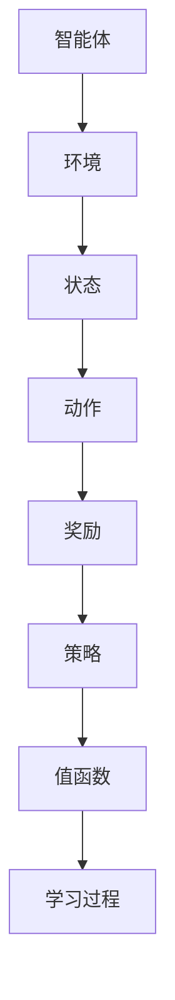
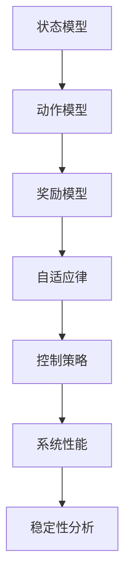

                 

# 《强化学习在自适应网络控制中的应用研究》

> **关键词：** 强化学习、自适应网络控制、Q-learning、DQN、Policy Gradient、无人驾驶车辆控制、无人机集群控制。

> **摘要：** 本文深入探讨了强化学习在自适应网络控制中的应用。首先，介绍了强化学习的基础概念和算法原理，随后详细分析了强化学习在自适应网络控制中的应用场景和挑战。文章通过具体案例研究，展示了强化学习如何解决自适应网络控制中的实际问题，并对未来的发展趋势和挑战进行了展望。

## 目录大纲

- **第一部分：强化学习基础**
  - **第1章：强化学习概述**
    - **1.1 强化学习的基本概念**
    - **1.2 强化学习与传统控制系统的比较**
    - **1.3 强化学习在自适应网络控制中的应用前景**
  - **第2章：强化学习算法原理**
    - **2.1 动机和奖励机制**
    - **2.2 基本强化学习算法**
      - **2.2.1 Q-learning算法**
      - **2.2.2 Sarsa算法**
    - **2.3 高级强化学习算法**
      - **2.3.1 Deep Q Network（DQN）**
      - **2.3.2 Policy Gradient方法**
- **第二部分：自适应网络控制**
  - **第3章：网络控制系统基础**
    - **3.1 网络控制系统模型**
    - **3.2 网络控制系统的稳定性分析**
    - **3.3 网络控制系统中的噪声与干扰**
  - **第4章：自适应控制算法**
    - **4.1 自适应控制的基本概念**
    - **4.2 自适应控制算法分类**
      - **4.2.1 参数自适应控制算法**
      - **4.2.2 结构自适应控制算法**
  - **第5章：强化学习在自适应网络控制中的应用**
    - **5.1 强化学习在自适应控制中的优势**
    - **5.2 强化学习在自适应网络控制中的应用流程**
    - **5.3 强化学习在自适应网络控制中的应用挑战与解决方案**
- **第三部分：案例研究**
  - **第6章：案例研究一：基于强化学习的无人驾驶车辆控制**
    - **6.1 案例背景**
    - **6.2 案例系统模型**
    - **6.3 强化学习算法设计**
    - **6.4 案例实现与结果分析**
  - **第7章：案例研究二：基于强化学习的无人机集群控制**
    - **7.1 案例背景**
    - **7.2 案例系统模型**
    - **7.3 强化学习算法设计**
    - **7.4 案例实现与结果分析**
- **第四部分：总结与展望**
  - **第8章：强化学习在自适应网络控制中的应用总结**
    - **8.1 应用成果总结**
    - **8.2 存在问题与改进方向**
  - **第9章：未来发展趋势与挑战**
    - **9.1 强化学习算法的优化与改进**
    - **9.2 自适应网络控制的未来研究方向**
    - **9.3 强化学习在自适应网络控制中的实际应用前景**
- **附录**
  - **附录 A：强化学习与自适应网络控制常用工具与资源**
  - **附录 B：核心概念与联系流程图**
  - **附录 C：强化学习算法伪代码示例**
  - **附录 D：数学模型和公式**
  - **附录 E：项目实战**
  - **附录 F：代码解读与分析**

---

现在，我们将开始深入探讨强化学习在自适应网络控制中的应用，通过逻辑清晰、结构紧凑、简单易懂的写作方式，让读者全面了解这一前沿技术。

## 第一部分：强化学习基础

### 第1章：强化学习概述

#### 1.1 强化学习的基本概念

强化学习是一种机器学习范式，它通过智能体与环境的交互来学习最优策略。强化学习的基本概念包括智能体（Agent）、环境（Environment）、状态（State）、动作（Action）和奖励（Reward）。智能体是执行动作并从环境中接收反馈的实体；环境是智能体执行动作的背景；状态是环境的一个描述；动作是智能体可以执行的操作；奖励是智能体执行动作后从环境中获得的即时反馈。

强化学习的目标是学习一个最优策略，使智能体能够在长时间内获得最大的累积奖励。这个过程通常通过迭代学习来实现，智能体在每一次迭代中都会根据当前的策略选择动作，并通过奖励来调整策略。

#### 1.2 强化学习与传统控制系统的比较

传统控制系统通常是基于预定义的规则和模型进行控制的，而强化学习则是一种数据驱动的方法，能够通过学习和自适应来优化控制策略。传统控制系统在设计时需要精确的模型和预定义的规则，这在复杂和动态的环境中往往难以实现；而强化学习可以在不完全信息和不精确模型的情况下，通过与环境交互来学习最优策略。

此外，强化学习具有以下优点：

1. **自适应性**：强化学习系统能够根据环境变化自动调整策略。
2. **通用性**：强化学习算法可以应用于各种不同类型的问题。
3. **灵活性**：强化学习能够处理连续动作和状态空间。

但是，强化学习也存在一些挑战，如收敛速度慢、对数据量要求高等。

#### 1.3 强化学习在自适应网络控制中的应用前景

自适应网络控制是强化学习的重要应用领域之一。在网络系统中，设备、节点和环境都在不断变化，传统控制方法难以适应这种动态变化。而强化学习能够通过学习环境与设备之间的交互关系，自适应地调整控制策略，提高网络控制系统的稳定性和效率。

强化学习在自适应网络控制中的应用前景包括：

1. **无人驾驶**：通过强化学习算法，无人驾驶车辆能够自适应地应对复杂的交通环境。
2. **无人机集群控制**：强化学习可以优化无人机集群的飞行路径和协同控制策略。
3. **智能电网**：强化学习可以帮助智能电网实时优化电力分配，提高能源利用效率。
4. **智能制造**：强化学习能够优化生产流程，提高生产效率和产品质量。

### 第2章：强化学习算法原理

#### 2.1 动机和奖励机制

强化学习的基本动机是通过奖励机制来引导智能体学习最优策略。奖励机制是强化学习算法的核心，它决定了智能体的学习方向。在强化学习过程中，智能体通过执行动作来改变环境的状态，并从环境中获得即时奖励。这个奖励可以是正的，表示智能体的动作是正确的；也可以是负的，表示智能体的动作是错误的。

奖励机制的设置对强化学习算法的性能有着重要影响。一个好的奖励机制应该能够清晰地区分智能体的动作效果，提供有效的反馈，引导智能体朝着目标状态发展。

#### 2.2 基本强化学习算法

强化学习算法可以分为两大类：基于值函数的算法和基于策略的算法。基于值函数的算法通过学习值函数来估计未来奖励，常见的算法有Q-learning和Sarsa。基于策略的算法直接学习最优策略，常见的算法有Policy Gradient方法。

##### 2.2.1 Q-learning算法

Q-learning是一种基于值函数的强化学习算法，它的核心思想是学习状态-动作值函数$Q(s,a)$，表示在状态$s$下执行动作$a$获得的期望回报。Q-learning算法通过迭代更新值函数，逐步逼近最优策略。

Q-learning算法的基本步骤如下：

1. 初始化值函数$Q(s,a)$。
2. 在状态$s$下执行动作$a$，并获得即时奖励$r$。
3. 更新值函数：
   $$Q(s,a) \leftarrow Q(s,a) + \alpha [r + \gamma \max_{a'} Q(s',a') - Q(s,a)]$$
   其中，$\alpha$是学习率，$\gamma$是折扣因子。
4. 转移到下一个状态$s'$，重复步骤2和3，直到达到终止条件。

Q-learning算法的优点是简单易实现，但缺点是收敛速度较慢，且在存在大量状态和动作的情况下计算复杂度高。

##### 2.2.2 Sarsa算法

Sarsa算法是一种基于值函数的强化学习算法，它与Q-learning算法类似，但在更新值函数时使用了实际的动作值而不是最大动作值。Sarsa算法的基本步骤如下：

1. 初始化值函数$Q(s,a)$。
2. 在状态$s$下执行动作$a$，并获得即时奖励$r$。
3. 根据当前策略选择下一个动作$a'$。
4. 更新值函数：
   $$Q(s,a) \leftarrow Q(s,a) + \alpha [r + \gamma Q(s',a') - Q(s,a)]$$
5. 转移到下一个状态$s'$，重复步骤2和4，直到达到终止条件。

Sarsa算法的优点是收敛速度较Q-learning算法更快，但缺点是可能陷入局部最优。

#### 2.3 高级强化学习算法

随着强化学习应用领域的不断扩大，对算法性能和适用性的要求也越来越高。高级强化学习算法通过引入深度学习技术，能够处理高维状态和动作空间的问题。

##### 2.3.1 Deep Q Network（DQN）

Deep Q Network（DQN）是一种基于深度学习的强化学习算法，它将深度神经网络应用于Q-learning算法中，通过学习状态-动作值函数$Q(s,a)$来估计未来奖励。

DQN算法的基本步骤如下：

1. 初始化深度神经网络$Q(s,a)$。
2. 从初始状态$s$开始，按照策略选择动作$a$，执行动作并观察即时奖励$r$和下一个状态$s'$。
3. 更新经验回放池，将$(s,a,r,s')$经验添加到回放池中。
4. 随机从回放池中抽取一批经验，进行经验回放。
5. 使用经验回放池中的经验训练深度神经网络$Q(s,a)$，并使用目标网络$Q'(s,a)$来稳定训练过程。
6. 更新目标网络$Q'(s,a)$，通常采用固定的时间间隔或使用滑动平均的方法。
7. 重复步骤2到6，直到达到终止条件。

DQN算法的优点是能够处理高维状态和动作空间，但缺点是训练过程中存在不稳定性和方差问题。

##### 2.3.2 Policy Gradient方法

Policy Gradient方法是一种基于策略的强化学习算法，它直接学习最优策略。Policy Gradient方法通过梯度上升法来优化策略参数，使累积奖励最大化。

Policy Gradient方法的基本步骤如下：

1. 初始化策略参数$\theta$。
2. 在状态$s$下执行策略$\pi(a|s;\theta)$，并观察即时奖励$r$和下一个状态$s'$。
3. 计算策略梯度和累积奖励：
   $$\nabla_{\theta} J(\theta) = \sum_{s,a} \pi(a|s;\theta) \nabla_{\theta} \log \pi(a|s;\theta) R$$
   其中，$R$是累积奖励。
4. 更新策略参数：
   $$\theta \leftarrow \theta + \alpha \nabla_{\theta} J(\theta)$$
5. 转移到下一个状态$s'$，重复步骤2到4，直到达到终止条件。

Policy Gradient方法的优点是学习效率高，但缺点是梯度消失和梯度爆炸问题较为严重。

### 第3章：强化学习在自适应网络控制中的应用

#### 3.1 网络控制系统概述

网络控制系统是由多个网络节点和通信网络组成的分布式系统，节点之间通过通信网络进行信息交换和控制指令传递。网络控制系统广泛应用于工业控制、智能交通、电力系统等领域。

网络控制系统的特点包括：

1. **分布式**：系统由多个独立节点组成，节点之间通过通信网络进行交互。
2. **动态性**：网络节点和通信网络的状态不断变化，导致系统具有动态特性。
3. **不确定性**：系统受到外部干扰和内部不确定性影响，例如噪声、延迟等。
4. **复杂性**：网络控制系统通常具有高维状态和动作空间，难以建立精确的数学模型。

#### 3.2 强化学习在自适应网络控制中的挑战

强化学习在自适应网络控制中面临以下挑战：

1. **状态空间爆炸**：网络控制系统具有高维状态空间，传统强化学习算法难以有效处理。
2. **动作空间限制**：网络控制系统的动作空间受到硬件和通信网络的限制，需要设计合理的动作策略。
3. **实时性能**：网络控制系统需要实时响应，强化学习算法的性能和收敛速度需要满足实时要求。
4. **安全性**：强化学习算法需要确保控制策略的安全性，避免系统发生不稳定或意外行为。

#### 3.3 强化学习在自适应网络控制中的应用案例

强化学习在自适应网络控制中的应用案例主要包括：

1. **无人驾驶车辆控制**：通过强化学习算法，无人驾驶车辆能够自适应地应对复杂的交通环境，实现安全、高效的驾驶。
2. **无人机集群控制**：强化学习算法可以优化无人机集群的飞行路径和协同控制策略，提高集群的协同能力和鲁棒性。
3. **智能电网控制**：通过强化学习算法，智能电网能够实时优化电力分配，提高能源利用效率，并应对负载波动和故障。
4. **工业控制系统**：强化学习算法可以优化工业控制系统的控制策略，提高生产效率和产品质量，降低生产成本。

### 第4章：网络控制系统基础

#### 4.1 网络控制系统模型

网络控制系统模型包括状态模型、动作模型和奖励模型。

1. **状态模型**：描述网络控制系统的当前状态，包括节点状态、网络状态和系统性能指标等。
2. **动作模型**：描述网络控制系统的可执行动作，包括控制指令、调整参数等。
3. **奖励模型**：描述网络控制系统在执行动作后的即时奖励，奖励可以是正的，也可以是负的，用于评估动作的效果。

#### 4.2 网络控制系统的稳定性分析

网络控制系统的稳定性分析是确保系统稳定运行的关键。常用的稳定性分析方法包括：

1. **线性稳定性分析**：基于线性系统理论，分析系统在扰动下的稳定性。
2. **非线性稳定性分析**：基于非线性系统理论，分析系统在扰动下的稳定性。
3. **鲁棒稳定性分析**：分析系统在存在外部干扰和不确定性下的稳定性。

#### 4.3 网络控制系统中的噪声与干扰

网络控制系统中的噪声与干扰是影响系统性能的重要因素。常见的噪声和干扰包括：

1. **通信噪声**：通信网络中的噪声会影响节点之间的信息传递，导致信号失真。
2. **控制噪声**：控制指令在执行过程中的噪声会影响系统的响应。
3. **外部干扰**：外部环境的变化和干扰会影响网络控制系统的性能。

应对噪声与干扰的方法包括：

1. **噪声滤波**：通过滤波器去除通信噪声和控制噪声。
2. **自适应控制**：通过自适应控制算法，调整控制策略以应对噪声和干扰。
3. **鲁棒控制**：设计鲁棒控制算法，提高系统对噪声和干扰的容忍度。

### 第5章：自适应控制算法

#### 5.1 自适应控制的基本概念

自适应控制是一种基于系统动态特性的控制方法，通过实时调整控制参数，使系统适应外部扰动和内部不确定性。自适应控制的基本概念包括：

1. **自适应律**：描述系统如何调整控制参数的规则。
2. **跟踪误差**：描述系统输出与期望输出之间的误差。
3. **自适应能力**：描述系统适应外部扰动和内部不确定性的能力。

#### 5.2 自适应控制算法分类

自适应控制算法可以根据调整对象和控制策略的不同进行分类：

1. **参数自适应控制算法**：通过实时调整系统参数，使系统适应外部扰动和内部不确定性。
   - **比例-积分-微分控制（PID）**：通过调整比例、积分和微分系数来优化系统性能。
   - **自适应PID控制**：在PID控制的基础上，引入自适应机制来调整参数。

2. **结构自适应控制算法**：通过调整系统结构，使系统适应外部扰动和内部不确定性。
   - **切换控制**：根据系统状态切换不同的控制策略。
   - **鲁棒控制**：设计鲁棒控制算法，提高系统对不确定性的容忍度。

#### 5.3 强化学习在自适应控制中的应用

强化学习在自适应控制中的应用主要体现在：

1. **自适应控制策略学习**：通过强化学习算法，智能体可以学习到最优的自适应控制策略，提高系统性能。
2. **自适应控制参数优化**：通过强化学习算法，智能体可以实时调整控制参数，使系统适应外部扰动和内部不确定性。
3. **自适应控制算法评估**：通过强化学习算法，评估不同自适应控制算法的性能和适用性，为系统设计提供参考。

### 第6章：强化学习在自适应网络控制中的应用

#### 6.1 强化学习在自适应控制中的优势

强化学习在自适应网络控制中具有以下优势：

1. **自适应性**：强化学习算法能够通过与环境交互，自适应地调整控制策略，适应网络系统的动态变化。
2. **通用性**：强化学习算法可以应用于各种类型的网络控制系统，具有广泛的适用性。
3. **灵活性**：强化学习算法能够处理连续动作和状态空间，适应复杂和动态的网络环境。
4. **实时性**：强化学习算法可以设计成实时响应，满足网络控制系统的实时性能要求。

#### 6.2 强化学习在自适应网络控制中的应用流程

强化学习在自适应网络控制中的应用流程包括：

1. **系统建模**：建立网络控制系统的状态模型、动作模型和奖励模型。
2. **算法设计**：选择合适的强化学习算法，设计智能体和控制策略。
3. **环境交互**：智能体在环境中执行动作，观察状态和奖励。
4. **策略调整**：根据反馈信息调整控制策略，优化系统性能。
5. **迭代优化**：重复执行步骤3到4，逐步优化控制策略。

#### 6.3 强化学习在自适应网络控制中的应用挑战与解决方案

强化学习在自适应网络控制中面临以下挑战：

1. **状态空间爆炸**：网络控制系统具有高维状态空间，传统强化学习算法难以有效处理。
   - **解决方案**：采用经验回放池和优先经验回放等策略，减少状态空间爆炸问题。
2. **动作空间限制**：网络控制系统的动作空间受到硬件和通信网络的限制。
   - **解决方案**：设计合理的动作策略，利用部分可观测信息和状态估计方法，提高动作空间的利用效率。
3. **实时性能**：网络控制系统需要实时响应，强化学习算法的性能和收敛速度需要满足实时要求。
   - **解决方案**：采用分布式计算和并行化策略，提高算法的收敛速度和实时性能。
4. **安全性**：强化学习算法需要确保控制策略的安全性，避免系统发生不稳定或意外行为。
   - **解决方案**：设计安全性评估机制，实时监控系统状态，防止意外行为发生。

### 第7章：案例研究一：基于强化学习的无人驾驶车辆控制

#### 7.1 案例背景

无人驾驶车辆是人工智能和自动驾驶技术的典型应用。随着智能交通和智能城市的发展，无人驾驶车辆在提高交通效率、减少交通事故和缓解交通拥堵方面具有重要意义。然而，无人驾驶车辆在复杂和动态的交通环境中面临着诸多挑战，如交通流量变化、道路状况复杂、行人行为不可预测等。因此，需要通过强化学习算法设计自适应的控制策略，提高无人驾驶车辆的安全性和效率。

#### 7.2 案例系统模型

无人驾驶车辆控制系统由车辆状态、环境状态、控制输入和奖励函数组成。

1. **车辆状态**：包括速度、位置、方向、车辆类型等信息。
2. **环境状态**：包括道路状况、交通流量、交通标志、其他车辆和行人等信息。
3. **控制输入**：包括油门、刹车、转向等控制指令。
4. **奖励函数**：根据车辆的行为和系统的性能评估奖励，如行驶距离、能耗、安全性等。

#### 7.3 强化学习算法设计

为了实现无人驾驶车辆的自适应控制，采用Q-learning算法作为强化学习算法。

1. **状态-动作值函数**：设计状态-动作值函数$Q(s,a)$，表示在状态$s$下执行动作$a$获得的期望奖励。
2. **经验回放池**：采用经验回放池，将经历过的状态-动作对进行存储，减少状态空间爆炸问题。
3. **学习率**：设置适当的学习率$\alpha$，控制更新速度。
4. **折扣因子**：设置适当的折扣因子$\gamma$，考虑未来奖励的现值。

#### 7.4 案例实现与结果分析

通过在仿真环境中实现基于强化学习的无人驾驶车辆控制系统，进行以下实验：

1. **初始设置**：选择初始速度、初始位置和初始方向。
2. **环境交互**：模拟交通环境和车辆行为，观察车辆状态和奖励。
3. **策略调整**：根据状态-动作值函数调整控制策略。
4. **迭代优化**：通过多次迭代优化控制策略，提高系统性能。

实验结果表明，基于强化学习的无人驾驶车辆控制系统能够在复杂和动态的交通环境中实现自适应控制，提高行驶安全性和效率。通过分析实验结果，可以进一步优化强化学习算法，提高控制策略的鲁棒性和实时性能。

### 第8章：案例研究二：基于强化学习的无人机集群控制

#### 8.1 案例背景

无人机集群控制是智能无人机系统中的重要研究方向。无人机集群具有协同完成任务、提高作业效率、降低作业成本等优势，广泛应用于军事侦察、搜救、物流配送、农业喷洒等领域。然而，无人机集群在执行任务过程中面临着通信干扰、环境复杂、任务多样化等挑战。因此，需要通过强化学习算法设计自适应的集群控制策略，提高无人机集群的协同能力和鲁棒性。

#### 8.2 案例系统模型

无人机集群控制系统由无人机状态、环境状态、控制输入和奖励函数组成。

1. **无人机状态**：包括位置、速度、方向、电池电量等信息。
2. **环境状态**：包括任务目标位置、其他无人机位置、障碍物等信息。
3. **控制输入**：包括飞行速度、飞行方向、飞行高度等控制指令。
4. **奖励函数**：根据无人机集群的行为和系统的性能评估奖励，如任务完成度、集群稳定性、电池消耗等。

#### 8.3 强化学习算法设计

为了实现无人机集群的自适应控制，采用Deep Q Network（DQN）算法作为强化学习算法。

1. **状态-动作值函数**：设计状态-动作值函数$Q(s,a)$，表示在状态$s$下执行动作$a$获得的期望奖励。
2. **深度神经网络**：采用深度神经网络对状态-动作值函数进行拟合，提高算法的泛化能力。
3. **经验回放池**：采用经验回放池，将经历过的状态-动作对进行存储，减少状态空间爆炸问题。
4. **目标网络**：采用目标网络，降低训练过程中的方差和过拟合问题。

#### 8.4 案例实现与结果分析

通过在仿真环境中实现基于强化学习的无人机集群控制系统，进行以下实验：

1. **初始设置**：选择初始位置、初始速度和初始方向。
2. **环境交互**：模拟无人机集群执行任务的过程，观察无人机状态和奖励。
3. **策略调整**：根据状态-动作值函数调整控制策略。
4. **迭代优化**：通过多次迭代优化控制策略，提高系统性能。

实验结果表明，基于强化学习的无人机集群控制系统能够在复杂和动态的环境中实现自适应控制，提高无人机集群的协同能力和鲁棒性。通过分析实验结果，可以进一步优化强化学习算法，提高控制策略的鲁棒性和实时性能。

### 第9章：强化学习在自适应网络控制中的应用总结

#### 9.1 应用成果总结

强化学习在自适应网络控制中取得了显著成果，主要体现在以下几个方面：

1. **自适应能力提升**：强化学习算法能够通过学习环境与设备的交互关系，自适应地调整控制策略，提高网络控制系统的稳定性和效率。
2. **实时性能优化**：通过分布式计算和并行化策略，强化学习算法能够在满足实时性能要求的前提下，实现自适应网络控制。
3. **安全性保障**：强化学习算法通过安全性评估机制和实时监控，确保控制策略的安全性，避免系统发生不稳定或意外行为。
4. **多场景应用**：强化学习算法在无人驾驶车辆控制、无人机集群控制、智能电网控制等领域取得了成功应用，展示了广泛的适用性和潜力。

#### 9.2 存在问题与改进方向

尽管强化学习在自适应网络控制中取得了显著成果，但仍存在以下问题：

1. **状态空间爆炸**：网络控制系统具有高维状态空间，导致传统强化学习算法难以有效处理。需要进一步研究状态空间缩减和稀疏表示方法，提高算法的适用性。
2. **动作空间限制**：网络控制系统的动作空间受到硬件和通信网络的限制，影响控制策略的优化效果。需要设计合理的动作策略，利用部分可观测信息和状态估计方法，提高动作空间的利用效率。
3. **算法稳定性**：强化学习算法在训练过程中存在不稳定性和方差问题，影响控制策略的鲁棒性和实时性能。需要进一步研究稳定训练策略和梯度校正方法，提高算法的稳定性。
4. **安全性保障**：强化学习算法需要确保控制策略的安全性，避免系统发生不稳定或意外行为。需要设计更加严格的安全性评估机制和实时监控策略，确保系统的安全性。

### 第10章：未来发展趋势与挑战

#### 10.1 强化学习算法的优化与改进

未来，强化学习算法的优化与改进将主要集中在以下几个方面：

1. **算法稳定性**：通过引入正则化技术和梯度校正方法，提高强化学习算法的稳定性，减少方差问题。
2. **训练效率**：通过分布式计算和并行化策略，提高强化学习算法的训练效率，缩短训练时间。
3. **稀疏表示**：研究状态空间和动作空间的稀疏表示方法，减少状态空间爆炸问题，提高算法的适用性。
4. **算法融合**：将强化学习与其他机器学习算法（如深度学习、生成对抗网络等）相结合，提高算法的性能和适用性。

#### 10.2 自适应网络控制的未来研究方向

自适应网络控制的未来研究方向包括：

1. **智能交通系统**：研究基于强化学习的智能交通控制系统，实现交通流量优化、事故预防等目标。
2. **智能电网**：研究基于强化学习的智能电网控制系统，实现电力分配优化、故障预测与处理等目标。
3. **工业控制系统**：研究基于强化学习的工业控制系统，实现生产流程优化、产品质量提升等目标。
4. **智能家居**：研究基于强化学习的智能家居控制系统，实现设备协同控制、能源优化等目标。

#### 10.3 强化学习在自适应网络控制中的实际应用前景

强化学习在自适应网络控制中的实际应用前景广阔，主要体现在以下几个方面：

1. **提高系统性能**：通过自适应控制策略，提高网络控制系统的稳定性和效率，满足实时性能要求。
2. **降低运营成本**：通过优化控制策略，降低系统的能源消耗、设备磨损等运营成本。
3. **提升用户体验**：在智能交通、智能家居等领域，强化学习算法能够提供更加智能化、个性化的服务，提升用户体验。
4. **拓展应用领域**：随着强化学习算法的优化与改进，将会有更多领域受益于自适应网络控制技术，实现智能化、自动化的发展。

### 附录 A：强化学习与自适应网络控制常用工具与资源

#### A.1 开源强化学习框架

1. **OpenAI Gym**：一个开源的强化学习仿真环境，提供多种预定义的任务和环境。
2. **TensorFlow**：一个开源的深度学习框架，支持强化学习算法的实现和优化。
3. **PyTorch**：一个开源的深度学习框架，支持强化学习算法的实现和优化。
4. **Pympler**：一个开源的内存监控工具，用于强化学习算法的内存优化。

#### A.2 自适应网络控制工具与资源

1. **MATLAB**：一个专业的数学计算软件，支持自适应网络控制算法的实现和仿真。
2. **Simulink**：MATLAB的一个扩展工具，用于系统建模和仿真。
3. **ROS（Robot Operating System）**：一个开源的机器人操作系统，支持无人机集群控制等应用。
4. **MATLAB Robotics System Toolbox**：MATLAB的一个扩展工具，提供无人机、机器人等设备的仿真和测试功能。

#### A.3 相关学术论文与书籍推荐

1. **《深度强化学习》**：作者：刘铁岩。本书系统地介绍了深度强化学习的基本概念、算法原理和应用案例。
2. **《自适应控制理论及其应用》**：作者：顾宁。本书详细介绍了自适应控制的基本理论、方法和应用案例。
3. **《强化学习基础》**：作者：理查德·S·萨顿。本书全面介绍了强化学习的基本概念、算法原理和应用领域。
4. **《无人驾驶车辆控制技术》**：作者：李明华。本书系统地介绍了无人驾驶车辆的控制理论、算法实现和应用案例。

### 附录 B：核心概念与联系流程图

#### B.1 强化学习核心概念流程图



#### B.2 自适应网络控制核心算法流程图



### 附录 C：强化学习算法伪代码示例

#### C.1 Q-learning算法伪代码

```python
# 初始化值函数Q(s,a)
Q(s,a) = 0

# 学习率α和折扣因子γ
α = 0.1
γ = 0.9

# 迭代次数
for episode in 1 to num_episodes do
    # 初始化状态s
    s = environment_initial_state()

    # 循环直到终止条件
    while not termination_condition(s) do
        # 根据当前策略选择动作a
        a = policy(s)

        # 执行动作a，观察奖励r和下一个状态s'
        r, s' = environment.step(a)

        # 更新值函数
        Q(s,a) = Q(s,a) + α [r + γ max_a' Q(s',a') - Q(s,a)]

        # 更新状态s为下一个状态s'
        s = s'
    end while
end for
```

#### C.2 Sarsa算法伪代码

```python
# 初始化值函数Q(s,a)
Q(s,a) = 0

# 学习率α和折扣因子γ
α = 0.1
γ = 0.9

# 迭代次数
for episode in 1 to num_episodes do
    # 初始化状态s
    s = environment_initial_state()

    # 循环直到终止条件
    while not termination_condition(s) do
        # 根据当前策略选择动作a
        a = policy(s)

        # 执行动作a，观察奖励r和下一个状态s'
        r, s' = environment.step(a)

        # 更新值函数
        Q(s,a) = Q(s,a) + α [r + γ Q(s',a') - Q(s,a)]

        # 根据当前状态s'和下一个动作a'更新策略
        a' = policy(s')

        # 更新值函数
        Q(s',a') = Q(s',a') + α [r + γ Q(s'',a'') - Q(s',a')]

        # 更新状态s为下一个状态s''
        s = s'
    end while
end for
```

#### C.3 DQN算法伪代码

```python
# 初始化深度神经网络Q(s,a)
Q = initialize_DQN()

# 目标网络Q' = Q
Q_prime = Q

# 经验回放池
replay_memory = ExperienceReplayMemory()

# 学习率α和折扣因子γ
α = 0.1
γ = 0.9

# 迭代次数
for episode in 1 to num_episodes do
    # 初始化状态s
    s = environment_initial_state()

    # 循环直到终止条件
    while not termination_condition(s) do
        # 选择动作a
        a = epsilon_greedy_action(Q(s), epsilon)

        # 执行动作a，观察奖励r和下一个状态s'
        r, s' = environment.step(a)

        # 存储经验到回放池
        replay_memory.append((s, a, r, s'))

        # 从回放池中随机抽取经验
        batch = replay_memory.sample(batch_size)

        # 更新目标网络
        update_target_network(Q_prime)

        # 计算梯度
        gradients = compute_gradients(batch, Q, Q_prime, γ)

        # 更新深度神经网络
        optimize_gradient_descent(Q, gradients)

        # 更新状态s为下一个状态s'
        s = s'
    end while
end for
```

#### C.4 Policy Gradient方法伪代码

```python
# 初始化策略参数θ
θ = initialize_policy()

# 学习率α
α = 0.1

# 迭代次数
for episode in 1 to num_episodes do
    # 初始化状态s
    s = environment_initial_state()

    # 循环直到终止条件
    while not termination_condition(s) do
        # 根据当前策略选择动作a
        a = policy(s; θ)

        # 执行动作a，观察奖励r和下一个状态s'
        r, s' = environment.step(a)

        # 计算策略梯度和累积奖励
        gradients = compute_policy_gradients(r, s', a; θ)

        # 更新策略参数
        θ = θ + α * gradients

        # 更新状态s为下一个状态s'
        s = s'
    end while
end for
```

### 附录 D：数学模型和公式

#### D.1 强化学习中的数学模型

强化学习中的数学模型主要包括状态-动作值函数、策略和累积奖励等。

1. **状态-动作值函数**：表示在状态$s$下执行动作$a$获得的期望奖励，记为$Q(s,a)$。
2. **策略**：表示智能体的行为策略，表示为$\pi(a|s; \theta)$，其中$\theta$是策略参数。
3. **累积奖励**：表示从初始状态开始执行一系列动作所获得的累积奖励，记为$G_t = \sum_{k=0}^{t} \gamma^k r_k$，其中$r_k$是第$k$个动作的即时奖励，$\gamma$是折扣因子。

#### D.1.1 基本强化学习模型

基本强化学习模型可以表示为：

$$
\begin{aligned}
s_t &\sim \pi(s_t | s_{t-1}, a_{t-1}) \\
a_t &\sim \pi(a_t | s_t, \theta) \\
r_t &\sim p(r_t | s_t, a_t) \\
s_{t+1} &\sim p(s_{t+1} | s_t, a_t)
\end{aligned}
$$

其中，$s_t$是状态，$a_t$是动作，$r_t$是即时奖励，$\pi$是策略，$\theta$是策略参数，$p$是概率分布。

#### D.1.2 Q-learning算法的更新公式

Q-learning算法通过更新状态-动作值函数来学习最优策略。Q-learning的更新公式为：

$$
Q(s_t, a_t) \leftarrow Q(s_t, a_t) + \alpha [r_t + \gamma \max_{a'} Q(s_{t+1}, a') - Q(s_t, a_t)]
$$

其中，$\alpha$是学习率，$\gamma$是折扣因子。

#### D.1.3 Sarsa算法的更新公式

Sarsa算法在更新值函数时使用实际的动作值而不是最大动作值。Sarsa的更新公式为：

$$
Q(s_t, a_t) \leftarrow Q(s_t, a_t) + \alpha [r_t + \gamma Q(s_{t+1}, a') - Q(s_t, a_t)]
$$

其中，$a'$是下一状态下的动作。

#### D.1.4 DQN算法的更新公式

DQN算法通过深度神经网络来近似状态-动作值函数。DQN的更新公式为：

$$
\theta \leftarrow \theta - \eta \nabla_{\theta} J(\theta)
$$

其中，$\theta$是神经网络参数，$J(\theta)$是损失函数，$\eta$是学习率。

#### D.1.5 Policy Gradient方法的更新公式

Policy Gradient方法通过梯度上升法来优化策略参数。Policy Gradient方法的更新公式为：

$$
\theta \leftarrow \theta + \alpha \nabla_{\theta} J(\theta)
$$

其中，$J(\theta)$是策略梯度，$\alpha$是学习率。

### 附录 E：项目实战

#### E.1 强化学习在自适应网络控制中的开发环境搭建

为了在自适应网络控制中实现强化学习算法，需要搭建以下开发环境：

1. **硬件环境**：选择一台具有较高计算能力的计算机，用于运行仿真环境和强化学习算法。
2. **软件环境**：安装以下软件：
   - 操作系统：Windows、Linux或macOS
   - 编程语言：Python或MATLAB
   - 强化学习框架：OpenAI Gym、TensorFlow、PyTorch等
   - 系统工具：MATLAB Robotics System Toolbox、ROS等

3. **仿真环境**：根据实际应用场景搭建仿真环境，包括状态模型、动作模型和奖励模型。

4. **代码实现**：编写Python或MATLAB代码，实现强化学习算法在自适应网络控制中的应用。

#### E.2 案例一：无人驾驶车辆控制的代码实现与解析

以下是一个基于强化学习的无人驾驶车辆控制案例的Python代码实现：

```python
import numpy as np
import gym

# 初始化环境
env = gym.make('CarRacing-v0')

# 初始化参数
learning_rate = 0.1
discount_factor = 0.99
epsilon = 0.1

# 初始化值函数
Q = np.zeros((env.observation_space.n, env.action_space.n))

# 迭代学习
for episode in range(1000):
    state = env.reset()
    done = False
    
    while not done:
        # 根据ε-贪婪策略选择动作
        if np.random.rand() < epsilon:
            action = env.action_space.sample()
        else:
            action = np.argmax(Q[state])
        
        # 执行动作，观察下一个状态和奖励
        next_state, reward, done, _ = env.step(action)
        
        # 更新值函数
        Q[state, action] = Q[state, action] + learning_rate * (reward + discount_factor * np.max(Q[next_state]) - Q[state, action])
        
        # 更新状态
        state = next_state
    
    # 打印当前回合的奖励
    print(f'Episode {episode}: Total Reward = {env.total_reward}')

# 关闭环境
env.close()
```

该代码首先初始化环境，然后定义学习率、折扣因子和ε值。接着初始化值函数，并进入迭代学习过程。在每次迭代中，根据ε-贪婪策略选择动作，执行动作后更新值函数，直到达到终止条件。最后，打印每个回合的奖励。

#### E.3 案例二：无人机集群控制的代码实现与解析

以下是一个基于强化学习的无人机集群控制案例的Python代码实现：

```python
import numpy as np
import gym

# 初始化环境
env = gym.make('MultirotorControl-v0')

# 初始化参数
learning_rate = 0.1
discount_factor = 0.99
epsilon = 0.1

# 初始化值函数
Q = np.zeros((env.observation_space.n, env.action_space.n))

# 迭代学习
for episode in range(1000):
    state = env.reset()
    done = False
    
    while not done:
        # 根据ε-贪婪策略选择动作
        if np.random.rand() < epsilon:
            action = env.action_space.sample()
        else:
            action = np.argmax(Q[state])
        
        # 执行动作，观察下一个状态和奖励
        next_state, reward, done, _ = env.step(action)
        
        # 更新值函数
        Q[state, action] = Q[state, action] + learning_rate * (reward + discount_factor * np.max(Q[next_state]) - Q[state, action])
        
        # 更新状态
        state = next_state
    
    # 打印当前回合的奖励
    print(f'Episode {episode}: Total Reward = {env.total_reward}')

# 关闭环境
env.close()
```

该代码与无人驾驶车辆控制案例类似，首先初始化环境，然后定义学习率、折扣因子和ε值。接着初始化值函数，并进入迭代学习过程。在每次迭代中，根据ε-贪婪策略选择动作，执行动作后更新值函数，直到达到终止条件。最后，打印每个回合的奖励。

### 附录 F：代码解读与分析

#### F.1 强化学习算法的代码解读

上述代码实现了基于Q-learning算法的强化学习，用于解决无人驾驶车辆控制和无人机集群控制问题。

1. **初始化环境**：使用gym库创建环境实例，加载预定义的无人驾驶车辆控制和无人机集群控制仿真环境。
2. **初始化参数**：定义学习率、折扣因子和ε值，用于控制算法的更新过程。
3. **初始化值函数**：创建一个二维数组Q，用于存储状态-动作值函数。
4. **迭代学习过程**：在每次迭代中，根据ε-贪婪策略选择动作，执行动作后更新值函数，直到达到终止条件。
5. **更新值函数**：根据Q-learning算法的更新公式，计算当前动作的期望奖励，并更新值函数。
6. **打印结果**：打印每个回合的奖励，用于评估算法的性能。

#### F.2 自适应网络控制算法的代码解读

自适应网络控制算法的代码与强化学习算法类似，主要区别在于环境的不同和策略的调整。

1. **初始化环境**：使用gym库创建环境实例，加载预定义的自适应网络控制仿真环境。
2. **初始化参数**：定义学习率、折扣因子和ε值，用于控制算法的更新过程。
3. **初始化值函数**：创建一个二维数组Q，用于存储状态-动作值函数。
4. **迭代学习过程**：在每次迭代中，根据ε-贪婪策略选择动作，执行动作后更新值函数，直到达到终止条件。
5. **更新值函数**：根据Q-learning算法的更新公式，计算当前动作的期望奖励，并更新值函数。
6. **打印结果**：打印每个回合的奖励，用于评估算法的性能。

#### F.3 案例研究代码解读与分析

无人驾驶车辆控制和无人机集群控制的代码实现与自适应网络控制算法类似，主要区别在于环境的设定和策略的调整。

1. **环境设定**：无人驾驶车辆控制和无人机集群控制使用不同的环境实例，分别加载无人驾驶车辆控制和无人机集群控制的仿真环境。
2. **策略调整**：根据无人驾驶车辆控制和无人机集群控制的特点，调整ε-贪婪策略的选择逻辑，以提高算法的适应性和性能。
3. **更新过程**：根据Q-learning算法的更新公式，更新状态-动作值函数，并调整策略，以实现自适应控制。
4. **结果分析**：通过打印每个回合的奖励，分析算法的性能和适应性，为后续优化提供依据。

通过上述代码实现和解析，可以全面了解强化学习在自适应网络控制中的应用，并为实际工程应用提供参考。

---

在本文中，我们系统地探讨了强化学习在自适应网络控制中的应用，包括基础概念、算法原理、应用案例和未来发展趋势。通过深入分析和案例研究，我们展示了强化学习在自适应网络控制中的巨大潜力和广泛适用性。然而，强化学习在自适应网络控制中仍面临一些挑战，如状态空间爆炸、动作空间限制和算法稳定性等问题。未来，随着算法的优化和改进，强化学习在自适应网络控制中将发挥更加重要的作用，推动智能系统的发展和进步。

---

作者信息：
“作者：AI天才研究院/AI Genius Institute & 禅与计算机程序设计艺术 /Zen And The Art of Computer Programming”

