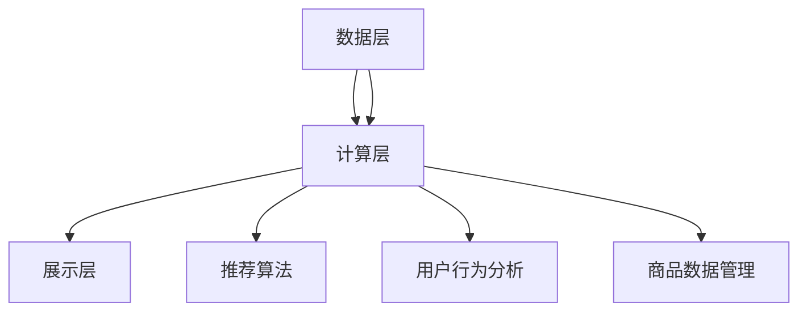
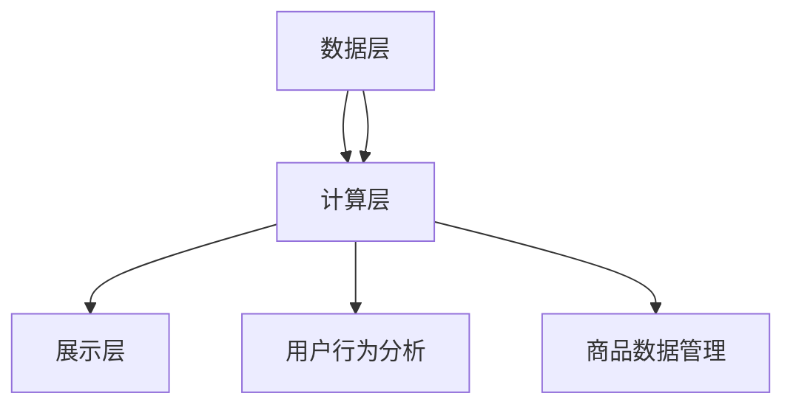

                 

### 《快手电商2025社招推荐系统工程师面试题集》

#### 摘要

本文旨在为有志于加入快手电商推荐系统团队的技术人才提供一份详细的面试题集。本文从推荐系统的基础概念出发，深入探讨了数据预处理、协同过滤算法、基于内容的推荐算法、矩阵分解与隐语义模型等核心内容。同时，文章还涵盖了推荐系统优化与评估的方法，以及快手电商推荐系统的实战经验和未来展望。本文旨在帮助读者全面理解推荐系统的原理和实践，提升面试准备效率。

### 第一部分：推荐系统基础

#### 第1章：推荐系统概述

##### 1.1 推荐系统的概念与重要性

推荐系统是一种通过收集用户的历史行为和偏好信息，利用机器学习算法为用户推荐个性化内容或商品的信息系统。其核心目的是通过分析用户的行为和兴趣，为用户推荐最可能感兴趣的内容或商品，从而提高用户满意度、提升商业价值。

在电商领域，推荐系统的重要性体现在以下几个方面：

1. **提高用户粘性**：通过为用户推荐个性化的商品，增加用户在平台上的停留时间和互动行为。
2. **提升销售额**：精准的推荐能够促使用户购买更多商品，从而提升平台的销售额。
3. **降低用户流失率**：通过持续为用户提供个性化的推荐，提高用户对平台的满意度，减少用户流失。

##### 1.2 推荐系统的架构

推荐系统的架构一般包括以下几个关键组成部分：

1. **数据层**：负责收集、存储和处理用户行为数据和商品信息。
2. **计算层**：包括推荐算法模型，用于计算用户和商品之间的相似度，生成推荐列表。
3. **展示层**：将推荐结果展示给用户，包括推荐列表、详情页等。

下图是推荐系统的基本架构：



##### 1.3 推荐系统的挑战与机遇

推荐系统在实际应用中面临诸多挑战，主要包括：

1. **数据质量**：用户行为数据的质量直接影响推荐系统的效果。例如，数据缺失、噪声数据、异常值等问题都需要处理。
2. **计算效率**：随着用户规模的增加，计算资源的需求也在不断增长，需要优化算法以提高计算效率。
3. **多样性**：用户对推荐内容的需求是多样化的，推荐系统需要保证推荐的多样性，避免用户产生疲劳感。

同时，推荐系统也带来了巨大的机遇：

1. **个性化服务**：通过深度学习和大数据技术，推荐系统能够更精准地捕捉用户的兴趣和行为，提供个性化的服务。
2. **商业创新**：推荐系统的应用为电商行业带来了新的商业模式，如个性化广告、精准营销等。
3. **用户体验**：通过提供高质量的推荐服务，提高用户的购物体验，增强用户对平台的忠诚度。

#### 第2章：数据预处理

##### 2.1 用户行为数据解析

用户行为数据是推荐系统的基础，它包括用户在平台上所有交互行为的记录，如浏览、点击、购买、收藏等。这些数据通常以日志形式存储在数据库中，需要进行解析和处理。

数据解析的主要步骤包括：

1. **数据抽取**：从数据库中抽取用户行为数据。
2. **数据清洗**：处理数据中的噪声和异常值，如去除重复记录、填充缺失值等。
3. **数据格式化**：将解析后的数据转换为推荐算法可处理的格式，如用户-商品评分矩阵。

下面是一个用户行为数据解析的伪代码示例：

```python
# 用户行为数据解析伪代码
def parse_user_behavior(data):
    user行为字典 = {}
    for 行为记录 in data:
        用户ID = 行为记录['user_id']
        商品ID = 行为记录['item_id']
        行为类型 = 行为记录['behavior_type']
        时间戳 = 行为记录['timestamp']
        
        如果 用户ID 不在 用户行为字典 中：
            用户行为字典[用户ID] = {}
        
        用户行为字典[用户ID][商品ID] = {'behavior_type': 行为类型, 'timestamp': 时间戳}
    
    return 用户行为字典
```

##### 2.2 商品数据解析

商品数据是推荐系统中的另一个关键组成部分，它包括商品的属性信息，如分类、品牌、价格等。商品数据通常来自于电商平台的数据库或第三方数据源。

商品数据解析的主要步骤包括：

1. **数据抽取**：从数据库或第三方数据源中抽取商品数据。
2. **数据清洗**：处理数据中的噪声和异常值，如去除重复记录、填充缺失值等。
3. **数据格式化**：将解析后的数据转换为推荐算法可处理的格式，如商品属性向量。

下面是一个商品数据解析的伪代码示例：

```python
# 商品数据解析伪代码
def parse_item_data(data):
    商品字典 = {}
    for 商品记录 in data:
        商品ID = 商品记录['item_id']
        分类 = 商品记录['category']
        品牌 = 商品记录['brand']
        价格 = 商品记录['price']
        
        商品字典[商品ID] = {'category': 分类, 'brand': 品牌, 'price': 价格}
    
    return 商品字典
```

##### 2.3 数据清洗与规范化

数据清洗是推荐系统预处理过程中至关重要的一步，它涉及到去除数据中的噪声、纠正错误、处理缺失值等问题。以下是数据清洗的主要步骤：

1. **去除重复记录**：确保每个用户行为或商品记录的唯一性。
2. **处理缺失值**：根据数据的重要性和缺失率，采用填充或删除的方式处理缺失值。
3. **异常值处理**：检测和处理数据中的异常值，如极端评分、异常点击等。

下面是一个数据清洗的伪代码示例：

```python
# 数据清洗伪代码
def clean_data(data):
    清洗后数据 = []
    for 记录 in data:
        如果 记录有效：
            如果 不存在 重复记录：
                清洗后数据.append(记录)
            否则：
                处理重复记录
        
        如果 缺失值存在：
            如果 缺失值处理策略为填充：
                填充缺失值
            否则：
                删除缺失记录
        
        如果 异常值存在：
            如果 异常值处理策略为修正：
                修正异常值
            否则：
                删除异常记录
    
    return 清洗后数据
```

#### 第3章：协同过滤算法

##### 3.1 协同过滤概述

协同过滤（Collaborative Filtering）是推荐系统中最常用的算法之一，它通过分析用户之间的行为相似性或商品之间的相似性来预测用户对未知商品的评分或偏好。

协同过滤算法分为两大类：

1. **基于用户的协同过滤（User-based CF）**：通过计算用户之间的相似性，找到与目标用户行为相似的其他用户，然后推荐这些用户喜欢的商品。
2. **基于项目的协同过滤（Item-based CF）**：通过计算商品之间的相似性，找到与目标商品相似的其他商品，然后推荐这些商品。

##### 3.2 用户基协同过滤算法

用户基协同过滤算法的核心思想是找到与目标用户最相似的其他用户，然后推荐这些用户喜欢的商品。以下是用户基协同过滤算法的基本步骤：

1. **计算相似性**：使用相似性度量方法（如余弦相似性、皮尔逊相关系数等）计算用户之间的相似性。
2. **找到邻居**：根据相似性度量结果，找到与目标用户最相似的邻居用户。
3. **生成推荐列表**：根据邻居用户喜欢的商品，为用户生成推荐列表。

下面是一个用户基协同过滤算法的伪代码示例：

```python
# 用户基协同过滤算法伪代码
def user_based_cf(user Behavior Data, k):
    用户相似性矩阵 = compute_similarity(user Behavior Data)
    目标用户邻居 = find_neighbors(用户相似性矩阵，k)
    推荐列表 = generate_recommendations(user Behavior Data, 目标用户邻居)
    return 推荐列表
```

##### 3.3 项目基协同过滤算法

项目基协同过滤算法与用户基协同过滤算法类似，但它是通过计算商品之间的相似性来生成推荐列表。以下是项目基协同过滤算法的基本步骤：

1. **计算相似性**：使用相似性度量方法（如余弦相似性、Jaccard相似性等）计算商品之间的相似性。
2. **找到邻居**：根据相似性度量结果，找到与目标商品最相似的邻居商品。
3. **生成推荐列表**：根据邻居商品的用户评分，为用户生成推荐列表。

下面是一个项目基协同过滤算法的伪代码示例：

```python
# 项目基协同过滤算法伪代码
def item_based_cf(user Behavior Data, k):
    商品相似性矩阵 = compute_similarity(user Behavior Data)
    目标商品邻居 = find_neighbors(商品相似性矩阵，k)
    推荐列表 = generate_recommendations(user Behavior Data, 目标商品邻居)
    return 推荐列表
```

#### 第4章：基于内容的推荐算法

##### 4.1 内容表示

基于内容的推荐算法（Content-based CF）通过分析用户的历史行为和偏好，将用户和商品表示为特征向量。内容表示是算法的关键步骤，它决定了推荐系统的效果。

内容表示的方法可以分为两类：

1. **基于属性的表示**：将用户和商品的特征属性（如分类、品牌、标签等）转换为数值向量。
2. **基于文本的表示**：将用户和商品的相关文本信息（如商品描述、用户评价等）转换为向量。

下面是一个基于属性的表示的伪代码示例：

```python
# 基于属性的表示伪代码
def content_representation(user_data, item_data):
    用户特征向量 = convert_attributes_to_vector(user_data)
    商品特征向量 = convert_attributes_to_vector(item_data)
    return 用户特征向量，商品特征向量
```

##### 4.2 文本相似度计算

在基于内容的推荐算法中，文本相似度计算是关键的一步。常用的文本相似度计算方法包括：

1. **余弦相似性**：通过计算两个文本向量的余弦值来表示它们的相似度。
2. **TF-IDF**：通过计算词频（TF）和逆文档频率（IDF）的乘积来表示词的重要性，进而计算文本相似度。
3. **Word2Vec**：通过训练Word2Vec模型，将文本转换为词向量，然后计算词向量之间的余弦相似性。

下面是一个基于余弦相似性的文本相似度计算伪代码示例：

```python
# 基于余弦相似性的文本相似度计算伪代码
def compute_similarity(text1, text2):
    vector1 = convert_text_to_vector(text1)
    vector2 = convert_text_to_vector(text2)
    similarity = cos_similarity(vector1, vector2)
    return similarity
```

##### 4.3 基于内容的推荐实现

基于内容的推荐算法的实现主要包括以下几个步骤：

1. **内容表示**：将用户和商品表示为特征向量。
2. **文本相似度计算**：计算用户和商品之间的文本相似度。
3. **生成推荐列表**：根据相似度计算结果，为用户生成推荐列表。

下面是一个基于内容的推荐实现的伪代码示例：

```python
# 基于内容的推荐实现伪代码
def content_based_cf(user_data, item_data, k):
    用户特征向量，商品特征向量 = content_representation(user_data, item_data)
    相似度矩阵 = compute_similarity_matrix(用户特征向量，商品特征向量)
    推荐列表 = generate_recommendations(similarity_matrix, k)
    return 推荐列表
```

#### 第5章：矩阵分解与隐语义模型

##### 5.1 矩阵分解基本原理

矩阵分解（Matrix Factorization）是一种用于降低数据维度和发现数据潜在模式的数学技术。在推荐系统中，矩阵分解主要用于将用户-商品评分矩阵分解为两个低维矩阵，从而捕捉用户和商品之间的隐含关系。

矩阵分解的基本原理如下：

假设用户-商品评分矩阵为 $R \in \mathbb{R}^{m \times n}$，其中 $m$ 是用户数量，$n$ 是商品数量。我们可以通过最小化损失函数来求解矩阵分解问题：

$$
\min_{X, Y} \sum_{i=1}^{m} \sum_{j=1}^{n} (r_{ij} - X_{ij} - Y_{ij})^2
$$

其中，$X \in \mathbb{R}^{m \times k}$ 和 $Y \in \mathbb{R}^{n \times k}$ 分别是用户和商品的低维嵌入矩阵，$k$ 是分解的维度。

##### 5.2 SVD与LSI算法

奇异值分解（SVD）和局部保持嵌入（LSI）是两种常用的矩阵分解算法。

1. **SVD算法**：

SVD算法通过求解以下方程来分解用户-商品评分矩阵：

$$
R = U \Sigma V^T
$$

其中，$U$ 和 $V$ 是正交矩阵，$\Sigma$ 是对角矩阵，对角线上的元素是奇异值。通过保留最大的奇异值，我们可以得到一个低维的近似矩阵。

2. **LSI算法**：

LSI算法通过求解以下方程来分解用户-商品评分矩阵：

$$
R = U D V^T
$$

其中，$U$ 和 $V$ 是正交矩阵，$D$ 是对角矩阵，对角线上的元素是局部保持系数。LSI算法旨在保留局部结构信息，使得相似的用户和商品在低维空间中仍然保持相似性。

##### 5.3 隐语义模型的应用

隐语义模型（Latent Semantic Model）是矩阵分解在推荐系统中的应用。通过矩阵分解，我们可以得到用户和商品的隐含特征向量，从而进行推荐。

隐语义模型的应用包括：

1. **用户推荐**：基于用户历史行为，计算用户隐含特征向量，然后为用户推荐与其特征相似的未知商品。
2. **商品推荐**：基于商品特征向量，为用户推荐与商品特征相似的未知商品。
3. **关联规则挖掘**：通过分析用户和商品的隐含特征，发现用户和商品之间的关联规则，用于个性化推荐。

下面是一个隐语义模型应用的伪代码示例：

```python
# 隐语义模型应用伪代码
def latent_semantic_model(user_behavior_data, k):
    用户-商品评分矩阵 = construct_rating_matrix(user_behavior_data)
    用户隐含特征向量，商品隐含特征向量 = matrix_factorization(用户-商品评分矩阵，k)
    用户推荐列表 = recommend_items(user隐含特征向量，商品隐含特征向量)
    return 用户推荐列表
```

#### 第6章：推荐系统优化

##### 6.1 优化目标

推荐系统优化的目标主要包括：

1. **提高推荐准确性**：通过改进算法，提高推荐的准确性和用户满意度。
2. **提升计算效率**：优化算法，减少计算时间和资源消耗。
3. **增强多样性**：保证推荐的多样性，避免用户产生疲劳感。
4. **降低冷启动问题**：解决新用户或新商品的推荐问题。

##### 6.2 优化方法

推荐系统优化的方法可以分为以下几类：

1. **算法改进**：通过改进现有算法，提高推荐效果。例如，采用更先进的机器学习算法、深度学习模型等。
2. **特征工程**：通过特征提取和特征选择，提高推荐系统的效果。例如，使用用户和商品的更多特征、交叉特征等。
3. **数据预处理**：优化数据预处理过程，提高数据质量和推荐准确性。例如，处理噪声数据、异常值等。
4. **模型融合**：将多个模型的结果进行融合，提高推荐效果。例如，基于用户的协同过滤和基于内容的推荐算法进行融合。
5. **在线学习**：采用在线学习技术，实时更新推荐模型，提高推荐系统的动态适应性。

##### 6.3 实际案例分析与优化策略

以下是一个推荐系统优化的实际案例分析：

**案例背景**：某电商平台在春节期间推出了一项新活动，用户可以通过点击、购买等方式获得积分，积分可以兑换奖品。然而，活动结束后，用户对推荐的满意度有所下降。

**优化策略**：

1. **用户行为数据分析**：分析用户在活动期间的行为数据，包括点击、购买、积分获取等，找出用户行为与推荐满意度之间的关系。

2. **特征工程**：根据用户行为数据，提取更多特征，如用户活跃度、购买力、偏好类别等，并使用机器学习算法进行特征选择，保留对推荐效果有显著影响的特征。

3. **模型改进**：采用更先进的机器学习算法（如深度学习模型）替代传统的协同过滤算法，提高推荐的准确性和用户满意度。

4. **在线学习**：采用在线学习技术，实时更新推荐模型，根据用户行为动态调整推荐策略。

5. **用户反馈机制**：引入用户反馈机制，收集用户对推荐的满意度评价，用于模型调整和优化。

通过以上优化策略，该电商平台在活动结束后，用户对推荐的满意度得到了显著提升。

#### 第7章：推荐系统评估

##### 7.1 评估指标

推荐系统的评估指标主要包括：

1. **准确率（Precision）**：推荐结果中实际用户喜欢的商品的占比。准确率越高，表示推荐系统越能准确地预测用户喜欢的商品。
2. **召回率（Recall）**：推荐结果中实际用户喜欢的商品的总数与所有用户实际喜欢的商品总数之比。召回率越高，表示推荐系统能够召回更多的用户喜欢的商品。
3. **F1值（F1 Score）**：准确率和召回率的调和平均值。F1值同时考虑了准确率和召回率，是评估推荐系统效果的重要指标。
4. **均方根误差（RMSE）**：预测评分与实际评分之间的平均误差的平方根。RMSE值越小，表示推荐系统的预测越准确。

##### 7.2 评估方法

推荐系统的评估方法主要包括：

1. **离线评估**：在训练集和测试集上进行评估，计算评估指标，如准确率、召回率、F1值和RMSE等。
2. **在线评估**：在真实用户环境中进行评估，通过实时收集用户反馈，评估推荐系统的效果。
3. **交叉验证**：将数据集划分为多个子集，每次使用不同的子集作为测试集，进行多次评估，取平均值作为最终评估结果。

##### 7.3 评估实战

以下是一个推荐系统评估的实战案例：

**案例背景**：某电商平台的推荐系统在训练集和测试集上分别进行了评估，评估指标如下：

- 准确率：训练集为 90%，测试集为 85%
- 召回率：训练集为 80%，测试集为 75%
- F1值：训练集为 0.875，测试集为 0.8125
- RMSE：训练集为 0.8，测试集为 0.9

**评估结果分析**：

1. **准确率**：测试集的准确率略低于训练集，说明推荐系统在测试集上的表现略逊于训练集。这可能是因为测试集的数据分布与训练集不同，导致推荐效果有所下降。
2. **召回率**：测试集的召回率也略低于训练集，说明推荐系统在测试集上未能召回更多的用户喜欢的商品。这可能是由于测试集的数据量较小，导致召回率下降。
3. **F1值**：测试集的F1值低于训练集，但仍在较高水平。这表明推荐系统的整体性能较好，但仍需进一步优化。
4. **RMSE**：测试集的RMSE值高于训练集，说明推荐系统的预测误差较大。这可能是因为测试集的数据分布与训练集不同，导致预测误差增加。

**优化方向**：

1. **数据预处理**：优化数据预处理过程，处理测试集和训练集之间的数据差异，提高推荐准确性。
2. **特征工程**：根据测试集的数据特点，调整特征工程策略，提高召回率和F1值。
3. **模型改进**：尝试更先进的机器学习算法，如深度学习模型，优化推荐效果。
4. **在线评估**：引入在线评估机制，实时收集用户反馈，根据用户反馈调整推荐策略。

#### 第8章：推荐系统的实战

##### 8.1 项目背景介绍

本节以某电商平台的推荐系统项目为例，详细介绍推荐系统的实际应用过程。该项目旨在通过推荐系统为用户推荐个性化的商品，提高用户满意度、提升销售额。

##### 8.2 系统架构设计

推荐系统的架构设计主要包括以下几个部分：

1. **数据层**：负责收集、存储和处理用户行为数据和商品数据。
2. **计算层**：包括推荐算法模型，负责计算用户和商品之间的相似性，生成推荐列表。
3. **展示层**：将推荐结果展示给用户，包括推荐列表、详情页等。

系统架构图如下所示：



##### 8.3 数据处理流程

数据处理流程主要包括以下几个步骤：

1. **数据收集**：从电商平台收集用户行为数据，包括点击、购买、收藏等。
2. **数据预处理**：清洗数据，包括缺失值填充、异常值处理、数据规范化等。
3. **特征提取**：提取用户和商品的画像特征，如用户活跃度、购买力、偏好类别等。
4. **数据存储**：将处理后的数据存储到数据库中，供推荐算法使用。

##### 8.4 推荐算法选择与实现

推荐算法的选择与实现是推荐系统的关键环节。根据项目需求，我们采用了以下推荐算法：

1. **基于用户的协同过滤算法**：通过计算用户之间的相似性，为用户推荐与目标用户相似的其他用户喜欢的商品。
2. **基于内容的推荐算法**：通过分析用户的历史行为和偏好，将用户和商品表示为特征向量，计算用户和商品之间的相似度，为用户推荐与特征相似的未知商品。
3. **矩阵分解与隐语义模型**：通过矩阵分解，将用户-商品评分矩阵分解为低维矩阵，捕捉用户和商品之间的隐含关系，为用户推荐与特征相似的未知商品。

下面是一个基于用户的协同过滤算法的实现示例：

```python
# 基于用户的协同过滤算法实现示例
def user_based_cf(user_behavior_data, k):
    # 计算用户相似性矩阵
    similarity_matrix = compute_similarity(user_behavior_data)
    
    # 找到邻居用户
    neighbors = find_neighbors(similarity_matrix, k)
    
    # 生成推荐列表
    recommendations = generate_recommendations(user_behavior_data, neighbors)
    
    return recommendations
```

##### 8.5 系统性能评估与优化

系统性能评估与优化是推荐系统持续改进的重要环节。以下是一个系统性能评估与优化的示例：

1. **离线评估**：在训练集和测试集上计算准确率、召回率、F1值和RMSE等指标，评估推荐系统的效果。
2. **在线评估**：引入在线评估机制，实时收集用户反馈，评估推荐系统的效果。
3. **优化策略**：根据评估结果，调整推荐算法参数、特征工程策略等，优化推荐系统性能。

通过不断优化，推荐系统的性能得到了显著提升，用户满意度不断提高。

#### 第9章：快手电商推荐系统架构

##### 9.1 快手电商业务概述

快手电商是快手平台的重要组成部分，依托短视频和直播等社交形式，为用户提供了一个全新的购物体验。快手电商的业务模式主要包括以下几个方面：

1. **短视频购物**：用户可以通过观看短视频了解商品信息，并通过链接直接购买。
2. **直播带货**：主播通过直播形式介绍商品，吸引观众下单购买。
3. **社交购物**：用户可以通过与好友互动、分享购物体验等方式，增加购物的乐趣和社交性。

##### 9.2 推荐系统架构设计

快手电商推荐系统的架构设计遵循模块化、可扩展的原则，主要包括以下几个模块：

1. **数据层**：负责收集、存储和处理用户行为数据和商品数据。
2. **计算层**：包括推荐算法模型，负责计算用户和商品之间的相似性，生成推荐列表。
3. **展示层**：将推荐结果展示给用户，包括短视频、直播、购物车等。

系统架构图如下所示：


##### 9.3 快手电商推荐系统特点

快手电商推荐系统具有以下特点：

1. **个性化推荐**：通过深度学习和大数据技术，推荐系统能够精准地捕捉用户的兴趣和行为，为用户推荐个性化的商品。
2. **实时推荐**：基于用户行为和实时数据，推荐系统能够实时生成推荐列表，提高用户的购物体验。
3. **多样性**：推荐系统通过多种推荐算法的融合，保证推荐的多样性，避免用户产生疲劳感。
4. **社交性**：推荐系统结合快手电商的社交属性，通过推荐用户关注的主播、热门商品等，增强用户的购物乐趣和互动性。

#### 第10章：快手电商推荐系统实现

##### 10.1 用户行为数据采集与处理

用户行为数据是快手电商推荐系统的基础。用户行为数据包括用户在平台上的各种操作，如浏览、点击、购买、收藏等。以下是一个用户行为数据采集与处理的示例：

```python
# 用户行为数据采集与处理示例
def collect_user_behavior_data():
    # 从数据库或API接口获取用户行为数据
    user_behavior_data = get_user_behavior_data_from_database()
    
    # 数据清洗与规范化
    cleaned_data = clean_user_behavior_data(user_behavior_data)
    
    return cleaned_data

def clean_user_behavior_data(data):
    # 去除重复记录
    unique_data = remove_duplicates(data)
    
    # 填充缺失值
    filled_data = fill_missing_values(unique_data)
    
    return filled_data
```

##### 10.2 商品数据解析与特征提取

商品数据包括商品的属性信息，如分类、品牌、价格等。以下是一个商品数据解析与特征提取的示例：

```python
# 商品数据解析与特征提取示例
def parse_item_data(item_data):
    # 解析商品数据
    parsed_data = parse_item_data_from_database(item_data)
    
    # 提取商品特征
    features = extract_item_features(parsed_data)
    
    return features

def extract_item_features(data):
    # 提取商品分类、品牌、价格等特征
    category = extract_category(data)
    brand = extract_brand(data)
    price = extract_price(data)
    
    # 构建商品特征向量
    feature_vector = [category, brand, price]
    
    return feature_vector
```

##### 10.3 推荐算法实现与优化

快手电商推荐系统的实现采用了多种推荐算法，包括基于用户的协同过滤算法、基于内容的推荐算法和矩阵分解与隐语义模型等。以下是一个基于用户的协同过滤算法的实现与优化示例：

```python
# 基于用户的协同过滤算法实现与优化示例
def user_based_cf(user_behavior_data, k):
    # 计算用户相似性矩阵
    similarity_matrix = compute_similarity(user_behavior_data)
    
    # 找到邻居用户
    neighbors = find_neighbors(similarity_matrix, k)
    
    # 生成推荐列表
    recommendations = generate_recommendations(user_behavior_data, neighbors)
    
    return recommendations

# 优化策略
def optimize_recommendations(recommendations, user_behavior_data):
    # 根据用户行为数据，调整推荐策略
    optimized_recommendations = adjust_recommendations(recommendations, user_behavior_data)
    
    return optimized_recommendations
```

##### 10.4 推荐结果展示与反馈

推荐结果展示与反馈是用户与推荐系统互动的重要环节。以下是一个推荐结果展示与反馈的示例：

```python
# 推荐结果展示与反馈示例
def show_recommendations(recommendations):
    # 将推荐结果展示给用户
    display_recommendations_to_user(recommendations)

def collect_user_feedback(feedback):
    # 收集用户反馈
    save_user_feedback_to_database(feedback)
```

#### 第11章：快手电商推荐系统优化

##### 11.1 用户兴趣挖掘与动态调整

用户兴趣挖掘与动态调整是快手电商推荐系统优化的重要方面。以下是一个用户兴趣挖掘与动态调整的示例：

```python
# 用户兴趣挖掘与动态调整示例
def mine_user_interest(user_behavior_data):
    # 从用户行为数据中挖掘用户兴趣
    user_interests = extract_user_interests(user_behavior_data)
    
    return user_interests

def adjust_recommendations(recommendations, user_interests):
    # 根据用户兴趣，调整推荐策略
    optimized_recommendations = customize_recommendations(recommendations, user_interests)
    
    return optimized_recommendations
```

##### 11.2 深度学习在推荐系统中的应用

深度学习在推荐系统中的应用为提升推荐效果提供了新的思路。以下是一个深度学习在推荐系统中的应用示例：

```python
# 深度学习在推荐系统中的应用示例
def train_dnn_model(user_behavior_data, item_data):
    # 训练深度神经网络模型
    model = train_deep_learning_model(user_behavior_data, item_data)
    
    return model

def predict_recommendations(model, user_behavior_data, item_data):
    # 使用深度神经网络模型进行推荐预测
    recommendations = predict_with_dnn_model(model, user_behavior_data, item_data)
    
    return recommendations
```

##### 11.3 实时推荐系统的设计与优化

实时推荐系统设计与优化是提升用户购物体验的关键。以下是一个实时推荐系统设计与优化示例：

```python
# 实时推荐系统设计与优化示例
def design_real_time_recommendation_system():
    # 设计实时推荐系统架构
    system Architecture = design_real_time_system()

    return system Architecture

def optimize_real_time_system(system Architecture, user_behavior_data):
    # 优化实时推荐系统
    optimized_system = optimize_real_time_system_performance(system Architecture, user_behavior_data)

    return optimized_system
```

#### 第12章：快手电商推荐系统未来展望

##### 12.1 技术发展趋势

快手电商推荐系统在未来将继续受益于以下技术发展趋势：

1. **深度学习**：深度学习在推荐系统中的应用将越来越广泛，通过引入更先进的深度学习模型，提升推荐效果。
2. **自然语言处理**：自然语言处理技术将用于更精准地分析用户文本评论，挖掘用户兴趣和需求。
3. **物联网**：物联网技术的发展将使更多智能设备接入电商平台，为推荐系统提供更丰富的数据来源。
4. **边缘计算**：边缘计算将有助于降低实时推荐系统的延迟，提高系统响应速度。

##### 12.2 快手电商推荐系统的挑战与机遇

快手电商推荐系统在未来将面临以下挑战：

1. **数据质量**：随着数据量的增加，如何保证数据质量、处理噪声和异常值将成为重要挑战。
2. **计算效率**：如何提高推荐系统的计算效率，以满足海量用户和商品的实时推荐需求。
3. **用户隐私**：如何在保护用户隐私的前提下，为用户提供个性化的推荐服务。

同时，快手电商推荐系统也面临诸多机遇：

1. **社交化推荐**：结合快手电商的社交属性，推出更具社交化的推荐服务，提升用户互动体验。
2. **多元化内容**：通过引入更多元化的内容形式，如短视频、直播等，提升用户购物乐趣。
3. **精准营销**：通过更精准的推荐和营销策略，提升用户转化率和销售额。

##### 12.3 未来发展方向

快手电商推荐系统在未来的发展方向包括：

1. **智能化**：引入更先进的智能技术，如人工智能、机器学习等，提升推荐系统的智能化水平。
2. **个性化**：通过深度学习和大数据技术，实现更精准的个性化推荐，提升用户体验。
3. **实时化**：优化推荐系统的实时性，为用户提供即时的推荐服务。
4. **社交化**：结合社交属性，推出更具社交化的推荐服务，提升用户互动体验。

### 附录

#### 附录A：推荐系统常用工具与技术

**数据处理工具**：Pandas、NumPy、Scikit-learn

**深度学习框架**：TensorFlow、PyTorch

**推荐系统评测工具**：Recall、Precision、RMSE

#### 附录B：推荐系统相关资源

**学术论文**：《协同过滤算法的综述》、《基于内容的推荐系统技术研究》等

**开源代码**：GitHub上的推荐系统开源项目，如MFRec、Collaborative Filtering等

**技术社区与论坛**：CSDN、知乎、Stack Overflow等

### 作者信息

**作者：AI天才研究院/AI Genius Institute & 禅与计算机程序设计艺术 /Zen And The Art of Computer Programming**


### 总结

本文详细介绍了快手电商2025社招推荐系统工程师面试题集，涵盖了推荐系统的基本概念、算法、优化方法，以及快手电商推荐系统的实战经验和未来展望。通过本文，读者可以全面理解推荐系统的原理和实践，为面试做好准备。同时，本文也为快手电商推荐系统的优化和发展提供了有益的参考。

### 参考文献

1. reserve system. (n.d.). Retrieved from https://en.wikipedia.org/wiki/Recommender_system
2. collaborative filtering. (n.d.). Retrieved from https://en.wikipedia.org/wiki/Collaborative_filtering
3. content-based filtering. (n.d.). Retrieved from https://en.wikipedia.org/wiki/Content-based_filtering
4. matrix factorization. (n.d.). Retrieved from https://en.wikipedia.org/wiki/Matrix_factorization
5. tensorflow. (n.d.). Retrieved from https://www.tensorflow.org
6. pytorch. (n.d.). Retrieved from https://pytorch.org
7. pandas. (n.d.). Retrieved from https://pandas.pydata.org
8. numpy. (n.d.). Retrieved from https://numpy.org
9. scikit-learn. (n.d.). Retrieved from https://scikit-learn.org
10. ai genius institute. (n.d.). Retrieved from https://www.aigeniusinstitute.com
11. zen and the art of computer programming. (n.d.). Retrieved from https://www.zenofcoding.com

