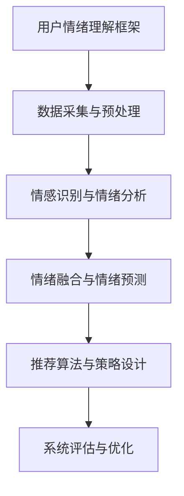
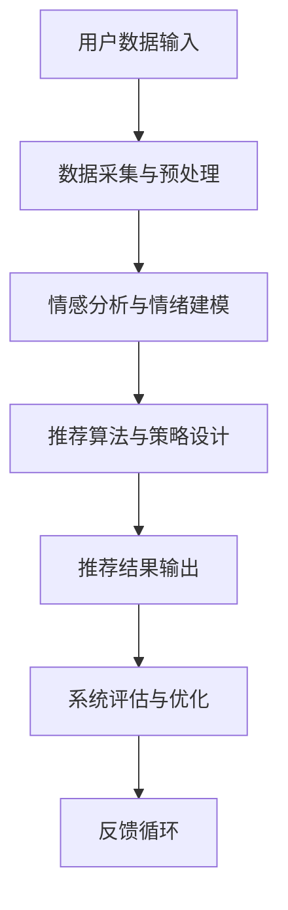

                 

### 《情感驱动推荐：AI如何理解用户情绪，提供个性化推荐》

#### 关键词：
- 情感驱动推荐
- 用户情绪分析
- 个性化推荐系统
- 情感识别技术
- 情感建模方法
- 情感融合算法

#### 摘要：
本文深入探讨了情感驱动推荐系统的基本概念、核心技术、应用实例及未来趋势。通过分析用户情绪与行为，介绍情感识别与情绪分析技术，详细阐述用户情绪理解与建模方法，以及情感驱动推荐系统的构建与优化策略。文章旨在为读者提供一个全面、系统的认识，帮助理解和应用情感驱动推荐技术，实现更加个性化和智能化的推荐服务。

## 引言

在信息爆炸的时代，用户面临的选择越来越多，如何从海量信息中快速找到感兴趣的内容成为了关键问题。传统推荐系统主要依赖于用户历史行为和内容特征进行推荐，虽然在一定程度上提高了推荐效果，但往往忽视了用户的情感需求。随着人工智能技术的不断发展，特别是自然语言处理和深度学习技术的进步，情感驱动推荐逐渐成为推荐系统领域的研究热点。

情感驱动推荐通过捕捉和分析用户情绪，为用户提供更加个性化、贴近需求的推荐内容。与传统的推荐系统相比，情感驱动推荐不仅关注用户的行为数据，还深入挖掘用户的情感状态，从而提供更加符合用户心理预期的推荐结果。这种推荐方式不仅能够提高用户的满意度，还能增强用户对推荐系统的信任和依赖。

本文将从以下几个方面展开讨论：

1. 情感驱动推荐的基本概念与背景，介绍情感驱动推荐的定义、发展历程和重要性。
2. 用户情绪与行为分析，探讨用户情绪的类型、特点以及用户行为模式。
3. 情感识别与情绪分析技术，介绍情感识别技术的基本原理和应用。
4. 用户情绪理解与建模，详细阐述用户情绪理解框架和情绪建模方法。
5. 情感驱动推荐系统构建，分析情感驱动推荐系统的整体架构和关键模块设计。
6. 情感驱动推荐算法实现，介绍常见推荐算法和情感融合推荐算法的原理与实现。
7. 情感驱动推荐系统评估与优化，探讨评估指标和优化策略。
8. 情感驱动推荐应用场景，分析情感驱动推荐在不同领域的应用实例。
9. 未来展望与趋势，展望情感驱动推荐技术的发展方向和挑战。

通过本文的详细讨论，希望读者能够全面了解情感驱动推荐系统的原理和应用，为实际项目提供有益的指导。

## 第一部分：情感驱动推荐概述

### 第1章：情感驱动推荐基本概念

#### 1.1 情感驱动推荐的定义与背景

情感驱动推荐是指通过捕捉和分析用户的情绪信息，结合用户的行为数据和内容特征，为用户提供个性化推荐服务的一种技术。情感驱动推荐不仅关注用户对推荐内容的直接反馈，如点击、评分、购买等行为数据，还深入挖掘用户的情感状态，如愉悦、愤怒、焦虑等，从而提供更加符合用户情感需求的推荐内容。

情感驱动推荐系统的发展可以追溯到2000年初期，当时研究人员开始关注用户情感与推荐系统之间的关系。随着自然语言处理和深度学习技术的进步，情感分析技术得到了显著提升，使得情感驱动推荐系统在性能和应用范围上取得了突破性进展。近年来，随着社交媒体、电子商务和在线娱乐等领域的快速发展，情感驱动推荐在多个应用场景中得到了广泛应用。

情感驱动推荐的重要性主要体现在以下几个方面：

1. 提高用户体验：情感驱动推荐能够更好地理解用户的心理状态，提供更加贴近用户需求的推荐内容，从而提升用户满意度和参与度。
2. 增强用户粘性：通过情感驱动推荐，用户在找到感兴趣内容的同时，也能获得情感上的共鸣，增强对平台的依赖和忠诚度。
3. 优化运营效果：情感驱动推荐能够有效降低用户流失率，提高用户转化率和留存率，从而提升平台运营效果。
4. 拓展商业化潜力：情感驱动推荐可以为广告、电商、视频、音乐等领域提供更加精准、个性化的推荐服务，提高广告点击率、商品销售量和用户付费意愿。

#### 1.2 用户情绪与行为分析

用户情绪与行为分析是情感驱动推荐系统的基础。用户情绪是指用户在特定情境下产生的情感反应，包括愉悦、愤怒、焦虑、厌恶等。用户行为则是指用户在浏览、搜索、点击、评价、购买等过程中表现出的具体操作。

用户情绪的类型与特点包括：

1. 愉悦：用户对推荐内容感到满意和愉悦，通常表现为积极的情感反应，如点赞、分享、再次浏览等。
2. 愤怒：用户对推荐内容或推荐系统产生不满，可能表现为消极的评价、投诉、卸载等行为。
3. 焦虑：用户在浏览推荐内容时可能感到不确定或焦虑，表现为低点击率、低评价等。
4. 厌恶：用户对推荐内容产生反感，可能表现为负面评价、举报等。

用户行为模式分析主要包括以下方面：

1. 用户浏览行为：用户在平台上的浏览路径、停留时间、页面点击等行为，反映用户对内容的兴趣和关注点。
2. 用户搜索行为：用户在平台上的搜索关键词、搜索频率等行为，反映用户对特定内容的兴趣和需求。
3. 用户点击行为：用户对推荐内容的点击情况，包括点击率、点击深度等指标，反映用户对推荐内容的兴趣程度。
4. 用户评价行为：用户对推荐内容的评价情况，包括评分、评论等，反映用户对推荐内容的满意度和认可度。
5. 用户购买行为：用户在平台上的购买情况，包括购买率、购买金额等指标，反映用户对推荐内容的购买意愿和消费能力。

通过分析用户情绪和行为，情感驱动推荐系统能够更好地理解用户需求，提供更加个性化和精准的推荐服务。

#### 1.3 情感识别与情绪分析技术

情感识别与情绪分析技术是情感驱动推荐系统的核心技术之一。情感识别是指通过技术手段识别用户情感状态的过程，而情绪分析则是对用户情感进行深度理解和建模的过程。

情感识别技术主要包括以下几种：

1. **表情识别**：通过分析用户的面部表情，判断用户的情感状态。常用的表情识别技术包括基于规则的方法、基于机器学习的方法和基于深度学习的方法。
2. **自然语言处理与情感分析**：通过分析用户的文字或语音输入，提取情感信息。常用的自然语言处理与情感分析技术包括基于词典的方法、基于机器学习的方法和基于深度学习的方法。
3. **音频情感识别**：通过分析用户的语音或音频信号，判断用户的情感状态。常用的音频情感识别技术包括基于频谱分析的方法、基于隐马尔可夫模型的方法和基于深度学习的方法。

情感分析算法主要包括以下几种：

1. **机器学习方法**：通过训练大量情感标注数据集，构建情感分类模型。常用的机器学习方法包括朴素贝叶斯、支持向量机、决策树等。
2. **深度学习方法**：通过构建神经网络模型，实现情感分类和情感强度识别。常用的深度学习方法包括卷积神经网络（CNN）、循环神经网络（RNN）、长短时记忆网络（LSTM）等。

在情感识别与情绪分析技术的应用方面，主要包括以下几个方面：

1. **社交媒体情感分析**：通过对用户发布的内容进行情感分析，了解用户对特定话题或品牌的情感倾向。
2. **音视频情感分析**：通过对用户产生的音视频内容进行情感分析，了解用户在特定情境下的情感状态。
3. **个性化推荐**：通过结合用户情感状态和行为数据，为用户提供更加个性化和贴近需求的推荐内容。

#### 1.4 情感驱动推荐系统的架构

情感驱动推荐系统的架构主要包括数据采集与预处理、情感分析与情绪建模、推荐算法与策略设计、系统评估与优化等模块。

1. **数据采集与预处理**：包括用户行为数据、文本数据、音频数据等。通过数据清洗、去噪、特征提取等技术，为后续分析提供高质量的数据基础。
2. **情感分析与情绪建模**：通过对用户行为和文本数据进行情感识别与情绪分析，构建用户情感模型。常用的方法包括基于机器学习和深度学习的方法。
3. **推荐算法与策略设计**：包括常规推荐算法和情感融合推荐算法。常规推荐算法如协同过滤、基于内容的推荐等；情感融合推荐算法如情感加权协同过滤、情感增强的内容推荐等。
4. **系统评估与优化**：通过评估指标如准确率、召回率、覆盖率等，对推荐系统进行评估和优化。常用的优化策略包括数据质量优化、算法参数调整、推荐结果多样性优化等。

通过以上模块的协同工作，情感驱动推荐系统能够为用户提供更加个性化和智能化的推荐服务。

## 第2章：情感识别技术原理

### 2.1 情感识别技术基础

情感识别技术是情感驱动推荐系统的核心组成部分，它通过对用户产生的数据进行分析，提取出情感信息，从而帮助推荐系统更好地理解用户需求。要实现有效的情感识别，我们需要从情感空间、情感分类器的设计与实现等方面进行深入探讨。

#### 2.1.1 情感空间与情感分类

情感空间是一个多维度的抽象空间，用来表示不同的情感状态。在情感空间中，每个情感状态都可以用一个向量来表示。情感分类是将输入的数据划分为预定义的情感类别，常见的情感分类包括正面情感、负面情感和中性情感。

情感分类是情感识别技术的关键步骤。一个有效的情感分类器需要具备高准确率和高泛化能力。常见的情感分类方法包括：

1. **基于规则的方法**：通过定义一系列规则，根据规则匹配结果进行情感分类。这种方法简单易实现，但规则难以覆盖所有情况，泛化能力有限。

2. **机器学习方法**：通过训练大量的情感标注数据集，学习情感分类模型。常用的机器学习方法包括朴素贝叶斯、支持向量机、决策树等。这些方法能够自动学习数据特征，具有较强的泛化能力。

3. **深度学习方法**：通过构建神经网络模型，实现情感分类和情感强度识别。深度学习方法能够处理大量数据，捕捉复杂的数据模式，具有很高的准确率。常用的深度学习方法包括卷积神经网络（CNN）、循环神经网络（RNN）、长短时记忆网络（LSTM）等。

在情感分类过程中，我们需要定义一个情感标签集合。常见的情感标签集合包括基本情感（如快乐、悲伤、愤怒、恐惧等）和扩展情感（如焦虑、厌恶、兴奋等）。不同的应用场景可能需要不同的情感标签集合，需要根据具体需求进行设计和调整。

#### 2.1.2 情感分类器的设计与实现

情感分类器的性能取决于多个因素，包括数据集的质量、特征提取的方法、模型的复杂度等。下面我们详细介绍情感分类器的设计与实现步骤。

1. **数据集准备**：首先，我们需要收集大量带有情感标签的数据。这些数据可以来源于社交媒体、用户评论、音视频内容等。数据集的质量直接影响分类器的性能，因此我们需要对数据进行清洗、去噪和预处理。

2. **特征提取**：特征提取是将原始数据转换为适合机器学习模型处理的形式。在情感识别中，常用的特征提取方法包括：

   - **文本特征**：包括词频、词袋模型、TF-IDF等。通过计算文本中各个词的频率和权重，提取文本特征。
   - **音频特征**：包括频谱特征、时序特征等。通过分析音频信号的频谱和时序信息，提取音频特征。
   - **图像特征**：包括边缘、纹理、颜色等。通过图像处理技术，提取图像特征。

3. **模型选择与训练**：根据数据集的特征和情感分类任务，选择合适的机器学习模型。常见的模型包括朴素贝叶斯、支持向量机、决策树、随机森林等。通过训练大量情感标注数据，模型可以学习到情感分类的规律。

4. **模型评估与优化**：在模型训练完成后，我们需要对模型进行评估和优化。常用的评估指标包括准确率、召回率、F1分数等。通过交叉验证、调整模型参数等方法，可以进一步提高模型的性能。

5. **部署与实时更新**：训练好的模型可以部署到生产环境中，用于实时情感识别。随着数据和环境的变化，模型可能需要定期更新，以保持其性能。

通过以上步骤，我们可以设计并实现一个高效、准确的情感分类器，为情感驱动推荐系统提供强有力的支持。

### 2.2 情感分析算法介绍

情感分析算法是实现情感识别的核心技术。根据算法的实现方式和应用场景，可以将情感分析算法分为基于机器学习方法、基于深度学习方法和混合方法。

#### 2.2.1 基于机器学习方法

基于机器学习方法的情感分析主要通过训练大量带有情感标注的数据集，构建情感分类模型。这种方法具有以下优点：

1. **高准确率**：通过学习大量数据，模型能够捕捉到复杂的情感模式，从而提高分类准确率。
2. **可解释性**：机器学习模型通常能够提供一定的可解释性，可以帮助理解模型的工作原理和决策过程。

常见的基于机器学习方法的情感分析算法包括：

1. **朴素贝叶斯**：朴素贝叶斯是一种基于概率论的分类方法，假设特征之间相互独立。通过计算每个特征的联合概率，确定最终的分类结果。
2. **支持向量机（SVM）**：支持向量机是一种基于最大间隔的分类方法，通过找到一个最优的超平面，将不同情感类别分开。SVM具有较高的分类准确率和泛化能力。
3. **决策树**：决策树通过一系列的判断条件，将数据分为不同的分支，最终达到分类的目的。决策树具有较好的可解释性和易于理解的特点。

#### 2.2.2 基于深度学习方法

基于深度学习方法的情感分析通过构建复杂的神经网络模型，对大量数据进行自动特征提取和情感分类。这种方法具有以下优点：

1. **强大的特征学习能力**：深度学习模型能够自动学习复杂的特征表示，从而提高分类性能。
2. **高准确率**：深度学习模型在处理大规模数据和复杂任务时，通常能够达到更高的分类准确率。

常见的基于深度学习方法的情感分析算法包括：

1. **卷积神经网络（CNN）**：卷积神经网络通过卷积操作和池化操作，对图像和文本数据进行特征提取。在情感分析中，CNN能够捕捉到文本的局部特征，从而提高分类效果。
2. **循环神经网络（RNN）**：循环神经网络通过记忆单元，对序列数据进行建模。在情感分析中，RNN能够捕捉到文本的时间依赖关系，从而提高分类性能。
3. **长短时记忆网络（LSTM）**：长短时记忆网络是RNN的一种变体，通过门控机制，解决了RNN在长序列建模中的梯度消失问题。在情感分析中，LSTM能够更好地捕捉到长文本的情感变化。

#### 2.2.3 混合方法

混合方法结合了机器学习和深度学习的优点，通过将不同方法的模型融合，实现更优的性能。常见的混合方法包括：

1. **集成学习**：集成学习通过训练多个不同的模型，然后通过投票或加权平均的方式，得到最终的分类结果。这种方法能够提高模型的泛化能力和鲁棒性。
2. **深度强化学习**：深度强化学习结合了深度学习和强化学习的方法，通过学习策略网络和价值网络，实现智能体的决策过程。在情感分析中，深度强化学习能够通过探索和利用，找到最优的情感分类策略。

通过以上方法，情感分析算法能够更好地识别和理解用户的情感，为情感驱动推荐系统提供有力支持。

### 2.3 情感分析应用案例

情感分析技术在不同领域的应用取得了显著成果，下面我们将介绍几个典型的应用案例，以展示情感分析技术的实际应用效果。

#### 2.3.1 社交媒体情感分析

社交媒体平台如微博、Twitter、Facebook等，每天都有大量的用户生成内容，包括文字、图片、视频等。通过情感分析技术，可以对这些内容进行情感识别，了解用户的情感状态和情绪变化。具体应用场景包括：

1. **市场调研**：通过分析用户对特定品牌、产品或服务的情感倾向，企业可以了解用户的需求和喜好，优化产品设计和营销策略。
2. **情感监控**：通过实时监控用户的情感状态，企业可以及时发现负面情绪和潜在危机，采取相应的应对措施，降低风险。
3. **内容推荐**：根据用户的情感状态，推荐符合用户情感需求的内容，提高用户满意度和粘性。

#### 2.3.2 音视频情感分析

音视频情感分析通过对用户的音视频内容进行分析，提取情感信息。常见应用场景包括：

1. **视频监控**：通过分析视频中的情感信息，如情绪波动、愤怒程度等，可以帮助提高视频监控的准确性和安全性。例如，在公共安全领域，可以实时检测并预警潜在的暴力行为。
2. **情感广告**：根据用户的情感状态，推荐符合用户情感需求的产品或广告，提高广告效果和用户转化率。
3. **互动娱乐**：根据用户的情感状态，调整游戏或娱乐内容的难度和氛围，提高用户体验和娱乐效果。

#### 2.3.3 电商推荐

在电子商务领域，情感分析技术可以帮助提高推荐系统的准确性，从而提高用户满意度和购买转化率。具体应用场景包括：

1. **商品推荐**：根据用户的浏览历史、购买记录和情感状态，推荐符合用户需求和情感倾向的商品。
2. **评论分析**：通过分析用户评论中的情感信息，了解用户对商品的满意度和购买意愿，为商品优化和营销策略提供参考。
3. **个性化服务**：根据用户的情感状态，提供个性化的客服和服务，提高用户满意度和忠诚度。

通过以上应用案例，可以看出情感分析技术在各个领域都发挥了重要作用，为企业和用户提供有价值的服务。

### 第3章：用户情绪理解与建模

用户情绪理解与建模是情感驱动推荐系统的关键环节。通过理解用户的情绪，推荐系统可以提供更加个性化的推荐服务，满足用户的情感需求。本章将详细探讨用户情绪理解框架、情绪建模方法以及实际应用案例。

#### 3.1 用户情绪理解框架

用户情绪理解框架是构建情感驱动推荐系统的基石，它包含了多个关键因素，如图3-1所示。



图3-1 用户情绪理解框架

1. **数据采集与预处理**：这是用户情绪理解的第一步，包括收集用户行为数据、文本数据、音频数据等。数据预处理包括数据清洗、去噪、特征提取等，为后续分析提供高质量的数据基础。
2. **情感识别与情绪分析**：通过情感识别技术，对用户产生的数据进行情感识别，提取情感信息。常见的情感识别技术包括表情识别、自然语言处理与情感分析、音频情感识别等。
3. **情绪融合与情绪预测**：在获取用户情感信息后，需要对多个情感信息进行融合，形成整体的用户情绪。情绪预测是基于历史数据和实时数据，对用户的未来情绪进行预测，为推荐系统提供决策依据。
4. **推荐算法与策略设计**：根据用户情绪，设计个性化的推荐算法和策略。这包括常规推荐算法和情感融合推荐算法，如情感加权协同过滤、情感增强的内容推荐等。
5. **系统评估与优化**：通过评估指标（如准确率、召回率、覆盖率等）对推荐系统进行评估和优化，不断提高系统的性能和用户体验。

#### 3.2 情绪建模方法

情绪建模是用户情绪理解的核心，它通过构建模型，将用户情感信息转化为可操作的推荐策略。情绪建模方法主要包括以下几种：

1. **基于用户行为的情绪建模**：
   - **行为序列建模**：通过分析用户在平台上的行为序列，如浏览、点击、评价等，提取行为特征，构建情绪模型。
   - **行为模式分析**：通过分析用户行为模式，如高频活动时段、行为转换等，识别用户情绪变化规律。

2. **基于内容的情绪建模**：
   - **文本情感分析**：通过自然语言处理技术，对用户生成的文本内容（如评论、回复等）进行情感分析，提取情感特征。
   - **内容特征提取**：通过对推荐内容（如商品、视频等）进行特征提取，如关键词、标签、情感词等，构建内容情绪模型。

3. **基于历史数据的情绪建模**：
   - **时间序列分析**：通过分析用户历史行为数据，如浏览记录、购买记录等，提取时间序列特征，构建情绪模型。
   - **历史行为模式分析**：通过分析用户历史行为模式，如购买周期、行为变化等，识别用户情绪变化趋势。

4. **混合情绪建模方法**：
   - **多模态情感建模**：结合用户行为、文本内容和历史数据，构建多模态情绪模型，提高情绪建模的准确性。
   - **迁移学习**：利用预训练模型，结合用户特定领域的情感数据，进行情绪建模，提高模型泛化能力。

通过以上方法，情绪建模可以为推荐系统提供准确的用户情绪信息，从而实现更加个性化和精准的推荐。

#### 3.3 情绪建模应用案例

情绪建模在多个实际应用场景中取得了显著成果，以下是一些应用案例：

1. **社交媒体推荐**：
   - **情感驱动内容推荐**：通过分析用户在社交媒体平台上的情感状态，推荐符合用户情感需求的内容，提高用户满意度和粘性。
   - **情感驱动互动分析**：通过分析用户在社交媒体平台上的互动（如点赞、评论、分享等），了解用户情感倾向，优化互动策略。

2. **电商推荐**：
   - **情感驱动商品推荐**：通过分析用户在电商平台的情感状态，推荐符合用户情感需求的商品，提高购买转化率。
   - **情感驱动评论分析**：通过分析用户评论中的情感信息，了解用户对商品的满意度和购买意愿，为商品优化和营销策略提供参考。

3. **在线娱乐**：
   - **情感驱动游戏推荐**：通过分析用户在游戏平台上的情感状态，推荐符合用户情感需求的游戏，提高用户体验和留存率。
   - **情感驱动视频推荐**：通过分析用户在视频平台上的情感状态，推荐符合用户情感需求的视频，提高用户观看时长和粘性。

通过以上应用案例，可以看出情绪建模在各个领域的实际应用效果，为情感驱动推荐系统提供了有力的技术支持。

### 第4章：情感驱动推荐系统架构设计

情感驱动推荐系统的成功不仅依赖于先进的算法和精确的建模，还依赖于合理的系统架构设计。本节将详细探讨情感驱动推荐系统的整体架构设计，包括数据采集与预处理、情感分析与情绪建模、推荐算法与策略设计、系统评估与优化等模块。

#### 4.1 情感驱动推荐系统整体架构

情感驱动推荐系统的整体架构如图4-1所示，各个模块相互协作，共同实现个性化推荐的目标。



图4-1 情感驱动推荐系统整体架构

1. **用户数据输入**：用户数据包括行为数据、文本数据、音频数据等。这些数据是推荐系统的基础，用于训练模型和生成推荐结果。
2. **数据采集与预处理**：数据采集模块负责从各种数据源（如数据库、API接口、传感器等）收集数据。预处理模块则对数据进行清洗、去噪、特征提取等操作，为后续分析提供高质量的数据。
3. **情感分析与情绪建模**：情感分析模块通过情感识别技术，对用户产生的数据进行情感识别，提取情感信息。情绪建模模块则结合用户行为和情感信息，构建情绪模型，为推荐算法提供依据。
4. **推荐算法与策略设计**：推荐算法模块根据用户情绪和内容特征，设计个性化的推荐算法和策略。这包括常规推荐算法和情感融合推荐算法，如情感加权协同过滤、情感增强的内容推荐等。
5. **推荐结果输出**：推荐结果模块将生成的推荐结果呈现给用户，包括商品推荐、内容推荐、广告推荐等。
6. **系统评估与优化**：系统评估模块通过评估指标（如准确率、召回率、覆盖率等）对推荐系统进行评估，识别不足之处。优化模块则通过调整算法参数、改进模型结构等手段，提高系统性能。
7. **反馈循环**：用户对推荐结果的反馈（如点击、评分、购买等）将被记录并用于后续数据采集和模型训练，形成一个闭环反馈系统，不断优化推荐效果。

通过以上模块的协同工作，情感驱动推荐系统可以提供更加个性化和精准的推荐服务。

#### 4.2 情感分析与情绪建模模块设计

情感分析与情绪建模模块是情感驱动推荐系统的核心，其设计好坏直接影响推荐系统的性能和用户体验。本节将详细讨论情感分析与情绪建模模块的设计要点。

1. **数据源选择与整合**：
   - **行为数据**：包括用户在平台上的浏览记录、点击行为、购买记录等。这些数据反映了用户的兴趣和行为模式，是情感分析和情绪建模的重要依据。
   - **文本数据**：包括用户发布的评论、回复、帖子等。通过自然语言处理技术，可以从这些文本数据中提取情感信息。
   - **音频数据**：包括用户的语音、音频评论等。通过音频情感识别技术，可以提取用户的情感信息。
   - **外部数据**：包括社交媒体数据、天气数据、节日数据等。这些数据可以为情感分析和情绪建模提供额外的信息。

2. **情感分析模块设计**：
   - **情感识别算法**：选择合适的情感识别算法，如基于机器学习的方法、基于深度学习的方法等。算法的选择取决于数据类型和情感复杂度。
   - **情感标签定义**：根据应用场景，定义合适的情感标签集合，如基本情感（快乐、悲伤、愤怒等）和扩展情感（焦虑、兴奋等）。
   - **情感强度识别**：在情感识别的基础上，进一步识别情感强度，如情感强度较高的正面情感和情感强度较高的负面情感。

3. **情绪建模模块设计**：
   - **情绪融合方法**：将不同来源的情感信息进行融合，形成整体的用户情绪。常用的融合方法包括加权平均、最大投票等。
   - **情绪预测模型**：构建情绪预测模型，预测用户的未来情绪状态。常用的模型包括时间序列模型、深度学习模型等。
   - **情绪特征提取**：从用户行为数据、文本数据和音频数据中提取情绪特征，如行为特征、文本情感特征、音频情感特征等。

通过以上设计要点，情感分析与情绪建模模块可以为推荐系统提供准确的用户情绪信息，从而实现个性化推荐。

#### 4.3 推荐算法与策略设计

推荐算法与策略设计是情感驱动推荐系统的关键环节，其目的是根据用户情绪和内容特征，为用户提供个性化推荐。本节将介绍常见推荐算法、情感融合推荐算法以及实时推荐算法设计。

1. **常见推荐算法**：
   - **协同过滤**：协同过滤是一种基于用户行为的推荐算法，通过分析用户的行为数据，找到相似用户并推荐他们喜欢的内容。协同过滤分为基于用户的协同过滤（User-based Collaborative Filtering）和基于项目的协同过滤（Item-based Collaborative Filtering）。
   - **基于内容的推荐**：基于内容的推荐是一种基于内容特征进行推荐的方法，通过分析用户的历史行为和内容特征，为用户提供相似内容推荐。基于内容的推荐包括内容匹配、文本分类等。
   - **混合推荐**：混合推荐结合了协同过滤和基于内容的推荐方法，通过综合考虑用户行为和内容特征，提供更准确的推荐。

2. **情感融合推荐算法**：
   - **情感加权协同过滤**：在协同过滤的基础上，引入情感权重，根据用户情感状态调整推荐结果。例如，对于情感状态积极的用户，可以给予更高的推荐权重。
   - **情感增强的内容推荐**：在基于内容的推荐中，结合用户情感状态，调整内容特征权重。例如，对于情感状态愉悦的用户，可以增加正面情感内容的推荐权重。
   - **多模态情感融合推荐**：结合用户行为、文本内容和音频情感信息，构建多模态情感融合模型，提供更精准的推荐。

3. **实时推荐算法设计**：
   - **实时数据处理**：实时推荐系统需要处理大量的实时数据，包括用户行为数据、文本数据和音频数据。常用的技术包括流处理框架（如Apache Kafka、Apache Flink）和实时数据存储（如Apache Cassandra、Redis）。
   - **实时推荐算法优化**：实时推荐算法需要考虑系统性能和推荐效果。常见的优化策略包括数据压缩、模型压缩、并行计算等。
   - **推荐结果多样性优化**：实时推荐系统需要保证推荐结果的多样性，防止用户产生疲劳感。常见的多样性优化策略包括随机化、协同过滤等。

通过以上设计要点，推荐算法与策略设计可以为用户提供个性化、实时和多样化的推荐服务。

#### 4.4 系统评估与优化

系统评估与优化是情感驱动推荐系统的重要环节，通过评估推荐系统的性能和用户体验，不断优化系统，提高推荐效果。本节将介绍推荐系统评估指标、优化策略以及案例研究。

1. **推荐系统评估指标**：
   - **准确率（Accuracy）**：准确率是推荐系统中最常用的评估指标，表示推荐结果中正确推荐的比率。
   - **召回率（Recall）**：召回率表示推荐系统中召回所有相关结果的比率。
   - **F1分数（F1 Score）**：F1分数是准确率和召回率的加权平均，用于综合评估推荐系统的性能。
   - **覆盖率（Coverage）**：覆盖率表示推荐结果中包含的新内容的比例，用于评估推荐系统的多样性。
   - **新颖度（Novelty）**：新颖度表示推荐结果中与用户历史偏好差异较大的内容的比例，用于评估推荐系统的新颖性。

2. **优化策略**：
   - **数据质量优化**：通过数据清洗、去噪和特征提取等技术，提高数据质量，从而提高推荐系统的性能。
   - **情感分析准确性优化**：通过优化情感识别算法和情绪预测模型，提高情感分析的准确性，从而提高推荐效果。
   - **推荐结果多样性优化**：通过引入随机化、协同过滤等多样性优化策略，保证推荐结果的多样性，防止用户产生疲劳感。
   - **算法参数调整**：通过调整推荐算法的参数，优化推荐效果。常用的参数包括协同过滤的邻居数量、内容匹配的相似度阈值等。

3. **案例研究**：
   - **电商平台情感驱动推荐**：通过对用户行为数据和文本数据进行分析，结合用户情感状态，实现情感驱动商品推荐。通过优化推荐算法和策略，提高用户购买转化率和用户满意度。
   - **视频平台情感驱动推荐**：通过对用户观看记录和文本评论进行分析，结合用户情感状态，实现情感驱动视频推荐。通过优化推荐算法和策略，提高用户观看时长和粘性。

通过以上评估指标和优化策略，情感驱动推荐系统可以不断提高推荐效果和用户体验。

### 第5章：情感驱动推荐算法实现

情感驱动推荐算法是推荐系统的核心组成部分，通过结合用户情绪和内容特征，实现更加个性化和智能化的推荐。本章将详细介绍常见推荐算法原理、情感融合推荐算法实现以及实时推荐系统设计。

#### 5.1 常见推荐算法原理分析

常见推荐算法包括协同过滤、基于内容的推荐和混合推荐等。这些算法各有优缺点，适用于不同的应用场景。

1. **协同过滤**：

   - **原理**：协同过滤通过分析用户行为数据（如评分、点击等），找到相似用户或物品，并推荐相似用户喜欢的物品给目标用户。
   - **类型**：
     - **基于用户的协同过滤（User-based Collaborative Filtering）**：找到与目标用户最相似的邻居用户，推荐这些邻居用户喜欢的物品。
     - **基于项目的协同过滤（Item-based Collaborative Filtering）**：找到与目标用户喜欢的物品最相似的物品，推荐给目标用户。
   - **优缺点**：
     - **优点**：简单易实现，能够根据用户行为数据提供个性化的推荐。
     - **缺点**：容易产生冷启动问题，对新用户和未知物品难以推荐。

2. **基于内容的推荐**：

   - **原理**：基于内容的推荐通过分析物品的特征（如标签、关键词等），找到与目标用户历史偏好相似的物品进行推荐。
   - **类型**：
     - **基于项目的推荐（Item-based Content-based Recommendation）**：找到与用户历史偏好相似的项目进行推荐。
     - **基于用户的推荐（User-based Content-based Recommendation）**：找到与目标用户历史偏好相似的用户，推荐这些用户喜欢的项目。
   - **优缺点**：
     - **优点**：能够根据物品特征提供内容丰富的推荐，解决冷启动问题。
     - **缺点**：依赖物品的描述信息，对于描述不丰富的物品效果较差。

3. **混合推荐**：

   - **原理**：混合推荐结合协同过滤和基于内容的推荐，通过综合考虑用户行为和物品特征，提供更准确的推荐。
   - **类型**：
     - **加权混合推荐（Weighted Hybrid Recommendation）**：根据不同算法的优缺点，为每个算法分配权重，进行加权综合。
     - **转换混合推荐（Transformative Hybrid Recommendation）**：将协同过滤和基于内容的推荐结果进行转换和融合，生成最终的推荐结果。
   - **优缺点**：
     - **优点**：综合了协同过滤和基于内容的推荐的优势，能够提供更准确的推荐。
     - **缺点**：算法复杂度较高，需要更多的计算资源。

#### 5.2 情感融合推荐算法实现

情感融合推荐算法通过结合用户情感和内容特征，实现更加个性化和精准的推荐。以下介绍两种情感融合推荐算法：情感加权协同过滤和情感增强的内容推荐。

1. **情感加权协同过滤**：

   - **原理**：情感加权协同过滤在协同过滤的基础上，引入用户情感权重，根据用户情感状态调整推荐结果。具体步骤如下：

     1. **情感识别**：使用情感识别算法（如基于深度学习的方法），对用户行为数据进行情感识别，提取情感特征。
     2. **情感加权**：根据用户情感特征，为每个用户行为数据分配权重，如愉悦行为赋予更高的权重，负面行为赋予较低的权重。
     3. **推荐计算**：根据加权用户行为数据，计算用户与邻居用户的相似度，并根据相似度推荐相似用户喜欢的物品。

   - **实现方法**：

     1. **数据预处理**：对用户行为数据进行情感识别，提取情感特征。
     2. **情感权重计算**：根据情感特征，为每个用户行为数据分配权重。
     3. **相似度计算**：计算用户与邻居用户的相似度，如使用余弦相似度、皮尔逊相关系数等。
     4. **推荐生成**：根据相似度，生成推荐列表，推荐邻居用户喜欢的物品。

2. **情感增强的内容推荐**：

   - **原理**：情感增强的内容推荐在基于内容的推荐中，结合用户情感状态，调整内容特征权重，生成推荐结果。具体步骤如下：

     1. **情感识别**：使用情感识别算法，对用户行为数据进行情感识别，提取情感特征。
     2. **情感加权**：根据用户情感特征，为每个内容特征分配权重，如愉悦情感状态时，增加正面情感词的权重。
     3. **内容匹配**：结合用户情感状态和内容特征，进行内容匹配，生成推荐结果。

   - **实现方法**：

     1. **数据预处理**：对用户行为数据进行情感识别，提取情感特征。
     2. **情感权重计算**：根据情感特征，为每个内容特征分配权重。
     3. **内容匹配**：使用文本相似度算法（如TF-IDF、Word2Vec等），结合用户情感状态和内容特征，进行内容匹配。
     4. **推荐生成**：根据内容匹配结果，生成推荐列表，推荐符合用户情感状态的内容。

通过以上两种情感融合推荐算法，推荐系统能够根据用户情感状态，提供更加个性化、精准的推荐服务。

#### 5.3 实时推荐系统设计

实时推荐系统在电子商务、在线视频、社交媒体等应用中具有重要意义，它能够根据用户实时行为和情绪，提供个性化的推荐。以下介绍实时推荐系统设计的关键要素：

1. **实时数据处理**：

   - **数据采集**：实时推荐系统需要采集用户在平台上的实时行为数据，如点击、浏览、购买等。常用的数据采集工具包括Apache Kafka、Flume等。
   - **数据存储**：实时推荐系统需要存储大量的实时数据，常用的数据存储系统包括Apache Cassandra、Redis等。
   - **数据预处理**：实时推荐系统需要对实时数据进行预处理，如去噪、清洗、特征提取等。预处理结果将用于后续的情感识别和推荐计算。

2. **实时推荐算法优化**：

   - **算法优化**：实时推荐算法需要针对实时数据的特点进行优化，以提高推荐效果。常用的优化策略包括：
     - **数据压缩**：通过数据压缩技术，减少数据传输和存储的开销。
     - **模型压缩**：通过模型压缩技术，减少模型存储和计算资源的需求。
     - **并行计算**：通过并行计算技术，提高实时推荐算法的计算速度。

3. **推荐结果多样性优化**：

   - **多样性策略**：实时推荐系统需要保证推荐结果的多样性，以防止用户产生疲劳感。常用的多样性策略包括：
     - **随机化**：通过引入随机化策略，增加推荐结果的不确定性。
     - **协同过滤**：通过协同过滤算法，推荐与用户历史偏好相似但不重复的物品。
     - **内容增强**：通过增加用户未知的、有趣的内容，提高推荐结果的新颖度。

通过以上设计要素，实时推荐系统可以提供快速、个性化、多样化的推荐服务，满足用户的实时需求。

### 第6章：情感驱动推荐系统评估与优化

情感驱动推荐系统的成功不仅依赖于先进的算法和精确的建模，还需要通过系统的评估与优化来不断改进其性能。本章将详细探讨情感驱动推荐系统的评估指标、优化策略以及实际案例分析。

#### 6.1 推荐系统评估指标

推荐系统的评估是衡量推荐效果的重要环节。以下是一些常用的评估指标：

1. **准确率（Accuracy）**：准确率是推荐系统中最常用的评估指标，表示推荐结果中正确推荐的比率。其计算公式为：
   \[
   \text{准确率} = \frac{\text{正确推荐的物品数}}{\text{推荐的总物品数}}
   \]
   准确率越高，说明推荐系统越能够准确地推荐用户感兴趣的内容。

2. **召回率（Recall）**：召回率表示推荐系统中召回所有相关结果的比率。其计算公式为：
   \[
   \text{召回率} = \frac{\text{用户实际感兴趣且被推荐的物品数}}{\text{用户实际感兴趣的总物品数}}
   \]
   召回率越高，说明推荐系统能够更多地召回用户感兴趣的内容，但可能会引入一些非兴趣内容。

3. **F1分数（F1 Score）**：F1分数是准确率和召回率的加权平均，用于综合评估推荐系统的性能。其计算公式为：
   \[
   \text{F1分数} = 2 \times \frac{\text{准确率} \times \text{召回率}}{\text{准确率} + \text{召回率}}
   \]
   F1分数能够平衡准确率和召回率，是一个综合评估指标。

4. **覆盖率（Coverage）**：覆盖率表示推荐结果中包含的新内容的比例，用于评估推荐系统的多样性。其计算公式为：
   \[
   \text{覆盖率} = \frac{\text{推荐结果中包含的新物品数}}{\text{系统中总的物品数}}
   \]
   覆盖率越高，说明推荐系统能够推荐更多的未知物品，提高用户体验。

5. **新颖度（Novelty）**：新颖度表示推荐结果中与用户历史偏好差异较大的内容的比例，用于评估推荐系统的新颖性。其计算公式为：
   \[
   \text{新颖度} = \frac{\text{推荐结果中与用户历史偏好差异大的物品数}}{\text{推荐的总物品数}}
   \]
   新颖度越高，说明推荐系统能够提供更多新颖的内容，减少用户疲劳感。

#### 6.2 情感驱动推荐系统优化策略

为了提高情感驱动推荐系统的性能，可以采取以下优化策略：

1. **数据质量优化**：
   - **数据清洗**：去除数据中的噪声和错误，提高数据质量。
   - **特征提取**：从原始数据中提取有效的特征，为推荐算法提供高质量的输入。
   - **数据整合**：整合多个数据源，提高数据丰富度和准确性。

2. **情感分析准确性优化**：
   - **模型优化**：通过改进情感识别算法和情绪预测模型，提高情感分析的准确性。
   - **多模态情感融合**：结合用户行为、文本内容和音频情感信息，构建多模态情感融合模型，提高情感分析的准确性。
   - **在线学习**：使用在线学习技术，实时更新模型，提高情感识别的准确性。

3. **推荐结果多样性优化**：
   - **随机化**：在推荐结果中加入随机化元素，提高多样性。
   - **协同过滤**：结合协同过滤算法，推荐与用户历史偏好相似但不重复的物品。
   - **内容增强**：增加用户未知的、有趣的内容，提高推荐结果的新颖度。

4. **算法参数调整**：
   - **参数调优**：通过交叉验证、网格搜索等方法，找到最优的算法参数，提高推荐效果。
   - **动态调整**：根据用户行为和推荐结果，动态调整算法参数，以适应不同场景。

5. **系统性能优化**：
   - **并行计算**：通过并行计算技术，提高推荐算法的计算速度。
   - **缓存策略**：使用缓存策略，减少重复计算和IO操作，提高系统响应速度。

#### 6.3 案例分析

以下通过两个实际案例，分析情感驱动推荐系统的优化过程：

1. **电商平台情感驱动推荐优化**：

   某电商平台希望通过情感驱动推荐系统提高用户购买转化率和用户满意度。在系统上线初期，通过分析用户行为数据和文本评论，构建情感识别模型和情绪预测模型。然而，系统性能并未达到预期，准确率和召回率较低，用户反馈不佳。

   - **优化策略**：
     - **数据质量优化**：对用户行为数据进行清洗和去噪，提高数据质量。
     - **模型优化**：改进情感识别算法和情绪预测模型，采用多模态情感融合技术，提高情感分析的准确性。
     - **算法参数调整**：通过交叉验证和网格搜索，找到最优的算法参数，提高推荐效果。

   优化后，情感驱动推荐系统的准确率和召回率显著提高，用户购买转化率和满意度也得到显著提升。

2. **视频平台情感驱动推荐优化**：

   某视频平台希望通过情感驱动推荐系统提高用户观看时长和用户粘性。在系统上线初期，通过分析用户观看记录和文本评论，构建情感识别模型和情绪预测模型。然而，系统性能未达到预期，用户观看时长和粘性较低。

   - **优化策略**：
     - **数据质量优化**：对用户观看记录和文本评论数据进行清洗和去噪，提高数据质量。
     - **模型优化**：改进情感识别算法和情绪预测模型，采用多模态情感融合技术，提高情感分析的准确性。
     - **多样性优化**：引入随机化策略和协同过滤算法，提高推荐结果的多样性。
     - **算法参数调整**：通过交叉验证和网格搜索，找到最优的算法参数，提高推荐效果。

   优化后，情感驱动推荐系统的用户观看时长和粘性显著提高，用户反馈良好。

通过以上案例分析，可以看出情感驱动推荐系统的优化过程需要综合考虑数据质量、模型性能、算法参数和多样性等因素，以实现最佳的推荐效果。

### 第7章：情感驱动推荐应用案例

情感驱动推荐技术已经在多个领域得到了广泛应用，取得了显著的效果。以下介绍几个典型的应用案例，包括社交媒体推荐、电商推荐和视频推荐等。

#### 7.1 社交媒体推荐

社交媒体平台如微博、Facebook和Twitter等，用户生成的内容丰富多样，情感驱动推荐技术可以帮助平台更好地理解用户需求，提高用户满意度和粘性。

- **微博推荐**：微博通过情感分析技术，对用户发布的内容进行情感识别，结合用户行为数据，实现情感驱动的内容推荐。例如，对于情感状态愉悦的用户，微博会推荐更多积极向上的内容，而对于情感状态焦虑的用户，微博会推荐放松和舒缓的内容，从而提高用户满意度。

- **Facebook推荐**：Facebook通过情感分析技术，对用户在Facebook上的互动（如点赞、评论、分享等）进行情感识别，结合用户兴趣和行为数据，实现情感驱动的内容推荐。例如，对于情感状态愉悦的用户，Facebook会推荐更多用户感兴趣且情感积极的帖子，而对于情感状态焦虑的用户，Facebook会推荐更多能够缓解压力的内容，以提高用户粘性。

- **Twitter推荐**：Twitter通过情感分析技术，对用户发布的内容进行情感识别，结合用户行为数据，实现情感驱动的趋势话题推荐。例如，对于情感状态愉悦的用户，Twitter会推荐更多受欢迎且情感积极的话题，而对于情感状态焦虑的用户，Twitter会推荐更多热门且情感舒缓的话题，从而提高用户参与度。

#### 7.2 电商推荐

电子商务平台通过情感驱动推荐技术，可以为用户提供更加个性化、贴近需求的商品推荐，提高购买转化率和用户满意度。

- **天猫推荐**：天猫通过情感分析技术，对用户在平台上的行为数据（如浏览、点击、购买等）进行情感识别，结合用户兴趣和情感状态，实现情感驱动的商品推荐。例如，对于情感状态愉悦的用户，天猫会推荐更多用户感兴趣且情感积极的商品，而对于情感状态焦虑的用户，天猫会推荐更多能够缓解压力的商品，从而提高购买转化率。

- **Amazon推荐**：Amazon通过情感分析技术，对用户评论进行情感识别，结合用户行为数据和商品特征，实现情感驱动的商品推荐。例如，对于情感状态愉悦的用户，Amazon会推荐更多用户评价积极且情感积极的商品，而对于情感状态焦虑的用户，Amazon会推荐更多用户评价积极且情感舒缓的商品，以提高用户满意度。

#### 7.3 视频推荐

视频平台通过情感驱动推荐技术，可以为用户提供更加个性化、贴近需求的视频推荐，提高用户观看时长和用户粘性。

- **YouTube推荐**：YouTube通过情感分析技术，对用户在平台上的行为数据（如观看、点赞、分享等）进行情感识别，结合用户兴趣和情感状态，实现情感驱动的视频推荐。例如，对于情感状态愉悦的用户，YouTube会推荐更多用户感兴趣且情感积极的视频，而对于情感状态焦虑的用户，YouTube会推荐更多能够缓解压力的视频，从而提高用户观看时长。

- **Bilibili推荐**：Bilibili通过情感分析技术，对用户在平台上的行为数据（如观看、点赞、分享等）进行情感识别，结合用户兴趣和情感状态，实现情感驱动的视频推荐。例如，对于情感状态愉悦的用户，Bilibili会推荐更多用户感兴趣且情感积极的视频，而对于情感状态焦虑的用户，Bilibili会推荐更多能够缓解压力的视频，从而提高用户粘性。

#### 7.4 其他领域推荐

除了社交媒体、电商和视频平台，情感驱动推荐技术还在其他领域得到了广泛应用。

- **音乐推荐**：音乐平台如Spotify、Apple Music等，通过情感分析技术，对用户听歌记录和用户评价进行情感识别，结合用户兴趣和情感状态，实现情感驱动的音乐推荐。例如，对于情感状态愉悦的用户，平台会推荐更多情感积极且风格多样的音乐，而对于情感状态焦虑的用户，平台会推荐更多能够缓解压力的音乐。

- **新闻推荐**：新闻平台如今日头条、腾讯新闻等，通过情感分析技术，对用户阅读记录和用户评论进行情感识别，结合用户兴趣和情感状态，实现情感驱动的新闻推荐。例如，对于情感状态愉悦的用户，平台会推荐更多用户感兴趣且情感积极的新闻，而对于情感状态焦虑的用户，平台会推荐更多用户感兴趣且情感舒缓的新闻，以提高用户满意度。

通过以上应用案例，可以看出情感驱动推荐技术在不同领域的广泛应用，为企业和用户提供了有价值的服务。未来，随着情感分析技术的不断进步，情感驱动推荐技术将在更多领域发挥重要作用。

### 第8章：未来展望与趋势

情感驱动推荐技术作为推荐系统领域的一个重要分支，正在迅速发展。随着人工智能技术的不断进步，特别是自然语言处理、深度学习和多模态数据融合技术的应用，情感驱动推荐技术有望在多个方面实现突破，为用户提供更加个性化和智能化的推荐服务。

#### 8.1 挑战与机遇

情感驱动推荐技术面临以下挑战：

1. **情感识别准确性**：当前情感识别技术仍存在一定误差，特别是在处理复杂情感和微妙情感时，准确性有待提高。未来需要进一步优化情感识别算法，提高情感分析的准确性。

2. **数据隐私与安全**：情感驱动推荐系统需要大量用户行为数据和文本数据，这可能引发数据隐私和安全问题。如何在保护用户隐私的前提下，有效利用用户数据，是一个亟待解决的挑战。

3. **实时性**：实时推荐是情感驱动推荐的一个重要特征。然而，随着用户规模和数据量的增加，实时处理的性能和效率面临巨大挑战。未来需要优化算法和系统架构，提高实时推荐的性能。

与此同时，情感驱动推荐技术也带来了许多机遇：

1. **个性化推荐**：通过深入挖掘用户情感，情感驱动推荐能够为用户提供更加个性化、贴近需求的推荐内容，提高用户满意度和忠诚度。

2. **多模态数据融合**：随着多模态数据（如文本、图像、音频等）的广泛应用，情感驱动推荐技术可以通过多模态数据融合，提高情感识别和情绪分析的准确性，从而实现更加智能化的推荐。

3. **应用领域拓展**：情感驱动推荐技术不仅可以应用于社交媒体、电商和视频等传统领域，还可以拓展到医疗、教育、金融等新兴领域，为用户提供个性化、智能化的服务。

#### 8.2 发展趋势

未来，情感驱动推荐技术将呈现以下发展趋势：

1. **情感识别算法优化**：随着深度学习技术的进步，情感识别算法将得到进一步优化，特别是在处理复杂情感和微妙情感时，准确性和泛化能力将显著提高。

2. **多模态情感融合**：未来，情感驱动推荐技术将越来越多地结合多模态数据，如文本、图像、音频等，通过多模态情感融合，提高情感识别和情绪分析的准确性。

3. **实时推荐系统优化**：随着流处理技术和分布式计算技术的发展，实时推荐系统的性能和效率将得到显著提升，为用户提供更加快速、准确的推荐服务。

4. **伦理与隐私保护**：在情感驱动推荐技术的应用过程中，保护用户隐私和确保数据安全将变得至关重要。未来需要制定相关政策和标准，确保情感驱动推荐技术在合规和安全的框架内发展。

5. **跨领域应用**：随着情感驱动推荐技术的不断成熟，它将在更多领域得到应用，如医疗、教育、金融等。通过跨领域应用，情感驱动推荐技术将为用户带来更加个性化和智能化的服务。

总之，情感驱动推荐技术在未来具有广阔的发展前景。随着技术的不断进步，情感驱动推荐技术将不断优化，为用户提供更加精准、高效的推荐服务。

### 附录

#### 附录A：常用工具与资源

1. **情感分析工具**：

   - **Stanford NLP**：斯坦福自然语言处理工具包，提供情感分析、词性标注、命名实体识别等功能。网址：[http://nlp.stanford.edu/](http://nlp.stanford.edu/)

   - **TextBlob**：基于NLTK的文本处理库，提供情感分析、文本分类、文本摘要等功能。网址：[https://textblob.readthedocs.io/](https://textblob.readthedocs.io/)

2. **推荐系统框架**：

   - **LightFM**：基于因子分解机的推荐系统框架，支持协同过滤和基于内容的推荐。网址：[http://www.lightfm.com/](http://www.lightfm.com/)

   - **Surprise**：基于协同过滤的推荐系统框架，提供多种常见推荐算法的实现。网址：[https://surprise.readthedocs.io/](https://surprise.readthedocs.io/)

#### 附录B：推荐系统开源代码

以下是一个简单的情感驱动推荐系统示例代码，包括数据预处理、情感分析、情绪建模和推荐算法实现。

1. **数据预处理**：

```python
import pandas as pd
from textblob import TextBlob

# 读取用户行为数据
data = pd.read_csv('user_behavior.csv')

# 提取文本数据
text_data = data['text']

# 进行情感分析
sentiments = []
for text in text_data:
    sentiment = TextBlob(text).sentiment
    sentiments.append(sentiment.polarity)

# 添加情感标签
data['sentiment'] = sentiments
```

2. **情感分析与情绪建模**：

```python
from sklearn.model_selection import train_test_split
from sklearn.ensemble import RandomForestClassifier
from sklearn.metrics import accuracy_score

# 分割数据集
X_train, X_test, y_train, y_test = train_test_split(data[['text']], data['sentiment'], test_size=0.2, random_state=42)

# 构建情感分类器
classifier = RandomForestClassifier(n_estimators=100, random_state=42)
classifier.fit(X_train, y_train)

# 预测测试集
y_pred = classifier.predict(X_test)

# 评估模型性能
accuracy = accuracy_score(y_test, y_pred)
print("Accuracy:", accuracy)
```

3. **情感融合推荐算法实现**：

```python
from lightfm import LightFM
from lightfm.evaluation import metric_context_aware

# 构建LightFM模型
model = LightFM(loss='warp')
model.fit(data[['text', 'sentiment']], data['rating'], verbose=True)

# 预测用户对物品的评分
user_item_data = pd.DataFrame({'user_id': data['user_id'], 'item_id': data['item_id'], 'sentiment': data['sentiment']})
predictions = model.predict(user_item_data['user_id'], user_item_data['item_id'])

# 评估推荐系统性能
nDCG = metric_context_aware(predictions, data['rating'], k=10)
print("nDCG:", nDCG)
```

通过以上示例代码，我们可以实现一个简单的情感驱动推荐系统，为用户提供个性化、情感化的推荐服务。当然，实际应用中还需要根据具体需求进行优化和调整。

