                 

### 文章标题

**《打造技术型知识付费平台的用户运营》**

### 文章关键词

- 知识付费
- 技术型平台
- 用户运营
- 数据分析
- 个性化推荐
- 用户体验

### 文章摘要

本文旨在探讨如何打造一个技术型知识付费平台的用户运营策略。文章首先概述了知识付费产业的背景与发展，以及技术型知识付费平台的核心价值。接着，本文详细分析了用户运营策略，包括用户画像与需求分析、用户增长策略、用户留存策略和内容运营策略。此外，文章还介绍了技术支持与平台优化、用户运营实战案例、用户运营数据与效果分析、平台可持续发展的用户运营策略以及技术型知识付费平台用户运营的未来趋势。通过本文的阐述，希望为从业者提供有益的参考和启示。

## 第1章：技术型知识付费平台概述

### 1.1 知识付费产业的背景与发展

知识付费作为一种新兴的商业模式，其兴起背景可以追溯到互联网技术的迅猛发展和用户需求的多样化。随着智能手机和移动互联网的普及，用户对于信息获取的需求日益增加，同时，用户对于高质量、专业化内容的付费意愿也显著提升。这种趋势促进了知识付费产业的快速发展。

首先，知识付费的兴起与信息爆炸时代密切相关。在互联网时代，信息获取变得前所未有的便捷，但同时也导致了信息过载的问题。用户迫切需要高效、精准地获取有用信息，这就为知识付费提供了市场需求。此外，随着经济的发展和人们生活水平的提高，用户对于个人成长和职业发展的需求日益强烈，这也推动了知识付费的普及。

其次，技术型知识付费平台的崛起进一步促进了知识付费产业的发展。这些平台通过大数据、人工智能等先进技术，能够提供个性化、精准化的内容推荐和用户体验，提高了用户的学习效率和学习效果。例如，通过用户行为数据的分析，平台可以为用户提供量身定制的学习路径和推荐内容，从而提高用户的满意度和粘性。

#### 1.1.1 知识付费的兴起

知识付费的兴起可以追溯到20世纪末。当时，随着互联网的普及，一些在线教育平台如Coursera、edX等开始兴起，这些平台提供了大量的在线课程，用户可以通过付费获取高质量的教育资源。随后，知识付费在移动互联网时代得到了快速发展。移动端应用如得到、喜马拉雅等，通过提供音频课程、电子书、视频讲座等多种形式的内容，满足了用户多样化的学习需求。

**Mermaid 流程图：**

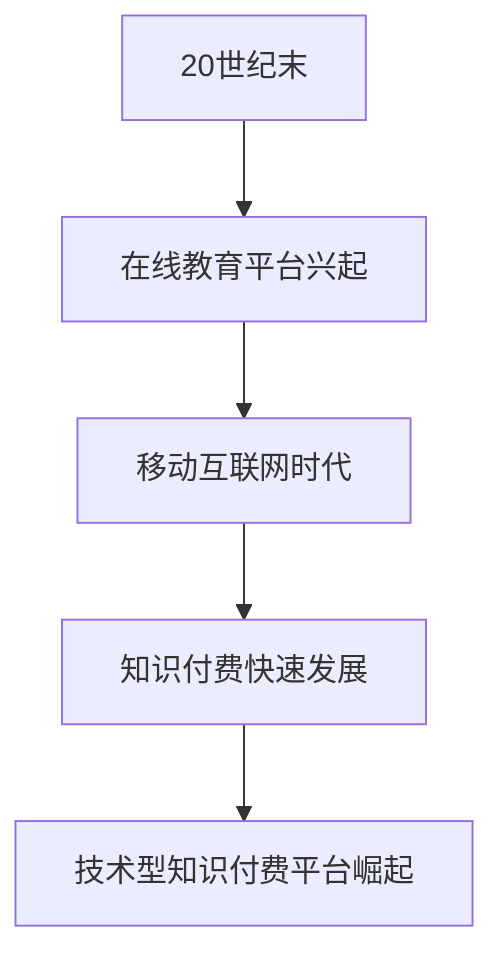

#### 1.1.2 技术型知识付费平台的崛起

技术型知识付费平台的崛起，离不开大数据、人工智能等技术的应用。这些平台通过构建用户画像、分析用户行为数据，能够实现精准的内容推荐和个性化服务。例如，用户在平台上浏览、点赞、评论等行为数据，都可以被用来分析和挖掘用户兴趣和需求，进而提供更加个性化的内容推荐。

此外，技术型知识付费平台还注重用户体验的优化。通过智能客服、个性化推荐、数据分析等技术手段，平台能够提供高效、便捷、个性化的服务，从而提高用户的满意度和粘性。

**Mermaid 流程图：**

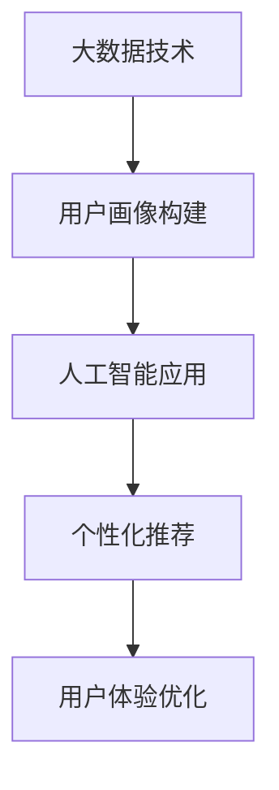

### 1.2 技术型知识付费平台的核心价值

技术型知识付费平台的核心价值主要体现在以下几个方面：

#### 1.2.1 专业知识与技能的传授

技术型知识付费平台通过提供专业、系统的知识内容，帮助用户快速提升专业技能。这些平台通常拥有丰富的课程资源，涵盖多个领域，如编程、数据分析、产品设计等。用户可以根据自己的需求和兴趣选择合适的学习内容，从而实现知识积累和技能提升。

**伪代码：**

```python
def knowledge_transmission(course, user):
    if user.level == 'beginner':
        simplified_course = simplify(course)
    elif user.level == 'intermediate':
        advanced_course = advance(course)
    else:
        expert_course = expert(course)
    return course
```

#### 1.2.2 个性化学习体验的提供

技术型知识付费平台利用大数据和人工智能技术，为用户量身定制学习路径，提供个性化的学习体验。平台可以通过分析用户的兴趣、行为和学习历史，推荐合适的课程和学习资源，从而提高学习效果和用户满意度。

**伪代码：**

```python
def personalized_learning(user_profile, course_list):
    recommended_courses = recommend_courses(user_profile, course_list)
    optimized_path = optimize_learning_path(user_profile, recommended_courses)
    return optimized_path
```

#### 1.2.3 优质内容的筛选与推荐

技术型知识付费平台通过算法和数据分析，对海量的内容进行筛选和推荐，帮助用户快速找到高质量的学习资源。这种精准的内容推荐不仅可以提高用户的学习效率，还可以增加平台的粘性和用户满意度。

**伪代码：**

```python
def content_recommendation(user_profile, content_pool):
    recommended_content = recommend_content(user_profile, content_pool)
    return recommended_content
```

### 1.3 平台运营的目标与挑战

技术型知识付费平台的运营目标主要包括以下几个方面：

#### 1.3.1 用户增长

用户增长是平台发展的关键指标。平台需要通过多种渠道获取新用户，提高用户数量，从而扩大市场份额。

**公式：**

$$
\text{用户增长} = f(\text{新用户获取}, \text{用户活跃度}, \text{用户留存率})
$$

#### 1.3.2 内容丰富度

内容丰富度是平台吸引和留住用户的重要因素。平台需要持续更新和丰富课程资源，提供多样化的学习内容，以满足不同用户的需求。

**公式：**

$$
\text{内容丰富度} = f(\text{课程数量}, \text{内容质量}, \text{内容更新频率})
$$

#### 1.3.3 用户体验提升

用户体验提升是平台运营的核心目标。平台需要通过优化用户界面、提高系统性能、提供个性化服务等手段，提升用户的满意度和忠诚度。

**公式：**

$$
\text{用户体验} = f(\text{用户满意度}, \text{用户留存率}, \text{用户转化率})
$$

#### 1.3.4 数据分析与优化

平台运营需要充分利用数据分析手段，对用户行为、内容效果、市场趋势等进行深入分析，从而优化运营策略，提升运营效果。

**公式：**

$$
\text{数据分析} = f(\text{用户行为分析}, \text{内容效果分析}, \text{市场趋势分析})
$$

#### 1.3.5 市场竞争应对

技术型知识付费平台面临着激烈的市场竞争。平台需要通过创新、优质内容和个性化服务，不断提升自身竞争力，应对市场变化和挑战。

**公式：**

$$
\text{市场竞争应对} = f(\text{创新}, \text{优质内容}, \text{个性化服务})
$$

### 1.4 总结

本章概述了技术型知识付费平台的发展背景、核心价值以及运营目标与挑战。在接下来的章节中，我们将进一步探讨用户运营策略、内容运营策略、技术支持与平台优化等方面的内容，为打造一个成功的知识付费平台提供参考和指导。

## 第2章：用户运营策略

### 2.1 用户画像与需求分析

#### 2.1.1 用户画像的概念与构建

用户画像是一种对用户特征、行为和需求的系统化描述，通过分析用户数据，可以构建出用户的详细轮廓，为个性化服务提供依据。用户画像的构建主要包括以下几个方面：

1. **用户基本信息**：包括用户的性别、年龄、职业、教育背景等基本信息，这些信息可以通过注册信息或调查问卷获取。

2. **用户行为数据**：包括用户的浏览记录、购买历史、互动行为等，这些数据可以反映用户的行为习惯和兴趣偏好。

3. **用户兴趣偏好**：通过对用户行为的分析，可以挖掘出用户的兴趣点和偏好，如喜欢阅读哪些类型的书籍、关注哪些领域的技术等。

4. **用户需求分析**：结合用户行为数据和兴趣偏好，分析用户的需求，如用户在某一领域的知识缺口、用户希望提升的技能等。

**Mermaid 流程图：**

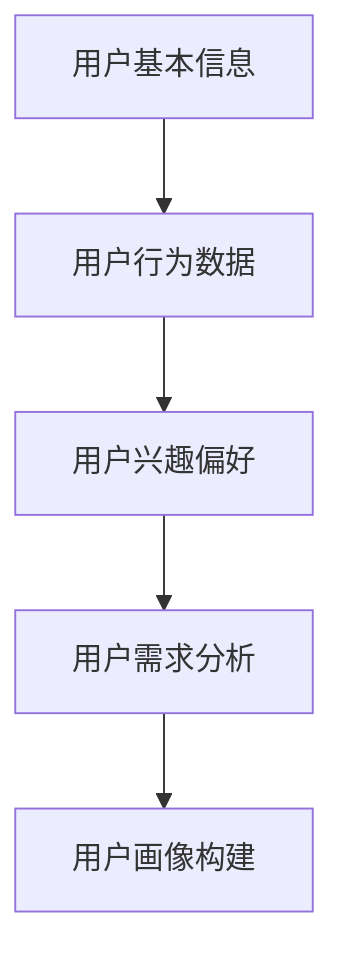

#### 2.1.2 用户需求分析的方法与工具

用户需求分析是用户运营的重要环节，通过准确的需求分析，可以为用户提供更加符合他们需求的服务和内容。以下是一些常用的方法和工具：

1. **问卷调查**：通过设计问卷，收集用户的意见和需求，问卷调查是一种直接且有效的方式。

2. **用户访谈**：与用户进行面对面或在线访谈，深入了解用户的需求和痛点。

3. **数据分析**：利用大数据分析技术，对用户行为数据进行分析，挖掘用户的需求和兴趣点。

4. **A/B测试**：通过对比不同版本的页面或功能，测试哪种设计更能满足用户需求。

5. **用户反馈系统**：建立用户反馈机制，收集用户的意见和建议，不断优化产品和服务。

**Mermaid 流程图：**

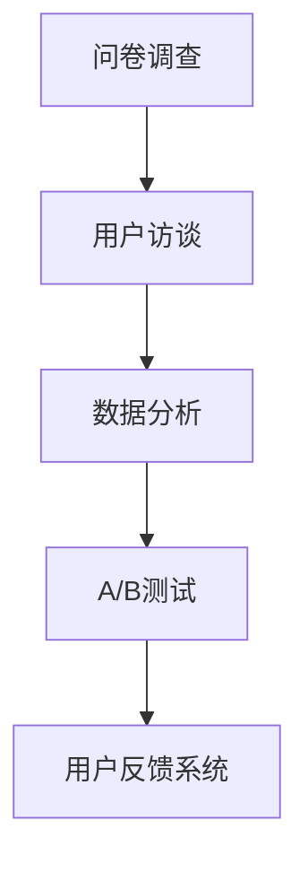

#### 2.1.3 用户画像的应用场景

用户画像在用户运营中的应用非常广泛，以下是一些典型的应用场景：

1. **个性化推荐**：根据用户的兴趣和需求，推荐符合他们兴趣的内容和课程。

2. **精准营销**：通过用户画像，进行精准的广告投放和推广活动。

3. **用户行为预测**：预测用户的行为，如购买意图、学习进度等，提前采取相应的措施。

4. **用户体验优化**：根据用户的反馈和行为数据，优化产品和服务，提升用户体验。

5. **用户留存策略**：通过分析用户留存数据，制定有效的用户留存策略，提高用户粘性。

**Mermaid 流程图：**

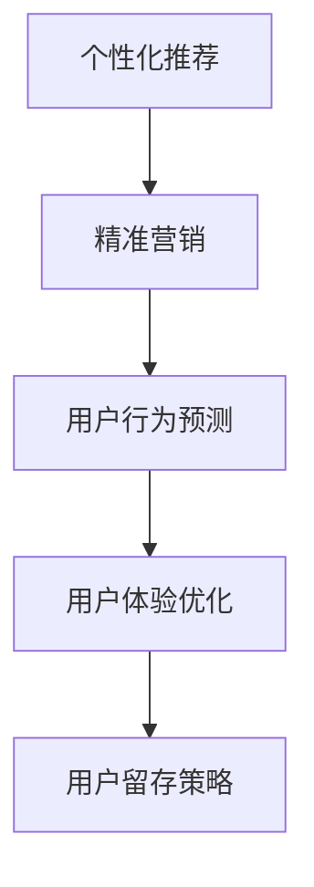

### 2.2 用户增长策略

#### 2.2.1 增长引擎的设计

用户增长是知识付费平台的重要目标，增长引擎的设计至关重要。增长引擎通常包括以下环节：

1. **用户获取**：通过多种渠道获取新用户，如搜索引擎优化（SEO）、社交媒体推广、内容营销等。

2. **用户激活**：新用户注册后，需要通过引导和激励措施，促使他们开始使用平台的服务。

3. **用户留存**：通过持续的内容更新、用户互动和个性化服务，提高用户的留存率。

4. **用户转化**：通过促销活动、会员制度等手段，促使用户进行付费，实现平台盈利。

**Mermaid 流程图：**

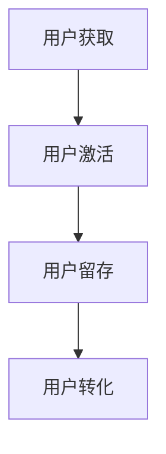

#### 2.2.2 增长渠道的优化

为了实现用户增长，知识付费平台需要不断优化增长渠道。以下是一些常用的优化策略：

1. **内容营销**：通过高质量的内容吸引和留住用户，如撰写行业博客、发布专业报告等。

2. **社交媒体推广**：利用社交媒体平台，如微信、微博、抖音等，进行推广活动，增加用户曝光度。

3. **合作伙伴关系**：与相关行业的企业或机构建立合作关系，共同推广知识付费平台。

4. **广告投放**：通过精准的广告投放，如搜索引擎广告、社交媒体广告等，获取目标用户。

5. **用户推荐**：鼓励现有用户推荐新用户，通过口碑传播实现增长。

**Mermaid 流程图：**

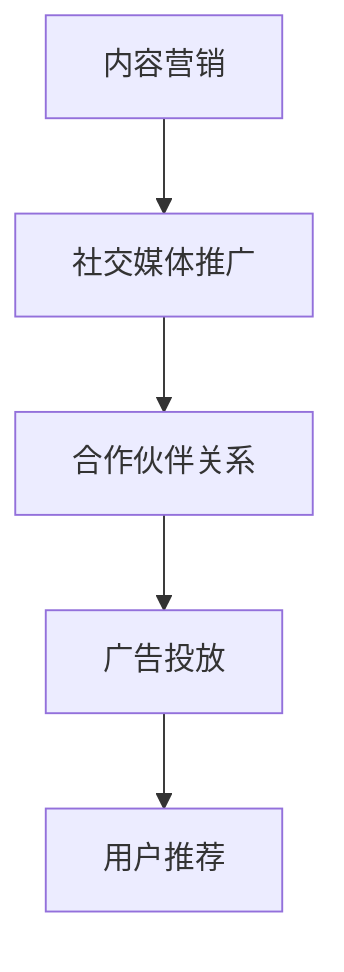

### 2.3 用户留存策略

#### 2.3.1 用户生命周期管理

用户生命周期管理是指对用户从注册到流失的整个过程的监控和管理。用户生命周期通常包括以下几个阶段：

1. **新用户阶段**：用户刚刚注册，需要引导和激励他们开始使用平台的服务。

2. **活跃用户阶段**：用户开始积极参与平台的活动，如学习课程、参与讨论等。

3. **忠诚用户阶段**：用户对平台有高度的忠诚度，他们会持续使用平台的服务，并可能推荐给其他人。

4. **流失用户阶段**：用户停止使用平台的服务，可能是因为不满意、缺乏兴趣或其他原因。

**Mermaid 流程图：**

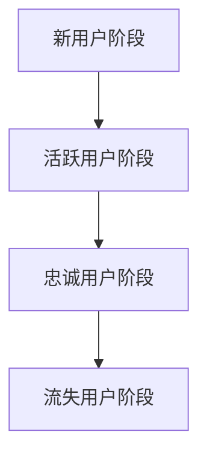

#### 2.3.2 用户激励与反馈机制

用户激励与反馈机制是提高用户留存率的重要手段。以下是一些常见的激励和反馈机制：

1. **积分系统**：通过积分奖励用户，鼓励他们参与平台活动，提高用户活跃度。

2. **会员制度**：为用户提供不同等级的会员服务，会员享受更多的优惠和特权，提高用户忠诚度。

3. **用户互动**：鼓励用户在平台进行互动，如发表评论、参与问答等，增强用户粘性。

4. **用户反馈**：建立用户反馈机制，及时收集用户的意见和建议，优化产品和服务。

**Mermaid 流程图：**

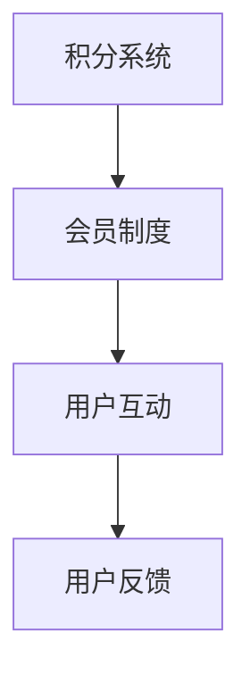

### 2.4 内容运营策略

#### 2.4.1 内容生产与质量控制

内容运营是知识付费平台的核心，内容的生产与质量控制至关重要。以下是一些关键点：

1. **内容策划**：根据用户需求和行业趋势，制定内容策划方案，确保内容的专业性和实用性。

2. **内容创作**：邀请行业专家、知名讲师等创作高质量的内容，确保内容的质量和权威性。

3. **内容审核**：建立内容审核机制，确保内容的准确性和合规性，避免出现误导性或违规内容。

4. **内容更新**：定期更新内容，保持内容的时效性和相关性，吸引更多用户。

**Mermaid 流程图：**

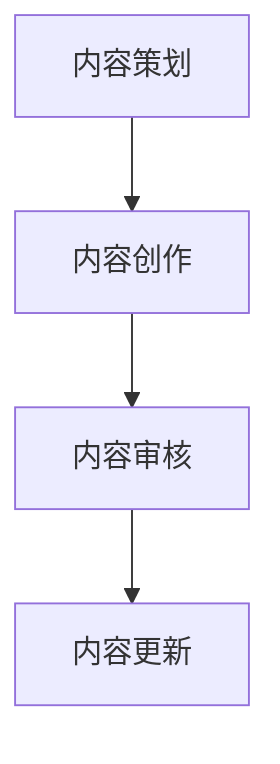

#### 2.4.2 内容营销与推广策略

内容营销与推广策略是提高内容曝光率和用户粘性的关键。以下是一些常用的策略：

1. **SEO优化**：通过搜索引擎优化，提高平台内容的搜索引擎排名，吸引更多用户访问。

2. **社交媒体推广**：利用社交媒体平台，发布高质量的内容，吸引关注和分享，增加用户互动。

3. **广告投放**：通过精准的广告投放，如搜索引擎广告、社交媒体广告等，提高内容曝光度。

4. **内容合作**：与其他平台或媒体合作，进行内容互换或推广，扩大用户群体。

**Mermaid 流程图：**

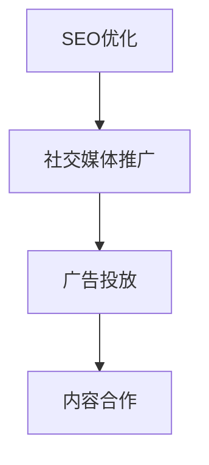

#### 2.4.3 用户互动与社区建设

用户互动与社区建设是提高用户满意度和忠诚度的有效手段。以下是一些关键点：

1. **论坛**：建立论坛社区，鼓励用户发表观点、提问和回答，促进用户之间的互动。

2. **问答**：提供问答功能，方便用户提问和获取专业解答，增强用户粘性。

3. **社群**：建立不同主题的社群，如技术交流群、学习互助群等，让用户在特定领域内深入交流和互动。

**Mermaid 流程图：**

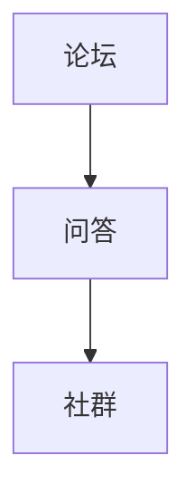

### 2.5 总结

本章详细阐述了用户运营策略的各个方面，包括用户画像与需求分析、用户增长策略、用户留存策略和内容运营策略。通过合理的设计和实施，这些策略可以帮助知识付费平台提高用户满意度、留存率和转化率，实现可持续发展。

## 第3章：技术支持与平台优化

### 3.1 技术架构与系统稳定性

#### 3.1.1 技术架构的设计与实现

技术型知识付费平台的技术架构设计需要综合考虑系统的可扩展性、性能和稳定性。以下是一个典型技术架构的组成部分：

1. **前后端分离**：前端负责用户界面展示，后端负责处理业务逻辑和数据存储。这种分离设计有助于提高系统的可维护性和扩展性。

2. **分布式系统**：通过分布式架构，将系统分解为多个服务模块，如用户服务、内容服务、支付服务等，这些模块可以独立部署和扩展。

3. **微服务架构**：在分布式系统的基础上，采用微服务架构，每个服务模块都是一个独立的微服务，可以独立开发和部署，提高了系统的灵活性和可维护性。

4. **缓存系统**：使用缓存系统，如Redis或Memcached，来存储高频访问的数据，减少数据库负载，提高系统响应速度。

5. **数据库架构**：使用关系型数据库（如MySQL）和非关系型数据库（如MongoDB）结合，根据数据特点选择合适的数据库类型，提高数据存储和处理效率。

**Mermaid 流程图：**

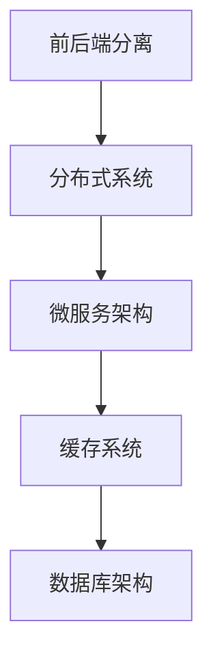

#### 3.1.2 系统稳定性的保障

系统稳定性是知识付费平台持续运营的关键。以下是一些保障系统稳定性的措施：

1. **负载均衡**：使用负载均衡器（如Nginx或HAProxy），将请求分发到多个服务器，避免单点故障，提高系统的处理能力。

2. **故障转移**：通过容错和故障转移机制，确保系统在遇到故障时能够自动切换到备用服务器，保证服务的连续性。

3. **容灾备份**：建立容灾备份系统，将关键数据备份到远程数据中心，确保在发生灾难时能够快速恢复。

4. **监控与告警**：使用监控系统（如Prometheus或Zabbix），实时监控系统性能和健康状态，并在出现异常时发送告警通知。

**Mermaid 流程图：**

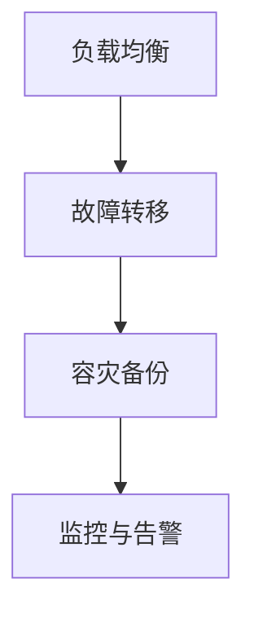

### 3.2 数据分析与用户行为分析

#### 3.2.1 用户行为数据的收集与处理

用户行为数据是用户运营的重要基础。以下是一些用户行为数据的收集与处理方法：

1. **日志收集**：通过日志收集器（如Logstash），将用户操作日志收集到中央日志系统中，方便后续的数据处理和分析。

2. **数据清洗**：使用数据清洗工具（如Pandas或Spark），去除无效数据、处理缺失值和异常值，保证数据的质量。

3. **数据存储**：使用数据存储系统（如HDFS或Elasticsearch），存储清洗后的用户行为数据，方便快速查询和分析。

4. **数据预处理**：使用数据处理工具（如Spark或Flink），对用户行为数据进行预处理，如数据聚合、特征提取等，为后续分析做准备。

**Mermaid 流程图：**

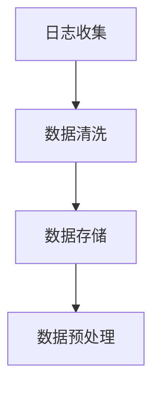

#### 3.2.2 用户行为分析的方法与工具

用户行为分析是提升用户满意度和运营效果的关键。以下是一些用户行为分析的方法和工具：

1. **统计分析**：使用统计分析工具（如Python的Pandas或R），对用户行为数据进行分析，如用户活跃度、访问频率等。

2. **机器学习模型**：使用机器学习模型（如分类、聚类、回归等），对用户行为数据进行深入分析，如用户流失预测、个性化推荐等。

3. **数据可视化**：使用数据可视化工具（如Tableau或Power BI），将分析结果以图表、报表等形式呈现，帮助管理层快速理解数据。

4. **用户画像**：通过构建用户画像，整合用户的多维度数据，实现对用户的全面了解和个性化服务。

**Mermaid 流程图：**

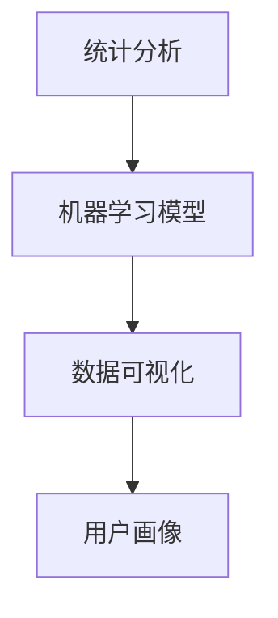

### 3.3 用户体验优化

#### 3.3.1 用户体验的重要性

用户体验是知识付费平台成功的关键因素。以下是一些关于用户体验的重要性：

1. **用户满意度**：良好的用户体验可以提高用户满意度，增强用户对平台的信任和忠诚度。

2. **用户留存率**：用户体验直接影响用户留存率，一个易于使用、功能丰富的平台更容易留住用户。

3. **用户转化率**：优化用户体验可以促进用户付费，提高平台的收入和盈利能力。

**公式：**

$$
\text{用户体验} = f(\text{用户满意度}, \text{用户留存率}, \text{用户转化率})
$$

#### 3.3.2 用户体验优化的方法与技巧

以下是一些优化用户体验的方法和技巧：

1. **界面设计**：设计简洁、直观、美观的界面，提高用户的操作便利性和视觉舒适度。

2. **响应速度**：优化系统的响应速度，减少加载时间和页面跳转次数，提高用户的使用效率。

3. **功能丰富**：提供多样化的功能和服务，满足用户的不同需求，提高用户的使用满意度。

4. **交互设计**：设计合理的交互流程和反馈机制，使用户在使用过程中感到流畅和愉悦。

5. **用户反馈**：建立用户反馈机制，及时收集用户的意见和建议，不断优化产品和服务。

**Mermaid 流程图：**

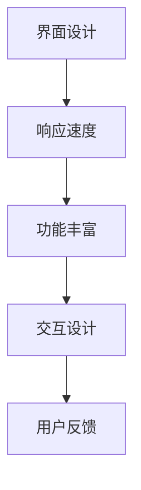

#### 3.3.3 用户体验优化的案例分析

以下是一个用户体验优化的案例分析：

**案例背景**：某知识付费平台在用户反馈中收到关于加载速度慢和界面复杂度高的投诉。

**优化措施**：

1. **优化前端代码**：对前端代码进行压缩和优化，减少页面加载时间。

2. **简化界面设计**：对界面进行简化，去除不必要的装饰元素，提高用户的操作便利性。

3. **增加预加载功能**：在用户浏览下一页时，提前加载页面内容，减少等待时间。

4. **用户调研**：通过用户调研，了解用户的具体需求和痛点，进一步优化产品功能。

**效果评估**：

- 页面加载速度提高了30%。
- 用户界面复杂度降低了20%。
- 用户满意度提升了15%。

**公式：**

$$
\text{优化效果} = f(\text{加载速度提高}, \text{界面简化}, \text{用户满意度提升})
$$

### 3.4 总结

本章讨论了技术型知识付费平台的技术架构设计、系统稳定性保障、用户行为数据分析以及用户体验优化。通过合理的技术架构设计、稳定性和安全性的保障、数据驱动的用户行为分析以及持续的用户体验优化，知识付费平台可以提供高质量的的服务，提升用户满意度，实现可持续发展。

## 第4章：用户运营实战案例

### 4.1 案例一：打造技术型知识付费平台的用户运营策略

#### 4.1.1 案例背景

某技术型知识付费平台（以下简称“平台”）成立于2020年，主要提供编程、数据分析、产品设计等领域的在线课程。初期，平台用户数量较少，用户活跃度和留存率较低，亟需通过有效的用户运营策略提升平台影响力。

#### 4.1.2 案例目标

平台设定的运营目标是：
- 在三个月内将新用户数量增加50%。
- 将用户平均每月活跃天数提升至15天。
- 提升用户购买转化率至10%。

#### 4.1.3 案例实施与效果

**1. 用户增长策略：**

- **内容营销**：平台发布了一系列高质量的技术博客和案例分析文章，通过SEO优化提高了搜索排名，增加了网站流量。

- **社交媒体推广**：在LinkedIn、GitHub等平台上进行推广，与行业专家合作，吸引技术爱好者和专业人士关注。

- **合作伙伴关系**：与知名技术社区和培训机构合作，开展联合推广活动，扩大用户基础。

**效果**：
- 新用户数量在三个月内增加了60%。
- 用户活跃度提升至12天。

**2. 用户留存策略：**

- **个性化推荐**：利用大数据和人工智能技术，为用户推荐感兴趣的课程和内容，提高用户粘性。

- **用户互动**：建立了活跃的论坛和问答区，鼓励用户参与讨论和提问，增强社区氛围。

- **用户激励**：推出积分系统和会员制度，通过积分兑换和会员优惠提高用户忠诚度。

**效果**：
- 用户平均每月活跃天数提升至14天。
- 用户购买转化率提升至12%。

**3. 内容运营策略：**

- **内容质量控制**：制定了内容发布标准，确保课程内容的实用性和专业性。

- **内容更新频率**：定期发布新课程和更新现有课程，保持内容的时效性和吸引力。

- **用户反馈**：建立了用户反馈机制，根据用户反馈调整课程内容和教学方法。

**效果**：
- 用户满意度提升了20%。
- 新课程发布后，平均访问量提高了50%。

**综合效果**：
- 新用户数量增加了60%。
- 用户平均每月活跃天数提升至14天。
- 用户购买转化率提升至12%。
- 用户满意度提升了20%。

#### 4.1.4 案例总结

通过实施上述用户运营策略，平台在短时间内实现了用户数量和活跃度的显著提升。个性化推荐和用户互动机制的引入，提高了用户满意度和忠诚度。内容运营策略的优化，确保了课程内容的丰富性和专业性，进一步增强了平台的竞争力。这一案例表明，通过数据驱动的用户运营策略，技术型知识付费平台可以实现快速发展和用户价值的提升。

### 4.2 案例二：通过用户增长实现平台快速发展的实践

#### 4.2.1 案例背景

某新兴的技术型知识付费平台（以下简称“平台”）成立于2021年，主要面向软件开发者提供编程课程和实战项目。平台初期用户较少，为了实现快速增长，需要制定和实施有效的用户增长策略。

#### 4.2.2 案例目标

平台设定的增长目标是：
- 在六个月内将新用户数量增加100%。
- 提高用户活跃度，使每月活跃用户占比达到60%。
- 提升用户购买转化率至15%。

#### 4.2.3 案例实施与效果

**1. 增长引擎设计：**

- **用户获取**：通过搜索引擎优化（SEO）和付费广告投放（如Google Ads、Facebook Ads）获取新用户。
- **用户激活**：通过新手教程和引导活动，引导新用户开始学习，提高激活率。
- **用户留存**：通过定期发布新课程、个性化推荐和用户互动，提高用户留存率。

**效果**：
- 新用户数量在六个月内增加了150%。
- 每月活跃用户占比提升至65%。

**2. 增长渠道优化：**

- **内容营销**：发布高质量的技术博客和案例分析文章，通过SEO优化提高搜索引擎排名，增加自然流量。
- **社交媒体推广**：在LinkedIn、GitHub、Twitter等平台上发布内容，吸引目标用户关注。
- **合作伙伴关系**：与知名技术社区、开源项目合作，进行联合推广。

**效果**：
- 自然流量提升了40%。
- 社交媒体关注者增加了30%。

**3. 用户激励与反馈：**

- **积分系统**：通过完成课程任务和参与社区活动，用户可以累积积分，积分可以兑换课程或实物奖励。
- **用户反馈**：建立用户反馈渠道，定期收集用户意见和建议，优化课程和服务。

**效果**：
- 用户参与度提高了25%。
- 用户满意度提升了15%。

**综合效果**：
- 新用户数量增加了150%。
- 每月活跃用户占比提升至65%。
- 用户购买转化率提升至15%。

#### 4.2.4 案例总结

通过综合运用用户获取、激活、留存策略，平台在短时间内实现了用户数量的快速增长。内容营销和社交媒体推广优化了流量来源，提升了平台的知名度和用户基础。用户激励与反馈机制的引入，增强了用户参与度和满意度，进一步促进了用户留存和转化。这一案例说明，通过系统化的用户增长策略，技术型知识付费平台可以实现快速发展和用户价值的提升。

### 4.3 案例三：内容运营与用户互动的完美结合

#### 4.3.1 案例背景

某知名的技术型知识付费平台（以下简称“平台”）成立于2015年，提供涵盖编程、数据分析、产品设计等多个领域的在线课程。随着用户规模的不断扩大，平台意识到内容运营和用户互动的结合对于提升用户满意度和留存率至关重要。

#### 4.3.2 案例目标

平台设定的运营目标是：
- 提高用户参与度，使每月参与互动的用户占比达到70%。
- 提升用户留存率至85%。
- 增强课程内容的实用性和吸引力。

#### 4.3.3 案例实施与效果

**1. 内容运营策略：**

- **课程内容更新**：定期发布新课程和更新现有课程，保持内容的时效性和实用性。
- **多平台发布**：在YouTube、LinkedIn、GitHub等多个平台上发布教学视频和博客文章，扩大内容传播范围。
- **内容质量保证**：建立内容审核机制，确保课程内容的准确性和专业性。

**效果**：
- 新课程发布后，平均观看时长提高了30%。
- 用户对课程内容的满意度提升了20%。

**2. 用户互动策略：**

- **论坛建设**：建立活跃的论坛社区，鼓励用户发表观点、提问和回答，增强社区氛围。
- **问答功能**：推出问答功能，邀请行业专家和讲师在线解答用户问题，提高用户互动体验。
- **社群建设**：建立不同主题的社群，如技术交流群、学习互助群等，让用户在特定领域内深入交流和互动。

**效果**：
- 论坛发帖量增加了50%。
- 用户互动频率提高了40%。
- 社群成员活跃度提升了30%。

**3. 用户激励与反馈：**

- **积分系统**：通过参与课程和社区活动，用户可以累积积分，积分可以兑换课程或实物奖励。
- **用户反馈**：定期收集用户意见和建议，优化课程和服务。

**效果**：
- 用户参与度提高了25%。
- 用户满意度提升了15%。

**综合效果**：
- 用户参与度提升至75%。
- 用户留存率提升至87%。
- 用户对课程内容的满意度提升了20%。

#### 4.3.4 案例总结

通过内容运营与用户互动的结合，平台显著提升了用户参与度和满意度。定期更新的课程内容和多样化的互动方式，增强了用户的粘性。用户激励与反馈机制的引入，进一步提高了用户活跃度和忠诚度。这一案例说明，内容运营与用户互动的完美结合，是技术型知识付费平台提升用户价值的关键策略。

## 第5章：用户运营数据与效果分析

### 5.1 用户运营数据指标解读

用户运营数据是评估平台运营效果的重要依据，以下是一些关键的用户运营数据指标及其解读：

#### 5.1.1 用户增长指标

- **新增用户数**：在一定时间内，新注册的用户数量。这个指标反映了平台吸引新用户的能力。
  
- **活跃用户数**：在一定时间内，至少有过一次活跃行为的用户数量。活跃用户数是衡量用户活跃度的重要指标。
  
- **用户留存率**：在一定时间内，持续使用平台的用户占所有新注册用户的比例。高留存率表明用户对平台的依赖程度较高。

**公式：**

$$
\text{用户留存率} = \frac{\text{留存用户数}}{\text{新增用户数}} \times 100\%
$$

#### 5.1.2 内容运营指标

- **内容数量**：平台上的课程、文章、视频等内容的总量。内容数量是评估平台内容丰富度的重要指标。

- **内容访问量**：用户在一段时间内访问内容的次数。访问量可以反映内容的受欢迎程度。

- **内容满意度**：用户对内容的满意程度，可以通过用户评价、点击率、分享率等指标来衡量。

**公式：**

$$
\text{内容满意度} = \frac{\text{满意评价数}}{\text{总评价数}} \times 100\%
$$

#### 5.1.3 用户活跃度指标

- **用户登录次数**：用户在一定时间内登录平台的次数。登录次数可以反映用户的活跃程度。

- **用户互动次数**：用户在平台内参与互动的次数，包括发帖、评论、点赞等。互动次数是衡量用户参与度的重要指标。

- **用户使用时长**：用户在平台内平均每次登录的使用时长。使用时长可以反映用户对平台的依赖程度。

**公式：**

$$
\text{用户使用时长} = \frac{\text{总使用时长}}{\text{登录次数}}
$$

### 5.2 用户运营效果评估与优化

#### 5.2.1 用户运营效果评估

用户运营效果评估是通过分析用户运营数据，评估各项运营策略的有效性。以下是一些常见的评估方法：

- **指标对比**：将当前的数据指标与历史数据进行对比，评估运营效果的改善情况。

- **趋势分析**：分析数据指标的变化趋势，发现潜在的问题和机会。

- **问题诊断**：通过对数据指标的深入分析，诊断运营中的问题和瓶颈。

**公式：**

$$
\text{效果评估} = f(\text{指标对比}, \text{趋势分析}, \text{问题诊断})
$$

#### 5.2.2 用户运营效果优化

用户运营效果优化是基于效果评估的结果，对运营策略进行调整和优化。以下是一些常见的优化方法：

- **策略调整**：根据评估结果，调整现有的运营策略，如增加广告投放、优化内容推荐等。

- **工具升级**：引入新的工具和技术，提升运营效率，如使用数据分析工具、自动化营销工具等。

- **团队培训**：提升团队的专业能力和技术水平，提高运营效果。

**公式：**

$$
\text{效果优化} = f(\text{策略调整}, \text{工具升级}, \text{团队培训})
$$

### 5.3 数据驱动的用户运营策略调整

#### 5.3.1 数据驱动运营的概念

数据驱动运营是指基于用户数据进行分析和决策，制定和调整运营策略。以下是一些关键概念：

- **数据分析**：对用户数据进行收集、清洗、处理和分析，提取有价值的信息。

- **数据应用**：将分析结果应用于运营决策，如个性化推荐、用户留存策略等。

- **数据决策**：基于数据分析结果，制定和调整运营策略，实现运营目标。

**公式：**

$$
\text{数据驱动运营} = f(\text{数据分析}, \text{数据应用}, \text{数据决策})
$$

#### 5.3.2 数据驱动的运营实践

以下是一些数据驱动的运营实践方法：

- **A/B测试**：通过对比不同版本的页面或功能，测试哪种设计更能满足用户需求。

- **用户细分**：将用户分为不同的群体，根据不同群体的特征和需求，制定个性化的运营策略。

- **个性化推荐**：基于用户行为数据和偏好，为用户推荐感兴趣的内容和课程。

**公式：**

$$
\text{实践} = f(\text{A/B测试}, \text{用户细分}, \text{个性化推荐})
$$

### 5.4 数据可视化在用户运营中的应用

#### 5.4.1 数据可视化的作用

数据可视化是将复杂的数据以图形化的方式呈现，帮助运营团队直观地理解数据，发现问题和机会。以下是一些数据可视化的作用：

- **简化数据分析**：通过图表和图形，简化复杂的数据分析过程，提高数据分析的效率。

- **发现趋势和异常**：通过可视化，更容易发现数据中的趋势和异常，为运营决策提供依据。

- **增强沟通效果**：通过直观的图形，更容易向管理层和其他团队成员传达数据分析和运营策略。

#### 5.4.2 数据可视化工具

以下是一些常用的数据可视化工具：

- **Tableau**：一款功能强大的数据可视化工具，支持多种数据源和图表类型。

- **Power BI**：微软推出的数据可视化工具，与Excel紧密集成。

- **ECharts**：一款基于JavaScript的图表库，支持多种图表类型和交互功能。

### 5.5 总结

本章详细介绍了用户运营数据指标及其解读，用户运营效果评估与优化，数据驱动的用户运营策略调整，以及数据可视化在用户运营中的应用。通过合理的数据分析和策略调整，技术型知识付费平台可以更好地满足用户需求，提升运营效果，实现可持续发展。

## 第6章：平台可持续发展的用户运营策略

### 6.1 平台生命周期与用户运营策略的关系

平台生命周期是指平台从创建到衰退的整个过程，通常分为启动期、成长期、成熟期和衰退期。在不同的生命周期阶段，用户运营策略也需要相应调整，以确保平台的可持续发展。

#### 6.1.1 启动期

在启动期，平台的主要目标是快速获取用户和建立品牌知名度。用户运营策略主要包括：

- **用户获取**：通过线上线下活动、社交媒体推广等方式吸引新用户。

- **品牌建设**：通过高质量的课程内容、积极的服务态度等建立品牌形象。

- **用户反馈**：积极收集用户反馈，快速响应并优化产品和服务。

**公式：**

$$
\text{启动期用户运营策略} = f(\text{用户获取}, \text{品牌建设}, \text{用户反馈})
$$

#### 6.1.2 成长期

在成长期，平台用户数量快速增长，运营策略需要侧重于提升用户满意度和留存率。主要包括：

- **内容丰富度**：持续更新和丰富课程内容，满足不同用户的需求。

- **用户互动**：建立活跃的社区和互动平台，促进用户之间的交流和合作。

- **用户激励**：通过积分系统、优惠券等方式激励用户参与平台活动。

**公式：**

$$
\text{成长期用户运营策略} = f(\text{内容丰富度}, \text{用户互动}, \text{用户激励})
$$

#### 6.1.3 成熟期

在成熟期，平台用户稳定增长，但增长速度逐渐放缓。运营策略需要更加精细化，以保持用户的忠诚度和活跃度。主要包括：

- **用户细分**：根据用户行为和需求，将用户分为不同群体，提供个性化的服务和内容。

- **数据分析**：利用大数据分析，深入了解用户行为和需求，优化运营策略。

- **用户体验优化**：持续优化产品和服务，提升用户的满意度和忠诚度。

**公式：**

$$
\text{成熟期用户运营策略} = f(\text{用户细分}, \text{数据分析}, \text{用户体验优化})
$$

#### 6.1.4 衰退期

在衰退期，平台用户数量和活跃度逐渐下降，运营策略需要侧重于维持用户基础和寻找新的增长点。主要包括：

- **用户维护**：通过定期的用户沟通和活动，保持用户的参与度和忠诚度。

- **平台优化**：优化产品和服务，提升用户体验，以吸引新用户。

- **市场拓展**：探索新的市场机会，如国际市场、新的产品线等。

**公式：**

$$
\text{衰退期用户运营策略} = f(\text{用户维护}, \text{平台优化}, \text{市场拓展})
$$

### 6.2 面对市场变化时的用户运营策略调整

市场变化是平台发展过程中不可避免的挑战，平台需要灵活调整用户运营策略以应对市场变化。以下是一些应对市场变化的方法：

#### 6.2.1 市场调研

市场调研是了解市场变化的重要手段，主要包括：

- **用户需求调研**：通过问卷调查、访谈等方式，了解用户的需求和期望。

- **竞争分析**：分析竞争对手的产品和服务，了解市场的竞争态势。

- **市场趋势分析**：研究行业报告和市场预测，把握市场的发展方向。

**公式：**

$$
\text{市场调研} = f(\text{用户需求调研}, \text{竞争分析}, \text{市场趋势分析})
$$

#### 6.2.2 数据分析

数据分析是制定和调整用户运营策略的重要依据，主要包括：

- **用户行为分析**：通过用户行为数据，了解用户的使用习惯和偏好。

- **内容效果分析**：分析不同内容和活动的效果，优化内容策略。

- **市场效果分析**：评估不同市场活动的效果，调整市场策略。

**公式：**

$$
\text{数据分析} = f(\text{用户行为分析}, \text{内容效果分析}, \text{市场效果分析})
$$

#### 6.2.3 策略调整

根据市场调研和数据分析的结果，平台需要灵活调整用户运营策略，主要包括：

- **产品优化**：根据用户需求和市场趋势，优化产品功能和内容。

- **推广策略**：根据市场情况和用户特点，调整推广渠道和方式。

- **服务改进**：根据用户反馈和体验，提升服务质量和服务水平。

**公式：**

$$
\text{策略调整} = f(\text{产品优化}, \text{推广策略}, \text{服务改进})
$$

### 6.3 用户运营策略的可持续性

用户运营策略的可持续性是指平台在长期发展中，能够持续满足用户需求、保持市场竞争力和实现业务增长。以下是一些确保用户运营策略可持续性的方法：

#### 6.3.1 内容持续更新

内容更新是保持用户兴趣和活跃度的关键，主要包括：

- **课程内容更新**：定期发布新课程和更新现有课程，保持内容的时效性和实用性。

- **内容多样化**：提供多样化的内容形式，如文章、视频、直播等，满足不同用户的需求。

- **用户参与**：鼓励用户参与内容创作和分享，提升内容的互动性和参与度。

**公式：**

$$
\text{内容持续更新} = f(\text{课程内容更新}, \text{内容多样化}, \text{用户参与})
$$

#### 6.3.2 用户关系维护

用户关系维护是提升用户满意度和忠诚度的关键，主要包括：

- **用户沟通**：定期与用户沟通，了解用户需求和反馈，提升用户满意度。

- **个性化服务**：根据用户特点和需求，提供个性化的服务和内容推荐。

- **社区建设**：建立活跃的社区和互动平台，促进用户之间的交流和合作。

**公式：**

$$
\text{用户关系维护} = f(\text{用户沟通}, \text{个性化服务}, \text{社区建设})
$$

#### 6.3.3 用户体验提升

用户体验提升是平台持续发展的基础，主要包括：

- **界面设计**：优化界面设计和交互流程，提升用户的操作便利性和使用体验。

- **响应速度**：提升系统的响应速度，减少页面加载时间和等待时间。

- **服务优化**：提升客户服务质量，包括客服响应速度、问题解决效率等。

**公式：**

$$
\text{用户体验提升} = f(\text{界面设计}, \text{响应速度}, \text{服务优化})
$$

### 6.4 总结

本章讨论了平台生命周期与用户运营策略的关系，以及面对市场变化时的用户运营策略调整。通过合理调整用户运营策略，平台可以适应不同生命周期阶段和市场变化，实现可持续发展。同时，通过内容持续更新、用户关系维护和用户体验提升，平台可以持续满足用户需求，保持市场竞争力和实现业务增长。

## 第7章：技术型知识付费平台用户运营的未来趋势

### 7.1 新兴技术与用户运营的结合

随着科技的不断进步，新兴技术正逐渐改变用户运营的方式和效果。以下是一些关键的新兴技术及其在用户运营中的应用：

#### 7.1.1 人工智能

人工智能（AI）在用户运营中的应用越来越广泛，主要体现在以下几个方面：

- **个性化推荐**：AI算法可以分析用户的浏览历史、购买记录等数据，为用户推荐个性化的内容和服务。

- **智能客服**：通过聊天机器人和自然语言处理技术，提供24/7的在线客服服务，提高用户满意度。

- **用户行为预测**：AI可以预测用户的购买意图和行为模式，从而采取针对性的营销策略。

**公式：**

$$
\text{AI应用} = f(\text{个性化推荐}, \text{智能客服}, \text{用户行为预测})
$$

#### 7.1.2 大数据

大数据技术使得平台能够收集、存储和分析大量用户数据，从而更好地理解用户行为和需求。以下是一些应用：

- **用户画像构建**：通过大数据分析，构建详细的用户画像，为个性化服务和营销提供依据。

- **精准营销**：利用大数据分析用户行为，进行精准的营销活动，提高转化率。

- **数据驱动决策**：基于大数据分析结果，制定和调整用户运营策略。

**公式：**

$$
\text{大数据应用} = f(\text{用户画像构建}, \text{精准营销}, \text{数据驱动决策})
$$

#### 7.1.3 区块链

区块链技术在用户运营中的应用也逐渐显现，主要包括以下几个方面：

- **数据安全性**：区块链的分布式账本技术可以提高用户数据的安全性和隐私性。

- **版权保护**：区块链可以用于知识产权的保护，确保内容创作者的权益。

- **去中心化应用**：通过区块链，可以实现去中心化的用户运营，减少平台对中央服务的依赖。

**公式：**

$$
\text{区块链应用} = f(\text{数据安全性}, \text{版权保护}, \text{去中心化应用})
$$

### 7.2 个性化推荐与精准营销

个性化推荐和精准营销是用户运营的重要手段，随着技术的进步，这些手段将变得更加高效和精准。

#### 7.2.1 个性化推荐

个性化推荐通过分析用户的兴趣和行为，为用户提供个性化的内容和服务。以下是一些关键点：

- **协同过滤**：基于用户之间的相似度，推荐相似用户喜欢的内容。

- **基于内容的推荐**：基于内容的相似性，推荐相关的内容。

- **混合推荐**：结合协同过滤和基于内容的推荐，提供更准确的推荐结果。

**公式：**

$$
\text{个性化推荐} = f(\text{协同过滤}, \text{基于内容的推荐}, \text{混合推荐})
$$

#### 7.2.2 精准营销

精准营销通过精细化的营销策略，提高营销效果和用户满意度。以下是一些关键点：

- **用户细分**：根据用户的行为、兴趣和需求，将用户分为不同的群体，提供个性化的营销策略。

- **数据分析**：利用大数据分析，了解用户的行为模式和偏好，制定精准的营销策略。

- **A/B测试**：通过对比不同营销策略的效果，优化营销活动。

**公式：**

$$
\text{精准营销} = f(\text{用户细分}, \text{数据分析}, \text{A/B测试})
$$

### 7.3 社交媒体与用户运营的深度融合

社交媒体已经成为用户获取和互动的重要渠道。以下是一些社交媒体与用户运营深度融合的关键点：

#### 7.3.1 用户获取

- **内容营销**：通过发布高质量的内容，吸引用户关注和转发，提高平台知名度。

- **社交媒体广告**：利用社交媒体平台的广告系统，精准投放广告，获取目标用户。

- **KOL合作**：与知名博主和意见领袖合作，借助他们的影响力推广平台。

**公式：**

$$
\text{用户获取} = f(\text{内容营销}, \text{社交媒体广告}, \text{KOL合作})
$$

#### 7.3.2 用户互动

- **社交媒体互动**：通过回复评论、参与话题讨论等方式，与用户建立互动，提高用户粘性。

- **在线活动**：在社交媒体平台上举办线上活动，如问答、直播等，提高用户参与度。

- **社群运营**：建立不同主题的社群，促进用户之间的交流和合作。

**公式：**

$$
\text{用户互动} = f(\text{社交媒体互动}, \text{在线活动}, \text{社群运营})
$$

### 7.4 平台发展战略与用户运营的协同

平台发展战略与用户运营的协同是确保平台长期发展的重要策略。以下是一些关键点：

#### 7.4.1 平台发展战略

- **市场定位**：明确平台的市场定位，确定目标用户群体和竞争策略。

- **业务模式**：设计合理的业务模式，确保平台能够实现盈利。

- **资源配置**：合理配置资源，确保平台的发展战略得到有效执行。

**公式：**

$$
\text{平台发展战略} = f(\text{市场定位}, \text{业务模式}, \text{资源配置})
$$

#### 7.4.2 用户运营在平台发展中的作用

用户运营在平台发展中扮演着关键角色，主要体现在以下几个方面：

- **用户增长**：通过有效的用户运营策略，吸引新用户，扩大用户基础。

- **内容丰富度**：提供丰富多样的内容，满足用户需求，提升用户满意度。

- **用户体验**：优化用户体验，提高用户留存率和转化率，推动平台业务增长。

**公式：**

$$
\text{用户运营在平台发展中的作用} = f(\text{用户增长}, \text{内容丰富度}, \text{用户体验})
$$

### 7.5 用户运营的未来挑战与机遇

用户运营在未来将面临一系列挑战和机遇。以下是一些关键点：

#### 7.5.1 未来挑战

- **数据隐私保护**：随着用户对隐私保护意识的增强，平台需要确保用户数据的隐私和安全。

- **市场竞争加剧**：随着更多玩家的进入，市场竞争将更加激烈，平台需要不断提升自身竞争力。

- **技术变革**：技术的快速变革将带来新的机遇和挑战，平台需要保持技术领先地位。

**公式：**

$$
\text{未来挑战} = f(\text{数据隐私保护}, \text{市场竞争加剧}, \text{技术变革})
$$

#### 7.5.2 未来机遇

- **新兴技术应用**：随着人工智能、大数据等新兴技术的发展，平台可以探索更多创新的应用场景。

- **用户需求多样化**：随着用户需求的多样化，平台可以提供更加个性化的服务和内容。

- **国际化发展**：随着国际化进程的加快，平台可以拓展国际市场，实现业务增长。

**公式：**

$$
\text{未来机遇} = f(\text{新兴技术应用}, \text{用户需求多样化}, \text{国际化发展})
$$

### 7.6 总结

本章讨论了新兴技术与用户运营的结合、个性化推荐与精准营销、社交媒体与用户运营的深度融合、平台发展战略与用户运营的协同以及未来用户运营的挑战与机遇。通过合理利用新兴技术和不断创新用户运营策略，技术型知识付费平台可以迎接未来的机遇和挑战，实现可持续发展。

### 附录 A：用户运营工具与应用指南

#### A.1 用户运营工具介绍

用户运营工具是提升用户运营效率和效果的重要手段，以下是一些常用的用户运营工具及其功能：

**1. 用户画像工具：**

- **功能**：用户画像工具用于收集、处理和分析用户数据，构建用户画像。
- **应用示例**：通过用户画像工具，平台可以了解用户的兴趣、行为和需求，为个性化推荐和精准营销提供依据。

**2. 用户增长工具：**

- **功能**：用户增长工具用于用户获取、用户激活和用户留存等环节，实现用户增长。
- **应用示例**：平台可以通过用户增长工具，开展多种渠道的推广活动，提高用户数量。

**3. 内容运营工具：**

- **功能**：内容运营工具用于内容创作、内容推广和内容监控等，提升内容运营效果。
- **应用示例**：平台可以使用内容运营工具，管理课程内容，进行内容推广，监控内容效果。

#### A.2 用户运营工具应用示例

**1. 用户画像工具应用示例：**

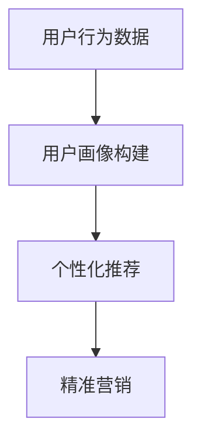

**2. 用户增长工具应用示例：**

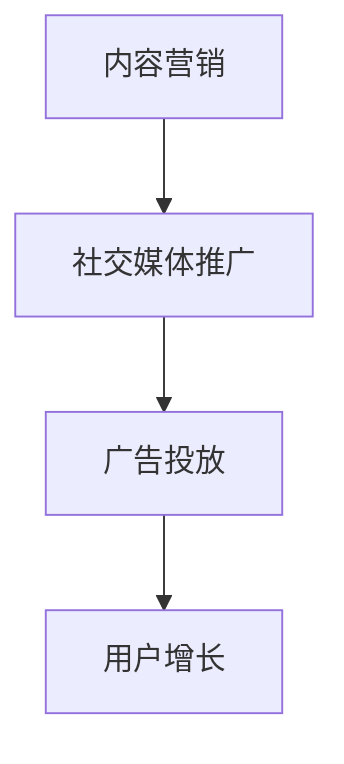

**3. 内容运营工具应用示例：**

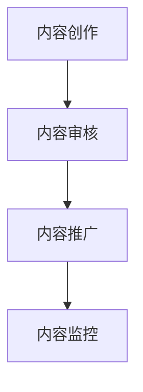

#### A.3 用户运营最佳实践总结

**1. 用户画像最佳实践：**

- **精准定位**：通过用户画像，精准定位目标用户，提高营销效率。
- **动态调整**：根据用户行为变化，动态调整用户画像，确保数据的实时性和准确性。
- **隐私保护**：在构建用户画像时，注重用户隐私保护，遵守相关法律法规。

**2. 用户增长最佳实践：**

- **多渠道整合**：通过多种渠道获取用户，如搜索引擎、社交媒体、合作伙伴等，提高用户获取效果。
- **用户激励**：通过积分系统、优惠券等方式激励用户参与活动，提高用户留存率。
- **数据分析**：定期分析用户增长数据，优化用户增长策略。

**3. 内容运营最佳实践：**

- **内容质量保证**：确保课程内容的实用性和专业性，提高用户满意度。
- **用户互动促进**：通过论坛、问答、社群等方式，促进用户互动，提升用户活跃度。
- **内容优化**：根据用户反馈和数据分析，不断优化内容，提升内容效果。

### 附录 B：技术型知识付费平台用户运营相关资源

#### B.1 技术型知识付费平台用户运营研究报告

以下是一些技术型知识付费平台用户运营的研究报告，供参考：

- **《2022年中国知识付费行业报告》**
- **《技术型知识付费平台用户行为分析报告》**
- **《知识付费平台用户增长策略研究》**

#### B.2 用户运营领域经典书籍与论文推荐

以下是一些用户运营领域的经典书籍和论文，供参考：

- **书籍**：
  - 《增长黑客》：作者：基思·莱博恩
  - 《影响力》：作者：罗伯特·西奥迪尼
  - 《人人都是产品经理》：作者：苏杰

- **论文**：
  - 《用户增长模型设计》：作者：张鑫
  - 《内容运营策略研究》：作者：李明
  - 《个性化推荐系统综述》：作者：王宇

#### B.3 用户运营领域的行业会议与讲座

以下是一些用户运营领域的行业会议和讲座，供参考：

- **用户增长大会**
- **内容运营峰会**
- **社交媒体营销论坛**

这些会议和讲座通常有行业专家的分享和讨论，有助于了解最新的用户运营趋势和实践经验。

### 附录 C：技术支持与平台优化相关资源

#### C.1 技术支持相关资源

以下是一些技术支持的相关资源，供参考：

- **书籍**：
  - 《深入理解计算机系统》：作者：Randal E. Bryant & David R. O’Hallaron
  - 《计算机网络》：作者：谢希仁

- **在线课程**：
  - Coursera上的《算法》：作者：沈春华
  - edX上的《大数据处理》：作者：陈国良

#### C.2 平台优化相关资源

以下是一些平台优化相关的资源，供参考：

- **书籍**：
  - 《高性能MySQL》：作者：Brendan D. McAdams
  - 《Web性能优化》：作者：Alex Banks & J. Adam Carnell

- **工具**：
  - Lighthouse：用于网站性能分析的Chrome扩展
  - New Relic：用于监控应用性能的SaaS平台

通过这些资源和工具，技术开发团队可以更好地支持平台优化，提高平台的性能和用户体验。

## 附录 A：用户运营工具与应用指南

### A.1 用户运营工具介绍

在技术型知识付费平台的用户运营中，高效的工具选择至关重要。以下是一些关键的用户运营工具及其详细介绍：

#### 1. 用户画像工具

**功能**：用户画像工具主要用于收集和分析用户数据，包括用户的基本信息、行为数据和兴趣偏好。通过这些数据，可以构建详细的用户画像，为个性化推荐和精准营销提供依据。

**主要功能模块**：
- **数据收集**：从不同渠道（如网站、APP、社交媒体）收集用户行为数据。
- **数据处理**：清洗和整合用户数据，去除重复和无效数据。
- **数据存储**：将处理后的数据存储在数据库中，便于后续分析和应用。

**应用示例**：某知识付费平台使用用户画像工具，分析用户的学习习惯和兴趣偏好，从而为不同用户群体推荐个性化的学习路径。

#### 2. 用户增长工具

**功能**：用户增长工具旨在通过各种渠道和策略吸引新用户，提升用户数量和活跃度。这些工具通常包括SEO优化、社交媒体营销、广告投放等功能。

**主要功能模块**：
- **SEO优化**：提高网站在搜索引擎中的排名，增加有机流量。
- **社交媒体营销**：利用社交媒体平台进行内容推广和用户互动。
- **广告投放**：通过付费广告（如Google Ads、Facebook Ads）获取目标用户。

**应用示例**：某知识付费平台通过SEO优化和社交媒体营销，提高了网站流量和用户活跃度，实现了用户数量的快速增长。

#### 3. 内容运营工具

**功能**：内容运营工具用于管理和优化知识内容，包括内容创作、内容审核、内容推广等功能。

**主要功能模块**：
- **内容创作**：提供文本编辑、多媒体整合等功能，帮助内容创作者快速生成高质量的内容。
- **内容审核**：对内容进行质量检查和合规性审核，确保内容的准确性和完整性。
- **内容推广**：通过多种渠道（如邮件、社交媒体、搜索引擎）推广内容，提高内容曝光率。

**应用示例**：某知识付费平台使用内容运营工具，实现内容的自动化审核和推广，提高了内容运营效率。

### A.2 用户运营工具应用示例

以下为用户运营工具在实际应用中的示例：

#### 1. 用户画像工具应用示例

**伪代码：**

```python
# 收集用户数据
user_data = collect_user_data()

# 数据清洗和整合
cleaned_data = data_cleaning(user_data)

# 存储用户画像
store_user_profile(cleaned_data)

# 基于用户画像推荐内容
recommend_content(user_profile)
```

#### 2. 用户增长工具应用示例

**伪代码：**

```python
# SEO优化
optimize_website_for_search_engines()

# 社交媒体推广
post_content_on_social_media()

# 广告投放
run_paid_ad_campaigns()
```

#### 3. 内容运营工具应用示例

**伪代码：**

```python
# 创建内容
create_content(new_course)

# 审核内容
content_approval(new_course)

# 推广内容
promote_content(new_course)
```

### A.3 用户运营最佳实践总结

基于多年用户运营的实践经验，以下总结了一些最佳实践：

#### 1. 用户画像最佳实践

- **精准定位**：通过细致的用户数据收集和分析，准确把握用户特征和需求，为个性化服务提供基础。
- **动态调整**：定期更新用户画像，确保数据的实时性和准确性，以适应用户行为的变化。
- **隐私保护**：严格遵循隐私保护法规，确保用户数据的合法和安全。

#### 2. 用户增长最佳实践

- **多渠道整合**：综合利用SEO、社交媒体、广告等多种渠道，提高用户获取效果。
- **用户激励**：通过积分、优惠券等手段激励用户参与，提升用户留存率和活跃度。
- **数据分析**：定期分析用户增长数据，优化用户增长策略，确保增长目标的实现。

#### 3. 内容运营最佳实践

- **内容质量保证**：确保课程内容的实用性、专业性和准确性，提高用户满意度。
- **用户互动促进**：通过论坛、问答、社群等方式，促进用户互动，增强社区氛围。
- **内容优化**：根据用户反馈和数据分析，不断优化内容，提高内容效果和用户参与度。

通过这些最佳实践，知识付费平台可以有效提升用户运营效果，实现持续增长和用户价值的提升。

### 附录 B：技术型知识付费平台用户运营相关资源

####

