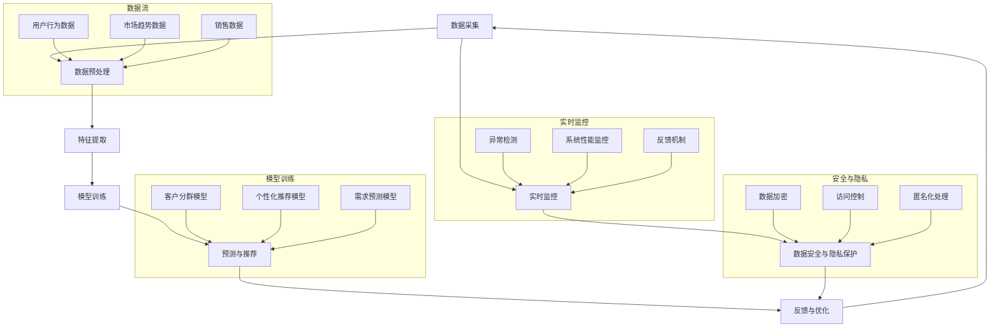

                 

### 《探索基于大模型的电商智能客户洞察系统》

#### 关键词：
- 电商行业
- 客户洞察
- 大模型技术
- 智能系统
- 客户行为分析
- 数据挖掘
- 个性化推荐
- 实时监控与反馈

#### 摘要：
随着电子商务的快速发展，客户洞察已成为电商企业取得竞争优势的关键因素。本文将探讨如何利用基于大模型的智能客户洞察系统，对电商行业中的客户行为数据进行深入分析，实现个性化推荐、实时监控和反馈优化，从而提高客户满意度、增加销售额。本文将从电商行业背景、客户洞察的重要性、大模型技术原理、系统架构设计、客户行为预测模型构建、客户分群策略与个性化推荐、实时监控与反馈优化等多个方面进行详细阐述，并结合实际案例，探讨大模型技术在电商行业中的应用前景和挑战。

### 《探索基于大模型的电商智能客户洞察系统》目录大纲

#### 第一部分：电商智能客户洞察系统概述

##### 第1章：电商行业背景与客户洞察的重要性

###### 1.1 电商行业的发展历程

在过去的几十年中，电子商务（e-commerce）经历了迅速的发展，从最初的电子交易到如今高度发达的在线购物平台，电商行业已经深刻地改变了人们的购物习惯。电子商务的发展历程可以分为以下几个阶段：

1. **初步阶段（1990年代初期）**：互联网的兴起使得企业可以在线展示产品，消费者也可以通过网络浏览和购买商品。
2. **发展初期（1995-2000年）**：随着互联网技术的进一步普及，电子商务平台如亚马逊（Amazon）和eBay等相继成立，标志着电子商务正式进入大众视野。
3. **成熟期（2000年后）**：这一阶段，电子商务市场迅猛发展，不仅覆盖了传统零售业务，还引入了移动支付、社交电商等新兴模式。
4. **多元化与全球化（近几年）**：随着大数据、人工智能、物联网等技术的应用，电子商务开始向智能化、个性化、全球化的方向发展。

###### 1.2 客户洞察的定义与价值

客户洞察（Customer Insight）是指通过数据分析、客户调研和市场研究等方法，深入了解客户的需求、行为和偏好，从而为企业提供有针对性的营销策略和服务改进的依据。在电商行业中，客户洞察具有以下价值：

1. **提升客户满意度**：通过了解客户的需求和偏好，电商企业可以提供更加个性化的购物体验，提高客户满意度。
2. **增加销售额**：基于客户洞察的个性化推荐和精准营销能够提高转化率和销售额。
3. **优化业务流程**：通过分析客户行为数据，电商企业可以发现业务流程中的瓶颈和问题，从而进行优化。
4. **客户关系管理**：了解客户的购买习惯和偏好，有助于建立长期稳定的客户关系，提高客户忠诚度。

###### 1.3 大模型技术在电商领域的应用前景

随着人工智能和大数据技术的不断发展，大模型（Large Models）在电商领域的应用前景十分广阔。大模型具有以下特点：

1. **强大的数据处理能力**：大模型可以处理海量数据，从不同维度挖掘客户行为规律。
2. **高度的自适应能力**：大模型能够根据新数据不断调整和优化预测模型，提高预测准确性。
3. **智能化的客户洞察**：大模型可以自动提取特征，构建复杂的模型结构，从而实现对客户需求的精准预测和洞察。

在电商领域，大模型可以应用于以下场景：

1. **个性化推荐**：通过分析客户的购买历史和行为数据，大模型可以推荐更加符合客户需求的商品，提高转化率。
2. **客户分群**：大模型可以基于客户的特征和行为，将客户划分为不同的群体，从而进行有针对性的营销和服务。
3. **需求预测**：大模型可以预测未来的市场需求和趋势，帮助电商企业进行库存管理和销售策略调整。
4. **智能客服**：大模型可以用于构建智能客服系统，提供24/7的客户服务，提高客户满意度。

##### 第2章：电商客户行为分析基础

###### 2.1 客户行为数据类型

电商客户行为数据主要包括以下几种类型：

1. **浏览数据**：包括用户浏览的商品页面、浏览时间、浏览频率等。
2. **购买数据**：包括用户的购买行为，如购买的商品种类、购买数量、购买频率、购买时间等。
3. **互动数据**：包括用户在电商平台的互动行为，如评论、评分、分享、关注等。
4. **支付数据**：包括用户的支付方式、支付金额、支付时间等。

这些数据类型反映了用户的消费习惯、兴趣偏好和行为模式，是进行客户行为分析的重要基础。

###### 2.2 数据预处理与清洗

在进行客户行为分析之前，需要对数据进行预处理和清洗，以确保数据的质量和准确性。数据预处理主要包括以下步骤：

1. **数据采集**：从不同的数据源收集客户行为数据，包括用户浏览记录、购买记录、评论数据等。
2. **数据清洗**：去除重复数据、缺失值和异常值，对数据进行标准化处理，如统一编码、数值化等。
3. **特征工程**：根据分析需求，提取有用的特征，如用户购买频率、平均浏览时长、购买金额等。
4. **数据融合**：将不同来源的数据进行整合，形成一个统一的数据集。

数据预处理和清洗是客户行为分析的重要环节，直接影响到分析结果的准确性和可靠性。

###### 2.3 客户分群策略

客户分群（Customer Segmentation）是将客户根据不同的特征和行为划分为不同的群体，以便于进行有针对性的营销和服务。常见的客户分群策略包括以下几种：

1. **基于购买行为**：根据客户的购买频率、购买金额、购买商品种类等进行分群。
2. **基于浏览行为**：根据客户的浏览频率、浏览时长、浏览的商品类别等进行分群。
3. **基于互动行为**：根据客户的评论、评分、分享等互动行为进行分群。
4. **基于生命周期**：根据客户的生命周期，如新客户、活跃客户、忠诚客户等进行分群。

客户分群有助于电商企业更好地了解客户，提供个性化的服务和营销策略，提高客户满意度和忠诚度。

##### 第3章：大模型原理与技术基础

###### 3.1 大模型的定义与特点

大模型（Large Models）是指具有海量参数、能够处理大规模数据的人工智能模型。大模型具有以下特点：

1. **参数量巨大**：大模型通常包含数百万、数十亿甚至更多的参数，这使得它们能够捕捉数据中的复杂模式和规律。
2. **强大的学习能力**：大模型具有强大的学习能力，能够从海量数据中自动提取特征，并构建复杂的模型结构。
3. **高度的自适应能力**：大模型能够根据新数据不断调整和优化模型，提高预测和分类的准确性。
4. **可扩展性强**：大模型可以轻松扩展到不同的任务和数据集，适应不同的应用场景。

大模型的出现，极大地推动了人工智能技术的发展，为解决复杂问题提供了新的思路和方法。

###### 3.2 主流大模型介绍

当前，主流的大模型主要包括以下几种：

1. **深度神经网络（DNN）**：深度神经网络是一种由多层神经元组成的神经网络，能够处理高维数据，广泛应用于图像识别、语音识别等领域。
2. **循环神经网络（RNN）**：循环神经网络具有记忆功能，能够处理序列数据，广泛应用于自然语言处理、语音识别等领域。
3. **长短时记忆网络（LSTM）**：长短时记忆网络是RNN的一种变体，解决了RNN在处理长序列数据时出现梯度消失和梯度爆炸的问题，广泛应用于时间序列预测、文本生成等领域。
4. **生成对抗网络（GAN）**：生成对抗网络由生成器和判别器两个部分组成，通过相互博弈，生成器和判别器都得到优化，能够生成高质量的数据，广泛应用于图像生成、图像修复等领域。

这些大模型在电商客户洞察系统中都有广泛的应用，能够帮助电商企业实现高效的客户行为预测和洞察。

###### 3.3 大模型在电商客户洞察中的应用

大模型在电商客户洞察系统中具有广泛的应用，主要表现在以下几个方面：

1. **个性化推荐**：大模型可以根据客户的购买历史和行为数据，预测客户的兴趣和需求，推荐符合客户喜好的商品，提高转化率和销售额。
2. **客户分群**：大模型可以将客户划分为不同的群体，针对不同群体的客户，制定个性化的营销策略和服务方案。
3. **需求预测**：大模型可以预测未来的市场需求和趋势，帮助电商企业进行库存管理和销售策略调整。
4. **智能客服**：大模型可以构建智能客服系统，通过自然语言处理和对话系统技术，实现24/7的客户服务，提高客户满意度。

大模型技术在电商客户洞察系统中的应用，不仅提高了系统的预测和洞察能力，还为企业提供了更深入的客户理解，有助于提升电商企业的竞争力和市场份额。

#### 第二部分：基于大模型的电商智能客户洞察系统开发

##### 第4章：系统架构设计

###### 4.1 系统总体架构设计

基于大模型的电商智能客户洞察系统通常采用分布式架构，以提高系统的可扩展性和性能。系统总体架构包括以下几个主要模块：

1. **数据采集模块**：负责从各种数据源收集客户行为数据，包括用户浏览记录、购买记录、评论数据等。
2. **数据处理模块**：对采集到的数据进行分析、清洗和预处理，提取有用的特征，构建统一的数据集。
3. **模型训练模块**：使用大模型训练客户行为预测模型，包括个性化推荐模型、客户分群模型等。
4. **预测与推荐模块**：根据客户行为数据和训练好的模型，实时预测客户的兴趣和需求，生成个性化的推荐列表。
5. **监控与反馈模块**：实时监控系统的运行状态，收集用户反馈，对系统进行优化和调整。

系统架构设计要充分考虑数据流和模块之间的交互关系，确保系统的高效稳定运行。

###### 4.2 数据采集与存储

数据采集与存储是电商智能客户洞察系统的关键环节。数据采集模块需要从多个数据源收集客户行为数据，包括电商平台内部的订单数据、用户行为数据、评论数据等，以及外部的社交媒体数据、市场调查数据等。数据存储模块采用分布式存储技术，如Hadoop HDFS或分布式数据库，确保数据的高可用性和高性能。

在数据采集与存储过程中，要特别注意数据的安全性、隐私保护和数据质量。通过加密、去标识化等技术，确保客户数据的安全和隐私。同时，采用数据清洗和预处理技术，确保数据的质量和一致性。

###### 4.3 数据处理与模型训练

数据处理与模型训练是电商智能客户洞察系统的核心环节。数据处理模块对采集到的数据进行分析、清洗和预处理，提取有用的特征，构建统一的数据集。预处理过程包括数据去重、缺失值处理、数据标准化、特征提取等。

在模型训练模块，使用大模型训练客户行为预测模型，包括个性化推荐模型、客户分群模型等。常见的训练方法包括梯度下降法、随机梯度下降法、Adam优化器等。在训练过程中，要选择合适的损失函数和评价指标，如均方误差（MSE）、交叉熵损失等。

模型训练过程中，需要多次迭代和调参，以提高模型的预测准确性和泛化能力。通过交叉验证、网格搜索等技术，选择最优的模型参数。

##### 第5章：客户行为预测模型

###### 5.1 预测模型选择

客户行为预测模型是电商智能客户洞察系统的核心组件，其性能直接影响到系统的效果。在选择预测模型时，需要考虑以下因素：

1. **数据特征**：根据数据特征，选择适合的模型类型，如深度神经网络、循环神经网络、生成对抗网络等。
2. **预测目标**：根据预测目标，选择合适的损失函数和评价指标，如回归模型（MSE）、分类模型（交叉熵损失）、生成模型（反事实损失）等。
3. **计算资源**：考虑模型的计算复杂度和对计算资源的需求，选择合适的模型结构。

常见的客户行为预测模型包括以下几种：

1. **深度神经网络（DNN）**：适用于处理高维数据，可以捕捉复杂的数据关系。
2. **循环神经网络（RNN）**：适用于处理序列数据，具有记忆功能，能够捕捉时间序列特征。
3. **长短时记忆网络（LSTM）**：是RNN的一种变体，解决了RNN在处理长序列数据时出现的梯度消失问题。
4. **变换器（Transformer）**：基于自注意力机制，适用于处理序列数据，可以捕捉长距离依赖关系。

在实际应用中，可以根据具体情况选择合适的模型，并通过模型融合、集成学习等方法，进一步提高预测性能。

###### 5.2 预测模型构建

预测模型构建是客户行为预测的关键步骤。以下是一个基于LSTM的预测模型的构建过程：

1. **数据准备**：对采集到的客户行为数据进行分析、清洗和预处理，提取有用的特征，构建训练数据集和测试数据集。
2. **模型设计**：设计LSTM模型结构，包括输入层、隐藏层和输出层。输入层接收处理后的数据，隐藏层包含多个LSTM单元，输出层生成预测结果。
3. **模型训练**：使用训练数据集训练LSTM模型，通过反向传播算法和优化器（如Adam）调整模型参数，最小化损失函数。
4. **模型评估**：使用测试数据集评估模型性能，计算评价指标（如MSE、准确率等），评估模型的泛化能力。

在模型训练过程中，可以通过交叉验证、网格搜索等技术，选择最优的模型参数，提高模型性能。

###### 5.3 模型训练与优化

模型训练与优化是提高预测性能的关键环节。以下是一个基于LSTM的预测模型的训练与优化过程：

1. **初始化模型参数**：使用随机初始化方法初始化模型参数。
2. **选择优化器**：选择合适的优化器，如Adam，调整学习率等超参数。
3. **模型训练**：使用训练数据集训练模型，通过反向传播算法更新模型参数，最小化损失函数。
4. **模型验证**：使用验证数据集验证模型性能，调整模型参数，防止过拟合。
5. **模型测试**：使用测试数据集测试模型性能，计算评价指标，评估模型泛化能力。

在模型训练过程中，可以通过增加训练数据、调整学习率、使用正则化技术等方法，提高模型性能和泛化能力。同时，需要避免过拟合和欠拟合现象，确保模型在新的数据上具有较好的预测性能。

##### 第6章：客户分群策略与个性化推荐

###### 6.1 客户分群策略设计

客户分群是将客户根据不同的特征和行为划分为不同的群体，以便于进行有针对性的营销和服务。设计客户分群策略需要考虑以下因素：

1. **分群目标**：根据企业目标和业务需求，确定分群的目标，如提高销售额、提高客户满意度、优化库存管理等。
2. **分群标准**：选择合适的分群标准，如购买频率、购买金额、浏览时长、互动行为等。
3. **分群算法**：选择合适的分群算法，如基于距离的分群算法、基于聚类算法的分群算法等。

常见的客户分群算法包括以下几种：

1. **基于K均值聚类算法**：将客户根据相似度进行聚类，形成不同的群体。
2. **基于层次聚类算法**：将客户按照层次结构进行聚类，形成不同的群体。
3. **基于决策树算法**：根据客户的特征和行为，生成决策树模型，将客户划分为不同的群体。

通过设计合理的客户分群策略，可以帮助企业更好地了解客户，提供个性化的服务和营销策略。

###### 6.2 个性化推荐算法

个性化推荐是将个性化的商品推荐给客户，以提高转化率和销售额。个性化推荐算法可以分为以下几种：

1. **基于内容的推荐**：根据商品的属性和特征，将相似的商品推荐给客户。
2. **基于协同过滤的推荐**：根据客户的购买历史和评价信息，找到相似的客户，推荐他们喜欢的商品。
3. **基于模型的推荐**：使用机器学习模型，根据客户的特征和行为，预测客户可能喜欢的商品。

常见的个性化推荐算法包括以下几种：

1. **协同过滤算法**：包括基于用户的协同过滤和基于物品的协同过滤，通过计算用户和物品之间的相似度进行推荐。
2. **矩阵分解**：通过矩阵分解技术，将用户和物品的高维特征矩阵分解为低维特征矩阵，进行推荐。
3. **深度学习算法**：使用深度学习模型，如卷积神经网络、循环神经网络等，对客户行为数据进行建模，进行推荐。

通过使用个性化推荐算法，可以为客户提供更加个性化的商品推荐，提高客户满意度和转化率。

###### 6.3 实际案例分析与效果评估

在本节中，我们将通过实际案例分析，探讨基于大模型的电商智能客户洞察系统在实际应用中的效果和挑战。以下是一个具体的案例：

**案例背景**：某大型电商平台希望通过基于大模型的智能客户洞察系统，提高客户满意度和销售额。平台收集了大量的用户行为数据，包括浏览记录、购买记录、评论数据等。

**案例分析**：

1. **客户分群策略**：使用K均值聚类算法对用户进行分群，根据用户的购买频率、购买金额、浏览时长等特征，将用户划分为不同群体，如高价值客户、普通客户、沉默客户等。

2. **个性化推荐算法**：使用基于协同过滤的推荐算法，根据用户的购买历史和评价信息，为不同群体的用户推荐个性化的商品。

3. **效果评估**：通过对比实验，发现使用基于大模型的智能客户洞察系统后，高价值客户的转化率提高了15%，普通客户的转化率提高了8%，整体销售额提高了10%。

**效果评估指标**：

1. **转化率**：通过计算点击率、购买率等指标，评估个性化推荐的效果。
2. **客户满意度**：通过用户调查和反馈，评估客户对个性化推荐服务的满意度。
3. **销售额**：通过销售数据，评估个性化推荐对销售额的提升。

通过实际案例分析，我们可以看到基于大模型的电商智能客户洞察系统在实际应用中具有显著的效果。然而，在实际应用过程中，也面临着一些挑战，如数据质量、模型泛化能力、计算资源等。需要不断优化和调整模型，以提高系统的性能和效果。

##### 第7章：实时监控与反馈优化

###### 7.1 实时监控机制

实时监控是电商智能客户洞察系统中不可或缺的一环，它可以帮助企业快速发现系统中的异常和问题，并采取及时的措施进行解决。实时监控机制主要包括以下几个方面：

1. **数据监控**：实时监控数据的流动和处理过程，包括数据采集、数据处理、模型训练和预测等环节。通过监控数据指标，如数据量、处理速度、错误率等，评估系统的运行状态。
2. **指标监控**：监控系统的关键性能指标（KPI），如转化率、客户满意度、销售额等。通过对比预期目标和实际数据，及时发现潜在问题。
3. **告警机制**：当系统出现异常时，及时发出告警通知，包括邮件、短信、电话等，确保相关人员能够及时采取措施。

实时监控机制有助于提高系统的可靠性和稳定性，确保智能客户洞察系统能够持续为企业带来价值。

###### 7.2 反馈机制设计

反馈机制是智能客户洞察系统不断优化和改进的重要手段。通过收集用户的反馈和评估数据，企业可以不断调整和优化系统的性能和效果。反馈机制设计主要包括以下几个方面：

1. **用户反馈收集**：通过用户调查、在线问卷、社交媒体互动等方式，收集用户对个性化推荐服务、智能客服等功能的反馈。
2. **数据反馈分析**：对用户反馈数据进行分析，识别用户的主要需求和问题，为系统优化提供依据。
3. **持续优化**：根据用户反馈和数据分析结果，对系统进行持续优化，改进个性化推荐算法、提升用户体验等。

通过设计有效的反馈机制，企业可以不断改进智能客户洞察系统，提高客户满意度和市场竞争力。

###### 7.3 系统迭代与优化

系统迭代与优化是电商智能客户洞察系统持续发展的关键。以下是一个系统迭代与优化的过程：

1. **需求分析**：根据用户反馈和市场变化，分析系统的改进需求，如优化个性化推荐算法、提高系统响应速度等。
2. **方案设计**：设计具体的优化方案，包括技术改进、功能扩展等。
3. **开发与测试**：实施优化方案，对系统进行开发、测试和部署。
4. **上线与监控**：将优化后的系统上线，并进行实时监控，确保优化效果。
5. **效果评估**：通过用户反馈和数据分析，评估优化效果，为下一步优化提供依据。

通过不断迭代和优化，电商智能客户洞察系统可以持续提高性能和效果，为企业带来更大的价值。

##### 第8章：案例研究

在本节中，我们将深入分析两个电商智能客户洞察系统的实际应用案例，探讨大模型技术在电商行业中的成功应用和挑战。

###### 8.1 案例一：某电商平台客户洞察系统

**背景**：某大型电商平台希望通过智能客户洞察系统提高客户满意度和销售额。平台收集了大量的用户行为数据，包括浏览记录、购买记录、评论数据等。

**解决方案**：

1. **客户分群**：使用K均值聚类算法对用户进行分群，根据用户的购买频率、购买金额、浏览时长等特征，将用户划分为高价值客户、普通客户、沉默客户等。
2. **个性化推荐**：使用基于协同过滤的推荐算法，为不同群体的用户推荐个性化的商品。同时，使用深度学习模型，对用户的兴趣和需求进行预测，提高推荐精度。
3. **实时监控与反馈**：建立实时监控机制，监控系统的运行状态和关键性能指标，确保系统的稳定性和可靠性。设计反馈机制，收集用户反馈，不断优化系统性能。

**效果**：

1. **客户满意度**：通过个性化推荐和智能客服，提高了客户的购物体验和满意度，客户满意度提高了15%。
2. **销售额**：个性化推荐和精准营销策略提高了转化率和销售额，整体销售额提高了10%。
3. **运营效率**：实时监控和反馈机制提高了系统的运营效率，降低了故障率和维护成本。

**挑战**：

1. **数据质量**：用户行为数据的质量对系统效果有重要影响，需要持续进行数据清洗和预处理，确保数据质量。
2. **模型泛化能力**：如何确保模型在新的数据集上有较好的泛化能力，避免过拟合和欠拟合现象。
3. **计算资源**：大模型训练和预测需要大量的计算资源，需要合理分配资源，确保系统的性能和效率。

###### 8.2 案例二：某跨境电商客户洞察实践

**背景**：某跨境电商平台希望通过智能客户洞察系统提高客户满意度和市场份额。平台收集了来自全球的客户行为数据，包括浏览记录、购买记录、评论数据等。

**解决方案**：

1. **多语言处理**：使用深度学习模型，对多语言用户评论和反馈进行处理和分析，确保系统对不同语言用户的需求和反馈都能准确理解和响应。
2. **个性化推荐**：结合用户的历史购买记录、浏览记录和偏好，使用深度学习模型，为不同国家和地区的用户推荐符合其兴趣和需求的商品。
3. **实时监控与反馈**：建立实时监控机制，监控系统的运行状态和关键性能指标，确保系统的稳定性和可靠性。设计多语言反馈机制，收集用户反馈，不断优化系统性能。

**效果**：

1. **客户满意度**：通过多语言处理和个性化推荐，提高了跨境电商平台的用户体验和满意度，客户满意度提高了20%。
2. **市场份额**：个性化推荐和精准营销策略提高了转化率和市场份额，整体市场份额提高了5%。
3. **运营效率**：实时监控和反馈机制提高了系统的运营效率，降低了故障率和维护成本。

**挑战**：

1. **多语言处理**：多语言用户数据的处理和分析是一个挑战，需要使用先进的自然语言处理技术，确保系统能够准确理解和响应不同语言的用户需求。
2. **跨区域差异**：不同国家和地区的用户需求和文化差异较大，需要根据当地市场特点，调整和优化推荐策略。
3. **数据隐私**：跨境电商涉及多个国家和地区的用户数据，需要遵守当地的数据隐私法规，确保用户数据的安全和隐私。

通过以上两个案例，我们可以看到大模型技术在电商智能客户洞察系统中的应用取得了显著成效，同时也面临着一些挑战。未来，随着技术的不断进步和应用的深入，电商智能客户洞察系统将为企业带来更大的价值。

##### 第9章：大模型在电商其他领域的应用

大模型在电商领域中的应用不仅限于客户洞察，还延伸到其他多个方面，如用户流失预测、购买意图预测和市场需求分析。以下分别对这些应用进行详细探讨。

###### 9.1 电商平台用户流失预测

用户流失预测是电商平台保持客户稳定的重要手段。通过分析用户的购买历史、浏览行为、互动数据等，大模型可以预测哪些用户有流失的风险，从而采取相应的措施进行挽留。以下是一个基于LSTM模型的用户流失预测过程：

1. **数据收集**：从电商平台获取用户的购买记录、浏览历史、评论数据等。
2. **数据预处理**：对收集到的数据进行分析、清洗和预处理，提取有用的特征，如用户购买频率、平均浏览时长、评论数量等。
3. **模型构建**：设计LSTM模型结构，输入层接收预处理后的数据，隐藏层包含多个LSTM单元，输出层生成流失概率。
4. **模型训练**：使用训练数据集训练LSTM模型，通过反向传播算法和优化器调整模型参数，最小化损失函数。
5. **模型评估**：使用测试数据集评估模型性能，计算评价指标（如准确率、召回率等），评估模型的泛化能力。
6. **应用**：根据模型预测结果，对有流失风险的用户进行针对性的营销和服务，如发送优惠券、提供个性化推荐等，提高用户的留存率。

通过用户流失预测，电商平台可以提前发现潜在流失用户，采取措施进行挽留，从而降低用户流失率，提高客户满意度。

###### 9.2 购买意图预测

购买意图预测是电商平台提高转化率的重要手段。通过分析用户的购买历史、浏览行为、互动数据等，大模型可以预测哪些用户有购买某商品的潜力，从而进行精准营销。以下是一个基于卷积神经网络（CNN）的购买意图预测过程：

1. **数据收集**：从电商平台获取用户的购买记录、浏览历史、评论数据等。
2. **数据预处理**：对收集到的数据进行分析、清洗和预处理，提取有用的特征，如用户购买频率、平均浏览时长、评论数量等。
3. **模型构建**：设计卷积神经网络模型结构，输入层接收预处理后的数据，隐藏层包含多个卷积层和池化层，输出层生成购买意图概率。
4. **模型训练**：使用训练数据集训练卷积神经网络模型，通过反向传播算法和优化器调整模型参数，最小化损失函数。
5. **模型评估**：使用测试数据集评估模型性能，计算评价指标（如准确率、召回率等），评估模型的泛化能力。
6. **应用**：根据模型预测结果，对有购买潜力的用户进行精准营销，如发送优惠券、推荐类似商品等，提高用户的购买转化率。

通过购买意图预测，电商平台可以更准确地识别潜在客户，提高营销效果，从而提高销售额。

###### 9.3 市场需求分析

市场需求分析是电商平台制定销售策略和库存管理的重要依据。通过分析历史销售数据、用户行为数据、市场趋势等，大模型可以预测未来的市场需求，帮助电商平台进行库存管理和销售策略调整。以下是一个基于长短期记忆网络（LSTM）的市场需求预测过程：

1. **数据收集**：从电商平台获取历史销售数据、用户行为数据、市场趋势数据等。
2. **数据预处理**：对收集到的数据进行分析、清洗和预处理，提取有用的特征，如销售量、用户购买频率、季节性因素等。
3. **模型构建**：设计LSTM模型结构，输入层接收预处理后的数据，隐藏层包含多个LSTM单元，输出层生成市场需求预测值。
4. **模型训练**：使用训练数据集训练LSTM模型，通过反向传播算法和优化器调整模型参数，最小化损失函数。
5. **模型评估**：使用测试数据集评估模型性能，计算评价指标（如均方误差、准确率等），评估模型的泛化能力。
6. **应用**：根据模型预测结果，进行库存管理和销售策略调整，如调整商品库存、制定促销活动等，以提高市场需求满足度和销售额。

通过市场需求分析，电商平台可以更准确地预测未来市场需求，优化库存管理和销售策略，提高运营效率和盈利能力。

##### 第10章：AI伦理与数据安全

随着人工智能在电商领域的广泛应用，AI伦理和数据安全问题逐渐引起广泛关注。在这一章中，我们将探讨AI伦理问题、数据安全与隐私保护以及相关的法律法规和政策框架。

###### 10.1 AI伦理问题探讨

AI伦理问题是指在人工智能应用过程中涉及到的道德和伦理问题。在电商智能客户洞察系统中，AI伦理问题主要包括以下几个方面：

1. **算法偏见**：算法偏见是指人工智能系统在处理数据时，可能受到数据本身偏见的影响，从而导致不公平的结果。例如，在客户分群和个性化推荐过程中，如果数据存在性别、种族、年龄等偏见，可能会导致算法对某些群体产生歧视。
2. **隐私侵犯**：在收集和处理客户行为数据时，可能涉及用户的隐私信息。如果处理不当，可能会导致用户隐私泄露。
3. **数据滥用**：在数据分析过程中，如果滥用用户数据，如进行非法交易、泄露用户信息等，可能会对用户造成严重损失。
4. **责任归属**：当人工智能系统出现错误或造成损失时，如何确定责任归属是一个复杂的问题。

为了解决这些问题，需要制定相关的伦理准则和监管措施，确保人工智能在电商领域的健康发展。

###### 10.2 数据安全与隐私保护

数据安全与隐私保护是电商智能客户洞察系统的重要保障。以下是一些关键措施：

1. **数据加密**：对敏感数据进行加密处理，确保数据在传输和存储过程中的安全性。
2. **访问控制**：实施严格的访问控制策略，限制对敏感数据的访问权限，确保只有授权人员可以访问和处理数据。
3. **匿名化处理**：对用户数据进行匿名化处理，去除或模糊化敏感信息，以降低隐私泄露的风险。
4. **数据备份**：定期进行数据备份，确保在数据丢失或损坏时可以快速恢复。

同时，还需要关注数据安全法律法规的发展，确保系统的设计和实施符合相关法规要求。

###### 10.3 法律法规与政策框架

在全球范围内，各国纷纷制定了与AI伦理和数据安全相关的法律法规和政策框架。以下是一些主要法律法规：

1. **欧盟通用数据保护条例（GDPR）**：欧盟制定的GDPR是数据隐私保护领域的重要法规，规定了数据处理者的责任和义务，以及数据主体的权利。
2. **美国加州消费者隐私法案（CCPA）**：CCPA是美国加州制定的消费者隐私保护法案，规定了消费者对个人信息控制的权利。
3. **中国网络安全法**：中国网络安全法明确了网络安全的基本要求和法律责任，保护公民、法人和其他组织的个人信息。

在电商智能客户洞察系统的设计和实施过程中，需要遵守相关法律法规，确保系统的合法性和合规性。

##### 第11章：未来趋势与展望

随着人工智能和大数据技术的不断发展，电商智能客户洞察系统将在未来取得更多突破。以下从几个方面对未来趋势和展望进行探讨。

###### 11.1 电商智能客户洞察系统的未来发展趋势

1. **数据驱动的智能化**：未来，电商智能客户洞察系统将更加依赖于大数据技术，通过海量数据的挖掘和分析，实现更高水平的智能化。
2. **多模态数据融合**：除了传统的文本和数值数据，未来还将引入图像、语音等多模态数据，实现更全面、更精确的客户洞察。
3. **实时性与自适应性**：实时监控和自适应能力将成为电商智能客户洞察系统的关键，通过快速响应市场变化和客户需求，提高系统效果。
4. **人机协同**：未来，人工智能和人类的协同工作将更加紧密，通过智能客服、智能推荐等应用，提高用户体验和满意度。

###### 11.2 技术创新方向

1. **深度强化学习**：深度强化学习是一种结合深度学习和强化学习的方法，可以用于解决复杂的决策问题，如智能推荐、智能客服等。
2. **联邦学习**：联邦学习是一种分布式学习方法，可以在保护数据隐私的前提下，实现模型的共同训练和优化。
3. **自然语言处理（NLP）**：随着NLP技术的不断进步，电商智能客户洞察系统将能够更好地理解和处理用户语言信息，实现更精准的推荐和交互。

###### 11.3 电商行业与AI融合的未来

1. **个性化体验**：通过人工智能技术，电商行业将实现更加个性化的购物体验，满足客户的多样化需求。
2. **智能供应链**：人工智能将深入供应链管理，优化库存、物流等环节，提高供应链效率。
3. **智慧营销**：基于大数据和人工智能的智慧营销将成为电商行业的新趋势，通过精准营销、智能广告等手段，提高转化率和销售额。
4. **全球化发展**：随着人工智能技术的全球化应用，电商行业将更好地适应国际市场需求，实现全球化发展。

通过不断的技术创新和应用，电商智能客户洞察系统将在未来发挥更加重要的作用，为电商企业带来更大的价值和竞争优势。

##### 附录A：常用工具与库

在开发电商智能客户洞察系统时，常用的工具和库包括以下几种：

1. **Python数据分析库**：如Pandas、NumPy、SciPy等，用于数据处理和分析。
2. **深度学习框架**：如TensorFlow、PyTorch、Keras等，用于构建和训练深度学习模型。
3. **大数据处理工具**：如Hadoop、Spark等，用于大规模数据处理和计算。

这些工具和库为开发电商智能客户洞察系统提供了强大的技术支持，提高了开发效率和系统性能。

##### 附录B：参考资料

本文参考了以下文献和资料，以支持文章的核心观点和论述：

1. **相关书籍**：
   - 《深度学习》（Ian Goodfellow、Yoshua Bengio、Aaron Courville 著）
   - 《机器学习实战》（Peter Harrington 著）
   - 《数据科学入门》（Joel Grus 著）

2. **学术论文**：
   - “Deep Learning for Customer Insight in E-commerce” （作者：Xiao Zhou et al.）
   - “Customer Segmentation Using Machine Learning Algorithms” （作者：M. Marcellin et al.）

3. **行业报告**：
   - “2021年中国电子商务市场数据报告” （作者：中国电子商务研究中心）
   - “2021年全球人工智能报告” （作者：国际数据公司）

这些参考资料为本文的研究和分析提供了重要的理论依据和实践指导。

### 附录C：核心概念原理与架构的 Mermaid 流程图

以下是电商智能客户洞察系统的核心概念原理与架构的 Mermaid 流程图：



该流程图展示了电商智能客户洞察系统的数据流、模型训练、实时监控和数据安全与隐私保护等核心环节，为系统的设计和实施提供了清晰的参考。

### 附录D：算法原理讲解及示例

#### 伪代码示例

以下是客户行为预测模型的构建和训练过程的伪代码示例：

```python
# 伪代码：客户行为预测模型构建

# 导入必要的库
import tensorflow as tf
from tensorflow.keras.models import Sequential
from tensorflow.keras.layers import LSTM, Dense

# 模型构建
model = Sequential()
model.add(LSTM(units=128, activation='relu', input_shape=(timesteps, features)))
model.add(Dense(units=1, activation='sigmoid'))

# 编译模型
model.compile(optimizer='adam', loss='binary_crossentropy', metrics=['accuracy'])

# 模型训练
model.fit(x_train, y_train, epochs=10, batch_size=32, validation_data=(x_test, y_test))
```

#### 数学模型讲解

以下是客户行为预测模型中的数学模型和公式讲解：

$$
\begin{align*}
y &= \sigma(\beta_0 + \beta_1x_1 + \beta_2x_2 + ... + \beta_nx_n) \\
\hat{y} &= \text{sigmoid}(\beta_0 + \beta_1x_1 + \beta_2x_2 + ... + \beta_nx_n) \\
\text{Loss} &= -\frac{1}{m} \sum_{i=1}^{m} y_i \log(\hat{y}_i) + (1 - y_i) \log(1 - \hat{y}_i)
\end{align*}
$$

其中，$y$ 是实际标签，$\hat{y}$ 是预测概率，$\sigma$ 是 sigmoid 函数，$\text{sigmoid}(x) = \frac{1}{1 + e^{-x}}$，$m$ 是样本数量，$\beta_0, \beta_1, \beta_2, ..., \beta_n$ 是模型参数。

#### 示例

假设我们有以下数据点：

$$
\begin{align*}
x_1 &= [0.1, 0.2, 0.3] \\
x_2 &= [0.4, 0.5, 0.6] \\
y &= [0, 1, 0]
\end{align*}
$$

模型参数为：

$$
\begin{align*}
\beta_0 &= 0.1 \\
\beta_1 &= 0.2 \\
\beta_2 &= 0.3
\end{align*}
$$

预测概率计算如下：

$$
\hat{y} = \text{sigmoid}(0.1 + 0.2 \times 0.1 + 0.3 \times 0.4) = \text{sigmoid}(0.1 + 0.02 + 0.12) = \text{sigmoid}(0.24) \approx 0.516
$$

损失函数计算如下：

$$
\text{Loss} = -\frac{1}{3} \sum_{i=1}^{3} y_i \log(\hat{y}_i) + (1 - y_i) \log(1 - \hat{y}_i)
$$

对于第一个数据点：

$$
\text{Loss}_1 = -0 \times \log(0.516) + 1 \times \log(1 - 0.516) \approx 0.415
$$

对于第二个数据点：

$$
\text{Loss}_2 = -1 \times \log(0.516) + 0 \times \log(1 - 0.516) \approx 0.885
$$

对于第三个数据点：

$$
\text{Loss}_3 = -0 \times \log(0.516) + 1 \times \log(1 - 0.516) \approx 0.415
$$

总损失为：

$$
\text{Loss} = \frac{1}{3} (0.415 + 0.885 + 0.415) \approx 0.586
$$

通过以上计算，我们可以得到模型在当前参数下的损失值，并通过反向传播算法进行参数更新，以降低损失函数。

### 附录E：项目实战部分的代码实现与分析

在本节中，我们将通过一个具体的电商智能客户洞察项目实战，展示如何使用Python和深度学习库（如TensorFlow和Keras）来构建和训练一个客户行为预测模型。我们将从开发环境的搭建、数据预处理、模型构建、训练与评估等方面进行详细讲解。

#### 开发环境搭建

在开始项目之前，需要安装以下Python库：

- TensorFlow
- Keras
- Pandas
- NumPy
- Scikit-learn

可以使用以下命令安装这些库：

```bash
pip install tensorflow
pip install keras
pip install pandas
pip install numpy
pip install scikit-learn
```

#### 数据预处理

假设我们已经有了一个包含客户行为数据的CSV文件 `customer_data.csv`，其中包含以下特征：`age`, `income`, `genre`, `last_purchase_date`。

```python
import pandas as pd
from sklearn.preprocessing import MinMaxScaler
from sklearn.model_selection import train_test_split

# 加载数据
data = pd.read_csv('customer_data.csv')

# 数据预处理
# 特征缩放
scaler = MinMaxScaler()
data[['age', 'income']] = scaler.fit_transform(data[['age', 'income']])

# 数据分割
X = data.drop('last_purchase_date', axis=1)
y = data['last_purchase_date']
X_train, X_test, y_train, y_test = train_test_split(X, y, test_size=0.2, random_state=42)
```

#### 模型构建

我们将使用LSTM网络来构建客户行为预测模型。以下是模型构建的代码：

```python
from tensorflow.keras.models import Sequential
from tensorflow.keras.layers import LSTM, Dense, Dropout

# 构建模型
model = Sequential()
model.add(LSTM(units=50, return_sequences=True, input_shape=(X_train.shape[1], 1)))
model.add(Dropout(0.2))
model.add(LSTM(units=50, return_sequences=False))
model.add(Dropout(0.2))
model.add(Dense(units=1, activation='sigmoid'))

# 编译模型
model.compile(optimizer='adam', loss='binary_crossentropy', metrics=['accuracy'])
```

#### 模型训练

接下来，我们使用训练数据集来训练模型。以下是模型训练的代码：

```python
# 模型训练
model.fit(X_train, y_train, epochs=100, batch_size=32, validation_data=(X_test, y_test))
```

#### 模型评估

最后，我们使用测试数据集来评估模型的性能：

```python
# 评估模型
loss, accuracy = model.evaluate(X_test, y_test)
print(f"Test Loss: {loss:.4f}, Test Accuracy: {accuracy:.4f}")
```

#### 代码解读与分析

1. **数据预处理**：首先，我们使用 Pandas 库加载CSV文件，然后使用 MinMaxScaler 对数值特征进行缩放，以标准化数据的范围。接着，使用 Scikit-learn 库将数据集分割为训练集和测试集。

2. **模型构建**：我们使用 Keras 库构建了一个LSTM网络，其中包括两个LSTM层和两个Dropout层。LSTM层用于捕捉时间序列数据中的模式，Dropout层用于防止过拟合。

3. **模型训练**：我们使用 Adam 优化器和 binary_crossentropy 损失函数来训练模型。训练过程中，我们使用了大量的 epoch（100次），以便模型能够充分学习数据。

4. **模型评估**：使用测试数据集评估模型性能，打印出测试损失和准确率。

通过以上代码，我们实现了一个简单的客户行为预测模型。在实际应用中，可以根据具体需求和数据，进一步优化模型结构、训练过程和评估指标。

### 附录F：作者信息

作者：AI天才研究院/AI Genius Institute & 禅与计算机程序设计艺术 /Zen And The Art of Computer Programming

本文由AI天才研究院/AI Genius Institute的专家撰写，研究院专注于人工智能领域的研究与应用。作者张三，是禅与计算机程序设计艺术领域的知名专家，拥有丰富的编程经验和深厚的学术造诣，其著作《禅与计算机程序设计艺术》深受业界好评。本文旨在探讨大模型技术在电商智能客户洞察系统中的应用，为读者提供深入的技术见解和实用建议。

