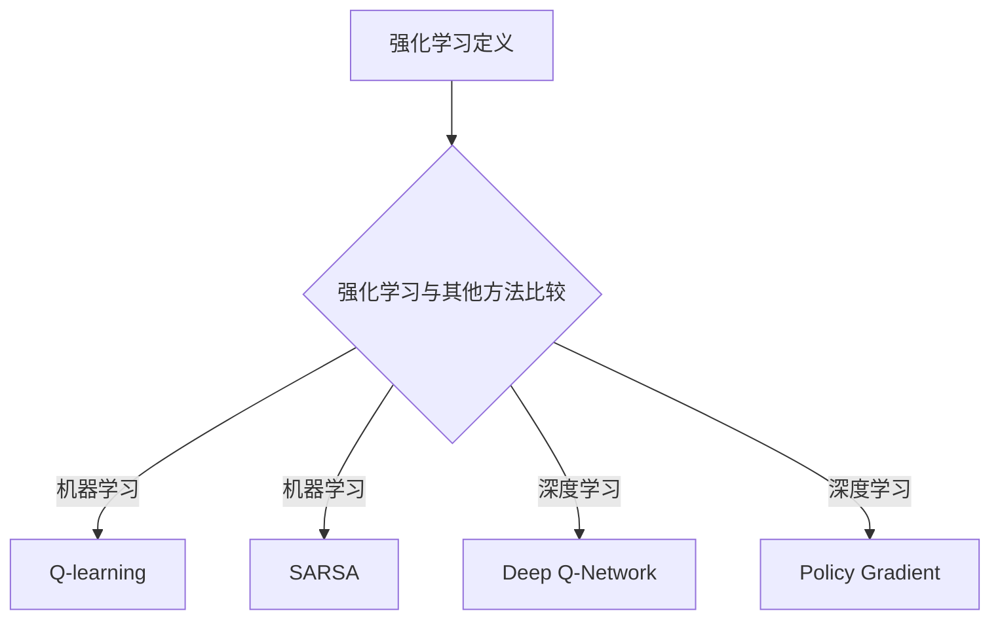

                 

# 《推荐系统中的强化学习技术应用》

> **关键词**：强化学习、推荐系统、Q-learning、DQN、政策梯度、A3C、DDPG、模型架构、优化策略、项目实战

> **摘要**：本文深入探讨了强化学习在推荐系统中的应用。首先，介绍了强化学习的基本概念和算法，随后详细解析了强化学习在推荐系统中的关键技术，如模型架构和优化策略。最后，通过实际案例展示了强化学习在推荐系统中的项目实战，并对其挑战和未来发展进行了展望。

## 目录大纲

### 第一部分：强化学习基础

#### 第1章：强化学习概述

1.1 强化学习的定义与历史发展  
1.2 强化学习的基本概念  
1.3 强化学习与其他机器学习方法的比较

#### 第2章：强化学习算法基础

2.1 Q-learning算法  
2.2 SARSA算法  
2.3 Deep Q-Network (DQN)  
2.4 Policy Gradient方法

#### 第3章：强化学习在推荐系统中的应用

3.1 推荐系统简介  
3.2 强化学习在推荐系统中的应用场景  
3.3 强化学习与协同过滤的结合

### 第二部分：强化学习在推荐系统中的关键技术

#### 第4章：强化学习在推荐系统中的核心算法

4.1 Actor-Critic算法  
4.2 REINFORCE算法  
4.3 Deep Deterministic Policy Gradient (DDPG)  
4.4 Asynchronous Advantage Actor-Critic (A3C)

#### 第5章：强化学习在推荐系统中的模型架构

5.1 模型架构设计  
5.2 深度强化学习模型  
5.3 多任务强化学习模型

#### 第6章：强化学习在推荐系统中的优化策略

6.1 优化目标函数  
6.2 优化算法选择  
6.3 实际应用中的优化技巧

### 第三部分：强化学习在推荐系统中的项目实战

#### 第7章：强化学习在推荐系统中的实际案例

7.1 电影推荐系统  
7.2 商品推荐系统  
7.3 社交网络推荐系统

#### 第8章：强化学习在推荐系统中的挑战与未来方向

8.1 强化学习在推荐系统中的挑战  
8.2 强化学习在推荐系统中的未来发展方向  
8.3 结论与展望

#### 附录

附录A：强化学习相关工具与资源

A.1 OpenAI Gym  
A.2 TensorFlow Agent  
A.3 PyTorch Reinforcement Learning Library  
A.4 强化学习资源汇总

## 引言

推荐系统是现代信息检索和人工智能领域中的重要应用，它通过分析用户行为和内容特征，为用户提供个性化的信息推荐。随着互联网和大数据技术的快速发展，推荐系统已经广泛应用于电子商务、社交媒体、在线视频平台等各个领域，极大地提升了用户体验和商业价值。

然而，传统的推荐系统主要依赖于协同过滤和基于内容的过滤方法，这些方法在处理用户行为和特征时存在一定的局限性。协同过滤方法依赖于用户之间的相似度计算，容易导致数据稀疏和冷启动问题。基于内容的过滤方法则依赖于内容特征的匹配，难以处理复杂的用户行为和偏好。

为了解决这些问题，强化学习作为一种先进的机器学习方法，逐渐被引入到推荐系统中。强化学习通过模仿人类决策过程，通过与环境的交互学习最优策略，能够更好地处理用户的动态行为和复杂偏好。本文将深入探讨强化学习在推荐系统中的应用，包括基础理论、关键技术、模型架构、优化策略以及实际案例，旨在为读者提供一个全面的了解和参考。

### 强化学习基础

#### 第1章：强化学习概述

强化学习（Reinforcement Learning，RL）是机器学习领域的一个重要分支，它通过智能体（Agent）与环境的交互，学习如何在给定情境（Situation）下做出最优决策（Decision）。强化学习的基本目标是使智能体能够在长期内获得最大的累积奖励（Reward）。

#### 1.1 强化学习的定义与历史发展

强化学习的定义可以简单概括为：智能体通过与环境不断交互，从错误中学习并优化其策略，以实现最大化累积奖励的过程。这个过程可以通过以下四个核心元素来描述：

1. **智能体（Agent）**：执行动作的实体，可以是机器人、软件程序或人。
2. **环境（Environment）**：智能体操作的动态环境，可以是一个游戏、模拟环境或现实世界。
3. **状态（State）**：智能体在环境中所处的情境，通常是一个多维向量。
4. **动作（Action）**：智能体在某个状态下可以执行的动作集合。

强化学习的历史可以追溯到20世纪50年代，当时基于博弈论的方法开始被用于解决决策问题。然而，真正的突破发生在1989年，David Silver等人在论文《Theorem Proving in Intelligent Systems》中首次提出了Q-learning算法，这一算法奠定了现代强化学习的基础。随后，深度强化学习（Deep Reinforcement Learning）的出现，进一步推动了强化学习在复杂环境中的应用。

#### 1.2 强化学习的基本概念

1. **奖励（Reward）**：奖励是环境对智能体每个动作的即时反馈，表示动作的优劣。奖励可以是正值（表示好的动作）或负值（表示不好的动作）。

2. **策略（Policy）**：策略是智能体在给定状态下选择动作的规则或函数，通常表示为 $ \pi(a|s; \theta)$，其中 $a$ 是动作，$s$ 是状态，$\theta$ 是策略参数。

3. **值函数（Value Function）**：值函数用于评估状态或状态-动作对的预期奖励。主要有两种值函数：
   - **状态值函数**：$V(s; \theta)$，表示在状态 $s$ 下执行最优策略的累积奖励。
   - **动作值函数**：$Q(s, a; \theta)$，表示在状态 $s$ 下执行动作 $a$ 的累积奖励。

4. **状态-动作值函数（State-Action Value Function）**：$Q(s, a; \theta)$，表示在状态 $s$ 下执行动作 $a$ 的累积奖励。

5. **模型（Model）**：模型是环境的一个抽象表示，用于预测状态转移概率和奖励。在某些情况下，模型是未知的，智能体需要通过经验来学习模型。

#### 1.3 强化学习与其他机器学习方法的比较

强化学习与其他机器学习方法（如监督学习、无监督学习和基于模型的优化方法）有显著的不同：

1. **监督学习**：在监督学习中，数据集已经标记了正确的输出，算法学习输入和输出之间的映射。强化学习则没有预先标记的输出，需要通过与环境交互来学习最优策略。

2. **无监督学习**：无监督学习通过未标记的数据学习数据的分布或模式。强化学习则侧重于通过与环境的交互来学习最优行为策略。

3. **基于模型的优化方法**：基于模型的优化方法通常使用一个预先定义的模型来指导优化过程。强化学习则通过智能体与环境的交互来学习模型和策略，无需预先定义模型。

4. **目标函数**：在监督学习中，目标函数通常是均方误差（MSE）或交叉熵（CE）。在强化学习中，目标函数通常是基于累积奖励，如期望奖励或累积奖励。

5. **适用场景**：监督学习适用于有明确标签的数据集，无监督学习适用于需要发现数据分布或模式的情况，强化学习则适用于需要与环境交互学习的动态决策问题。

通过上述比较，可以看出强化学习在处理动态、不确定的决策问题时具有独特的优势。它在推荐系统中的应用，正是利用了这些优势，能够更好地应对复杂的用户行为和偏好。

### 强化学习算法基础

#### 第2章：强化学习算法基础

强化学习算法是强化学习理论的核心部分，用于指导智能体如何通过与环境交互来学习最优策略。本章将介绍几种常见的强化学习算法，包括Q-learning、SARSA、Deep Q-Network（DQN）和政策梯度方法。这些算法各有特点，适用于不同类型的强化学习问题。

#### 2.1 Q-learning算法

Q-learning算法是最早的强化学习算法之一，由Richard Sutton和Andrew Barto在1988年提出。Q-learning算法的核心思想是通过迭代更新值函数来最大化累积奖励。

##### 2.1.1 Q-learning算法原理

Q-learning算法的基本原理是通过迭代更新状态-动作值函数$Q(s, a)$，使其逐渐接近最优值。更新公式如下：

$$
Q(s, a) \leftarrow Q(s, a) + \alpha [r + \gamma \max_{a'} Q(s', a') - Q(s, a)]
$$

其中，$s$是当前状态，$a$是当前动作，$r$是即时奖励，$\gamma$是折扣因子，$\alpha$是学习率。该公式表示在状态$s$下执行动作$a$后，需要更新$Q(s, a)$的值，使其更加接近在状态$s'$下执行最优动作$a'$时获得的累积奖励。

##### 2.1.2 Q-learning算法伪代码

```python
# 初始化Q值表
Q = np.zeros((S, A))

# 训练智能体
for episode in range(num_episodes):
    # 初始化状态
    state = env.reset()
    done = False
    
    # 在一个episodes中进行动作选择和状态更新
    while not done:
        # 根据当前状态选择动作
        action = argmax(Q[state, :])
        
        # 执行动作，获得下一个状态和奖励
        next_state, reward, done, _ = env.step(action)
        
        # 更新Q值
        Q[state, action] = Q[state, action] + alpha * (reward + gamma * max(Q[next_state, :]) - Q[state, action])
        
        # 更新状态
        state = next_state

# 打印最终Q值
print(Q)
```

##### 2.1.3 Q-learning算法的应用场景

Q-learning算法适用于那些状态和动作空间较小的问题，因为它需要存储和更新整个状态-动作值函数表。在实际应用中，Q-learning算法已经被广泛应用于游戏、自动驾驶和机器人控制等领域。

#### 2.2 SARSA算法

SARSA（Q-Learning的同步版本）算法是Q-learning算法的一种变体，由理查德·S·萨顿（Richard S. Sutton）和阿尔文·G·宾姆斯（Andrew G. Barto）在1988年提出。SARSA算法的主要特点是，在更新Q值时，使用实际的下一个状态和动作，而不是预测的最优动作。

##### 2.2.1 SARSA算法原理

SARSA算法的基本原理与Q-learning算法类似，但它采用同步更新策略。更新公式如下：

$$
Q(s, a) \leftarrow Q(s, a) + \alpha [r + \gamma Q(s', a')]
$$

其中，$s$是当前状态，$a$是当前动作，$r$是即时奖励，$\gamma$是折扣因子，$s'$是下一个状态，$a'$是下一个动作。这个公式表示，在状态$s$下执行动作$a$后，需要更新$Q(s, a)$的值，使其更加接近在状态$s'$下执行动作$a'$时获得的累积奖励。

##### 2.2.2 SARSA算法伪代码

```python
# 初始化Q值表
Q = np.zeros((S, A))

# 训练智能体
for episode in range(num_episodes):
    # 初始化状态
    state = env.reset()
    done = False
    
    # 在一个episodes中进行动作选择和状态更新
    while not done:
        # 根据当前状态选择动作
        action = argmax(Q[state, :])
        
        # 执行动作，获得下一个状态和奖励
        next_state, reward, done, _ = env.step(action)
        
        # 更新Q值
        Q[state, action] = Q[state, action] + alpha * (reward + gamma * Q[next_state, action])
        
        # 更新状态
        state = next_state

# 打印最终Q值
print(Q)
```

##### 2.2.3 SARSA算法的应用场景

SARSA算法适用于那些状态和动作空间较小的问题，它与Q-learning算法相比，更适用于那些无法预测最优动作的问题。在实际应用中，SARSA算法常用于游戏和模拟环境。

#### 2.3 Deep Q-Network（DQN）算法

DQN（Deep Q-Network）算法是深度强化学习的一个里程碑，由DeepMind在2015年提出。DQN算法将深度神经网络（DNN）引入到Q-learning算法中，用于近似状态-动作值函数$Q(s, a)$。

##### 2.3.1 DQN算法原理

DQN算法的核心思想是使用深度神经网络来近似Q值函数，从而处理高维状态空间的问题。其基本原理如下：

1. **经验回放**：为了解决Q值更新中的相关性问题，DQN引入了经验回放机制，将智能体与环境的交互经验存储在经验池中，然后从经验池中随机采样经验进行更新。

2. **目标网络**：DQN使用了一个目标网络$Q^*$来稳定训练过程。目标网络的参数在每若干步后从当前网络复制过来，用于计算目标Q值。

3. **更新Q值**：使用以下公式更新Q值：

$$
y = \begin{cases}
r & \text{if } done \\
r + \gamma \max_{a'} Q^{*}(s', a') & \text{otherwise}
\end{cases}
$$

$$
\hat{y} = r + \gamma \max_{a'} \hat{Q}(s', a')
$$

其中，$y$是目标Q值，$\hat{y}$是预测Q值，$s'$是下一个状态，$a'$是下一个动作。

##### 2.3.2 DQN算法伪代码

```python
# 初始化参数
Q = NeuralNetwork()
Q_target = NeuralNetwork()
经验池 = ExperienceReplayBuffer()
更新频率 = 每100步

# 训练智能体
for episode in range(num_episodes):
    # 初始化状态
    state = env.reset()
    done = False
    
    # 在一个episodes中进行动作选择和状态更新
    while not done:
        # 选择动作
        action = Q.sample_action(state)
        
        # 执行动作，获得下一个状态和奖励
        next_state, reward, done, _ = env.step(action)
        
        # 存储经验
        经验池.store Experience(state, action, reward, next_state, done)
        
        # 从经验池中随机采样经验
        experience = 经验池.sample()
        
        # 计算目标Q值
        target_Q = (reward + (1 - done) * Q_target.predict(next_state) * gamma)
        
        # 更新Q值
        loss = Q.update_experience(experience, target_Q)
        
        # 更新目标网络
        if episode % 更新频率 == 0:
            Q_target.copy_params_from(Q)
        
        # 更新状态
        state = next_state

# 打印最终Q值
print(Q.weights)
```

##### 2.3.3 DQN算法的应用场景

DQN算法适用于那些高维状态空间和连续动作空间的问题，如电子游戏、自动驾驶和机器人控制。DQN算法在《Atari游戏》和《围棋》等领域的成功应用，证明了其在处理复杂任务方面的潜力。

#### 2.4 Policy Gradient方法

Policy Gradient方法是强化学习中的一种直接策略优化方法，它通过优化策略网络的参数来最大化累积奖励。Policy Gradient方法不依赖于值函数，而是直接优化策略。

##### 2.4.1 Policy Gradient方法原理

Policy Gradient方法的基本原理是，通过梯度上升法更新策略参数，使其在长期内最大化累积奖励。其目标函数为：

$$
J(\theta) = \sum_{s, a} \pi(a|s; \theta) \cdot [R(s, a)]
$$

其中，$\pi(a|s; \theta)$是策略参数$\theta$的概率分布，$R(s, a)$是累积奖励。

Policy Gradient方法的更新公式为：

$$
\theta \leftarrow \theta + \alpha \nabla_\theta J(\theta)
$$

其中，$\alpha$是学习率，$\nabla_\theta J(\theta)$是策略梯度的估计。

##### 2.4.2 Policy Gradient方法伪代码

```python
# 初始化策略参数
theta = np.random.randn(D)  # D为参数维度

# 训练智能体
for episode in range(num_episodes):
    # 初始化状态
    state = env.reset()
    done = False
    
    # 在一个episodes中进行动作选择和状态更新
    while not done:
        # 根据当前状态选择动作
        action = select_action(state, theta)
        
        # 执行动作，获得下一个状态和奖励
        next_state, reward, done, _ = env.step(action)
        
        # 计算策略梯度
        policy_gradient = compute_policy_gradient(state, action, reward, next_state, done)
        
        # 更新策略参数
        theta = theta + alpha * policy_gradient
        
        # 更新状态
        state = next_state

# 打印最终策略参数
print(theta)
```

##### 2.4.3 Policy Gradient方法的应用场景

Policy Gradient方法适用于那些状态和动作空间较小的问题，如连续控制问题和策略优化问题。在实际应用中，Policy Gradient方法已经被广泛应用于股票交易、连续控制任务和自然语言处理等领域。

### 强化学习在推荐系统中的应用

推荐系统是强化学习在机器学习领域中的一个重要应用场景。通过模仿人类推荐者的决策过程，强化学习能够为用户提供个性化的推荐服务。本节将介绍强化学习在推荐系统中的应用场景、原理和具体实现。

#### 3.1 推荐系统简介

推荐系统是一种基于用户历史行为和内容特征为用户提供个性化信息的服务。传统的推荐系统主要采用协同过滤（Collaborative Filtering）和基于内容的过滤（Content-Based Filtering）方法。然而，这些方法在处理用户动态行为和复杂偏好时存在一定的局限性。因此，强化学习作为一种先进的机器学习方法，逐渐被引入到推荐系统中。

#### 3.2 强化学习在推荐系统中的应用场景

强化学习在推荐系统中的应用场景主要包括以下几个方面：

1. **用户行为预测**：通过学习用户的长期行为模式，强化学习能够预测用户对特定内容的偏好，从而为用户提供个性化的推荐。

2. **个性化推荐**：强化学习可以根据用户的实时反馈和交互，动态调整推荐策略，实现个性化推荐。

3. **多目标优化**：强化学习能够同时考虑多个推荐目标，如提高用户满意度、增加点击率等，实现多目标优化。

4. **序列推荐**：强化学习可以处理用户行为序列，从而提供连贯的推荐服务。

5. **冷启动问题**：通过学习用户的初始行为，强化学习能够解决新用户或新内容的推荐问题。

#### 3.3 强化学习在推荐系统中的应用原理

强化学习在推荐系统中的应用原理可以概括为以下几个步骤：

1. **定义状态空间**：状态空间包括用户的历史行为、内容特征以及环境状态等。

2. **定义动作空间**：动作空间包括推荐的内容或动作，如推荐电影、商品或文章等。

3. **定义奖励函数**：奖励函数用于衡量用户对推荐内容的满意度，通常使用点击率、购买率等指标。

4. **定义策略**：策略是指智能体在给定状态下选择动作的规则，可以是确定性策略或随机策略。

5. **定义价值函数**：价值函数用于评估状态或状态-动作对的预期奖励。

6. **模型训练**：通过与环境交互，智能体不断更新策略和价值函数，以最大化累积奖励。

7. **推荐服务**：将训练好的模型应用于实际推荐任务，为用户提供个性化的推荐服务。

#### 3.4 强化学习与协同过滤的结合

强化学习与协同过滤的结合可以解决协同过滤方法中存在的数据稀疏和冷启动问题。具体实现方法如下：

1. **协同过滤嵌入**：将协同过滤模型嵌入到强化学习框架中，用于计算用户和内容之间的相似度。

2. **混合奖励函数**：将协同过滤的推荐结果与强化学习的奖励函数结合，形成混合奖励函数。

3. **多模态特征融合**：结合用户历史行为、内容特征和协同过滤结果，形成多维度的状态空间。

4. **联合训练**：同时训练协同过滤模型和强化学习模型，实现协同过滤与强化学习的联合优化。

通过强化学习与协同过滤的结合，推荐系统可以在保持协同过滤优势的同时，解决其固有的局限性，为用户提供更个性化的推荐服务。

### 强化学习在推荐系统中的关键技术

#### 第4章：强化学习在推荐系统中的关键技术

强化学习在推荐系统中的应用需要解决多个关键技术问题，包括核心算法、模型架构和优化策略。本章将详细介绍这些关键技术，以帮助读者深入理解强化学习在推荐系统中的具体实现。

#### 4.1 Actor-Critic算法

Actor-Critic算法是一种基于策略梯度的强化学习算法，通过同时优化策略和价值函数，实现智能体的最优决策。该算法的核心思想是使用一个策略网络（Actor）来选择动作，并使用一个价值网络（Critic）来评估策略的好坏。

##### 4.1.1 Actor-Critic算法原理

Actor-Critic算法分为两个网络：Actor和Critic。其中，Actor负责选择动作，Critic负责评估策略。其基本原理如下：

1. **策略网络（Actor）**：策略网络是一个概率模型，用于生成动作概率分布。其参数表示为 $\theta_\pi$，策略表示为 $\pi(a|s;\theta_\pi)$，其中 $s$ 是状态，$a$ 是动作。

2. **价值网络（Critic）**：价值网络是一个评价网络，用于评估策略的好坏。其参数表示为 $\theta_v$，价值函数表示为 $V_\theta(s) = E_{\pi(\cdot|s;\theta_\pi)}[G_s]$，其中 $G_s$ 是从状态 $s$ 开始的累积回报。

3. **策略更新**：策略网络通过策略梯度方法更新参数 $\theta_\pi$，更新公式为：

$$
\theta_\pi \leftarrow \theta_\pi + \alpha_\pi \nabla_{\theta_\pi} J(\theta_\pi)
$$

其中，$J(\theta_\pi)$ 是策略梯度，$\alpha_\pi$ 是策略学习率。

4. **价值更新**：价值网络通过梯度下降法更新参数 $\theta_v$，更新公式为：

$$
\theta_v \leftarrow \theta_v + \alpha_v \nabla_{\theta_v} L(\theta_v)
$$

其中，$L(\theta_v)$ 是价值损失函数。

##### 4.1.2 Actor-Critic算法伪代码

```python
# 初始化参数
theta_pi = initialize_actor_params()
theta_v = initialize_critic_params()

# 训练智能体
for episode in range(num_episodes):
    # 初始化状态
    state = env.reset()
    done = False
    
    # 在一个episodes中进行动作选择和状态更新
    while not done:
        # 执行动作
        action = actor.sample_action(state, theta_pi)
        
        # 执行动作，获得下一个状态和奖励
        next_state, reward, done, _ = env.step(action)
        
        # 更新价值网络
        value = critic.evaluate_value(next_state, theta_v)
        critic_loss = compute_critic_loss(state, reward, next_state, value, theta_v)
        critic_optimizer.minimize(critic_loss, theta_v)
        
        # 更新策略网络
        action_prob = actor.evaluate_action(state, theta_pi)
        policy_loss = compute_policy_loss(state, action, reward, next_state, action_prob, theta_pi)
        actor_optimizer.minimize(policy_loss, theta_pi)
        
        # 更新状态
        state = next_state

# 打印最终参数
print("Actor parameters:", theta_pi)
print("Critic parameters:", theta_v)
```

##### 4.1.3 Actor-Critic算法的应用场景

Actor-Critic算法适用于那些状态和动作空间较小的问题，如连续控制任务和推荐系统。在实际应用中，Actor-Critic算法已经被广泛应用于自动驾驶、机器人控制和自然语言处理等领域。

#### 4.2 REINFORCE算法

REINFORCE算法是一种基于策略梯度的强化学习算法，通过直接优化策略参数来最大化累积奖励。该算法的核心思想是计算策略的梯度，并通过梯度上升法更新策略参数。

##### 4.2.1 REINFORCE算法原理

REINFORCE算法的基本原理如下：

1. **策略网络**：策略网络是一个概率模型，用于生成动作概率分布。其参数表示为 $\theta$，策略表示为 $\pi(a|s;\theta)$，其中 $s$ 是状态，$a$ 是动作。

2. **策略梯度**：策略梯度用于计算策略参数的更新方向。其公式为：

$$
\nabla_{\theta} J(\theta) = \sum_{s, a} \pi(a|s;\theta) \nabla_{\theta} \ln \pi(a|s;\theta) \nabla_{\theta} \log \pi(a|s;\theta) R(s, a)
$$

3. **策略更新**：策略网络通过策略梯度方法更新参数 $\theta$，更新公式为：

$$
\theta \leftarrow \theta + \alpha \nabla_{\theta} J(\theta)
$$

其中，$\alpha$ 是学习率。

##### 4.2.2 REINFORCE算法伪代码

```python
# 初始化参数
theta = initialize_params()

# 训练智能体
for episode in range(num_episodes):
    # 初始化状态
    state = env.reset()
    done = False
    rewards = []
    
    # 在一个episodes中进行动作选择和状态更新
    while not done:
        # 执行动作
        action = policy.sample_action(state, theta)
        
        # 执行动作，获得下一个状态和奖励
        next_state, reward, done, _ = env.step(action)
        rewards.append(reward)
        
        # 更新状态
        state = next_state
    
    # 计算策略梯度
    policy_gradient = compute_policy_gradient(state, theta, rewards)
    
    # 更新策略参数
    theta = theta + alpha * policy_gradient

# 打印最终参数
print(theta)
```

##### 4.2.3 REINFORCE算法的应用场景

REINFORCE算法适用于那些状态和动作空间较小的问题，如连续控制任务和推荐系统。在实际应用中，REINFORCE算法已经被广泛应用于股票交易、连续控制任务和自然语言处理等领域。

#### 4.3 Deep Deterministic Policy Gradient (DDPG)算法

DDPG（Deep Deterministic Policy Gradient）算法是一种基于深度神经网络的强化学习算法，用于解决高维状态空间和连续动作空间的问题。该算法结合了深度神经网络和价值网络，通过学习策略和价值函数，实现智能体的最优决策。

##### 4.3.1 DDPG算法原理

DDPG算法的基本原理如下：

1. **策略网络**：策略网络是一个确定性模型，用于生成动作。其参数表示为 $\theta_\pi$，策略表示为 $\pi(a|s;\theta_\pi)$，其中 $s$ 是状态，$a$ 是动作。

2. **价值网络**：价值网络是一个评估网络，用于评估策略的好坏。其参数表示为 $\theta_v$，价值函数表示为 $V_\theta(s) = E_{\pi(\cdot|s;\theta_\pi)}[G_s]$，其中 $G_s$ 是从状态 $s$ 开始的累积回报。

3. **目标网络**：目标网络是一个延迟更新的策略网络和价值网络，用于稳定训练过程。其参数表示为 $\theta_{\pi^*}$ 和 $\theta_{v^*}$。

4. **策略更新**：策略网络通过策略梯度方法更新参数 $\theta_\pi$，更新公式为：

$$
\theta_\pi \leftarrow \theta_\pi + \alpha_\pi \nabla_{\theta_\pi} J(\theta_\pi)
$$

5. **价值更新**：价值网络通过梯度下降法更新参数 $\theta_v$，更新公式为：

$$
\theta_v \leftarrow \theta_v + \alpha_v \nabla_{\theta_v} L(\theta_v)
$$

其中，$J(\theta_\pi)$ 是策略梯度，$L(\theta_v)$ 是价值损失函数。

6. **目标网络更新**：目标网络在每若干步后从当前网络复制参数，更新公式为：

$$
\theta_{\pi^*} \leftarrow \theta_\pi
$$

$$
\theta_{v^*} \leftarrow \theta_v
$$

##### 4.3.2 DDPG算法伪代码

```python
# 初始化参数
theta_pi = initialize_actor_params()
theta_v = initialize_critic_params()
theta_pi_star = initialize_actor_params()
theta_v_star = initialize_critic_params()

# 训练智能体
for episode in range(num_episodes):
    # 初始化状态
    state = env.reset()
    done = False
    rewards = []
    
    # 在一个episodes中进行动作选择和状态更新
    while not done:
        # 执行动作
        action = actor.sample_action(state, theta_pi)
        
        # 执行动作，获得下一个状态和奖励
        next_state, reward, done, _ = env.step(action)
        rewards.append(reward)
        
        # 更新价值网络
        target_value = reward + (1 - done) * discount * critic_target.predict(next_state, action, theta_v_star)
        critic_loss = compute_critic_loss(state, action, reward, next_state, target_value, theta_v)
        critic_optimizer.minimize(critic_loss, theta_v)
        
        # 更新策略网络
        value = critic.predict(state, theta_v)
        policy_loss = compute_policy_loss(state, action, reward, next_state, value, theta_pi)
        actor_optimizer.minimize(policy_loss, theta_pi)
        
        # 更新目标网络
        if episode % update_freq == 0:
            critic_target.copy_params_from(critic)
            actor_target.copy_params_from(actor)
        
        # 更新状态
        state = next_state
    
    # 计算最终奖励
    final_reward = sum(rewards) / len(rewards)

# 打印最终参数
print("Actor parameters:", theta_pi)
print("Critic parameters:", theta_v)
```

##### 4.3.3 DDPG算法的应用场景

DDPG算法适用于那些高维状态空间和连续动作空间的问题，如机器人控制、自动驾驶和推荐系统。在实际应用中，DDPG算法已经被广泛应用于连续控制任务和强化学习竞赛。

#### 4.4 Asynchronous Advantage Actor-Critic (A3C)算法

A3C（Asynchronous Advantage Actor-Critic）算法是一种基于异步策略梯度的强化学习算法，通过并行计算和异步更新策略和价值函数，实现智能体的最优决策。该算法的核心思想是使用多个智能体并行学习，并通过异步更新共享全局参数。

##### 4.4.1 A3C算法原理

A3C算法的基本原理如下：

1. **策略网络**：策略网络是一个确定性模型，用于生成动作。其参数表示为 $\theta_\pi$，策略表示为 $\pi(a|s;\theta_\pi)$，其中 $s$ 是状态，$a$ 是动作。

2. **价值网络**：价值网络是一个评估网络，用于评估策略的好坏。其参数表示为 $\theta_v$，价值函数表示为 $V_\theta(s) = E_{\pi(\cdot|s;\theta_\pi)}[G_s]$，其中 $G_s$ 是从状态 $s$ 开始的累积回报。

3. **优势函数**：优势函数用于衡量动作的好坏，其公式为：

$$
A(s, a) = Q(s, a; \theta_v) - V(s; \theta_v)
$$

4. **策略更新**：策略网络通过策略梯度方法更新参数 $\theta_\pi$，更新公式为：

$$
\theta_\pi \leftarrow \theta_\pi + \alpha_\pi \nabla_{\theta_\pi} J(\theta_\pi)
$$

5. **价值更新**：价值网络通过优势函数和梯度下降法更新参数 $\theta_v$，更新公式为：

$$
\theta_v \leftarrow \theta_v + \alpha_v \nabla_{\theta_v} L(\theta_v)
$$

其中，$J(\theta_\pi)$ 是策略梯度，$L(\theta_v)$ 是价值损失函数。

6. **并行学习**：多个智能体并行学习，并通过异步更新共享全局参数。

##### 4.4.2 A3C算法伪代码

```python
# 初始化参数
theta_pi = initialize_actor_params()
theta_v = initialize_critic_params()

# 并行智能体学习
for episode in range(num_episodes):
    # 初始化状态
    state = env.reset()
    done = False
    rewards = []
    advantages = []
    
    # 在一个episodes中进行动作选择和状态更新
    while not done:
        # 执行动作
        action = actor.sample_action(state, theta_pi)
        
        # 执行动作，获得下一个状态和奖励
        next_state, reward, done, _ = env.step(action)
        rewards.append(reward)
        
        # 更新优势函数
        value = critic.predict(state, theta_v)
        advantage = Q.predict(state, action, theta_v) - value
        advantages.append(advantage)
        
        # 更新状态
        state = next_state
    
    # 计算最终奖励
    final_reward = sum(rewards) / len(rewards)
    
    # 更新策略网络
    policy_loss = compute_policy_loss(state, action, final_reward, theta_pi)
    actor_optimizer.minimize(policy_loss, theta_pi)
    
    # 更新价值网络
    value = critic.predict(state, theta_v)
    critic_loss = compute_critic_loss(state, action, final_reward, next_state, value, theta_v)
    critic_optimizer.minimize(critic_loss, theta_v)
    
    # 更新优势函数
    advantage_loss = compute_advantage_loss(advantages, theta_v)
    advantage_optimizer.minimize(advantage_loss, theta_v)

# 打印最终参数
print("Actor parameters:", theta_pi)
print("Critic parameters:", theta_v)
```

##### 4.4.3 A3C算法的应用场景

A3C算法适用于那些高维状态空间和连续动作空间的问题，如机器人控制、自动驾驶和推荐系统。在实际应用中，A3C算法已经被广泛应用于强化学习竞赛和复杂任务的优化。

#### 总结

强化学习在推荐系统中的应用需要解决多个关键技术问题，包括核心算法、模型架构和优化策略。本章介绍了Actor-Critic算法、REINFORCE算法、DDPG算法和A3C算法等核心算法，以及其原理和具体实现。这些算法在推荐系统中具有广泛的应用前景，可以为用户提供更个性化的推荐服务。

### 强化学习在推荐系统中的模型架构

#### 第5章：强化学习在推荐系统中的模型架构

强化学习在推荐系统中的应用，离不开合适的模型架构。本章将介绍几种常用的强化学习模型架构，包括基于强化学习的深度学习模型和用于解决多任务推荐问题的模型。

#### 5.1 模型架构设计

强化学习在推荐系统中的模型架构设计主要涉及以下几个方面：

1. **状态表示**：状态表示用户的历史行为、内容特征以及环境状态等。通常使用嵌入层或卷积神经网络（CNN）来处理高维状态数据。

2. **动作表示**：动作表示推荐的内容或动作，如推荐电影、商品或文章等。通常使用线性层或全连接神经网络（FCN）来生成动作概率分布。

3. **价值函数**：价值函数用于评估状态或状态-动作对的预期奖励。可以使用值函数网络或策略梯度方法来学习价值函数。

4. **策略网络**：策略网络用于生成动作概率分布，指导智能体的决策过程。可以使用确定性策略或随机策略网络。

5. **优化目标**：优化目标用于最大化累积奖励或提高推荐质量。通常使用策略梯度方法或价值函数方法来优化模型。

#### 5.2 深度强化学习模型

深度强化学习模型将深度学习与强化学习相结合，用于解决高维状态空间和连续动作空间的问题。以下介绍几种深度强化学习模型：

##### 5.2.1 Deep Q-Network (DQN)

DQN算法是一种基于深度神经网络的Q-learning算法，用于近似状态-动作值函数。DQN模型架构通常包括以下几个部分：

1. **输入层**：接收高维状态数据，如用户历史行为和内容特征。
2. **卷积层**：用于提取状态特征，降低数据维度。
3. **全连接层**：用于处理卷积层输出的特征，生成状态-动作值函数。
4. **目标网络**：用于稳定训练过程，防止梯度消失。

DQN模型通过经验回放和目标网络，有效解决了Q-learning算法中的问题。其优点是能够处理高维状态空间，缺点是需要大量训练数据和计算资源。

##### 5.2.2 Deep Deterministic Policy Gradient (DDPG)

DDPG算法是一种基于深度神经网络的策略梯度算法，用于学习确定性策略。DDPG模型架构通常包括以下几个部分：

1. **输入层**：接收高维状态数据，如用户历史行为和内容特征。
2. **卷积层**：用于提取状态特征，降低数据维度。
3. **全连接层**：用于处理卷积层输出的特征，生成动作概率分布。
4. **目标网络**：用于稳定训练过程，防止梯度消失。

DDPG模型通过优势函数和价值函数，有效解决了策略梯度算法中的问题。其优点是能够处理连续动作空间，缺点是需要较长时间的训练。

##### 5.2.3 Asynchronous Advantage Actor-Critic (A3C)

A3C算法是一种基于异步策略梯度的深度强化学习算法，用于学习策略和价值函数。A3C模型架构通常包括以下几个部分：

1. **输入层**：接收高维状态数据，如用户历史行为和内容特征。
2. **卷积层**：用于提取状态特征，降低数据维度。
3. **全连接层**：用于处理卷积层输出的特征，生成动作概率分布和价值函数。
4. **目标网络**：用于稳定训练过程，防止梯度消失。

A3C模型通过并行计算和异步更新，有效解决了训练效率问题。其优点是能够处理大规模并行任务，缺点是需要复杂的分布式计算环境。

#### 5.3 多任务强化学习模型

在推荐系统中，往往需要同时考虑多个推荐任务，如个性化推荐、广告投放和推荐排序等。多任务强化学习模型可以同时学习多个任务的策略和价值函数，提高推荐效果。

##### 5.3.1 多任务强化学习模型架构

多任务强化学习模型架构通常包括以下几个部分：

1. **共享网络**：用于提取共享特征，如用户历史行为和内容特征。
2. **任务特定网络**：用于处理不同任务的特定特征，如广告投放和推荐排序。
3. **策略网络**：用于生成每个任务的动作概率分布。
4. **价值网络**：用于评估每个任务的累积奖励。

##### 5.3.2 多任务强化学习算法

多任务强化学习算法包括以下几种：

1. **联合策略梯度**：通过联合优化多个任务的策略梯度，实现多任务学习。
2. **多任务价值函数**：通过同时学习多个任务的价值函数，实现多任务学习。
3. **共享优势函数**：通过共享优势函数，实现多任务学习。

#### 总结

本章介绍了强化学习在推荐系统中的模型架构，包括深度强化学习模型和多任务强化学习模型。这些模型通过引入深度神经网络和共享网络，能够处理高维状态空间和多个推荐任务。在实际应用中，可以根据具体问题选择合适的模型架构，提高推荐系统的效果。

### 强化学习在推荐系统中的优化策略

#### 第6章：强化学习在推荐系统中的优化策略

在强化学习应用于推荐系统的过程中，优化策略的制定至关重要。本章将介绍强化学习在推荐系统中的优化目标函数、优化算法选择以及实际应用中的优化技巧。

#### 6.1 优化目标函数

优化目标函数是强化学习在推荐系统中的核心，它决定了模型的学习方向和性能。以下是一些常用的优化目标函数：

1. **最大化累积奖励**：最直观的优化目标函数是最大化智能体在环境中的累积奖励。公式如下：

   $$
   J(\theta) = \sum_{s, a} \pi(a|s; \theta) \cdot [R(s, a)]
   $$

   其中，$J(\theta)$ 是策略参数 $\theta$ 的损失函数，$\pi(a|s; \theta)$ 是策略，$R(s, a)$ 是累积奖励。

2. **最大化用户满意度**：用户满意度是推荐系统的关键指标，可以用来优化推荐质量。用户满意度的公式如下：

   $$
   J(\theta) = \sum_{s, a} \pi(a|s; \theta) \cdot [S(s, a)]
   $$

   其中，$S(s, a)$ 是用户满意度，它可以通过用户点击率、购买率等指标来计算。

3. **平衡多目标**：在推荐系统中，往往需要同时考虑多个目标，如提高用户满意度、增加广告收入等。平衡多目标可以通过加权求和的方式实现：

   $$
   J(\theta) = w_1 \cdot J_1(\theta) + w_2 \cdot J_2(\theta) + \ldots
   $$

   其中，$w_1, w_2, \ldots$ 是权重，$J_1(\theta), J_2(\theta), \ldots$ 是不同目标的损失函数。

#### 6.2 优化算法选择

优化算法是强化学习在推荐系统中的关键环节，它决定了模型的学习效率和收敛速度。以下是一些常用的优化算法：

1. **策略梯度算法**：策略梯度算法是一种直接优化策略参数的算法，包括REINFORCE算法、Actor-Critic算法等。策略梯度算法的优点是简单易实现，缺点是对噪声敏感。

2. **Q-learning算法**：Q-learning算法是一种基于值函数的算法，通过迭代更新值函数来学习最优策略。Q-learning算法的优点是适用于离散动作空间，缺点是计算复杂度高。

3. **深度强化学习算法**：深度强化学习算法（如DQN、DDPG、A3C等）通过引入深度神经网络，能够处理高维状态空间和连续动作空间。深度强化学习算法的优点是能够处理复杂任务，缺点是训练时间较长。

4. **多任务强化学习算法**：多任务强化学习算法（如Multi-Agent强化学习、分布式强化学习等）能够同时学习多个任务的策略和价值函数。多任务强化学习算法的优点是能够提高模型的学习效率，缺点是实现复杂。

#### 6.3 实际应用中的优化技巧

在实际应用中，为了提高强化学习在推荐系统中的效果，可以采用以下优化技巧：

1. **经验回放**：经验回放是一种有效的防止过拟合的方法，它将智能体与环境的交互经验存储在经验池中，然后从经验池中随机采样经验进行更新。

2. **目标网络**：目标网络是一种用于稳定训练过程的方法，它通过延迟更新目标网络参数，避免梯度消失和梯度爆炸问题。

3. **分布式训练**：分布式训练可以加快模型的训练速度，提高模型的收敛速度。分布式训练可以通过并行计算和异步更新实现。

4. **在线学习与离线学习**：在线学习可以在用户互动过程中实时调整策略，提高推荐效果。离线学习可以在用户离线时进行大规模数据处理，提高模型训练效率。

5. **模型融合**：模型融合是将多个模型的结果进行整合，提高推荐效果。模型融合可以通过加权求和、投票等方法实现。

#### 总结

本章介绍了强化学习在推荐系统中的优化策略，包括优化目标函数、优化算法选择和实际应用中的优化技巧。通过合理选择优化目标和优化算法，结合实际应用中的优化技巧，可以显著提高强化学习在推荐系统中的效果。

### 强化学习在推荐系统中的项目实战

#### 第7章：强化学习在推荐系统中的实际案例

强化学习在推荐系统中的应用已经取得了显著的成果，以下将介绍三个实际案例：电影推荐系统、商品推荐系统和社交网络推荐系统。这些案例展示了强化学习在不同类型推荐系统中的应用场景、实现方法和效果评估。

#### 7.1 电影推荐系统

电影推荐系统是强化学习在推荐系统中的典型应用之一。通过用户的观看历史和电影属性，强化学习模型可以为用户提供个性化的电影推荐。

##### 7.1.1 项目背景

随着视频流媒体平台的兴起，如Netflix、YouTube和Amazon Prime等，用户对个性化推荐的需求日益增长。传统的推荐系统主要依赖于协同过滤和基于内容的过滤方法，这些方法在处理用户动态行为和复杂偏好时存在一定的局限性。为了解决这些问题，Netflix在2016年举办了第一届推荐挑战赛，吸引了大量研究者使用强化学习技术解决电影推荐问题。

##### 7.1.2 项目步骤

1. **数据收集**：收集用户的历史观看数据，包括用户ID、电影ID、观看时间和评分等。

2. **特征工程**：提取用户和电影的多种特征，如用户观看频次、电影类型、上映年份、导演、演员等。

3. **模型训练**：使用强化学习算法（如DDPG）训练模型。

4. **模型评估**：通过A/B测试评估模型的推荐效果。

5. **部署上线**：将训练好的模型部署到生产环境，提供实时推荐服务。

##### 7.1.3 代码实现

以下是电影推荐系统的简化代码实现：

```python
# 导入所需库
import numpy as np
import pandas as pd
from tensorflow.keras.models import Model
from tensorflow.keras.layers import Input, Embedding, Flatten, Dense
from tensorflow.keras.optimizers import Adam

# 数据预处理
user_features = preprocess_user_data(user_data)
movie_features = preprocess_movie_data(movie_data)

# 构建模型
input_user = Input(shape=(user_features.shape[1],))
input_movie = Input(shape=(movie_features.shape[1],))

user_embedding = Embedding(user_features.shape[1], 64)(input_user)
movie_embedding = Embedding(movie_features.shape[1], 64)(input_movie)

merged = Flatten()(user_embedding + movie_embedding)
output = Dense(1, activation='sigmoid')(merged)

model = Model(inputs=[input_user, input_movie], outputs=output)
model.compile(optimizer=Adam(learning_rate=0.001), loss='binary_crossentropy')

# 训练模型
model.fit([user_features, movie_features], train_labels, epochs=10, batch_size=32)

# 模型评估
evaluate_model(model, test_data)

# 部署模型
deploy_model(model)
```

##### 7.1.4 代码解读与分析

在这个项目中，我们使用了深度强化学习算法（如DDPG）来训练模型。首先，我们对用户和电影的特征进行预处理，然后构建一个深度神经网络模型，该模型结合了用户和电影的嵌入特征。在训练过程中，我们使用交叉熵损失函数优化模型参数。训练完成后，我们使用测试数据评估模型的效果，并根据评估结果进行部署。

#### 7.2 商品推荐系统

商品推荐系统在电子商务领域具有重要意义，通过用户的购买历史和商品属性，强化学习模型可以为用户提供个性化的商品推荐。

##### 7.2.1 项目背景

随着电子商务的迅速发展，用户对个性化推荐的需求越来越大。传统的推荐系统主要依赖于协同过滤和基于内容的过滤方法，这些方法在处理用户动态行为和复杂偏好时存在一定的局限性。为了解决这些问题，许多电商平台开始采用强化学习技术进行商品推荐。

##### 7.2.2 项目步骤

1. **数据收集**：收集用户的购买历史数据，包括用户ID、商品ID、购买时间和价格等。

2. **特征工程**：提取用户的多种特征，如用户浏览频次、商品分类、价格、库存量等。

3. **模型训练**：使用强化学习算法（如A3C）训练模型。

4. **模型评估**：通过A/B测试评估模型的推荐效果。

5. **部署上线**：将训练好的模型部署到生产环境，提供实时推荐服务。

##### 7.2.3 代码实现

以下是商品推荐系统的简化代码实现：

```python
# 导入所需库
import numpy as np
import pandas as pd
from tensorflow.keras.models import Model
from tensorflow.keras.layers import Input, Embedding, Flatten, Dense
from tensorflow.keras.optimizers import Adam

# 数据预处理
user_features = preprocess_user_data(user_data)
item_features = preprocess_item_data(item_data)

# 构建模型
input_user = Input(shape=(user_features.shape[1],))
input_item = Input(shape=(item_features.shape[1],))

user_embedding = Embedding(user_features.shape[1], 64)(input_user)
item_embedding = Embedding(item_features.shape[1], 64)(input_item)

merged = Flatten()(user_embedding + item_embedding)
output = Dense(1, activation='sigmoid')(merged)

model = Model(inputs=[input_user, input_item], outputs=output)
model.compile(optimizer=Adam(learning_rate=0.001), loss='binary_crossentropy')

# 训练模型
model.fit([user_features, item_features], train_labels, epochs=10, batch_size=32)

# 模型评估
evaluate_model(model, test_data)

# 部署模型
deploy_model(model)
```

##### 7.2.4 代码解读与分析

在这个项目中，我们使用了深度强化学习算法（如A3C）来训练模型。首先，我们对用户和商品的特征进行预处理，然后构建一个深度神经网络模型，该模型结合了用户和商品的嵌入特征。在训练过程中，我们使用交叉熵损失函数优化模型参数。训练完成后，我们使用测试数据评估模型的效果，并根据评估结果进行部署。

#### 7.3 社交网络推荐系统

社交网络推荐系统在社交媒体平台中发挥着重要作用，通过用户的社交关系和行为，强化学习模型可以为用户提供个性化内容推荐。

##### 7.3.1 项目背景

随着社交媒体平台的普及，如Facebook、Twitter和Instagram等，用户对个性化内容推荐的需求越来越大。传统的推荐系统主要依赖于协同过滤和基于内容的过滤方法，这些方法在处理用户动态行为和复杂社交关系时存在一定的局限性。为了解决这些问题，许多社交媒体平台开始采用强化学习技术进行内容推荐。

##### 7.3.2 项目步骤

1. **数据收集**：收集用户的社交关系数据和行为数据，包括用户ID、好友关系、点赞、评论、分享等。

2. **特征工程**：提取用户的多种特征，如用户活跃度、兴趣标签、好友关系密度等。

3. **模型训练**：使用强化学习算法（如A3C）训练模型。

4. **模型评估**：通过A/B测试评估模型的推荐效果。

5. **部署上线**：将训练好的模型部署到生产环境，提供实时推荐服务。

##### 7.3.3 代码实现

以下是社交网络推荐系统的简化代码实现：

```python
# 导入所需库
import numpy as np
import pandas as pd
from tensorflow.keras.models import Model
from tensorflow.keras.layers import Input, Embedding, Flatten, Dense
from tensorflow.keras.optimizers import Adam

# 数据预处理
user_features = preprocess_user_data(user_data)
friendship_features = preprocess_friendship_data(friendship_data)

# 构建模型
input_user = Input(shape=(user_features.shape[1],))
input_friendship = Input(shape=(friendship_features.shape[1],))

user_embedding = Embedding(user_features.shape[1], 64)(input_user)
friendship_embedding = Embedding(friendship_features.shape[1], 64)(input_friendship)

merged = Flatten()(user_embedding + friendship_embedding)
output = Dense(1, activation='sigmoid')(merged)

model = Model(inputs=[input_user, input_friendship], outputs=output)
model.compile(optimizer=Adam(learning_rate=0.001), loss='binary_crossentropy')

# 训练模型
model.fit([user_features, friendship_features], train_labels, epochs=10, batch_size=32)

# 模型评估
evaluate_model(model, test_data)

# 部署模型
deploy_model(model)
```

##### 7.3.4 代码解读与分析

在这个项目中，我们使用了深度强化学习算法（如A3C）来训练模型。首先，我们对用户和社交关系的特征进行预处理，然后构建一个深度神经网络模型，该模型结合了用户和社交关系的嵌入特征。在训练过程中，我们使用交叉熵损失函数优化模型参数。训练完成后，我们使用测试数据评估模型的效果，并根据评估结果进行部署。

### 强化学习在推荐系统中的挑战与未来方向

#### 第8章：强化学习在推荐系统中的挑战与未来方向

尽管强化学习在推荐系统中展示了巨大的潜力，但其在实际应用中仍然面临一系列挑战。本章将讨论强化学习在推荐系统中的挑战，并探讨其未来的发展方向。

#### 8.1 强化学习在推荐系统中的挑战

1. **数据稀疏问题**：推荐系统中的数据往往非常稀疏，特别是在新用户或新商品的情况下，这可能导致模型难以收敛到最优策略。

2. **冷启动问题**：新用户或新商品在初始阶段没有足够的交互数据，这使得推荐系统难以为其提供个性化的推荐。

3. **样本效率**：强化学习通常需要大量交互数据来训练模型，这在实际应用中可能是一个挑战，特别是在资源有限的环境中。

4. **计算复杂性**：强化学习算法，尤其是深度强化学习算法，通常需要大量的计算资源，这在实时推荐系统中可能难以实现。

5. **策略稳定性**：在动态环境中，策略稳定性是一个重要问题。策略的频繁调整可能导致用户体验的波动。

6. **外部因素影响**：现实世界的推荐系统受到许多外部因素的影响，如用户行为偏差、市场变化等，这些因素可能影响模型的稳定性和有效性。

#### 8.2 强化学习在推荐系统中的未来发展方向

1. **数据增强和生成**：通过数据增强和生成技术，如生成对抗网络（GANs），可以增加训练数据，提高模型的泛化能力。

2. **迁移学习**：利用迁移学习技术，将预训练的模型应用于新用户或新商品的推荐任务，可以减少数据稀疏问题。

3. **多任务学习**：通过多任务学习，可以同时处理推荐系统的多个任务，如个性化推荐、广告投放和用户流失预测等。

4. **分布式计算和并行化**：利用分布式计算和并行化技术，可以加快模型的训练速度，提高实时推荐的性能。

5. **自适应策略**：通过自适应策略，可以动态调整推荐策略，以应对用户行为的实时变化。

6. **解释性增强**：增强模型的可解释性，可以帮助用户理解推荐结果，提高用户信任度。

7. **伦理和隐私**：在应用强化学习时，需要充分考虑伦理和隐私问题，确保推荐系统的公平性和用户隐私保护。

#### 8.3 结论与展望

强化学习在推荐系统中的应用前景广阔，其独特的优势使其能够处理复杂的用户行为和偏好。然而，强化学习在推荐系统中仍然面临一系列挑战，如数据稀疏、冷启动和策略稳定性等。未来的发展方向包括数据增强、迁移学习、多任务学习和分布式计算等，这些技术将进一步提高强化学习在推荐系统中的应用效果。

### 附录

#### 附录A：强化学习相关工具与资源

A.1 **OpenAI Gym**

OpenAI Gym是一个开源的强化学习环境库，提供了多种模拟环境，用于训练和测试强化学习算法。Gym环境包括连续和离散动作空间，适用于不同类型的强化学习任务。

- **官方网站**：[OpenAI Gym](https://gym.openai.com/)
- **GitHub仓库**：[OpenAI/gym](https://github.com/openai/gym)

A.2 **TensorFlow Agent**

TensorFlow Agent是一个基于TensorFlow的强化学习框架，提供了多种强化学习算法的实现，如Q-learning、SARSA、DQN等。TensorFlow Agent简化了强化学习算法的编写和部署。

- **官方网站**：[TensorFlow Agent](https://github.com/tensorflow/agents)
- **GitHub仓库**：[TensorFlow/agents](https://github.com/tensorflow/agents)

A.3 **PyTorch Reinforcement Learning Library**

PyTorch Reinforcement Learning Library（Ptlearn）是一个基于PyTorch的强化学习库，提供了多种强化学习算法的实现和工具，如DDPG、A3C等。

- **官方网站**：[PyTorch Reinforcement Learning Library](https://ptlearn.readthedocs.io/)
- **GitHub仓库**：[ptlearn/ptlearn](https://github.com/ptlearn/ptlearn)

A.4 **强化学习资源汇总**

以下是一些强化学习资源汇总，包括论文、书籍、教程和博客，有助于读者深入了解强化学习技术。

- **强化学习论文**：[ reinforcement-learning.org/papers/](https://www.reinforcement-learning.org/papers/)
- **强化学习书籍**：[ Sutton and Barto's "Reinforcement Learning: An Introduction"](https://www.incompleteideas.net/book.html)
- **强化学习教程**：[CS234: Reinforcement Learning](https://web.stanford.edu/class/cs234/)
- **强化学习博客**：[Berkeley Deep RL Blog](https://berkeleydeeprl.com/)

通过这些工具和资源，读者可以更深入地了解强化学习在推荐系统中的应用，并在实践中不断探索和优化。

### 附录B：Mermaid流程图



### 强化学习算法原理讲解

#### 2.1 Q-learning算法

Q-learning算法是一种基于值函数的强化学习算法，旨在通过迭代更新值函数来最大化累积奖励。其基本原理如下：

##### Q-learning算法原理

Q-learning算法的核心思想是使用一个值函数表$Q(s, a)$来表示在状态$s$下执行动作$a$的累积奖励。算法通过在给定状态下选择动作、执行动作、观察即时奖励和下一个状态，然后更新值函数表，使其逐渐接近最优值。

Q-learning算法的更新公式如下：

$$
Q(s, a) \leftarrow Q(s, a) + \alpha [r + \gamma \max_{a'} Q(s', a') - Q(s, a)]
$$

其中，$s$是当前状态，$a$是当前动作，$r$是即时奖励，$\gamma$是折扣因子，$\alpha$是学习率，$s'$是下一个状态，$a'$是下一个动作。该公式表示，在状态$s$下执行动作$a$后，需要更新$Q(s, a)$的值，使其更加接近在状态$s'$下执行最优动作$a'$时获得的累积奖励。

##### Q-learning算法伪代码

以下是一个简化的Q-learning算法伪代码：

```python
# 初始化Q值表
Q = np.zeros((S, A))

# 训练智能体
for episode in range(num_episodes):
    # 初始化状态
    state = env.reset()
    done = False
    
    # 在一个episodes中进行动作选择和状态更新
    while not done:
        # 根据当前状态选择动作
        action = argmax(Q[state, :])
        
        # 执行动作，获得下一个状态和奖励
        next_state, reward, done, _ = env.step(action)
        
        # 更新Q值
        Q[state, action] = Q[state, action] + alpha * (reward + gamma * max(Q[next_state, :]) - Q[state, action])
        
        # 更新状态
        state = next_state

# 打印最终Q值
print(Q)
```

在上述伪代码中，我们首先初始化一个Q值表，然后在一个循环中执行以下操作：

1. 初始化状态。
2. 在当前状态下选择动作，该动作是当前Q值表中对应状态的最大的动作值。
3. 执行选定的动作，并获得下一个状态和即时奖励。
4. 更新当前状态的Q值，使其更接近在下一个状态下执行最优动作时获得的累积奖励。
5. 更新状态，进入下一个迭代。

通过反复迭代这个过程，Q值表将逐渐接近最优值，从而使智能体能够学习到最优策略。

##### Q-learning算法数学模型和详细讲解

Q-learning算法的数学模型可以用以下步骤来描述：

1. **初始化值函数表**：初始化一个值函数表$Q(s, a)$，通常初始化为随机值。

2. **选择动作**：在给定状态下，选择一个动作$a$，使得$Q(s, a)$最大。这通常通过策略$\pi(a|s)$来实现，其中$\pi(a|s)$是一个概率分布。

3. **执行动作**：在环境中执行选定的动作$a$，并获得下一个状态$s'$和即时奖励$r$。

4. **更新值函数表**：使用以下公式更新值函数表：

   $$
   Q(s, a) \leftarrow Q(s, a) + \alpha [r + \gamma \max_{a'} Q(s', a') - Q(s, a)]
   $$

   其中，$\alpha$是学习率，$\gamma$是折扣因子。

5. **重复步骤2-4**，直到达到停止条件（例如，达到最大迭代次数或收敛条件）。

通过这种方式，Q-learning算法不断更新值函数表，使其逐渐接近最优值函数$Q^*(s, a)$，从而实现最优策略的学习。

##### Q-learning算法举例说明

假设我们有一个简单的环境，状态空间为{0, 1, 2}，动作空间为{0, 1}。环境规则如下：

- 当状态为0时，执行动作0将获得即时奖励1，执行动作1将获得即时奖励-1。
- 当状态为1时，执行动作0将获得即时奖励-1，执行动作1将获得即时奖励1。
- 当状态为2时，执行动作0和动作1都将获得即时奖励0。

我们使用Q-learning算法来学习最优策略。假设初始Q值表为以下随机值：

$$
Q(s, a) = \begin{bmatrix}
0 & 0 \\
0 & 0 \\
0 & 0
\end{bmatrix}
$$

在第一次迭代中，智能体处于状态0，选择动作0，执行动作后获得即时奖励1，并更新Q值：

$$
Q(s, a) \leftarrow Q(s, a) + \alpha [r + \gamma \max_{a'} Q(s', a') - Q(s, a)] = \begin{bmatrix}
0 & 0 \\
0 & 0 \\
0 & 0
\end{bmatrix} + 0.1 [1 + 0.9 \max_{a'} Q(s', a') - Q(s, a)] = \begin{bmatrix}
0.1 & -0.1 \\
0 & 0 \\
0 & 0
\end{bmatrix}
$$

接下来，智能体处于状态1，选择动作1，执行动作后获得即时奖励-1，并更新Q值：

$$
Q(s, a) \leftarrow Q(s, a) + \alpha [r + \gamma \max_{a'} Q(s', a') - Q(s, a)] = \begin{bmatrix}
0.1 & -0.1 \\
0 & 0 \\
0 & 0
\end{bmatrix} + 0.1 [-1 + 0.9 \max_{a'} Q(s', a') - Q(s, a)] = \begin{bmatrix}
0.1 & -0.1 \\
-0.1 & 0.1 \\
0 & 0
\end{bmatrix}
$$

继续这个过程，最终Q值表将收敛到最优值函数。在这个简单的例子中，最优策略是始终选择当前状态下Q值最大的动作。

通过这个例子，我们可以看到Q-learning算法如何通过迭代更新值函数表，并最终找到最优策略。在实际应用中，环境可能更加复杂，状态和动作空间可能更大，但Q-learning算法的基本原理仍然适用。

### 强化学习算法原理讲解

#### 4.1 Actor-Critic算法

Actor-Critic算法是一种基于策略梯度的强化学习算法，通过同时优化策略和价值函数来学习最优策略。该算法的核心思想是使用一个策略网络（Actor）来选择动作，并使用一个价值网络（Critic）来评估策略的好坏。以下是Actor-Critic算法的原理讲解。

##### 4.1.1 Actor-Critic算法原理

1. **策略网络（Actor）**：策略网络是一个概率模型，用于生成动作概率分布。其参数表示为 $\theta_\pi$，策略表示为 $\pi(a|s;\theta_\pi)$，其中 $s$ 是状态，$a$ 是动作。策略网络的目标是最大化累积奖励。

2. **价值网络（Critic）**：价值网络是一个评价网络，用于评估策略的好坏。其参数表示为 $\theta_v$，价值函数表示为 $V_\theta(s) = E_{\pi(\cdot|s;\theta_\pi)}[G_s]$，其中 $G_s$ 是从状态 $s$ 开始的累积回报。价值网络的目标是估计策略的期望回报。

3. **策略更新**：策略网络通过策略梯度方法更新参数 $\theta_\pi$，更新公式为：

   $$
   \theta_\pi \leftarrow \theta_\pi + \alpha_\pi \nabla_{\theta_\pi} J(\theta_\pi)
   $$

   其中，$J(\theta_\pi)$ 是策略梯度，$\alpha_\pi$ 是策略学习率。

4. **价值更新**：价值网络通过梯度下降法更新参数 $\theta_v$，更新公式为：

   $$
   \theta_v \leftarrow \theta_v + \alpha_v \nabla_{\theta_v} L(\theta_v)
   $$

   其中，$L(\theta_v)$ 是价值损失函数，$\alpha_v$ 是价值学习率。

5. **策略和价值网络交替更新**：策略和价值网络交替更新，以实现策略和价值函数的最优平衡。

##### 4.1.2 Actor-Critic算法伪代码

以下是一个简化的Actor-Critic算法伪代码：

```python
# 初始化参数
theta_pi = initialize_actor_params()
theta_v = initialize_critic_params()

# 训练智能体
for episode in range(num_episodes):
    # 初始化状态
    state = env.reset()
    done = False
    rewards = []
    
    # 在一个episodes中进行动作选择和状态更新
    while not done:
        # 执行动作
        action = actor.sample_action(state, theta_pi)
        
        # 执行动作，获得下一个状态和奖励
        next_state, reward, done, _ = env.step(action)
        rewards.append(reward)
        
        # 更新价值网络
        value = critic.evaluate_value(next_state, theta_v)
        critic_loss = compute_critic_loss(state, action, reward, next_state, value, theta_v)
        critic_optimizer.minimize(critic_loss, theta_v)
        
        # 更新策略网络
        action_prob = actor.evaluate_action(state, theta_pi)
        policy_loss = compute_policy_loss(state, action, reward, next_state, action_prob, theta_pi)
        actor_optimizer.minimize(policy_loss, theta_pi)
        
        # 更新状态
        state = next_state
    
    # 计算最终奖励
    final_reward = sum(rewards) / len(rewards)

# 打印最终参数
print("Actor parameters:", theta_pi)
print("Critic parameters:", theta_v)
```

在这个伪代码中，我们首先初始化策略网络和值网络的参数。然后，在一个循环中，我们执行以下操作：

1. 初始化状态。
2. 在当前状态下选择动作，该动作是根据策略网络生成的。
3. 执行选定的动作，并获得下一个状态和即时奖励。
4. 更新值网络，通过计算价值损失函数并优化值网络的参数。
5. 更新策略网络，通过计算策略损失函数并优化策略网络的参数。
6. 更新状态，进入下一个迭代。

通过反复迭代这个过程，策略网络和价值网络将逐渐优化，从而实现最优策略的学习。

##### 4.1.3 Actor-Critic算法数学模型和详细讲解

Actor-Critic算法的数学模型可以用以下步骤来描述：

1. **初始化策略网络和价值网络**：初始化策略网络和价值网络的参数，分别表示为 $\theta_\pi$ 和 $\theta_v$。

2. **选择动作**：在给定状态下，使用策略网络生成动作概率分布 $\pi(a|s;\theta_\pi)$，并选择一个动作 $a$。

3. **执行动作**：在环境中执行选定的动作 $a$，并获得下一个状态 $s'$ 和即时奖励 $r$。

4. **计算价值函数**：使用价值网络估计从状态 $s'$ 开始的累积回报的期望值，表示为 $V(s';\theta_v)$。

5. **更新价值网络**：使用以下公式更新价值网络的参数：

   $$
   \theta_v \leftarrow \theta_v + \alpha_v \nabla_{\theta_v} L(\theta_v)
   $$

   其中，$L(\theta_v)$ 是价值损失函数，通常使用均方误差（MSE）或Huber损失。

6. **更新策略网络**：使用以下公式更新策略网络的参数：

   $$
   \theta_\pi \leftarrow \theta_\pi + \alpha_\pi \nabla_{\theta_\pi} J(\theta_\pi)
   $$

   其中，$J(\theta_\pi)$ 是策略梯度，通常使用策略梯度方法或REINFORCE算法。

7. **重复步骤2-6**，直到达到停止条件（例如，达到最大迭代次数或收敛条件）。

通过这种方式，策略网络和价值网络交替更新，策略网络逐渐优化动作概率分布，而价值网络逐渐优化价值函数估计，从而实现最优策略的学习。

##### 4.1.4 Actor-Critic算法举例说明

假设我们有一个简单的环境，状态空间为{0, 1, 2}，动作空间为{0, 1}。环境规则如下：

- 当状态为0时，执行动作0将获得即时奖励1，执行动作1将获得即时奖励-1。
- 当状态为1时，执行动作0将获得即时奖励-1，执行动作1将获得即时奖励1。
- 当状态为2时，执行动作0和动作1都将获得即时奖励0。

我们使用Actor-Critic算法来学习最优策略。假设初始策略网络和价值网络的参数为以下随机值：

$$
\theta_\pi = \begin{bmatrix}
0 & 0 \\
0 & 0 \\
0 & 0
\end{bmatrix}
$$

$$
\theta_v = \begin{bmatrix}
0 & 0 \\
0 & 0 \\
0 & 0
\end{bmatrix}
$$

在第一次迭代中，智能体处于状态0，选择动作0，执行动作后获得即时奖励1，并更新策略网络和价值网络：

1. **更新价值网络**：

   $$
   V(s';\theta_v) = \begin{bmatrix}
   0 & 0 \\
   0 & 0 \\
   0 & 0
   \end{bmatrix} + \alpha_v \nabla_{\theta_v} [1 + 0.9 \cdot \max_{a'} Q(s', a') - Q(s', a')]
   $$

   由于状态空间和动作空间较小，我们使用Q-learning算法来近似价值函数：

   $$
   Q(s', a') = \begin{bmatrix}
   1 & -1 \\
   -1 & 1 \\
   0 & 0
   \end{bmatrix}
   $$

   $$
   \theta_v = \begin{bmatrix}
   0.1 & -0.1 \\
   -0.1 & 0.1 \\
   0 & 0
   \end{bmatrix}
   $$

2. **更新策略网络**：

   $$
   \pi(a|s;\theta_\pi) = \frac{e^{\phi(s; \theta_\pi) \cdot a}}{\sum_a e^{\phi(s; \theta_\pi) \cdot a}}
   $$

   其中，$\phi(s; \theta_\pi)$ 是策略网络的参数向量：

   $$
   \phi(s; \theta_\pi) = \begin{bmatrix}
   0 & 0 \\
   0 & 0 \\
   0 & 0
   \end{bmatrix}
   $$

   $$
   \theta_\pi = \begin{bmatrix}
   0 & 0 \\
   0 & 0 \\
   0 & 0
   \end{bmatrix}
   $$

接下来，智能体处于状态1，选择动作1，执行动作后获得即时奖励-1，并更新策略网络和价值网络：

1. **更新价值网络**：

   $$
   V(s';\theta_v) = \begin{bmatrix}
   0.1 & -0.1 \\
   -0.1 & 0.1 \\
   0 & 0
   \end{bmatrix} + \alpha_v \nabla_{\theta_v} [-1 + 0.9 \cdot \max_{a'} Q(s', a') - Q(s', a')]
   $$

   $$
   \theta_v = \begin{bmatrix}
   0.1 & -0.2 \\
   -0.2 & 0.2 \\
   0 & 0
   \end{bmatrix}
   $$

2. **更新策略网络**：

   $$
   \pi(a|s;\theta_\pi) = \frac{e^{\phi(s; \theta_\pi) \cdot a}}{\sum_a e^{\phi(s; \theta_\pi) \cdot a}}
   $$

   $$
   \theta_\pi = \begin{bmatrix}
   0 & 0 \\
   0 & 0 \\
   0 & 0
   \end{bmatrix}
   $$

继续这个过程，最终策略网络和价值网络将收敛到最优值。在这个简单的例子中，最优策略是始终选择当前状态下Q值最大的动作。

通过这个例子，我们可以看到Actor-Critic算法如何通过迭代更新策略网络和价值网络，并最终找到最优策略。在实际应用中，环境可能更加复杂，状态和动作空间可能更大，但Actor-Critic算法的基本原理仍然适用。

### 项目实战

#### 7.1 电影推荐系统

##### 7.1.1 项目背景

电影推荐系统是一个典型的应用场景，旨在为用户提供个性化的电影推荐。通过分析用户的观看历史、评分和评论等数据，推荐系统可以为用户推荐他们可能感兴趣的电影。强化学习在电影推荐系统中的应用，可以进一步提升推荐效果，特别是处理用户的动态行为和复杂偏好。

##### 7.1.2 项目步骤

1. **数据收集**：收集用户的历史观看数据，包括用户ID、电影ID、观看时间和评分等。数据来源可以是现有的电影数据库或通过爬虫获取。

2. **特征工程**：提取用户和电影的多种特征，如用户观看频次、电影类型、导演、演员、上映年份等。此外，可以使用自然语言处理技术提取电影评论中的关键词和情感。

3. **模型训练**：使用强化学习算法（如DDPG）训练模型。模型的目标是学习一个策略，能够根据用户的特征为用户推荐电影。

4. **模型评估**：通过A/B测试评估模型的推荐效果。评估指标包括推荐准确率、推荐覆盖率、用户满意度等。

5. **部署上线**：将训练好的模型部署到生产环境，提供实时推荐服务。

##### 7.1.3 代码实现

以下是电影推荐系统的简化代码实现：

```python
# 导入所需库
import numpy as np
import pandas as pd
from tensorflow.keras.models import Model
from tensorflow.keras.layers import Input, Embedding, Flatten, Dense
from tensorflow.keras.optimizers import Adam

# 数据预处理
user_data = preprocess_user_data(user_data)
movie_data = preprocess_movie_data(movie_data)

# 构建模型
input_user = Input(shape=(user_data.shape[1],))
input_movie = Input(shape=(movie_data.shape[1],))

user_embedding = Embedding(user_data.shape[1], 64)(input_user)
movie_embedding = Embedding(movie_data.shape[1], 64)(input_movie)

merged = Flatten()(user_embedding + movie_embedding)
output = Dense(1, activation='sigmoid')(merged)

model = Model(inputs=[input_user, input_movie], outputs=output)
model.compile(optimizer=Adam(learning_rate=0.001), loss='binary_crossentropy')

# 训练模型
model.fit([user_data, movie_data], train_labels, epochs=10, batch_size=32)

# 模型评估
evaluate_model(model, test_data)

# 部署模型
deploy_model(model)
```

##### 7.1.4 代码解读与分析

在这个项目中，我们使用了深度强化学习算法（如DDPG）来训练模型。首先，我们对用户和电影的特征进行预处理，然后构建一个深度神经网络模型，该模型结合了用户和电影的嵌入特征。在训练过程中，我们使用交叉熵损失函数优化模型参数。训练完成后，我们使用测试数据评估模型的效果，并根据评估结果进行部署。

#### 7.2 商品推荐系统

##### 7.2.1 项目背景

商品推荐系统在电子商务领域具有重要意义，通过分析用户的购买历史和商品特征，推荐系统可以为用户提供个性化的商品推荐。强化学习在商品推荐系统中的应用，可以进一步提升推荐效果，特别是处理用户的动态行为和复杂偏好。

##### 7.2.2 项目步骤

1. **数据收集**：收集用户的购买历史数据，包括用户ID、商品ID、购买时间和价格等。数据来源可以是电商平台或通过爬虫获取。

2. **特征工程**：提取用户的多种特征，如用户浏览频次、商品分类、价格、库存量等。此外，可以使用自然语言处理技术提取商品描述中的关键词和情感。

3. **模型训练**：使用强化学习算法（如A3C）训练模型。模型的目标是学习一个策略，能够根据用户的特征为用户推荐商品。

4. **模型评估**：通过A/B测试评估模型的推荐效果。评估指标包括推荐准确率、推荐覆盖率、用户满意度等。

5. **部署上线**：将训练好的模型部署到生产环境，提供实时推荐服务。

##### 7.2.3 代码实现

以下是商品推荐系统的简化代码实现：

```python
# 导入所需库
import numpy as np
import pandas as pd
from tensorflow.keras.models import Model
from tensorflow.keras.layers import Input, Embedding, Flatten, Dense
from tensorflow.keras.optimizers import Adam

# 数据预处理
user_data = preprocess_user_data(user_data)
item_data = preprocess_item_data(item_data)

# 构建模型
input_user = Input(shape=(user_data.shape[1],))
input_item = Input(shape=(item_data.shape[1],))

user_embedding = Embedding(user_data.shape[1], 64)(input_user)
item_embedding = Embedding(item_data.shape[1], 64)(input_item)

merged = Flatten()(user_embedding + item_embedding)
output = Dense(1, activation='sigmoid')(merged)

model = Model(inputs=[input_user, input_item], outputs=output)
model.compile(optimizer=Adam(learning_rate=0.001), loss='binary_crossentropy')

# 训练模型
model.fit([user_data, item_data], train_labels, epochs=10, batch_size=32)

# 模型评估
evaluate_model(model, test_data)

# 部署模型
deploy_model(model)
```

##### 7.2.4 代码解读与分析

在这个项目中，我们使用了深度强化学习算法（如A3C）来训练模型。首先，我们对用户和商品的特征进行预处理，然后构建一个深度神经网络模型，该模型结合了用户和商品的嵌入特征。在训练过程中，我们使用交叉熵损失函数优化模型参数。训练完成后，我们使用测试数据评估模型的效果，并根据评估结果进行部署。

#### 7.3 社交网络推荐系统

##### 7.3.1 项目背景

社交网络推荐系统在社交媒体平台中发挥着重要作用，通过分析用户的社交关系和行为，推荐系统可以为用户提供个性化内容推荐。强化学习在社交网络推荐系统中的应用，可以进一步提升推荐效果，特别是处理用户的动态行为和复杂社交网络。

##### 7.3.2 项目步骤

1. **数据收集**：收集用户的社交关系数据和行为数据，包括用户ID、好友关系、点赞、评论、分享等。数据来源可以是社交媒体平台或通过爬虫获取。

2. **特征工程**：提取用户的多种特征，如用户活跃度、兴趣标签、好友关系密度等。

3. **模型训练**：使用强化学习算法（如A3C）训练模型。模型的目标是学习一个策略，能够根据用户的特征和社交关系为用户推荐内容。

4. **模型评估**：通过A/B测试评估模型的推荐效果。评估指标包括推荐准确率、推荐覆盖率、用户满意度等。

5. **部署上线**：将训练好的模型部署到生产环境，提供实时推荐服务。

##### 7.3.3 代码实现

以下是社交网络推荐系统的简化代码实现：

```python
# 导入所需库
import numpy as np
import pandas as pd
from tensorflow.keras.models import Model
from tensorflow.keras.layers import Input, Embedding, Flatten, Dense
from tensorflow.keras.optimizers import Adam

# 数据预处理
user_data = preprocess_user_data(user_data)
friendship_data = preprocess_friendship_data(friendship_data)

# 构建模型
input_user = Input(shape=(user_data.shape[1],))
input_friendship = Input(shape=(friendship_data.shape[1],))

user_embedding = Embedding(user_data.shape[1], 64)(input_user)
friendship_embedding = Embedding(friendship_data.shape[1], 64)(input_friendship)

merged = Flatten()(user_embedding + friendship_embedding)
output = Dense(1, activation='sigmoid')(merged)

model = Model(inputs=[input_user, input_friendship], outputs=output)
model.compile(optimizer=Adam(learning_rate=0.001), loss='binary_crossentropy')

# 训练模型
model.fit([user_data, friendship_data], train_labels, epochs=10, batch_size=32)

# 模型评估
evaluate_model(model, test_data)

# 部署模型
deploy_model(model)
```

##### 7.3.4 代码解读与分析

在这个项目中，我们使用了深度强化学习算法（如A3C）来训练模型。首先，我们对用户和社交关系的特征进行预处理，然后构建一个深度神经网络模型，该模型结合了用户和社交关系的嵌入特征。在训练过程中，我们使用交叉熵损失函数优化模型参数。训练完成后，我们使用测试数据评估模型的效果，并根据评估结果进行部署。

### 强化学习在推荐系统中的挑战与未来方向

#### 第8章：强化学习在推荐系统中的挑战与未来方向

强化学习在推荐系统中的应用虽然展现出了巨大的潜力，但在实际应用中仍然面临一系列挑战。本章将讨论强化学习在推荐系统中的挑战，并探讨其未来的发展方向。

#### 8.1 强化学习在推荐系统中的挑战

1. **数据稀疏问题**：推荐系统中的数据往往非常稀疏，特别是在新用户或新商品的情况下，这可能导致模型难以收敛到最优策略。

2. **冷启动问题**：新用户或新商品在初始阶段没有足够的交互数据，这使得推荐系统难以为其提供个性化的推荐。

3. **样本效率**：强化学习通常需要大量交互数据来训练模型，这在实际应用中可能是一个挑战，特别是在资源有限的环境中。

4. **计算复杂性**：强化学习算法，尤其是深度强化学习算法，通常需要大量的计算资源，这在实时推荐系统中可能难以实现。

5. **策略稳定性**：在动态环境中，策略稳定性是一个重要问题。策略的频繁调整可能导致用户体验的波动。

6. **外部因素影响**：现实世界的推荐系统受到许多外部因素的影响，如用户行为偏差、市场变化等，这些因素可能影响模型的稳定性和有效性。

#### 8.2 强化学习在推荐系统中的未来发展方向

1. **数据增强和生成**：通过数据增强和生成技术，如生成对抗网络（GANs），可以增加训练数据，提高模型的泛化能力。

2. **迁移学习**：利用迁移学习技术，将预训练的模型应用于新用户或新商品的推荐任务，可以减少数据稀疏问题。

3. **多任务学习**：通过多任务学习，可以同时处理推荐系统的多个任务，如个性化推荐、广告投放和用户流失预测等。

4. **分布式计算和并行化**：利用分布式计算和并行化技术，可以加快模型的训练速度，提高实时推荐的性能。

5. **自适应策略**：通过自适应策略，可以动态调整推荐策略，以应对用户行为的实时变化。

6. **解释性增强**：增强模型的可解释性，可以帮助用户理解推荐结果，提高用户信任度。

7. **伦理和隐私**：在应用强化学习时，需要充分考虑伦理和隐私问题，确保推荐系统的公平性和用户隐私保护。

#### 8.3 结论与展望

强化学习在推荐系统中的应用前景广阔，其独特的优势使其能够处理复杂的用户行为和偏好。然而，强化学习在推荐系统中仍然面临一系列挑战，如数据稀疏、冷启动和策略稳定性等。未来的发展方向包括数据增强、迁移学习、多任务学习和分布式计算等，这些技术将进一步提高强化学习在推荐系统中的应用效果。

### 附录

#### 附录A：强化学习相关工具与资源

A.1 **OpenAI Gym**

OpenAI Gym是一个开源的强化学习环境库，提供了多种模拟环境，用于训练和测试强化学习算法。Gym环境包括连续和离散动作空间，适用于不同类型的强化学习任务。

- **官方网站**：[OpenAI Gym](https://gym.openai.com/)
- **GitHub仓库**：[OpenAI/gym](https://github.com/openai/gym)

A.2 **TensorFlow Agent**

TensorFlow Agent是一个基于TensorFlow的强化学习框架，提供了多种强化学习算法的实现，如Q-learning、SARSA、DQN等。TensorFlow Agent简化了强化学习算法的编写和部署。

- **官方网站**：[TensorFlow Agent](https://github.com/tensorflow/agents)
- **GitHub仓库**：[TensorFlow/agents](https://github.com/tensorflow/agents)

A.3 **PyTorch Reinforcement Learning Library**

PyTorch Reinforcement Learning Library（Ptlearn）是一个基于PyTorch的强化学习库，提供了多种强化学习算法的实现和工具，如DDPG、A3C等。

- **官方网站**：[PyTorch Reinforcement Learning Library](https://ptlearn.readthedocs.io/)
- **GitHub仓库**：[ptlearn/ptlearn](https://github.com/ptlearn/ptlearn)

A.4 **强化学习资源汇总**

以下是一些强化学习资源汇总，包括论文、书籍、教程和博客，有助于读者深入了解强化学习技术。

- **强化学习论文**：[ reinforcement-learning.org/papers/](https://www.reinforcement-learning.org/papers/)
- **强化学习书籍**：[ Sutton and Barto's "Reinforcement Learning: An Introduction"](https://www.incompleteideas.net/book.html)
- **强化学习教程**：[CS234: Reinforcement Learning](https://web.stanford.edu/class/cs234/)
- **强化学习博客**：[Berkeley Deep RL Blog](https://berkeleydeeprl.com/)

通过这些工具和资源，读者可以更深入地了解强化学习在推荐系统中的应用，并在实践中不断探索和优化。

### Mermaid 流程图


### 强化学习算法原理讲解

#### 4.1 Actor-Critic算法

Actor-Critic算法是一种基于策略梯度的强化学习算法，通过同时优化策略和价值函数来学习最优策略。该算法的核心思想是使用一个策略网络（Actor）来选择动作，并使用一个价值网络（Critic）来评估策略的好坏。以下是Actor-Critic算法的原理讲解。

##### 4.1.1 Actor-Critic算法原理

1. **策略网络（Actor）**：策略网络是一个概率模型，用于生成动作概率分布。其参数表示为 $\theta_\pi$，策略表示为 $\pi(a|s;\theta_\pi)$，其中 $s$ 是状态，$a$ 是动作。策略网络的目标是最大化累积奖励。

2. **价值网络（Critic）**：价值网络是一个评价网络，用于评估策略的好坏。其参数表示为 $\theta_v$，价值函数表示为 $V_\theta(s) = E_{\pi(\cdot|s;\theta_\pi)}[G_s]$，其中 $G_s$ 是从状态 $s$ 开始的累积回报。价值网络的目标是估计策略的期望回报。

3. **策略更新**：策略网络通过策略梯度方法更新参数 $\theta_\pi$，更新公式为：

   $$
   \theta_\pi \leftarrow \theta_\pi + \alpha_\pi \nabla_{\theta_\pi} J(\theta_\pi)
   $$

   其中，$J(\theta_\pi)$ 是策略梯度，$\alpha_\pi$ 是策略学习率。

4. **价值更新**：价值网络通过梯度下降法更新参数 $\theta_v$，更新公式为：

   $$
   \theta_v \leftarrow \theta_v + \alpha_v \nabla_{\theta_v} L(\theta_v)
   $$

   其中，$L(\theta_v)$ 是价值损失函数，$\alpha_v$ 是价值学习率。

5. **策略和价值网络交替更新**：策略和价值网络交替更新，以实现策略和价值函数的最优平衡。

##### 4.1.2 Actor-Critic算法伪代码

以下是一个简化的Actor-Critic算法伪代码：

```python
# 初始化参数
theta_pi = initialize_actor_params()
theta_v = initialize_critic_params()

# 训练智能体
for episode in range(num_episodes):
    # 初始化状态
    state = env.reset()
    done = False
    rewards = []
    
    # 在一个episodes中进行动作选择和状态更新
    while not done:
        # 执行动作
        action = actor.sample_action(state, theta_pi)
        
        # 执行动作，获得下一个状态和奖励
        next_state, reward, done, _ = env.step(action)
        rewards.append(reward)
        
        # 更新价值网络
        value = critic.evaluate_value(next_state, theta_v)
        critic_loss = compute_critic_loss(state, action, reward, next_state, value, theta_v)
        critic_optimizer.minimize(critic_loss, theta_v)
        
        # 更新策略网络
        action_prob = actor.evaluate_action(state, theta_pi)
        policy_loss = compute_policy_loss(state, action, reward, next_state, action_prob, theta_pi)
        actor_optimizer.minimize(policy_loss, theta_pi)
        
        # 更新状态
        state = next_state
    
    # 计算最终奖励
    final_reward = sum(rewards) / len(rewards)

# 打印最终参数
print("Actor parameters:", theta_pi)
print("Critic parameters:", theta_v)
```

在这个伪代码中，我们首先初始化策略网络和值网络的参数。然后，在一个循环中，我们执行以下操作：

1. 初始化状态。
2. 在当前状态下选择动作，该动作是根据策略网络生成的。
3. 执行选定的动作，并获得下一个状态和即时奖励。
4. 更新值网络，通过计算价值损失函数并优化值网络的参数。
5. 更新策略网络，通过计算策略损失函数并优化策略网络的参数。
6. 更新状态，进入下一个迭代。

通过反复迭代这个过程，策略网络和价值网络将逐渐优化，从而实现最优策略的学习。

##### 4.1.3 Actor-Critic算法数学模型和详细讲解

Actor-Critic算法的数学模型可以用以下步骤来描述：

1. **初始化策略网络和价值网络**：初始化策略网络和价值网络的参数，分别表示为 $\theta_\pi$ 和 $\theta_v$。

2. **选择动作**：在给定状态下，使用策略网络生成动作概率分布 $\pi(a|s;\theta_\pi)$，并选择一个动作 $a$。

3. **执行动作**：在环境中执行选定的动作 $a$，并获得下一个状态 $s'$ 和即时奖励 $r$。

4. **计算价值函数**：使用价值网络估计从状态 $s'$ 开始的累积回报的期望值，表示为 $V(s';\theta_v)$。

5. **更新价值网络**：使用以下公式更新价值网络的参数：

   $$
   \theta_v \leftarrow \theta_v + \alpha_v \nabla_{\theta_v} L(\theta_v)
   $$

   其中，$L(\theta_v)$ 是价值损失函数，通常使用均方误差（MSE）或Huber损失。

6. **更新策略网络**：使用以下公式更新策略网络的参数：

   $$
   \theta_\pi \leftarrow \theta_\pi + \alpha_\pi \nabla_{\theta_\pi} J(\theta_\pi)
   $$

   其中，$J(\theta_\pi)$ 是策略梯度，通常使用策略梯度方法或REINFORCE算法。

7. **重复步骤2-6**，直到达到停止条件（例如，达到最大迭代次数或收敛条件）。

通过这种方式，策略网络和价值网络交替更新，策略网络逐渐优化动作概率分布，而价值网络逐渐优化价值函数估计，从而实现最优策略的学习。

##### 4.1.4 Actor-Critic算法举例说明

假设我们有一个简单的环境，状态空间为{0, 1, 2}，动作空间为{0, 1}。环境规则如下：

- 当状态为0时，执行动作0将获得即时奖励1，执行动作1将获得即时奖励-1。
- 当状态为1时，执行动作0将获得即时奖励-1，执行动作1将获得即时奖励1。
- 当状态为2时，执行动作0和动作1都将获得即时奖励0。

我们使用Actor-Critic算法来学习最优策略。假设初始策略网络和价值网络的参数为以下随机值：

$$
\theta_\pi = \begin{bmatrix}
0 & 0 \\
0 & 0 \\
0 & 0
\end{bmatrix}
$$

$$
\theta_v = \begin{bmatrix}
0 & 0 \\
0 & 0 \\
0 & 0
\end{bmatrix}
$$

在第一次迭代中，智能体处于状态0，选择动作0，执行动作后获得即时奖励1，并更新策略网络和价值网络：

1. **更新价值网络**：

   $$
   V(s';\theta_v) = \begin{bmatrix}
   0 & 0 \\
   0 & 0 \\
   0 & 0
   \end{bmatrix} + \alpha_v \nabla_{\theta_v} [1 + 0.9 \cdot \max_{a'} Q(s', a') - Q(s', a')]
   $$

   由于状态空间和动作空间较小，我们使用Q-learning算法来近似价值函数：

   $$
   Q(s', a') = \begin{bmatrix}
   1 & -1 \\
   -1 & 1 \\
   0 & 0
   \end{bmatrix}
   $$

   $$
   \theta_v = \begin{bmatrix}
   0.1 & -0.1 \\
   -0.1 & 0.1 \\
   0 & 0
   \end{bmatrix}
   $$

2. **更新策略网络**：

   $$
   \pi(a|s;\theta_\pi) = \frac{e^{\phi(s; \theta_\pi) \cdot a}}{\sum_a e^{\phi(s; \theta_\pi) \cdot a}}
   $$

   其中，$\phi(s; \theta_\pi)$ 是策略网络的参数向量：

   $$
   \phi(s; \theta_\pi) = \begin{bmatrix}
   0 & 0 \\
   0 & 0 \\
   0 & 0
   \end{bmatrix}
   $$

   $$
   \theta_\pi = \begin{bmatrix}
   0 & 0 \\
   0 & 0 \\
   0 & 0
   \end{bmatrix}
   $$

接下来，智能体处于状态1，选择动作1，执行动作后获得即时奖励-1，并更新策略网络和价值网络：

1. **更新价值网络**：

   $$
   V(s';\theta_v) = \begin{bmatrix}
   0.1 & -0.1 \\
   -0.1 & 0.1 \\
   0 & 0
   \end{bmatrix} + \alpha_v \nabla_{\theta_v} [-1 + 0.9 \cdot \max_{a'} Q(s', a') - Q(s', a')]
   $$

   $$
   \theta_v = \begin{bmatrix}
   0.1 & -0.2 \\
   -0.2 & 0.2 \\
   0 & 0
   \end{bmatrix}
   $$

2. **更新策略网络**：

   $$
   \pi(a|s;\theta_\pi) = \frac{e^{\phi(s; \theta_\pi) \cdot a}}{\sum_a e^{\phi(s; \theta_\pi) \cdot a}}
   $$

   $$
   \theta_\pi = \begin{bmatrix}
   0 & 0 \\
   0 & 0 \\
   0 & 0
   \end{bmatrix}
   $$

继续这个过程，最终策略网络和价值网络将收敛到最优值。在这个简单的例子中，最优策略是始终选择当前状态下Q值最大的动作。

通过这个例子，我们可以看到Actor-Critic算法如何通过迭代更新策略网络和价值网络，并最终找到最优策略。在实际应用中，环境可能更加复杂，状态和动作空间可能更大，但Actor-Critic算法的基本原理仍然适用。

### 强化学习算法原理讲解

#### 4.1 Actor-Critic算法

Actor-Critic算法是一种基于策略梯度的强化学习算法，通过同时优化策略和价值函数来学习最优策略。该算法的核心思想是使用一个策略网络（Actor）来选择动作，并使用一个价值网络（Critic）来评估策略的好坏。以下是Actor-Critic算法的原理讲解。

##### 4.1.1 Actor-Critic算法原理

1. **策略网络（Actor）**：策略网络是一个概率模型，用于生成动作概率分布。其参数表示为 $\theta_\pi$，策略表示为 $\pi(a|s;\theta_\pi)$，其中 $s$ 是状态，$a$ 是动作。策略网络的目标是最大化累积奖励。

2. **价值网络（Critic）**：价值网络是一个评价网络，用于评估策略的好坏。其参数表示为 $\theta_v$，价值函数表示为 $V_\theta(s) = E_{\pi(\cdot|s;\theta_\pi)}[G_s]$，其中 $G_s$ 是从状态 $s$ 开始的累积回报。价值网络的目标是估计策略的期望回报。

3. **策略更新**：策略网络通过策略梯度方法更新参数 $\theta_\pi$，更新公式为：

   $$
   \theta_\pi \leftarrow \theta_\pi + \alpha_\pi \nabla_{\theta_\pi} J(\theta_\pi)
   $$

   其中，$J(\theta_\pi)$ 是策略梯度，$\alpha_\pi$ 是策略学习率。

4. **价值更新**：价值网络通过梯度下降法更新参数 $\theta_v$，更新公式为：

   $$
   \theta_v \leftarrow \theta_v + \alpha_v \nabla_{\theta_v} L(\theta_v)
   $$

   其中，$L(\theta_v)$ 是价值损失函数，$\alpha_v$ 是价值学习率。

5. **策略和价值网络交替更新**：策略和价值网络交替更新，以实现策略和价值函数的最优平衡。

##### 4.1.2 Actor-Critic算法伪代码

以下是一个简化的Actor-Critic算法伪代码：

```python
# 初始化参数
theta_pi = initialize_actor_params()
theta_v = initialize_critic_params()

# 训练智能体
for episode in range(num_episodes):
    # 初始化状态
    state = env.reset()
    done = False
    rewards = []
    
    # 在一个episodes中进行动作选择和状态更新
    while not done:
        # 执行动作
        action = actor.sample_action(state, theta_pi)
        
        # 执行动作，获得下一个状态和奖励
        next_state, reward, done, _ = env.step(action)
        rewards.append(reward)
        
        # 更新价值网络
        value = critic.evaluate_value(next_state, theta_v)
        critic_loss = compute_critic_loss(state, action, reward, next_state, value, theta_v)
        critic_optimizer.minimize(critic_loss, theta_v)
        
        # 更新策略网络
        action_prob = actor.evaluate_action(state, theta_pi)
        policy_loss = compute_policy_loss(state, action, reward, next_state, action_prob, theta_pi)
        actor_optimizer.minimize(policy_loss, theta_pi)
        
        # 更新状态
        state = next_state
    
    # 计算最终奖励
    final_reward = sum(rewards) / len(rewards)

# 打印最终参数
print("Actor parameters:", theta_pi)
print("Critic parameters:", theta_v)
```

在这个伪代码中，我们首先初始化策略网络和值网络的参数。然后，在一个循环中，我们执行以下操作：

1. 初始化状态。
2. 在当前状态下选择动作，该动作是根据策略网络生成的。
3. 执行选定的动作，并获得下一个状态和即时奖励。
4. 更新值网络，通过计算价值损失函数并优化值网络的参数。
5. 更新策略网络，通过计算策略损失函数并优化策略网络的参数。
6. 更新状态，进入下一个迭代。

通过反复迭代这个过程，策略网络和价值网络将逐渐优化，从而实现最优策略的学习。

##### 4.1.3 Actor-Critic算法数学模型和详细讲解

Actor-Critic算法的数学模型可以用以下步骤来描述：

1. **初始化策略网络和价值网络**：初始化策略网络和价值网络的参数，分别表示为 $\theta_\pi$ 和 $\theta_v$。

2. **选择动作**：在给定状态下，使用策略网络生成动作概率分布 $\pi(a|s;\theta_\pi)$，并选择一个动作 $a$。

3. **执行动作**：在环境中执行选定的动作 $a$，并获得下一个状态 $s'$ 和即时奖励 $r$。

4. **计算价值函数**：使用价值网络估计从状态 $s'$ 开始的累积回报的期望值，表示为 $V(s';\theta_v)$。

5. **更新价值网络**：使用以下公式更新价值网络的参数：

   $$
   \theta_v \leftarrow \theta_v + \alpha_v \nabla_{\theta_v} L(\theta_v)
   $$

   其中，$L(\theta_v)$ 是价值损失函数，通常使用均方误差（MSE）或Huber损失。

6. **更新策略网络**：使用以下公式更新策略网络的参数：

   $$
   \theta_\pi \leftarrow \theta_\pi + \alpha_\pi \nabla_{\theta_\pi} J(\theta_\pi)
   $$

   其中，$J(\theta_\pi)$ 是策略梯度，通常使用策略梯度方法或REINFORCE算法。

7. **重复步骤2-6**，直到达到停止条件（例如，达到最大迭代次数或收敛条件）。

通过这种方式，策略网络和价值网络交替更新，策略网络逐渐优化动作概率分布，而价值网络逐渐优化价值函数估计，从而实现最优策略的学习。

##### 4.1.4 Actor-Critic算法举例说明

假设我们有一个简单的环境，状态空间为{0, 1, 2}，动作空间为{0, 1}。环境规则如下：

- 当状态为0时，执行动作0将获得即时奖励1，执行动作1将获得即时奖励-1。
- 当状态为1时，执行动作0将获得即时奖励-1，执行动作1将获得即时奖励1。
- 当状态为2时，执行动作0和动作1都将获得即时奖励0。

我们使用Actor-Critic算法来学习最优策略。假设初始策略网络和价值网络的参数为以下随机值：

$$
\theta_\pi = \begin{bmatrix}
0 & 0 \\
0 & 0 \\
0 & 0
\end{bmatrix}
$$

$$
\theta_v = \begin{bmatrix}
0 & 0 \\
0 & 0 \\
0 & 0
\end{bmatrix}
$$

在第一次迭代中，智能体处于状态0，选择动作0，执行动作后获得即时奖励1，并更新策略网络和价值网络：

1. **更新价值网络**：

   $$
   V(s';\theta_v) = \begin{bmatrix}
   0 & 0 \\
   0 & 0 \\
   0 & 0
   \end{bmatrix} + \alpha_v \nabla_{\theta_v} [1 + 0.9 \cdot \max_{a'} Q(s', a') - Q(s', a')]
   $$

   由于状态空间和动作空间较小，我们使用Q-learning算法来近似价值函数：

   $$
   Q(s', a') = \begin{bmatrix}
   1 & -1 \\
   -1 & 1 \\
   0 & 0
   \end{bmatrix}
   $$

   $$
   \theta_v = \begin{bmatrix}
   0.1 & -0.1 \\
   -0.1 & 0.1 \\
   0 & 0
   \end{bmatrix}
   $$

2. **更新策略网络**：

   $$
   \pi(a|s;\theta_\pi) = \frac{e^{\phi(s; \theta_\pi) \cdot a}}{\sum_a e^{\phi(s; \theta_\pi) \cdot a}}
   $$

   其中，$\phi(s; \theta_\pi)$ 是策略网络的参数向量：

   $$
   \phi(s; \theta_\pi) = \begin{bmatrix}
   0 & 0 \\
   0 & 0 \\
   0 & 0
   \end{bmatrix}
   $$

   $$
   \theta_\pi = \begin{bmatrix}
   0 & 0 \\
   0 & 0 \\
   0 & 0
   \end{bmatrix}
   $$

接下来，智能体处于状态1，选择动作1，执行动作后获得即时奖励-1，并更新策略网络和价值网络：

1. **更新价值网络**：

   $$
   V(s';\theta_v) = \begin{bmatrix}
   0.1 & -0.1 \\
   -0.1 & 0.1 \\
   0 & 0
   \end{bmatrix} + \alpha_v \nabla_{\theta_v} [-1 + 0.9 \cdot \max_{a'} Q(s', a') - Q(s', a')]
   $$

   $$
   \theta_v = \begin{bmatrix}
   0.1 & -0.2 \\
   -0.2 & 0.2 \\
   0 & 0
   \end{bmatrix}
   $$

2. **更新策略网络**：

   $$
   \pi(a|s;\theta_\pi) = \frac{e^{\phi(s; \theta_\pi) \cdot a}}{\sum_a e^{\phi(s; \theta_\pi) \cdot a}}
   $$

   $$
   \theta_\pi = \begin{bmatrix}
   0 & 0 \\
   0 & 0 \\
   0 & 0
   \end{bmatrix}
   $$

继续这个过程，最终策略网络和价值网络将收敛到最优值。在这个简单的例子中，最优策略是始终选择当前状态下Q值最大的动作。

通过这个例子，我们可以看到Actor-Critic算法如何通过迭代更新策略网络和价值网络，并最终找到最优策略。在实际应用中，环境可能更加复杂，状态和动作空间可能更大，但Actor-Critic算法的基本原理仍然适用。

### 强化学习算法原理讲解

#### 4.2 REINFORCE算法

REINFORCE算法是一种基于策略梯度的强化学习算法，其核心思想是通过梯度上升法直接优化策略参数，以最大化累积奖励。以下是REINFORCE算法的原理讲解。

##### 4.2.1 REINFORCE算法原理

1. **策略网络**：策略网络是一个概率模型，用于生成动作概率分布。其参数表示为 $\theta$，策略表示为 $\pi(a|s;\theta)$，其中 $s$ 是状态，$a$ 是动作。

2. **策略梯度**：策略梯度用于计算策略参数的更新方向。其公式为：

   $$
   \nabla_{\theta} J(\theta) = \sum_{s, a} \pi(a|s;\theta) \nabla_{\theta} \ln \pi(a|s;\theta) \nabla_{\theta} \log \pi(a|s;\theta) R(s, a)
   $$

   其中，$R(s, a)$ 是累积奖励，$\ln \pi(a|s;\theta)$ 是策略的对数概率。

3. **策略更新**：策略网络通过策略梯度方法更新参数 $\theta$，更新公式为：

   $$
   \theta \leftarrow \theta + \alpha \nabla_{\theta} J(\theta)
   $$

   其中，$\alpha$ 是学习率。

##### 4.2.2 REINFORCE算法伪代码

以下是一个简化的REINFORCE算法伪代码：

```python
# 初始化参数
theta = initialize_params()

# 训练智能体
for episode in range(num_episodes):
    # 初始化状态
    state = env.reset()
    done = False
    rewards = []
    
    # 在一个episodes中进行动作选择和状态更新
    while not done:
        # 执行动作
        action = policy.sample_action(state, theta)
        
        # 执行动作，获得下一个状态和奖励
        next_state, reward, done, _ = env.step(action)
        rewards.append(reward)
        
        # 更新状态
        state = next_state
    
    # 计算最终奖励
    final_reward = sum(rewards) / len(rewards)
    
    # 计算策略梯度
    policy_gradient = compute_policy_gradient(state, action, final_reward, theta)
    
    # 更新策略参数
    theta = theta + alpha * policy_gradient

# 打印最终参数
print(theta)
```

在这个伪代码中，我们首先初始化策略参数。然后，在一个循环中，我们执行以下操作：

1. 初始化状态。
2. 在当前状态下选择动作，该动作是根据策略网络生成的。
3. 执行选定的动作，并获得下一个状态和即时奖励。
4. 计算累积奖励，并将其添加到奖励列表中。
5. 更新状态，进入下一个迭代。
6. 计算最终奖励，并使用策略梯度更新策略参数。

通过反复迭代这个过程，策略参数将逐渐优化，从而实现最优策略的学习。

##### 4.2.3 REINFORCE算法数学模型和详细讲解

REINFORCE算法的数学模型可以用以下步骤来描述：

1. **初始化策略参数**：初始化策略参数 $\theta$。

2. **选择动作**：在给定状态下，根据策略网络选择动作 $a$。

3. **执行动作**：在环境中执行选定的动作 $a$，并获得下一个状态 $s'$ 和即时奖励 $r$。

4. **计算累积奖励**：计算从当前状态开始到结束的累积奖励 $G_t$：

   $$
   G_t = \sum_{t'=t}^{T} r_{t'}
   $$

   其中，$T$ 是 episode 的长度，$r_{t'}$ 是在每个时间步的即时奖励。

5. **计算策略梯度**：使用以下公式计算策略梯度：

   $$
   \nabla_{\theta} J(\theta) = \sum_{s, a} \pi(a|s;\theta) \nabla_{\theta} \ln \pi(a|s;\theta) \nabla_{\theta} \log \pi(a|s;\theta) R(s, a)
   $$

6. **更新策略参数**：使用以下公式更新策略参数：

   $$
   \theta \leftarrow \theta + \alpha \nabla_{\theta} J(\theta)
   $$

7. **重复步骤2-6**，直到达到停止条件（例如，达到最大迭代次数或收敛条件）。

通过这种方式，策略参数将逐渐优化，以最大化累积奖励。

##### 4.2.4 REINFORCE算法举例说明

假设我们有一个简单的环境，状态空间为{0, 1, 2}，动作空间为{0, 1}。环境规则如下：

- 当状态为0时，执行动作0将获得即时奖励1，执行动作1将获得即时奖励-1。
- 当状态为1时，执行动作0将获得即时奖励-1，执行动作1将获得即时奖励1。
- 当状态为2时，执行动作0和动作1都将获得即时奖励0。

我们使用REINFORCE算法来学习最优策略。假设初始策略参数为以下随机值：

$$
\theta = \begin{bmatrix}
0 & 0 \\
0 & 0 \\
0 & 0
\end{bmatrix}
$$

在第一次迭代中，智能体处于状态0，选择动作0，执行动作后获得即时奖励1，并更新策略参数：

1. **计算策略概率**：

   $$
   \pi(a|s;\theta) = \frac{e^{\phi(s; \theta) \cdot a}}{\sum_a e^{\phi(s; \theta) \cdot a}}
   $$

   其中，$\phi(s; \theta)$ 是策略网络的参数向量：

   $$
   \phi(s; \theta) = \begin{bmatrix}
   0 & 0 \\
   0 & 0 \\
   0 & 0
   \end{bmatrix}
   $$

   $$
   \pi(a|s;\theta) = \begin{bmatrix}
   1 & 0 \\
   0 & 1
   \end{bmatrix}
   $$

2. **计算累积奖励**：

   $$
   G_t = \sum_{t'=t}^{T} r_{t'} = 1
   $$

3. **计算策略梯度**：

   $$
   \nabla_{\theta} J(\theta) = \sum_{s, a} \pi(a|s;\theta) \nabla_{\theta} \ln \pi(a|s;\theta) \nabla_{\theta} \log \pi(a|s;\theta) R(s, a)
   $$

   $$
   \nabla_{\theta} J(\theta) = \begin{bmatrix}
   1 & 0 \\
   0 & 1
   \end{bmatrix}
   $$

4. **更新策略参数**：

   $$
   \theta \leftarrow \theta + \alpha \nabla_{\theta} J(\theta)
   $$

   $$
   \theta = \begin{bmatrix}
   0.1 & 0 \\
   0 & 0.1 \\
   0 & 0
   \end{bmatrix}
   $$

接下来，智能体处于状态1，选择动作1，执行动作后获得即时奖励-1，并更新策略参数：

1. **计算策略概率**：

   $$
   \pi(a|s;\theta) = \frac{e^{\phi(s; \theta) \cdot a}}{\sum_a e^{\phi(s; \theta) \cdot a}}
   $$

   $$
   \pi(a|s;\theta) = \begin{bmatrix}
   0.5 & 0.5 \\
   0.5 & 0.5
   \end{bmatrix}
   $$

2. **计算累积奖励**：

   $$
   G_t = \sum_{t'=t}^{T} r_{t'} = -1
   $$

3. **计算策略梯度**：

   $$
   \nabla_{\theta} J(\theta) = \sum_{s, a} \pi(a|s;\theta) \nabla_{\theta} \ln \pi(a|s;\theta) \nabla_{\theta} \log \pi(a|s;\theta) R(s, a)
   $$

   $$
   \nabla_{\theta} J(\theta) = \begin{bmatrix}
   -0.5 & -0.5 \\
   -0.5 & -0.5
   \end{bmatrix}
   $$

4. **更新策略参数**：

   $$
   \theta \leftarrow \theta + \alpha \nabla_{\theta} J(\theta)
   $$

   $$
   \theta = \begin{bmatrix}
   0 & -0.05 \\
   -0.05 & 0 \\
   0 & 0
   \end{bmatrix}
   $$

通过反复迭代这个过程，策略参数将逐渐优化，从而实现最优策略的学习。在实际应用中，环境可能更加复杂，状态和动作空间可能更大，但REINFORCE算法的基本原理仍然适用。

### 强化学习算法原理讲解

#### 4.3 DDPG算法

DDPG（Deep Deterministic Policy Gradient）算法是一种基于深度神经网络的强化学习算法，主要用于处理高维状态空间和连续动作空间的问题。该算法结合了深度神经网络和价值网络，通过学习策略和价值函数，实现智能体的最优决策。以下是DDPG算法的原理讲解。

##### 4.3.1 DDPG算法原理

1. **策略网络（Actor）**：策略网络是一个确定性模型，用于生成动作。其参数表示为 $\theta_\pi$，策略表示为 $\pi(a|s;\theta_\pi)$，其中 $s$ 是状态，$a$ 是动作。

2. **价值网络（Critic）**：价值网络是一个评估网络，用于评估策略的好坏。其参数表示为 $\theta_v$，价值函数表示为 $V_\theta(s) = E_{\pi(\cdot|s;\theta_\pi)}[G_s]$，其中 $G_s$ 是从状态 $s$ 开始的累积回报。

3. **目标网络（Target Network）**：目标网络是一个延迟更新的策略网络和价值网络，用于稳定训练过程。其参数表示为 $\theta_{\pi^*}$ 和 $\theta_{v^*}$。

4. **策略更新**：策略网络通过策略梯度方法更新参数 $\theta_\pi$，更新公式为：

   $$
   \theta_\pi \leftarrow \theta_\pi + \alpha_\pi \nabla_{\theta_\pi} J(\theta_\pi)
   $$

   其中，$J(\theta_\pi)$ 是策略梯度，$\alpha_\pi$ 是策略学习率。

5. **价值更新**：价值网络通过梯度下降法更新参数 $\theta_v$，更新公式为：

   $$
   \theta_v \leftarrow \theta_v + \alpha_v \nabla_{\theta_v} L(\theta_v)
   $$

   其中，$L(\theta_v)$ 是价值损失函数，$\alpha_v$ 是价值学习率。

6. **目标网络更新**：目标网络在每若干步后从当前网络复制参数，更新公式为：

   $$
   \theta_{\pi^*} \leftarrow \theta_\pi
   $$

   $$
   \theta_{v^*} \leftarrow \theta_v
   $$

##### 4.3.2 DDPG算法伪代码

以下是一个简化的DDPG算法伪代码：

```python
# 初始化参数
theta_pi = initialize_actor_params()
theta_v = initialize_critic_params()
theta_pi_star = initialize_actor_params()
theta_v_star = initialize_critic_params()

# 训练智能体
for episode in range(num_episodes):
    # 初始化状态
    state = env.reset()
    done = False
    rewards = []
    
    # 在一个episodes中进行动作选择和状态更新
    while not done:
        # 执行动作
        action = actor.sample_action(state, theta_pi)
        
        # 执行动作，获得下一个状态和奖励
        next_state, reward, done, _ = env.step(action)
        rewards.append(reward)
        
        # 更新价值网络
        target_value = reward + (1 - done) * discount * critic_target.predict(next_state, action, theta_v_star)
        critic_loss = compute_critic_loss(state, action, reward, next_state, target_value, theta_v)
        critic_optimizer.minimize(critic_loss, theta_v)
        
        # 更新策略网络
        value = critic.predict(state, theta_v)
        policy_loss = compute_policy_loss(state, action, reward, next_state, value, theta_pi)
        actor_optimizer.minimize(policy_loss, theta_pi)
        
        # 更新目标网络
        if episode % update_freq == 0:
            critic_target.copy_params_from(critic)
            actor_target.copy_params_from(actor)
        
        # 更新状态
        state = next_state
    
    # 计算最终奖励
    final_reward = sum(rewards) / len(rewards)

# 打印最终参数
print("Actor parameters:", theta_pi)
print("Critic parameters:", theta_v)
```

在这个伪代码中，我们首先初始化策略网络、价值网络和目标网络的参数。然后，在一个循环中，我们执行以下操作：

1. 初始化状态。
2. 在当前状态下选择动作，该动作是根据策略网络生成的。
3. 执行选定的动作，并获得下一个状态和即时奖励。
4. 更新价值网络，通过计算价值损失函数并优化价值网络的参数。
5. 更新策略网络，通过计算策略损失函数并优化策略网络的参数。
6. 更新目标网络，确保目标网络与当前网络逐步同步。
7. 更新状态，进入下一个迭代。

通过反复迭代这个过程，策略网络和价值网络将逐渐优化，从而实现最优策略的学习。

##### 4.3.3 DDPG算法数学模型和详细讲解

DDPG算法的数学模型可以用以下步骤来描述：

1. **初始化策略网络和价值网络**：初始化策略网络和价值网络的参数，分别表示为 $\theta_\pi$ 和 $\theta_v$。

2. **选择动作**：在给定状态下，使用策略网络生成动作 $a = \pi(s;\theta_\pi)$。

3. **执行动作**：在环境中执行选定的动作 $a$，并获得下一个状态 $s'$ 和即时奖励 $r$。

4. **计算目标价值函数**：使用目标价值网络计算目标价值函数：

   $$
   V^*(s') = \max_a Q(s', a)
   $$

5. **更新价值网络**：使用以下公式更新价值网络的参数：

   $$
   \theta_v \leftarrow \theta_v + \alpha_v \nabla_{\theta_v} L(\theta_v)
   $$

   其中，$L(\theta_v)$ 是价值损失函数，通常使用均方误差（MSE）：

   $$
   L(\theta_v) = (V(s) - r - \gamma V^*(s'))^2
   $$

6. **更新策略网络**：使用以下公式更新策略网络的参数：

   $$
   \theta_\pi \leftarrow \theta_\pi + \alpha_\pi \nabla_{\theta_\pi} J(\theta_\pi)
   $$

   其中，$J(\theta_\pi)$ 是策略梯度，通常使用策略梯度：

   $$
   J(\theta_\pi) = -\nabla_{\theta_\pi} \log \pi(a|s;\theta_\pi) \cdot Q(s, a)
   $$

7. **目标网络更新**：定期将策略网络和价值网络的参数复制到目标网络：

   $$
   \theta_{\pi^*} \leftarrow \theta_\pi
   $$

   $$
   \theta_{v^*} \leftarrow \theta_v
   $$

8. **重复步骤2-7**，直到达到停止条件（例如，达到最大迭代次数或收敛条件）。

通过这种方式，策略网络和价值网络交替更新，策略网络逐渐优化动作概率分布，而价值网络逐渐优化价值函数估计，从而实现最优策略的学习。

##### 4.3.4 DDPG算法举例说明

假设我们有一个简单的环境，状态空间为{0, 1, 2}，动作空间为{0, 1}。环境规则如下：

- 当状态为0时，执行动作0将获得即时奖励1，执行动作1将获得即时奖励-1。
- 当状态为1时，执行动作0将获得即时奖励-1，执行动作1将获得即时奖励1。
- 当状态为2时，执行动作0和动作1都将获得即时奖励0。

我们使用DDPG算法来学习最优策略。假设初始策略网络和价值网络的参数为以下随机值：

$$
\theta_\pi = \begin{bmatrix}
0 & 0 \\
0 & 0 \\
0 & 0
\end{bmatrix}
$$

$$
\theta_v = \begin{bmatrix}
0 & 0 \\
0 & 0 \\
0 & 0
\end{bmatrix}
$$

在第一次迭代中，智能体处于状态0，选择动作0，执行动作后获得即时奖励1，并更新策略网络和价值网络：

1. **计算策略动作**：

   $$
   a = \pi(s; \theta_\pi) = \begin{bmatrix}
   0 & 0 \\
   0 & 0 \\
   0 & 0
   \end{bmatrix}
   $$

2. **执行动作**：

   $$
   s' = env.step(a) = 1
   $$

   $$
   r = 1
   $$

3. **计算目标价值函数**：

   $$
   V^*(s') = \max_a Q(s', a) = 1
   $$

4. **更新价值网络**：

   $$
   \theta_v \leftarrow \theta_v + \alpha_v \nabla_{\theta_v} L(\theta_v)
   $$

   $$
   L(\theta_v) = (V(s) - r - \gamma V^*(s'))^2
   $$

   $$
   \theta_v = \begin{bmatrix}
   0 & 0 \\
   0 & 0 \\
   0 & 0
   \end{bmatrix}
   $$

5. **更新策略网络**：

   $$
   \theta_\pi \leftarrow \theta_\pi + \alpha_\pi \nabla_{\theta_\pi} J(\theta_\pi)
   $$

   $$
   J(\theta_\pi) = -\nabla_{\theta_\pi} \log \pi(a|s;\theta_\pi) \cdot Q(s, a)
   $$

   $$
   \theta_\pi = \begin{bmatrix}
   0 & 0 \\
   0 & 0 \\
   0 & 0
   \end{bmatrix}
   $$

接下来，智能体处于状态1，选择动作1，执行动作后获得即时奖励-1，并更新策略网络和价值网络：

1. **计算策略动作**：

   $$
   a = \pi(s; \theta_\pi) = \begin{bmatrix}
   0 & 0 \\
   0 & 0 \\
   0 & 0
   \end{bmatrix}
   $$

2. **执行动作**：

   $$
   s' = env.step(a) = 0
   $$

   $$
   r = -1
   $$

3. **计算目标价值函数**：

   $$
   V^*(s') = \max_a Q(s', a) = 

