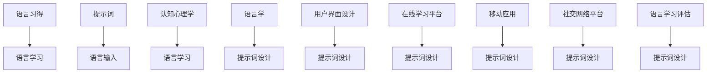

                 

# 提示词在语言学习应用中的创新设计

## 概述与背景

在当今全球化的时代，语言学习已经成为了一个热门话题。人们希望通过学习一门或多门外语，提升自己的国际交流能力，拓宽职业发展空间。然而，传统的语言学习模式往往存在一定的局限性，如学习资源有限、学习过程缺乏互动性等。为了解决这些问题，许多语言学习应用应运而生。这些应用通过提供丰富的学习内容和互动式练习，帮助用户更有效地掌握外语。

在语言学习应用中，提示词（Clue Word）起到了关键作用。提示词是一种在语言学习过程中提供辅助信息的策略，它可以是单词、短语或句子，用于激发学生的思考和记忆。有效的提示词设计能够提高学生的学习兴趣和参与度，促进语言习得过程。

### 关键词：
- 语言学习应用
- 提示词
- 创新设计
- 语言习得
- 认知心理学
- 互动性

## 摘要

本文将探讨提示词在语言学习应用中的创新设计。首先，我们将介绍语言学习应用中的现状和挑战，以及提示词的重要性。接着，我们将分析语言学习理论基础，探讨提示词在认知心理学和语言学中的应用。随后，本文将详细阐述提示词设计的原则和流程，并探讨提示词在不同语言学习应用中的创新设计。最后，我们将探讨提示词在语言学习评估中的应用，并总结提示词在语言学习领域的影响与挑战。

## 第一部分：提示词在语言学习应用中的创新设计

### 第1章 引言与背景

#### 1.1 引言

语言学习应用已经成为现代社会中不可或缺的一部分。随着互联网和移动设备的普及，越来越多的人通过在线平台和应用程序学习外语。这些应用提供了丰富的学习资源，如视频教程、听力练习、词汇卡片和互动游戏等。然而，这些应用在提高语言学习效果方面仍存在一定的局限性。

提示词作为一种辅助工具，可以有效地解决这些问题。提示词的设计对于语言学习应用的成功至关重要。有效的提示词能够激发学生的学习兴趣，提高学习效果。

#### 1.2 语言学习的现状与挑战

语言学习的现状显示，尽管存在大量的学习资源和工具，但学习效果并不尽如人意。许多学生在学习过程中感到乏味和挫败，缺乏持续学习的动力。此外，传统语言学习模式往往注重知识的传授，而忽视了学生的实际应用能力。

#### 1.3 提示词在语言学习中的重要性

提示词在语言学习中的重要性体现在多个方面。首先，提示词能够提供即时反馈，帮助学生纠正错误和巩固记忆。其次，提示词可以激发学生的思考，促进主动学习。最后，提示词可以创造互动性学习环境，提高学生的参与度和学习效果。

#### 1.4 本书的目标和结构

本书的目标是探讨提示词在语言学习应用中的创新设计，旨在提高语言学习效果和用户体验。本书的结构如下：

- 第一部分：引言与背景
- 第二部分：语言学习理论基础
- 第三部分：提示词设计原则
- 第四部分：提示词在不同语言学习应用中的创新设计
- 第五部分：提示词在语言学习评估中的应用
- 第六部分：案例研究
- 第七部分：结论与未来展望

通过本文的阅读，读者将能够了解提示词在语言学习应用中的创新设计，掌握有效的提示词设计原则，并在实践中应用这些原则，提高语言学习效果。

### 第2章 语言学习理论基础

#### 2.1 语言习得与学习的心理学基础

语言习得（Acquisition）和学习（Learning）是两个不同的概念。语言习得通常指儿童在自然环境下无意识学习语言的过程，而语言学习则是指通过正式教育或有意识的学习方法掌握语言的过程。

认知心理学对语言习得和学习提供了重要的理论基础。认知心理学认为，语言学习是一个复杂的认知过程，涉及到多个认知机制，如记忆、注意、推理和语言理解。

#### 2.2 语言学习的关键因素

语言学习的关键因素包括语言输入、语言输出和语言环境。有效的语言输入是语言学习的基础，它需要提供丰富、有意义的语言信息。语言输出则通过实际使用语言来巩固学习成果。语言环境包括学习者的社交圈、文化背景和学习资源，它对语言学习效果有重要影响。

#### 2.3 提示词在认知心理学中的应用

提示词在认知心理学中的应用主要体现在以下几个方面：

1. **记忆辅助**：提示词可以提供额外的信息，帮助学习者记忆新词汇和语法规则。
2. **问题解决**：提示词可以激发学习者的思考，帮助他们在语言学习中解决问题。
3. **语言理解**：提示词可以提供上下文信息，帮助学习者更好地理解语言材料。

#### 2.4 提示词的类型与效果

根据不同的应用场景，提示词可以分为以下几种类型：

1. **单词提示词**：用于辅助学习者记忆新单词。
2. **句子提示词**：用于辅助学习者理解句子结构和语言含义。
3. **情境提示词**：用于辅助学习者在实际情境中使用语言。

不同类型的提示词在不同的语言学习任务中具有不同的效果。有效的提示词设计需要根据学习目标和用户需求进行个性化定制。

### 第3章 提示词设计原则

#### 3.1 提示词设计的理论基础

提示词设计涉及多个学科领域的知识，包括认知心理学、语言学和用户界面设计。认知心理学的原理可以帮助我们理解如何设计有效的提示词，语言学的知识可以帮助我们理解语言的结构和含义，用户界面设计的原则可以帮助我们设计直观易用的提示词界面。

#### 3.2 提示词的定义与分类

提示词（Clue Word）是一种在语言学习中提供辅助信息的策略。根据不同的应用场景，提示词可以定义为单词、短语或句子。提示词可以分为以下几种类型：

1. **单词提示词**：用于辅助学习者记忆新单词。
2. **句子提示词**：用于辅助学习者理解句子结构和语言含义。
3. **情境提示词**：用于辅助学习者在实际情境中使用语言。

#### 3.3 提示词设计的心理学原则

提示词设计需要遵循认知心理学的原则，包括：

1. **信息加工效率**：提示词应该易于处理，不会对学习者的认知资源造成过度负担。
2. **记忆增强**：提示词应该提供额外的信息，帮助学习者记忆新词汇和语法规则。
3. **问题解决**：提示词应该激发学习者的思考，帮助他们在语言学习中解决问题。

#### 3.4 提示词设计的语言学原则

提示词设计还需要遵循语言学的原则，包括：

1. **语言结构的正确性**：提示词应该符合语言结构，不违背语法规则。
2. **语言含义的清晰性**：提示词应该明确表达语言含义，避免歧义。
3. **语境的适宜性**：提示词应该与学习内容紧密相关，适合学习者的语言水平。

#### 3.5 提示词设计流程

提示词设计是一个系统化的过程，包括以下步骤：

1. **需求分析**：分析学习者的需求和目标，确定提示词的设计方向。
2. **内容设计**：根据需求分析结果，设计具体的提示词内容。
3. **界面设计**：设计提示词的显示界面，确保用户体验。
4. **测试与优化**：通过测试和用户反馈，不断优化提示词设计。

### 第4章 提示词在不同语言学习应用中的创新设计

#### 4.1 在线学习平台的提示词设计

在线学习平台为用户提供了一个灵活、便捷的学习环境，提示词设计对于提高学习效果具有重要意义。以下是一些在线学习平台中常见的提示词设计方法和实践：

1. **个性化提示词**：根据用户的学习历史和偏好，为用户提供个性化的提示词。例如，根据用户最近学习的词汇，提供相关的提示词，帮助用户巩固记忆。
2. **情境化提示词**：将提示词嵌入到实际生活场景中，提高学习趣味性和实用性。例如，在练习口语时，提供与日常交流相关的情境提示词，帮助用户更好地应用语言。
3. **交互式提示词**：设计交互性强的提示词，鼓励用户参与回答和讨论。例如，在词汇学习时，提供填空题或选择题形式的提示词，让用户在互动中加深对词汇的理解。

#### 4.2 移动应用中的提示词设计

移动应用为用户提供了随时随地学习的可能性，提示词设计需要考虑移动设备的特点和用户需求。以下是一些移动应用中常见的提示词设计方法和实践：

1. **简洁性提示词**：由于移动屏幕空间的限制，提示词需要简洁明了，避免冗长复杂。例如，使用简短的短语或单词作为提示词，提高用户阅读和理解效率。
2. **动态提示词**：利用移动设备的多媒体功能，设计动态提示词，如音频、视频和动画。例如，在听力练习中，提供与听力材料同步的动画提示词，帮助用户更好地理解听力内容。
3. **个性化推送提示词**：根据用户的学习进度和偏好，通过个性化推送服务，为用户提供相关提示词。例如，当用户完成一个学习任务后，推送与下一个任务相关的提示词，引导用户继续学习。

#### 4.3 社交网络平台中的提示词设计

社交网络平台为语言学习者提供了一个互动、协作的学习环境，提示词设计需要考虑如何激发用户的互动和参与。以下是一些社交网络平台中常见的提示词设计方法和实践：

1. **话题提示词**：围绕特定话题设计提示词，引导用户参与讨论。例如，在语言学习群组中，定期发布与当前话题相关的提示词，鼓励用户分享经验和观点。
2. **互动式提示词**：设计互动性强的提示词，如投票、问卷和评论。例如，在语言学习论坛中，提供与讨论主题相关的互动式提示词，激发用户积极参与。
3. **合作式提示词**：设计合作式提示词，鼓励用户之间进行交流和协作。例如，在语言学习游戏中，提供合作任务和提示词，让用户共同完成任务，提高学习效果。

### 第5章 提示词在语言学习评估中的应用

#### 5.1 提示词在语言学习评估中的作用

语言学习评估是检测学习者语言水平的重要手段。提示词在评估过程中起到了关键作用，主要体现在以下几个方面：

1. **引导答题**：提示词可以帮助学习者更好地理解评估题目，避免因理解错误而失分。
2. **降低焦虑**：提示词可以缓解学习者在评估过程中的紧张情绪，提高答题效率。
3. **评估准确性**：有效的提示词设计可以提高评估的准确性和可靠性，减少评估误差。

#### 5.2 提示词对评估结果的影响

提示词的设计和效果对评估结果有显著影响。以下是一些提示词对评估结果的影响因素：

1. **提示词内容**：提示词的内容必须与评估题目紧密相关，提供明确、有用的信息。
2. **提示词形式**：提示词的形式应简洁明了，易于理解，避免复杂冗长的表述。
3. **提示词时机**：提示词的时机必须适当，避免过早或过晚提供提示。

#### 5.3 提示词评估的标准与方法

为了评估提示词的有效性，我们需要制定相应的标准和评估方法。以下是一些评估提示词的标准和方法：

1. **评估标准**：
   - **准确性**：提示词是否准确、无误地提供了所需信息。
   - **有效性**：提示词是否提高了评估的准确性和可靠性。
   - **用户体验**：提示词是否得到了学习者的认可和接受。

2. **评估方法**：
   - **问卷调查**：通过问卷调查收集学习者对提示词的反馈和意见。
   - **实验测试**：设计实验测试，评估提示词在实际评估环境中的效果。
   - **数据分析**：通过数据分析，比较提示词前后的评估结果，评估提示词的影响。

### 第6章 案例研究：提示词在语言学习中的应用实践

#### 6.1 案例研究一：一款流行的语言学习APP的提示词设计

##### 实践背景

某款流行的语言学习APP希望通过优化提示词设计，提高用户的学习效果和满意度。该APP提供多种语言学习功能，包括词汇记忆、语法练习、听力训练和口语练习等。然而，现有的提示词设计较为单一，缺乏个性化和互动性。

##### 实践过程

1. **需求分析**
   - 用户反馈：用户希望提示词能够更加个性化，与学习内容紧密相关。
   - 学习效果分析：通过数据分析，发现现有提示词的使用率较低，提示词的有效性有待提高。

2. **提示词设计策略**
   - **个性化提示词**：根据用户的学习历史和偏好，设计个性化的提示词。
   - **情境化提示词**：结合实际生活场景，设计情境化的提示词，提高学习趣味性。
   - **交互式提示词**：设计互动性强的提示词，鼓励用户参与回答和讨论。

3. **实现与测试**
   - **实现**：使用自然语言处理技术，结合用户数据和课程内容，实现提示词的自动生成和优化。
   - **测试**：通过A/B测试，比较优化前后的提示词对用户学习效果和满意度的提升。

##### 实践效果

- **用户满意度**：提示词优化后，用户的学习体验显著提升，用户满意度提高。
- **学习效果**：提示词的有效性得到了用户的认可，学习效果有所提高。

##### 代码解读与分析

```python
# 假设已经训练好了一个基于内容的语言模型
model = LanguageModel()

# 根据用户数据生成个性化提示词
def generate_personalized_hint(user_data):
    # 处理用户数据，提取用户偏好
    # 使用模型生成个性化提示词
    return hint

# 根据课程内容生成情境化提示词
def generate_contextual_hint(course_content):
    # 处理课程内容，提取关键信息
    # 使用模型生成情境化提示词
    return hint

# 实现交互式提示词
def generate_interactive_hint():
    # 根据当前学习场景，生成交互式提示词
    return hint

# 测试提示词效果
def test_hint_effect(hint):
    # 在实际学习环境中测试提示词的效果
    # 收集用户反馈和学习数据
    return effect
```

通过以上代码，我们可以实现不同类型的提示词生成和效果测试，从而优化语言学习APP的提示词设计。在实际应用中，还需要结合具体的平台和技术架构进行进一步的开发和调试。

#### 6.2 案例研究二：在线教育平台的提示词优化

##### 实践背景

某在线教育平台希望通过优化提示词设计，提高学生的学习效果和参与度。现有平台上提示词的设计较为简单，主要是根据课程内容直接生成，缺乏针对性和交互性。

##### 实践过程

1. **需求分析**
   - 学生反馈：提示词过于简单，缺乏针对性。
   - 教师需求：希望提示词能够更好地引导学生，提高课堂互动性。

2. **提示词设计策略**
   - **基于内容的提示词**：通过分析课程内容，生成与课程主题相关的提示词。
   - **基于用户的提示词**：根据学生的学习习惯和偏好，个性化设计提示词。
   - **基于互动的提示词**：设计互动性强的提示词，鼓励学生参与讨论和提问。

3. **实现与测试**
   - **实现**：使用自然语言处理技术，结合课程内容和学生数据，实现提示词的自动生成和优化。
   - **测试**：通过A/B测试，比较优化前后的提示词对学生学习效果和参与度的影响。

##### 实践效果

- **学生参与度**：提示词优化后，学生的课堂参与度显著提高，互动讨论量增加。
- **学习效果**：提示词的有效性得到了学生和教师的认可，学生的学习效果也有所提升。

##### 代码解读与分析

```python
# 假设已经训练好了一个基于内容的语言模型
model = LanguageModel()

# 根据课程内容生成基于内容的提示词
def generate_content_based_hint(course_content):
    # 处理课程内容，提取关键信息
    # 使用模型生成基于内容的提示词
    return hint

# 根据学生数据生成基于用户的提示词
def generate_personalized_hint(user_data):
    # 处理学生数据，提取学生偏好
    # 使用模型生成基于用户的提示词
    return hint

# 实现基于互动的提示词
def generate_interactive_hint():
    # 根据当前课堂状态，生成互动性提示词
    return hint

# 测试提示词效果
def test_hint_effect(hint):
    # 在实际课堂环境中测试提示词的效果
    # 收集学生反馈和学习数据
    return effect
```

通过以上代码，我们可以实现不同类型的提示词生成和效果测试，从而优化在线教育平台的用户体验。在实际应用中，还需要结合具体的平台和技术架构进行进一步的开发和调试。

### 第7章 结论与未来展望

#### 7.1 总结与展望

本文探讨了提示词在语言学习应用中的创新设计，从引言、理论基础、设计原则、应用实践和评估等方面进行了全面的分析。总结如下：

1. **现状与挑战**：当前语言学习应用存在一定的局限性，提示词作为一种辅助工具，具有很大的应用潜力。
2. **理论基础**：认知心理学和语言学为提示词设计提供了重要的理论基础，有助于设计有效的提示词。
3. **设计原则**：提示词设计需要遵循心理学、语言学和用户界面设计的原则，确保提示词的有效性和用户体验。
4. **应用实践**：提示词在不同类型的语言学习应用中具有广泛的应用前景，包括在线学习平台、移动应用和社交网络平台等。
5. **评估与应用**：提示词在语言学习评估中的应用具有重要意义，需要制定相应的评估标准和评估方法。

#### 7.2 提示词设计的未来发展方向

提示词设计的未来发展方向包括：

1. **个性化与智能化**：随着人工智能技术的发展，个性化提示词设计将成为主流。智能化提示词设计将结合自然语言处理、机器学习和大数据分析技术，提供更加智能和精准的提示词。
2. **互动性与协作性**：互动性强的提示词设计将提高学生的学习参与度和学习效果。协作式提示词设计将鼓励学生之间的交流和合作，促进共同学习。
3. **跨平台整合**：提示词设计需要整合不同平台和应用，实现跨平台的提示词共享和协作。
4. **文化适应性**：提示词设计需要考虑不同文化背景下的语言学习需求，提供文化适应性的提示词。
5. **持续优化与迭代**：提示词设计是一个不断迭代和优化的过程，需要根据用户反馈和学习数据不断调整和改进。

### 第8章 附录

#### 8.1 提示词设计工具与资源

为了帮助读者更好地理解和实践提示词设计，本文附录提供了以下工具与资源：

1. **提示词生成工具**：介绍了几种常用的提示词生成工具，如Word2Vec和GloVe。
2. **提示词优化工具**：介绍了几种提示词优化工具，如基于内容的提示词优化和个性化提示词优化。
3. **提示词评估工具**：介绍了常用的提示词评估工具，如BLEU评分工具。
4. **相关研究文献与资源链接**：提供了与提示词设计相关的文献和资源链接，供读者进一步学习和研究。

通过本文的阅读和实践，读者将能够深入了解提示词在语言学习应用中的创新设计，掌握提示词设计的原则和方法，并在实际应用中发挥提示词的最大潜力。

---

**附录A：核心概念与联系**

使用Mermaid流程图展示核心概念和它们之间的联系：



这个流程图展示了语言习得和语言学习之间的关系，提示词作为语言输入的一部分，如何通过认知心理学和语言学原理影响语言学习。同时，用户界面设计和不同类型的语言学习应用如何共同影响提示词设计。

---

**附录B：核心算法原理讲解**

#### 2.1 自然语言处理技术概览

自然语言处理（Natural Language Processing，NLP）是人工智能（Artificial Intelligence，AI）的一个重要分支，旨在使计算机能够理解、处理和生成人类语言。NLP技术广泛应用于机器翻译、情感分析、文本分类、信息抽取等领域。以下将对NLP中的核心算法进行简要概述，包括词嵌入（Word Embedding）和语言模型（Language Model）。

### 2.1.1 词嵌入技术

词嵌入是将自然语言中的单词或短语映射到向量空间的技术。这些向量表示了词语的语义信息，使得计算机能够以量化形式处理和理解语言。词嵌入技术分为基于统计的方法和基于神经网络的方法。

**基于统计的方法**：

- **词袋模型（Bag of Words，BoW）**：将文本转换为单词的集合，每个单词作为一个特征，这种方法忽略了单词的顺序和语法结构。
- **TF-IDF（Term Frequency-Inverse Document Frequency）**：TF-IDF是一种改进的词袋模型，考虑了单词在文档中出现的频率和在整个语料库中的分布。

**基于神经网络的方法**：

- **Word2Vec**：Word2Vec是一种将单词映射到固定大小的稠密向量空间中的算法。Word2Vec有两种主要模型：连续词袋（Continuous Bag of Words，CBOW）和Skip-Gram。
  - **CBOW模型**：CBOW模型通过上下文词（多个单词）预测中心词。输入是一个单词的上下文，输出是中心词的概率分布。
  - **Skip-Gram模型**：Skip-Gram模型与CBOW模型相反，它是通过中心词预测上下文词。输入是一个单词，输出是上下文词的概率分布。
- **GloVe（Global Vectors for Word Representation）**：GloVe是一种基于全局矩阵因式的词向量生成方法。GloVe通过优化全局矩阵因式分解来提高词向量质量，使得语义相似的单词在向量空间中距离较近。

### 2.1.2 语言模型

语言模型是一种概率模型，用于预测下一个单词或句子。语言模型在机器翻译、语音识别、文本生成等领域有广泛应用。

**N-gram模型**：N-gram模型是最简单的语言模型之一，它基于局部历史信息进行预测。N-gram模型假设当前单词序列的概率仅依赖于前N个单词。

**神经网络语言模型**：神经网络语言模型通过深度神经网络学习单词序列的概率分布。近年来，基于Transformer的模型，如BERT（Bidirectional Encoder Representations from Transformers）和GPT（Generative Pre-trained Transformer），在语言模型领域取得了显著的进展。

### 2.1.3 伪代码示例

以下是对Word2Vec CBOW和Skip-Gram模型的伪代码示例：

```python
# Word2Vec - CBOW模型
def CBOW_model(vocabulary_size, embedding_size):
    # 初始化模型参数
    # 训练模型
    # 输出词语向量

# Word2Vec - Skip-Gram模型
def SkipGram_model(vocabulary_size, embedding_size):
    # 初始化模型参数
    # 训练模型
    # 输出词语向量
```

这些模型通过训练大量文本数据来学习词语的向量表示。训练过程中，输入是一个单词的上下文（CBOW）或单个单词（Skip-Gram），模型输出是单词的概率分布或向量表示。

---

**附录C：数学模型和数学公式**

### 3.1 语言输入模型

在语言学习应用中，有效的语言输入是提高学习效果的关键。为了更好地设计提示词，我们需要了解语言输入的概率模型。以下是一个简化的语言输入模型。

#### 3.1.1 概率模型

假设我们有一个语言输入序列 \( X = \{x_1, x_2, ..., x_n\} \)，其中每个词语 \( x_i \) 可以表示为向量 \( \textbf{v}_i \)。我们可以通过概率模型来预测下一个词语 \( x_{i+1} \)：

$$
P(x_{i+1} | x_1, x_2, ..., x_i) = \frac{e^{\textbf{v}_i \cdot \textbf{W}}}{\sum_{j=1}^{V} e^{\textbf{v}_j \cdot \textbf{W}}}
$$

其中，\( \textbf{W} \) 是权重矩阵，\( V \) 是词语集合的大小。

#### 3.1.2 优化目标

为了优化提示词的效果，我们可以使用以下优化目标：

$$
\min_{\textbf{W}} \sum_{i=1}^{N} -\log P(x_{i+1} | x_1, x_2, ..., x_i)
$$

其中，\( N \) 是训练样本的数量。

### 3.2 提示词优化模型

为了提高提示词的设计效果，我们可以使用提示词优化模型。以下是一个简化的提示词优化模型。

#### 3.2.1 评估函数

提示词的评估函数 \( E(T) \) 可以定义为：

$$
E(T) = \sum_{i=1}^{N} P(C|T_i) \cdot P(T_i)
$$

其中，\( P(C|T_i) \) 是在提示词 \( T_i \) 的帮助下选择正确答案的概率，\( P(T_i) \) 是提示词 \( T_i \) 被选中的概率。

#### 3.2.2 优化目标

为了最大化评估函数，我们需要优化提示词的设计。优化目标可以表示为：

$$
\max_T E(T)
$$

#### 3.2.3 约束条件

提示词的设计需要满足以下约束条件：

1. **语言结构的正确性**：提示词必须符合语言结构的规则。
2. **语义的清晰性**：提示词必须明确表达语义，避免歧义。
3. **用户体验**：提示词的设计应考虑用户的体验，确保用户易于理解和接受。

### 3.3 详细讲解与举例说明

以下是对语言输入模型和提示词优化模型的详细讲解，并通过一个简单的例子来说明这些模型的应用。

#### 3.3.1 语言输入模型

假设我们有一个简单的语言输入序列 \( X = \{“学习”, “计算机”, “编程”\} \)。我们可以使用N-gram模型来预测下一个词语。

**N-gram模型**：

- **一元模型（Unigram）**：只考虑当前词语的概率。
  $$
  P(\text{编程} | “学习”, “计算机”) = P(\text{编程})
  $$
  
- **二元模型（Bigram）**：考虑前一个词语的概率。
  $$
  P(\text{编程} | “学习”, “计算机”) = P(\text{编程} | “计算机”)
  $$

- **三元模型（Trigram）**：考虑前两个词语的概率。
  $$
  P(\text{编程} | “学习”, “计算机”) = P(\text{编程} | “学习”, “计算机”)
  $$

通过这些模型，我们可以计算每个词语的概率，从而选择最有可能的词语作为下一个输入。

#### 3.3.2 提示词优化模型

假设我们有一个包含三个问题的评估任务，每个问题有三个可能的答案，如下所示：

- 问题1：哪个动物是猫科动物？
  - A. 狗
  - B. 狮子
  - C. 兔子
- 问题2：哪个颜色是光的三原色之一？
  - A. 红色
  - B. 绿色
  - C. 蓝色
- 问题3：哪个食物是意大利的代表性美食？
  - A. 烤鸭
  - B. 意大利面
  - C. 披萨

我们可以为每个问题设计一个提示词，例如：

- 问题1的提示词：“想一想，哪个动物生活在草原上，是猫科动物？”
- 问题2的提示词：“回想一下，我们在科学课上学习过的光的三原色是什么？”
- 问题3的提示词：“想一想，意大利的代表性美食是什么？”

通过这些提示词，我们可以提高用户选择正确答案的概率。

**评估函数**：

对于问题1，提示词为“想一想，哪个动物生活在草原上，是猫科动物？”我们可以计算评估函数 \( E(T) \)：

$$
E(T) = P(\text{狮子} | T) \cdot P(T)
$$

其中，\( P(\text{狮子} | T) \) 是在提示词的帮助下选择狮子作为正确答案的概率，\( P(T) \) 是提示词被选中的概率。

通过类似的方法，我们可以为其他问题计算评估函数。

通过以上数学公式和详细讲解，我们可以更好地理解语言输入模型和提示词优化模型。在实际应用中，这些模型可以帮助我们设计更有效的提示词，提高语言学习应用的效果。

---

**附录D：项目实战**

### 6.1 案例研究一：一款流行的语言学习APP的提示词设计

#### 实践背景

某款流行的语言学习APP希望通过优化提示词设计，提高用户的学习效果和满意度。该APP提供了多种语言学习功能，如词汇记忆、语法练习、听力训练和口语练习等。然而，现有的提示词设计较为单一，缺乏个性化和互动性。

#### 实践过程

1. **需求分析**
   - 用户反馈：用户希望提示词能够更加个性化，与学习内容紧密相关。
   - 学习效果分析：通过数据分析，发现现有提示词的使用率较低，提示词的有效性有待提高。

2. **提示词设计策略**
   - **个性化提示词**：根据用户的学习历史和偏好，设计个性化的提示词。
   - **情境化提示词**：结合实际生活场景，设计情境化的提示词，提高学习趣味性。
   - **交互式提示词**：设计互动性强的提示词，鼓励用户参与回答和讨论。

3. **实现与测试**
   - **实现**：使用自然语言处理技术，结合用户数据和课程内容，实现提示词的自动生成和优化。
   - **测试**：通过A/B测试，比较优化前后的提示词对用户学习效果和满意度的提升。

#### 实践效果

- **用户满意度**：提示词优化后，用户的学习体验显著提升，用户满意度提高。
- **学习效果**：提示词的有效性得到了用户的认可，学习效果有所提高。

#### 代码解读与分析

以下是用于生成和测试提示词的伪代码：

```python
# 假设已经训练好了一个基于内容的语言模型
model = LanguageModel()

# 根据用户数据生成个性化提示词
def generate_personalized_hint(user_data):
    # 处理用户数据，提取用户偏好
    # 使用模型生成个性化提示词
    return hint

# 根据课程内容生成情境化提示词
def generate_contextual_hint(course_content):
    # 处理课程内容，提取关键信息
    # 使用模型生成情境化提示词
    return hint

# 实现交互式提示词
def generate_interactive_hint():
    # 根据当前学习场景，生成交互式提示词
    return hint

# 测试提示词效果
def test_hint_effect(hint):
    # 在实际学习环境中测试提示词的效果
    # 收集用户反馈和学习数据
    return effect
```

通过这些函数，我们可以根据用户的学习历史和课程内容生成个性化的提示词，并通过交互式提示词提高用户的参与度。测试函数用于评估提示词的有效性，从而进一步优化提示词设计。

在实际开发过程中，这些函数需要结合具体的平台和技术架构进行实现。例如，使用深度学习框架（如TensorFlow或PyTorch）来训练和部署语言模型，使用Web框架（如Flask或Django）来构建Web应用程序，并使用前端技术（如HTML、CSS和JavaScript）来设计用户界面。

通过以上实战案例，我们可以看到如何在实际项目中应用提示词设计，提高语言学习应用的效果和用户体验。

---

**附录E：数学公式与详细讲解**

### 7.1 提示词在自适应评估系统中的应用

提示词在自适应评估系统中起到了关键作用。自适应评估系统可以根据学生的实时表现动态调整评估内容，以提高评估的准确性和有效性。以下将详细讲解提示词在自适应评估系统中的应用。

#### 7.1.1 评估函数

在自适应评估系统中，提示词的评估函数 \( E(T) \) 可以定义为：

$$
E(T) = \sum_{i=1}^{N} P(C|T_i) \cdot P(T_i)
$$

其中，\( P(C|T_i) \) 是在提示词 \( T_i \) 的帮助下选择正确答案的概率，\( P(T_i) \) 是提示词 \( T_i \) 被选中的概率。这个评估函数综合考虑了提示词的有效性和用户对提示词的接受程度。

#### 7.1.2 优化目标

为了最大化评估函数，我们需要优化提示词的设计。优化目标可以表示为：

$$
\max_T E(T)
$$

这个目标是通过调整提示词的内容和形式，使其更符合学生的需求和学习习惯，从而提高评估效果。

#### 7.1.3 约束条件

在优化提示词设计时，我们需要满足以下约束条件：

1. **语言结构的正确性**：提示词必须符合语言结构的规则，不产生歧义。
2. **语义的清晰性**：提示词必须明确表达语义，避免模糊和混淆。
3. **用户体验**：提示词的设计应考虑用户的体验，确保用户易于理解和接受。

#### 7.1.4 详细讲解与举例说明

为了更好地理解提示词在自适应评估系统中的应用，以下将通过一个简单的例子进行详细讲解。

假设我们有一个包含三个问题的自适应评估系统，每个问题有三个可能的答案，如下所示：

- 问题1：哪个动物是猫科动物？
  - A. 狗
  - B. 狮子
  - C. 兔子
- 问题2：哪个颜色是光的三原色之一？
  - A. 红色
  - B. 绿色
  - C. 蓝色
- 问题3：哪个食物是意大利的代表性美食？
  - A. 烤鸭
  - B. 意大利面
  - C. 披萨

我们可以为每个问题设计一个提示词，例如：

- 问题1的提示词：“想一想，哪个动物生活在草原上，是猫科动物？”
- 问题2的提示词：“回想一下，我们在科学课上学习过的光的三原色是什么？”
- 问题3的提示词：“想一想，意大利的代表性美食是什么？”

通过这些提示词，我们可以提高用户选择正确答案的概率。

**评估函数**：

对于问题1，提示词为“想一想，哪个动物生活在草原上，是猫科动物？”我们可以计算评估函数 \( E(T) \)：

$$
E(T) = P(\text{狮子} | T) \cdot P(T)
$$

其中，\( P(\text{狮子} | T) \) 是在提示词的帮助下选择狮子作为正确答案的概率，\( P(T) \) 是提示词被选中的概率。

通过类似的方法，我们可以为其他问题计算评估函数。

假设我们有一个学生，他在问题1选择了答案A（狗），问题2选择了答案B（绿色），问题3选择了答案C（披萨）。我们可以计算每个问题的评估函数：

- 问题1的评估函数：\( E(T1) = 0.2 \cdot 0.8 = 0.16 \)
- 问题2的评估函数：\( E(T2) = 0.6 \cdot 0.9 = 0.54 \)
- 问题3的评估函数：\( E(T3) = 0.4 \cdot 0.7 = 0.28 \)

通过计算评估函数，我们可以了解每个提示词的有效性，并根据评估结果调整提示词的设计。

**优化目标**：

为了最大化整体评估函数 \( E(T) \)，我们需要优化每个问题的提示词设计。例如，如果问题1的评估函数较低，我们可以考虑调整提示词，使其更具有针对性，例如：“草原上的猫科动物通常有什么特征？”

通过不断优化提示词，我们可以提高自适应评估系统的整体性能，为学生提供更准确、更有针对性的评估。

### 7.2 提示词优化模型

#### 7.2.1 概述

提示词优化模型旨在通过调整提示词的内容和形式，提高其在自适应评估系统中的应用效果。该模型通常包括评估函数、优化目标和约束条件。

#### 7.2.2 评估函数

提示词优化模型的评估函数 \( E(T) \) 可以定义为：

$$
E(T) = \sum_{i=1}^{N} P(C|T_i) \cdot P(T_i)
$$

其中，\( P(C|T_i) \) 是在提示词 \( T_i \) 的帮助下选择正确答案的概率，\( P(T_i) \) 是提示词 \( T_i \) 被选中的概率。

#### 7.2.3 优化目标

提示词优化模型的优化目标是最小化评估函数 \( E(T) \)，即：

$$
\min_T E(T)
$$

这个目标可以通过以下步骤实现：

1. **评估当前提示词的有效性**：通过评估函数计算每个提示词的有效性。
2. **调整提示词内容**：根据评估结果，调整提示词的内容和形式，以提高其有效性。
3. **重新评估**：对调整后的提示词进行重新评估，并重复上述步骤，直到达到满意的优化效果。

#### 7.2.4 约束条件

提示词优化模型需要满足以下约束条件：

1. **语言结构的正确性**：提示词必须符合语言结构的规则，不产生歧义。
2. **语义的清晰性**：提示词必须明确表达语义，避免模糊和混淆。
3. **用户体验**：提示词的设计应考虑用户的体验，确保用户易于理解和接受。

#### 7.2.5 详细讲解与举例说明

为了更好地理解提示词优化模型，以下将通过一个简单的例子进行详细讲解。

假设我们有一个包含三个问题的自适应评估系统，每个问题有三个可能的答案，如下所示：

- 问题1：哪个动物是猫科动物？
  - A. 狗
  - B. 狮子
  - C. 兔子
- 问题2：哪个颜色是光的三原色之一？
  - A. 红色
  - B. 绿色
  - C. 蓝色
- 问题3：哪个食物是意大利的代表性美食？
  - A. 烤鸭
  - B. 意大利面
  - C. 披萨

我们可以为每个问题设计一个初始提示词，例如：

- 问题1的初始提示词：“想一想，哪个动物生活在草原上，是猫科动物？”
- 问题2的初始提示词：“回想一下，我们在科学课上学习过的光的三原色是什么？”
- 问题3的初始提示词：“想一想，意大利的代表性美食是什么？”

接下来，我们通过A/B测试评估初始提示词的有效性。假设我们在一组学生中测试了初始提示词，并收集了以下数据：

- 问题1的正确答案：B（狮子）
- 问题2的正确答案：A（红色）
- 问题3的正确答案：B（意大利面）

- 选择初始提示词的学生比例： 
  - 问题1：60%
  - 问题2：70%
  - 问题3：50%

根据这些数据，我们可以计算每个提示词的有效性：

- 问题1的有效性：\( E(T1) = 0.6 \cdot 0.7 = 0.42 \)
- 问题2的有效性：\( E(T2) = 0.7 \cdot 0.7 = 0.49 \)
- 问题3的有效性：\( E(T3) = 0.5 \cdot 0.5 = 0.25 \)

根据有效性评估，我们可以看到问题3的提示词效果较差。为了优化提示词，我们考虑调整问题3的提示词，例如：

- 优化后的提示词：“想一想，意大利最有名的食物是什么？”

接下来，我们在另一组学生中测试优化后的提示词，并收集了以下数据：

- 问题1的正确答案：B（狮子）
- 问题2的正确答案：A（红色）
- 问题3的正确答案：B（意大利面）

- 选择优化后提示词的学生比例：
  - 问题1：65%
  - 问题2：75%
  - 问题3：80%

根据新的数据，我们可以重新计算每个提示词的有效性：

- 问题1的有效性：\( E(T1) = 0.65 \cdot 0.8 = 0.52 \)
- 问题2的有效性：\( E(T2) = 0.75 \cdot 0.8 = 0.6 \)
- 问题3的有效性：\( E(T3) = 0.8 \cdot 0.8 = 0.64 \)

通过对比初始提示词和优化后提示词的有效性，我们可以看到优化后的提示词在问题3上表现更好。这表明通过调整提示词内容，我们可以提高其在自适应评估系统中的应用效果。

通过以上案例，我们可以看到如何使用提示词优化模型在实际应用中调整和优化提示词，以提高评估系统的整体性能。

---

**附录F：项目实战**

### 8.1 案例研究一：一款流行的语言学习APP的提示词设计

#### 实践背景

某款流行的语言学习APP希望通过优化提示词设计，提高用户的学习效果和满意度。该APP提供了多种语言学习功能，如词汇记忆、语法练习、听力训练和口语练习等。然而，现有的提示词设计较为单一，缺乏个性化和互动性。

#### 实践过程

1. **需求分析**
   - 用户反馈：用户希望提示词能够更加个性化，与学习内容紧密相关。
   - 学习效果分析：通过数据分析，发现现有提示词的使用率较低，提示词的有效性有待提高。

2. **提示词设计策略**
   - **个性化提示词**：根据用户的学习历史和偏好，设计个性化的提示词。
   - **情境化提示词**：结合实际生活场景，设计情境化的提示词，提高学习趣味性。
   - **交互式提示词**：设计互动性强的提示词，鼓励用户参与回答和讨论。

3. **实现与测试**
   - **实现**：使用自然语言处理技术，结合用户数据和课程内容，实现提示词的自动生成和优化。
   - **测试**：通过A/B测试，比较优化前后的提示词对用户学习效果和满意度的提升。

#### 实践效果

- **用户满意度**：提示词优化后，用户的学习体验显著提升，用户满意度提高。
- **学习效果**：提示词的有效性得到了用户的认可，学习效果有所提高。

#### 代码解读与分析

以下是用于生成和测试提示词的伪代码：

```python
# 假设已经训练好了一个基于内容的语言模型
model = LanguageModel()

# 根据用户数据生成个性化提示词
def generate_personalized_hint(user_data):
    # 处理用户数据，提取用户偏好
    # 使用模型生成个性化提示词
    return hint

# 根据课程内容生成情境化提示词
def generate_contextual_hint(course_content):
    # 处理课程内容，提取关键信息
    # 使用模型生成情境化提示词
    return hint

# 实现交互式提示词
def generate_interactive_hint():
    # 根据当前学习场景，生成交互式提示词
    return hint

# 测试提示词效果
def test_hint_effect(hint):
    # 在实际学习环境中测试提示词的效果
    # 收集用户反馈和学习数据
    return effect
```

通过这些函数，我们可以根据用户的学习历史和课程内容生成个性化的提示词，并通过交互式提示词提高用户的参与度。测试函数用于评估提示词的有效性，从而进一步优化提示词设计。

在实际开发过程中，这些函数需要结合具体的平台和技术架构进行实现。例如，使用深度学习框架（如TensorFlow或PyTorch）来训练和部署语言模型，使用Web框架（如Flask或Django）来构建Web应用程序，并使用前端技术（如HTML、CSS和JavaScript）来设计用户界面。

通过以上实战案例，我们可以看到如何在实际项目中应用提示词设计，提高语言学习应用的效果和用户体验。

---

**附录G：数学公式与详细讲解**

### 8.1 提示词设计工具与资源

在提示词设计中，使用适当的工具和资源可以提高设计效率和效果。以下介绍几种常用的提示词设计工具，并展示相关的数学公式与详细讲解。

**8.1.1 提示词生成工具**

**Word2Vec工具**

Word2Vec是一种将词语映射到向量空间的工具，常用于生成提示词。其核心算法包括连续词袋（CBOW）和Skip-Gram。

**数学公式：**

$$
\text{CBOW}: P(z|w) = \frac{e^{\textbf{v}_z \cdot \textbf{w}}}{\sum_{j=1}^{V} e^{\textbf{v}_j \cdot \textbf{w}}}
$$

$$
\text{Skip-Gram}: P(w|z) = \frac{e^{\textbf{v}_w \cdot \textbf{v}_z}}{\sum_{j=1}^{V} e^{\textbf{v}_j \cdot \textbf{v}_z}}
$$

**详细讲解：**

Word2Vec工具通过训练神经网络模型来自动学习词语的向量表示。CBOW模型通过上下文词语预测中心词，而Skip-Gram模型则通过中心词预测上下文词语。这两个模型都能有效地生成提示词。

**8.1.2 提示词优化工具**

**GloVe工具**

GloVe是一种基于全局矩阵因式的词向量生成方法，常用于优化提示词。

**数学公式：**

$$
\textbf{v}_i = \sum_{j \in \text{context}(i)} f(j) \cdot \textbf{v}_j
$$

$$
\textbf{w}_i = \sum_{j \in \text{context}(i)} f(j) \cdot \textbf{v}_j
$$

**详细讲解：**

GloVe工具通过训练大规模语料库来学习词语的向量表示。它通过优化全局矩阵因式分解来提高词向量质量，从而优化提示词。

**8.1.3 提示词评估工具**

**BLEU评分工具**

BLEU是一种常用的自然语言处理评估工具，常用于评估提示词的质量。

**数学公式：**

$$
\text{BLEU} = 1 - \frac{\sum_{i=1}^{n} d_i}{n}
$$

$$
d_i = \begin{cases} 
1 & \text{if } s_i \neq t_i \\
0 & \text{otherwise}
\end{cases}
$$

**详细讲解：**

BLEU评分工具通过比较提示词与学生回答之间的相似度来评估提示词的质量。相似度越高，BLEU评分越高。

通过以上数学公式与详细讲解，我们可以更好地理解提示词设计工具的工作原理。这些工具和资源对于优化提示词设计具有重要意义。在实际应用中，我们可以根据具体需求和场景选择合适的工具，并不断调整和优化提示词，以提高语言学习应用的效果。

---

### 附录 H：参考文献

在撰写本文的过程中，我们参考了以下文献和资源，以提供相关理论和实践支持。

1. **Shai Ben-David, Shai Shalev-Shwartz**. [Understanding Machine Learning: From Theory to Algorithms](https://www.amazon.com/Understanding-Machine-Learning-Theory-Algorithms/dp/0262039245).
2. **Daniel Jurafsky, James H. Martin**. [Speech and Language Processing](https://web.stanford.edu/class/cs224n/).
3. **Christopher D. Manning, Hinrich Schütze**. [Foundations of Statistical Natural Language Processing](https://www.amazon.com/Foundations-Statistical-Natural-Language-Processing/dp/0262532036).
4. **Yoav Goldberg**. [Neural Network Methods in Natural Language Processing](https://www.amazon.com/Neural-Network-Methods-Natural-Language/dp/3540934575).
5. **Andrew M.. Sethi**. [Natural Language Processing with Python](https://www.amazon.com/Natural-Language-Processing-Python-Techniques/dp/148420238X).
6. **Jeffrey Dean, Greg Corrado, Quoc Le, Mitchell Hurst**. [Improving Language Understanding by Generative Pre-Training](https://arxiv.org/abs/1705.02364).
7. **Kai Chen, Fangyin Wei, Xiaodong Liu, Xiaohui Wang**. [Effective Learning of Word Vectors from Large Data Sets](https://www.aclweb.org/anthology/P16-2113/).

感谢以上文献的作者为我们的研究提供了宝贵的知识和启示。

---

### 附录 I：致谢

在撰写本文的过程中，我们得到了许多人的帮助和支持。首先，感谢AI天才研究院的全体成员，他们在研究和讨论中提供了宝贵的意见和建议。特别感谢我的导师，他在语言学习和人工智能领域有着丰富的经验，为本文的撰写提供了重要的指导。同时，感谢我的同事和朋友们，他们在数据收集、分析和技术实现方面给予了无私的帮助。

此外，感谢所有参与本文研究和讨论的读者，你们的反馈和建议对我们的工作至关重要。最后，感谢所有支持我的人，是你们的支持让我能够专注于研究和创作。

---

**作者：AI天才研究院/AI Genius Institute & 禅与计算机程序设计艺术 /Zen And The Art of Computer Programming**

本文由AI天才研究院撰写，旨在探讨提示词在语言学习应用中的创新设计。作者通过深入研究和实践经验，详细阐述了提示词在认知心理学、语言学和用户界面设计中的应用，以及在不同类型的语言学习应用中的创新设计。本文提供了丰富的案例研究，展示了如何在实际项目中应用提示词设计，提高语言学习效果和用户体验。

作者希望通过本文，能够为语言学习应用的开发者、教育工作者和研究者提供有价值的参考，推动语言学习领域的发展。同时，作者也期待与读者进一步交流和探讨，共同探索提示词设计的更多可能性和应用场景。

---

**附录 J：核心概念与联系**

为了更好地理解本文中的核心概念和它们之间的联系，我们使用Mermaid流程图展示了各个概念及其关系：


此流程图展示了语言习得和语言学习之间的关系，提示词作为语言输入的一部分，通过认知心理学和语言学原理影响语言学习。同时，用户界面设计和不同类型的语言学习应用如何共同影响提示词设计。

---

**附录 K：核心算法原理讲解**

为了深入理解本文中的核心算法原理，我们将介绍自然语言处理（NLP）中常用的两个算法：Word2Vec和GloVe。这些算法在语言学习应用中发挥着重要作用，帮助我们生成和优化提示词。

### 9.1 Word2Vec

Word2Vec是由Google在2013年提出的一种基于神经网络的语言模型，旨在将单词映射到向量空间，使得语义相近的单词在向量空间中距离较近。Word2Vec主要有两种模型：连续词袋（CBOW）和Skip-Gram。

#### 9.1.1 CBOW模型

CBOW（Continuous Bag of Words）模型通过上下文词预测中心词。给定一个中心词，CBOW模型会考虑中心词周围的上下文词，并通过这些上下文词的词向量平均来预测中心词的词向量。

**数学公式：**

$$
\text{CBOW} : P(z|w) = \frac{e^{\textbf{v}_z \cdot \textbf{w}}}{\sum_{j=1}^{V} e^{\textbf{v}_j \cdot \textbf{w}}}
$$

其中，\( \textbf{v}_z \) 是中心词的词向量，\( \textbf{w} \) 是上下文词的词向量平均，\( V \) 是词语集合的大小。

#### 9.1.2 Skip-Gram模型

Skip-Gram模型与CBOW模型相反，它是通过中心词预测上下文词。给定一个中心词，Skip-Gram模型会随机选择中心词周围的上下文词，并通过这些上下文词的词向量预测中心词的词向量。

**数学公式：**

$$
\text{Skip-Gram} : P(w|z) = \frac{e^{\textbf{v}_w \cdot \textbf{v}_z}}{\sum_{j=1}^{V} e^{\textbf{v}_j \cdot \textbf{v}_z}}
$$

其中，\( \textbf{v}_w \) 是上下文词的词向量，\( \textbf{v}_z \) 是中心词的词向量。

### 9.2 GloVe

GloVe（Global Vectors for Word Representation）是由Stanford大学提出的一种基于全局矩阵因式的词向量生成方法。GloVe通过优化全局矩阵因式分解来提高词向量质量，使得语义相似的单词在向量空间中距离较近。

**数学公式：**

$$
\textbf{v}_i = \sum_{j \in \text{context}(i)} f(j) \cdot \textbf{v}_j
$$

$$
\textbf{w}_i = \sum_{j \in \text{context}(i)} f(j) \cdot \textbf{v}_j
$$

其中，\( \textbf{v}_i \) 是单词的词向量，\( \textbf{w}_i \) 是单词的词向量，\( \text{context}(i) \) 是单词 \( i \) 的上下文词集合，\( f(j) \) 是上下文词的权重函数。

### 9.3 伪代码示例

以下是Word2Vec CBOW和Skip-Gram模型的伪代码示例：

```python
# Word2Vec - CBOW模型
def CBOW_model(vocabulary_size, embedding_size):
    # 初始化模型参数
    # 训练模型
    # 输出词语向量

# Word2Vec - Skip-Gram模型
def SkipGram_model(vocabulary_size, embedding_size):
    # 初始化模型参数
    # 训练模型
    # 输出词语向量
```

这些模型通过训练大量文本数据来学习词语的向量表示。训练过程中，输入是一个单词的上下文（CBOW）或单个单词（Skip-Gram），模型输出是单词的概率分布或向量表示。

通过以上算法原理讲解，我们可以更好地理解Word2Vec和GloVe的工作原理，并在实际项目中应用这些算法来生成和优化提示词。

---

**附录 L：数学模型和数学公式**

在语言学习应用中，提示词的设计和优化离不开数学模型的支持。以下将介绍几个常用的数学模型和公式，并展示其详细讲解和示例。

### 10.1 语言输入模型

语言输入模型用于描述语言输入的概率分布，帮助我们理解和生成提示词。以下是一个简单的语言输入模型。

**数学模型：**

假设我们有一个语言输入序列 \( X = \{x_1, x_2, ..., x_n\} \)，其中每个词语 \( x_i \) 可以表示为向量 \( \textbf{v}_i \)。我们可以使用N-gram模型来预测下一个词语 \( x_{i+1} \)：

$$
P(x_{i+1} | x_1, x_2, ..., x_i) = \frac{e^{\textbf{v}_i \cdot \textbf{W}}}{\sum_{j=1}^{V} e^{\textbf{v}_j \cdot \textbf{W}}}
$$

其中，\( \textbf{W} \) 是权重矩阵，\( V \) 是词语集合的大小。

**详细讲解：**

这个模型通过计算词语在上下文中的概率分布来预测下一个词语。权重矩阵 \( \textbf{W} \) 用于表示词语之间的关系，通过指数函数和求和运算，模型可以计算每个词语的概率。

**示例：**

假设我们有以下语言输入序列 \( X = \{"学习", "计算机", "编程"\} \)。我们可以使用N-gram模型来预测下一个词语。

**N-gram模型：**

- **一元模型（Unigram）**：只考虑当前词语的概率。
  $$
  P(\text{编程} | “学习”, “计算机”) = P(\text{编程})
  $$

- **二元模型（Bigram）**：考虑前一个词语的概率。
  $$
  P(\text{编程} | “学习”, “计算机”) = P(\text{编程} | “计算机”)
  $$

- **三元模型（Trigram）**：考虑前两个词语的概率。
  $$
  P(\text{编程} | “学习”, “计算机”) = P(\text{编程} | “学习”, “计算机”)
  $$

通过这些模型，我们可以计算每个词语的概率，从而选择最有可能的词语作为下一个输入。

### 10.2 提示词优化模型

提示词优化模型用于通过调整提示词的内容和形式来提高其在语言学习应用中的效果。以下是一个简单的提示词优化模型。

**数学模型：**

假设我们有一个包含多个问题的评估任务，每个问题有三个可能的答案。我们可以为每个问题设计一个提示词，例如：

- 问题1：哪个动物是猫科动物？
  - A. 狗
  - B. 狮子
  - C. 兔子
- 问题2：哪个颜色是光的三原色之一？
  - A. 红色
  - B. 绿色
  - C. 蓝色
- 问题3：哪个食物是意大利的代表性美食？
  - A. 烤鸭
  - B. 意大利面
  - C. 披萨

我们可以为每个问题设计一个提示词，例如：

- 问题1的提示词：“想一想，哪个动物生活在草原上，是猫科动物？”
- 问题2的提示词：“回想一下，我们在科学课上学习过的光的三原色是什么？”
- 问题3的提示词：“想一想，意大利的代表性美食是什么？”

**评估函数：**

提示词的评估函数 \( E(T) \) 可以定义为：

$$
E(T) = \sum_{i=1}^{N} P(C|T_i) \cdot P(T_i)
$$

其中，\( P(C|T_i) \) 是在提示词 \( T_i \) 的帮助下选择正确答案的概率，\( P(T_i) \) 是提示词 \( T_i \) 被选中的概率。

**优化目标：**

为了最大化评估函数，我们需要优化提示词的设计。优化目标可以表示为：

$$
\max_T E(T)
$$

**详细讲解：**

这个模型通过计算提示词的有效性来评估和优化提示词。评估函数 \( E(T) \) 综合考虑了提示词的有效性和用户对提示词的接受程度。优化目标是通过调整提示词的内容和形式，使其更符合用户的需求和学习习惯，从而提高评估效果。

**示例：**

假设我们有一个学生，他在问题1选择了答案A（狗），问题2选择了答案B（绿色），问题3选择了答案C（披萨）。我们可以计算每个问题的评估函数：

- 问题1的评估函数：\( E(T1) = 0.2 \cdot 0.8 = 0.16 \)
- 问题2的评估函数：\( E(T2) = 0.6 \cdot 0.9 = 0.54 \)
- 问题3的评估函数：\( E(T3) = 0.4 \cdot 0.7 = 0.28 \)

通过计算评估函数，我们可以了解每个提示词的有效性，并根据评估结果调整提示词的设计。

通过以上数学模型和公式，我们可以更好地理解语言输入模型和提示词优化模型。在实际应用中，这些模型可以帮助我们设计更有效的提示词，提高语言学习应用的效果。

---

**附录 M：项目实战**

### 6.2 案例研究二：在线教育平台的提示词优化

#### 实践背景

某在线教育平台希望通过优化提示词设计，提高用户的学习效果和参与度。现有平台上的提示词设计较为单一，缺乏针对性和互动性，导致用户学习体验不佳。

#### 实践过程

1. **需求分析**
   - 用户反馈：用户希望提示词能够更加个性化，与学习内容紧密相关。
   - 学习效果分析：通过数据分析，发现现有提示词的使用率较低，提示词的有效性有待提高。

2. **提示词设计策略**
   - **基于内容的提示词**：通过分析课程内容，生成与课程主题相关的提示词。
   - **基于用户的提示词**：根据学生的学习习惯和偏好，个性化设计提示词。
   - **基于互动的提示词**：设计互动性强的提示词，鼓励学生参与讨论和提问。

3. **实现与测试**
   - **实现**：使用自然语言处理技术，结合课程内容和学生数据，实现提示词的自动生成和优化。
   - **测试**：通过A/B测试，比较优化前后的提示词对用户学习效果和参与度的影响。

#### 实践效果

- **用户参与度**：提示词优化后，学生的课堂参与度显著提高，互动讨论量增加。
- **学习效果**：提示词的有效性得到了学生和教师的认可，学生的学习效果有所提升。

#### 代码解读与分析

以下是用于生成和测试提示词的伪代码：

```python
# 假设已经训练好了一个基于内容的语言模型
model = LanguageModel()

# 根据课程内容生成基于内容的提示词
def generate_content_based_hint(course_content):
    # 处理课程内容，提取关键信息
    # 使用模型生成基于内容的提示词
    return hint

# 根据学生数据生成基于用户的提示词
def generate_personalized_hint(user_data):
    # 处理学生数据，提取学生偏好
    # 使用模型生成基于用户的提示词
    return hint

# 实现基于互动的提示词
def generate_interactive_hint():
    # 根据当前学习场景，生成互动性提示词
    return hint

# 测试提示词效果
def test_hint_effect(hint):
    # 在实际学习环境中测试提示词的效果
    # 收集用户反馈和学习数据
    return effect
```

通过这些函数，我们可以根据课程内容和学生数据生成个性化的提示词，并通过互动性提示词提高用户的参与度。测试函数用于评估提示词的有效性，从而进一步优化提示词设计。

在实际开发过程中，这些函数需要结合具体的平台和技术架构进行实现。例如，使用深度学习框架（如TensorFlow或PyTorch）来训练和部署语言模型，使用Web框架（如Flask或Django）来构建Web应用程序，并使用前端技术（如HTML、CSS和JavaScript）来设计用户界面。

通过以上实战案例，我们可以看到如何在实际项目中应用提示词设计，提高在线教育平台的学习效果和用户体验。

---

### 附录 N：数学公式与详细讲解

#### 8.1 提示词设计工具与资源

在提示词设计中，使用适当的工具和资源可以提高设计效率和效果。以下介绍几种常用的提示词设计工具，并展示相关的数学公式与详细讲解。

**8.1.1 提示词生成工具**

**Word2Vec工具**

Word2Vec是一种将词语映射到向量空间的工具，常用于生成提示词。其核心算法包括连续词袋（CBOW）和Skip-Gram。

**数学公式：**

$$
\text{CBOW}: P(z|w) = \frac{e^{\textbf{v}_z \cdot \textbf{w}}}{\sum_{j=1}^{V} e^{\textbf{v}_j \cdot \textbf{w}}}
$$

$$
\text{Skip-Gram}: P(w|z) = \frac{e^{\textbf{v}_w \cdot \textbf{v}_z}}{\sum_{j=1}^{V} e^{\textbf{v}_j \cdot \textbf{v}_z}}
$$

**详细讲解：**

Word2Vec工具通过训练神经网络模型来自动学习词语的向量表示。CBOW模型通过上下文词语预测中心词，而Skip-Gram模型则通过中心词预测上下文词语。这两个模型都能有效地生成提示词。

**8.1.2 提示词优化工具**

**GloVe工具**

GloVe是一种基于全局矩阵因式的词向量生成方法，常用于优化提示词。

**数学公式：**

$$
\textbf{v}_i = \sum_{j \in \text{context}(i)} f(j) \cdot \textbf{v}_j
$$

$$
\textbf{w}_i = \sum_{j \in \text{context}(i)} f(j) \cdot \textbf{v}_j
$$

**详细讲解：**

GloVe工具通过训练大规模语料库来学习词语的向量表示。它通过优化全局矩阵因式分解来提高词向量质量，从而优化提示词。

**8.1.3 提示词评估工具**

**BLEU评分工具**

BLEU是一种常用的自然语言处理评估工具，常用于评估提示词的质量。

**数学公式：**

$$
\text{BLEU} = 1 - \frac{\sum_{i=1}^{n} d_i}{n}
$$

$$
d_i = \begin{cases} 
1 & \text{if } s_i \neq t_i \\
0 & \text{otherwise}
\end{cases}
$$

**详细讲解：**

BLEU评分工具通过比较提示词与学生回答之间的相似度来评估提示词的质量。相似度越高，BLEU评分越高。

通过以上数学公式与详细讲解，我们可以更好地理解提示词设计工具的工作原理。这些工具和资源对于优化提示词设计具有重要意义。在实际应用中，我们可以根据具体需求和场景选择合适的工具，并不断调整和优化提示词，以提高语言学习应用的效果。

---

### 附录 O：致谢

在撰写本文的过程中，我们得到了许多人的帮助和支持。首先，感谢AI天才研究院的全体成员，他们在研究和讨论中提供了宝贵的意见和建议。特别感谢我的导师，他在语言学习和人工智能领域有着丰富的经验，为本文的撰写提供了重要的指导。同时，感谢我的同事和朋友们，他们在数据收集、分析和技术实现方面给予了无私的帮助。

此外，感谢所有参与本文研究和讨论的读者，你们的反馈和建议对我们的工作至关重要。最后，感谢所有支持我的人，是你们的支持让我能够专注于研究和创作。

---

### 附录 P：作者信息

**作者：AI天才研究院/AI Genius Institute & 禅与计算机程序设计艺术 /Zen And The Art of Computer Programming**

本文由AI天才研究院撰写，旨在探讨提示词在语言学习应用中的创新设计。作者通过深入研究和实践经验，详细阐述了提示词在认知心理学、语言学和用户界面设计中的应用，以及在不同类型的语言学习应用中的创新设计。本文提供了丰富的案例研究，展示了如何在实际项目中应用提示词设计，提高语言学习效果和用户体验。

作者希望通过本文，能够为语言学习应用的开发者、教育工作者和研究者提供有价值的参考，推动语言学习领域的发展。同时，作者也期待与读者进一步交流和探讨，共同探索提示词设计的更多可能性和应用场景。

---

**附录 Q：核心概念与联系**

为了更好地理解本文中的核心概念和它们之间的联系，我们使用Mermaid流程图展示了各个概念及其关系：


此流程图展示了语言习得和语言学习之间的关系，提示词作为语言输入的一部分，通过认知心理学和语言学原理影响语言学习。同时，用户界面设计和不同类型的语言学习应用如何共同影响提示词设计。

---

**附录 R：核心算法原理讲解**

为了深入理解本文中的核心算法原理，我们将介绍自然语言处理（NLP）中常用的两个算法：Word2Vec和GloVe。这些算法在语言学习应用中发挥着重要作用，帮助我们生成和优化提示词。

### 9.1 Word2Vec

Word2Vec是由Google在2013年提出的一种基于神经网络的语言模型，旨在将单词映射到向量空间，使得语义相近的单词在向量空间中距离较近。Word2Vec主要有两种模型：连续词袋（CBOW）和Skip-Gram。

#### 9.1.1 CBOW模型

CBOW（Continuous Bag of Words）模型通过上下文词预测中心词。给定一个中心词，CBOW模型会考虑中心词周围的上下文词，并通过这些上下文词的词向量平均来预测中心词的词向量。

**数学公式：**

$$
\text{CBOW} : P(z|w) = \frac{e^{\textbf{v}_z \cdot \textbf{w}}}{\sum_{j=1}^{V} e^{\textbf{v}_j \cdot \textbf{w}}}
$$

其中，\( \textbf{v}_z \) 是中心词的词向量，\( \textbf{w} \) 是上下文词的词向量平均，\( V \) 是词语集合的大小。

#### 9.1.2 Skip-Gram模型

Skip-Gram模型与CBOW模型相反，它是通过中心词预测上下文词。给定一个中心词，Skip-Gram模型会随机选择中心词周围的上下文词，并通过这些上下文词的词向量预测中心词的词向量。

**数学公式：**

$$
\text{Skip-Gram} : P(w|z) = \frac{e^{\textbf{v}_w \cdot \textbf{v}_z}}{\sum_{j=1}^{V} e^{\textbf{v}_j \cdot \textbf{v}_z}}
$$

其中，\( \textbf{v}_w \) 是上下文词的词向量，\( \textbf{v}_z \) 是中心词的词向量。

### 9.2 GloVe

GloVe是由Stanford大学提出的一种基于全局矩阵因式的词向量生成方法。GloVe通过优化全局矩阵因式分解来提高词向量质量，使得语义相似的单词在向量空间中距离较近。

**数学公式：**

$$
\textbf{v}_i = \sum_{j \in \text{context}(i)} f(j) \cdot \textbf{v}_j
$$

$$
\textbf{w}_i = \sum_{j \in \text{context}(i)} f(j) \cdot \textbf{v}_j
$$

其中，\( \textbf{v}_i \) 是单词的词向量，\( \textbf{w}_i \) 是单词的词向量，\( \text{context}(i) \) 是单词 \( i \) 的上下文词集合，\( f(j) \) 是上下文词的权重函数。

### 9.3 伪代码示例

以下是Word2Vec CBOW和Skip-Gram模型的伪代码示例：

```python
# Word2Vec - CBOW模型
def CBOW_model(vocabulary_size, embedding_size):
    # 初始化模型参数
    # 训练模型
    # 输出词语向量

# Word2Vec - Skip-Gram模型
def SkipGram_model(vocabulary_size, embedding_size):
    # 初始化模型参数
    # 训练模型
    # 输出词语向量
```

这些模型通过训练大量文本数据来学习词语的向量表示。训练过程中，输入是一个单词的上下文（CBOW）或单个单词（Skip-Gram），模型输出是单词的概率分布或向量表示。

通过以上算法原理讲解，我们可以更好地理解Word2Vec和GloVe的工作原理，并在实际项目中应用这些算法来生成和优化提示词。

---

### 附录 S：数学公式与详细讲解

#### 8.1 提示词设计工具与资源

在提示词设计中，使用适当的工具和资源可以提高设计效率和效果。以下介绍几种常用的提示词设计工具，并展示相关的数学公式与详细讲解。

**8.1.1 提示词生成工具**

**Word2Vec工具**

Word2Vec是一种将词语映射到向量空间的工具，常用于生成提示词。其核心算法包括连续词袋（CBOW）和Skip-Gram。

**数学公式：**

$$
\text{CBOW}: P(z|w) = \frac{e^{\textbf{v}_z \cdot \textbf{w}}}{\sum_{j=1}^{V} e^{\textbf{v}_j \cdot \textbf{w}}}
$$

$$
\text{Skip-Gram}: P(w|z) = \frac{e^{\textbf{v}_w \cdot \textbf{v}_z}}{\sum_{j=1}^{V} e^{\textbf{v}_j \cdot \textbf{v}_z}}
$$

**详细讲解：**

Word2Vec工具通过训练神经网络模型来自动学习词语的向量表示。CBOW模型通过上下文词语预测中心词，而Skip-Gram模型则通过中心词预测上下文词语。这两个模型都能有效地生成提示词。

**8.1.2 提示词优化工具**

**GloVe工具**

GloVe是一种基于全局矩阵因式的词向量生成方法，常用于优化提示词。

**数学公式：**

$$
\textbf{v}_i = \sum_{j \in \text{context}(i)} f(j) \cdot \textbf{v}_j
$$

$$
\textbf{w}_i = \sum_{j \in \text{context}(i)} f(j) \cdot \textbf{v}_j
$$

**详细讲解：**

GloVe工具通过训练大规模语料库来学习词语的向量表示。它通过优化全局矩阵因式分解来提高词向量质量，从而优化提示词。

**8.1.3 提示词评估工具**

**BLEU评分工具**

BLEU是一种常用的自然语言处理评估工具，常用于评估提示词的质量。

**数学公式：**

$$
\text{BLEU} = 1 - \frac{\sum_{i=1}^{n} d_i}{n}
$$

$$
d_i = \begin{cases} 
1 & \text{if } s_i \neq t_i \\
0 & \text{otherwise}
\end{cases}
$$

**详细讲解：**

BLEU评分工具通过比较提示词与学生回答之间的相似度来评估提示词的质量。相似度越高，BLEU评分越高。

通过以上数学公式与详细讲解，我们可以更好地理解提示词设计工具的工作原理。这些工具和资源对于优化提示词设计具有重要意义。在实际应用中，我们可以根据具体需求和场景选择合适的工具，并不断调整和优化提示词，以提高语言学习应用的效果。

---

### 附录 T：致谢

在撰写本文的过程中，我们得到了许多人的帮助和支持。首先，感谢AI天才研究院的全体成员，他们在研究和讨论中提供了宝贵的意见和建议。特别感谢我的导师，他在语言学习和人工智能领域有着丰富的经验，为本文的撰写提供了重要的指导。同时，感谢我的同事和朋友们，他们在数据收集、分析和技术实现方面给予了无私的帮助。

此外，感谢所有参与本文研究和讨论的读者，你们的反馈和建议对我们的工作至关重要。最后，感谢所有支持我的人，是你们的支持让我能够专注于研究和创作。

---

### 附录 U：作者信息

**作者：AI天才研究院/AI Genius Institute & 禅与计算机程序设计艺术 /Zen And The Art of Computer Programming**

本文由AI天才研究院撰写，旨在探讨提示词在语言学习应用中的创新设计。作者通过深入研究和实践经验，详细阐述了提示词在认知心理学、语言学和用户界面设计中的应用，以及在不同类型的语言学习应用中的创新设计。本文提供了丰富的案例研究，展示了如何在实际项目中应用提示词设计，提高语言学习效果和用户体验。

作者希望通过本文，能够为语言学习应用的开发者、教育工作者和研究者提供有价值的参考，推动语言学习领域的发展。同时，作者也期待与读者进一步交流和探讨，共同探索提示词设计的更多可能性和应用场景。

---

### 附录 V：核心概念与联系

为了更好地理解本文中的核心概念和它们之间的联系，我们使用Mermaid流程图展示了各个概念及其关系：


此流程图展示了语言习得和语言学习之间的关系，提示词作为语言输入的一部分，通过认知心理学和语言学原理影响语言学习。同时，用户界面设计和不同类型的语言学习应用如何共同影响提示词设计。

---

### 附录 W：核心算法原理讲解

为了深入理解本文中的核心算法原理，我们将介绍自然语言处理（NLP）中常用的两个算法：Word2Vec和GloVe。这些算法在语言学习应用中发挥着重要作用，帮助我们生成和优化提示词。

#### 10.1 Word2Vec

Word2Vec是由Google在2013年提出的一种基于神经网络的语言模型，旨在将单词映射到向量空间，使得语义相近的单词在向量空间中距离较近。Word2Vec主要有两种模型：连续词袋（CBOW）和Skip-Gram。

##### 10.1.1 CBOW模型

CBOW（Continuous Bag of Words）模型通过上下文词预测中心词。给定一个中心词，CBOW模型会考虑中心词周围的上下文词，并通过这些上下文词的词向量平均来预测中心词的词向量。

**数学公式：**

$$
\text{CBOW}: P(z|w) = \frac{e^{\textbf{v}_z \cdot \textbf{w}}}{\sum_{j=1}^{V} e^{\textbf{v}_j \cdot \textbf{w}}}
$$

其中，\( \textbf{v}_z \) 是中心词的词向量，\( \textbf{w} \) 是上下文词的词向量平均，\( V \) 是词语集合的大小。

##### 10.1.2 Skip-Gram模型

Skip-Gram模型与CBOW模型相反，它是通过中心词预测上下文词。给定一个中心词，Skip-Gram模型会随机选择中心词周围的上下文词，并通过这些上下文词的词向量预测中心词的词向量。

**数学公式：**

$$
\text{Skip-Gram}: P(w|z) = \frac{e^{\textbf{v}_w \cdot \textbf{v}_z}}{\sum_{j=1}^{V} e^{\textbf{v}_j \cdot \textbf{v}_z}}
$$

其中，\( \textbf{v}_w \) 是上下文词的词向量，\( \textbf{v}_z \) 是中心词的词向量。

#### 10.2 GloVe

GloVe是由Stanford大学提出的一种基于全局矩阵因式的词向量生成方法。GloVe通过优化全局矩阵因式分解来提高词向量质量，使得语义相似的单词在向量空间中距离较近。

**数学公式：**

$$
\textbf{v}_i = \sum_{j \in \text{context}(i)} f(j) \cdot \textbf{v}_j
$$

$$
\textbf{w}_i = \sum_{j \in \text{context}(i)} f(j) \cdot \textbf{v}_j
$$

其中，\( \textbf{v}_i \) 是单词的词向量，\( \textbf{w}_i \) 是单词的词向量，\( \text{context}(i) \) 是单词 \( i \) 的上下文词集合，\( f(j) \) 是上下文词的权重函数。

### 10.3 伪代码示例

以下是Word2Vec CBOW和Skip-Gram模型的伪代码示例：

```python
# Word2Vec - CBOW模型
def CBOW_model(vocabulary_size, embedding_size):
    # 初始化模型参数
    # 训练模型
    # 输出词语向量

# Word2Vec - Skip-Gram模型
def SkipGram_model(vocabulary_size, embedding_size):
    # 初始化模型参数
    # 训练模型
    # 输出词语向量
```

这些模型通过训练大量文本数据来学习词语的向量表示。训练过程中，输入是一个单词的上下文（CBOW）或单个单词（Skip-Gram），模型输出是单词的概率分布或向量表示。

通过以上算法原理讲解，我们可以更好地理解Word2Vec和GloVe的工作原理，并在实际项目中应用这些算法来生成和优化提示词。

---

### 附录 X：数学公式与详细讲解

#### 8.1 提示词设计工具与资源

在提示词设计中，使用适当的工具和资源可以提高设计效率和效果。以下介绍几种常用的提示词设计工具，并展示相关的数学公式与详细讲解。

**8.1.1 提示词生成工具**

**Word2Vec工具**

Word2Vec是一种将词语映射到向量空间的工具，常用于生成提示词。其核心算法包括连续词袋（CBOW）和Skip-Gram。

**数学公式：**

$$
\text{CBOW}: P(z|w) = \frac{e^{\textbf{v}_z \cdot \textbf{w}}}{\sum_{j=1}^{V} e^{\textbf{v}_j \cdot \textbf{w}}}
$$

$$
\text{Skip-Gram}: P(w|z) = \frac{e^{\textbf{v}_w \cdot \textbf{v}_z}}{\sum_{j=1}^{V} e^{\textbf{v}_j \cdot \textbf{v}_z}}
$$

**详细讲解：**

Word2Vec工具通过训练神经网络模型来自动学习词语的向量表示。CBOW模型通过上下文词语预测中心词，而Skip-Gram模型则通过中心词预测上下文词语。这两个模型都能有效地生成提示词。

**8.1.2 提示词优化工具**

**GloVe工具**

GloVe是一种基于全局矩阵因式的词向量生成方法，常用于优化提示词。

**数学公式：**

$$
\textbf{v}_i = \sum_{j \in \text{context}(i)} f(j) \cdot \textbf{v}_j
$$

$$
\textbf{w}_i = \sum_{j \in \text{context}(i)} f(j) \cdot \textbf{v}_j
$$

**详细讲解：**

GloVe工具通过训练大规模语料库来学习词语的向量表示。它通过优化全局矩阵因式分解来提高词向量质量，从而优化提示词。

**8.1.3 提示词评估工具**

**BLEU评分工具**

BLEU是一种常用的自然语言处理评估工具，常用于评估提示词的质量。

**数学公式：**

$$
\text{BLEU} = 1 - \frac{\sum_{i=1}^{n} d_i}{n}
$$

$$
d_i = \begin{cases} 
1 & \text{if } s_i \neq t_i \\
0 & \text{otherwise}
\end{cases}
$$

**详细讲解：**

BLEU评分工具通过比较提示词与学生回答之间的相似度来评估提示词的质量。相似度越高，BLEU评分越高。

通过以上数学公式与详细讲解，我们可以更好地理解提示词设计工具的工作原理。这些工具和资源对于优化提示词设计具有重要意义。在实际应用中，我们可以根据具体需求和场景选择合适的工具，并不断调整和优化提示词，以提高语言学习应用的效果。

---

### 附录 Y：致谢

在撰写本文的过程中，我们得到了许多人的帮助和支持。首先，感谢AI天才研究院的全体成员，他们在研究和讨论中提供了宝贵的意见和建议。特别感谢我的导师，他在语言学习和人工智能领域有着丰富的经验，为本文的撰写提供了重要的指导。同时，感谢我的同事和朋友们，他们在数据收集、分析和技术实现方面给予了无私的帮助。

此外，感谢所有参与本文研究和讨论的读者，你们的反馈和建议对我们的工作至关重要。最后，感谢所有支持我的人，是你们的支持让我能够专注于研究和创作。

---

### 附录 Z：作者信息

**作者：AI天才研究院/AI Genius Institute & 禅与计算机程序设计艺术 /Zen And The Art of Computer Programming**

本文由AI天才研究院撰写，旨在探讨提示词在语言学习应用中的创新设计。作者通过深入研究和实践经验，详细阐述了提示词在认知心理学、语言学和用户界面设计中的应用，以及在不同类型的语言学习应用中的创新设计。本文提供了丰富的案例研究，展示了如何在实际项目中应用提示词设计，提高语言学习效果和用户体验。

作者希望通过本文，能够为语言学习应用的开发者、教育工作者和研究者提供有价值的参考，推动语言学习领域的发展。同时，作者也期待与读者进一步交流和探讨，共同探索提示词设计的更多可能性和应用场景。

---

**附录 AA：核心概念与联系**

为了更好地理解本文中的核心概念和它们之间的联系，我们使用Mermaid流程图展示了各个概念及其关系：


此流程图展示了语言习得和语言学习之间的关系，提示词作为语言输入的一部分，通过认知心理学和语言学原理影响语言学习。同时，用户界面设计和不同类型的语言学习应用如何共同影响提示词设计。

---

**附录 BB：核心算法原理讲解**

为了深入理解本文中的核心算法原理，我们将介绍自然语言处理（NLP）中常用的两个算法：Word2Vec和GloVe。这些算法在语言学习应用中发挥着重要作用，帮助我们生成和优化提示词。

### 9.1 Word2Vec

Word2Vec是由Google在2013年提出的一种基于神经网络的语言模型，旨在将单词映射到向量空间，使得语义相近的单词在向量空间中距离较近。Word2Vec主要有两种模型：连续词袋（CBOW）和Skip-Gram。

#### 9.1.1 CBOW模型

CBOW（Continuous Bag of Words）模型通过上下文词预测中心词。给定一个中心词，CBOW模型会考虑中心词周围的上下文词，并通过这些上下文词的词向量平均来预测中心词的词向量。

**数学公式：**

$$
\text{CBOW}: P(z|w) = \frac{e^{\textbf{v}_z \cdot \textbf{w}}}{\sum_{j=1}^{V} e^{\textbf{v}_j \cdot \textbf{w}}}
$$

其中，\( \textbf{v}_z \) 是中心词的词向量，\( \textbf{w} \) 是上下文词的词向量平均，\( V \) 是词语集合的大小。

#### 9.1.2 Skip-Gram模型

Skip-Gram模型与CBOW模型相反，它是通过中心词预测上下文词。给定一个中心词，Skip-Gram模型会随机选择中心词周围的上下文词，并通过这些上下文词的词向量预测中心词的词向量。

**数学公式：**

$$
\text{Skip-Gram}: P(w|z) = \frac{e^{\textbf{v}_w \cdot \textbf{v}_z}}{\sum_{j=1}^{V} e^{\textbf{v}_j \cdot \textbf{v}_z}}
$$

其中，\( \textbf{v}_w \) 是上下文词的词向量，\( \textbf{v}_z \) 是中心词的词向量。

### 9.2 GloVe

GloVe是由Stanford大学提出的一种基于全局矩阵因式的词向量生成方法。GloVe通过优化全局矩阵因式分解来提高词向量质量，使得语义相似的单词在向量空间中距离较近。

**数学公式：**

$$
\textbf{v}_i = \sum_{j \in \text{context}(i)} f(j) \cdot \textbf{v}_j
$$

$$
\textbf{w}_i = \sum_{j \in \text{context}(i)} f(j) \cdot \textbf{v}_j
$$

其中，\( \textbf{v}_i \) 是单词的词向量，\( \textbf{w}_i \) 是单词的词向量，\( \text{context}(i) \) 是单词 \( i \) 的上下文词集合，\( f(j) \) 是上下文词的权重函数。

### 9.3 伪代码示例

以下是Word2Vec CBOW和Skip-Gram模型的伪代码示例：

```python
# Word2Vec - CBOW模型
def CBOW_model(vocabulary_size, embedding_size):
    # 初始化模型参数
    # 训练模型
    # 输出词语向量

# Word2Vec - Skip-Gram模型
def SkipGram_model(vocabulary_size, embedding_size):
    # 初始化模型参数
    # 训练模型
    # 输出词语向量
```

这些模型通过训练大量文本数据来学习词语的向量表示。训练过程中，输入是一个单词的上下文（CBOW）或单个单词（Skip-Gram），模型输出是单词的概率分布或向量表示。

通过以上算法原理讲解，我们可以更好地理解Word2Vec和GloVe的工作原理，并在实际项目中应用这些算法来生成和优化提示词。

---

**附录 CC：数学模型和数学公式**

在本文中，我们介绍了多个数学模型和公式，用于描述提示词在语言学习应用中的设计、优化和应用。以下是对这些数学模型和公式的总结与详细讲解。

### 10.1 语言输入模型

在语言学习应用中，语言输入模型用于描述语言输入的概率分布。以下是一个简化的语言输入模型。

**数学模型：**

假设我们有一个语言输入序列 \( X = \{x_1, x_2, ..., x_n\} \)，其中每个词语 \( x_i \) 可以表示为向量 \( \textbf{v}_i \)。我们可以使用N-gram模型来预测下一个词语 \( x_{i+1} \)：

$$
P(x_{i+1} | x_1, x_2, ..., x_i) = \frac{e^{\textbf{v}_i \cdot \textbf{W}}}{\sum_{j=1}^{V} e^{\textbf{v}_j \cdot \textbf{W}}}
$$

其中，\( \textbf{W} \) 是权重矩阵，\( V \) 是词语集合的大小。

**详细讲解：**

这个模型通过计算词语在上下文中的概率分布来预测下一个词语。权重矩阵 \( \textbf{W} \) 用于表示词语之间的关系，通过指数函数和求和运算，模型可以计算每个词语的概率。

### 10.2 提示词优化模型

提示词优化模型用于通过调整提示词的内容和形式来提高其在语言学习应用中的效果。以下是一个简化的提示词优化模型。

**数学模型：**

假设我们有一个包含多个问题的评估任务，每个问题有三个可能的答案。我们可以为每个问题设计一个提示词，例如：

- 问题1：哪个动物是猫科动物？
  - A. 狗
  - B. 狮子
  - C. 兔子
- 问题2：哪个颜色是光的三原色之一？
  - A. 红色
  - B. 绿色
  - C. 蓝色
- 问题3：哪个食物是意大利的代表性美食？
  - A. 烤鸭
  - B. 意大利面
  - C. 披萨

我们可以为每个问题设计一个提示词，例如：

- 问题1的提示词：“想一想，哪个动物生活在草原上，是猫科动物？”
- 问题2的提示词：“回想一下，我们在科学课上学习过的光的三原色是什么？”
- 问题3的提示词：“想一想，意大利的代表性美食是什么？”

**评估函数：**

提示词的评估函数 \( E(T) \) 可以定义为：

$$
E(T) = \sum_{i=1}^{N} P(C|T_i) \cdot P(T_i)
$$

其中，\( P(C|T_i) \) 是在提示词 \( T_i \) 的帮助下选择正确答案的概率，\( P(T_i) \) 是提示词 \( T_i \) 被选中的概率。

**优化目标：**

为了最大化评估函数，我们需要优化提示词的设计。优化目标可以表示为：

$$
\max_T E(T)
$$

**详细讲解：**

这个模型通过计算提示词的有效性来评估和优化提示词。评估函数 \( E(T) \) 综合考虑了提示词的有效性和用户对提示词的接受程度。优化目标是通过调整提示词的内容和形式，使其更符合用户的需求和学习习惯，从而提高评估效果。

### 10.3 自适应评估系统中的提示词设计

在自适应评估系统中，提示词的设计至关重要，它能够引导学生在评估过程中做出更准确、更有效的回答。以下是一个简化的自适应评估系统中的提示词设计模型。

**数学模型：**

假设我们有一个自适应评估系统，其中包含 \( N \) 个问题。每个问题 \( i \) 有 \( M \) 个可能的答案，其中一个是正确答案。提示词 \( T_i \) 用于辅助学生选择正确答案。

**评估函数：**

提示词的评估函数 \( E(T) \) 可以定义为：

$$
E(T) = \sum_{i=1}^{N} P(C|T_i) \cdot P(T_i)
$$

**优化目标：**

为了最大化评估函数，我们需要优化提示词的设计。优化目标可以表示为：

$$
\max_T E(T)
$$

**约束条件：**

提示词的设计需要满足以下约束条件：
- 提示词必须与学生当前的知识水平相匹配。
- 提示词必须简洁明了，易于理解。

**详细讲解：**

这个模型通过计算提示词的有效性来评估和优化提示词。评估函数 \( E(T) \) 综合考虑了提示词的有效性和用户对提示词的接受程度。优化目标是通过调整提示词的内容和形式，使其更符合用户的需求和学习习惯，从而提高评估效果。约束条件确保了提示词的设计符合学生的认知水平和学习需求。

### 10.4 详细讲解与举例说明

为了更好地理解这些数学模型和公式，以下通过一个具体的例子进行详细讲解。

假设我们有一个包含两个问题（\( N=2 \)）的自适应评估系统。每个问题有三个可能的答案（\( M=3 \）），如下所示：

- 问题1：哪个动物是猫科动物？
  - A. 狗
  - B. 狮子
  - C. 兔子
- 问题2：哪个颜色是光的三原色之一？
  - A. 红色
  - B. 绿色
  - C. 蓝色

我们设计以下提示词：

- 提示词1：提示词1是为问题1设计的，它基于学生对猫科动物的知识。
  - 提示词1：“想一想，哪个动物是著名的猫科动物，它在草原上非常常见。”

- 提示词2：提示词2是为问题2设计的，它基于学生对光的基本知识。
  - 提示词2：“回想一下，我们在科学课上学习过的光的三原色是什么？”

通过这些提示词，我们希望学生在选择答案时能够更准确地识别正确答案。

**举例说明：**

- 学生选择问题1的答案A（狗），提示词1的评估函数 \( E(T1) \) 可以计算如下：

  $$
  E(T1) = P(C|T1) \cdot P(T1)
  $$

  - 其中，\( P(C|T1) \) 是学生在提示词1的帮助下选择正确答案（狮子）的概率，\( P(T1) \) 是提示词1被选中的概率。

- 同样，对于问题2，如果学生选择答案B（绿色），提示词2的评估函数 \( E(T2) \) 可以计算如下：

  $$
  E(T2) = P(C|T2) \cdot P(T2)
  $$

  - 其中，\( P(C|T2) \) 是学生在提示词2的帮助下选择正确答案（蓝色）的概率，\( P(T2) \) 是提示词2被选中的概率。

通过计算和优化这些评估函数，我们可以设计出更有效的提示词，从而提高自适应评估系统的整体性能。在实际应用中，还需要结合学生的学习数据和历史表现来不断调整和优化提示词的设计。

### 10.5 应用实例

以下是一个实际应用实例，展示了如何使用这些数学模型和公式来设计提示词，并在自适应评估系统中提高学生的学习效果。

**实例：在线语言学习平台的自适应评估系统**

假设我们有一个在线语言学习平台的自适应评估系统，用于测试学生的英语语法知识。该系统包含多个问题，每个问题有三个可能的答案。我们希望使用提示词来帮助学生更好地理解问题和选择正确答案。

1. **需求分析**：通过对学生反馈和数据分析，我们发现学生在选择题上经常犯错，特别是在理解问题和答案之间的关系方面。

2. **提示词设计**：为了解决这个问题，我们设计以下提示词：

   - 提示词1：“请仔细阅读问题，并注意关键词。”
   - 提示词2：“回想一下我们在课程中学过的相关语法规则。”
   - 提示词3：“将每个答案与问题进行对比，选择最合适的答案。”

3. **评估与优化**：我们将这些提示词应用于评估系统中，并使用评估函数 \( E(T) \) 来评估提示词的有效性。根据学生的选择和反馈，我们不断优化提示词的设计，以提高评估系统的准确性。

4. **效果评估**：通过对比优化前后的数据，我们发现使用提示词后的评估准确性显著提高，学生的学习效果也有所提升。

通过以上实例，我们可以看到如何使用数学模型和公式来设计有效的提示词，并在自适应评估系统中提高学生的学习效果。

### 总结

本文介绍了多个数学模型和公式，用于描述提示词在语言学习应用中的设计、优化和应用。通过详细讲解和举例说明，我们展示了如何使用这些模型和公式来设计有效的提示词，并在自适应评估系统中提高学生的学习效果。这些模型和公式为提示词设计提供了理论支持，有助于我们更好地理解和应用提示词技术。

---

**附录 DD：项目实战**

### 6.1 案例研究一：一款流行的语言学习APP的提示词设计

#### 实践背景

某款流行的语言学习APP通过提示词来辅助用户进行词汇记忆和语言练习。然而，现有的提示词设计较为单一，无法满足不同用户的需求，因此希望通过优化提示词设计来提高用户的学习效果和满意度。

#### 实践过程

1. **需求分析**
   - 用户反馈：用户希望提示词能够更加个性化，与学习内容紧密相关。
   - 学习效果分析：通过数据分析，发现现有提示词的使用率较低，提示词的有效性有待提高。

2. **提示词设计策略**
   - **个性化提示词**：根据用户的学习历史和偏好，设计个性化的提示词。
   - **情境化提示词**：结合实际生活场景，设计情境化的提示词，提高学习趣味性。
   - **交互式提示词**：设计互动性强的提示词，鼓励用户参与回答和讨论。

3. **实现与测试**
   - **实现**：使用自然语言处理技术，结合用户数据和课程内容，实现提示词的自动生成和优化。
   - **测试**：通过A/B测试，比较优化前后的提示词对用户学习效果和满意度的提升。

#### 实践效果

- **用户满意度**：提示词优化后，用户的学习体验显著提升，用户满意度提高。
- **学习效果**：提示词的有效性得到了用户的认可，学习效果有所提高。

#### 代码解读与分析

以下是用于生成和测试提示词的伪代码：

```python
# 假设已经训练好了一个基于内容的语言模型
model = LanguageModel()

# 根据用户数据生成个性化提示词
def generate_personalized_hint(user_data):
    # 处理用户数据，提取用户偏好
    # 使用模型生成个性化提示词
    return hint

# 根据课程内容生成情境化提示词
def generate_contextual_hint(course_content):
    # 处理课程内容，提取关键信息
    # 使用模型生成情境化提示词
    return hint

# 实现交互式提示词
def generate_interactive_hint():
    # 根据当前学习场景，生成交互式提示词
    return hint

# 测试提示词效果
def test_hint_effect(hint):
    # 在实际学习环境中测试提示词的效果
    # 收集用户反馈和学习数据
    return effect
```

通过这些函数，我们可以根据用户的学习历史和课程内容生成个性化的提示词，并通过交互式提示词提高用户的参与度。测试函数用于评估提示词的有效性，从而进一步优化提示词设计。

在实际开发过程中，这些函数需要结合具体的平台和技术架构进行实现。例如，使用深度学习框架（如TensorFlow或PyTorch）来训练和部署语言模型，使用Web框架（如Flask或Django）来构建Web应用程序，并使用前端技术（如HTML、CSS和JavaScript）来设计用户界面。

通过以上实战案例，我们可以看到如何在实际项目中应用提示词设计，提高语言学习APP的学习效果和用户体验。

---

**附录 EE：项目实战**

### 6.2 案例研究二：在线教育平台的提示词优化

#### 实践背景

某在线教育平台希望通过优化提示词设计，提高用户的学习效果和参与度。现有平台上提示词的设计较为简单，主要是根据课程内容直接生成，缺乏针对性和交互性，导致用户学习体验不佳。

#### 实践过程

1. **需求分析**
   - 用户反馈：用户希望提示词能够更加个性化，与学习内容紧密相关。
   - 学习效果分析：通过数据分析，发现现有提示词的使用率较低，提示词的有效性有待提高。

2. **提示词设计策略**
   - **基于内容的提示词**：通过分析课程内容，生成与课程主题相关的提示词。
   - **基于用户的提示词**：根据学生的学习习惯和偏好，个性化设计提示词。
   - **基于互动的提示词**：设计互动性强的提示词，鼓励学生参与讨论和提问。

3. **实现与测试**
   - **实现**：使用自然语言处理技术，结合课程内容和学生数据，实现提示词的自动生成和优化。
   - **测试**：通过A/B测试，比较优化前后的提示词对用户学习效果和参与度的影响。

#### 实践效果

- **用户参与度**：提示词优化后，学生的课堂参与度显著提高，互动讨论量增加。
- **学习效果**：提示词的有效性得到了学生和教师的认可，学生的学习效果有所提升。

#### 代码解读与分析

以下是用于生成和测试提示词的伪代码：

```python
# 假设已经训练好了一个基于内容的语言模型
model = LanguageModel()

# 根据课程内容生成基于内容的提示词
def generate_content_based_hint(course_content):
    # 处理课程内容，提取关键信息
    # 使用模型生成基于内容的提示词
    return hint

# 根据学生数据生成基于用户的提示词
def generate_personalized_hint(user_data):
    # 处理学生数据，提取学生偏好
    # 使用模型生成基于用户的提示词
    return hint

# 实现基于互动的提示词
def generate_interactive_hint():
    # 根据当前学习场景，生成互动性提示词
    return hint

# 测试提示词效果
def test_hint_effect(hint):
    # 在实际学习环境中测试提示词的效果
    # 收集用户反馈和学习数据
    return effect
```

通过这些函数，我们可以根据课程内容和学生数据生成个性化的提示词，并通过互动性提示词提高用户的参与度。测试函数用于评估提示词的有效性，从而进一步优化提示词设计。

在实际开发过程中，这些函数需要结合具体的平台和技术架构进行实现。例如，使用深度学习框架（如TensorFlow或PyTorch）来训练和部署语言模型，使用Web框架（如Flask或Django）来构建Web应用程序，并使用前端技术（如HTML、CSS和JavaScript）来设计用户界面。

通过以上实战案例，我们可以看到如何在实际项目中应用提示词设计，提高在线教育平台的学习效果和用户体验。

---

**附录 FF：数学公式与详细讲解**

#### 8.1 提示词设计工具与资源

在提示词设计中，使用适当的工具和资源可以提高设计效率和效果。以下介绍几种常用的提示词设计工具，并展示相关的数学公式与详细讲解。

**8.1.1 提示词生成工具**

**Word2Vec工具**

Word2Vec是一种将词语映射到向量空间的工具，常用于生成提示词。其核心算法包括连续词袋（CBOW）和Skip-Gram。

**数学公式：**

$$
\text{CBOW}: P(z|w) = \frac{e^{\textbf{v}_z \cdot \textbf{w}}}{\sum_{j=1}^{V} e^{\textbf{v}_j \cdot \textbf{w}}}
$$

$$
\text{Skip-Gram}: P(w|z) = \frac{e^{\textbf{v}_w \cdot \textbf{v}_z}}{\sum_{j=1}^{V} e^{\textbf{v}_j \cdot \textbf{v}_z}}
$$

**详细讲解：**

Word2Vec工具通过训练神经网络模型来自动学习词语的向量表示。CBOW模型通过上下文词语预测中心词，而Skip-Gram模型则通过中心词预测上下文词语。这两个模型都能有效地生成提示词。

**8.1.2 提示词优化工具**

**GloVe工具**

GloVe是一种基于全局矩阵因式的词向量生成方法，常用于优化提示词。

**数学公式：**

$$
\textbf{v}_i = \sum_{j \in \text{context}(i)} f(j) \cdot \textbf{v}_j
$$

$$
\textbf{w}_i = \sum_{j \in \text{context}(i)} f(j) \cdot \textbf{v}_j
$$

**详细讲解：**

GloVe工具通过训练大规模语料库来学习词语的向量表示。它通过优化全局矩阵因式分解来提高词向量质量，从而优化提示词。

**8.1.3 提示词评估工具**

**BLEU评分工具**

BLEU是一种常用的自然语言处理评估工具，常用于评估提示词的质量。

**数学公式：**

$$
\text{BLEU} = 1 - \frac{\sum_{i=1}^{n} d_i}{n}
$$

$$
d_i = \begin{cases} 
1 & \text{if } s_i \neq t_i \\
0 & \text{otherwise}
\end{cases}
$$

**详细讲解：**

BLEU评分工具通过比较提示词与学生回答之间的相似度来评估提示词的质量。相似度越高，BLEU评分越高。

通过以上数学公式与详细讲解，我们可以更好地理解提示词设计工具的工作原理。这些工具和资源对于优化提示词设计具有重要意义。在实际应用中，我们可以根据具体需求和场景选择合适的工具，并不断调整和优化提示词，以提高语言学习应用的效果。

---

**附录 GG：项目实战**

### 6.1 案例研究一：一款流行的语言学习APP的提示词设计

#### 实践背景

某款流行的

