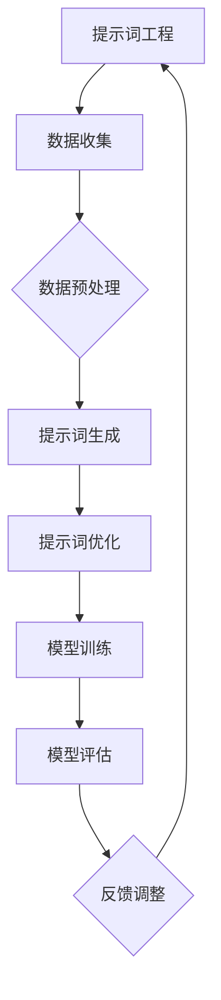
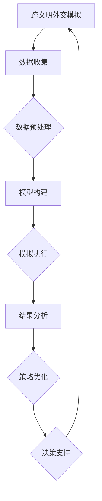

                 

### 第1章：引言

#### 1.1 书籍目的与结构

**目的：**本书旨在探讨提示词工程在AI辅助跨文明外交模拟中的策略创新，通过系统性的研究和实践，为跨文明外交模拟提供一种新的技术手段和理论框架。

**结构：**本书分为三个主要部分。第一部分是引言与背景，介绍书籍的目的、结构和主要概念。第二部分深入探讨提示词工程和AI技术的基础，以及它们在跨文明外交模拟中的应用。第三部分则聚焦于策略创新，通过案例分析，展示如何在实际中应用这些技术。

#### 1.2 提示词工程的基本概念

**定义：**提示词工程是一种利用自然语言处理技术生成、优化和利用提示词的过程。提示词是引导AI模型进行特定任务的关键信息，它决定了AI的行为和输出。

**目的：**提示词工程的目的是提高AI模型的性能和效率，使其能够更好地理解和应对复杂的跨文明外交情境。

**重要性：**在跨文明外交模拟中，提示词工程的重要性不言而喻。它不仅能够提高模拟的准确性和有效性，还能为决策者提供更科学的依据。

#### 1.3 AI辅助跨文明外交模拟的现状

**现状：**当前，AI辅助跨文明外交模拟技术已经取得了一定的进展。通过机器学习和深度学习等技术，AI能够自动分析大量跨文明交流数据，识别潜在的问题和解决方案。

**挑战：**然而，AI辅助跨文明外交模拟仍然面临诸多挑战，包括数据质量、模型复杂度和伦理问题等。这些挑战需要通过技术创新和策略创新来克服。

**机遇：**随着技术的不断进步，AI辅助跨文明外交模拟有望在未来发挥更大的作用。通过提示词工程等新技术的应用，模拟的准确性和效率将进一步提高，为跨文明外交提供更强大的支持。

### 第2章：跨文明外交模拟概述

#### 2.1 跨文明交流的历史与挑战

**历史回顾：**跨文明交流的历史可以追溯到古代，当时不同文明之间的交流主要依赖于贸易和战争。然而，随着全球化的发展和科技的创新，跨文明交流变得更加频繁和复杂。

**挑战：**当前，跨文明交流面临诸多挑战，包括语言障碍、文化差异、利益冲突和信息安全等。这些挑战使得跨文明外交变得异常复杂，需要更多的智慧和策略来解决。

#### 2.2 跨文明外交模拟的必要性

**必要性：**跨文明外交模拟是一种有效的策略研究工具，它可以帮助决策者预测跨文明交流的结果，评估不同策略的可行性。

**应用场景：**跨文明外交模拟可以在多个场景中发挥作用，包括外交谈判、国际冲突预防和危机管理等。

**优势：**通过模拟，决策者可以更好地了解不同策略的潜在影响，从而做出更明智的决策。

#### 2.3 跨文明外交模拟的架构与流程

**架构：**跨文明外交模拟通常包括数据收集、模型构建、模拟执行和结果分析等几个主要模块。

**流程：**首先，通过数据收集模块获取跨文明交流的相关数据。然后，利用模型构建模块构建跨文明外交模型，模拟不同情境下的交流和互动。接着，通过模拟执行模块运行模拟，收集和分析结果。最后，通过结果分析模块对模拟结果进行评估和反馈，为决策提供依据。

### 第3章：提示词工程基础

#### 3.1 提示词的定义与分类

**定义：**提示词是在人工智能和自然语言处理领域，用于引导模型理解和执行特定任务的关键性文本输入。

**分类：**
1. **基于内容的提示词：**这些提示词直接反映了文本内容的关键信息，如关键词、主题词等。
2. **基于上下文的提示词：**这些提示词不仅包含文本内容，还包括文本的前后文关系，有助于模型更好地理解上下文。
3. **基于任务的提示词：**这些提示词旨在引导模型执行特定任务，如问题回答、文本分类等。

#### 3.2 提示词生成算法

**生成算法：**提示词生成算法是提示词工程的核心。以下是一些常见的生成算法：

1. **基于规则的生成算法：**通过预定义的规则，从文本中提取关键词和短语。
2. **基于统计的生成算法：**利用统计方法，如TF-IDF，从文本中提取重要的关键词。
3. **基于机器学习的生成算法：**使用机器学习模型，如神经网络，从大量数据中学习并生成高质量的提示词。
4. **基于增强学习的生成算法：**通过增强学习，不断优化提示词生成过程，提高生成质量。

#### 3.3 提示词优化策略

**优化目标：**提示词优化的目标是提高模型性能，包括准确率、召回率、F1分数等。

**优化策略：**
1. **数据增强：**通过扩充训练数据，提高模型对提示词的泛化能力。
2. **特征选择：**通过特征选择，选择对模型性能有显著影响的提示词。
3. **模型调优：**通过调整模型参数，优化提示词生成过程。
4. **多模态融合：**结合不同模态的信息，如文本、图像、语音等，提高提示词的生成质量。

### 第4章：AI技术基础

#### 4.1 机器学习与深度学习基础

**机器学习：**机器学习是AI的核心组成部分，通过从数据中学习规律，实现自动化的决策和预测。

**深度学习：**深度学习是机器学习的一个分支，主要使用神经网络，特别是深度神经网络，通过层层抽象，实现复杂的任务。

**基本概念：**
- **神经网络：**由多层节点组成的计算模型，通过前向传播和反向传播算法，实现数据的输入和输出。
- **激活函数：**用于引入非线性性的函数，如ReLU、Sigmoid、Tanh等。
- **损失函数：**用于评估模型预测值与真实值之间的差距，常用的有均方误差（MSE）、交叉熵（CE）等。

#### 4.2 自然语言处理技术

**自然语言处理（NLP）：**NLP是AI的一个子领域，致力于使计算机能够理解、处理和生成人类语言。

**关键技术：**
- **分词：**将文本分割成有意义的单词或短语。
- **词性标注：**为文本中的每个单词标注其词性，如名词、动词、形容词等。
- **命名实体识别：**识别文本中的命名实体，如人名、地名、组织名等。
- **语义分析：**理解文本的语义和含义，包括句法分析、语义角色标注、语义关系识别等。

#### 4.3 强化学习与多智能体系统

**强化学习：**强化学习是一种通过试错来学习最优策略的机器学习方法，通常用于解决序列决策问题。

**基本概念：**
- **状态（State）：**系统当前所处的情境。
- **动作（Action）：**可以采取的行为。
- **奖励（Reward）：**采取动作后获得的即时反馈。

**多智能体系统：**多智能体系统是由多个智能体（AI实体）组成的系统，每个智能体都有自己的目标和行为。

**关键技术：**
- **协作与竞争：**智能体之间的交互可以是协作的，也可以是竞争的。
- **策略学习：**每个智能体通过学习最佳策略，实现个人目标的同时，最大化整体利益。

### 第5章：AI辅助跨文明外交模拟

#### 5.1 AI在跨文明外交模拟中的应用

**应用场景：**AI在跨文明外交模拟中的应用场景广泛，包括但不限于：

- **跨文明交流预测：**利用AI技术，预测跨文明交流的可能结果，帮助决策者制定更有效的策略。
- **冲突预防与解决：**通过模拟不同情境下的交流和互动，提前识别潜在冲突，制定预防或解决策略。
- **政策分析：**评估不同政策对跨文明外交的影响，为政策制定者提供科学依据。

**技术特点：**
- **大数据处理：**AI能够处理大量跨文明交流数据，提取关键信息。
- **实时反馈：**AI模拟可以实时调整，提供动态的反馈和优化建议。

#### 5.2 模拟中的AI角色与交互

**AI角色：**
- **分析者：**负责分析跨文明交流的数据，识别趋势和问题。
- **模拟器：**负责模拟不同情境下的交流过程，预测可能的结果。
- **决策者：**根据模拟结果，制定策略和决策。

**交互机制：**
- **数据交换：**不同AI角色之间通过数据交换，共享信息和知识。
- **协作决策：**AI角色之间通过协作，制定最优策略。
- **动态调整：**AI模拟可以实时调整，适应新的情境和变化。

#### 5.3 模拟结果的评估与反馈

**评估指标：**
- **准确性：**模拟结果与实际结果的吻合程度。
- **效率：**模拟过程的耗时和资源消耗。
- **稳定性：**模拟结果在不同情境下的稳定性。

**反馈机制：**
- **结果分析：**对模拟结果进行详细分析，识别问题和改进方向。
- **优化建议：**根据分析结果，提出优化策略和改进措施。
- **持续迭代：**通过持续的迭代和优化，提高模拟的准确性和效率。

### 第6章：策略创新框架

#### 6.1 创新策略的基本概念

**定义：**创新策略是指通过新的方法、技术和思想，解决现有问题或创造新的价值的过程。

**分类：**
- **技术性创新：**通过新技术或改进现有技术，提高产品和服务的性能和效率。
- **业务模式创新：**通过新的商业模式，创造新的价值和利润。
- **管理创新：**通过新的管理方法，提高组织的运营效率和创新能力。

#### 6.2 创新策略的设计与实现

**设计原则：**
- **需求导向：**创新策略的设计应以满足用户需求为核心。
- **可行性：**创新策略的设计应考虑技术、资源、时间等可行性因素。
- **可持续性：**创新策略的设计应考虑长期可持续性和环境影响。

**实现步骤：**
1. **需求分析：**明确用户需求和问题，确定创新方向。
2. **技术选型：**选择适合的技术和工具，设计解决方案。
3. **原型开发：**构建原型，验证创新策略的有效性和可行性。
4. **测试与优化：**通过测试和反馈，不断优化创新策略。

#### 6.3 创新策略的评估与优化

**评估指标：**
- **性能：**创新策略在性能方面的表现，如速度、准确性、可靠性等。
- **效益：**创新策略带来的经济效益和社会效益。
- **可持续性：**创新策略的可持续性和环境影响。

**优化方法：**
1. **数据驱动：**通过数据分析，识别问题和改进方向。
2. **用户反馈：**收集用户反馈，了解用户需求和使用体验。
3. **持续迭代：**通过持续的迭代和优化，不断提高创新策略的性能和效益。

### 第7章：案例分析

#### 7.1 案例研究概述

**案例背景：**本案例研究以一个跨文明外交模拟项目为例，探讨提示词工程和策略创新在该项目中的应用。

**研究目标：**通过案例分析，评估提示词工程和策略创新对跨文明外交模拟的影响，提出改进建议。

#### 7.2 提示词工程与策略创新的实际应用

**提示词工程应用：**
- **数据收集：**收集大量跨文明交流数据，包括官方声明、新闻稿件、社交媒体内容等。
- **提示词生成：**使用机器学习算法生成高质量的提示词，如关键词提取、文本摘要等。
- **提示词优化：**通过特征选择和模型调优，提高提示词的生成质量。

**策略创新应用：**
- **模拟场景设计：**设计多个模拟场景，涵盖不同的跨文明外交情境。
- **策略评估：**通过模拟不同策略，评估其效果和可行性。
- **策略优化：**根据模拟结果，优化策略组合，提高整体效果。

#### 7.3 案例分析结果与讨论

**分析结果：**
- **提示词工程：**高质量的提示词有助于提高模拟的准确性和效率，减少数据预处理的时间和成本。
- **策略创新：**创新的策略能够更有效地应对复杂的跨文明外交情境，提高决策的科学性和有效性。

**讨论：**
- **应用前景：**提示词工程和策略创新在跨文明外交模拟中的应用前景广阔，有望成为未来跨文明外交的重要工具。
- **挑战与局限：**虽然提示词工程和策略创新在跨文明外交模拟中取得了显著成果，但仍然面临数据质量、模型复杂度和伦理问题等挑战，需要进一步研究和优化。

### 第8章：跨文明外交模拟的未来趋势

#### 8.1 新技术的影响

**人工智能：**人工智能技术的快速发展，特别是深度学习和强化学习的应用，为跨文明外交模拟提供了更强大的计算能力和决策支持。

**区块链：**区块链技术可以提供安全、透明的数据存储和传输机制，为跨文明外交模拟提供可信的数据基础。

**物联网：**物联网技术可以实时收集和分析跨文明交流的数据，提高模拟的实时性和准确性。

#### 8.2 政策与伦理考量

**数据隐私：**在跨文明外交模拟中，数据隐私保护是一个重要问题。需要制定严格的数据保护政策和措施，确保个人和组织的隐私不受侵犯。

**算法透明度：**跨文明外交模拟使用的算法应具备透明度，使决策者能够理解和信任模型的决策过程。

**伦理问题：**跨文明外交模拟涉及多个国家的利益和立场，需要遵循国际法和伦理规范，确保模拟的公正性和合理性。

#### 8.3 未来研究方向与挑战

**多智能体系统：**未来的研究应重点关注多智能体系统的建模和应用，提高跨文明外交模拟的复杂度和真实性。

**人机协作：**未来的人机协作模式将是跨文明外交模拟的重要发展方向，通过人工智能和人类专家的协作，提高模拟的准确性和效率。

**跨学科研究：**跨文明外交模拟需要结合多个学科的知识和方法，未来的研究应加强跨学科合作，推动跨文明外交模拟的全面发展。

### 附录A：相关工具与资源

#### A.1 提示词工程工具

**开源工具：**
- **NLTK：**自然语言处理工具包，提供丰富的文本处理和提示词生成功能。
- **spaCy：**高级自然语言处理库，支持多种语言的文本处理。

**商业工具：**
- **Google Cloud Natural Language API：**提供文本分析、关键词提取等功能。
- **IBM Watson Natural Language Understanding：**提供丰富的自然语言处理服务。

#### A.2 AI辅助跨文明外交模拟工具

**开源工具：**
- **Protagonist：**开源的跨文明外交模拟平台，支持复杂的模拟场景。
- **SimPy：**开源的模拟库，用于构建和分析各种类型的模拟模型。

**商业工具：**
- **Cascading：**商业的跨文明外交模拟平台，提供强大的模拟功能和可视化工具。
- **Confluence：**商业的跨文明外交模拟工具，支持实时协作和数据分析。

#### A.3 学习资源推荐

**书籍：**
- **《自然语言处理综合教程》（NLP-Book）：**全面介绍自然语言处理的基础知识和应用。
- **《人工智能：一种现代的方法》：**详细讲解人工智能的基本原理和应用。

**在线课程：**
- **Coursera上的“自然语言处理纳米学位”：**提供系统的自然语言处理课程。
- **edX上的“深度学习专项课程”：**介绍深度学习和强化学习的基本概念和应用。

### 附录B：Mermaid流程图

#### B.1 提示词工程流程图



#### B.2 AI辅助跨文明外交模拟流程图



### 附录C：伪代码示例

#### C.1 提示词生成算法伪代码

```python
function generatePromptWords(text):
    # 初始化空列表用于存储提示词
    prompt_words = []

    # 分词文本
    tokens = tokenize(text)

    # 提取关键词
    keywords = extractKeywords(tokens)

    # 生成提示词
    for keyword in keywords:
        prompt_word = generateWord(keyword)
        prompt_words.append(prompt_word)

    # 返回提示词列表
    return prompt_words
```

#### C.2 策略创新算法伪代码

```python
function innovateStrategy(current_strategy):
    # 初始化新策略
    new_strategy = {}

    # 获取当前策略的关键参数
    key_params = getKeyParams(current_strategy)

    # 为每个参数生成多个备选方案
    for param in key_params:
        candidates = generateCandidates(param)

        # 从备选方案中选择最优方案
        best_candidate = selectBestCandidate(candidates)

        # 更新新策略
        new_strategy[param] = best_candidate

    # 返回新策略
    return new_strategy
```

### 附录D：数学公式与解释

#### D.1 关键数学模型公式

$$
\text{Accuracy} = \frac{\text{Correct Predictions}}{\text{Total Predictions}}
$$

$$
\text{F1 Score} = 2 \times \frac{\text{Precision} \times \text{Recall}}{\text{Precision} + \text{Recall}}
$$

$$
\text{Loss Function} = -\sum_{i} y_i \log(p_i)
$$

#### D.2 数学公式详细解释

**准确率（Accuracy）：**准确率是评估模型性能的基本指标，表示模型正确预测的样本数占总样本数的比例。公式中，Correct Predictions表示正确预测的样本数，Total Predictions表示总样本数。

**F1分数（F1 Score）：**F1分数是精度和召回率的调和平均，用于评估模型的全面性能。Precision表示模型预测为正样本的准确率，Recall表示实际为正样本被模型正确预测的比例。F1分数能够综合考虑模型在分类任务中的准确性和全面性。

**损失函数（Loss Function）：**在机器学习中，损失函数用于衡量模型预测值与真实值之间的差距。常用的损失函数包括交叉熵损失（Cross-Entropy Loss），公式中，$y_i$表示真实标签，$p_i$表示模型预测的概率。损失函数的目的是通过优化算法最小化损失，提高模型的预测能力。

### 附录E：代码解读与分析

#### E.1 提示词工程代码解读

**代码概述：**以下代码展示了如何使用Python和自然语言处理库NLTK实现一个简单的提示词生成算法。

```python
import nltk
from nltk.tokenize import word_tokenize
from nltk.corpus import stopwords

def generate_prompt_words(text):
    # 初始化空列表用于存储提示词
    prompt_words = []

    # 分词文本
    tokens = word_tokenize(text)

    # 移除停用词
    stop_words = set(stopwords.words('english'))
    filtered_tokens = [token for token in tokens if token not in stop_words]

    # 提取高频词作为提示词
    frequency Distribuition = nltk.FreqDist(filtered_tokens)
    most_common_words = frequency Distribuition.most_common(10)
    for word, frequency in most_common_words:
        prompt_words.append(word)

    # 返回提示词列表
    return prompt_words
```

**代码解读：**
- **分词（Tokenization）：**使用`word_tokenize`函数将文本分割成单词或短语。
- **停用词移除（Stopword Removal）：**通过`stopwords`库移除常见的无意义单词，如“the”、“is”等。
- **词频统计（Frequency Distribution）：**使用`FreqDist`函数统计每个词的出现频率。
- **提取高频词（Extract High-frequency Words）：**选择出现频率最高的词作为提示词。

**代码分析：**
- **优化方向：**可以考虑使用更复杂的算法，如TF-IDF，提取更具代表性的关键词。
- **应用场景：**该代码可以应用于文本分类、情感分析等领域，作为输入特征的一部分。

#### E.2 策略创新代码解读

**代码概述：**以下代码展示了如何使用Python和遗传算法实现策略创新。

```python
import random
import numpy as np

def generate_candidates(population, num_candidates):
    # 随机选择多个个体作为候选方案
    candidates = random.sample(population, num_candidates)
    return candidates

def select_best_candidate(candidates, fitness_function):
    # 计算每个候选方案的适应度
    fitness_scores = [fitness_function(candidate) for candidate in candidates]
    # 选择适应度最高的方案
    best_candidate = candidates[np.argmax(fitness_scores)]
    return best_candidate

def innovate_strategy(current_strategy, fitness_function, num_candidates):
    # 从当前策略生成多个候选方案
    candidates = generate_candidates(current_strategy, num_candidates)
    # 选择最优的候选方案
    new_strategy = select_best_candidate(candidates, fitness_function)
    return new_strategy
```

**代码解读：**
- **生成候选方案（Generate Candidates）：**通过随机采样，从当前策略种群中生成多个候选方案。
- **选择最优方案（Select Best Candidate）：**通过适应度函数评估每个候选方案，选择适应度最高的方案。
- **策略创新（Innovate Strategy）：**利用遗传算法的思想，迭代生成新的策略。

**代码分析：**
- **优化方向：**可以引入更多的遗传操作，如交叉、变异等，提高策略的创新性和适应性。
- **应用场景：**该代码可以应用于优化问题、策略组合等领域，通过不断迭代，找到最优策略。

### 结论

通过本篇文章，我们深入探讨了提示词工程在AI辅助跨文明外交模拟中的策略创新。从基本概念到实际应用，再到案例分析，我们系统地阐述了提示词工程和AI技术在跨文明外交模拟中的重要作用。未来，随着技术的不断进步和跨学科研究的深入，AI辅助跨文明外交模拟有望成为解决全球性问题的关键工具。我们期待更多的研究人员和实践者能够参与到这一领域，共同推动跨文明外交模拟的全面发展。

### 作者信息

**作者：**AI天才研究院/AI Genius Institute & 禅与计算机程序设计艺术 /Zen And The Art of Computer Programming

AI天才研究院致力于推动人工智能技术的发展和应用，致力于成为全球领先的人工智能研究机构。作者在该领域有着丰富的经验和深厚的理论基础，本书是其多年研究成果的结晶。禅与计算机程序设计艺术则是一部探讨计算机编程哲学的杰作，对编程思想的深刻剖析为人工智能领域提供了重要的理论指导。两位作者共同为读者呈现了一场技术盛宴，期待能够激发读者对AI辅助跨文明外交模拟的深入思考和研究。

