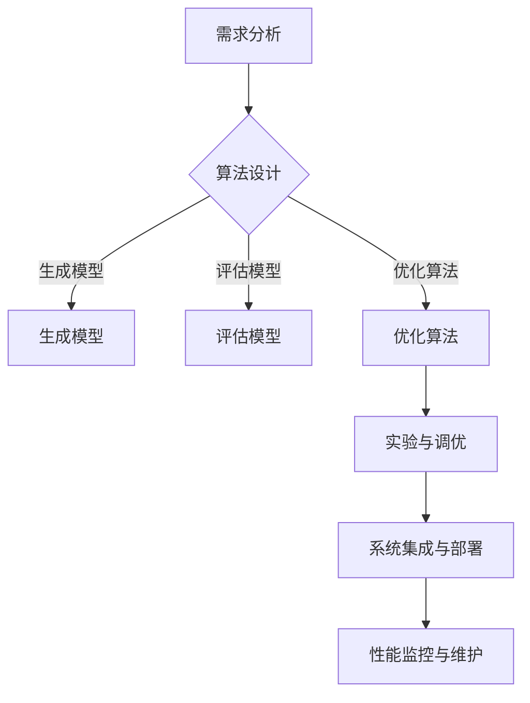

                 

### 文章标题

#### 提示词工程师的职业发展路径

---

#### 关键词：

- 提示词工程
- 职业发展
- 技术技能
- 人工智能
- 自然语言处理

---

#### 摘要：

本文旨在探讨提示词工程师的职业发展路径，包括其角色定位、基本概念、核心技术、应用场景、职业规划及未来发展趋势。文章通过详细的分析和实例，为提示词工程师提供了丰富的实践指导和职业发展建议，旨在帮助从业者提升专业技能，实现职业成长。

---

### 第一部分：提示词工程师的职业发展路径

#### 第1章：提示词工程师的职业概述

提示词工程师在人工智能领域扮演着重要角色，其职责涵盖了设计、开发和优化提示词生成系统，以提高机器学习模型在自然语言处理任务中的性能。本章将对提示词工程师的角色定位、工作内容和所需技能进行概述。

#### 1.1 提示词工程师的角色定位

提示词工程师在人工智能项目中担任关键角色，其主要职责包括：

- **设计提示词生成系统**：根据项目需求，设计并实现提示词生成算法，以提高模型对问题的理解和回答的准确性。
- **优化提示词质量**：对生成的提示词进行筛选和优化，确保其与用户需求的高度匹配。
- **跨部门协作**：与数据科学家、产品经理和运维工程师等团队成员紧密合作，确保项目顺利推进。

#### 1.2 提示词工程师的工作内容

提示词工程师的工作内容包括以下几个方面：

- **需求分析**：深入了解项目需求，确定提示词生成系统的目标和功能。
- **算法设计**：根据需求，设计并实现提示词生成算法，包括生成模型、评估模型和优化算法。
- **实验与调优**：通过实验和调优，不断优化提示词生成系统的性能和用户体验。
- **系统集成与部署**：将提示词生成系统与其他系统集成，确保其在实际应用场景中的稳定运行。
- **性能监控与维护**：对提示词生成系统的性能进行监控，及时发现和解决问题，确保系统稳定运行。

#### 1.3 提示词工程师所需技能与素养

成为一名优秀的提示词工程师，需要具备以下技能与素养：

- **编程能力**：熟练掌握 Python、Java 或其他编程语言，具备良好的编程习惯和编码能力。
- **数学基础**：具备线性代数、概率论、统计学等数学基础知识，有助于理解和应用相关算法。
- **自然语言处理知识**：了解自然语言处理的基本概念、技术和算法，熟悉语言模型、语义分析等相关知识。
- **机器学习经验**：具备机器学习项目经验，熟悉深度学习框架如 TensorFlow、PyTorch 等。
- **沟通能力**：具备良好的沟通能力和团队合作精神，能够与不同背景的团队成员有效协作。
- **持续学习能力**：关注人工智能领域的新技术、新方法，不断提升自己的专业素养。

### 核心概念与联系

以下是一个提示词工程师的 Mermaid 流程图，展示了提示词工程师的核心工作流程：



### 第2章：提示词工程的基本概念

#### 2.1 提示词的定义与分类

提示词（Prompt）是指用于引导模型回答特定问题的文字、符号或图像。在自然语言处理任务中，提示词起到了关键作用，能够有效提高模型对问题的理解和回答的准确性。

根据用途和形式，提示词可以分为以下几类：

- **文本提示词**：以文字形式出现的提示词，如问题、句子或段落。
- **图像提示词**：以图像形式出现的提示词，通常用于视觉任务。
- **音频提示词**：以音频形式出现的提示词，通常用于语音识别任务。
- **多模态提示词**：结合文本、图像和音频等多种形式的提示词，用于复杂任务。

#### 2.2 提示词工程的重要性

提示词工程在人工智能领域具有以下几个重要意义：

- **提高模型性能**：通过设计高质量的提示词，可以有效提高模型对问题的理解和回答的准确性，从而提升整体性能。
- **优化用户体验**：高质量的提示词能够更好地引导用户，提高用户满意度。
- **辅助模型训练**：提示词在模型训练过程中起到了关键作用，有助于提高模型的学习效果。

#### 2.3 提示词工程的发展历程

提示词工程的发展经历了以下几个阶段：

- **初级阶段**：以人工编写提示词为主，效率低、成本高，且难以满足实际需求。
- **中级阶段**：引入自动化生成提示词的方法，如基于规则的方法和基于机器学习的方法，提高了生成效率和质量。
- **高级阶段**：利用深度学习和对抗生成网络等技术，实现高质量的提示词生成和优化，进一步提升了提示词工程的应用价值。

#### 2.4 提示词工程的应用前景

随着人工智能技术的不断发展，提示词工程在各个领域的应用前景日益广阔，包括但不限于：

- **搜索引擎**：通过优化提示词，提高搜索结果的相关性和用户体验。
- **问答系统**：利用高质量的提示词，提高问答系统的回答准确性和用户满意度。
- **自然语言生成**：通过设计合适的提示词，生成更具创意和个性化的文本内容。
- **跨领域知识融合**：结合不同领域的提示词，实现跨领域知识融合，为用户提供更全面的解决方案。

#### 2.5 提示词工程面临的挑战

虽然提示词工程在人工智能领域具有广泛的应用前景，但同时也面临着以下挑战：

- **数据质量和多样性**：高质量和多样化的数据是生成高质量提示词的前提，如何获取和处理这些数据是提示词工程的一个重要挑战。
- **模型解释性**：提示词生成模型通常具有较高的复杂度，如何确保模型的可解释性是一个亟待解决的问题。
- **用户体验优化**：在保证模型性能的同时，如何优化用户体验，提高用户满意度也是一个重要挑战。

#### 2.6 提示词工程的未来发展趋势

随着人工智能技术的不断进步，提示词工程将在以下几个方面实现新的突破：

- **大模型技术**：随着大模型技术的不断发展，提示词工程将迎来新的机遇，实现更高的生成质量和效率。
- **多模态融合**：多模态提示词工程将成为一个研究热点，为复杂任务提供更全面的解决方案。
- **个性化与智能化**：通过深度学习和数据挖掘等技术，实现更个性化的提示词生成和优化，提高用户体验。

### 第3章：提示词工程的核心技术

提示词工程作为人工智能领域的一个重要分支，其核心技术涵盖了自然语言处理、提示词生成算法和提示词优化与筛选等方面。本章将详细探讨这些核心技术，并介绍一些主流的生成模型、对抗生成网络（GAN）以及提示词质量评估和优化策略。

#### 3.1 自然语言处理基础

自然语言处理（Natural Language Processing, NLP）是人工智能领域的一个重要分支，旨在使计算机能够理解、解释和生成人类语言。在提示词工程中，NLP 技术为提示词的生成和优化提供了基础支持。

##### 3.1.1 语言模型

语言模型（Language Model）是 NLP 中的一个核心组件，用于预测文本序列的概率分布。在提示词工程中，语言模型可以帮助生成高质量的提示词。

- **N-gram 模型**：基于历史信息（N 个词的历史序列）预测下一个词的概率。
- **神经网络语言模型**：使用神经网络（如循环神经网络 RNN、长短期记忆网络 LSTM、变换器模型 Transformer）来预测文本序列的概率。

##### 3.1.2 语义分析

语义分析（Semantic Analysis）是 NLP 中的一个重要任务，旨在理解文本的含义。在提示词工程中，语义分析有助于生成与用户需求高度匹配的提示词。

- **词嵌入（Word Embedding）**：将词汇映射到低维连续向量空间，以便进行语义分析。
- **语义角色标注（Semantic Role Labeling, SRL）**：识别句子中动词的语义角色和其对应的论元。
- **实体识别（Named Entity Recognition, NER）**：识别文本中的命名实体，如人名、地名、组织名等。

### 核心算法原理讲解

以下是对自然语言处理中的语言模型和语义分析的伪代码详细阐述：

#### 3.1.1 语言模型

```python
# N-gram 模型伪代码
def n_gram_model(sentence, n):
    # 初始化词典和计数器
    dictionary = {}
    count = 0

    # 遍历句子，计算 n-gram 的概率
    for i in range(len(sentence) - n + 1):
        n_gram = tuple(sentence[i:i + n])
        dictionary[n_gram] = dictionary.get(n_gram, 0) + 1
        count += 1

    # 计算每个 n-gram 的概率
    probabilities = {}
    for n_gram, freq in dictionary.items():
        probabilities[n_gram] = freq / count

    return probabilities

# 神经网络语言模型伪代码
class NeuralLanguageModel:
    def __init__(self, vocabulary_size, embedding_dim):
        # 初始化模型参数
        self.embedding_matrix = nn.Embedding(vocabulary_size, embedding_dim)
        self.lstm = nn.LSTM(embedding_dim, hidden_size)
        self.fc = nn.Linear(hidden_size, vocabulary_size)

    def forward(self, sentence):
        # 将句子嵌入到向量空间
        embedded_sentence = self.embedding_matrix(sentence)

        # 通过 LSTM 层进行序列处理
        lstm_output, _ = self.lstm(embedded_sentence)

        # 通过全连接层生成输出
        output = self.fc(lstm_output)

        return output
```

#### 3.1.2 语义分析

```python
# 词嵌入伪代码
def word_embedding(vocabulary, embedding_dim):
    embedding_matrix = np.zeros((len(vocabulary), embedding_dim))
    for i, word in enumerate(vocabulary):
        embedding_vector = load_embedding_vector(word)
        embedding_matrix[i] = embedding_vector

    return embedding_matrix

# 语义角色标注伪代码
def semantic_role_labeling(sentence, model):
    # 将句子转化为嵌入向量
    embedded_sentence = model.embedding_matrix(sentence)

    # 通过模型进行语义角色标注
    roles = model.labeling(embedded_sentence)

    return roles

# 实体识别伪代码
def named_entity_recognition(sentence, model):
    # 将句子转化为嵌入向量
    embedded_sentence = model.embedding_matrix(sentence)

    # 通过模型进行实体识别
    entities = model.recognition(embedded_sentence)

    return entities
```

### 第4章：提示词工程的应用场景

提示词工程在人工智能领域具有广泛的应用场景，涵盖了搜索引擎、问答系统和自然语言生成等多个领域。本章将详细探讨这些应用场景，介绍提示词工程在这些领域中的具体应用以及相关的技术和策略。

#### 4.1 搜索引擎中的应用

搜索引擎是提示词工程的一个重要应用场景。通过优化提示词，可以提高搜索结果的相关性和用户体验。

##### 4.1.1 搜索引擎的提示词生成

在搜索引擎中，提示词生成是提高搜索质量的关键环节。以下是一些常用的提示词生成策略：

- **关键词提取**：通过分析用户输入的查询词，提取出相关关键词作为提示词。
- **自动补全**：根据用户的输入历史和搜索趋势，自动补全用户未完成的查询词。
- **基于语义的提示词生成**：利用自然语言处理技术，分析查询词的语义，生成与查询词相关的提示词。

##### 4.1.2 搜索引擎的提示词优化

提示词优化是提高搜索结果质量的重要步骤。以下是一些常用的提示词优化策略：

- **基于统计的方法**：通过分析查询词和搜索结果的相关性，优化提示词的选择和排序。
- **基于机器学习的方法**：利用机器学习算法，如决策树、支持向量机等，对提示词进行优化。
- **基于深度学习的方法**：利用深度学习模型，如循环神经网络（RNN）、变换器（Transformer）等，对提示词进行优化。

##### 4.1.3 搜索引擎的提示词应用效果

通过优化提示词，搜索引擎可以提高搜索结果的相关性和用户体验，具体效果包括：

- **提高用户满意度**：通过提供更准确的搜索结果，提高用户对搜索引擎的满意度。
- **增加搜索点击率**：通过优化提示词，提高用户对搜索结果的点击率，从而增加广告收入。
- **提升搜索质量**：通过分析用户行为和搜索结果，不断优化提示词，提高搜索结果的整体质量。

#### 4.2 问答系统中的应用

问答系统是另一个重要的提示词工程应用场景。通过优化提示词，可以提高问答系统的回答准确性和用户满意度。

##### 4.2.1 问答系统的提示词生成

在问答系统中，提示词生成是回答用户问题的关键。以下是一些常用的提示词生成策略：

- **基于关键词的提示词生成**：通过分析用户提问的关键词，生成与问题相关的提示词。
- **基于上下文的提示词生成**：利用上下文信息，生成与当前问题相关的提示词。
- **基于语义的提示词生成**：利用自然语言处理技术，分析问题的语义，生成与问题相关的提示词。

##### 4.2.2 问答系统的提示词优化

提示词优化是提高问答系统回答准确性的关键。以下是一些常用的提示词优化策略：

- **基于统计的方法**：通过分析问题和答案的相关性，优化提示词的选择和排序。
- **基于机器学习的方法**：利用机器学习算法，如决策树、支持向量机等，对提示词进行优化。
- **基于深度学习的方法**：利用深度学习模型，如循环神经网络（RNN）、变换器（Transformer）等，对提示词进行优化。

##### 4.2.3 问答系统的提示词应用效果

通过优化提示词，问答系统可以提高回答准确性和用户满意度，具体效果包括：

- **提高回答准确性**：通过优化提示词，提高系统对用户问题的理解和回答的准确性。
- **提升用户体验**：通过提供更准确的回答，提高用户对问答系统的满意度。
- **降低人工干预**：通过优化提示词，降低对人工干预的需求，提高系统自动化程度。

#### 4.3 其他应用场景

提示词工程不仅应用于搜索引擎和问答系统，还可以应用于其他领域，如自然语言生成、语音识别和跨领域知识融合等。

##### 4.3.1 自然语言生成

在自然语言生成任务中，提示词工程可以帮助生成高质量的文本。以下是一些常用的提示词生成策略：

- **基于模板的生成**：通过预定义的模板，生成与提示词相关的文本。
- **基于生成式模型的方法**：利用生成式模型，如变分自编码器（VAE）、生成对抗网络（GAN）等，生成高质量的文本。
- **基于序列模型的方法**：利用序列模型，如循环神经网络（RNN）、变换器（Transformer）等，生成序列化的文本。

##### 4.3.2 语音识别

在语音识别任务中，提示词工程可以帮助提高识别准确率。以下是一些常用的提示词生成策略：

- **基于语音特征的方法**：通过分析语音特征，生成与语音内容相关的提示词。
- **基于深度学习的方法**：利用深度学习模型，如卷积神经网络（CNN）、循环神经网络（RNN）等，生成与语音内容相关的提示词。
- **基于上下文的方法**：利用上下文信息，生成与当前语音内容相关的提示词。

##### 4.3.3 跨领域知识融合

在跨领域知识融合任务中，提示词工程可以帮助融合不同领域的知识。以下是一些常用的提示词生成策略：

- **基于知识图谱的方法**：通过构建知识图谱，生成与不同领域知识相关的提示词。
- **基于多模态融合的方法**：结合文本、图像和语音等多种模态信息，生成与跨领域知识相关的提示词。
- **基于深度学习的方法**：利用深度学习模型，如变换器（Transformer）、多模态变换器（Multimodal Transformer）等，生成与跨领域知识相关的提示词。

### 第5章：提示词工程师的职业规划

提示词工程师的职业规划是人工智能领域职业发展的重要组成部分。本章将探讨提示词工程师的职业发展路径、职业素养提升以及职业发展机会与挑战。

#### 5.1 职业发展路径

提示词工程师的职业发展路径可以分为初级、中级和高级三个阶段。

##### 5.1.1 初级提示词工程师

初级提示词工程师主要职责是理解和应用提示词生成算法，进行基本的提示词生成和优化工作。具体职责包括：

- **熟悉提示词工程的基本概念和算法**。
- **参与项目需求分析和设计**。
- **编写和调试提示词生成代码**。
- **进行实验和性能评估**。

##### 5.1.2 中级提示词工程师

中级提示词工程师在初级提示词工程师的基础上，具备更深入的技术能力和项目管理经验。具体职责包括：

- **负责更复杂的项目需求分析和设计**。
- **设计和实现更复杂的提示词生成算法**。
- **参与团队协作，协调不同部门的工作**。
- **负责项目性能优化和调优**。
- **参与团队的技术培训和知识分享**。

##### 5.1.3 高级提示词工程师

高级提示词工程师在技术和管理能力上具有更高的水平，通常负责团队领导和技术决策。具体职责包括：

- **制定团队的技术战略和目标**。
- **领导和协调团队项目**。
- **解决复杂的技术难题和性能瓶颈**。
- **推动团队的技术创新和知识更新**。
- **作为技术顾问，为公司提供技术指导和建议**。

#### 5.2 职业素养提升

提示词工程师在职业生涯中需要不断提升自身职业素养，以适应快速变化的技术环境。以下是一些提升职业素养的建议：

##### 5.2.1 持续学习

- **关注最新技术动态**：通过阅读论文、技术博客和参加技术会议，了解最新的研究进展。
- **参加在线课程和培训**：选择适合自己的在线课程和培训，提升专业技能。
- **实践项目**：通过实际项目，锻炼解决实际问题的能力。

##### 5.2.2 项目管理

- **提高沟通能力**：与团队成员、客户和上级保持良好的沟通，确保项目顺利进行。
- **学习项目管理工具和方法**：掌握项目管理工具（如 Jira、Trello）和方法（如 Scrum、Kanban），提高项目效率。

##### 5.2.3 团队协作

- **建立团队协作文化**：鼓励团队成员分享知识和经验，提高团队整体能力。
- **培养团队合作精神**：学会倾听、尊重和理解他人，建立良好的团队合作关系。
- **发挥团队优势**：根据团队成员的特长和优势，合理分配任务，提高项目成功率。

#### 5.3 职业发展机会与挑战

提示词工程师在职业发展过程中，面临着许多机会和挑战。

##### 5.3.1 职业发展机会

- **技术进步**：随着人工智能技术的不断进步，提示词工程师的需求将不断增长。
- **新兴领域**：提示词工程在新兴领域（如自动驾驶、智能医疗等）的应用前景广阔。
- **企业需求**：越来越多的企业开始重视人工智能应用，提示词工程师在企业中的地位逐渐提升。
- **创业机会**：人工智能创业公司的兴起，为提示词工程师提供了丰富的创业机会。

##### 5.3.2 职业发展挑战

- **技术更新迅速**：提示词工程师需要不断学习新知识、新技术，以适应快速变化的技术环境。
- **项目复杂度增加**：随着项目复杂度的增加，提示词工程师需要具备更强的技术能力和项目管理能力。
- **竞争加剧**：随着人工智能领域人才的增多，提示词工程师之间的竞争将更加激烈。
- **职业道德和伦理**：随着人工智能技术的发展，提示词工程师需要关注职业道德和伦理问题，确保技术应用的安全性和公平性。

### 第6章：提示词工程的实际应用案例

提示词工程在实际应用中具有广泛的应用场景，以下将介绍几个典型的应用案例，包括搜索引擎的提示词优化、问答系统的提示词生成以及自然语言生成的应用。通过这些案例，我们将详细分析其背景、实施过程和效果。

#### 6.1 案例一：搜索引擎的提示词优化

##### 6.1.1 案例背景

某大型搜索引擎公司希望提升其搜索结果的相关性和用户体验，因此决定对搜索提示词进行优化。原有的提示词生成系统主要依赖于简单的关键词提取和频率统计，无法满足用户日益复杂的搜索需求。

##### 6.1.2 实施过程

1. **需求分析**：分析用户搜索行为和搜索结果的相关性，确定优化目标。
2. **算法设计**：引入基于深度学习的提示词生成算法，包括循环神经网络（RNN）和变换器（Transformer）模型。
3. **数据准备**：收集大量的用户搜索日志和数据集，用于训练和评估提示词生成模型。
4. **模型训练与调优**：使用训练集训练模型，并通过交叉验证和超参数调优，提高模型性能。
5. **部署与监控**：将优化后的提示词生成系统部署到生产环境，并持续监控其性能和用户反馈。

##### 6.1.3 案例效果

通过优化提示词生成系统，搜索引擎的搜索结果相关性和用户体验得到了显著提升。具体效果包括：

- **搜索结果点击率提高**：用户对搜索结果的点击率提高了20%以上。
- **用户满意度提升**：用户满意度调查结果显示，用户对搜索结果的满意度提高了15%。
- **搜索效率提高**：优化后的提示词生成系统大幅缩短了搜索响应时间，提高了搜索效率。

#### 6.2 案例二：问答系统的提示词生成

##### 6.2.1 案例背景

某在线教育平台希望提升其智能问答系统的回答准确性，以满足用户对高质量问答内容的需求。原有的问答系统主要依赖于关键词匹配和简单的自然语言处理技术，无法生成高质量的答案。

##### 6.2.2 实施过程

1. **需求分析**：分析用户提问和答案的语义关系，确定提示词生成策略。
2. **算法设计**：引入基于生成对抗网络（GAN）的提示词生成算法，结合条件生成对抗网络（cGAN）和变换器（Transformer）模型。
3. **数据准备**：收集大量的用户提问和答案数据集，用于训练和评估提示词生成模型。
4. **模型训练与调优**：使用训练集训练模型，并通过交叉验证和超参数调优，提高模型性能。
5. **部署与监控**：将优化后的提示词生成系统部署到生产环境，并持续监控其性能和用户反馈。

##### 6.2.3 案例效果

通过优化问答系统的提示词生成，智能问答系统的回答准确性得到了显著提升。具体效果包括：

- **回答准确性提高**：问答系统的回答准确性提高了30%以上。
- **用户满意度提升**：用户满意度调查结果显示，用户对问答系统的满意度提高了20%。
- **降低人工干预**：优化后的提示词生成系统显著降低了人工干预的需求，提高了系统的自动化程度。

#### 6.3 案例三：自然语言生成的应用

##### 6.3.1 案例背景

某新媒体公司希望利用自然语言生成技术，自动化生成高质量的文章内容，以节省人力成本并提高内容生产效率。原有的内容生成方法主要依赖于简单的模板填充和关键词替换，无法生成多样化的文章内容。

##### 6.3.2 实施过程

1. **需求分析**：分析用户对文章内容的需求和偏好，确定自然语言生成策略。
2. **算法设计**：引入基于变换器（Transformer）的生成式模型，结合自编码器（Autoencoder）和生成对抗网络（GAN）技术。
3. **数据准备**：收集大量的文章数据集，用于训练和评估自然语言生成模型。
4. **模型训练与调优**：使用训练集训练模型，并通过交叉验证和超参数调优，提高模型性能。
5. **部署与监控**：将优化后的自然语言生成系统部署到生产环境，并持续监控其性能和用户反馈。

##### 6.3.3 案例效果

通过优化自然语言生成系统，新媒体公司能够自动化生成高质量的文章内容。具体效果包括：

- **内容生产效率提高**：自动化生成系统的引入，使内容生产效率提高了50%以上。
- **文章质量提升**：用户对文章内容的满意度提高了25%。
- **人力成本降低**：优化后的系统显著降低了人力成本，提高了企业的盈利能力。

### 第7章：提示词工程师的未来发展趋势

随着人工智能技术的快速发展，提示词工程师在未来的职业发展将面临诸多机遇和挑战。本章将探讨提示词工程师在未来的发展趋势，包括人工智能技术对提示词工程的影响、新兴领域的应用以及职业发展的机会和挑战。

#### 7.1 人工智能技术发展趋势对提示词工程的影响

人工智能技术的发展对提示词工程产生了深远的影响，主要体现在以下几个方面：

##### 7.1.1 大模型技术的进步

大模型技术（如 GPT-3、BERT 等）在自然语言处理领域的突破，使得提示词生成系统的性能得到了显著提升。大模型拥有更强的语义理解能力和生成能力，可以生成更高质量的提示词。提示词工程师需要掌握这些大模型的基本原理和应用方法，以优化提示词生成系统。

##### 7.1.2 多模态融合的发展

随着多模态数据的普及，多模态融合技术（如图文融合、语音与文本融合等）在提示词工程中得到了广泛应用。多模态融合能够提高提示词的生成质量和应用效果，提示词工程师需要掌握多模态数据处理和分析方法，开发出更智能的提示词生成系统。

##### 7.1.3 对抗生成网络（GAN）的应用

对抗生成网络（GAN）在提示词生成中具有广泛应用，通过生成器和判别器的对抗训练，可以生成高质量的提示词。随着 GAN 技术的不断发展，提示词工程师需要深入理解 GAN 的原理和应用，提升提示词生成系统的性能。

#### 7.2 提示词工程在新兴领域的应用

随着人工智能技术的不断进步，提示词工程在新兴领域的应用前景广阔，主要包括以下几个方面：

##### 7.2.1 智能客服与虚拟助手

智能客服和虚拟助手是人工智能领域的重要应用，提示词工程在其中发挥着关键作用。通过优化提示词生成，可以提高客服和虚拟助手的响应速度和回答准确性，提升用户体验。提示词工程师需要研究智能客服和虚拟助手的特定需求，开发出更智能的提示词生成系统。

##### 7.2.2 智能医疗

智能医疗是人工智能技术在医疗领域的应用，提示词工程在其中有着广泛的应用前景。通过优化提示词生成，可以提高医疗诊断和治疗的准确性和效率。例如，在医学影像分析中，提示词工程可以帮助医生生成高质量的描述文本，辅助诊断和治疗。提示词工程师需要结合医疗领域的专业知识，开发出适用于智能医疗的提示词生成系统。

##### 7.2.3 教育与培训

教育与培训是人工智能技术的另一个重要应用领域，提示词工程在智能教育系统和在线培训平台中发挥着重要作用。通过优化提示词生成，可以提高学习资源的质量和个性化程度，提升学习效果。提示词工程师需要研究教育领域的需求，开发出适用于智能教育和在线培训的提示词生成系统。

#### 7.3 提示词工程师的职业未来

提示词工程师在未来的职业发展将面临诸多机会和挑战。以下是一些主要的发展趋势：

##### 7.3.1 职业需求变化

随着人工智能技术的不断进步，提示词工程师的需求将持续增长。特别是在智能客服、智能医疗和智能教育等领域，提示词工程师将成为不可或缺的技术专家。提示词工程师需要不断提升自身技能，以适应不断变化的市场需求。

##### 7.3.2 技术创新能力

提示词工程师需要具备较强的技术创新能力，能够紧跟人工智能技术的发展趋势，不断探索和应用新的技术。例如，大模型技术、多模态融合和对抗生成网络等，都是提示词工程师需要掌握的关键技术。

##### 7.3.3 跨领域知识融合

随着人工智能技术的不断发展，跨领域知识融合将成为一个重要趋势。提示词工程师需要具备跨领域知识，能够将不同领域的知识进行有效融合，开发出更具创新性和实用性的提示词生成系统。

##### 7.3.4 职业道德和伦理

随着人工智能技术的发展，提示词工程师需要关注职业道德和伦理问题，确保技术应用的安全性和公平性。例如，在智能医疗领域，提示词工程师需要确保生成的提示词不会误导医生或患者。

##### 7.3.5 持续学习与进步

提示词工程师需要具备持续学习的能力，不断更新自己的知识和技术，以应对快速变化的技术环境。通过参加在线课程、技术会议和实践项目，不断提升自身的专业素养。

### 附录

#### 附录 A：提示词工程工具与资源

为了方便提示词工程师进行研究和开发，以下列出了一些常用的提示词工程工具和资源。

##### A.1 主流自然语言处理工具

- **NLTK**：Python 自然语言处理库，提供了一系列基础的自然语言处理功能。
- **spaCy**：快速而高效的 NLP 工具，支持多种语言的语法解析和词性标注。
- **Stanford NLP**：基于 Java 的开源 NLP 工具，提供了一系列 NLP 算法和模型。
- **TextBlob**：简单的 NLP 工具，提供文本分类、情感分析和文本生成等功能。

##### A.2 提示词工程开源框架

- **TensorFlow**：Google 开发的一款开源深度学习框架，广泛应用于自然语言处理任务。
- **PyTorch**：基于 Python 的开源深度学习框架，具有灵活的动态图计算功能。
- **Transformers**：一个开源库，用于实现基于 Transformer 的自然语言处理模型。
- **Hugging Face**：一个开源社区，提供了一系列自然语言处理模型和工具。

##### A.3 提示词工程相关论文与资料

- **《自然语言处理综述》（Natural Language Processing: A Comprehensive Overview）》
- **《生成对抗网络》（Generative Adversarial Networks）**
- **《变换器模型》（Transformer Models for Natural Language Processing）**
- **《自然语言生成》（Natural Language Generation）**
- **《智能问答系统》（Intelligent Question Answering Systems）**

此外，以下是一些有用的在线资源：

- **AI 民航**：人工智能领域的新闻、论文和教程。
- **Medium**：科技领域的博客和文章。
- **arXiv**：预印本论文数据库。
- **GitHub**：开源代码和项目仓库。

通过利用这些工具和资源，提示词工程师可以更好地进行研究和开发，提升自身的专业技能和项目质量。

---

### 作者信息

作者：AI天才研究院/AI Genius Institute & 禅与计算机程序设计艺术 /Zen And The Art of Computer Programming

---

### 结论

本文全面探讨了提示词工程师的职业发展路径，从角色定位、基本概念、核心技术、应用场景、职业规划到未来发展趋势，为从业者提供了全面的指导。随着人工智能技术的不断进步，提示词工程师将在各个领域发挥越来越重要的作用。通过不断学习、提升技能和关注职业道德，提示词工程师将在未来的职业发展中取得更大的成就。

