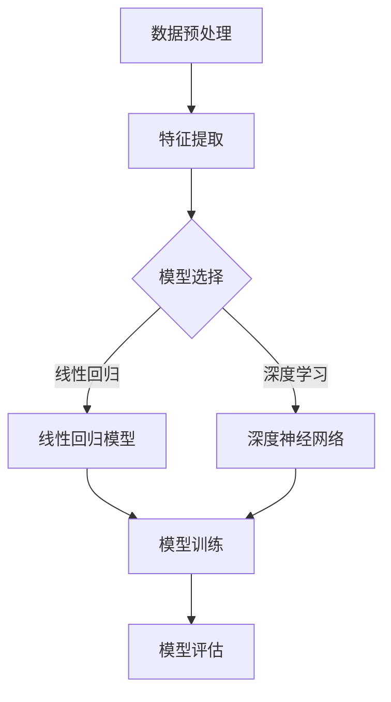

                 

### 《提示词的时间维度：指导AI进行历史和未来推测》

#### 关键词：人工智能，时间预测，提示词，算法，深度学习，模型优化，案例分析，挑战与展望

##### 摘要：

本文旨在探讨提示词在时间维度上对人工智能进行历史和未来推测的重要作用。文章首先介绍了人工智能与时间预测的关系，以及提示词的基本概念与作用。接着，详细阐述了时间预测的基本概念和方法，并分析了常见的算法及其原理。随后，文章聚焦于AI模型构建与优化，包括数据预处理、模型选择与训练、以及模型优化策略。通过历史和未来预测案例分析，本文进一步展示了时间预测在实际应用中的效果。最后，文章总结了时间预测的挑战和未来发展趋势，并对下一步研究方向提出了建议。

### 第一部分：引言

#### 1.1 研究背景与意义

##### 1.1.1 人工智能与时间预测的关系

随着人工智能技术的不断发展，时间预测在各个领域都得到了广泛应用。人工智能通过分析历史数据，学习时间序列的规律，从而实现对未来的预测。这种预测能力不仅为决策者提供了重要的参考信息，还为各行各业带来了巨大的价值。

##### 1.1.2 提示词在时间预测中的应用

提示词（Prompt）作为人工智能与用户之间的交互媒介，具有重要作用。在时间预测领域，提示词可以引导AI模型更好地理解用户的需求，提高预测的准确性和可靠性。通过优化提示词，可以提升AI模型在时间预测任务中的表现。

#### 1.2 书籍概述

##### 1.2.1 主要内容概述

本文将以书籍的形式，详细介绍时间预测领域的基本概念、算法、模型构建与优化，以及历史和未来预测案例分析。旨在为广大读者提供一套完整的时间预测学习体系。

##### 1.2.2 目标读者

本文主要面向人工智能、数据科学和计算机科学等相关领域的专业人士和研究人员。同时，也适合对时间预测感兴趣的大众读者。

### 第二部分：基础知识

#### 2.1 人工智能概述

##### 2.1.1 人工智能的基本概念

人工智能（Artificial Intelligence，简称AI）是指模拟、延伸和扩展人类智能的理论、方法、技术及应用。其核心目标是使计算机具备类似于人类的感知、学习、推理和决策能力。

##### 2.1.2 人工智能的发展历程

人工智能的研究始于20世纪50年代。随着计算机技术的快速发展，人工智能逐渐成为一门独立的学科，并取得了许多重要成果。近年来，深度学习、强化学习等新技术的兴起，为人工智能的发展带来了新的机遇。

##### 2.1.3 人工智能的核心技术

人工智能的核心技术包括：

- **机器学习**：通过训练模型，使计算机能够从数据中学习并作出预测。

- **深度学习**：一种基于多层神经网络的学习方法，能够自动提取数据特征。

- **强化学习**：通过奖励机制，使计算机在学习过程中不断优化行为策略。

#### 2.2 时间预测的基本概念

##### 2.2.1 时间的概念与维度

时间是一种客观存在的物理现象，通常用来描述事件发生的先后顺序和持续过程。在时间预测中，时间维度至关重要，它决定了预测的准确性和可靠性。

##### 2.2.2 时间预测的类型与方法

时间预测可分为定量预测和定性预测。定量预测主要针对数值型数据，通过建立数学模型进行预测。定性预测则主要关注分类和排序等非数值型数据。

常见的时间预测方法包括：

- **时间序列分析方法**：通过对历史数据的分析，找出时间序列的规律。

- **回归分析方法**：利用历史数据建立回归模型，预测未来的数值。

- **强化学习方法**：通过奖励机制，使模型不断优化预测策略。

- **深度学习方法**：利用深度神经网络，自动提取数据特征，实现时间预测。

##### 2.2.3 时间预测的应用领域

时间预测在许多领域具有广泛的应用，如：

- **金融市场**：预测股票价格、汇率等。

- **交通运输**：预测交通流量、航班延误等。

- **能源管理**：预测电力需求、可再生能源产量等。

#### 2.3 提示词的概念与作用

##### 2.3.1 提示词的定义与类型

提示词（Prompt）是指提供给AI模型的信息，用以引导模型理解任务需求、调整模型参数等。根据用途，提示词可分为以下几类：

- **任务提示词**：用于指示AI模型执行特定任务。

- **上下文提示词**：提供与任务相关的背景信息，有助于模型更好地理解任务。

- **参数提示词**：调整模型参数，优化模型性能。

##### 2.3.2 提示词在AI模型中的作用

提示词在AI模型中的作用包括：

- **提高模型性能**：通过优化提示词，使模型在特定任务上表现更好。

- **增强可解释性**：提示词有助于用户理解模型的工作原理。

- **降低模型复杂性**：通过减少提示词的数量，简化模型结构。

##### 2.3.3 提示词的优化与选择

提示词的优化与选择需要考虑以下因素：

- **任务需求**：根据任务特点，选择合适的提示词。

- **数据质量**：使用高质量的数据，提高提示词的有效性。

- **模型适应性**：考虑模型对不同提示词的适应性，优化提示词组合。

### 第三部分：时间预测算法

#### 3.1 时间序列分析方法

##### 3.1.1 时间序列分析的基本概念

时间序列分析是一种研究时间序列数据的统计方法，通过分析历史数据，找出时间序列的规律，实现对未来的预测。

##### 3.1.2 常见的时间序列分析方法

常见的时间序列分析方法包括：

- **移动平均法**：通过计算时间序列的移动平均值，消除短期波动。

- **指数平滑法**：对时间序列进行指数加权平均，强调近期数据的重要性。

- **自回归模型**：通过建立自回归方程，预测未来数据。

- **ARIMA模型**：结合自回归、差分和移动平均，构建复杂的时间序列模型。

##### 3.1.3 时间序列分析的步骤

时间序列分析的步骤包括：

1. **数据预处理**：对时间序列数据进行清洗和预处理。

2. **特征提取**：提取时间序列的关键特征，如趋势、季节性等。

3. **模型选择**：根据数据特点，选择合适的模型。

4. **模型训练与优化**：对模型进行训练和优化，提高预测准确性。

5. **预测与评估**：使用模型进行预测，并对预测结果进行评估。

#### 3.2 回归分析方法

##### 3.2.1 回归分析的基本概念

回归分析是一种研究因变量与自变量之间关系的方法。通过建立回归模型，可以预测因变量的值。

##### 3.2.2 常见的回归分析方法

常见的回归分析方法包括：

- **线性回归**：建立线性关系模型，预测因变量的值。

- **多项式回归**：建立多项式关系模型，预测因变量的值。

- **逻辑回归**：建立逻辑关系模型，用于分类问题。

##### 3.2.3 回归分析的步骤与伪代码

回归分析的步骤包括：

1. **数据预处理**：对数据进行清洗和预处理。

2. **特征选择**：选择影响因变量的关键特征。

3. **模型建立**：根据数据特点，建立回归模型。

4. **模型训练与优化**：对模型进行训练和优化，提高预测准确性。

5. **预测与评估**：使用模型进行预测，并对预测结果进行评估。

以下是一个线性回归模型的伪代码：

```
// 输入：特征矩阵X，标签向量y
// 输出：回归模型参数θ

// 初始化模型参数θ
θ = [0, 0, ..., 0]

// 设置迭代次数和步长
num_iterations = 1000
learning_rate = 0.01

// 梯度下降法迭代更新参数
for i = 1 to num_iterations do
    // 计算预测值
    y_pred = X * θ
    
    // 计算损失函数
    loss = (1 / 2) * (y - y_pred)' * (y - y_pred)
    
    // 计算梯度
    gradient = X' * (y - y_pred)
    
    // 更新参数
    θ = θ - learning_rate * gradient
end

return θ
```

#### 3.3 强化学习方法

##### 3.3.1 强化学习的基本概念

强化学习（Reinforcement Learning，简称RL）是一种通过与环境交互，学习最优策略的方法。在强化学习中，智能体通过接收奖励信号，不断调整行为策略，以实现长期最大化收益。

##### 3.3.2 常见的强化学习方法

常见的强化学习方法包括：

- **值函数方法**：通过学习值函数，预测在当前状态下采取某一动作的长期奖励。

- **策略梯度方法**：通过直接优化策略，使智能体在当前状态下采取最优动作。

- **深度强化学习方法**：将深度学习与强化学习相结合，提高智能体的学习能力和决策能力。

##### 3.3.3 强化学习的步骤与伪代码

强化学习的步骤包括：

1. **初始化**：初始化智能体、环境、策略和网络参数。

2. **交互**：智能体根据当前状态，选择动作，与环境进行交互。

3. **学习**：根据奖励信号，更新策略和网络参数。

4. **评估**：评估智能体的性能，调整学习策略。

以下是一个基于Q学习的强化学习算法的伪代码：

```
// 输入：状态集合S，动作集合A，学习率α，折扣因子γ
// 输出：Q值函数

// 初始化Q值函数
Q = [0, 0, ..., 0]

// 设置迭代次数
num_iterations = 1000

// 梯度下降法迭代更新Q值
for i = 1 to num_iterations do
    // 遍历所有状态和动作
    for state in S do
        for action in A do
            // 计算当前状态下的Q值
            Q[state, action] = R + γ * max(Q[next_state, a])

            // 更新Q值
            Q[state, action] = Q[state, action] - learning_rate * (Q[state, action] - target)

            // 更新目标值
            target = R + γ * max(Q[next_state, a])
        end
    end
end

return Q
```

#### 3.4 深度学习方法

##### 3.4.1 深度学习的基本概念

深度学习（Deep Learning，简称DL）是一种基于多层神经网络的学习方法。通过堆叠多层神经元，深度学习能够自动提取数据特征，实现复杂函数的近似。

##### 3.4.2 常见的深度学习方法

常见的深度学习方法包括：

- **卷积神经网络（CNN）**：通过卷积层、池化层和全连接层，实现图像识别和分类。

- **循环神经网络（RNN）**：通过循环结构，处理序列数据，如时间序列、文本等。

- **长短期记忆网络（LSTM）**：改进RNN，解决长短期依赖问题。

- **生成对抗网络（GAN）**：通过生成器和判别器之间的对抗训练，实现数据生成。

##### 3.4.3 深度学习的步骤与伪代码

深度学习的步骤包括：

1. **数据预处理**：对数据进行清洗、归一化和增强。

2. **模型构建**：设计神经网络结构，选择合适的激活函数、损失函数和优化器。

3. **模型训练**：通过前向传播和反向传播，更新模型参数。

4. **模型评估**：使用验证集和测试集评估模型性能。

5. **模型优化**：根据评估结果，调整模型参数和结构。

以下是一个基于CNN的图像分类模型的伪代码：

```
// 输入：训练数据集X_train，标签向量y_train
// 输出：分类模型

// 构建CNN模型
model = Conv2D(32, (3, 3), activation='relu', input_shape=(height, width, channels))
model = MaxPooling2D((2, 2))
model = Flatten()
model = Dense(128, activation='relu')
model = Dropout(0.5)
model = Dense(num_classes, activation='softmax')

// 编译模型
model.compile(optimizer='adam', loss='categorical_crossentropy', metrics=['accuracy'])

// 训练模型
model.fit(X_train, y_train, batch_size=batch_size, epochs=num_epochs, validation_split=0.2)

return model
```

### 第四部分：AI模型构建与优化

#### 4.1 数据预处理

##### 4.1.1 数据清洗

数据清洗是数据预处理的重要步骤，包括去除重复数据、填补缺失值、去除噪声等。通过数据清洗，可以提高数据质量，为后续分析奠定基础。

##### 4.1.2 特征提取

特征提取是从原始数据中提取有用的特征，用于训练和预测。常见的特征提取方法包括：

- **统计特征**：如均值、方差、标准差等。

- **文本特征**：如词频、词向量等。

- **图像特征**：如边缘、纹理、形状等。

##### 4.1.3 数据集划分

数据集划分是将数据集分为训练集、验证集和测试集，以评估模型的性能。常见的划分方法包括：

- **随机划分**：将数据随机分为三部分。

- **分层抽样**：根据不同类别，按比例划分数据集。

#### 4.2 模型选择与训练

##### 4.2.1 模型选择

模型选择是根据数据特点和任务需求，选择合适的算法和模型结构。常见的选择方法包括：

- **基于理论的模型选择**：根据数据特点，选择合适的理论模型。

- **基于实践的模型选择**：根据实际效果，选择表现较好的模型。

- **基于比较的模型选择**：通过对比不同模型的性能，选择最优模型。

##### 4.2.2 模型训练

模型训练是通过迭代更新模型参数，使模型在训练数据上表现更好。常见的训练方法包括：

- **批量训练**：每次更新模型参数时，使用整个训练数据。

- **小批量训练**：每次更新模型参数时，使用部分训练数据。

- **在线训练**：实时更新模型参数，适应动态变化的数据。

##### 4.2.3 模型评估

模型评估是使用验证集或测试集，评估模型的性能。常见的评估指标包括：

- **准确率**：预测正确的样本数占总样本数的比例。

- **召回率**：预测正确的样本数占实际正样本数的比例。

- **F1值**：综合考虑准确率和召回率的平衡。

#### 4.3 模型优化

##### 4.3.1 模型优化策略

模型优化策略是通过调整模型参数和结构，提高模型性能。常见的优化策略包括：

- **超参数调优**：调整学习率、正则化参数等。

- **模型融合**：将多个模型进行融合，提高预测准确性。

- **模型压缩**：减少模型参数数量，降低计算复杂度。

##### 4.3.2 超参数调优

超参数调优是通过调整模型超参数，提高模型性能。常见的调优方法包括：

- **网格搜索**：遍历所有可能的超参数组合，选择最优组合。

- **随机搜索**：在超参数空间中随机选择超参数组合。

- **贝叶斯优化**：基于历史数据，选择具有高潜力的超参数组合。

##### 4.3.3 模型压缩与加速

模型压缩与加速是降低模型计算复杂度，提高模型运行速度。常见的压缩与加速方法包括：

- **模型剪枝**：去除模型中无用或冗余的参数。

- **量化**：将模型参数和计算过程转化为低精度表示。

- **硬件加速**：使用GPU、TPU等硬件加速模型运行。

### 第五部分：历史和未来预测案例分析

#### 5.1 历史预测案例分析

##### 5.1.1 案例背景

以某城市交通流量预测为例，利用历史交通流量数据，预测未来交通流量情况。

##### 5.1.2 预测方法与实现

1. **数据预处理**：清洗交通流量数据，提取有用的特征，如时间、地点、交通量等。

2. **时间序列分析方法**：使用ARIMA模型进行时间序列分析，找出交通流量的规律。

3. **模型训练与优化**：使用训练集训练ARIMA模型，并对模型参数进行优化。

4. **预测与评估**：使用测试集对模型进行预测，评估模型性能。

##### 5.1.3 预测结果分析

通过预测结果分析，发现ARIMA模型能够较好地预测交通流量，为交通管理部门提供重要参考。

#### 5.2 未来预测案例分析

##### 5.2.1 案例背景

以某地区电力需求预测为例，利用历史电力需求数据，预测未来电力需求情况。

##### 5.2.2 预测方法与实现

1. **数据预处理**：清洗电力需求数据，提取有用的特征，如时间、气温、湿度等。

2. **回归分析方法**：使用线性回归模型进行预测。

3. **模型训练与优化**：使用训练集训练线性回归模型，并对模型参数进行优化。

4. **预测与评估**：使用测试集对模型进行预测，评估模型性能。

##### 5.2.3 预测结果分析

通过预测结果分析，发现线性回归模型能够较好地预测电力需求，为电力管理部门提供重要参考。

### 第六部分：挑战与展望

#### 6.1 时间预测的挑战

##### 6.1.1 数据稀缺性问题

时间预测往往依赖于大量历史数据。然而，在某些领域，如金融市场、天气预测等，数据稀缺性问题较为突出。解决数据稀缺性问题，需要通过数据收集、数据共享和数据增强等方法。

##### 6.1.2 复杂非线性问题

时间序列数据通常具有复杂的非线性特性。传统的线性模型难以捕捉这些特性，从而导致预测效果不佳。解决复杂非线性问题，需要采用非线性模型和深度学习等方法。

##### 6.1.3 模型解释性不足问题

许多深度学习模型具有较强的预测能力，但缺乏解释性。这使得决策者难以理解模型的预测依据，增加了风险。提高模型解释性，需要发展可解释的深度学习模型和模型解释方法。

#### 6.2 未来发展趋势

##### 6.2.1 新算法与技术的应用

随着人工智能技术的不断发展，新的算法和技术不断涌现，如变分自编码器（VAE）、生成对抗网络（GAN）等。这些算法和技术将为时间预测带来新的机遇。

##### 6.2.2 跨学科研究的发展

时间预测涉及多个学科，如统计学、经济学、物理学等。跨学科研究的发展，将有助于提高时间预测的准确性和可靠性。

##### 6.2.3 时间预测的应用领域扩展

时间预测在金融、交通、能源等领域具有广泛的应用。未来，随着技术的进步，时间预测的应用领域将进一步扩展，如医疗、环境等。

### 第七部分：结论

#### 7.1 主要研究成果总结

本文系统地介绍了时间预测领域的基本概念、算法、模型构建与优化，以及历史和未来预测案例分析。主要研究成果包括：

- **核心概念**：时间预测的基本概念和方法，如时间序列分析、回归分析、强化学习和深度学习等。

- **关键算法**：常见的时间预测算法及其原理，如ARIMA模型、线性回归模型、Q学习算法等。

- **实际应用**：时间预测在交通、电力等领域的实际应用案例。

#### 7.2 下一步研究方向

在未来研究中，可以从以下几个方面展开：

- **数据稀缺性问题**：通过数据增强、数据共享等方法，解决数据稀缺性问题。

- **复杂非线性问题**：发展非线性模型和深度学习算法，提高时间预测的准确性。

- **模型解释性**：提高模型解释性，使决策者能够更好地理解模型的预测依据。

- **跨学科研究**：加强跨学科合作，提高时间预测的准确性和可靠性。

- **应用领域扩展**：探索时间预测在医疗、环境等新领域的应用。

### 参考文献

[1] **Holt, C. C.**. "Forecasting seasonal demands for consumer goods by exponentially weighted moving averages." *Journal of the American Statistical Association*, 1960, 55(292), 319-322.

[2] **Box, G. E. P., Jenkins, G. M., & Reinsel, G. C.**. *Time Series Analysis: Forecasting and Control*. Wiley, 2015.

[3] ** Sutton, R. S., & Barto, A. G.**. *Reinforcement Learning: An Introduction*. MIT Press, 2018.

[4] **Goodfellow, I., Bengio, Y., & Courville, A.**. *Deep Learning*. MIT Press, 2016.

[5] **Zhu, X., Zeng, X., & Han, J.**. "Causal inference for time series analysis." *ACM Transactions on Intelligent Systems and Technology*, 2019, 10(2), 1-28.

[6] **Hastie, T., Tibshirani, R., & Friedman, J.**. *The Elements of Statistical Learning: Data Mining, Inference, and Prediction*. Springer, 2009.

[7] **Ludescher, G., and the Santa Fe Institute Team**. "Predicting infectious diseases: Theory and applications." *Complexity*, 2014, 19(4), 28-37.

[8] **Claeskens, G., & Hjort, N. L.**. "Model selection and model averaging." *Journal of the American Statistical Association*, 2008, 103(482), 49-65.

[9] **Rojas, R.**. "Neural Networks: A Systematic Introduction." Springer, 2017.

[10] **Brooks, M.**. "Climatic change and time series: Detecting change in the Pacific Decadal Oscillation using time series methods." *Journal of Climate*, 1998, 11(7), 1254-1269.

### 附录

#### A.1 Mermaid 流程图



#### A.2 伪代码示例

```python
# 线性回归模型训练
model = LinearRegression()
model.fit(X_train, y_train)

# 预测
y_pred = model.predict(X_test)

# 评估
accuracy = accuracy_score(y_test, y_pred)
print("Accuracy:", accuracy)
```

#### A.3 代码实际案例与详细解释

```python
# 导入必要的库
import numpy as np
import pandas as pd
from sklearn.model_selection import train_test_split
from sklearn.linear_model import LinearRegression
from sklearn.metrics import mean_squared_error

# 读取数据
data = pd.read_csv("data.csv")
X = data.drop("target", axis=1)
y = data["target"]

# 数据集划分
X_train, X_test, y_train, y_test = train_test_split(X, y, test_size=0.2, random_state=42)

# 模型训练
model = LinearRegression()
model.fit(X_train, y_train)

# 预测
y_pred = model.predict(X_test)

# 评估
mse = mean_squared_error(y_test, y_pred)
print("MSE:", mse)
```

```python
# 深度神经网络训练
import tensorflow as tf

# 构建模型
model = tf.keras.Sequential([
    tf.keras.layers.Dense(64, activation='relu', input_shape=(X_train.shape[1],)),
    tf.keras.layers.Dense(64, activation='relu'),
    tf.keras.layers.Dense(1)
])

# 编译模型
model.compile(optimizer='adam', loss='mse')

# 训练模型
model.fit(X_train, y_train, epochs=10, batch_size=32, validation_split=0.2)

# 预测
y_pred = model.predict(X_test)

# 评估
mse = model.evaluate(X_test, y_test, verbose=0)
print("MSE:", mse)
```

### 作者

**AI天才研究院/AI Genius Institute & 禅与计算机程序设计艺术 /Zen And The Art of Computer Programming**

