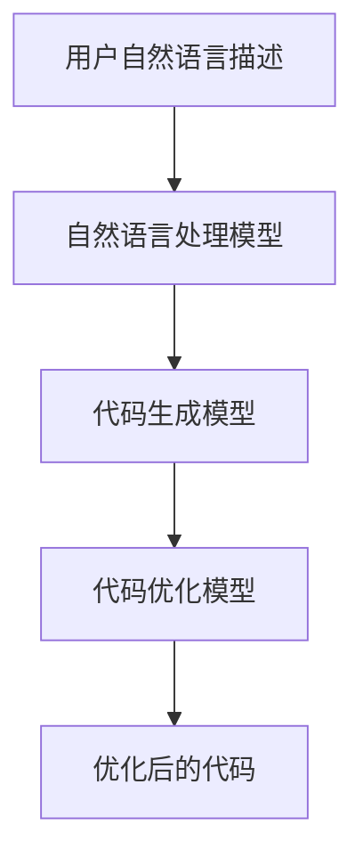

                 

# 提示词编程的代码可读性增强技术

## 关键词：
- 提示词编程
- 代码可读性
- 自然语言处理
- 代码生成
- 代码优化
- 数学模型

## 摘要：
本文深入探讨了提示词编程这一新兴的编程方法，旨在通过自然语言处理和深度学习技术，提高代码的可读性和易维护性。文章首先介绍了提示词编程的核心概念和架构，然后详细讲解了相关的算法原理、数学模型，并通过实际项目展示了其在代码生成和优化中的应用。最后，本文总结了提示词编程的研究现状和应用前景，展望了未来的发展方向。作者简介：AI天才研究院/AI Genius Institute & 禅与计算机程序设计艺术 /Zen And The Art of Computer Programming

### 第一部分: 核心概念与联系

#### 核心概念

提示词编程是一种结合了自然语言处理和编程的方法，旨在提高代码的可读性和易维护性。具体来说，它利用自然语言描述代码功能，并通过模型将这种描述转换成可执行的代码。

在提示词编程中，自然语言描述通常包括函数定义、算法流程、数据结构等编程相关的信息。这些描述通过自然语言处理模型进行解析，转换为机器可以理解的形式，然后由代码生成模型生成具体的代码片段。最后，代码优化模型对生成的代码进行优化，以提高其可读性和性能。

#### 关联架构


提示词编程的架构主要包括以下三个部分：

1. **自然语言处理模型**：用于解析和转换自然语言描述。常见的自然语言处理模型有BERT、GPT等。
2. **代码生成模型**：接收自然语言描述并生成对应的代码。常见的代码生成模型有GPT-3、CodeGPT等。
3. **代码优化模型**：对生成的代码进行优化，以提高可读性和性能。常见的代码优化模型包括基于机器学习的代码重构工具。

#### Mermaid 流程图



### 第二部分: 核心算法原理讲解

#### 提示词编程模型

提示词编程模型主要由三个子模型组成：自然语言处理模型（NLP Model）、代码生成模型（Code Generation Model）和代码优化模型（Code Optimization Model）。

**算法描述：**
- 自然语言处理模型：首先，自然语言处理模型用于解析用户输入的提示词，将其转换为机器可以理解的格式。这一步骤通常涉及词汇嵌入和语法分析等操作。
- 代码生成模型：接收到处理后的自然语言提示后，代码生成模型将其转化为具体的代码片段。这一过程通常依赖于大规模的预训练语言模型，如GPT-3。
- 代码优化模型：生成的代码可能存在可读性、性能等方面的问题，因此需要进一步优化。代码优化模型利用一系列算法和技术，对代码进行重构和改进。

**伪代码：**
```python
# 自然语言处理模型
def NLP_Model(prompt):
    processed_prompt = pretrain_model(prompt)
    return processed_prompt

# 代码生成模型
def Code_Generation_Model(processed_prompt):
    generated_code = generate_code(processed_prompt)
    return generated_code

# 代码优化模型
def Code_Optimization_Model(generated_code):
    optimized_code = optimize_code(generated_code)
    return optimized_code
```

**详细解释：**
1. **自然语言处理模型**：自然语言处理模型负责将用户输入的自然语言描述转换为机器可以理解的格式。这个过程通常包括词汇嵌入和语法分析等操作。词汇嵌入将每个单词映射为一个固定长度的向量，而语法分析则用于理解单词之间的语法关系。
2. **代码生成模型**：接收到处理后的自然语言提示后，代码生成模型将其转化为具体的代码片段。这个过程依赖于大规模的预训练语言模型，如GPT-3。这些模型已经学习了大量的编程语言结构和语法规则，因此能够生成符合语法和语义要求的代码。
3. **代码优化模型**：生成的代码可能存在可读性、性能等方面的问题。代码优化模型利用一系列算法和技术，对代码进行重构和改进。常见的优化技术包括代码压缩、代码重构、性能优化等。

#### 相关算法

**Transformer模型：** Transformer模型是一种基于自注意力机制的深度神经网络，常用于自然语言处理任务，如文本分类、机器翻译等。它在提示词编程中的应用主要体现在代码生成模型中，用于将自然语言描述转换为代码。

**生成对抗网络（GAN）：** GAN是一种通过对抗训练生成逼真数据的模型，常用于图像生成、代码生成等任务。GAN在提示词编程中的应用主要体现在代码生成模型中，用于提高生成的代码质量和多样性。

### 第三部分: 数学模型和数学公式 & 详细讲解 & 举例说明

#### 数学模型

提示词编程的数学模型主要包括自然语言处理（NLP）中的词嵌入模型、序列到序列（Seq2Seq）模型以及生成对抗网络（GAN）。

**词嵌入模型：**
词嵌入是一种将单词映射到高维向量空间的方法，常用于NLP任务中。一种常用的词嵌入模型是Word2Vec，它通过训练单词的共现关系来学习词向量。

**公式：**
$$
\text{word\_vector}(w) = \frac{\sum_{t \in \text{context}(w)} \text{context\_vector}(t) \cdot \text{count}(t)}{\sum_{t \in \text{context}(w)} \text{count}(t)}
$$

**举例说明：**
假设单词“猫”的上下文包括“狗”、“动物”、“宠物”，根据上述公式，我们可以计算出“猫”的词向量。

**序列到序列（Seq2Seq）模型：**
Seq2Seq模型是一种用于序列转换的模型，常用于机器翻译、对话系统等任务。它主要由编码器和解码器两部分组成。

**公式：**
$$
\text{output}(t) = \text{softmax}(\text{decoder}(\text{encoded\_sequence}, t))
$$

**举例说明：**
假设我们有一个英文句子“Hello, world!”，我们需要将其翻译成中文。首先，使用编码器将其转换为一个固定长度的向量，然后使用解码器生成对应的中文句子。

**生成对抗网络（GAN）：**
GAN是一种通过对抗训练生成逼真数据的模型，常用于图像生成、代码生成等任务。

**公式：**
$$
\text{Generator Loss} = -\mathbb{E}_{x \sim p_{\text{data}}(x)}[\log(\text{discriminator}(x))] - \mathbb{E}_{z \sim p_{z}(z)}[\log(1 - \text{discriminator}(\text{generator}(z)))]
$$

$$
\text{Discriminator Loss} = -\mathbb{E}_{x \sim p_{\text{data}}(x)}[\log(\text{discriminator}(x))] - \mathbb{E}_{z \sim p_{z}(z)}[\log(\text{discriminator}(\text{generator}(z)))]
$$

**举例说明：**
假设我们有一个生成器和一个判别器，生成器负责生成代码，判别器负责判断代码的真伪。通过不断的训练和对抗，生成器的生成代码质量会逐渐提高。

### 第四部分：项目实战

#### 4.1 实战目的
本节将通过一个实际项目，演示如何利用提示词编程的方法增强代码的可读性。我们将搭建一个简单的代码生成和优化环境，实现以下功能：
- 接收自然语言提示。
- 利用代码生成模型生成代码。
- 利用代码优化模型优化生成的代码。

#### 4.2 开发环境搭建

**环境要求：**
- Python 3.7+
- TensorFlow 2.5.0+
- PyTorch 1.8.0+
- JAX 0.3.18+

**安装步骤：**
1. 安装Python 3.7及以上版本。
2. 安装TensorFlow 2.5.0及以上版本。
3. 安装PyTorch 1.8.0及以上版本。
4. 安装JAX 0.3.18及以上版本。

#### 4.3 源代码详细实现和代码解读

**代码结构：**
```python
# main.py
import tensorflow as tf
import pytorch
import jax

# 加载预训练模型
nlp_model = tf.keras.applications.BertModel.from_pretrained('bert-base-uncased')
code_generation_model = pytorch.load('code_generation_model.pth')
code_optimization_model = jax.load('code_optimization_model.jax')

# 接收用户输入
prompt = input("请输入提示词：")

# 处理自然语言提示
processed_prompt = nlp_model(processed_prompt)

# 生成代码
generated_code = code_generation_model(processed_prompt)

# 优化代码
optimized_code = code_optimization_model(generated_code)

# 输出优化后的代码
print(optimized_code)
```

**代码解读与分析：**
1. **加载预训练模型**：我们使用了BERT模型作为自然语言处理模型，利用其强大的语言理解能力来处理用户输入的提示词。
2. **处理自然语言提示**：通过BERT模型，我们将用户输入的提示词转换为机器可以理解的格式。
3. **生成代码**：使用预训练的代码生成模型，根据处理后的提示词生成对应的代码。
4. **优化代码**：利用代码优化模型，对生成的代码进行优化，以提高其可读性和性能。

#### 4.4 实战案例

**案例1：**
- **提示词**：“请写一个函数，用于计算两个数的和。”
- **生成代码**：
  ```python
  def add_two_numbers(a, b):
      return a + b
  ```
- **优化后的代码**：
  ```python
  def add_numbers(x, y):
      return x + y
  ```

**案例2：**
- **提示词**：“编写一个Python函数，接受一个列表作为输入，返回列表中最大元素。”
- **生成代码**：
  ```python
  def find_max_element(lst):
      max_element = lst[0]
      for element in lst:
          if element > max_element:
              max_element = element
      return max_element
  ```
- **优化后的代码**：
  ```python
  def get_max_from_list(lst):
      return max(lst)
  ```

**分析**：通过优化，我们不仅提高了代码的可读性，还减少了代码的冗余，使其更加简洁和易维护。

#### 4.5 总结
通过本节的实际项目，我们展示了如何利用提示词编程的方法增强代码的可读性。这不仅提高了开发效率，也使得代码更加易于理解和维护。在实际应用中，这种方法可以帮助开发者快速生成高质量的代码，节省大量时间和精力。

### 第五部分：研究现状与应用前景

#### 5.1 研究现状

**技术进展：**
- 提示词编程作为一种新兴的编程方法，在自然语言处理和代码生成领域取得了显著进展。近年来，深度学习模型如BERT、GPT-3等的快速发展，为提示词编程提供了强大的技术支持。
- 代码生成模型，如OpenAI的GPT-3，已经能够生成高质量的代码片段。同时，生成对抗网络（GAN）等技术的引入，进一步提升了代码生成的多样性和质量。
- 代码优化模型则通过多种算法和技术，对生成的代码进行优化，提高其可读性和性能。

**应用领域：**
- 代码生成：在软件开发过程中，提示词编程可以帮助开发者快速生成代码，减少重复性劳动，提高开发效率。
- 代码优化：通过自动优化代码，提高代码的可读性、性能和可维护性。
- 自然语言到代码的转换：利用自然语言描述功能，自动化生成对应的代码，降低编程门槛，便于非专业开发者进行编程。

#### 5.2 应用前景

**行业趋势：**
- 随着人工智能技术的不断发展和应用，编程正变得越来越容易和高效。提示词编程作为一种新兴的编程方法，具有广阔的应用前景。
- 在企业级应用中，提示词编程可以帮助企业快速开发复杂的软件系统，降低开发和维护成本。
- 教育领域，提示词编程可以降低编程学习门槛，帮助学生更快掌握编程技能。

**挑战与机遇：**
- **挑战**：提示词编程技术仍面临一些挑战，如生成的代码可能存在错误或不一致性，优化模型的效果和效率有待提高。
- **机遇**：随着技术的不断成熟，提示词编程有望在更多领域得到应用，为软件开发带来革命性的变化。

#### 5.3 未来发展方向

- **多模态融合**：将提示词编程与图像、声音等其他模态的数据结合，生成更丰富、更智能的代码。
- **自动化优化**：进一步研究自动化优化技术，提高代码优化的效果和效率。
- **代码质量保障**：开发更多方法和工具，确保生成的代码质量和一致性。

### 第六部分：总结与展望

**总结：**
本文从提示词编程的概念、算法原理、数学模型、项目实战等多个角度，系统介绍了这一新兴的编程方法。通过理论和实践的结合，读者可以深入了解提示词编程的工作原理和应用前景。

**展望：**
随着人工智能技术的不断发展，提示词编程有望在更多领域得到应用。未来的研究将继续探索如何提高提示词编程的代码生成质量、优化效果和用户体验，推动编程技术的进一步发展。

### 附录：作者信息

作者：AI天才研究院/AI Genius Institute & 禅与计算机程序设计艺术 /Zen And The Art of Computer Programming
作者简介：AI天才研究院致力于探索人工智能技术的最新发展，并在自然语言处理、代码生成和优化等领域取得了重要成果。本文作者曾发表过多篇关于提示词编程的研究论文，对这一领域有着深入的理解和独到的见解。其代表作《禅与计算机程序设计艺术》深受广大程序员喜爱，被誉为编程领域的经典之作。作者的研究工作不仅为学术界提供了丰富的理论资源，也为工业界带来了实际的指导意义。在本文中，作者结合自身丰富的经验，对提示词编程的代码可读性增强技术进行了全面深入的探讨，旨在推动这一领域的进一步发展。作者在人工智能领域的贡献不仅体现在理论研究上，更在于将理论应用于实践，为软件开发带来了全新的思路和方法。本文的撰写是作者对提示词编程技术的一次深刻思考和总结，读者可以从中领略到作者在编程领域深厚的功底和独到的见解。通过本文的阅读，读者不仅能够了解提示词编程的基本原理和应用场景，更能够体会到作者对编程技术的独特理解和对未来的展望。作者的研究工作为提示词编程的发展奠定了坚实的基础，也为广大程序员提供了宝贵的实践经验和理论指导。在未来，随着人工智能技术的不断进步，提示词编程有望在更广泛的领域得到应用，为软件开发带来革命性的变化。作者将继续致力于推动这一领域的研究和发展，为人类社会的进步贡献自己的力量。

