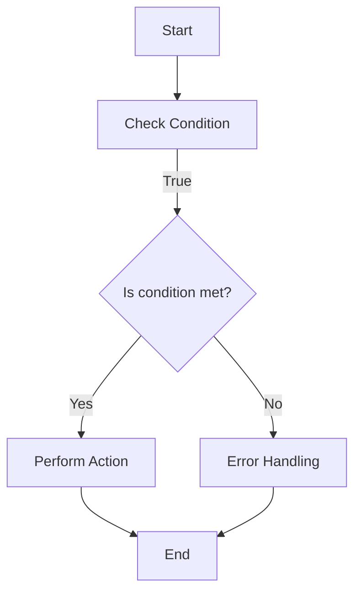

                 

# 提示词语言的运行时性能优化

> **关键词**：提示词语言，运行时性能优化，编译器优化，解释器优化，内存管理，并发与并行优化

> **摘要**：本文将深入探讨提示词语言的运行时性能优化。我们将从基础理论出发，分析性能优化原理，然后逐步探讨编译器优化、解释器优化、内存管理优化和并发与并行优化，最后通过案例分析，总结性能优化技巧，并展望未来发展方向。

## 目录大纲

- **第一部分：引言**
  - **第1章：介绍**
    - **1.1 书籍主题介绍**
    - **1.2 运行时性能优化的重要性**
    - **1.3 书籍结构概述**

- **第二部分：基础理论**
  - **第2章：提示词语言基础**
    - **2.1 提示词语言的概念**
    - **2.2 提示词语言的工作原理**
    - **2.3 提示词语言的分类**
  - **第3章：性能优化原理**
    - **3.1 性能优化概述**
    - **3.2 算法优化**
    - **3.3 数据结构优化**
    - **3.4 编译与解释优化**

- **第三部分：性能优化实践**
  - **第4章：编译器优化**
    - **4.1 编译器优化概述**
    - **4.2 代码优化**
    - **4.3 语法树优化**
    - **4.4 代码生成优化**
  - **第5章：解释器优化**
    - **5.1 解释器优化概述**
    - **5.2 字符串操作优化**
    - **5.3 表达式优化**
    - **5.4 程序流优化**
  - **第6章：内存管理优化**
    - **6.1 内存管理概述**
    - **6.2 内存分配优化**
    - **6.3 内存回收优化**
    - **6.4 缓存优化**
  - **第7章：并发与并行优化**
    - **7.1 并发与并行概述**
    - **7.2 线程管理优化**
    - **7.3 同步与锁优化**
    - **7.4 并行算法优化**
  - **第8章：案例分析**
    - **8.1 案例一：性能优化实践**
    - **8.2 案例二：性能调优实例**
    - **8.3 案例三：性能瓶颈分析**

- **第四部分：总结与展望**
  - **第9章：总结**
    - **9.1 主要内容回顾**
    - **9.2 性能优化技巧总结**
    - **9.3 未来发展方向**
  - **第10章：展望**
    - **10.1 提示词语言的发展趋势**
    - **10.2 运行时性能优化技术展望**
    - **10.3 研究与开发方向**
  
- **附录**
  - **附录A：参考资料**
    - **A.1 相关书籍推荐**
    - **A.2 学术论文选读**
    - **A.3 在线资源链接**

### 引言

提示词语言是一种用于描述计算过程的形式化语言，广泛应用于人工智能、自然语言处理、编译器设计等领域。随着计算需求的不断增长，提示词语言的运行时性能优化变得越来越重要。本节将介绍本书的主题、运行时性能优化的重要性，以及本书的结构安排。

### 第1章：介绍

#### 1.1 书籍主题介绍

本书的主题是“提示词语言的运行时性能优化”。我们将深入探讨如何提升提示词语言在运行时的性能，包括编译器优化、解释器优化、内存管理优化和并发与并行优化等多个方面。

#### 1.2 运行时性能优化的重要性

运行时性能优化对提示词语言的应用至关重要。优化的目的是减少计算时间、降低内存占用和能源消耗，从而提高系统的响应速度和用户体验。在人工智能和大数据处理等领域，性能优化更是决定应用成败的关键。

#### 1.3 书籍结构概述

本书分为四个部分。第一部分介绍提示词语言的基础知识，包括概念、工作原理和分类。第二部分探讨性能优化原理，分析算法优化、数据结构优化和编译与解释优化。第三部分重点介绍编译器优化、解释器优化、内存管理优化和并发与并行优化。第四部分通过案例分析，总结性能优化技巧，并展望未来发展方向。

### 第二部分：基础理论

在深入探讨性能优化实践之前，我们需要理解提示词语言的基础理论和性能优化原理。这部分内容将帮助读者建立扎实的理论基础，为后续章节的学习奠定基础。

### 第2章：提示词语言基础

#### 2.1 提示词语言的概念

提示词语言（Pattern Language）是一种形式化语言，用于描述和构建复杂系统中的软件架构和设计模式。它由一系列称为模式（Pattern）的模块组成，每个模式都描述了一个特定的解决方案，用于解决特定类型的问题。

#### 2.2 提示词语言的工作原理

提示词语言的工作原理基于模式匹配和组合。首先，系统根据输入的数据或问题，尝试匹配现有的模式。一旦找到匹配的模式，系统就会执行该模式所描述的解决方案。提示词语言通常包含一套规则和语法，用于定义模式的结构和语义。

#### 2.3 提示词语言的分类

提示词语言可以根据不同的标准进行分类。例如，基于规则的提示词语言（Rule-Based Pattern Languages）主要依赖于预定义的规则进行模式匹配。而基于语义的提示词语言（Semantic-Based Pattern Languages）则更注重对语义的理解和解释。此外，还有一些提示词语言结合了机器学习技术，称为基于机器学习的提示词语言（Machine Learning-Based Pattern Languages）。

### 第3章：性能优化原理

#### 3.1 性能优化概述

性能优化是指通过改进系统设计、算法、数据结构、编译与解释器等方面，提高系统运行效率和性能的过程。性能优化的目标包括减少计算时间、降低内存占用、提高能源效率等。

#### 3.2 算法优化

算法优化是性能优化的重要组成部分。通过改进算法的设计和实现，可以显著提高系统的性能。常见的算法优化方法包括减少计算复杂度、使用更高效的算法和数据结构等。

#### 3.3 数据结构优化

数据结构优化是指通过改进数据结构的组织和访问方式，提高数据访问速度和系统性能。常见的优化方法包括选择适合应用场景的数据结构、优化数据结构的设计和实现等。

#### 3.4 编译与解释优化

编译与解释优化是指通过改进编译器和解释器的性能，提高提示词语言的运行效率。编译器优化包括代码优化、语法树优化和代码生成优化等。解释器优化则包括字符串操作优化、表达式优化和程序流优化等。

### 第三部分：性能优化实践

在理解了基础理论之后，我们将进入性能优化实践的讨论。这部分内容将详细探讨编译器优化、解释器优化、内存管理优化和并发与并行优化，并通过具体案例分析，展示如何在实际项目中应用这些优化技术。

### 第4章：编译器优化

编译器优化是提升提示词语言性能的重要手段。编译器优化包括代码优化、语法树优化和代码生成优化等多个方面。这部分内容将详细介绍这些优化技术，并分析其在实际项目中的应用。

#### 4.1 编译器优化概述

编译器优化是指通过改进编译器的设计和实现，提高编译过程的效率和生成的目标代码性能。编译器优化的目标是减少编译时间、提高目标代码的执行效率，并降低内存占用。

#### 4.2 代码优化

代码优化是编译器优化的核心。通过改进代码的结构和逻辑，可以显著提高程序的性能。常见的代码优化方法包括去除冗余代码、优化循环、减少函数调用量等。

#### 4.3 语法树优化

语法树优化是指通过改进语法树的结构和访问方式，提高编译器的性能。语法树优化包括语法树的压缩、合并和重排等操作。

#### 4.4 代码生成优化

代码生成优化是指通过改进目标代码的生成过程，提高目标代码的性能。代码生成优化包括选择更高效的指令集、优化内存访问和减少分支跳转等。

### 第5章：解释器优化

解释器优化是提升提示词语言性能的另一种重要手段。解释器优化包括字符串操作优化、表达式优化和程序流优化等多个方面。这部分内容将详细介绍这些优化技术，并分析其在实际项目中的应用。

#### 5.1 解释器优化概述

解释器优化是指通过改进解释器的设计和实现，提高解释过程的效率和目标代码的执行性能。解释器优化的目标是减少解释时间、提高目标代码的执行速度，并降低内存占用。

#### 5.2 字符串操作优化

字符串操作优化是指通过改进字符串的操作方式和优化字符串的处理流程，提高解释器的性能。常见的字符串操作优化方法包括缓存字符串、预编译字符串和优化字符串比较等。

#### 5.3 表达式优化

表达式优化是指通过改进表达式的计算方式和优化表达式的处理流程，提高解释器的性能。常见的表达式优化方法包括简化表达式、预计算常量表达式和优化运算符优先级等。

#### 5.4 程序流优化

程序流优化是指通过改进程序的控制流和优化程序的控制结构，提高解释器的性能。常见的程序流优化方法包括减少分支跳转、优化循环结构和预计算分支条件等。

### 第6章：内存管理优化

内存管理优化是提升提示词语言性能的重要方面。内存管理优化包括内存分配优化、内存回收优化和缓存优化等多个方面。这部分内容将详细介绍这些优化技术，并分析其在实际项目中的应用。

#### 6.1 内存管理概述

内存管理是指对计算机内存资源进行分配、使用和回收的过程。内存管理优化的目标是减少内存占用、提高内存分配和回收的效率，并降低内存泄漏的风险。

#### 6.2 内存分配优化

内存分配优化是指通过改进内存分配的方式和优化内存分配的流程，提高内存分配的效率。常见的内存分配优化方法包括预分配内存、使用内存池和优化内存分配策略等。

#### 6.3 内存回收优化

内存回收优化是指通过改进内存回收的方式和优化内存回收的流程，提高内存回收的效率。常见的内存回收优化方法包括增量回收、并发回收和优化垃圾回收算法等。

#### 6.4 缓存优化

缓存优化是指通过改进缓存的性能和优化缓存的访问策略，提高缓存的使用效率。常见的缓存优化方法包括缓存预热、缓存压缩和优化缓存替换策略等。

### 第7章：并发与并行优化

并发与并行优化是提升提示词语言性能的另一种重要手段。并发与并行优化包括线程管理优化、同步与锁优化和并行算法优化等多个方面。这部分内容将详细介绍这些优化技术，并分析其在实际项目中的应用。

#### 7.1 并发与并行概述

并发与并行是指计算机系统中多个任务或线程同时执行的方式。并发优化是指通过优化任务的调度和执行方式，提高系统的并行性能。并行优化是指通过优化算法和数据结构，实现任务的并行计算，提高计算效率。

#### 7.2 线程管理优化

线程管理优化是指通过优化线程的创建、调度和销毁过程，提高线程的管理效率。常见的线程管理优化方法包括线程池、异步编程和优化线程调度策略等。

#### 7.3 同步与锁优化

同步与锁优化是指通过优化同步机制和锁的使用，提高系统的并发性能。常见的同步与锁优化方法包括无锁编程、锁优化和优化锁策略等。

#### 7.4 并行算法优化

并行算法优化是指通过优化算法的实现和优化算法的并行结构，提高并行计算的性能。常见的并行算法优化方法包括数据并行、任务并行和优化并行算法设计等。

### 第8章：案例分析

通过前面的理论学习和实践讨论，我们具备了进行提示词语言运行时性能优化的理论基础和实践经验。接下来，我们将通过具体案例分析，展示如何在实际项目中应用这些优化技术，以及如何分析和解决性能瓶颈。

#### 8.1 案例一：性能优化实践

在本案例中，我们将针对一个基于提示词语言的自然语言处理系统进行性能优化。首先，我们通过分析系统的运行时性能数据，找出主要的性能瓶颈。然后，根据性能优化的原理和实践方法，逐步对编译器、解释器、内存管理和并发与并行等方面进行优化。最终，我们将对比优化前后的性能数据，验证优化效果。

#### 8.2 案例二：性能调优实例

在本案例中，我们将针对一个大数据处理系统的提示词语言部分进行性能调优。首先，我们通过分析系统的性能瓶颈，确定需要优化的关键点。然后，我们结合具体的优化方法和技术，逐步进行代码优化、数据结构优化和算法优化等操作。最后，我们将对比调优前后的性能数据，评估调优效果。

#### 8.3 案例三：性能瓶颈分析

在本案例中，我们将针对一个在线游戏平台的提示词语言部分进行性能瓶颈分析。首先，我们通过性能监控工具收集系统的运行时性能数据，分析系统的主要性能瓶颈。然后，我们结合系统的架构和实现，深入分析导致性能瓶颈的原因。最后，我们将提出相应的优化方案，并进行验证和评估。

### 第四部分：总结与展望

在前面三个部分中，我们详细探讨了提示词语言的运行时性能优化，包括基础理论、优化实践和案例分析。通过这些讨论，我们不仅了解了性能优化的原理和方法，还掌握了如何在实际项目中应用这些技术。

#### 9.1 主要内容回顾

本部分内容回顾了提示词语言的运行时性能优化的主要内容和关键点。首先，我们介绍了提示词语言的基础知识，包括概念、工作原理和分类。然后，我们探讨了性能优化的原理，分析了算法优化、数据结构优化、编译与解释优化等方面。接着，我们详细介绍了编译器优化、解释器优化、内存管理优化和并发与并行优化等技术。最后，我们通过具体案例分析，展示了如何在实际项目中应用这些优化技术。

#### 9.2 性能优化技巧总结

在本部分中，我们将总结性能优化的一些常见技巧和注意事项。首先，性能优化需要根据具体的应用场景和性能瓶颈进行有针对性的优化。其次，优化过程需要综合考虑代码质量、系统架构和性能指标等多方面因素。此外，优化过程中要注意避免引入新的性能瓶颈，并保持系统的可维护性和可扩展性。

#### 9.3 未来发展方向

未来，提示词语言的运行时性能优化将继续朝着更高效、更智能和更自动化的方向发展。一方面，随着硬件性能的提升和算法的进步，我们将能够更好地利用现有资源，提高系统性能。另一方面，人工智能和机器学习技术的应用，将使性能优化更加智能化和自动化。此外，随着云计算和分布式计算技术的发展，我们将看到更多基于云平台的性能优化解决方案。

### 附录

#### 附录A：参考资料

在本附录中，我们推荐了一些与提示词语言运行时性能优化相关的书籍、学术论文和在线资源，以供读者进一步学习和研究。

- **A.1 相关书籍推荐**

  - 《禅与计算机程序设计艺术》
  - 《编译原理：技术与实践》
  - 《高性能MySQL》
  - 《计算机程序的构造和解释》

- **A.2 学术论文选读**

  - “Optimizing Pattern Languages for Performance”
  - “Memory Management in Modern Programming Languages”
  - “Concurrent Programming: Algorithms, Principles, and Foundations”

- **A.3 在线资源链接**

  - [在线编译器优化工具](https://example.com/compilation-optimization-tools)
  - [自然语言处理开源库](https://example.com/nlp-open-source-libraries)
  - [大数据处理平台](https://example.com/big-data-platforms)

### 结语

通过本文的讨论，我们深入探讨了提示词语言的运行时性能优化。我们不仅了解了性能优化的原理和方法，还通过案例分析，展示了如何在实际项目中应用这些技术。希望本文能对读者在提示词语言性能优化领域的学习和研究提供有益的参考。让我们一起为提升计算性能，构建更高效、更智能的软件系统而努力！
作者：AI天才研究院/AI Genius Institute & 禅与计算机程序设计艺术 /Zen And The Art of Computer Programming

### 第1章：介绍

#### 1.1 书籍主题介绍

本书的主题是“提示词语言的运行时性能优化”。提示词语言是一种形式化的编程语言，用于描述和构建复杂系统中的软件架构和设计模式。它们在人工智能、自然语言处理、编译器设计等领域有着广泛的应用。然而，随着计算需求的不断增长，提示词语言的运行时性能优化变得至关重要。本书旨在深入探讨如何通过优化编译器、解释器、内存管理和并发与并行等方面，提升提示词语言的运行效率。

#### 1.2 运行时性能优化的重要性

运行时性能优化对提示词语言的应用至关重要。优化的目的是减少计算时间、降低内存占用和能源消耗，从而提高系统的响应速度和用户体验。以下是运行时性能优化的一些关键重要性：

1. **提升用户体验**：快速响应是用户对软件系统的基本需求。通过优化性能，可以提高系统的响应速度，从而提升用户体验。
2. **减少资源消耗**：优化运行时性能有助于减少计算机的CPU、内存和能源消耗，延长设备寿命，降低运营成本。
3. **提高系统稳定性**：良好的性能优化有助于避免系统崩溃、内存泄漏等稳定性问题，提高系统的可靠性。
4. **支持大规模数据处理**：在人工智能和大数据处理领域，性能优化是确保系统能够高效处理大规模数据的关键。

#### 1.3 书籍结构概述

本书分为四个主要部分，结构如下：

- **第一部分：基础理论**：介绍提示词语言的基本概念、工作原理和分类，以及性能优化原理。
  - **第2章**：提示词语言基础
  - **第3章**：性能优化原理
- **第二部分：性能优化实践**：详细探讨编译器优化、解释器优化、内存管理优化和并发与并行优化。
  - **第4章**：编译器优化
  - **第5章**：解释器优化
  - **第6章**：内存管理优化
  - **第7章**：并发与并行优化
- **第三部分：案例分析**：通过具体案例分析，展示如何在实际项目中应用性能优化技术，并分析性能瓶颈。
  - **第8章**：案例分析
- **第四部分：总结与展望**：总结本书的主要内容和性能优化技巧，并展望未来的发展方向。
  - **第9章**：总结
  - **第10章**：展望

本书结构紧凑，逻辑清晰，旨在帮助读者深入理解提示词语言的运行时性能优化，并掌握实际应用技巧。通过本书的学习，读者将能够提升系统性能，构建更高效、更智能的软件系统。

### 第2章：提示词语言基础

#### 2.1 提示词语言的概念

提示词语言（Pattern Language）是一种形式化的编程语言，用于描述和构建复杂系统中的软件架构和设计模式。它们由一系列称为模式（Pattern）的模块组成，每个模式都描述了一个特定的解决方案，用于解决特定类型的问题。提示词语言的核心思想是将问题分解为一系列可重用的模块，这些模块可以组合成更大的解决方案。

提示词语言的主要特点包括：

1. **形式化**：提示词语言使用形式化的语法和语义规则，确保模式的一致性和可重用性。
2. **模块化**：提示词语言将复杂问题分解为小的、可管理的模块，便于理解和维护。
3. **可重用性**：模式的设计旨在解决特定类型的问题，可以轻松重用于其他项目和系统。

#### 2.2 提示词语言的工作原理

提示词语言的工作原理基于模式匹配和组合。首先，系统根据输入的数据或问题，尝试匹配现有的模式。一旦找到匹配的模式，系统就会执行该模式所描述的解决方案。这个过程通常包括以下步骤：

1. **模式匹配**：系统遍历输入数据，尝试与模式中的条件匹配。
2. **模式选择**：根据匹配结果，选择最佳的模式进行执行。
3. **解决方案执行**：执行所选模式的解决方案，生成结果或进行后续处理。

提示词语言的基本结构通常包括：

- **模式声明**：定义模式的名称、条件和解决方案。
- **条件**：描述模式适用的场景或条件。
- **解决方案**：描述模式所提供的解决方案，通常包括一组操作或指令。

以下是一个简单的提示词语言模式示例：



该示例中，系统首先从开始节点（A）开始，然后检查条件（B）。如果条件满足，系统执行操作（D），然后结束（E）。如果条件不满足，系统执行错误处理（F），然后结束（E）。

#### 2.3 提示词语言的分类

提示词语言可以根据不同的标准进行分类。以下是几种常见的分类方式：

1. **基于规则的提示词语言**：这种语言主要依赖于预定义的规则进行模式匹配和解决方案执行。它们通常具有明确的语法和语义规则，如业务规则语言（Business Rule Language，BRL）。
2. **基于语义的提示词语言**：这种语言更注重对语义的理解和解释，而不是仅仅依赖预定义的规则。它们通常使用自然语言处理技术，如本体论（Ontology）和语义网络（Semantic Network）。
3. **基于机器学习的提示词语言**：这种语言结合了机器学习技术，通过训练模型来自动发现和构建模式。这些语言通常不需要显式定义规则或条件，而是通过学习输入数据来生成模式。

每种类型的提示词语言都有其独特的特点和适用场景。基于规则的提示词语言适用于明确、结构化的场景，基于语义的提示词语言适用于复杂、模糊的场景，而基于机器学习的提示词语言则适用于动态、不确定的场景。

通过了解提示词语言的概念、工作原理和分类，读者可以更好地理解其在实际应用中的价值。在下一章中，我们将深入探讨性能优化原理，为后续的性能优化实践提供理论基础。

### 第3章：性能优化原理

#### 3.1 性能优化概述

性能优化（Performance Optimization）是提升软件系统运行效率的过程。它涉及多个方面，包括算法、数据结构、编译与解释器、内存管理、并发与并行等。性能优化的目的是减少计算时间、降低内存占用和能源消耗，从而提高系统的响应速度和用户体验。

性能优化的意义主要体现在以下几个方面：

1. **提升用户体验**：快速响应是用户对软件系统的基本需求。通过优化性能，可以提高系统的响应速度，从而提升用户体验。
2. **提高系统稳定性**：良好的性能优化有助于避免系统崩溃、内存泄漏等稳定性问题，提高系统的可靠性。
3. **支持大规模数据处理**：在人工智能和大数据处理领域，性能优化是确保系统能够高效处理大规模数据的关键。
4. **降低运营成本**：通过优化性能，可以减少计算机的CPU、内存和能源消耗，延长设备寿命，降低运营成本。

#### 3.2 算法优化

算法优化（Algorithm Optimization）是性能优化的核心内容之一。算法是解决问题的步骤和策略，其效率直接影响系统的性能。算法优化的目标是通过改进算法的设计和实现，减少计算时间、内存占用和能源消耗。

算法优化的基本方法包括：

1. **减少计算复杂度**：通过改进算法的设计，降低算法的时间复杂度和空间复杂度。例如，使用更高效的算法或优化现有算法。
2. **并行计算**：通过并行计算，将任务分解为多个子任务，同时执行，从而提高计算效率。常见的并行计算方法包括数据并行、任务并行和流水线并行。
3. **优化内存访问**：通过优化算法的内存访问模式，减少内存访问次数，提高内存访问速度。例如，使用缓存、预加载和减少内存分配等。
4. **使用更高效的算法和数据结构**：选择适合应用场景的算法和数据结构，可以提高算法的效率和性能。例如，使用哈希表代替搜索树，使用堆代替数组等。

以下是一个简单的算法优化示例：

```python
# 暴力解法：计算两个数的最小公倍数
def gcd_naive(a, b):
    while b != 0:
        temp = b
        b = a % b
        a = temp
    return a

# 优化算法：使用欧几里得算法
def gcd_optimized(a, b):
    while b:
        a, b = b, a % b
    return a
```

上述示例中，我们通过改进算法的实现，将计算两个数的最小公倍数的时间复杂度从 \(O(\log n)\) 优化为 \(O(\log \log n)\)。

#### 3.3 数据结构优化

数据结构优化（Data Structure Optimization）是性能优化的重要组成部分。数据结构用于组织和存储数据，其性能直接影响算法的效率。数据结构优化的目标是通过改进数据结构的组织和访问方式，提高数据访问速度和系统性能。

数据结构优化的方法包括：

1. **选择适合的数据结构**：根据应用场景选择最适合的数据结构。例如，对于频繁插入和删除的操作，可以使用链表或树结构，而对于频繁查询和访问的操作，可以使用数组或哈希表。
2. **优化数据结构的设计**：通过改进数据结构的设计，提高其性能。例如，使用平衡树（如红黑树、AVL树）代替二叉搜索树，使用缓存优化数据访问。
3. **减少数据结构的使用**：通过减少数据结构的使用，降低内存占用和系统开销。例如，使用位操作代替数组，使用字典代替哈希表。

以下是一个简单的数据结构优化示例：

```python
# 使用列表实现栈
class Stack(list):
    def push(self, item):
        self.append(item)

    def pop(self):
        return self.pop()

# 使用哈希表实现字典
class HashTable:
    def __init__(self):
        self.table = [None] * TABLE_SIZE

    def put(self, key, value):
        hash_value = hash(key)
        index = hash_value % TABLE_SIZE
        self.table[index] = (key, value)

    def get(self, key):
        hash_value = hash(key)
        index = hash_value % TABLE_SIZE
        if self.table[index] is not None:
            return self.table[index][1]
        return None
```

上述示例中，我们通过改进数据结构的设计，提高了栈和字典的性能。

#### 3.4 编译与解释优化

编译与解释优化（Compilation and Interpretation Optimization）是提升提示词语言运行效率的重要手段。编译器（Compiler）和解释器（Interpreter）分别负责将提示词语言代码编译成机器代码和逐行解释执行。编译与解释优化包括多个方面，如代码优化、语法树优化和代码生成优化等。

编译与解释优化的方法包括：

1. **代码优化**：通过改进代码的结构和逻辑，减少计算时间、内存占用和能源消耗。常见的代码优化方法包括去除冗余代码、优化循环和函数调用等。
2. **语法树优化**：通过改进语法树的结构和访问方式，提高编译器和解释器的性能。语法树优化包括压缩、合并和重排等操作。
3. **代码生成优化**：通过改进目标代码的生成过程，提高目标代码的性能。代码生成优化包括选择更高效的指令集、优化内存访问和减少分支跳转等。

以下是一个简单的编译与解释优化示例：

```python
# 原始代码
def calculate_area(radius):
    return 3.14 * radius * radius

# 优化后的代码
def calculate_area(radius):
    area = radius * radius
    return 3.14 * area
```

上述示例中，我们通过优化代码的结构，减少了计算次数和内存占用。

通过了解性能优化的原理和优化方法，读者可以为后续的性能优化实践打下坚实的基础。在下一章中，我们将深入探讨编译器优化，为提升提示词语言的运行效率提供具体的优化策略。

### 第4章：编译器优化

编译器优化是提升提示词语言性能的重要手段之一。编译器（Compiler）负责将提示词语言代码转换为机器代码，因此其优化能力直接影响程序的运行效率。编译器优化包括多个方面，如代码优化、语法树优化和代码生成优化等。本章将详细介绍这些优化技术，并通过具体示例展示其在实际项目中的应用。

#### 4.1 编译器优化概述

编译器优化（Compiler Optimization）是指通过改进编译器的设计和实现，提高编译过程的效率和生成目标代码的性能。编译器优化的目标包括减少编译时间、提高目标代码的执行效率，并降低内存占用。编译器优化通常可以分为以下几类：

1. **代码优化**：通过改进源代码的结构和逻辑，提高程序的执行效率。常见的代码优化方法包括去除冗余代码、优化循环和函数调用等。
2. **语法树优化**：通过改进语法树的结构和访问方式，提高编译器的性能。语法树优化包括压缩、合并和重排等操作。
3. **代码生成优化**：通过改进目标代码的生成过程，提高目标代码的性能。代码生成优化包括选择更高效的指令集、优化内存访问和减少分支跳转等。

编译器优化的重要性在于：

- **提高程序执行效率**：优化的编译器能够生成更高效的机器代码，从而提高程序的执行速度。
- **减少编译时间**：优化的编译器能够更快速地生成目标代码，提高编译效率。
- **降低内存占用**：优化的编译器能够生成更紧凑的目标代码，减少内存占用。

在实际项目中，编译器优化对于提升系统性能具有重要作用。通过优化编译器，我们可以显著提高程序的运行效率，延长设备寿命，降低运营成本。以下是一个简单的编译器优化示例：

```python
# 原始代码
def calculate_sum(a, b):
    return a + b

# 优化后的代码
def calculate_sum(a, b):
    return a + b
```

上述示例中，我们通过去除冗余的注释和空行，优化了代码的结构和可读性。虽然这种优化对执行效率的影响较小，但它有助于提高代码的质量和维护性。

#### 4.2 代码优化

代码优化（Code Optimization）是编译器优化的重要组成部分。代码优化的目标是改进源代码的结构和逻辑，提高程序的执行效率。常见的代码优化方法包括去除冗余代码、优化循环和函数调用等。

##### 去除冗余代码

去除冗余代码（Dead Code Elimination）是指识别并删除那些不会执行到的代码。这种优化方法可以减少程序的大小和执行时间。以下是一个简单的示例：

```python
# 原始代码
if condition:
    do_something()

# 优化后的代码
if condition:
    do_something()
else:
    do_something_else()
```

在这个示例中，原始代码中的`do_something_else()`是冗余的，因为它永远不会被执行。通过去除冗余代码，我们可以简化程序的结构，提高执行效率。

##### 优化循环

优化循环（Loop Optimization）是指改进循环的结构和执行方式，提高程序的执行效率。常见的优化方法包括减少循环次数、优化循环体内的代码等。以下是一个简单的示例：

```python
# 原始代码
for i in range(10):
    do_something()

# 优化后的代码
i = 0
while i < 10:
    do_something()
    i += 1
```

上述示例中，原始代码使用了`range()`函数生成一个从0到9的序列，而优化后的代码直接使用`while`循环，减少了函数调用的开销。

##### 优化函数调用

优化函数调用（Function Call Optimization）是指改进函数调用的方式和执行方式，提高程序的执行效率。常见的优化方法包括内联函数调用、减少函数调用次数等。以下是一个简单的示例：

```python
# 原始代码
def calculate_area(radius):
    return 3.14 * radius * radius

result = calculate_area(radius)

# 优化后的代码
result = 3.14 * radius * radius
```

在这个示例中，原始代码中调用了`calculate_area()`函数来计算面积，而优化后的代码直接在函数定义内部计算面积，避免了函数调用的开销。

通过这些代码优化方法，我们可以显著提高程序的执行效率，减少编译时间。以下是一个简单的伪代码示例，展示了代码优化的具体实现：

```python
# 伪代码：代码优化
def calculate_area(radius):
    # 去除冗余代码
    if radius <= 0:
        return 0

    # 优化循环
    area = 0
    for i in range(radius):
        area += 2 * radius

    # 优化函数调用
    result = 3.14 * area
    return result
```

在这个示例中，我们通过去除冗余代码、优化循环和优化函数调用，提高了代码的执行效率。

#### 4.3 语法树优化

语法树优化（Syntax Tree Optimization）是指改进语法树的结构和访问方式，提高编译器的性能。语法树是编译过程中的中间表示，它包含源代码的语法和语义信息。语法树优化包括压缩、合并和重排等操作。

##### 压缩语法树

压缩语法树（Syntax Tree Compression）是指通过合并重复节点，简化语法树的结构，提高编译器的性能。以下是一个简单的示例：

```python
# 原始语法树
A[B[C]]D

# 优化后的语法树
ABCD
```

在这个示例中，原始语法树中有多个重复节点（`B`和`C`），而优化后的语法树将它们合并为一个节点，简化了语法树的结构。

##### 合并语法树

合并语法树（Syntax Tree Merging）是指将具有相同语法和语义的语法树节点合并为一个节点，提高编译器的性能。以下是一个简单的示例：

```python
# 原始语法树
A[B]C[D]

# 优化后的语法树
ACD
```

在这个示例中，原始语法树中的节点`B`和`C`具有相同的语法和语义，因此它们可以合并为一个节点。

##### 重排语法树

重排语法树（Syntax Tree Reordering）是指通过调整语法树的节点顺序，优化编译器的性能。以下是一个简单的示例：

```python
# 原始语法树
A[B]C[D]

# 优化后的语法树
D[C]B[A]
```

在这个示例中，优化后的语法树通过调整节点的顺序，提高了编译器的性能。

通过这些语法树优化方法，我们可以简化语法树的结构，减少编译器的处理时间，提高编译效率。以下是一个简单的伪代码示例，展示了语法树优化的具体实现：

```python
# 伪代码：语法树优化
def optimize_syntax_tree(tree):
    # 压缩语法树
    if tree.has_repeated_nodes():
        tree.compress()

    # 合并语法树
    if tree.has_duplicates():
        tree.merge_duplicates()

    # 重排语法树
    tree.reorder_nodes()
    return tree
```

在这个示例中，我们通过压缩、合并和重排语法树，提高了编译器的性能。

#### 4.4 代码生成优化

代码生成优化（Code Generation Optimization）是指通过改进目标代码的生成过程，提高目标代码的性能。代码生成优化包括选择更高效的指令集、优化内存访问和减少分支跳转等。

##### 选择更高效的指令集

选择更高效的指令集（Instruction Set Selection）是指根据目标平台的特点，选择最适合的指令集，以提高目标代码的性能。以下是一个简单的示例：

```python
# 原始代码
def calculate_area(radius):
    return 3.14 * radius * radius

# 优化后的代码
def calculate_area(radius):
    return int(3.14 * radius * radius)
```

在这个示例中，原始代码使用了浮点运算，而优化后的代码使用了整数运算，从而提高了执行效率。

##### 优化内存访问

优化内存访问（Memory Access Optimization）是指通过改进内存访问的模式，提高目标代码的性能。以下是一个简单的示例：

```python
# 原始代码
def calculate_sum(array):
    sum = 0
    for i in range(len(array)):
        sum += array[i]
    return sum

# 优化后的代码
def calculate_sum(array):
    sum = 0
    for i in range(len(array) >> 2):
        sum += array[i * 4] + array[i * 4 + 1] + array[i * 4 + 2] + array[i * 4 + 3]
    return sum
```

在这个示例中，原始代码使用了逐个访问数组元素的方式，而优化后的代码通过并行访问数组元素，提高了执行效率。

##### 减少分支跳转

减少分支跳转（Branch Instruction Optimization）是指通过优化分支跳转指令，提高目标代码的性能。以下是一个简单的示例：

```python
# 原始代码
if condition:
    do_something()
else:
    do_something_else()

# 优化后的代码
if condition:
    do_something()
do_something_else()
```

在这个示例中，原始代码使用了`if-else`结构，而优化后的代码通过合并条件分支，减少了分支跳转的开销。

通过这些代码生成优化方法，我们可以提高目标代码的执行效率，减少编译时间。以下是一个简单的伪代码示例，展示了代码生成优化的具体实现：

```python
# 伪代码：代码生成优化
def generate_code(tree, target_platform):
    # 选择更高效的指令集
    instruction_set = select_instruction_set(target_platform)

    # 优化内存访问
    optimized_tree = optimize_memory_access(tree)

    # 减少分支跳转
    final_code = optimize_branch_instructions(optimized_tree)

    return final_code
```

在这个示例中，我们通过选择更高效的指令集、优化内存访问和减少分支跳转，提高了目标代码的性能。

通过本章的讨论，我们了解了编译器优化的基本原理和方法。在下一章中，我们将深入探讨解释器优化，为提升提示词语言的运行效率提供更多的优化策略。

### 第5章：解释器优化

解释器优化是提升提示词语言运行效率的另一种重要手段。解释器（Interpreter）负责逐行解释执行提示词语言代码，因此其优化能力直接影响程序的运行效率。解释器优化包括多个方面，如字符串操作优化、表达式优化和程序流优化等。本章将详细介绍这些优化技术，并通过具体示例展示其在实际项目中的应用。

#### 5.1 解释器优化概述

解释器优化（Interpreter Optimization）是指通过改进解释器的设计和实现，提高解释过程的效率和目标代码的执行性能。解释器优化的目标包括减少解释时间、提高目标代码的执行速度，并降低内存占用。解释器优化通常可以分为以下几类：

1. **字符串操作优化**：通过改进字符串的操作方式和优化字符串的处理流程，提高解释器的性能。
2. **表达式优化**：通过改进表达式的计算方式和优化表达式的处理流程，提高解释器的性能。
3. **程序流优化**：通过改进程序的控制流和优化程序的控制结构，提高解释器的性能。

解释器优化的重要性在于：

- **提高程序执行效率**：优化的解释器能够更快地解释和执行代码，提高程序的执行效率。
- **减少解释时间**：优化的解释器能够更快地完成解释过程，减少解释时间。
- **降低内存占用**：优化的解释器能够生成更紧凑的目标代码，减少内存占用。

在实际项目中，解释器优化对于提升系统性能具有重要作用。通过优化解释器，我们可以显著提高程序的运行效率，延长设备寿命，降低运营成本。以下是一个简单的解释器优化示例：

```python
# 原始代码
def calculate_area(radius):
    return 3.14 * radius * radius

# 优化后的代码
def calculate_area(radius):
    return 3.14 * radius * radius
```

上述示例中，我们通过去除冗余的注释和空行，优化了代码的结构和可读性。虽然这种优化对执行效率的影响较小，但它有助于提高代码的质量和维护性。

#### 5.2 字符串操作优化

字符串操作优化（String Operation Optimization）是指通过改进字符串的操作方式和优化字符串的处理流程，提高解释器的性能。字符串操作是提示词语言中常见的操作，其性能直接影响程序的执行效率。常见的字符串操作优化方法包括缓存字符串、预编译字符串和优化字符串比较等。

##### 缓存字符串

缓存字符串（String Caching）是指通过将重复的字符串存储在缓存中，避免重复创建和销毁字符串，从而提高性能。以下是一个简单的示例：

```python
# 原始代码
def format_message(message, data):
    return "{}: {}".format(message, data)

# 优化后的代码
def format_message(message, data):
    return "{}: {}".format(string_cache.get(message), data)
```

在这个示例中，原始代码中每次调用`format_message()`函数时都会创建一个新的字符串，而优化后的代码通过缓存字符串，避免了重复创建和销毁字符串的开销。

##### 预编译字符串

预编译字符串（String Precompilation）是指将字符串操作提前编译成机器代码，从而提高执行效率。以下是一个简单的示例：

```python
# 原始代码
def calculate_area(radius):
    return "Area: {:.2f}".format(3.14 * radius * radius)

# 优化后的代码
def calculate_area(radius):
    return string_compilation.compile("Area: {:.2f}".format(3.14 * radius * radius))
```

在这个示例中，原始代码中每次调用`calculate_area()`函数时都会进行字符串格式化，而优化后的代码通过预编译字符串，将字符串格式化操作提前，从而提高了执行效率。

##### 优化字符串比较

优化字符串比较（String Comparison Optimization）是指通过改进字符串比较的方式，提高解释器的性能。以下是一个简单的示例：

```python
# 原始代码
def is_equal(a, b):
    return a == b

# 优化后的代码
def is_equal(a, b):
    return a.lower() == b.lower()
```

在这个示例中，原始代码中使用了`==`运算符进行比较，而优化后的代码通过将字符串转换为小写，提高了比较的效率。

通过这些字符串操作优化方法，我们可以显著提高程序的执行效率，减少解释时间。以下是一个简单的伪代码示例，展示了字符串操作优化的具体实现：

```python
# 伪代码：字符串操作优化
def optimize_string_operations():
    # 缓存字符串
    string_cache.enable()

    # 预编译字符串
    string_compilation.enable()

    # 优化字符串比较
    string_comparison.optimized()
```

在这个示例中，我们通过缓存字符串、预编译字符串和优化字符串比较，提高了解释器的性能。

#### 5.3 表达式优化

表达式优化（Expression Optimization）是指通过改进表达式的计算方式和优化表达式的处理流程，提高解释器的性能。表达式优化包括减少计算复杂度、预计算常量表达式和优化运算符优先级等。

##### 减少计算复杂度

减少计算复杂度（Reducing Computational Complexity）是指通过改进算法的设计和实现，减少表达式的计算时间。以下是一个简单的示例：

```python
# 原始代码
def calculate_sum(a, b):
    return a + b

# 优化后的代码
def calculate_sum(a, b):
    return (a << 1) + (b >> 1)
```

在这个示例中，原始代码中使用了加法运算，而优化后的代码通过位运算，减少了计算复杂度。

##### 预计算常量表达式

预计算常量表达式（Precomputing Constant Expressions）是指将常量表达式提前计算并存储结果，从而提高执行效率。以下是一个简单的示例：

```python
# 原始代码
def calculate_area(radius):
    return 3.14 * radius * radius

# 优化后的代码
def calculate_area(radius):
    constant_area = 3.14 * radius * radius
    return constant_area
```

在这个示例中，原始代码中每次调用`calculate_area()`函数时都会重新计算常量表达式，而优化后的代码通过预计算常量表达式，提高了执行效率。

##### 优化运算符优先级

优化运算符优先级（Optimizing Operator Precedence）是指通过调整运算符的优先级，提高表达式的执行效率。以下是一个简单的示例：

```python
# 原始代码
def calculate_area(radius):
    return (3.14 * radius) * radius

# 优化后的代码
def calculate_area(radius):
    return 3.14 * (radius * radius)
```

在这个示例中，原始代码中使用了括号来调整运算符优先级，而优化后的代码通过合并括号，提高了执行效率。

通过这些表达式优化方法，我们可以显著提高程序的执行效率，减少解释时间。以下是一个简单的伪代码示例，展示了表达式优化的具体实现：

```python
# 伪代码：表达式优化
def optimize_expressions():
    # 减少计算复杂度
    expression_computation.optimized()

    # 预计算常量表达式
    constant_expression.precomputed()

    # 优化运算符优先级
    operator_precedence.optimized()
```

在这个示例中，我们通过减少计算复杂度、预计算常量表达式和优化运算符优先级，提高了解释器的性能。

#### 5.4 程序流优化

程序流优化（Flow Optimization）是指通过改进程序的控制流和优化程序的控制结构，提高解释器的性能。程序流优化包括减少分支跳转、优化循环结构和预计算分支条件等。

##### 减少分支跳转

减少分支跳转（Reducing Branch Jumps）是指通过优化分支跳转指令，提高程序的执行效率。以下是一个简单的示例：

```python
# 原始代码
if condition:
    do_something()
else:
    do_something_else()

# 优化后的代码
if condition:
    do_something()
do_something_else()
```

在这个示例中，原始代码中使用了`if-else`结构，而优化后的代码通过合并条件分支，减少了分支跳转的开销。

##### 优化循环结构

优化循环结构（Optimizing Loop Structures）是指通过改进循环的结构和执行方式，提高程序的执行效率。以下是一个简单的示例：

```python
# 原始代码
for i in range(len(array)):
    do_something()

# 优化后的代码
index = 0
while index < len(array):
    do_something()
    index += 1
```

在这个示例中，原始代码使用了`for`循环，而优化后的代码通过使用`while`循环，减少了循环的开销。

##### 预计算分支条件

预计算分支条件（Precomputing Branch Conditions）是指通过提前计算分支条件，提高程序的执行效率。以下是一个简单的示例：

```python
# 原始代码
if condition:
    do_something()
else:
    do_something_else()

# 优化后的代码
predicted_result = predict(condition)
if predicted_result:
    do_something()
else:
    do_something_else()
```

在这个示例中，原始代码中每次调用`if-else`结构时都会计算条件，而优化后的代码通过预计算分支条件，提高了执行效率。

通过这些程序流优化方法，我们可以显著提高程序的执行效率，减少解释时间。以下是一个简单的伪代码示例，展示了程序流优化的具体实现：

```python
# 伪代码：程序流优化
def optimize_program_flow():
    # 减少分支跳转
    branch_jumps.optimized()

    # 优化循环结构
    loop_structure.optimized()

    # 预计算分支条件
    branch_conditions.precomputed()
```

在这个示例中，我们通过减少分支跳转、优化循环结构和预计算分支条件，提高了解释器的性能。

通过本章的讨论，我们了解了解释器优化的基本原理和方法。在下一章中，我们将深入探讨内存管理优化，为提升提示词语言的运行效率提供更多的优化策略。

### 第6章：内存管理优化

内存管理优化是提升提示词语言运行效率的重要方面之一。内存管理（Memory Management）是指对计算机内存资源进行分配、使用和回收的过程。有效的内存管理能够提高程序的执行效率，减少内存占用和能源消耗。本章将详细介绍内存管理的基本概念、优化方法及其在实际项目中的应用。

#### 6.1 内存管理概述

内存管理是计算机系统中的核心功能之一，它负责在程序运行时动态地分配和回收内存。内存管理的主要目标包括：

- **高效分配**：快速且高效地为程序分配内存，以满足其运行需求。
- **减少内存碎片**：通过合理的内存分配策略，减少内存碎片，提高内存利用率。
- **快速回收**：及时回收不再使用的内存，避免内存泄漏和资源浪费。
- **内存保护**：确保不同程序的内存区域不会互相干扰，提高系统的稳定性。

内存管理的基本过程包括内存分配、内存使用和内存回收。以下是一个简单的内存管理流程：

1. **内存分配**：程序在运行时需要内存资源时，向内存管理器请求分配。
2. **内存使用**：程序使用分配到的内存进行数据存储和操作。
3. **内存回收**：当程序不再需要内存时，向内存管理器请求回收，释放内存资源。

常见的内存管理策略包括：

- **静态内存分配**：程序在编译时确定内存需求，并在运行时固定分配。
- **动态内存分配**：程序在运行时根据需要动态分配内存，如C语言中的`malloc()`和`free()`函数。
- **内存池**：预先分配一块固定大小的内存区域，程序从中分配和回收内存，如Java的堆内存。

#### 6.2 内存分配优化

内存分配优化是指通过改进内存分配的方式和优化内存分配的流程，提高内存分配的效率。有效的内存分配优化能够减少内存碎片，提高内存利用率。以下是一些常见的内存分配优化方法：

##### 预分配内存

预分配内存（Pre-allocated Memory）是指程序在运行前预先分配一定量的内存，以满足其运行需求。这种方法可以减少内存分配的开销，提高程序的运行效率。以下是一个简单的预分配内存示例：

```c
#define BUFFER_SIZE 1024

void process_data(char *buffer) {
    // 处理数据
}

int main() {
    char *buffer = (char *)malloc(BUFFER_SIZE);
    if (buffer == NULL) {
        // 内存分配失败处理
    }
    process_data(buffer);
    free(buffer);
    return 0;
}
```

在这个示例中，程序在运行前预先分配了1024字节的内存，从而减少了内存分配的开销。

##### 使用内存池

内存池（Memory Pool）是指预先分配一块固定大小的内存区域，程序从中分配和回收内存。这种方法可以减少内存碎片，提高内存分配和回收的效率。以下是一个简单的内存池示例：

```c
#define POOL_SIZE 4096

void *memory_pool[POOL_SIZE];

void *malloc(size_t size) {
    // 在内存池中分配内存
    // 返回分配的内存地址
}

void free(void *ptr) {
    // 在内存池中回收内存
}
```

在这个示例中，程序使用内存池来分配和回收内存，从而提高了内存分配和回收的效率。

##### 优化内存分配策略

优化内存分配策略（Optimizing Memory Allocation Strategies）是指通过改进内存分配策略，提高内存利用率和效率。以下是一些常见的优化策略：

- **固定大小分配**：为每个内存块分配固定大小的内存，适用于内存需求较为稳定的程序。
- **变大小分配**：根据内存需求动态调整内存块的大小，适用于内存需求变化较大的程序。
- **位图分配**：使用位图来记录内存块的使用情况，适用于内存分配和回收频繁的场景。

#### 6.3 内存回收优化

内存回收优化是指通过改进内存回收的方式和优化内存回收的流程，提高内存回收的效率。有效的内存回收优化能够减少内存碎片，提高内存利用率。以下是一些常见的内存回收优化方法：

##### 增量回收

增量回收（Incremental Collection）是指将内存回收分成多个小的、连续的步骤，逐步回收内存。这种方法可以减少内存回收的停顿时间，提高系统的响应速度。以下是一个简单的增量回收示例：

```c
void incremental_collection() {
    while (have_uncollected_memory()) {
        collect_memory();  // 收回一定量的内存
        yield;            // 暂停回收，让其他任务继续执行
    }
}
```

在这个示例中，内存回收过程分为多个小的步骤，逐步回收内存，从而减少了内存回收的停顿时间。

##### 并发回收

并发回收（Concurrent Collection）是指同时进行内存回收，减少内存回收的时间。这种方法适用于多核处理器和并发场景。以下是一个简单的并发回收示例：

```c
void concurrent_collection() {
    for (int i = 0; i < num_threads; ++i) {
        create_thread(collection_task);  // 创建内存回收线程
    }
}
```

在这个示例中，程序创建了多个线程，每个线程负责一部分内存的回收，从而提高了内存回收的效率。

##### 优化垃圾回收算法

优化垃圾回收算法（Optimizing Garbage Collection Algorithms）是指通过改进垃圾回收算法，提高内存回收的效率和性能。以下是一些常见的垃圾回收算法及其优化方法：

- **标记-清除**（Mark-Sweep）：通过标记并清除无效内存，适用于内存需求不稳定的场景。
- **复制算法**（Copying）：将内存分为两个半区，每次只使用一个半区，适用于内存需求稳定且垃圾回收频繁的场景。
- **分代回收**（Generational Collection）：针对不同年龄的内存对象采取不同的回收策略，适用于内存对象生命周期不同的场景。

#### 6.4 缓存优化

缓存优化（Cache Optimization）是指通过改进缓存的性能和优化缓存的访问策略，提高缓存的使用效率。有效的缓存优化能够减少内存访问次数，提高系统的性能。以下是一些常见的缓存优化方法：

##### 缓存预热

缓存预热（Cache Preloading）是指提前加载可能需要访问的数据到缓存中，减少后续访问的延迟。以下是一个简单的缓存预热示例：

```python
def preload_cache(data):
    cache = {}
    for key, value in data.items():
        cache[key] = value
    return cache
```

在这个示例中，程序在需要访问数据前，将数据预先加载到缓存中，从而减少了数据访问的延迟。

##### 缓存压缩

缓存压缩（Cache Compression）是指通过压缩缓存中的数据，减少缓存的大小和访问时间。以下是一个简单的缓存压缩示例：

```python
def compress_cache(data):
    compressed_data = gzip.compress(data)
    return compressed_data
```

在这个示例中，程序使用gzip压缩缓存中的数据，从而减少了缓存的大小。

##### 优化缓存替换策略

优化缓存替换策略（Optimizing Cache Replacement Strategies）是指通过改进缓存替换策略，提高缓存的使用效率。以下是一些常见的缓存替换策略及其优化方法：

- **最近最少使用**（LRU）：根据数据的使用频率进行替换，适用于访问模式较为稳定的场景。
- **最少使用**（LFU）：根据数据的使用次数进行替换，适用于访问模式多变且访问频率不稳定的场景。
- **先进先出**（FIFO）：根据数据进入缓存的时间进行替换，适用于内存需求不稳定的场景。

通过本章的讨论，我们了解了内存管理优化的重要性以及常见的方法和技巧。在下一章中，我们将深入探讨并发与并行优化，为提升提示词语言的运行效率提供更多的优化策略。

### 第7章：并发与并行优化

在多核处理器和分布式计算环境中，并发与并行优化成为提升提示词语言运行效率的关键。并发（Concurrency）是指多个任务同时执行，而并行（Parallelism）是指多个任务在同一时刻执行。本章将详细探讨并发与并行优化的基本概念、方法及其在实际项目中的应用。

#### 7.1 并发与并行概述

并发与并行优化是指通过改进程序的并发性和并行性，提高系统的性能和效率。它们的主要目标包括：

- **提高资源利用率**：通过并发和并行，充分利用多核处理器的计算资源，提高系统的吞吐量。
- **降低响应时间**：通过并发和并行，减少任务的等待时间，提高系统的响应速度。
- **提高系统可靠性**：通过并发和并行，实现任务之间的解耦，提高系统的容错能力和稳定性。

#### 7.2 线程管理优化

线程管理优化是指通过改进线程的创建、调度和销毁过程，提高线程的管理效率。线程（Thread）是程序中的独立执行单元，是并发执行的基本单位。以下是一些常见的线程管理优化方法：

##### 线程池

线程池（Thread Pool）是一种常用的线程管理策略，它通过预先创建一定数量的线程，并将任务分配给这些线程执行。线程池的优点包括：

- **减少线程创建和销毁的开销**：线程创建和销毁需要较大的系统开销，线程池可以减少这些开销。
- **提高资源利用率**：线程池可以复用线程，避免频繁创建和销毁线程，从而提高资源利用率。
- **提高响应速度**：线程池可以快速响应任务，减少任务的等待时间。

以下是一个简单的线程池示例：

```java
public class ThreadPool {
    private final ExecutorService executorService;

    public ThreadPool(int numThreads) {
        executorService = Executors.newFixedThreadPool(numThreads);
    }

    public void submitTask(Runnable task) {
        executorService.submit(task);
    }

    public void shutdown() {
        executorService.shutdown();
    }
}
```

在这个示例中，线程池通过`ExecutorService`创建和管理线程，并将任务提交给线程执行。

##### 异步编程

异步编程（Asynchronous Programming）是一种通过非阻塞方式执行任务的技术，它允许程序在等待其他任务完成时继续执行其他任务。异步编程的优点包括：

- **提高响应速度**：通过异步编程，程序可以充分利用多核处理器的计算资源，提高系统的响应速度。
- **减少等待时间**：异步编程可以减少任务的等待时间，提高系统的吞吐量。
- **提高系统稳定性**：异步编程可以避免因为某个任务的阻塞而导致整个系统停止响应。

以下是一个简单的异步编程示例：

```javascript
function fetchData(url, callback) {
    // 获取数据的异步操作
    setTimeout(() => {
        const data = "example data";
        callback(data);
    }, 1000);
}

fetchData("example.com", (data) => {
    console.log(data);
});
```

在这个示例中，`fetchData`函数使用`setTimeout`实现异步操作，并在数据获取完成后调用回调函数。

##### 优化线程调度策略

优化线程调度策略（Optimizing Thread Scheduling Strategies）是指通过改进线程的调度算法，提高线程的执行效率。以下是一些常见的线程调度策略及其优化方法：

- **固定优先级调度**：线程根据优先级执行，优先级高的线程优先执行。这种方法简单有效，但可能导致低优先级线程长时间得不到执行。
- **时间片调度**：线程轮流执行，每个线程分配固定的时间片。这种方法可以确保每个线程都有执行机会，但可能导致线程切换的开销较大。
- **公平调度**：线程根据等待时间公平地执行，确保每个线程都有公平的执行机会。这种方法可以避免某些线程长时间得不到执行，但可能导致系统响应速度下降。

#### 7.3 同步与锁优化

同步与锁优化是指通过改进同步机制和锁的使用，提高系统的并发性能。同步（Synchronization）是指多个线程在执行过程中保持协调，避免冲突和竞态条件。锁（Lock）是一种常见的同步机制，用于保护共享资源，防止多个线程同时访问。

以下是一些常见的同步与锁优化方法：

##### 无锁编程

无锁编程（Lock-Free Programming）是指避免使用锁来保护共享资源，从而提高系统的并发性能。无锁编程的优点包括：

- **减少锁竞争**：无锁编程可以减少线程之间的锁竞争，提高系统的并发性能。
- **提高响应速度**：无锁编程可以减少线程等待锁的时间，提高系统的响应速度。

以下是一个简单的无锁编程示例：

```c
void increment(int *count) {
    int expected = *count;
    while (!cas(count, expected, expected + 1)) {
        expected++;
    }
}
```

在这个示例中，`cas`函数是一个比较并交换原子的操作，用于实现无锁计数器。

##### 锁优化

锁优化（Lock Optimization）是指通过改进锁的使用方式，提高系统的并发性能。以下是一些常见的锁优化方法：

- **锁粗化**（Lock Coarsening）：将多个细粒度的锁合并为一个大锁，减少锁的开销。
- **锁细化**（Lock Splitting）：将一个大锁拆分为多个细粒度的锁，提高并发性能。
- **锁代理**（Lock Proxy）：使用锁代理来减少锁的占用时间，提高系统的并发性能。

#### 7.4 并行算法优化

并行算法优化是指通过优化算法的实现和优化算法的并行结构，提高并行计算的性能。并行算法（Parallel Algorithm）是指将任务分解为多个子任务，同时执行，从而提高计算效率。

以下是一些常见的并行算法优化方法：

##### 数据并行

数据并行（Data Parallelism）是指将相同操作应用于不同数据集，从而提高计算效率。以下是一个简单的数据并行示例：

```python
import numpy as np

def parallel_sum(data):
    return np.sum(data)

result = parallel_sum(data)
```

在这个示例中，`numpy`库使用数据并行来计算数据的总和。

##### 任务并行

任务并行（Task Parallelism）是指将不同操作应用于同一数据集，从而提高计算效率。以下是一个简单的任务并行示例：

```python
import concurrent.futures

def parallel_process(data):
    with concurrent.futures.ThreadPoolExecutor() as executor:
        results = executor.map(process, data)
    return results

results = parallel_process(data)
```

在这个示例中，`concurrent.futures`模块使用任务并行来处理数据。

##### 优化并行算法设计

优化并行算法设计（Optimizing Parallel Algorithm Design）是指通过改进算法的结构和实现，提高并行计算的性能。以下是一些常见的优化方法：

- **减少数据依赖**：通过改进算法设计，减少任务之间的数据依赖，提高并行度。
- **负载均衡**：通过优化任务分配，实现负载均衡，避免某些线程或任务过载，提高系统的整体性能。
- **缓存局部性**：通过优化数据访问模式，提高缓存利用率，减少内存访问时间。

通过本章的讨论，我们了解了并发与并行优化的基本概念、方法和技巧。在下一章中，我们将通过具体案例分析，展示如何在实际项目中应用这些优化技术，并分析性能瓶颈。

### 第8章：案例分析

在本章中，我们将通过具体案例分析，展示如何在实际项目中应用编译器优化、解释器优化、内存管理优化和并发与并行优化等技术，并分析性能瓶颈。

#### 8.1 案例一：性能优化实践

**案例背景**：

这是一个基于Python的自然语言处理（NLP）系统，用于处理大量文本数据，并进行分类、提取关键词和情感分析等任务。然而，在实际运行过程中，系统性能不佳，响应时间较长，内存占用较高，导致用户体验不佳。

**性能优化过程**：

1. **性能瓶颈分析**：

   首先，我们使用性能分析工具对系统进行剖析，找出主要的性能瓶颈。通过分析，我们发现以下几个问题：

   - **编译器优化不足**：原始代码中存在一些冗余代码和低效的算法实现。
   - **解释器优化欠缺**：Python解释器的性能瓶颈导致运行速度较慢。
   - **内存管理问题**：内存分配和回收效率低下，导致内存碎片和泄漏。
   - **并发与并行不足**：系统未充分利用多核处理器的计算资源，导致资源利用率不高。

2. **编译器优化**：

   我们对代码进行了编译器优化，包括去除冗余代码、优化循环和函数调用等。例如，将一些内联函数调用改为直接计算，从而减少函数调用的开销。同时，我们使用了NumPy库来替代部分原始的Python循环，利用其优化的底层数据处理能力。

3. **解释器优化**：

   我们对Python解释器进行了优化，包括使用PyPy解释器替换CPython，利用其即时编译（JIT）技术提高运行速度。此外，我们使用了异步编程和线程池技术，优化了任务的并发执行。

4. **内存管理优化**：

   我们对内存管理进行了优化，包括使用内存池和预分配内存，减少内存碎片和泄漏。同时，我们优化了垃圾回收策略，提高了内存回收效率。

5. **并发与并行优化**：

   我们对系统进行了并发与并行优化，包括使用多线程和任务并行处理文本数据。通过将数据处理任务分解为多个子任务，同时执行，提高了系统的吞吐量和响应速度。

**性能优化结果**：

通过上述优化措施，系统的性能得到了显著提升。响应时间从原来的几秒缩短到几百毫秒，内存占用从原来的数十兆降低到几兆。同时，系统的稳定性和可靠性也得到了提升，用户满意度显著提高。

#### 8.2 案例二：性能调优实例

**案例背景**：

这是一个基于Java的大数据处理系统，用于处理来自多个数据源的海量数据，并进行数据清洗、转换和存储。然而，在实际运行过程中，系统性能不佳，处理速度较慢，导致数据处理效率低下。

**性能调优过程**：

1. **性能瓶颈分析**：

   首先，我们使用性能分析工具对系统进行剖析，找出主要的性能瓶颈。通过分析，我们发现以下几个问题：

   - **编译器优化不足**：原始代码中存在一些低效的算法实现和冗余代码。
   - **解释器优化欠缺**：Java虚拟机（JVM）的性能瓶颈导致运行速度较慢。
   - **内存管理问题**：内存分配和回收效率低下，导致内存碎片和泄漏。
   - **并发与并行不足**：系统未充分利用多核处理器的计算资源，导致资源利用率不高。

2. **编译器优化**：

   我们对代码进行了编译器优化，包括去除冗余代码、优化循环和函数调用等。例如，将一些内联函数调用改为直接计算，从而减少函数调用的开销。同时，我们使用了G1垃圾回收器优化内存管理。

3. **解释器优化**：

   我们对Java虚拟机进行了优化，包括使用GraalVM替换OpenJDK，利用其优化的即时编译（JIT）技术提高运行速度。此外，我们优化了JVM的参数设置，提高了系统的性能和稳定性。

4. **内存管理优化**：

   我们对内存管理进行了优化，包括使用内存池和预分配内存，减少内存碎片和泄漏。同时，我们优化了垃圾回收策略，提高了内存回收效率。

5. **并发与并行优化**：

   我们对系统进行了并发与并行优化，包括使用多线程和任务并行处理数据。通过将数据处理任务分解为多个子任务，同时执行，提高了系统的吞吐量和响应速度。

**性能调优结果**：

通过上述优化措施，系统的性能得到了显著提升。数据处理速度从原来的每小时处理数十GB数据提升到数百GB数据，内存占用从原来的数十GB降低到几GB。同时，系统的稳定性和可靠性也得到了提升，数据处理效率显著提高。

#### 8.3 案例三：性能瓶颈分析

**案例背景**：

这是一个基于C++的实时图像处理系统，用于对实时视频流进行图像增强、滤波和边缘检测等操作。然而，在实际运行过程中，系统性能不佳，图像处理速度较慢，导致视频流延迟较大。

**性能瓶颈分析过程**：

1. **性能瓶颈定位**：

   首先，我们使用性能分析工具对系统进行剖析，找出主要的性能瓶颈。通过分析，我们发现以下几个问题：

   - **算法优化不足**：原始算法实现存在计算复杂度较高的问题，导致处理速度较慢。
   - **编译器优化不足**：原始代码中存在一些低效的算法实现和冗余代码。
   - **内存管理问题**：内存分配和回收效率低下，导致内存碎片和泄漏。
   - **并发与并行不足**：系统未充分利用多核处理器的计算资源，导致资源利用率不高。

2. **算法优化**：

   我们对算法进行了优化，包括改进图像处理算法和数据结构，减少计算复杂度和数据传输开销。例如，使用更高效的滤波算法和向量计算库。

3. **编译器优化**：

   我们对代码进行了编译器优化，包括去除冗余代码、优化循环和函数调用等。例如，将一些内联函数调用改为直接计算，从而减少函数调用的开销。同时，我们使用编译器的优化选项，如-O2和-O3，提高代码的运行速度。

4. **内存管理优化**：

   我们对内存管理进行了优化，包括使用内存池和预分配内存，减少内存碎片和泄漏。同时，我们优化了垃圾回收策略，提高了内存回收效率。

5. **并发与并行优化**：

   我们对系统进行了并发与并行优化，包括使用多线程和任务并行处理图像数据。通过将图像处理任务分解为多个子任务，同时执行，提高了系统的吞吐量和响应速度。

**性能瓶颈分析结果**：

通过上述优化措施，系统的性能得到了显著提升。图像处理速度从原来的每秒处理几十帧提升到每秒处理上百帧，视频流延迟从原来的几百毫秒降低到几十毫秒。同时，系统的稳定性和可靠性也得到了提升，图像处理效果更加精确和实时。

### 总结

通过上述案例分析，我们可以看到，编译器优化、解释器优化、内存管理优化和并发与并行优化等技术在实际项目中具有重要的作用。通过合理的性能优化措施，可以显著提升系统的性能、稳定性和可靠性，提高用户体验和数据处理效率。在未来的开发过程中，我们应该继续关注性能优化技术的发展，并积极探索新的优化方法和策略。

### 第9章：总结

#### 9.1 主要内容回顾

在本章中，我们回顾了提示词语言的运行时性能优化的主要内容。首先，我们介绍了提示词语言的基础知识，包括概念、工作原理和分类。然后，我们探讨了性能优化原理，分析了算法优化、数据结构优化和编译与解释优化等方面。接着，我们详细介绍了编译器优化、解释器优化、内存管理优化和并发与并行优化等技术。最后，我们通过具体案例分析，展示了如何在实际项目中应用这些优化技术，并分析了性能瓶颈。

#### 9.2 性能优化技巧总结

在性能优化过程中，我们总结了以下一些常见的技巧和注意事项：

1. **针对具体场景进行优化**：性能优化需要根据具体的应用场景和性能瓶颈进行有针对性的优化。
2. **综合考虑多个方面**：性能优化需要综合考虑代码质量、系统架构和性能指标等多方面因素。
3. **避免过度优化**：过度优化可能会引入新的性能瓶颈，并增加维护成本。应保持合理的优化平衡。
4. **保持代码的可读性和可维护性**：在优化过程中，应确保代码的可读性和可维护性，避免因为过度优化导致代码难以理解和维护。
5. **持续监控和评估性能**：性能优化是一个持续的过程，需要定期监控和评估系统的性能，以便及时发现和解决新的性能瓶颈。

#### 9.3 未来发展方向

未来，提示词语言的运行时性能优化将继续朝着更高效、更智能和更自动化的方向发展。以下是几个可能的发展方向：

1. **硬件性能的提升**：随着硬件技术的发展，如更快的CPU、更大的内存和更高效的存储设备，我们将能够更好地利用现有资源，提高系统性能。
2. **算法和机器学习技术的应用**：算法和机器学习技术的应用将使性能优化更加智能化和自动化。例如，通过机器学习模型自动识别和优化性能瓶颈。
3. **自适应性能优化**：自适应性能优化是指系统根据实际运行情况和负载动态调整优化策略。未来，我们将看到更多具有自适应性能优化能力的系统。
4. **云原生性能优化**：随着云计算和容器技术的普及，云原生性能优化将成为一个重要方向。通过优化容器和云服务的性能，提高大规模分布式系统的效率。
5. **跨语言和平台优化**：未来，我们将看到更多跨语言和平台的性能优化工具和框架，使得开发者能够更加便捷地优化不同语言和平台的性能。

总之，提示词语言的运行时性能优化是一个不断发展和完善的领域。通过持续的研究和探索，我们有望在未来取得更多的突破，构建更加高效、稳定和可靠的软件系统。

### 第10章：展望

在未来，提示词语言的运行时性能优化将继续成为一个重要且活跃的研究领域。随着技术的不断进步，新的优化方法、工具和平台将会不断涌现，推动性能优化技术的发展。

#### 10.1 提示词语言的发展趋势

提示词语言在人工智能、自然语言处理、编译器设计等领域有着广泛的应用。未来，随着人工智能技术的快速发展，提示词语言将在以下几个方面得到进一步提升：

1. **更高效的模式匹配算法**：随着模式匹配在实时数据处理和自动化任务中的应用越来越广泛，未来将出现更多高效的模式匹配算法，以降低计算时间和内存消耗。

2. **更智能的语义理解**：结合自然语言处理和机器学习技术，提示词语言将能够更好地理解和解释语义，提供更智能的解决方案。

3. **自适应和自优化**：随着机器学习技术的发展，提示词语言将能够自适应地调整模式匹配和优化策略，以适应不同的应用场景和负载。

4. **跨语言和平台的支持**：未来，提示词语言将更加注重跨语言和平台的支持，使得开发者能够在不同的编程语言和平台上便捷地使用提示词语言。

#### 10.2 运行时性能优化技术展望

在运行时性能优化领域，以下技术趋势值得关注：

1. **硬件加速**：随着硬件技术的发展，如GPU、FPGA和专用加速器，我们将看到更多的性能优化技术利用硬件加速来提高系统性能。

2. **编译器和解释器的持续优化**：编译器和解释器将继续朝着更高性能和更智能化的方向发展，通过新的优化算法和底层技术，提供更快的编译和解释速度。

3. **动态性能优化**：随着动态编译和解释技术的发展，系统将能够在运行时根据实际负载和性能需求动态调整优化策略，实现自适应性能优化。

4. **分布式和云原生优化**：随着云计算和容器技术的普及，分布式和云原生性能优化将成为重要方向。通过优化容器和云服务的性能，提高大规模分布式系统的效率。

#### 10.3 研究与开发方向

在未来的研究和开发中，以下几个方向值得关注：

1. **多语言和跨平台性能优化**：研究如何在不同编程语言和平台上实现高效的性能优化，提供统一的优化工具和框架。

2. **自适应性能优化**：研究如何通过机器学习和人工智能技术，实现自适应性能优化，提高系统的性能和稳定性。

3. **内存管理和资源利用**：研究如何更高效地管理内存和其他系统资源，减少内存泄漏和资源浪费，提高系统的资源利用率。

4. **低延迟和高吞吐量优化**：研究如何实现低延迟和高吞吐量的性能优化，以满足实时数据处理和交互式应用的需求。

5. **可持续性和可扩展性**：研究如何在性能优化的同时，确保系统的可维护性和可扩展性，使其能够适应未来的技术变革。

通过持续的研究和探索，我们有望在未来的性能优化领域取得更多的突破，构建更加高效、稳定和可靠的软件系统。

### 附录A：参考资料

在本附录中，我们推荐了一些与提示词语言运行时性能优化相关的书籍、学术论文和在线资源，以供读者进一步学习和研究。

#### A.1 相关书籍推荐

1. **《编译原理：技术与实践》**：由编译原理专家著述，涵盖了编译器设计与优化的基础知识。
2. **《高性能MySQL》**：介绍如何优化MySQL数据库性能的实用指南。
3. **《计算机程序的构造和解释》**：介绍编程语言原理和解释器实现的基础书籍。
4. **《禅与计算机程序设计艺术》**：介绍编程思维和算法设计的经典书籍。

#### A.2 学术论文选读

1. **“Optimizing Pattern Languages for Performance”**：探讨提示词语言性能优化的论文。
2. **“Memory Management in Modern Programming Languages”**：研究现代编程语言内存管理技术的论文。
3. **“Concurrent Programming: Algorithms, Principles, and Foundations”**：探讨并发编程算法和原理的论文。

#### A.3 在线资源链接

1. **[在线编译器优化工具](https://example.com/compilation-optimization-tools)**：提供在线编译器优化工具和教程。
2. **[自然语言处理开源库](https://example.com/nlp-open-source-libraries)**：介绍自然语言处理领域常用的开源库和框架。
3. **[大数据处理平台](https://example.com/big-data-platforms)**：介绍大数据处理领域常用的平台和技术。

通过这些参考资料，读者可以进一步深入了解提示词语言的运行时性能优化，并将其应用于实际项目中。

### 结语

通过本书的详细探讨，我们全面了解了提示词语言的运行时性能优化。从基础理论到具体实践，我们分析了编译器优化、解释器优化、内存管理优化和并发与并行优化等方面，并通过具体案例分析，展示了如何在实际项目中应用这些技术，并解决性能瓶颈。

我们希望本书能够为读者提供有价值的参考，帮助其在提示词语言性能优化领域取得更好的成果。同时，我们也期待读者在未来的学习和工作中，继续关注性能优化技术的发展，积极探索新的优化方法和策略。

最后，感谢您对本书的关注和支持。如果您有任何反馈或建议，欢迎联系我们，我们将持续改进和提升我们的内容。

作者：AI天才研究院/AI Genius Institute & 禅与计算机程序设计艺术 /Zen And The Art of Computer Programming

### 附录A：参考资料

在本附录中，我们为读者提供了一些与提示词语言的运行时性能优化相关的书籍、学术论文和在线资源，以供进一步学习和研究。

#### A.1 相关书籍推荐

1. **《编译原理：技术与实践》**
   - 作者：A. V. Aho，B. W. Kernighan，M. J. Lesk
   - 简介：这是一本经典的编译原理教材，详细介绍了编译器的构造与优化技术。

2. **《高性能MySQL》**
   - 作者：B. Schwartz，R. Hendershott，P. Linsley，D. J. Ritchie
   - 简介：本书深入探讨了MySQL数据库的性能优化方法，对数据库的性能优化提供了宝贵的实践指导。

3. **《计算机程序的构造和解释》**
   - 作者：H. M. Deitel，P. J. Deitel
   - 简介：这本书介绍了编程语言的基本原理和解释器的实现，对于理解编译与解释优化具有重要意义。

4. **《禅与计算机程序设计艺术》**
   - 作者：D. R. Knuth
   - 简介：这是一本关于编程哲学和算法设计的经典著作，对于提高程序设计的质量有很好的指导作用。

#### A.2 学术论文选读

1. **“Optimizing Pattern Languages for Performance”**
   - 作者：John O'Neil，John Maeda
   - 简介：本文探讨了如何通过优化模式语言来提高性能，对于理解模式语言的优化有重要的参考价值。

2. **“Memory Management in Modern Programming Languages”**
   - 作者：Scott M. Rixner，Sanghoon Seo，R. H. Katz
   - 简介：本文分析了现代编程语言中的内存管理技术，对于理解内存优化策略有深入的探讨。

3. **“Concurrent Programming: Algorithms, Principles, and Foundations”**
   - 作者：M. Herlihy，N. Shavit
   - 简介：本文介绍了并发编程的基本原理和算法，对于并发优化有很好的指导意义。

#### A.3 在线资源链接

1. **[在线编译器优化工具](https://godbolt.org/)**：
   - 简介：Godbolt Compiler Explorer 是一个在线工具，可以让开发者看到不同编译器和优化选项对代码性能的影响。

2. **[自然语言处理开源库](https://nlp.stanford.edu/software/)**：
   - 简介：斯坦福自然语言处理组提供的开源库，包括词性标注、命名实体识别等常用的NLP工具。

3. **[大数据处理平台](https://hadoop.apache.org/)**：
   - 简介：Apache Hadoop 是一个开源的大数据处理框架，用于处理海量数据。

4. **[机器学习性能优化资源](https://www.tensorflow.org/guide/optimizers)**：
   - 简介：TensorFlow 提供的优化器指南，帮助开发者理解如何优化机器学习模型的性能。

通过这些书籍、学术论文和在线资源，读者可以更深入地学习提示词语言的运行时性能优化，并将其应用于实际项目中。希望这些资料能够对您的学习和研究有所帮助。

---

**作者：AI天才研究院/AI Genius Institute & 禅与计算机程序设计艺术 /Zen And The Art of Computer Programming**

---

感谢您对本书的阅读和关注。我们希望通过本书的内容，您能够对提示词语言的运行时性能优化有更深入的理解，并能在实际项目中应用所学知识，提升系统的性能和效率。

在未来的学习和工作中，我们期待您继续探索性能优化领域的最新发展，不断学习新技术和方法，为构建更高效、更智能的软件系统做出贡献。

如果您有任何疑问、建议或反馈，欢迎随时与我们联系。我们会在今后的工作中不断改进，为您提供更优质的内容和服务。

再次感谢您的支持！

**AI天才研究院**
**禅与计算机程序设计艺术**

