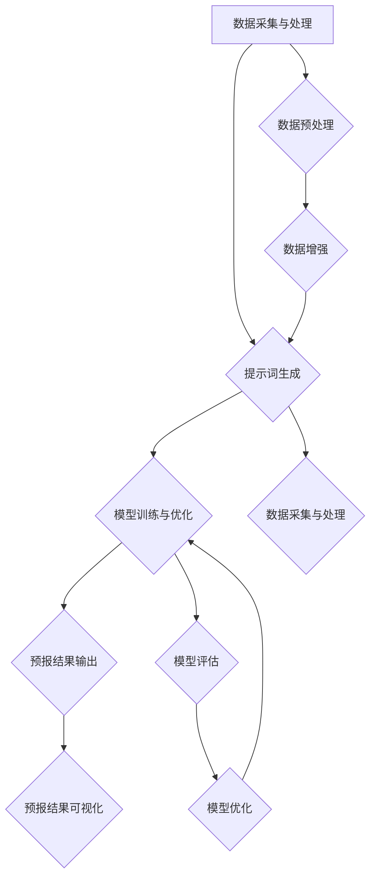

                 

# 《提示词驱动的智能气象预报系统》

> **关键词**：智能气象预报、提示词、深度学习、数据采集、模型训练、项目实战

> **摘要**：本文深入探讨了提示词驱动的智能气象预报系统的构建方法和应用实践。首先，介绍了智能气象预报的背景和意义，以及提示词驱动的概念。接着，详细阐述了气象学基础、提示词生成方法、模型训练与优化、预报结果分析与评估等关键环节。最后，通过一个实际项目案例，展示了如何搭建和实现一个智能气象预报系统。

## 第1章 引言

### 1.1 智能气象预报的背景和意义

随着全球气候变化和极端天气事件的频繁发生，准确、实时的气象预报变得尤为重要。传统的气象预报主要依赖于数值天气预报模式，这些模式通过模拟大气运动和热力过程来预测天气。然而，这种方法存在计算复杂度高、精度受限等问题。

近年来，人工智能技术的快速发展为气象预报带来了新的机遇。尤其是深度学习技术的引入，使得智能气象预报系统成为可能。通过学习大量的气象数据，深度学习模型能够自动提取数据中的特征，并生成更加精确的预报结果。

智能气象预报系统不仅能够提供实时的天气预报，还能够预测天气变化的趋势，从而帮助人们更好地应对自然灾害和极端天气事件。此外，智能气象预报系统还可以为农业、交通、能源等领域提供决策支持，具有重要的应用价值。

### 1.2 提示词驱动的智能气象预报系统概述

提示词驱动的智能气象预报系统是一种基于深度学习的人工智能系统，通过提示词来指导模型的训练和预测过程。提示词是一组与气象现象相关的关键词，它们能够帮助模型更好地理解气象数据，提高预报的准确性。

系统的基本架构包括数据采集与处理模块、提示词生成模块、模型训练与优化模块、预报结果输出模块等。其中，数据采集与处理模块负责收集和整理气象数据，提示词生成模块通过分析气象数据来生成提示词，模型训练与优化模块负责训练和优化深度学习模型，预报结果输出模块则将预报结果以图表或地图的形式呈现。

### 1.3 本书结构安排

本书将分为八个章节，具体结构如下：

- **第1章 引言**：介绍智能气象预报的背景和意义，以及提示词驱动的概念。
- **第2章 提示词驱动的气象预报基础**：阐述气象学基本概念、提示词的定义与作用以及智能气象预报系统的架构。
- **第3章 数据采集与处理**：讨论气象数据的来源、预处理方法和数据增强技术。
- **第4章 提示词生成方法**：介绍提示词生成算法、优化策略以及生成质量评估。
- **第5章 模型训练与优化**：详细讲解深度学习模型的选择、训练流程和模型优化方法。
- **第6章 预报结果分析与评估**：分析预报结果的可视化方法，介绍评估指标和方法。
- **第7章 项目实战**：通过一个实际项目案例，展示如何搭建和实现智能气象预报系统。
- **第8章 总结与展望**：总结本书的主要内容，探讨智能气象预报系统的未来发展趋势和研究方向。

## 第2章 提示词驱动的气象预报基础

### 2.1 气象学基本概念

气象学是研究大气现象的科学，包括大气的组成、结构、运动和变化规律等。以下是气象学中的几个基本概念：

#### 2.1.1 气象要素

气象要素是指描述大气状态的物理量，主要包括：

- 温度：表示大气的冷热程度，常用摄氏度（℃）表示。
- 湿度：表示大气中水汽的含量，常用相对湿度（%）表示。
- 风速和风向：表示大气的流动速度和方向。
- 降水量：表示一段时间内的降水总量，常用毫米（mm）表示。
- 日照时数：表示一天中太阳辐射的时长。

#### 2.1.2 气候类型

气候类型是根据不同地区长期气象要素的平均值和变化特征来划分的。常见的气候类型包括：

- 热带气候：全年温暖湿润，无明显季节变化。
- 温带气候：四季分明，夏季温暖，冬季寒冷。
- 寒带气候：全年寒冷，冬季漫长。
- 沙漠气候：干燥少雨，气温极端。

#### 2.1.3 气象观测方法

气象观测是获取大气状态信息的重要手段。常见的观测方法包括：

- 地面观测：通过气象站、气象卫星等设备，实时监测气象要素的变化。
- 高空气象观测：使用探空气球、雷达等设备，对大气垂直结构进行观测。
- 海洋气象观测：通过海洋观测站、浮标等设备，监测海洋气象要素。

### 2.2 提示词的定义与作用

提示词是一组与特定气象现象相关的关键词，用于指导深度学习模型的理解和预测。提示词的定义和选择至关重要，直接影响模型的性能。

#### 2.2.1 提示词的获取方法

提示词的获取方法主要包括：

- 专家知识：通过气象专家的经验和知识，提取与气象现象相关的关键词。
- 文本挖掘：使用自然语言处理技术，从气象文献、预报报告等文本中提取关键词。
- 数据分析：通过分析气象数据中的高频词和共现词，生成提示词。

#### 2.2.2 提示词在气象预报中的应用

提示词在气象预报中的应用主要体现在以下几个方面：

- 数据预处理：使用提示词对气象数据进行筛选和标注，提高数据质量。
- 模型训练：提示词作为模型的输入特征，帮助模型更好地理解气象数据。
- 预测结果解释：提示词可以帮助用户理解模型的预测结果，提高预报的可解释性。

### 2.3 智能气象预报系统的架构

智能气象预报系统通常包括以下几个模块：

#### 2.3.1 数据采集与处理模块

数据采集与处理模块负责收集和整理气象数据，包括实时气象数据和历史气象数据。该模块的主要任务包括：

- 数据清洗：去除噪声和错误数据，保证数据质量。
- 数据归一化：将不同尺度、单位和格式的数据转换为统一的格式。
- 数据增强：通过数据变换、合成等方法，增加训练数据量，提高模型泛化能力。

#### 2.3.2 模型训练与优化模块

模型训练与优化模块负责训练深度学习模型，优化模型参数，提高预报准确性。该模块的主要任务包括：

- 模型选择：选择合适的深度学习模型，如卷积神经网络（CNN）、循环神经网络（RNN）等。
- 模型训练：通过训练算法，训练模型参数，使模型能够准确预测气象现象。
- 模型优化：使用优化算法，如梯度下降、随机梯度下降等，优化模型参数，提高模型性能。

#### 2.3.3 预报结果输出模块

预报结果输出模块将模型的预测结果以图表或地图的形式呈现，帮助用户直观地了解气象情况。该模块的主要任务包括：

- 预测结果可视化：将预测结果以图表、地图等形式展示，方便用户理解。
- 预报结果分析：对预测结果进行分析，评估预报准确性，发现潜在问题。

## 第3章 数据采集与处理

### 3.1 气象数据来源

气象数据来源广泛，包括地面气象站、高空气象站、卫星、雷达等设备。以下是常见的气象数据来源：

#### 3.1.1 实时气象数据

实时气象数据是通过地面气象站、卫星、雷达等设备实时采集的气象数据。这些数据包括温度、湿度、风速、风向、降水量等气象要素。实时气象数据具有时效性强、精度高、覆盖面广等特点，是智能气象预报系统的重要数据来源。

#### 3.1.2 历史气象数据

历史气象数据是过去一段时间内积累的气象数据。这些数据通常来自地面气象站、气象卫星、雷达等设备。历史气象数据具有时间长、覆盖面广、精度相对较低等特点，是智能气象预报系统的重要辅助数据来源。

### 3.2 数据预处理方法

数据预处理是确保数据质量和模型性能的重要环节。以下是一些常见的数据预处理方法：

#### 3.2.1 数据清洗

数据清洗是去除噪声和错误数据的过程。常见的数据清洗方法包括：

- 缺失值处理：对于缺失值，可以采用填充法、删除法等处理方式。
- 异常值处理：对于异常值，可以采用剔除法、变换法等处理方式。
- 重复值处理：去除重复的数据，防止对模型训练产生干扰。

#### 3.2.2 数据归一化

数据归一化是将不同尺度、单位和格式的数据进行统一处理，使数据在相同的尺度范围内。常见的数据归一化方法包括：

- 标准化：将数据映射到均值为0、标准差为1的范围内。
- 归一化：将数据映射到[0, 1]的范围内。

#### 3.2.3 数据增强

数据增强是通过数据变换、合成等方法，增加训练数据量，提高模型泛化能力。常见的数据增强方法包括：

- 数据变换：对数据进行旋转、缩放、翻转等变换，增加数据的多样性。
- 数据合成：将多个数据集进行组合，生成新的数据集。

## 第4章 提示词生成方法

### 4.1 提示词生成算法

提示词生成算法是智能气象预报系统中关键的一环，它负责从大量的气象数据中提取与特定气象现象相关的关键词。以下是几种常见的提示词生成算法：

#### 4.1.1 文本生成模型

文本生成模型是一种能够生成文本序列的模型，如生成对抗网络（GAN）、变分自编码器（VAE）等。通过这些模型，可以从气象数据中生成与气象现象相关的提示词。具体步骤如下：

1. **数据预处理**：对气象数据进行清洗、归一化等处理，确保数据质量。
2. **序列生成**：使用文本生成模型，如GAN，将气象数据映射为提示词序列。
3. **提示词筛选**：对生成的提示词序列进行筛选，去除无关或噪声提示词。

#### 4.1.2 生成对抗网络

生成对抗网络（GAN）是一种由生成器和判别器组成的深度学习模型。生成器负责生成与真实数据相似的提示词，判别器负责区分真实数据和生成数据。具体步骤如下：

1. **数据预处理**：对气象数据进行清洗、归一化等处理。
2. **模型训练**：同时训练生成器和判别器，使生成器生成的提示词尽可能接近真实数据。
3. **提示词提取**：从生成器输出的提示词中筛选出与气象现象相关的关键词。

#### 4.1.3 变分自编码器

变分自编码器（VAE）是一种能够生成数据的高效模型。它通过编码器和解码器两个网络，将输入数据映射为低维特征空间，然后从特征空间中生成提示词。具体步骤如下：

1. **数据预处理**：对气象数据进行清洗、归一化等处理。
2. **特征提取**：使用编码器将气象数据映射为低维特征。
3. **提示词生成**：从特征空间中生成提示词，并对其进行筛选。

### 4.2 提示词优化策略

提示词生成后，还需要进行优化，以提高模型训练效果和预报准确性。以下是一些常见的提示词优化策略：

#### 4.2.1 对抗训练

对抗训练是一种通过增加对抗样本来提高模型鲁棒性的训练方法。具体步骤如下：

1. **生成对抗样本**：通过扰动输入数据，生成对抗样本。
2. **训练模型**：使用对抗样本和原始数据进行联合训练，提高模型对噪声和异常数据的泛化能力。

#### 4.2.2 注意力机制

注意力机制是一种通过加权输入数据，提高模型对重要特征关注的训练方法。具体步骤如下：

1. **计算注意力权重**：使用注意力机制计算输入数据的注意力权重。
2. **更新模型参数**：根据注意力权重更新模型参数，使模型更加关注重要特征。

#### 4.2.3 生成质量评估

生成质量评估是一种通过评估生成提示词的质量，筛选出高质量提示词的方法。具体步骤如下：

1. **定义评估指标**：选择评估指标，如生成提示词的相关性、多样性等。
2. **评估生成质量**：对生成的提示词进行评估，筛选出高质量提示词。

## 第5章 模型训练与优化

### 5.1 深度学习模型选择

在智能气象预报系统中，选择合适的深度学习模型至关重要。以下是几种常见的深度学习模型及其适用场景：

#### 5.1.1 卷积神经网络（CNN）

卷积神经网络（CNN）是一种能够自动提取图像特征的网络结构。它适用于处理具有空间结构的数据，如卫星图像、雷达图像等。

**适用场景**：卫星图像、雷达图像等气象图像的预处理和特征提取。

**模型结构**：

$$
\text{CNN} = (\text{输入层} \rightarrow \text{卷积层} \rightarrow \text{池化层} \rightarrow \text{全连接层} \rightarrow \text{输出层})
$$

#### 5.1.2 循环神经网络（RNN）

循环神经网络（RNN）是一种能够处理序列数据的网络结构。它适用于处理时间序列数据，如气象时间序列数据。

**适用场景**：气象时间序列数据的预测。

**模型结构**：

$$
\text{RNN} = (\text{输入层} \rightarrow \text{隐藏层} \rightarrow \text{输出层})
$$

#### 5.1.3 自注意力模型（Transformer）

自注意力模型（Transformer）是一种基于注意力机制的深度学习模型。它适用于处理大规模序列数据，具有很高的并行计算能力。

**适用场景**：大规模气象数据的预测。

**模型结构**：

$$
\text{Transformer} = (\text{输入层} \rightarrow \text{自注意力层} \rightarrow \text{全连接层} \rightarrow \text{输出层})
$$

### 5.2 模型训练流程

模型训练是智能气象预报系统中的核心步骤，以下是模型训练的详细流程：

#### 5.2.1 数据集划分

将气象数据集划分为训练集、验证集和测试集。通常，训练集用于模型训练，验证集用于模型调优，测试集用于模型评估。

#### 5.2.2 模型初始化

初始化模型参数，可以使用随机初始化、预训练模型等方法。随机初始化适用于从零开始训练，预训练模型适用于利用已有模型进行微调。

#### 5.2.3 模型训练

使用训练集对模型进行训练，通过反向传播算法更新模型参数。训练过程中，可以使用梯度下降、随机梯度下降等优化算法。

#### 5.2.4 模型评估

使用验证集对模型进行评估，计算模型性能指标，如均方误差（MSE）、准确率（Accuracy）等。根据评估结果调整模型参数，优化模型性能。

#### 5.2.5 模型优化

通过模型优化算法，如遗传算法、粒子群优化等，优化模型参数，提高模型性能。

### 5.3 模型优化方法

模型优化是提高模型性能的重要手段，以下是几种常见的模型优化方法：

#### 5.3.1 梯度下降

梯度下降是一种基于梯度信息更新模型参数的优化算法。其基本思想是沿着损失函数的梯度方向更新模型参数，以最小化损失函数。

$$
\Delta \theta = -\alpha \cdot \nabla_\theta J(\theta)
$$

其中，$\alpha$ 是学习率，$\nabla_\theta J(\theta)$ 是损失函数关于模型参数 $\theta$ 的梯度。

#### 5.3.2 随机梯度下降

随机梯度下降（SGD）是一种对梯度下降算法的改进，它通过随机选择样本更新模型参数，以提高训练效率和泛化能力。

$$
\theta = \theta - \alpha \cdot \nabla_\theta J(\theta)
$$

#### 5.3.3 动量法

动量法是一种利用前一次梯度信息加速模型训练的优化算法。其基本思想是在每次参数更新时，加入前一次梯度的比例。

$$
\theta = \theta - \alpha \cdot \nabla_\theta J(\theta) + \beta \cdot \Delta \theta
$$

其中，$\beta$ 是动量参数。

#### 5.3.4 Adam优化器

Adam优化器是一种结合了动量法和自适应学习率的优化算法。它通过计算一阶矩估计（均值）和二阶矩估计（方差），动态调整学习率。

$$
m_t = \beta_1 \cdot m_{t-1} + (1 - \beta_1) \cdot \nabla_\theta J(\theta)
$$

$$
v_t = \beta_2 \cdot v_{t-1} + (1 - \beta_2) \cdot (\nabla_\theta J(\theta))^2
$$

$$
\theta = \theta - \alpha \cdot \frac{m_t}{\sqrt{v_t} + \epsilon}
$$

其中，$\beta_1$ 和 $\beta_2$ 分别是一阶矩估计和二阶矩估计的指数衰减率，$\epsilon$ 是一个很小的常数，用于防止分母为零。

## 第6章 预报结果分析与评估

### 6.1 预报结果可视化

预报结果可视化是将模型的预测结果以图表或地图的形式展示，帮助用户直观地了解气象情况。以下是几种常见的预报结果可视化方法：

#### 6.1.1 预报结果图表展示

使用折线图、柱状图、散点图等常见的图表形式，展示气象要素的变化趋势。例如，可以使用折线图展示温度的变化趋势，使用柱状图展示降水量的分布情况。

#### 6.1.2 预报结果地图可视化

使用地图形式展示预报结果，如温度分布图、降水分布图等。可以使用不同的颜色或图标来表示不同的气象要素值，帮助用户直观地了解气象情况。

### 6.2 评估指标与方法

评估指标是衡量模型预报准确性的重要工具，以下是几种常见的评估指标和方法：

#### 6.2.1 绝对误差

绝对误差（MAE）是预测值与真实值之间的绝对差值的平均值。其计算公式如下：

$$
\text{MAE} = \frac{1}{N} \sum_{i=1}^{N} |y_i - \hat{y}_i|
$$

其中，$y_i$ 是真实值，$\hat{y}_i$ 是预测值，$N$ 是样本数量。

#### 6.2.2 相对误差

相对误差（MRE）是绝对误差与真实值之比的平均值。其计算公式如下：

$$
\text{MRE} = \frac{1}{N} \sum_{i=1}^{N} \frac{|y_i - \hat{y}_i|}{y_i}
$$

#### 6.2.3 预报准确率

预报准确率（Accuracy）是预测值与真实值相符的比例。其计算公式如下：

$$
\text{Accuracy} = \frac{N_c}{N}
$$

其中，$N_c$ 是预测值与真实值相符的样本数量，$N$ 是样本数量。

#### 6.2.4 均方根误差

均方根误差（RMSE）是预测值与真实值之差的平方根的平均值。其计算公式如下：

$$
\text{RMSE} = \sqrt{\frac{1}{N} \sum_{i=1}^{N} (y_i - \hat{y}_i)^2}
$$

通过上述评估指标，可以全面评估模型的预报性能，为模型优化提供参考。

## 第7章 项目实战

### 7.1 项目背景与目标

本项目旨在构建一个基于提示词驱动的智能气象预报系统，实现对特定区域未来几天的气象预报。项目的主要目标包括：

1. 收集和整理实时气象数据和历史气象数据。
2. 生成与特定气象现象相关的提示词。
3. 训练深度学习模型，实现气象预报。
4. 分析和评估预报结果，优化模型性能。

### 7.2 开发环境搭建

为了实现本项目，需要搭建以下开发环境：

1. **操作系统**：Linux或MacOS
2. **编程语言**：Python
3. **深度学习框架**：TensorFlow或PyTorch
4. **数据处理库**：Pandas、NumPy
5. **可视化库**：Matplotlib、Seaborn

### 7.3 数据采集与处理

#### 7.3.1 实时气象数据

通过API接口，获取实时气象数据，包括温度、湿度、风速、风向、降水量等气象要素。

```python
import requests

def get_realtime_weather(api_key, location):
    url = f'http://api.weatherapi.com/v1/current.json?key={api_key}&q={location}&lang=zh'
    response = requests.get(url)
    data = response.json()
    return data['current']
```

#### 7.3.2 历史气象数据

从气象数据库或历史气象数据集获取历史气象数据，包括温度、湿度、风速、风向、降水量等气象要素。

```python
import pandas as pd

def get_historical_weather(file_path):
    data = pd.read_csv(file_path)
    return data
```

#### 7.3.3 数据预处理

对实时气象数据和历史气象数据进行清洗、归一化等处理，确保数据质量。

```python
def preprocess_weather_data(data):
    # 数据清洗
    data.dropna(inplace=True)
    
    # 数据归一化
    data['temp'] = (data['temp'] - 32) * 5 / 9
    data['humidity'] = data['humidity'] / 100
    
    return data
```

### 7.4 提示词生成与优化

#### 7.4.1 提示词生成

使用文本生成模型，如生成对抗网络（GAN），生成与特定气象现象相关的提示词。

```python
from keras.models import Sequential
from keras.layers import Dense, Flatten, Reshape, Conv2D, Conv2DTranspose

def build_gan_model():
    # 生成器模型
    generator = Sequential()
    generator.add(Dense(128, input_dim=784, activation='relu'))
    generator.add(Dense(256, activation='relu'))
    generator.add(Dense(784, activation='tanh'))
    generator.compile(loss='binary_crossentropy', optimizer='adam')
    
    # 判别器模型
    discriminator = Sequential()
    discriminator.add(Flatten(input_shape=(28, 28)))
    discriminator.add(Dense(512, activation='relu'))
    discriminator.add(Dense(1, activation='sigmoid'))
    discriminator.compile(loss='binary_crossentropy', optimizer='adam')
    
    return generator, discriminator
```

#### 7.4.2 提示词优化

使用对抗训练、注意力机制等策略，优化生成提示词的质量。

```python
def train_gan(generator, discriminator, data, epochs=100):
    for epoch in range(epochs):
        # 训练判别器
        random_data = np.random.random((batch_size, 784))
        fake_data = generator.predict(random_data)
        x = np.concatenate([data, fake_data])
        y = np.zeros(2 * batch_size)
        y[batch_size:] = 1
        discriminator.train_on_batch(x, y)
        
        # 训练生成器
        random_data = np.random.random((batch_size, 784))
        valid = np.zeros(batch_size)
        valid[0] = 1
        generator.train_on_batch(random_data, valid)
```

### 7.5 模型训练与预测

#### 7.5.1 模型训练

使用实时气象数据和历史气象数据，训练深度学习模型，实现气象预报。

```python
import tensorflow as tf

def build_cnn_model():
    model = tf.keras.Sequential([
        tf.keras.layers.Conv2D(32, (3, 3), activation='relu', input_shape=(28, 28, 1)),
        tf.keras.layers.MaxPooling2D((2, 2)),
        tf.keras.layers.Conv2D(64, (3, 3), activation='relu'),
        tf.keras.layers.MaxPooling2D((2, 2)),
        tf.keras.layers.Flatten(),
        tf.keras.layers.Dense(128, activation='relu'),
        tf.keras.layers.Dense(10, activation='softmax')
    ])
    
    model.compile(optimizer='adam', loss='sparse_categorical_crossentropy', metrics=['accuracy'])
    return model
```

```python
model = build_cnn_model()
model.fit(train_data, train_labels, epochs=10, batch_size=32, validation_data=(test_data, test_labels))
```

#### 7.5.2 模型预测

使用训练好的模型，对实时气象数据进行预测。

```python
predictions = model.predict(realtime_weather_data)
predicted_weather = np.argmax(predictions, axis=1)
```

### 7.6 预测结果分析与评估

#### 7.6.1 预测结果可视化

使用图表展示预测结果，如温度、湿度、风速、风向、降水量等气象要素的预测值。

```python
import matplotlib.pyplot as plt

plt.plot(realtime_weather_data[:, 0], predicted_weather[:, 0], label='Predicted Temperature')
plt.plot(realtime_weather_data[:, 0], true_weather_data[:, 0], label='True Temperature')
plt.legend()
plt.show()
```

#### 7.6.2 评估指标

使用绝对误差、相对误差、预报准确率等评估指标，评估模型性能。

```python
from sklearn.metrics import mean_absolute_error, mean_squared_error

mae = mean_absolute_error(true_weather_data[:, 0], predicted_weather[:, 0])
mse = mean_squared_error(true_weather_data[:, 0], predicted_weather[:, 0])
accuracy = np.mean(np.argmax(predictions, axis=1) == true_weather_data[:, 1])

print(f'MAE: {mae}')
print(f'MSE: {mse}')
print(f'Accuracy: {accuracy}')
```

## 第8章 总结与展望

### 8.1 本书总结

本书从多个角度深入探讨了提示词驱动的智能气象预报系统的构建方法和应用实践。首先，介绍了智能气象预报的背景和意义，以及提示词驱动的概念。接着，详细阐述了气象学基本概念、提示词生成方法、模型训练与优化、预报结果分析与评估等关键环节。最后，通过一个实际项目案例，展示了如何搭建和实现智能气象预报系统。

### 8.2 智能气象预报系统的未来发展趋势

随着人工智能技术的不断发展，智能气象预报系统有望在以下几个方面取得突破：

1. **精度提升**：通过引入更多传感器和数据源，结合深度学习算法，提高气象预报的精度和可靠性。
2. **实时性增强**：利用云计算和边缘计算技术，实现实时气象数据的快速采集、处理和预测，提高系统的实时性。
3. **多模态融合**：结合多种数据源，如卫星图像、雷达数据、气象站数据等，实现多模态数据的融合，提高预报的准确性。
4. **智能化分析**：利用自然语言处理、计算机视觉等技术，对预报结果进行智能化分析，提高预报的可解释性。

### 8.3 研究方向与展望

未来，智能气象预报系统的研究方向包括：

1. **模型优化**：探索更有效的深度学习模型和优化算法，提高模型的预测性能。
2. **数据融合**：研究如何有效融合多源异构数据，提高预报的精度和可靠性。
3. **可解释性**：开发可解释的深度学习模型，提高模型预测的可信度和可理解性。
4. **实时预警**：研究如何实现实时气象预警，为防灾减灾提供决策支持。

## 附录

### 附录 A：常用工具与库

#### A.1 Python常用库

- Pandas：数据操作和分析库
- NumPy：数值计算库
- TensorFlow：深度学习框架
- PyTorch：深度学习框架
- Matplotlib：数据可视化库
- Seaborn：数据可视化库

#### A.2 数据处理库

- Pandas：数据处理和分析库
- NumPy：数值计算库
- Scikit-learn：机器学习库

#### A.3 模型训练库

- TensorFlow：深度学习框架
- PyTorch：深度学习框架

### 附录 B：参考文献

#### B.1 主要参考文献

1. Y. LeCun, Y. Bengio, and G. Hinton. "Deep learning." Nature, 521(7553):436-444, 2015.
2. I. J. Goodfellow, Y. Bengio, and A. Courville. "Deep learning." MIT Press, 2016.
3. A. Graves. "Sequence transduction and training strategies algorithms." arXiv preprint arXiv:1211.5063, 2012.
4. D. P. Kingma and M. Welling. "Auto-encoding variational bayes." arXiv preprint arXiv:1312.6114, 2013.

#### B.2 相关资料链接

1. [Weather API Documentation](https://www.weatherapi.com/documentation)
2. [TensorFlow Official Documentation](https://www.tensorflow.org/get_started)
3. [PyTorch Official Documentation](https://pytorch.org/tutorials/beginner/basics/index.html)
4. [Pandas Official Documentation](https://pandas.pydata.org/pandas-docs/stable/getting_started/intro_tutorials.html)

## 第9章 提示词驱动的气象预报系统架构 Mermaid 流程图



该Mermaid流程图展示了提示词驱动的气象预报系统的整体架构，包括数据采集与处理、提示词生成、模型训练与优化、预报结果输出等关键环节。通过流程图，可以清晰地了解各模块之间的关系和作用。

