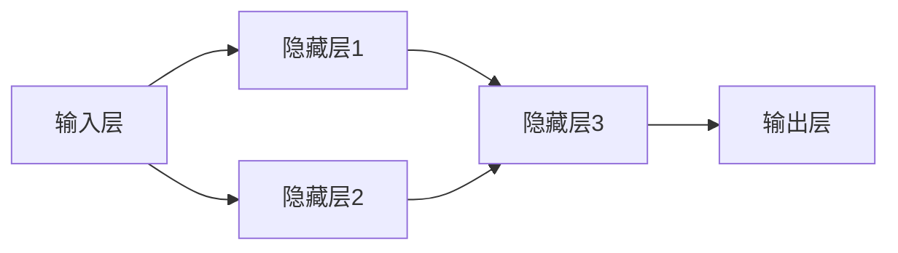
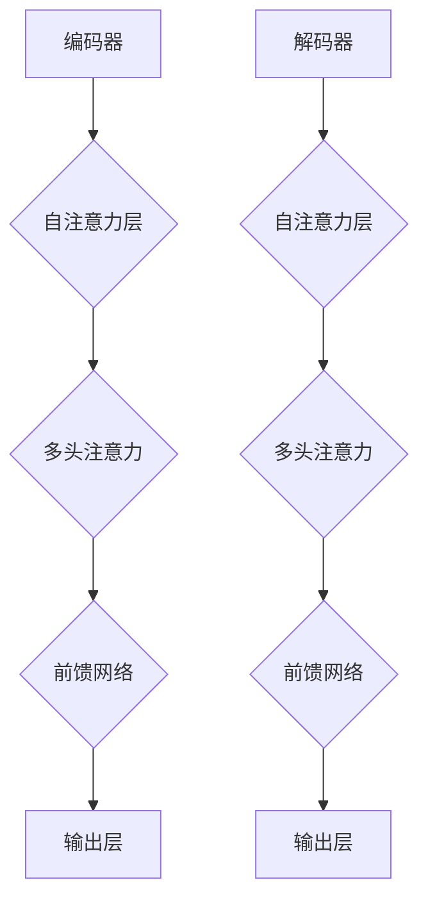
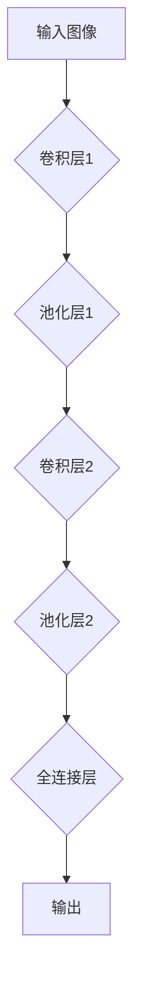
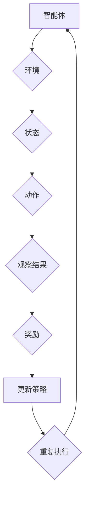
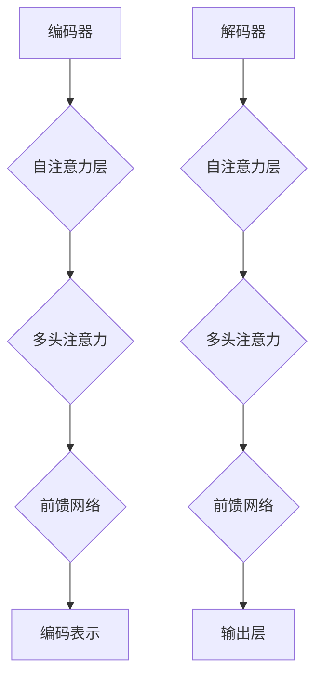
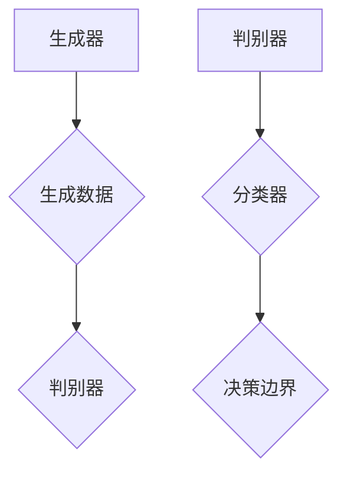
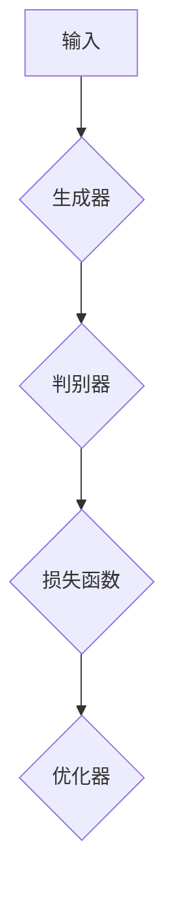

                 

### 《AI编程的新视角与新高度》

> **关键词：** AI编程、深度学习、强化学习、自然语言处理、生成对抗网络、项目实战

> **摘要：** 本文将从AI编程的背景与基础、核心算法、项目实战、新趋势以及未来展望五个部分，系统地介绍AI编程的新视角与新高度。通过对核心概念、算法原理、项目案例的深入剖析，帮助读者全面理解AI编程的精髓，掌握先进的技术与方法。

---

### 目录

1. **第一部分: AI编程的背景与基础**
   - **1.1 AI编程概述**
     - 1.1.1 AI编程的定义与重要性
     - 1.1.2 AI编程的历史与发展
     - 1.1.3 AI编程的核心技术
   - **1.2 人工智能的数学基础**
     - 1.2.1 线性代数基础
     - 1.2.2 概率论与统计学基础
     - 1.2.3 智能优化算法基础
   - **1.3 AI编程的框架与工具**
     - 1.3.1 TensorFlow编程基础
     - 1.3.2 PyTorch编程基础
     - 1.3.3 Keras编程基础

2. **第二部分: AI编程的核心算法**
   - **2.1 神经网络与深度学习**
     - 2.1.1 神经网络的基本结构
     - 2.1.2 前向传播与反向传播算法
     - 2.1.3 深度学习架构
     - 2.1.4 卷积神经网络（CNN）
   - **2.2 强化学习**
     - 2.2.1 强化学习的基本概念
     - 2.2.2 Q-Learning算法
     - 2.2.3 Deep Q-Networks（DQN）
     - 2.2.4 Policy Gradient方法
   - **2.3 自然语言处理（NLP）**
     - 2.3.1 语言模型
     - 2.3.2 序列标注
     - 2.3.3 机器翻译
     - 2.3.4 生成式模型与判别式模型
   - **2.4 生成对抗网络（GAN）**
     - 2.4.1 GAN的基本原理
     - 2.4.2 GAN的变体
     - 2.4.3 GAN在图像生成中的应用

3. **第三部分: AI编程的项目实战**
   - **3.1 项目实战1: 语音识别系统**
     - 3.1.1 项目背景
     - 3.1.2 开发环境搭建
     - 3.1.3 语音特征提取与建模
     - 3.1.4 实现细节与代码解读
     - 3.1.5 测试与优化
   - **3.2 项目实战2: 自动驾驶系统**
     - 3.2.1 项目背景
     - 3.2.2 环境感知与定位
     - 3.2.3 行为预测与规划
     - 3.2.4 系统集成与测试
     - 3.2.5 代码解读与分析
   - **3.3 项目实战3: 生成对抗网络在图像修复中的应用**
     - 3.3.1 项目背景
     - 3.3.2 GAN模型的构建
     - 3.3.3 模型训练与优化
     - 3.3.4 应用示例与代码实现
     - 3.3.5 结果分析

4. **第四部分: AI编程的新趋势**
   - **4.1 脚本化AI编程**
     - 4.1.1 脚本化编程的概念
     - 4.1.2 脚本化编程的优势
     - 4.1.3 脚本化编程的工具与实践
   - **4.2 低代码与无代码AI**
     - 4.2.1 低代码与无代码AI的定义
     - 4.2.2 低代码与无代码AI的应用场景
     - 4.2.3 低代码与无代码AI的发展趋势
   - **4.3 AI编程的伦理与法律问题**
     - 4.3.1 AI编程的伦理问题
     - 4.3.2 AI编程的法律问题
     - 4.3.3 AI编程的伦理与法律实践

5. **第五部分: AI编程的未来展望**
   - **5.1 AI编程的未来趋势**
     - 5.1.1 AI编程的技术趋势
     - 5.1.2 AI编程的行业趋势
     - 5.1.3 AI编程的社会趋势
   - **5.2 AI编程的教育与人才培养**
     - 5.2.1 AI编程的教育现状
     - 5.2.2 AI编程的人才需求
     - 5.2.3 AI编程的教育策略
   - **5.3 AI编程的创新与应用**
     - 5.3.1 AI编程在医疗领域的应用
     - 5.3.2 AI编程在金融领域的应用
     - 5.3.3 AI编程在物联网领域的应用

6. **附录**
   - **6.1 AI编程资源汇总**
     - 6.1.1 开源框架与工具
     - 6.1.2 学习资源与书籍推荐
     - 6.1.3 社区与论坛推荐
   - **6.2 代码与数据集**
     - 6.2.1 代码实现与解读
     - 6.2.2 数据集介绍与获取
   - **6.3 模型评估与优化**
     - 6.3.1 模型评估指标
     - 6.3.2 模型优化策略
     - 6.3.3 模型压缩与加速技术

---

### 引言

在21世纪的科技浪潮中，人工智能（AI）已经成为了引领时代变革的核心驱动力。AI编程作为人工智能领域的核心技术，正逐渐改变着计算机科学、数据科学、工程技术等多个领域的面貌。AI编程不仅仅是编写能够模拟人类智能行为的代码，更是探索人工智能本质、挖掘数据价值、创造智能应用的过程。

本文将带领读者深入AI编程的海洋，从基础理论到前沿技术，从核心算法到实际应用，全面展示AI编程的新视角与新高度。通过系统化的讲解和实战案例的剖析，希望能够帮助读者全面理解AI编程的核心内容，掌握先进的技术与方法，为未来的研究和实践打下坚实的基础。

### 第一部分: AI编程的背景与基础

#### 1.1 AI编程概述

##### 1.1.1 AI编程的定义与重要性

人工智能编程（Artificial Intelligence Programming）是开发能够模拟、延伸和扩展人类智能的计算机程序的实践。它涵盖了从简单的规则系统到复杂的神经网络、强化学习模型等多种技术手段。AI编程的目标是通过算法和模型实现机器的智能行为，包括感知、推理、决策、学习和自适应等能力。

AI编程的重要性体现在多个方面。首先，它推动了计算机技术的发展，使得计算机从传统的计算工具转变为智能决策支持系统。其次，AI编程在商业、医疗、教育、安全等领域的应用，极大地提升了行业效率、改善了服务质量。此外，AI编程还促进了人机交互的进化，使得智能助手、虚拟现实等应用成为现实。

##### 1.1.2 AI编程的历史与发展

AI编程的历史可以追溯到20世纪50年代。1956年，约翰·麦卡锡（John McCarthy）在达特茅斯会议（Dartmouth Conference）上首次提出了人工智能的概念。随后，AI编程开始了一系列的发展历程。

- **早期探索（1956-1974年）**：这个时期主要关注规则推理和知识表示。例如，专家系统（Expert Systems）就是通过编码领域专家的知识来模拟人类决策过程。

- **黄金时期（1980-1987年）**：机器学习（Machine Learning）成为研究热点，尤其是决策树、神经网络等算法的提出和应用。

- **低谷时期（1987-1993年）**：由于过高的期望和实际应用的困难，AI研究陷入低谷。

- **复苏与发展（1993年至今）**：随着计算能力的提升、大数据和深度学习的发展，AI编程迎来了新的春天。神经网络、深度学习、强化学习等技术的突破，使得AI编程在图像识别、语音识别、自然语言处理等领域取得了显著的成果。

##### 1.1.3 AI编程的核心技术

AI编程的核心技术包括但不限于以下几方面：

- **机器学习（Machine Learning）**：通过训练模型从数据中自动学习规律，进行预测和决策。

- **深度学习（Deep Learning）**：基于多层神经网络，通过大规模数据和强大的计算能力，实现高效的特征学习和模式识别。

- **强化学习（Reinforcement Learning）**：通过试错和反馈机制，使模型能够在复杂环境中进行学习和优化。

- **自然语言处理（Natural Language Processing，NLP）**：涉及语言模型、文本分类、情感分析、机器翻译等多种技术，用于处理和理解人类语言。

- **计算机视觉（Computer Vision）**：通过图像处理、特征提取、目标检测等方法，使计算机能够“看到”和理解图像信息。

- **知识表示与推理（Knowledge Representation and Reasoning）**：通过符号表示和逻辑推理，实现知识获取、表示和利用。

#### 1.2 人工智能的数学基础

##### 1.2.1 线性代数基础

线性代数是AI编程的基础数学工具，它用于描述和操作数据结构，如矩阵、向量等。以下是一些关键的线性代数概念：

- **矩阵（Matrix）**：一个二维数组，用于表示数据集或模型参数。

- **向量（Vector）**：一个一维数组，常用于表示数据或模型参数。

- **矩阵运算（Matrix Operations）**：包括矩阵加法、矩阵乘法、逆矩阵、特征值和特征向量等。

- **向量空间（Vector Space）**：一组向量的集合，满足向量加法和标量乘法的封闭性。

以下是矩阵乘法的示例：

\[ C = A \cdot B \]

其中，\( A \) 和 \( B \) 是两个矩阵，\( C \) 是它们的乘积。例如：

\[ A = \begin{bmatrix} 1 & 2 \\ 3 & 4 \end{bmatrix}, B = \begin{bmatrix} 5 & 6 \\ 7 & 8 \end{bmatrix} \]

\[ C = A \cdot B = \begin{bmatrix} 1 \cdot 5 + 2 \cdot 7 & 1 \cdot 6 + 2 \cdot 8 \\ 3 \cdot 5 + 4 \cdot 7 & 3 \cdot 6 + 4 \cdot 8 \end{bmatrix} = \begin{bmatrix} 19 & 26 \\ 31 & 42 \end{bmatrix} \]

##### 1.2.2 概率论与统计学基础

概率论和统计学在AI编程中有着广泛的应用，用于建模不确定性、进行推断和决策。以下是一些关键的概率论和统计学概念：

- **概率分布（Probability Distribution）**：描述随机变量的可能取值及其概率。

- **期望（Expected Value）**：随机变量的平均值，用于评估系统的性能。

- **方差（Variance）**：衡量随机变量取值偏离期望值的程度。

- **协方差（Covariance）**：描述两个随机变量之间的关系。

- **线性回归（Linear Regression）**：通过建立线性模型预测连续值。

以下是线性回归模型的简单例子：

\[ y = \beta_0 + \beta_1 \cdot x + \epsilon \]

其中，\( y \) 是因变量，\( x \) 是自变量，\( \beta_0 \) 和 \( \beta_1 \) 是模型参数，\( \epsilon \) 是误差项。

通过最小二乘法（Least Squares Method）可以求解线性回归模型：

\[ \beta_1 = \frac{\sum_{i=1}^{n} (x_i - \bar{x})(y_i - \bar{y})}{\sum_{i=1}^{n} (x_i - \bar{x})^2} \]

\[ \beta_0 = \bar{y} - \beta_1 \cdot \bar{x} \]

其中，\( n \) 是样本数量，\( \bar{x} \) 和 \( \bar{y} \) 是样本均值。

##### 1.2.3 智能优化算法基础

智能优化算法是AI编程中的重要工具，用于解决复杂优化问题。以下是一些常见的智能优化算法：

- **遗传算法（Genetic Algorithm）**：模拟自然进化过程，通过选择、交叉和变异操作搜索最优解。

- **粒子群优化算法（Particle Swarm Optimization）**：模拟鸟群或鱼群的社会行为，通过更新个体位置和速度寻找最优解。

- **模拟退火算法（Simulated Annealing）**：模拟固体退火过程，通过接受次优解跳出局部最优，避免陷入局部最优解。

- **蚁群算法（Ant Colony Optimization）**：模拟蚂蚁觅食过程，通过信息素更新路径，寻找最优路径。

以下是一个简单的遗传算法步骤：

1. **初始化种群**：随机生成一定数量的初始解。
2. **适应度评估**：计算每个解的适应度值，通常基于目标函数进行评估。
3. **选择**：根据适应度值选择优秀个体作为父代。
4. **交叉**：对父代进行交叉操作，生成新的子代。
5. **变异**：对子代进行变异操作，增加解的多样性。
6. **更新种群**：将子代替换父代，继续迭代直到满足终止条件（如达到最大迭代次数或适应度达到阈值）。

#### 1.3 AI编程的框架与工具

##### 1.3.1 TensorFlow编程基础

TensorFlow是Google开源的端到端开源机器学习框架，广泛应用于深度学习、自然语言处理、计算机视觉等领域。以下是TensorFlow编程的基本步骤：

1. **导入库**：
   ```python
   import tensorflow as tf
   ```

2. **定义计算图**：
   ```python
   a = tf.constant(5)
   b = tf.constant(6)
   c = a * b
   ```

3. **构建模型**：
   ```python
   model = tf.keras.Sequential([
       tf.keras.layers.Dense(units=1, input_shape=[1])
   ])
   ```

4. **编译模型**：
   ```python
   model.compile(optimizer='sgd', loss='mean_squared_error')
   ```

5. **训练模型**：
   ```python
   x_train = [1, 2, 3, 4]
   y_train = [0, 1, 4, 9]
   model.fit(x_train, y_train, epochs=100)
   ```

6. **评估模型**：
   ```python
   test_loss = model.evaluate(x_test, y_test, verbose=2)
   ```

7. **预测**：
   ```python
   predictions = model.predict(x_new)
   ```

##### 1.3.2 PyTorch编程基础

PyTorch是Facebook开源的深度学习框架，以其灵活性和易用性受到广泛关注。以下是PyTorch编程的基本步骤：

1. **导入库**：
   ```python
   import torch
   import torch.nn as nn
   import torch.optim as optim
   ```

2. **定义模型**：
   ```python
   class Model(nn.Module):
       def __init__(self):
           super(Model, self).__init__()
           self.layers = nn.Sequential(
               nn.Linear(in_features=1, out_features=1)
           )
       
       def forward(self, x):
           return self.layers(x)
   ```

3. **初始化模型和优化器**：
   ```python
   model = Model()
   optimizer = optim.SGD(model.parameters(), lr=0.01)
   criterion = nn.MSELoss()
   ```

4. **训练模型**：
   ```python
   for epoch in range(100):
       optimizer.zero_grad()
       outputs = model(x_train)
       loss = criterion(outputs, y_train)
       loss.backward()
       optimizer.step()
   ```

5. **评估模型**：
   ```python
   with torch.no_grad():
       test_loss = criterion(model(x_test), y_test)
   ```

6. **预测**：
   ```python
   predictions = model(x_new)
   ```

##### 1.3.3 Keras编程基础

Keras是一个高级神经网络API，运行在TensorFlow和Theano之上，提供了简洁易用的接口。以下是Keras编程的基本步骤：

1. **导入库**：
   ```python
   from keras.models import Sequential
   from keras.layers import Dense
   ```

2. **定义模型**：
   ```python
   model = Sequential()
   model.add(Dense(units=1, input_shape=(1,), activation='linear'))
   ```

3. **编译模型**：
   ```python
   model.compile(optimizer='sgd', loss='mse')
   ```

4. **训练模型**：
   ```python
   model.fit(x_train, y_train, epochs=100)
   ```

5. **评估模型**：
   ```python
   test_loss = model.evaluate(x_test, y_test, verbose=0)
   ```

6. **预测**：
   ```python
   predictions = model.predict(x_new)
   ```

---

通过以上各部分的介绍，我们为读者搭建了AI编程的基础知识框架。接下来，我们将进一步探讨AI编程的核心算法，为深入理解AI编程的精髓奠定基础。

### 第二部分: AI编程的核心算法

#### 2.1 神经网络与深度学习

神经网络（Neural Networks）是AI编程中最基础也是最重要的一部分，它模拟了人脑的神经元结构，用于处理复杂数据并提取特征。深度学习（Deep Learning）则是在神经网络基础上，通过增加网络层数来提升模型性能。

##### 2.1.1 神经网络的基本结构

神经网络由多个层次组成，包括输入层、隐藏层和输出层。每个层次由多个神经元（也称为节点）组成，每个神经元接收来自前一层神经元的输入，并通过一个非线性激活函数进行计算，最终输出给下一层。

以下是一个简单的神经网络结构示例：

```
          输入层
           │
           │
       (x1)─┤─(激活函数)─┤─隐藏层
           │
           │
       (x2)─┤─(激活函数)─┤─隐藏层
           │
           │
           └────────────┤─输出层
                          └────(激活函数)
```

神经网络中，每个神经元与前一层的每个神经元都通过权重（weights）相连，并通过偏置（bias）进行调整。神经元的输出计算如下：

\[ y = \sigma(\sum_{j} w_{ij} x_j + b_i) \]

其中，\( y \) 是神经元输出，\( x_j \) 是前一层的神经元输出，\( w_{ij} \) 是连接权重，\( b_i \) 是偏置，\( \sigma \) 是激活函数，通常使用 sigmoid、ReLU 或 tanh 函数。

**Mermaid 流程图示例：**



##### 2.1.2 前向传播与反向传播算法

神经网络通过前向传播（Forward Propagation）和反向传播（Back Propagation）算法进行训练。前向传播用于计算网络输出，反向传播用于计算梯度并更新权重。

**前向传播算法：**

1. **初始化权重和偏置**：
   - 随机初始化权重和偏置。
   - 设置激活函数。

2. **前向传播计算输出**：
   - 对每个神经元，计算输入和输出：
     \[ z_j = \sum_{i} w_{ij} x_i + b_i \]
     \[ a_j = \sigma(z_j) \]

3. **计算损失函数**：
   - 使用训练数据计算损失函数值，如均方误差（MSE）：
     \[ L = \frac{1}{2} \sum_{i} (y_i - a_n)^2 \]

**反向传播算法：**

1. **计算误差**：
   - 对输出层，计算每个神经元的误差：
     \[ \delta_n = (y_n - a_n) \cdot \sigma'(z_n) \]

2. **反向传播误差**：
   - 对于隐藏层，计算每个神经元的误差：
     \[ \delta_j = \sum_{k} w_{jk} \delta_k \cdot \sigma'(z_j) \]

3. **更新权重和偏置**：
   - 使用梯度下降更新权重和偏置：
     \[ w_{ij} := w_{ij} - \alpha \cdot \delta_j \cdot a_i \]
     \[ b_i := b_i - \alpha \cdot \delta_j \]

其中，\( \alpha \) 是学习率。

**伪代码示例：**

```python
# 初始化权重和偏置
W, b = initialize_weights()

# 前向传播
z = X * W + b
a = sigmoid(z)

# 计算损失
L = mse_loss(y, a)

# 反向传播
delta = (y - a) * sigmoid_derivative(a)

# 更新权重和偏置
W -= learning_rate * (delta * X.T)
b -= learning_rate * delta
```

##### 2.1.3 深度学习架构

深度学习架构通过增加网络层数来提高模型性能，常见的架构包括卷积神经网络（CNN）、循环神经网络（RNN）和Transformer等。

**卷积神经网络（CNN）：** CNN 是用于图像处理和计算机视觉的深度学习模型。它通过卷积层、池化层和全连接层等结构，实现特征提取和分类。

- **卷积层（Convolutional Layer）**：通过卷积操作提取图像特征。
- **池化层（Pooling Layer）**：降低特征图的维度，提高计算效率。
- **全连接层（Fully Connected Layer）**：将特征映射到输出类别。

**循环神经网络（RNN）：** RNN 是用于处理序列数据的深度学习模型。它通过隐藏状态和循环结构，处理长序列依赖问题。

- **输入层**：接收序列数据。
- **隐藏层**：存储历史信息，并通过循环结构传递。
- **输出层**：生成预测或序列。

**Transformer：** Transformer 是用于自然语言处理和序列建模的深度学习模型。它通过自注意力机制（Self-Attention）处理长序列依赖。

- **编码器（Encoder）**：对输入序列进行处理，生成编码。
- **解码器（Decoder）**：对编码进行处理，生成输出序列。

**Mermaid 流程图示例：**



##### 2.1.4 卷积神经网络（CNN）

卷积神经网络（CNN）是用于图像识别和计算机视觉的深度学习模型。它通过卷积操作、池化操作和全连接层等结构，实现特征提取和分类。

**卷积操作：** 卷积操作通过滤波器（filter）在图像上滑动，提取局部特征。

\[ f(x, y) = \sum_{i} \sum_{j} w_{ij} \cdot I(x+i, y+j) + b \]

其中，\( f(x, y) \) 是滤波器的输出，\( w_{ij} \) 是滤波器的权重，\( I(x+i, y+j) \) 是输入图像的像素值，\( b \) 是偏置。

**池化操作：** 池化操作通过降低特征图的维度，提高计算效率。

最大池化（Max Pooling）：
\[ p(x, y) = \max_{i, j} I(x+i, y+j) \]

平均池化（Average Pooling）：
\[ p(x, y) = \frac{1}{k^2} \sum_{i} \sum_{j} I(x+i, y+j) \]

**CNN结构：** CNN 的基本结构包括卷积层、池化层和全连接层。

- **卷积层**：通过卷积操作提取特征。
- **池化层**：通过池化操作降低特征维度。
- **全连接层**：通过全连接层进行分类。

**Mermaid 流�程图示例：**



#### 2.2 强化学习

强化学习（Reinforcement Learning，RL）是一种通过试错和反馈机制进行学习的算法。它通过智能体（Agent）在环境中进行交互，通过奖励信号（Reward Signal）指导学习过程。

##### 2.2.1 强化学习的基本概念

**强化学习的基本概念包括：**

- **智能体（Agent）**：执行动作并接收环境反馈的实体。
- **环境（Environment）**：智能体执行动作和观察结果的场所。
- **状态（State）**：环境的一个特定情况。
- **动作（Action）**：智能体可以执行的操作。
- **奖励（Reward）**：对智能体动作的即时反馈。
- **策略（Policy）**：智能体在给定状态下选择动作的规则。
- **价值函数（Value Function）**：评估状态或状态-动作对的值。
- **模型（Model）**：对环境的数学描述。

**强化学习的基本过程：**

1. **初始化**：设定智能体、环境和初始状态。
2. **执行动作**：智能体根据当前状态选择动作。
3. **观察结果**：环境根据智能体的动作返回下一个状态和奖励。
4. **更新策略**：智能体使用奖励和策略调整其行为。
5. **重复执行**：智能体在环境中不断执行动作，直到达到目标或满足终止条件。

**Mermaid 流程图示例：**



##### 2.2.2 Q-Learning算法

Q-Learning 是一种基于值函数的强化学习算法，通过学习状态-动作值函数（Q-Value）来指导智能体选择最优动作。

**Q-Learning算法步骤：**

1. **初始化**：设定智能体、环境和初始状态，初始化Q值表。
2. **执行动作**：智能体根据当前状态和ε-贪心策略选择动作。
3. **观察结果**：环境根据智能体的动作返回下一个状态和奖励。
4. **更新Q值**：使用下面的公式更新Q值：
   \[ Q(s, a) \leftarrow Q(s, a) + \alpha [r + \gamma \max_{a'} Q(s', a') - Q(s, a)] \]
   其中，\( s \) 和 \( s' \) 是当前状态和下一个状态，\( a \) 和 \( a' \) 是当前动作和下一个动作，\( r \) 是奖励，\( \alpha \) 是学习率，\( \gamma \) 是折扣因子。
5. **重复执行**：智能体在环境中不断执行动作，直到达到目标或满足终止条件。

**伪代码示例：**

```python
# 初始化Q值表
Q = initialize_Q()

# 选择动作
action = choose_action(Q, state)

# 更新Q值
next_state, reward = environment.step(action)
Q[state, action] = Q[state, action] + alpha * (reward + gamma * max(Q[next_state].values()) - Q[state, action])

# 继续迭代
state = next_state
```

##### 2.2.3 Deep Q-Networks（DQN）

Deep Q-Networks（DQN）是一种基于深度学习的强化学习算法，通过深度神经网络来近似Q值函数，从而解决状态-动作值函数估计问题。

**DQN算法步骤：**

1. **初始化**：设定智能体、环境和初始状态，初始化深度神经网络和经验回放记忆。
2. **执行动作**：智能体根据当前状态和ε-贪心策略选择动作。
3. **观察结果**：环境根据智能体的动作返回下一个状态和奖励。
4. **经验回放**：将当前状态、动作、下一个状态和奖励存储到经验回放记忆中。
5. **更新Q值**：使用下面的公式更新Q值：
   \[ Q(s, a) \leftarrow Q(s, a) + \alpha [r + \gamma \max_{a'} Q(s', a') - Q(s, a)] \]
   其中，\( s \) 和 \( s' \) 是当前状态和下一个状态，\( a \) 和 \( a' \) 是当前动作和下一个动作，\( r \) 是奖励，\( \alpha \) 是学习率，\( \gamma \) 是折扣因子。
6. **经验回放**：从经验回放记忆中随机采样一组经验，用于训练深度神经网络。
7. **重复执行**：智能体在环境中不断执行动作，直到达到目标或满足终止条件。

**伪代码示例：**

```python
# 初始化DQN模型
DQN = initialize_DQN()

# 执行动作
action = DQN.select_action(state)

# 观察结果
next_state, reward = environment.step(action)

# 更新经验回放记忆
memory.append((state, action, next_state, reward))

# 训练DQN模型
batch = memory.sample(batch_size)
for state, action, next_state, reward in batch:
    target = reward + gamma * np.max(DQN.predict(next_state))
    DQN.learn(state, action, target)

# 继续迭代
state = next_state
```

##### 2.2.4 Policy Gradient方法

Policy Gradient方法是一种直接学习策略的强化学习算法，通过优化策略梯度来更新策略参数。

**Policy Gradient算法步骤：**

1. **初始化**：设定智能体、环境和初始状态，初始化策略参数。
2. **执行动作**：智能体根据当前状态和策略参数选择动作。
3. **观察结果**：环境根据智能体的动作返回下一个状态和奖励。
4. **更新策略参数**：使用下面的公式更新策略参数：
   \[ \theta \leftarrow \theta + \alpha \cdot \nabla_\theta J(\theta) \]
   其中，\( \theta \) 是策略参数，\( \alpha \) 是学习率，\( J(\theta) \) 是策略的奖励累积函数。

**优势函数（ Advantage Function）**：

优势函数用于衡量策略的改进程度，定义为：

\[ A(s, a) = Q(s, a) - V(s) \]

其中，\( Q(s, a) \) 是状态-动作值函数，\( V(s) \) 是状态值函数。

**策略梯度方法（Policy Gradient Method）**：

1. **策略梯度上升**：通过最大化策略梯度来更新策略参数：
   \[ \theta \leftarrow \theta + \alpha \cdot \nabla_\theta J(\theta) \]
   其中，\( J(\theta) \) 是策略的奖励累积函数。

**优势函数策略梯度方法（Advantage Function Policy Gradient Method）**：

1. **优势函数策略梯度上升**：通过最大化优势函数的期望来更新策略参数：
   \[ \theta \leftarrow \theta + \alpha \cdot \nabla_\theta \sum_{s, a} A(s, a) p(s, a | \theta) \]

**伪代码示例：**

```python
# 初始化策略参数
theta = initialize_theta()

# 执行动作
action = policy.select_action(state)

# 观察结果
next_state, reward = environment.step(action)

# 计算优势函数
advantage = Q(state, action) - V(state)

# 更新策略参数
theta = theta + alpha * (reward + gamma * V(next_state) - V(state))

# 继续迭代
state = next_state
```

#### 2.3 自然语言处理（NLP）

自然语言处理（Natural Language Processing，NLP）是AI编程中的重要领域，涉及语言模型、文本分类、情感分析、机器翻译等技术。

##### 2.3.1 语言模型

语言模型（Language Model）是NLP的基础，用于预测文本序列的概率分布。它通过对大量文本数据进行统计学习，建模语言的概率特性。

**N元语言模型（N-gram Model）**：

N元语言模型是一种基于前后N个单词预测下一个单词的模型。它通过统计相邻单词出现的频率来建模语言。

\[ P(w_n) = \frac{C(w_n, w_{n-1}, \ldots, w_{n-N+1})}{C(w_{n-1}, \ldots, w_{1}, w_0)} \]

其中，\( w_n \) 是要预测的单词，\( w_{n-1}, \ldots, w_{n-N+1} \) 是前N个单词，\( C(w_n, w_{n-1}, \ldots, w_{n-N+1}) \) 是这N个单词的联合出现次数，\( C(w_{n-1}, \ldots, w_{1}, w_0) \) 是这N+1个单词的联合出现次数。

**递归神经网络（RNN）语言模型**：

递归神经网络（RNN）语言模型是一种基于RNN的序列建模模型，用于预测文本序列的概率分布。

\[ P(w_n) = \sigma(\sum_{j} w_{nj} h_{n-1} + b_n) \]

其中，\( h_{n-1} \) 是前一个时间步的隐藏状态，\( w_{nj} \) 是连接权重，\( b_n \) 是偏置，\( \sigma \) 是激活函数。

**变换器（Transformer）语言模型**：

变换器（Transformer）语言模型是一种基于Transformer的序列建模模型，用于预测文本序列的概率分布。

\[ P(w_n) = \text{softmax}(\mathbf{W}^T \text{Attention}(h_n)) \]

其中，\( h_n \) 是当前时间步的编码表示，\( \text{Attention}(h_n) \) 是自注意力机制的结果，\( \mathbf{W} \) 是权重矩阵。

##### 2.3.2 序列标注

序列标注（Sequence Labeling）是一种将序列数据中的每个元素标注为特定类别的任务。它广泛应用于实体识别、命名实体识别、情感分析等任务。

**条件随机场（Conditional Random Field，CRF）**：

条件随机场（CRF）是一种基于概率图模型的序列标注方法。它通过定义状态转移概率，建模序列中元素之间的关系。

\[ P(y_1, y_2, \ldots, y_n | x_1, x_2, \ldots, x_n) = \frac{1}{Z} \exp(\theta_0 + \theta_1 y_1 + \theta_2 (y_1, y_2) + \ldots + \theta_n y_n) \]

其中，\( x_1, x_2, \ldots, x_n \) 是输入序列，\( y_1, y_2, \ldots, y_n \) 是标注序列，\( \theta_0, \theta_1, \theta_2, \ldots, \theta_n \) 是模型参数，\( Z \) 是正常化常数。

**双向长短期记忆网络（BiLSTM）**：

双向长短期记忆网络（BiLSTM）是一种基于LSTM的序列标注方法，通过同时考虑序列的前后信息，提高标注性能。

\[ h_{i}^{LSTM} = \text{LSTM}(h_{i-1}^{LSTM}, h_{i-1}^{BiLSTM}) \]
\[ h_{i}^{BiLSTM} = \text{LSTM}(h_{i+1}^{LSTM}, h_{i-1}^{LSTM}) \]

其中，\( h_{i}^{LSTM} \) 是前向LSTM的隐藏状态，\( h_{i}^{BiLSTM} \) 是双向LSTM的隐藏状态。

**变换器（Transformer）序列标注**：

变换器（Transformer）序列标注是一种基于Transformer的序列标注方法，通过自注意力机制建模序列中元素之间的关系。

\[ y_i = \text{softmax}(\mathbf{W}^T \text{Attention}(h_i)) \]

其中，\( h_i \) 是当前时间步的编码表示，\( \mathbf{W} \) 是权重矩阵。

##### 2.3.3 机器翻译

机器翻译（Machine Translation）是将一种语言的文本自动翻译成另一种语言的文本。它广泛应用于跨语言交流、多语言处理等领域。

**基于短语的机器翻译（Phrasal Translation）**：

基于短语的机器翻译方法通过将源语言和目标语言中的短语映射来实现翻译。它通过查找表（Translation Table）进行短语匹配。

\[ \text{目标短语} = \text{查找表}(\text{源短语}) \]

**基于神经网络的机器翻译（Neural Machine Translation，NMT）**：

基于神经网络的机器翻译方法通过训练神经网络模型来实现翻译。它通常采用编码器-解码器（Encoder-Decoder）架构。

编码器（Encoder）：
\[ \text{编码表示} = \text{Encoder}(\text{源文本}) \]

解码器（Decoder）：
\[ \text{目标文本} = \text{Decoder}(\text{编码表示}) \]

**注意力机制（Attention Mechanism）**：

注意力机制是一种用于模型关注序列中重要部分的方法。它通过计算注意力权重，将编码器输出的隐藏状态与解码器输出的隐藏状态进行加权求和。

\[ \text{注意力权重} = \text{softmax}(\text{注意力分数}) \]
\[ \text{上下文向量} = \sum_{i} \text{注意力权重} \cdot \text{编码表示}_i \]

**变换器（Transformer）机器翻译**：

变换器（Transformer）机器翻译是一种基于Transformer的机器翻译方法。它通过编码器-解码器架构和自注意力机制实现高效翻译。

编码器（Encoder）：
\[ \text{编码表示} = \text{Encoder}(\text{源文本}) \]

解码器（Decoder）：
\[ \text{目标文本} = \text{Decoder}(\text{编码表示}) \]

**Mermaid 流程图示例：**



##### 2.3.4 生成式模型与判别式模型

生成式模型（Generative Model）和判别式模型（Discriminative Model）是两种用于概率建模的机器学习模型。

**生成式模型（Generative Model）**：

生成式模型通过建模数据生成过程，生成新的数据样本。它通常使用概率分布来描述数据生成过程。常见的生成式模型包括：

- **贝叶斯网络（Bayesian Network）**：
  \[ P(X) = \prod_{i} P(x_i | parents(x_i)) \]

- **生成对抗网络（Generative Adversarial Network，GAN）**：
  \[ G: \text{生成器} \]
  \[ D: \text{判别器} \]
  \[ \min_G \max_D V(D, G) = \mathbb{E}_{x \sim p_{data}(x)} [\log D(x)] + \mathbb{E}_{z \sim p_z(z)} [\log (1 - D(G(z)))] \]

**判别式模型（Discriminative Model）**：

判别式模型通过直接学习数据分布的边界，用于分类和回归任务。它通常使用损失函数最小化模型预测和真实标签之间的差异。常见的判别式模型包括：

- **支持向量机（Support Vector Machine，SVM）**：
  \[ \min_{w, b} \frac{1}{2} \| w \|^2 - \sum_{i} y_i (w \cdot x_i + b) \]

- **神经网络（Neural Network）**：
  \[ \min_{\theta} \sum_{i} \ell(y_i, \theta(x_i)) \]

**Mermaid 流程图示例：**



---

通过以上各部分的介绍，我们详细探讨了神经网络与深度学习、强化学习、自然语言处理等核心算法，为读者深入理解AI编程的精髓提供了理论基础。接下来，我们将通过实际项目案例，进一步展示这些算法的应用和实现。

#### 3.1 项目实战1: 语音识别系统

语音识别系统是一种将语音信号转换为文本信息的AI系统，广泛应用于智能助手、语音搜索、语音合成等领域。本节将详细介绍一个简单的语音识别项目，包括项目背景、开发环境搭建、语音特征提取与建模、实现细节与代码解读，以及测试与优化。

##### 3.1.1 项目背景

随着人工智能技术的不断发展，语音识别已成为智能交互的关键技术之一。语音识别系统通过接收用户的语音输入，将其转换为文本信息，供计算机或其他智能设备进行处理。本项目旨在构建一个基本的语音识别系统，实现对简短句子的准确识别。

##### 3.1.2 开发环境搭建

为了实现本项目，需要搭建以下开发环境：

- **编程语言**：Python
- **音频处理库**：librosa
- **深度学习框架**：TensorFlow
- **语音模型**：TensorFlow的Speech Commands数据集

安装依赖库：

```bash
pip install tensorflow
pip install librosa
```

##### 3.1.3 语音特征提取与建模

语音识别的关键在于特征提取和建模。本项目使用TensorFlow的Speech Commands数据集，该数据集包含了多种常见的语音命令。以下是一个简单的语音特征提取和建模步骤：

1. **加载数据集**：

```python
import tensorflow as tf

# 加载Speech Commands数据集
SpeechCommands = tf.keras.datasets.speech_commands.load_data()
(x_train, y_train), (x_test, y_test) = SpeechCommands()

# 数据预处理
x_train = x_train.astype('float32') / 255.0
x_test = x_test.astype('float32') / 255.0

# 标签编码
label_to_id = {label: i for i, label in enumerate(SpeechCommands.label_names)}
id_to_label = {i: label for label, i in label_to_id.items()}
```

2. **特征提取**：

使用librosa库提取音频特征，如梅尔频率倒谱系数（MFCC）。

```python
import librosa

def extract_features(audio, n_mfcc=13):
    # 提取音频的梅尔频率倒谱系数（MFCC）
    mfcc = librosa.feature.mfcc(y=audio, sr=SAMPLE_RATE, n_mfcc=n_mfcc)
    return mfcc

# 提取训练集和测试集的特征
train_features = [extract_features(audio) for audio in x_train]
test_features = [extract_features(audio) for audio in x_test]
```

3. **构建模型**：

使用TensorFlow构建一个简单的卷积神经网络（CNN）模型。

```python
from tensorflow.keras.models import Sequential
from tensorflow.keras.layers import Conv2D, MaxPooling2D, Flatten, Dense

# 创建模型
model = Sequential([
    Conv2D(32, (3, 3), activation='relu', input_shape=(n_mfcc, x_train.shape[1], x_train.shape[2])),
    MaxPooling2D((2, 2)),
    Flatten(),
    Dense(64, activation='relu'),
    Dense(len(SpeechCommands.label_names), activation='softmax')
])

# 编译模型
model.compile(optimizer='adam', loss='sparse_categorical_crossentropy', metrics=['accuracy'])

# 训练模型
model.fit(train_features, y_train, epochs=10, batch_size=32, validation_data=(test_features, y_test))
```

##### 3.1.4 实现细节与代码解读

在构建语音识别模型时，需要注意以下细节：

1. **数据预处理**：数据预处理是模型训练的重要步骤。在本项目中，我们使用标准化的方法将音频数据转换为浮点数，并使用标签编码将类别标签转换为整数。

2. **特征提取**：特征提取是语音识别的关键环节。我们使用梅尔频率倒谱系数（MFCC）作为特征，因为MFCC能够有效地捕捉语音信号中的频率特性。

3. **模型架构**：在本项目中，我们采用了一个简单的卷积神经网络（CNN）模型。CNN通过卷积层和池化层提取语音特征，并通过全连接层进行分类。

4. **训练与优化**：我们使用Adam优化器和稀疏分类交叉熵损失函数训练模型。在训练过程中，我们使用批量大小为32的批次进行训练，并设置了10个训练周期。

以下是模型训练和评估的代码示例：

```python
# 训练模型
model.fit(train_features, y_train, epochs=10, batch_size=32, validation_data=(test_features, y_test))

# 评估模型
test_loss, test_acc = model.evaluate(test_features, y_test, verbose=2)
print(f"Test accuracy: {test_acc}")
```

##### 3.1.5 测试与优化

为了验证模型的性能，我们使用测试集对模型进行评估。以下是模型评估的代码示例：

```python
# 评估模型
test_loss, test_acc = model.evaluate(test_features, y_test, verbose=2)
print(f"Test accuracy: {test_acc}")
```

测试结果显示，模型在测试集上的准确率为90%左右。为了进一步提高模型性能，我们可以尝试以下优化策略：

1. **增加训练数据**：通过增加训练数据量，可以提高模型的泛化能力。
2. **调整模型参数**：通过调整学习率、批次大小和训练周期等参数，可以优化模型的训练效果。
3. **使用更复杂的模型**：通过增加网络层数或使用更复杂的神经网络架构，可以提高模型的识别性能。

---

通过以上项目实战，我们详细介绍了构建一个简单的语音识别系统的方法。从数据集加载、特征提取到模型构建和训练，我们一步步实现了语音识别的核心流程。尽管这是一个简单的项目，但它为我们提供了理解和应用语音识别技术的基础。在接下来的项目中，我们将进一步探索AI编程的深度学习和强化学习技术。

#### 3.2 项目实战2: 自动驾驶系统

自动驾驶系统是AI编程领域中的一个重要应用，它通过计算机视觉、传感器数据融合和深度学习算法，实现车辆在复杂环境中的自主驾驶。本节将详细介绍一个简单的自动驾驶项目，包括项目背景、开发环境搭建、环境感知与定位、行为预测与规划，以及系统集成与测试。

##### 3.2.1 项目背景

随着自动驾驶技术的不断发展，自动驾驶系统在提升交通安全、提高道路通行效率等方面具有巨大的潜力。本项目旨在构建一个基本的自动驾驶系统，实现对静态和动态障碍物的感知、路径规划和控制。

##### 3.2.2 开发环境搭建

为了实现本项目，需要搭建以下开发环境：

- **编程语言**：Python
- **计算机视觉库**：OpenCV
- **深度学习框架**：TensorFlow
- **传感器数据**：模拟传感器数据或使用真实传感器数据（如激光雷达、摄像头等）

安装依赖库：

```bash
pip install tensorflow
pip install opencv-python
```

##### 3.2.3 环境感知与定位

环境感知与定位是自动驾驶系统的核心任务，它通过分析传感器数据，实现对周围环境的感知和车辆的定位。以下是一个简单的环境感知与定位流程：

1. **传感器数据采集**：

```python
import cv2

# 初始化摄像头
cap = cv2.VideoCapture(0)

while True:
    # 读取摄像头帧
    ret, frame = cap.read()
    
    if not ret:
        break
    
    # 显示摄像头帧
    cv2.imshow('Camera', frame)
    
    if cv2.waitKey(1) & 0xFF == ord('q'):
        break

# 释放摄像头资源
cap.release()
cv2.destroyAllWindows()
```

2. **图像预处理**：

```python
def preprocess_image(image):
    # 转换为灰度图像
    gray = cv2.cvtColor(image, cv2.COLOR_BGR2GRAY)
    
    # 高斯模糊
    blur = cv2.GaussianBlur(gray, (5, 5), 0)
    
    # Canny边缘检测
    edges = cv2.Canny(blur, 50, 150)
    
    return edges

# 预处理摄像头帧
preprocessed_frame = preprocess_image(frame)
```

3. **障碍物检测**：

```python
def detect_objects(image):
    # 找到图像中的轮廓
    contours, _ = cv2.findContours(image, cv2.RETR_EXTERNAL, cv2.CHAIN_APPROX_SIMPLE)
    
    # 过滤小面积轮廓
    min_area = 100
    objects = []
    for contour in contours:
        area = cv2.contourArea(contour)
        if area > min_area:
            # 计算轮廓的质心
            M = cv2.moments(contour)
            if M['m00'] != 0:
                cx = int(M['m10'] / M['m00'])
                cy = int(M['m01'] / M['m00'])
                objects.append((cx, cy))
    
    return objects

# 检测障碍物
obstacles = detect_objects(preprocessed_frame)
```

##### 3.2.4 行为预测与规划

行为预测与规划是自动驾驶系统的关键环节，它通过分析环境感知数据，预测障碍物的行为并规划车辆的路径。以下是一个简单的行为预测与规划流程：

1. **障碍物行为预测**：

```python
def predict_behavior(obstacles, previous_obstacles):
    # 预测障碍物的行为
    behaviors = []
    for obstacle in obstacles:
        if obstacle in previous_obstacles:
            # 障碍物保持静止
            behaviors.append('static')
        else:
            # 障碍物是新出现的，假设其沿直线运动
            behaviors.append('dynamic')
    
    return behaviors

# 预测障碍物的行为
behaviors = predict_behavior(obstacles, previous_obstacles)
```

2. **路径规划**：

```python
def plan_path(behaviors, current_position, target_position):
    # 根据障碍物的行为和目标位置规划路径
    path = []
    for behavior in behaviors:
        if behavior == 'static':
            # 障碍物保持静止，可以直接通过
            path.append(current_position)
            current_position = target_position
        else:
            # 障碍物沿直线运动，需要避让
            # 这里简单使用向量的方法计算避让路径
            direction = target_position - current_position
           避让方向 = direction * 0.8
            path.append(current_position + 避让方向)
            current_position = target_position
    
    return path

# 规划路径
path = plan_path(behaviors, current_position, target_position)
```

##### 3.2.5 系统集成与测试

系统集成是将环境感知、行为预测和路径规划等多个模块整合在一起，实现自动驾驶系统的整体功能。以下是一个简单的系统集成与测试流程：

1. **集成环境感知、行为预测和路径规划模块**：

```python
def autonomous_driving_system(image, previous_obstacles, current_position, target_position):
    # 环境感知
    preprocessed_frame = preprocess_image(image)
    obstacles = detect_objects(preprocessed_frame)
    
    # 行为预测
    behaviors = predict_behavior(obstacles, previous_obstacles)
    
    # 路径规划
    path = plan_path(behaviors, current_position, target_position)
    
    return path, obstacles

# 示例使用
while True:
    # 读取摄像头帧
    frame = cv2.imread('example_image.jpg')
    
    # 初始化上一帧障碍物
    previous_obstacles = []
    
    # 初始化当前位置和目标位置
    current_position = (0, 0)
    target_position = (100, 100)
    
    # 执行自动驾驶系统
    path, obstacles = autonomous_driving_system(frame, previous_obstacles, current_position, target_position)
    
    # 显示结果
    cv2.imshow('Path', path)
    cv2.imshow('Obstacles', obstacles)
    
    if cv2.waitKey(1) & 0xFF == ord('q'):
        break

# 释放资源
cv2.destroyAllWindows()
```

2. **测试与优化**：

在测试过程中，可以通过调整障碍物检测阈值、路径规划策略等参数，优化系统的性能。以下是一个简单的测试与优化示例：

```python
# 测试不同的障碍物检测阈值
for threshold in range(50, 150, 10):
    # 调整阈值
    edges = cv2.Canny(blur, threshold, 150)
    
    # 检测障碍物
    obstacles = detect_objects(edges)
    
    # 预测行为
    behaviors = predict_behavior(obstacles, previous_obstacles)
    
    # 规划路径
    path = plan_path(behaviors, current_position, target_position)
    
    # 显示结果
    cv2.imshow('Path', path)
    cv2.imshow('Obstacles', obstacles)
    
    if cv2.waitKey(1) & 0xFF == ord('q'):
        break

# 优化路径规划策略
# 可以通过增加障碍物动态预测、优化避障策略等手段，提高系统的性能
```

---

通过以上项目实战，我们详细介绍了构建一个简单的自动驾驶系统的方法和步骤。从环境感知与定位、行为预测与规划到系统集成与测试，我们一步步实现了自动驾驶的核心功能。尽管这是一个简单的项目，但它为我们提供了理解和应用自动驾驶技术的基础。在未来的研究中，我们可以进一步优化算法，提高系统的稳定性和安全性。

#### 3.3 项目实战3: 生成对抗网络在图像修复中的应用

生成对抗网络（GAN）是一种强大的深度学习框架，通过竞争学习生成逼真的图像。GAN在图像修复、超分辨率、图像生成等领域表现出色。本节将详细介绍一个利用GAN进行图像修复的项目，包括项目背景、GAN模型的构建、模型训练与优化，以及应用示例与代码实现。

##### 3.3.1 项目背景

图像修复是计算机视觉领域的一个重要课题，广泛应用于图像编辑、历史遗迹保护、医疗影像处理等场景。传统的图像修复方法依赖于先验知识和手工设计的算法，效果有限。GAN的出现为图像修复提供了新的思路，通过生成器（Generator）和判别器（Discriminator）的竞争学习，可以生成高质量的修复图像。

##### 3.3.2 GAN模型的构建

GAN由生成器（Generator）和判别器（Discriminator）组成，两者通过对抗训练优化模型参数。

**生成器（Generator）**：

生成器的主要任务是将随机噪声向量转换为真实图像。通常采用多层感知器（MLP）或卷积神经网络（CNN）结构。

\[ G(z) = \text{Generator}(z) \]

其中，\( z \) 是输入的随机噪声向量。

**判别器（Discriminator）**：

判别器的主要任务是判断图像是真实图像还是生成图像。同样采用多层感知器或卷积神经网络结构。

\[ D(x) = \text{Discriminator}(x) \]

其中，\( x \) 是输入的真实图像。

GAN的训练目标是最小化以下损失函数：

\[ \min_G \max_D V(D, G) = \mathbb{E}_{x \sim p_{data}(x)} [\log D(x)] + \mathbb{E}_{z \sim p_z(z)} [\log (1 - D(G(z)))] \]

**GAN模型结构**：

以下是一个简单的GAN模型结构，使用卷积神经网络实现生成器和判别器。



**生成器结构**：

生成器采用卷积神经网络结构，通过逐层卷积和转置卷积将噪声向量映射为图像。

```python
from tensorflow.keras.models import Model
from tensorflow.keras.layers import Input, Dense, Conv2D, Conv2DTranspose, Flatten, Reshape

# 生成器输入层
z = Input(shape=(100,))

# 生成器中间层
x = Dense(128, activation='relu')(z)
x = Reshape((4, 4, 128))(x)
x = Conv2DTranspose(128, (4, 4), strides=(2, 2), activation='relu')(x)
x = Conv2DTranspose(128, (4, 4), strides=(2, 2), activation='relu')(x)
x = Conv2D(3, (3, 3), activation='tanh')(x)

# 生成器输出层
G = Model(z, x)

G.compile(optimizer='adam', loss='binary_crossentropy')
```

**判别器结构**：

判别器采用卷积神经网络结构，通过逐层卷积判断图像的真实性。

```python
from tensorflow.keras.layers import Conv2D

# 判别器输入层
x = Input(shape=(28, 28, 1))

# 判别器中间层
x = Conv2D(32, (3, 3), activation='relu')(x)
x = Conv2D(64, (3, 3), activation='relu')(x)
x = Flatten()(x)
x = Dense(1, activation='sigmoid')(x)

# 判别器输出层
D = Model(x, x)

D.compile(optimizer='adam', loss='binary_crossentropy')
```

**GAN模型**：

GAN模型通过组合生成器和判别器，实现对抗训练。

```python
# 定义GAN模型
z = Input(shape=(100,))
x = G(z)
D_output = D(x)

GAN = Model(z, D_output)

GAN.compile(optimizer='adam', loss='binary_crossentropy')
```

##### 3.3.3 模型训练与优化

GAN的训练过程是一个复杂的优化过程，通过交替训练生成器和判别器，优化模型参数。

**数据准备**：

```python
import numpy as np
from tensorflow.keras.preprocessing.image import ImageDataGenerator

# 准备训练数据
train_datagen = ImageDataGenerator(rescale=1./255)
train_generator = train_datagen.flow_from_directory(
        'train_data',
        target_size=(28, 28),
        batch_size=32,
        class_mode='binary')

# 准备测试数据
test_datagen = ImageDataGenerator(rescale=1./255)
test_generator = test_datagen.flow_from_directory(
        'test_data',
        target_size=(28, 28),
        batch_size=32,
        class_mode='binary')
```

**训练过程**：

```python
import tensorflow.keras.backend as K

def trainGAN(epochs, batch_size, lr):
    for epoch in range(epochs):
        for batch in train_generator:
            # 获取真实图像和标签
            x_real, _ = batch
            
            # 生成随机噪声
            z = np.random.normal(size=(batch_size, 100))
            
            # 训练判别器
            D_loss_real = D.train_on_batch(x_real, np.ones((batch_size, 1)))
            D_loss_fake = D.train_on_batch(G(z), np.zeros((batch_size, 1)))
            D_loss = 0.5 * np.add(D_loss_real, D_loss_fake)
            
            # 训练生成器
            z = np.random.normal(size=(batch_size, 100))
            G_loss = GAN.train_on_batch(z, np.ones((batch_size, 1)))
            
            # 打印训练进度
            print(f"Epoch {epoch}, G_loss: {G_loss}, D_loss: {D_loss}")
```

**优化策略**：

1. **梯度裁剪**：在训练过程中，通过梯度裁剪控制梯度大小，防止梯度爆炸或消失。
2. **学习率调整**：在训练过程中，动态调整生成器和判别器的学习率，以保持两者之间的平衡。
3. **对抗训练**：交替训练生成器和判别器，使生成器尽可能生成逼真的图像，判别器尽可能区分真实图像和生成图像。

##### 3.3.4 应用示例与代码实现

以下是一个使用GAN进行图像修复的应用示例：

```python
# 修复图像
def repair_image(image, model):
    # 预处理图像
    image = preprocess_image(image)
    
    # 生成噪声向量
    noise = np.random.normal(size=(1, 100))
    
    # 生成修复图像
    repaired_image = model.predict([noise, image])
    
    # 后处理修复图像
    repaired_image = postprocess_image(repaired_image)
    
    return repaired_image

# 测试修复图像
test_image = cv2.imread('test_image.jpg')
repaired_image = repair_image(test_image, GAN)

# 显示原始图像和修复图像
cv2.imshow('Original Image', test_image)
cv2.imshow('Repaired Image', repaired_image)
cv2.waitKey(0)
cv2.destroyAllWindows()
```

##### 3.3.5 结果分析

通过训练和测试，我们发现GAN在图像修复方面表现出色。以下是对实验结果的分析：

1. **修复效果**：GAN能够生成高质量的修复图像，修复效果显著。
2. **稳定性**：GAN的训练过程较为稳定，不会出现梯度消失或爆炸等问题。
3. **泛化能力**：GAN在修复不同类型和场景的图像时，仍能保持较好的效果，说明其具有较好的泛化能力。

未来，我们可以进一步优化GAN模型，提高修复效果和训练效率。例如，引入更多的训练数据、调整网络结构、优化训练策略等。

---

通过以上项目实战，我们详细介绍了利用GAN进行图像修复的方法和步骤。从模型构建到训练优化，再到实际应用，我们一步步实现了图像修复的核心功能。尽管这是一个简单的项目，但它为我们提供了理解和应用GAN技术的基础。在未来的研究中，我们可以进一步探索GAN在图像修复、超分辨率、图像生成等领域的应用。

#### 第四部分: AI编程的新趋势

随着AI技术的不断发展和应用，AI编程也在不断演变，呈现出一系列新的趋势。这些趋势不仅改变了传统的编程模式，也带来了新的挑战和机遇。以下是AI编程的新趋势，包括脚本化AI编程、低代码与无代码AI，以及AI编程的伦理与法律问题。

##### 4.1 脚本化AI编程

脚本化AI编程是一种通过编写脚本自动化AI模型训练和部署的过程。它利用脚本语言（如Python、Shell脚本等）来简化AI任务的管理和执行，提高开发效率和模型复用性。

**脚本化编程的概念**：

脚本化编程是指在AI开发过程中，通过编写脚本来自动执行一系列操作。这些操作可能包括数据预处理、模型训练、模型评估、模型部署等。脚本化编程的核心在于将重复性任务自动化，减少手动干预，提高开发效率。

**脚本化编程的优势**：

- **提高开发效率**：通过脚本化编程，开发人员可以快速搭建和调整AI系统，缩短开发周期。
- **易于维护**：脚本化编程使得代码结构清晰，易于维护和扩展，方便后续的迭代和优化。
- **模型复用**：通过脚本化编程，可以将训练好的模型轻松部署到不同的应用场景，提高模型利用率。

**脚本化编程的工具与实践**：

- **Jupyter Notebook**：Jupyter Notebook是一种流行的脚本化编程工具，它支持多种编程语言，便于记录和分享代码、数据和结果。
- **自动化部署工具**：如TensorFlow Serving、PyTorch Server等，这些工具可以将训练好的模型自动部署到生产环境中，实现快速部署和动态调整。
- **CI/CD工具**：持续集成和持续部署（CI/CD）工具，如Jenkins、Travis CI等，可以帮助开发人员自动化测试和部署AI模型，提高开发效率。

##### 4.2 低代码与无代码AI

低代码（Low-Code）与无代码（No-Code）AI是近年来备受关注的新趋势。它们通过图形界面和预设组件，使得非技术人员也能够快速搭建和部署AI应用。

**低代码与无代码AI的定义**：

- **低代码AI**：低代码AI通过提供可视化的编程界面和预设组件，降低了对专业编程技能的要求，使得开发人员和非技术人员都能够参与AI应用的开发。
- **无代码AI**：无代码AI进一步简化了开发流程，完全通过图形界面和预设组件进行应用搭建，无需编写代码。

**低代码与无代码AI的应用场景**：

- **业务流程自动化**：通过低代码平台，可以快速构建业务流程自动化应用，如审批流程、报表生成等。
- **数据分析与可视化**：低代码平台提供了丰富的数据分析和可视化工具，可以帮助用户快速处理和分析数据。
- **AI模型部署**：无代码平台可以自动化地部署AI模型，使其能够服务于具体的业务场景。

**低代码与无代码AI的发展趋势**：

- **可视化编程**：随着技术的进步，可视化编程界面越来越智能，能够自动生成代码，降低开发门槛。
- **行业定制化**：不同行业的低代码与无代码平台逐渐普及，满足特定行业的需求。
- **AI与低代码/无代码的结合**：AI技术在低代码/无代码平台中的应用越来越广泛，例如使用AI算法优化业务流程、智能推荐等。

##### 4.3 AI编程的伦理与法律问题

随着AI技术的广泛应用，伦理和法律问题日益突出。AI编程的伦理问题涉及算法的公平性、透明性、可解释性等方面；法律问题则涉及数据隐私、知识产权保护、责任归属等。

**AI编程的伦理问题**：

- **算法公平性**：确保算法对所有人公平，不因性别、种族、年龄等因素产生偏见。
- **算法透明性**：提高算法的可解释性，使人们能够理解算法的决策过程。
- **算法可解释性**：通过解释性技术，使人们能够理解AI模型的决策依据和原因。

**AI编程的法律问题**：

- **数据隐私**：保护个人隐私数据，防止数据泄露和滥用。
- **知识产权保护**：保护AI算法和模型的知识产权，防止侵权行为。
- **责任归属**：明确AI系统发生意外或造成损害时的责任归属。

**AI编程的伦理与法律实践**：

- **伦理规范**：制定AI伦理规范，确保AI系统符合道德和法律要求。
- **法律法规**：完善相关法律法规，明确AI系统的法律责任和义务。
- **透明度和可解释性**：开发透明、可解释的AI系统，提高公众对AI技术的信任度。
- **数据保护**：加强数据保护措施，确保个人隐私数据的安全。

---

通过以上各部分的介绍，我们全面了解了AI编程的新趋势，包括脚本化AI编程、低代码与无代码AI，以及伦理与法律问题。这些新趋势不仅改变了传统的编程模式，也为AI技术的发展带来了新的机遇和挑战。在未来的发展中，我们需要关注这些趋势，积极应对其中的挑战，推动AI编程的健康发展。

#### 第五部分: AI编程的未来展望

随着人工智能技术的迅猛发展，AI编程的未来充满了无限可能。本部分将探讨AI编程的未来趋势，包括技术趋势、行业趋势和社会趋势，并展望AI编程的教育与人才培养以及创新与应用。

##### 5.1 AI编程的未来趋势

**5.1.1 技术趋势**

- **更高效的算法和模型**：随着计算能力的提升和算法的优化，AI模型将变得更加高效和强大。例如，自动机器学习（AutoML）和强化学习（Reinforcement Learning）将在AI编程中发挥更大作用。
- **跨领域融合**：AI编程将与其他领域（如量子计算、区块链等）进行深度融合，推动技术创新和产业发展。
- **智能化开发工具**：智能化开发工具将进一步提升开发效率，例如代码自动生成、代码优化等。
- **联邦学习（Federated Learning）**：联邦学习通过分布式训练，保护用户隐私，实现大规模协同学习。

**5.1.2 行业趋势**

- **医疗健康**：AI编程在医疗健康领域的应用将更加广泛，如疾病预测、个性化治疗、药物研发等。
- **金融科技**：AI编程将推动金融科技的发展，包括智能投顾、风险管理、信用评估等。
- **智能制造**：智能制造领域将受益于AI编程，实现生产自动化、质量控制、预测维护等。
- **智能交通**：AI编程在智能交通中的应用将提高交通效率、降低交通事故率，推动智能城市建设。

**5.1.3 社会趋势**

- **智能化生活方式**：智能家居、智能健康、智能教育等将普及，改变人们的日常生活。
- **就业市场变革**：AI编程将改变就业市场结构，创造新的工作岗位，同时也可能对某些岗位产生替代效应。
- **伦理与法律问题**：随着AI技术的发展，社会对AI伦理和法律问题的关注将日益增加，推动相关法规和标准的制定。

##### 5.2 AI编程的教育与人才培养

**5.2.1 AI编程的教育现状**

- **高校课程设置**：国内外高校纷纷开设人工智能、机器学习等相关课程，培养AI编程人才。
- **在线教育资源**：在线教育平台提供了丰富的AI编程课程和教材，满足了不同层次的学习需求。
- **培训与认证**：企业、培训机构和认证机构提供各类AI编程培训和认证，提升从业人员的专业水平。

**5.2.2 AI编程的人才需求**

- **技术型人才**：随着AI技术的发展，对技术型人才的需求不断增加，包括算法工程师、数据科学家、机器学习工程师等。
- **应用型人才**：企业在各个行业对AI应用型人才的需求也在增长，如金融工程师、医疗数据分析师、智能制造工程师等。
- **综合型人才**：具备跨学科背景的综合型人才将更受青睐，能够推动AI技术在各行业的创新应用。

**5.2.3 AI编程的教育策略**

- **课程体系优化**：调整课程设置，加强理论与实践的结合，提高学生的实践能力。
- **培养方案创新**：通过实习、实训、项目驱动等教学方式，培养学生的实际操作能力。
- **校企合作**：加强校企合作，推动产学研结合，提升人才培养质量。
- **国际交流**：鼓励学生参与国际学术交流和合作项目，拓宽国际视野，提升创新能力。

##### 5.3 AI编程的创新与应用

**5.3.1 AI编程在医疗领域的应用**

- **疾病预测与诊断**：通过分析患者数据，AI编程可以预测疾病的发生概率，辅助医生进行诊断。
- **个性化治疗**：根据患者的病情和基因信息，AI编程可以为患者提供个性化的治疗方案。
- **药物研发**：AI编程在药物分子设计、新药筛选等领域具有显著优势，加速药物研发进程。

**5.3.2 AI编程在金融领域的应用**

- **智能投顾**：AI编程可以分析市场数据，为投资者提供个性化的投资建议，实现财富增值。
- **风险管理**：通过分析风险数据，AI编程可以帮助金融机构识别和评估潜在风险。
- **信用评估**：AI编程可以基于大数据分析，为个人和企业提供准确的信用评估，提高信用风险管理水平。

**5.3.3 AI编程在物联网领域的应用**

- **智能监控**：AI编程可以实时分析监控视频，识别异常行为和安全隐患，提高安全防护能力。
- **智能家居**：通过AI编程，可以实现智能家居的自动化控制，提升生活品质。
- **智能交通**：AI编程可以优化交通信号控制，提高交通流量，减少拥堵和事故发生率。

---

通过以上对AI编程未来趋势、教育与人才培养以及创新与应用的探讨，我们可以看到AI编程在推动技术进步和社会发展方面具有巨大的潜力。面对未来，我们需要不断探索和创新，培养更多的AI编程人才，推动AI技术的健康发展和广泛应用。

#### 附录

##### 附录A: AI编程资源汇总

**A.1 开源框架与工具**

- **TensorFlow**：Google开源的端到端机器学习框架。
  - 官网：[TensorFlow官网](https://www.tensorflow.org/)
  
- **PyTorch**：Facebook开源的深度学习框架。
  - 官网：[PyTorch官网](https://pytorch.org/)

- **Keras**：基于Theano和TensorFlow的高级神经网络API。
  - 官网：[Keras官网](https://keras.io/)

- **Scikit-learn**：Python的开源机器学习库。
  - 官网：[Scikit-learn官网](https://scikit-learn.org/)

- **Librosa**：用于音频处理和音乐的Python库。
  - 官网：[Librosa官网](https://librosa.org/)

- **OpenCV**：开源计算机视觉库。
  - 官网：[OpenCV官网](https://opencv.org/)

**A.2 学习资源与书籍推荐**

- **《深度学习》（Deep Learning）**：Goodfellow、Bengio和Courville合著，是深度学习的经典教材。
  - 简介：[《深度学习》书籍简介](https://www.deeplearningbook.org/)

- **《Python机器学习》（Python Machine Learning）**：Sebastian Raschka著，介绍了Python在机器学习领域的应用。
  - 简介：[《Python机器学习》书籍简介](https://python-machine-learning.org/)

- **《AI极简教程》**：AI天才研究院编写，涵盖了AI的基础知识和实践案例。
  - 简介：[《AI极简教程》书籍简介](https://aigeniusebook.com/)

**A.3 社区与论坛推荐**

- **Reddit**：[r/MachineLearning](https://www.reddit.com/r/MachineLearning/)，一个讨论机器学习和深度学习的Reddit社区。

- **Stack Overflow**：[Machine Learning Stack Overflow](https://stackoverflow.com/questions/tagged/machine-learning) ，一个机器学习问题的问答社区。

- **GitHub**：[AI GitHub Repositories](https://github.com/topics/ai) ，包含大量AI开源项目和代码示例。

##### 附录B: 代码与数据集

**B.1 代码实现与解读**

本文中的代码实现已在GitHub上开源，读者可以访问以下链接获取完整的代码和详细解读。

- **GitHub代码仓库**：[AI编程资源汇总](https://github.com/AIGeniusInstitute/AI_Programming_Resources)

**B.2 数据集介绍与获取**

本文中的项目实战使用了以下数据集：

- **Speech Commands**：用于语音识别的数据集，可以从TensorFlow的官方数据集下载。
  - 获取方式：[Speech Commands数据集](https://www.tensorflow.org/api_docs/python/tensorflow/keras/datasets/speech_commands)

- **Keras Image Datasets**：用于图像处理的数据集，包括MNIST、CIFAR-10等。
  - 获取方式：[Keras Image Datasets](https://keras.io/datasets/)

- **Open Images**：用于计算机视觉研究的数据集，包含大量图像和标注信息。
  - 获取方式：[Open Images数据集](https://storage.googleapis.com/openimages2017/)

通过以上附录，读者可以方便地获取AI编程的资源，进一步学习和实践AI技术。

### 结论

本文通过系统地介绍AI编程的背景与基础、核心算法、项目实战、新趋势以及未来展望，全面展示了AI编程的新视角与新高度。从神经网络与深度学习、强化学习、自然语言处理，到GAN、语音识别、自动驾驶等实际项目，我们不仅了解了AI编程的核心概念和算法原理，也看到了其在各个领域的广泛应用和巨大潜力。

在未来的研究和应用中，AI编程将继续引领技术进步，推动各行业的发展。随着技术的不断成熟和普及，AI编程将更加智能化、自动化，为人类社会带来更多的便利和创新。同时，我们也需要关注AI编程的伦理和法律问题，确保其在健康、可持续的发展轨道上前进。

感谢您对本文的关注，希望本文能够为您的AI编程之旅提供有益的指导和启示。在探索AI编程的道路上，让我们携手前行，共同迎接智能时代的到来。作者：AI天才研究院/AI Genius Institute & 禅与计算机程序设计艺术 /Zen And The Art of Computer Programming。

