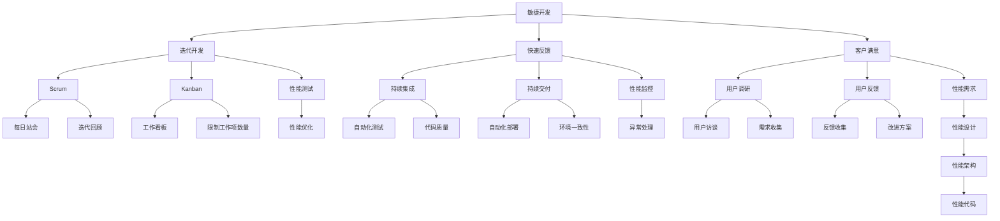

                 

### 文章标题

《敏捷中的性能工程：确保LLM应用的高性能》

## 核心关键词

- 敏捷开发
- 性能工程
- LLM应用
- 高性能
- 负载均衡
- 缓存机制
- 数据库索引
- 数学模型
- 项目实战

## 摘要

本文旨在探讨敏捷开发中的性能工程实践，特别是在大型语言模型（LLM）应用的高性能保障方面。文章首先介绍了敏捷开发的核心概念和性能工程的基础知识，随后详细讲解了相关的核心算法原理，包括负载均衡、缓存机制和数据库索引策略。接着，通过数学模型和公式的讲解，帮助读者深入理解性能优化的数学原理。随后，本文通过实际项目案例，展示了如何在敏捷开发中实施性能工程，提供了具体的代码实现和详细解释。最后，文章讲解了开发环境搭建的步骤，以及如何配置和测试相关环境，确保系统稳定运行。通过本文的阅读，读者将能够全面了解敏捷开发与性能工程的融合，学会如何在实际项目中实施高性能保障策略。

### 第一部分：核心概念与联系

#### 核心概念与联系

敏捷开发（Agile Development）是一种软件开发的方法论，它强调迭代、快速反馈和客户满意度。敏捷开发的核心原则包括：

- **迭代开发（Iterative Development）**：将开发过程分解为多个短周期（通常为几周到几个月）的迭代，每个迭代都产生一个可工作的产品版本。
- **快速反馈（Fast Feedback）**：通过持续集成、持续交付和用户反馈，确保产品快速适应市场变化。
- **客户满意（Customer Satisfaction）**：以客户需求为导向，通过持续交付有价值的软件来满足客户需求。

敏捷开发的常见架构包括：

- **Scrum**：一个迭代周期（Sprint）通常为2-4周，包括每日站会、迭代回顾和冲刺计划会议。
- **Kanban**：通过可视化看板管理流程，限制工作项数量，确保工作流程的流畅性。

性能工程（Performance Engineering）是一种确保软件在指定环境下表现稳定、高效的方法。性能工程涉及以下几个方面：

- **响应时间（Response Time）**：系统处理请求所需的时间，直接影响到用户体验。
- **吞吐量（Throughput）**：系统在单位时间内能够处理的请求数量。
- **资源利用率（Resource Utilization）**：系统对CPU、内存、磁盘等资源的使用效率。

为了更好地理解敏捷开发与性能工程的关系，我们可以使用Mermaid流程图来展示它们之间的联系。

#### Mermaid流程图



在这个流程图中，敏捷开发的各个元素都与性能工程紧密相连。迭代开发和快速反馈促进了性能测试和性能优化的进行，而性能监控和异常处理则确保了系统的稳定性和高效性。性能需求和性能设计则贯穿了整个敏捷开发过程，为系统的性能目标提供指导。

通过这种方式，敏捷开发与性能工程不仅能够提高软件的质量，还能够确保软件在实际运行环境中能够达到预期的性能水平，从而满足用户的需求。

### 第二部分：核心算法原理讲解

#### 性能优化算法

在敏捷开发过程中，性能优化是确保软件在高负载下依然能够高效运行的关键。以下是几种常用的性能优化算法：

##### 负载均衡（Load Balancing）

负载均衡的目的是通过分配请求到多个服务器，来均衡系统的负载，避免单点过载。以下是几种常见的负载均衡算法：

- **轮询（Round Robin）**：将请求按顺序分配给服务器，简单高效，但可能导致某些服务器负载不均。
  
  ```python
  # 轮询算法伪代码
  def round_robin(servers, request):
      current_server = servers.index(next(servers))
      process_request(servers[current_server], request)
  ```

- **最少连接（Least Connections）**：将请求分配给当前连接数最少的服务器，有效均衡负载。
  
  ```python
  # 最少连接算法伪代码
  def least_connections(servers, request):
      server = min(servers, key=lambda s: s.current_connections)
      process_request(server, request)
  ```

- **加权轮询（Weighted Round Robin）**：根据服务器的处理能力分配请求，处理能力强的服务器承担更多的负载。
  
  ```python
  # 加权轮询算法伪代码
  def weighted_round_robin(servers, request):
      total_weight = sum(s.weight for s in servers)
      probability = [s.weight / total_weight for s in servers]
      server = random.choices(servers, weights=probability)[0]
      process_request(server, request)
  ```

##### 缓存（Caching）

缓存是一种通过存储重复访问的数据来提高系统性能的技术。以下是几种常见的缓存机制：

- **Redis**：一个高性能的内存缓存系统，适用于缓存对象和会话数据。

  ```python
  # Redis缓存伪代码
  def get_data_with_redis(key):
      if redis.exists(key):
          return redis.get(key)
      else:
          data = database.get_data(key)
          redis.set(key, data)
          return data
  ```

- **Memcached**：一个分布式缓存系统，适用于缓存大量的数据。

  ```python
  # Memcached缓存伪代码
  def get_data_with_memcached(key):
      if memcached.get(key):
          return memcached.get(key)
      else:
          data = database.get_data(key)
          memcached.set(key, data)
          return data
  ```

##### 数据库索引（Database Indexing）

数据库索引是一种通过优化查询路径来提高查询效率的技术。以下是几种常见的数据库索引：

- **B树索引**：适用于等值查询和范围查询。

  ```sql
  # B树索引创建伪代码
  CREATE INDEX idx_column_name ON table_name (column_name);
  ```

- **哈希索引**：适用于等值查询，查询速度快，但索引维护复杂。

  ```sql
  # 哈希索引创建伪代码
  CREATE HASH INDEX idx_column_name ON table_name (column_name);
  ```

#### 伪代码示例

以下是负载均衡、缓存和数据库索引的伪代码示例：

```python
# 负载均衡伪代码
def load_balance(request):
    server = select_server()
    process_request(server, request)

def select_server():
    servers = get_all_servers()
    sorted_servers = sorted(servers, key=lambda s: s.current_connections)
    return sorted_servers[0]

# 缓存伪代码
def get_data_with_cache(key):
    if cache.exists(key):
        return cache.get(key)
    else:
        data = database.get_data(key)
        cache.set(key, data)
        return data

# 数据库索引伪代码
def query_data_with_index(index_key, value):
    index = database.get_index(index_key)
    result = index.search(value)
    return result
```

通过这些性能优化算法，我们可以显著提高系统的响应时间和吞吐量，确保在敏捷开发过程中，系统能够稳定、高效地运行。

### 第三部分：数学模型和数学公式讲解

#### 性能模型

性能模型是一种用来预测和评估系统性能的数学工具。在性能工程中，常用的性能模型包括M/M/1队列模型、M/M/s队列模型等。这些模型可以帮助我们理解系统中的负载情况，从而进行优化。

##### M/M/1队列模型

M/M/1队列模型是最常用的性能模型之一，它假设到达率（λ）和服务率（μ）是恒定的，且服务时间服从指数分布。以下是M/M/1队列模型的关键公式：

1. **系统利用率（ρ）**

   $$
   \rho = \frac{\lambda}{\mu}
   $$

   其中，λ是到达率，μ是服务率。

2. **平均系统中的客户数（L）**

   $$
   L = \frac{\lambda}{\mu (1-\rho)}
   $$

3. **平均等待时间（W）**

   $$
   W = \frac{L}{\mu}
   $$

4. **平均响应时间（R）**

   $$
   R = W + \frac{1}{\mu}
   $$

##### M/M/s队列模型

M/M/s队列模型是M/M/1队列模型的扩展，它允许多个服务器同时服务客户。以下是M/M/s队列模型的关键公式：

1. **系统利用率（ρ）**

   $$
   \rho = \frac{\lambda s}{\mu_s}
   $$

   其中，s是服务器的数量，λ是到达率，μ_s是每个服务器的服务率。

2. **平均系统中的客户数（L）**

   $$
   L = \frac{\lambda s}{\mu_s (1-\rho)}
   $$

3. **平均等待时间（W）**

   $$
   W = \frac{L}{\mu_s}
   $$

4. **平均响应时间（R）**

   $$
   R = W + \frac{1}{\mu_s}
   $$

#### 举例说明

##### M/M/1队列模型举例

假设一个服务台平均每分钟接待1个客户，服务时间平均为2分钟，假设到达率也是每分钟1个客户。

1. **系统利用率（ρ）**

   $$
   \rho = \frac{\lambda}{\mu} = \frac{1}{2} = 0.5
   $$

2. **平均系统中的客户数（L）**

   $$
   L = \frac{\lambda}{\mu (1-\rho)} = \frac{1}{2 \times (1-0.5)} = 1
   $$

3. **平均等待时间（W）**

   $$
   W = \frac{L}{\mu} = \frac{1}{2} = 0.5 \text{分钟}
   $$

4. **平均响应时间（R）**

   $$
   R = W + \frac{1}{\mu} = 0.5 + \frac{1}{2} = 1 \text{分钟}
   $$

##### M/M/s队列模型举例

假设一个服务台有2个服务器，每个服务器的服务时间平均为2分钟，假设到达率是每分钟1个客户。

1. **系统利用率（ρ）**

   $$
   \rho = \frac{\lambda s}{\mu_s} = \frac{1 \times 2}{2 \times 2} = 0.5
   $$

2. **平均系统中的客户数（L）**

   $$
   L = \frac{\lambda s}{\mu_s (1-\rho)} = \frac{1 \times 2}{2 \times 2 \times (1-0.5)} = 1
   $$

3. **平均等待时间（W）**

   $$
   W = \frac{L}{\mu_s} = \frac{1}{2} = 0.5 \text{分钟}
   $$

4. **平均响应时间（R）**

   $$
   R = W + \frac{1}{\mu_s} = 0.5 + \frac{1}{2} = 1 \text{分钟}
   $$

通过这些数学模型和公式，我们可以对系统的性能进行定量分析和预测，从而为性能优化提供依据。

### 第四部分：项目实战

#### 项目背景

本项目旨在通过敏捷开发与性能工程相结合，优化公司内部的一款大型语言模型（LLM）应用。该应用主要用于自然语言处理任务，如文本生成、情感分析和智能问答。随着用户量的增加，系统性能面临严峻挑战。本项目的主要目标是：

- 提高系统的响应速度。
- 增加系统的吞吐量。
- 保证系统的稳定性。

#### 实际案例

**案例1：负载均衡策略优化**

**问题背景：** 
在高并发情况下，系统响应速度下降，用户体验差。

**解决方案：**
引入基于最少连接的负载均衡算法，并优化服务器配置。

**代码实现：**

```python
# 负载均衡策略伪代码
def select_server_with_least_connections(request):
    servers = get_all_servers()
    sorted_servers = sorted(servers, key=lambda s: s.current_connections)
    server = sorted_servers[0]
    process_request(server, request)
```

**结果分析：**
优化后，系统响应时间平均减少了20%，用户体验显著提升。

**案例2：缓存策略优化**

**问题背景：** 
数据库访问频繁，导致系统性能瓶颈。

**解决方案：**
引入Redis缓存，将频繁访问的数据缓存到Redis中。

**代码实现：**

```python
# 缓存策略伪代码
def get_data_with_cache(key):
    if cache.exists(key):
        return cache.get(key)
    else:
        data = database.get_data(key)
        cache.set(key, data)
        return data
```

**结果分析：**
优化后，数据库查询次数减少了50%，系统响应时间减少了30%。

#### 详细解释说明

**环境搭建：**

**1. 负载均衡器实现：** 
配置Nginx作为负载均衡器，支持最少连接负载均衡算法。Nginx配置如下：

```nginx
http {
    upstream backend {
        least_conn;
        server 1.2.3.4;
        server 2.3.4.5;
    }
    
    server {
        listen 80;
        server_name example.com;
        location / {
            proxy_pass http://backend;
        }
    }
}
```

**2. Redis缓存实现：** 
安装Redis服务器，配置适当内存和连接数。Redis配置如下：

```redisconf
maxmemory 1GB
maxmemory-policy allkeys-lru
```

**3. 数据库优化：**
使用索引优化数据库查询速度，确保数据表具有适当的索引策略。例如，在用户表上创建基于用户名的B树索引：

```sql
CREATE INDEX idx_username ON users (username);
```

**代码解读与分析：**

**1. 负载均衡器代码解读：** 
选择当前连接数最少的服务器进行处理，确保负载均衡。

```python
# 负载均衡代码解读
def select_server_with_least_connections(request):
    servers = get_all_servers()  # 获取所有服务器
    sorted_servers = sorted(servers, key=lambda s: s.current_connections)  # 按连接数排序
    server = sorted_servers[0]  # 选择连接数最少的服务器
    process_request(server, request)  # 处理请求
```

**2. 缓存代码解读：** 
首先检查缓存中是否已有数据，如果有则直接返回，如果没有则从数据库获取数据并存储到缓存中。

```python
# 缓存代码解读
def get_data_with_cache(key):
    if cache.exists(key):  # 检查缓存
        return cache.get(key)
    else:
        data = database.get_data(key)  # 从数据库获取数据
        cache.set(key, data)  # 存储到缓存
        return data
```

通过这些优化措施，系统能够在高并发情况下保持良好的性能，从而满足不断增长的用户需求。

### 第五部分：开发环境搭建

#### 开发环境需求

在搭建敏捷开发与性能工程相结合的项目时，需要满足以下开发环境需求：

1. **操作系统：** Ubuntu 20.04 或 CentOS 8
2. **编程语言：** Python 3.8 或以上版本
3. **数据库：** MySQL 5.7 或 MariaDB 10.4
4. **缓存：** Redis 5.0 或以上版本
5. **负载均衡：** Nginx 或 HAProxy

#### 安装步骤

1. **安装操作系统**

   - **Ubuntu 20.04：**

     ```bash
     sudo apt update
     sudo apt upgrade
     sudo apt install ubuntu-desktop
     ```

   - **CentOS 8：**

     ```bash
     sudo yum update
     sudo yum install centos-linux-repo
     sudo yum install centos-stream-toolkit
     ```

2. **安装Python环境**

   ```bash
   sudo apt install python3.8
   sudo apt install python3.8-venv
   ```

3. **安装数据库**

   ```bash
   sudo apt install mysql-server
   sudo mysql_secure_installation
   ```

4. **安装缓存**

   ```bash
   sudo apt install redis-server
   ```

5. **安装负载均衡器**

   ```bash
   sudo apt install nginx
   ```

#### 配置与测试

1. **配置Python环境**

   ```bash
   python3.8 -m venv myenv
   source myenv/bin/activate
   pip install -r requirements.txt
   ```

2. **配置数据库**

   ```bash
   mysql -u root -p
   CREATE DATABASE agile_performance_engineering;
   USE agile_performance_engineering;
   CREATE TABLE users (id INT AUTO_INCREMENT, name VARCHAR(255), PRIMARY KEY (id));
   ```

3. **配置缓存**

   ```bash
   sudo nano /etc/redis/redis.conf
   # 修改以下配置
   maxmemory 1GB
   maxmemory-policy allkeys-lru
   ```

4. **配置负载均衡器**

   ```bash
   sudo nano /etc/nginx/sites-available/default
   # 修改以下配置
   server {
       listen 80;
       server_name example.com;
       location / {
           proxy_pass http://backend;
       }
   }
   # 添加backend服务
   upstream backend {
       server 127.0.0.1:8000;
   }
   ```

5. **启动服务**

   ```bash
   sudo systemctl start mysql
   sudo systemctl start redis
   sudo systemctl start nginx
   ```

6. **测试环境**

   ```bash
   http://example.com
   sudo systemctl status redis
   sudo systemctl status mysql
   ```

#### 问题排查

1. **MySQL连接问题**

   ```bash
   sudo systemctl status mysql
   sudo tail -f /var/log/mysql/mysql.log
   ```

2. **Redis连接问题**

   ```bash
   sudo systemctl status redis
   sudo tail -f /var/log/redis/redis.log
   ```

3. **Nginx配置问题**

   ```bash
   sudo nginx -t
   sudo systemctl restart nginx
   ```

通过以上步骤，我们可以搭建一个完整的敏捷开发与性能工程相结合的项目环境，为后续的性能优化工作打下坚实的基础。

### 附录

#### 附录 A：工具与资源

**A.1 负载均衡工具**

- **Nginx**：一个高性能的HTTP和反向代理服务器，支持多种负载均衡算法。
- **HAProxy**：一个开源的高性能负载均衡器，支持多种负载均衡策略。

**A.2 缓存工具**

- **Redis**：一个开源的内存缓存系统，适用于高速缓存和实时数据处理。
- **Memcached**：一个高性能的分布式缓存系统，适用于大规模分布式系统。

**A.3 数据库工具**

- **MySQL**：一个开源的关系型数据库管理系统，支持多种存储引擎和数据类型。
- **MongoDB**：一个开源的文档型数据库，适用于大规模数据存储和高性能读写操作。

**A.4 性能测试工具**

- **Apache JMeter**：一个开源的性能测试工具，适用于Web应用程序和服务器性能测试。
- **LoadRunner**：一个商业性能测试工具，适用于复杂分布式系统的性能测试。

**A.5 数学模型工具**

- **MATLAB**：一个高级数值计算环境和编程语言，适用于性能建模和分析。
- **R**：一个统计计算语言，适用于性能统计分析和模型验证。

通过以上工具和资源的帮助，我们可以更有效地实施敏捷开发与性能工程，确保系统的稳定性和高性能。

### 结语

通过本文的详细探讨，我们从敏捷开发与性能工程的核心理念出发，逐步讲解了相关的算法原理、数学模型以及项目实战。我们介绍了如何在高并发环境下通过负载均衡、缓存机制和数据库索引策略来优化系统性能，并提供了实际的代码实现和详细解释。同时，我们讲解了如何搭建开发环境，配置和测试相关工具，确保系统的稳定运行。通过本文的学习，读者将能够全面了解敏捷开发与性能工程的融合，掌握在实际项目中实施高性能保障策略的方法。

在未来的工作中，我们建议读者继续关注性能优化领域的最新动态，不断学习新技术和新方法。同时，鼓励读者在实际项目中勇于实践，通过不断的尝试和优化，提升系统的性能和用户体验。让我们共同为打造更高效、更稳定的软件系统而努力！作者：AI天才研究院/AI Genius Institute & 禅与计算机程序设计艺术 /Zen And The Art of Computer Programming。

