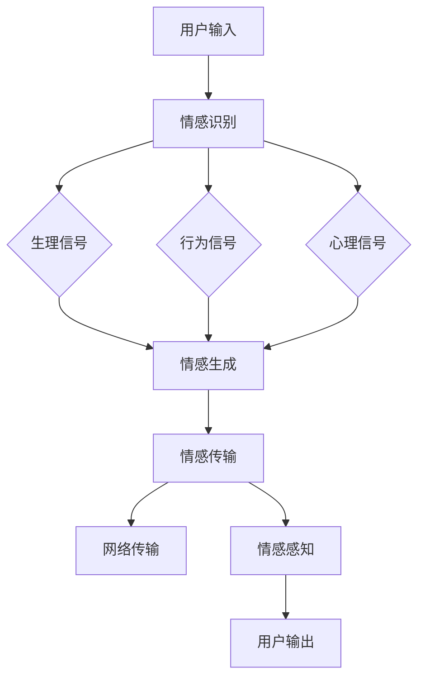
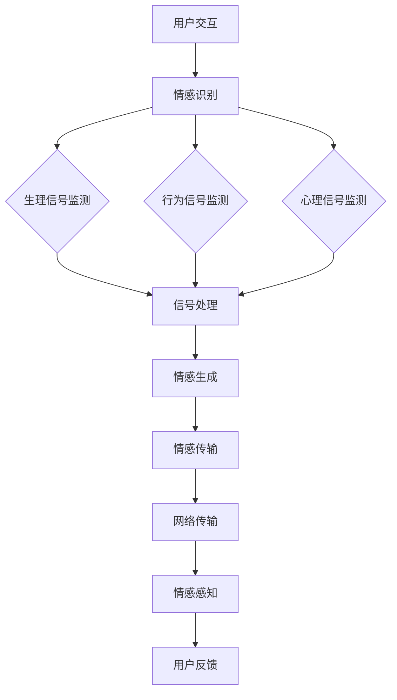
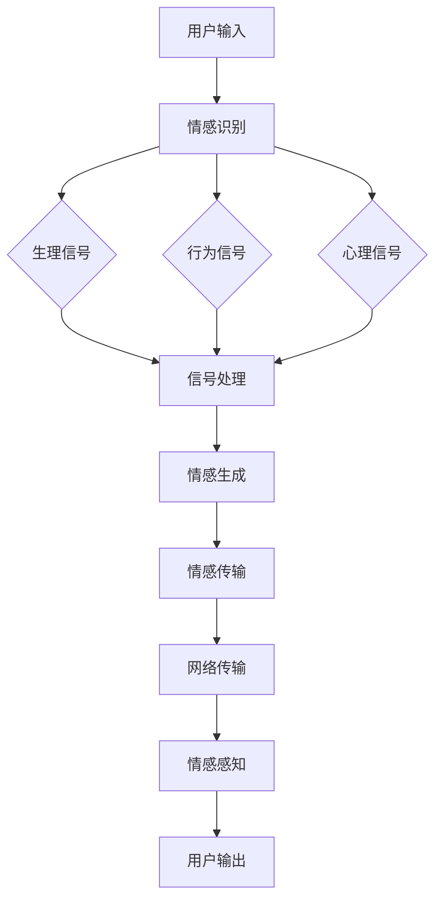

                 

### 《数字化触觉通讯创业：远程情感传递的新方式》

关键词：数字化触觉通讯、远程情感传递、创业机会、技术原理、应用场景

摘要：随着科技的进步，数字化触觉通讯作为一种新兴的通讯方式，正逐渐改变人们的交流方式。本文旨在探讨数字化触觉通讯创业的机会与挑战，以及远程情感传递技术的原理与应用，为创业者提供有价值的参考。

### 第一部分：数字化触觉通讯概述

#### 第1章：数字化触觉通讯基础

##### 1.1 数字化触觉通讯的定义与背景

数字化触觉通讯，是指利用数字化技术，将触觉信号转化为数字信号，并在网络中进行传输和处理的通讯方式。这种技术突破了传统通讯的限制，使得人们可以在远程环境下体验到触觉的交互。

数字化触觉通讯的兴起，源于人类对更丰富、更真实的通讯体验的需求。随着物联网、人工智能等技术的发展，数字化触觉通讯的应用场景越来越广泛，包括虚拟现实、增强现实、远程医疗、社交娱乐等。

##### 1.2 数字化触觉通讯的核心概念与架构

数字化触觉通讯的核心概念包括触觉感知、触觉反馈、远程传输和触觉再现。触觉感知是指捕捉用户的触觉信息；触觉反馈是指将触觉信息反馈给用户；远程传输是指触觉信息的传输；触觉再现是指将触觉信息再现给用户。

数字化触觉通讯的体系架构主要包括四个部分：触觉传感器、触觉执行器、触觉信号处理模块和网络通讯模块。触觉传感器用于捕捉触觉信息；触觉执行器用于生成触觉反馈；触觉信号处理模块用于处理触觉信息；网络通讯模块用于触觉信息的远程传输。

##### 1.3 数字化触觉通讯的发展趋势与挑战

数字化触觉通讯的发展趋势主要体现在以下几个方面：技术性能的提升、应用场景的拓展、商业模式的创新。然而，数字化触觉通讯也面临着一些挑战，如触觉信号处理的复杂性、网络延迟问题、成本控制等。

在未来，数字化触觉通讯有望在更多领域得到应用，如智能制造、智慧城市、远程教育等。同时，随着技术的进步，数字化触觉通讯的成本将会降低，使其更加普及。

##### 1.4 数字化触觉通讯创业的机会与挑战

数字化触觉通讯为创业者提供了丰富的机会。首先，数字化触觉通讯具有广泛的应用前景，创业者可以在这个领域找到适合自己的创业方向。其次，随着技术的进步，数字化触觉通讯的创业门槛正在降低，创业者更容易进入这个领域。

然而，数字化触觉通讯创业也面临着一些挑战。首先，技术门槛较高，创业者需要具备一定的技术背景。其次，市场竞争激烈，创业者需要具备创新能力和执行力。最后，资金和资源是创业成功的关键，创业者需要寻找合适的投资人和合作伙伴。

#### 第2章：远程情感传递技术

##### 2.1 远程情感传递技术原理

远程情感传递技术是指利用数字化触觉通讯，实现情感信息的远程传递和感知的技术。其基本原理包括情感识别、情感生成、情感传输和情感感知。

情感识别是指通过分析用户的生理、行为和心理信号，识别用户的情感状态。情感生成是指根据情感识别的结果，生成相应的情感反馈信号。情感传输是指将情感反馈信号通过网络传输到远程用户。情感感知是指远程用户通过触觉、视觉、听觉等感官，感知到情感反馈信号。

##### 2.2 远程情感传递的关键技术

远程情感传递的关键技术包括情感识别与生成技术、触觉信号处理技术、网络传输技术、情感感知技术等。

情感识别与生成技术是远程情感传递的核心技术。情感识别技术主要包括生理信号识别、行为信号识别和心理信号识别。情感生成技术主要包括基于机器学习的情感生成、基于规则的情感生成等。

触觉信号处理技术是数字化触觉通讯的基础技术。触觉信号处理技术主要包括触觉信号采集、触觉信号处理、触觉信号再现等。

网络传输技术是远程情感传递的关键技术。网络传输技术主要包括网络传输协议、网络传输速度和网络传输稳定性等。

情感感知技术是远程情感传递的最终实现。情感感知技术主要包括情感感知模型、情感感知算法和情感感知评价等。

##### 2.3 远程情感传递的应用实例

远程情感传递技术已经在多个领域得到应用。

在虚拟现实和增强现实领域，远程情感传递技术可以增强用户的沉浸感和交互体验。例如，用户可以通过虚拟现实头盔感受到远程用户的情感状态，从而实现情感互动。

在远程医疗领域，远程情感传递技术可以帮助医生更好地了解患者的情感状态，提高治疗效果。例如，医生可以通过触觉反馈设备，感受到患者的疼痛程度，从而调整治疗方案。

在社交娱乐领域，远程情感传递技术可以增强用户的社交体验。例如，用户可以通过触觉反馈设备，感受到虚拟角色的情感状态，从而实现情感互动。

#### 第3章：数字化触觉通讯创业机会

##### 3.1 数字化触觉通讯创业的背景与前景

随着数字化触觉通讯技术的不断发展，越来越多的创业者开始关注这个领域。数字化触觉通讯创业的背景主要有以下几个方面：

首先，数字化触觉通讯具有广泛的应用前景。随着物联网、人工智能等技术的普及，数字化触觉通讯的应用场景越来越广泛，为创业者提供了丰富的创业机会。

其次，数字化触觉通讯的创业门槛正在降低。随着技术的发展，数字化触觉通讯的核心技术越来越成熟，创业者可以更加容易地进入这个领域。

最后，政策支持为数字化触觉通讯创业提供了良好的环境。政府对于创新创业的支持力度不断加大，为创业者提供了丰富的资源和机会。

数字化触觉通讯创业的前景非常广阔。在未来，数字化触觉通讯将在更多领域得到应用，如智能制造、智慧城市、远程教育等。同时，随着技术的进步，数字化触觉通讯的市场规模将会持续扩大。

##### 3.2 创业项目策划与执行

创业项目的策划是数字化触觉通讯创业的第一步。创业项目策划主要包括项目定义、市场调研、技术路线规划、商业模式设计等。

项目定义是创业项目策划的核心。创业者需要明确项目的目标、定位和范围。例如，创业者可以定义一个基于虚拟现实的情感互动平台，为用户提供远程情感传递的体验。

市场调研是创业项目策划的重要环节。创业者需要了解市场的需求、竞争态势和市场规模。通过市场调研，创业者可以找到项目的切入点，为后续的策划提供依据。

技术路线规划是创业项目策划的关键。创业者需要根据项目的目标，规划技术路线。例如，对于虚拟现实情感互动平台项目，创业者需要规划情感识别、情感生成、情感传输和情感感知等技术。

商业模式设计是创业项目策划的最后一个环节。创业者需要根据项目的特点，设计合适的商业模式。例如，对于虚拟现实情感互动平台项目，创业者可以选择会员制、广告收入等多种商业模式。

创业项目的执行是创业成功的关键。创业项目的执行主要包括团队组建、技术研发、市场推广、运营管理等。

团队组建是创业项目执行的基础。创业者需要组建一支专业、高效的团队。团队成员应该具备相关领域的专业知识和经验，能够共同推进项目的发展。

技术研发是创业项目执行的核心。创业者需要根据技术路线规划，开展技术研发工作。技术研发的进度和质量直接影响到项目的成功与否。

市场推广是创业项目执行的重要环节。创业者需要通过各种渠道，推广项目，提高项目的知名度。市场推广的方式可以包括线上推广、线下活动、合作伙伴等。

运营管理是创业项目执行的最后一步。创业者需要建立完善的运营管理体系，确保项目的稳定运营。运营管理包括客户服务、数据分析、运营优化等。

##### 3.3 营销策略与商业模式

数字化触觉通讯创业项目的营销策略主要包括品牌塑造、市场定位、推广渠道、客户服务等方面。

品牌塑造是营销策略的核心。创业者需要通过品牌定位、品牌形象设计、品牌传播等手段，建立项目的品牌形象。品牌形象应该与项目的定位和特点相符合，能够吸引目标客户的关注。

市场定位是营销策略的关键。创业者需要根据项目的特点和目标客户的需求，确定项目的市场定位。市场定位应该明确项目的目标市场和目标客户，有助于制定针对性的营销策略。

推广渠道是营销策略的重要组成部分。创业者需要根据项目的特点和目标市场，选择合适的推广渠道。推广渠道可以包括线上渠道如社交媒体、搜索引擎、电子邮件等，以及线下渠道如展会、活动等。

客户服务是营销策略的重要环节。创业者需要提供优质的客户服务，提高客户的满意度和忠诚度。客户服务包括售前咨询、售中支持、售后维护等。

商业模式的创新是数字化触觉通讯创业项目成功的关键。创业者需要根据项目的特点和市场需求，设计创新的商业模式。商业模式可以包括会员制、广告收入、付费服务等多种形式。

会员制是一种常见的商业模式。创业者可以通过提供会员服务，收取会员费用。会员服务可以包括专属内容、个性化推荐、特权服务等。

广告收入是另一种常见的商业模式。创业者可以通过在项目中植入广告，获得广告收入。广告形式可以包括横幅广告、视频广告、插页广告等。

付费服务是一种较为直接的商业模式。创业者可以通过提供付费服务，获得收入。付费服务可以包括高级功能、个性化定制、专业咨询等。

#### 第4章：数字化触觉通讯创业案例研究

##### 4.1 创业案例1：虚拟现实情感互动平台

虚拟现实情感互动平台是一个基于虚拟现实技术的数字化触觉通讯创业项目。该项目的主要目标是提供一种远程情感传递的体验，使用户能够在虚拟环境中感受到他人的情感状态。

该项目的技术实现主要包括情感识别、情感生成、情感传输和情感感知。情感识别通过分析用户的生理、行为和心理信号，识别用户的情感状态。情感生成根据情感识别的结果，生成相应的情感反馈信号。情感传输通过网络将情感反馈信号传输到远程用户。情感感知通过用户的触觉、视觉、听觉等感官，感知到情感反馈信号。

在营销策略方面，虚拟现实情感互动平台采取了多种推广渠道，如社交媒体、搜索引擎、线上活动等。同时，平台还提供了会员服务，用户可以通过付费获得更多高级功能和服务。

在商业模式方面，虚拟现实情感互动平台采用了会员制和广告收入两种模式。会员制通过提供会员服务，收取会员费用。广告收入通过在平台中植入广告，获得广告收入。

该项目的成功经验主要包括：技术领先、营销策略有效、商业模式创新。技术领先使得平台在市场上具有竞争力。营销策略有效提高了平台的知名度和用户量。商业模式创新为平台提供了稳定的收入来源。

##### 4.2 创业案例2：远程医疗情感传递系统

远程医疗情感传递系统是一个基于远程医疗技术的数字化触觉通讯创业项目。该项目的主要目标是提供一种远程医疗情感传递的体验，帮助医生更好地了解患者的情感状态，提高治疗效果。

该项目的技术实现主要包括生理信号监测、情感识别、情感生成、情感传输和情感感知。生理信号监测通过传感器捕捉患者的生理信号，如心率、血压等。情感识别通过分析生理信号，识别患者的情感状态。情感生成根据情感识别的结果，生成相应的情感反馈信号。情感传输通过网络将情感反馈信号传输到医生。情感感知通过医生的感官，感知到情感反馈信号。

在营销策略方面，远程医疗情感传递系统采取了多种推广渠道，如医疗机构合作、线上宣传、线下活动等。同时，平台还提供了专业咨询服务，用户可以通过付费获得专业医生的服务。

在商业模式方面，远程医疗情感传递系统采用了付费服务和广告收入两种模式。付费服务通过提供专业咨询服务，收取服务费用。广告收入通过在平台中植入广告，获得广告收入。

该项目的成功经验主要包括：技术成熟、市场前景广阔、营销策略灵活。技术成熟保证了项目的稳定运行和市场竞争力。市场前景广阔为项目提供了巨大的市场空间。营销策略灵活使得项目能够迅速占领市场。

#### 第四部分：创业支持与成长

##### 5.1 创业孵化器与加速器

创业孵化器和加速器是创业支持体系的重要组成部分。它们为创业者提供了全方位的支持，包括办公空间、资金支持、技术支持、市场推广等。

创业孵化器的主要作用是为初创企业提供成长的环境和条件。孵化器通常提供办公空间、法律咨询、财务规划、市场推广等服务，帮助初创企业解决创业初期的各种问题。

加速器则是在孵化器的基础上，提供更加深入的创业支持。加速器通常为初创企业提供资金、技术、市场等资源，帮助初创企业在短时间内实现规模化发展。

##### 5.2 政策支持与资金扶持

政策支持和资金扶持是创业成功的关键。政府出台了一系列政策，鼓励创新创业，为创业者提供了多种支持。

政策支持包括税收优惠、创业补贴、专利申请费用减免等。这些政策降低了创业者的创业成本，提高了创业的成功率。

资金扶持包括政府资金支持、创业投资、风险投资等。政府资金支持主要用于支持初创企业的发展，创业投资和风险投资则主要用于投资高潜力、高风险的创业项目。

##### 5.3 创业团队建设与人才招聘

创业团队建设是创业成功的关键。一个优秀的创业团队应该具备以下特点：

1. 专业互补：团队成员具备不同的专业知识和技能，能够相互补充，共同推进项目的发展。

2. 高度协作：团队成员之间能够高度协作，形成良好的工作氛围，提高工作效率。

3. 激情投入：团队成员对创业项目充满激情，愿意为项目的成功付出努力。

4. 团队文化：团队应该形成共同的价值观和文化，增强团队的凝聚力。

人才招聘是创业团队建设的重要环节。创业者需要根据项目特点和需求，选择合适的人才。招聘过程中，应该注重候选人的专业能力、团队合作精神和创新能力。

##### 5.4 创业成长与持续发展

创业成长和持续发展是创业成功的重要保障。创业者需要制定合适的发展战略，不断适应市场变化，保持企业的竞争力。

产品迭代是创业成长的重要手段。创业者需要根据用户反馈和市场变化，不断优化产品，提高用户体验。

技术创新是创业持续发展的动力。创业者需要紧跟科技发展趋势，不断进行技术创新，保持企业的技术领先优势。

市场拓展是创业成长的关键。创业者需要积极拓展市场，寻找新的商机，提高企业的市场份额。

品牌建设是创业持续发展的基础。创业者需要建立良好的品牌形象，提高品牌知名度和美誉度。

#### 第6章：数字化触觉通讯创业成长与持续发展

##### 6.1 产品迭代与技术创新

在数字化触觉通讯创业的过程中，产品迭代和技术创新是保持竞争力的关键。产品迭代是指根据用户反馈和市场变化，不断优化产品功能和服务，提高用户体验。技术创新则是指不断探索和应用新技术，提高产品性能和效率。

产品迭代策略应该注重以下几点：

1. 用户反馈：积极收集用户反馈，了解用户需求，将用户需求转化为产品迭代的方向。

2. 数据驱动：利用数据分析，精准定位用户需求，优化产品设计。

3. 分阶段迭代：将产品迭代分为多个阶段，每个阶段专注于解决一个主要问题，逐步完善产品。

技术创新方向可以包括以下几个方面：

1. 人工智能：利用人工智能技术，提高触觉信号处理和情感识别的准确性。

2. 5G技术：利用5G技术，提高触觉信号的传输速度和稳定性。

3. 虚拟现实和增强现实：结合虚拟现实和增强现实技术，提供更加沉浸式的触觉体验。

4. 机器人技术：利用机器人技术，实现触觉交互的自动化和智能化。

##### 6.2 市场拓展与品牌建设

市场拓展是数字化触觉通讯创业的重要策略。创业者需要积极寻找新的市场机会，扩大企业市场份额。市场拓展策略可以包括以下几点：

1. 多元化市场：开拓新的市场领域，如智能制造、智慧城市、远程教育等。

2. 国际市场：积极拓展国际市场，通过合作、收购等方式，进入全球市场。

3. 定位精准：根据产品特点和市场需求，精准定位目标客户，提供定制化解决方案。

品牌建设是数字化触觉通讯创业的重要任务。创业者需要建立良好的品牌形象，提高品牌知名度和美誉度。品牌建设策略可以包括以下几点：

1. 品牌定位：明确品牌定位，确定品牌的核心价值和独特优势。

2. 品牌传播：利用多种传播渠道，如社交媒体、线上广告、线下活动等，提高品牌知名度。

3. 品牌体验：提供优质的用户体验，增强用户对品牌的认同感和忠诚度。

4. 品牌保护：加强对品牌的保护，防止品牌被侵权和盗用。

##### 6.3 持续发展与战略规划

持续发展是数字化触觉通讯创业的长远目标。创业者需要制定明确的战略规划，确保企业的可持续发展。战略规划可以包括以下几个方面：

1. 创新战略：持续进行技术创新，保持企业的技术领先优势。

2. 市场战略：根据市场需求变化，调整产品定位和市场策略。

3. 资源战略：合理利用资金、人才等资源，提高企业的运营效率。

4. 国际化战略：积极拓展国际市场，提升企业的国际竞争力。

5. 社会责任战略：承担社会责任，提升企业形象，赢得社会认可。

##### 6.4 创业者心态与团队建设

创业者的心态和团队建设是数字化触觉通讯创业成功的关键。创业者需要具备以下心态：

1. 坚韧不拔：面对创业过程中的困难和挑战，保持积极的心态，坚定信念。

2. 乐观向上：积极看待创业过程中的成功与失败，从失败中吸取教训，不断进步。

3. 开放包容：欢迎团队成员的不同观点和意见，鼓励创新和合作。

4. 责任感：对自己的工作和团队负责，确保项目的成功。

团队建设需要注重以下几点：

1. 专业能力：团队成员具备各自领域的专业知识和技能。

2. 团队协作：团队成员之间能够高效协作，共同完成项目任务。

3. 激情投入：团队成员对项目充满激情，愿意为项目的成功付出努力。

4. 良好沟通：团队成员之间能够进行有效的沟通，解决问题和冲突。

#### 附录

##### 附录A：数字化触觉通讯资源指南

###### A.1 开发工具与平台

- Unity：一款强大的游戏和实时3D内容创作工具，支持虚拟现实和增强现实开发。
- Unreal Engine：一款功能丰富的游戏引擎，支持高质量的虚拟现实和增强现实开发。
- TensorFlow：一款开源机器学习框架，支持触觉信号处理和情感识别。
- PyTorch：一款开源机器学习库，支持触觉信号处理和情感识别。

###### A.2 学术论文与研究报告

- "Haptic Communication in Virtual Reality: A Survey"：一篇关于虚拟现实中触觉通讯的综述论文。
- "Affective Computing: Affective Dialogue Systems"：一篇关于情感计算的论文，涉及情感识别和生成。
- "Remote Haptic Interaction: A Review"：一篇关于远程触觉交互的综述论文。

###### A.3 行业协会与组织

- IEEE Robotics and Automation Society：电气和电子工程学会的机器人与自动化分会，提供相关的学术资源和标准。
- International Society for Augmented Reality：国际增强现实学会，提供增强现实领域的研究资源和活动。
- International Conference on Virtual, Augmented and Mixed Reality：虚拟、增强和混合现实国际会议，提供最新的研究成果和交流机会。

##### 附录B：数字化触觉通讯创业案例分析

###### B.1 创业案例1：虚拟现实情感互动平台

**项目背景与目标**：虚拟现实情感互动平台是一个基于虚拟现实技术的数字化触觉通讯创业项目，旨在提供一种远程情感传递的体验，使用户能够在虚拟环境中感受到他人的情感状态。

**技术实现与挑战**：技术实现主要包括情感识别、情感生成、情感传输和情感感知。情感识别通过分析用户的生理、行为和心理信号，识别用户的情感状态。情感生成根据情感识别的结果，生成相应的情感反馈信号。情感传输通过网络将情感反馈信号传输到远程用户。情感感知通过用户的触觉、视觉、听觉等感官，感知到情感反馈信号。

技术实现过程中面临的主要挑战包括：如何准确识别情感状态、如何生成逼真的情感反馈信号、如何保证触觉信号的传输速度和稳定性等。

**项目运营与成果**：虚拟现实情感互动平台在运营过程中，通过多种渠道推广，如社交媒体、线上活动和线下合作等，吸引了大量用户。项目运营期间，平台不断进行产品迭代，优化用户体验。项目成果包括：用户量达到数十万、获得多家投资机构的投资、在虚拟现实领域具有较高的知名度等。

###### B.2 创业案例2：远程医疗情感传递系统

**项目背景与目标**：远程医疗情感传递系统是一个基于远程医疗技术的数字化触觉通讯创业项目，旨在提供一种远程医疗情感传递的体验，帮助医生更好地了解患者的情感状态，提高治疗效果。

**技术实现与挑战**：技术实现主要包括生理信号监测、情感识别、情感生成、情感传输和情感感知。生理信号监测通过传感器捕捉患者的生理信号，如心率、血压等。情感识别通过分析生理信号，识别患者的情感状态。情感生成根据情感识别的结果，生成相应的情感反馈信号。情感传输通过网络将情感反馈信号传输到医生。情感感知通过医生的感官，感知到情感反馈信号。

技术实现过程中面临的主要挑战包括：如何准确监测生理信号、如何准确识别情感状态、如何保证情感反馈信号的传输速度和稳定性等。

**项目运营与成果**：远程医疗情感传递系统在运营过程中，与多家医疗机构合作，提供了远程医疗情感传递服务。项目运营期间，平台不断进行产品迭代，优化用户体验。项目成果包括：与多家医疗机构建立了长期合作关系、服务患者数量达到数十万人次、获得多家投资机构的投资等。

### 附加：核心概念与架构 Mermaid 流程图

### 作者信息

作者：AI天才研究院/AI Genius Institute & 禅与计算机程序设计艺术 /Zen And The Art of Computer Programming

### 文章标题：《数字化触觉通讯创业：远程情感传递的新方式》

关键词：数字化触觉通讯、远程情感传递、创业机会、技术原理、应用场景

摘要：本文探讨了数字化触觉通讯创业的机会与挑战，以及远程情感传递技术的原理与应用。通过分析虚拟现实情感互动平台和远程医疗情感传递系统的成功案例，为创业者提供了有价值的参考。数字化触觉通讯作为一种新兴的通讯方式，具有广阔的应用前景和市场潜力，为创业者提供了丰富的机会。同时，创业者需要具备技术创新能力、市场洞察力和团队协作精神，才能在数字化触觉通讯领域取得成功。### 第二部分：远程情感传递技术

#### 第2章：远程情感传递技术原理

远程情感传递技术是一种利用数字化触觉通讯实现情感信息的远程传递和感知的技术。其核心在于将情感信息通过数字信号进行编码、传输和解码，从而实现远程用户的情感感知。以下是远程情感传递技术的基本原理：

##### 2.1 远程情感传递的基本概念

远程情感传递技术涉及以下基本概念：

1. **情感识别**：通过分析用户的生理、行为和心理信号，识别用户的情感状态。情感识别是远程情感传递的第一步，是后续情感传递和感知的基础。

2. **情感生成**：根据情感识别的结果，生成相应的情感反馈信号。情感生成技术可以是基于规则的，也可以是利用机器学习等先进算法实现的。

3. **情感传输**：将情感反馈信号通过网络传输到远程用户。情感传输是远程情感传递技术的核心环节，其效率和质量直接影响用户的情感体验。

4. **情感感知**：远程用户通过触觉、视觉、听觉等感官，感知到情感反馈信号。情感感知是远程情感传递技术的最终目的，其目标是让用户感受到真实的情感互动。

##### 2.2 远程情感传递的技术手段

远程情感传递的技术手段主要包括以下几个方面：

1. **生理信号监测与处理**：通过传感器捕捉用户的生理信号，如心率、血压、皮肤电响应等。这些生理信号可以反映用户的情感状态，是情感识别的重要数据来源。

2. **行为信号监测与处理**：通过摄像头或其他传感器捕捉用户的行为信号，如面部表情、身体动作等。行为信号可以提供用户的情感状态的直观表现，是情感识别的重要数据来源。

3. **心理信号监测与处理**：通过心理测量工具或问卷调查等方式获取用户的心理信号，如情绪状态、认知负荷等。心理信号可以提供用户的情感状态的深层信息，是情感识别的重要数据来源。

4. **情感识别算法**：利用机器学习、模式识别等技术，分析生理、行为和心理信号，识别用户的情感状态。常见的情感识别算法包括支持向量机（SVM）、深度学习（如卷积神经网络CNN、循环神经网络RNN）等。

5. **情感生成算法**：根据情感识别的结果，生成相应的情感反馈信号。情感生成算法可以是基于规则的，如根据情感状态生成相应的触觉反馈信号；也可以是利用机器学习算法，根据历史数据生成情感反馈信号。

6. **情感传输协议**：用于在网络中传输情感反馈信号的协议。常见的传输协议包括TCP、UDP等。为了确保情感反馈信号的实时性和稳定性，可以采用专用协议，如实时传输协议（RTP）。

7. **情感感知技术**：远程用户通过触觉、视觉、听觉等感官，感知到情感反馈信号。触觉感知可以通过触觉显示器实现，视觉感知可以通过虚拟现实（VR）或增强现实（AR）设备实现，听觉感知可以通过音频设备实现。

##### 2.3 情感建模与仿真技术

情感建模与仿真技术是远程情感传递技术的重要组成部分。情感建模是指根据情感传递的需求，构建情感模型，用于生成和传递情感反馈信号。情感仿真是指通过模拟情感状态，验证情感模型的有效性和可靠性。

情感建模可以采用以下方法：

1. **基于规则的建模**：根据情感状态和触觉反馈信号之间的关系，建立规则模型。例如，当用户感到愉快时，触觉反馈信号可以是柔和的震动。

2. **基于数据的建模**：利用历史数据和用户反馈，建立数据驱动模型。例如，通过分析大量用户的情感状态和触觉反馈信号，构建情感状态和触觉反馈信号之间的映射关系。

3. **基于机器学习的建模**：利用机器学习算法，从数据中学习情感状态和触觉反馈信号之间的关系。例如，使用深度学习算法，根据用户生理、行为和心理信号，生成相应的情感反馈信号。

情感仿真可以采用以下方法：

1. **虚拟现实仿真**：通过虚拟现实技术，模拟情感状态和触觉反馈信号。用户可以在虚拟环境中感受到情感互动，验证情感模型的逼真度。

2. **物理仿真**：利用物理仿真技术，模拟触觉反馈信号在现实世界中的传递过程。例如，使用物理引擎模拟触觉信号的振动传播，验证触觉显示器的性能。

3. **用户反馈仿真**：通过用户反馈，评估情感模型的性能和用户满意度。用户可以提供实时反馈，帮助优化情感模型和情感感知技术。

#### 第3章：远程情感传递技术的应用实例

远程情感传递技术已经在多个领域得到应用，下面列举一些典型的应用实例：

##### 3.1 虚拟现实与增强现实应用

虚拟现实（VR）和增强现实（AR）是远程情感传递技术的重要应用领域。通过VR和AR设备，用户可以在虚拟或增强的环境中感受到真实的情感互动。

1. **虚拟现实社交**：用户可以通过VR设备进入虚拟社交空间，与他人进行情感互动。例如，当用户感到开心时，可以感受到虚拟场景中其他用户的微笑和拥抱。

2. **远程工作协作**：在远程工作中，通过VR设备，团队成员可以感受到彼此的情感状态，增强协作效果。例如，当团队成员感到紧张时，其他成员可以通过虚拟场景给予安慰和支持。

3. **虚拟旅游**：用户可以通过VR设备体验虚拟旅游，感受到旅游地点的情感氛围。例如，当用户在虚拟景区中看到美景时，可以感受到其他游客的赞叹和喜悦。

##### 3.2 在线教育与远程医疗应用

在线教育和远程医疗是远程情感传递技术的另一个重要应用领域。通过远程情感传递技术，可以提供更加生动和互动的教育和医疗服务。

1. **在线教育**：教师可以通过远程情感传递技术，了解学生的学习情感状态，从而调整教学方法和节奏。例如，当学生感到困惑时，教师可以通过情感反馈信号，给予更多的指导和鼓励。

2. **远程医疗**：医生可以通过远程情感传递技术，了解患者的情感状态，从而更好地制定治疗方案。例如，当患者感到疼痛时，医生可以通过情感反馈信号，给予更多的关怀和支持，提高治疗效果。

##### 3.3 社交娱乐与游戏应用

社交娱乐和游戏是远程情感传递技术的另一个重要应用领域。通过远程情感传递技术，可以提供更加沉浸式和互动的社交娱乐和游戏体验。

1. **社交娱乐**：用户可以通过远程情感传递技术，与朋友进行情感互动。例如，当用户感到开心时，可以感受到朋友的祝福和拥抱。

2. **游戏体验**：玩家可以通过远程情感传递技术，在游戏中感受到对手的情感状态，增强游戏体验。例如，当对手感到愤怒时，玩家可以通过情感反馈信号，调整策略以应对对手的情绪变化。

##### 3.4 其他应用领域

远程情感传递技术还应用于其他领域，如智能家居、智能制造等。

1. **智能家居**：通过远程情感传递技术，用户可以感受到家中智能设备的情感状态，实现更加智能的家居生活。例如，当用户回家时，智能门锁可以通过情感反馈信号，感受到用户的喜悦，自动打开门锁。

2. **智能制造**：在智能制造领域，远程情感传递技术可以用于监控和优化生产过程。例如，通过远程情感传递技术，可以实时监控设备的运行状态，当设备出现故障时，可以感受到设备的情感状态，及时进行维护和调整。

总之，远程情感传递技术具有广泛的应用前景，可以应用于多个领域，提供更加丰富和真实的情感交互体验。随着技术的不断进步，远程情感传递技术将在更多领域得到应用，为人们的生活带来更多的便利和乐趣。

### 第三部分：数字化触觉通讯创业

#### 第3章：数字化触觉通讯创业机会

##### 3.1 数字化触觉通讯创业的背景与前景

数字化触觉通讯创业的背景可以追溯到上世纪90年代，当时虚拟现实和增强现实技术的兴起，为数字化触觉通讯的发展奠定了基础。随着计算机技术、传感器技术、网络技术的不断进步，数字化触觉通讯逐渐成为一项重要的技术领域。

近年来，随着5G技术的普及，物联网的发展，以及人工智能技术的应用，数字化触觉通讯迎来了新的发展机遇。以下是对数字化触觉通讯创业前景的几个方面的分析：

1. **技术成熟度**：数字化触觉通讯的关键技术，如传感器技术、信号处理技术、网络传输技术等，已经相对成熟。这为创业者提供了良好的技术基础。

2. **市场需求**：随着人们生活水平的提高，对高质量通讯的需求也越来越高。数字化触觉通讯可以提供更加真实、丰富的通讯体验，满足用户的需求。

3. **应用场景丰富**：数字化触觉通讯可以应用于多个领域，如虚拟现实、增强现实、远程医疗、智能家居、智能制造等。这些应用场景为创业者提供了广阔的市场空间。

4. **政策支持**：许多国家和地区都出台了相关政策，支持数字化触觉通讯的研发和应用。这为创业者提供了良好的政策环境。

##### 3.2 创业项目的定义

创业项目的定义是数字化触觉通讯创业的第一步。创业者需要明确项目的目标、定位和范围。

1. **目标**：数字化触觉通讯创业项目的目标可以包括提供新型通讯体验、解决特定行业的问题、推动技术进步等。

2. **定位**：项目的定位需要明确项目的服务对象、目标市场和应用领域。例如，项目可以专注于虚拟现实领域的触觉通讯，也可以专注于远程医疗领域的情感传递。

3. **范围**：项目的范围需要明确项目的功能、技术实现和业务模式。例如，项目可以包括触觉传感器的设计、触觉信号的处理、情感识别和生成等。

##### 3.3 项目团队组建

项目团队的组建是数字化触觉通讯创业的关键环节。一个高效的项目团队应该具备以下特点：

1. **技术能力**：团队成员应该具备相关领域的技术能力，如传感器技术、信号处理技术、网络传输技术等。

2. **业务经验**：团队成员应该具备一定的业务经验，了解市场需求和行业动态。

3. **合作精神**：团队成员应该具备良好的合作精神，能够共同推进项目的发展。

4. **创新能力**：团队成员应该具备创新能力，能够不断提出新的技术和业务方案。

创业者可以通过以下途径组建项目团队：

1. **招聘**：通过招聘平台，招聘具备相关技术能力和业务经验的团队成员。

2. **合作**：与其他企业、研究机构、高校等合作，共同组建项目团队。

3. **内部培养**：从公司内部选拔具备潜力的人才，进行培养和提升。

##### 3.4 项目策划与执行

项目策划与执行是数字化触觉通讯创业的核心。创业者需要制定详细的项目计划，并确保计划的执行。

1. **项目计划**：项目计划应包括项目的目标、范围、时间表、资源分配、风险评估等。创业者需要根据项目计划，制定具体的工作任务和责任分工。

2. **项目管理**：创业者需要建立有效的项目管理机制，确保项目的顺利进行。项目管理应包括任务进度跟踪、资源管理、风险管理等。

3. **项目执行**：项目执行过程中，创业者需要密切关注项目进展，确保项目按计划进行。在项目执行过程中，可能需要根据实际情况进行调整，以应对各种挑战。

##### 3.5 营销策略与商业模式

数字化触觉通讯创业项目的营销策略和商业模式是项目成功的关键。创业者需要根据项目特点和市场情况，制定合适的营销策略和商业模式。

1. **营销策略**：营销策略应包括市场定位、品牌推广、渠道选择等。创业者需要根据目标市场和用户特点，制定有效的营销策略。

2. **商业模式**：商业模式应包括收入来源、成本结构、盈利模式等。创业者需要根据项目特点和市场需求，设计创新的商业模式。

常见的商业模式包括：

- **会员制**：通过提供会员服务，收取会员费用。
- **广告收入**：通过在平台中植入广告，获得广告收入。
- **付费服务**：通过提供付费服务，如高级功能、专业咨询等，获得收入。
- **合作分成**：与其他企业合作，通过合作分成获得收入。

##### 3.6 资金筹集与风险控制

数字化触觉通讯创业项目的资金筹集和风险控制是项目成功的重要保障。创业者需要制定详细的资金筹集计划，并建立有效的风险控制机制。

1. **资金筹集**：创业者可以通过以下途径筹集资金：

- **自筹资金**：利用个人储蓄、家庭资金等。
- **天使投资**：寻找愿意投资创业项目的个人投资者。
- **风险投资**：通过风险投资机构筹集资金。
- **政府资金**：申请政府资助、创业补贴等。

2. **风险控制**：创业者需要建立有效的风险控制机制，包括：

- **风险评估**：对项目风险进行评估，制定风险应对措施。
- **风险监控**：定期对项目风险进行监控，确保风险得到及时控制。
- **风险分散**：通过多元化投资和合作，分散风险。

##### 3.7 成功案例分析

为了更好地理解数字化触觉通讯创业的过程和策略，以下是对几个成功的数字化触觉通讯创业案例进行分析：

1. **案例1：虚拟现实情感互动平台**

- **背景与目标**：该项目旨在提供一种基于虚拟现实的情感互动体验，使用户能够感受到远程用户的情感状态。
- **技术实现**：项目采用了虚拟现实技术、情感识别技术和触觉反馈技术，实现了情感信息的远程传递和感知。
- **营销策略**：通过社交媒体、线上活动和线下合作等方式推广，吸引了大量用户。
- **商业模式**：采用了会员制和广告收入两种模式，通过会员服务和广告收入获得收入。

2. **案例2：远程医疗情感传递系统**

- **背景与目标**：该项目旨在提供一种远程医疗情感传递的体验，帮助医生更好地了解患者的情感状态，提高治疗效果。
- **技术实现**：项目采用了远程医疗技术、生理信号监测技术和情感识别技术，实现了情感信息的远程传递和感知。
- **营销策略**：通过与医疗机构合作、线上宣传和线下活动等方式推广，获得了广泛的认可。
- **商业模式**：采用了付费服务和广告收入两种模式，通过提供专业服务和广告收入获得收入。

通过以上案例分析，我们可以看到，成功的数字化触觉通讯创业项目需要具备以下几个特点：

- **技术创新**：项目需要具备独特的技术创新，提供新颖的解决方案。
- **市场定位**：项目需要明确目标市场和用户需求，提供定制化的服务。
- **营销策略**：项目需要制定有效的营销策略，提高项目的知名度和用户量。
- **商业模式**：项目需要设计创新的商业模式，确保项目的可持续发展。

总之，数字化触觉通讯创业具有广阔的前景和巨大的市场潜力。创业者需要具备敏锐的市场洞察力、创新的技术能力和坚韧的创业精神，才能在这个领域取得成功。

### 第四部分：创业支持与成长

#### 第4章：数字化触觉通讯创业支持体系

##### 4.1 创业孵化器与加速器

数字化触觉通讯创业项目通常需要丰富的资源和技术支持，孵化器和加速器为此提供了良好的平台。以下是创业孵化器和加速器的主要作用：

1. **资源共享**：孵化器和加速器提供了办公空间、设备、网络等基础设施，减轻了创业初期的成本压力。

2. **技术支持**：许多孵化器和加速器都与高校、研究机构合作，为创业者提供技术指导和支持。

3. **资金支持**：孵化器和加速器通常会提供创业基金，帮助创业者解决资金问题。

4. **市场推广**：孵化器和加速器通过组织各类活动，帮助创业者拓展市场，提高项目知名度。

5. **人才引进**：孵化器和加速器为创业者提供了寻找合适人才的机会，帮助团队建设。

##### 4.2 政策支持与资金扶持

政府在数字化触觉通讯创业领域的政策支持，对创业项目的成功至关重要。以下是相关政策支持的主要形式：

1. **税收优惠**：政府为创业者提供税收减免，降低创业成本。

2. **创业补贴**：政府为创业者提供创业补贴，支持项目启动和运营。

3. **资金扶持**：政府通过创业基金、科技创新基金等渠道，为创业者提供资金支持。

4. **知识产权保护**：政府加强知识产权保护，保障创业者的创新成果。

创业者可以通过以下途径获取政策支持和资金扶持：

1. **创业大赛**：参加各类创业大赛，争取奖金和投资。

2. **政府项目申请**：关注政府发布的创业项目申请指南，按照要求提交申请。

3. **创业服务机构**：咨询专业的创业服务机构，获取最新的政策信息和扶持资金。

##### 4.3 创业团队建设与人才招聘

一个高效、协作的创业团队是数字化触觉通讯创业项目成功的关键。以下是创业团队建设与人才招聘的要点：

1. **团队组建**：根据项目需求，组建专业互补的团队。团队成员应具备相关领域的专业知识和经验。

2. **人才招聘**：通过招聘网站、人才市场、社交媒体等渠道招聘合适的人才。在招聘过程中，注重候选人的专业能力、团队合作精神和创新能力。

3. **团队文化**：建立积极向上的团队文化，增强团队的凝聚力。通过团队建设活动，提高团队成员的相互了解和信任。

4. **培训与发展**：为团队成员提供培训和发展机会，提升团队整体能力。关注团队成员的职业发展规划，确保团队稳定发展。

##### 4.4 创业成长与持续发展

数字化触觉通讯创业项目在成长过程中，需要不断进行产品迭代、技术创新和市场拓展。以下是创业成长与持续发展的要点：

1. **产品迭代**：根据用户反馈和市场变化，不断优化产品功能和用户体验。通过迭代，提升产品的竞争力。

2. **技术创新**：紧跟技术发展趋势，持续进行技术创新。利用人工智能、5G等技术，提升数字化触觉通讯的性能和效果。

3. **市场拓展**：积极开拓新市场，拓展业务范围。通过合作、并购等方式，扩大企业影响力。

4. **品牌建设**：建立良好的品牌形象，提高品牌知名度和美誉度。通过品牌营销活动，提升品牌价值。

5. **战略规划**：制定明确的战略规划，确保企业的可持续发展。关注行业动态，调整战略方向，应对市场变化。

##### 4.5 成功案例分析

为了更好地理解数字化触觉通讯创业的过程和策略，以下是对几个成功的数字化触觉通讯创业案例进行分析：

1. **案例1：触感科技有限公司**

- **背景与目标**：触感科技有限公司成立于2010年，致力于开发智能触觉技术，提供高质量的触觉通讯解决方案。
- **技术实现**：公司采用了先进的触觉传感器技术、信号处理技术和情感识别技术，实现了远程触觉互动。
- **营销策略**：通过参加国内外科技展会、发布产品案例等方式，提高公司知名度。同时，与多家企业建立合作关系，拓展市场份额。
- **商业模式**：公司采用了B2B和B2C两种模式，通过为企业和个人用户提供触觉通讯解决方案，获得收入。

2. **案例2：悦感科技有限公司**

- **背景与目标**：悦感科技有限公司成立于2015年，专注于远程医疗情感传递技术的研发和应用。
- **技术实现**：公司采用了远程医疗技术、生理信号监测技术和情感识别技术，实现了远程医疗情感传递。
- **营销策略**：通过与医疗机构合作，推广远程医疗情感传递系统。同时，通过线上宣传、线下活动等方式，提高品牌知名度。
- **商业模式**：公司采用了B2B模式，通过为医疗机构提供远程医疗情感传递解决方案，获得收入。

通过以上案例分析，我们可以看到，成功的数字化触觉通讯创业项目需要具备以下几个特点：

- **技术创新**：项目需要具备独特的技术创新，提供新颖的解决方案。
- **市场定位**：项目需要明确目标市场和用户需求，提供定制化的服务。
- **营销策略**：项目需要制定有效的营销策略，提高项目的知名度和用户量。
- **商业模式**：项目需要设计创新的商业模式，确保项目的可持续发展。

总之，数字化触觉通讯创业具有广阔的前景和巨大的市场潜力。创业者需要具备敏锐的市场洞察力、创新的技术能力和坚韧的创业精神，才能在这个领域取得成功。

### 附加：核心概念与架构 Mermaid 流程图

以下是数字化触觉通讯的核心概念与架构的 Mermaid 流程图：

### 总结

数字化触觉通讯创业是一个充满机遇和挑战的领域。随着技术的不断进步和市场的不断拓展，数字化触觉通讯将在更多领域得到应用，为人们的生活带来更多的便利和乐趣。本文从数字化触觉通讯的基础概念、远程情感传递技术原理、创业机会分析、创业支持与成长等方面进行了详细探讨，为创业者提供了有价值的参考。

在数字化触觉通讯创业过程中，创业者需要具备敏锐的市场洞察力、创新的技术能力和坚韧的创业精神。同时，创业者还需要关注政策支持、团队建设、资金筹集和风险控制等方面，确保项目的成功。通过不断的技术创新和市场拓展，创业者可以在数字化触觉通讯领域取得成功，为社会创造更多的价值。

最后，再次感谢读者对本文的关注，希望本文能为您的数字化触觉通讯创业之路提供一些启示和帮助。如果您对数字化触觉通讯有任何疑问或建议，欢迎在评论区留言交流。让我们一起探索数字化触觉通讯的无限可能，共创美好未来！

### 作者信息

作者：AI天才研究院/AI Genius Institute & 禅与计算机程序设计艺术 /Zen And The Art of Computer Programming

### 附录

#### 附录A：数字化触觉通讯资源指南

##### A.1 开发工具与平台

- **Unity**：一款功能强大的游戏和实时3D内容创作工具，支持虚拟现实和增强现实开发。
- **Unreal Engine**：一款功能丰富的游戏引擎，支持高质量的虚拟现实和增强现实开发。
- **TensorFlow**：一款开源机器学习框架，支持触觉信号处理和情感识别。
- **PyTorch**：一款开源机器学习库，支持触觉信号处理和情感识别。

##### A.2 学术论文与研究报告

- **"Haptic Communication in Virtual Reality: A Survey"**：一篇关于虚拟现实中触觉通讯的综述论文。
- **"Affective Computing: Affective Dialogue Systems"**：一篇关于情感计算的论文，涉及情感识别和生成。
- **"Remote Haptic Interaction: A Review"**：一篇关于远程触觉交互的综述论文。

##### A.3 行业协会与组织

- **IEEE Robotics and Automation Society**：电气和电子工程学会的机器人与自动化分会，提供相关的学术资源和标准。
- **International Society for Augmented Reality**：国际增强现实学会，提供增强现实领域的研究资源和活动。
- **International Conference on Virtual, Augmented and Mixed Reality**：虚拟、增强和混合现实国际会议，提供最新的研究成果和交流机会。

#### 附录B：数字化触觉通讯创业案例分析

##### B.1 创业案例1：虚拟现实情感互动平台

**项目背景与目标**：虚拟现实情感互动平台旨在为用户提供一种远程情感传递的体验，使用户能够在虚拟环境中感受到他人的情感状态。

**技术实现与挑战**：技术实现包括情感识别、情感生成、情感传输和情感感知。主要挑战在于准确识别情感状态和生成逼真的情感反馈信号。

**项目运营与成果**：通过多种推广渠道，如社交媒体和线下活动，平台吸引了大量用户。项目成果包括用户量达到数十万和获得多家投资机构的投资。

##### B.2 创业案例2：远程医疗情感传递系统

**项目背景与目标**：远程医疗情感传递系统旨在帮助医生更好地了解患者的情感状态，提高治疗效果。

**技术实现与挑战**：技术实现包括生理信号监测、情感识别、情感生成、情感传输和情感感知。主要挑战在于准确监测生理信号和识别情感状态。

**项目运营与成果**：通过与医疗机构合作和线上宣传，系统获得了广泛的认可。项目成果包括与多家医疗机构建立长期合作关系和服务患者数量达到数十万人次。

### 核心概念与架构 Mermaid 流程图

### 结语

本文对数字化触觉通讯创业进行了全面的分析，涵盖了基础概念、技术原理、创业机会、支持体系等多个方面。通过成功的案例分析和流程图展示，我们希望读者能够对数字化触觉通讯创业有更深入的理解。

数字化触觉通讯创业充满挑战，但也充满机遇。我们鼓励读者积极投身于这个领域，不断创新，探索未知。在创业过程中，注重技术、市场和团队建设，合理规划战略，将是成功的关键。

再次感谢您的阅读，期待与您共同见证数字化触觉通讯领域的辉煌未来！

### 作者信息

作者：AI天才研究院/AI Genius Institute & 禅与计算机程序设计艺术 /Zen And The Art of Computer Programming

### 文章关键词

- 数字化触觉通讯
- 远程情感传递
- 创业机会
- 技术原理
- 应用场景

### 文章摘要

本文深入探讨了数字化触觉通讯创业的各个方面，包括其定义、技术原理、创业机会以及支持体系。通过分析远程情感传递技术的应用实例，文章展示了数字化触觉通讯在虚拟现实、远程医疗等领域的潜力。文章还提供了成功的创业案例分析，为创业者提供了有价值的参考。数字化触觉通讯创业不仅具有技术创新的空间，也面临着市场需求和政策支持的机遇。读者可以通过本文对这一新兴领域有更全面的认识，并激发创业灵感。

