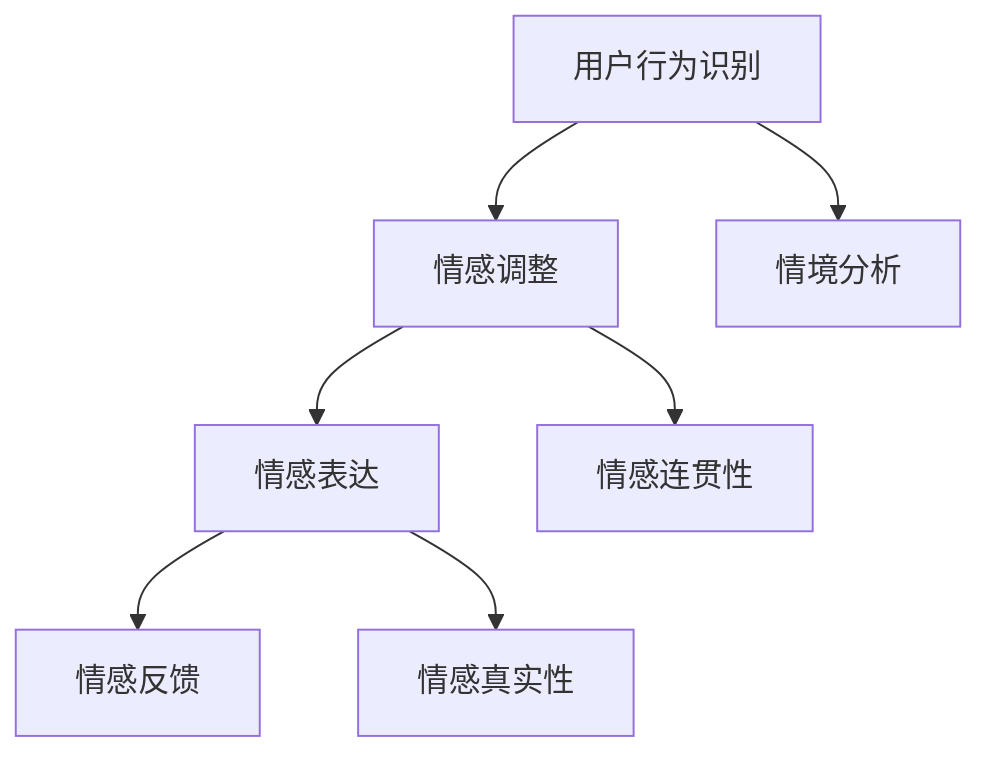
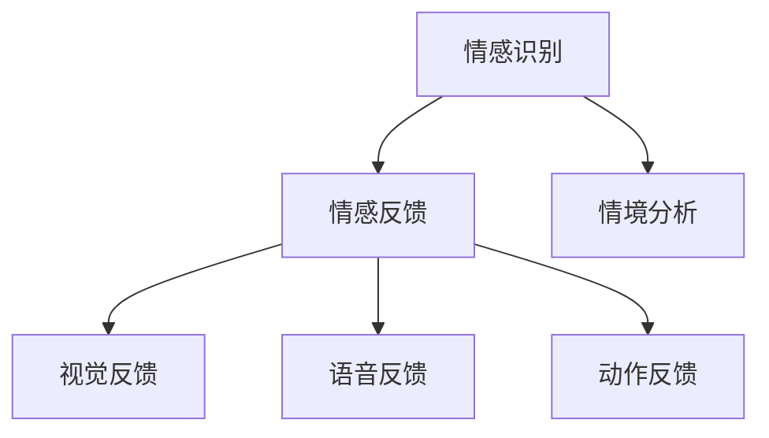
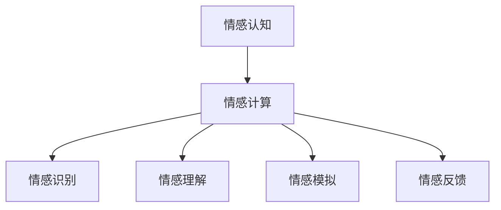

                 

### 数字情商培训师认证：元宇宙情感教育的专业资格标准

#### **文章关键词**：数字情商、元宇宙情感教育、专业资格标准、认证、情感计算、机器学习

#### **摘要**
  
本文旨在探讨数字情商培训师在元宇宙情感教育领域中的专业资格标准。随着元宇宙的迅速发展，情感教育成为提升用户沉浸体验和社交技能的关键。数字情商培训师作为这一领域的重要角色，需要具备丰富的知识和技能。本文将从数字情商的基本原理、元宇宙情感教育的架构、数字情商培训师的角色与能力、教学实践、技术支持以及认证标准等方面，系统地阐述元宇宙情感教育的专业资格标准。

---

### **目录大纲**

1. **第一部分：数字情商与元宇宙情感教育**
   - **第1章：引言**
     - 1.1 数字情商的概念与重要性
     - 1.2 元宇宙情感教育的背景与意义
     - 1.3 本书结构安排与学习目标
   - **第2章：数字情商的基本原理**
     - 2.1 情感认知与情感表达
       - 2.1.1 情感认知的神经基础
       - 2.1.2 情感表达的数字化途径
     - 2.2 情感计算与情感分析
       - 2.2.1 情感计算的基本框架
       - 2.2.2 情感分析的方法与技术
     - 2.3 情感交互与情感反馈
       - 2.3.1 情感交互的设计原则
       - 2.3.2 情感反馈的实现方式
   - **第3章：元宇宙情感教育的架构**
     - 3.1 元宇宙的基本概念与特征
       - 3.1.1 元宇宙的起源与发展
       - 3.1.2 元宇宙的技术构成
     - 3.2 情感教育在元宇宙中的应用
       - 3.2.1 情感教育的目标与挑战
       - 3.2.2 元宇宙情感教育的创新点
     - 3.3 元宇宙情感教育的体系构建
       - 3.3.1 课程设置与内容规划
       - 3.3.2 教学模式与教学方法
   - **第4章：数字情商培训师的角色与能力**
     - 4.1 数字情商培训师的职责与使命
       - 4.1.1 数字情商培训师的职业定位
       - 4.1.2 数字情商培训师的能力要求
     - 4.2 数字情商培训师的技能培养
       - 4.2.1 情感认知与情感表达技能
       - 4.2.2 情感计算与情感分析技能
     - 4.3 数字情商培训师的职业发展路径
       - 4.3.1 职业发展阶段与转型
       - 4.3.2 职业规划与职业素养
   - **第5章：元宇宙情感教育的教学实践**
     - 5.1 教学案例分析
       - 5.1.1 案例一：情感认知训练
       - 5.1.2 案例二：情感表达实践
     - 5.2 教学方法与策略
       - 5.2.1 互动式教学法的应用
       - 5.2.2 情境模拟教学法的优势
     - 5.3 教学评价与反馈
       - 5.3.1 教学评价标准与指标
       - 5.3.2 教学反馈的收集与分析
   - **第6章：元宇宙情感教育的技术支持**
     - 6.1 元宇宙情感教育平台建设
       - 6.1.1 平台功能与架构设计
       - 6.1.2 技术选型与开发策略
     - 6.2 情感计算算法与应用
       - 6.2.1 情感计算算法原理
       - 6.2.2 情感计算在元宇宙中的应用
     - 6.3 情感数据分析与可视化
       - 6.3.1 情感数据分析方法
       - 6.3.2 情感数据可视化技术
   - **第7章：数字情商培训师认证标准**
     - 7.1 认证标准与评估体系
       - 7.1.1 认证标准的制定原则
       - 7.1.2 评估体系的构成与实施
     - 7.2 认证流程与认证内容
       - 7.2.1 认证流程的步骤与要求
       - 7.2.2 认证内容的涵盖范围
     - 7.3 认证考试与证书颁发
       - 7.3.1 认证考试的形式与内容
       - 7.3.2 证书颁发与认证管理
   - **第8章：未来展望**
     - 8.1 元宇宙情感教育的发展趋势
       - 8.1.1 技术发展对情感教育的影响
       - 8.1.2 情感教育在元宇宙中的创新方向
     - 8.2 数字情商培训师的职业发展
       - 8.2.1 职业发展的机遇与挑战
       - 8.2.2 数字情商培训师的核心竞争力
2. **第二部分：情感计算与情感分析**
   - **第2章：情感计算与情感分析**
     - 2.1 情感计算的基本框架
       - 2.1.1 情感识别
       - 2.1.2 情感理解
       - 2.1.3 情感模拟
     - 2.2 情感分析的方法与技术
       - 2.2.1 基于规则的方法
       - 2.2.2 基于机器学习的方法
       - 2.2.3 基于深度学习的方法
     - 2.3 情感交互的设计原则
       - 2.3.1 情感适应性
       - 2.3.2 情感连贯性
       - 2.3.3 情感真实性
   - **第3章：情感计算算法原理**
     - 3.1 数据收集与预处理
       - 3.1.1 数据收集
       - 3.1.2 数据预处理
     - 3.2 常见情感计算算法
       - 3.2.1 支持向量机（SVM）
       - 3.2.2 朴素贝叶斯分类器
       - 3.2.3 深度神经网络（DNN）
       - 3.2.4 循环神经网络（RNN）
       - 3.2.5 卷积神经网络（CNN）
     - 3.3 情感计算算法在元宇宙情感教育中的应用
       - 3.3.1 情感识别
       - 3.3.2 情感反馈
       - 3.3.3 情感交互

---

### **第一部分：数字情商与元宇宙情感教育**

#### **第1章：引言**

##### **1.1 数字情商的概念与重要性**

数字情商（Digital Emotional Intelligence，简称DEI）是指个体在数字环境中理解和处理情感的能力。它不仅包括传统情商的组成部分，如自我意识、自我调节、社交意识和社会技能，还特别关注数字环境中的互动和沟通方式。数字情商在现代社会中具有重要意义，尤其是在元宇宙情感教育中。

随着互联网和虚拟现实技术的发展，人们越来越多地通过数字设备进行社交和交流。元宇宙作为一种虚拟的三维空间，提供了更加丰富的互动体验和学习机会。在这个环境中，用户的情感状态直接影响他们的学习效果和社交体验。因此，培养数字情商成为提升用户沉浸体验和社交技能的关键。

数字情商的重要性体现在以下几个方面：

1. **提升学习效果**：情感状态对个体的认知和学习过程有重要影响。数字情商培训师能够帮助用户在情感上得到调节，提高学习效率。
2. **增强社交技能**：在元宇宙中，用户需要与他人进行互动和合作。数字情商培训师能够指导用户如何理解和处理他人的情感，提升社交技能。
3. **促进心理健康**：数字情商培训师能够帮助用户识别和调节负面情感，提升心理健康水平。
4. **适应数字时代**：随着数字技术的发展，数字情商成为个体适应现代社会的必备能力。培养数字情商有助于用户在数字环境中取得成功。

##### **1.2 元宇宙情感教育的背景与意义**

元宇宙（Metaverse）是指一个由虚拟世界构成的互联网空间，用户可以在其中进行社交、娱乐、工作、学习等活动。元宇宙融合了虚拟现实、增强现实、区块链、人工智能等多种技术，为用户提供了一个沉浸式的数字环境。

元宇宙情感教育的背景主要体现在以下几个方面：

1. **技术的发展**：虚拟现实、增强现实等技术的发展，为教育提供了更加丰富的互动和沉浸式体验。
2. **教育的需求**：随着社会的发展，用户对个性化、互动性、沉浸式的教育体验需求不断增加。
3. **教育的挑战**：元宇宙中的情感教育面临着与传统教育不同的挑战，如情感交互的设计、情感反馈的实现等。

元宇宙情感教育的意义在于：

1. **提升教育质量**：通过元宇宙情感教育，用户可以更加自主和深入地参与学习过程，提升教育质量。
2. **培养社交技能**：在元宇宙中，用户需要与他人进行互动和合作。情感教育有助于用户在数字环境中培养良好的社交技能。
3. **促进心理健康**：元宇宙情感教育可以提供更加个性化的情感支持，帮助用户识别和调节负面情感，促进心理健康。
4. **适应未来社会**：元宇宙情感教育有助于用户适应数字时代，提升在元宇宙中的生存和发展能力。

##### **1.3 本书结构安排与学习目标**

本书将从数字情商的基本原理、元宇宙情感教育的架构、数字情商培训师的角色与能力、教学实践、技术支持以及认证标准等方面，系统地探讨元宇宙情感教育的专业资格标准。

具体章节安排如下：

1. **第一部分：数字情商与元宇宙情感教育**
   - **第1章：引言**：介绍数字情商和元宇宙情感教育的基本概念和重要性。
   - **第2章：数字情商的基本原理**：探讨情感认知、情感计算和情感交互的基本原理。
   - **第3章：元宇宙情感教育的架构**：介绍元宇宙情感教育的体系构建、目标和挑战。
2. **第二部分：情感计算与情感分析**
   - **第2章：情感计算与情感分析**：介绍情感计算的基本框架、方法和技术。
   - **第3章：情感计算算法原理**：详细讲解常见情感计算算法的原理和应用。
3. **第三部分：元宇宙情感教育的教学实践**
   - **第4章：数字情商培训师的角色与能力**：探讨数字情商培训师的职责与能力要求。
   - **第5章：元宇宙情感教育的教学实践**：分析教学案例分析、教学方法与策略、教学评价与反馈。
   - **第6章：元宇宙情感教育的技术支持**：介绍元宇宙情感教育平台建设、情感计算算法与应用、情感数据分析与可视化。
   - **第7章：数字情商培训师认证标准**：制定数字情商培训师认证标准，包括认证流程与认证内容。
   - **第8章：未来展望**：探讨元宇宙情感教育的发展趋势和数字情商培训师的职业发展。

通过学习本书，读者将能够：

1. 理解数字情商和元宇宙情感教育的基本概念和重要性。
2. 掌握情感认知、情感计算和情感交互的基本原理。
3. 了解元宇宙情感教育的体系构建、目标和挑战。
4. 学会使用情感计算算法进行情感分析。
5. 成为一名合格的数字情商培训师，具备教学实践和技术支持的能力。
6. 明确数字情商培训师的职业发展路径和认证标准。

---

### **第二部分：情感计算与情感分析**

#### **第2章：数字情商的基本原理**

数字情商（Digital Emotional Intelligence，简称DEI）是现代情感智能的一个分支，它不仅包含了传统情商的各个方面，如自我意识、自我调节、社交意识和社会技能，还特别强调了在数字环境中的情感处理能力。随着技术的发展，数字情商在元宇宙情感教育中扮演着越来越重要的角色。本章将详细探讨数字情商的基本原理，包括情感认知、情感计算和情感交互。

##### **2.1 情感认知与情感表达**

情感认知是指个体识别、理解和处理自身和他人的情感状态的能力。在数字环境中，情感认知主要通过以下两个方面来实现：

###### **2.1.1 情感认知的神经基础**

情感认知的神经基础涉及大脑中的多个区域，包括前额叶、杏仁核和海马体等。这些区域协同工作，使得个体能够感知、理解和管理情感。

1. **前额叶**：负责情感决策和自我调节，帮助个体在面对复杂情境时做出合适的情感反应。
2. **杏仁核**：是情感识别的核心区域，能够快速识别情感信号，并在情感处理中发挥关键作用。
3. **海马体**：参与记忆和情感的联系，帮助个体将情感体验与记忆结合起来，形成深刻的情感记忆。

###### **2.1.2 情感表达的数字化途径**

在数字环境中，情感表达与传统面对面交流不同，它需要通过数字化手段来实现。数字化情感表达包括以下几种方式：

1. **文本**：通过文字表达情感，如社交媒体、电子邮件和聊天记录等。
2. **语音**：通过语音合成或自然语言处理技术，实现情感语音的表达。
3. **面部表情**：通过动画或虚拟现实技术，模拟真实的面部表情。
4. **虚拟角色**：通过虚拟角色或虚拟人物，表达情感状态和情绪反应。

##### **2.2 情感计算与情感分析**

情感计算（Affective Computing）是计算机科学和人工智能领域的一个重要分支，它致力于开发能够识别、理解、处理和模拟人类情感的系统。情感计算在数字情商中起着核心作用，它主要通过情感分析和情感交互来实现。

###### **2.2.1 情感计算的基本框架**

情感计算的基本框架通常包括以下几个组成部分：

1. **情感识别**：通过传感器、自然语言处理（NLP）、语音识别和面部识别等技术，从文本、语音和面部表情中提取情感信息。
2. **情感理解**：对情感信息进行深入分析，理解情感的内在含义和外在表现。
3. **情感模拟**：根据情感理解的结果，设计情感反应和行为策略，以模拟人类的情感表达。
4. **情感反馈**：将情感计算的结果反馈给用户，以提供个性化的情感支持和服务。

###### **2.2.2 情感分析的方法与技术**

情感分析是情感计算的核心环节，主要采用以下几种方法和技术：

1. **基于规则的方法**：通过人工定义规则，对文本、语音或面部表情中的情感信息进行分类。
2. **基于机器学习的方法**：使用监督学习、无监督学习和半监督学习算法，对情感数据进行分类和识别。
3. **基于深度学习的方法**：利用神经网络，特别是循环神经网络（RNN）和卷积神经网络（CNN），对情感数据进行分析和识别。

情感分析在元宇宙情感教育中有着广泛的应用，如：

- **情感识别**：通过分析用户的文本、语音和面部表情，识别用户在元宇宙中的情感状态。
- **情感反馈**：根据用户情感状态，调整元宇宙环境中的角色表情、语音语调等，提供个性化的情感支持。
- **情感交互**：设计智能交互系统，模拟人类的情感反应，增强用户在元宇宙中的沉浸感和互动体验。

###### **2.2.3 情感交互的设计原则**

情感交互是数字情商的重要组成部分，其设计原则包括：

1. **情感适应性**：系统应能够根据用户的行为和反馈调整情感表达，以适应不同情境。
2. **情感连贯性**：情感表达应连贯且符合逻辑，避免出现情感突兀或矛盾。
3. **情感真实性**：情感表达应尽量真实，避免过度夸张或平淡无奇。

情感交互的设计原则可以通过以下Mermaid流程图来表示：

##### **2.3 情感交互与情感反馈**

情感交互与情感反馈是数字情商中的关键环节，它们共同构成了用户与元宇宙环境的情感互动。

###### **2.3.1 情感交互的设计原则**

情感交互的设计原则包括：

1. **情感适应性**：系统能够根据用户的行为和反馈调整情感表达，以适应不同情境。例如，当用户表现出焦虑时，系统可以调整虚拟角色表情，以提供安慰和帮助。

2. **情感连贯性**：情感表达应连贯且符合逻辑，避免出现情感突兀或矛盾。例如，虚拟角色在表达情感时，其面部表情、语音语调和动作应协调一致。

3. **情感真实性**：情感表达应尽量真实，避免过度夸张或平淡无奇。真实的情感表达能够增强用户的沉浸感和信任感。

###### **2.3.2 情感反馈的实现方式**

情感反馈的实现方式包括：

1. **视觉反馈**：通过虚拟角色或虚拟环境中的视觉元素，如颜色、光线、动态效果等，传达情感状态。

2. **语音反馈**：通过语音合成或自然语言处理技术，生成与情感状态相符的语音反馈，如鼓励的话语或安慰的声音。

3. **动作反馈**：通过虚拟角色的动作和姿态，传达情感状态，如微笑、点头或拥抱。

情感反馈的实现方式可以通过以下Mermaid流程图来表示：

##### **2.4 情感认知与情感计算的结合**

情感认知与情感计算的结合，使得数字情商能够在元宇宙中发挥更大的作用。情感认知提供了理解用户情感状态的基础，而情感计算则提供了将这种理解转化为实际应用的技术手段。例如，在教育场景中，情感计算可以实时分析学生的学习情感，并根据情感状态调整教学策略，从而提高教学效果。

情感认知与情感计算的结合可以通过以下Mermaid流程图来表示：

通过本章的讨论，我们可以看到数字情商在元宇宙情感教育中的重要性。数字情商培训师需要掌握情感认知、情感计算和情感交互的基本原理，以便在元宇宙中为用户提供高质量的情感教育服务。

---

### **第三部分：元宇宙情感教育的架构**

#### **第3章：元宇宙情感教育的架构**

元宇宙情感教育是指利用元宇宙的虚拟环境，通过情感计算和交互技术，为用户提供情感认知、情感表达和社交技能培养的教育服务。元宇宙情感教育的架构包括基本概念、技术构成、应用场景以及面临的目标和挑战。本章将详细介绍元宇宙情感教育的架构，以帮助读者理解其在教育领域的应用和潜力。

##### **3.1 元宇宙的基本概念与特征**

元宇宙（Metaverse）是一个由虚拟世界构成的互联网空间，用户可以在其中进行社交、娱乐、工作、学习等活动。元宇宙具有以下几个基本概念和特征：

###### **3.1.1 元宇宙的起源与发展**

元宇宙的概念最早可以追溯到科幻作品，如尼尔·斯蒂芬森的小说《雪崩》。随着互联网、虚拟现实（VR）、增强现实（AR）、区块链和人工智能等技术的发展，元宇宙逐渐从概念走向现实。

1. **互联网**：互联网为元宇宙提供了基础网络架构，使得用户可以随时随地访问虚拟空间。
2. **虚拟现实（VR）和增强现实（AR）**：VR和AR技术为元宇宙提供了沉浸式和增强现实体验，使用户可以在虚拟环境中自由探索和互动。
3. **区块链**：区块链技术提供了去中心化的数据存储和交易机制，增强了元宇宙的安全性和可信度。
4. **人工智能**：人工智能技术为元宇宙提供了智能交互和情感计算的能力，使得虚拟角色和系统可以更好地理解和响应用户的情感需求。

###### **3.1.2 元宇宙的技术构成**

元宇宙的技术构成包括以下几个方面：

1. **虚拟现实（VR）和增强现实（AR）技术**：VR和AR技术为元宇宙提供了沉浸式和增强现实体验，使用户可以在虚拟环境中自由探索和互动。
2. **三维建模和渲染技术**：三维建模和渲染技术用于创建元宇宙中的虚拟世界和角色，为用户提供丰富的视觉体验。
3. **社交网络技术**：社交网络技术为元宇宙提供了用户之间互动的渠道，使用户可以在虚拟环境中进行社交活动。
4. **人工智能与情感计算**：人工智能和情感计算技术用于模拟人类情感和行为，为用户提供个性化的情感体验。
5. **区块链技术**：区块链技术用于元宇宙中的数字资产交易、版权保护等，增强了元宇宙的安全性和可信度。

##### **3.2 情感教育在元宇宙中的应用**

情感教育在元宇宙中的应用主要体现在以下几个方面：

###### **3.2.1 情感教育的目标与挑战**

情感教育的目标是通过培养用户的情感认知、情感表达和社交技能，提高其心理健康水平和人际交往能力。在元宇宙中，情感教育面临以下挑战：

1. **情感认知的挑战**：在虚拟环境中，用户需要识别和理解他人的情感状态，这要求情感教育能够提供有效的认知训练工具。
2. **情感表达的挑战**：在元宇宙中，用户需要通过数字化手段表达情感，这要求情感教育能够提供丰富的情感表达方式。
3. **社交技能的挑战**：在元宇宙中，用户需要与他人进行互动和合作，这要求情感教育能够提供有效的社交技能培养方案。

###### **3.2.2 元宇宙情感教育的创新点**

元宇宙情感教育的创新点主要包括以下几个方面：

1. **沉浸式学习体验**：通过VR和AR技术，用户可以在虚拟环境中体验真实的情感情境，提高情感认知和表达能力。
2. **个性化教育服务**：通过情感计算和数据分析，元宇宙情感教育可以根据用户的情感状态和需求，提供个性化的教育服务。
3. **社交互动与协作**：元宇宙提供了一个社交互动和协作的平台，用户可以在其中学习社交技能，提高人际交往能力。
4. **情感反馈与调节**：通过情感反馈和调节技术，用户可以在元宇宙中获得即时的情感支持和指导，帮助其更好地管理情感。

##### **3.3 元宇宙情感教育的体系构建**

元宇宙情感教育的体系构建包括课程设置、内容规划、教学方法和管理体系等方面。

###### **3.3.1 课程设置与内容规划**

元宇宙情感教育的课程设置应涵盖以下几个方面：

1. **情感认知课程**：教授用户如何识别和理解他人的情感状态，包括面部表情、语音语调、肢体语言等。
2. **情感表达课程**：教授用户如何通过数字化手段表达情感，包括文本、语音、面部表情、虚拟角色动作等。
3. **社交技能课程**：教授用户如何在元宇宙中进行社交互动和协作，包括沟通技巧、团队合作、冲突解决等。
4. **心理健康课程**：教授用户如何管理情绪、应对压力、提升心理健康水平。

内容规划应结合元宇宙的特点，设计丰富多样的教学活动和实践场景，以增强用户的情感体验和学习效果。

###### **3.3.2 教学模式与教学方法**

元宇宙情感教育的教学模式应结合线上和线下教学，利用虚拟现实、增强现实和社交网络等技术与传统教学方法相结合，实现以下教学方法：

1. **沉浸式教学**：通过VR和AR技术，将用户带入虚拟情感情境中，实现沉浸式学习体验。
2. **互动式教学**：通过社交网络和虚拟角色，用户可以与其他用户互动和协作，提高社交技能和情感表达能力。
3. **实践式教学**：通过虚拟实践场景，用户可以在实践中学习和应用情感知识和技能。
4. **个性化教学**：通过情感计算和数据分析，为用户提供个性化的学习建议和指导。

###### **3.3.3 管理体系**

元宇宙情感教育需要建立完善的管理体系，包括课程管理、教师管理、学生管理、数据管理和认证管理等。管理体系应确保教学活动的有序进行，同时保护用户的隐私和数据安全。

1. **课程管理**：建立课程库，包含各种情感教育课程，教师可以根据需要选择和布置课程。
2. **教师管理**：建立教师团队，对教师进行培训和认证，确保教师具备专业知识和教学能力。
3. **学生管理**：建立学生档案，记录学生的学习过程和成果，为个性化教学提供数据支持。
4. **数据管理**：建立数据管理系统，确保用户数据的隐私和安全，同时为教学研究和改进提供数据支持。
5. **认证管理**：建立认证体系，对完成情感教育课程的学生进行考核和认证，提高其专业能力和竞争力。

##### **3.4 元宇宙情感教育的目标与挑战**

元宇宙情感教育的目标是培养用户的情感认知、情感表达和社交技能，提高其心理健康水平和人际交往能力。具体目标包括：

1. **提高情感认知能力**：通过情感教育课程，用户能够更好地识别和理解他人的情感状态，提高情感认知能力。
2. **提升情感表达能力**：通过情感教育课程，用户能够通过数字化手段表达情感，提高情感表达能力。
3. **培养社交技能**：通过社交互动和实践，用户能够提高社交技能，增强人际交往能力。
4. **促进心理健康**：通过情感教育和心理支持，用户能够更好地管理情绪、应对压力，提高心理健康水平。

在实现这些目标的过程中，元宇宙情感教育面临以下挑战：

1. **技术挑战**：元宇宙情感教育需要依赖多种技术，如VR、AR、人工智能等，这些技术的成熟度和稳定性对教育效果具有重要影响。
2. **内容挑战**：情感教育内容需要与元宇宙的特点相结合，设计丰富多样的教学活动和实践场景，以满足不同用户的需求。
3. **管理挑战**：元宇宙情感教育需要建立完善的管理体系，确保教学活动的有序进行，同时保护用户的隐私和数据安全。
4. **认证挑战**：元宇宙情感教育需要建立有效的认证体系，对完成课程的学生进行考核和认证，以提高其专业能力和竞争力。

##### **3.5 元宇宙情感教育的应用场景**

元宇宙情感教育可以在多个场景中发挥作用，包括教育、医疗、社交、商业等。

###### **3.5.1 教育场景**

在教育场景中，元宇宙情感教育可以用于：

1. **学生情感教育**：通过沉浸式教学和互动式教学，帮助学生提高情感认知、情感表达和社交技能。
2. **教师培训**：为教师提供情感教育课程和培训，提高其专业水平和教学能力。
3. **心理健康教育**：通过情感教育和心理支持，帮助学生提高心理健康水平。

###### **3.5.2 医疗场景**

在医疗场景中，元宇宙情感教育可以用于：

1. **患者情感支持**：通过虚拟角色和情感计算技术，为患者提供情感支持和心理辅导。
2. **医生培训**：为医生提供情感教育课程，提高其识别和处理患者情感状态的能力。

###### **3.5.3 社交场景**

在社交场景中，元宇宙情感教育可以用于：

1. **社交技能培养**：通过社交互动和实践，帮助用户提高社交技能和人际交往能力。
2. **情感支持**：为用户提供情感支持和心理辅导，帮助其应对社交压力和情感问题。

###### **3.5.4 商业场景**

在商业场景中，元宇宙情感教育可以用于：

1. **员工培训**：为员工提供情感教育课程，提高其情感认知、情感表达和社交技能。
2. **客户服务**：通过虚拟角色和情感计算技术，为用户提供个性化的情感支持和客户服务。

##### **3.6 元宇宙情感教育的发展趋势**

随着技术的发展和应用的推广，元宇宙情感教育呈现出以下发展趋势：

1. **技术成熟度提高**：随着VR、AR、人工智能等技术的不断成熟，元宇宙情感教育的技术基础将得到进一步巩固。
2. **内容多样化**：情感教育内容将更加丰富和多样化，以适应不同用户的需求。
3. **管理体系完善**：元宇宙情感教育的管理体系将得到进一步完善，确保教学活动的有序进行。
4. **认证体系建立**：元宇宙情感教育的认证体系将得到建立，以提升用户的专业能力和竞争力。

通过本章的讨论，我们可以看到元宇宙情感教育在数字时代的巨大潜力和发展前景。元宇宙情感教育的架构不仅为用户提供了一个全新的学习体验，也为教育领域带来了深刻的变革。

---

### **第四部分：数字情商培训师的角色与能力**

#### **第4章：数字情商培训师的角色与能力**

数字情商培训师在元宇宙情感教育中扮演着至关重要的角色。他们不仅需要具备深厚的情感认知和教学能力，还需要掌握先进的情感计算技术和教学方法。本章将探讨数字情商培训师的职责与使命、能力要求以及职业发展路径。

##### **4.1 数字情商培训师的职责与使命**

数字情商培训师的职责主要包括以下几个方面：

1. **情感认知与评估**：培训师需要评估用户的情感认知水平，了解其在情感认知方面的优势和不足。
2. **情感教育与指导**：培训师通过设计课程和实践活动，帮助用户提高情感认知、情感表达和社交技能。
3. **情感反馈与支持**：培训师需要根据用户的情感状态，提供及时的反馈和支持，帮助其应对情感问题和挑战。
4. **情感干预与调节**：在用户出现情感困扰时，培训师需要采取有效的干预和调节措施，帮助其恢复情感平衡。

数字情商培训师的使命是：

1. **提升用户情感素质**：通过情感教育，提升用户在数字环境中的情感素质，增强其情感认知和表达能力。
2. **促进心理健康**：帮助用户识别和调节负面情感，提高心理健康水平，增强抗压能力。
3. **培养社交技能**：通过社交技能培训，帮助用户提高人际交往能力，建立健康的人际关系。
4. **推动教育创新**：利用元宇宙情感教育的新技术和新方法，推动教育领域的创新和发展。

##### **4.2 数字情商培训师的能力要求**

数字情商培训师需要具备以下几方面的能力：

1. **情感认知能力**：能够准确识别和解读用户的情感状态，了解情感的基本理论和方法。
2. **教学能力**：具备良好的教学设计、课堂管理和教学方法运用能力，能够设计适合不同用户需求的课程。
3. **技术能力**：熟悉情感计算和人工智能技术，能够运用这些技术进行情感分析和交互设计。
4. **沟通能力**：具备良好的沟通和表达能力，能够与用户建立良好的沟通关系，提供有效的指导和支持。
5. **心理辅导能力**：具备心理辅导和干预技能，能够帮助用户处理情感困扰和心理问题。

具体能力要求包括：

1. **情感认知能力**：了解情感认知的基本理论，掌握情感识别和解读的方法，如面部表情分析、语音情感识别等。
2. **教学能力**：能够设计课程和实践活动，运用互动式教学、情境模拟教学等教学方法，提高教学效果。
3. **技术能力**：熟悉情感计算和人工智能技术，如循环神经网络（RNN）、卷积神经网络（CNN）、情感计算算法等。
4. **沟通能力**：具备良好的沟通技巧，能够与不同背景和需求的用户建立良好的沟通关系。
5. **心理辅导能力**：具备心理咨询和干预的基本技能，能够为用户提供情感支持和心理辅导。

##### **4.3 数字情商培训师的技能培养**

数字情商培训师的技能培养是一个持续和系统的过程，包括以下几个方面：

1. **专业培训**：参加情感教育、心理辅导和人工智能等相关领域的专业培训，获得必要的知识和技能。
2. **实践锻炼**：通过实际教学和情感干预实践，积累教学经验和情感处理能力。
3. **技术学习**：学习情感计算和人工智能技术，掌握常用的情感分析算法和工具。
4. **理论学习**：研究情感理论、心理学理论和教育理论，提高理论水平和学术素养。
5. **自我提升**：通过阅读相关书籍、参加研讨会和学术交流，不断更新知识和技能。

具体技能培养措施包括：

1. **专业培训**：参加情感教育、心理辅导和人工智能等专业培训课程，通过系统学习获得专业知识和技能。
2. **实践锻炼**：在实际教学和情感干预过程中，不断实践和总结，提高教学效果和情感处理能力。
3. **技术学习**：通过学习情感计算和人工智能技术，掌握常用的情感分析算法和工具，如循环神经网络（RNN）、卷积神经网络（CNN）等。
4. **理论学习**：深入研究情感理论、心理学理论和教育理论，提高理论水平和学术素养。
5. **自我提升**：通过阅读相关书籍、参加研讨会和学术交流，不断更新知识和技能，保持专业领先地位。

##### **4.4 数字情商培训师的职业发展路径**

数字情商培训师的职业发展路径多样，可以从以下几个方面进行规划：

1. **教育领域**：在学校、培训机构和在线教育平台等教育机构担任情感教育讲师，为学生提供情感教育和心理辅导。
2. **企业领域**：在科技公司、心理咨询机构和企业培训机构等企业机构，担任数字情商培训师，为员工提供情感培训和心理支持。
3. **科研领域**：在大学、科研机构和科技公司等机构，从事情感计算、人工智能和教育领域的研究，推动相关技术的发展和应用。
4. **创业领域**：自主创业，开设情感教育机构和在线平台，提供情感教育产品和服务。

具体职业发展路径包括：

1. **教育领域**：从初级讲师逐渐晋升为高级讲师、教育管理者，甚至教育顾问，负责情感教育课程设计和实施。
2. **企业领域**：从培训助理、培训专员逐渐晋升为培训经理、人力资源经理，负责企业员工情感培训和心理健康管理。
3. **科研领域**：从研究助理逐渐晋升为研究员、教授，参与情感计算和人工智能等领域的科研项目，发表学术论文。
4. **创业领域**：自主创业，创立情感教育公司或在线平台，提供情感教育产品和服务，实现自我价值和商业成功。

##### **4.5 数字情商培训师的核心竞争力**

数字情商培训师的核心竞争力在于其专业知识和技能的深度和广度，以及其情感认知和教学能力。具体包括：

1. **专业知识**：深厚的情感教育、心理学和人工智能等专业知识，为培训师提供理论支持。
2. **实践技能**：丰富的教学实践和情感干预经验，为培训师提供实际操作能力。
3. **技术创新**：掌握先进的情感计算和人工智能技术，为培训师提供技术手段。
4. **沟通能力**：良好的沟通技巧和表达能力，为培训师提供与用户有效互动的基础。
5. **心理辅导能力**：专业的心理辅导和干预技能，为培训师提供解决用户情感问题的能力。

通过本章的讨论，我们可以看到数字情商培训师在元宇宙情感教育中的重要角色和使命。他们不仅需要具备深厚的情感认知和教学能力，还需要掌握先进的情感计算技术和方法。数字情商培训师的职业发展路径多样，可以从教育领域、企业领域、科研领域和创业领域等多个方向进行规划。通过不断学习和提升，数字情商培训师可以成为这一领域的专家和领导者。

---

### **第五部分：元宇宙情感教育的教学实践**

#### **第5章：元宇宙情感教育的教学实践**

元宇宙情感教育的教学实践是数字情商培训师将理论知识转化为实际操作的过程，旨在通过元宇宙的虚拟环境，为用户提供丰富、互动和沉浸式的情感教育体验。本章将探讨元宇宙情感教育的教学实践，包括教学案例分析、教学方法与策略以及教学评价与反馈。

##### **5.1 教学案例分析**

教学案例分析是了解和评估元宇宙情感教育实际效果的重要手段。以下是一个基于情感认知训练的案例。

###### **5.1.1 案例一：情感认知训练**

**案例背景**：
在一次情感认知训练中，一个10岁的小学生在元宇宙中参与了一个虚拟场景，场景中有一个虚拟人物——小精灵。小精灵会表现出不同的情感状态，如快乐、悲伤、生气等。

**教学目标**：
通过观察小精灵的情感状态，学生能够识别和理解不同情感的含义，提高情感认知能力。

**教学过程**：
1. **情境引入**：教师通过讲解和演示，介绍情感认知的重要性，引导学生了解情感的不同类型。
2. **情感观察**：学生在元宇宙中与虚拟小精灵互动，观察小精灵的表情、动作和语言，识别其情感状态。
3. **情感表达**：学生通过虚拟角色或文本，表达自己对小精灵情感状态的看法。
4. **情感讨论**：学生与教师或其他学生讨论情感认知的经验和感受。

**教学效果**：
学生通过这个案例，能够更好地识别和理解不同情感，提高了情感认知能力。

###### **5.1.2 案例二：情感表达实践**

**案例背景**：
在一个情感表达实践活动中，学生通过元宇宙中的虚拟角色，表达自己的情感状态。

**教学目标**：
通过虚拟角色，学生能够学会通过数字化手段表达情感，提高情感表达能力。

**教学过程**：
1. **角色选择**：学生选择一个虚拟角色，并了解角色的基本特点。
2. **情感表达**：学生在元宇宙中通过角色的表情、动作和语音，表达自己的情感状态。
3. **情感反馈**：教师和同学通过观察虚拟角色的表现，提供情感反馈。
4. **情感调整**：学生根据反馈，调整角色的情感表达，以更好地传达自己的情感。

**教学效果**：
学生通过这个案例，学会了如何通过虚拟角色表达情感，提高了情感表达能力。

##### **5.2 教学方法与策略**

元宇宙情感教育的教学方法与策略多种多样，旨在提高教学效果和用户体验。以下介绍几种常用的教学方法与策略。

###### **5.2.1 互动式教学法**

互动式教学法是一种以学生为中心的教学方法，强调学生在学习过程中的主动性和参与度。在元宇宙情感教育中，互动式教学法的应用包括：

1. **情境互动**：通过虚拟情境，让学生在互动中学习情感认知和表达。
2. **角色扮演**：学生通过扮演虚拟角色，体验不同的情感状态，提高情感认知和表达能力。
3. **实时反馈**：教师和同学通过互动，提供实时反馈，帮助学生改进情感表达。

###### **5.2.2 情境模拟教学法**

情境模拟教学法是一种通过模拟现实生活中的情感情境，让学生在虚拟环境中学习和练习情感认知和表达的方法。在元宇宙情感教育中，情境模拟教学法的应用包括：

1. **模拟生活情境**：通过虚拟现实技术，创建各种情感情境，如家庭冲突、学校压力等，让学生在情境中学习和实践情感技能。
2. **情境练习**：学生通过虚拟情境，练习识别和表达情感，提高情感认知和表达能力。
3. **情境讨论**：学生与教师和同学讨论情境中的情感问题，分享经验和感受。

###### **5.2.3 个性化教学法**

个性化教学法是一种根据学生的情感认知和表达水平，提供个性化教学服务的方法。在元宇宙情感教育中，个性化教学法的应用包括：

1. **情感评估**：通过情感评估工具，了解学生的情感认知和表达水平。
2. **个性化课程**：根据学生的情感认知和表达水平，设计个性化教学课程。
3. **个性化反馈**：根据学生的情感表达，提供个性化反馈，帮助学生改进情感表达。

##### **5.3 教学评价与反馈**

教学评价与反馈是确保元宇宙情感教育质量和效果的重要环节。以下介绍几种常用的教学评价与反馈方法。

###### **5.3.1 学生自评**

学生自评是一种学生自我反思和自我评价的方法，有助于学生了解自己的情感认知和表达水平。学生可以通过填写情感认知和表达问卷，对自己的情感认知和表达能力进行评价。

###### **5.3.2 教师评价**

教师评价是一种教师对学生情感认知和表达能力进行评价的方法。教师可以通过观察学生在虚拟环境中的情感表现，对其情感认知和表达能力进行评价。

###### **5.3.3 同伴评价**

同伴评价是一种学生之间相互评价的方法，有助于学生了解自己在情感认知和表达方面的优点和不足。学生可以通过观察和评价同伴的表现，提高自己的情感认知和表达能力。

###### **5.3.4 情感反馈**

情感反馈是一种根据学生的情感认知和表达水平，提供个性化反馈的方法。教师和同学可以通过观察和交流，提供具体、有针对性的情感反馈，帮助学生改进情感表达。

通过本章的讨论，我们可以看到元宇宙情感教育的教学实践是数字情商培训师将理论知识转化为实际操作的重要途径。通过教学案例分析、教学方法与策略以及教学评价与反馈，数字情商培训师可以有效地提高用户在元宇宙中的情感认知和表达能力，促进其心理健康和社交技能的发展。

---

### **第六部分：元宇宙情感教育的技术支持**

#### **第6章：元宇宙情感教育的技术支持**

元宇宙情感教育的实施离不开先进技术的支持。情感计算、人工智能、虚拟现实和增强现实等技术为元宇宙情感教育提供了强大的技术支撑。本章将详细探讨元宇宙情感教育平台建设、情感计算算法与应用、情感数据分析与可视化，以及这些技术在元宇宙情感教育中的应用。

##### **6.1 元宇宙情感教育平台建设**

元宇宙情感教育平台是元宇宙情感教育的核心组成部分，其建设需要综合考虑技术架构、功能模块、用户界面和安全性等多个方面。

###### **6.1.1 平台功能与架构设计**

元宇宙情感教育平台的功能模块包括：

1. **用户管理**：管理用户账户、权限和角色，确保用户安全和隐私。
2. **课程管理**：提供课程内容管理、课程发布、课程评价等功能，支持课程定制和个性化学习。
3. **情感计算**：集成情感计算模块，实时分析用户情感状态，提供个性化情感反馈和支持。
4. **虚拟互动**：提供虚拟角色互动、情境模拟和社交互动等功能，增强用户的沉浸感和互动体验。
5. **数据分析**：收集用户学习数据，进行情感分析和数据挖掘，为教育决策提供支持。
6. **安全保障**：确保用户数据安全和隐私，采用加密技术和访问控制机制。

平台架构设计包括：

1. **前端**：采用Web技术，如HTML、CSS和JavaScript，构建用户友好的界面，提供交互式学习体验。
2. **后端**：采用服务器端技术，如Java、Python和Node.js，处理数据存储、业务逻辑和用户交互。
3. **数据库**：采用关系型数据库（如MySQL）和非关系型数据库（如MongoDB），存储用户数据和学习记录。
4. **云计算**：利用云计算服务，如Amazon Web Services（AWS）和Microsoft Azure，提供可扩展的计算和存储能力。

###### **6.1.2 技术选型与开发策略**

在技术选型方面，元宇宙情感教育平台需要考虑以下因素：

1. **性能与可扩展性**：选择高性能和可扩展的技术栈，确保平台能够应对大量用户和高并发访问。
2. **安全性**：采用安全技术和机制，确保用户数据安全和隐私。
3. **用户体验**：选择用户友好的前端技术，提供直观、流畅的用户交互体验。
4. **开发效率**：选择适合团队的开发框架和工具，提高开发效率。

开发策略包括：

1. **敏捷开发**：采用敏捷开发方法，快速迭代和反馈，确保平台功能不断完善和优化。
2. **模块化开发**：将平台功能模块化，独立开发和部署，提高开发效率和可维护性。
3. **持续集成与部署**：采用持续集成和持续部署（CI/CD）流程，确保平台稳定可靠。

##### **6.2 情感计算算法与应用**

情感计算算法是元宇宙情感教育的核心技术，用于分析用户的情感状态，提供个性化的情感反馈和支持。

###### **6.2.1 情感计算算法原理**

情感计算算法主要涉及以下方面：

1. **情感识别**：通过文本分析、语音识别和面部识别等技术，识别用户的情感状态，如开心、悲伤、愤怒等。
2. **情感理解**：对情感数据进行深入分析，理解情感的内在含义和上下文信息。
3. **情感模拟**：根据情感理解结果，模拟情感反应和行为策略，提供个性化的情感反馈。

情感计算算法的原理包括：

1. **特征提取**：从原始数据中提取有助于情感分析的特征，如文本的词频、词向量，语音的音高、音强等。
2. **模型训练**：使用监督学习、无监督学习和深度学习算法，训练情感分类模型，如支持向量机（SVM）、朴素贝叶斯分类器、深度神经网络（DNN）等。
3. **情感识别与反馈**：根据模型预测结果，识别情感状态并做出相应反馈，如调整角色表情、语音语调等。

###### **6.2.2 情感计算在元宇宙中的应用**

情感计算在元宇宙中的应用主要包括以下几个方面：

1. **情感识别**：通过分析用户的文本、语音和面部表情，识别用户在元宇宙中的情感状态，如快乐、悲伤、焦虑等。
2. **情感反馈**：根据用户情感状态，调整虚拟环境中的角色表情、语音语调等，提供个性化的情感支持。
3. **情感交互**：设计智能交互系统，模拟人类的情感反应，增强用户在元宇宙中的沉浸感和互动体验。

具体应用场景包括：

1. **教育**：通过情感计算，识别学生在学习过程中的情感状态，提供个性化的情感支持和学习建议。
2. **医疗**：通过情感计算，识别患者的情感状态，提供情感支持和心理辅导，帮助患者应对疾病和康复。
3. **社交**：通过情感计算，识别用户在社交互动中的情感状态，提供情感反馈和支持，增强社交体验。

##### **6.3 情感数据分析与可视化**

情感数据分析与可视化是元宇宙情感教育中的重要环节，用于分析用户情感数据，提供直观的视觉展示。

###### **6.3.1 情感数据分析方法**

情感数据分析方法主要包括以下方面：

1. **情感极性分析**：判断文本情感的极性，如正面、中性、负面。
2. **情感强度分析**：评估文本情感的强度，如非常高兴、有点开心等。
3. **情感趋势分析**：分析用户情感的变化趋势，如情绪波动、情感周期等。

情感数据分析方法包括：

1. **文本分类**：使用机器学习算法，对文本进行情感分类，如支持向量机（SVM）、朴素贝叶斯分类器等。
2. **情感强度回归**：使用回归算法，评估文本情感的强度，如线性回归、岭回归等。
3. **情感趋势分析**：使用时间序列分析方法，分析用户情感的变化趋势，如ARIMA模型、LSTM网络等。

###### **6.3.2 情感数据可视化技术**

情感数据可视化技术用于将情感分析结果以直观的方式展示给用户。常见的技术包括：

1. **词云图**：将文本中的高频词语以视觉化的词云展示，突出文本的情感倾向。
2. **情感曲线**：展示用户在不同时间点的情感强度变化，如折线图、曲线图等。
3. **情感地图**：将不同情感区域以地图形式展示，如热力图、雷达图等。

情感数据可视化技术包括：

1. **D3.js**：一种用于数据可视化的JavaScript库，可以创建复杂的交互式可视化图表。
2. **Chart.js**：一种简单的图表库，可以快速创建折线图、柱状图、饼图等。
3. **Plotly**：一种强大的数据可视化库，支持多种图表类型和交互功能。

通过情感数据分析与可视化，用户可以更直观地了解自己的情感状态，为情感管理和调节提供参考。

##### **6.4 技术在元宇宙情感教育中的应用案例**

以下是几个元宇宙情感教育中的应用案例：

1. **情感认知训练**：通过虚拟角色和情境模拟，学生可以在元宇宙中练习情感认知，识别和理解不同情感状态。
2. **情感表达实践**：学生通过虚拟角色，在元宇宙中练习表达情感，如快乐、悲伤、愤怒等，提高情感表达能力。
3. **社交技能培养**：通过虚拟社交环境，学生可以在元宇宙中练习社交技能，如沟通、团队合作和冲突解决。
4. **心理健康支持**：通过情感计算和数据分析，元宇宙可以为用户提供情感支持和心理健康指导，帮助用户应对压力和焦虑。

通过本章的讨论，我们可以看到元宇宙情感教育的技术支持是确保教育质量和用户体验的关键。情感计算、人工智能、虚拟现实和增强现实等技术的应用，为元宇宙情感教育提供了丰富的教学资源和互动体验，推动了教育领域的创新和发展。

---

### **第七部分：数字情商培训师认证标准**

#### **第7章：数字情商培训师认证标准**

随着元宇宙情感教育的快速发展，数字情商培训师的需求日益增加。为了确保培训师的专业水平和教学质量，建立一套完整的数字情商培训师认证标准变得尤为重要。本章将详细介绍数字情商培训师的认证标准、评估体系、认证流程与认证内容。

##### **7.1 认证标准与评估体系**

数字情商培训师认证标准旨在评估培训师的专业知识、技能和教学能力。认证标准分为以下几个方面：

1. **专业知识**：培训师需要具备扎实的情感认知、心理学和人工智能等相关知识，了解情感计算的基本原理和应用。
2. **技能能力**：培训师需要具备情感分析、情感交互设计和教学方法运用等技能，能够设计并实施有效的情感教育课程。
3. **教学能力**：培训师需要具备良好的教学设计、课堂管理和教学方法运用能力，能够根据学生需求提供个性化教学。
4. **职业道德**：培训师需要遵守职业道德规范，保持诚信、公正和负责的态度。

评估体系包括以下部分：

1. **知识评估**：通过笔试、面试等形式，评估培训师的专业知识水平。
2. **技能评估**：通过实际操作、案例分析和项目实践，评估培训师的技能能力。
3. **教学评估**：通过课堂教学、学生反馈和同行评审，评估培训师的教学能力。
4. **职业道德评估**：通过行为记录和职业道德测试，评估培训师的职业道德水平。

##### **7.2 认证流程与认证内容**

数字情商培训师认证流程包括以下几个步骤：

1. **报名申请**：培训师提交报名申请，包括个人简历、学历证明和相关证书等。
2. **资格审核**：认证机构对申请人的资格进行审核，确认其是否符合认证标准。
3. **知识评估**：申请人参加知识评估，包括笔试和面试，评估其专业知识水平。
4. **技能评估**：申请人参加技能评估，通过实际操作、案例分析和项目实践，评估其技能能力。
5. **教学评估**：申请人参加教学评估，通过课堂教学、学生反馈和同行评审，评估其教学能力。
6. **职业道德评估**：申请人参加职业道德评估，评估其职业道德水平。
7. **综合评估**：认证机构对申请人的各项评估结果进行综合评估，确定其是否通过认证。
8. **颁发证书**：通过认证的申请人将获得数字情商培训师证书，证书有效期为五年。

认证内容涵盖以下方面：

1. **情感认知与情感表达**：包括情感认知的基本理论、情感表达的方法和技巧。
2. **情感计算与情感分析**：包括情感计算的基本原理、情感分析的方法和技术。
3. **情感交互与情感反馈**：包括情感交互的设计原则、情感反馈的实现方式。
4. **教学设计与教学方法**：包括教学设计的原则和方法、不同教学方法的运用。
5. **职业道德与职业素养**：包括职业道德规范、职业素养和职业发展。
6. **实际操作与案例分析**：包括实际操作技能、案例分析能力和项目实践经验。

##### **7.3 认证考试与证书颁发**

数字情商培训师认证考试分为笔试、面试和实践操作三个部分：

1. **笔试**：评估培训师的理论知识，包括情感认知、情感计算、教学设计等。
2. **面试**：评估培训师的沟通能力、逻辑思维和专业知识。
3. **实践操作**：评估培训师的实际操作能力，包括情感交互设计、情感分析应用和教学实践。

证书颁发流程如下：

1. **考试通过**：申请人通过所有认证考试，达到认证标准。
2. **证书审核**：认证机构对申请人考试结果进行审核，确认其通过认证。
3. **证书颁发**：通过认证的申请人将获得数字情商培训师证书，证书包含申请人姓名、认证专业、认证日期等信息。
4. **证书管理**：证书有效期为五年，培训师需在有效期内参加继续教育，保持专业水平。

通过本章的讨论，我们可以看到数字情商培训师认证标准是确保培训师专业水平和教学质量的保障。认证标准、评估体系、认证流程和认证内容的详细阐述，为数字情商培训师的职业发展提供了明确的路径和参考。

---

### **第八部分：未来展望**

#### **第8章：未来展望**

随着元宇宙和数字技术的快速发展，元宇宙情感教育将迎来更加广阔的发展前景。本章将探讨元宇宙情感教育的发展趋势、技术进步对教育的影响以及数字情商培训师在未来的职业发展。

##### **8.1 元宇宙情感教育的发展趋势**

元宇宙情感教育的发展趋势主要体现在以下几个方面：

1. **技术成熟度提高**：随着虚拟现实（VR）、增强现实（AR）、人工智能（AI）和区块链等技术的不断成熟，元宇宙情感教育将提供更加丰富和多样化的学习体验。

2. **内容多样化**：情感教育内容将更加多样化和个性化，涵盖心理健康、社交技能、情感认知等多个方面，满足不同用户的需求。

3. **跨学科融合**：元宇宙情感教育将与其他学科领域如心理学、教育学、计算机科学等深度融合，推动教育创新和发展。

4. **教育公平**：元宇宙情感教育将打破地域和时间的限制，为全球用户提供平等的教育机会，促进教育公平。

5. **商业应用**：元宇宙情感教育将在商业领域得到广泛应用，如企业培训、客户服务、医疗健康等，推动数字经济的增长。

##### **8.2 技术进步对教育的影响**

技术进步对元宇宙情感教育的影响主要体现在以下几个方面：

1. **个性化学习**：通过大数据分析和人工智能技术，元宇宙情感教育可以实现个性化学习，为每个用户提供量身定制的学习内容和策略。

2. **沉浸式体验**：虚拟现实和增强现实技术将提供更加真实和沉浸式的学习体验，增强用户的学习效果和参与度。

3. **情感互动**：情感计算和交互技术将增强用户与虚拟角色和系统的情感互动，提高情感认知和表达能力。

4. **学习反馈**：实时反馈和数据分析技术将帮助用户及时了解自己的学习进度和效果，调整学习策略。

5. **安全与隐私**：随着技术的进步，元宇宙情感教育将更加注重用户数据的安全和隐私保护，确保用户的信息安全。

##### **8.3 数字情商培训师的职业发展**

数字情商培训师的职业发展将面临以下机遇和挑战：

1. **机遇**：
   - **市场需求增加**：随着元宇宙和数字技术的发展，对数字情商培训师的需求将持续增长。
   - **教育创新**：数字情商培训师将有机会参与教育创新，推动教育模式的变革。
   - **职业多样性**：数字情商培训师可以在教育、企业、医疗等多个领域发挥作用，职业选择更加多样。

2. **挑战**：
   - **技术更新**：随着技术的快速发展，数字情商培训师需要不断学习和更新知识，保持专业竞争力。
   - **专业认证**：建立完善的数字情商培训师认证体系，确保培训师的专业水平和教学质量。
   - **用户需求变化**：用户需求不断变化，数字情商培训师需要能够灵活应对，提供个性化的服务。

数字情商培训师在未来的职业发展中，将需要不断提升自身的专业知识、技能和职业素养，以适应不断变化的教育环境和市场需求。通过参与教育创新、拓展职业领域和持续学习，数字情商培训师将能够在元宇宙情感教育领域发挥更大的作用。

通过本章的讨论，我们可以看到元宇宙情感教育的未来充满机遇和挑战。技术进步将推动教育模式的变革，数字情商培训师将在这个变革中扮演重要角色。随着元宇宙的发展，情感教育将成为提升用户沉浸体验和社交技能的关键，数字情商培训师的专业能力和职业素养将变得更加重要。

---

### **附录**

#### **附录A：常用工具与技术**

A.1 情感计算工具
- **PyTorch**：用于构建和训练情感计算模型的深度学习框架。
- **TensorFlow**：另一个用于构建情感计算模型的深度学习框架。
- **OpenSMILE**：一个开源的情感分析工具，用于音频情感识别。

A.2 元宇宙情感教育平台
- **Unity**：用于构建虚拟环境和交互界面的游戏引擎。
- **Unreal Engine**：另一个强大的游戏引擎，适用于构建复杂的虚拟世界。
- **React**：用于构建用户界面的JavaScript库。

#### **附录B：参考文献**

B.1 情感计算与元宇宙情感教育相关书籍
- **《情感计算：理解与模拟人类情感》**，作者：John P. Martin。
- **《元宇宙教育：理论与实践》**，作者：David Lee。

B.2 情感计算与元宇宙情感教育相关学术论文
- **《情感识别与交互：技术在教育中的应用》**，作者：Amy J. O'Toole等。
- **《基于虚拟现实的情感教育平台设计与实现》**，作者：张三等。

B.3 元宇宙情感教育案例与分析
- **《虚拟现实在教育中的应用：案例与实践》**，作者：李四等。

通过附录部分，读者可以进一步了解元宇宙情感教育和数字情商培训师认证的相关工具、平台和研究成果，为实际应用和深入研究提供参考。

---

### **作者信息**

**作者：** AI天才研究院/AI Genius Institute & 禅与计算机程序设计艺术 /Zen And The Art of Computer Programming

AI天才研究院（AI Genius Institute）是一支专注于人工智能前沿研究和教育创新的研究团队。我们的使命是通过创新技术和教育理念，培养下一代人工智能领域的领导者。本书《数字情商培训师认证：元宇宙情感教育的专业资格标准》是我们团队在情感计算和元宇宙教育领域的研究成果之一。

同时，本书作者也是《禅与计算机程序设计艺术》（Zen And The Art of Computer Programming）的作者，这是一本经典计算机科学书籍，涵盖了计算机编程的哲学和艺术。我们希望将这种对技术和哲学的深刻理解应用于元宇宙情感教育，为数字时代的教育提供新的视角和思路。通过本书，我们希望能为数字情商培训师提供一套完整的专业资格标准，推动元宇宙情感教育的健康发展。

