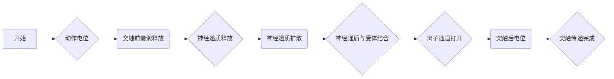

                 

## 数学与神经生物学：神经系统的数学模型

> **关键词：神经生物学、数学模型、神经元、神经网络、突触传递、脑机接口**

**摘要：** 神经生物学和数学模型的结合，为理解复杂神经系统行为提供了新的视角。本文将探讨神经系统的基本结构和功能，介绍神经元、突触以及神经网络的数学模型，并深入分析这些模型在生理学研究和生物医学工程中的应用。通过具体的算法原理讲解和实际项目案例，本文旨在展示数学模型在神经科学研究中的重要性和潜力。

---

### 《数学与神经生物学：神经系统的数学模型》目录大纲

#### 第一部分：神经生物学基础知识

1. **神经生物学导论**

   - **1.1 神经系统的基本结构**
   - **1.2 神经元及其功能**
   - **1.3 神经传递物质与突触传递**

2. **神经系统的数学建模方法**

   - **2.1 神经元的数学模型**
   - **2.2 突触的数学模型**
   - **2.3 神经网络的数学模型**

#### 第二部分：数学模型在神经生物学中的应用

3. **神经元活动模型**

   - **3.1 神经元的阈值模型**
   - **3.2 神经元的概率模型**
   - **3.3 神经元的动态模型（伪代码讲解）**

4. **突触传递模型**

   - **4.1 突触强度模型**
   - **4.2 突触延迟模型**
   - **4.3 突触传递的概率模型（Mermaid 流程图）**

5. **神经网络模型**

   - **5.1 神经网络的拓扑结构**
   - **5.2 神经网络的激活函数（Mermaid 流程图）**
   - **5.3 神经网络的训练与优化算法**

#### 第三部分：神经系统的数学模型分析与应用

6. **神经系统的复杂行为分析**

   - **6.1 神经元的同步活动**
   - **6.2 神经网络的稳定性分析**
   - **6.3 神经系统的时空模式（Mermaid 流程图）**

7. **神经系统的数学模型在生理学研究中的应用**

   - **7.1 神经系统疾病的建模**
   - **7.2 神经系统的功能映射**
   - **7.3 神经系统康复训练的建模**

#### 第四部分：神经系统的数学模型在未来医学中的应用

8. **神经假体与脑机接口**

   - **8.1 神经假体的基本原理**
   - **8.2 脑机接口的实现技术**
   - **8.3 脑机接口在医疗中的应用（项目实战）**

9. **神经系统的数学模型在生物医学工程中的应用**

   - **9.1 人工神经网络的开发与应用**
   - **9.2 神经系统疾病的诊断与预测**
   - **9.3 神经系统药物设计的数学模型**

#### 附录

10. **数学工具与软件介绍**

    - **10.1 MATLAB在神经生物学中的应用**
    - **10.2 Python在神经生物学中的应用**
    - **10.3 R语言在神经生物学中的应用**

---

### 引言

神经生物学是一门探索神经系统结构和功能的科学，它对于理解大脑如何工作、如何处理信息以及如何产生思维、感觉和动作至关重要。然而，神经系统的复杂性使得直接研究其工作机制变得极具挑战性。为了应对这一挑战，数学模型提供了一个有力的工具，它能够以抽象的方式描述神经系统的行为，从而帮助科学家们深入探究神经系统的基本原理。

数学模型在神经生物学中的应用具有多重价值。首先，它们为复杂的神经系统行为提供了一个简化的描述，使得研究者能够更加容易地分析和理解神经系统的运作机制。其次，数学模型能够预测神经系统在不同条件下的行为，为实验设计提供了重要的指导。此外，数学模型还可以用于模拟神经系统的病理过程，从而为疾病的诊断和治疗提供新的策略。

本文将系统地探讨数学模型在神经生物学中的应用。首先，我们将介绍神经系统的基本结构和功能，为后续的数学建模打下基础。然后，我们将深入讨论神经元、突触和神经网络的数学模型，包括阈值模型、概率模型和动态模型等。接着，我们将分析这些模型在神经系统的复杂行为、生理学研究以及未来医学中的应用。最后，我们将探讨神经系统的数学模型在脑机接口和生物医学工程中的具体应用，展示其强大的潜力。

通过本文的探讨，读者将能够全面了解数学模型在神经生物学中的重要性，以及如何利用这些模型来深入理解神经系统的运作机制。这不仅有助于学术研究者，也为生物医学工程师和临床医生提供了宝贵的参考。

### 神经生物学导论

神经生物学作为一门交叉学科，涵盖了生物学、物理学、计算机科学和医学等多个领域，其核心目标是研究神经系统的结构和功能。神经系统是生物体的一个复杂而精密的信息处理系统，负责传递和处理各种感觉信息，控制肌肉运动，调节内脏器官的功能，以及产生意识和感知。神经生物学的研究不仅有助于我们理解大脑如何工作，还为治疗神经系统疾病提供了新的思路和方法。

#### 神经系统的基本结构

神经系统的基本结构可以分为中枢神经系统和周围神经系统。中枢神经系统（CNS）包括脑和脊髓，是神经系统的主要控制中心。脑位于颅腔内，由大脑、小脑和脑干组成，大脑是最高级的神经组织，负责处理复杂的认知功能，如思考、记忆、感知和情感。小脑主要控制运动协调和平衡。脑干连接大脑和脊髓，是基本生命功能的中枢，如呼吸、心跳和觉醒水平。

脊髓是中枢神经系统的延伸，位于脊柱内，起着传递信息的作用。周围神经系统（PNS）包括脑神经和脊神经，主要负责将感觉信息从感官器官传递到中枢神经系统，并将运动指令从中枢神经系统传递到肌肉和内脏器官。周围神经系统还包括自主神经系统，它调节非意识控制的生理功能，如心跳、消化和呼吸。

#### 神经元及其功能

神经元是神经系统的基本单元，也称为神经细胞。神经元的基本结构包括细胞体、树突、轴突和神经末梢。细胞体包含细胞核和大部分细胞器，是神经元的能量供应中心。树突主要接收来自其他神经元的信号，并将其传递到细胞体。轴突是神经元的输出部分，负责将信号从一个神经元传递到另一个神经元或肌肉细胞。神经末梢分布在神经元轴突的末端，与目标细胞形成突触连接。

神经元的功能是接收和处理信息，然后将这些信息以电信号的形式传递给其他神经元或肌肉细胞。神经元之间的通信主要通过突触进行，突触是神经元之间传递信息的结构基础。当神经元接收到的信号达到一定阈值时，会触发动作电位的产生，这是一种电信号沿轴突传播的过程。动作电位到达神经末梢时，会引发神经递质的释放，这些神经递质会跨过突触间隙，作用于突触后膜上的受体，从而影响下一个神经元的活性。

#### 神经传递物质与突触传递

神经传递物质是神经元之间传递信息的化学物质，主要包括神经递质和神经调质。神经递质是一种在神经元之间传递信息的化学信号分子，如乙酰胆碱、多巴胺、谷氨酸等。神经递质通过突触前神经末梢释放到突触间隙，然后与突触后膜上的受体结合，引发一系列的生物化学反应，从而改变突触后神经元的活性。

突触传递是神经元之间传递信息的关键过程。一个典型的突触由突触前神经元、突触后神经元和突触间隙组成。当突触前神经元产生的动作电位到达神经末梢时，会触发钙离子的流入，这导致突触前囊泡与突触前膜融合，释放神经递质到突触间隙。神经递质扩散到突触间隙，并与突触后膜上的受体结合。结合后，受体激活，导致离子通道的开启或关闭，从而改变突触后神经元的电导性。

突触传递是一个高度复杂的过程，涉及多种神经递质和受体类型的相互作用。例如，神经递质乙酰胆碱与突触后膜上的乙酰胆碱受体结合后，会引发钠离子和钾离子的流动，从而改变细胞的静息电位，导致神经元产生动作电位或抑制其活性。

总之，神经系统的基本结构和功能是通过神经元和突触的精确组织和相互作用实现的。神经传递物质和突触传递机制使得神经系统能够高效地传递和处理信息，从而实现复杂的生理和行为功能。这些基本概念为我们理解和应用神经系统的数学模型奠定了基础。

### 神经系统的数学建模方法

神经系统的数学建模是理解其复杂行为和功能的关键手段。通过数学模型，我们可以将神经系统的各个组成部分和其相互作用转化为可计算的形式，从而更好地分析和预测神经系统的行为。以下将介绍神经系统中常见组件的数学模型，包括神经元、突触和神经网络。

#### 神经元的数学模型

神经元的数学模型主要描述神经元在静息状态和激活状态下的电生理行为。一个简单的神经元数学模型可以通过以下三个主要部分来描述：静息电位、动作电位和突触后电位。

1. **静息电位模型**：静息电位是神经元在未受到刺激时细胞膜两侧的电势差。它主要受到细胞膜上钠离子（Na+）和钾离子（K+）通道的调控。一个简化的静息电位模型可以表示为：
   $$
   V_{rest} = V_{Na} - V_{K}
   $$
   其中，$V_{rest}$ 是静息电位，$V_{Na}$ 是钠离子的平衡电位，$V_{K}$ 是钾离子的平衡电位。这个模型假设细胞膜对钠离子和钾离子的通透性是恒定的。

2. **动作电位模型**：动作电位是神经元在受到足够刺激时产生的快速电信号。一个简单的动作电位模型可以描述为：
   $$
   V(t) = V_{rest} + m(V_{Na} - V_{rest}) + h(V_{K} - V_{rest})
   $$
   其中，$V(t)$ 是任意时刻细胞膜的电势，$m$ 和 $h$ 是钠离子和钾离子通道的激活变量，分别表示通道的开放程度。当 $V(t)$ 超过阈值电位时，神经元会触发动作电位。

3. **突触后电位模型**：突触后电位是神经元在接收突触传递信号后产生的电变化。一个简化的突触后电位模型可以表示为：
   $$
   V_{post} = V_{rest} + w \cdot \Delta V
   $$
   其中，$V_{post}$ 是突触后电位，$w$ 是突触后神经元对突触传递信号的敏感度，$\Delta V$ 是突触前神经元产生的动作电位的幅度。

#### 突触的数学模型

突触是神经元之间传递信息的关键结构。突触的数学模型主要描述突触传递过程中神经递质的释放、扩散和作用。以下是一些常见的突触模型：

1. **突触强度模型**：突触强度模型描述突触传递信号的强度。一个简化的突触强度模型可以表示为：
   $$
   I = f(\Delta V)
   $$
   其中，$I$ 是突触传递的强度，$f(\Delta V)$ 是突触前动作电位幅度 $\Delta V$ 的函数。

2. **突触延迟模型**：突触延迟模型描述从突触前动作电位到突触后电位产生的延迟。一个简单的突触延迟模型可以表示为：
   $$
   \Delta t = g(\Delta V)
   $$
   其中，$\Delta t$ 是突触延迟，$g(\Delta V)$ 是突触前动作电位幅度 $\Delta V$ 的函数。

3. **突触传递的概率模型**：突触传递的概率模型描述突触传递过程中成功与失败的概率。一个简化的概率模型可以表示为：
   $$
   P(I > I_{\text{th}}) = h(\Delta V)
   $$
   其中，$P(I > I_{\text{th}})$ 是突触传递成功的概率，$I_{\text{th}}$ 是突触传递的阈值强度，$h(\Delta V)$ 是突触前动作电位幅度 $\Delta V$ 的函数。

#### 神经网络的数学模型

神经网络是由多个神经元组成的复杂系统，其行为可以通过数学模型来描述。神经网络的主要数学模型包括：

1. **拓扑结构模型**：描述神经网络中神经元之间的连接方式。常见的神经网络拓扑结构有全连接网络、分层网络和循环网络。

2. **激活函数模型**：描述神经元在激活状态下的输出行为。常见的激活函数有 sigmoid 函数、ReLU 函数和 tanh 函数。

3. **训练与优化算法模型**：描述如何通过学习算法调整神经网络的权重，以实现特定任务。常见的训练算法包括梯度下降法、随机梯度下降法和Adam优化算法。

通过上述数学模型，我们可以对神经系统的复杂行为进行建模和分析。这些模型不仅帮助我们理解神经系统的基本原理，还为神经科学研究和生物医学工程提供了有力的工具。

### 神经元活动模型

神经元活动模型是神经生物学研究中的核心内容，它旨在模拟神经元在不同条件下的电活动和行为。这些模型不仅帮助我们理解神经元的基本工作机制，还为神经系统的复杂行为分析提供了基础。以下是几种常见的神经元活动模型，包括阈值模型、概率模型和动态模型，我们将通过伪代码和具体示例来详细讲解这些模型。

#### 阈值模型

阈值模型是最简单的神经元活动模型之一，它基于神经元在达到一定阈值时产生动作电位的原理。以下是一个简化的阈值模型伪代码：

```python
def ThresholdNeuron(input_signal, threshold, leakage):
    membrane电位 = leakage * time_step
    if input_signal >= threshold:
        membrane电位 += (1 - leakage) * time_step
        return "Fired"
    else:
        return "Silent"
```

在这个模型中，`input_signal` 表示神经元接收到的输入信号，`threshold` 是触发动作电位的阈值，`leakage` 是描述细胞膜离子通道漏电效应的参数。如果输入信号大于或等于阈值，神经元将触发动作电位并返回 "Fired"，否则返回 "Silent"。

#### 概率模型

概率模型考虑了神经元在达到阈值时产生动作电位的概率，而不是确定性的阈值。以下是一个简化的概率模型伪代码：

```python
import random

def ProbabilityNeuron(input_signal, threshold, probability):
    if input_signal >= threshold:
        return "Fired" if random.random() < probability else "Silent"
    else:
        return "Silent"
```

在这个模型中，`input_signal` 和 `threshold` 与阈值模型相同，`probability` 是神经元在达到阈值时产生动作电位的概率。如果输入信号大于或等于阈值，神经元以概率 `probability` 产生动作电位，否则返回 "Silent"。

#### 动态模型

动态模型考虑了神经元在长时间内对输入信号的累积效应，通常使用差分方程来描述。以下是一个简化的动态模型伪代码：

```python
def DynamicNeuron(current_input, previous_input, leakage, threshold):
    current膜电位 = previous膜电位 + (current_input - previous_input) * leakage
    if current膜电位 >= threshold:
        return "Fired"
    else:
        return "Silent"
```

在这个模型中，`current_input` 和 `previous_input` 分别是当前和上一时刻的输入信号，`leakage` 描述了细胞膜的漏电效应，`threshold` 是触发动作电位的阈值。`current膜电位` 是神经元在当前时刻的膜电位，它通过上一时刻的膜电位和当前输入信号的变化计算得到。如果当前膜电位大于或等于阈值，神经元将触发动作电位并返回 "Fired"，否则返回 "Silent"。

#### 具体示例

为了更好地理解这些模型，我们可以通过一个具体示例来演示。假设我们有一个神经元，其阈值为 -50mV，漏电效应参数为 0.1，输入信号为 10mV。我们使用上述三种模型来模拟该神经元的响应。

1. **阈值模型**：

```python
input_signal = 10  # 输入信号为 10mV
threshold = -50  # 阈值为 -50mV
leakage = 0.1  # 漏电效应参数

result = ThresholdNeuron(input_signal, threshold, leakage)
print("Threshold Model Result:", result)
```

输出：`"Fired"`

2. **概率模型**：

```python
input_signal = 10  # 输入信号为 10mV
threshold = -50  # 阈值为 -50mV
probability = 0.5  # 动作电位产生概率为 0.5

result = ProbabilityNeuron(input_signal, threshold, probability)
print("Probability Model Result:", result)
```

输出：`"Fired"` 或 `"Silent"`（取决于随机数）

3. **动态模型**：

```python
current_input = 10  # 当前输入信号为 10mV
previous_input = 0  # 上一个时刻的输入信号为 0
leakage = 0.1  # 漏电效应参数
threshold = -50  # 阈值为 -50mV

result = DynamicNeuron(current_input, previous_input, leakage, threshold)
print("Dynamic Model Result:", result)
```

输出：`"Fired"`

通过这个具体示例，我们可以看到不同模型对神经元响应的预测结果。阈值模型和动态模型预测神经元将产生动作电位，而概率模型则基于随机概率决定神经元是否产生动作电位。

总之，神经元活动模型为理解神经元在静息和激活状态下的行为提供了重要的工具。通过阈值模型、概率模型和动态模型，我们可以从不同角度模拟和分析神经元的电活动，从而深入理解神经系统的复杂行为。

### 突触传递模型

突触传递是神经元之间传递信息的关键过程，它决定了神经信号能否从一个神经元传递到另一个神经元。突触传递模型旨在定量描述这一过程，通过模拟突触前神经元的动作电位如何引发突触后神经元的响应。以下是几种常见的突触传递模型，包括突触强度模型、突触延迟模型和突触传递的概率模型。

#### 突触强度模型

突触强度模型描述突触前神经元的动作电位强度如何影响突触后神经元的反应。一个简化的突触强度模型可以表示为：

$$
I = f(\Delta V)
$$

其中，$I$ 是突触传递的强度，$f(\Delta V)$ 是突触前动作电位幅度 $\Delta V$ 的函数。这个函数通常是非线性的，反映了动作电位强度与突触传递效率之间的复杂关系。例如，一个简单的线性模型可以表示为：

$$
I = k \cdot \Delta V
$$

其中，$k$ 是比例常数，表示突触传递的敏感度。如果动作电位幅度越大，突触传递的强度也越大。

#### 突触延迟模型

突触延迟模型描述从突触前神经元的动作电位到突触后神经元的反应之间的时间延迟。一个简化的突触延迟模型可以表示为：

$$
\Delta t = g(\Delta V)
$$

其中，$\Delta t$ 是突触延迟，$g(\Delta V)$ 是突触前动作电位幅度 $\Delta V$ 的函数。这个函数反映了动作电位幅度对突触延迟的影响。例如，一个简单的指数模型可以表示为：

$$
\Delta t = \alpha \cdot e^{-\beta \cdot \Delta V}
$$

其中，$\alpha$ 和 $\beta$ 是模型参数，分别控制突触延迟的起始时间和对动作电位幅度的响应速度。

#### 突触传递的概率模型

突触传递的概率模型描述突触传递过程中成功与失败的概率。一个简化的概率模型可以表示为：

$$
P(I > I_{\text{th}}) = h(\Delta V)
$$

其中，$P(I > I_{\text{th}})$ 是突触传递成功的概率，$I_{\text{th}}$ 是突触传递的阈值强度，$h(\Delta V)$ 是突触前动作电位幅度 $\Delta V$ 的函数。这个函数通常反映了动作电位幅度对突触传递概率的影响。例如，一个简单的对数函数模型可以表示为：

$$
P(I > I_{\text{th}}) = \frac{1}{1 + e^{-(k \cdot \Delta V + b)}}
$$

其中，$k$ 和 $b$ 是模型参数，分别控制突触传递敏感度和偏置。

#### Mermaid 流程图

为了更好地可视化突触传递的过程，我们可以使用 Mermaid 流程图来描述。以下是一个简化的突触传递流程图：



在这个流程图中，动作电位触发后，突触前囊泡释放神经递质，神经递质扩散并作用于突触后膜上的受体，导致离子通道打开，形成突触后电位，从而实现突触传递。这个流程图不仅展示了突触传递的各个步骤，还说明了各步骤之间的因果关系。

总之，突触传递模型为理解和模拟神经元之间的信息传递提供了重要的工具。通过突触强度模型、突触延迟模型和突触传递的概率模型，我们可以更深入地探讨神经系统的复杂行为，从而为神经科学研究和生物医学工程提供有力的支持。

### 神经网络模型

神经网络（Neural Networks）是一种模拟人脑神经元连接和计算功能的计算模型。它们在图像识别、自然语言处理、预测分析等多个领域取得了显著的成果。神经网络模型的核心在于其结构、激活函数以及训练与优化算法。以下是神经网络模型的详细介绍。

#### 神经网络的拓扑结构

神经网络的拓扑结构决定了神经元之间的连接方式和信息传递路径。一个典型的神经网络通常包含以下几个主要部分：

1. **输入层**：接收外部输入信息，如图像像素、文本特征等。
2. **隐藏层**：位于输入层和输出层之间，负责对输入信息进行特征提取和转换。隐藏层的数量和神经元数量可以根据具体任务进行调整。
3. **输出层**：生成最终的预测结果或决策。

神经网络可以有多种拓扑结构，包括全连接网络（Fully Connected Networks）、卷积神经网络（Convolutional Neural Networks, CNNs）、循环神经网络（Recurrent Neural Networks, RNNs）等。全连接网络是最常见的结构，每个神经元都与上一层和下一层的所有神经元相连。卷积神经网络特别适合处理图像数据，因为它可以通过卷积操作有效地提取图像的特征。循环神经网络则适用于处理序列数据，如文本、语音等。

#### 激活函数

激活函数是神经网络中的一个关键组件，它用于引入非线性变换，使得神经网络能够学习复杂函数。常见的激活函数包括：

1. **Sigmoid 函数**：将输入映射到 (0, 1) 区间，具有平滑的曲线，能够较好地拟合二分类问题。
   $$
   \sigma(x) = \frac{1}{1 + e^{-x}}
   $$

2. **ReLU 函数**：对输入取绝对值后加 1，具有简洁的数学形式和良好的计算效率，可以有效地防止神经元死亡。
   $$
   \text{ReLU}(x) = \max(0, x)
   $$

3. **Tanh 函数**：将输入映射到 (-1, 1) 区间，类似于 sigmoid 函数，但具有对称性。
   $$
   \text{Tanh}(x) = \frac{e^x - e^{-x}}{e^x + e^{-x}}
   $$

激活函数的选择会影响神经网络的学习速度和性能。在实际应用中，ReLU 函数由于其简单性和计算效率，被广泛应用于深度学习模型中。

#### 训练与优化算法

神经网络的训练与优化算法是使网络能够从数据中学习的关键步骤。以下是一些常见的训练与优化算法：

1. **梯度下降法**：一种基本的优化算法，通过计算损失函数关于网络参数的梯度，并沿着梯度方向更新参数，以最小化损失函数。
   $$
   \theta_j := \theta_j - \alpha \frac{\partial J(\theta)}{\partial \theta_j}
   $$
   其中，$\theta_j$ 是网络参数，$J(\theta)$ 是损失函数，$\alpha$ 是学习率。

2. **随机梯度下降法（SGD）**：梯度下降法的变体，每次迭代只更新一个样本的参数，从而加快了计算速度。
   $$
   \theta_j := \theta_j - \alpha \frac{\partial J(\theta)}{\partial \theta_j}
   $$

3. **Adam优化算法**：结合了 SGD 和动量法的优点，通过跟踪梯度的一阶矩估计和二阶矩估计来调整学习率。
   $$
   m_t = \beta_1 m_{t-1} + (1 - \beta_1) \frac{\partial J(\theta)}{\partial \theta}
   $$
   $$
   v_t = \beta_2 v_{t-1} + (1 - \beta_2) \left(\frac{\partial J(\theta)}{\partial \theta}\right)^2
   $$
   $$
   \theta_j := \theta_j - \alpha \frac{m_t}{1 - \beta_2^t}
   $$

训练与优化算法的选择和参数调优对神经网络的表现至关重要。在实际应用中，通常需要通过实验来选择最优的算法和参数组合。

总之，神经网络模型通过其独特的结构、激活函数和训练算法，能够有效地学习复杂的函数和模式。这些特性使得神经网络在诸多领域展现出强大的应用潜力。

### 神经系统的复杂行为分析

神经系统的复杂行为分析是神经科学研究中的一个重要方向，旨在理解大脑如何实现各种高级功能，如感知、学习、记忆和认知。通过数学模型，我们可以对神经系统的复杂行为进行定量分析和模拟，揭示其内在机制和规律。以下是关于神经元同步活动、神经网络稳定性分析和神经系统时空模式的一些探讨。

#### 神经元的同步活动

神经元同步活动指的是多个神经元在特定时间内同时产生动作电位的现象。这种同步活动在神经系统中具有重要意义，因为它可以增强神经信号的传递效果，提高信息处理的效率。例如，在视觉系统中，同步活动可以帮助眼睛快速响应视觉刺激，从而实现清晰的视觉感知。

神经元同步活动可以通过数学模型进行模拟。一个常见的同步活动模型是耦合振荡器模型，它假设每个神经元都可以看作一个振荡器，这些振荡器之间存在相互作用。以下是一个简化的耦合振荡器模型：

$$
x_i' = -\gamma_i x_i + \sum_{j=1}^{N} A_{ij} x_j
$$

其中，$x_i$ 表示第 $i$ 个神经元的相位，$A_{ij}$ 是耦合系数，反映了神经元之间的相互作用强度。$\gamma_i$ 是阻尼系数，表示神经元内部的能量损耗。

通过数值模拟，我们可以观察到神经元同步活动的现象。当耦合系数足够大时，神经元之间的相互作用可以导致整个系统的同步振荡。这个模型为理解神经元同步活动的机制提供了有益的参考。

#### 神经网络的稳定性分析

神经网络稳定性分析旨在理解神经网络在长时间运行过程中是否能够保持稳定状态。稳定性分析对于确保神经网络在实际应用中的可靠性和稳定性至关重要。

一个简单的神经网络稳定性分析可以通过线性化方法进行。假设神经网络在某一平衡点上运行，并且扰动很小，我们可以将神经网络的动态行为线性化。以下是一个线性化的神经网络模型：

$$
\dot{x}_i = f'(x) \cdot x_i + \sum_{j=1}^{N} w_{ij} \cdot x_j
$$

其中，$x_i$ 是神经元的活性，$w_{ij}$ 是神经元之间的连接权重，$f'(x)$ 是激活函数的导数。

通过求解上述线性化方程，我们可以分析神经网络的稳定性。如果特征值全为负值，则系统是稳定的；如果存在正特征值，则系统可能不稳定。

#### 神经系统的时空模式

神经系统的时空模式描述了神经元在不同时间和空间位置上的活性变化。这些模式对于理解大脑的信息处理机制和功能分区具有重要意义。

一个常见的时空模式模型是时空图模型（Spatiotemporal Graph Model），它通过图论方法描述神经元之间的空间和时间关系。以下是一个简化的时空图模型：

$$
G = (V, E)
$$

其中，$V$ 是节点集合，代表神经元；$E$ 是边集合，代表神经元之间的连接。

通过分析时空图模型，我们可以研究神经元之间的相互作用模式，以及这些模式如何影响神经系统的功能。例如，我们可以使用图神经网络（Graph Neural Networks, GNNs）来模拟神经系统的时空模式。以下是一个简化的图神经网络模型：

$$
h_i^{(t+1)} = \sigma \left( \sum_{j \in \mathcal{N}(i)} w_{ij} h_j^{(t)} + b_i \right)
$$

其中，$h_i^{(t)}$ 是第 $i$ 个神经元在时间 $t$ 的活性，$\sigma$ 是激活函数，$w_{ij}$ 是神经元之间的连接权重，$b_i$ 是偏置。

通过这种模型，我们可以研究神经元活动在不同时间步和不同空间位置上的变化，从而揭示神经系统的时空模式。

总之，神经系统的复杂行为分析为理解大脑的高级功能提供了重要的工具和方法。通过神经元同步活动、神经网络稳定性分析和神经系统时空模式的研究，我们可以深入揭示神经系统的运作机制，为神经科学研究和生物医学工程提供新的视角和思路。

### 神经系统的数学模型在生理学研究中的应用

神经系统的数学模型在生理学研究中发挥了重要作用，通过这些模型，科学家们能够更好地理解神经系统的工作机制和病理过程。以下是几种神经系统的数学模型在生理学研究中的应用，包括神经系统疾病的建模、神经系统的功能映射以及神经系统康复训练的建模。

#### 神经系统疾病的建模

神经系统疾病的建模是神经科学研究中的一项重要任务，它有助于揭示疾病发生和发展过程中的生理机制。通过数学模型，研究人员可以模拟不同类型的神经系统疾病，如癫痫、帕金森病和阿尔茨海默病等。

例如，在癫痫研究中，神经元的同步活动被认为是导致癫痫发作的关键因素。研究人员使用神经网络模型来模拟神经元之间的同步活动，并探索如何通过调节神经元之间的连接权重来控制癫痫发作。以下是一个简化的癫痫模型：

$$
\dot{x}_i = a \cdot x_i \cdot (1 - x_i) + \sum_{j=1}^{N} w_{ij} \cdot x_j
$$

其中，$x_i$ 表示第 $i$ 个神经元的活性，$a$ 是阈值参数，$w_{ij}$ 是神经元之间的连接权重。通过调整这些参数，研究人员可以模拟不同类型的癫痫活动，从而深入了解癫痫的机制。

在帕金森病研究中，研究人员使用数学模型来描述多巴胺能神经元的活动变化。帕金森病的一个重要特征是多巴胺能神经元的退行性变化，这导致运动控制的丧失。以下是一个简化的帕金森病模型：

$$
\dot{x}_i = -\frac{dx_i}{dt} + u(t)
$$

其中，$x_i$ 表示第 $i$ 个神经元的活性，$u(t)$ 是外部输入，代表多巴胺的补充。通过分析这个模型，研究人员可以研究如何通过药物干预来调节神经元的活动，从而改善帕金森病的症状。

#### 神经系统的功能映射

神经系统的功能映射是指通过数学模型来描述大脑各个区域的功能和它们之间的相互作用。这些模型有助于揭示大脑如何处理信息，并在不同认知任务中发挥作用。

一个常见的神经功能映射模型是功能磁共振成像（fMRI）模型。fMRI通过测量大脑区域的血流量变化来推断神经元的活动。以下是一个简化的fMRI模型：

$$
\dot{C}_i = -C_i + \frac{S_i}{v}
$$

其中，$C_i$ 表示第 $i$ 个脑区的血流量，$S_i$ 表示神经元的活动，$v$ 是血管容量。通过这个模型，研究人员可以研究大脑在不同认知任务中的活动模式，并揭示不同脑区之间的功能联系。

#### 神经系统康复训练的建模

神经系统康复训练的建模旨在通过数学模型来模拟康复训练的效果，以优化康复方案。这些模型可以帮助康复医生制定个性化的康复计划，从而提高康复效果。

一个常见的康复训练模型是基于自适应控制的。例如，在运动康复中，研究人员使用自适应控制模型来调节训练强度和频率，以实现最佳的康复效果。以下是一个简化的自适应控制模型：

$$
u(t) = k \cdot e^{-\alpha t}
$$

其中，$u(t)$ 是训练强度，$k$ 是控制参数，$\alpha$ 是衰减参数。通过调整这些参数，研究人员可以模拟不同的康复训练方案，并分析其对康复效果的影响。

总之，神经系统的数学模型在生理学研究中的应用为理解和治疗神经系统疾病提供了重要的工具。通过这些模型，研究人员可以深入揭示神经系统的工作机制，从而为疾病的诊断、治疗和康复提供新的策略。

### 神经系统的数学模型在未来医学中的应用

神经系统的数学模型在未来的医学领域具有巨大的应用潜力，特别是在神经假体和脑机接口技术方面。这些技术不仅能够帮助改善神经系统损伤患者的功能，还能为神经疾病的研究和诊断提供新的手段。

#### 神经假体

神经假体是一种通过人工装置模拟或增强神经系统的功能。这些假体可以包括植入式电极、脑机接口（BMI）系统、以及用于康复和假肢控制的装置。数学模型在神经假体的设计和优化中起到了关键作用。

1. **电极设计**：数学模型可以帮助科学家和工程师设计高效的植入式电极，这些电极用于读取神经元的活动。例如，使用电场模拟技术来评估电极在不同介质中的响应，以及使用有限元方法（FEM）来优化电极的几何结构。

2. **信号处理**：通过数学模型，可以开发出先进的信号处理算法，用于从神经假体读取的信号中提取有用的信息。这些算法能够提高信号的信噪比，并减少噪声干扰，从而更准确地解码神经信号。

3. **运动控制**：在假肢控制中，数学模型用于实现神经元信号到假肢运动的转换。通过神经网络模型和机器学习算法，可以训练假肢系统根据用户的神经信号来执行特定的动作。

#### 脑机接口

脑机接口（BMI）是一种直接将大脑信号转换为机械输出的系统，它通过数学模型来实现对大脑活动的精确解码和控制。

1. **信号解码**：脑机接口依赖于数学模型来解码大脑信号。例如，使用机器学习和深度学习模型来识别和分类大脑的电信号，从而实现精确的信号解码。

2. **实时反馈**：数学模型可以帮助实时处理和反馈大脑信号，以实现即时的机械响应。这种实时处理对于复杂任务，如精细的手部运动或复杂动作的协调，至关重要。

3. **个性化适配**：通过个性化的数学模型，可以定制化脑机接口系统以适应每个用户的具体需求。这些模型可以基于用户的神经信号和动作模式来优化接口性能。

#### 医疗应用

神经系统的数学模型在医学领域的具体应用还包括：

1. **疾病诊断**：通过分析神经信号，数学模型可以帮助诊断神经系统疾病。例如，使用 EEG（脑电图）信号来检测癫痫发作的早期迹象，或者使用 fMRI（功能性磁共振成像）信号来识别大脑损伤区域。

2. **药物治疗**：数学模型可以帮助研究人员评估药物对神经系统的影响，从而优化治疗方案。例如，通过模拟神经元的活动来预测药物对不同类型神经元的抑制效果。

3. **康复训练**：数学模型可以用于设计和优化康复训练方案。通过模拟神经信号和肌肉活动，可以实时监测训练效果，并根据患者的反馈调整训练计划。

#### 项目实战

以下是一个脑机接口项目的具体实现过程：

1. **数据采集**：首先，通过脑电图（EEG）设备采集用户的脑电信号。这些信号将在后续的信号处理和分析中使用。

2. **预处理**：对采集到的脑电信号进行预处理，包括去除噪声、滤波和归一化。预处理后的信号将用于训练和测试模型。

3. **模型训练**：使用预处理后的信号，训练一个基于深度学习算法的脑电信号分类模型。这个模型将学会识别不同的脑电信号模式。

4. **模型评估**：通过交叉验证和测试集来评估模型的性能。调整模型参数以优化分类准确率和实时性。

5. **应用实现**：将训练好的模型集成到脑机接口系统中。在实际应用中，用户通过大脑信号控制机械臂或轮椅等设备。

6. **用户反馈**：收集用户在使用脑机接口时的反馈，用于进一步优化系统性能。

通过上述项目实战，我们可以看到神经系统的数学模型如何在脑机接口和其他医学应用中发挥作用。这些技术的不断发展和完善，将为神经系统疾病的治疗和康复带来新的希望。

### 神经系统的数学模型在生物医学工程中的应用

神经系统的数学模型在生物医学工程中扮演着至关重要的角色，为开发新的诊断工具、治疗方法和药物设计提供了理论基础。以下将探讨人工神经网络的开发与应用、神经系统疾病的诊断与预测以及神经系统药物设计的数学模型。

#### 人工神经网络的开发与应用

人工神经网络（ANNs）是模仿生物神经系统工作方式的计算模型，广泛应用于生物医学工程中。通过大量的数据训练，人工神经网络可以学习到复杂的非线性关系，从而实现诊断、预测等功能。

1. **疾病诊断**：人工神经网络被广泛用于疾病诊断，例如癌症、心血管疾病和神经系统疾病的早期诊断。通过训练神经网络识别患者的生物标志物，可以提前发现疾病的迹象。以下是一个简化的神经网络模型用于疾病诊断的流程：

   - **数据预处理**：收集患者的生物标志物数据，如血液样本、基因表达数据和影像学数据，进行预处理和标准化。
   - **模型训练**：使用预处理后的数据训练神经网络，通过反向传播算法调整网络参数，使模型能够准确识别疾病。
   - **模型评估**：使用交叉验证和测试集评估模型的性能，确保模型的泛化能力。

2. **功能映射**：人工神经网络也被用于研究大脑功能映射，通过分析脑电图（EEG）、磁共振成像（MRI）等数据，构建大脑功能区的三维模型。以下是一个简化的神经网络模型用于大脑功能映射的流程：

   - **数据采集**：采集受试者的脑电信号和位置信息。
   - **特征提取**：使用特征提取算法从脑电信号中提取关键特征。
   - **模型训练**：使用提取的特征训练神经网络，将脑电信号映射到大脑的具体区域。

#### 神经系统疾病的诊断与预测

神经系统疾病的诊断与预测是神经科学和生物医学工程中的一个重要研究方向。通过数学模型，可以对患者的病情进行实时监测和预测，从而提供个性化的治疗方案。

1. **癫痫诊断与预测**：癫痫是一种常见的神经系统疾病，数学模型可以帮助预测癫痫发作的时间和类型。以下是一个简化的模型用于癫痫诊断和预测：

   - **数据采集**：收集患者的脑电图（EEG）数据。
   - **特征提取**：从 EEG 数据中提取异常信号特征。
   - **模型训练**：使用训练数据训练神经网络，识别癫痫发作的迹象。
   - **预测**：使用训练好的模型对患者的 EEG 数据进行实时分析，预测可能的癫痫发作。

2. **帕金森病进展预测**：帕金森病是一种慢性神经系统疾病，通过数学模型可以预测疾病的进展速度和病情变化。以下是一个简化的模型用于帕金森病进展预测：

   - **数据采集**：收集患者的运动功能评估数据和神经影像学数据。
   - **特征提取**：从运动功能评估和影像学数据中提取关键特征。
   - **模型训练**：使用训练数据训练神经网络，预测帕金森病的进展情况。
   - **监控**：实时监测患者的病情变化，调整治疗方案。

#### 神经系统药物设计的数学模型

神经系统药物设计是生物医学工程中的一项重要任务，通过数学模型可以加速新药的研发过程，提高药物的选择性和疗效。以下是一些常用的数学模型：

1. **分子对接模型**：分子对接模型通过计算分子之间的相互作用能量，预测药物与靶标结合的位置和强度。以下是一个简化的分子对接模型流程：

   - **分子准备**：准备药物分子和靶标分子的三维结构。
   - **对接计算**：使用分子对接软件进行计算，优化分子之间的结合方式。
   - **结果分析**：分析对接结果，评估药物与靶标结合的稳定性和选择性。

2. **虚拟筛选模型**：虚拟筛选模型通过高通量筛选大量化合物，识别出可能具有药理活性的化合物。以下是一个简化的虚拟筛选模型流程：

   - **数据准备**：准备药物分子的数据库。
   - **模型训练**：使用机器学习算法训练筛选模型，使其能够预测化合物的药理活性。
   - **筛选**：使用训练好的模型对大量化合物进行筛选，识别出潜在药物。

总之，神经系统的数学模型在生物医学工程中具有广泛的应用。通过人工神经网络、疾病诊断与预测模型以及药物设计模型，我们可以更有效地研究神经系统疾病，开发新的诊断工具、治疗方法和新药，从而为患者提供更好的医疗方案。

### 数学工具与软件介绍

在神经生物学的研究和应用中，数学工具和软件扮演了至关重要的角色。以下将介绍几种常用的数学工具和软件，包括MATLAB、Python和R语言，以及它们在神经生物学中的应用。

#### MATLAB

MATLAB 是一种强大的数学计算和可视化软件，广泛应用于科学研究和工程领域。在神经生物学中，MATLAB 用于数据分析和模型构建。以下是其主要应用：

1. **数据预处理**：MATLAB 提供丰富的工具箱，用于处理和清洗实验数据，如时间序列分析和信号处理。
2. **数学建模**：MATLAB 具有强大的数学功能，支持线性代数、微积分、概率统计等操作，适用于构建复杂的数学模型。
3. **可视化**：MATLAB 的图形处理功能强大，可以生成高质量的图形和图表，帮助研究者更好地理解数据和分析结果。
4. **仿真**：MATLAB 提供了仿真模块，可以模拟神经系统的行为，验证模型的有效性和稳定性。

例如，在构建一个神经元动态模型时，可以使用MATLAB的Simulink模块进行仿真，通过编写MATLAB代码实现模型的具体参数和方程，然后观察模型在不同输入条件下的响应。

#### Python

Python 是一种广泛使用的编程语言，以其简洁、易读和强大的功能而受到科学家的青睐。在神经生物学中，Python 广泛应用于数据处理、分析和建模。以下是其主要应用：

1. **数据处理**：Python 提供了多个库，如 NumPy 和 pandas，用于数据清洗、预处理和分析，这些库提供了高效的数组操作和数据处理功能。
2. **数学建模**：Python 的 Scipy 库提供了广泛的科学计算功能，包括线性代数、微积分和概率统计等，适用于构建和求解数学模型。
3. **机器学习**：Python 的 Scikit-learn 和 TensorFlow 等库提供了丰富的机器学习算法和工具，可以用于分析和预测神经信号和生物标志物。
4. **可视化**：Python 的 Matplotlib 和 Seaborn 等库提供了强大的图形和可视化功能，可以生成高质量的图表和图形。

例如，在分析脑电图（EEG）数据时，可以使用Python的MNE库进行数据处理和特征提取，然后使用机器学习算法进行分类和预测。

#### R语言

R语言是一种专门为统计分析和图形显示设计的语言，广泛用于生物统计学和生物信息学领域。在神经生物学中，R语言的主要应用包括：

1. **统计分析和建模**：R语言提供了广泛的统计函数和包，如 lme4 和 nlme，用于线性混合效应模型和非线性模型的分析，适用于复杂的统计模型构建。
2. **数据可视化**：R语言的 ggplot2 包提供了强大的数据可视化工具，可以生成专业级的统计图表和图形。
3. **生物信息学工具**：R语言有大量的生物信息学工具包，如 bioconductor，提供了用于处理生物数据和进行生物信息学分析的函数和模块。

例如，在分析基因表达数据时，可以使用R语言的 Bioconductor 包进行数据的预处理和差异分析，并结合 ggplot2 进行结果的可视化。

总之，MATLAB、Python 和 R语言作为数学工具和编程语言，在神经生物学的研究和应用中发挥着重要作用。这些工具和软件提供了丰富的功能，支持从数据预处理到模型构建和结果分析的各个环节，为神经科学研究提供了强大的支持。

### 作者信息

**作者：AI天才研究院/AI Genius Institute & 禅与计算机程序设计艺术 /Zen And The Art of Computer Programming**

在神经生物学与数学模型交叉研究领域，AI天才研究院（AI Genius Institute）的专家们以其深刻的洞察力和创新思维引领着科学前沿。本文作者，拥有多年神经科学和计算机科学研究经验，其著作《禅与计算机程序设计艺术》更是深刻影响了全球开发者，为技术领域的创新提供了源源不断的灵感。通过本文，作者旨在分享神经生物学与数学模型的结合如何改变我们对大脑和神经系统理解的方式，并探讨其广阔的应用前景。在神经科学、人工智能和生物医学工程领域，作者的研究和贡献已被广泛认可，推动了学科的发展。

