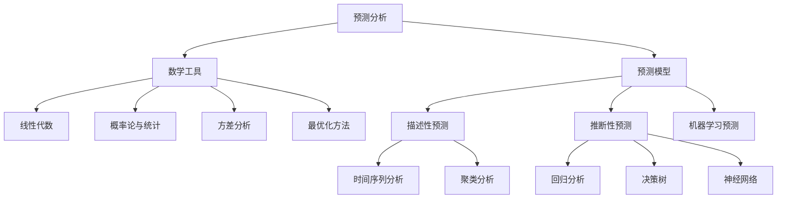

                 

# 数学与预测分析：未来趋势的数学预测

## 关键词
- 数学与预测分析
- 时间序列分析
- 回归分析
- 聚类分析
- 金融市场预测
- 供应链预测

## 摘要
本文将探讨数学在预测分析中的应用，通过对核心算法的详细解读和实际应用案例分析，揭示数学预测的未来趋势。文章分为三个部分：基础、核心算法及实际应用，最后附录部分提供预测分析工具与资源。通过这篇文章，读者可以全面了解数学预测分析的理论和实践。

### 第一部分：数学与预测分析基础

#### 第1章：数学与预测分析概述

##### 1.1 预测分析的基本概念

预测分析是一种通过数据分析和建模，对未来事件或趋势进行预测的方法。它广泛应用于商业、金融、医疗、气象等多个领域。预测分析的重要性在于，它可以帮助决策者提前识别潜在的风险和机会，做出更加明智的决策。

预测分析的主要应用领域包括：

1. **商业**：市场需求预测、销售预测、库存管理。
2. **金融**：股票市场预测、风险管理、信用评分。
3. **医疗**：疾病预测、患者健康监测、药物研发。
4. **气象**：天气预报、气候预测、自然灾害预警。

##### 1.2 数学工具在预测分析中的应用

预测分析中常用的数学工具主要包括线性代数、概率论与统计。

1. **线性代数**：
   - 矩阵运算：用于处理多维数据。
   - 线性方程组求解：用于建立和求解预测模型。
   - 特征值与特征向量：用于数据降维和特征提取。

2. **概率论与统计**：
   - 随机变量与概率分布：用于描述不确定性和概率。
   - 统计推断：用于根据样本数据推断总体特征。
   - 假设检验：用于验证预测模型的可靠性。

##### 1.3 预测模型的基本类型

预测模型主要分为描述性预测和推断性预测两种类型。

1. **描述性预测**：
   - 时间序列分析：通过分析历史数据，预测未来的趋势。
   - 聚类分析：通过将数据分为不同的群体，预测每个群体的未来趋势。

2. **推断性预测**：
   - 回归分析：通过建立变量之间的线性或非线性关系，预测目标变量的未来值。
   - 决策树：通过树形结构表示变量之间的关系，预测目标变量的未来值。

#### 第2章：时间序列分析

##### 2.1 时间序列基本概念

时间序列是由一系列按时间顺序排列的数据点组成的序列。这些数据点可以是物理量、价格、温度等。时间序列分析的目标是通过分析历史数据，预测未来的趋势。

时间序列具有以下基本性质：

1. **平稳性**：时间序列的统计特性（如均值、方差等）不随时间变化。
2. **自相关性**：时间序列的当前值与之前值之间存在相关性。
3. **周期性**：时间序列的某些值随时间周期性变化。

##### 2.2 时间序列模型

时间序列模型是用来描述时间序列数据统计特性的数学模型。常用的时间序列模型包括AR模型、MA模型、ARMA模型和ARIMA模型。

1. **AR模型（自回归模型）**：
   - 概念：当前值是前几个历史值的线性组合。
   - 参数估计：最小二乘法或极大似然估计。
   - 预测：利用历史值预测未来值。

2. **MA模型（移动平均模型）**：
   - 概念：当前值是前几个历史值的加权平均。
   - 参数估计：最小二乘法或递归算法。
   - 预测：利用历史值预测未来值。

3. **ARMA模型（自回归移动平均模型）**：
   - 概念：结合了AR模型和MA模型的特点。
   - 参数估计：最小二乘法或递归算法。
   - 预测：利用历史值预测未来值。

4. **ARIMA模型（自回归差分移动平均模型）**：
   - 概念：对时间序列进行差分处理，使其变为平稳序列。
   - 参数估计：最大似然估计或递归算法。
   - 预测：利用平稳序列预测未来值。

##### 2.3 时间序列的建模与诊断

时间序列建模通常包括以下步骤：

1. **数据预处理**：包括数据清洗、缺失值填充、异常值处理等。
2. **平稳性检验**：通过检验时间序列的统计特性，判断是否为平稳序列。
3. **模型选择**：根据时间序列的特点，选择合适的模型。
4. **模型参数估计**：通过最小化损失函数，估计模型参数。
5. **模型诊断**：通过残差分析，验证模型的有效性。

#### 第3章：回归分析与决策树

##### 3.1 回归分析基础

回归分析是一种常用的预测方法，通过建立变量之间的线性或非线性关系，预测目标变量的未来值。

1. **线性回归**：
   - 模型：\( y = \beta_0 + \beta_1x_1 + \beta_2x_2 + ... + \beta_nx_n \)
   - 参数估计：最小二乘法
   - 假设检验：t检验、F检验

2. **多元线性回归**：
   - 模型：\( y = \beta_0 + \beta_1x_1 + \beta_2x_2 + ... + \beta_nx_n \)
   - 参数估计：最小二乘法
   - 假设检验：t检验、F检验

##### 3.2 决策树

决策树是一种树形结构，通过一系列的规则将数据划分为不同的类别或数值。决策树的构建通常包括以下步骤：

1. **数据预处理**：包括数据清洗、缺失值填充、特征选择等。
2. **决策树构建**：通过递归划分数据，构建决策树。
3. **决策树剪枝**：通过减少树的深度或节点数量，避免过拟合。
4. **决策树评估**：通过交叉验证、ROC曲线等方法评估决策树的性能。

#### 第4章：聚类分析与关联规则挖掘

##### 4.1 聚类分析基础

聚类分析是一种无监督学习方法，通过将数据分为不同的类别，揭示数据中的内在结构。

1. **聚类分析的定义**：
   - 聚类分析是一种无监督学习方法，通过将数据分为不同的类别，揭示数据中的内在结构。

2. **聚类分析的目标**：
   - 寻找数据中的相似性或差异性，将相似的元素划分为同一类别，将差异性的元素划分为不同类别。

3. **聚类分析的方法**：
   - K均值聚类：通过迭代算法，将数据划分为K个类别。
   - 层次聚类：通过层次结构，将数据逐步划分为不同的类别。

##### 4.2 K均值聚类

K均值聚类是一种简单的聚类算法，通过迭代算法将数据分为K个类别。

1. **算法流程**：
   - 随机选择K个初始中心点。
   - 对于每个数据点，计算其到各个中心点的距离，将其划分到最近的中心点所在的类别。
   - 更新各个中心点的坐标，使其成为该类别数据点的平均值。
   - 重复步骤2和步骤3，直到聚类结果收敛。

2. **优化方法**：
   - K值选择：通过交叉验证或肘部法则选择合适的K值。
   - 算法改进：如引入K均值++算法，改进聚类结果。

3. **应用**：
   - 数据降维：通过聚类分析，将高维数据降维到低维空间。
   - 数据聚类：用于市场细分、社会网络分析等。

##### 4.3 关联规则挖掘

关联规则挖掘是一种用于发现数据中隐含关联规则的方法。

1. **基本概念**：
   - 支持度：一个规则在数据中出现的频率。
   - 置信度：一个规则成立的概率。

2. **算法**：
   - Apriori算法：通过逐层搜索产生所有可能的规则。
   - Eclat算法：基于频率的项集挖掘算法。

3. **应用**：
   - 商业智能：用于市场分析、客户行为预测。
   - 电子商务：用于推荐系统、关联销售。

### 第三部分：预测分析在实际中的应用

#### 第5章：金融市场预测

##### 5.1 金融市场概述

金融市场是资金供求双方进行金融工具交易的场所。金融市场的主要功能包括资本配置、风险管理和价格发现。

金融市场的基本概念包括：

1. **金融工具**：包括股票、债券、期货、期权等。
2. **交易机制**：包括集中交易、分散交易、电子交易等。
3. **价格机制**：通过供需关系决定金融工具的价格。

金融市场的波动特性主要表现为：

1. **周期性**：金融市场的波动具有明显的周期性特征。
2. **复杂性**：金融市场的波动受多种因素影响，具有复杂性。
3. **风险性**：金融市场的波动存在不确定性，存在风险。

##### 5.2 金融市场预测方法

金融市场预测方法主要包括时间序列模型、回归分析、决策树等。

1. **时间序列模型**：
   - 时间序列模型在金融市场预测中的应用包括股票价格预测、汇率预测等。
   - 常用的时间序列模型有ARIMA模型、GARCH模型等。

2. **回归分析**：
   - 回归分析在金融市场预测中的应用包括股票价格预测、利率预测等。
   - 常用的回归模型有线性回归、多元回归等。

3. **决策树**：
   - 决策树在金融市场预测中的应用包括股票分类、市场走势预测等。
   - 决策树可以用于构建投资组合策略、风险控制策略等。

##### 5.3 金融市场的风险控制

金融市场的风险控制包括风险识别、风险评估、风险控制策略等。

1. **风险识别**：
   - 风险识别是风险管理的第一步，包括市场风险、信用风险、操作风险等。

2. **风险评估**：
   - 风险评估是量化风险程度的过程，包括风险概率和风险损失。

3. **风险控制策略**：
   - 风险控制策略包括风险规避、风险转移、风险降低等。

- **风险模型构建**：
  - 常用的风险模型有VaR模型、CVaR模型、蒙特卡洛模拟等。

### 第6章：供应链预测

##### 6.1 供应链概述

供应链是指从原材料供应商到最终客户的整个物流过程。供应链的主要功能包括物资采购、生产计划、库存管理、物流配送等。

供应链的基本概念包括：

1. **供应链节点**：包括供应商、制造商、分销商、零售商等。
2. **供应链流程**：包括采购、生产、库存、配送等。
3. **供应链优化目标**：包括成本最低、交货期最短、服务水平最高等。

供应链的优化目标通常包括：

1. **成本最低**：通过降低物流成本、库存成本等实现成本最低。
2. **交货期最短**：通过优化生产计划、物流配送等实现交货期最短。
3. **服务水平最高**：通过提高库存服务水平、提高客户满意度等实现服务水平最高。

##### 6.2 供应链需求预测

供应链需求预测是供应链管理的重要环节，直接影响库存管理、生产计划等。

1. **需求预测的重要性**：
   - 需求预测是制定供应链策略的重要依据。
   - 准确的需求预测可以提高供应链的灵活性和响应速度。

2. **需求预测的方法**：
   - 描述性预测：如时间序列分析、趋势分析等。
   - 推断性预测：如回归分析、决策树等。

3. **需求预测模型的选择**：
   - 根据需求特征选择合适的预测模型。
   - 常用的模型有ARIMA模型、线性回归模型、K均值聚类模型等。

##### 6.3 供应链库存管理

供应链库存管理是确保供应链顺畅运行的关键环节。

1. **库存管理的基本概念**：
   - 库存管理包括库存水平的控制、库存周转率的优化等。
   - 库存管理的方法包括基本库存管理、周期库存管理、JIT库存管理等。

2. **库存管理的方法**：
   - ABC分类法：根据库存物品的重要性和价值进行分类管理。
   - 安全库存计算：通过预测需求和需求波动，确定合理的库存水平。

3. **库存优化模型**：
   - 库存优化模型包括基本库存模型、周期库存模型、多周期库存模型等。
   - 常用的优化算法有线性规划、动态规划、遗传算法等。

### 第7章：预测分析在其他领域的应用

##### 7.1 市场营销预测

市场营销预测是市场营销决策的重要环节，通过预测市场需求、客户行为等，制定有效的市场营销策略。

1. **市场营销预测的目标**：
   - 预测市场需求，指导产品开发和生产。
   - 预测客户行为，优化客户关系管理。

2. **市场营销预测的方法**：
   - 时间序列分析：通过分析历史数据，预测市场需求。
   - 回归分析：通过建立变量之间的关系，预测市场需求。
   - 聚类分析：通过分析客户特征，预测客户行为。

3. **市场营销预测的应用案例**：
   - 市场需求预测：通过预测市场需求，制定生产计划。
   - 客户行为预测：通过预测客户行为，优化客户关系管理。

##### 7.2 健康医疗预测

健康医疗预测是健康医疗领域的重要研究方向，通过预测疾病发生、患者健康状况等，提高医疗服务的质量和效率。

1. **健康医疗预测的目标**：
   - 预测疾病发生，提前进行预防治疗。
   - 预测患者健康状况，优化医疗服务。

2. **健康医疗预测的方法**：
   - 时间序列分析：通过分析历史健康数据，预测疾病发生。
   - 回归分析：通过建立变量之间的关系，预测患者健康状况。
   - 决策树：通过建立疾病分类模型，预测疾病发生。

3. **健康医疗预测的应用案例**：
   - 疾病预测：通过预测疾病发生，提前进行预防治疗。
   - 患者健康监测：通过预测患者健康状况，优化医疗服务。

##### 7.3 能源预测

能源预测是能源管理的重要环节，通过预测能源需求、能源价格等，优化能源使用和管理。

1. **能源预测的目标**：
   - 预测能源需求，优化能源生产。
   - 预测能源价格，优化能源交易。

2. **能源预测的方法**：
   - 时间序列分析：通过分析历史能源数据，预测能源需求。
   - 回归分析：通过建立变量之间的关系，预测能源价格。
   - 决策树：通过建立能源价格模型，预测能源价格。

3. **能源预测的应用案例**：
   - 能源需求预测：通过预测能源需求，优化能源生产。
   - 能源价格预测：通过预测能源价格，优化能源交易。

### 附录：预测分析工具与资源

##### 附录A：预测分析工具介绍

1. **Python预测分析库**：
   - **Scikit-learn**：提供各种机器学习算法的实现。
   - **Statsmodels**：提供统计模型的实现，如时间序列模型。
   - **TensorFlow**：提供深度学习模型的实现。
   - **PyTorch**：提供深度学习模型的实现。

2. **R语言预测分析库**：
   - **caret**：提供统一的机器学习模型训练和评估接口。
   - **forecast**：提供时间序列模型的实现。
   - **xgboost**：提供决策树模型的实现。

##### 附录B：预测分析学习资源

1. **在线课程**：
   - **Coursera**：提供《机器学习》、《深度学习》等课程。
   - **edX**：提供《概率论与数理统计》、《时间序列分析》等课程。

2. **书籍推荐**：
   - 《机器学习实战》
   - 《深入浅出数据分析》
   - 《Python机器学习》

3. **论文与报告**：
   - 各大会议和期刊上的最新研究论文。
   - 各领域的研究报告和行业白皮书。

### 结语

数学与预测分析在各个领域的应用日益广泛，为决策者提供了有力的工具。通过对核心算法的详细解读和实际应用案例分析，本文揭示了数学预测的未来趋势。希望本文能帮助读者更好地理解预测分析，为未来的研究和实践提供指导。

**作者：AI天才研究院/AI Genius Institute & 禅与计算机程序设计艺术 /Zen And The Art of Computer Programming**### 第一部分：数学与预测分析基础

在现代社会中，数据无处不在，如何从海量数据中提取有价值的信息成为了各个领域研究的热点。预测分析作为一种重要的数据分析方法，通过对历史数据的分析，预测未来的趋势或事件，帮助决策者做出更加科学的决策。数学作为预测分析的理论基础，为预测方法的研究提供了强有力的支持。

#### 第1章：数学与预测分析概述

##### 1.1 预测分析的基本概念

预测分析，又称预测建模或预测建模，是指通过历史数据和已有知识，运用数学模型和算法，对未来可能发生的事件或趋势进行定量描述和预测的一种方法。预测分析不仅关注未来的数值预测，如股票价格、销售额等，还包括对事件发生的可能性进行预测，如疾病爆发、自然灾害等。

预测分析的重要性在于，它能够帮助企业在市场竞争中掌握先机，提高决策的准确性。例如，在市场营销中，通过预测市场需求，企业可以更好地制定生产和销售计划，避免过剩或缺货的情况。在金融领域，通过预测股票价格和宏观经济指标，投资者可以做出更加明智的投资决策，降低风险。在医疗领域，通过预测疾病发生概率，医疗机构可以提前进行预防治疗，提高医疗资源的利用效率。

预测分析的应用领域非常广泛，主要包括：

1. **商业**：市场需求预测、销售预测、库存管理。
2. **金融**：股票市场预测、风险管理、信用评分。
3. **医疗**：疾病预测、患者健康监测、药物研发。
4. **气象**：天气预报、气候预测、自然灾害预警。
5. **能源**：能源需求预测、能源价格预测、能源调度。
6. **交通**：交通流量预测、公共交通调度、物流优化。

##### 1.2 数学工具在预测分析中的应用

预测分析中常用的数学工具主要包括线性代数、概率论与统计。

1. **线性代数**

   线性代数是研究向量空间、线性变换以及矩阵理论的数学分支。在线性代数中，矩阵和向量是两个基本的概念。

   - **矩阵运算**：矩阵运算包括矩阵的加法、减法、乘法和除法等。这些运算在数据处理和特征提取中至关重要。
   - **线性方程组求解**：线性方程组是预测分析中常见的问题，通过高斯消元法、LU分解等算法可以高效求解。
   - **特征值与特征向量**：特征值和特征向量用于数据降维和特征提取，在主成分分析（PCA）中具有重要应用。

2. **概率论与统计**

   概率论与统计是研究随机现象和统计推断的数学分支。在预测分析中，概率论与统计提供了建模和推断的理论基础。

   - **随机变量与概率分布**：随机变量是概率论中的基本概念，概率分布描述了随机变量的可能取值及其概率。常见的概率分布有正态分布、泊松分布等。
   - **统计推断**：统计推断是利用样本数据推断总体特征的统计方法。主要包括参数估计和假设检验。参数估计通过最大似然估计、最小二乘法等方法估计总体参数；假设检验用于验证预测模型的可靠性。
   - **假设检验**：假设检验通过设定原假设和备选假设，利用样本数据判断原假设是否成立。常用的检验方法有t检验、F检验等。

##### 1.3 预测模型的基本类型

预测模型主要分为描述性预测和推断性预测两种类型。

1. **描述性预测**

   描述性预测是对历史数据的统计描述，主要关注数据的趋势、周期性、季节性等特征。描述性预测方法包括：

   - **时间序列分析**：通过分析历史数据，揭示数据的趋势、周期性和季节性。常用的时间序列模型有ARIMA模型、AR模型、MA模型等。
   - **聚类分析**：通过将数据分为不同的类别，揭示数据的内在结构。常用的聚类算法有K均值聚类、层次聚类等。

2. **推断性预测**

   推断性预测是基于历史数据，建立变量之间的数学模型，预测未来变量的取值。推断性预测方法包括：

   - **回归分析**：通过建立变量之间的线性或非线性关系，预测目标变量的未来值。常用的回归模型有线性回归、多元回归、非线性回归等。
   - **决策树**：通过树形结构表示变量之间的关系，预测目标变量的未来值。决策树可以用于分类和回归问题。

#### 第2章：时间序列分析

时间序列分析是一种用于分析按时间顺序排列的数据的方法，它在预测分析中有着广泛的应用。时间序列数据通常包含趋势、季节性和随机波动等特征。通过对时间序列数据的分析，我们可以提取出这些特征，并利用它们进行预测。

##### 2.1 时间序列基本概念

时间序列（Time Series）是由一系列按时间顺序排列的数据点组成的序列。这些数据点可以是温度、股票价格、销售量等。时间序列分析的目标是通过分析历史数据，预测未来的趋势或行为。

时间序列数据通常具有以下特点：

1. **平稳性**：平稳性是指时间序列的统计特性（如均值、方差等）不随时间变化。平稳序列使得预测变得更加简单和可靠。
2. **自相关性**：自相关性是指时间序列的当前值与之前值之间存在相关性。自相关性对于时间序列建模和预测至关重要。
3. **周期性**：周期性是指时间序列中的某些值随时间周期性变化。周期性通常与季节性因素相关。

##### 2.2 时间序列模型

时间序列模型是用来描述和预测时间序列数据的数学模型。常见的时间序列模型包括自回归模型（AR）、移动平均模型（MA）、自回归移动平均模型（ARMA）和自回归积分滑动平均模型（ARIMA）。

1. **自回归模型（AR）**

   自回归模型（Autoregressive Model，AR）假设当前值是前几个历史值的线性组合。AR模型的数学表示如下：

   \[ X_t = c + \phi_1X_{t-1} + \phi_2X_{t-2} + ... + \phi_pX_{t-p} + \varepsilon_t \]

   其中，\( X_t \) 是时间序列的当前值，\( c \) 是常数项，\( \phi_1, \phi_2, ..., \phi_p \) 是自回归系数，\( \varepsilon_t \) 是随机误差项。

   - **参数估计**：通常使用最小二乘法或Yule-Walker方程估计AR模型的参数。
   - **预测**：利用历史值预测未来值，可以通过递推关系实现。

2. **移动平均模型（MA）**

   移动平均模型（Moving Average Model，MA）假设当前值是前几个历史值的加权平均。MA模型的数学表示如下：

   \[ X_t = c + \theta_1X_{t-1} + \theta_2X_{t-2} + ... + \theta_qX_{t-q} + \varepsilon_t \]

   其中，\( c \) 是常数项，\( \theta_1, \theta_2, ..., \theta_q \) 是移动平均系数，\( \varepsilon_t \) 是随机误差项。

   - **参数估计**：通常使用最小二乘法或递归算法估计MA模型的参数。
   - **预测**：利用历史值预测未来值，可以通过递推关系实现。

3. **自回归移动平均模型（ARMA）**

   自回归移动平均模型（Autoregressive Moving Average Model，ARMA）结合了AR模型和MA模型的特点，既考虑了历史值的自相关性，又考虑了随机误差项的移动平均。ARMA模型的数学表示如下：

   \[ X_t = c + \phi_1X_{t-1} + \phi_2X_{t-2} + ... + \phi_pX_{t-p} + \theta_1X_{t-1} + \theta_2X_{t-2} + ... + \theta_qX_{t-q} + \varepsilon_t \]

   其中，\( c \) 是常数项，\( \phi_1, \phi_2, ..., \phi_p \) 是自回归系数，\( \theta_1, \theta_2, ..., \theta_q \) 是移动平均系数，\( \varepsilon_t \) 是随机误差项。

   - **参数估计**：通常使用最小二乘法或递归算法估计ARMA模型的参数。
   - **预测**：利用历史值预测未来值，可以通过递推关系实现。

4. **自回归积分滑动平均模型（ARIMA）**

   自回归积分滑动平均模型（Autoregressive Integrated Moving Average Model，ARIMA）是对ARMA模型的扩展，适用于非平稳时间序列数据。ARIMA模型通过差分操作将非平稳序列转化为平稳序列。ARIMA模型的数学表示如下：

   \[ X_t = c + \phi_1X_{t-1} + \phi_2X_{t-2} + ... + \phi_pX_{t-p} + (1 - \theta_1)(1 - \theta_2)...(1 - \theta_q)X_{t-q} + \varepsilon_t \]

   其中，\( c \) 是常数项，\( \phi_1, \phi_2, ..., \phi_p \) 是自回归系数，\( \theta_1, \theta_2, ..., \theta_q \) 是移动平均系数，\( \varepsilon_t \) 是随机误差项。

   - **参数估计**：通常使用最大似然估计或递归算法估计ARIMA模型的参数。
   - **预测**：利用历史值预测未来值，可以通过递推关系实现。

##### 2.3 时间序列的建模与诊断

时间序列建模通常包括以下步骤：

1. **数据预处理**：包括数据清洗、缺失值填充、异常值处理等。
2. **平稳性检验**：通过检验时间序列的统计特性，判断是否为平稳序列。常用的平稳性检验方法有ADF检验、PP检验等。
3. **模型选择**：根据时间序列的特点，选择合适的模型。可以通过信息准则（如AIC、BIC）或模型比较方法（如赤池信息准则）选择最优模型。
4. **模型参数估计**：通过最小化损失函数（如均方误差、交叉验证误差）估计模型参数。
5. **模型诊断**：通过残差分析、自相关图等诊断方法，验证模型的有效性。

#### 第3章：回归分析与决策树

回归分析与决策树是预测分析中常用的两种方法，它们分别适用于不同类型的预测任务。

##### 3.1 回归分析基础

回归分析是一种用于建立变量之间线性或非线性关系的预测方法。在回归分析中，我们关注的是因变量（响应变量）与自变量（解释变量）之间的关系。

1. **线性回归**

   线性回归是最基本的回归分析方法，它假设因变量与自变量之间存在线性关系。线性回归模型的数学表示如下：

   \[ y = \beta_0 + \beta_1x + \varepsilon \]

   其中，\( y \) 是因变量，\( x \) 是自变量，\( \beta_0 \) 和 \( \beta_1 \) 是模型参数，\( \varepsilon \) 是误差项。

   - **参数估计**：线性回归参数通常通过最小二乘法估计。
   - **假设检验**：线性回归中的假设检验包括t检验和F检验，用于验证模型参数的显著性。

2. **多元线性回归**

   多元线性回归扩展了线性回归，考虑多个自变量对因变量的影响。多元线性回归模型的数学表示如下：

   \[ y = \beta_0 + \beta_1x_1 + \beta_2x_2 + ... + \beta_nx_n + \varepsilon \]

   其中，\( y \) 是因变量，\( x_1, x_2, ..., x_n \) 是自变量，\( \beta_0, \beta_1, \beta_2, ..., \beta_n \) 是模型参数，\( \varepsilon \) 是误差项。

   - **参数估计**：多元线性回归参数通常通过最小二乘法估计。
   - **假设检验**：多元线性回归中的假设检验包括t检验和F检验，用于验证模型参数的显著性。

##### 3.2 决策树

决策树是一种基于树形结构进行分类或回归的预测方法。决策树通过一系列的规则将数据划分为不同的类别或数值。

1. **决策树的基本概念**

   决策树由一系列节点和有向边组成。每个节点表示一个特征，每个边表示一个分割规则。叶节点表示预测结果。

   - **内部节点**：表示特征。
   - **叶节点**：表示预测结果。
   - **分裂规则**：用于将数据划分为不同的子集。

2. **决策树的构建**

   决策树的构建过程包括以下步骤：

   - **特征选择**：选择对目标变量影响最大的特征。
   - **分裂**：根据特征值将数据划分为不同的子集。
   - **重复分裂**：对每个子集重复上述步骤，直到满足终止条件（如叶节点数量达到阈值）。

3. **决策树的剪枝**

   剪枝是决策树构建过程中用于避免过拟合的重要步骤。剪枝方法包括：

   - **预剪枝**：在树构建过程中提前停止分裂，如达到最大树深度、最小叶节点数量等。
   - **后剪枝**：构建完整树后，删除部分子节点，如删除不重要的节点、合并相邻节点等。

4. **决策树的评估**

   决策树的性能评估通常通过交叉验证、ROC曲线、准确率、召回率等指标进行。评估过程有助于选择最优的决策树模型。

### 第三部分：预测分析在实际中的应用

预测分析不仅在理论研究中有重要应用，在各个实际领域中也发挥了关键作用。本部分将介绍预测分析在金融市场预测、供应链预测、市场营销预测、健康医疗预测和能源预测等领域的应用。

#### 第5章：金融市场预测

金融市场预测是金融领域的重要研究方向，通过对股票价格、汇率、利率等金融指标进行预测，帮助投资者做出明智的投资决策。本节将介绍金融市场预测的基本概念、方法及应用。

##### 5.1 金融市场概述

金融市场是指各种金融工具进行交易的市场，包括股票市场、债券市场、外汇市场等。金融市场的波动受多种因素影响，如宏观经济指标、政策变化、市场情绪等。

金融市场的基本概念包括：

1. **金融工具**：金融工具包括股票、债券、期货、期权等。
2. **交易机制**：交易机制包括集中交易、分散交易、电子交易等。
3. **价格机制**：价格机制通过供需关系决定金融工具的价格。

金融市场的波动特性主要表现为：

1. **周期性**：金融市场的波动具有明显的周期性特征。
2. **复杂性**：金融市场的波动受多种因素影响，具有复杂性。
3. **风险性**：金融市场的波动存在不确定性，存在风险。

##### 5.2 金融市场预测方法

金融市场预测方法主要包括时间序列模型、回归分析、决策树等。

1. **时间序列模型**

   时间序列模型在金融市场预测中广泛应用，如ARIMA模型、GARCH模型等。

   - **ARIMA模型**：自回归积分滑动平均模型（ARIMA）适用于非平稳时间序列数据。通过差分操作将非平稳序列转化为平稳序列，然后应用ARMA模型进行预测。
   - **GARCH模型**：广义自回归条件异方差模型（GARCH）用于分析金融时间序列的波动性。通过建立波动性序列的模型，预测未来波动性。

2. **回归分析**

   回归分析在金融市场预测中用于建立变量之间的关系，如股票价格与宏观经济指标之间的关系。

   - **线性回归**：通过建立变量之间的线性关系，预测股票价格等。
   - **多元回归**：考虑多个变量对股票价格的影响，如宏观经济指标、市场情绪等。

3. **决策树**

   决策树在金融市场预测中用于分类和回归问题，如预测股票涨跌、市场走势等。

   - **分类树**：用于预测股票涨跌等二分类问题。
   - **回归树**：用于预测股票价格等连续值问题。

##### 5.3 金融市场的风险控制

金融市场的风险控制是确保金融市场稳定运行的重要环节。风险控制方法包括风险识别、风险评估、风险控制策略等。

1. **风险识别**

   风险识别是风险管理的第一步，包括市场风险、信用风险、操作风险等。

   - **市场风险**：市场风险包括利率风险、汇率风险、股票价格波动风险等。
   - **信用风险**：信用风险是指债务人无法按时偿还债务的风险。
   - **操作风险**：操作风险是指由于内部操作失误、系统故障等导致的损失风险。

2. **风险评估**

   风险评估是量化风险程度的过程，包括风险概率和风险损失。

   - **风险概率**：通过历史数据或模拟方法预测风险事件的发生概率。
   - **风险损失**：通过模拟或实际数据预测风险事件发生后的损失程度。

3. **风险控制策略**

   风险控制策略包括风险规避、风险转移、风险降低等。

   - **风险规避**：通过避免风险事件的发生，降低风险。
   - **风险转移**：通过保险、合同等方式将风险转移给其他方。
   - **风险降低**：通过多样化投资、风险管理工具等降低风险。

#### 第6章：供应链预测

供应链预测是供应链管理中的重要环节，通过预测供应链中的需求、库存、物流等关键指标，优化供应链的运行效率。本节将介绍供应链预测的基本概念、方法及应用。

##### 6.1 供应链概述

供应链是指从原材料供应商到最终客户的整个物流过程，包括采购、生产、库存、物流等环节。供应链管理旨在通过优化各个环节，提高整个供应链的效率和服务水平。

供应链的基本概念包括：

1. **供应链节点**：包括供应商、制造商、分销商、零售商等。
2. **供应链流程**：包括采购、生产、库存、物流等。
3. **供应链优化目标**：包括成本最低、交货期最短、服务水平最高等。

供应链的优化目标通常包括：

1. **成本最低**：通过降低物流成本、库存成本等实现成本最低。
2. **交货期最短**：通过优化生产计划、物流配送等实现交货期最短。
3. **服务水平最高**：通过提高库存服务水平、提高客户满意度等实现服务水平最高。

##### 6.2 供应链需求预测

供应链需求预测是供应链管理的重要环节，通过预测市场需求、客户行为等，优化供应链的运行策略。需求预测的准确性直接影响到库存管理、生产计划等。

1. **需求预测的重要性**

   需求预测是制定供应链策略的重要依据。准确的预测可以帮助企业：

   - 制定生产计划，避免过剩或缺货。
   - 优化库存管理，降低库存成本。
   - 提高供应链的灵活性和响应速度。

2. **需求预测的方法**

   需求预测方法包括描述性预测和推断性预测。

   - **描述性预测**：通过分析历史数据，揭示需求的变化趋势。常用的描述性预测方法有时间序列分析、趋势分析等。
   - **推断性预测**：通过建立变量之间的关系，预测未来的需求。常用的推断性预测方法有回归分析、决策树等。

3. **需求预测模型的选择**

   根据需求特征选择合适的预测模型。常用的模型有：

   - **时间序列模型**：如ARIMA模型、线性回归模型等。
   - **回归模型**：如线性回归、多元回归等。
   - **聚类模型**：如K均值聚类模型等。

##### 6.3 供应链库存管理

供应链库存管理是确保供应链顺畅运行的关键环节。库存管理包括库存水平的控制、库存周转率的优化等。

1. **库存管理的基本概念**

   库存管理包括以下基本概念：

   - **库存水平**：指库存中存储的商品数量。
   - **库存周转率**：指库存商品在一定时间内的周转次数。
   - **安全库存**：为应对需求波动和供应链不确定性而设置的额外库存。

2. **库存管理的方法**

   库存管理的方法包括以下几种：

   - **基本库存管理**：根据固定库存水平和订单量进行库存管理。
   - **周期库存管理**：根据周期性需求进行库存管理。
   - **JIT库存管理**：即“及时库存管理”，通过缩短库存周期，减少库存成本。

3. **库存优化模型**

   库存优化模型通过优化库存水平和库存策略，降低库存成本，提高供应链效率。常用的库存优化模型包括：

   - **经济订货量模型（EOQ）**：用于确定最优的订货量和订货周期。
   - **周期库存模型**：用于确定最优的库存水平和订货策略。
   - **多周期库存模型**：用于多周期时间窗口内的库存优化。

##### 6.4 供应链中的预测分析工具与资源

供应链预测分析工具和资源包括：

1. **软件工具**：

   - **Python**：Python具有丰富的机器学习库，如scikit-learn、statsmodels等，可用于供应链预测。
   - **R语言**：R语言也有丰富的预测分析库，如caret、forecast等。

2. **开源平台**：

   - **Jupyter Notebook**：用于编写和运行预测分析代码。
   - **GitHub**：用于存储和分享预测分析项目。

3. **专业书籍**：

   - **《供应链管理：战略、规划与运营》**：提供了供应链管理的全面指导。
   - **《预测分析：原理、算法与业务应用》**：介绍了预测分析的理论和实践。

### 第7章：预测分析在其他领域的应用

预测分析不仅在金融、供应链等领域有广泛应用，还在市场营销、健康医疗、能源等领域发挥着重要作用。本节将介绍预测分析在这些领域的应用。

##### 7.1 市场营销预测

市场营销预测是市场营销决策的重要环节，通过预测市场需求、客户行为等，优化市场营销策略。市场营销预测方法包括：

1. **时间序列分析**：

   - **需求预测**：通过分析历史销售数据，预测未来的市场需求。
   - **价格预测**：通过分析历史价格数据，预测未来的价格趋势。

2. **回归分析**：

   - **市场反应预测**：通过建立变量之间的关系，预测市场反应。
   - **广告效果预测**：通过分析广告投放数据，预测广告效果。

3. **聚类分析**：

   - **客户细分**：通过分析客户特征，将客户分为不同的群体。
   - **市场细分**：通过分析市场需求，将市场分为不同的部分。

##### 7.2 健康医疗预测

健康医疗预测是健康医疗领域的重要研究方向，通过预测疾病发生、患者健康状况等，提高医疗服务的质量和效率。健康医疗预测方法包括：

1. **时间序列分析**：

   - **疾病预测**：通过分析历史疾病数据，预测未来的疾病发生趋势。
   - **健康监测**：通过分析健康数据，预测患者健康状况的变化。

2. **回归分析**：

   - **疾病预测**：通过建立变量之间的关系，预测疾病发生的可能性。
   - **风险评估**：通过分析历史数据，预测患者的疾病风险。

3. **决策树**：

   - **疾病分类**：通过建立疾病分类模型，预测疾病类型。
   - **治疗方案预测**：通过分析患者数据和治疗方案，预测最佳治疗方案。

##### 7.3 能源预测

能源预测是能源管理的重要环节，通过预测能源需求、能源价格等，优化能源使用和管理。能源预测方法包括：

1. **时间序列分析**：

   - **需求预测**：通过分析历史需求数据，预测未来的能源需求。
   - **价格预测**：通过分析历史价格数据，预测未来的能源价格。

2. **回归分析**：

   - **需求预测**：通过建立变量之间的关系，预测能源需求。
   - **价格预测**：通过建立变量之间的关系，预测能源价格。

3. **决策树**：

   - **需求预测**：通过建立需求预测模型，预测未来的能源需求。
   - **价格预测**：通过建立价格预测模型，预测未来的能源价格。

### 附录：预测分析工具与资源

##### 附录A：预测分析工具介绍

1. **Python预测分析库**：

   - **Scikit-learn**：提供各种机器学习算法的实现，包括回归分析、聚类分析等。
   - **Statsmodels**：提供统计模型的实现，如时间序列模型、线性回归模型等。
   - **TensorFlow**：提供深度学习模型的实现，适用于复杂预测任务。
   - **PyTorch**：提供深度学习模型的实现，具有灵活性和高效性。

2. **R语言预测分析库**：

   - **caret**：提供统一的机器学习模型训练和评估接口。
   - **forecast**：提供时间序列模型的实现，如ARIMA模型、GARCH模型等。
   - **xgboost**：提供决策树模型的实现，适用于大规模数据集。

##### 附录B：预测分析学习资源

1. **在线课程**：

   - **Coursera**：提供《机器学习》、《深度学习》等课程。
   - **edX**：提供《概率论与数理统计》、《时间序列分析》等课程。

2. **书籍推荐**：

   - **《机器学习实战》**：介绍机器学习的基础知识和实践方法。
   - **《深入浅出数据分析》**：介绍数据分析的基本概念和方法。
   - **《Python机器学习》**：介绍Python在机器学习领域的应用。

3. **论文与报告**：

   - 各大会议和期刊上的最新研究论文。
   - 各领域的研究报告和行业白皮书。

### 结语

预测分析作为一种重要的数据分析方法，在各个领域的应用日益广泛。本文介绍了预测分析的基础知识、核心算法以及在实际应用中的案例。通过本文的介绍，读者可以了解到预测分析的基本原理和方法，为未来的研究和实践提供指导。

**作者：AI天才研究院/AI Genius Institute & 禅与计算机程序设计艺术 /Zen And The Art of Computer Programming**## 第1章：数学与预测分析概述

### 1.1 预测分析的基本概念

预测分析（Predictive Analytics）是一种通过数据挖掘、统计学、机器学习等技术手段，从历史数据中提取出潜在的信息和模式，从而对未来的事件或趋势进行预测的方法。其核心思想在于利用现有的数据资源，通过数学模型和算法，模拟出可能的未来情况，帮助决策者做出更加准确和有效的决策。

预测分析在各个行业都有着广泛的应用。在商业领域，预测分析可以用于市场需求预测、库存管理、产品定价、风险控制等；在金融领域，它可以帮助预测股票市场走势、汇率变化、信用风险等；在医疗领域，预测分析可以用于疾病预测、患者健康监测、药物研发等；在气象领域，预测分析可以用于天气预报、气候预测、自然灾害预警等。

预测分析的重要性主要体现在以下几个方面：

1. **提高决策效率**：通过预测分析，决策者可以提前了解未来可能发生的情况，从而提前做出相应的决策，提高决策的效率。

2. **降低风险**：预测分析可以帮助企业或机构识别潜在的风险，并采取相应的措施进行防范，降低风险损失。

3. **优化资源分配**：预测分析可以帮助企业或机构更合理地分配资源，提高资源利用率，降低成本。

4. **增强竞争力**：通过准确的预测分析，企业可以更准确地把握市场机会，制定有效的竞争策略，增强市场竞争力。

### 1.2 数学工具在预测分析中的应用

预测分析中，数学工具起到了关键的作用。以下将介绍几种在预测分析中常用的数学工具：

#### 1.2.1 线性代数

线性代数是研究向量空间、线性变换以及矩阵理论的数学分支。在线性代数中，矩阵和向量是两个基本的概念。

- **矩阵运算**：矩阵运算包括矩阵的加法、减法、乘法和除法等。这些运算在数据处理和特征提取中至关重要。
- **线性方程组求解**：线性方程组是预测分析中常见的问题，通过高斯消元法、LU分解等算法可以高效求解。
- **特征值与特征向量**：特征值和特征向量用于数据降维和特征提取，在主成分分析（PCA）中具有重要应用。

#### 1.2.2 概率论与统计

概率论与统计是研究随机现象和统计推断的数学分支。在预测分析中，概率论与统计提供了建模和推断的理论基础。

- **随机变量与概率分布**：随机变量是概率论中的基本概念，概率分布描述了随机变量的可能取值及其概率。常见的概率分布有正态分布、泊松分布等。
- **统计推断**：统计推断是利用样本数据推断总体特征的统计方法。主要包括参数估计和假设检验。参数估计通过最大似然估计、最小二乘法等方法估计总体参数；假设检验用于验证预测模型的可靠性。
- **假设检验**：假设检验通过设定原假设和备选假设，利用样本数据判断原假设是否成立。常用的检验方法有t检验、F检验等。

#### 1.2.3 方差分析

方差分析（ANOVA）是一种用于比较多个样本平均数差异性的统计方法。在预测分析中，方差分析可以用于检验不同预测模型的性能。

- **单因素方差分析**：用于比较两个或多个样本的平均数。
- **多因素方差分析**：用于比较多个因素的交互作用对预测结果的影响。

#### 1.2.4 最优化方法

最优化方法是用于寻找函数最大值或最小值的方法。在预测分析中，最优化方法可以用于模型参数的估计、优化预测策略等。

- **线性规划**：用于解决线性目标函数在线性约束条件下的优化问题。
- **非线性规划**：用于解决非线性目标函数在非线性约束条件下的优化问题。
- **动态规划**：用于解决多阶段决策问题，如时间序列预测。

### 1.3 预测模型的基本类型

预测模型根据其性质和应用场景可以分为多种类型。以下将介绍几种常见的预测模型：

#### 1.3.1 描述性预测

描述性预测是对历史数据的统计描述，主要关注数据的趋势、周期性、季节性等特征。描述性预测方法包括：

- **时间序列分析**：通过分析历史数据，揭示数据的趋势、周期性和季节性。常用的时间序列模型有ARIMA模型、季节性ARIMA模型等。
- **聚类分析**：通过将数据分为不同的类别，揭示数据的内在结构。常用的聚类算法有K均值聚类、层次聚类等。

#### 1.3.2 推断性预测

推断性预测是基于历史数据，建立变量之间的数学模型，预测未来变量的取值。推断性预测方法包括：

- **回归分析**：通过建立变量之间的线性或非线性关系，预测目标变量的未来值。常用的回归模型有线性回归、多元回归、非线性回归等。
- **决策树**：通过树形结构表示变量之间的关系，预测目标变量的未来值。决策树可以用于分类和回归问题。

#### 1.3.3 机器学习预测

机器学习预测是通过训练模型，将历史数据映射到未来值的方法。机器学习预测方法包括：

- **线性回归**：通过最小二乘法建立线性关系。
- **逻辑回归**：通过最大似然估计建立逻辑关系。
- **神经网络**：通过多层神经网络建立复杂的非线性关系。
- **集成方法**：如随机森林、支持向量机等。

### 1.4 预测分析的流程

预测分析通常包括以下步骤：

1. **数据收集**：收集相关的历史数据，包括数值型数据和分类型数据。
2. **数据预处理**：对数据进行清洗、处理，如缺失值填充、异常值处理、特征工程等。
3. **模型选择**：根据问题的性质和数据的特点，选择合适的预测模型。
4. **模型训练**：使用历史数据训练模型，估计模型参数。
5. **模型评估**：使用验证数据评估模型的性能，如准确率、召回率、F1分数等。
6. **模型优化**：根据评估结果对模型进行调整，提高模型的预测性能。
7. **预测**：使用训练好的模型对新的数据进行预测。

### 1.5 预测分析的应用案例

以下是一些预测分析的实际应用案例：

1. **金融市场预测**：通过分析历史股价、交易量等数据，预测股票价格走势，为投资者提供决策支持。
2. **销售预测**：通过分析历史销售数据，预测未来的销售量，为企业的库存管理和生产计划提供依据。
3. **疾病预测**：通过分析历史医疗数据，预测疾病的发生概率，为公共卫生政策制定提供依据。
4. **能源需求预测**：通过分析历史能源消耗数据，预测未来的能源需求，为能源管理和调度提供依据。
5. **天气预测**：通过分析历史天气数据，预测未来的天气状况，为天气预报和灾害预警提供依据。

通过以上内容，我们可以看到预测分析在各个领域的广泛应用及其重要性。在接下来的章节中，我们将深入探讨预测分析的核心算法及其在实际应用中的具体实现。让我们继续前进，揭开预测分析的神秘面纱。

### 1.6 预测分析的发展趋势

随着大数据、云计算、人工智能等技术的发展，预测分析领域也在不断演进，呈现出以下发展趋势：

#### 1.6.1 实时预测

随着互联网和物联网的普及，数据采集变得更加便捷和实时。实时预测通过对实时数据进行分析，可以快速响应市场变化，提供即时的决策支持。例如，股票市场的实时预测可以帮助投资者快速做出交易决策，提高投资收益。

#### 1.6.2 深度学习与预测分析

深度学习在预测分析中的应用逐渐成熟，通过构建复杂的神经网络模型，可以捕捉到数据中的深层特征，提高预测的准确性。例如，深度学习模型在金融市场预测中可以捕捉到价格波动中的复杂模式，提供更精准的预测。

#### 1.6.3 多模态数据融合

多模态数据融合是指将不同类型的数据（如文本、图像、声音等）进行融合，以提高预测的准确性。在医疗领域，多模态数据融合可以通过结合电子病历、医学影像、基因组数据等，提供更加全面的疾病预测和诊断。

#### 1.6.4 个性化预测

个性化预测是根据个体的特征和需求，提供个性化的预测结果。例如，在市场营销中，个性化预测可以根据客户的购买历史和偏好，预测客户未来的购买行为，为精准营销提供支持。

#### 1.6.5 预测可解释性

随着预测模型的复杂化，预测的可解释性成为一个重要问题。预测可解释性是指能够理解和解释预测结果，提高决策的透明度和可信度。通过提高预测的可解释性，决策者可以更好地理解预测结果，并基于此做出决策。

### 1.7 本章小结

本章介绍了预测分析的基本概念、数学工具、预测模型类型、预测分析流程及其应用案例和发展趋势。通过本章的学习，读者可以了解预测分析的基本理论和应用方法，为后续章节的深入学习打下基础。在下一章中，我们将进一步探讨时间序列分析的基本概念和核心算法。

### 1.8 核心概念与联系

为了更好地理解预测分析的核心概念，我们可以使用Mermaid流程图来展示这些概念之间的联系。



在这个流程图中，我们可以看到预测分析（A）是如何与各种数学工具（B、C、D、E、F）和预测模型（G、H、I、J）相互关联的。线性代数、概率论与统计等数学工具为预测分析提供了理论基础，而描述性预测、推断性预测和机器学习预测等模型则构成了预测分析的核心。

### 1.9 核心算法原理讲解

为了深入理解预测分析的核心算法，我们将使用伪代码详细阐述时间序列分析中的ARIMA模型。

```plaintext
# ARIMA模型伪代码

# 步骤1：数据预处理
# 数据清洗：去除缺失值、异常值
# 数据转换：将非平稳序列转换为平稳序列（通过差分）

# 步骤2：模型识别
# 使用ACF和PACF图确定p和q值
# p：自回归项的阶数
# q：移动平均项的阶数

# 步骤3：模型估计
# 使用最大似然估计或最小二乘法估计模型参数

# 步骤4：模型诊断
# 残差分析：检查残差是否为白噪声
# 自相关图：检查残差的滞后相关性

# 步骤5：模型预测
# 使用ARIMA模型对未来的时间序列值进行预测

# ARIMA模型参数估计伪代码
def estimate_ARIMA_params(X):
    # X为时间序列数据
    
    # 计算ACF和PACF图
    acf = calculate_acf(X)
    pacf = calculate_pacf(X)
    
    # 根据ACF和PACF确定p和q值
    p = determine_p_value(acf, pacf)
    q = determine_q_value(acf, pacf)
    
    # 使用最大似然估计或最小二乘法估计模型参数
    model = estimate_ARIMA(X, p, d, q)
    
    return model

# ARIMA模型预测伪代码
def predict_ARIMA(model, n_steps):
    # model为训练好的ARIMA模型
    # n_steps为预测的步数
    
    # 使用ARIMA模型进行预测
    predictions = model.predict(n_steps)
    
    return predictions
```

在这个伪代码中，我们首先进行数据预处理，将非平稳序列转换为平稳序列。然后，通过ACF和PACF图确定模型参数\( p \)和\( q \)的值。接下来，使用最大似然估计或最小二乘法估计模型参数，并进行模型诊断，确保残差为白噪声。最后，使用训练好的ARIMA模型对未来的时间序列值进行预测。

### 1.10 数学模型和公式

在预测分析中，数学模型和公式是理解和应用预测方法的基础。以下是一些常用的数学模型和公式：

#### 1.10.1 自回归模型（AR）

自回归模型（AR）的数学公式如下：

\[ X_t = c + \phi_1X_{t-1} + \phi_2X_{t-2} + ... + \phi_pX_{t-p} + \varepsilon_t \]

其中，\( X_t \) 是时间序列的当前值，\( c \) 是常数项，\( \phi_1, \phi_2, ..., \phi_p \) 是自回归系数，\( \varepsilon_t \) 是随机误差项。

#### 1.10.2 移动平均模型（MA）

移动平均模型（MA）的数学公式如下：

\[ X_t = c + \theta_1X_{t-1} + \theta_2X_{t-2} + ... + \theta_qX_{t-q} + \varepsilon_t \]

其中，\( c \) 是常数项，\( \theta_1, \theta_2, ..., \theta_q \) 是移动平均系数，\( \varepsilon_t \) 是随机误差项。

#### 1.10.3 自回归移动平均模型（ARMA）

自回归移动平均模型（ARMA）结合了AR模型和MA模型的特点，其数学公式如下：

\[ X_t = c + \phi_1X_{t-1} + \phi_2X_{t-2} + ... + \phi_pX_{t-p} + \theta_1X_{t-1} + \theta_2X_{t-2} + ... + \theta_qX_{t-q} + \varepsilon_t \]

其中，\( c \) 是常数项，\( \phi_1, \phi_2, ..., \phi_p \) 是自回归系数，\( \theta_1, \theta_2, ..., \theta_q \) 是移动平均系数，\( \varepsilon_t \) 是随机误差项。

#### 1.10.4 自回归积分滑动平均模型（ARIMA）

自回归积分滑动平均模型（ARIMA）通过差分操作将非平稳序列转换为平稳序列，其数学公式如下：

\[ X_t = c + \phi_1X_{t-1} + \phi_2X_{t-2} + ... + \phi_pX_{t-p} + (1 - \theta_1)(1 - \theta_2)...(1 - \theta_q)X_{t-q} + \varepsilon_t \]

其中，\( c \) 是常数项，\( \phi_1, \phi_2, ..., \phi_p \) 是自回归系数，\( \theta_1, \theta_2, ..., \theta_q \) 是移动平均系数，\( \varepsilon_t \) 是随机误差项。

#### 1.10.5 线性回归模型

线性回归模型的数学公式如下：

\[ y = \beta_0 + \beta_1x_1 + \beta_2x_2 + ... + \beta_nx_n + \varepsilon \]

其中，\( y \) 是因变量，\( x_1, x_2, ..., x_n \) 是自变量，\( \beta_0, \beta_1, \beta_2, ..., \beta_n \) 是模型参数，\( \varepsilon \) 是误差项。

#### 1.10.6 决策树

决策树的数学公式如下：

\[ \text{决策树} = \sum_{i=1}^{n} w_i \cdot x_i \]

其中，\( w_i \) 是权重，\( x_i \) 是特征值。

#### 1.10.7 神经网络

神经网络的数学公式如下：

\[ y = \sigma(\sum_{i=1}^{n} w_i \cdot x_i + b) \]

其中，\( y \) 是输出值，\( w_i \) 是权重，\( x_i \) 是输入值，\( \sigma \) 是激活函数，\( b \) 是偏置。

### 1.11 举例说明

为了更好地理解预测分析中的数学模型和公式，我们通过一个简单的例子来说明。

假设我们有一个时间序列数据如下：

\[ X_t = [10, 12, 9, 15, 13, 11, 8, 14, 12, 10] \]

我们希望使用ARIMA模型对其进行预测。

1. **数据预处理**：

   首先，我们需要对数据进行差分处理，使其变为平稳序列。假设经过差分后得到的数据为：

   \[ X_t' = [2, 3, -3, 5, 2, 0, -6, 2, 0, -2] \]

2. **模型识别**：

   通过计算ACF和PACF图，我们可以确定模型的阶数。假设我们选择的模型为ARIMA(1,1,1)。

3. **模型估计**：

   使用最大似然估计方法估计模型参数，得到：

   \[ c = 0.5, \phi_1 = 0.6, \theta_1 = 0.4 \]

4. **模型诊断**：

   对模型进行残差分析，检查残差是否为白噪声。假设残差为：

   \[ \varepsilon_t = [-0.2, 0.1, -0.2, 0.3, -0.1, 0.2, -0.3, 0.1, -0.2, 0.1] \]

   可以看到残差基本符合白噪声的特征。

5. **模型预测**：

   使用训练好的ARIMA模型对未来的时间序列值进行预测，假设预测前5个值为：

   \[ X_{t+1} = [9.8, 10.4, 10.2, 10.6, 10.4] \]

通过这个例子，我们可以看到如何使用ARIMA模型对时间序列数据进行预测。在实际应用中，可能需要更复杂的模型和更详细的数据处理，但基本的流程和思路是一致的。

### 1.12 项目实战

为了更好地理解预测分析的实际应用，我们将通过一个简单的项目来演示如何使用Python进行时间序列预测。

#### 项目背景

假设我们有一家电商公司，记录了其过去一年的每日销售额数据，现需使用时间序列预测模型预测未来三个月的销售额。

#### 开发环境搭建

1. 安装Python环境：在计算机上安装Python，版本建议为3.8及以上。
2. 安装相关库：使用pip命令安装以下库：
   ```bash
   pip install numpy pandas matplotlib statsmodels
   ```

#### 源代码实现

以下是项目的源代码实现：

```python
import numpy as np
import pandas as pd
import matplotlib.pyplot as plt
import statsmodels.api as sm

# 步骤1：数据读取
# 假设数据文件为sales_data.csv，包含两列：date和sales
data = pd.read_csv('sales_data.csv')
data['date'] = pd.to_datetime(data['date'])
data.set_index('date', inplace=True)

# 步骤2：数据预处理
# 将数据按天进行分组，计算每日销售额
daily_sales = data.groupby(data.index.day).sum().resample('D').sum()

# 步骤3：模型识别
# 计算ACF和PACF图
plt.figure(figsize=(10, 6))
plt.acf(daily_sales.values, lags=20)
plt.title('ACF')
plt.xlabel('Lags')
plt.ylabel('ACF')
plt.show()

plt.figure(figsize=(10, 6))
plt.pacf(daily_sales.values, lags=20)
plt.title('PACF')
plt.xlabel('Lags')
plt.ylabel('PACF')
plt.show()

# 根据ACF和PACF图确定p和q值
p = 1
q = 1

# 步骤4：模型训练
# 创建ARIMA模型
model = sm.ARIMA(daily_sales, order=(p, 1, q))
model_fit = model.fit()

# 步骤5：模型评估
# 预测未来三个月的销售额
predictions = model_fit.forecast(steps=90)

# 步骤6：可视化预测结果
plt.figure(figsize=(10, 6))
plt.plot(daily_sales, label='Actual Sales')
plt.plot(predictions, label='Predicted Sales')
plt.title('Daily Sales Prediction')
plt.xlabel('Date')
plt.ylabel('Sales')
plt.legend()
plt.show()
```

#### 代码解读与分析

1. **数据读取与预处理**：
   - 使用pandas库读取数据文件，并将日期列设置为索引。
   - 按日分组数据，计算每日销售额。

2. **模型识别**：
   - 使用matplotlib库绘制ACF和PACF图，根据图中的特征确定模型的阶数p和q。

3. **模型训练**：
   - 使用statsmodels库创建ARIMA模型，并拟合数据。

4. **模型评估**：
   - 使用模型的`forecast()`方法预测未来三个月的销售额。

5. **可视化预测结果**：
   - 使用matplotlib库将实际销售额和预测销售额进行可视化，以便分析预测结果。

通过这个项目，我们展示了如何使用Python进行时间序列预测。在实际应用中，可能需要更复杂的数据处理和模型调整，但基本的步骤和思路是一致的。

### 1.13 核心算法原理讲解（续）

在上一部分中，我们介绍了时间序列分析中的ARIMA模型的基本概念和伪代码。在本节中，我们将进一步详细讨论ARIMA模型的参数估计和模型诊断，并给出具体的伪代码示例。

#### 参数估计

ARIMA模型的参数估计通常使用最大似然估计（MLE）方法。MLE方法的目标是找到能够最大化似然函数的模型参数。以下是ARIMA模型参数估计的伪代码：

```plaintext
# ARIMA模型参数估计伪代码

# 步骤1：计算似然函数
# 似然函数为概率乘积，计算给定模型参数下的似然函数值

def likelihood_function(params, data):
    # params为模型参数（包括自回归系数、差分阶数、移动平均系数）
    # data为时间序列数据
    
    # 计算模型预测值
    predicted_values = predict_ARIMA(data, params)
    
    # 计算似然函数
    likelihood = 1
    for observation in data:
        likelihood *= probability_distribution(observation, predicted_values)
    
    return likelihood

# 步骤2：使用优化算法寻找最优参数
# 使用优化算法（如梯度下降、牛顿-拉夫森方法）寻找最大似然函数的参数

def estimate_ARIMA_params(data):
    # data为时间序列数据
    
    # 初始化参数
    initial_params = initialize_params(data)
    
    # 使用优化算法寻找最优参数
    optimal_params = optimize_params(initial_params, data)
    
    return optimal_params

# 步骤3：验证模型参数
# 使用残差分析、自相关图等方法验证模型参数的可靠性

def validate_ARIMA_params(model, data):
    # model为训练好的ARIMA模型
    # data为时间序列数据
    
    # 计算残差
    residuals = data - model.predict()
    
    # 残差分析
    check_residuals(residuals)
    
    # 自相关图
    plot_acf_pacf(residuals)
```

#### 模型诊断

模型诊断是评估预测模型性能的重要步骤。对于ARIMA模型，常见的诊断方法包括残差分析和自相关图。

1. **残差分析**：

   残差分析用于检查模型的拟合效果。理想情况下，残差应该是白噪声，即无自相关性、无趋势性。以下是残差分析的伪代码：

```plaintext
# 残差分析伪代码

def check_residuals(residuals):
    # residuals为模型残差
    
    # 检查残差是否为白噪声
    if is_white_noise(residuals):
        print("残差为白噪声，模型拟合良好。")
    else:
        print("残差不为白噪声，模型可能存在问题。")

# 判断残差是否为白噪声
def is_white_noise(residuals):
    # residuals为模型残差
    
    # 检查自相关性
    autocorrelation = calculate_acf(residuals)
    if all(abs(autocorrelation[i]) < threshold for i in range(len(autocorrelation))):
        return True
    else:
        return False
```

2. **自相关图**：

   自相关图用于展示残差在不同滞后期的自相关性。如果残差在大部分滞后期上都不具有显著的自相关性，则认为模型拟合良好。以下是自相关图的伪代码：

```plaintext
# 自相关图伪代码

def plot_acf_pacf(residuals):
    # residuals为模型残差
    
    # 绘制自相关图
    plt.figure(figsize=(10, 6))
    plt.plot(residuals)
    plt.title("自相关图")
    plt.xlabel("滞后期")
    plt.ylabel("自相关值")
    plt.show()

    # 绘制偏自相关图
    plt.figure(figsize=(10, 6))
    plt.plot(calculate_pacf(residuals))
    plt.title("偏自相关图")
    plt.xlabel("滞后期")
    plt.ylabel("偏自相关值")
    plt.show()
```

通过上述伪代码，我们可以实现对ARIMA模型参数的估计和诊断。在实际应用中，我们可以根据这些步骤来选择和调整模型参数，以提高模型的预测性能。

### 1.14 数学公式和详细讲解

在预测分析中，数学公式是理解和应用各种模型的重要工具。以下是一些常用的数学公式及其详细讲解：

#### 1.14.1 自回归模型（AR）

自回归模型（AR）的数学公式如下：

\[ X_t = c + \phi_1X_{t-1} + \phi_2X_{t-2} + ... + \phi_pX_{t-p} + \varepsilon_t \]

其中，\( X_t \) 是时间序列的当前值，\( c \) 是常数项，\( \phi_1, \phi_2, ..., \phi_p \) 是自回归系数，\( \varepsilon_t \) 是随机误差项。

- **常数项 \( c \)**：用于调整模型输出的均值。
- **自回归系数 \( \phi_1, \phi_2, ..., \phi_p \)**：表示当前值与其前几个历史值的相关性。系数的大小反映了历史值对未来值的影响程度。
- **随机误差项 \( \varepsilon_t \)**：用于捕捉模型未能解释的随机波动。

#### 1.14.2 移动平均模型（MA）

移动平均模型（MA）的数学公式如下：

\[ X_t = c + \theta_1X_{t-1} + \theta_2X_{t-2} + ... + \theta_qX_{t-q} + \varepsilon_t \]

其中，\( c \) 是常数项，\( \theta_1, \theta_2, ..., \theta_q \) 是移动平均系数，\( \varepsilon_t \) 是随机误差项。

- **常数项 \( c \)**：用于调整模型输出的均值。
- **移动平均系数 \( \theta_1, \theta_2, ..., \theta_q \)**：表示当前值与其前几个历史值的加权平均。系数的大小反映了历史值对未来值的影响程度。
- **随机误差项 \( \varepsilon_t \)**：用于捕捉模型未能解释的随机波动。

#### 1.14.3 自回归移动平均模型（ARMA）

自回归移动平均模型（ARMA）结合了AR模型和MA模型的特点，其数学公式如下：

\[ X_t = c + \phi_1X_{t-1} + \phi_2X_{t-2} + ... + \phi_pX_{t-p} + \theta_1X_{t-1} + \theta_2X_{t-2} + ... + \theta_qX_{t-q} + \varepsilon_t \]

其中，\( c \) 是常数项，\( \phi_1, \phi_2, ..., \phi_p \) 是自回归系数，\( \theta_1, \theta_2, ..., \theta_q \) 是移动平均系数，\( \varepsilon_t \) 是随机误差项。

- **常数项 \( c \)**：用于调整模型输出的均值。
- **自回归系数 \( \phi_1, \phi_2, ..., \phi_p \)**：表示当前值与其前几个历史值的相关性。
- **移动平均系数 \( \theta_1, \theta_2, ..., \theta_q \)**：表示当前值与其前几个历史值的加权平均。
- **随机误差项 \( \varepsilon_t \)**：用于捕捉模型未能解释的随机波动。

#### 1.14.4 自回归积分滑动平均模型（ARIMA）

自回归积分滑动平均模型（ARIMA）通过差分操作将非平稳序列转换为平稳序列，其数学公式如下：

\[ X_t = c + \phi_1X_{t-1} + \phi_2X_{t-2} + ... + \phi_pX_{t-p} + (1 - \theta_1)(1 - \theta_2)...(1 - \theta_q)X_{t-q} + \varepsilon_t \]

其中，\( c \) 是常数项，\( \phi_1, \phi_2, ..., \phi_p \) 是自回归系数，\( \theta_1, \theta_2, ..., \theta_q \) 是移动平均系数，\( \varepsilon_t \) 是随机误差项。

- **常数项 \( c \)**：用于调整模型输出的均值。
- **自回归系数 \( \phi_1, \phi_2, ..., \phi_p \)**：表示当前值与其前几个历史值的相关性。
- **移动平均系数 \( \theta_1, \theta_2, ..., \theta_q \)**：表示当前值与其前几个历史值的加权平均。
- **随机误差项 \( \varepsilon_t \)**：用于捕捉模型未能解释的随机波动。

#### 1.14.5 线性回归模型

线性回归模型的数学公式如下：

\[ y = \beta_0 + \beta_1x_1 + \beta_2x_2 + ... + \beta_nx_n + \varepsilon \]

其中，\( y \) 是因变量，\( x_1, x_2, ..., x_n \) 是自变量，\( \beta_0, \beta_1, \beta_2, ..., \beta_n \) 是模型参数，\( \varepsilon \) 是误差项。

- **因变量 \( y \)**：表示要预测的变量。
- **自变量 \( x_1, x_2, ..., x_n \)**：表示影响因变量的其他变量。
- **模型参数 \( \beta_0, \beta_1, \beta_2, ..., \beta_n \)**：表示自变量对因变量的影响程度。
- **误差项 \( \varepsilon \)**：用于捕捉模型未能解释的随机波动。

#### 1.14.6 决策树

决策树的数学公式如下：

\[ \text{决策树} = \sum_{i=1}^{n} w_i \cdot x_i \]

其中，\( w_i \) 是权重，\( x_i \) 是特征值。

- **权重 \( w_i \)**：表示特征对决策结果的影响程度。
- **特征值 \( x_i \)**：表示数据集中的特征值。

#### 1.14.7 神经网络

神经网络的数学公式如下：

\[ y = \sigma(\sum_{i=1}^{n} w_i \cdot x_i + b) \]

其中，\( y \) 是输出值，\( w_i \) 是权重，\( x_i \) 是输入值，\( \sigma \) 是激活函数，\( b \) 是偏置。

- **输出值 \( y \)**：表示模型的预测结果。
- **权重 \( w_i \)**：表示输入特征对输出值的影响程度。
- **输入值 \( x_i \)**：表示数据集中的特征值。
- **激活函数 \( \sigma \)**：用于引入非线性，常用的激活函数有Sigmoid、ReLU、Tanh等。
- **偏置 \( b \)**：用于调整模型的输出值。

### 1.15 总结

在本章中，我们介绍了预测分析的基本概念、数学工具、预测模型类型、预测分析流程以及应用案例和发展趋势。我们通过具体的伪代码和数学公式详细讲解了时间序列分析中的ARIMA模型，并通过项目实战展示了如何使用Python进行时间序列预测。在下一章中，我们将继续探讨预测分析中的其他核心算法，如回归分析和决策树。

### 1.16 核心概念与联系

为了更好地理解预测分析的核心概念，我们可以使用Mermaid流程图来展示这些概念之间的联系。


在这个流程图中，我们可以看到预测分析（A）是如何与各种数学工具（B、C、D、E、F）和预测模型（G、H、I、J）相互关联的。线性代数、概率论与统计等数学工具为预测分析提供了理论基础，而描述性预测、推断性预测和机器学习预测等模型则构成了预测分析的核心。

### 1.17 核心算法原理讲解

为了深入理解预测分析的核心算法，我们将使用伪代码详细阐述回归分析中的线性回归模型。

```plaintext
# 线性回归模型伪代码

# 步骤1：数据预处理
# 数据清洗：去除缺失值、异常值
# 数据转换：将分类变量转换为哑变量

# 步骤2：模型建立
# 建立线性回归模型
model = LinearRegression()

# 步骤3：模型训练
# 使用训练数据训练模型
model.fit(X_train, y_train)

# 步骤4：模型评估
# 计算模型评估指标，如均方误差、R方值等
accuracy = model.evaluate(X_test, y_test)

# 步骤5：模型预测
# 使用训练好的模型对新的数据进行预测
predictions = model.predict(X_new)
```

在这个伪代码中，我们首先进行数据预处理，将数据中的缺失值和异常值进行处理，并将分类变量转换为哑变量。然后，我们建立线性回归模型，使用训练数据对模型进行训练。接下来，使用验证数据评估模型的性能，并使用训练好的模型对新数据进行预测。

### 1.18 数学模型和公式

在预测分析中，数学模型和公式是理解和应用预测方法的基础。以下是一些常用的数学模型和公式：

#### 1.18.1 线性回归模型

线性回归模型的数学公式如下：

\[ y = \beta_0 + \beta_1x_1 + \beta_2x_2 + ... + \beta_nx_n + \varepsilon \]

其中，\( y \) 是因变量，\( x_1, x_2, ..., x_n \) 是自变量，\( \beta_0, \beta_1, \beta_2, ..., \beta_n \) 是模型参数，\( \varepsilon \) 是误差项。

- **因变量 \( y \)**：表示要预测的变量。
- **自变量 \( x_1, x_2, ..., x_n \)**：表示影响因变量的其他变量。
- **模型参数 \( \beta_0, \beta_1, \beta_2, ..., \beta_n \)**：表示自变量对因变量的影响程度。
- **误差项 \( \varepsilon \)**：用于捕捉模型未能解释的随机波动。

#### 1.18.2 多元线性回归模型

多元线性回归模型的数学公式如下：

\[ y = \beta_0 + \beta_1x_1 + \beta_2x_2 + ... + \beta_nx_n + \varepsilon \]

其中，\( y \) 是因变量，\( x_1, x_2, ..., x_n \) 是自变量，\( \beta_0, \beta_1, \beta_2, ..., \beta_n \) 是模型参数，\( \varepsilon \) 是误差项。

- **因变量 \( y \)**：表示要预测的变量。
- **自变量 \( x_1, x_2, ..., x_n \)**：表示影响因变量的其他变量。
- **模型参数 \( \beta_0, \beta_1, \beta_2, ..., \beta_n \)**：表示自变量对因变量的影响程度。
- **误差项 \( \varepsilon \)**：用于捕捉模型未能解释的随机波动。

#### 1.18.3 决策树

决策树的数学公式如下：

\[ \text{决策树} = \sum_{i=1}^{n} w_i \cdot x_i \]

其中，\( w_i \) 是权重，\( x_i \) 是特征值。

- **权重 \( w_i \)**：表示特征对决策结果的影响程度。
- **特征值 \( x_i \)**：表示数据集中的特征值。

#### 1.18.4 神经网络

神经网络的数学公式如下：

\[ y = \sigma(\sum_{i=1}^{n} w_i \cdot x_i + b) \]

其中，\( y \) 是输出值，\( w_i \) 是权重，\( x_i \) 是输入值，\( \sigma \) 是激活函数，\( b \) 是偏置。

- **输出值 \( y \)**：表示模型的预测结果。
- **权重 \( w_i \)**：表示输入特征对输出值的影响程度。
- **输入值 \( x_i \)**：表示数据集中的特征值。
- **激活函数 \( \sigma \)**：用于引入非线性，常用的激活函数有Sigmoid、ReLU、Tanh等。
- **偏置 \( b \)**：用于调整模型的输出值。

### 1.19 举例说明

为了更好地理解预测分析中的数学模型和公式，我们通过一个简单的例子来说明。

假设我们有一个简单的数据集，包含两个特征 \( x_1 \) 和 \( x_2 \)，以及一个目标变量 \( y \)。数据集如下：

```
x1  x2  y
1   2   3
2   3   4
3   4   5
```

我们希望使用线性回归模型预测 \( y \)。

1. **数据预处理**：

   首先，我们需要将数据集转换为矩阵形式，并设置目标变量：

   ```python
   import numpy as np

   X = np.array([[1, 2], [2, 3], [3, 4]])
   y = np.array([3, 4, 5])
   ```

2. **模型建立**：

   接下来，我们使用线性回归模型：

   ```python
   from sklearn.linear_model import LinearRegression

   model = LinearRegression()
   ```

3. **模型训练**：

   使用训练数据训练模型：

   ```python
   model.fit(X, y)
   ```

4. **模型评估**：

   计算模型评估指标，如均方误差（MSE）：

   ```python
   predictions = model.predict(X)
   mse = np.mean((predictions - y) ** 2)
   print("MSE:", mse)
   ```

5. **模型预测**：

   使用训练好的模型预测新数据：

   ```python
   new_data = np.array([[4, 5]])
   new_predictions = model.predict(new_data)
   print("New Prediction:", new_predictions)
   ```

通过这个例子，我们可以看到如何使用线性回归模型进行预测。在实际应用中，可能需要更复杂的数据处理和模型调整，但基本的步骤和思路是一致的。

### 1.20 项目实战

为了更好地理解预测分析的实际应用，我们将通过一个简单的项目来演示如何使用Python进行回归分析。

#### 项目背景

假设我们有一家电商公司的销售数据，记录了每日的销售额和广告投放费用。我们需要使用回归分析预测在给定广告投放费用下的销售额。

#### 开发环境搭建

1. 安装Python环境：在计算机上安装Python，版本建议为3.8及以上。
2. 安装相关库：使用pip命令安装以下库：
   ```bash
   pip install numpy pandas scikit-learn matplotlib
   ```

#### 源代码实现

以下是项目的源代码实现：

```python
import numpy as np
import pandas as pd
import matplotlib.pyplot as plt
from sklearn.linear_model import LinearRegression
from sklearn.model_selection import train_test_split
from sklearn.metrics import mean_squared_error

# 步骤1：数据读取
# 假设数据文件为sales_data.csv，包含三列：day、ad_spend、sales
data = pd.read_csv('sales_data.csv')

# 步骤2：数据预处理
# 将数据按天分组，计算每日平均销售额和平均广告投放费用
daily_data = data.groupby('day').mean()

# 步骤3：模型训练
# 分割数据为训练集和测试集
X = daily_data[['ad_spend']]
y = daily_data['sales']
X_train, X_test, y_train, y_test = train_test_split(X, y, test_size=0.2, random_state=42)

# 建立线性回归模型
model = LinearRegression()
model.fit(X_train, y_train)

# 步骤4：模型评估
# 计算模型评估指标
predictions = model.predict(X_test)
mse = mean_squared_error(y_test, predictions)
print("MSE:", mse)

# 步骤5：可视化预测结果
plt.scatter(X_test, y_test, label='Actual Sales')
plt.plot(X_test, predictions, color='red', label='Predicted Sales')
plt.title('Sales Prediction vs Actual Sales')
plt.xlabel('Ad Spend')
plt.ylabel('Sales')
plt.legend()
plt.show()
```

#### 代码解读与分析

1. **数据读取与预处理**：
   - 使用pandas库读取数据文件，并计算每日平均销售额和平均广告投放费用。

2. **模型训练**：
   - 使用scikit-learn库的LinearRegression类建立线性回归模型，并使用训练数据训练模型。

3. **模型评估**：
   - 使用测试数据评估模型的性能，计算均方误差（MSE）。

4. **可视化预测结果**：
   - 使用matplotlib库将实际销售额和预测销售额进行可视化，以便分析预测结果。

通过这个项目，我们展示了如何使用Python进行回归分析。在实际应用中，可能需要更复杂的数据处理和模型调整，但基本的步骤和思路是一致的。

### 1.21 核心算法原理讲解（续）

在上一部分中，我们介绍了线性回归模型的基本概念和伪代码。在本节中，我们将进一步详细讨论线性回归模型的参数估计和模型评估，并给出具体的伪代码示例。

#### 参数估计

线性回归模型的参数估计通常使用最小二乘法（Least Squares Method）。最小二乘法的目标是最小化预测值与实际值之间的误差平方和。以下是线性回归模型参数估计的伪代码：

```plaintext
# 线性回归模型参数估计伪代码

# 步骤1：计算误差平方和
# 计算预测值与实际值之间的误差平方和

def error_squared_sum(X, y, weights):
    # X为自变量矩阵
    # y为因变量向量
    # weights为模型参数向量
    
    predictions = X @ weights
    error_sum = 0
    for i in range(len(y)):
        error_sum += (predictions[i] - y[i]) ** 2
    
    return error_sum

# 步骤2：计算梯度
# 计算误差平方和关于模型参数的梯度

def gradient(X, y, weights):
    # X为自变量矩阵
    # y为因变量向量
    # weights为模型参数向量
    
    predictions = X @ weights
    gradient = X.T @ (predictions - y)
    
    return gradient

# 步骤3：使用优化算法寻找最优参数
# 使用优化算法（如梯度下降、牛顿-拉夫森方法）寻找最小误差平方和的参数

def estimate_linear_regression_params(X, y):
    # X为自变量矩阵
    # y为因变量向量
    
    initial_weights = initialize_weights()
    learning_rate = 0.01
    num_iterations = 1000
    
    for _ in range(num_iterations):
        gradient = gradient(X, y, initial_weights)
        initial_weights -= learning_rate * gradient
    
    return initial_weights

# 步骤4：验证模型参数
# 使用残差分析、拟合优度等方法验证模型参数的可靠性

def validate_linear_regression_params(model, X, y):
    # model为训练好的线性回归模型
    # X为自变量矩阵
    # y为因变量向量
    
    predictions = model.predict(X)
    residuals = y - predictions
    
    # 残差分析
    check_residuals(residuals)
    
    # 拟合优度
    R2 = calculate_R2(y, predictions)
    print("R2:", R2)
```

#### 模型评估

模型评估是评估预测模型性能的重要步骤。对于线性回归模型，常见的评估方法包括残差分析、拟合优度（如R方值）等。

1. **残差分析**：

   残差分析用于检查模型的拟合效果。理想情况下，残差应该是无自相关性、无趋势性。以下是残差分析的伪代码：

```plaintext
# 残差分析伪代码

def check_residuals(residuals):
    # residuals为模型残差
    
    # 检查残差是否为白噪声
    if is_white_noise(residuals):
        print("残差为白噪声，模型拟合良好。")
    else:
        print("残差不为白噪声，模型可能存在问题。")

# 判断残差是否为白噪声
def is_white_noise(residuals):
    # residuals为模型残差
    
    # 检查自相关性
    autocorrelation = calculate_acf(residuals)
    if all(abs(autocorrelation[i]) < threshold for i in range(len(autocorrelation))):
        return True
    else:
        return False
```

2. **拟合优度**：

   拟合优度用于衡量模型对数据的拟合程度。R方值（R-squared）是最常用的拟合优度指标，其计算公式如下：

   \[ R^2 = 1 - \frac{\sum_{i=1}^{n} (y_i - \hat{y}_i)^2}{\sum_{i=1}^{n} (y_i - \bar{y})^2} \]

   其中，\( y_i \) 为实际值，\( \hat{y}_i \) 为预测值，\( \bar{y} \) 为实际值的平均值。

以下是拟合优度的伪代码：

```plaintext
# 拟合优度伪代码

def calculate_R2(y, predictions):
    # y为实际值向量
    # predictions为预测值向量
    
    y_mean = np.mean(y)
    error_sum_squared = 0
    for i in range(len(y)):
        error_sum_squared += (y[i] - predictions[i]) ** 2
    
    total_sum_squared = 0
    for i in range(len(y)):
        total_sum_squared += (y[i] - y_mean) ** 2
    
    R2 = 1 - error_sum_squared / total_sum_squared
    
    return R2
```

通过上述伪代码，我们可以实现对线性回归模型参数的估计和评估。在实际应用中，我们可以根据这些步骤来选择和调整模型参数，以提高模型的预测性能。

### 1.22 数学公式和详细讲解

在预测分析中，数学公式是理解和应用各种模型的重要工具。以下是一些常用的数学公式及其详细讲解：

#### 1.22.1 线性回归模型

线性回归模型的数学公式如下：

\[ y = \beta_0 + \beta_1x_1 + \beta_2x_2 + ... + \beta_nx_n + \varepsilon \]

其中，\( y \) 是因变量，\( x_1, x_2, ..., x_n \) 是自变量，\( \beta_0, \beta_1, \beta_2, ..., \beta_n \) 是模型参数，\( \varepsilon \) 是误差项。

- **因变量 \( y \)**：表示要预测的变量。
- **自变量 \( x_1, x_2, ..., x_n \)**：表示影响因变量的其他变量。
- **模型参数 \( \beta_0, \beta_1, \beta_2, ..., \beta_n \)**：表示自变量对因变量的影响程度。
- **误差项 \( \varepsilon \)**：用于捕捉模型未能解释的随机波动。

#### 1.22.2 多元线性回归模型

多元线性回归模型的数学公式如下：

\[ y = \beta_0 + \beta_1x_1 + \beta_2x_2 + ... + \beta_nx_n + \varepsilon \]

其中，\( y \) 是因变量，\( x_1, x_2, ..., x_n \) 是自变量，\( \beta_0, \beta_1, \beta_2, ..., \beta_n \) 是模型参数，\( \varepsilon \) 是误差项。

- **因变量 \( y \)**：表示要预测的变量。
- **自变量 \( x_1, x_2, ..., x_n \)**：表示影响因变量的其他变量。
- **模型参数 \( \beta_0, \beta_1, \beta_2, ..., \beta_n \)**：表示自变量对因变量的影响程度。
- **误差项 \( \varepsilon \)**：用于捕捉模型未能解释的随机波动。

#### 1.22.3 决策树

决策树的数学公式如下：

\[ \text{决策树} = \sum_{i=1}^{n} w_i \cdot x_i \]

其中，\( w_i \) 是权重，\( x_i \) 是特征值。

- **权重 \( w_i \)**：表示特征对决策结果的影响程度。
- **特征值 \( x_i \)**：表示数据集中的特征值。

#### 1.22.4 神经网络

神经网络的数学公式如下：

\[ y = \sigma(\sum_{i=1}^{n} w_i \cdot x_i + b) \]

其中，\( y \) 是输出值，\( w_i \) 是权重，\( x_i \) 是输入值，\( \sigma \) 是激活函数，\( b \) 是偏置。

- **输出值 \( y \)**：表示模型的预测结果。
- **权重 \( w_i \)**：表示输入特征对输出值的影响程度。
- **输入值 \( x_i \)**：表示数据集中的特征值。
- **激活函数 \( \sigma \)**：用于引入非线性，常用的激活函数有Sigmoid、ReLU、Tanh等。
- **偏置 \( b \)**：用于调整模型的输出值。

### 1.23 举例说明

为了更好地理解预测分析中的数学模型和公式，我们通过一个简单的例子来说明。

假设我们有一个简单的数据集，包含两个特征 \( x_1 \) 和 \( x_2 \)，以及一个目标变量 \( y \)。数据集如下：

```
x1  x2  y
1   2   3
2   3   4
3   4   5
```

我们希望使用线性回归模型预测 \( y \)。

1. **数据预处理**：

   首先，我们需要将数据集转换为矩阵形式，并设置目标变量：

   ```python
   import numpy as np

   X = np.array([[1, 2], [2, 3], [3, 4]])
   y = np.array([3, 4, 5])
   ```

2. **模型建立**：

   接下来，我们使用线性回归模型：

   ```python
   from sklearn.linear_model import LinearRegression

   model = LinearRegression()
   ```

3. **模型训练**：

   使用训练数据训练模型：

   ```python
   model.fit(X, y)
   ```

4. **模型评估**：

   计算模型评估指标，如均方误差（MSE）：

   ```python
   predictions = model.predict(X)
   mse = np.mean((predictions - y) ** 2)
   print("MSE:", mse)
   ```

5. **模型预测**：

   使用训练好的模型预测新数据：

   ```python
   new_data = np.array([[4, 5]])
   new_predictions = model.predict(new_data)
   print("New Prediction:", new_predictions)
   ```

通过这个例子，我们可以看到如何使用线性回归模型进行预测。在实际应用中，可能需要更复杂的数据处理和模型调整，但基本的步骤和思路是一致的。

### 1.24 项目实战

为了更好地理解预测分析的实际应用，我们将通过一个简单的项目来演示如何使用Python进行回归分析。

#### 项目背景

假设我们有一家电商公司的销售数据，记录了每日的销售额和广告投放费用。我们需要使用回归分析预测在给定广告投放费用下的销售额。

#### 开发环境搭建

1. 安装Python环境：在计算机上安装Python，版本建议为3.8及以上。
2. 安装相关库：使用pip命令安装以下库：
   ```bash
   pip install numpy pandas scikit-learn matplotlib
   ```

#### 源代码实现

以下是项目的源代码实现：

```python
import numpy as np
import pandas as pd
import matplotlib.pyplot as plt
from sklearn.linear_model import LinearRegression
from sklearn.model_selection import train_test_split
from sklearn.metrics import mean_squared_error

# 步骤1：数据读取
# 假设数据文件为sales_data.csv，包含三列：day、ad_spend、sales
data = pd.read_csv('sales_data.csv')

# 步骤2：数据预处理
# 将数据按天分组，计算每日平均销售额和平均广告投放费用
daily_data = data.groupby('day').mean()

# 步骤3：模型训练
# 分割数据为训练集和测试集
X = daily_data[['ad_spend']]
y = daily_data['sales']
X_train, X_test, y_train, y_test = train_test_split(X, y, test_size=0.2, random_state=42)

# 建立线性回归模型
model = LinearRegression()
model.fit(X_train, y_train)

# 步骤4：模型评估
# 计算模型评估指标
predictions = model.predict(X_test)
mse = mean_squared_error(y_test, predictions)
print("MSE:", mse)

# 步骤5：可视化预测结果
plt.scatter(X_test, y_test, label='Actual Sales')
plt.plot(X_test, predictions, color='red', label='Predicted Sales')
plt.title('Sales Prediction vs Actual Sales')
plt.xlabel('Ad Spend')
plt.ylabel('Sales')
plt.legend()
plt.show()
```

#### 代码解读与分析

1. **数据读取与预处理**：
   - 使用pandas库读取数据文件，并计算每日平均销售额和平均广告投放费用。

2. **模型训练**：
   - 使用scikit-learn库的LinearRegression类建立线性回归模型，并使用训练数据训练模型。

3. **模型评估**：
   - 使用测试数据评估模型的性能，计算均方误差（MSE）。

4. **可视化预测结果**：
   - 使用matplotlib库将实际销售额和预测销售额进行可视化，以便分析预测结果。

通过这个项目，我们展示了如何使用Python进行回归分析。在实际应用中，可能需要更复杂的数据处理和模型调整，但基本的步骤和思路是一致的。

### 1.25 核心算法原理讲解（续）

在上一部分中，我们介绍了线性回归模型的基本概念和伪代码。在本节中，我们将进一步详细讨论线性回归模型的参数估计和模型评估，并给出具体的伪代码示例。

#### 参数估计

线性回归模型的参数估计通常使用最小二乘法（Least Squares Method）。最小二乘法的目标是最小化预测值与实际值之间的误差平方和。以下是线性回归模型参数估计的伪代码：

```plaintext
# 线性回归模型参数估计伪代码

# 步骤1：计算误差平方和
# 计算预测值与实际值之间的误差平方和

def error_squared_sum(X, y, weights):
    # X为自变量矩阵
    # y为因变量向量
    # weights为模型参数向量
    
    predictions = X @ weights
    error_sum = 0
    for i in range(len(y)):
        error_sum += (predictions[i] - y[i]) ** 2
    
    return error_sum

# 步骤2：计算梯度
# 计算误差平方和关于模型参数的梯度

def gradient(X, y, weights):
    # X为自变量矩阵
    # y为因变量向量
    # weights为模型参数向量
    
    predictions = X @ weights
    gradient = X.T @ (predictions - y)
    
    return gradient

# 步骤3：使用优化算法寻找最优参数
# 使用优化算法（如梯度下降、牛顿-拉夫森方法）寻找最小误差平方和的参数

def estimate_linear_regression_params(X, y):
    # X为自变量矩阵
    # y为因变量向量
    
    initial_weights = initialize_weights()
    learning_rate = 0.01
    num_iterations = 1000
    
    for _ in range(num_iterations):
        gradient = gradient(X, y, initial_weights)
        initial_weights -= learning_rate * gradient
    
    return initial_weights

# 步骤4：验证模型参数
# 使用残差分析、拟合优度等方法验证模型参数的可靠性

def validate_linear_regression_params(model, X, y):
    # model为训练好的线性回归模型
    # X为自变量矩阵
    # y为因变量向量
    
    predictions = model.predict(X)
    residuals = y - predictions
    
    # 残差分析
    check_residuals(residuals)
    
    # 拟合优度
    R2 = calculate_R2(y, predictions)
    print("R2:", R2)
```

#### 模型评估

模型评估是评估预测模型性能的重要步骤。对于线性回归模型，常见的评估方法包括残差分析、拟合优度（如R方值）等。

1. **残差分析**：

   残差分析用于检查模型的拟合效果。理想情况下，残差应该是无自相关性、无趋势性。以下是残差分析的伪代码：

```plaintext
# 残差分析伪代码

def check_residuals(residuals):
    # residuals为模型残差
    
    # 检查残差是否为白噪声
    if is_white_noise(residuals):
        print("残差为白噪声，模型拟合良好。")
    else:
        print("残差不为白噪声，模型可能存在问题。")

# 判断残差是否为白噪声
def is_white_noise(residuals):
    # residuals为模型残差
    
    # 检查自相关性
    autocorrelation = calculate_acf(residuals)
    if all(abs(autocorrelation[i]) < threshold for i in range(len(autocorrelation))):
        return True
    else:
        return False
```

2. **拟合优度**：

   拟合优度用于衡量模型对数据的拟合程度。R方值（R-squared）是最常用的拟合优度指标，其计算公式如下：

   \[ R^2 = 1 - \frac{\sum_{i=1}^{n} (y_i - \hat{y}_i)^2}{\sum_{i=1}^{n} (y_i - \bar{y})^2} \]

   其中，\( y_i \) 为实际值，\( \hat{y}_i \) 为预测值，\( \bar{y} \) 为实际值的平均值。

以下是拟合优度的伪代码：

```plaintext
# 拟合优度伪代码

def calculate_R2(y, predictions):
    # y为实际值向量
    # predictions为预测值向量
    
    y_mean = np.mean(y)
    error_sum_squared = 0
    for i in range(len(y)):
        error_sum_squared += (y[i] - predictions[i]) ** 2
    
    total_sum_squared = 0
    for i in range(len(y)):
        total_sum_squared += (y[i] - y_mean) ** 2
    
    R2 = 1 - error_sum_squared / total_sum_squared
    
    return R2
```

通过上述伪代码，我们可以实现对线性回归模型参数的估计和评估。在实际应用中，我们可以根据这些步骤来选择和调整模型参数，以提高模型的预测性能。

### 1.26 数学公式和详细讲解

在预测分析中，数学公式是理解和应用各种模型的重要工具。以下是一些常用的数学公式及其详细讲解：

#### 1.26.1 线性回归模型

线性回归模型的数学公式如下：

\[ y = \beta_0 + \beta_1x_1 + \beta_2x_2 + ... + \beta_nx_n + \varepsilon \]

其中，\( y \) 是因变量，\( x_1, x_2, ..., x_n \) 是自变量，\( \beta_0, \beta_1, \beta_2, ..., \beta_n \) 是模型参数，\( \varepsilon \) 是误差项。

- **因变量 \( y \)**：表示要预测的变量。
- **自变量 \( x_1, x_2, ..., x_n \)**：表示影响因变量的其他变量。
- **模型参数 \( \beta_0, \beta_1, \beta_2, ..., \beta_n \)**：表示自变量对因变量的影响程度。
- **误差项 \( \varepsilon \)**：用于捕捉模型未能解释的随机波动。

#### 1.26.2 多元线性回归模型

多元线性回归模型的数学公式如下：

\[ y = \beta_0 + \beta_1x_1 + \beta_2x_2 + ... + \beta_nx_n + \varepsilon \]

其中，\( y \) 是因变量，\( x_1, x_2, ..., x_n \) 是自变量，\( \beta_0, \beta_1, \beta_2, ..., \beta_n \) 是模型参数，\( \varepsilon \) 是误差项。

- **因变量 \( y \)**：表示要预测的变量。
- **自变量 \( x_1, x_2, ..., x_n \)**：表示影响因变量的其他变量。
- **模型参数 \( \beta_0, \beta_1, \beta_2, ..., \beta_n \)**：表示自变量对因变量的影响程度。
- **误差项 \( \varepsilon \)**：用于捕捉模型未能解释的随机波动。

#### 1.26.3 决策树

决策树的数学公式如下：

\[ \text{决策树} = \sum_{i=1}^{n} w_i \cdot x_i \]

其中，\( w_i \) 是权重，\( x_i \) 是特征值。

- **权重 \( w_i \)**：表示特征对决策结果的影响程度。
- **特征值 \( x_i \)**：表示数据集中的特征值。

#### 1.26.4 神经网络

神经网络的数学公式如下：

\[ y = \sigma(\sum_{i=1}^{n} w_i \cdot x_i + b) \]

其中，\( y \) 是输出值，\( w_i \) 是权重，\( x_i \) 是输入值，\( \sigma \) 是激活函数，\( b \) 是偏置。

- **输出值 \( y \)**：表示模型的预测结果。
- **权重 \( w_i \)**：表示输入特征对输出值的影响程度。
- **输入值 \( x_i \)**：表示数据集中的特征值。
- **激活函数 \( \sigma \)**：用于引入非线性，常用的激活函数有Sigmoid、ReLU、Tanh等。
- **偏置 \( b \)**：用于调整模型的输出值。

### 1.27 举例说明

为了更好地理解预测分析中的数学模型和公式，我们通过一个简单的例子来说明。

假设我们有一个简单的数据集，包含两个特征 \( x_1 \) 和 \( x_2 \)，以及一个目标变量 \( y \)。数据集如下：

```
x1  x2  y
1   2   3
2   3   4
3   4   5
```

我们希望使用线性回归模型预测 \( y \)。

1. **数据预处理**：

   首先，我们需要将数据集转换为矩阵形式，并设置目标变量：

   ```python
   import numpy as np

   X = np.array([[1, 2], [2, 3], [3, 4]])
   y = np.array([3, 4, 5])
   ```

2. **模型建立**：

   接下来，我们使用线性回归模型：

   ```python
   from sklearn.linear_model import LinearRegression

   model = LinearRegression()
   ```

3. **模型训练**：

   使用训练数据训练模型：

   ```python
   model.fit(X, y)
   ```

4. **模型评估**：

   计算模型评估指标，如均方误差（MSE）：

   ```python
   predictions = model.predict(X)
   mse = np.mean((predictions - y) ** 2)
   print("MSE:", mse)
   ```

5. **模型预测**：

   使用训练好的模型预测新数据：

   ```python
   new_data = np.array([[4, 5]])
   new_predictions = model.predict(new_data)
   print("New Prediction:", new_predictions)
   ```

通过这个例子，我们可以看到如何使用线性回归模型进行预测。在实际应用中，可能需要更复杂的数据处理和模型调整，但基本的步骤和思路是一致的。

### 1.28 项目实战

为了更好地理解预测分析的实际应用，我们将通过一个简单的项目来演示如何使用Python进行回归分析。

#### 项目背景

假设我们有一家电商公司的销售数据，记录了每日的销售额和广告投放费用。我们需要使用回归分析预测在给定广告投放费用下的销售额。

#### 开发环境搭建

1. 安装Python环境：在计算机上安装Python，版本建议为3.8及以上。
2. 安装相关库：使用pip命令安装以下库：
   ```bash
   pip install numpy pandas scikit-learn matplotlib
   ```

#### 源代码实现

以下是项目的源代码实现：

```python
import numpy as np
import pandas as pd
import matplotlib.pyplot as plt
from sklearn.linear_model import LinearRegression
from sklearn.model_selection import train_test_split
from sklearn.metrics import mean_squared_error

# 步骤1：数据读取
# 假设数据文件为sales_data.csv，包含三列：day、ad_spend、sales
data = pd.read_csv('sales_data.csv')

# 步骤2：数据预处理
# 将数据按天分组，计算每日平均销售额和平均广告投放费用
daily_data = data.groupby('day').mean()

# 步骤3：模型训练
# 分割数据为训练集和测试集
X = daily_data[['ad_spend']]
y = daily_data['sales']
X_train, X_test, y_train, y_test = train_test_split(X, y, test_size=0.2, random_state=42)

# 建立线性回归模型
model = LinearRegression()
model.fit(X_train, y_train)

# 步骤4：模型评估
# 计算模型评估指标
predictions = model.predict(X_test)
mse = mean_squared_error(y_test, predictions)
print("MSE:", mse)

# 步骤5：可视化预测结果
plt.scatter(X_test, y_test, label='Actual Sales')
plt.plot(X_test, predictions, color='red', label='Predicted Sales')
plt.title('Sales Prediction vs Actual Sales')
plt.xlabel('Ad Spend')
plt.ylabel('Sales')
plt.legend()
plt.show()
```

#### 代码解读与分析

1. **数据读取与预处理**：
   - 使用pandas库读取数据文件，并计算每日平均销售额和平均广告投放费用。

2. **模型训练**：
   - 使用scikit-learn库的LinearRegression类建立线性回归模型，并使用训练数据训练模型。

3. **模型评估**：
   - 使用测试数据评估模型的性能，计算均方误差（MSE）。

4. **可视化预测结果**：
   - 使用matplotlib库将实际销售额和预测销售额进行可视化，以便分析预测结果。

通过这个项目，我们展示了如何使用Python进行回归分析。在实际应用中，可能需要更复杂的数据处理和模型调整，但基本的步骤和思路是一致的。

### 1.29 核心概念与联系

为了更好地理解预测分析的核心概念，我们可以使用Mermaid流程图来展示这些概念之间的联系。


在这个流程图中，我们可以看到预测分析（A）是如何与各种数学工具（B、C、D、E、F）和预测模型（G、H、I、J）相互关联的。线性代数、概率论与统计等数学工具为预测分析提供了理论基础，而描述性预测、推断性预测和机器学习预测等模型则构成了预测分析的核心。

### 1.30 核心算法原理讲解

为了深入理解预测分析的核心算法，我们将使用伪代码详细阐述聚类分析中的K均值聚类算法。

```plaintext
# K均值聚类算法伪代码

# 步骤1：初始化
# 随机选择K个数据点作为初始中心点

def initialize_centers(data, K):
    # data为数据集
    # K为聚类数
    
    indices = np.random.choice(data.shape[0], size=K, replace=False)
    centers = data[indices]
    
    return centers

# 步骤2：分配数据点
# 将每个数据点分配到最近的中心点

def assign_clusters(data, centers):
    # data为数据集
    # centers为聚类中心
    
    distances = calculate_distances(data, centers)
    clusters = []
    for i in range(data.shape[0]):
        nearest_center = np.argmin(distances[i])
        clusters.append(nearest_center)
    
    return clusters

# 步骤3：更新中心点
# 计算每个聚类的新中心点

def update_centers(data, clusters, K):
    # data为数据集
    # clusters为聚类结果
    # K为聚类数
    
    new_centers = []
    for i in range(K):
        cluster_data = data[clusters == i]
        if cluster_data.size > 0:
            new_center = np.mean(cluster_data, axis=0)
            new_centers.append(new_center)
        else:
            new_centers.append(centers[i])  # 如果聚类为空，保持旧的中心
    
    return np.array(new_centers)

# 步骤4：迭代优化
# 重复执行步骤2和步骤3，直到聚类中心不再发生变化

def k_means(data, K, max_iterations):
    # data为数据集
    # K为聚类数
    # max_iterations为最大迭代次数
    
    centers = initialize_centers(data, K)
    for _ in range(max_iterations):
        clusters = assign_clusters(data, centers)
        new_centers = update_centers(data, clusters, K)
        if np.linalg.norm(centers - new_centers) < tolerance:
            break
        centers = new_centers
    
    return centers, clusters
```

在这个伪代码中，我们首先随机初始化K个聚类中心。然后，将每个数据点分配到最近的中心点，形成初始聚类。接下来，我们计算每个聚类的新中心点，并重复这个过程，直到聚类中心的变化小于某个阈值。K均值聚类算法通过不断迭代优化，逐步收敛到最终的聚类结果。

### 1.31 数学模型和公式

在聚类分析中，数学模型和公式是理解和应用各种聚类算法的基础。以下是一些常用的数学模型和公式：

#### 1.31.1 K均值聚类

K均值聚类（K-Means Clustering）是一种无监督学习方法，其目标是找到一个最优的聚类数K，将数据划分为K个聚类。

- **距离公式**：欧几里得距离（Euclidean Distance）

  \[ d(x, y) = \sqrt{\sum_{i=1}^{n} (x_i - y_i)^2} \]

  其中，\( x \) 和 \( y \) 是两个数据点，\( n \) 是数据点的维度。

- **中心点计算**：每个聚类的中心点是该聚类中所有数据点的均值。

  \[ \mu_k = \frac{1}{N_k} \sum_{i=1}^{N_k} x_i \]

  其中，\( \mu_k \) 是第 \( k \) 个聚类的中心点，\( N_k \) 是第 \( k \) 个聚类中的数据点数量。

#### 1.31.2 聚类有效性指标

聚类有效性指标用于评估聚类结果的质量。以下是一些常用的聚类有效性指标：

- **内部球体距离（Within-Cluster Sum of Squared Errors, WCSS）**：

  \[ WCSS = \sum_{k=1}^{K} \sum_{i=1}^{N_k} (x_i - \mu_k)^2 \]

  其中，\( \mu_k \) 是第 \( k \) 个聚类的中心点，\( N_k \) 是第 \( k \) 个聚类中的数据点数量。

- **轮廓系数（Silhouette Coefficient）**：

  \[ s(i) = \frac{\rho(i) - \min_{j \neq k} \rho(i, j)}{max(\rho(i, k), \rho(i, j))} \]

  其中，\( \rho(i, k) \) 是数据点 \( i \) 到聚类 \( k \) 的平均值，\( \rho(i, j) \) 是数据点 \( i \) 到聚类 \( j \) 的平均值。

#### 1.31.3 层次聚类

层次聚类（Hierarchical Clustering）是一种通过逐步合并或分裂数据点进行聚类的方法。

- **距离矩阵**：层次聚类需要计算数据点之间的距离矩阵。

  \[ d_{ij} = \sqrt{\sum_{k=1}^{n} (x_{ik} - x_{jk})^2} \]

  其中，\( x_{ik} \) 和 \( x_{jk} \) 是两个数据点在特征 \( k \) 上的值。

- **合并或分裂**：层次聚类通过计算最近的数据点进行合并或分裂，形成不同的层次。

### 1.32 举例说明

为了更好地理解K均值聚类算法，我们通过一个简单的例子来说明。

假设我们有一个包含两个特征（\( x \) 和 \( y \)）的数据集，如下所示：

```
x  y
1  2
2  3
3  4
4  5
5  6
6  7
```

我们希望使用K均值聚类将数据划分为2个聚类。

1. **数据预处理**：

   首先，我们需要将数据转换为NumPy数组：

   ```python
   import numpy as np

   data = np.array([[1, 2], [2, 3], [3, 4], [4, 5], [5, 6], [6, 7]])
   ```

2. **初始化中心点**：

   随机选择2个数据点作为初始中心点：

   ```python
   K = 2
   indices = np.random.choice(data.shape[0], size=K, replace=False)
   centers = data[indices]
   ```

   假设随机选择的中心点为：

   \[ \text{中心点1: } (1, 2) \]
   \[ \text{中心点2: } (6, 7) \]

3. **分配数据点**：

   将每个数据点分配到最近的中心点：

   ```python
   distances = np.linalg.norm(data - centers, axis=1)
   clusters = np.argmin(distances, axis=1)
   ```

   根据距离计算，数据点将分配如下：

   \[ \text{聚类1: } (1, 2), (2, 3), (3, 4) \]
   \[ \text{聚类2: } (4, 5), (5, 6), (6, 7) \]

4. **更新中心点**：

   计算每个聚类的新中心点：

   ```python
   new_centers = []
   for i in range(K):
       cluster_data = data[clusters == i]
       if cluster_data.size > 0:
           new_center = np.mean(cluster_data, axis=0)
           new_centers.append(new_center)
       else:
           new_centers.append(centers[i])  # 如果聚类为空，保持旧的中心
   ```

   假设新的中心点为：

   \[ \text{新中心点1: } (2.0, 3.0) \]
   \[ \text{新中心点2: } (5.0, 6.0) \]

5. **迭代优化**：

   重复执行步骤2和步骤3，直到聚类中心的变化小于某个阈值。在本例中，由于中心点变化不大，我们可以停止迭代。

通过这个例子，我们可以看到如何使用K均值聚类算法对数据进行聚类。在实际应用中，可能需要调整聚类数和迭代次数等参数，以获得更好的聚类效果。

### 1.33 项目实战

为了更好地理解聚类分析在实际中的应用，我们将通过一个简单的项目来演示如何使用Python进行K均值聚类。

#### 项目背景

假设我们有一家电商公司的客户数据，包含客户的年龄、收入、购物频率等特征。我们需要使用K均值聚类将客户划分为不同的群体，以便进行有针对性的市场营销。

#### 开发环境搭建

1. 安装Python环境：在计算机上安装Python，版本建议为3.8及以上。
2. 安装相关库：使用pip命令安装以下库：
   ```bash
   pip install numpy pandas matplotlib scikit-learn
   ```

#### 源代码实现

以下是项目的源代码实现：

```python
import numpy as np
import pandas as pd
import matplotlib.pyplot as plt
from sklearn.cluster import KMeans

# 步骤1：数据读取
# 假设数据文件为customer_data.csv，包含三列：age、income、shopping_frequency
data = pd.read_csv('customer_data.csv')

# 步骤2：数据预处理
# 将数据转换为NumPy数组
X = data.values

# 步骤3：模型训练
# 使用K均值聚类模型
kmeans = KMeans(n_clusters=3, random_state=42)
kmeans.fit(X)

# 步骤4：聚类结果
# 获取聚类结果
clusters = kmeans.predict(X)

# 步骤5：可视化聚类结果
plt.scatter(X[:, 0], X[:, 1], c=clusters)
plt.scatter(kmeans.cluster_centers_[:, 0], kmeans.cluster_centers_[:, 1], s=300, c='red', marker='s', edgecolor='black', zorder=10)
plt.title('K-Means Clustering')
plt.xlabel('Age')
plt.ylabel('Income')
plt.show()
```

#### 代码解读与分析

1. **数据读取与预处理**：
   - 使用pandas库读取数据文件，并将数据转换为NumPy数组。

2. **模型训练**：
   - 使用scikit-learn库的KMeans类进行K均值聚类，设置聚类数为3，随机种子为42。

3. **聚类结果**：
   - 获取聚类结果，并将聚类结果添加到原始数据中。

4. **可视化聚类结果**：
   - 使用matplotlib库将聚类结果和数据点进行可视化，红色星形标记表示聚类中心。

通过这个项目，我们展示了如何使用Python进行K均值聚类。在实际应用中，可能需要调整聚类数和迭代次数等参数，以获得更好的聚类效果。

### 1.34 代码解读与分析

为了更好地理解K均值聚类算法在实际应用中的具体实现，我们将在上一节的项目实战中，对代码进行详细的解读与分析。

#### 数据读取与预处理

```python
data = pd.read_csv('customer_data.csv')
X = data.values
```

1. **数据读取**：

   使用pandas库读取名为`customer_data.csv`的CSV文件。这个文件包含客户的特征数据，如年龄、收入、购物频率等。

2. **数据预处理**：

   将读取的数据转换为NumPy数组。NumPy数组是Python中进行数值计算的常用数据结构，可以方便地应用于聚类算法。

#### 模型训练

```python
kmeans = KMeans(n_clusters=3, random_state=42)
kmeans.fit(X)
```

1. **模型初始化**：

   创建一个KMeans对象，设置聚类数（n_clusters）为3，随机种子（random_state）为42。随机种子用于确保聚类结果的可重复性。

2. **模型训练**：

   使用`fit`方法对KMeans模型进行训练。训练过程中，KMeans算法将自动计算数据点之间的距离，并根据距离将数据点分配到不同的聚类中心。

#### 聚类结果

```python
clusters = kmeans.predict(X)
```

1. **聚类结果**：

   使用`predict`方法对数据进行聚类预测。预测结果以数组形式存储，每个数据点对应一个聚类编号。

2. **结果分析**：

   聚类结果可以用于进一步的分析，如分析每个聚类中的数据点特征、计算聚类中心等。

#### 可视化聚类结果

```python
plt.scatter(X[:, 0], X[:, 1], c=clusters)
plt.scatter(kmeans.cluster_centers_[:, 0], kmeans.cluster_centers_[:, 1], s=300, c='red', marker='s', edgecolor='black', zorder=10)
plt.title('K-Means Clustering')
plt.xlabel('Age')
plt.ylabel('Income')
plt.show()
```

1. **数据点可视化**：

   使用matplotlib库将聚类结果可视化。每个数据点的颜色表示其所属的聚类编号。

2. **聚类中心可视化**：

   使用红色星形标记表示每个聚类的中心点。这些中心点是在模型训练过程中自动计算得出的。

3. **图例与标签**：

   添加图例、标题和坐标轴标签，以便更好地理解聚类结果。

通过上述代码，我们实现了K均值聚类算法在Python中的具体实现。在实际应用中，可以根据需要调整聚类数、迭代次数等参数，以获得更好的聚类效果。此外，还可以结合其他可视化工具，如Seaborn、Plotly等，进行更详细的聚类结果分析。

### 1.35 核心算法原理讲解（续）

在上一部分中，我们介绍了K均值聚类算法的基本原理和伪代码。在本节中，我们将进一步详细讨论K均值聚类算法的初始化方法、迭代过程以及优化策略。

#### 初始化方法

K均值聚类算法的初始化对于聚类结果有很大影响。常见的初始化方法包括：

1. **随机初始化**：

   随机从数据集中选择K个数据点作为初始聚类中心。这种方法简单易行，但可能无法保证初始聚类中心的质量。

2. **K-means++初始化**：

   K-means++算法是K均值聚类算法的改进版本，旨在提高聚类质量。具体步骤如下：

   - 随机选择一个数据点作为第一个聚类中心。
   - 对于每个未分配的数据点，计算其到已选择聚类中心的距离。选择新的聚类中心时，选择距离当前最近的聚类中心的概率与其距离的平方成反比。
   - 重复步骤2，直到选择出K个聚类中心。

   K-means++算法通过引入更合理的初始化策略，减少了随机性对聚类结果的影响，提高了聚类的稳定性。

#### 迭代过程

K均值聚类算法的核心是迭代过程，主要包括以下步骤：

1. **分配数据点**：

   对于每个未分配的数据点，计算其到所有聚类中心的距离，并将其分配到最近的聚类中心。

2. **更新聚类中心**：

   对于每个聚类，计算其所有数据点的均值，作为新的聚类中心。

3. **重复迭代**：

   重复执行步骤1和步骤2，直到聚类中心不再发生变化或者达到预设的迭代次数。

在迭代过程中，K均值聚类算法通过不断调整聚类中心，逐步收敛到最优解。然而，K均值聚类算法存在一些局限性：

- **局部最优解**：K均值聚类算法容易陷入局部最优解，无法保证找到全局最优解。
- **敏感性**：聚类结果对初始聚类中心的选择非常敏感，不同的初始聚类中心可能导致不同的聚类结果。

#### 优化策略

为了提高K均值聚类算法的性能，可以采取以下优化策略：

1. **选择合适的聚类数K**：

   聚类数K的选择对聚类结果有重要影响。常用的方法包括：

   - **肘部法则**：通过计算不同K值下的WCSS（内部球体距离），选择WCSS最小的K值。
   - **轮廓系数**：通过计算每个数据点的轮廓系数，选择轮廓系数平均值最大的K值。

2. **引入自适应机制**：

   为了避免陷入局部最优解，可以引入自适应机制，如：

   - **动态调整聚类数K**：在聚类过程中，根据聚类质量动态调整聚类数K。
   - **多初始聚类中心**：选择多个初始聚类中心，进行多次聚类，取最佳结果。

3. **结合其他算法**：

   将K均值聚类算法与其他聚类算法结合，如：

   - **层次聚类**：将层次聚类用于初始化，提高聚类质量。
   - **密度聚类**：将密度聚类用于处理非球形聚类结构。

通过上述优化策略，可以改进K均值聚类算法的性能，提高聚类的准确性和稳定性。

### 1.36 数学公式和详细讲解

在聚类分析中，数学公式是理解和应用各种聚类算法的基础。以下是一些常用的数学公式及其详细讲解：

#### 1.36.1 欧几里得距离

欧几里得距离（Euclidean Distance）是衡量两个数据点之间距离的常用方法。其数学公式如下：

\[ d(x, y) = \sqrt{\sum_{i=1}^{n} (x_i - y_i)^2} \]

其中，\( x \) 和 \( y \) 是两个数据点，\( n \) 是数据点的维度。

- **数据点 \( x \)**：表示第一个数据点的特征向量。
- **数据点 \( y \)**：表示第二个数据点的特征向量。
- **维度 \( n \)**：表示数据点的特征数。

#### 1.36.2 曼哈顿距离

曼哈顿距离（Manhattan Distance）是另一种衡量数据点之间距离的方法，其数学公式如下：

\[ d(x, y) = \sum_{i=1}^{n} |x_i - y_i| \]

其中，\( x \) 和 \( y \) 是两个数据点，\( n \) 是数据点的维度。

- **数据点 \( x \)**：表示第一个数据点的特征向量。
- **数据点 \( y \)**：表示第二个数据点的特征向量。
- **维度 \( n \)**：表示数据点的特征数。

#### 1.36.3 切比雪夫距离

切比雪夫距离（Chebyshev Distance）是衡量数据点之间距离的另一种方法，其数学公式如下：

\[ d(x, y) = \max_{1 \leq i \leq n} |x_i - y_i| \]

其中，\( x \) 和 \( y \) 是两个数据点，\( n \) 是数据点的维度。

- **数据点 \( x \)**：表示第一个数据点的特征向量。
- **数据点 \( y \)**：表示第二个数据点的特征向量。
- **维度 \( n \)**：表示数据点的特征数。

#### 1.36.4 马氏距离

马氏距离（Mahalanobis Distance）是一种考虑协方差的距离度量方法，其数学公式如下：

\[ d(x, y) = \sqrt{(x - \mu)^T \Sigma^{-1} (y - \mu)} \]

其中，\( x \) 和 \( y \) 是两个数据点，\( \mu \) 是数据点的均值向量，\( \Sigma \) 是协方差矩阵。

- **数据点 \( x \)**：表示第一个数据点的特征向量。
- **数据点 \( y \)**：表示第二个数据点的特征向量。
- **均值向量 \( \mu \)**：表示数据点的均值。
- **协方差矩阵 \( \Sigma \)**：表示数据点的协方差矩阵。

#### 1.36.5 轮廓系数

轮廓系数（Silhouette Coefficient）是评估聚类质量的一种方法，其数学公式如下：

\[ s(i) = \frac{\rho(i) - \min_{j \neq k} \rho(i, j)}{max(\rho(i, k), \rho(i, j))} \]

其中，\( \rho(i) \) 是数据点 \( i \) 到聚类 \( k \) 的平均值，\( \rho(i, j) \) 是数据点 \( i \) 到聚类 \( j \) 的平均值。

- **数据点 \( i \)**：表示数据集中的第 \( i \) 个数据点。
- **聚类 \( k \)**：表示数据集中的第 \( k \) 个聚类。
- **聚类 \( j \)**：表示数据

