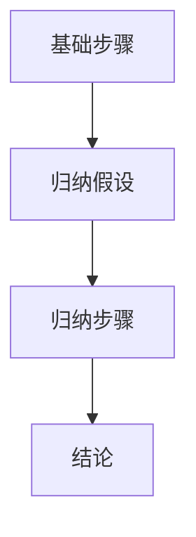
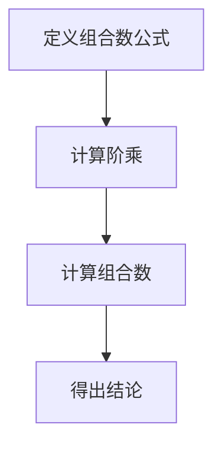

                 

# 《数学逻辑与代数的交叉研究》

## 摘要

本文深入探讨了数学逻辑与代数这两大数学分支之间的交叉研究。首先，我们回顾了数学逻辑和代数的历史发展及其基本概念，探讨了它们之间的联系与区别。接着，文章详细阐述了数学逻辑在代数中的应用，以及代数在数学逻辑中的作用。此外，我们还探讨了数学逻辑与代数在组合数学、密码学、计算机科学和工程应用中的具体应用，分析了其挑战与机遇。最后，本文展望了数学逻辑与代数交叉研究的未来趋势和发展方向，为读者提供了丰富的理论依据和实践指导。通过本文的阅读，读者将更好地理解数学逻辑与代数之间的紧密联系，为相关领域的研究提供新思路。

## 关键词

数学逻辑，代数，交叉研究，组合数学，密码学，计算机科学，工程应用

### 第一部分：引论

#### 第1章：数学逻辑与代数的交叉背景

#### 1.1.1 数学逻辑的历史发展

数学逻辑是一门研究数学基础和推理方法的学科，其历史可以追溯到古希腊时期。当时，欧几里得在其著作《几何原本》中提出了公理化的思想，为数学逻辑的发展奠定了基础。随后，英国数学家乔治·布尔在19世纪提出了布尔代数，开创了现代数学逻辑的先河。

在20世纪，数学逻辑得到了快速发展。大卫·希尔伯特提出了逻辑演算，为数学证明提供了形式化的工具。库尔特·哥德尔和艾伯特·罗素分别提出了不完备性和集合论悖论，引发了数学基础性问题的深入探讨。这些理论的发展为数学逻辑的研究提供了丰富的素材。

#### 1.1.2 代数的起源与主要分支

代数起源于阿拉伯数学家阿尔·花拉子米的著作《代数学原理》，其核心思想是通过代数符号来解决数学问题。随着数学的发展，代数逐渐形成了多个分支，包括线性代数、抽象代数、多项式代数等。

线性代数主要研究向量空间、线性映射以及线性方程组等问题。抽象代数关注代数结构的性质，如群、环、域等。多项式代数则研究多项式的性质及其在各个领域中的应用。

#### 1.1.3 数学逻辑与代数的交叉研究现状与意义

数学逻辑与代数的交叉研究在多个领域取得了显著成果。在组合数学中，数学逻辑提供了强有力的推理工具，帮助解决组合问题。在密码学中，代数结构被广泛应用于加密算法的设计与安全性分析。

当前，数学逻辑与代数的交叉研究主要集中在以下几个方面：

1. **逻辑代数**：研究逻辑与代数的结合，如布尔代数、命题逻辑、谓词逻辑等。
2. **组合逻辑**：探讨组合数学中的逻辑问题，如组合构造、组合计数等。
3. **代数拓扑**：研究代数结构与拓扑空间的相互关系。
4. **代数几何**：研究代数结构在几何问题中的应用。

数学逻辑与代数的交叉研究具有重要的理论和应用价值。一方面，它为数学各分支提供了新的研究方法；另一方面，它促进了数学与其他学科的交叉融合，为解决实际问题提供了新的思路。因此，数学逻辑与代数的交叉研究具有重要的学术意义和实际应用价值。

### 第2章：数学逻辑与代数的基本概念

#### 2.1.1 数学逻辑的基本概念

数学逻辑是一门研究数学命题、推理和证明的学科。数学逻辑的核心概念包括命题、逻辑连接词、推理规则和证明方法。

- **命题**：命题是一个可以判断真假的陈述句。数学逻辑中的命题通常用字母表示，如P、Q、R等。命题的真假可以通过事实或逻辑推理来判断。
- **逻辑连接词**：逻辑连接词用于连接命题，形成复合命题。常见的逻辑连接词包括“且”（∧）、“或”（∨）、“非”（¬）和“如果…那么…”（→）。
- **推理规则**：推理规则是一种从已知命题推导出新命题的方法。常见的推理规则包括“肯定前件”、“否定后件”和“逆否推理”等。
- **证明方法**：证明方法是一种证明命题真实性的方法。常见的证明方法包括直接证明、反证法和数学归纳法等。

#### 2.1.2 代数的基本概念

代数是一门研究代数结构及其性质的数学学科。代数的基本概念包括代数结构、运算、元素和关系。

- **代数结构**：代数结构是一种具有特定运算和关系的数学系统。常见的代数结构包括群、环、域等。
- **运算**：运算是代数结构中的一种基本操作，用于将元素组合成新的元素。常见的运算包括加法、减法、乘法和除法等。
- **元素**：元素是代数结构中的个体，具有特定的属性和关系。
- **关系**：关系是元素之间的一种特定联系，通常用二元关系表示。常见的二元关系包括“小于”（<）、“等于”（=）和“包含”（⊆）等。

#### 2.1.3 数学逻辑与代数的联系与区别

数学逻辑与代数在数学体系中具有密切的联系，但它们也有明显的区别。

- **联系**：
  1. 数学逻辑为代数提供了推理工具和证明方法，帮助研究代数结构的性质。
  2. 代数在数学逻辑中得到了广泛应用，如布尔代数在命题逻辑和谓词逻辑中的应用。
  3. 数学逻辑和代数在组合数学、密码学等领域有共同的兴趣和问题。

- **区别**：
  1. 数学逻辑主要研究命题、推理和证明，而代数主要研究代数结构、运算和关系。
  2. 数学逻辑更侧重于逻辑思维和推理技巧，而代数更侧重于结构性质和运算规律。
  3. 数学逻辑在数学体系中具有基础性地位，而代数则是应用性更强的分支。

理解数学逻辑与代数的基本概念和联系，有助于我们更好地把握数学体系，为后续章节的深入探讨打下基础。

### 第二部分：数学逻辑与代数的交叉原理

#### 第3章：数学逻辑在代数中的应用

#### 3.1.1 代数中的命题逻辑

命题逻辑是数学逻辑的一个分支，研究命题及其逻辑关系。在代数中，命题逻辑被广泛应用于定义代数结构、证明代数性质和设计算法。

- **命题逻辑的基本概念**：

  - **命题**：命题是能够判断真假的陈述句。在代数中，命题通常用于描述代数结构、运算和性质。

  - **逻辑连接词**：逻辑连接词用于连接命题，形成复合命题。常见的逻辑连接词包括“且”（∧）、“或”（∨）、“非”（¬）和“如果…那么…”（→）。

  - **推理规则**：推理规则是一种从已知命题推导出新命题的方法。常见的推理规则包括“肯定前件”、“否定后件”和“逆否推理”等。

- **命题逻辑在代数中的应用**：

  - **定义代数结构**：使用命题逻辑可以定义代数结构的基本性质，如群、环、域等。例如，一个群的定义可以表述为：“对于群G中的任意元素a和b，它们的乘积ab也在G中，且满足结合律和单位元存在。”

  - **证明代数性质**：使用命题逻辑的推理规则，可以证明代数结构的一些重要性质。例如，证明一个环是否为域，需要证明其具有除法运算，即证明对于任意非零元素a，存在一个元素b，使得ab=1。

  - **设计算法**：命题逻辑可以帮助设计代数算法，如求逆元、计算环上的多项式等。通过逻辑推理，可以确保算法的正确性和有效性。

#### 3.1.2 代数中的谓词逻辑

谓词逻辑是数学逻辑的另一个重要分支，研究变量、谓词和量词等概念。在代数中，谓词逻辑被广泛应用于研究代数结构的关系、性质和组合。

- **谓词逻辑的基本概念**：

  - **谓词**：谓词是一个用于描述对象之间关系的语句。在代数中，谓词通常用于描述元素之间的运算关系或性质。

  - **变量**：变量是用于表示未知元素或对象的符号。在谓词逻辑中，变量可以出现在谓词中，表示特定元素或对象。

  - **量词**：量词用于描述变量取值范围和约束条件。常见的量词包括“存在量词”（∃）和“全称量词”（∀）。

- **谓词逻辑在代数中的应用**：

  - **描述代数关系**：使用谓词逻辑可以描述代数结构中的关系。例如，一个群可以定义为：“存在一个二元运算•，对于群G中的任意元素a和b，它们的运算结果•(a, b)也在G中。”

  - **研究代数性质**：使用谓词逻辑可以研究代数结构的一些性质。例如，研究一个环是否为域，可以表述为：“对于环R中的任意非零元素a，存在一个元素b，使得ab=1。”

  - **组合代数结构**：使用谓词逻辑可以组合不同的代数结构，形成新的代数结构。例如，可以将群和环组合成域，或者将多个群组合成群环。

#### 3.1.3 数学逻辑在代数证明中的应用

数学逻辑在代数证明中具有重要作用。通过使用命题逻辑和谓词逻辑，可以构建严密的证明过程，确保代数性质和定理的正确性。

- **数学逻辑在代数证明中的应用**：

  - **命题逻辑在代数证明中的应用**：
    - 使用命题逻辑的推理规则，可以从已知事实推导出新结论。例如，使用“否定后件”规则，可以证明一个环不是域。
    - 使用命题逻辑的证明方法，如直接证明、反证法和归纳法，可以证明代数性质和定理。例如，使用归纳法证明一个环的所有子集都是环。

  - **谓词逻辑在代数证明中的应用**：
    - 使用谓词逻辑的推理规则，可以从已知谓词推导出新谓词。例如，使用“存在量词”规则，可以证明存在一个满足特定条件的元素。
    - 使用谓词逻辑的证明方法，如构造证明和反证法，可以证明代数结构的关系和性质。例如，使用构造证明证明一个环是域。

总之，数学逻辑在代数证明中发挥了重要作用，通过逻辑推理和证明方法，可以确保代数性质和定理的正确性。数学逻辑与代数的交叉应用，为代数研究提供了强大的工具和方法。

### 第4章：代数在数学逻辑中的应用

#### 4.1.1 代数结构在命题逻辑中的应用

代数结构在命题逻辑中的应用主要表现在布尔代数的引入和运用。布尔代数是数学逻辑中一种重要的代数结构，由英国数学家乔治·布尔在19世纪创立。布尔代数在命题逻辑中有着广泛的应用，特别是在逻辑电路设计和计算机科学领域。

- **布尔代数的基本概念**：

  - **布尔变量**：布尔代数中的基本元素是布尔变量，通常用大写字母表示，如A、B、C等。布尔变量的取值只有两个：真（T）和假（F）。
  - **布尔运算**：布尔代数中的基本运算包括“与”（∧）、“或”（∨）、“非”（¬）和“异或”（XOR）。
    - “与”运算：如果两个布尔变量的取值都为真，则结果为真，否则为假。
    - “或”运算：如果两个布尔变量中至少有一个为真，则结果为真，否则为假。
    - “非”运算：对布尔变量的取值进行取反，真变假，假变真。
    - “异或”运算：如果两个布尔变量的取值不同，则结果为真，否则为假。

- **布尔代数在命题逻辑中的应用**：

  - **布尔表达式**：命题逻辑中的复合命题可以用布尔表达式表示。例如，命题“P且Q”可以用布尔表达式P∧Q表示。
  - **逻辑电路设计**：布尔代数在逻辑电路设计中有着重要应用。通过布尔表达式，可以设计出各种逻辑门电路，如与门、或门、非门等。这些逻辑门电路是实现计算机硬件的基础。
  - **计算机科学**：布尔代数在计算机科学中有着广泛的应用。例如，在编程语言中，布尔值用于表示条件判断和逻辑运算。此外，在算法设计和分析中，布尔代数也发挥了重要作用。

#### 4.1.2 代数结构在谓词逻辑中的应用

代数结构在谓词逻辑中的应用主要表现在群、环、域等代数结构在谓词逻辑中的运用。谓词逻辑是一种研究量词和谓词的数学逻辑，通过代数结构，可以更直观地表示和推理谓词逻辑中的概念。

- **代数结构在谓词逻辑中的应用**：

  - **谓词**：谓词是谓词逻辑中的基本概念，用于描述对象之间的关系。在代数结构中，谓词可以用来描述元素之间的运算关系或性质。例如，谓词“小于”可以用来描述两个元素的大小关系。
  - **量词**：量词是谓词逻辑中的另一个重要概念，用于表示存在性和普遍性。在代数结构中，量词可以用来描述元素的存在性和普遍性。例如，存在量词可以用来表示在某个代数结构中存在一个满足特定条件的元素。
  - **谓词逻辑证明**：通过代数结构，可以进行谓词逻辑的证明。例如，使用群结构可以证明一个性质为真的谓词在群中成立。

#### 4.1.3 代数在数学逻辑证明中的贡献

代数在数学逻辑证明中有着重要的贡献，主要体现在以下几个方面：

- **代数结构的性质**：代数结构的性质为数学逻辑证明提供了基础。例如，群、环、域等代数结构的性质可以帮助证明一些命题的真假。
- **推理规则**：代数的推理规则为数学逻辑证明提供了方法。例如，在群、环、域等代数结构中，可以使用一些推理规则进行证明，如群中的逆元定理、环中的分配律等。
- **形式化证明**：代数的概念和方法可以帮助进行形式化证明。通过建立代数结构，可以使用形式化的方法进行证明，确保证明的严密性和正确性。

总之，代数在数学逻辑中有着重要的应用和贡献。通过代数结构，可以更直观地表示和推理数学逻辑中的概念，为数学逻辑的证明提供了强有力的工具。

### 第5章：数学逻辑与代数在组合数学中的应用

#### 5.1.1 组合数学的基本概念

组合数学是数学的一个分支，主要研究离散对象的排列、组合、计数以及图论等问题。组合数学与数学逻辑和代数有着密切的联系，尤其是在解决组合问题时，数学逻辑和代数提供了有力的工具和理论基础。

- **组合数学的基本概念**：

  - **排列**：排列是指从一组元素中按照一定顺序取出若干个元素的过程。排列的计数问题可以通过数学逻辑和代数的方法进行解决。
  - **组合**：组合是指从一组元素中取出若干个元素的过程，不考虑元素的顺序。组合的计数问题同样可以通过数学逻辑和代数的方法进行解决。
  - **图论**：图论是研究图形及其性质的数学分支。图论中的许多问题都可以通过数学逻辑和代数的方法进行解决。

- **数学逻辑与代数在组合数学中的应用**：

  - **排列与组合的计数**：数学逻辑和代数提供了排列与组合的计数方法。例如，通过组合数学中的组合数公式，可以使用代数方法计算出从n个不同元素中取出k个元素的组合数C(n, k)。

    组合数公式：
    $$
    C(n, k) = \frac{n!}{k!(n-k)!}
    $$

    其中，n! 表示n的阶乘，即n! = n × (n-1) × (n-2) × ... × 2 × 1。

    这个公式可以通过数学逻辑中的推理过程来证明。例如，可以使用归纳法来证明组合数公式的正确性。

  - **图论问题**：数学逻辑和代数在图论问题中有着广泛的应用。例如，在图论中，可以通过代数方法来解决图的着色问题。图的着色问题是指如何给图的顶点着色，使得相邻的顶点颜色不同。这个问题可以通过图论的代数方法，如拉姆齐理论，来进行分析和解决。

    拉姆齐理论：
    对于任意正整数k和r，存在一个最小的正整数N，使得任何包含至少N个顶点的图，都可以将其中的任意k个顶点着色，使得这k个顶点中没有两个相邻的顶点颜色相同。

    拉姆齐理论可以通过代数方法证明，如使用图论的矩阵表示和代数运算来推导出结论。

#### 5.1.2 数学逻辑与代数在组合数学中的应用

数学逻辑和代数在组合数学中的应用主要体现在以下几个方面：

- **命题逻辑的应用**：

  - 在组合数学中，命题逻辑可以用于证明组合问题的性质。例如，可以使用命题逻辑来证明组合数公式的正确性。
  - 命题逻辑可以帮助分析组合问题的条件，从而找到解决方法。例如，在解决组合问题时，可以使用命题逻辑的推理规则来推导出问题的解。

- **谓词逻辑的应用**：

  - 在组合数学中，谓词逻辑可以用于描述组合问题的性质。例如，可以使用谓词逻辑来描述组合数的关系和性质。
  - 谓词逻辑可以帮助分析组合问题的解的存在性。例如，可以使用谓词逻辑来证明某个组合问题是否存在解。

- **代数的应用**：

  - 在组合数学中，代数可以用于表示组合问题的结构。例如，可以使用代数方法来表示组合数的矩阵形式，从而方便计算和推理。
  - 代数可以用于解决组合数学中的计数问题。例如，可以使用代数方法来计算多项式系数，从而得到组合数的值。

#### 5.1.3 组合数学中的数学逻辑与代数问题分析

组合数学中的许多问题可以通过数学逻辑和代数的方法进行分析和解决。以下是一些具体的组合数学问题及其数学逻辑和代数分析：

- **组合数问题**：

  - **问题**：计算从n个不同元素中取出k个元素的组合数。
  - **数学逻辑分析**：可以使用命题逻辑来证明组合数公式的正确性。例如，通过归纳法证明组合数公式的递推关系。
  - **代数分析**：可以使用代数方法来计算组合数的值。例如，使用多项式的系数来表示组合数，并利用代数运算来计算组合数的值。

- **图着色问题**：

  - **问题**：给定一个图，判断是否可以将其中的顶点着色，使得相邻的顶点颜色不同。
  - **数学逻辑分析**：可以使用谓词逻辑来描述图的着色性质。例如，使用谓词逻辑来表示图中的顶点着色关系。
  - **代数分析**：可以使用代数方法，如拉姆齐理论，来分析图的着色问题。例如，使用矩阵表示图的结构，并通过代数运算来分析图的着色可能性。

通过数学逻辑和代数的方法，可以深入分析和解决组合数学中的问题，为组合数学的研究提供了强有力的工具。

### 第三部分：数学逻辑与代数的交叉应用

#### 第6章：数学逻辑与代数在密码学中的应用

密码学是一门研究如何确保信息安全和隐私保护的学科，其核心在于设计和使用密码系统。数学逻辑和代数在密码学中扮演着关键角色，为密码系统的设计、分析和安全性提供了坚实的理论基础。

#### 6.1.1 密码学的基本概念

密码学主要涉及以下基本概念：

- **加密**：加密是将明文转换为密文的过程，使得未授权的用户无法理解信息。
- **解密**：解密是将密文还原为明文的过程，只有拥有解密密钥的用户才能完成。
- **密钥**：密钥是加密和解密过程中使用的关键参数，决定了加密算法的安全性。
- **密码系统**：密码系统是加密和解密算法的组合，用于实现加密和解密过程。

#### 6.1.2 数学逻辑与代数在密码学中的应用

数学逻辑和代数在密码学中的应用体现在以下几个方面：

- **布尔代数在密码学中的应用**：

  - 布尔代数是密码学中最重要的数学工具之一。在布尔代数中，逻辑运算（与、或、非）和布尔函数（如布尔表达式）被用于设计逻辑电路，进而构建加密算法的核心组件。

  - **例子**：布尔函数在布尔电路设计中用于实现加密算法的加密和解密过程。例如，AES（高级加密标准）加密算法中使用了布尔函数来设计S-盒，这是一种非线性变换，用于提高加密算法的安全性。

- **群论在密码学中的应用**：

  - 群论是一种研究代数结构的数学理论，在密码学中用于构造公钥加密算法，如RSA算法。

  - **例子**：RSA算法是基于整数分解问题的困难性，它使用了群论中的欧拉定理和费马小定理。RSA算法的加密过程涉及到大素数的选取和模运算，这些运算都是基于群论的原理。

- **数学逻辑在密码学证明中的应用**：

  - 数学逻辑在密码学中用于证明密码系统的安全性。例如，零知识证明（Zero-Knowledge Proof）是一种密码学协议，它允许证明者证明某个陈述为真，而不泄露任何其他信息。

  - **例子**：在零知识证明中，证明者需要证明“我知道一个秘密”，但不需要泄露秘密本身。数学逻辑在这里用于确保证明者无法泄露任何有关秘密的信息。

#### 6.1.3 密码学中的数学逻辑与代数问题分析

密码学中的数学逻辑与代数问题分析主要包括以下几个方面：

- **安全性证明**：

  - 密码系统的安全性通常通过数学逻辑的方法进行证明。例如，证明加密算法的抗抵赖性、不可伪造性和不可破解性。

  - **例子**：在RSA算法中，数学逻辑用于证明即使知道公钥和密文，攻击者也无法计算出私钥。这个证明依赖于数论中的数学逻辑和代数理论。

- **算法优化**：

  - 密码学中的算法优化通常涉及到数学逻辑和代数的应用。例如，优化加密算法的计算复杂度和内存使用。

  - **例子**：在AES算法的优化中，数学逻辑和代数方法被用来设计高效的S-盒和轮函数，从而提高加密和解密的速度。

- **密码分析**：

  - 密码分析是研究如何破解密码系统的过程。数学逻辑和代数在密码分析中用于构建攻击模型和算法。

  - **例子**：在统计分析中，密码分析者使用数学逻辑和代数方法分析密文，以推测明文的信息。

通过数学逻辑和代数的交叉应用，密码学在理论研究和实际应用中取得了显著的成果，为信息安全提供了坚实的保障。

### 第7章：数学逻辑与代数在计算机科学中的应用

#### 7.1.1 计算机科学的基本概念

计算机科学是研究计算机硬件和软件及其应用的学科，涵盖了算法、编程语言、数据结构、操作系统、人工智能等多个领域。数学逻辑和代数在计算机科学中扮演着至关重要的角色，为算法设计、编程语言、形式化验证和理论计算机科学提供了理论基础。

- **计算机科学的基本概念**：

  - **算法**：算法是解决问题的一系列步骤或规则。算法的效率、正确性和可扩展性是计算机科学研究的核心问题。
  - **编程语言**：编程语言是用于编写计算机程序的工具，包括高级语言和低级语言。编程语言的语法和语义是计算机科学的重要组成部分。
  - **数据结构**：数据结构是用于存储和组织数据的方式，包括数组、链表、栈、队列、树、图等。数据结构的选择直接影响算法的效率和复杂性。
  - **操作系统**：操作系统是计算机系统的核心软件，负责管理和控制计算机硬件资源，为应用程序提供运行环境。
  - **人工智能**：人工智能是模拟和扩展人类智能的计算机科学领域，包括机器学习、自然语言处理、计算机视觉等。

#### 7.1.2 数学逻辑与代数在计算机科学中的应用

数学逻辑和代数在计算机科学中的应用广泛而深入，主要表现在以下几个方面：

- **算法设计**：

  - 数学逻辑为算法设计提供了严密的推理工具。例如，在形式化验证中，数学逻辑用于证明算法的正确性和终止性。
  - 代数在算法设计中用于分析算法的复杂度，如时间复杂度和空间复杂度。

  - **例子**：在算法分析中，代数方法用于推导递归关系，从而计算算法的复杂度。例如，使用主定理（Master Theorem）可以解决许多递归算法的复杂度分析问题。

- **编程语言**：

  - 数学逻辑在编程语言的语义分析中发挥着重要作用。例如，在类型检查中，数学逻辑用于验证程序的正确性和类型一致性。
  - 代数在编程语言的设计中用于定义数据结构和运算。

  - **例子**：在函数式编程语言中，代数方法用于定义不可变数据结构和纯函数，从而实现更高效和可靠的编程。

- **形式化验证**：

  - 形式化验证是一种使用数学逻辑的方法来验证程序的正确性。形式化验证通过将程序表示为逻辑公式，然后使用定理证明器来证明程序的正确性。
  - 代数在形式化验证中用于定义程序的行为和状态，从而验证程序的性质。

  - **例子**：在模型检查中，代数方法用于构建程序的状态空间，然后使用算法验证程序是否满足指定的性质。例如，使用模型检查器验证程序是否具有自由性或死锁自由性。

- **理论计算机科学**：

  - 数学逻辑在理论计算机科学中用于研究计算模型和复杂性理论。例如，在计算复杂性理论中，数学逻辑用于定义问题的难度和求解算法的复杂性。
  - 代数在计算理论中用于研究计算结构和计算模型。

  - **例子**：在图灵机的理论研究中，代数方法用于定义图灵机的状态和计算过程，从而分析其计算能力和局限性。

通过数学逻辑和代数的交叉应用，计算机科学在理论研究和实际应用中取得了显著的成果，为计算机技术的发展提供了坚实的理论基础。

### 第8章：数学逻辑与代数在工程应用中的挑战与机遇

#### 8.1.1 工程应用的基本概念

工程应用是指将理论知识和实践经验应用于解决实际工程问题，以提高生产效率、降低成本、改善生活质量等。数学逻辑和代数在工程应用中具有广泛的应用，包括设计优化、质量控制、系统建模等。然而，这些应用也面临着一系列挑战和机遇。

- **工程应用的基本概念**：

  - **设计优化**：设计优化是指通过优化设计参数来提高产品性能或降低生产成本。数学逻辑和代数在优化过程中用于建模和分析，提供优化方向和解决方案。
  - **质量控制**：质量控制是指确保产品或服务符合预定标准的过程。数学逻辑和代数在质量控制中用于设计检测方法、分析缺陷原因等。
  - **系统建模**：系统建模是指使用数学方法来描述和分析系统行为。数学逻辑和代数在系统建模中用于建立数学模型、分析系统特性等。

#### 8.1.2 数学逻辑与代数在工程中的应用

数学逻辑和代数在工程中的应用主要体现在以下几个方面：

- **设计优化**：

  - 数学逻辑和代数在工程中的设计优化方面具有重要作用。例如，在结构工程中，代数方法用于优化建筑结构的设计，以提高其稳定性和耐久性。
  - **例子**：在桥梁设计中，代数方法可以用于优化桥梁的受力结构，以降低成本和保证安全。

- **质量控制**：

  - 数学逻辑和代数在质量控制中的应用主要包括设计检测方法和分析缺陷原因。例如，在电子制造中，代数方法可以用于检测电路板的焊接质量。
  - **例子**：在汽车制造中，数学逻辑和代数可以用于分析车辆的质量问题，并提供改进措施。

- **系统建模**：

  - 数学逻辑和代数在系统建模中用于建立数学模型、分析系统特性。例如，在能源系统中，代数方法可以用于建模能源消耗和供应。
  - **例子**：在交通管理系统中，数学逻辑和代数可以用于建模交通流量，并优化交通信号灯控制。

#### 8.1.3 工程应用中的数学逻辑与代数挑战与机遇分析

数学逻辑和代数在工程应用中面临着一系列挑战和机遇：

- **挑战**：

  - **复杂度问题**：工程应用中的问题通常非常复杂，需要数学逻辑和代数方法进行建模和分析。这要求研究人员具备深厚的数学功底和解决复杂问题的能力。
  - **实际应用与理论之间的差距**：工程应用中的问题可能与数学理论之间存在一定的差距，需要研究人员在理论上进行创新，并将其应用于实际工程中。

- **机遇**：

  - **技术创新**：数学逻辑和代数方法在工程中的应用为技术创新提供了新的思路。例如，通过代数方法优化设计，可以降低成本和提升产品性能。
  - **跨学科融合**：数学逻辑和代数与工程学科的交叉融合，为解决复杂工程问题提供了新的工具和方法。例如，将数学逻辑和代数方法应用于人工智能和机器学习领域，可以提升系统建模和优化能力。

总之，数学逻辑和代数在工程应用中面临着挑战和机遇。通过不断探索和创新，数学逻辑和代数将在工程应用中发挥更大的作用，推动工程技术的进步。

### 第9章：数学逻辑与代数的交叉研究趋势与未来展望

#### 9.1.1 当前研究趋势

数学逻辑与代数的交叉研究在过去几十年中取得了显著的进展，形成了多个重要的研究方向。以下是当前研究的一些主要趋势：

- **逻辑代数的应用**：逻辑代数是数学逻辑与代数交叉研究的重要领域。研究人员在逻辑代数中引入了代数结构，如布尔代数、模态逻辑和命题演算等，用于解决组合问题和形式验证问题。

- **组合逻辑的研究**：组合逻辑是研究离散结构和组合问题的一种方法。近年来，组合逻辑在密码学、图论和计算机科学等领域得到了广泛应用。研究人员通过组合逻辑方法解决了许多实际问题，如组合加密、网络设计和优化等。

- **代数拓扑的发展**：代数拓扑是研究代数结构与拓扑空间相互关系的一个新兴领域。近年来，代数拓扑在拓扑量子计算、量子信息和几何拓扑学等领域取得了重要突破，为数学逻辑与代数的交叉研究提供了新的理论依据。

- **代数几何的应用**：代数几何是研究代数结构和几何对象相互关系的一个领域。代数几何在密码学、编码理论和算法设计中有着广泛应用。研究人员通过代数几何方法解决了许多密码学问题，如公钥密码体制的设计和安全性分析。

- **形式化验证与模型检查**：形式化验证和模型检查是数学逻辑与代数在计算机科学中的重要应用。研究人员通过形式化验证和模型检查方法，确保了计算机系统和软件的正确性和可靠性。

#### 9.1.2 未来研究展望

随着数学逻辑和代数的发展，未来研究有望在以下几个方面取得突破：

- **多学科交叉融合**：数学逻辑和代数的交叉研究将与其他学科（如计算机科学、物理学、生物学等）相结合，产生新的交叉学科和研究领域。这种多学科交叉融合将为解决复杂问题提供新的思路和工具。

- **算法优化与复杂性分析**：未来研究将专注于算法优化和复杂性分析，以提高数学逻辑与代数方法的计算效率和适用性。研究人员将开发新的算法和技术，解决当前方法难以处理的复杂问题。

- **量子计算与代数结构**：量子计算是当前信息技术的重要发展方向。未来研究将探索量子计算中的代数结构，如量子逻辑和量子代数，为量子计算提供理论基础和技术支持。

- **大数据与代数分析**：随着大数据时代的到来，代数分析在数据挖掘和机器学习中具有巨大潜力。未来研究将专注于开发新的代数方法，用于大数据处理和分析。

- **实际应用与产业化**：数学逻辑与代数方法的实际应用和产业化是未来研究的重要方向。研究人员将致力于将数学逻辑与代数方法应用于实际工程和工业领域，解决实际问题，推动产业技术进步。

总之，数学逻辑与代数的交叉研究在当前和未来都具有广阔的发展前景。通过不断创新和探索，数学逻辑与代数的交叉研究将为数学、计算机科学、工程应用等领域的理论和实践提供新的动力。

### 附录A：数学逻辑与代数的交叉研究资源

#### A.1.1 相关书籍推荐

1. **《数学逻辑导论》**：作者：D. van Dalen。本书系统地介绍了数学逻辑的基本概念和方法，适合初学者阅读。
2. **《代数学原理》**：作者：I.N. Herstein。本书详细阐述了代数的基本概念和结构，对于理解代数在数学逻辑中的应用有很大帮助。
3. **《组合数学及其在计算机科学中的应用》**：作者：J. Harris。本书介绍了组合数学的基本概念和应用，对于理解组合数学与数学逻辑和代数的交叉研究具有重要意义。
4. **《密码学导论》**：作者：S. A. W. Gustafson。本书涵盖了密码学的基本概念和方法，特别是数学逻辑和代数在密码学中的应用。
5. **《形式化验证》**：作者：M. Fliess。本书介绍了形式化验证的基本原理和技术，对于理解数学逻辑与代数在形式化验证中的应用有重要指导作用。

#### A.1.2 学术期刊与会议推荐

1. **《数学逻辑与哲学》**：该期刊专注于数学逻辑和哲学领域的研究，发表了大量关于数学逻辑与代数交叉研究的论文。
2. **《组合数学学报》**：该期刊发表了关于组合数学及其与数学逻辑和代数交叉研究的相关论文。
3. **《密码学杂志》**：该期刊涵盖了密码学领域的最新研究成果，包括数学逻辑和代数在密码学中的应用。
4. **《理论计算机科学》**：该期刊发表了关于计算机科学理论的研究论文，包括数学逻辑与代数的交叉研究。

#### A.1.3 在线课程与讲座推荐

1. **Coursera上的《数学逻辑》**：由斯坦福大学提供，课程内容涵盖数学逻辑的基本概念和应用。
2. **edX上的《代数基础》**：由密歇根大学提供，介绍了代数的基本概念和结构。
3. **Khan Academy的《组合数学》**：提供了丰富的组合数学教学视频和练习题，适合初学者学习。
4. **YouTube上的《密码学讲座》**：由多位专家提供的密码学讲座，涵盖了密码学的基本概念和应用。
5. **arXiv.org上的最新论文**：arXiv是一个开放的在线论文预印本平台，可以获取最新的数学逻辑与代数交叉研究论文。

通过这些书籍、期刊、会议和在线资源，读者可以更深入地了解数学逻辑与代数的交叉研究，拓展知识视野，为相关领域的研究提供参考。

### 附录B：数学逻辑与代数的交叉研究示例

#### B.1.1 示例一：命题逻辑在代数证明中的应用

**问题**：证明对于任意的正整数n，自然数n的阶乘n!是偶数。

**证明方法**：

1. **数学逻辑表示**：
   - 设P(n)为命题“n的阶乘n!是偶数”。
   - 需要证明：对于任意正整数n，P(n)为真。

2. **基础步骤**：
   - 当n=1时，n! = 1，是偶数，P(1)为真。
   - 当n=2时，n! = 2，是偶数，P(2)为真。

3. **归纳假设**：
   - 假设对于任意正整数k，P(k)为真，即k!是偶数。

4. **归纳步骤**：
   - 需要证明：P(k+1)为真，即(k+1)!是偶数。
   - (k+1)! = (k+1) * k!
   - 由于k!是偶数，根据归纳假设，存在一个整数m，使得k! = 2m。
   - 因此，(k+1)! = (k+1) * 2m = 2m(k+1)。
   - 由于k+1是正整数，所以2m(k+1)是偶数。

5. **结论**：
   - 通过归纳法，证明了对于任意正整数n，n!是偶数。

**Mermaid流程图**：


#### B.1.2 示例二：代数结构在命题逻辑证明中的应用

**问题**：证明布尔代数中，对于任意两个布尔变量A和B，A ⊕ B = (A ∧ ¬B) ∨ (¬A ∧ B)。

**证明方法**：

1. **数学逻辑表示**：
   - 设A和B为布尔变量。
   - 需要证明：A ⊕ B = (A ∧ ¬B) ∨ (¬A ∧ B)。

2. **真值表验证**：
   - 列出A、B及其异或运算A ⊕ B的所有可能取值。
   - 列出(A ∧ ¬B) ∨ (¬A ∧ B)的所有可能取值。

3. **真值表**：
   | A | B | A ⊕ B | (A ∧ ¬B) ∨ (¬A ∧ B) |
   |---|---|-------|---------------------|
   | T | T |   F   |         F           |
   | T | F |   T   |         T           |
   | F | T |   T   |         T           |
   | F | F |   F   |         F           |

   - 从真值表可以看出，对于任意取值组合，A ⊕ B和(A ∧ ¬B) ∨ (¬A ∧ B)的取值相同。

4. **结论**：
   - 通过真值表验证，证明了A ⊕ B = (A ∧ ¬B) ∨ (¬A ∧ B)。

**Mermaid流程图**：
```mermaid
graph TB
A[列出A、B取值] --> B[计算A ⊕ B]
B --> C[计算(A ∧ ¬B) ∨ (¬A ∧ B)]
C --> D[比较取值]
D --> E[结论]
```

#### B.1.3 示例三：数学逻辑与代数在组合数学中的应用案例分析

**问题**：计算从5个不同元素中取出3个元素的组合数。

**证明方法**：

1. **组合数公式**：
   - 组合数公式：C(n, k) = n! / (k! * (n - k)!)

2. **计算**：
   - C(5, 3) = 5! / (3! * (5 - 3)!)
   - 5! = 5 × 4 × 3 × 2 × 1 = 120
   - 3! = 3 × 2 × 1 = 6
   - 2! = 2 × 1 = 2
   - C(5, 3) = 120 / (6 * 2) = 120 / 12 = 10

3. **结论**：
   - 从5个不同元素中取出3个元素的组合数为10。

**Mermaid流程图**：


通过这些示例，我们可以看到数学逻辑与代数的交叉研究在实际问题中的应用。数学逻辑提供了严谨的推理工具，而代数则提供了丰富的结构和方法，两者结合可以解决各种复杂的数学问题。这些示例也为读者提供了一个具体的应用场景，有助于理解数学逻辑与代数交叉研究的实际意义。

