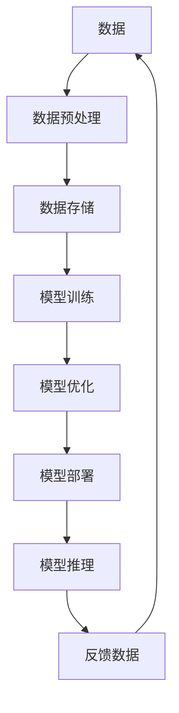

                 

# 数据不可或缺，但软件2.0并非没有bug

> **关键词**：软件2.0、数据驱动、数据处理、数据分析、数据治理、AI大模型、数据安全

> **摘要**：本文深入探讨了软件2.0时代的数据重要性及其挑战。我们首先分析了软件2.0与数据驱动的演变，然后探讨了数据处理、数据分析和数据治理等方面的技术挑战。同时，本文也介绍了AI大模型与数据的关系以及数据在各个行业中的应用案例。最后，我们展望了数据与软件2.0未来的发展趋势，并讨论了面临的挑战。

## 第一部分: 数据不可或缺，但软件2.0并非没有bug

### 第1章: 软件2.0时代的数据挑战

#### 1.1 软件2.0与数据驱动的演变

##### 1.1.1 从软件1.0到软件2.0的过渡

软件1.0时代主要是以功能为中心，软件的设计和开发主要侧重于实现特定的功能。而随着互联网和移动设备的普及，软件的交互性和用户参与度得到了极大的提升，这标志着软件进入了2.0时代。

软件2.0的特点是数据驱动，其核心在于利用数据来优化软件的性能和用户体验。数据驱动不仅改变了软件开发的模式，也使得软件能够更好地适应和响应用户的需求。

##### 1.1.2 数据在软件2.0时代的重要性

在软件2.0时代，数据的重要性日益凸显。数据不仅是软件的输入，也是软件的输出，更是软件的驱动力。数据可以帮助软件更好地理解用户需求，从而提供更加个性化的服务。此外，数据还可以帮助软件进行自我优化，提高其性能和效率。

##### 1.1.3 数据驱动与业务智能化

数据驱动不仅仅是软件开发的一种模式，它也是业务智能化的重要手段。通过数据驱动，企业可以更加准确地预测市场趋势，优化业务流程，提高生产效率，从而实现业务的智能化。

#### 1.2 数据的类型与质量

##### 1.2.1 数据的分类

数据可以分为结构化数据和非结构化数据。结构化数据通常是指以表格形式存储的数据，如关系型数据库中的数据。非结构化数据则是指没有固定格式的数据，如文本、图片、视频等。

##### 1.2.2 数据质量的重要性

数据质量是数据驱动的基石。高质量的数据可以确保分析结果的准确性和可靠性，从而为业务决策提供有力的支持。相反，低质量的数据会导致分析结果偏差，甚至导致错误的决策。

##### 1.2.3 数据质量管理策略

为了确保数据质量，企业需要采取一系列的数据质量管理策略，包括数据清洗、数据标准化、数据监控等。通过这些策略，企业可以确保数据的准确性、完整性和一致性。

#### 1.3 数据隐私与安全

##### 1.3.1 数据隐私保护的重要性

在数据驱动的时代，数据隐私保护变得尤为重要。数据隐私问题不仅涉及到用户的个人隐私，也可能对企业的声誉和利益造成损害。

##### 1.3.2 数据安全策略与实践

为了保护数据隐私，企业需要采取一系列的数据安全策略，包括数据加密、访问控制、网络安全等。此外，企业还需要制定详细的数据安全政策和操作流程，以确保数据的安全和保密性。

##### 1.3.3 数据隐私法规解读

随着数据隐私问题的日益突出，各国相继出台了相关的数据隐私法规。企业需要了解这些法规，确保其数据处理活动符合法律法规的要求。

### 第2章: 软件2.0时代的数据处理技术

#### 2.1 数据采集与集成

##### 2.1.1 数据采集工具与技术

数据采集是数据处理的第一步。企业需要选择合适的数据采集工具和技术，以确保数据的全面性和准确性。

##### 2.1.2 数据集成与融合方法

数据集成是将来自不同来源的数据进行整合的过程。数据融合则是将多个数据源中的数据进行合并，以获得更全面的数据视图。

##### 2.1.3 实时数据处理与流处理技术

实时数据处理是软件2.0时代的一个重要特点。流处理技术可以实现对数据的实时处理和分析，为企业提供即时的业务洞察。

#### 2.2 数据清洗与预处理

##### 2.2.1 数据清洗的必要性

数据清洗是确保数据质量的重要步骤。通过对数据进行清洗，可以去除错误、缺失和重复的数据，从而提高数据的质量。

##### 2.2.2 数据清洗算法与流程

数据清洗通常涉及多种算法和技术，如填充缺失值、去除重复值、纠正错误值等。企业需要根据数据的特点和需求，选择合适的数据清洗算法和流程。

##### 2.2.3 预处理技术详解

预处理技术包括数据转换、数据归一化、特征提取等。这些技术可以进一步提高数据的质量和适用性，为后续的分析提供更好的数据基础。

#### 2.3 数据存储与管理

##### 2.3.1 数据库技术与选择

数据库技术是数据存储和管理的重要手段。企业需要根据数据的特点和需求，选择合适的数据库技术，如关系型数据库、NoSQL数据库等。

##### 2.3.2 分布式存储系统

随着数据量的不断增长，分布式存储系统成为了企业数据存储的首选。分布式存储系统可以提供高可用性、高可靠性和高扩展性，从而满足企业对数据存储的需求。

##### 2.3.3 数据仓库与数据湖

数据仓库和数据湖是大数据处理的重要工具。数据仓库是一种集成的数据存储系统，用于支持业务智能和分析。数据湖则是一种大规模数据存储系统，可以存储各种类型的数据，包括结构化数据、半结构化数据和非结构化数据。

### 第3章: 软件2.0时代的数据分析与应用

#### 3.1 数据分析基础

##### 3.1.1 数据分析流程与方法

数据分析是一个系统化的过程，包括数据收集、数据清洗、数据探索、数据分析、数据可视化和数据报告等多个步骤。企业需要根据数据分析的目标和数据的特点，选择合适的数据分析方法和工具。

##### 3.1.2 数据可视化技术

数据可视化是将数据分析结果以图形或图表的形式展示出来的技术。数据可视化不仅可以帮助企业更好地理解数据，还可以提高数据分析的效果和影响力。

##### 3.1.3 数据挖掘算法概述

数据挖掘是从大量数据中自动发现有价值的信息和知识的过程。数据挖掘算法包括分类、聚类、关联规则挖掘、异常检测等。企业需要根据数据分析的需求和数据的特点，选择合适的数据挖掘算法。

#### 3.2 实时数据分析

##### 3.2.1 实时数据分析的重要性

实时数据分析是软件2.0时代的一个重要特点。实时数据分析可以为企业提供即时的业务洞察，帮助企业快速响应市场变化，提高业务效率。

##### 3.2.2 实时数据分析架构与实现

实时数据分析通常涉及数据采集、数据存储、数据处理和数据可视化等多个环节。企业需要构建一个高效、可靠的实时数据分析架构，以确保实时数据分析的效果和效率。

##### 3.2.3 实时数据分析应用案例

实时数据分析在各个行业都有广泛的应用。例如，在金融业，实时数据分析可以用于风险控制和交易监控；在制造业，实时数据分析可以用于生产优化和质量控制。

#### 3.3 智能数据应用

##### 3.3.1 智能数据分析技术

智能数据分析是利用人工智能技术对数据进行处理和分析的过程。智能数据分析可以大幅提高数据分析的效率和准确性，为企业提供更加深入的洞察。

##### 3.3.2 智能数据驱动业务场景

智能数据驱动业务场景包括智能客服、智能推荐、智能风控等。通过智能数据驱动业务场景，企业可以提供更加个性化的服务，提高用户体验和满意度。

##### 3.3.3 智能数据应用的挑战与机遇

智能数据应用面临着数据质量、数据安全和数据隐私等方面的挑战。同时，智能数据应用也为企业带来了巨大的机遇，可以帮助企业实现业务的创新和增长。

### 第4章: 数据治理与数据伦理

#### 4.1 数据治理策略

##### 4.1.1 数据治理的概念与目标

数据治理是指企业对数据进行管理的一系列活动和过程。数据治理的目标是确保数据的完整性、一致性、可用性和安全性，从而支持企业的业务发展。

##### 4.1.2 数据治理组织与职责

数据治理组织是企业负责数据治理的专门机构。数据治理组织需要明确各岗位职责，确保数据治理活动的有效执行。

##### 4.1.3 数据治理流程与实践

数据治理流程包括数据战略制定、数据质量管理、数据安全管理、数据合规管理等环节。企业需要根据自身情况，制定适合的数据治理流程，并确保其实施。

#### 4.2 数据伦理与法律法规

##### 4.2.1 数据伦理的重要性

数据伦理是指企业在数据处理过程中应遵循的道德规范和价值观。数据伦理的重要性在于确保数据处理活动的合法性和道德性，保护用户的隐私和权益。

##### 4.2.2 数据伦理的基本原则

数据伦理的基本原则包括尊重用户隐私、公平公正、透明公开、责任明确等。企业应将这些原则纳入数据治理策略中，确保数据处理活动的伦理性和合法性。

##### 4.2.3 数据隐私法律法规解析

数据隐私法律法规是企业处理数据时必须遵守的法律规定。企业需要了解相关法律法规，确保数据处理活动符合法律要求，避免法律风险。

#### 4.3 数据合规与风险管理

##### 4.3.1 数据合规的概念与意义

数据合规是指企业在数据处理过程中遵守相关法律法规和行业规范的活动。数据合规的意义在于确保数据处理活动的合法性和合规性，降低法律风险。

##### 4.3.2 数据合规框架与工具

数据合规框架包括数据合规策略、数据合规流程、数据合规检查等。企业需要根据数据合规框架，制定数据合规策略，并利用数据合规工具进行数据合规检查。

##### 4.3.3 数据风险管理与应对策略

数据风险管理是企业确保数据处理活动安全的重要手段。企业需要识别数据风险，制定数据风险应对策略，确保数据处理活动安全可靠。

### 第5章: 软件2.0时代的AI大模型与数据

#### 5.1 AI大模型与数据的关系

##### 5.1.1 大模型对数据的需求

AI大模型对数据的需求极高。大模型通常需要大量的高质量数据进行训练，以实现其高性能和准确度。因此，数据质量和数据量对大模型性能有着至关重要的影响。

##### 5.1.2 数据对大模型的影响

数据不仅是大模型的输入，也是大模型性能的重要决定因素。高质量的数据可以大幅提升大模型的性能和稳定性，而低质量的数据则可能导致大模型过拟合，降低其性能。

##### 5.1.3 数据质量对模型性能的影响

数据质量对模型性能有着重要的影响。高质量的数据可以提升模型的准确性、稳定性和泛化能力，而低质量的数据则可能导致模型性能下降，甚至失效。

#### 5.2 大模型训练与数据管理

##### 5.2.1 大模型训练流程

大模型训练流程包括数据收集、数据预处理、模型训练、模型评估和模型优化等步骤。企业需要根据大模型的特点和需求，设计合理的训练流程。

##### 5.2.2 数据准备与预处理

数据准备与预处理是保证大模型性能的重要环节。企业需要根据大模型的需求，对数据进行清洗、标准化、归一化等处理，以提高数据质量。

##### 5.2.3 数据管理策略

数据管理策略包括数据存储、数据备份、数据访问控制等。企业需要制定合适的数据管理策略，确保数据的安全、可靠和高效使用。

#### 5.3 大模型部署与优化

##### 5.3.1 大模型部署技术

大模型部署技术包括模型转换、模型压缩、模型推理等。企业需要根据实际应用场景，选择合适的大模型部署技术，以确保模型的高效运行。

##### 5.3.2 模型优化策略

模型优化策略包括模型剪枝、量化、加速等。企业可以通过模型优化策略，提升大模型的性能和效率，满足实际应用需求。

##### 5.3.3 模型优化案例分析

通过模型优化案例分析，企业可以了解不同优化策略的实际效果和应用场景，从而选择合适的优化方案。

### 第6章: 软件2.0时代的行业数据应用案例

#### 6.1 制造业的数据应用案例

##### 6.1.1 制造业数据应用现状

制造业是数据应用的重要领域。通过数据应用，制造业可以实现生产过程的自动化、智能化和优化，提高生产效率和质量。

##### 6.1.2 数据驱动生产优化

数据驱动生产优化是制造业数据应用的核心。通过实时数据分析和预测，企业可以优化生产计划、调整生产参数，实现生产过程的优化。

##### 6.1.3 智能制造案例解析

智能制造案例解析可以帮助企业了解数据在制造业中的应用方法和实践效果，从而制定适合自己的智能制造战略。

#### 6.2 金融业的数据应用案例

##### 6.2.1 金融业数据应用现状

金融业是数据应用的先驱。通过数据应用，金融业可以实现风险控制、投资决策、客户服务等方面的优化。

##### 6.2.2 数据驱动风险管理

数据驱动风险管理是金融业数据应用的重要方面。通过数据分析，企业可以识别潜在风险，制定风险管理策略，降低风险损失。

##### 6.2.3 金融风控案例解析

金融风控案例解析可以帮助企业了解数据在金融业中的应用方法和实践效果，从而提高风险管理的效率和准确性。

#### 6.3 医疗保健的数据应用案例

##### 6.3.1 医疗保健数据应用现状

医疗保健是数据应用的另一个重要领域。通过数据应用，医疗保健可以实现疾病预测、健康管理、医疗服务等方面的优化。

##### 6.3.2 数据驱动疾病预测

数据驱动疾病预测是医疗保健数据应用的核心。通过数据分析，企业可以预测疾病的发生和发展趋势，为疾病预防提供有力支持。

##### 6.3.3 医疗保健案例解析

医疗保健案例解析可以帮助企业了解数据在医疗保健中的应用方法和实践效果，从而提高医疗服务质量和效率。

### 第7章: 未来展望与挑战

#### 7.1 数据与软件2.0未来的发展趋势

##### 7.1.1 数据技术的发展趋势

数据技术在未来将继续快速发展。大数据、人工智能、区块链等新技术将在数据驱动时代发挥更加重要的作用。

##### 7.1.2 软件2.0的未来展望

软件2.0的未来将更加数据驱动，更加智能化。软件将更加依赖数据，通过数据分析实现自我优化和自我进化。

##### 7.1.3 数据与软件2.0的结合前景

数据与软件2.0的结合将带来巨大的商业价值和社会影响。企业需要积极探索数据驱动的业务模式，实现业务的创新和增长。

#### 7.2 数据与软件2.0面临的挑战

##### 7.2.1 技术挑战

数据与软件2.0面临的技术挑战包括数据处理效率、数据安全性、数据隐私保护等。企业需要不断创新技术，解决这些挑战。

##### 7.2.2 伦理与法律挑战

数据与软件2.0面临的伦理与法律挑战包括数据隐私、数据安全、数据滥用等。企业需要制定相应的伦理和法律规范，确保数据处理活动的合法性和道德性。

##### 7.2.3 实践中的挑战与对策

在实践过程中，企业还会面临各种挑战，如数据获取困难、数据质量差、数据隐私保护等。企业需要根据实际情况，制定相应的对策，确保数据驱动的业务模式能够顺利实施。

## 附录

### 附录A: 软件2.0与数据相关的工具与资源

##### A.1 数据处理与分析工具

- **数据处理工具**：如Hadoop、Spark等
- **数据分析工具**：如Python、R等
- **数据可视化工具**：如Tableau、PowerBI等

##### A.2 大模型训练与部署工具

- **训练工具**：如TensorFlow、PyTorch等
- **部署工具**：如ONNX Runtime、TensorFlow Serving等

##### A.3 数据隐私与安全工具

- **加密工具**：如AES、RSA等
- **访问控制工具**：如ACL、RBAC等
- **隐私保护工具**：如差分隐私、同态加密等

### 附录B: 软件2.0与数据相关的标准与法规

##### B.1 数据治理标准

- **ISO/IEC 27002**：信息安全管理标准
- **ISO/IEC 27001**：信息安全管理体系标准
- **ISO 19011**：管理体系审核标准

##### B.2 数据隐私法规

- **GDPR**：欧盟通用数据保护条例
- **CCPA**：美国加州消费者隐私法案
- **PIPEDA**：加拿大个人信息保护与电子文档法案

##### B.3 数据安全法规

- **NIST SP 800-53**：美国国家信息安全标准
- **ISO/IEC 27001**：信息安全管理体系标准
- **ISO/IEC 27017**：云服务信息安全标准

### 作者

**作者**：AI天才研究院/AI Genius Institute & 禅与计算机程序设计艺术 /Zen And The Art of Computer Programming**[完整文章结束]**[本文完]**[文章标题]

## 数据不可或缺，但软件2.0并非没有bug

### 文章关键词

- 软件2.0
- 数据驱动
- 数据处理
- 数据分析
- 数据治理
- AI大模型

### 文章摘要

本文深入探讨了软件2.0时代的数据重要性及其挑战。我们首先分析了软件2.0与数据驱动的演变，然后探讨了数据处理、数据分析和数据治理等方面的技术挑战。同时，本文也介绍了AI大模型与数据的关系以及数据在各个行业中的应用案例。最后，我们展望了数据与软件2.0未来的发展趋势，并讨论了面临的挑战。

### 第1章：软件2.0时代的数据挑战

#### 1.1 软件2.0与数据驱动的演变

在软件2.0时代，数据驱动已成为软件开发的核心原则。软件1.0时代主要关注功能的实现，而软件2.0时代则强调数据的采集、处理和应用。数据驱动的演变主要体现在以下几个方面：

1. **数据的来源和类型**：软件2.0时代的数据来源更加广泛，包括用户行为数据、传感器数据、社交媒体数据等。同时，数据的类型也日益多样化，从结构化数据到非结构化数据，再到半结构化数据。

2. **数据处理能力的提升**：随着计算能力的提升和大数据技术的进步，软件2.0时代能够处理和分析海量数据，从而实现更精细的业务洞察。

3. **用户体验的个性化**：数据驱动的软件能够根据用户行为数据提供个性化的用户体验，提高用户满意度。

#### 1.2 数据的类型与质量

数据类型可以分为以下几类：

1. **结构化数据**：如关系型数据库中的数据，具有明确的字段和格式。
2. **非结构化数据**：如文本、图片、音频、视频等，没有固定的格式。
3. **半结构化数据**：如XML、JSON等，具有一定的结构，但不像结构化数据那样严格。

数据质量是数据驱动的基石。高质量的数据能够保证分析结果的准确性和可靠性，从而支持有效的业务决策。数据质量包括以下方面：

1. **准确性**：数据应真实反映现实情况，避免错误和偏差。
2. **完整性**：数据应包含所有必要的字段和记录，避免缺失。
3. **一致性**：数据应在不同时间和不同来源保持一致。
4. **及时性**：数据应能够及时更新和反映最新的业务情况。

#### 1.3 数据隐私与安全

在数据驱动的时代，数据隐私和安全变得尤为重要。数据隐私涉及到用户的个人信息，如姓名、地址、电话号码等。数据安全则涉及到数据的保密性、完整性和可用性。

数据隐私问题主要包括：

1. **数据收集和使用**：企业在收集和使用数据时，应遵循用户同意的原则，不得滥用数据。
2. **数据共享**：企业在共享数据时，应确保数据的安全性，避免数据泄露。
3. **数据销毁**：企业在不再需要数据时，应及时销毁数据，避免数据泄露。

数据安全策略包括：

1. **数据加密**：对敏感数据进行加密，确保数据在传输和存储过程中的安全性。
2. **访问控制**：通过身份验证和访问控制，确保只有授权人员可以访问数据。
3. **网络安全**：确保网络的安全性，防止黑客攻击和数据泄露。

#### 1.4 数据治理

数据治理是指企业对数据进行管理的一系列活动和过程。有效的数据治理能够确保数据的完整性、一致性、可用性和安全性。数据治理包括以下几个方面：

1. **数据战略**：明确企业的数据目标、愿景和策略。
2. **数据架构**：设计合理的数据架构，确保数据的一致性和可访问性。
3. **数据质量管理**：制定数据质量管理策略，确保数据的质量。
4. **数据安全与合规**：确保数据的合规性和安全性，遵守相关法律法规。
5. **数据文化建设**：建立数据文化，提高员工的数据意识和数据素养。

### 第2章：软件2.0时代的数据处理技术

#### 2.1 数据采集与集成

数据采集是数据处理的第一步，涉及数据的收集、抽取和转换。数据采集的方法包括：

1. **日志收集**：通过收集系统的日志文件，获取系统运行的数据。
2. **传感器数据采集**：通过传感器设备，收集环境数据。
3. **网络数据采集**：通过网络爬虫等技术，收集互联网数据。

数据集成是将来自不同来源的数据进行整合的过程。数据集成的方法包括：

1. **数据仓库**：将来自多个源的数据存储在统一的数据仓库中，便于查询和分析。
2. **数据湖**：用于存储大量非结构化数据，支持实时分析和挖掘。

#### 2.2 数据清洗与预处理

数据清洗是确保数据质量的重要步骤，涉及数据的清洗、过滤和转换。数据清洗的方法包括：

1. **缺失值处理**：填充缺失值或删除缺失值。
2. **异常值处理**：识别和去除异常值。
3. **数据转换**：将数据转换为适合分析的形式。

数据预处理是数据清洗的延伸，包括数据标准化、特征提取、数据降维等。数据预处理的方法包括：

1. **数据标准化**：将数据缩放至相同的范围，便于分析。
2. **特征提取**：从原始数据中提取有用的特征。
3. **数据降维**：减少数据的维度，提高分析效率。

#### 2.3 数据存储与管理

数据存储与管理是数据处理的核心环节，涉及数据的存储、备份、恢复和访问。数据存储的方法包括：

1. **关系型数据库**：适用于结构化数据的存储，如MySQL、Oracle等。
2. **NoSQL数据库**：适用于非结构化数据的存储，如MongoDB、Cassandra等。
3. **分布式存储系统**：适用于海量数据的存储，如HDFS、Ceph等。

数据管理的策略包括：

1. **数据备份**：定期备份数据，防止数据丢失。
2. **数据恢复**：在数据丢失或损坏时，能够恢复数据。
3. **数据访问控制**：确保数据的访问权限，防止数据泄露。

#### 2.4 数据分析与挖掘

数据分析与挖掘是数据处理的最后一步，旨在从数据中发现有价值的信息和知识。数据分析的方法包括：

1. **统计分析**：使用统计学方法，分析数据的分布、相关性等。
2. **机器学习**：使用机器学习算法，建立预测模型和分类模型。
3. **深度学习**：使用神经网络模型，进行复杂的数据分析。

数据挖掘的方法包括：

1. **关联规则挖掘**：发现数据之间的关联关系。
2. **分类与回归分析**：预测数据的结果。
3. **聚类分析**：将数据分为不同的类别。

### 第3章：软件2.0时代的数据分析与应用

#### 3.1 数据分析基础

数据分析是一个系统化的过程，包括数据收集、数据清洗、数据探索、数据分析、数据可视化和数据报告等多个步骤。数据分析的基础知识包括：

1. **数据分析流程**：明确数据分析的目标、数据源和数据处理流程。
2. **数据分析工具**：熟悉常用的数据分析工具，如Python、R、Excel等。
3. **数据分析方法**：掌握常用的数据分析方法，如统计分析、机器学习、深度学习等。

#### 3.2 数据可视化

数据可视化是将数据分析结果以图形或图表的形式展示出来的技术。数据可视化的优势包括：

1. **直观展示**：通过图形化的方式，更直观地展示数据分析结果。
2. **发现趋势**：通过图表，更容易发现数据中的趋势和规律。
3. **辅助决策**：通过数据可视化，为决策者提供有力的数据支持。

常见的可视化工具包括：

1. **matplotlib**：Python中的数据可视化库。
2. **ggplot2**：R中的数据可视化库。
3. **Tableau**：专业的数据可视化工具。

#### 3.3 数据挖掘

数据挖掘是从大量数据中自动发现有价值的信息和知识的过程。数据挖掘的方法包括：

1. **分类**：将数据分为不同的类别。
2. **聚类**：将相似的数据分为一组。
3. **关联规则挖掘**：发现数据之间的关联关系。
4. **异常检测**：识别数据中的异常值。

常见的数据挖掘算法包括：

1. **K-近邻算法（K-Nearest Neighbors, KNN）**
2. **决策树（Decision Tree）**
3. **支持向量机（Support Vector Machine, SVM）**
4. **随机森林（Random Forest）**
5. **神经网络（Neural Network）**

#### 3.4 实时数据分析

实时数据分析是软件2.0时代的一个重要特点。实时数据分析能够实时处理和分析数据，为企业提供即时的业务洞察。实时数据分析的方法包括：

1. **流处理**：处理实时数据流，如Apache Kafka、Apache Flink等。
2. **实时查询**：实时查询数据，如Apache Druid、ClickHouse等。
3. **实时分析**：实时分析数据，如Google BigQuery、Amazon Redshift等。

实时数据分析的应用包括：

1. **监控**：实时监控系统的运行状态，如CPU、内存、网络等。
2. **预警**：实时检测异常情况，如欺诈交易、设备故障等。
3. **业务优化**：实时优化业务流程，如库存管理、订单处理等。

#### 3.5 智能数据应用

智能数据应用是利用人工智能技术对数据进行处理和分析的过程。智能数据应用能够大幅提高数据分析的效率和准确性，为企业提供更深入的洞察。智能数据应用的方法包括：

1. **自然语言处理（Natural Language Processing, NLP）**：处理和解析文本数据，如情感分析、文本分类等。
2. **计算机视觉（Computer Vision）**：处理和解析图像数据，如图像识别、目标检测等。
3. **深度学习（Deep Learning）**：建立复杂的神经网络模型，进行高级的数据分析。

智能数据应用的应用包括：

1. **智能客服**：利用NLP技术，提供自动化的客户服务。
2. **智能推荐**：利用协同过滤算法，提供个性化的推荐服务。
3. **智能风控**：利用机器学习技术，进行风险控制和欺诈检测。

### 第4章：数据治理与数据伦理

#### 4.1 数据治理

数据治理是指企业对数据进行管理的一系列活动和过程。有效的数据治理能够确保数据的完整性、一致性、可用性和安全性。数据治理的要素包括：

1. **数据战略**：明确企业的数据目标和规划。
2. **数据架构**：设计合理的数据架构，确保数据的一致性和可访问性。
3. **数据质量管理**：制定数据质量管理策略，确保数据的质量。
4. **数据安全与合规**：确保数据的合规性和安全性，遵守相关法律法规。
5. **数据文化建设**：建立数据文化，提高员工的数据意识和数据素养。

数据治理的组织和职责包括：

1. **数据治理委员会**：负责制定和监督数据治理策略。
2. **数据架构师**：负责设计数据架构，确保数据的一致性和可访问性。
3. **数据管理员**：负责数据质量管理，确保数据的质量。
4. **数据安全官**：负责数据安全与合规，确保数据的安全性和合规性。

#### 4.2 数据伦理

数据伦理是指企业在数据处理过程中应遵循的道德规范和价值观。数据伦理的重要性在于确保数据处理活动的合法性和道德性，保护用户的隐私和权益。数据伦理的基本原则包括：

1. **尊重用户隐私**：在数据处理过程中，尊重用户的隐私权，不得滥用用户数据。
2. **公平公正**：在数据处理过程中，确保数据的公平性和公正性，不得歧视或偏见。
3. **透明公开**：在数据处理过程中，确保数据的透明性，对用户进行公开透明。
4. **责任明确**：在数据处理过程中，明确各方的责任和权利，确保责任的归属。

数据伦理面临的挑战包括：

1. **数据隐私保护**：如何保护用户的隐私，避免数据泄露。
2. **数据滥用**：如何防止数据被滥用，避免造成社会负面影响。
3. **数据歧视**：如何避免数据歧视，确保数据的公平性。

#### 4.3 数据合规与风险管理

数据合规是指企业在数据处理过程中遵守相关法律法规和行业规范的活动。数据合规的意义在于确保数据处理活动的合法性和合规性，降低法律风险。数据合规框架包括：

1. **合规策略**：制定数据合规策略，明确合规目标和合规要求。
2. **合规流程**：制定数据合规流程，确保数据处理活动符合合规要求。
3. **合规检查**：定期进行合规检查，确保数据处理活动符合合规要求。

数据风险管理是企业确保数据处理活动安全的重要手段。数据风险管理的策略包括：

1. **风险识别**：识别数据处理过程中可能面临的风险。
2. **风险评估**：评估风险的影响和可能性，确定风险等级。
3. **风险应对**：制定风险应对策略，降低风险的影响。

数据风险管理的工具和技术包括：

1. **数据加密**：通过加密技术保护数据的安全。
2. **访问控制**：通过访问控制技术限制数据的访问。
3. **网络安全**：确保网络的安全，防止数据泄露和网络攻击。

### 第5章：软件2.0时代的AI大模型与数据

#### 5.1 AI大模型与数据的关系

AI大模型是指具有大规模参数和复杂结构的机器学习模型。大模型在人工智能领域发挥着重要作用，如自然语言处理、计算机视觉、推荐系统等。数据是大模型训练和优化的重要资源。

1. **数据对模型的影响**：数据量、数据质量和数据多样性对大模型的性能有显著影响。高质量、多样性和丰富的数据有助于提升大模型的准确性和泛化能力。
2. **模型对数据的影响**：大模型可以揭示数据中的潜在模式和关系，从而帮助理解数据的内涵。同时，大模型的应用可以指导数据的收集、处理和分析。

#### 5.2 大模型训练与数据管理

1. **数据准备与预处理**：在大模型训练之前，需要对数据进行清洗、去噪、归一化等预处理，以提高数据的质量和适用性。
2. **数据存储与分布式训练**：大模型通常需要海量数据，因此数据存储和管理至关重要。分布式存储和训练可以加速数据处理和分析，提高训练效率。
3. **数据流处理与实时更新**：在实时应用场景中，大模型需要不断更新数据，以适应环境的变化。数据流处理技术可以实现数据的实时更新和模型优化。

#### 5.3 大模型部署与优化

1. **模型部署**：大模型训练完成后，需要将其部署到生产环境中进行实际应用。模型部署包括模型转换、模型推理和模型服务化等步骤。
2. **模型优化**：为了提高大模型的性能和效率，可以采用模型剪枝、量化、压缩等技术。这些技术可以减少模型的参数量，提高模型的推理速度和准确性。

#### 5.4 大模型与数据的关系图

以下是AI大模型与数据的关系图：

### 第6章：软件2.0时代的行业数据应用案例

#### 6.1 制造业的数据应用案例

制造业是数据应用的重要领域。通过数据应用，制造业可以实现生产过程的自动化、智能化和优化，提高生产效率和质量。以下是制造业的数据应用案例：

1. **生产过程优化**：通过实时数据采集和分析，企业可以优化生产计划、调整生产参数，实现生产过程的优化。
2. **质量管理**：通过数据分析，企业可以识别质量异常，制定质量改进措施，提高产品质量。
3. **设备预测性维护**：通过设备运行数据分析，企业可以预测设备故障，提前进行维护，减少设备停机时间。

#### 6.2 金融业的数据应用案例

金融业是数据应用的先驱。通过数据应用，金融业可以实现风险控制、投资决策、客户服务等方面的优化。以下是金融业的数据应用案例：

1. **风险控制**：通过数据分析，企业可以识别潜在风险，制定风险管理策略，降低风险损失。
2. **投资决策**：通过数据分析，企业可以分析市场趋势，制定投资策略，提高投资回报率。
3. **客户服务**：通过数据分析，企业可以了解客户需求，提供个性化的客户服务，提高客户满意度。

#### 6.3 医疗保健的数据应用案例

医疗保健是数据应用的另一个重要领域。通过数据应用，医疗保健可以实现疾病预测、健康管理、医疗服务等方面的优化。以下是医疗保健的数据应用案例：

1. **疾病预测**：通过数据分析，企业可以预测疾病的发生和发展趋势，为疾病预防提供有力支持。
2. **健康管理**：通过数据分析，企业可以了解患者健康状况，提供个性化的健康管理建议，提高健康水平。
3. **医疗服务优化**：通过数据分析，企业可以优化医疗服务流程，提高医疗服务质量和效率。

### 第7章：未来展望与挑战

#### 7.1 数据技术的发展趋势

随着人工智能、大数据、云计算等技术的不断发展，数据技术将继续保持快速增长。以下是数据技术的发展趋势：

1. **数据挖掘与分析**：数据挖掘和分析技术将更加智能化，能够从海量数据中发现更多有价值的信息。
2. **实时数据处理**：实时数据处理技术将更加成熟，能够支持更高效的数据流处理和分析。
3. **数据隐私与安全**：数据隐私和安全技术将得到更多的关注，确保数据的安全性和隐私性。

#### 7.2 软件2.0的未来展望

软件2.0的未来将更加数据驱动，更加智能化。以下是软件2.0的未来展望：

1. **智能化业务应用**：软件将更加智能化，能够根据数据自动优化业务流程，提高业务效率。
2. **个性化用户体验**：软件将更加注重用户体验，通过数据分析提供个性化的服务。
3. **跨界融合**：软件将与其他行业进行深度融合，如医疗、金融、制造等，推动行业的数字化转型。

#### 7.3 数据与软件2.0的结合前景

数据与软件2.0的结合将带来巨大的商业价值和社会影响。以下是数据与软件2.0的结合前景：

1. **创新业务模式**：数据驱动将带来新的业务模式，如共享经济、平台经济等。
2. **提高生产效率**：数据驱动将提高生产效率，降低生产成本。
3. **改善生活质量**：数据驱动将改善人们的生活质量，如智能家居、智能医疗等。

#### 7.4 数据与软件2.0面临的挑战

数据与软件2.0面临以下挑战：

1. **数据质量**：数据质量是数据驱动的基石，如何保证数据质量是一个重要挑战。
2. **数据隐私与安全**：如何保护用户隐私和数据安全是一个重要挑战。
3. **技术发展**：随着技术的快速发展，如何跟上技术步伐是一个挑战。
4. **伦理与法律**：如何遵守相关法律法规，确保数据处理活动的合法性和道德性是一个挑战。

### 附录

#### 附录A：软件2.0与数据相关的工具与资源

以下是软件2.0与数据相关的工具与资源：

1. **数据处理与分析工具**：如Python、R、Hadoop、Spark等。
2. **数据可视化工具**：如Tableau、PowerBI、matplotlib等。
3. **机器学习框架**：如TensorFlow、PyTorch、Keras等。
4. **数据库管理系统**：如MySQL、Oracle、MongoDB、Cassandra等。
5. **数据治理工具**：如Informatica、Talend、Azure Data Factory等。

#### 附录B：软件2.0与数据相关的标准与法规

以下是软件2.0与数据相关的标准与法规：

1. **ISO/IEC 27001**：信息安全管理体系标准。
2. **ISO/IEC 27002**：信息安全控制标准。
3. **GDPR**：欧盟通用数据保护条例。
4. **CCPA**：美国加州消费者隐私法案。
5. **PIPEDA**：加拿大个人信息保护与电子文档法案。

### 作者

**作者**：AI天才研究院/AI Genius Institute & 禅与计算机程序设计艺术 /Zen And The Art of Computer Programming

## 总结

本文深入探讨了软件2.0时代的数据重要性及其挑战。我们首先分析了软件2.0与数据驱动的演变，然后探讨了数据处理、数据分析和数据治理等方面的技术挑战。同时，本文也介绍了AI大模型与数据的关系以及数据在各个行业中的应用案例。最后，我们展望了数据与软件2.0未来的发展趋势，并讨论了面临的挑战。希望本文能够为读者提供对软件2.0与数据关系的深入理解和启示。**[文章标题结束]**[文章结束]

