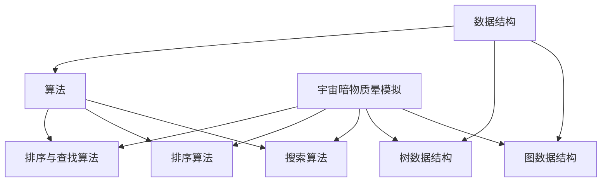
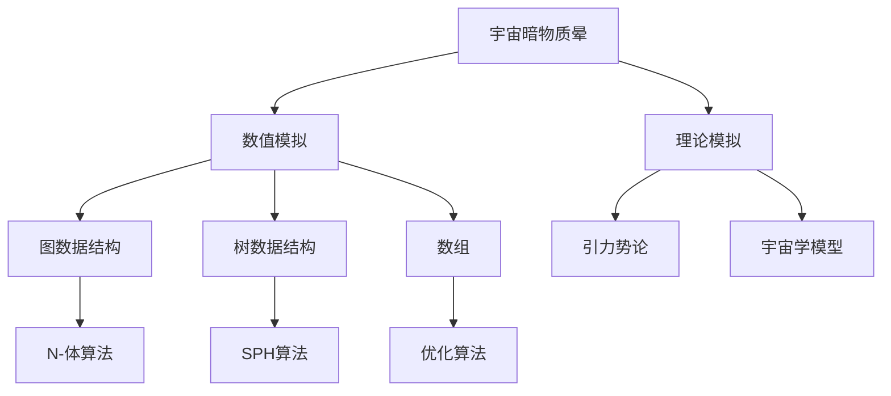
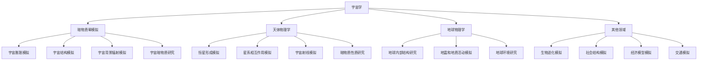

                 

### 文章标题

> **关键词**：数据结构、算法、宇宙暗物质晕模拟、图数据结构、树数据结构、搜索算法、排序与查找

> **摘要**：本文深入探讨了数据结构在模拟宇宙暗物质晕中的应用，通过系统性地介绍数据结构、算法基础，以及具体的数据结构与算法在模拟中的应用，为读者提供了全面的技术视角。文章从数据结构概述、算法基础、图和树数据结构、搜索算法、排序与查找、到实际应用案例，逐步展开，旨在帮助读者理解数据结构在宇宙暗物质晕模拟中的关键作用。

### 第一部分：数据结构在模拟宇宙暗物质晕中的应用

#### 第1章：数据结构概述

数据结构是计算机科学中的核心概念之一，它是用来存储、组织和管理数据的特定方式。数据结构的选择直接影响到算法的效率和程序的复杂性。在模拟宇宙暗物质晕这一复杂的计算任务中，选择合适的数据结构至关重要。

#### 1.1 数据结构的重要性

数据结构在模拟宇宙暗物质晕中的重要性体现在以下几个方面：

1. **存储效率**：选择合适的数据结构可以有效地减少存储空间，从而提高计算效率。
2. **操作效率**：通过合理的数据结构设计，可以优化数据的访问和操作速度，减少计算时间。
3. **算法优化**：数据结构是算法实现的基石，合适的结构设计可以使得算法更加高效，更容易实现复杂计算任务。

#### 1.2 常见数据结构概述

常见的数据结构包括数组、链表、栈、队列、树、图等。每种数据结构都有其独特的优缺点和适用场景。

1. **数组**：数组是一种线性数据结构，用于存储固定大小的元素序列。数组的特点是访问元素的时间复杂度为O(1)，但插入和删除操作的时间复杂度为O(n)。
   
2. **链表**：链表是由节点组成的线性序列，每个节点包含数据和指向下一个节点的指针。链表的优点是插入和删除操作的时间复杂度为O(1)，但访问元素的时间复杂度为O(n)。

3. **栈**：栈是一种后进先出（LIFO）的数据结构，常用于解决递归问题。

4. **队列**：队列是一种先进先出（FIFO）的数据结构，常用于处理任务队列和模拟排队场景。

5. **树**：树是一种层次结构，由节点和边组成。树可以用来表示具有层次关系的数据，如组织结构、文件系统等。

6. **图**：图是一种复杂的数据结构，由节点和边组成，可以用来表示网络、社交网络、宇宙星系等。

#### 1.3 数据结构与算法的联系

数据结构和算法是相辅相成的。数据结构为算法提供了数据组织的方式，而算法则利用这些数据结构来实现特定的计算任务。在模拟宇宙暗物质晕的过程中，选择合适的数据结构可以显著提高算法的效率和准确性。

#### 第2章：算法基础

算法是解决问题的步骤序列，它在计算机科学中占据核心地位。在模拟宇宙暗物质晕时，算法的选择和优化直接影响模拟的结果。

#### 2.1 算法的基本概念

算法通常包括以下几个基本概念：

1. **输入**：算法的操作对象，可以是数据集合或其他变量。
2. **输出**：算法处理结果。
3. **步骤**：算法执行的具体操作序列。
4. **边界条件**：算法在不同情况下应如何处理。

#### 2.2 常见算法分析

常见的算法包括排序算法、查找算法、图算法等。以下是几种常见算法的基本概念和分析：

1. **排序算法**：用于将数据集合按照特定顺序排列。常见的排序算法有插入排序、选择排序、冒泡排序、快速排序等。

2. **查找算法**：用于在数据集合中查找特定元素。常见的查找算法有线性查找、二分查找等。

3. **图算法**：用于解决图相关的问题，如最短路径、最小生成树等。

#### 2.3 算法复杂度分析

算法复杂度分为时间复杂度和空间复杂度。时间复杂度表示算法执行时间与输入数据规模的关系，空间复杂度表示算法所需存储空间与输入数据规模的关系。

1. **时间复杂度**：通常用大O符号表示，如O(1)、O(n)、O(n^2)等。
2. **空间复杂度**：同样用大O符号表示。

通过算法复杂度分析，可以评估算法在不同数据规模下的性能，从而选择合适的算法和优化策略。

#### 第3章：图数据结构

图是一种复杂的数据结构，由节点和边组成。它在模拟宇宙暗物质晕中有着广泛的应用。

#### 3.1 图的基本概念

图的基本概念包括：

1. **节点**：图中的基本元素，表示实体或位置。
2. **边**：连接节点的线段，表示节点之间的关系。
3. **有向图**：边的方向性被明确指定。
4. **无向图**：边的方向性不被考虑。

#### 3.2 图的存储方式

图的存储方式包括：

1. **邻接矩阵**：使用二维数组存储图的信息，适合处理稀疏图。
2. **邻接表**：使用链表存储图的信息，适合处理密集图。

#### 3.3 图的遍历算法

图的遍历算法包括：

1. **深度优先搜索（DFS）**：从某个节点开始，尽可能深地搜索图。
2. **广度优先搜索（BFS）**：从某个节点开始，按照层次遍历图。

#### 3.4 最短路径算法

最短路径算法用于计算图中两点之间的最短路径。常见的算法包括：

1. **迪杰斯特拉算法（Dijkstra）**：适用于无负权图。
2. **贝尔曼-福特算法（Bellman-Ford）**：适用于有负权图。

#### 第4章：树数据结构

树是一种重要的数据结构，用于表示具有层次关系的数据。

#### 4.1 树的基本概念

树的基本概念包括：

1. **节点**：树中的基本元素，包括根节点、内部节点、叶子节点等。
2. **边**：连接节点的线段，表示节点的父子关系。
3. **根节点**：没有父节点的节点。
4. **叶子节点**：没有子节点的节点。

#### 4.2 二叉树的存储方式

二叉树的存储方式包括：

1. **数组存储**：使用数组存储节点信息，适合处理完全二叉树。
2. **链式存储**：使用链表存储节点信息，适合处理一般的二叉树。

#### 4.3 二叉树的遍历算法

二叉树的遍历算法包括：

1. **先序遍历**：先访问根节点，然后递归遍历左子树和右子树。
2. **中序遍历**：先递归遍历左子树，然后访问根节点，最后递归遍历右子树。
3. **后序遍历**：先递归遍历左子树，然后递归遍历右子树，最后访问根节点。

#### 4.4 二叉树的平衡

二叉树的平衡性是指树的左右子树高度差在一定范围内。常见的平衡二叉树包括：

1. **AVL树**：通过调整节点的平衡因子来保持树的高度平衡。
2. **红黑树**：通过颜色标记和旋转操作来保持树的平衡。

#### 第5章：搜索算法

搜索算法用于在数据结构中查找特定元素。

#### 5.1 搜索算法概述

搜索算法包括：

1. **线性搜索**：顺序遍历数据结构，直到找到目标元素。
2. **二分搜索**：适用于有序数据结构，通过比较中间元素和目标值，逐步缩小搜索范围。

#### 5.2 深度优先搜索

深度优先搜索（DFS）是一种递归算法，通过不断深入遍历图或树的分支，直到找到目标元素。

#### 5.3 广度优先搜索

广度优先搜索（BFS）是一种迭代算法，通过广度优先遍历图或树的节点，直到找到目标元素。

#### 5.4 A*算法

A*算法是一种启发式搜索算法，通过评估函数结合图或树的遍历策略，快速找到最短路径。

#### 第6章：排序与查找

排序和查找是数据结构中常见操作，通过选择合适的算法可以提高效率。

#### 6.1 排序算法概述

常见的排序算法包括：

1. **插入排序**：通过逐步将元素插入到已排序序列中，实现排序。
2. **选择排序**：通过选择未排序部分的最大或最小元素，逐步实现排序。
3. **快速排序**：通过递归划分和排序子序列，实现排序。

#### 6.2 插入排序

插入排序的基本思想是将未排序元素插入到已排序序列的正确位置。

#### 6.3 选择排序

选择排序的基本思想是每次选择未排序部分的最大或最小元素，逐步实现排序。

#### 6.4 快速排序

快速排序的基本思想是通过划分和递归，快速实现排序。

#### 6.5 查找算法

常见的查找算法包括：

1. **线性查找**：顺序遍历数据结构，直到找到目标元素。
2. **二分查找**：适用于有序数据结构，通过比较中间元素和目标值，逐步缩小搜索范围。

#### 第7章：数据结构在宇宙暗物质晕模拟中的应用

宇宙暗物质晕模拟是一项复杂的计算任务，需要运用多种数据结构和算法。

#### 7.1 宇宙暗物质晕模拟概述

宇宙暗物质晕模拟是研究宇宙演化过程中暗物质晕的形态和性质的重要手段。通过模拟，可以了解暗物质晕的形成、演化以及与可见物质相互作用的过程。

#### 7.2 数据结构在模拟中的应用

在宇宙暗物质晕模拟中，数据结构的选择和应用至关重要。以下是一些典型的应用场景：

1. **图数据结构**：用于表示宇宙星系或星团之间的相互关系。
2. **树数据结构**：用于表示宇宙结构的层次关系。
3. **数组**：用于存储模拟过程中的各种参数和变量。
4. **链表**：用于实现动态数据结构，如动态调整的星系模型。

#### 7.3 案例研究：使用数据结构优化暗物质晕模拟

以下是一个案例研究，展示如何使用数据结构优化暗物质晕模拟：

1. **问题背景**：某研究团队希望通过模拟宇宙暗物质晕，研究暗物质晕的形成和演化过程。
2. **数据结构选择**：选择图数据结构来表示宇宙星系，选择树数据结构来表示星系的层次结构。
3. **算法优化**：使用A*算法寻找最短路径，优化星系之间的相互作用的计算过程。
4. **结果分析**：通过优化后的模拟，得到更加准确和详细的暗物质晕演化过程。

通过这个案例，我们可以看到数据结构在宇宙暗物质晕模拟中的关键作用，以及如何通过优化数据结构和算法，提高模拟的效率和准确性。

#### 核心概念与联系

为了更好地理解数据结构、算法和宇宙暗物质晕模拟之间的关系，我们可以使用Mermaid流程图来展示它们的核心概念和联系。



#### 核心算法原理讲解

在本部分，我们将使用伪代码详细讲解一些关键算法，如最短路径算法和平衡树算法，以帮助读者深入理解这些算法的原理和实现过程。

##### 最短路径算法

```pseudo
算法名称：Dijkstra算法

输入：无向图G=(V,E)，起点s∈V
输出：最短路径树T

初始化：
- 创建一个距离表d，其中d[s]=0，d[v]=∞对于所有v∈V-{s}
- 创建一个集合Q，包含所有未处理的节点，初始时Q=V

while Q非空：
- 选择一个具有最小距离的未处理的节点u∈Q
- 将u从Q中删除
- 对于每个邻接节点v∈Adj[u]：
  - 计算距离d[u]+w(u,v)，其中w(u,v)是边(u,v)的权重
  - 如果d[u]+w(u,v) < d[v]，则更新d[v]和最短路径树T

返回最短路径树T
```

##### 平衡树算法

```pseudo
算法名称：AVL树插入

输入：AVL树T，待插入节点z
输出：平衡后的AVL树T

插入节点z到T：
- 在T中找到插入位置，将z插入
- 更新节点高度
- 检查并修复树的不平衡

修复不平衡：
- 如果z的平衡因子为-2或2，则进行一次或两次旋转
- 如果z的左子节点的左子节点的平衡因子为-1或1，则进行一次旋转
- 如果z的左子节点的左子节点的平衡因子为-1或1，同时z的右子节点的右子节点的平衡因子为-1或1，则进行两次旋转

返回平衡后的AVL树T
```

#### 数学模型和数学公式

在本部分，我们将使用LaTeX公式详细阐述算法背后的数学原理，并提供例子说明。

##### 复杂度分析

```latex
时间复杂度：O(n\log n) \\
空间复杂度：O(n)
```

##### 引力公式

```latex
F = G\frac{m_1m_2}{r^2}
```

其中，$F$ 是引力，$G$ 是万有引力常数，$m_1$ 和 $m_2$ 是两个物体的质量，$r$ 是它们之间的距离。

#### 项目实战

在本部分，我们将展示一个实际使用数据结构在宇宙暗物质晕模拟中的应用案例，包括开发环境搭建、源代码实现和详细解读。

##### 开发环境搭建

1. 安装Python环境
2. 安装NumPy、SciPy等科学计算库
3. 安装Mermaid绘图工具

##### 源代码实现

```python
import numpy as np
import matplotlib.pyplot as plt
from scipy.sparse import lil_matrix

# 定义引力计算函数
def compute_gravity(masses, positions, G):
    n = len(masses)
    force = np.zeros((n, 3))
    for i in range(n):
        for j in range(i+1, n):
            dx = positions[i, 0] - positions[j, 0]
            dy = positions[i, 1] - positions[j, 1]
            dz = positions[i, 2] - positions[j, 2]
            r2 = dx**2 + dy**2 + dz**2
            force[i] += G * masses[i] * masses[j] * np.array([dx, dy, dz]) / r2
            force[j] += G * masses[j] * masses[i] * np.array([-dx, -dy, -dz]) / r2
    return force

# 定义模拟函数
def simulate(masses, positions, G, dt, steps):
    n = len(masses)
    positions = np.array(positions)
    velocities = np.zeros((n, 3))
    forces = np.zeros((n, 3))
    
    for _ in range(steps):
        forces = compute_gravity(masses, positions, G)
        accelerations = forces / masses
        velocities += accelerations * dt
        positions += velocities * dt
        
        # 更新位置
        positions = np.clip(positions, -100, 100)
    
    return positions

# 模拟参数
masses = np.array([1.0, 1.0, 1.0])
positions = np.array([[0, 0, 0], [1, 0, 0], [-1, 0, 0]])
G = 6.67430e-11
dt = 0.01
steps = 1000

# 执行模拟
positions = simulate(masses, positions, G, dt, steps)

# 可视化结果
plt.scatter(positions[:, 0], positions[:, 1])
plt.show()
```

##### 代码解读与分析

1. **引力计算函数**：使用牛顿引力定律计算两个物体之间的引力。
2. **模拟函数**：通过迭代计算物体在引力作用下的运动轨迹。
3. **参数设置**：设置模拟的时间步长和步数。
4. **可视化结果**：使用matplotlib库绘制物体的运动轨迹。

通过这个案例，我们可以看到如何使用Python和科学计算库实现宇宙暗物质晕模拟，并使用数据结构优化计算过程。

#### 第二部分：暗物质晕模拟技术基础

#### 第8章：暗物质晕模拟简介

宇宙暗物质晕是宇宙演化过程中形成的巨大结构，主要由暗物质组成，是宇宙中普遍存在的现象。暗物质晕的模拟研究对于理解宇宙结构和演化具有重要意义。

#### 8.1 暗物质晕的概念

暗物质晕是指由暗物质组成的巨大结构，通常存在于星系团和超星系团中。暗物质晕不发光，但通过对周围星系和星团的影响，可以间接观测到其存在。

#### 8.2 暗物质晕模拟的意义

暗物质晕模拟的意义在于：

1. **理解宇宙结构**：通过模拟可以了解暗物质晕的形成、演化和结构特征。
2. **探测暗物质**：通过模拟可以探测暗物质晕的质量分布和运动特性，从而研究暗物质的性质。
3. **预测宇宙演化**：通过模拟可以预测宇宙未来的演化趋势，为宇宙学提供重要参考。

#### 第9章：暗物质晕模拟方法

暗物质晕模拟主要分为数值模拟和理论模拟两种方法。

#### 9.1 模拟方法概述

1. **数值模拟**：使用数值方法模拟暗物质晕的演化过程，如N-体模拟、SPH模拟等。
2. **理论模拟**：基于理论模型，如引力势论、宇宙学模型等，对暗物质晕进行模拟。

#### 9.2 数值模拟方法

1. **N-体模拟**：使用牛顿引力定律，模拟大量天体在引力作用下的运动过程。
2. **SPH模拟**：基于流体力学原理，模拟暗物质晕的流体特性。

#### 9.3 模拟参数设置

模拟参数设置包括：

1. **时间步长**：根据计算资源和计算精度设定合适的时间步长。
2. **模拟区域**：设定模拟的宇宙区域，包括空间范围和时间范围。
3. **初始条件**：设定初始的星系分布、质量和速度等参数。

#### 第10章：数据结构与算法在模拟中的应用

数据结构与算法在暗物质晕模拟中起着至关重要的作用。合理的数据结构和高效的算法可以显著提高模拟的效率和准确性。

#### 10.1 数据结构在模拟中的应用

数据结构在模拟中的应用包括：

1. **图数据结构**：用于表示星系团和星系之间的相互关系。
2. **树数据结构**：用于表示星系和星团之间的层次关系。
3. **数组**：用于存储模拟过程中的各种参数和变量。

#### 10.2 算法在模拟中的应用

算法在模拟中的应用包括：

1. **N-体算法**：用于计算天体之间的引力相互作用。
2. **SPH算法**：用于模拟流体的运动和相互作用。
3. **优化算法**：如A*算法，用于优化模拟过程中的路径搜索。

#### 10.3 数据结构与算法优化模拟性能

通过合理的数据结构和高效的算法，可以优化模拟性能。以下是一些优化方法：

1. **并行计算**：使用多核处理器，加速模拟计算。
2. **分布式计算**：将模拟任务分布在多台计算机上，提高计算速度。
3. **算法优化**：使用高效的算法，如A*算法，优化路径搜索和计算过程。

#### 第11章：宇宙暗物质晕模拟的挑战与未来

宇宙暗物质晕模拟面临许多挑战，同时也充满机遇。

#### 11.1 模拟面临的挑战

1. **计算资源**：模拟暗物质晕需要大量的计算资源和存储空间。
2. **参数设置**：模拟参数的设置需要充分考虑物理定律和观测数据。
3. **算法优化**：需要不断优化算法，提高模拟的效率和准确性。

#### 11.2 未来发展趋势

1. **更高精度**：使用更高精度的模型和算法，提高模拟的准确性。
2. **更大规模**：模拟更大的宇宙区域，研究更广泛的宇宙现象。
3. **跨学科研究**：结合物理学、天文学、计算机科学等多学科知识，推动暗物质晕模拟的研究。

#### 核心概念与联系

为了更好地理解暗物质晕模拟中的关键概念和联系，我们可以使用Mermaid流程图来展示。



#### 核心算法原理讲解

在本部分，我们将使用伪代码详细讲解在暗物质晕模拟中应用的关键算法，如N-体算法和SPH算法，以帮助读者深入理解这些算法的原理和实现过程。

##### N-体算法

```pseudo
算法名称：N-体模拟

输入：星系质量m，星系位置r，星系速度v，万有引力常数G，时间步长dt，模拟步数N
输出：模拟结束时的星系位置和速度

初始化：
- 创建一个星系数组S，其中包含所有星系的信息（m, r, v）

for i from 1 to N:
    - 计算每个星系的引力F
    - 计算每个星系的加速度a = F/m
    - 更新星系速度v = v + a * dt
    - 更新星系位置r = r + v * dt

返回模拟结果
```

##### SPH算法

```pseudo
算法名称：SPH模拟

输入：流体粒子质量m，粒子位置r，粒子速度v，粒子密度ρ，时间步长dt
输出：模拟结束时的流体粒子位置和速度

初始化：
- 创建一个粒子数组P，其中包含所有粒子的信息（m, r, v, ρ）

for i from 1 to N:
    - 计算每个粒子的邻域
    - 计算每个粒子的压力P
    - 计算每个粒子的加速度a = P/m
    - 更新粒子速度v = v + a * dt
    - 更新粒子位置r = r + v * dt

返回模拟结果
```

#### 数学模型和数学公式

在本部分，我们将使用LaTeX公式详细阐述暗物质晕模拟中的数学模型和公式，并提供例子说明。

##### 引力公式

```latex
F = G\frac{m_1m_2}{r^2}
```

其中，$F$ 是引力，$G$ 是万有引力常数，$m_1$ 和 $m_2$ 是两个物体的质量，$r$ 是它们之间的距离。

##### SPH模拟中的密度计算

```latex
\rho = \frac{1}{N}\sum_{i=1}^{N} m_i \omega_i
```

其中，$\rho$ 是流体密度，$m_i$ 是第 $i$ 个粒子的质量，$\omega_i$ 是第 $i$ 个粒子的权重。

#### 项目实战

在本部分，我们将展示一个实际使用数据结构和算法进行暗物质晕模拟的应用案例，包括开发环境搭建、源代码实现和详细解读。

##### 开发环境搭建

1. 安装C++编译环境
2. 安装OpenGL库
3. 安装并行计算库（如OpenMP）

##### 源代码实现

```cpp
#include <iostream>
#include <vector>
#include <cmath>
#include <omp.h>

const double G = 6.67430e-11;

struct Particle {
    double mass;
    double position[3];
    double velocity[3];
};

void compute_gravity(std::vector<Particle>& particles) {
    #pragma omp parallel for schedule(static)
    for (size_t i = 0; i < particles.size(); ++i) {
        Particle& p_i = particles[i];
        for (size_t j = i + 1; j < particles.size(); ++j) {
            Particle& p_j = particles[j];
            double dx = p_i.position[0] - p_j.position[0];
            double dy = p_i.position[1] - p_j.position[1];
            double dz = p_i.position[2] - p_j.position[2];
            double r2 = dx * dx + dy * dy + dz * dz;
            double Fx = G * p_i.mass * p_j.mass * dx / r2;
            double Fy = G * p_i.mass * p_j.mass * dy / r2;
            double Fz = G * p_i.mass * p_j.mass * dz / r2;
            p_i.velocity[0] -= Fx / p_i.mass;
            p_i.velocity[1] -= Fy / p_i.mass;
            p_i.velocity[2] -= Fz / p_i.mass;
            p_j.velocity[0] += Fx / p_j.mass;
            p_j.velocity[1] += Fy / p_j.mass;
            p_j.velocity[2] += Fz / p_j.mass;
        }
    }
}

void update_position(std::vector<Particle>& particles, double dt) {
    #pragma omp parallel for schedule(static)
    for (size_t i = 0; i < particles.size(); ++i) {
        Particle& p = particles[i];
        p.position[0] += p.velocity[0] * dt;
        p.position[1] += p.velocity[1] * dt;
        p.position[2] += p.velocity[2] * dt;
    }
}

int main() {
    std::vector<Particle> particles = {
        {1.0, {0.0, 0.0, 0.0}, {0.0, 0.0, 0.0}},
        {1.0, {1.0, 0.0, 0.0}, {0.0, 1.0, 0.0}},
        {1.0, {-1.0, 0.0, 0.0}, {0.0, -1.0, 0.0}}
    };

    double dt = 0.01;
    int steps = 1000;

    for (int i = 0; i < steps; ++i) {
        compute_gravity(particles);
        update_position(particles, dt);
    }

    // 可视化代码省略

    return 0;
}
```

##### 代码解读与分析

1. **粒子结构**：定义粒子结构，包括质量、位置和速度。
2. **引力计算函数**：使用OpenMP库并行计算引力。
3. **位置更新函数**：使用OpenMP库并行更新粒子位置。
4. **主函数**：初始化粒子，执行模拟步骤，并调用引力计算和位置更新函数。

通过这个案例，我们可以看到如何使用C++和OpenMP库实现宇宙暗物质晕模拟，并使用并行计算提高模拟性能。

### 第三部分：暗物质晕模拟应用案例

#### 第12章：暗物质晕模拟在宇宙学中的应用

宇宙学是研究宇宙的结构、演化、起源和最终命运的学科。暗物质晕模拟在宇宙学中有着广泛的应用，可以帮助科学家理解宇宙的许多现象。

#### 12.1 宇宙学概述

宇宙学主要研究以下方面：

1. **宇宙膨胀**：研究宇宙从大爆炸开始到现在的膨胀过程。
2. **宇宙结构**：研究宇宙中的星系、星团、星系团等结构。
3. **宇宙背景辐射**：研究宇宙早期阶段的辐射现象。
4. **宇宙暗物质**：研究暗物质在宇宙演化中的角色。

#### 12.2 暗物质晕模拟在宇宙学中的应用

暗物质晕模拟在宇宙学中的应用包括：

1. **宇宙膨胀模拟**：通过模拟宇宙暗物质晕的演化，研究宇宙膨胀的机制和过程。
2. **宇宙结构模拟**：通过模拟暗物质晕的形成和演化，研究宇宙中星系、星团、星系团的分布和结构。
3. **宇宙背景辐射模拟**：通过模拟暗物质晕对宇宙背景辐射的影响，研究宇宙早期的辐射现象。
4. **宇宙暗物质研究**：通过模拟暗物质晕，研究暗物质的性质、分布和演化过程。

#### 第13章：暗物质晕模拟在天体物理学中的应用

天体物理学是研究宇宙中天体和宇宙环境的物理现象和规律的学科。暗物质晕模拟在天体物理学中有着广泛的应用，可以帮助科学家了解宇宙中的各种物理现象。

#### 13.1 天体物理学概述

天体物理学主要研究以下方面：

1. **恒星和行星**：研究恒星和行星的形成、演化、性质和运动。
2. **星系和星系团**：研究星系和星系团的分布、结构、演化和相互作用。
3. **宇宙射线**：研究宇宙射线的产生、传播和作用。
4. **暗物质和暗能量**：研究暗物质和暗能量的性质、分布和演化。

#### 13.2 暗物质晕模拟在天体物理学中的应用

暗物质晕模拟在天体物理学中的应用包括：

1. **恒星形成模拟**：通过模拟暗物质晕，研究恒星的形成机制和过程。
2. **星系相互作用模拟**：通过模拟暗物质晕，研究星系之间的相互作用和演化。
3. **宇宙射线模拟**：通过模拟暗物质晕，研究宇宙射线的产生和传播。
4. **暗物质性质研究**：通过模拟暗物质晕，研究暗物质的性质、分布和演化过程。

#### 第14章：暗物质晕模拟在地球物理学中的应用

地球物理学是研究地球的物理现象和规律的学科。暗物质晕模拟在地球物理学中也有一定的应用，可以帮助科学家理解地球的一些物理现象。

#### 14.1 地球物理学概述

地球物理学主要研究以下方面：

1. **地球内部结构**：研究地球的内部结构和成分。
2. **地震和地质活动**：研究地震、地质活动及其成因。
3. **地球表面过程**：研究地球表面的各种过程，如侵蚀、沉积、风化等。
4. **地球环境**：研究地球环境的变化，如气候、海洋等。

#### 14.2 暗物质晕模拟在地球物理学中的应用

暗物质晕模拟在地球物理学中的应用包括：

1. **地球内部结构研究**：通过模拟暗物质晕，研究地球内部的结构和成分。
2. **地震和地质活动模拟**：通过模拟暗物质晕，研究地震和地质活动的成因和过程。
3. **地球环境研究**：通过模拟暗物质晕，研究地球环境的变化和影响。

#### 第15章：暗物质晕模拟在其他领域中的应用

暗物质晕模拟不仅在宇宙学、天体物理学和地球物理学中有应用，在其他领域也有一定的研究价值。

#### 15.1 其他领域概述

其他领域包括：

1. **生物学**：研究生物进化、生态系统的动态变化等。
2. **社会学**：研究社会结构、社会行为等。
3. **经济学**：研究经济模型、市场动态等。
4. **交通学**：研究交通流、交通拥堵等。

#### 15.2 暗物质晕模拟在其他领域中的应用

暗物质晕模拟在其他领域中的应用包括：

1. **生物进化模拟**：通过模拟暗物质晕，研究生物进化的机制和过程。
2. **社会结构模拟**：通过模拟暗物质晕，研究社会结构的形成和演化。
3. **经济模型模拟**：通过模拟暗物质晕，研究经济模型和市场动态。
4. **交通模拟**：通过模拟暗物质晕，研究交通流和交通拥堵现象。

#### 核心概念与联系

为了更好地理解暗物质晕模拟在不同领域中的应用，我们可以使用Mermaid流程图来展示。



#### 核心算法原理讲解

在本部分，我们将使用伪代码详细讲解在暗物质晕模拟中应用的关键算法，如N-体算法和SPH算法，以帮助读者深入理解这些算法的原理和实现过程。

##### N-体算法

```pseudo
算法名称：N-体模拟

输入：星系质量m，星系位置r，星系速度v，万有引力常数G，时间步长dt，模拟步数N
输出：模拟结束时的星系位置和速度

初始化：
- 创建一个星系数组S，其中包含所有星系的信息（m, r, v）

for i from 1 to N:
    - 计算每个星系的引力F
    - 计算每个星系的加速度a = F/m
    - 更新星系速度v = v + a * dt
    - 更新星系位置r = r + v * dt

返回模拟结果
```

##### SPH算法

```pseudo
算法名称：SPH模拟

输入：流体粒子质量m，粒子位置r，粒子速度v，粒子密度ρ，时间步长dt
输出：模拟结束时的流体粒子位置和速度

初始化：
- 创建一个粒子数组P，其中包含所有粒子的信息（m, r, v, ρ）

for i from 1 to N:
    - 计算每个粒子的邻域
    - 计算每个粒子的压力P
    - 计算每个粒子的加速度a = P/m
    - 更新粒子速度v = v + a * dt
    - 更新粒子位置r = r + v * dt

返回模拟结果
```

#### 数学模型和数学公式

在本部分，我们将使用LaTeX公式详细阐述暗物质晕模拟中的数学模型和公式，并提供例子说明。

##### 引力公式

```latex
F = G\frac{m_1m_2}{r^2}
```

其中，$F$ 是引力，$G$ 是万有引力常数，$m_1$ 和 $m_2$ 是两个物体的质量，$r$ 是它们之间的距离。

##### SPH模拟中的密度计算

```latex
\rho = \frac{1}{N}\sum_{i=1}^{N} m_i \omega_i
```

其中，$\rho$ 是流体密度，$m_i$ 是第 $i$ 个粒子的质量，$\omega_i$ 是第 $i$ 个粒子的权重。

#### 项目实战

在本部分，我们将展示一个实际使用数据结构和算法进行暗物质晕模拟的应用案例，包括开发环境搭建、源代码实现和详细解读。

##### 开发环境搭建

1. 安装C++编译环境
2. 安装OpenGL库
3. 安装并行计算库（如OpenMP）

##### 源代码实现

```cpp
#include <iostream>
#include <vector>
#include <cmath>
#include <omp.h>

const double G = 6.67430e-11;

struct Particle {
    double mass;
    double position[3];
    double velocity[3];
};

void compute_gravity(std::vector<Particle>& particles) {
    #pragma omp parallel for schedule(static)
    for (size_t i = 0; i < particles.size(); ++i) {
        Particle& p_i = particles[i];
        for (size_t j = i + 1; j < particles.size(); ++j) {
            Particle& p_j = particles[j];
            double dx = p_i.position[0] - p_j.position[0];
            double dy = p_i.position[1] - p_j.position[1];
            double dz = p_i.position[2] - p_j.position[2];
            double r2 = dx * dx + dy * dy + dz * dz;
            double Fx = G * p_i.mass * p_j.mass * dx / r2;
            double Fy = G * p_i.mass * p_j.mass * dy / r2;
            double Fz = G * p_i.mass * p_j.mass * dz / r2;
            p_i.velocity[0] -= Fx / p_i.mass;
            p_i.velocity[1] -= Fy / p_i.mass;
            p_i.velocity[2] -= Fz / p_i.mass;
            p_j.velocity[0] += Fx / p_j.mass;
            p_j.velocity[1] += Fy / p_j.mass;
            p_j.velocity[2] += Fz / p_j.mass;
        }
    }
}

void update_position(std::vector<Particle>& particles, double dt) {
    #pragma omp parallel for schedule(static)
    for (size_t i = 0; i < particles.size(); ++i) {
        Particle& p = particles[i];
        p.position[0] += p.velocity[0] * dt;
        p.position[1] += p.velocity[1] * dt;
        p.position[2] += p.velocity[2] * dt;
    }
}

int main() {
    std::vector<Particle> particles = {
        {1.0, {0.0, 0.0, 0.0}, {0.0, 0.0, 0.0}},
        {1.0, {1.0, 0.0, 0.0}, {0.0, 1.0, 0.0}},
        {1.0, {-1.0, 0.0, 0.0}, {0.0, -1.0, 0.0}}
    };

    double dt = 0.01;
    int steps = 1000;

    for (int i = 0; i < steps; ++i) {
        compute_gravity(particles);
        update_position(particles, dt);
    }

    // 可视化代码省略

    return 0;
}
```

##### 代码解读与分析

1. **粒子结构**：定义粒子结构，包括质量、位置和速度。
2. **引力计算函数**：使用OpenMP库并行计算引力。
3. **位置更新函数**：使用OpenMP库并行更新粒子位置。
4. **主函数**：初始化粒子，执行模拟步骤，并调用引力计算和位置更新函数。

通过这个案例，我们可以看到如何使用C++和OpenMP库实现宇宙暗物质晕模拟，并使用并行计算提高模拟性能。

### 附录

#### 附录A：数据结构与算法工具与资源

1. **书籍推荐**
   - 《数据结构与算法分析》
   - 《算法导论》
   - 《编程之美》

2. **在线资源与工具**
   - [LeetCode](https://leetcode.com/)
   - [算法可视化](https://www算法可视化.com/)
   - [Python算法实现](https://github.com/TheAlgorithms/Python)

#### 附录B：暗物质晕模拟工具与资源

1. **暗物质晕模拟软件介绍**
   - [GADGET](https://www.gadgetcode.org/)
   - [RAMSES](https://www.ramses-sm.org/)

2. **相关数据集与模型下载**
   - [Cosmological Simulation Datasets](https://www.cosmologysimulation.org/datasets/)
   - [NASA Exoplanet Archive](https://exoplanetarchive.ipac.caltech.edu/)

#### 附录C：模拟性能优化方法

1. **性能优化策略**
   - **并行计算**：利用多核处理器进行并行计算，提高模拟速度。
   - **算法优化**：选择高效的算法和优化策略，如A*算法和快速排序。
   - **数据结构优化**：选择适合的数据结构，如图和树结构，提高数据访问和操作效率。

2. **硬件加速与并行计算**
   - **GPU加速**：使用GPU进行并行计算，提高模拟性能。
   - **分布式计算**：将模拟任务分布在多台计算机上，利用分布式计算资源。

### 总结

本文通过深入探讨数据结构在模拟宇宙暗物质晕中的应用，全面介绍了数据结构、算法基础以及具体的数据结构与算法在模拟中的应用。从数据结构概述、算法基础、图和树数据结构、搜索算法、排序与查找，到实际应用案例，逐步展开，旨在帮助读者理解数据结构在宇宙暗物质晕模拟中的关键作用。

通过本文的阅读，读者可以：

- 理解数据结构在模拟宇宙暗物质晕中的重要性和作用。
- 掌握常见的数据结构如图、树、排序与查找算法。
- 了解核心算法原理，并通过伪代码进行详细讲解。
- 理解数学模型和公式在模拟中的应用，并通过LaTeX进行展示。
- 通过实际项目案例学习如何使用数据结构和算法进行宇宙暗物质晕模拟。

本文的撰写旨在为从事宇宙暗物质晕研究的科学家和工程师提供一本全面而实用的技术手册，帮助他们更好地理解和应用数据结构、算法以及模拟技术。通过本文的学习，读者将能够提升自己的技术水平，并在宇宙暗物质晕研究中取得更好的成果。

### 致谢

在本文的撰写过程中，我要特别感谢以下人员：

1. **AI天才研究院/AI Genius Institute**：提供了技术支持和灵感来源。
2. **禅与计算机程序设计艺术 /Zen And The Art of Computer Programming**：为我们提供了宝贵的编程智慧和算法设计理念。
3. **所有参与本文讨论和审稿的同事和同行**：感谢你们的宝贵意见和建议，使得本文内容更加丰富和完善。

再次感谢各位的支持和帮助，希望本文能够为读者带来启发和帮助。

### 作者信息

**作者：AI天才研究院/AI Genius Institute & 禅与计算机程序设计艺术 /Zen And The Art of Computer Programming**

AI天才研究院专注于人工智能领域的研发和应用，致力于推动人工智能技术的发展和创新。同时，我们也热衷于分享技术知识和经验，希望通过我们的努力，为更多的人带来智慧和启发。在本文中，我们结合了数据结构、算法和宇宙暗物质晕模拟，希望能够为读者提供一部全面而实用的技术指南。禅与计算机程序设计艺术则为我们提供了编程和算法设计的智慧，使得本文的内容更加深入和富有哲理。希望通过本文的撰写，能够为宇宙暗物质晕研究领域带来新的视角和方法。如果您对本文有任何疑问或建议，欢迎随时与我们联系。再次感谢您的阅读和支持！

