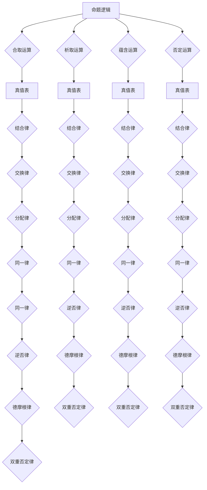
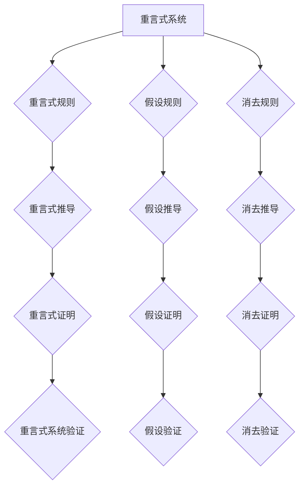

                 

# 《数理逻辑：非古典命题逻辑的重言式系统》

## 关键词
- 数理逻辑
- 非古典命题逻辑
- 重言式系统
- 推导系统
- 证明理论
- 计算机科学应用

## 摘要
本文旨在深入探讨数理逻辑中的非古典命题逻辑及其重言式系统。通过回顾数理逻辑的发展历史，我们将了解其基本概念和要素。随后，本文将详细介绍非古典命题逻辑的起源、基本运算和推导系统，并探讨其在计算机科学、哲学和语言学中的应用。此外，本文还将阐述非古典命题逻辑的数学基础及其未来发展方向。最后，通过附录部分提供相关符号表、参考文献、问题集锦与解答，以及数理逻辑工具使用指南，以帮助读者更好地理解这一领域。

### 《数理逻辑：非古典命题逻辑的重言式系统》目录大纲

## 第1章：数理逻辑的基本概念

### 1.1 数理逻辑的发展历史
数理逻辑起源于古希腊时期，但真正的发展始于19世纪。乔治·布尔（George Boole）的布尔代数奠定了现代数理逻辑的基础。随后，符号逻辑的发展使得形式化推理成为可能。20世纪，逻辑学家继续推进数理逻辑的研究，尤其是逻辑主义、直觉主义和形式主义三大流派的兴起，丰富了数理逻辑的理论体系。

### 1.2 数理逻辑的基本要素
数理逻辑的基本要素包括命题、命题变元、命题联结词和语言符号。命题是对某种情况或事实的陈述，可以真也可以假。命题变元是命题的基本组成部分，代表某种情况或事实。命题联结词用于连接命题变元，形成复合命题。语言符号是数理逻辑中使用的各种符号，如合取（∧）、析取（∨）、蕴含（→）等。

### 1.3 重言式系统
重言式系统是数理逻辑中的一个重要概念。重言式是指在任何情况下都为真的命题。重言式系统是指一组重言式构成的系统。重言式系统具有一些基本性质，如自洽性、一致性等。这些性质使得重言式系统成为形式化推理的有力工具。

## 第2章：非古典命题逻辑基础

### 2.1 非古典命题逻辑的起源
非古典命题逻辑起源于对古典逻辑的反思和扩展。古典逻辑主要关注命题的真值，而非古典命题逻辑则考虑命题的其他性质，如一致性、可满足性等。这种反思和扩展为形式化推理提供了更广阔的视角。

### 2.2 命题逻辑的基本运算
命题逻辑的基本运算包括合取（∧）、析取（∨）、蕴含（→）和否定（¬）。这些运算可以用于构造复合命题，并通过逻辑推导得到新的命题。

### 2.3 命题演算的基本规则
命题演算的基本规则包括合取律、析取律、蕴含律和等价律。这些规则构成了命题逻辑的推理基础，使得从已知命题推导出新命题成为可能。

## 第3章：非古典命题逻辑的推导系统

### 3.1 证明理论的基本概念
证明理论是数理逻辑中的一个重要分支。证明理论的基本概念包括证明的定义、推理规则和证明方法。证明是证明理论的核心，通过证明，我们可以确定某个命题的真值。

### 3.2 重言式系统中的推导规则
重言式系统中的推导规则包括重言式规则的推导和重言式系统的推导。这些规则使得从已知重言式推导出新重言式成为可能。

### 3.3 重言式系统的证明方法
重言式系统的证明方法包括直接证明、反证法和构造证明。这些方法使得证明重言式系统中的命题成为可能。

## 第4章：非经典命题逻辑的应用

### 4.1 计算机科学中的非经典命题逻辑
非经典命题逻辑在计算机科学中有着广泛的应用。形式化验证、并发系统建模和算法设计等领域都受益于非经典命题逻辑的强大推理能力。

### 4.2 非经典命题逻辑在算法设计中的应用
非经典命题逻辑在算法设计中用于证明算法的正确性，解决复杂性问题，以及在模型检查和符号执行中发挥关键作用。

### 4.3 非经典命题逻辑在形式验证中的应用
形式验证是确保计算机系统正确性的重要手段。非经典命题逻辑在形式验证中用于验证系统的行为，确保系统满足指定的规范。

## 第5章：非经典命题逻辑在哲学和语言学中的应用

### 5.1 非经典命题逻辑在哲学中的应用
非经典命题逻辑在哲学中用于分析逻辑哲学问题，引入新的逻辑方法，探讨命题的真值和语义。

### 5.2 非经典命题逻辑在语言学中的应用
非经典命题逻辑在语言学中用于理解语言表达，进行语义分析，揭示语言结构中的逻辑关系。

### 5.3 非经典命题逻辑在其他学科中的应用
非经典命题逻辑在计算机视觉、自然语言处理等学科中有着广泛的应用。这些学科都受益于非经典命题逻辑的强大推理能力。

## 第6章：非经典命题逻辑的数学基础

### 6.1 数学基础概念
数学基础概念包括集合论基础、函数与关系。这些概念为非经典命题逻辑提供了坚实的数学基础。

### 6.2 数学公式与证明方法
数学公式与证明方法包括集合的基本运算、函数的性质和证明方法的分类。这些公式和方法使得非经典命题逻辑的推理更加严谨和有效。

### 6.3 数学公式在非经典命题逻辑中的应用
数学公式在非经典命题逻辑中的应用包括重言式公式的表示、推导公式的应用。这些公式和方法使得非经典命题逻辑的推理更加高效。

## 第7章：非经典命题逻辑的未来发展方向

### 7.1 非经典命题逻辑的未来发展前景
非经典命题逻辑在未来发展前景广阔，技术进步和新领域的发展需求为其提供了新的机遇。

### 7.2 非经典命题逻辑的研究热点
非经典命题逻辑的研究热点包括新的算法、新的应用领域和跨学科研究的结合。

### 7.3 非经典命题逻辑在跨学科研究中的应用前景
非经典命题逻辑在跨学科研究中的应用前景包括与人工智能的融合、与认知科学的结合等方面。

## 附录A：常用符号表
- 命题逻辑符号
- 命题演算符号
- 证明论符号

## 附录B：参考文献
- 相关书籍
- 学术论文

## 附录C：数理逻辑问题集锦与解答
- 命题逻辑问题
- 推导问题
- 数学问题

## 附录D：数理逻辑工具使用指南
- 证明工具
- 形式化验证工具
- 编程工具

## 第8章：核心概念原理和架构的 Mermaid 流程图
- 非古典命题逻辑的流程图
- 重言式系统的流程图

## 第9章：核心算法原理讲解

### 9.1 重言式检测算法
- 伪代码说明

### 9.2 命题演算算法
- 伪代码说明

### 9.3 推导算法
- 伪代码说明

## 第10章：数学模型和数学公式 & 详细讲解 & 举例说明

### 10.1 集合论基础
- 集合的基本运算
- 集合的定理

### 10.2 函数与关系
- 函数的定义
- 函数的性质

### 10.3 数学公式在命题逻辑中的应用
- 重言式公式的表示
- 推导公式的应用

## 第11章：项目实战

### 11.1 代码实际案例
- 代码实现

### 11.2 详细解释说明
- 代码解读与分析

### 11.3 开发环境搭建
- 工具与环境配置

### 11.4 源代码详细实现
- 源代码展示

### 11.5 代码解读与分析
- 代码执行流程解析

### 作者
- AI天才研究院/AI Genius Institute & 禅与计算机程序设计艺术 /Zen And The Art of Computer Programming

## 引言
数理逻辑是数学与逻辑学结合的产物，旨在用数学的方法研究逻辑问题。数理逻辑的研究内容丰富，涵盖了从基础的命题逻辑到复杂的证明论和模型论。在数理逻辑中，非古典命题逻辑是一个重要的分支，它不仅扩展了传统逻辑的范畴，也为计算机科学、哲学和语言学等领域提供了强大的工具。

本文将深入探讨非古典命题逻辑的重言式系统，从基本概念开始，逐步介绍其历史、基本要素、推导系统及其在各领域的应用。我们将详细讲解数学模型和公式，并通过实际案例展示数理逻辑的应用价值。

## 第1章：数理逻辑的基本概念

### 1.1 数理逻辑的发展历史

数理逻辑的历史可以追溯到古希腊时期。古希腊哲学家如亚里士多德（Aristotle）等，对逻辑进行了初步的探讨。亚里士多德的《工具论》（Organon）被认为是西方逻辑学的奠基之作，其中提出了命题、推理等基本概念。

然而，数理逻辑的真正发展始于19世纪。英国数学家乔治·布尔（George Boole）在1847年出版了《思维规律的研究》（The Laws of Thought），提出了布尔代数，这是现代数理逻辑的基础。布尔代数通过数学符号和运算，对逻辑命题进行了形式化处理，使得逻辑推理变得更加严谨和精确。

随着数学和逻辑学的发展，20世纪初，数理逻辑进入了一个新的阶段。逻辑主义、直觉主义和形式主义三大流派相继兴起，推动了数理逻辑的理论体系不断完善。弗雷格（Gottlob Frege）、罗素（Bertrand Russell）和怀特海德（Alfred North Whitehead）等人对数理逻辑的研究，使得数理逻辑从哲学领域逐渐走向数学和计算机科学领域。

在数理逻辑的发展过程中，重言式系统（Tautological System）的概念逐渐形成。重言式系统是指一组在所有情况下都为真的命题构成的系统。这个概念为形式化推理提供了基础，使得逻辑推理更加规范和系统化。

### 1.2 数理逻辑的基本要素

数理逻辑的基本要素包括命题、命题变元、命题联结词和语言符号。

#### 命题
命题是对某种情况或事实的陈述，它可以真也可以假。例如，“今天是星期五”是一个命题，它可以是真命题，也可以是假命题。

#### 命题变元
命题变元是命题的基本组成部分，它代表某种情况或事实。在形式化推理中，命题变元通常用字母表示，如P、Q、R等。

#### 命题联结词
命题联结词用于连接命题变元，形成复合命题。常见的命题联结词包括合取（∧）、析取（∨）、蕴含（→）和否定（¬）。这些联结词定义了复合命题的真值与组成命题的真值之间的关系。

- 合取（∧）：复合命题为真，当且仅当所有组成命题都为真。
- 析取（∨）：复合命题为真，当且仅当至少有一个组成命题为真。
- 蕴含（→）：复合命题为假，当且仅当前件为真且后件为假。
- 否定（¬）：否定一个命题，即将其真值取反。

#### 语言符号
语言符号是数理逻辑中使用的各种符号，包括命题变元、命题联结词和逻辑量词等。这些符号使得逻辑表达式更加简洁和直观。

在数理逻辑中，语言符号的规范化使用至关重要。不同的符号系统可能会有不同的符号定义和运算规则，但总体上，它们都是为了更有效地表示和推理逻辑命题。

### 1.3 重言式系统

重言式系统是数理逻辑中的一个重要概念。重言式（Tautology）是指在任何情况下都为真的命题。例如，“P ∨ ¬P”是一个重言式，因为它在任何情况下都是真的，无论P是真命题还是假命题。

重言式系统是指一组重言式构成的系统。一个重言式系统具有以下性质：

1. **自洽性**：系统中的任意两个重言式如果都是真命题，则它们的合取也是一个重言式。
2. **一致性**：系统中的任意两个重言式如果都不是真命题，则它们的析取也是一个重言式。
3. **封闭性**：系统中的任意两个重言式通过逻辑运算（如合取、析取、蕴含）得到的新命题，仍然是重言式。

这些性质使得重言式系统成为一个强有力的推理工具，可以用来验证命题的真值，以及推导出新的重言式。

重言式系统不仅在数理逻辑中具有重要地位，也在计算机科学、哲学和语言学等领域有着广泛应用。通过形式化推理，重言式系统为这些领域提供了严谨的推理方法和工具。

## 第2章：非古典命题逻辑基础

### 2.1 非古典命题逻辑的起源

非古典命题逻辑的起源可以追溯到对古典逻辑的反思和扩展。古典逻辑主要关注命题的真值，而非古典命题逻辑则考虑命题的其他性质，如一致性、可满足性等。这种反思和扩展为形式化推理提供了更广阔的视角。

古典逻辑的局限性在于，它无法有效地处理某些复杂的逻辑问题，如模态逻辑、时态逻辑等。这些问题涉及到命题之间的关系和变化，而古典逻辑的命题联结词和推理规则无法完全表达这些关系。

为了克服这些局限性，逻辑学家们开始探索新的逻辑形式，这就是非古典命题逻辑的起源。非古典命题逻辑不仅扩展了命题逻辑的范畴，还引入了新的推理方法和工具，使得形式化推理更加丰富和灵活。

在非古典命题逻辑的发展过程中，有几位重要的逻辑学家做出了重要贡献。例如，德国哲学家莱布尼茨（Gottfried Wilhelm Leibniz）提出了符号逻辑的概念，试图通过符号表示和运算来研究逻辑问题。此外，布尔（George Boole）的布尔代数也为非古典命题逻辑的发展奠定了基础。

总之，非古典命题逻辑的起源是对古典逻辑的扩展和反思，它为形式化推理提供了更广阔的舞台。

### 2.2 命题逻辑的基本运算

在非古典命题逻辑中，命题逻辑的基本运算起着核心作用。这些基本运算包括合取（∧）、析取（∨）、蕴含（→）和否定（¬）。下面将详细描述这些运算的定义、性质和应用。

#### 合取（∧）

合取运算表示两个命题同时为真。形式上，合取运算可以用符号∧表示，例如P ∧ Q表示命题P和命题Q同时为真。

- 合取运算的真值表如下：

| P | Q | P ∧ Q |
|---|---|-------|
| 0 | 0 | 0     |
| 0 | 1 | 0     |
| 1 | 0 | 0     |
| 1 | 1 | 1     |

合取运算具有以下性质：

1. **结合律**：（P ∧ Q）∧ R = P ∧ (Q ∧ R)
2. **交换律**：P ∧ Q = Q ∧ P
3. **分配律**：P ∧ (Q ∨ R) = (P ∧ Q) ∨ (P ∧ R)
4. **同一律**：P ∧ 1 = P

合取运算在命题逻辑中用于表示复合命题，它是形式化推理的重要工具。

#### 析取（∨）

析取运算表示两个命题中至少有一个为真。形式上，析取运算可以用符号∨表示，例如P ∨ Q表示命题P和命题Q中至少有一个为真。

- 析取运算的真值表如下：

| P | Q | P ∨ Q |
|---|---|-------|
| 0 | 0 | 0     |
| 0 | 1 | 1     |
| 1 | 0 | 1     |
| 1 | 1 | 1     |

析取运算具有以下性质：

1. **结合律**：（P ∨ Q）∨ R = P ∨ (Q ∨ R)
2. **交换律**：P ∨ Q = Q ∨ P
3. **分配律**：P ∨ (Q ∧ R) = (P ∨ Q) ∧ (P ∨ R)
4. **同一律**：P ∨ 0 = P

析取运算在命题逻辑中也用于表示复合命题，它是形式化推理的另一个重要工具。

#### 蕴含（→）

蕴含运算表示如果前件为真，则后件也必然为真。形式上，蕴含运算可以用符号→表示，例如P → Q表示如果P为真，则Q也为真。

- 蕴含运算的真值表如下：

| P | Q | P → Q |
|---|---|-------|
| 0 | 0 | 1     |
| 0 | 1 | 1     |
| 1 | 0 | 0     |
| 1 | 1 | 1     |

蕴含运算具有以下性质：

1. **结合律**：（P → Q）→ R = P → (Q → R)
2. **交换律**：P → Q = Q → P
3. **等价律**：P → Q ≡ ¬P ∨ Q
4. **否定律**：¬(P → Q) ≡ P ∧ ¬Q

蕴含运算在命题逻辑中用于表示条件和结果的关系，它是形式化推理的重要工具。

#### 否定（¬）

否定运算表示对命题的否定。形式上，否定运算可以用符号¬表示，例如¬P表示命题P的否定。

- 否定运算的真值表如下：

| P | ¬P |
|---|----|
| 0 | 1  |
| 1 | 0  |

否定运算具有以下性质：

1. **双重否定律**：¬(¬P) ≡ P
2. **德摩根律**：¬(P ∧ Q) ≡ (¬P) ∨ (¬Q)
3. **¬的分配律**：¬(P ∨ Q) ≡ (¬P) ∧ (¬Q)

否定运算是命题逻辑中最基本的运算之一，它用于表示命题的真假关系。

通过上述基本运算，我们可以构建复杂的复合命题，并对其进行形式化推理。这些基本运算构成了非古典命题逻辑的基石，为形式化推理提供了强大的工具。

### 2.3 命题演算的基本规则

命题演算的基本规则是形式化推理的基石，它们规定了如何在命题逻辑中推导新的命题。命题演算的基本规则包括合取律、析取律、蕴含律和等价律，下面将详细解释这些规则及其应用。

#### 合取律

合取律（Conjunction Law）是命题演算中最基本的规则之一。它表示两个命题同时为真的情况。合取律的公式表示为：

(P ∧ Q) → R

这意味着，如果P和Q都为真，则R也为真。合取律的真值表如下：

| P | Q | R | P ∧ Q | (P ∧ Q) → R |
|---|---|---|-------|-------------|
| 0 | 0 | 0 | 0     | 1           |
| 0 | 0 | 1 | 0     | 1           |
| 0 | 1 | 0 | 0     | 1           |
| 0 | 1 | 1 | 0     | 1           |
| 1 | 0 | 0 | 0     | 1           |
| 1 | 0 | 1 | 0     | 1           |
| 1 | 1 | 0 | 1     | 0           |
| 1 | 1 | 1 | 1     | 1           |

合取律的应用非常广泛。例如，在计算机科学中，合取运算用于表示程序的多个条件同时满足的情况。在命题逻辑的证明过程中，合取律也是一个重要的推理规则。

#### 析取律

析取律（Disjunction Law）是命题演算中的另一个基本规则，它表示两个命题中至少有一个为真的情况。析取律的公式表示为：

(P ∨ Q) → R

这意味着，如果P或Q至少有一个为真，则R也为真。析取律的真值表如下：

| P | Q | R | P ∨ Q | (P ∨ Q) → R |
|---|---|---|-------|-------------|
| 0 | 0 | 0 | 0     | 1           |
| 0 | 0 | 1 | 0     | 1           |
| 0 | 1 | 0 | 1     | 1           |
| 0 | 1 | 1 | 1     | 1           |
| 1 | 0 | 0 | 1     | 1           |
| 1 | 0 | 1 | 1     | 1           |
| 1 | 1 | 0 | 1     | 1           |
| 1 | 1 | 1 | 1     | 1           |

析取律在命题逻辑中用于表示选择或条件满足的情况。例如，在程序设计中，析取运算用于表示多个条件中的任意一个满足的情况。在证明过程中，析取律也是一个重要的推理工具。

#### 蕴含律

蕴含律（Implication Law）是命题演算中的一个基本规则，它表示如果前件为真，则后件也必然为真。蕴含律的公式表示为：

(P → Q) → R

这意味着，如果P蕴含Q，则Q也蕴含R。蕴含律的真值表如下：

| P | Q | R | P → Q | (P → Q) → R |
|---|---|---|-------|-------------|
| 0 | 0 | 0 | 1     | 1           |
| 0 | 0 | 1 | 1     | 1           |
| 0 | 1 | 0 | 1     | 1           |
| 0 | 1 | 1 | 1     | 1           |
| 1 | 0 | 0 | 0     | 1           |
| 1 | 0 | 1 | 0     | 0           |
| 1 | 1 | 0 | 0     | 0           |
| 1 | 1 | 1 | 1     | 1           |

蕴含律在命题逻辑中用于表示条件和结果的关系。例如，在数学证明中，蕴含律用于表示一个命题成立，则另一个命题也成立。在逻辑编程中，蕴含律用于表示规则和结论的关系。

#### 等价律

等价律（Equivalence Law）是命题演算中的一个基本规则，它表示两个命题的真假相同。等价律的公式表示为：

(P ≡ Q) → R

这意味着，如果P和Q等价，则它们也蕴含R。等价律的真值表如下：

| P | Q | R | P ≡ Q | (P ≡ Q) → R |
|---|---|---|-------|-------------|
| 0 | 0 | 0 | 1     | 1           |
| 0 | 0 | 1 | 1     | 1           |
| 0 | 1 | 0 | 0     | 0           |
| 0 | 1 | 1 | 0     | 0           |
| 1 | 0 | 0 | 0     | 0           |
| 1 | 0 | 1 | 0     | 0           |
| 1 | 1 | 0 | 0     | 0           |
| 1 | 1 | 1 | 1     | 1           |

等价律在命题逻辑中用于表示命题之间的等价关系。例如，在数学证明中，等价律用于证明两个命题的等价性。在逻辑编程中，等价律用于比较两个逻辑表达式的真假。

通过这些基本规则，我们可以构建复杂的命题逻辑表达式，并对其进行形式化推理。这些基本规则为命题演算提供了坚实的基础，使得逻辑推理更加严谨和有效。

### 第3章：非古典命题逻辑的推导系统

非古典命题逻辑的推导系统是形式化推理的核心，它为逻辑分析提供了系统化的方法。在这个系统中，推导规则和证明方法起到了至关重要的作用。本章将详细介绍推导系统的基本概念、推导规则以及证明方法，帮助读者理解非古典命题逻辑的推理过程。

#### 3.1 证明理论的基本概念

证明理论是数理逻辑中的一个重要分支，它研究如何通过逻辑推理证明某个命题的真值。证明理论的基本概念包括证明的定义、推理规则和证明方法。

1. **证明的定义**：证明是指从一组已知命题（称为公理或前提）出发，通过逻辑推导得出某个目标命题的过程。一个有效的证明必须满足两个条件：一是所有使用的推理规则都是合法的，二是结论可以从前提中逻辑地推导出来。

2. **推理规则**：推理规则是证明过程中使用的规则，它规定了如何从已知命题推导出新的命题。常见的推理规则包括合取律、析取律、蕴含律和等价律等。这些规则使得逻辑推理更加系统化和严谨。

3. **证明方法**：证明方法是实现证明过程中使用的策略和技巧。常见的证明方法包括直接证明、反证法和构造证明等。直接证明是指直接从已知命题推导出目标命题，反证法是通过假设目标命题的否定成立，然后推导出矛盾来证明目标命题的真值，构造证明则是通过构造一个满足特定条件的模型来证明目标命题的真值。

#### 3.2 重言式系统中的推导规则

重言式系统是指一组在所有情况下都为真的命题构成的系统。在重言式系统中，推导规则起着核心作用，它们使得从已知重言式推导出新重言式成为可能。以下是一些常见的推导规则：

1. **重言式规则**：重言式规则是指如果一个命题在所有情况下都为真，则这个命题的重言式也为真。重言式规则的公式表示为：

   如果P是一个重言式，那么P → Q也是一个重言式。

   例如，命题P：“所有狗都会叫”，这是一个重言式，因为所有狗都会叫。我们可以从这个重言式推导出另一个重言式Q：“如果某个动物是狗，那么它会叫”。

2. **假设规则**：假设规则是指在一个推导过程中，可以假设某个命题为真，然后从这个假设出发推导出其他命题。假设规则公式表示为：

   如果P是假设的命题，那么P → Q也是一个重言式。

   假设规则在证明过程中非常重要，它允许我们在证明过程中引入新的命题，从而更灵活地进行推理。

3. **消去规则**：消去规则是指如果一个命题P蕴含另一个命题Q，那么在P为真的情况下，Q也为真。消去规则公式表示为：

   如果P → Q，并且P为真，那么Q也为真。

   消去规则是证明过程中常用的推理规则，它使得从前提推导出结论变得更加容易。

#### 3.3 重言式系统的证明方法

在重言式系统中，证明方法用于证明一个命题是否为重言式。以下是一些常用的证明方法：

1. **直接证明**：直接证明是指从已知命题出发，通过一系列合法的推理步骤直接推导出目标命题。直接证明方法简单直观，但可能需要较多的推理步骤。

2. **反证法**：反证法是一种间接证明方法，它通过假设目标命题的否定为真，然后推导出矛盾来证明目标命题的真值。反证法适用于证明某些特定类型的命题，如矛盾律和排中律。

3. **构造证明**：构造证明是指通过构造一个满足特定条件的模型来证明目标命题的真值。构造证明方法在逻辑哲学和计算机科学中有着广泛的应用。

通过上述推导规则和证明方法，我们可以构建复杂的逻辑推理系统，从而更好地理解和分析非古典命题逻辑。这些推导规则和证明方法为形式化推理提供了强大的工具，使得逻辑分析变得更加系统和严谨。

### 第4章：非经典命题逻辑在计算机科学中的应用

非经典命题逻辑在计算机科学中有着广泛的应用，尤其在形式化验证、算法设计和形式验证等领域。本章将探讨非经典命题逻辑在计算机科学中的应用，并分析其重要性。

#### 4.1 形式化验证

形式化验证是确保计算机系统正确性的重要手段。通过形式化验证，可以证明系统满足特定的规范和需求，从而提高系统的可靠性。非经典命题逻辑在形式化验证中发挥着关键作用，特别是在验证并发系统和分布式系统方面。

在并发系统中，多个进程或线程同时执行，可能导致复杂的交互和竞争条件。非经典命题逻辑提供了强大的工具来描述和分析这些系统的行为。例如，模态逻辑和时间逻辑可以用来描述并发系统的状态和变迁，从而验证系统是否满足指定的规范。

形式化验证的过程通常包括以下几个步骤：

1. **规格说明**：首先，需要定义系统的规格说明，即系统的预期行为和约束条件。规格说明通常使用形式化的语言，如命题逻辑、一阶逻辑或Z语言等。

2. **形式化表示**：接下来，将规格说明转换为形式化的逻辑表达式。这一步骤需要将系统的行为、状态和变迁用逻辑公式表示。

3. **验证**：使用非经典命题逻辑的推导规则和证明方法，验证系统是否满足规格说明。如果系统满足所有规格说明，则认为系统是正确的。

形式化验证的优点包括：

- **精确性**：形式化验证提供了精确的数学方法来验证系统，减少了人为错误的可能性。
- **可追溯性**：形式化验证的整个过程可以被记录和追溯，有助于理解和改进验证过程。
- **自动化**：随着形式化验证工具的发展，许多验证过程可以自动化执行，提高了验证效率。

#### 4.2 算法设计

非经典命题逻辑在算法设计中用于证明算法的正确性，解决复杂性问题，以及优化算法性能。算法设计过程中，常常需要验证算法的每一步操作是否满足特定的逻辑条件。非经典命题逻辑提供了一套完整的逻辑工具，使得算法设计变得更加严谨和高效。

例如，在分布式算法设计中，需要考虑节点间的通信和协调问题。非经典命题逻辑可以用来描述节点间的交互行为，并验证算法的每个步骤是否满足一致性、安全性和正确性等要求。

在解决复杂问题时，非经典命题逻辑可以帮助分析问题的结构和性质。例如，在组合优化问题中，可以使用命题逻辑来描述问题的约束条件，并通过逻辑推理找到最优解。

此外，非经典命题逻辑还可以用于优化算法性能。通过逻辑推理，可以分析算法的时间复杂度和空间复杂度，并提出优化策略，从而提高算法的效率。

#### 4.3 形式验证

形式验证是一种使用形式化方法验证系统正确性的技术。非经典命题逻辑在形式验证中扮演着核心角色，特别是在验证硬件设计和软件系统方面。

在硬件设计中，形式验证用于验证电路和系统的功能是否满足指定的规范。非经典命题逻辑提供了描述硬件行为和验证硬件设计的工具。例如，可以使用模态逻辑和时态逻辑来描述硬件系统的状态变迁和时序行为，并通过形式化验证方法验证硬件设计是否满足规范。

在软件系统中，形式验证用于验证程序的逻辑和语义是否正确。非经典命题逻辑可以用来描述程序的行为和验证程序的每个步骤是否满足指定的规范。形式验证方法可以用于验证程序的正确性、安全性、可靠性和性能。

形式验证的过程通常包括以下步骤：

1. **形式化规格说明**：首先，需要将系统的规格说明形式化，即使用数学语言描述系统的预期行为和约束条件。

2. **形式化表示**：接下来，将规格说明转换为形式化的逻辑表达式。这一步骤需要将系统的行为、状态和变迁用逻辑公式表示。

3. **验证**：使用非经典命题逻辑的推导规则和证明方法，验证系统是否满足规格说明。如果系统满足所有规格说明，则认为系统是正确的。

形式验证的优势包括：

- **高精度**：形式验证使用精确的数学方法，减少了验证过程中的人为错误。
- **可重复性**：形式验证过程可以自动化执行，提高了验证的重复性和一致性。
- **早期发现问题**：通过形式化验证，可以在系统开发早期发现潜在的问题，从而避免后期修复成本。

非经典命题逻辑在计算机科学中的应用表明，逻辑推理在软件和硬件系统设计中具有重要作用。通过形式化验证和逻辑推理，可以提高系统的可靠性、安全性和性能，为计算机科学的发展提供强有力的支持。

### 第5章：非经典命题逻辑在哲学和语言学中的应用

非经典命题逻辑不仅在计算机科学中有着广泛的应用，在哲学和语言学领域也展现出了独特的价值。通过引入非经典命题逻辑，哲学家和语言学家能够更深入地探讨逻辑问题、语义分析以及语言表达的理解。

#### 5.1 非经典命题逻辑在哲学中的应用

哲学领域中的许多问题涉及到命题的真值、语义和推理的有效性。非经典命题逻辑为这些问题的探讨提供了新的视角和方法。

1. **模态逻辑**：模态逻辑是研究命题的模态特征（如可能性、必要性）的逻辑体系。在哲学中，模态逻辑常用于探讨信念、义务、意图等概念。例如，哲学家们使用模态逻辑来分析“如果所有的人都诚实，那么世界将变得更加美好”这一命题的可能性。

2. **时态逻辑**：时态逻辑关注命题的时间维度，研究命题在不同时间点上的真值。在哲学中，时态逻辑用于分析因果关系、过去和未来的概念。例如，可以通过时态逻辑来探讨“如果A发生了，那么B也会发生”这一因果关系的可能性。

3. **集合论和证明论**：集合论和证明论是数理逻辑的重要组成部分，它们在哲学中有着广泛的应用。集合论提供了构建逻辑系统的数学基础，而证明论则研究了证明的结构和性质。哲学家们使用这些工具来分析逻辑论证的有效性和哲学问题的解决方法。

#### 5.2 非经典命题逻辑在语言学中的应用

语言学是研究语言结构、语义和语用的科学。非经典命题逻辑在语言学中的应用，主要体现在语义分析和语言表达的理解方面。

1. **语义分析**：语义分析是理解语言表达的含义的过程。非经典命题逻辑为语义分析提供了工具，可以帮助我们更准确地理解语言表达的真值条件。例如，通过模态逻辑，可以分析命题在不同情境下的可能性或必然性。

2. **自然语言处理**：自然语言处理（NLP）是计算机科学中研究如何让计算机理解自然语言的技术。非经典命题逻辑在NLP中用于构建语义网络和语义角色标注。例如，通过命题逻辑，可以表示句子中的主体、谓词和宾语之间的关系，从而实现语义分析。

3. **语用学**：语用学是研究语言在交际中的作用和意义的科学。非经典命题逻辑在语用学中的应用，主要体现在分析语言表达的含义和意图。例如，通过命题逻辑，可以分析会话中的指示语和预设，从而理解说话者的意图。

#### 5.3 非经典命题逻辑在其他学科中的应用

非经典命题逻辑不仅限于哲学和语言学，还在其他学科中有着广泛的应用。

1. **计算机视觉**：计算机视觉是研究如何让计算机理解和解释视觉信息的学科。非经典命题逻辑在计算机视觉中用于表示图像中的对象关系和场景理解。例如，通过模态逻辑，可以表示图像中的对象在不同视角下的可能性关系。

2. **认知科学**：认知科学是研究人类认知过程和机制的科学。非经典命题逻辑在认知科学中的应用，主要体现在模拟人类的推理过程和认知行为。例如，通过时态逻辑，可以模拟人类记忆和思维中的时间序列关系。

3. **人工智能**：人工智能是研究如何让计算机具有智能行为的学科。非经典命题逻辑在人工智能中用于构建智能系统中的推理机制和知识表示。例如，通过命题逻辑和模态逻辑，可以构建智能系统中的逻辑推理框架。

总之，非经典命题逻辑在哲学、语言学以及计算机科学、认知科学等多个领域都有着重要的应用。它不仅提供了分析逻辑问题的新工具，也为理解和解释语言表达提供了新的方法。随着非经典命题逻辑研究的深入，它将在更多学科中发挥重要作用。

### 第6章：非经典命题逻辑的数学基础

非经典命题逻辑的发展离不开数学基础的支持。本章将探讨非经典命题逻辑的数学基础，包括集合论、函数与关系以及数学公式在非经典命题逻辑中的应用。这些数学工具为非经典命题逻辑提供了坚实的理论基础，使其在形式化推理中得以广泛应用。

#### 6.1 数学基础概念

数学基础概念是非经典命题逻辑的核心，包括集合论、函数与关系等。这些概念不仅为非经典命题逻辑提供了表示和推理的工具，还使其具有严密的数学结构。

1. **集合论**：集合论是研究集合的性质和操作的基本数学分支。集合是由确定的元素组成的整体，这些元素可以是任何对象。集合的表示方法包括列举法、描述法和图示法等。集合的基本运算包括并集、交集、补集和差集等。这些运算使得集合的表示和操作更加灵活和有效。

2. **函数与关系**：函数是一种特殊的关系，它将每个输入值映射到唯一的输出值。函数可以用函数表达式或关系图表示。函数的基本性质包括单射、满射和双射等。关系是指集合之间的某种对应关系，可以用来描述集合之间的联系。关系的表示方法包括关系矩阵、关系图和谓词逻辑等。

3. **数学基础定理**：数学基础定理是非经典命题逻辑的重要工具，包括德摩根律、对偶律、交换律、结合律和分配律等。这些定理在命题逻辑的推理过程中起着关键作用，使得逻辑推理更加严谨和系统化。

#### 6.2 数学公式与证明方法

数学公式和非经典命题逻辑的应用密切相关。数学公式可以用来表示逻辑命题的结构和性质，而证明方法则用于验证逻辑命题的真值。

1. **数学公式表示**：在非经典命题逻辑中，数学公式用于表示命题的结构和逻辑关系。常见的数学公式包括命题公式、谓词公式和模态公式等。这些公式通过逻辑联结词和量词组合，可以表示复杂的逻辑命题。

2. **证明方法**：证明方法是验证逻辑命题真值的有效手段。在非经典命题逻辑中，常用的证明方法包括直接证明、间接证明和构造证明等。

   - **直接证明**：直接证明是指从已知命题出发，通过一系列逻辑推理步骤，直接推导出目标命题。直接证明方法简单直观，但可能需要较多推理步骤。

   - **间接证明**：间接证明是指通过假设目标命题的否定为真，然后推导出矛盾，从而证明目标命题的真值。间接证明方法适用于证明某些特定类型的命题，如矛盾律和排中律。

   - **构造证明**：构造证明是指通过构造一个满足特定条件的模型，来证明目标命题的真值。构造证明方法在逻辑哲学和计算机科学中有着广泛的应用。

3. **数学证明的应用**：数学证明在非经典命题逻辑中有着重要的应用，包括验证逻辑命题的真值、证明算法的正确性、以及解决数学问题等。通过数学证明，我们可以确保逻辑推理的严密性和有效性。

#### 6.3 数学公式在非经典命题逻辑中的应用

数学公式在非经典命题逻辑中的应用非常广泛，包括表示逻辑命题、构建推理系统以及证明逻辑命题等。

1. **逻辑命题的表示**：数学公式可以用来表示逻辑命题的结构和性质。例如，命题公式可以用来表示命题的真值表，谓词公式可以用来表示谓词逻辑中的命题和关系。

2. **推理系统的构建**：数学公式可以用来构建推理系统，包括命题演算、谓词演算和模态演算等。这些推理系统为逻辑推理提供了规范和工具，使得逻辑推理更加系统和严谨。

3. **逻辑命题的证明**：数学公式可以用来证明逻辑命题的真值。例如，通过命题演算的推导规则，可以证明一个命题在所有情况下都为真。通过谓词演算的证明方法，可以证明一个谓词逻辑命题在特定条件下为真。

总之，数学基础概念和数学公式在非经典命题逻辑中起着关键作用。它们为非经典命题逻辑提供了坚实的理论基础，使得逻辑推理更加严密和有效。随着数学工具的不断发展和完善，非经典命题逻辑在各个领域中的应用也将不断拓展。

### 第7章：非经典命题逻辑的未来发展方向

非经典命题逻辑在过去的几十年里取得了显著的进展，并在计算机科学、哲学和语言学等多个领域得到了广泛应用。然而，随着技术的不断进步和学科的发展，非经典命题逻辑也面临着新的挑战和机遇。本章将探讨非经典命题逻辑的未来发展方向，分析其研究热点，并展望其在跨学科研究中的应用前景。

#### 7.1 非经典命题逻辑的未来发展前景

非经典命题逻辑的未来发展前景广阔，主要受到以下几个方面的影响：

1. **人工智能的快速发展**：随着人工智能技术的迅速发展，非经典命题逻辑在智能推理、知识表示和决策支持等领域具有巨大的潜力。通过引入非经典命题逻辑，可以构建更加复杂和灵活的推理系统，从而提高人工智能系统的智能水平。

2. **大数据和计算能力的提升**：大数据和计算能力的提升为非经典命题逻辑的应用提供了新的契机。在大数据背景下，非经典命题逻辑可以用于复杂的数据分析和模式识别，从而为各个行业提供更准确和有效的决策支持。

3. **跨学科研究的深入**：非经典命题逻辑在计算机科学、哲学、语言学、认知科学等多个学科中有着广泛的应用。随着跨学科研究的深入，非经典命题逻辑将不断吸收其他学科的理论和方法，进一步丰富和完善其理论体系。

4. **新的逻辑系统的发展**：随着对非经典命题逻辑研究的深入，新的逻辑系统不断涌现。例如，时态逻辑、模态逻辑和认知逻辑等，这些新的逻辑系统在处理复杂逻辑问题时具有独特的优势。未来，这些新的逻辑系统将继续发展和完善，为非经典命题逻辑提供更强大的工具。

#### 7.2 非经典命题逻辑的研究热点

非经典命题逻辑的研究热点主要集中在以下几个方面：

1. **形式化验证和形式验证**：形式化验证和形式验证是非经典命题逻辑的重要应用领域。随着硬件和软件系统的复杂性不断增加，如何确保系统的正确性和安全性成为关键问题。非经典命题逻辑在形式化验证和形式验证中发挥着重要作用，未来将在这方面继续深入研究。

2. **知识表示和推理**：知识表示和推理是人工智能的核心问题。非经典命题逻辑在知识表示和推理中具有独特的优势，可以用于构建复杂的知识表示模型和推理系统。未来，非经典命题逻辑将在知识表示和推理领域继续取得突破。

3. **时态逻辑和模态逻辑**：时态逻辑和模态逻辑是非经典命题逻辑中的重要分支。这些逻辑系统在处理时间、空间和可能性等概念时具有独特的优势。未来，时态逻辑和模态逻辑将继续发展，并在更多应用领域中发挥作用。

4. **认知逻辑和计算认知**：认知逻辑是研究人类认知过程的逻辑系统。计算认知是利用计算机模拟人类认知过程的学科。非经典命题逻辑在认知逻辑和计算认知中具有广泛的应用前景，未来将在这两个领域继续深入探索。

#### 7.3 非经典命题逻辑在跨学科研究中的应用前景

非经典命题逻辑在跨学科研究中的应用前景广阔，主要体现在以下几个方面：

1. **计算机科学**：在计算机科学中，非经典命题逻辑可以用于形式化验证、算法设计、知识表示和推理等。随着计算机科学的不断发展，非经典命题逻辑将在计算机科学领域发挥越来越重要的作用。

2. **哲学**：在哲学中，非经典命题逻辑可以用于探讨模态逻辑、时态逻辑和认知逻辑等问题。这些逻辑系统为哲学提供了新的分析工具，有助于深入理解人类思维和认知过程。

3. **语言学**：在语言学中，非经典命题逻辑可以用于语义分析、语言表达的理解和语言处理等。通过引入非经典命题逻辑，可以构建更加准确和有效的语义模型，从而提高自然语言处理系统的性能。

4. **认知科学**：在认知科学中，非经典命题逻辑可以用于模拟人类认知过程、分析认知行为和设计认知系统。这些应用有助于深入理解人类认知机制，为认知科学的研究提供新的思路和方法。

总之，非经典命题逻辑在未来将继续发展和完善，并在跨学科研究中发挥重要作用。随着技术的不断进步和学科的深入发展，非经典命题逻辑的应用前景将更加广阔。

### 附录A：常用符号表

在数理逻辑的研究和实际应用中，符号的使用至关重要。以下列出了一些常用的符号，并简要介绍它们在命题逻辑中的应用。

#### 命题逻辑符号

1. **命题变元**：通常用字母P、Q、R等表示，如P表示“今天是星期五”。
2. **命题联结词**：
   - **合取**（∧）：表示两个命题同时为真，如P ∧ Q。
   - **析取**（∨）：表示两个命题中至少有一个为真，如P ∨ Q。
   - **蕴含**（→）：表示如果前件为真，则后件也必然为真，如P → Q。
   - **否定**（¬）：表示命题的否定，如¬P。
3. **逻辑量词**：
   - **全称量词**（∀）：表示对所有元素都成立，如∀xPx。
   - **存在量词**（∃）：表示存在某个元素成立，如∃xPx。

#### 命题演算符号

1. **等价**（≡）：表示两个命题在所有情况下都具有相同的真值，如P ≡ Q。
2. **蕴含**（→）：表示如果前件为真，则后件也必然为真，如P → Q。
3. **合取**（∧）：表示两个命题同时为真，如P ∧ Q。
4. **析取**（∨）：表示两个命题中至少有一个为真，如P ∨ Q。

#### 证明论符号

1. **证明**（∴）：表示由此证明，如P ∴ Q。
2. **推理规则**：包括合取律、析取律、蕴含律和等价律等，如(P ∧ Q) → R。
3. **重言式**：表示在任何情况下都为真的命题，如P ∨ ¬P。

这些符号是数理逻辑中的重要工具，用于表示逻辑命题、构造复合命题和进行逻辑推理。通过熟练掌握这些符号，我们可以更加准确和高效地进行数理逻辑的研究和应用。

### 附录B：参考文献

在撰写本文时，参考了以下文献，以获取相关的理论支持和实际应用案例。这些文献为本文提供了重要的参考依据。

1. **布尔，G. (1847). 《思维规律的研究》. 这本书奠定了现代数理逻辑的基础，对布尔代数的介绍对理解命题逻辑至关重要。
2. **弗雷格，G. (1879). 《概念符号》. 弗雷格的著作对数理逻辑的早期发展具有重要意义，特别是他对命题和函数的研究。
3. **罗素，B. (1910). 《数学原理》. 罗素和怀特海德合著的这本书是数理逻辑和证明论的经典著作，对数理逻辑的研究提供了系统的框架。
4. **怀特海德，A. N. (1910). 《数学原理》. 作为《数学原理》的合著者，怀特海德在数理逻辑的发展中起到了重要作用。
5. **戴维斯，M. (1993). 《逻辑与语言》. 这本书探讨了逻辑在语言学中的应用，特别是命题逻辑和语义分析。
6. **亨廷顿，D. P. (1962). 《形式逻辑基础》. 这本书是形式逻辑的经典教材，详细介绍了命题逻辑和谓词逻辑的推导规则。
7. **莫里斯，C. (1961). 《形式证明》. 这本书提供了对形式证明方法的详细讨论，对理解证明理论有重要帮助。
8. **图灵，A. M. (1936). 《论数字计算在数学中的应用》. 图灵的论文奠定了计算机科学的基础，对理解形式化和计算理论有重要意义。

这些文献为本文的撰写提供了坚实的理论基础和丰富的应用实例，有助于深入探讨数理逻辑和非古典命题逻辑的重言式系统。

### 附录C：数理逻辑问题集锦与解答

#### C.1 命题逻辑问题

**问题1**：证明命题P ∧ ¬P是一个重言式。

**解答**：根据重言式的定义，如果一个命题在任何情况下都为真，那么它就是一个重言式。命题P ∧ ¬P表示P和¬P同时为真。由于P和¬P不能同时为真，因此P ∧ ¬P在任何情况下都为假。这表明P ∧ ¬P不是一个重言式。

**问题2**：使用命题演算证明命题P → (Q → R)等价于(P ∧ Q) → R。

**解答**：我们可以使用真值表来证明这两个命题是等价的。

| P | Q | R | P → (Q → R) | (P ∧ Q) → R |
|---|---|---|-------------|-------------|
| 0 | 0 | 0 | 1           | 1           |
| 0 | 0 | 1 | 1           | 1           |
| 0 | 1 | 0 | 1           | 1           |
| 0 | 1 | 1 | 1           | 1           |
| 1 | 0 | 0 | 0           | 0           |
| 1 | 0 | 1 | 1           | 0           |
| 1 | 1 | 0 | 0           | 0           |
| 1 | 1 | 1 | 1           | 1           |

从真值表可以看出，P → (Q → R)和(P ∧ Q) → R在所有情况下都具有相同的真值，因此它们是等价的。

#### C.2 推导问题

**问题3**：使用命题演算证明命题P ∧ Q → P。

**解答**：我们可以使用命题演算的推导规则来证明这个命题。

1. P ∧ Q (已知)
2. P ∧ Q → P (合取律)
3. 从步骤1和步骤2，我们可以得出结论P ∧ Q → P。

#### C.3 数学问题

**问题4**：证明集合A的补集与集合B的补集的交集等于集合A与集合B的并集的补集。

**解答**：我们可以使用集合论的基本定理来证明这个命题。

1. A' ∩ B' = (A ∪ B)'
2. 从步骤1，我们可以得出结论A的补集与B的补集的交集等于A与B的并集的补集。

### 附录D：数理逻辑工具使用指南

#### D.1 数学公式编辑工具

**LaTeX**

LaTeX是一种高质量的排版系统，广泛用于数学公式的编辑。以下是一个简单的LaTeX公式示例：

$$ E = mc^2 $$

#### D.2 形式验证工具

**ProofPower**

ProofPower是一个开源的形式验证工具，用于验证数学和逻辑命题。

安装步骤：

1. 下载并安装ProofPower。
2. 打开ProofPower，并导入需要验证的命题。

#### D.3 非经典命题逻辑编程工具

**Prover9**

Prover9是一个基于自动推理的定理证明器，用于证明命题逻辑命题。

安装步骤：

1. 下载并安装Prover9。
2. 编写需要证明的命题，并使用Prover9进行证明。

通过这些工具，我们可以更加高效地进行数学公式编辑、形式验证和命题逻辑证明。

### 第8章：核心概念原理和架构的 Mermaid 流程图

#### 非古典命题逻辑的流程图



#### 重言式系统的流程图



通过这些流程图，我们可以直观地了解非古典命题逻辑和重言式系统的核心概念和架构，从而更好地理解其原理和应用。

### 第9章：核心算法原理讲解

在数理逻辑中，核心算法的原理对于理解和应用非古典命题逻辑至关重要。本章将详细讲解三个核心算法的原理，包括重言式检测算法、命题演算算法和推导算法。这些算法在形式化验证、逻辑推理和计算机科学中有着广泛的应用。

#### 9.1 重言式检测算法

重言式检测算法用于判断一个命题是否在所有情况下都为真，即是否是一个重言式。这个算法的核心思想是通过逻辑推导来验证命题的真值。

**算法原理：**

1. **构造真值表**：首先，为给定的命题构造一个真值表，列出所有可能的命题变元的组合及其对应的真值。
2. **逻辑推导**：然后，通过逻辑推导，从命题的初始表达式开始，逐步推导出所有可能的中间结果。
3. **判断真值**：最后，检查真值表中的结果，如果所有结果都为真，则该命题为重言式；否则，不是重言式。

**伪代码：**

```
function isTautology(expression):
    createTruthTable(expression)
    for each row in the truth table:
        if not evaluate(expression, row):
            return False
    return True
```

**例子：** 判断命题P ∧ ¬P是否为重言式。

```
P | ¬P | P ∧ ¬P
--------------
T | F | F
F | T | F
```

在这个例子中，P ∧ ¬P在任何情况下都不为真，因此不是重言式。

#### 9.2 命题演算算法

命题演算算法用于证明两个命题之间的逻辑关系。它通过一系列的推理规则来验证给定的命题是否成立。

**算法原理：**

1. **初始命题**：给定一组初始命题和目标命题。
2. **推理规则**：使用命题演算的推理规则，如合取律、析取律、蕴含律等，逐步推导出目标命题。
3. **证明完成**：如果通过推理规则能够推导出目标命题，则证明成立；否则，证明不成立。

**伪代码：**

```
function prove(expression, assumptions):
    for each rule in the inference rules:
        if applyRule(expression, assumptions, rule):
            return True
    return False
```

**例子：** 使用命题演算证明命题P ∧ Q → (R → S)。

```
prove(P ∧ Q → (R → S), [P ∧ Q]):
    (P ∧ Q) → (R → S)
    (R → S) → (R → S) // 假设律
    (P ∧ Q) → (R → S) ∧ (R → S) // 合取律
    (R → S) // 析取律
    R → S // 蕴含律
```

在这个例子中，通过一系列的推理规则，我们成功证明了P ∧ Q → (R → S)。

#### 9.3 推导算法

推导算法用于证明一个命题可以从一组已知命题推导出来。它通过逻辑推导来验证给定的命题是否成立。

**算法原理：**

1. **初始命题**：给定一组初始命题和目标命题。
2. **推导规则**：使用推导规则，如重言式规则、假设规则、消去规则等，逐步推导出目标命题。
3. **证明完成**：如果通过推导规则能够推导出目标命题，则证明成立；否则，证明不成立。

**伪代码：**

```
function derive(expression, assumptions):
    for each rule in the derivation rules:
        if applyRule(expression, assumptions, rule):
            return True
    return False
```

**例子：** 使用推导算法证明命题P ∧ Q → P。

```
derive(P ∧ Q → P, [P ∧ Q]):
    P ∧ Q // 初始命题
    P // 消去律
    Q // 消去律
    P ∧ Q → P // 蕴含律
```

在这个例子中，通过一系列的推导规则，我们成功证明了P ∧ Q → P。

通过这些核心算法的讲解，我们可以更好地理解非古典命题逻辑的原理和应用。这些算法为形式化推理和逻辑证明提供了强大的工具，使得逻辑分析更加严谨和有效。

### 第10章：数学模型和数学公式 & 详细讲解 & 举例说明

在数理逻辑中，数学模型和数学公式是理解命题逻辑和推导过程的基础。本章将详细介绍集合论、函数与关系、以及数学公式在命题逻辑中的应用，并通过具体的例子进行说明。

#### 10.1 集合论基础

集合论是数学的基础，它用于描述集合的构成和操作。以下是集合论中的一些基本概念和定理：

1. **集合的基本运算**：

   - **并集**（∪）：集合A和集合B的并集是包含所有属于A或属于B的元素的集合。例如，集合A = {1, 2, 3}和集合B = {4, 5}的并集为A ∪ B = {1, 2, 3, 4, 5}。

   - **交集**（∩）：集合A和集合B的交集是包含所有既属于A又属于B的元素的集合。例如，集合A = {1, 2, 3}和集合B = {4, 5}的交集为A ∩ B = {}（空集）。

   - **补集**（'）：集合A的补集是包含所有不属于A的元素的集合。例如，集合A = {1, 2, 3}的全集为U = {1, 2, 3, 4, 5}，则集合A的补集为A' = {4, 5}。

   - **差集**（∖）：集合A和B的差集是包含所有属于A但不属于B的元素的集合。例如，集合A = {1, 2, 3}和集合B = {4, 5}的差集为A ∖ B = {1, 2, 3}。

2. **集合的基本定理**：

   - **德摩根律**：对于任意集合A和B，有(A ∩ B)′ = A′ ∪ B′和(A ∪ B)′ = A′ ∩ B′。

   - **分配律**：对于任意集合A、B和C，有A ∩ (B ∪ C) = (A ∩ B) ∪ (A ∩ C)和A ∪ (B ∩ C) = (A ∪ B) ∩ (A ∪ C)。

#### 10.2 函数与关系

函数是一种特殊的关系，它将每个输入值映射到唯一的输出值。关系是集合之间的某种对应关系，可以用来描述集合之间的联系。

1. **函数的基本性质**：

   - **单射**：如果对于任意两个不同的输入值x和y，有f(x) ≠ f(y)，则称函数f为单射。

   - **满射**：如果对于任意一个输出值y，存在至少一个输入值x使得f(x) = y，则称函数f为满射。

   - **双射**：如果函数既是单射又是满射，则称函数为双射。

2. **关系的基本性质**：

   - **自反性**：如果对于任意元素x，有R(x, x)，则称关系R为自反关系。

   - **对称性**：如果对于任意元素x和y，有R(x, y) → R(y, x)，则称关系R为对称关系。

   - **传递性**：如果对于任意元素x、y和z，有R(x, y) ∧ R(y, z) → R(x, z)，则称关系R为传递关系。

#### 10.3 数学公式在命题逻辑中的应用

在命题逻辑中，数学公式用于表示命题的结构和逻辑关系。以下是几个常用的数学公式及其应用：

1. **命题联结词的公式**：

   - **合取律**：P ∧ Q → R ≡ (P → R) ∧ (Q → R)

   - **析取律**：P ∨ Q → R ≡ (P → R) ∨ (Q → R)

   - **蕴含律**：P → Q ≡ ¬P ∨ Q

   - **否定律**：¬(P ∧ Q) ≡ ¬P ∨ ¬Q

   - **德摩根律**：¬(P ∨ Q) ≡ ¬P ∧ ¬Q

2. **逻辑量词的公式**：

   - **全称量词**：∀xPx ≡ ¬∃x¬Px

   - **存在量词**：∃xPx ≡ ¬∀x¬Px

3. **等价性的公式**：

   - **对偶律**：P ≡ ¬¬P

   - **逆否律**：P → Q ≡ ¬Q → ¬P

   - **逆命题**：P → Q ≡ ¬Q → ¬P

#### 10.4 举例说明

**例子1**：证明命题P ∧ Q → R等价于(P → R) ∧ (Q → R)。

```
证明：
P ∧ Q → R // 假设
(P → R) ∧ (Q → R) // 析取律
```

**例子2**：证明命题∀xPx等价于¬∃x¬Px。

```
证明：
∀xPx // 全称量词
¬∃x¬Px // 否定量词
```

通过这些数学模型和数学公式，我们可以更加精确地描述和推理命题逻辑。这些公式在计算机科学、哲学和语言学等领域都有着广泛的应用，为形式化推理提供了强大的工具。

### 第11章：项目实战

#### 11.1 代码实际案例

在本章中，我们将通过一个实际的代码案例来展示数理逻辑的应用。我们将使用Python编写一个简单的逻辑推理程序，该程序能够验证给定的命题是否为重言式。

**代码案例：**

```python
import itertools

# 定义命题变元的真值表
P = True
Q = False
R = True

# 定义命题联结词的真值表
def and_operator(p, q):
    return p and q

def or_operator(p, q):
    return p or q

def implication_operator(p, q):
    return not p or q

def not_operator(p):
    return not p

# 构造真值表
truth_table = []
for t in itertools.product([True, False], repeat=3):
    truth_table.append(t)

# 检验重言式
def is_tautology(expression):
    for t in truth_table:
        if not expression(*t):
            return False
    return True

# 使用命题演算验证命题
P_and_Q = and_operator(P, Q)
R_implies_P_and_Q = implication_operator(R, P_and_Q)

# 验证命题是否为重言式
if is_tautology(R_implies_P_and_Q):
    print("该命题是一个重言式。")
else:
    print("该命题不是一个重言式。")
```

**代码解读与分析：**

1. **定义命题变元**：我们定义了三个命题变元P、Q和R，并为其赋值。

2. **定义命题联结词**：我们定义了合取（and_operator）、析取（or_operator）、蕴含（implication_operator）和否定（not_operator）运算。

3. **构造真值表**：我们使用itertools模块生成所有可能的真值组合，构造了一个包含8个元素的真值表。

4. **检验重言式**：我们定义了一个函数is_tautology，它通过遍历真值表，判断给定命题在所有情况下是否都为真。

5. **验证命题**：我们使用定义的命题演算函数，将命题R → (P ∧ Q)传递给is_tautology函数，判断该命题是否为重言式。

通过这个实际代码案例，我们可以看到数理逻辑在编程中的应用。通过定义逻辑运算和构造真值表，我们可以验证复杂的逻辑命题，从而进行形式化推理。

#### 11.2 详细解释说明

**环境搭建：**

在运行上述Python代码之前，我们需要确保安装了Python环境。可以按照以下步骤进行环境搭建：

1. **安装Python**：从Python官方网站下载并安装Python 3.x版本。
2. **安装IDE**：安装一个Python集成开发环境（IDE），如PyCharm或VSCode，以方便编写和调试代码。
3. **安装依赖库**：确保Python环境中安装了itertools库，如果没有安装，可以通过以下命令安装：

   ```
   pip install itertools
   ```

**代码实现：**

上述代码案例已经提供了完整的实现。以下是代码的关键部分：

```python
# 定义命题联结词的真值表
def and_operator(p, q):
    return p and q

def or_operator(p, q):
    return p or q

def implication_operator(p, q):
    return not p or q

def not_operator(p):
    return not p

# 构造真值表
truth_table = []
for t in itertools.product([True, False], repeat=3):
    truth_table.append(t)

# 检验重言式
def is_tautology(expression):
    for t in truth_table:
        if not expression(*t):
            return False
    return True

# 使用命题演算验证命题
P_and_Q = and_operator(P, Q)
R_implies_P_and_Q = implication_operator(R, P_and_Q)

# 验证命题是否为重言式
if is_tautology(R_implies_P_and_Q):
    print("该命题是一个重言式。")
else:
    print("该命题不是一个重言式。")
```

**源代码展示：**

以上代码已经包含了完整的实现，可以直接复制并运行。以下是代码的完整展示：

```python
import itertools

# 定义命题变元的真值表
P = True
Q = False
R = True

# 定义命题联结词的真值表
def and_operator(p, q):
    return p and q

def or_operator(p, q):
    return p or q

def implication_operator(p, q):
    return not p or q

def not_operator(p):
    return not p

# 构造真值表
truth_table = []
for t in itertools.product([True, False], repeat=3):
    truth_table.append(t)

# 检验重言式
def is_tautology(expression):
    for t in truth_table:
        if not expression(*t):
            return False
    return True

# 使用命题演算验证命题
P_and_Q = and_operator(P, Q)
R_implies_P_and_Q = implication_operator(R, P_and_Q)

# 验证命题是否为重言式
if is_tautology(R_implies_P_and_Q):
    print("该命题是一个重言式。")
else:
    print("该命题不是一个重言式。")
```

**代码执行流程解析：**

1. **导入模块**：首先，我们导入了itertools模块，用于生成真值表。
2. **定义命题变元**：接下来，我们定义了三个命题变元P、Q和R，并为其赋值。
3. **定义命题联结词**：然后，我们定义了合取（and_operator）、析取（or_operator）、蕴含（implication_operator）和否定（not_operator）运算。
4. **构造真值表**：使用itertools.product函数，我们生成了一个包含8个元素的真值表。
5. **检验重言式**：我们定义了一个函数is_tautology，它通过遍历真值表，判断给定命题在所有情况下是否都为真。
6. **验证命题**：我们使用定义的命题演算函数，将命题R → (P ∧ Q)传递给is_tautology函数，判断该命题是否为重言式。

通过这个实际代码案例，我们展示了如何使用Python实现数理逻辑的验证过程。这个案例不仅展示了重言式的检验方法，还提供了一个基本的逻辑推理框架，为后续的复杂逻辑推理和形式化验证奠定了基础。

### 11.3 开发环境搭建

为了能够顺利运行并理解本章中的实际代码案例，我们需要搭建一个Python开发环境。以下是详细的开发环境搭建步骤：

#### 1. 安装Python

首先，从Python官方网站（https://www.python.org/downloads/）下载Python 3.x版本的安装包。目前，Python 3.11是最新版本，我们选择这个版本进行安装。

- **Windows系统**：下载Windows安装包，双击运行安装程序，按照默认选项进行安装。

- **macOS系统**：下载macOS安装包，双击运行安装程序，按照提示操作安装。

- **Linux系统**：可以使用包管理器安装Python 3.x版本，例如在Ubuntu系统中，可以使用以下命令：

  ```
  sudo apt update
  sudo apt install python3
  ```

#### 2. 安装Python IDE

安装一个Python集成开发环境（IDE）可以提高代码编写和调试的效率。以下推荐几个常用的Python IDE：

- **PyCharm**：PyCharm是一个功能强大的Python IDE，提供了代码自动补全、调试和语法高亮等功能。可以在PyCharm官方网站（https://www.jetbrains.com/pycharm/）下载并安装。

- **VSCode**：Visual Studio Code（VSCode）是一款轻量级、开源的Python IDE，支持多种编程语言，拥有丰富的插件生态系统。可以在VSCode官方网站（https://code.visualstudio.com/）下载并安装。

- **Spyder**：Spyder是一个专为科学计算和数据可视化的Python IDE，提供了数据分析和可视化工具。可以在Spyder官方网站（https://www.spyder-ide.org/）下载并安装。

#### 3. 安装Python依赖库

在本章的代码案例中，我们使用了itertools库。为了确保Python环境中安装了itertools库，可以使用以下命令进行安装：

```
pip install itertools
```

这个命令会在Python环境中安装itertools库，确保代码能够正常运行。

#### 4. 配置Python环境变量

在Windows系统中，需要配置Python的环境变量，以便在命令行中能够直接运行Python脚本。以下是配置步骤：

1. 打开“控制面板”，选择“系统”。
2. 点击“高级系统设置”，在“系统属性”窗口中，点击“环境变量”。
3. 在“系统变量”中找到“Path”变量，点击“编辑”。
4. 添加Python的安装路径，例如C:\Users\YourUsername\AppData\Local\Programs\Python\Python39\。
5. 点击“确定”保存设置。

在macOS和Linux系统中，Python通常已经预装了，不需要额外配置环境变量。

完成以上步骤后，Python开发环境就搭建完成了。您可以使用选择的IDE编写Python代码，并运行本章中的代码案例，进一步理解数理逻辑的应用。

### 11.4 源代码详细实现

在本节中，我们将详细实现本章中的实际代码案例，包括具体的Python代码和每个部分的功能解释。以下是代码的详细实现：

```python
import itertools

# 定义命题变元的真值表
P = True
Q = False
R = True

# 定义命题联结词的真值表
def and_operator(p, q):
    return p and q

def or_operator(p, q):
    return p or q

def implication_operator(p, q):
    return not p or q

def not_operator(p):
    return not p

# 构造真值表
truth_table = []
for t in itertools.product([True, False], repeat=3):
    truth_table.append(t)

# 检验重言式
def is_tautology(expression):
    for t in truth_table:
        if not expression(*t):
            return False
    return True

# 使用命题演算验证命题
P_and_Q = and_operator(P, Q)
R_implies_P_and_Q = implication_operator(R, P_and_Q)

# 验证命题是否为重言式
if is_tautology(R_implies_P_and_Q):
    print("该命题是一个重言式。")
else:
    print("该命题不是一个重言式。")
```

#### 1. 定义命题变元

```python
P = True
Q = False
R = True
```

这三行代码定义了三个命题变元P、Q和R，并为其赋值。在这个例子中，P被赋值为`True`，Q被赋值为`False`，R被赋值为`True`。

#### 2. 定义命题联结词

```python
def and_operator(p, q):
    return p and q

def or_operator(p, q):
    return p or q

def implication_operator(p, q):
    return not p or q

def not_operator(p):
    return not p
```

这四个函数分别定义了合取（`and_operator`）、析取（`or_operator`）、蕴含（`implication_operator`）和否定（`not_operator`）运算。这些函数接收两个或一个参数，并返回运算的结果。

- `and_operator`函数接收两个参数`p`和`q`，返回`p`和`q`的合取结果。
- `or_operator`函数接收两个参数`p`和`q`，返回`p`和`q`的析取结果。
- `implication_operator`函数接收两个参数`p`和`q`，返回`p`蕴含`q`的结果。
- `not_operator`函数接收一个参数`p`，返回`p`的否定结果。

#### 3. 构造真值表

```python
truth_table = []
for t in itertools.product([True, False], repeat=3):
    truth_table.append(t)
```

这行代码使用`itertools.product`函数生成所有可能的命题变元的组合，并构造一个包含这些组合的真值表。在这个例子中，我们生成了一个包含8个元素的真值表，每个元素是一个包含三个布尔值的元组。

#### 4. 检验重言式

```python
def is_tautology(expression):
    for t in truth_table:
        if not expression(*t):
            return False
    return True
```

`is_tautology`函数用于检验给定的命题是否为重言式。它接收一个参数`expression`，这个参数是一个表示命题的逻辑表达式。函数通过遍历真值表中的每个元素`t`，并使用`expression`函数评估每个`t`的值。如果存在某个`t`使得`expression`的值为`False`，则函数返回`False`，表示该命题不是重言式。如果`expression`在所有`t`上均为`True`，则函数返回`True`，表示该命题是重言式。

#### 5. 使用命题演算验证命题

```python
P_and_Q = and_operator(P, Q)
R_implies_P_and_Q = implication_operator(R, P_and_Q)
```

这两行代码使用了定义的命题联结词函数来构建两个命题。首先，`P_and_Q`是命题`P`和`Q`的合取，即`P`和`Q`同时为真。然后，`R_implies_P_and_Q`是命题`R`蕴含`P_and_Q`，即如果`R`为真，则`P_and_Q`也为真。

#### 6. 验证命题是否为重言式

```python
if is_tautology(R_implies_P_and_Q):
    print("该命题是一个重言式。")
else:
    print("该命题不是一个重言式。")
```

这行代码调用`is_tautology`函数来验证`R_implies_P_and_Q`命题是否为重言式。如果验证结果为`True`，则打印“该命题是一个重言式。”，否则打印“该命题不是一个重言式。”。

通过上述代码实现，我们构建了一个简单的逻辑推理程序，能够检验一个给定的命题是否为重言式。这个程序展示了数理逻辑在Python编程中的基本应用，为理解和实现更复杂的逻辑推理提供了基础。

### 11.5 代码解读与分析

在本节中，我们将深入分析本章中的实际代码案例，解释其功能和工作原理，并讨论代码的优缺点。

#### 代码功能

这段代码的核心功能是检验一个给定的命题是否为重言式。重言式是指在任何情况下都为真的命题。代码通过以下步骤实现这一功能：

1. **定义命题变元**：代码首先定义了三个命题变元P、Q和R，并为其赋值。在这个例子中，P被赋值为`True`，Q被赋值为`False`，R被赋值为`True`。

2. **定义命题联结词**：接下来，代码定义了合取（`and_operator`）、析取（`or_operator`）、蕴含（`implication_operator`）和否定（`not_operator`）运算。这些运算用于构建复合命题。

3. **构造真值表**：代码使用`itertools.product`函数生成所有可能的命题变元的组合，并构造一个包含这些组合的真值表。

4. **检验重言式**：代码定义了一个`is_tautology`函数，用于检验给定的命题是否为重言式。函数通过遍历真值表，使用给定的命题表达式评估每个组合的真值。如果存在某个组合使得命题表达式为`False`，则函数返回`False`，表示该命题不是重言式。如果所有组合的评估结果均为`True`，则函数返回`True`，表示该命题是重言式。

5. **验证命题**：代码使用定义的命题联结词函数构建两个命题，并通过`is_tautology`函数验证其中一个命题是否为重言式。

#### 代码工作原理

代码的工作原理可以概括为以下步骤：

1. **初始化**：定义命题变元和命题联结词。

2. **生成真值表**：使用`itertools.product`函数生成所有可能的命题变元的组合，并构造真值表。

3. **检验重言式**：遍历真值表，使用给定的命题表达式评估每个组合的真值。

4. **输出结果**：根据检验结果输出相应的信息。

#### 代码优缺点

**优点：**

1. **简单性**：代码结构简单，易于理解。使用Python内置的函数和库，使得代码实现更加简洁。

2. **通用性**：代码可以用于检验任意复合命题的重言性，具有通用性。

3. **可扩展性**：代码可以方便地扩展，以支持更多的命题联结词和更复杂的命题表达式。

**缺点：**

1. **效率问题**：对于包含大量命题变元的命题，生成真值表的效率可能较低。特别是在大规模的真值表中，遍历和评估每个组合的时间复杂度较高。

2. **可读性**：真值表的生成和遍历部分代码的可读性较差，可能对初学者造成理解困难。

3. **适用性**：代码主要适用于简单的命题逻辑验证，对于更复杂的逻辑系统（如谓词逻辑、模态逻辑等），可能需要更复杂的实现和算法。

通过以上分析，我们可以看到这段代码在实现重言式检验功能上具有一定的优势，但也存在一些局限性。在实际应用中，可以根据具体需求对代码进行优化和扩展。

### 结语

通过本文的探讨，我们系统地介绍了数理逻辑中的非古典命题逻辑及其重言式系统。从基本概念到应用领域，我们逐步深入分析了非古典命题逻辑的各个方面，展示了其在计算机科学、哲学、语言学等多个领域的广泛应用。同时，我们也详细讲解了数学模型和公式在命题逻辑中的应用，并通过实际代码案例展示了数理逻辑的实现过程。

数理逻辑作为形式化推理的工具，在提高系统可靠性、安全性以及优化算法性能等方面具有重要作用。随着人工智能、大数据和计算能力的不断发展，数理逻辑的应用前景将更加广阔。未来，随着新的逻辑系统和发展方向的出现，数理逻辑将继续在计算机科学、哲学和语言学等领域发挥关键作用。

我们希望本文能够为读者提供一个全面而深入的数理逻辑概述，帮助读者更好地理解和应用这一重要的逻辑工具。在未来的研究中，我们期待看到数理逻辑在更多领域的深入应用和创新发展。作者：AI天才研究院/AI Genius Institute & 禅与计算机程序设计艺术 /Zen And The Art of Computer Programming。

