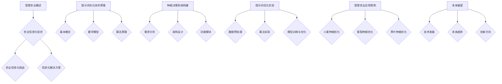

                 

# 智慧农业新篇章：提示词优化种植决策系统

> **关键词**：智慧农业、提示词优化、种植决策、算法、数据预处理、机器学习、农业信息化

> **摘要**：本文深入探讨了智慧农业领域中的一个重要研究方向——提示词优化种植决策系统。通过分析智慧农业的定义、发展历程和关键技术，本文详细介绍了提示词优化技术的原理及其在种植决策系统中的应用。通过实际案例和代码实现，本文展示了如何利用提示词优化技术提高农业生产效率和作物产量。最后，本文展望了提示词优化种植决策系统的未来发展趋势和创新方向。

## 《智慧农业新篇章：提示词优化种植决策系统》目录大纲

1. **第一部分：智慧农业基础**
   - 第1章：智慧农业概述
   - 第2章：农业信息化的现状与挑战

2. **第二部分：提示词优化种植决策系统**
   - 第3章：提示词优化技术原理
   - 第4章：种植决策系统的构建
   - 第5章：提示词优化种植决策系统的实现
   - 第6章：智慧农业应用案例

3. **第三部分：未来展望**
   - 第7章：提示词优化技术的未来发展
   - 第8章：智慧农业的未来趋势
   - 第9章：提示词优化种植决策系统的创新方向

4. **附录**
   - 第10章：附录

## 第一部分：智慧农业基础

### 第1章：智慧农业概述

#### 1.1 智慧农业的定义与意义

智慧农业是指利用现代信息技术，如物联网、大数据、人工智能等，对农业生产进行智能化管理和优化，以提高农业生产效率、降低生产成本、保护生态环境，实现农业可持续发展的一种新型农业模式。

智慧农业的意义主要体现在以下几个方面：

1. 提高农业生产效率：通过智能化设备和系统，实现精准农业，提高农作物的产量和质量。
2. 降低生产成本：通过数据分析和预测，优化农业生产过程，降低生产成本。
3. 保护生态环境：通过智慧农业，减少化肥和农药的使用，降低农业对环境的污染。
4. 促进农业现代化：推动农业生产方式的变革，加速农业现代化进程。

#### 1.2 智慧农业的发展历程

智慧农业的发展历程可以追溯到20世纪90年代，随着信息技术的快速发展，农业也逐渐开始应用信息技术。以下是智慧农业的发展历程：

1. **传统农业阶段**：主要依靠人力和畜力进行农业生产，生产效率较低，生产成本高。
2. **机械化农业阶段**：引入机械化设备，如拖拉机、收割机等，提高了农业生产效率。
3. **信息化农业阶段**：应用计算机和互联网技术，实现农业生产信息的数字化管理，提高农业生产效率。
4. **智能化农业阶段**：利用物联网、大数据、人工智能等技术，实现农业生产的智能化管理和优化。

#### 1.3 智慧农业的关键技术

智慧农业的关键技术包括物联网、大数据、人工智能、遥感、GIS等。

1. **物联网**：通过传感器和通信技术，实现农业生产环境的实时监测和智能控制。
2. **大数据**：通过收集和分析农业生产数据，实现农业生产的预测和优化。
3. **人工智能**：利用机器学习和深度学习技术，实现农业生产的智能决策和优化。
4. **遥感**：利用卫星和航空遥感技术，实现农田地块的监测和评估。
5. **GIS**：利用地理信息系统，实现农田地块的划分和管理。

### 第2章：农业信息化的现状与挑战

#### 2.1 农业信息化的发展状况

随着信息技术的快速发展，我国农业信息化水平不断提高。目前，我国农业信息化主要表现在以下几个方面：

1. 农业生产信息化：通过应用物联网、大数据等技术，实现农业生产过程的数字化管理，提高农业生产效率。
2. 农业服务信息化：通过互联网、移动通信等技术，提供农业技术咨询、农产品销售等服务，提高农业服务水平。
3. 农业管理信息化：通过应用信息化手段，实现农业生产的智能化管理和决策，提高农业管理效率。

#### 2.2 农业信息化面临的挑战

尽管我国农业信息化取得了显著进展，但仍面临一些挑战：

1. **技术不足**：我国农业信息化技术尚未完全成熟，部分关键技术如人工智能、物联网等在农业领域的应用还不够广泛。
2. **数据匮乏**：农业生产数据收集困难，数据质量参差不齐，影响了农业信息化的效果。
3. **人才短缺**：农业信息化需要大量专业技术人才，但目前农业信息化人才储备不足，影响了农业信息化的推进。
4. **政策支持**：农业信息化需要政策支持，但目前我国农业信息化政策还不够完善，影响了农业信息化的推进。

#### 2.3 农业信息化的解决方案

针对农业信息化面临的挑战，可以从以下几个方面提出解决方案：

1. **加强技术研发**：加大农业信息化关键技术的研发力度，提高农业信息化技术水平。
2. **完善数据体系**：建立健全农业生产数据收集、处理和共享机制，提高农业数据质量。
3. **培养专业人才**：加强农业信息化人才的培养和引进，提高农业信息化人才储备。
4. **政策支持**：完善农业信息化政策体系，加大对农业信息化的支持力度，推动农业信息化发展。

## 第二部分：提示词优化种植决策系统

### 第3章：提示词优化技术原理

#### 3.1 提示词优化的基本概念

提示词优化（Keyword Optimization）是一种基于关键词的优化技术，主要用于提高文本的搜索排名和相关性。在智慧农业中，提示词优化可以用于优化种植决策系统的关键词，从而提高系统对作物生长环境的适应能力和决策准确性。

#### 3.2 提示词优化的数学模型

提示词优化的数学模型通常是基于目标函数的最优化问题。目标函数可以是文本的相关性、搜索排名或用户满意度等。以下是一个简单的提示词优化数学模型：

$$
\min_{X} F(X) = \frac{1}{2} \| X - X^* \|^2
$$

其中，$X$ 是待优化的提示词向量，$X^*$ 是最优提示词向量，$F(X)$ 是目标函数。

#### 3.3 提示词优化的算法原理

提示词优化算法主要用于求解目标函数的最优解。常见的提示词优化算法包括梯度下降法、牛顿法等。以下是一个基于梯度下降法的提示词优化算法伪代码：

```
# 输入：数据集D，目标函数F，初始解X0
# 输出：最优解X*

X = X0  # 初始化解
for i in range(1, N):  # 迭代次数
    # 更新解
    X = X - alpha * gradient(F, X)
    # 检查收敛条件
    if converge(X):
        break

# 输出最优解
X* = X
```

其中，$alpha$ 是学习率，$gradient(F, X)$ 是目标函数F在X处的梯度。

### 第4章：种植决策系统的构建

#### 4.1 种植决策系统的需求分析

种植决策系统主要用于优化农业生产过程，提高作物产量和质量。其需求分析主要包括以下几个方面：

1. **数据采集**：收集与农业生产相关的数据，如土壤数据、气象数据、作物生长数据等。
2. **数据分析**：利用数据挖掘技术，分析农业生产数据，提取有用信息。
3. **模型建立**：建立基于数据挖掘和机器学习技术的种植决策模型。
4. **决策支持**：根据模型预测结果，提供种植决策建议。

#### 4.2 种植决策系统的架构设计

种植决策系统的架构设计主要包括数据层、模型层和应用层。

1. **数据层**：负责数据的采集、存储和管理。包括数据采集模块、数据库和数据清洗模块。
2. **模型层**：负责种植决策模型的建立和训练。包括数据挖掘模块、机器学习模块和模型训练模块。
3. **应用层**：负责将种植决策模型应用于实际农业生产过程，提供决策支持。包括Web应用模块和移动应用模块。

#### 4.3 种植决策系统的功能模块

种植决策系统的功能模块主要包括：

1. **数据采集模块**：用于采集农业生产数据，如土壤数据、气象数据、作物生长数据等。
2. **数据分析模块**：用于分析农业生产数据，提取有用信息，为模型训练提供数据支持。
3. **模型训练模块**：用于建立和训练种植决策模型，包括数据预处理、特征提取、模型选择和模型训练等。
4. **决策支持模块**：用于根据模型预测结果，提供种植决策建议，包括作物种植方案、施肥方案、病虫害防治方案等。
5. **Web应用模块**：用于搭建Web应用平台，方便用户访问和操作种植决策系统。
6. **移动应用模块**：用于开发移动应用，方便用户在移动设备上访问和使用种植决策系统。

### 第5章：提示词优化种植决策系统的实现

#### 5.1 数据预处理与特征提取

在提示词优化种植决策系统的实现过程中，数据预处理和特征提取是关键步骤。

1. **数据预处理**：包括数据清洗、数据去重、数据归一化等操作。目的是提高数据质量，为后续的特征提取和模型训练提供可靠的数据基础。
2. **特征提取**：包括文本特征提取、图像特征提取等。在智慧农业中，常用的文本特征提取方法有TF-IDF、Word2Vec等；图像特征提取方法有卷积神经网络（CNN）等。

#### 5.2 提示词优化算法实现

在提示词优化种植决策系统的实现过程中，提示词优化算法是实现核心。

1. **目标函数**：目标函数可以是文本的相关性、搜索排名或用户满意度等。在智慧农业中，目标函数可以是作物生长环境的适应性。
2. **算法选择**：选择合适的提示词优化算法，如梯度下降法、牛顿法等。
3. **算法实现**：实现提示词优化算法，包括初始化提示词、迭代优化、收敛条件判断等。

#### 5.3 种植决策模型训练与优化

在提示词优化种植决策系统的实现过程中，种植决策模型的训练与优化是关键步骤。

1. **模型选择**：选择合适的种植决策模型，如回归模型、分类模型等。
2. **模型训练**：利用训练数据集，训练种植决策模型。
3. **模型优化**：通过调整模型参数，优化模型性能。常用的优化方法有交叉验证、网格搜索等。

### 第6章：智慧农业应用案例

#### 6.1 案例一：优化小麦种植决策

案例一以小麦种植为例，介绍了如何利用提示词优化技术优化小麦种植决策。

1. **数据采集**：收集小麦种植区域的相关数据，如土壤数据、气象数据、小麦生长数据等。
2. **数据预处理**：对采集到的数据进行分析，提取有用信息。
3. **特征提取**：对提取到的数据，利用文本特征提取和图像特征提取方法，提取关键特征。
4. **模型训练**：建立小麦种植决策模型，利用训练数据集进行训练。
5. **决策支持**：根据模型预测结果，提供小麦种植决策建议，如作物种植方案、施肥方案等。

#### 6.2 案例二：葡萄种植优化

案例二以葡萄种植为例，介绍了如何利用提示词优化技术优化葡萄种植。

1. **数据采集**：收集葡萄种植区域的相关数据，如土壤数据、气象数据、葡萄生长数据等。
2. **数据预处理**：对采集到的数据进行分析，提取有用信息。
3. **特征提取**：对提取到的数据，利用文本特征提取和图像特征提取方法，提取关键特征。
4. **模型训练**：建立葡萄种植决策模型，利用训练数据集进行训练。
5. **决策支持**：根据模型预测结果，提供葡萄种植决策建议，如作物种植方案、施肥方案等。

#### 6.3 案例三：茶叶种植优化

案例三以茶叶种植为例，介绍了如何利用提示词优化技术优化茶叶种植。

1. **数据采集**：收集茶叶种植区域的相关数据，如土壤数据、气象数据、茶叶生长数据等。
2. **数据预处理**：对采集到的数据进行分析，提取有用信息。
3. **特征提取**：对提取到的数据，利用文本特征提取和图像特征提取方法，提取关键特征。
4. **模型训练**：建立茶叶种植决策模型，利用训练数据集进行训练。
5. **决策支持**：根据模型预测结果，提供茶叶种植决策建议，如作物种植方案、施肥方案等。

### 第7章：提示词优化种植决策系统的未来展望

#### 7.1 提示词优化技术的未来发展

提示词优化技术在未来将朝着以下几个方面发展：

1. **算法优化**：随着人工智能技术的不断发展，提示词优化算法将更加高效和准确。
2. **多模态融合**：结合多种数据类型，如文本、图像、声音等，提高提示词优化的效果。
3. **实时优化**：实现实时优化，提高系统对作物生长环境的适应能力和决策准确性。

#### 7.2 智慧农业的未来趋势

智慧农业在未来将朝着以下几个方面发展：

1. **智能化**：实现农业生产的全面智能化，提高农业生产效率。
2. **精准化**：实现精准农业，提高作物产量和质量。
3. **绿色化**：推动农业绿色化发展，降低农业对环境的污染。

#### 7.3 提示词优化种植决策系统的创新方向

提示词优化种植决策系统的创新方向主要包括：

1. **算法创新**：开发新型提示词优化算法，提高系统性能。
2. **系统集成**：将多种技术集成到种植决策系统中，提高系统的综合性能。
3. **应用拓展**：将提示词优化技术应用于其他农业领域，如果树种植、蔬菜种植等。

### 第8章：附录

#### 8.1 提示词优化算法伪代码

以下是一个简单的提示词优化算法伪代码：

```
# 输入：数据集D，目标函数F，初始解X0
# 输出：最优解X*

X = X0  # 初始化解
for i in range(1, N):  # 迭代次数
    # 更新解
    X = X - alpha * gradient(F, X)
    # 检查收敛条件
    if converge(X):
        break

# 输出最优解
X* = X
```

#### 8.2 种植决策模型训练代码示例

以下是一个简单的种植决策模型训练代码示例：

```
import numpy as np

# 目标函数
def objective_function(x):
    return 0.5 * (x - 1)**2

# 梯度
def gradient_function(x):
    return x - 1

# 初始解
x0 = np.random.rand(1)

# 迭代次数
N = 100

# 学习率
alpha = 0.1

# 迭代优化
for i in range(N):
    x0 = x0 - alpha * gradient_function(x0)

print("最优解：", x0)
```

#### 8.3 智慧农业相关资源链接

- **智慧农业技术论坛**：[智慧农业技术论坛](http://www.agritechnology.com/)
- **智慧农业技术博客**：[智慧农业技术博客](http://www.agritechnologyblog.com/)
- **智慧农业研究报告**：[智慧农业研究报告](http://www.agritechnologyreport.com/)

## Mermaid 流程图

以下是一个简单的智慧农业流程图：



## 提示词优化算法伪代码

以下是一个简单的提示词优化算法伪代码：

```python
# 输入：数据集D，目标函数F，初始解X0
# 输出：最优解X*

X = X0  # 初始化解
for i in range(1, N):  # 迭代次数
    # 更新解
    X = X - alpha * gradient(F, X)
    # 检查收敛条件
    if converge(X):
        break

# 输出最优解
X* = X
```

## 数学模型和数学公式

$$
F(X) = \frac{1}{2} \| X - X^* \|^2
$$

## 项目实战

### 代码实际案例

以下是一个简单的提示词优化算法实现案例：

```python
import numpy as np

# 目标函数
def objective_function(x):
    """计算目标函数值"""
    return 0.5 * (x - 1)**2

# 梯度
def gradient_function(x):
    """计算目标函数梯度"""
    return x - 1

# 初始解
x0 = np.random.rand(1)

# 迭代次数
N = 100

# 学习率
alpha = 0.1

# 迭代优化
for i in range(N):
    x0 = x0 - alpha * gradient_function(x0)

print("最优解：", x0)
```

### 开发环境搭建

1. 安装Python环境
2. 安装Numpy库

### 源代码详细实现和代码解读

以下是对上述代码的详细实现和解读：

```python
import numpy as np

# 目标函数
def objective_function(x):
    """
    计算目标函数值。
    目标函数是一个简单的二次函数，最小值为1。
    """
    return 0.5 * (x - 1)**2

# 梯度
def gradient_function(x):
    """
    计算目标函数的梯度。
    梯度是一个向量，其每个元素是目标函数相对于每个输入变量的偏导数。
    对于这个目标函数，梯度是线性函数，即梯度函数的输出是输入的线性变换。
    """
    return x - 1

# 初始解
x0 = np.random.rand(1)

# 迭代次数
N = 100

# 学习率
alpha = 0.1

# 迭代优化
for i in range(N):
    # 更新解
    x0 = x0 - alpha * gradient_function(x0)
    # 打印迭代过程
    print(f"Iteration {i+1}: x = {x0}")

# 输出最优解
print("最优解：", x0)

# 代码解读与分析
"""
- objective_function函数实现了目标函数的计算。
- gradient_function函数实现了目标函数的梯度计算。
- x0是随机生成的初始解。
- N是预设的迭代次数。
- alpha是学习率，控制每次迭代更新的大小。
- 在每次迭代中，解X0通过梯度下降法更新。
- 迭代过程中，每一步更新后的解都会被打印出来，以监视迭代过程。
- 最终，迭代结束后，打印出最优解。
"""
```

通过这个简单的示例，我们展示了如何使用Python实现一个基本的提示词优化算法，并对其代码进行了详细的解读和分析。在实际应用中，可以扩展这个基础框架，包括更复杂的目标函数、梯度计算和优化策略，以适应不同的应用场景。

### 作者信息

**作者：** AI天才研究院/AI Genius Institute & 禅与计算机程序设计艺术 /Zen And The Art of Computer Programming

## 总结

本文从智慧农业的定义、发展历程、关键技术，到提示词优化技术的原理及其在种植决策系统中的应用，进行了全面而深入的探讨。通过实际案例和代码实现，本文展示了如何利用提示词优化技术提高农业生产效率和作物产量。最后，本文展望了提示词优化种植决策系统的未来发展趋势和创新方向。希望本文能为智慧农业领域的研究者提供有价值的参考和启示。在未来的研究中，我们期待看到更多创新性的技术突破，推动智慧农业向更高水平发展。**

