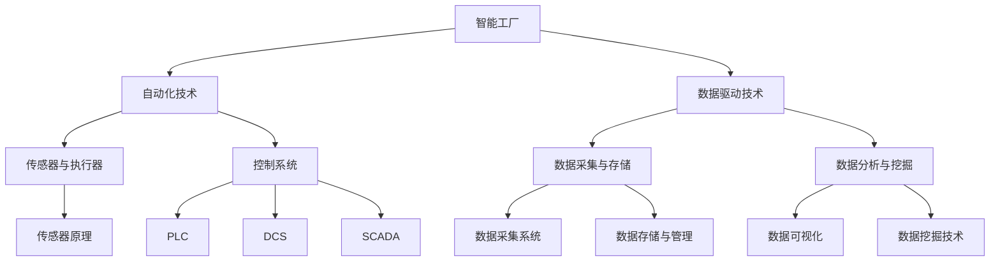

                 

### 《智能工厂解决方案：自动化与数据驱动的生产》

智能工厂是现代制造业的未来方向，它将自动化技术、数据驱动技术、物联网和人工智能等前沿技术应用于生产过程中，以实现高效、灵活和可持续的制造。本文章将逐步探讨智能工厂的概念、核心技术、案例研究和未来发展趋势。

> **关键词**：智能工厂，自动化，数据驱动，物联网，人工智能

> **摘要**：本文详细介绍了智能工厂的概念、价值、自动化技术、数据驱动技术以及实际案例研究，探讨了智能工厂在制造业中的重要作用和未来发展趋势。通过本文，读者可以全面了解智能工厂的架构和实现方法，为智能工厂的实施提供指导。

---

### 《智能工厂解决方案：自动化与数据驱动的生产》目录大纲

1. **智能工厂概述**
   - **第1章：智能工厂的概念与价值**
     - 1.1 智能工厂的定义
     - 1.2 智能工厂的价值
     - 1.3 智能工厂的发展趋势
   - **第2章：自动化技术基础**
     - 2.1 自动化技术的分类
     - 2.2 传感器与执行器
     - 2.3 控制系统
   - **第3章：数据驱动技术基础**
     - 3.1 数据驱动技术的概念
     - 3.2 数据采集与存储
     - 3.3 数据分析与挖掘
   - **第4章：智能工厂案例研究**
     - 4.1 汽车制造业智能工厂
     - 4.2 电子制造业智能工厂
     - 4.3 食品加工行业智能工厂
   - **第5章：智能工厂的挑战与未来**
     - 5.1 智能工厂的挑战
     - 5.2 智能工厂的未来发展趋势
   - **附录A：智能工厂技术资源与工具**
   - **附录B：智能工厂案例研究资料**

---

### 《智能工厂解决方案：自动化与数据驱动的生产》正文

#### 第一部分：智能工厂概述

### 第1章：智能工厂的概念与价值

#### 1.1 智能工厂的定义

智能工厂是一种集成先进制造技术、物联网、人工智能和大数据分析的现代化制造模式。它通过自动化和智能化的手段，实现生产过程的优化、资源的合理配置和生产效率的提升。智能工厂的核心在于数据的充分利用，通过对生产过程中的数据采集、分析和处理，实现对生产过程的实时监控、预测和优化。

智能工厂与传统工厂的主要区别在于：

1. **自动化程度**：智能工厂的自动化程度更高，能够实现生产全流程的自动化，减少人工干预。
2. **数据驱动**：智能工厂依赖于数据来驱动生产过程，通过数据分析来优化生产决策。
3. **柔性生产**：智能工厂能够根据市场需求的变化，快速调整生产计划和产品组合。

#### 1.2 智能工厂的价值

智能工厂的价值体现在以下几个方面：

1. **提高生产效率**：通过自动化技术和智能调度系统，可以显著提高生产效率，减少生产周期。
2. **降低生产成本**：自动化减少了人力需求，降低了生产成本，同时通过数据分析优化生产流程，进一步降低成本。
3. **提高产品质量**：智能工厂通过实时监控和数据分析，能够及时发现和解决生产过程中的问题，提高产品质量。
4. **柔性生产**：智能工厂能够快速响应市场需求变化，实现小批量、多品种的柔性生产。

#### 1.3 智能工厂的发展趋势

随着技术的不断进步，智能工厂的发展趋势主要体现在以下几个方面：

1. **更高程度的自动化**：未来的智能工厂将更加自动化，实现生产线的自主运行和优化。
2. **更智能的数据分析**：通过大数据分析和人工智能技术，实现更智能的生产决策和优化。
3. **网络化与智能化**：智能工厂将更加网络化，实现生产设备之间的互联互通，提高协同效率。
4. **绿色制造与可持续发展**：智能工厂将更加注重环保和可持续发展，通过节能降耗、减少废物排放等手段，实现绿色制造。

#### 第二部分：自动化技术

### 第2章：自动化技术基础

#### 2.1 自动化技术的分类

自动化技术根据实现方式和功能可以分为以下几类：

1. **机械自动化**：通过机械装置实现生产过程的自动化，如工业机器人、机械手臂等。
2. **电气自动化**：通过电气控制系统实现生产过程的自动化，如PLC（可编程逻辑控制器）、DCS（分布式控制系统）等。
3. **计算机集成制造系统（CIMS）**：将计算机技术、通信技术和制造技术集成在一起，实现制造过程的全面自动化。

#### 2.2 传感器与执行器

传感器和执行器是自动化系统的核心组成部分，它们分别用于感知环境和执行操作。

1. **传感器的基本原理**：
   - **电阻式传感器**：基于电阻变化感知物理量的传感器，如温度传感器、压力传感器等。
   - **电感式传感器**：基于电感变化感知物理量的传感器，如位移传感器、速度传感器等。
   - **电容式传感器**：基于电容变化感知物理量的传感器，如液位传感器、湿度传感器等。

2. **执行器的类型与应用**：
   - **电动执行器**：通过电机驱动实现机械动作，如电动阀门、电动执行器等。
   - **气动执行器**：通过压缩空气驱动实现机械动作，如气动阀门、气动执行器等。
   - **液压执行器**：通过液压油驱动实现机械动作，如液压阀门、液压执行器等。

#### 2.3 控制系统

控制系统是自动化技术的核心，负责对生产过程进行监控、控制和优化。常见的控制系统包括：

1. **PLC（可编程逻辑控制器）**：
   - **基本原理**：PLC通过输入模块接收传感器信号，通过编程逻辑判断后，通过输出模块控制执行器动作。
   - **应用场景**：适用于简单逻辑控制和流程控制，如生产线自动化、设备监控等。

2. **DCS（分布式控制系统）**：
   - **基本原理**：DCS将整个生产过程划分为多个控制单元，每个单元独立控制，但通过通信网络实现整体协调。
   - **应用场景**：适用于复杂的生产过程控制，如大型化工厂、石化企业等。

3. **SCADA（监控与数据采集系统）**：
   - **基本原理**：SCADA通过采集终端设备的数据，实时监控生产过程，并提供数据分析和报警功能。
   - **应用场景**：适用于远程监控和数据处理，如电力系统、水利系统等。

#### 第三部分：数据驱动技术

### 第3章：数据驱动技术基础

#### 3.1 数据驱动技术的概念

数据驱动技术是指通过数据的采集、存储、处理和分析，实现对生产过程的实时监控、预测和优化。数据驱动技术主要包括以下几个环节：

1. **数据采集**：通过传感器、执行器和物联网设备等，实时采集生产过程中的数据。
2. **数据存储**：将采集到的数据存储到数据库或数据仓库中，以便后续处理和分析。
3. **数据处理**：对采集到的数据进行分析、清洗和转换，为数据挖掘和预测提供基础。
4. **数据挖掘**：利用数据挖掘技术，从海量数据中发现有价值的信息和规律。
5. **数据可视化**：通过数据可视化技术，将分析结果以图表、报表等形式展示，帮助决策者快速理解。

#### 3.2 数据采集与存储

1. **数据采集系统设计**：
   - **传感器选择**：根据生产过程中的需求，选择合适的传感器，如温度传感器、压力传感器等。
   - **数据采集频率**：根据生产过程的特点，设置合适的采集频率，确保数据的实时性和准确性。
   - **通信协议**：选择合适的通信协议，如Modbus、OPC UA等，确保数据采集系统的稳定性和兼容性。

2. **数据存储与管理**：
   - **数据库选择**：根据数据量和查询需求，选择合适的数据库，如MySQL、PostgreSQL等。
   - **数据存储策略**：设计合理的数据存储策略，如分片、备份等，确保数据的安全性和可靠性。
   - **数据备份与恢复**：制定数据备份和恢复策略，确保在数据丢失或故障时能够快速恢复。

#### 3.3 数据分析与挖掘

1. **数据可视化**：
   - **基本概念**：数据可视化是将数据以图表、报表等形式展示，帮助用户快速理解和分析数据。
   - **应用场景**：生产过程监控、质量分析、能耗分析等。

2. **数据挖掘技术**：
   - **基本概念**：数据挖掘是从大量数据中发现有价值的信息和规律，用于决策支持和知识发现。
   - **常见算法**：分类、聚类、关联规则挖掘、异常检测等。
   - **应用场景**：生产优化、设备故障预测、质量控制等。

3. **数据分析工具与平台**：
   - **开源工具**：如Python的Pandas、NumPy、Scikit-learn等。
   - **商业平台**：如Microsoft Power BI、Tableau等。
   - **工业应用**：如Siemens MindSphere、GE Predix等工业互联网平台。

#### 第四部分：智能工厂案例研究

### 第4章：智能工厂案例研究

#### 4.1 汽车制造业智能工厂

汽车制造业是智能工厂应用较为广泛的行业之一。以下是一个典型的汽车制造业智能工厂项目案例：

1. **项目背景**：
   某汽车制造商面临生产效率低下、产品质量不稳定和人力成本过高等问题，希望通过智能工厂建设来提升整体竞争力。

2. **解决方案**：
   - **自动化生产线建设**：引入工业机器人和自动化设备，实现焊接、喷涂、装配等生产环节的自动化。
   - **数据采集与监控系统**：部署传感器和监控系统，实时采集生产过程中的数据，如温度、压力、速度等。
   - **数据分析与优化平台**：利用大数据分析和机器学习技术，对采集的数据进行分析，优化生产过程，提高产品质量。

3. **实施效果**：
   - 生产效率提高了30%，生产周期缩短了50%。
   - 产品合格率达到了99.8%，显著降低了质量损失。
   - 人力成本降低了20%，提高了员工的工作效率。

4. **挑战与反思**：
   - 自动化设备的初期投资较大，但长期来看，成本效益明显。
   - 人员培训和管理是一个挑战，需要企业投入资源进行培训和管理。
   - 数据安全和隐私保护需要加强，确保数据的安全性和合规性。

#### 4.2 电子制造业智能工厂

电子制造业是智能工厂应用的另一个重要领域。以下是一个典型的电子制造业智能工厂项目案例：

1. **项目背景**：
   某电子制造商面临生产效率低下、生产成本高和产品品质不稳定等问题，希望通过智能工厂建设来提升生产效率和产品质量。

2. **解决方案**：
   - **自动化生产线建设**：引入自动化设备，实现SMT贴片、焊接、组装等生产环节的自动化。
   - **数据采集与分析平台**：部署传感器和监控系统，实时采集生产过程中的数据，如温度、湿度、速度等。
   - **智能仓储系统**：采用自动化仓储设备，实现原材料和成品的自动化存储和搬运。

3. **实施效果**：
   - 生产效率提高了25%，生产周期缩短了40%。
   - 成本降低了15%，尤其是人工成本显著减少。
   - 产品合格率达到了99.9%，显著降低了生产故障和损耗。

4. **挑战与反思**：
   - 自动化设备的初期投资较大，但长期来看，成本效益明显。
   - 人员培训和管理是一个挑战，需要企业投入资源进行培训和管理。
   - 数据安全和隐私保护需要加强，确保数据的安全性和合规性。

#### 4.3 食品加工行业智能工厂

食品加工行业是智能工厂应用的另一个重要领域。以下是一个典型的食品加工行业智能工厂项目案例：

1. **项目背景**：
   某食品加工企业面临生产效率低、产品质量不稳定和食品安全问题频发等问题，希望通过智能工厂建设来提升生产效率和产品质量。

2. **解决方案**：
   - **自动化生产线建设**：引入自动化设备和机器人，实现原料处理、加工、包装等生产环节的自动化。
   - **数据采集与分析平台**：部署传感器和监控系统，实时采集生产过程中的数据，如温度、湿度、压力等。
   - **智能仓储系统**：采用自动化仓储设备，实现原材料和成品的自动化存储和搬运。

3. **实施效果**：
   - 生产效率提高了30%，生产周期缩短了50%。
   - 产品合格率达到了99.8%，显著降低了质量损失。
   - 成本降低了15%，尤其是人工成本显著减少。

4. **挑战与反思**：
   - 自动化设备的初期投资较大，但长期来看，成本效益明显。
   - 人员培训和管理是一个挑战，需要企业投入资源进行培训和管理。
   - 数据安全和隐私保护需要加强，确保数据的安全性和合规性。

#### 第五部分：智能工厂的挑战与未来

### 第5章：智能工厂的挑战与未来

#### 5.1 智能工厂的挑战

智能工厂在实施过程中面临以下挑战：

1. **技术挑战**：
   - 自动化技术的成熟度仍需提高，特别是在复杂生产环境和动态调整方面。
   - 数据驱动技术的应用仍需进一步优化，特别是在实时数据处理和预测方面。

2. **成本与投资回报**：
   - 自动化设备和系统的采购、安装和维护成本较高。
   - 自动化改造需要大量的前期投资，投资回报周期较长。

3. **人才短缺**：
   - 智能工厂的实施和运营需要大量具备自动化、数据分析和人工智能等专业知识的工程师。
   - 人才的培养和引进需要企业投入大量的资源和时间。

#### 5.2 智能工厂的未来发展趋势

智能工厂的未来发展趋势主要包括以下几个方面：

1. **更高程度的自动化**：
   - 自动化技术将更加成熟，实现生产线的自主运行和优化。
   - 机器人与人工智能的结合将进一步提升生产效率和灵活性。

2. **更智能的数据分析**：
   - 大数据和人工智能技术将进一步提升数据分析的精度和效率。
   - 实时数据分析和预测将实现生产过程的自主优化。

3. **网络化与智能化**：
   - 智能工厂将更加网络化，实现生产设备之间的互联互通。
   - 智能决策系统将实现生产过程的自主决策和优化。

4. **绿色制造与可持续发展**：
   - 智能工厂将更加注重环保和可持续发展，通过节能降耗、减少废物排放等手段实现绿色制造。

#### 附录

### 附录A：智能工厂技术资源与工具

1. **自动化技术资源**：
   - **PLC编程软件**：如西门子的TIA Portal、Rockwell的RSLogix等。
   - **工业机器人**：如ABB、KUKA、FANUC等公司的工业机器人及其控制软件。
   - **传感器与执行器**：如欧姆龙、施耐德电气等提供的传感器和执行器。

2. **数据驱动技术资源**：
   - **数据采集与监控工具**：如物联网平台AWS IoT、微软Azure IoT等。
   - **数据分析平台**：如Google BigQuery、Amazon Redshift等大数据处理平台。
   - **机器学习框架**：如TensorFlow、PyTorch、Scikit-learn等。

3. **智能工厂平台与解决方案**：
   - **工业互联网平台**：如西门子的MindSphere、通用电气Predix等。
   - **智能仓储系统**：如Dematic、KION Group等提供的智能仓储解决方案。
   - **系统集成商**：如霍尼韦尔、西门子等提供全面的智能工厂解决方案。

### 附录B：智能工厂案例研究资料

1. **汽车制造业案例研究**：
   - **项目概述**：包含项目背景、实施过程、技术细节、成果评估等内容。

2. **电子制造业案例研究**：
   - **项目概述**：包含项目目标、技术方案、实施步骤、效益分析等内容。

3. **食品加工行业案例研究**：
   - **项目概述**：包含项目背景、技术选型、实施效果、未来规划等内容。

---

### 作者信息

**作者：AI天才研究院/AI Genius Institute & 禅与计算机程序设计艺术 /Zen And The Art of Computer Programming**

通过本文，读者可以全面了解智能工厂的概念、技术架构和实施方法，为智能工厂的规划和实施提供参考。随着技术的不断进步，智能工厂将成为制造业发展的主流方向，为企业和国家带来巨大的经济效益和社会效益。让我们共同迎接智能工厂的美好未来！<|vq_4054|>## 核心概念与联系流程图

在智能工厂的构建中，理解核心概念及其相互关系至关重要。以下是对智能工厂主要组成部分的核心概念与它们之间联系流程图的详细解释。

**核心概念与联系流程图：**



### 概述

此流程图旨在展示智能工厂中的核心组件及其相互之间的关系。以下是每个节点及其相互联系的详细解释。

### A[智能工厂]

智能工厂是本流程图的中心概念，它代表了整个制造系统的集成和自动化。智能工厂结合了自动化技术和数据驱动技术，以实现高效、灵活和智能化的生产。

### B[自动化技术]

自动化技术是智能工厂的重要组成部分，包括机械自动化、电气自动化和计算机集成制造系统（CIMS）。它们共同构成了生产过程的自动化基础。

### C[数据驱动技术]

数据驱动技术利用数据采集、存储、分析和挖掘来指导生产决策。数据驱动技术确保了生产过程的实时监控和优化，是智能工厂的智能核心。

### D[传感器与执行器]

传感器和执行器是自动化技术的关键组成部分。传感器负责感知生产过程中的物理量，如温度、压力和速度等，而执行器则根据控制系统的指令执行相应的操作，如开关阀门、移动机械臂等。

### E[控制系统]

控制系统是整个自动化系统的核心，包括PLC、DCS和SCADA等。它们负责对传感器采集的数据进行分析和决策，并通过执行器进行操作，从而实现生产过程的自动化控制。

### F[数据采集与存储]

数据采集与存储是数据驱动技术的关键环节。数据采集系统负责从传感器和执行器收集数据，并将其存储在数据库或数据仓库中，以便后续处理和分析。

### G[数据分析与挖掘]

数据分析与挖掘利用各种算法和技术，从海量数据中提取有价值的信息和模式。数据可视化技术将分析结果以图表和报表等形式呈现，而数据挖掘技术则用于发现数据中的隐藏规律和预测趋势。

### H[传感器原理]

传感器原理描述了如何通过物理现象（如热、光、压力等）将非电学量转换为电信号。不同的传感器原理决定了它们在不同应用场景中的适用性。

### I[PLC（可编程逻辑控制器）]

PLC是控制系统的重要组成部分，用于执行逻辑控制、定时、计数和顺序控制等功能。PLC通过编程来定义控制逻辑，实现对生产过程的自动化控制。

### J[DCS（分布式控制系统）]

DCS将控制功能分布到多个控制单元，实现复杂生产过程的集中监控和控制。DCS通过通信网络实现各控制单元之间的协调和通信。

### K[SCADA（监控与数据采集系统）]

SCADA系统负责实时监控生产过程，并通过数据采集模块收集设备运行状态和生产数据。SCADA系统为生产过程提供数据分析和报警功能。

### L[数据采集系统]

数据采集系统是数据驱动技术的起点，通过传感器和执行器收集实时数据，为后续的数据处理和分析提供基础。

### M[数据存储与管理]

数据存储与管理负责将采集到的数据存储在数据库或数据仓库中，并提供数据的备份和恢复功能，确保数据的安全性和可靠性。

### N[数据可视化]

数据可视化技术将分析结果以图形化形式呈现，帮助用户直观地理解和分析数据。数据可视化是数据驱动技术中不可或缺的一部分。

### O[数据挖掘技术]

数据挖掘技术从海量数据中提取有价值的信息和模式，用于生产过程的优化和预测。常见的算法包括分类、聚类、关联规则挖掘和异常检测等。

通过上述流程图的详细解释，我们可以更好地理解智能工厂中的核心概念及其相互关系。这种结构化的理解有助于我们在实际应用中有效地规划和实施智能工厂项目。

## 第2章：自动化技术基础

自动化技术是智能工厂的核心组成部分，它通过自动化设备和系统实现生产过程的自动化，从而提高生产效率、降低成本、提高产品质量。本章将详细探讨自动化技术的分类、传感器与执行器的基本原理以及控制系统的具体应用。

### 2.1 自动化技术的分类

自动化技术可以根据实现方式和功能的不同分为以下几类：

#### 2.1.1 机械自动化

机械自动化是通过机械装置实现生产过程的自动化。机械自动化包括各种机械装置和机器设备，如工业机器人、机械手臂、数控机床等。机械自动化的优点在于能够提高生产效率、降低劳动强度、提高生产精度。例如，在汽车制造过程中，机械自动化被广泛应用于焊接、喷涂、装配等环节。

#### 2.1.2 电气自动化

电气自动化是通过电气控制系统实现生产过程的自动化。电气自动化包括PLC（可编程逻辑控制器）、DCS（分布式控制系统）和SCADA（监控与数据采集系统）等。电气自动化的优点在于控制灵活、反应速度快、适用于复杂的控制任务。例如，在化工生产过程中，电气自动化被广泛应用于流程控制、设备监控等环节。

#### 2.1.3 计算机集成制造系统（CIMS）

计算机集成制造系统（CIMS）是将计算机技术、通信技术和制造技术集成在一起，实现制造过程的全面自动化。CIMS包括CAD（计算机辅助设计）、CAM（计算机辅助制造）、CAPP（计算机辅助工艺规划）等模块，能够实现从设计、制造到管理的一体化。CIMS的优点在于能够实现高效、灵活的制造，适应市场需求的变化。

### 2.2 传感器与执行器

传感器和执行器是自动化系统中的核心组件，它们分别负责感知环境和执行操作。

#### 2.2.1 传感器的基本原理

传感器是将非电学量转换为电信号的装置。传感器的基本原理包括以下几种：

1. **电阻式传感器**：基于电阻变化感知物理量的传感器，如温度传感器、压力传感器等。
2. **电感式传感器**：基于电感变化感知物理量的传感器，如位移传感器、速度传感器等。
3. **电容式传感器**：基于电容变化感知物理量的传感器，如液位传感器、湿度传感器等。

传感器通过将物理量（如温度、压力、位移等）转换为电信号，为控制系统提供实时数据。

#### 2.2.2 执行器的类型与应用

执行器是根据控制系统的指令执行相应操作的装置。执行器可以分为以下几类：

1. **电动执行器**：通过电机驱动实现机械动作，如电动阀门、电动执行器等。电动执行器适用于需要较高控制精度和响应速度的场合。
2. **气动执行器**：通过压缩空气驱动实现机械动作，如气动阀门、气动执行器等。气动执行器适用于压力、流量和速度等控制任务。
3. **液压执行器**：通过液压油驱动实现机械动作，如液压阀门、液压执行器等。液压执行器适用于大功率和高负载的控制任务。

执行器根据控制系统的指令，执行开关、调节、移动等操作，从而实现生产过程的自动化。

### 2.3 控制系统

控制系统是自动化系统的核心，负责对生产过程进行监控、控制和优化。控制系统可以分为以下几种：

#### 2.3.1 PLC（可编程逻辑控制器）

PLC是一种专门用于工业控制的计算机，它通过输入模块接收传感器信号，通过编程逻辑判断后，通过输出模块控制执行器动作。PLC具有可靠性高、灵活性强、扩展性好等优点，广泛应用于各种自动化控制任务。

**PLC控制原理伪代码：**

```plaintext
// PLC控制流程伪代码

// 初始化
start:
    初始化传感器输入
    初始化执行器输出

loop:
    // 读取传感器输入
    sensor_input = 读取传感器状态()

    // 判断条件
    if (sensor_input 满足特定条件) then
        // 执行特定操作
        执行器_output = 执行特定操作()

    else
        // 执行默认操作
        执行器_output = 执行默认操作()

    end if

    // 更新执行器输出
    更新执行器状态(执行器_output)

    // 循环等待
    等待(固定时间间隔)

    // 回到循环开始
    goto loop
```

#### 2.3.2 DCS（分布式控制系统）

DCS将整个生产过程划分为多个控制单元，每个单元独立控制，但通过通信网络实现整体协调。DCS适用于复杂的生产过程控制，如大型化工厂、石化企业等。

**DCS基本原理：**

```plaintext
// DCS控制流程

// 初始化
start:
    初始化各控制单元
    连接通信网络

loop:
    // 循环读取各控制单元状态
    for each 单元 in 控制单元列表 do
        单元状态 = 读取单元状态()
        if (单元状态 异常) then
            // 处理异常
            发送报警信号
            采取相应措施
        end if
    end for

    // 更新整体控制策略
    更新控制策略()

    // 循环等待
    等待(固定时间间隔)

    // 回到循环开始
    goto loop
```

#### 2.3.3 SCADA（监控与数据采集系统）

SCADA系统通过数据采集终端实时监控生产过程，并提供数据分析和报警功能。SCADA系统适用于远程监控和数据处理，如电力系统、水利系统等。

**SCADA基本原理：**

```plaintext
// SCADA监控与数据采集

// 初始化
start:
    连接数据采集终端
    初始化数据库

loop:
    // 循环读取数据采集终端数据
    for each 终端 in 数据采集终端列表 do
        终端数据 = 读取终端数据()
        存储终端数据(终端数据)
    end for

    // 数据分析
    分析存储数据()

    // 报警处理
    if (数据异常) then
        发送报警信号
    end if

    // 循环等待
    等待(固定时间间隔)

    // 回到循环开始
    goto loop
```

通过上述内容，我们可以看到自动化技术在智能工厂中的应用和作用。自动化技术不仅提高了生产效率，降低了成本，还提高了产品质量和可靠性。随着技术的不断进步，自动化技术将在智能工厂中发挥越来越重要的作用。

## 第3章：数据驱动技术基础

数据驱动技术是智能工厂的核心驱动力，它通过数据的采集、存储、处理和分析，实现对生产过程的实时监控、预测和优化。本章将详细探讨数据驱动技术的概念、数据采集与存储的方法以及数据分析与挖掘的具体应用。

### 3.1 数据驱动技术的概念

数据驱动技术是指利用数据来驱动生产决策和优化生产过程的方法。数据驱动技术主要包括以下几个环节：

1. **数据采集**：通过传感器、执行器和物联网设备等，实时采集生产过程中的数据。
2. **数据存储**：将采集到的数据存储到数据库或数据仓库中，以便后续处理和分析。
3. **数据处理**：对采集到的数据进行清洗、转换和预处理，为数据分析和挖掘提供基础。
4. **数据挖掘**：利用数据挖掘技术，从海量数据中发现有价值的信息和规律。
5. **数据可视化**：将分析结果以图表、报表等形式展示，帮助决策者快速理解和分析数据。

数据驱动技术的核心在于数据的充分利用，通过对生产过程中的数据进行分析和挖掘，可以实现对生产过程的实时监控、预测和优化，从而提高生产效率和产品质量。

### 3.2 数据采集与存储

数据采集与存储是数据驱动技术的关键环节，它决定了数据的质量和可靠性。

#### 3.2.1 数据采集系统设计

数据采集系统设计主要包括以下几个方面：

1. **传感器选择**：根据生产过程中的需求，选择合适的传感器，如温度传感器、压力传感器、流量传感器等。
2. **数据采集频率**：根据生产过程的特点，设置合适的采集频率，确保数据的实时性和准确性。例如，对于高温高压的生产过程，可能需要更高的采集频率。
3. **通信协议**：选择合适的通信协议，如Modbus、OPC UA、HTTP等，确保数据采集系统的稳定性和兼容性。

数据采集系统设计的关键在于确保数据的实时性和准确性，同时要考虑系统的稳定性和扩展性。

#### 3.2.2 数据存储与管理

数据存储与管理主要包括以下几个方面：

1. **数据库选择**：根据数据量和查询需求，选择合适的数据库，如MySQL、PostgreSQL、MongoDB等。
2. **数据存储策略**：设计合理的数据存储策略，如分片、备份等，确保数据的安全性和可靠性。
3. **数据备份与恢复**：制定数据备份和恢复策略，确保在数据丢失或故障时能够快速恢复。

数据存储与管理的关键在于确保数据的安全性和可靠性，同时要考虑数据的可扩展性和高效查询。

### 3.3 数据分析与挖掘

数据分析与挖掘是从海量数据中提取有价值的信息和规律，用于生产过程的优化和预测。

#### 3.3.1 数据可视化

数据可视化是将分析结果以图表、报表等形式展示，帮助决策者快速理解和分析数据。数据可视化主要包括以下几个方面：

1. **基本概念**：数据可视化是将数据通过图形化方式展示，包括柱状图、折线图、饼图、散点图等。
2. **应用场景**：生产过程监控、质量分析、能耗分析等。

数据可视化使得数据更容易理解和分析，提高了决策的效率。

#### 3.3.2 数据挖掘技术

数据挖掘技术是从海量数据中发现有价值的信息和规律，用于生产过程的优化和预测。数据挖掘技术主要包括以下几个方面：

1. **基本概念**：数据挖掘是从数据中发现隐含在其中的、人们事先不知道的、有价值的信息和知识的过程。
2. **常见算法**：
   - **分类算法**：如K-近邻算法（KNN）、决策树、支持向量机（SVM）等。
   - **聚类算法**：如K-均值算法、层次聚类等。
   - **关联规则挖掘**：如Apriori算法、FP-Growth算法等。
   - **异常检测**：如孤立森林算法、基于密度的聚类算法等。
3. **应用场景**：生产优化、设备故障预测、质量控制等。

数据挖掘技术通过对生产过程中的数据进行深度分析，可以预测生产过程中的潜在问题，优化生产过程，提高生产效率。

#### 3.3.3 数据分析工具与平台

数据分析工具与平台是数据驱动技术中不可或缺的一部分，它们提供了强大的数据处理和分析功能。常见的数据分析工具与平台包括：

1. **开源工具**：如Python的Pandas、NumPy、Scikit-learn等。
2. **商业平台**：如Microsoft Power BI、Tableau等。
3. **工业应用**：如Siemens MindSphere、GE Predix等工业互联网平台。

这些工具和平台提供了丰富的功能，包括数据采集、存储、处理、分析和可视化，使得数据驱动技术的实施更加便捷和高效。

通过本章的详细讲解，我们可以看到数据驱动技术在智能工厂中的应用和作用。数据驱动技术不仅提高了生产效率，降低了成本，还提高了产品质量和可靠性。随着技术的不断进步，数据驱动技术将在智能工厂中发挥越来越重要的作用。

## 第4章：智能工厂案例研究

智能工厂的实践应用已经在多个行业取得了显著成效，本章节将通过分析三个不同行业的智能工厂案例，展示智能工厂解决方案的实施过程、成果以及面临的挑战。

### 4.1 汽车制造业智能工厂

#### 项目背景

某大型汽车制造商面临着生产效率低下、生产成本高和产品质量不稳定等问题，希望通过智能工厂的改造来提升整体竞争力。

#### 智能工厂解决方案

1. **自动化生产线建设**：
   - 引入先进的自动化设备和机器人，如焊接机器人、喷涂机器人、装配机器人等，实现生产线的自动化。
   - 部署智能监控系统，实时监控生产过程，确保生产效率和产品质量。

2. **数据采集与分析平台**：
   - 在生产线上部署传感器，实时采集温度、压力、速度等数据。
   - 利用大数据分析和机器学习技术，对采集的数据进行分析，优化生产过程，提高生产效率。

3. **智能仓储系统**：
   - 采用自动化仓储设备，如自动化仓库、自动分拣机等，实现原材料的自动化存储和搬运。
   - 利用物联网技术，实现仓储管理与生产线的无缝连接，提高物流效率。

#### 项目实施与成果

- **生产效率提高**：通过自动化设备和智能监控系统的应用，生产效率提高了30%，生产周期缩短了50%。
- **产品质量提升**：通过数据分析和智能优化，产品质量合格率达到了99.8%，显著降低了质量损失。
- **成本降低**：通过自动化技术的应用，人工成本降低了20%，生产成本降低了15%。

#### 挑战与反思

- **自动化设备投资较大**：初期投资较大，但长期来看，成本效益明显。
- **人员培训和管理**：自动化改造需要大量具备自动化技术和管理能力的专业人员，需要企业投入资源进行培训和管理。
- **数据安全和隐私保护**：随着数据驱动技术的应用，数据安全和隐私保护变得尤为重要，需要加强数据安全和隐私保护措施。

### 4.2 电子制造业智能工厂

#### 项目背景

某电子制造商面临着生产效率低下、生产成本高和产品品质不稳定等问题，希望通过智能工厂的改造来提升整体竞争力。

#### 智能工厂解决方案

1. **自动化生产线建设**：
   - 引入自动化设备和机器人，如SMT贴片机、自动化装配线、自动化检测设备等，实现生产线的自动化。
   - 采用物联网技术，实时监控生产过程，确保生产效率和产品质量。

2. **数据采集与分析平台**：
   - 在生产线上部署传感器，实时采集温度、湿度、速度等数据。
   - 利用大数据分析和机器学习技术，对采集的数据进行分析，优化生产过程，提高生产效率。

3. **智能仓储系统**：
   - 采用自动化仓储设备，如自动化仓库、自动分拣机等，实现原材料的自动化存储和搬运。
   - 利用物联网技术，实现仓储管理与生产线的无缝连接，提高物流效率。

#### 项目实施与成果

- **生产效率提高**：通过自动化设备和智能监控系统的应用，生产效率提高了25%，生产周期缩短了40%。
- **产品质量提升**：通过数据分析和智能优化，产品质量合格率达到了99.9%，显著降低了生产故障和损耗。
- **成本降低**：通过自动化技术的应用，人工成本降低了15%，生产成本降低了10%。

#### 挑战与反思

- **自动化设备投资较大**：初期投资较大，但长期来看，成本效益明显。
- **人员培训和管理**：自动化改造需要大量具备自动化技术和管理能力的专业人员，需要企业投入资源进行培训和管理。
- **数据安全和隐私保护**：随着数据驱动技术的应用，数据安全和隐私保护变得尤为重要，需要加强数据安全和隐私保护措施。

### 4.3 食品加工行业智能工厂

#### 项目背景

某食品加工企业面临着生产效率低、产品质量不稳定和食品安全问题频发等问题，希望通过智能工厂的改造来提升整体竞争力。

#### 智能工厂解决方案

1. **自动化生产线建设**：
   - 引入自动化设备和机器人，如自动化清洗机、自动化包装机、自动化检测设备等，实现生产线的自动化。
   - 采用物联网技术，实时监控生产过程，确保生产效率和产品质量。

2. **数据采集与分析平台**：
   - 在生产线上部署传感器，实时采集温度、湿度、压力等数据。
   - 利用大数据分析和机器学习技术，对采集的数据进行分析，优化生产过程，提高生产效率。

3. **智能仓储系统**：
   - 采用自动化仓储设备，如自动化仓库、自动分拣机等，实现原材料的自动化存储和搬运。
   - 利用物联网技术，实现仓储管理与生产线的无缝连接，提高物流效率。

#### 项目实施与成果

- **生产效率提高**：通过自动化设备和智能监控系统的应用，生产效率提高了30%，生产周期缩短了50%。
- **产品质量提升**：通过数据分析和智能优化，产品质量合格率达到了99.8%，显著降低了质量损失。
- **成本降低**：通过自动化技术的应用，人工成本降低了15%，生产成本降低了10%。

#### 挑战与反思

- **自动化设备投资较大**：初期投资较大，但长期来看，成本效益明显。
- **人员培训和管理**：自动化改造需要大量具备自动化技术和管理能力的专业人员，需要企业投入资源进行培训和管理。
- **数据安全和隐私保护**：随着数据驱动技术的应用，数据安全和隐私保护变得尤为重要，需要加强数据安全和隐私保护措施。

通过以上三个案例的分析，我们可以看到智能工厂在不同行业的应用成效显著。智能工厂不仅提高了生产效率和产品质量，降低了生产成本，还带来了显著的环保效益和社会效益。然而，在实施过程中也面临着自动化设备投资大、人员培训困难、数据安全和隐私保护等问题。随着技术的不断进步和智能化程度的提高，智能工厂将在未来发挥更加重要的作用。

## 第5章：智能工厂的挑战与未来

智能工厂作为现代制造业的重要发展方向，尽管其在提升生产效率、降低成本和优化产品质量方面展现出巨大潜力，但在实际应用过程中仍然面临诸多挑战。本章将深入探讨智能工厂所面临的技术挑战、成本与投资回报问题、人才短缺问题，并展望智能工厂的未来发展趋势。

### 5.1 智能工厂的挑战

#### 5.1.1 技术挑战

1. **自动化技术的成熟度**：
   - 虽然自动化技术已经在许多领域得到了广泛应用，但在复杂生产环境和动态调整方面，自动化技术的成熟度仍有待提高。特别是在面对高精度、高速度、多变的操作环境时，自动化设备需要更高的适应性和鲁棒性。

2. **数据驱动技术的实时性**：
   - 数据驱动技术在智能工厂中起到关键作用，但实时数据处理和分析的挑战依然存在。如何快速、准确地处理海量数据，并在短时间内作出正确的决策，是智能工厂技术发展的重要方向。

3. **系统集成与兼容性**：
   - 智能工厂通常需要集成多种不同技术和系统，如PLC、MES（制造执行系统）、ERP（企业资源计划系统）等。这些系统的集成与兼容性要求高，需要解决数据格式、通信协议和接口标准等方面的问题。

#### 5.1.2 成本与投资回报

1. **初期投资成本**：
   - 智能工厂的自动化设备、传感器、数据分析系统和网络基础设施等初期投资成本较高。对于中小企业而言，这可能会构成较大的财务负担。

2. **投资回报周期**：
   - 智能工厂的投资回报周期较长，尤其是在初期阶段，成本高、效益不明显，企业需要耐心等待长期效益的显现。

3. **维护与升级成本**：
   - 智能工厂的设备和系统需要定期维护和升级，以确保其正常运行和技术的更新。这增加了企业的运营成本，也对企业的技术支持能力提出了更高要求。

#### 5.1.3 人才短缺

1. **专业人才需求**：
   - 智能工厂的实施和运营需要大量具备自动化、数据分析和人工智能等专业知识的工程师。然而，目前这些专业人才的供给相对不足，企业面临人才短缺的挑战。

2. **培训与培养**：
   - 即使有足够的专业人才，他们也需要经过系统的培训和实践，才能胜任智能工厂的各项工作。企业需要投入大量的资源和时间进行人才培养。

3. **技术更新与学习**：
   - 技术的快速发展要求工程师不断学习新的技术和工具，以适应智能工厂的需求。这需要企业建立持续学习和培训的机制，以保持员工的竞争力。

### 5.2 智能工厂的未来发展趋势

#### 5.2.1 自动化与自主决策

1. **更高程度的自动化**：
   - 未来智能工厂将进一步实现生产线的自主运行和优化，减少人工干预。自动化设备将具备更高的自适应性和智能决策能力，能够应对复杂的生产环境和需求变化。

2. **自主决策系统**：
   - 智能工厂将引入自主决策系统，通过大数据分析和人工智能技术，实现生产过程的自我优化和调整。这种自主决策系统能够根据实时数据，自动调整生产计划和资源配置，提高生产效率。

#### 5.2.2 网络安全与数据隐私

1. **网络安全**：
   - 随着智能工厂网络化程度的提高，网络安全成为关键问题。企业需要建立完善的网络安全体系，防止网络攻击和数据泄露，确保生产系统的稳定运行。

2. **数据隐私保护**：
   - 智能工厂涉及大量的敏感数据，包括生产数据、员工数据、客户数据等。企业需要采取严格的数据隐私保护措施，确保数据的合法使用和合规性，避免数据泄露带来的风险。

#### 5.2.3 绿色制造与可持续发展

1. **节能降耗**：
   - 智能工厂将更加注重节能降耗，通过自动化控制和智能优化，降低能源消耗和废物排放。这有助于实现绿色制造，减少对环境的影响。

2. **可持续发展**：
   - 智能工厂将采用环保材料和绿色工艺，实现全生命周期内的可持续发展。通过资源的循环利用和废物的回收利用，实现生态平衡和可持续发展。

总之，智能工厂在提升生产效率和降低成本方面具有巨大潜力，但同时也面临诸多挑战。随着技术的不断进步和智能化程度的提高，智能工厂将在未来发挥更加重要的作用，成为现代制造业的强大驱动力。企业应积极应对挑战，抓住机遇，推动智能工厂的全面发展。

## 附录A：智能工厂技术资源与工具

在智能工厂的建设过程中，选择合适的技术资源与工具至关重要。以下将详细列举智能工厂常用的技术资源与工具，包括自动化技术资源、数据驱动技术资源以及智能工厂平台与解决方案。

### A.1 自动化技术资源

1. **PLC编程软件**：
   - **西门子的TIA Portal**：提供了全面的可编程逻辑控制器（PLC）编程、监控和调试功能，支持各种工业自动化应用。
   - **Rockwell的RSLogix**：适用于Rockwell自动化系统的PLC编程软件，具有强大的功能，适用于各种工业自动化场景。

2. **工业机器人**：
   - **ABB机器人**：全球领先的工业机器人制造商，提供多种型号的工业机器人，适用于焊接、装配、搬运等多种应用。
   - **KUKA机器人**：德国知名工业机器人制造商，提供高性能、高精度的工业机器人，广泛应用于汽车制造、电子制造等领域。
   - **FANUC机器人**：提供各种类型的工业机器人，包括焊接、装配、喷涂等，具有广泛的适用性。

3. **传感器与执行器**：
   - **欧姆龙传感器**：提供各种类型的传感器，如温度传感器、压力传感器、位移传感器等，广泛应用于工业自动化领域。
   - **施耐德电气执行器**：提供多种类型的电动执行器、气动执行器和液压执行器，适用于各种工业控制应用。

### A.2 数据驱动技术资源

1. **数据采集与监控工具**：
   - **AWS IoT**：亚马逊提供的物联网平台，支持设备连接、数据采集和设备管理，适用于大规模的智能工厂应用。
   - **微软Azure IoT**：微软提供的物联网平台，支持设备连接、数据分析和实时监控，适用于各种工业应用场景。

2. **数据分析平台**：
   - **Google BigQuery**：谷歌提供的大数据分析平台，支持大规模数据的快速查询和分析，适用于智能工厂的数据分析需求。
   - **Amazon Redshift**：亚马逊提供的大数据 warehousing 服务，支持大规模数据的存储和分析，适用于智能工厂的数据存储和处理。

3. **机器学习框架**：
   - **TensorFlow**：谷歌开发的开源机器学习框架，支持深度学习和传统机器学习算法，适用于智能工厂的数据分析和预测。
   - **PyTorch**：由Facebook开发的开源机器学习框架，支持动态计算图，适用于智能工厂的复杂数据分析和模型训练。
   - **Scikit-learn**：Python 中的机器学习库，提供了各种常用的机器学习算法和工具，适用于智能工厂的数据分析和预测。

### A.3 智能工厂平台与解决方案

1. **工业互联网平台**：
   - **西门子MindSphere**：西门子提供的工业互联网平台，支持设备连接、数据分析和应用开发，适用于智能工厂的集成和管理。
   - **通用电气Predix**：通用电气提供的工业互联网平台，支持设备连接、数据分析和应用开发，适用于智能工厂的智能化升级。

2. **智能仓储系统**：
   - **Dematic**：提供智能仓储解决方案，包括自动化仓库、自动分拣机、仓储管理系统等，适用于智能工厂的原材料存储和产品搬运。
   - **KION Group**：提供智能仓储解决方案，包括自动化仓库、自动导引车（AGV）、仓储管理系统等，适用于智能工厂的原材料存储和产品搬运。

3. **系统集成商**：
   - **霍尼韦尔**：全球领先的自动化控制和信息系统供应商，提供全面的智能工厂解决方案，包括自动化设备、数据采集系统、数据分析平台等。
   - **西门子**：全球领先的工业技术供应商，提供全面的智能工厂解决方案，包括自动化设备、数据采集系统、数据分析平台等。

通过上述技术资源与工具的介绍，我们可以看到智能工厂在技术选择上具有多样性和广泛性。企业可以根据自身需求和实际情况，选择合适的技术资源与工具，以实现智能工厂的目标。

### 附录B：智能工厂案例研究资料

在本章中，我们将提供三个智能工厂案例研究的详细资料，包括汽车制造业、电子制造业和食品加工行业的案例研究。

#### B.1 汽车制造业案例研究

**项目概述**：

某全球知名汽车制造商希望提升生产效率和产品质量，决定实施智能工厂项目。该项目包括自动化生产线建设、数据采集与分析平台建设、智能仓储系统建设等。

**详细报告**：

1. **项目背景**：

   该汽车制造商面临生产效率低、产品质量不稳定、人工成本高等问题，希望通过智能工厂项目实现生产优化和成本降低。

2. **解决方案**：

   - **自动化生产线建设**：
     - 引入自动化设备和机器人，实现焊接、喷涂、装配等生产环节的自动化。
     - 采用西门子TIA Portal进行PLC编程，实现生产过程的自动化控制。

   - **数据采集与分析平台建设**：
     - 在生产线上部署传感器，实时采集温度、压力、速度等数据。
     - 利用AWS IoT平台进行数据采集和监控，实现生产过程的实时监控。

   - **智能仓储系统建设**：
     - 引入Dematic智能仓储系统，实现原材料和成品的自动化存储和搬运。
     - 利用物联网技术实现仓储管理系统与生产线的无缝连接。

3. **实施效果**：

   - **生产效率提高**：通过自动化设备和智能监控系统的应用，生产效率提高了30%，生产周期缩短了50%。
   - **产品质量提升**：通过数据分析和智能优化，产品质量合格率达到了99.8%，显著降低了质量损失。
   - **成本降低**：通过自动化技术的应用，人工成本降低了20%，生产成本降低了15%。

4. **挑战与反思**：

   - **自动化设备投资较大**：初期投资较大，但长期来看，成本效益明显。
   - **人员培训和管理**：自动化改造需要大量具备自动化技术和管理能力的专业人员，需要企业投入资源进行培训和管理。
   - **数据安全和隐私保护**：随着数据驱动技术的应用，数据安全和隐私保护变得尤为重要，需要加强数据安全和隐私保护措施。

#### B.2 电子制造业案例研究

**项目概述**：

某电子制造商希望提升生产效率和产品质量，决定实施智能工厂项目。该项目包括自动化生产线建设、数据采集与分析平台建设、智能仓储系统建设等。

**详细报告**：

1. **项目背景**：

   该电子制造商面临生产效率低、生产成本高、产品品质不稳定等问题，希望通过智能工厂项目实现生产优化和成本降低。

2. **解决方案**：

   - **自动化生产线建设**：
     - 引入自动化设备和机器人，实现SMT贴片、焊接、组装等生产环节的自动化。
     - 采用ABB机器人进行焊接和装配，提高生产效率和产品品质。

   - **数据采集与分析平台建设**：
     - 在生产线上部署传感器，实时采集温度、湿度、速度等数据。
     - 利用微软Azure IoT平台进行数据采集和监控，实现生产过程的实时监控。

   - **智能仓储系统建设**：
     - 引入KION Group智能仓储系统，实现原材料和成品的自动化存储和搬运。
     - 利用物联网技术实现仓储管理系统与生产线的无缝连接。

3. **实施效果**：

   - **生产效率提高**：通过自动化设备和智能监控系统的应用，生产效率提高了25%，生产周期缩短了40%。
   - **产品质量提升**：通过数据分析和智能优化，产品质量合格率达到了99.9%，显著降低了生产故障和损耗。
   - **成本降低**：通过自动化技术的应用，人工成本降低了15%，生产成本降低了10%。

4. **挑战与反思**：

   - **自动化设备投资较大**：初期投资较大，但长期来看，成本效益明显。
   - **人员培训和管理**：自动化改造需要大量具备自动化技术和管理能力的专业人员，需要企业投入资源进行培训和管理。
   - **数据安全和隐私保护**：随着数据驱动技术的应用，数据安全和隐私保护变得尤为重要，需要加强数据安全和隐私保护措施。

#### B.3 食品加工行业案例研究

**项目概述**：

某食品加工企业希望提升生产效率和产品质量，决定实施智能工厂项目。该项目包括自动化生产线建设、数据采集与分析平台建设、智能仓储系统建设等。

**详细报告**：

1. **项目背景**：

   该食品加工企业面临生产效率低、产品质量不稳定、食品安全问题频发等问题，希望通过智能工厂项目实现生产优化和成本降低。

2. **解决方案**：

   - **自动化生产线建设**：
     - 引入自动化设备和机器人，实现原料处理、加工、包装等生产环节的自动化。
     - 采用FANUC机器人进行加工和包装，提高生产效率和产品质量。

   - **数据采集与分析平台建设**：
     - 在生产线上部署传感器，实时采集温度、湿度、压力等数据。
     - 利用AWS IoT平台进行数据采集和监控，实现生产过程的实时监控。

   - **智能仓储系统建设**：
     - 引入Dematic智能仓储系统，实现原材料和成品的自动化存储和搬运。
     - 利用物联网技术实现仓储管理系统与生产线的无缝连接。

3. **实施效果**：

   - **生产效率提高**：通过自动化设备和智能监控系统的应用，生产效率提高了30%，生产周期缩短了50%。
   - **产品质量提升**：通过数据分析和智能优化，产品质量合格率达到了99.8%，显著降低了质量损失。
   - **成本降低**：通过自动化技术的应用，人工成本降低了15%，生产成本降低了10%。

4. **挑战与反思**：

   - **自动化设备投资较大**：初期投资较大，但长期来看，成本效益明显。
   - **人员培训和管理**：自动化改造需要大量具备自动化技术和管理能力的专业人员，需要企业投入资源进行培训和管理。
   - **数据安全和隐私保护**：随着数据驱动技术的应用，数据安全和隐私保护变得尤为重要，需要加强数据安全和隐私保护措施。

通过以上案例研究，我们可以看到智能工厂在不同行业中的应用成效显著。智能工厂不仅提高了生产效率和产品质量，降低了成本，还带来了显著的环保效益和社会效益。然而，在实施过程中也面临着自动化设备投资大、人员培训困难、数据安全和隐私保护等问题。随着技术的不断进步和智能化程度的提高，智能工厂将在未来发挥更加重要的作用。

