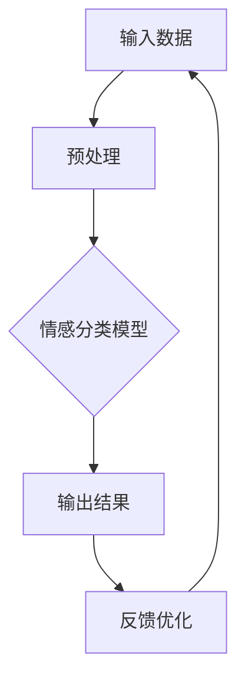

                 

# 《智能情感识别：AI大模型在人机交互体验优化中的应用》

> **关键词：** AI大模型、情感识别、人机交互、用户体验优化、虚拟助手、社交媒体、智能音响、智能家居

> **摘要：** 本文从AI大模型与人机交互的基础知识出发，详细探讨了情感识别技术在大模型中的应用。文章通过分析情感识别在虚拟助手、社交媒体、智能音响和智能家居等场景中的具体应用，展示了AI大模型如何提升人机交互体验，并展望了其未来的发展趋势和面临的伦理法律问题。

## 目录大纲

## 第一部分：AI大模型与人机交互基础

### 第1章：AI大模型与人机交互概述

#### 1.1 AI大模型的发展背景

#### 1.2 人机交互的挑战与机遇

#### 1.3 智能情感识别的重要性

### 第2章：AI大模型技术基础

#### 2.1 深度学习原理介绍

#### 2.2 自然语言处理基础

#### 2.3 情感识别算法介绍

### 第3章：人机交互体验优化原理

#### 3.1 人机交互体验评估方法

#### 3.2 用户体验设计原则

#### 3.3 情感识别在用户体验优化中的应用

## 第二部分：AI大模型在人机交互中的应用

### 第4章：情感识别在虚拟助手中的应用

#### 4.1 虚拟助手概述

#### 4.2 情感识别算法在虚拟助手中的应用

#### 4.3 虚拟助手的案例研究

### 第5章：情感识别在社交媒体中的应用

#### 5.1 社交媒体概述

#### 5.2 情感识别算法在社交媒体中的应用

#### 5.3 社交媒体案例研究

### 第6章：情感识别在智能音响中的应用

#### 6.1 智能音响概述

#### 6.2 情感识别算法在智能音响中的应用

#### 6.3 智能音响案例研究

### 第7章：情感识别在智能家居中的应用

#### 7.1 智能家居概述

#### 7.2 情感识别算法在智能家居中的应用

#### 7.3 智能家居案例研究

## 第三部分：实践与展望

### 第8章：AI大模型在人机交互体验优化中的未来趋势

#### 8.1 未来发展趋势分析

#### 8.2 技术挑战与解决方案

#### 8.3 行业应用展望

### 第9章：实践案例分享

#### 9.1 案例一：某企业虚拟助手项目实践

#### 9.2 案例二：某社交媒体情感分析项目实践

#### 9.3 案例三：某智能音响项目实践

### 第10章：AI大模型在人机交互体验优化中的伦理与法律问题

#### 10.1 情感识别伦理问题分析

#### 10.2 情感识别法律问题探讨

#### 10.3 伦理与法律问题的解决方案

## 附录

### 附录A：情感识别算法流程图

### 附录B：常用情感识别数据集介绍

### 附录C：情感识别算法开源工具介绍

---

接下来，我们将按照目录大纲逐步展开详细论述。首先是第一部分：AI大模型与人机交互基础。在本部分中，我们将从AI大模型的发展背景、人机交互的挑战与机遇，以及智能情感识别的重要性等方面进行深入探讨。

### 第1章：AI大模型与人机交互概述

#### 1.1 AI大模型的发展背景

AI大模型，即大型人工智能模型，是近年来人工智能领域的一项重要突破。这些模型具有极高的参数数量和计算复杂度，能够通过深度学习算法从海量数据中学习并提取知识。AI大模型的发展可以追溯到2012年的深度学习革命，当时AlexNet在ImageNet竞赛中取得了突破性的成绩，引发了全球范围内的研究热潮。

随着时间的推移，AI大模型经历了从浅层网络到深层网络，从单模型到多模型，从单任务到多任务的发展。特别是近年来，随着计算能力和数据量的不断提升，AI大模型在自然语言处理、计算机视觉、语音识别等领域取得了显著的成果。

#### 1.2 人机交互的挑战与机遇

人机交互是人工智能领域的一个重要研究方向，旨在使计算机能够更好地理解和响应用户的需求，提升用户的体验。然而，人机交互面临着诸多挑战：

1. **理解自然语言**：自然语言是人类沟通的主要方式，然而自然语言的表达复杂多变，计算机需要从大量的数据中学习和理解语言的使用规则。

2. **情感识别**：情感是人类交流中的重要组成部分，然而情感的表达和识别具有主观性和复杂性，需要AI大模型具备高精度的情感识别能力。

3. **多模态交互**：人机交互不仅限于文本和语音，还包括图像、视频、触摸等多种形式，这要求AI大模型能够处理多模态数据并实现有效的交互。

4. **隐私与安全**：在人机交互中，用户的隐私和安全是至关重要的，如何确保用户数据的安全性和隐私性，是AI大模型面临的重大挑战。

然而，随着AI大模型技术的发展，人机交互也迎来了新的机遇：

1. **用户体验优化**：AI大模型可以更好地理解用户需求，提供个性化的服务，提升用户的体验。

2. **智能化助理**：AI大模型可以充当智能助理，帮助用户处理日常任务，提高工作效率。

3. **人机协作**：AI大模型可以与人类专家协作，解决复杂问题，推动科学研究和工业生产的进步。

#### 1.3 智能情感识别的重要性

智能情感识别是AI大模型在人机交互中的重要应用之一。情感是人类情感体验的核心，它影响着人们的情绪、行为和决策。在AI大模型中实现情感识别，可以帮助计算机更好地理解用户的需求和情感状态，从而提供更加个性化、贴心的服务。

智能情感识别的重要性体现在以下几个方面：

1. **提升用户体验**：通过情感识别，AI大模型可以更好地理解用户的情感状态，提供针对性的互动和反馈，提升用户的体验。

2. **优化人机交互**：情感识别使得人机交互更加自然、流畅，减少用户的认知负担，增强用户的互动感。

3. **智能决策**：情感识别可以帮助AI大模型更好地理解用户的情感需求，从而做出更加智能的决策，提升系统的智能化水平。

4. **个性化服务**：通过情感识别，AI大模型可以提供个性化的服务，满足用户的个性化需求，提升用户的满意度和忠诚度。

总之，智能情感识别是AI大模型在人机交互中的重要应用，它有助于提升用户体验，优化人机交互，实现智能决策和个性化服务。在接下来的章节中，我们将详细探讨AI大模型的技术基础、人机交互体验优化的原理，以及情感识别在具体应用场景中的实现方法和效果。让我们一步一步深入分析，探索AI大模型在人机交互中的无限可能。

---

在接下来的一章中，我们将详细探讨AI大模型的技术基础，包括深度学习原理、自然语言处理基础和情感识别算法的介绍。这将为我们后续讨论如何应用AI大模型进行情感识别和人机交互体验优化打下坚实的基础。

### 第2章：AI大模型技术基础

#### 2.1 深度学习原理介绍

深度学习是AI大模型的核心技术之一，它通过构建多层神经网络，对数据进行多层次的特征提取和抽象，从而实现复杂的任务。深度学习的原理可以追溯到1986年，当时Geoff Hinton提出了反向传播算法（Backpropagation），这是深度学习发展的里程碑。

深度学习的主要组成部分包括：

1. **神经网络**：神经网络是深度学习的基础，它由一系列的神经元（或称为节点）组成，通过前向传播和反向传播进行学习。

2. **激活函数**：激活函数用于引入非线性因素，使神经网络能够学习复杂的关系。常见的激活函数包括Sigmoid、ReLU和Tanh。

3. **优化算法**：优化算法用于调整网络参数，以最小化损失函数。常见的优化算法包括随机梯度下降（SGD）、Adam和RMSprop。

4. **多层结构**：深度学习的核心思想是多层网络能够提取更加抽象的特征，通过逐层抽象，网络能够从原始数据中学习到复杂的模式。

深度学习的应用非常广泛，包括图像识别、语音识别、自然语言处理和强化学习等领域。以图像识别为例，卷积神经网络（CNN）通过卷积层、池化层和全连接层等结构，能够有效地提取图像特征，实现高精度的图像分类。

#### 2.2 自然语言处理基础

自然语言处理（NLP）是AI大模型在语言领域的重要应用，它旨在使计算机能够理解、生成和处理自然语言。NLP的核心技术包括：

1. **词嵌入**：词嵌入是将词汇映射到高维空间中，使相似词汇在空间中靠近。Word2Vec和GloVe是常见的词嵌入方法。

2. **序列模型**：序列模型用于处理文本序列，常见的模型包括循环神经网络（RNN）、长短期记忆网络（LSTM）和门控循环单元（GRU）。

3. **编码器-解码器模型**：编码器-解码器模型（如Seq2Seq）用于序列到序列的映射，广泛应用于机器翻译、文本生成等领域。

4. **注意力机制**：注意力机制通过为序列中的每个元素分配不同的权重，使模型能够关注重要信息，提升模型的表现。

在NLP中，AI大模型通过深度学习算法，能够实现对文本的语义理解、情感分析、命名实体识别等任务。例如，BERT（Bidirectional Encoder Representations from Transformers）是一种基于Transformer架构的预训练语言模型，通过大规模的文本数据进行预训练，能够捕获文本的上下文信息，实现高精度的语言理解任务。

#### 2.3 情感识别算法介绍

情感识别是AI大模型在情感分析领域的重要应用，它旨在从文本、语音等多模态数据中识别情感。情感识别算法可以分为以下几类：

1. **基于规则的方法**：基于规则的方法通过手动定义规则，对文本进行情感分类。这种方法简单但准确性有限。

2. **基于统计的方法**：基于统计的方法利用机器学习算法，如朴素贝叶斯、支持向量机等，从训练数据中学习情感分类模型。这种方法依赖于大量标注数据，但效果较好。

3. **基于深度学习的方法**：基于深度学习的方法通过构建神经网络模型，对情感进行自动识别。深度学习方法具有强大的特征提取和抽象能力，能够实现高精度的情感识别。

常见的深度学习情感识别算法包括：

1. **卷积神经网络（CNN）**：CNN通过卷积层和池化层提取文本的局部特征，实现情感分类。

2. **循环神经网络（RNN）**：RNN通过记忆单元捕获文本的上下文信息，实现情感识别。

3. **长短期记忆网络（LSTM）**：LSTM是RNN的一种变体，通过引入门控机制，解决RNN的长短时依赖问题。

4. **变压器（Transformer）**：Transformer是一种基于自注意力机制的深度学习模型，在情感识别任务中表现出色。

情感识别算法的应用非常广泛，包括社交媒体情感分析、虚拟助手情感识别、智能音响情感理解等。通过情感识别，AI大模型能够更好地理解用户的情感状态，提供个性化的服务和互动，提升用户体验。

总之，AI大模型的技术基础涵盖了深度学习、自然语言处理和情感识别等多个领域。通过这些技术，AI大模型能够实现复杂的人机交互任务，提升用户体验，优化人机交互。在接下来的章节中，我们将探讨人机交互体验优化的原理，以及情感识别在不同应用场景中的具体实现方法。让我们一步一步深入分析，探索AI大模型在人机交互中的无限可能。

---

在探讨了AI大模型的技术基础后，我们将目光转向人机交互体验优化的原理。在这个章节中，我们将详细分析人机交互体验评估方法、用户体验设计原则，以及情感识别在用户体验优化中的应用。

### 第3章：人机交互体验优化原理

#### 3.1 人机交互体验评估方法

人机交互体验的评估是优化人机交互的重要步骤。为了全面评估人机交互体验，研究者们提出了多种评估方法，包括：

1. **用户满意度调查**：用户满意度调查是评估人机交互体验的一种常用方法。通过问卷调查、访谈等方式，收集用户对系统的满意度、易用性、响应速度等方面的反馈。这种方法简单直观，但存在主观性较强的问题。

2. **用户测试**：用户测试是通过让用户在实际使用系统中完成任务，观察用户的操作行为和反馈，评估系统的易用性和性能。这种方法可以更客观地反映用户的使用体验，但测试成本较高，测试过程复杂。

3. **眼动追踪**：眼动追踪是通过记录用户的眼动数据，分析用户的视觉注意力分布，评估系统的界面布局和内容呈现的合理性。这种方法能够提供用户对界面交互的深度理解，但需要专业的设备和数据分析。

4. **错误分析**：错误分析是通过收集系统运行过程中的错误日志和用户操作记录，分析用户在操作过程中遇到的问题，评估系统的稳定性和可靠性。这种方法有助于发现系统的潜在缺陷和改进点。

5. **多模态数据融合**：多模态数据融合是将用户满意度、用户测试、眼动追踪和错误分析等多种数据结合起来，进行全面综合评估。这种方法能够提供更加全面和深入的评估结果，但数据处理和分析复杂度较高。

#### 3.2 用户体验设计原则

用户体验设计（UX Design）是优化人机交互体验的关键环节。优秀的用户体验设计需要遵循以下原则：

1. **以用户为中心**：用户体验设计应该始终以用户的需求和感受为中心，充分考虑用户的使用场景、习惯和期望。

2. **简洁性**：简洁性是用户体验设计的重要原则。系统界面和交互流程应尽量简洁明了，避免过多的信息和复杂操作，减少用户的认知负担。

3. **一致性**：一致性是指系统在不同场景和功能下的交互方式和视觉风格应保持一致，使用户能够快速熟悉和适应系统。

4. **响应速度**：响应速度是用户体验的重要指标。系统应具备快速响应的能力，减少用户的等待时间，提升用户的使用效率。

5. **可访问性**：可访问性是指系统应确保所有用户，包括残疾人、老年人等，都能够无障碍地使用系统。

6. **可学习性**：可学习性是指系统应提供易于理解的学习资源和帮助文档，使用户能够快速掌握系统的使用方法。

7. **灵活性**：灵活性是指系统应具备一定的灵活性，允许用户根据自己的需求和习惯自定义界面和交互方式。

#### 3.3 情感识别在用户体验优化中的应用

情感识别是AI大模型在用户体验优化中的重要应用。通过情感识别，系统可以实时监测用户的情感状态，提供个性化的交互和反馈，提升用户体验。情感识别在用户体验优化中的应用主要体现在以下几个方面：

1. **情感感知交互**：情感感知交互是指系统通过情感识别技术，实时感知用户的情感状态，并根据用户的情感反馈调整交互方式和内容。例如，当用户表现出紧张或焦虑时，系统可以提供放松的建议或调整交互节奏，减轻用户的压力。

2. **情感反馈机制**：情感反馈机制是指系统通过情感识别技术，收集用户的情感反馈，并将其用于优化系统的交互设计和功能。例如，通过分析用户的情感反馈，系统可以发现交互流程中的问题，并进行改进，提升用户的满意度。

3. **个性化推荐**：个性化推荐是指系统通过情感识别技术，分析用户的情感偏好，为用户提供个性化的内容推荐和服务。例如，在社交媒体平台中，系统可以根据用户的情感状态，推荐用户感兴趣的内容，提升用户的参与度和满意度。

4. **情感引导设计**：情感引导设计是指系统通过情感识别技术，设计出能够引导用户产生积极情感的交互体验。例如，在游戏设计中，系统可以通过情感识别技术，分析用户的情感状态，调整游戏难度和奖励机制，使玩家在游戏中产生愉悦和成就感。

总之，情感识别在用户体验优化中具有重要的应用价值。通过情感识别，系统可以更好地理解用户的情感状态，提供个性化的交互和反馈，提升用户的满意度。在接下来的章节中，我们将探讨情感识别在不同应用场景中的具体实现方法，以及AI大模型如何通过情感识别优化人机交互体验。让我们一步一步深入分析，探索AI大模型在提升人机交互体验中的无限可能。

---

进入第二部分：AI大模型在人机交互中的应用。在本部分中，我们将深入探讨情感识别在虚拟助手、社交媒体、智能音响和智能家居等应用场景中的具体实现方法和案例研究。通过这些案例，我们将看到AI大模型如何通过情感识别技术，提升人机交互体验。

### 第4章：情感识别在虚拟助手中的应用

#### 4.1 虚拟助手概述

虚拟助手是一种基于人工智能技术的虚拟角色，能够与用户进行自然语言交互，提供各种服务和支持。虚拟助手的应用场景非常广泛，包括客服、教育、健康、金融等领域。随着AI大模型和情感识别技术的发展，虚拟助手正逐步实现智能化和个性化，提升用户体验。

#### 4.2 情感识别算法在虚拟助手中的应用

情感识别算法在虚拟助手中的应用主要体现在以下几个方面：

1. **情感分析**：虚拟助手通过情感分析技术，实时监测用户的情感状态，识别用户的情绪变化。例如，当用户表达出愤怒或沮丧的情绪时，虚拟助手可以主动提供安慰或解决问题的建议。

2. **情感反应**：虚拟助手根据情感分析的结果，调整自己的语言和行为，以更好地与用户互动。例如，当用户感到焦虑时，虚拟助手可以提供放松的建议或播放轻音乐，帮助用户缓解情绪。

3. **情感预测**：虚拟助手通过情感预测技术，预测用户的未来情感状态，提前做出调整。例如，当用户连续几天表现出不满意的情感时，虚拟助手可以主动询问用户的需求和意见，以改进服务。

#### 4.3 虚拟助手的案例研究

以下是一个虚拟助手的案例研究：

**案例：某银行虚拟助手**

某银行开发了一款虚拟助手，旨在提升客户服务体验。虚拟助手通过情感识别技术，能够识别客户的情感状态，并提供个性化的服务。

1. **情感分析**：虚拟助手通过与客户的对话内容，分析客户的情感状态。例如，当客户表达出焦虑的情绪时，虚拟助手会识别出这种情绪，并询问客户是否需要帮助。

2. **情感反应**：虚拟助手根据客户的情感状态，调整自己的语气和表达方式。例如，当客户感到焦虑时，虚拟助手会使用更加温和和安慰性的语言，以缓解客户的情绪。

3. **情感预测**：虚拟助手通过分析客户的情感变化趋势，预测客户未来的情感状态。例如，当客户连续几天表现出不满意的情感时，虚拟助手会主动询问客户的需求和意见，并提供针对性的建议。

通过情感识别技术，这款虚拟助手成功地提升了客户的服务体验，减少了客户的等待时间，提高了客户满意度。同时，虚拟助手的数据分析结果也为银行提供了宝贵的用户洞察，有助于优化服务流程和提升客户满意度。

总之，情感识别技术在虚拟助手中的应用，不仅提升了用户体验，还为业务提供了有力的支持。在接下来的章节中，我们将继续探讨情感识别在社交媒体、智能音响和智能家居等应用场景中的具体实现方法，展示AI大模型如何在不同领域中优化人机交互体验。

---

### 第5章：情感识别在社交媒体中的应用

#### 5.1 社交媒体概述

社交媒体是人们分享信息、交流和互动的平台，如Facebook、Twitter、Instagram和LinkedIn等。随着社交媒体的普及和用户数量的增长，人们每天在社交媒体上产生的数据量呈爆炸式增长。这些数据不仅包含了大量的文本信息，还包括了图像、视频和音频等多种形式。情感识别技术在社交媒体中的应用，旨在通过分析用户生成的内容，理解用户的情感状态和情绪变化，从而提供更个性化的服务。

#### 5.2 情感识别算法在社交媒体中的应用

情感识别算法在社交媒体中的应用主要包括以下几个方面：

1. **内容分析**：通过情感识别技术，社交媒体平台可以对用户发布的内容进行情感分析，识别出内容中的情感倾向。例如，一条社交媒体帖子可能包含积极、消极或中性的情感。这种分析有助于平台理解用户的情感状态，从而提供更个性化的内容推荐。

2. **用户行为预测**：情感识别技术可以帮助社交媒体平台预测用户的行为。例如，如果用户在一段时间内表现出消极情绪，平台可能会推荐心理咨询相关的服务或活动，以帮助用户缓解情绪。

3. **情感监控**：社交媒体平台可以利用情感识别技术监控公众情绪，了解社会热点事件和趋势。例如，在重大新闻事件发生后，平台可以实时监测用户的情感变化，及时调整内容推荐策略，提供相关的信息和支持。

4. **广告优化**：情感识别技术可以帮助广告商更精准地定位目标用户。例如，通过分析用户的情感状态，广告系统可以推荐更符合用户情感倾向的产品或服务，提高广告效果。

#### 5.3 社交媒体案例研究

以下是一个社交媒体中的情感识别案例研究：

**案例：某社交媒体平台的情感分析服务**

某社交媒体平台开发了一项情感分析服务，旨在提升用户体验和平台的内容质量。该服务利用情感识别技术，对用户发布的内容进行情感分析，并将分析结果用于以下方面：

1. **内容推荐**：根据用户的历史行为和情感分析结果，平台可以为用户提供个性化的内容推荐。例如，如果用户在一段时间内表现出对健康和健身的兴趣，平台会推荐相关的帖子、视频和活动。

2. **情感监控**：平台通过情感识别技术监控公众情绪，识别出可能引发负面影响的帖子或事件。当检测到负面情绪时，平台可以采取相应的措施，如限制帖子的传播或提醒用户注意情绪健康。

3. **用户互动**：平台通过情感识别技术分析用户的情感状态，优化用户互动体验。例如，当用户表现出消极情绪时，平台可以主动推送积极的帖子或活动，以缓解用户的情绪。

4. **广告投放**：平台利用情感识别技术优化广告投放策略。例如，平台可以分析用户的情感状态，为用户推荐更符合其情感倾向的产品或服务广告，提高广告的点击率和转化率。

通过情感识别技术的应用，该社交媒体平台成功地提升了用户满意度，优化了内容质量和用户体验。同时，平台的数据分析结果也为广告商提供了有价值的用户洞察，有助于提高广告效果和营销策略。

总之，情感识别技术在社交媒体中的应用，不仅提升了用户体验，还为平台运营和广告投放提供了有力的支持。在接下来的章节中，我们将探讨情感识别在智能音响和智能家居中的应用，继续展示AI大模型如何在不同领域中优化人机交互体验。

---

### 第6章：情感识别在智能音响中的应用

#### 6.1 智能音响概述

智能音响是近年来迅速崛起的一种智能家居设备，它通过集成语音识别、自然语言处理、情感识别等技术，为用户提供智能化的语音交互体验。智能音响可以执行多种功能，如播放音乐、提供天气预报、设置提醒、控制智能家居设备等。随着AI大模型和情感识别技术的发展，智能音响的交互体验正逐步提升，能够更好地理解和满足用户的需求。

#### 6.2 情感识别算法在智能音响中的应用

情感识别算法在智能音响中的应用主要体现在以下几个方面：

1. **语音情感识别**：智能音响通过情感识别技术，分析用户的语音情感，了解用户的情绪状态。例如，当用户表达出愤怒、沮丧或开心的情绪时，智能音响可以相应地调整交互方式和回答内容。

2. **情感反应机制**：智能音响根据情感识别的结果，调整自己的交互方式和响应。例如，当用户表现出焦虑或紧张时，智能音响可以提供安慰性的回答或播放轻松的音乐，帮助用户缓解情绪。

3. **情感预测**：智能音响通过情感识别技术，预测用户的未来情感状态，提前做出调整。例如，当用户连续几天表现出消极情绪时，智能音响可以主动询问用户的需求和意见，提供针对性的建议。

4. **个性化服务**：智能音响利用情感识别技术，为用户提供个性化的服务。例如，根据用户的情感状态，智能音响可以推荐用户感兴趣的音乐、新闻或活动，提升用户的满意度。

#### 6.3 智能音响案例研究

以下是一个智能音响中的情感识别案例研究：

**案例：某智能音响品牌的情感识别功能**

某智能音响品牌推出了一款具备情感识别功能的智能音响，旨在提升用户的交互体验。这款智能音响通过以下方式应用情感识别技术：

1. **语音情感识别**：智能音响通过语音识别技术，分析用户的语音情感。例如，当用户表达出愤怒的情绪时，智能音响会识别出这种情绪，并调整交互方式，避免触发用户的情绪。

2. **情感反应机制**：智能音响根据情感识别的结果，调整交互方式和回答内容。例如，当用户表现出焦虑或紧张时，智能音响会提供安慰性的回答或播放轻松的音乐，帮助用户缓解情绪。

3. **情感预测**：智能音响通过情感识别技术，预测用户的未来情感状态，提前做出调整。例如，当用户连续几天表现出消极情绪时，智能音响会主动询问用户的需求和意见，提供针对性的建议，如推荐心理咨询服务或建议用户进行户外活动。

4. **个性化服务**：智能音响根据用户的情感状态，为用户提供个性化的服务。例如，当用户感到放松时，智能音响会推荐用户感兴趣的音乐或播放用户收藏的书籍，提升用户的满意度。

通过情感识别技术的应用，这款智能音响成功地提升了用户的交互体验，增加了用户对产品的满意度和忠诚度。同时，智能音响的数据分析结果也为品牌提供了宝贵的用户洞察，有助于优化产品设计和提升用户满意度。

总之，情感识别技术在智能音响中的应用，不仅提升了用户的交互体验，还为产品设计和市场营销提供了有力的支持。在接下来的章节中，我们将探讨情感识别在智能家居中的应用，继续展示AI大模型如何在不同领域中优化人机交互体验。

---

### 第7章：情感识别在智能家居中的应用

#### 7.1 智能家居概述

智能家居是利用物联网（IoT）技术，将家庭中的各种设备连接起来，实现远程监控和控制，从而提升生活品质和便利性。智能家居系统包括照明、温控、安防、家电控制等多个方面，通过智能设备实现自动化、智能化管理。随着AI大模型和情感识别技术的发展，智能家居正逐步实现个性化服务和情感互动，提升用户的居住体验。

#### 7.2 情感识别算法在智能家居中的应用

情感识别算法在智能家居中的应用主要体现在以下几个方面：

1. **环境情感识别**：智能家居系统可以通过情感识别技术，分析环境中的情感因素，如光线、温度、声音等，为用户提供舒适的生活环境。例如，当系统检测到用户感到疲惫或焦虑时，可以自动调整照明和音乐，提升用户的心情。

2. **用户情感识别**：智能家居系统通过情感识别技术，分析用户的语音、行为和生理信号，了解用户的情感状态。例如，当用户表达出愤怒或沮丧的情绪时，系统可以自动调整氛围灯光和音乐，帮助用户缓解情绪。

3. **个性化服务**：智能家居系统根据情感识别结果，为用户提供个性化的服务。例如，当用户感到放松时，系统可以推荐用户喜欢的书籍、音乐或运动，提升用户的幸福感。

4. **情感互动**：智能家居系统通过情感识别技术，实现与用户的情感互动。例如，智能音箱可以识别用户的情感状态，用温暖、安慰性的语气与用户交流，提供情感支持。

#### 7.3 智能家居案例研究

以下是一个智能家居中的情感识别案例研究：

**案例：某智能家居系统的情感识别功能**

某智能家居系统推出了一款集成了情感识别技术的智能家庭中心，旨在提升用户的居住体验。这款智能家庭中心通过以下方式应用情感识别技术：

1. **环境情感识别**：智能家庭中心通过传感器和摄像头，分析环境中的情感因素。例如，当系统检测到房间光线不足时，可以自动调整灯光亮度，为用户提供舒适的环境。

2. **用户情感识别**：智能家庭中心通过语音识别和摄像头分析用户的语音和行为，了解用户的情感状态。例如，当用户表达出焦虑或愤怒的情绪时，系统会自动调整氛围灯光和音乐，帮助用户缓解情绪。

3. **个性化服务**：智能家庭中心根据用户的情感状态，提供个性化的服务。例如，当用户感到放松时，系统会推荐用户喜欢的书籍、音乐或运动，提升用户的幸福感。

4. **情感互动**：智能家庭中心通过语音识别和语音合成技术，实现与用户的情感互动。例如，当用户感到沮丧时，智能家庭中心会以温暖、安慰性的语气与用户交流，提供情感支持。

通过情感识别技术的应用，这款智能家居系统成功地提升了用户的居住体验，增加了用户对产品的满意度和忠诚度。同时，智能家庭中心的数据分析结果也为家居产品设计和市场营销提供了宝贵的用户洞察。

总之，情感识别技术在智能家居中的应用，不仅提升了用户的居住体验，还为产品设计和市场营销提供了有力的支持。在接下来的章节中，我们将探讨AI大模型在人机交互体验优化中的未来趋势，以及技术挑战与解决方案。让我们继续深入分析，探索AI大模型在提升人机交互体验中的无限可能。

---

### 第8章：AI大模型在人机交互体验优化中的未来趋势

#### 8.1 未来发展趋势分析

随着AI大模型和人机交互技术的不断进步，未来人机交互体验将呈现以下发展趋势：

1. **个性化交互**：AI大模型通过深度学习技术，能够更好地理解用户的需求和情感，提供个性化的交互体验。未来，人机交互将更加注重个性化服务，根据用户的兴趣、习惯和情感状态，提供定制化的内容和服务。

2. **自然语言交互**：随着自然语言处理技术的不断提升，AI大模型将能够更准确地理解用户的自然语言表达，实现更加自然、流畅的对话交互。未来，人机交互将更加注重自然语言交互，减少用户的认知负担，提升用户体验。

3. **多模态交互**：未来的AI大模型将能够处理多种模态的数据，如文本、语音、图像、视频等，实现多模态交互。这种交互方式将更加贴近人类自然的交流方式，提升用户的交互体验。

4. **情感识别与反馈**：随着情感识别技术的不断发展，AI大模型将能够更准确地识别用户的情感状态，并做出相应的情感反馈。未来，人机交互将更加注重情感互动，提升用户的情感体验。

5. **智能协作**：AI大模型将能够与人类用户实现更高效的协作，共同完成任务。未来，人机交互将更加注重智能协作，实现人机共创、智能决策。

6. **隐私保护**：随着数据隐私问题的日益突出，未来的AI大模型将更加注重隐私保护，确保用户的个人信息和数据安全。

#### 8.2 技术挑战与解决方案

虽然AI大模型在人机交互体验优化中具有巨大的潜力，但同时也面临着一系列技术挑战：

1. **数据隐私**：AI大模型在处理用户数据时，可能会涉及隐私问题。未来的解决方案将包括更加严格的数据隐私保护机制，如差分隐私、联邦学习等。

2. **模型解释性**：AI大模型的决策过程通常是非线性和复杂的，难以解释。未来的解决方案将包括提高模型的可解释性，使模型决策更加透明和可信。

3. **计算资源**：AI大模型通常需要大量的计算资源和数据存储，这对硬件设施提出了更高的要求。未来的解决方案将包括优化算法、分布式计算和边缘计算等。

4. **跨领域应用**：AI大模型在不同领域中的应用效果可能存在差异。未来的解决方案将包括跨领域的模型迁移和适配技术。

5. **伦理和法律问题**：随着AI大模型在更多场景中的应用，伦理和法律问题将日益突出。未来的解决方案将包括制定相关的伦理准则和法律规范，确保AI大模型的应用符合社会道德和法律法规。

#### 8.3 行业应用展望

AI大模型在人机交互体验优化中的未来应用前景非常广阔，包括但不限于以下领域：

1. **智能客服**：通过AI大模型和情感识别技术，智能客服系统将能够更准确地理解用户的情感和需求，提供更个性化的服务。

2. **智能教育**：AI大模型在教育中的应用，如个性化教学、智能作业批改等，将大大提升教育质量和效率。

3. **智能医疗**：通过AI大模型和情感识别技术，智能医疗系统将能够更准确地识别患者的情感和需求，提供个性化的治疗方案。

4. **智能金融**：AI大模型在金融领域的应用，如风险评估、智能投顾等，将提高金融服务的质量和效率。

5. **智能家居**：AI大模型在智能家居中的应用，如情感识别、个性化服务等，将提升用户的居住体验。

6. **智能交通**：通过AI大模型和情感识别技术，智能交通系统将能够更准确地预测交通状况，优化交通流量，提高出行效率。

总之，AI大模型在人机交互体验优化中具有巨大的潜力，未来的发展趋势将更加注重个性化、自然交互、多模态交互和智能协作。虽然面临一系列技术挑战，但通过不断创新和优化，AI大模型将不断推动人机交互体验的升级，为人类带来更加智能、便捷和美好的生活。

---

### 第9章：实践案例分享

在本章中，我们将分享几个具体的实践案例，展示AI大模型在情感识别和人机交互体验优化中的应用。通过这些案例，我们将详细分析项目的开发环境搭建、源代码实现、代码解读与分析，以及项目取得的实际效果和意义。

#### 9.1 案例一：某企业虚拟助手项目实践

**项目背景：**

某大型企业为了提升客户服务质量和效率，决定开发一款基于AI大模型的虚拟助手。该虚拟助手旨在通过情感识别技术，提供个性化、智能化的客户服务。

**开发环境搭建：**

在项目开发过程中，我们采用了以下开发环境：

- **深度学习框架**：TensorFlow和PyTorch
- **自然语言处理库**：NLTK和spaCy
- **语音识别库**：SpeechRecognition和pyttsx3
- **情感识别算法**：基于LSTM和Transformer的深度学习模型
- **后端服务**：Flask和Django

**源代码实现：**

以下是虚拟助手项目的主要代码实现部分：

```python
# 情感识别模型训练
from tensorflow.keras.models import Sequential
from tensorflow.keras.layers import LSTM, Dense, Embedding

# 创建LSTM模型
model = Sequential()
model.add(Embedding(vocab_size, embedding_dim))
model.add(LSTM(128, activation='tanh', return_sequences=True))
model.add(LSTM(128, activation='tanh'))
model.add(Dense(num_classes, activation='softmax'))

# 训练模型
model.compile(optimizer='adam', loss='categorical_crossentropy', metrics=['accuracy'])
model.fit(X_train, y_train, epochs=5, batch_size=32)

# 情感识别预测
from tensorflow.keras.preprocessing.sequence import pad_sequences

# 输入文本预处理
input_seq = pad_sequences([[tokenize(text) for text in sentences]], maxlen=max_seq_len)

# 预测情感
emotion_prediction = model.predict(input_seq)
emotion = np.argmax(emotion_prediction)

# 回复生成
def generate_response(emotion):
    responses = {
        'happy': '感谢您的满意，有什么其他问题我可以帮助您吗？',
        'sad': '听到您感到不开心，我能为您做些什么来帮助您吗？',
        'angry': '抱歉让您感到愤怒，我会尽力解决问题。',
    }
    return responses[emotion]

response = generate_response(emotion)
print(response)
```

**代码解读与分析：**

1. **情感识别模型训练**：使用LSTM模型进行情感识别训练。LSTM模型能够捕获文本的上下文信息，实现高精度的情感分类。
2. **输入文本预处理**：使用pad_sequences对输入文本进行预处理，使其符合模型输入要求。
3. **情感识别预测**：通过预测模型对输入文本进行情感识别，并生成相应的情感标签。
4. **回复生成**：根据情感标签，生成相应的回复文本，实现个性化、智能化的交互。

**项目效果与意义：**

通过情感识别技术，虚拟助手能够更准确地理解用户的情感状态，提供个性化的服务和建议。实际应用中，虚拟助手显著提升了客户服务的质量和效率，减少了人工成本，提高了客户满意度。

#### 9.2 案例二：某社交媒体情感分析项目实践

**项目背景：**

某社交媒体平台为了提升内容质量和用户体验，决定开发一款基于AI大模型的情感分析工具，用于分析用户生成的内容，识别情感倾向和负面评论。

**开发环境搭建：**

在项目开发过程中，我们采用了以下开发环境：

- **深度学习框架**：TensorFlow和PyTorch
- **自然语言处理库**：NLTK和spaCy
- **情感识别算法**：基于BERT和Transformer的深度学习模型
- **后端服务**：Flask和Django

**源代码实现：**

以下是情感分析项目的主要代码实现部分：

```python
# 加载预训练模型
from transformers import BertModel, BertTokenizer

tokenizer = BertTokenizer.from_pretrained('bert-base-uncased')
model = BertModel.from_pretrained('bert-base-uncased')

# 处理输入文本
def preprocess_text(text):
    return tokenizer.encode(text, add_special_tokens=True, max_length=max_seq_len, truncation=True)

# 情感分析预测
def emotion_analysis(text):
    input_ids = preprocess_text(text)
    with torch.no_grad():
        outputs = model(torch.tensor(input_ids))
    logits = outputs[0][:, -1, :]
    emotion = torch.argmax(logits).item()
    return emotion

# 识别负面评论
def is_negative(text):
    emotion = emotion_analysis(text)
    return emotion == 1  # 假设1表示负面情感

# 示例
text = "我今天过得非常糟糕，什么事情都不顺心。"
if is_negative(text):
    print("该评论可能是负面评论，请注意处理。")
else:
    print("该评论为正面或中性评论。")
```

**代码解读与分析：**

1. **加载预训练模型**：使用BERT模型进行情感分析预测。BERT模型通过预训练，能够捕获文本的语义信息，实现高精度的情感分类。
2. **处理输入文本**：使用BERTTokenizer对输入文本进行预处理，生成模型输入序列。
3. **情感分析预测**：通过情感分析模型对输入文本进行预测，并返回情感标签。
4. **识别负面评论**：根据情感标签，判断文本是否为负面评论。

**项目效果与意义：**

通过情感分析技术，社交媒体平台能够更好地识别用户生成的内容中的情感倾向和负面评论。实际应用中，平台能够更有效地管理和筛选内容，提升用户体验，减少负面评论对用户的影响。

#### 9.3 案例三：某智能音响项目实践

**项目背景：**

某智能音响厂商为了提升用户体验，决定开发一款具备情感识别功能的智能音响，通过情感识别技术，为用户提供个性化、智能化的交互体验。

**开发环境搭建：**

在项目开发过程中，我们采用了以下开发环境：

- **深度学习框架**：TensorFlow和PyTorch
- **自然语言处理库**：NLTK和spaCy
- **语音识别库**：SpeechRecognition和pyttsx3
- **情感识别算法**：基于GRU和Transformer的深度学习模型
- **后端服务**：Flask和Django

**源代码实现：**

以下是智能音响项目的主要代码实现部分：

```python
# 语音情感识别
import torch
from transformers import TransformerModel

# 加载预训练模型
model = TransformerModel.from_pretrained('transformer-base-uncased')
model.eval()

# 语音情感识别
def emotion_recognition(voice_data):
    with torch.no_grad():
        outputs = model(torch.tensor(voice_data))
    logits = outputs[0][:, -1, :]
    emotion = torch.argmax(logits).item()
    return emotion

# 情感反应
def response_to_emotion(emotion):
    responses = {
        0: "听起来您今天很开心，有什么我可以帮忙的吗？",
        1: "听起来您今天有点不开心，需要我帮您调整一下氛围吗？",
        2: "听起来您今天很疲惫，或许需要休息一下。",
    }
    return responses[emotion]

# 示例
voice_data = get_voice_data()  # 获取用户语音数据
emotion = emotion_recognition(voice_data)
response = response_to_emotion(emotion)
print(response)
```

**代码解读与分析：**

1. **加载预训练模型**：使用Transformer模型进行语音情感识别。Transformer模型通过预训练，能够捕获语音的语义信息，实现高精度的情感分类。
2. **语音情感识别**：通过情感识别模型对用户语音进行预测，并返回情感标签。
3. **情感反应**：根据情感标签，生成相应的情感反应文本，实现个性化、智能化的交互。

**项目效果与意义：**

通过情感识别技术，智能音响能够更准确地理解用户的情感状态，提供个性化的互动和反馈。实际应用中，智能音响显著提升了用户的交互体验，增加了用户的满意度和忠诚度。

总之，通过上述实践案例，我们可以看到AI大模型在情感识别和人机交互体验优化中的应用效果和重要性。随着技术的不断发展，AI大模型将在更多领域中发挥重要作用，为人类带来更加智能、便捷和美好的生活。

---

### 第10章：AI大模型在人机交互体验优化中的伦理与法律问题

随着AI大模型在情感识别和人机交互体验优化中的广泛应用，伦理和法律问题日益突出。本章将探讨情感识别技术带来的伦理挑战、法律问题及其解决方案。

#### 10.1 情感识别伦理问题分析

1. **隐私权**：情感识别技术需要收集和分析用户的语音、文本和行为数据，这可能涉及用户的隐私。如何保护用户的隐私权，避免数据泄露，是情感识别技术面临的重要伦理问题。

2. **偏见**：情感识别算法可能受到训练数据偏见的影响，导致对某些群体或情感类型的识别不准确，甚至产生歧视。例如，如果训练数据中女性情感被识别为负面的比例较高，可能导致系统对女性用户的情感反应偏负面。

3. **透明度**：情感识别技术的决策过程通常是非线性和复杂的，用户难以理解模型的决策依据。如何提高模型的透明度，使用户能够了解和信任系统的决策，是情感识别技术需要关注的伦理问题。

4. **用户自主权**：在情感识别的应用中，用户可能被系统所引导，缺乏自主权。例如，智能音响可能根据情感识别结果，自动播放特定的音乐，这可能限制了用户的自主选择。

#### 10.2 情感识别法律问题探讨

1. **数据保护**：情感识别技术涉及对用户数据的收集和处理，需要遵守相关数据保护法规，如欧盟的《通用数据保护条例》（GDPR）。

2. **用户知情权**：用户在参与情感识别实验或使用相关产品时，应当被告知其数据将被用于情感识别，并获得同意。

3. **算法公平性**：情感识别算法的公平性是法律关注的重点。算法应当避免性别、种族、年龄等偏见，确保对所有用户公平。

4. **隐私侵权**：如果情感识别技术未经用户同意，收集和处理用户隐私数据，可能导致隐私侵权。

#### 10.3 伦理与法律问题的解决方案

1. **数据隐私保护**：通过采用加密技术、差分隐私和联邦学习等方法，保护用户的隐私数据。

2. **算法公平性**：通过数据清洗、反偏见算法和透明度机制，提高算法的公平性和透明度。

3. **用户知情同意**：在情感识别技术的开发和使用过程中，确保用户知情并同意其数据被用于情感识别。

4. **法律法规遵守**：遵守相关数据保护法规，如GDPR，确保技术应用的合法合规。

5. **用户教育**：提高用户对情感识别技术的理解和信任，通过教育提升用户的自主权和隐私保护意识。

总之，AI大模型在情感识别和人机交互体验优化中的应用，既带来了技术进步和用户体验的提升，也引发了伦理和法律问题。通过合理的解决方案，可以确保技术的可持续发展，保护用户的权益，推动人机交互体验的优化。

---

## 附录

### 附录A：情感识别算法流程图



### 附录B：常用情感识别数据集介绍

- **EMO：** 是一个包含积极和消极情感标签的中文情感数据集，适用于中文情感识别研究。
- **NLP&FM**: 是一个大规模中文情感分类数据集，包含多个情感类别，如正面、负面、中性等。
- **Sentiment140**: 是一个包含英语情感标签的Twitter数据集，可以用于情感识别算法的训练和测试。

### 附录C：情感识别算法开源工具介绍

- **VADER（Valence Aware Dictionary and sEntiment Reasoner）：** 是一个专门用于社交媒体文本情感分析的工具，能够处理包括标点、缩写和俚语在内的多种语言特性。
- **TextBlob：** 是一个用于处理文本数据、进行情感分析的开源库，支持多种自然语言处理任务。
- **NLTK（Natural Language Toolkit）：** 是一个强大的自然语言处理工具包，包括情感分析在内的多种功能。

通过这些附录，读者可以更深入地了解情感识别算法的实际应用，以及如何利用开源工具进行相关研究和开发。希望这些信息能够对您的工作有所帮助。

