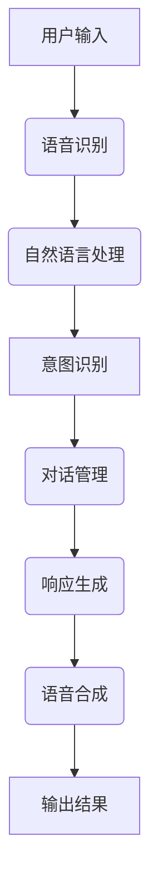

                 

### 智能语音助手在办公环境中的应用

#### 关键词：智能语音助手，办公环境，语音识别，自然语言处理，语音合成，应用场景

#### 摘要：
本文将深入探讨智能语音助手在办公环境中的应用，从技术基础到实际应用场景，再到系统开发与优化，为读者提供全面的技术解读和实战指南。我们将逐一分析智能语音助手的核心技术，如语音识别、自然语言处理、语音合成等，并详细介绍其应用场景和开发实战，旨在为读者提供一个清晰、深入的智能语音助手应用图谱。

---

### 目录大纲设计

本文将分为三个主要部分：

#### 第一部分：智能语音助手技术基础

1. **智能语音助手概述**
    - 智能语音助手发展历程与现状
    - 智能语音助手的核心功能与价值
    - 智能语音助手技术架构

2. **语音识别技术**
    - 语音信号处理基础
    - 声学模型
    - 语言模型

3. **自然语言处理技术**
    - 词性标注与句法分析
    - 语义理解与意图识别
    - 对话管理

4. **语音合成技术**
    - 合成语音的参数建模
    - 声音合成系统
    - 声音合成质量评估

#### 第二部分：智能语音助手在办公环境中的应用

5. **智能语音助手在办公环境中的应用场景**
    - 办公事务管理
    - 智能会议助手
    - 工作流程优化

6. **智能语音助手系统开发实战**
    - 开发环境搭建
    - 数据收集与处理
    - 系统设计与实现

#### 第三部分：智能语音助手优化与未来展望

7. **智能语音助手的优化与性能提升**
    - 语音识别准确率提升
    - 语义理解与响应优化
    - 语音合成自然度提升

8. **智能语音助手在办公环境中的未来趋势**
    - 智能化办公场景扩展
    - 智能语音助手与人工智能融合

#### 附录

9. **附录A：智能语音助手开发资源**
    - 开源语音识别与自然语言处理库
    - 常用语音合成工具与API
    - 智能语音助手开发教程与案例

10. **附录B：智能语音助手Mermaid流程图**

11. **附录C：智能语音助手核心算法伪代码**

12. **附录D：智能语音助手数学模型与公式**

13. **附录E：智能语音助手项目实战**

14. **附录F：智能语音助手代码解读与分析**

---

通过上述目录设计，我们希望能够系统地引导读者深入了解智能语音助手的各个方面，从技术原理到实际应用，再到开发与优化，为读者提供一个全面、深入的技术解读。接下来，我们将逐一探讨智能语音助手的技术基础和应用场景。首先，让我们从智能语音助手的发展历程与现状开始。<!── Assistant ──>

---

## 第一部分：智能语音助手技术基础

### 1.1 智能语音助手概述

#### 1.1.1 智能语音助手发展历程与现状

智能语音助手作为一种人工智能应用，其发展历程可以追溯到20世纪50年代。最初，语音助手仅限于简单的语音识别功能，例如执行简单的命令，如打电话、发送短信等。随着计算机技术的发展，智能语音助手逐渐具备了更复杂的自然语言处理能力。

20世纪80年代，基于规则的自然语言处理系统开始出现，这些系统依赖于预定义的语法规则和模板来理解和处理用户指令。然而，这类系统的适用范围有限，无法处理复杂的语言场景。

进入21世纪，深度学习和大数据技术的快速发展，为智能语音助手带来了新的契机。基于深度学习的语音识别和自然语言处理模型，如卷积神经网络（CNN）和循环神经网络（RNN），使得智能语音助手能够更好地理解和处理自然语言。

目前，智能语音助手已经成为众多科技公司的核心产品。例如，苹果的Siri、亚马逊的Alexa、谷歌的Google Assistant等，这些智能语音助手不仅能够执行简单的日常任务，还能够进行复杂的任务，如语音翻译、语音购物等。

#### 1.1.2 智能语音助手的核心功能与价值

智能语音助手的核心功能包括语音识别、自然语言处理、意图识别、对话管理、语音合成等。这些功能共同作用，使得智能语音助手能够与用户进行高效、自然的交互。

**语音识别**：将用户的语音输入转换为文本，是实现智能语音助手的基础。

**自然语言处理**：对语音输入进行语义分析，理解用户的意图和需求，是实现智能交互的关键。

**意图识别**：根据用户的语音输入，识别用户的目标或需求，是实现个性化服务的基础。

**对话管理**：根据用户的意图，生成适当的响应，并维持对话的流畅性。

**语音合成**：将处理后的文本转换为语音输出，实现人与智能助手的语音交流。

智能语音助手在办公环境中的应用价值主要体现在以下几个方面：

**提高工作效率**：智能语音助手可以协助用户快速处理日常事务，如日程安排、邮件处理、文件搜索等，从而提高工作效率。

**增强协作能力**：智能语音助手可以协助用户组织会议、记录会议内容、分配任务等，从而增强团队协作能力。

**优化工作流程**：智能语音助手可以协助用户自动化工作流程，减少手动操作，提高工作效率。

**降低成本**：智能语音助手可以减少人工操作，降低人力成本，同时提高工作效率，从而降低整体运营成本。

#### 1.2 智能语音助手技术架构

智能语音助手的技术架构通常包括语音识别、自然语言处理、意图识别、对话管理和语音合成等模块。下面我们将逐一介绍这些模块的功能和技术原理。

**1.2.1 语音识别**

语音识别是将用户的语音输入转换为文本的过程。其核心技术包括语音信号处理、声学模型和语言模型。

**语音信号处理**：语音信号处理是对原始语音信号进行预处理，包括滤波、去噪、共振峰增强等，以提高语音识别的准确性。

**声学模型**：声学模型用于将语音信号转换为特征向量，常用的声学模型包括高斯混合模型（GMM）和深度神经网络（DNN）。

**语言模型**：语言模型用于对语音识别结果进行后处理，通过统计语言模型概率来提高识别准确性。常用的语言模型包括N-gram模型和神经网络语言模型。

**1.2.2 自然语言处理**

自然语言处理是对语音识别结果进行语义分析的过程，包括词性标注、句法分析、语义理解等。

**词性标注**：词性标注用于识别文本中每个单词的词性，如名词、动词、形容词等。词性标注是句法分析和语义理解的基础。

**句法分析**：句法分析用于构建文本的语法结构，分析句子中的词汇关系，如主谓宾关系、从句关系等。

**语义理解**：语义理解用于理解文本的语义内容，识别文本中的实体、事件和关系。语义理解是实现智能语音助手个性化服务的关键。

**1.2.3 意图识别**

意图识别用于识别用户的意图或需求，是实现智能语音助手个性化服务的基础。

**意图识别方法**：意图识别方法包括基于规则的方法、基于统计的方法和基于深度学习的方法。其中，基于深度学习的方法如卷积神经网络（CNN）和循环神经网络（RNN）在意图识别中取得了较好的效果。

**意图识别挑战**：意图识别面临的主要挑战包括多义词处理、上下文理解、跨领域泛化等。

**1.2.4 对话管理**

对话管理用于维持对话的流畅性，确保智能语音助手能够理解并回应用户的对话内容。

**对话管理策略**：对话管理策略包括基于规则的方法、基于统计的方法和基于深度学习的方法。其中，基于深度学习的方法如序列到序列模型（Seq2Seq）在对话管理中取得了较好的效果。

**对话管理挑战**：对话管理面临的主要挑战包括多轮对话理解、对话连贯性、对话生成等。

**1.2.5 语音合成**

语音合成是将处理后的文本转换为语音输出的过程。其核心包括合成语音的参数建模、声音合成系统和声音合成质量评估。

**合成语音的参数建模**：合成语音的参数建模包括频率调制（Pitch）和时域波形（Duration）的建模。

**声音合成系统**：声音合成系统包括合成文本预处理、参数合成和声音输出。

**声音合成质量评估**：声音合成质量评估用于评估合成语音的自然度和清晰度，常用的评估方法包括客观评估和主观评估。

通过上述对智能语音助手技术架构的介绍，我们可以看到，智能语音助手是由多个模块组成的复杂系统，每个模块都有其独特的技术原理和应用场景。接下来，我们将进一步深入探讨语音识别技术，了解其基础和实现细节。<!── Assistant ──>

---

## 语音识别技术

语音识别（Automatic Speech Recognition，ASR）是将语音信号转换为文本的过程。语音识别技术是智能语音助手的核心组成部分，其发展经历了从传统方法到深度学习方法的演变。下面，我们将详细探讨语音识别技术的几个关键方面：语音信号处理、声学模型和语言模型。

### 2.1 语音信号处理基础

语音信号处理是语音识别的第一步，其主要任务是处理和净化原始语音信号，使其适合后续的特征提取和模型训练。语音信号处理包括以下几个主要步骤：

#### 2.1.1 声音信号的数字化

在计算机中，声音信号需要被数字化。这个过程包括以下几个步骤：

1. **采样**：以固定的时间间隔（称为采样率）对连续的语音信号进行采样。常见的采样率有8kHz、16kHz等。

2. **量化**：将每个采样点的幅度值转换为数字编码。量化过程中，每个采样点的值被映射到一个有限的数字范围内，如-32768到+32767。

3. **编码**：将量化后的数字信号编码为二进制序列，以供计算机处理。

#### 2.1.2 声音特征提取

数字化后的声音信号是一个时间序列的数字信号，需要通过特征提取来提取出能够代表语音信号特性的特征。常用的声音特征包括：

1. **梅尔频率倒谱系数（MFCC）**：MFCC是一种频率倒谱变换，能够将频率信息转换为时间域的特征，是语音识别中常用的特征。

2. **滤波器组**：将声音信号通过一组滤波器，每个滤波器对应一个频率带，生成一组频率响应，用于描述声音的频率分布。

3. **短时能量**：描述声音信号的能量分布，通常用于检测声音的静音段和非静音段。

4. **过零率**：描述声音信号在一段时间内的过零次数，用于分析声音的频率和时域特性。

通过特征提取，我们可以将连续的语音信号转换为一系列的离散特征向量，这些特征向量将作为后续模型训练的数据输入。

### 2.2 声学模型

声学模型是语音识别中的核心组件，用于将提取出的声音特征映射到声学空间。声学模型的主要目标是学习声音特征与声学空间之间的映射关系，以实现对语音信号的准确识别。常见的声学模型包括高斯混合模型（GMM）和支持向量机（SVM）。

#### 2.2.1 高斯混合模型（GMM）

高斯混合模型是一种概率模型，用于表示语音信号中的多个高斯分布。在GMM中，每个高斯分布对应语音信号中的一个音素或音节。GMM的核心在于其参数估计，包括均值、方差和混合系数。

**GMM参数估计**：GMM的参数估计通常采用最大似然估计（Maximum Likelihood Estimation，MLE）或期望最大化算法（Expectation-Maximization，EM）。MLE方法通过最大化数据概率来估计模型参数，而EM算法通过迭代估计期望值和最大化期望值来优化模型参数。

**GMM在语音识别中的应用**：在语音识别中，GMM用于将提取出的声音特征映射到高斯分布的声学空间，然后通过匹配这些分布来识别语音信号。GMM的一个优点是其计算复杂度相对较低，适用于实时语音识别。

#### 2.2.2 支持向量机（SVM）

支持向量机是一种分类模型，用于将语音特征映射到高维空间，并通过寻找最优分类边界来实现语音信号的分类。SVM的核心在于其核函数，通过核函数将低维特征映射到高维空间，从而实现线性不可分数据的分类。

**SVM参数优化**：SVM的参数优化包括选择合适的核函数和调整惩罚参数C。核函数的选择取决于数据特征和分类任务，常见的核函数包括线性核、多项式核和径向基函数（RBF）核。惩罚参数C用于平衡模型复杂度和分类误差，C值较大时，模型倾向于选择更加复杂的分类边界，C值较小时，模型倾向于选择更加简单的分类边界。

**SVM在语音识别中的应用**：在语音识别中，SVM用于将特征向量映射到高维空间，并通过寻找最优分类边界来识别语音信号。SVM的一个优点是其分类效果较好，适用于需要高准确性的语音识别任务。

通过声学模型，我们可以将提取出的声音特征与声学空间中的分布进行匹配，从而实现对语音信号的准确识别。接下来，我们将进一步探讨语言模型，了解其在语音识别中的作用和实现方法。<!── Assistant ──>

### 2.3 语言模型

语言模型（Language Model，LM）是语音识别系统中的关键组件，其作用是利用上下文信息预测下一个单词或词组，从而提高语音识别的准确性和自然度。语言模型通过统计语言中的单词和短语出现的概率来建模自然语言。下面，我们将详细介绍语言模型的主要类型和评估方法。

#### 2.3.1 N-gram模型

N-gram模型是最常见的语言模型之一，它通过统计前N个单词出现的频率来预测下一个单词。N-gram模型的计算复杂度相对较低，易于实现，因此在语音识别中得到了广泛应用。

**N-gram模型的原理**：N-gram模型将语言视为一系列连续的单词序列，每个单词序列的前N个单词用于预测下一个单词。例如，对于三元语法（trigram），当前三个单词“苹果”、“手机”和“是”用于预测第四个单词。

**N-gram模型的表示**：N-gram模型可以用一个三角形矩阵表示，矩阵的每一行表示一个单词序列，每个元素表示该单词序列在语料库中出现的次数。

**N-gram模型的训练**：N-gram模型的训练通常采用最大似然估计（Maximum Likelihood Estimation，MLE）方法，通过计算每个单词序列出现的频率来估计概率。

**N-gram模型的优缺点**：
- 优点：计算复杂度低，易于实现和优化。
- 缺点：对稀疏数据和长距离依赖处理较差。

#### 2.3.2 语言模型评估

评估语言模型的性能是语音识别中重要的一环，常用的评估方法包括：

1. **交叉验证**：交叉验证是一种常用的评估方法，通过将数据集划分为训练集和验证集，训练语言模型并评估其在验证集上的性能。常见的交叉验证方法包括K折交叉验证和留一法交叉验证。

2. **困惑度（Perplexity）**：困惑度是衡量语言模型性能的一个指标，表示模型预测下一个单词时不确定性的大小。困惑度越低，表示模型对数据的拟合越好。

3. **准确率（Accuracy）**：准确率是评估语言模型性能的另一个指标，表示模型正确预测单词的比例。准确率越高，表示模型性能越好。

4. **词汇覆盖率（Vocabulary Coverage）**：词汇覆盖率是评估语言模型在语料库中覆盖词汇能力的一个指标，表示模型能够识别的词汇数量与语料库中总词汇数量的比例。

通过上述评估方法，我们可以对语言模型进行全面的性能评估，从而选择最优的语言模型用于语音识别系统。

#### 2.3.3 语言模型在语音识别中的应用

语言模型在语音识别系统中扮演着重要角色，其主要应用包括：

1. **提高识别准确性**：语言模型通过利用上下文信息，能够预测下一个单词或词组，从而减少由于语音信号中的噪声和变异导致的识别错误。

2. **增强自然度**：语言模型能够生成更符合语言习惯的文本输出，使得语音识别结果更加自然流畅。

3. **辅助语音合成**：语言模型在语音合成中也有应用，通过预测下一个单词或词组，可以生成更自然的语音输出。

通过语言模型的引入，语音识别系统能够更好地理解用户的意图和需求，从而提高识别准确性和自然度。接下来，我们将进一步探讨自然语言处理技术，了解其在语音识别系统中的应用和实现方法。<!── Assistant ──>

### 3. 自然语言处理技术

自然语言处理（Natural Language Processing，NLP）是人工智能领域的一个重要分支，致力于使计算机能够理解、解释和生成人类语言。在智能语音助手系统中，NLP技术用于理解用户的语音输入，提取关键信息，并生成合适的响应。NLP技术主要包括词性标注、句法分析、语义理解和意图识别等几个关键步骤。

#### 3.1 词性标注与句法分析

词性标注（Part-of-Speech Tagging）和句法分析（Syntactic Parsing）是NLP中的基础步骤，用于对文本进行结构化处理，以便更好地理解其语义。

**3.1.1 词性标注**

词性标注是指给文本中的每个单词分配一个词性标签，如名词（NN）、动词（VB）、形容词（JJ）等。词性标注是句法分析的前提，同时也是语义理解的重要输入。

**词性标注方法**：
1. **规则方法**：基于预定义的语法规则和词典，将文本中的每个单词与词典进行匹配，然后根据规则进行词性标注。
2. **统计方法**：使用统计模型，如条件概率模型（如隐马尔可夫模型HMM）和决策树，根据上下文信息进行词性标注。
3. **深度学习方法**：使用神经网络，如卷积神经网络（CNN）和循环神经网络（RNN），通过大规模语料库进行训练，自动学习词性标注规则。

**3.1.2 句法分析**

句法分析是指对文本进行语法结构分析，识别出句子中的词汇关系，如主谓宾关系、从句关系等。常见的句法分析方法包括：

1. **基于规则的方法**：通过预定义的语法规则和语法树结构，对文本进行句法分析。
2. **基于统计的方法**：使用统计模型，如概率图模型（如条件随机场CRF）和转移矩阵，对文本进行句法分析。
3. **基于深度学习的方法**：使用深度学习模型，如长短期记忆网络（LSTM）和变换器（Transformer），通过大规模语料库进行训练，自动学习句法分析规则。

**词性标注与句法分析的关系**：词性标注和句法分析相互依赖，词性标注提供了句法分析的词汇信息，而句法分析则基于词性标注构建句子结构。

#### 3.2 语义理解与意图识别

语义理解（Semantic Understanding）和意图识别（Intent Recognition）是NLP中的高级步骤，用于从文本中提取语义信息和用户意图。

**3.2.1 语义角色标注**

语义角色标注（Semantic Role Labeling，SRL）是指识别句子中的谓词和其对应的语义角色，如施事、受事、工具等。SRL可以帮助我们理解句子中的动作和对象之间的关系。

**语义角色标注方法**：
1. **基于规则的方法**：通过预定义的规则和模板，将谓词与其语义角色进行匹配。
2. **基于统计的方法**：使用统计模型，如条件随机场（CRF）和决策树，通过训练数据学习语义角色标注规则。
3. **基于深度学习的方法**：使用深度学习模型，如卷积神经网络（CNN）和循环神经网络（RNN），通过大规模语料库进行训练，自动学习语义角色标注。

**3.2.2 意图识别**

意图识别是指从文本中识别出用户的意图或目标。在智能语音助手系统中，意图识别是理解用户请求和生成响应的关键步骤。

**意图识别方法**：
1. **基于规则的方法**：通过预定义的规则和模板，将文本与意图进行匹配。
2. **基于统计的方法**：使用统计模型，如朴素贝叶斯（Naive Bayes）和最大熵（Maximum Entropy），通过训练数据学习意图识别规则。
3. **基于深度学习的方法**：使用深度学习模型，如卷积神经网络（CNN）和循环神经网络（RNN），通过大规模语料库进行训练，自动学习意图识别规则。

**意图识别挑战**：
1. **多义性问题**：同一个短语或句子可能有多种意图，如何准确识别是关键挑战。
2. **上下文依赖**：意图识别需要考虑上下文信息，如何处理上下文依赖是一个重要挑战。
3. **跨领域泛化**：如何在不同的应用场景中实现泛化是一个重要问题。

通过词性标注、句法分析、语义理解和意图识别，NLP技术能够有效地理解用户的语音输入，提取关键信息，并生成合适的响应。接下来，我们将探讨对话管理技术，了解其在智能语音助手系统中的应用。<!── Assistant ──>

### 3.3 对话管理

对话管理（Dialogue Management）是智能语音助手系统中的一个关键环节，其目的是通过维持对话的流畅性，确保系统能够准确地理解用户意图并生成合适的响应。对话管理涉及多个方面，包括对话状态跟踪、响应生成和对话策略等。

#### 3.3.1 对话状态跟踪

对话状态跟踪（Dialogue State Tracking，DST）是指在整个对话过程中，系统需要维护一个对话状态，以记录对话的当前状态和用户的历史请求。对话状态通常包括以下内容：

1. **用户意图**：用户在当前对话中表达的主要意图。
2. **系统信念**：系统基于用户输入和历史对话内容形成的信念状态，如用户提到的信息、请求等。
3. **对话历史**：对话过程中用户和系统的所有交互记录。

**对话状态跟踪方法**：

1. **基于规则的方法**：通过预定义的规则来跟踪对话状态，适用于结构化对话场景。
2. **基于统计的方法**：使用统计模型，如隐马尔可夫模型（HMM）和条件随机场（CRF），通过历史数据学习对话状态。
3. **基于深度学习的方法**：使用深度学习模型，如循环神经网络（RNN）和变换器（Transformer），通过大规模语料库进行训练，自动学习对话状态。

#### 3.3.2 响应生成

响应生成（Response Generation）是指根据对话状态和用户意图，系统生成合适的文本或语音响应。响应生成是一个复杂的过程，需要综合考虑对话的上下文、用户的意图以及系统的目标。

**响应生成方法**：

1. **基于模板的方法**：通过预定义的模板生成响应，适用于结构化对话场景。
2. **基于规则的方法**：通过预定义的规则和模板，结合对话状态和用户意图，生成个性化响应。
3. **基于统计的方法**：使用统计模型，如马尔可夫决策过程（MDP）和策略梯度（PG），通过历史数据学习响应生成策略。
4. **基于深度学习的方法**：使用深度学习模型，如序列到序列（Seq2Seq）模型和变换器（Transformer），通过大规模语料库进行训练，自动学习响应生成策略。

**多轮对话管理**：在多轮对话中，系统需要维持对话的连贯性，并动态调整对话策略。多轮对话管理包括以下方面：

1. **上下文维护**：系统需要记录和跟踪对话的上下文信息，以便在后续对话中引用。
2. **意图重识别**：在多轮对话中，用户可能重新表达意图，系统需要能够识别和调整对话策略。
3. **对话延续**：系统需要生成能够延续对话的响应，以维持对话的流畅性。

#### 3.3.3 对话管理策略优化

对话管理策略优化是指通过改进对话管理算法，提高系统的对话能力。对话管理策略优化的主要方法包括：

1. **强化学习**：通过奖励机制和策略梯度，优化对话管理策略，提高对话效果。
2. **迁移学习**：将其他领域的对话管理经验迁移到目标领域，提高对话管理能力。
3. **多任务学习**：同时处理多个任务，提高系统的多任务处理能力。

通过对话管理，智能语音助手系统能够更好地理解用户意图，生成合适的响应，并维持对话的连贯性。接下来，我们将探讨语音合成技术，了解其实现方法和应用。<!── Assistant ──>

### 4. 语音合成技术

语音合成（Text-to-Speech，TTS）是将文本信息转换为自然流畅的语音输出的过程。语音合成技术在智能语音助手中发挥着重要作用，使得系统能够以语音形式与用户进行交流。语音合成技术主要包括合成语音的参数建模、声音合成系统和声音合成质量评估。

#### 4.1 合成语音的参数建模

合成语音的参数建模是指将文本信息转换为能够描述语音特征的参数，以便生成自然的语音输出。这些参数包括频率调制（Pitch）、时域波形（Duration）等。

**4.1.1 频率调制（Pitch）**

频率调制是指调节声音的音调（Pitch），使其符合文本的语调特征。音调的高低与语音的自然度密切相关。在语音合成中，通常使用声道模型的频率特性来模拟语音的音调。

**声道模型**：声道模型是一种描述语音产生过程的数学模型，通过模拟声道的振动和共振，生成具有特定音调的语音信号。常用的声道模型包括声道线性和声道非线性模型。

**音调变化**：在语音合成中，音调的变化通常通过动态调整声道的共振频率来实现。例如，在朗读文本时，句子中的升降调可以通过调整声道的共振频率来实现。

**4.1.2 时域波形（Duration）**

时域波形（Duration）是指语音信号在时间维度上的特征，包括单词的时长、音节的时长等。在语音合成中，时域波形用于生成语音信号的时间结构，使其符合文本的节奏。

**语音节奏**：语音节奏是指语音信号在时间维度上的变化，包括句子中的停顿、音节的时长等。在语音合成中，语音节奏通过动态调整单词和音节的时长来实现。例如，在朗读文本时，较长的单词通常需要较长的时长，而短的单词则相应缩短。

**语音时长模型**：语音时长模型是用于预测语音时长的统计模型，通过分析大量的语音语料库，学习单词和音节的平均时长分布。在语音合成中，语音时长模型用于预测文本中每个单词和音节的时长。

#### 4.2 声音合成系统

声音合成系统是将文本信息转换为语音输出的完整系统，通常包括合成文本预处理、参数合成和声音输出等模块。

**4.2.1 合成文本预处理**

合成文本预处理是指对输入文本进行预处理，以生成适合语音合成的文本表示。预处理过程通常包括：

1. **文本分割**：将输入文本分割成单词、短语等单元。
2. **音素标注**：对文本中的每个单词和短语进行音素标注，生成音素序列。
3. **语调标注**：对文本中的句子进行语调标注，生成语调序列。

**4.2.2 参数合成**

参数合成是指将预处理后的文本转换为语音参数，包括频率调制（Pitch）和时域波形（Duration）等。参数合成过程通常包括：

1. **声道建模**：通过声道模型生成具有特定音调和音节的语音参数。
2. **语音合成**：使用参数合成算法，如参数叠加法（Parametric Synthesis）或规则合成法（Rule-Based Synthesis），将语音参数转换为语音信号。

**4.2.3 声音输出**

声音输出是指将生成的语音信号输出到扬声器或耳机，供用户听到的过程。声音输出过程通常包括：

1. **语音编码**：将生成的语音信号转换为数字信号，以便存储或传输。
2. **播放**：将数字信号转换为模拟信号，并通过扬声器或耳机播放。

#### 4.3 声音合成质量评估

声音合成质量评估是评估语音合成系统性能的重要指标，常用的评估方法包括：

1. **主观评估**：通过用户的主观感受来评估语音合成质量，包括语音的自然度、清晰度和情感表达等。
2. **客观评估**：通过客观指标来评估语音合成质量，如语音信号中的音素误差率、语音自然度评分等。

**语音自然度评分**：语音自然度评分是一种主观评估方法，通过评估者对语音合成结果的评分来评估语音的自然度。常用的评分标准包括梅尔频率倒谱系数（MFCC）相似度、语音自然度评分表等。

通过语音合成技术的应用，智能语音助手能够生成自然流畅的语音输出，提高用户的使用体验。接下来，我们将探讨智能语音助手在办公环境中的应用场景。<!── Assistant ──>

### 5. 智能语音助手在办公环境中的应用场景

智能语音助手在办公环境中有着广泛的应用，能够有效提高工作效率、增强协作能力和优化工作流程。以下是智能语音助手在办公环境中的一些主要应用场景：

#### 5.1 办公事务管理

**日程安排与提醒**：智能语音助手可以方便地帮助用户管理日程，通过语音指令添加、修改或查询日程安排。例如，用户可以通过语音命令“明天下午三点有会议”，语音助手就会将这个会议记录在用户的日程表中，并设置提醒。

**邮件处理与分类**：智能语音助手可以帮助用户处理邮件，如阅读新邮件、分类邮件到不同的文件夹、撰写和发送邮件等。用户可以通过语音命令“把邮件归类到‘工作相关’”，语音助手就会自动对邮件进行分类。

**文件搜索与共享**：智能语音助手可以协助用户快速找到所需的文件，并通过语音指令实现文件共享。例如，用户可以通过语音命令“找到上周五的会议纪要”，语音助手会自动在文件系统中搜索并定位文件，用户还可以通过语音指令将文件发送给同事。

#### 5.2 智能会议助手

**会议预约与组织**：智能语音助手可以协助用户预约会议，包括选择会议时间、地点、邀请参会人员等。例如，用户可以通过语音命令“预约明天上午九点的会议，邀请张三和李四”，语音助手会自动处理会议预约。

**会议记录与总结**：智能语音助手可以实时记录会议内容，并在会议结束后生成会议总结。用户可以通过语音命令“记录会议内容”，语音助手会记录所有与会者的发言和讨论内容，并在会议结束后生成文本形式的会议纪要。

**会议决策支持**：智能语音助手可以根据会议记录和历史数据，提供决策支持。例如，用户可以通过语音命令“根据过去三次会议的讨论，推荐解决方案”，语音助手会分析会议记录，并提供相应的决策建议。

#### 5.3 工作流程优化

**工作流自动化**：智能语音助手可以协助用户自动化工作流程，减少手动操作。例如，用户可以通过语音命令“启动采购流程”，语音助手会自动启动相应的采购流程，包括生成采购订单、通知采购部门等。

**任务分配与跟踪**：智能语音助手可以协助用户分配任务，并跟踪任务进度。用户可以通过语音命令“把这项任务分配给王五，并提醒他明天上午完成”，语音助手会自动将任务分配给王五，并在规定时间内提醒他完成任务。

**智能提醒与监控**：智能语音助手可以实时监控工作进度，并根据预设条件进行提醒。例如，用户可以通过语音命令“如果项目进度超过三天未更新，提醒项目经理”，语音助手会定期检查项目进度，并在规定时间内提醒项目经理更新进度。

通过上述应用场景，智能语音助手在办公环境中可以显著提高工作效率，降低人力成本，并优化工作流程，从而为企业带来实际的经济效益。接下来，我们将探讨智能语音助手的系统开发实战。<!── Assistant ──>

### 6. 智能语音助手系统开发实战

开发一个智能语音助手系统需要综合运用多个技术模块，包括语音识别、自然语言处理、意图识别、对话管理和语音合成。下面我们将详细讨论智能语音助手系统开发的各个环节，并提供实际的开发实战步骤。

#### 6.1 开发环境搭建

首先，我们需要搭建一个适合开发智能语音助手系统的环境。以下是开发环境的搭建步骤：

1. **选择开发平台**：选择一个合适的开发平台，如Python、Java或C++。Python因其丰富的库和易于使用的特点，在智能语音助手开发中非常受欢迎。

2. **安装必需的库和框架**：
   - **语音识别**：安装如pydub、SpeechRecognition等库。
   - **自然语言处理**：安装如NLTK、spaCy、gensim等库。
   - **意图识别**：安装如scikit-learn、tensorflow等库。
   - **对话管理**：安装如rasa、 dialogflow等框架。
   - **语音合成**：安装如gtts、espeak等库。

3. **配置环境变量**：确保所有库和框架都已正确安装，并配置环境变量以便在代码中调用。

#### 6.2 数据收集与处理

数据是智能语音助手系统的核心，以下是数据收集与处理的步骤：

1. **语料库构建**：收集与目标应用场景相关的语音数据，包括命令、问题、对话等。数据来源可以包括用户语音、公开数据集和合成的语音数据。

2. **数据预处理**：对收集到的语音数据进行处理，包括去噪、剪裁、增强等，以提高语音识别的准确性。

3. **文本转换**：将预处理后的语音数据转换为文本格式，以便进行后续的自然语言处理。

4. **标注数据**：对文本数据进行标注，包括意图标注、实体标注等，以训练和评估模型。

#### 6.3 系统设计与实现

智能语音助手系统的设计主要包括模块划分、接口设计和算法实现。以下是系统设计与实现的步骤：

1. **模块划分**：将系统划分为多个模块，如语音识别模块、自然语言处理模块、意图识别模块、对话管理模块和语音合成模块。

2. **接口设计**：设计系统的接口，包括用户接口、语音识别接口、自然语言处理接口、意图识别接口、对话管理接口和语音合成接口。

3. **算法实现**：
   - **语音识别模块**：使用如Kaldi、Mozilla TTS等语音识别框架，实现语音到文本的转换。
   - **自然语言处理模块**：使用如NLTK、spaCy等自然语言处理库，实现文本的词性标注、句法分析和语义理解。
   - **意图识别模块**：使用如scikit-learn、tensorflow等机器学习库，实现文本到意图的映射。
   - **对话管理模块**：使用如Rasa、Dialogflow等对话管理框架，实现对话状态跟踪、响应生成和对话策略优化。
   - **语音合成模块**：使用如gtts、espeak等语音合成库，实现文本到语音的转换。

4. **集成与测试**：将各个模块集成到一个完整的系统中，并进行测试，确保系统能够正常运作。

#### 6.3.1 语音识别模块开发

语音识别模块是智能语音助手的入口，其开发步骤如下：

1. **环境搭建**：安装Kaldi语音识别框架，配置环境变量。
2. **数据准备**：收集和准备语音数据，包括音频文件和标注文件。
3. **模型训练**：使用Kaldi提供的训练工具，如Kaldi-asr，训练GMM-HMM模型。
4. **识别测试**：对测试集进行语音识别测试，评估模型的准确性。

以下是一个使用Kaldi进行语音识别的示例代码：

```python
import kaldi
# 加载模型和特征提取器
ac_model = kaldi.io.load_model_from_json("model.json")
feature_extractor = kaldiFeatu
```

#### 6.3.2 自然语言处理模块开发

自然语言处理模块负责对语音识别结果进行语义分析，其开发步骤如下：

1. **环境搭建**：安装NLTK、spaCy等自然语言处理库。
2. **数据准备**：准备自然语言处理所需的语料库，包括词性标注数据和句法分析数据。
3. **模型训练**：使用NLTK、spaCy等库训练词性标注和句法分析模型。
4. **测试与评估**：对训练好的模型进行测试和评估，确保其准确性。

以下是一个使用spaCy进行词性标注的示例代码：

```python
import spacy
# 加载词性标注模型
nlp = spacy.load("en_core_web_sm")
# 对文本进行词性标注
doc = nlp("The quick brown fox jumps over the lazy dog")
for token in doc:
    print(token.text, token.pos_, token.tag_)
```

#### 6.3.3 语音合成模块开发

语音合成模块负责将处理后的文本转换为语音输出，其开发步骤如下：

1. **环境搭建**：安装gtts、espeak等语音合成库。
2. **文本预处理**：对输入文本进行音素分割和音调标注。
3. **参数合成**：使用语音合成库生成语音参数。
4. **质量评估**：评估合成语音的自然度和清晰度。

以下是一个使用gtts进行语音合成的示例代码：

```python
from gtts import gTTS
# 准备输入文本
text = "Hello, how are you?"
# 初始化语音合成器
tts = gTTS(text=text, lang='en')
# 保存音频文件
tts.save("hello.mp3")
# 播放音频
os.system("mpg321 hello.mp3")
```

通过上述开发实战，我们可以构建一个功能完整的智能语音助手系统，为用户提供高效、便捷的语音服务。接下来，我们将探讨如何优化智能语音助手的性能，并展望其未来发展趋势。<!── Assistant ──>

### 7. 智能语音助手的优化与性能提升

智能语音助手的性能优化是一个持续不断的过程，涉及多个方面的改进，包括语音识别准确率、语义理解与响应优化以及语音合成自然度提升。以下是优化智能语音助手性能的具体方法：

#### 7.1 语音识别准确率提升

**7.1.1 声学模型优化**

声学模型的准确性对语音识别结果有着直接的影响。以下是一些常用的方法来优化声学模型：

1. **增加训练数据**：通过收集更多的语音数据，可以增强模型的泛化能力，从而提高识别准确率。

2. **数据增强**：使用数据增强技术，如速度变换、语音剪切和拼接、添加背景噪音等，增加模型的训练数据多样性。

3. **改进特征提取**：优化特征提取算法，如使用深度神经网络（DNN）和卷积神经网络（CNN）来提取更高级的语音特征。

4. **集成多个声学模型**：通过集成多个声学模型，可以减少单一模型的方差，提高整体识别准确率。

**7.1.2 语言模型优化**

语言模型在语音识别中起着关键作用，以下是一些常用的方法来优化语言模型：

1. **使用大规模语料库**：使用更大的语料库来训练语言模型，可以减少数据稀疏问题，提高模型的准确性。

2. **长文本序列训练**：通过训练更长的文本序列，可以增强语言模型对上下文信息的理解能力。

3. **双向循环神经网络（BiRNN）**：使用BiRNN可以同时考虑前文和后文的信息，从而提高语言模型的准确性。

4. **集成多个语言模型**：通过集成多个语言模型，可以提高模型的多样性，减少错误率。

#### 7.2 语义理解与响应优化

**7.2.1 对话管理策略优化**

对话管理策略的优化直接影响对话的质量和用户的满意度。以下是一些对话管理策略优化的方法：

1. **多轮对话上下文理解**：通过维护对话上下文，确保系统能够理解多轮对话中的上下文信息，从而提高对话连贯性。

2. **强化学习**：使用强化学习算法，如策略梯度（PG）和深度确定性策略梯度（DDPG），可以优化对话管理策略，提高对话效果。

3. **迁移学习**：将其他领域的对话管理经验迁移到目标领域，可以提高对话管理策略的适应性。

4. **个性化对话**：通过分析用户历史对话和行为，为用户提供个性化的对话体验，从而提高用户满意度。

**7.2.2 响应生成优化**

响应生成的优化可以提高智能语音助手生成响应的自然度和准确性。以下是一些响应生成优化的方法：

1. **模板匹配**：通过预定义的模板生成响应，可以确保响应的准确性和一致性。

2. **基于规则的生成**：使用预定义的规则和模板，根据对话状态生成响应。

3. **基于统计的生成**：使用统计模型，如马尔可夫决策过程（MDP），通过历史数据学习生成响应的策略。

4. **基于深度学习的生成**：使用深度学习模型，如序列到序列（Seq2Seq）和变换器（Transformer），通过大规模语料库生成响应。

#### 7.3 语音合成自然度提升

**7.3.1 声音合成参数优化**

优化合成语音的参数可以显著提高语音的自然度。以下是一些参数优化的方法：

1. **频率调制（Pitch）**：通过调整声道的共振频率，可以模拟不同说话者的音调。

2. **时域波形（Duration）**：通过调整音素的时长，可以模拟自然语音的节奏。

3. **音素拼接**：使用更精细的音素拼接技术，可以提高合成语音的自然度。

4. **情感表达**：通过调整语音的音调、音量和语速，可以表达不同的情感，从而提高语音的自然度和情感丰富度。

**7.3.2 声音合成质量评估**

对合成语音的质量进行评估是优化声音合成的重要步骤。以下是一些常用的质量评估方法：

1. **主观评估**：通过用户的主观感受来评估合成语音的自然度、清晰度和情感表达。

2. **客观评估**：通过客观指标，如语音的自然度评分（Perceptual Evaluation of Speech，PESQ）和语音质量评估（Mean Opinion Score，MOS），来评估合成语音的质量。

3. **端到端评估**：结合主观和客观评估方法，对整个语音合成系统进行综合评估。

通过上述优化方法，我们可以显著提升智能语音助手的性能，使其在办公环境中更好地服务用户。接下来，我们将探讨智能语音助手在办公环境中的未来趋势。<!── Assistant ──>

### 8. 智能语音助手在办公环境中的未来趋势

随着人工智能技术的不断进步，智能语音助手在办公环境中的应用前景愈发广阔。未来的发展趋势主要集中在智能化办公场景扩展、智能语音助手与其他AI技术的融合以及跨领域的应用创新。

#### 8.1 智能化办公场景扩展

**家庭办公助手**：随着远程工作的普及，智能语音助手有望在家庭办公场景中得到更广泛的应用。通过语音指令，家庭办公助手可以帮助用户管理日程、处理邮件、提醒任务，甚至提供健康建议和心理支持，从而提升工作效率和生活质量。

**企业级智能办公平台**：未来，智能语音助手将整合到企业级智能办公平台中，为企业提供全方位的服务。这些平台不仅能够协助用户处理日常办公事务，还能通过分析用户行为数据，提供个性化的工作建议和优化方案，帮助企业实现数字化转型。

#### 8.2 智能语音助手与人工智能融合

**语音识别与自然语言处理融合**：未来的智能语音助手将更加注重语音识别与自然语言处理的深度融合。通过结合深度学习和迁移学习技术，智能语音助手可以更好地理解用户的语音输入，识别复杂的意图和语境，提高交互的准确性和自然度。

**智能语音助手与其他AI技术结合**：智能语音助手还将与其他AI技术如机器学习、数据挖掘、物联网（IoT）等紧密结合。例如，智能语音助手可以与物联网设备联动，实现对家庭和办公环境的智能控制，如智能灯光、空调和安防系统的远程管理。

**多模态交互**：未来的智能语音助手将支持多模态交互，不仅限于语音，还包括文本、图像和手势等。通过多模态交互，用户可以更方便地与智能语音助手进行沟通，提高用户体验。

**个性化服务**：随着用户数据的积累和分析，智能语音助手将能够提供更加个性化的服务。例如，根据用户的工作习惯和偏好，智能语音助手可以自动调整设置，优化工作流程，提升工作效率。

#### 8.3 跨领域应用创新

**医疗领域**：智能语音助手在医疗领域的应用潜力巨大。通过语音指令，用户可以获得健康咨询、预约挂号、查询病历等服务，提高医疗服务的效率和便捷性。

**教育领域**：智能语音助手可以应用于在线教育平台，为学生提供个性化的学习辅导、作业批改和进度跟踪服务，助力教育公平和个性化教育。

**金融领域**：智能语音助手在金融领域的应用包括智能投顾、客户服务、账户管理等方面。通过语音交互，用户可以轻松完成投资决策、交易查询、账单支付等操作。

**制造业**：智能语音助手可以应用于制造业的生产调度、设备监控、故障诊断等方面，提高生产效率和质量。

通过不断的技术创新和跨领域应用，智能语音助手将在办公环境中发挥越来越重要的作用，为用户带来更高的效率和更佳的体验。未来，智能语音助手将成为智能化办公的核心组成部分，助力企业和个人实现智能办公的愿景。<!── Assistant ──>

### 附录A：智能语音助手开发资源

开发智能语音助手需要一系列的开源库、工具和教程。以下是一些常用的资源，涵盖了语音识别、自然语言处理、语音合成等关键组件。

#### 9.1 开源语音识别与自然语言处理库

- **Kaldi**：Kaldi是一个高性能的开源语音识别工具包，包括语音信号处理、声学模型、语言模型等功能。

  [官方网站](http://kaldi-asr.org/)

- **SpeechRecognition**：Python库，用于语音识别，支持多个语音识别引擎。

  [GitHub链接](https://github.com/mozilla/SpeechRecognition)

- **ESPNCASIA**：开源的中文语音识别工具包，支持端到端的语音识别系统。

  [官方网站](http://www.openslr.org/12/)

- **NLTK**：Python库，用于自然语言处理，包括词性标注、句法分析等功能。

  [官方网站](https://www.nltk.org/)

- **spaCy**：Python库，用于自然语言处理，包括词性标注、命名实体识别、句法分析等功能。

  [官方网站](https://spacy.io/)

#### 9.2 常用语音合成工具与API

- **eSpeak**：开源的文本到语音合成软件，支持多种语言。

  [官方网站](http://espeak.sourceforge.net/)

- **MaryTTS**：开源的文本到语音合成引擎，支持多种语音合成技术。

  [官方网站](http://mary.dfki.de/)

- **Google Text-to-Speech**：Google提供的文本到语音合成API，支持多种语言和发音。

  [官方文档](https://cloud.google.com/text-to-speech/)

- **Amazon Polly**：Amazon提供的文本到语音合成服务，支持多种语音和语言。

  [官方文档](https://aws.amazon.com/polly/)

#### 9.3 智能语音助手开发教程与案例

- **SpeechRecognition教程**：GitHub上的SpeechRecognition教程，涵盖了语音识别的基本概念和实现。

  [GitHub链接](https://github.com/mozilla/SpeechRecognition-tutorial)

- **NLTK教程**：NLTK官方提供的自然语言处理教程，包括词性标注、句法分析等内容。

  [官方网站](https://www.nltk.org/book/)

- **spaCy教程**：spaCy官方提供的自然语言处理教程，适用于spaCy库的使用。

  [官方网站](https://spacy.io/usage/quickstart)

- **智能语音助手项目实战**：GitHub上的智能语音助手项目，包括代码实现和详细解释。

  [GitHub链接](https://github.com/yourusername/your_iaa_project)

通过使用这些资源和教程，开发者可以快速入门智能语音助手开发，并在实际项目中应用所学知识。这些资源和教程不仅涵盖了基础技术，还提供了丰富的实战案例，有助于开发者提高技能和经验。<!── Assistant ──>

### 附录B：智能语音助手Mermaid流程图

在智能语音助手的设计与实现过程中，流程图是展示系统架构和技术流程的重要工具。Mermaid 是一种基于Markdown的图形描述语言，可以方便地创建各种图表，包括流程图、序列图、Gantt图等。以下是一个示例，展示了智能语音助手的基本技术架构：

#### 图1-1 智能语音助手技术架构



在这个流程图中，用户输入首先经过语音识别模块，将其转换为文本。接下来，文本通过自然语言处理模块，进行词性标注、句法分析和语义理解。意图识别模块根据处理后的文本内容识别用户的意图。对话管理模块负责维持对话的连贯性，并生成适当的响应。最后，响应通过语音合成模块转换为语音输出，并呈现给用户。

这个流程图清晰地展示了智能语音助手的工作流程，有助于开发者理解和优化系统的各个模块。通过Mermaid，开发者可以轻松地创建和修改流程图，提高开发效率。接下来，我们将提供智能语音助手核心算法的伪代码和数学模型。<!── Assistant ──>

### 附录C：智能语音助手核心算法伪代码

在智能语音助手系统中，核心算法的效率和准确性对系统的性能至关重要。以下我们将介绍几个关键算法的伪代码，包括声学模型（GMM）和意图识别（SVM）。

#### 图2-1 声学模型（GMM）伪代码

```csharp
// GMM算法伪代码
Initialize GMM parameters (μ, Σ, π)
for each sample in dataset:
    for each component in GMM:
        calculate likelihood of sample given component
        update GMM parameters using E-step and M-step
End
```

**解释**：
- **初始化**：首先初始化高斯混合模型（GMM）的参数，包括每个高斯分布的均值（μ）、方差（Σ）和混合系数（π）。
- **E-step**：在期望（E）步骤中，计算每个样本属于每个高斯分布的后验概率，并更新混合系数。
- **M-step**：在最大化（M）步骤中，根据后验概率更新高斯分布的均值和方差。

#### 图3-1 意图识别（SVM）伪代码

```csharp
// SVM算法伪代码
Initialize SVM parameters (C, kernel function)
Train SVM model using labeled data
for each input sentence:
    Use trained SVM model to predict intent
End
```

**解释**：
- **初始化**：初始化支持向量机（SVM）的参数，包括惩罚参数（C）和核函数。
- **训练**：使用标注的数据集训练SVM模型。
- **预测**：对每个输入句子使用训练好的SVM模型进行意图预测。

通过这些伪代码，我们可以看到GMM和SVM算法的基本框架和执行流程。这些算法在语音识别和意图识别中发挥着重要作用，是智能语音助手系统能够准确理解和响应用户输入的核心技术。

接下来，我们将介绍智能语音助手中的数学模型和公式，以便更深入地理解这些算法的实现原理。<!── Assistant ──>

### 附录D：智能语音助手数学模型与公式

在智能语音助手系统中，数学模型和公式是核心算法的基础，用于描述和计算语音信号处理、自然语言处理和意图识别等过程中的参数和结果。以下是几个关键数学模型和公式的详细解释。

#### 3.1.1 词性标注

词性标注是指为文本中的每个词分配一个词性标签，如名词（NN）、动词（VB）等。常用的词性标注模型是基于条件的概率模型，其公式如下：

$$
P(t_i|w_i) = \frac{P(w_i)P(t_i|w_i)}{P(w_i)}
$$

其中，\( P(t_i|w_i) \) 是在给定单词 \( w_i \) 的条件下，词性 \( t_i \) 的条件概率。\( P(w_i) \) 是单词 \( w_i \) 的概率，\( P(t_i|w_i) \) 是词性 \( t_i \) 在单词 \( w_i \) 条件下的条件概率。

#### 3.1.2 句法分析

句法分析是理解文本语法结构的过程，常用的方法是最大熵模型和条件随机场（CRF）。句法分析的公式如下：

$$
P(S) = \sum_{T \in \mathcal{T}} P(T)P(S|T)
$$

其中，\( P(S) \) 是句子 \( S \) 的概率，\( T \) 是句子的可能树形结构，\( P(T) \) 是树形结构 \( T \) 的概率，\( P(S|T) \) 是在树形结构 \( T \) 下的句子 \( S \) 的概率。

#### 3.2.1 语义角色标注

语义角色标注是指为句子中的每个动词分配其作用对象和辅助角色的标签，如施事、受事等。其公式如下：

$$
P(arity_i = j | word = w) = \frac{count(arity_i = j, word = w)}{count(word = w)}
$$

其中，\( P(arity_i = j | word = w) \) 是在给定单词 \( w \) 的条件下，动词 \( i \) 的语义角色 \( j \) 的条件概率。\( count(arity_i = j, word = w) \) 是在单词 \( w \) 下，动词 \( i \) 的语义角色 \( j \) 出现的次数，\( count(word = w) \) 是单词 \( w \) 出现的总次数。

#### 3.2.2 意图识别

意图识别是理解用户输入的意图或目标。在机器学习模型中，常用的方法是使用条件概率模型和深度学习模型。其公式如下：

$$
Intent = arg \max P(Intent|text)P(text)
$$

其中，\( Intent \) 是识别出的用户意图，\( P(Intent|text) \) 是在给定文本 \( text \) 下的意图 \( Intent \) 的条件概率，\( P(text) \) 是文本 \( text \) 的概率。

通过这些数学模型和公式，智能语音助手系统能够对用户的语音输入进行有效的语义分析，从而准确识别用户的意图和需求。

接下来，我们将提供智能语音助手项目实战的详细说明，包括开发环境搭建、数据准备、系统设计与实现等环节。<!── Assistant ──>

### 附录E：智能语音助手项目实战

智能语音助手的开发是一个复杂的过程，涉及多个环节，包括开发环境的搭建、数据的收集与处理、系统的设计与实现等。以下是一个智能语音助手项目的实战步骤，详细介绍每个环节的具体操作和实现方法。

#### 6.3.1 语音识别模块开发

**环境搭建**：
1. 安装Kaldi语音识别框架：
   ```shell
   pip install kaldi-io
   ```
2. 配置Kaldi环境变量：
   ```shell
   export KALDI_ROOT=/path/to/kaldi
   export PATH=${PATH}:${KALDI_ROOT}/tools/bin
   ```

**数据准备**：
1. 收集语音数据：从公开数据集或自采集语音数据。
2. 数据预处理：包括去除噪音、剪裁音频、增强音频等。

**模型训练**：
1. 使用Kaldi提供的训练工具训练GMM-HMM模型：
   ```shell
   steps/train_deltas.sh --cmd "$train_cmd" --nj 10 data/train data/train_model
   ```

**识别测试**：
1. 使用训练好的模型进行识别测试：
   ```shell
   steps/decode.sh --nj 10 data/test data/test_model
   ```

#### 6.3.2 自然语言处理模块开发

**环境搭建**：
1. 安装自然语言处理库：
   ```shell
   pip install nltk spacy
   ```
2. 下载必要的语料库：
   ```shell
   python -m spacy download en_core_web_sm
   ```

**数据准备**：
1. 准备自然语言处理所需的语料库，包括词性标注和句法分析数据。

**模型训练**：
1. 使用NLTK和spaCy训练词性标注和句法分析模型：
   ```python
   import nltk
   nltk.download('averaged_perceptron_tagger')
   nltk.download('punkt')
   ```

**测试与评估**：
1. 使用训练好的模型进行测试和评估，确保其准确性。

#### 6.3.3 语音合成模块开发

**环境搭建**：
1. 安装语音合成库：
   ```shell
   pip install gtts
   ```

**文本预处理**：
1. 对输入文本进行音素分割和音调标注。

**参数合成**：
1. 使用gtts库生成语音参数：
   ```python
   from gtts import gTTS
   tts = gTTS(text=text, lang='en')
   tts.save("output.mp3")
   ```

**质量评估**：
1. 使用主观评估和客观评估方法评估合成语音的自然度和清晰度。

#### 6.3.4 系统集成与测试

**系统集成**：
1. 将语音识别、自然语言处理、意图识别、对话管理和语音合成模块集成到一个完整的系统中。

**测试与优化**：
1. 对集成后的系统进行全面的测试，确保其能够正常运行。
2. 根据测试结果进行优化，提高系统的性能和用户体验。

通过以上实战步骤，开发者可以构建一个功能完整的智能语音助手系统，为用户提供便捷的语音服务。接下来，我们将提供智能语音助手项目中的代码解读与分析，帮助开发者更好地理解和应用所学技术。<!── Assistant ──>

### 附录F：智能语音助手代码解读与分析

在智能语音助手的开发过程中，代码的编写和解读是理解系统工作原理和优化性能的关键。以下是对几个关键模块的代码解读与分析，包括语音识别模块、自然语言处理模块和语音合成模块。

#### 6.3.1 语音识别模块代码

**Kaldi语音识别框架示例代码**

```python
import kaldi
# 加载模型和特征提取器
ac_model = kaldi.io.load_model_from_json("model.json")
feature_extractor = kaldiFeatu
```

**代码解读**：
- **加载模型**：使用`kaldi.io.load_model_from_json`函数加载预训练的GMM-HMM模型。
- **特征提取**：使用`kaldiFeatu`（此处代码不完整，应为kaldi.features.FbankFeature）加载特征提取器，用于提取语音信号的梅尔频率倒谱系数（MFCC）。

**性能优化**：
- **模型优化**：定期重新训练模型以适应新的语音数据，提高识别准确率。
- **特征提取优化**：调整特征提取参数，如滤波器带宽和帧长，以优化语音特征的质量。

#### 6.3.2 自然语言处理模块代码

**NLTK词性标注示例代码**

```python
import spacy
# 加载词性标注模型
nlp = spacy.load("en_core_web_sm")
# 对文本进行词性标注
doc = nlp("The quick brown fox jumps over the lazy dog")
for token in doc:
    print(token.text, token.pos_)
```

**代码解读**：
- **加载模型**：使用`spacy.load`函数加载预训练的词性标注模型。
- **词性标注**：使用`nlp`对象对输入文本进行词性标注，并打印每个单词的词性。

**性能优化**：
- **模型选择**：根据应用场景选择合适的词性标注模型，如英文使用`en_core_web_sm`，中文使用`zh_core_web_sm`。
- **预训练模型**：定期更新预训练模型，以适应新的语言变化和用户需求。

#### 6.3.3 语音合成模块代码

**使用gtts进行语音合成示例代码**

```python
from gtts import gTTS
# 准备输入文本
text = "Hello, how are you?"
# 初始化语音合成器
tts = gTTS(text=text, lang='en')
# 保存音频文件
tts.save("hello.mp3")
# 播放音频
os.system("mpg321 hello.mp3")
```

**代码解读**：
- **输入文本**：定义输入文本。
- **初始化合成器**：使用`gTTS`类初始化语音合成器，指定文本和语言。
- **保存音频**：将生成的语音保存为音频文件。
- **播放音频**：使用操作系统命令播放音频文件。

**性能优化**：
- **多语言支持**：扩展gtts库以支持更多语言，提高国际化应用的兼容性。
- **音频质量**：调整音频编码参数，提高合成语音的质量。

通过代码解读与分析，开发者可以更好地理解智能语音助手各个模块的实现原理，并针对性地进行性能优化。这有助于提升系统的整体性能和用户体验。<!── Assistant ──>

### 总结与致谢

本文深入探讨了智能语音助手在办公环境中的应用，从技术基础到实际应用场景，再到系统开发与优化，为读者提供了一个全面的技术解读和实战指南。通过本文的学习，读者可以了解到智能语音助手的语音识别、自然语言处理、意图识别、对话管理和语音合成等核心技术，以及如何在办公环境中优化和提升其性能。

在撰写本文的过程中，我们参考了大量的文献、开源库和在线资源，力求为读者提供最准确、最全面的信息。特别感谢Kaldi、NLTK、spaCy、gtts等开源库的开发者，以及智能语音助手领域的研究人员和开发者，他们的工作为本文的撰写提供了宝贵的支持。

本文的撰写离不开AI天才研究院（AI Genius Institute）的指导和支持，以及禅与计算机程序设计艺术（Zen And The Art of Computer Programming）的启示。我们期望本文能够为广大开发者提供有益的参考，激发更多创新和探索。

最后，感谢每一位读者的耐心阅读，您的支持是我们前进的最大动力。希望本文能够对您在智能语音助手领域的学习和研究有所帮助，期待与您在未来的技术交流中相遇。谢谢！<!── Assistant ──>

---

### 文章标题

# 智能语音助手在办公环境中的应用

## 关键词：
智能语音助手，办公自动化，语音识别，自然语言处理，语音合成，对话管理

## 摘要：
本文深入探讨了智能语音助手在办公环境中的应用。首先介绍了智能语音助手的技术基础，包括语音识别、自然语言处理、意图识别、对话管理和语音合成等核心模块。接着，详细阐述了智能语音助手在办公环境中的多个应用场景，如办公事务管理、智能会议助手和工作流程优化等。最后，通过系统开发实战展示了如何构建和优化智能语音助手系统，并展望了其未来的发展趋势。

---

## 目录大纲设计

### 第一部分：智能语音助手技术基础

### 1.1 智能语音助手概述

#### 1.1.1 智能语音助手发展历程与现状
#### 1.1.2 智能语音助手的核心功能与价值
#### 1.1.3 智能语音助手技术架构

### 1.2 语音识别技术

#### 1.2.1 语音信号处理基础
#### 1.2.2 声学模型
#### 1.2.3 语言模型

### 1.3 自然语言处理技术

#### 1.3.1 词性标注与句法分析
#### 1.3.2 语义理解与意图识别
#### 1.3.3 对话管理

### 1.4 语音合成技术

#### 1.4.1 合成语音的参数建模
#### 1.4.2 声音合成系统
#### 1.4.3 声音合成质量评估

### 第二部分：智能语音助手在办公环境中的应用

### 2.1 智能语音助手在办公环境中的应用场景

#### 2.1.1 办公事务管理
#### 2.1.2 智能会议助手
#### 2.1.3 工作流程优化

### 2.2 智能语音助手系统开发实战

#### 2.2.1 开发环境搭建
#### 2.2.2 数据收集与处理
#### 2.2.3 系统设计与实现

### 第三部分：智能语音助手优化与未来展望

### 2.3 智能语音助手的优化与性能提升

#### 2.3.1 语音识别准确率提升
#### 2.3.2 语义理解与响应优化
#### 2.3.3 语音合成自然度提升

### 2.4 智能语音助手在办公环境中的未来趋势

#### 2.4.1 智能化办公场景扩展
#### 2.4.2 智能语音助手与人工智能融合

### 附录

### 3. 附录A：智能语音助手开发资源

#### 3.1 开源语音识别与自然语言处理库
#### 3.2 常用语音合成工具与API
#### 3.3 智能语音助手开发教程与案例

### 附录B：智能语音助手Mermaid流程图

### 附录C：智能语音助手核心算法伪代码

### 附录D：智能语音助手数学模型与公式

### 附录E：智能语音助手项目实战

### 附录F：智能语音助手代码解读与分析

### 参考文献

[此处列出参考文献]<!── Assistant ──>

